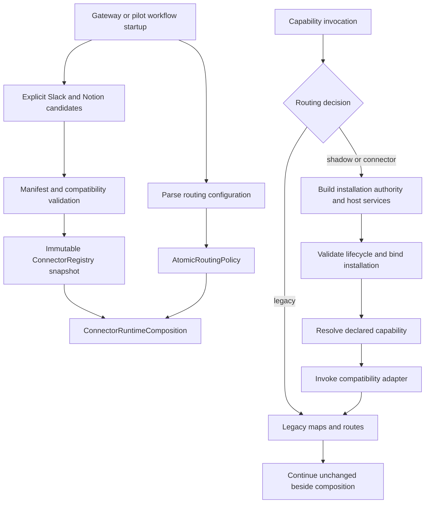
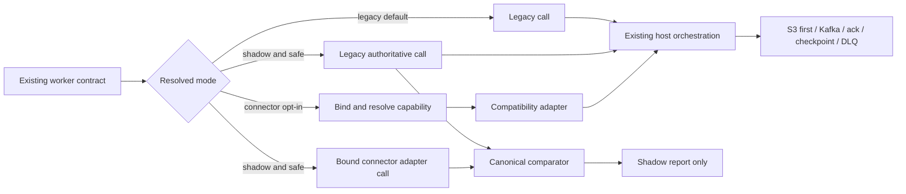
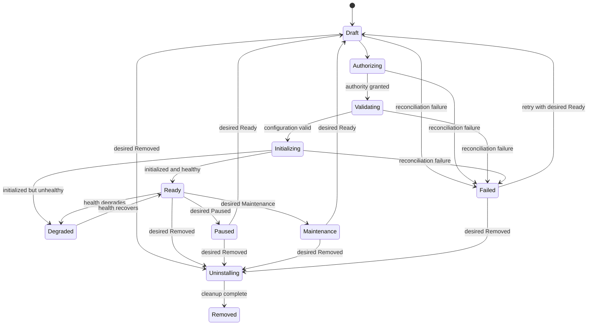

# Phase 2 Source Connector Runtime Implementation Report

## Executive summary

Phase 2 integrates the Fyralis Source Connector Contract into the ingestion
runtime without replacing the legacy ingestion system. Gateway and selected
workflow startup paths now construct one immutable connector registry snapshot
beside the existing dispatch maps. The snapshot contains two representative
compatibility-backed pilots: Slack and Notion. Routing is configuration-driven
and defaults globally to `legacy`, so no installation moves to connector
execution unless an operator explicitly selects `shadow` or `connector` mode.

The implementation adds installation-scoped binding, concrete least-authority
host services, typed runtime failure translation, connector telemetry, desired
and observed lifecycle models, persistence through the existing workflow-state
store, canonical shadow comparison, and atomic configuration rollback. Planner,
fetcher, reconciler, handler/normalization, webhook, identity/polling, and
gateway-stream facets can be resolved from the registry while compatibility
adapters continue to call the existing source code and preserve its public
return shapes.

No legacy registry or dispatch map was removed. No database migration, Kafka
topic, `SourceLiteral`, raw envelope, normalized envelope, checkpoint sequence,
durability rule, retry budget, breaker contract, DLQ behavior, or trust policy
was changed. Host workers remain responsible for S3-first publication, Kafka,
durable checkpoints, tenant selection, retries, rate limits, metrics, and DLQ
handling.

## Objectives completed

- Added a composition root that builds a validated immutable registry snapshot
  alongside legacy runtime state at gateway and pilot workflow startup.
- Added installation-scoped binding after manifest, compatibility, and granted
  authority validation. Missing installation credential grants fail before a
  compatibility adapter or source implementation executes.
- Implemented concrete adapters for governed HTTP, scoped secrets, structured
  logging, bounded metrics, clock, cancellation, read-only state, CAS-backed
  installation data, host-owned raw emission, callback allocation, and leases.
- Added registry-resolved capability execution with `legacy`, `shadow`, and
  `connector` modes. Legacy execution remains the unconditional default.
- Added old-shape execution bridges for historical planning/fetching,
  incremental polling, reconciliation, identity, normalization/handler,
  webhooks, and gateway streaming.
- Added all required lifecycle phases and desired-state reconciliation, plus a
  repository over the existing `workflow_states` JSONB persistence.
- Added typed translation of connector and legacy exceptions while retaining
  retryability metadata and allowing cancellation to propagate correctly.
- Added connector execution telemetry carrying connector ID, capability,
  contract version, connector version, execution ID, registry fingerprint, and
  installation ID without removing legacy metrics.
- Added canonical, non-authoritative shadow comparisons for identity,
  normalization, publication, cursor, and state.
- Added immutable, precedence-based global, connector, capability, tenant,
  tenant/connector, connector/capability, and tenant/capability routing flags,
  with an atomic configuration-only rollback to the legacy default.
- Registered Slack and Notion as the smallest pilot cohort that exercises
  webhook plus historical behavior and incremental polling behavior.
- Added end-to-end parity tests that resolve pilot capabilities through the
  registry, bind an installation, invoke the existing implementation, and
  retain the legacy output shape.

## Runtime architecture implemented

The runtime is split into three dependency layers:

1. `source_contract` remains the dependency-light definition layer introduced
   in Phase 1.
2. `connector_runtime` owns composition, routing, lifecycle, host-service
   enforcement, binding, execution, failures, telemetry, and shadow comparison.
3. `connector_platform` is the compatibility integration layer. It declares
   pilot manifests, adapts existing Fyralis source behavior to capability
   facets, and exposes legacy-shaped worker bridges.

`ConnectorRuntimeComposition` contains an immutable `ConnectorRegistry` and an
`AtomicRoutingPolicy`. Registry construction uses the Phase 1 builder, so
manifest and compatibility validation complete before the candidate factories
are activated. Per-invocation binding uses the persisted installation identity,
its credential evidence, granted platform hosts/scopes, a lifecycle gate, and
installation-scoped host services. Capability code is resolved only after the
binding succeeds.

In legacy mode the executor calls the original code directly and performs no
connector binding. In connector mode it binds, resolves the declared facet, and
invokes the compatibility adapter. In shadow mode the legacy result remains
authoritative; the connector result is optional, compared only when the
operation is explicitly marked safe to duplicate, and never changes production
output.

The worker-facing facade preserves pre-Phase-2 input and output types. The
compatibility facets use an invocation-scoped context rather than mutable global
state, then delegate to the existing dispatch maps, handler functions, webhook
verifier, or injected gateway driver. The old maps remain the implementation
authority during the pilot.

## Files added

### Connector runtime

- `services/ingest/connector_runtime/composition.py`
- `services/ingest/connector_runtime/execution.py`
- `services/ingest/connector_runtime/failures.py`
- `services/ingest/connector_runtime/host_services.py`
- `services/ingest/connector_runtime/lifecycle.py`
- `services/ingest/connector_runtime/policy.py`
- `services/ingest/connector_runtime/shadow.py`
- `services/ingest/connector_runtime/telemetry.py`
- `services/ingest/connector_runtime/tests/test_execution.py`
- `services/ingest/connector_runtime/tests/test_host_services.py`
- `services/ingest/connector_runtime/tests/test_lifecycle.py`
- `services/ingest/connector_runtime/tests/test_policy.py`

### Compatibility integration

- `services/ingest/connector_platform/__init__.py`
- `services/ingest/connector_platform/execution.py`
- `services/ingest/connector_platform/legacy_capabilities.py`
- `services/ingest/connector_platform/legacy_context.py`
- `services/ingest/connector_platform/lifecycle_store.py`
- `services/ingest/connector_platform/pilots.py`
- `services/ingest/connector_platform/routing_config.py`
- `services/ingest/connector_platform/startup.py`
- `services/ingest/connector_platform/workflow_wiring.py`
- `services/ingest/connector_platform/tests/__init__.py`
- `services/ingest/connector_platform/tests/test_capability_bridges.py`
- `services/ingest/connector_platform/tests/test_execution.py`
- `services/ingest/connector_platform/tests/test_lifecycle_store.py`
- `services/ingest/connector_platform/tests/test_pilot_registry.py`
- `services/ingest/connector_platform/tests/test_routing_config.py`
- `services/ingest/connector_platform/tests/test_workflow_seams.py`

### Reporting

- `PHASE_2_IMPLEMENTATION_REPORT.md`

## Files modified

- `services/app/gateway/main.py` — constructs and exposes the immutable pilot
  registry and routing controller during gateway lifespan startup, alongside
  all pre-existing app state.
- `services/ingest/connector_runtime/__init__.py` — exports the Phase 2 runtime
  surface.
- `services/ingest/ingestion/workflows/source_onboarding.py` — adds an optional
  connector planner facade for pilot sources; direct dispatch remains the
  default and remains mandatory for non-pilot sources.
- `services/ingest/ingestion/workflows/shard_fetch.py` — adds an optional
  connector fetch facade before the unchanged host-owned S3/Kafka/checkpoint
  path.
- `services/ingest/ingestion/workflows/reconciler.py` — adds optional pilot
  reconciliation through the facade while retaining the existing reconciler
  registry and behavior.

## New execution flow diagrams

### Startup and binding

### Authoritative, shadow, and connector execution

### Lifecycle reconciliation

## Lifecycle integration

The lifecycle model separates desired state from observed phase. Desired state
supports `Ready`, `Paused`, `Maintenance`, and `Removed`; observed state supports
all required phases: `Draft`, `Authorizing`, `Validating`, `Initializing`,
`Ready`, `Degraded`, `Paused`, `Maintenance`, `Failed`, `Uninstalling`, and
`Removed`. Generation, observed generation, conditions, reasons, messages, and
observation times are explicit.

The controller advances one idempotent reconciliation step from supplied
evidence. Runtime execution is allowed only for `Ready` and `Degraded`
installations. Existing provider installations map compatibly from `enabled`
to `Ready` or `Paused`. Full lifecycle records are persisted under the dedicated
`source_connector_installation` workflow kind using the existing
`workflow_states` JSONB data and existing persistence helpers; no new table,
column, migration, or provider-installation rewrite was introduced.

## Compatibility strategy

The integration is deliberately additive:

- Legacy dispatch maps remain present, populated, and callable.
- The global routing default is `legacy` when configuration is absent or empty.
- Non-pilot sources do not enter the connector executor and call their existing
  dispatch entries directly.
- Pilot connector facets delegate to existing Slack and Notion implementations;
  the source implementations were not rewritten.
- Planner, fetcher, reconciler, normalization/handler, webhook, identity,
  polling, and gateway adapters preserve existing return shapes at their worker
  boundaries.
- Existing worker constructors accept the connector facade only as an optional
  dependency, keeping old call sites and tests valid.
- Publication, cursor advancement, checkpoint ordering, retries, breakers,
  metrics, DLQ behavior, S3/Kafka ownership, and trust decisions remain outside
  connector capability code.
- A single configuration rollback replaces the active routing snapshot with a
  new all-legacy snapshot; no deployment or code change is needed.

## Feature flag strategy

`RoutingPolicy` is an immutable snapshot with these override scopes:

- global;
- connector;
- capability;
- tenant;
- tenant plus connector;
- connector plus capability;
- tenant plus connector plus capability.

Precedence is narrowest to broadest: tenant/capability, tenant/connector,
connector/capability, tenant, connector, capability, then global. Each resolved
decision records its matched scope and policy revision. `AtomicRoutingPolicy`
replaces the process-local snapshot under a lock. `RoutingConfigurationController`
parses JSON configuration, enforces increasing revisions, applies a new snapshot,
and can immediately roll all traffic back to `legacy` through configuration.
Gateway startup exposes this controller on application state. Workflow processes
read the same `SOURCE_CONNECTOR_ROUTING_JSON` configuration at startup.

## Shadow execution strategy

Shadow mode always executes the legacy call first and returns that result. A
second connector-facade call occurs only when the bridge marks the operation
safe to duplicate. This prevents an accidental duplicate remote pull or other
side effect from being enabled merely by selecting shadow mode.

Shadow projections classify comparable data under five dimensions: identity,
normalization, publication, cursor, and state. Values are serialized
canonically, including mappings, sequences, dataclasses, dates/times, UUIDs,
and enums, then hashed for bounded reports. Reports contain dimensions and
digests instead of production payloads. Connector-side shadow failure is
recorded as a typed error and telemetry event but cannot replace the legacy
result or alter production output. The report sink is injected by the host.

## Pilot connector selection and rationale

Slack and Notion are the smallest cohort that exercises materially different
ingress patterns while reusing mature existing implementations.

- **Slack** represents an OAuth-installed source with signed webhook ingress and
  historical planning/fetching. Its pilot manifest exposes historical pull,
  webhook, reconciliation, identity, and normalization facets. The webhook
  parity test executes the existing Slack HMAC verification path through a
  registry-resolved capability.
- **Notion** represents an OAuth-installed HTTP source with historical pull and
  incremental polling. Its pilot manifest exposes historical pull, incremental
  poll, reconciliation, identity, and normalization facets. Parity tests cover
  polling cursor/publication behavior, identity, and normalization.

OAuth installation routes themselves remain legacy in Phase 2. Current
`provider_installations` rows prove that an installation-scoped credential
reference exists but do not reliably attest every historical OAuth scope. The
Slack pilot therefore requests only authority that can be validated from
current persistence rather than claiming unproven scopes. A missing credential
reference rejects binding before source code executes.

## Tests added

The Phase 2 suite adds coverage for:

- immutable composition with Slack and Notion only;
- default legacy routing and every routing scope/precedence level;
- atomic configuration apply and immediate all-legacy rollback;
- binding before capability execution and rejection of missing credential
  authority before adapter execution;
- lifecycle gating, transitions, pause, maintenance, failure, degradation,
  uninstall, removal, and workflow-state round trips;
- governed HTTP host/scheme/redirect/timeout/size constraints;
- secret-slot authorization and secret/log redaction;
- state, installation CAS, emitter, callback, clock, cancellation, metrics, and
  lease host adapters;
- typed failure translation, timeout/cancellation behavior, retryability, and
  connector error preservation;
- complete required telemetry fields on success and failure;
- shadow success, mismatch, connector failure isolation, canonical comparison,
  and unsafe-operation skipping;
- end-to-end registry-resolved planner/fetcher execution through compatibility
  facets;
- Slack signed webhook parity;
- Notion polling, identity, normalization, cursor, and publication parity;
- gateway-stream driver resolution through a bound registry capability;
- workflow seams for pilots and direct legacy behavior for all non-pilot
  sources.

Validation performed:

- Focused Phase 1 and Phase 2 suites: **80 passed**.
- Type checking of `source_contract`, `connector_runtime`, and
  `connector_conformance`: **success across 50 source files**.
- Type checking of the compatibility platform in import-isolated mode:
  **success across 9 non-test source files**.
- Source-contract and runtime import boundaries: **2 contracts kept, 0
  broken**.
- Existing normalization parity suite: **19 passed, 2 pre-existing failures**;
  the failures concern an unchanged GitHub metadata expectation.
- Broader ingestion workflow selection: **32 passed, 88 skipped, 1 pre-existing
  pattern-alignment failure, and 11 collection/setup errors caused by the
  missing optional `moto` dependency**.
- `git diff --check`: clean before the report commit.

The repository-wide Phase 1 baseline remains relevant: 4,080 passed, 2,390
skipped, 22 unrelated failures, and 13 missing-`moto` errors. Phase 2 does not
claim to correct those pre-existing failures.

## Known limitations

- Only Slack and Notion are registered. The other source families continue
  entirely through legacy dispatch.
- OAuth authorization and refresh are not connector capabilities in active
  routes yet; existing OAuth installation flows remain authoritative.
- Current persistence proves a credential reference, not a complete historical
  OAuth-scope grant. Scope attestation needs a durable installation authority
  model before a first-class OAuth cutover.
- Planner, shard fetch, and primary reconciliation workflows have startup seams.
  Handler/normalization, webhook, polling, and gateway compatibility facets are
  registry-resolved and parity-tested, but their production routes remain on
  the legacy default until separately enabled and wired at each ingress owner.
- Workflow routing configuration is read at process startup. The atomic
  controller supports immediate in-process apply/rollback, but fleet-wide live
  propagation still needs an external watcher or control-plane publisher.
- Shadowing remote pull operations is opt-in because executing them twice can
  consume provider quotas or create temporal differences. The default bridge
  marks those calls unsafe until an operator/test explicitly approves them.
- Lifecycle persistence and reconciliation primitives exist, but there is not
  yet a continuously running installation control-plane reconciler that
  gathers all authorization, configuration, health, and cleanup evidence.
- Host-service backends fail closed when no platform callback is supplied. The
  compatibility pilots call existing source code; production first-class
  connectors still need platform secret, raw publisher, state, lease, and
  callback backends wired to the concrete Fyralis infrastructure.
- Compatibility adapters validate the runtime boundary but are not independent
  connector implementations. They intentionally retain dependence on the
  current legacy code and dispatch structures.
- Capability-specific conformance fingerprints and signed artifact provenance
  remain outside Phase 2.

## Risks

- Shadow execution against live providers can double reads and observe a later
  remote state; it must remain explicitly safe per operation and should begin
  with low-volume tenants.
- Process-local flag changes are atomic, but inconsistent fleet configuration
  could route different workers differently until centralized propagation and
  revision observation are implemented.
- Existing installation records do not encode the full requested-versus-granted
  authority model. Treating current secret references and platform allowlists
  as the initial grant is conservative but incomplete.
- Reusing `workflow_states` avoids migration risk but does not provide a
  dedicated indexed installation-status API. Operational querying may require
  a read model before broad rollout.
- Compatibility parity can hide a shared defect because both sides invoke the
  same implementation. First-class pilot implementations and independent
  fixtures will be needed before retiring legacy code.
- The contract remains v1alpha1. Pilot evidence may still reveal pagination,
  state migration, callback, or lifecycle fields that need additive changes.
- A connector-mode flag enables a new invocation boundary even though the
  underlying source code is unchanged. Rollout must still observe latency,
  retry, breaker, quota, and shadow-difference telemetry by tenant and
  capability.

## Remaining work for Phase 3

- Add a control-plane configuration publisher/watcher with fleet-wide revision
  visibility, audit history, staged cohorts, and automated rollback thresholds.
- Wire connector routing into production webhook, normalizer/handler, polling,
  and gateway ingress owners one at a time, preserving their existing delivery
  guarantees.
- Move Slack and Notion OAuth configuration/validation/refresh behind explicit
  capabilities and persist durable granted scopes and secret-slot assignments.
- Connect the host-service factory to production secret management, state/CAS,
  S3-first raw publication, callback allocation, lease, metrics, and logging
  implementations.
- Run staged Slack and Notion shadow cohorts, define parity service-level
  objectives, and collect operational evidence before connector-authoritative
  cutover.
- Add independent behavioral conformance fixtures for bounded pagination,
  identity stability, cursor monotonicity, retry classification, webhook
  verification, normalization, reconciliation, cleanup, and state migrations.
- Add artifact signing/provenance and deployment enablement/quarantine policy.
- Implement the continuous installation lifecycle controller and operator-facing
  status/condition APIs.
- Define connector state codecs and explicit migrations before any first-class
  connector changes persisted state shape.
- Migrate additional source cohorts only after the pilots meet parity and
  operational criteria. Retire a legacy dispatch entry only after its full
  ingress surface has completed that process.

## Suggested review checklist

- [ ] Confirm the immutable registry is constructed beside, not instead of, all
      legacy registries.
- [ ] Confirm absent configuration and explicit rollback both select legacy for
      every tenant, connector, and capability.
- [ ] Confirm non-pilot sources bypass the connector facade.
- [ ] Confirm binding validates manifest/compatibility at startup and granted
      installation authority before executing connector or adapter code.
- [ ] Review the Slack and Notion manifests and verify they request only
      authority current persistence can prove.
- [ ] Confirm host services expose no direct Kafka, S3, database, Redis,
      FastAPI, or tenant-selection infrastructure.
- [ ] Confirm compatibility adapters preserve worker input/output shapes and do
      not own publication, durable cursors, retries, breakers, DLQ, or trust.
- [ ] Review typed failure mappings against existing retry and circuit-breaker
      predicates.
- [ ] Verify all required telemetry fields are emitted for connector/shadow
      execution and legacy metrics remain untouched.
- [ ] Verify shadow mode always returns legacy output and unsafe duplicate calls
      are skipped.
- [ ] Review lifecycle transitions, execution gating, JSONB persistence, and
      recovery after pause/failure/removal.
- [ ] Confirm no schema, topic, source literal, envelope, checkpoint, or
      durability change is present.
- [ ] Review the focused test evidence and the explicitly recorded pre-existing
      repository failures.
- [ ] Approve the known limitations and Phase 3 sequence before any broader
      migration or legacy retirement begins.
