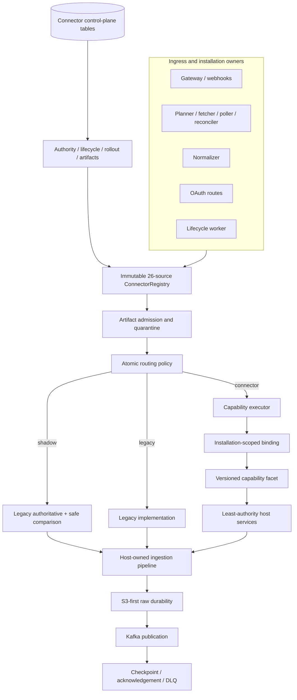
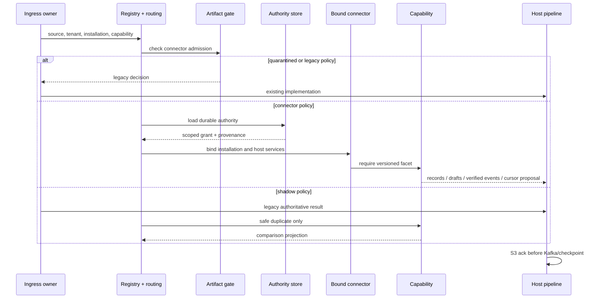
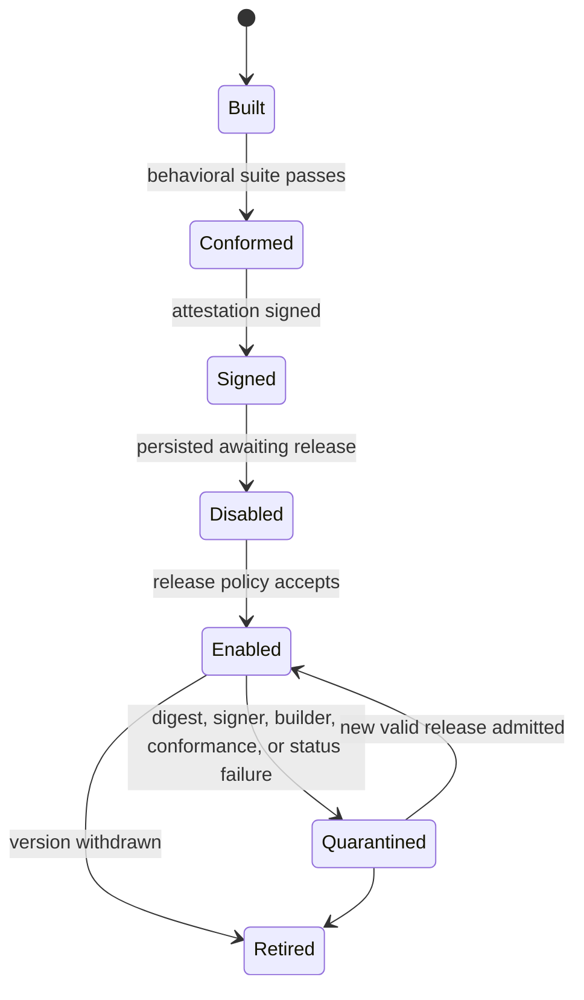
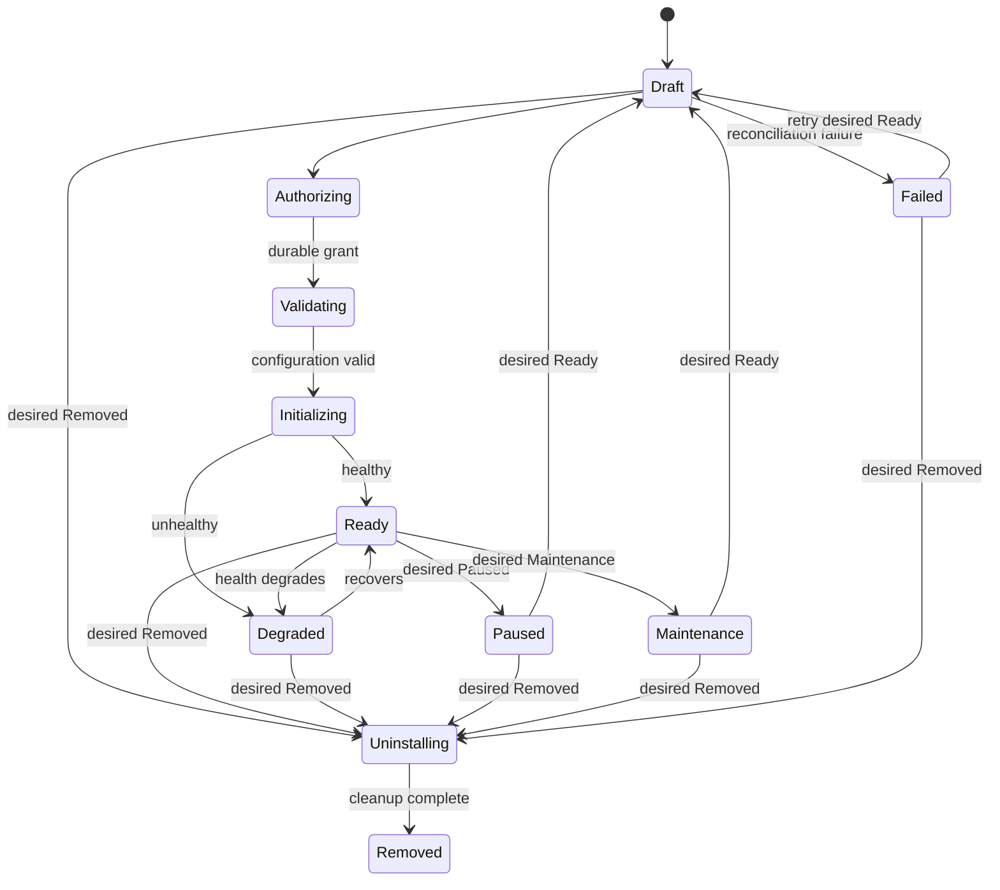
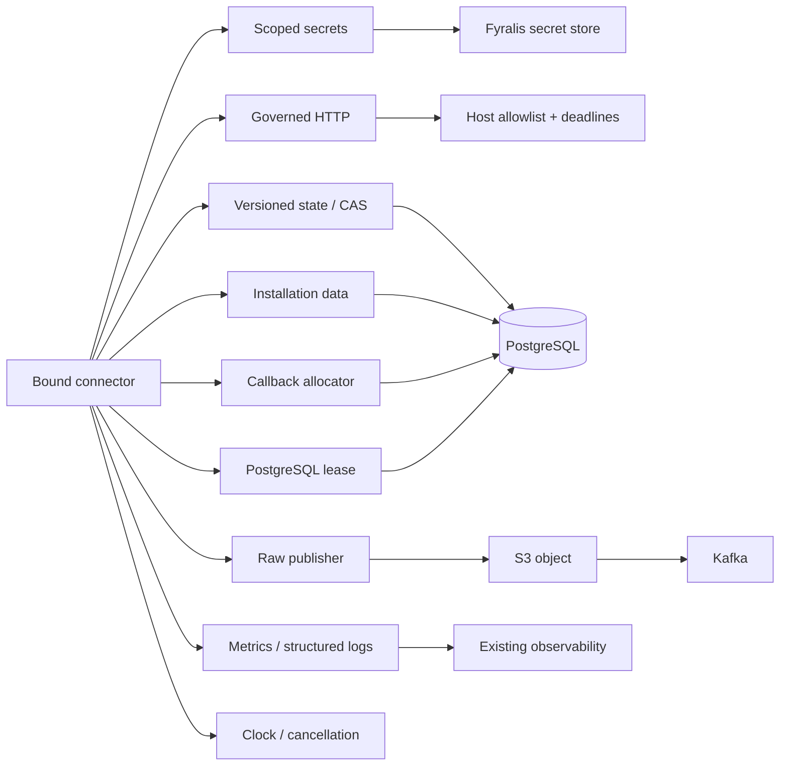
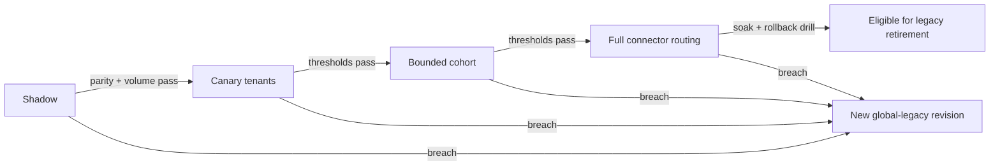

# Phase 3 Source Connector Runtime Implementation Report

## Executive summary

Phase 3 establishes the Source Connector Runtime as the authoritative Fyralis
connector contract, catalog, control plane, installation authority, lifecycle,
routing, rollout, and artifact-admission architecture. The process-local
registry is immutable and contains exactly the 26 source families in the
canonical raw-envelope source literal.

Slack, Notion, and WhatsApp are first-class native connector roots. Their
migrated capabilities default to connector execution and do not call legacy
dispatch maps from their native candidate factories. Slack and Notion own OAuth
authorization, callback exchange, refresh, and revocation through connector
capabilities. WhatsApp owns its live webhook verification, identity,
normalization, health, and cleanup facets. Production binding requires durable
installation authority and least-authority host services.

The remaining 23 source families are conformed compatibility candidates in the
same registry. They remain deliberately legacy-routed. Their direct ingress
owners and dispatch entries have not been deleted because complete behavioral
parity and production rollout evidence do not exist in this workspace. This is
the safety rule required by the architecture, not an accidental dual registry.

The final authority verdict is therefore precise:

- **Yes:** the Source Connector Runtime is the authoritative architecture and
  canonical catalog/control plane for Fyralis source connectors.
- **Yes:** every connector declared migrated in Phase 3—Slack, Notion, and
  WhatsApp—defaults to execution through the runtime for its migrated ingress
  and capability surfaces.
- **No:** all 26 source implementations do not yet execute natively through the
  runtime. Twenty-three intentionally remain legacy-routed compatibility
  entries.
- **Yes:** legacy compatibility code intentionally remains as rollback and as
  the production implementation for non-migrated connectors. No source-specific
  legacy implementation was deleted without evidence.

## Migration summary

Phase 3 added five connected planes:

1. A durable PostgreSQL control plane for installations, authority,
   credential references, installation data, callbacks, artifacts, routing,
   rollout metrics, and audit history.
2. Native connector roots for Slack, Notion, and WhatsApp, with connector-owned
   capability factories and conformance fingerprints.
3. Runtime integration for workflows, webhook/WhatsApp ingress,
   normalization, OAuth, lifecycle, and production host-service binding.
4. Fleet rollout and operational hardening with durable revisions, cohorts,
   thresholds, automatic rollback, signed artifact policy, quarantine, startup
   diagnostics, and health snapshots.
5. One immutable 26-source catalog whose compatibility candidates prove
   structural conformance before registration and safely resolve to legacy.

Implementation commits, in order:

- `3a427298` — `feat(runtime): persist installation authority`
- `b6e7027c` — `feat(connector): migrate Slack and Notion to native roots`
- `40bd8024` — `feat(oauth): add connector-owned OAuth lifecycle`
- `46363e2f` — `feat(runtime): wire production connector host services`
- `7955b421` — `feat(runtime): run continuous installation lifecycle`
- `c1d0df54` — `feat(runtime): route webhook and normalization ingress`
- `34d43bfa` — `feat(connector): gate releases on conformance and provenance`
- `b6c6290e` — `feat(runtime): add fleet rollout control plane`
- `b5912f19` — `feat(oauth): route installation through connector capabilities`
- `9b90b963` — `feat(connector): migrate WhatsApp live ingress`
- `a6f65c00` — `feat(runtime): make connector catalog source authority`
- `152f243b` — `feat(runtime): enforce artifact admission at startup`
- `3b449086` — `docs(connectors): publish runtime and rollout guides`
- `b54f1bb6` — `fix(runtime): enforce connector layer boundaries`
- `fb7d579b` — `feat(runtime): enforce admission across execution owners`

## Connectors migrated

| Connector | Native capabilities | Migrated ingress | Default mode |
| --- | --- | --- | --- |
| Slack | OAuth, OAuth lifecycle, health, cleanup, historical pull, webhook, reconciliation, identity, normalization | Backfill and webhook; planner/fetcher/reconciler/normalizer/OAuth owners use runtime bridges | Connector |
| Notion | OAuth, OAuth lifecycle, health, cleanup, historical pull, incremental poll, reconciliation, identity, normalization | Backfill and poll; planner/fetcher/poller/reconciler/normalizer/OAuth owners use runtime bridges | Connector |
| WhatsApp | Health, cleanup, webhook, identity, normalization | Gateway webhook and normalization | Connector |

Native facets reuse proven provider clients, planners, fetchers, reconcilers,
and handlers where that preserves behavior. They reference those functions
directly behind typed facets; native candidate execution does not resolve the
legacy mutable dispatch maps.

The compatibility cohort is GitHub, Discord, Gmail, Google Calendar, Google
Drive, Jira, Mercury, QuickBooks, Grafana, Telegram, Brex, Ramp, Gusto, Deel,
Fireflies, Signal, AWS, Miro, Figma, Carta, HiBob, Ashby, and LinkedIn. Every
entry has one canonical connector ID, declared ingress kinds, generated
capabilities, conformance evidence, and a legacy default route.

## Legacy components retired

The following were retired from **authoritative use** for migrated connectors:

- Phase 2 Slack and Notion compatibility-backed connector candidates were
  replaced by native connector roots.
- Inferred/in-process authority is no longer accepted by production native
  binding; durable authority records are required.
- Placeholder host-service adapters are no longer used by database-backed
  production workflow and lifecycle wiring.
- Direct Slack/Notion OAuth ownership is wrapped behind connector capabilities;
  native-mode installation and callback routes resolve the registry first.
- Direct Slack webhook and WhatsApp live verification cease to be authoritative
  when connector mode is selected.

No source-specific dispatch map was physically removed. Slack, Notion, and
WhatsApp legacy calls remain reachable for routing rollback. The 23
non-migrated source implementations remain production-authoritative in legacy
mode. The old dispatch maps, provider-specific extension storage, and
compatibility adapters are therefore intentional, not declared dead code.

## Runtime architecture after migration

The contract layer remains independent of FastAPI, PostgreSQL, provider SDKs,
Temporal, S3, and Kafka. The runtime layer does not import provider
implementations or app routes. Fyralis-specific persistence and compatibility
live in `connector_platform`; native connector roots live in `connectors`.

## Final execution flow

Routing precedence is tenant/capability, tenant/connector,
connector/capability, tenant, connector, capability, then global. Missing
configuration is legacy. Artifact quarantine is evaluated before every routing
scope and cannot be overridden by fleet propagation.

## Lifecycle ownership

The continuous controller now owns desired/observed reconciliation over common
installation records. It loads durable authority, binds through the registry,
uses remote health evidence, invokes idempotent cleanup, retires credentials,
revokes authority, and saves transitions behind a generation fence. Artifact
admission is evaluated before lifecycle worker construction, and quarantined
connectors fail lifecycle evidence before binding.

### Connector artifact lifecycle

### Installation lifecycle

Connector execution is permitted only in ready and degraded phases. Removed
records stop reconciling; audit and provenance remain durable.

## OAuth integration

Slack and Notion expose `installation.oauth2/v1` and
`installation.oauth2_lifecycle/v1`. OAuth routes resolve the connector and
routing mode, bootstrap only the minimum authority required to perform the
exchange, bind through production host services, and invoke begin or complete.
The host validates callback state and tenant identity, checks granted scopes
against the manifest, stores secret candidates, persists common installation,
authority, credential, and provenance records, and preserves provider-specific
extension behavior needed by existing workers.

Refresh returns new secret candidates for host-owned rotation. Revocation is an
explicit connector lifecycle operation. Token values never belong in authority
or OAuth result metadata. WhatsApp remains secret-based and does not declare an
OAuth facet.

## Authority model

`source_connector_installations` is the canonical binding and lifecycle
identity. `source_connector_authority_grants` records installation/tenant/
connector identity, authority generation, credential owner, secret slots,
scopes, outbound hosts, trust ceiling, grant/revocation times, and provenance.
`source_connector_credentials` stores only secret references plus state and
generation. Installation data and callbacks are separately generation- and
tenant-scoped.

Binding rejects revoked authority, cross-tenant or cross-connector identity,
and authority older than the installation generation. The manifest is a
maximum request, durable authority is the actual grant, and host services
enforce the intersection. Row-level security is enabled and forced on
tenant-owned control-plane tables.

## Host service integration

Production adapters connect to the existing secret store, CAS-backed connector
tables, S3-first shadow-write path, Kafka acknowledgement, callback records,
database leases, metrics, structured logging, governed HTTP, time, and
cancellation. Permission checks occur before a backend is called. The host
continues to own checkpoint order, retry budgets, circuit breakers, trust
policy, DLQ, and tenant selection.

## Production rollout strategy

Routing revisions are durable, monotonic, staged, and audited. They carry a
stage (`shadow`, `canary`, `cohort`, or `full`), tenant cohort, policy, actor,
and rollback thresholds. Gateway and database-backed workflow processes watch
the active revision. Propagation is audited. Recent metric windows aggregate
executions, failures, parity samples/mismatches, connector/legacy p95 latency,
lifecycle failures, and connector/baseline DLQ rates.

Default thresholds require 100 executions, error rate at most 2%, parity
mismatch rate at most 0.1%, p95 regression ratio at most 1.25, zero lifecycle
failures, and DLQ-rate delta at most 0.1 percentage points. A breach atomically
rolls back the failed revision and creates a newer active global-legacy
revision. Insufficient evidence blocks promotion without forcing rollback.

Full routing is not permission to remove legacy code. Retirement additionally
requires complete ingress migration, production soak, checkpoint/publication
parity, and a successful rollback drill.

## Operational improvements

- Immutable registry with 26 canonical source identities and one registry
  fingerprint per process.
- Static and behavioral conformance before registration, covering pagination,
  cursor monotonicity, identity stability, reconciliation, retries, webhook
  verification, normalization, cleanup, lifecycle, and state migration.
- Ed25519 artifact attestations bound to connector/version, artifact digest,
  manifest digest, conformance fingerprint, builder, source revision, and build
  time.
- Startup artifact admission for gateway and database-backed workflow owners;
  lifecycle admission before binding.
- Fail-closed process quarantine that overrides all routing revisions.
- Durable routing revisions, cohorts, threshold evaluation, audit, and automatic
  rollback.
- Health snapshots covering registry, routing revision, lifecycle phase counts,
  artifact status, and runtime quarantine.
- Layer-neutral webhook verification context, restoring the connector platform
  import boundary.
- Seven operational and development guides added to the MkDocs site.

## Testing performed

The final focused integration command covered contract, conformance, runtime,
platform, gateway lifespan, Slack/WhatsApp routes, webhook ingress, onboarding,
shard fetch, reconciliation, and normalizer tests:

- **346 passed**.
- **97 skipped** because `DATABASE_URL` or Docker-backed infrastructure was not
  available.
- Targeted mypy over 97 connector source/test files: **success, no issues**.
- Python compileall over connector packages: **success**.
- MkDocs strict build: **success**; it reported existing navigation/link notices
  outside the new connector documentation.
- Import architecture: **8 of 9 contracts kept**. Both connector-specific
  contracts pass. The remaining failing `ingest -> app` contract lists
  pre-existing workflow metrics and provider-onboarding imports unrelated to
  Phase 3.
- `git diff --check`: **clean**.

The complete GitHub backfill identity parity file was also run separately: 7
tests passed and 2 failed on the pre-existing expectation that `I_meta` equals
the implementation's `I_meta:opened` (and the equivalent fixture). Phase 3 did
not change that GitHub handler or identity behavior.

The database migration was not executed because no `DATABASE_URL` was
available. Docker-backed Kafka/S3 and database integration tests were not
executed. These are required release-environment gates before production
activation.

## Performance observations

A local in-process microbenchmark on this implementation measured:

- 26-connector cold composition, including compatibility conformance: **8.962
  ms**;
- warm composition median over 50 builds with cached compatibility candidates:
  **2.106 ms**;
- connector routing resolution over 500,000 iterations: **1.355 µs/call**;
- registry source lookup over 500,000 iterations: **0.102 µs/call**.

These numbers show negligible control-plane overhead compared with provider
network I/O, S3, and Kafka. They are not a production load test. Artifact
database queries, binding, secret access, telemetry, and end-to-end throughput
still require measurement in the deployment environment.

## Remaining technical debt

- Twenty-three source families still use compatibility/legacy execution. Their
  planner, poller, webhook/gateway, reconciler, normalizer, handler,
  installation, and lifecycle owners must migrate source by source.
- Legacy dispatch maps and provider-specific installation tables remain. They
  may be removed only after the corresponding source meets retirement gates.
- The stateless normalizer wiring does not load artifact attestations from
  PostgreSQL; it relies on the deployed code artifact, registry conformance, and
  upstream rollout. A distribution mechanism is needed for independent
  admission refresh without violating its no-database boundary.
- Artifact admission is refreshed at process startup for current execution
  owners; a signed, fleet-propagated admission revision/watch mechanism would
  shorten revocation time without restarts.
- Native roots still reuse proven in-repository provider functions. Further
  packaging or RPC isolation can happen after behavioral migration, not before.
- Production database migration, signed release records, metric-window writers,
  and rollout evidence were not available in this workspace.
- Pre-existing ingest-to-app import violations and the GitHub external-ID parity
  failures remain outside this phase.

## Risks

- Enabling `SOURCE_CONNECTOR_REQUIRE_SIGNED_ARTIFACTS` before trusted signer keys
  and attestations are deployed will quarantine all candidates and force legacy
  routing. This is fail-safe but operationally visible.
- Leaving signed artifacts optional in production weakens provenance policy;
  production configuration must explicitly require them.
- A common control-plane migration or authority-backfill defect can prevent
  native binding. Legacy rollback must remain available during rollout.
- Dual paths may drift while 23 sources remain non-native. Conformance and
  parity evidence must be renewed with each source migration.
- Database and Docker integration paths were skipped locally, so release gates
  must prove RLS, transaction fencing, S3/Kafka acknowledgement, lifecycle, and
  fleet propagation under real infrastructure.
- A global automatic rollback minimizes blast radius but can roll back healthy
  connector traffic alongside a failing cohort; narrower rollback policy is a
  future operational refinement.

## Future enhancements

- Migrate the remaining 23 sources in evidence-backed cohorts and delete each
  legacy entry only after its complete ingress surface has soaked in production.
- Add a durable artifact-admission revision watcher usable by stateless workers
  without granting general database access.
- Add release tooling that builds, signs, verifies, enables, quarantines, and
  retires artifacts through an audited operator API.
- Add production dashboards and alert rules for propagation lag, quarantine,
  lifecycle conditions, parity, latency, DLQ delta, and authority failures.
- Add database/Kafka/S3 end-to-end tests to the required CI release gate and
  retain migration/rollback evidence artifacts.
- Add per-connector automatic rollback to reduce global blast radius.
- Introduce RPC-isolated execution for higher-risk third-party connectors after
  the in-process native contract is fully proven.
- Remove compatibility candidates, dispatch maps, duplicate registration paths,
  and provider-specific lifecycle ownership only after the final connector has
  met the documented retirement criteria.

