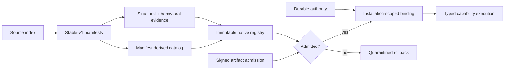
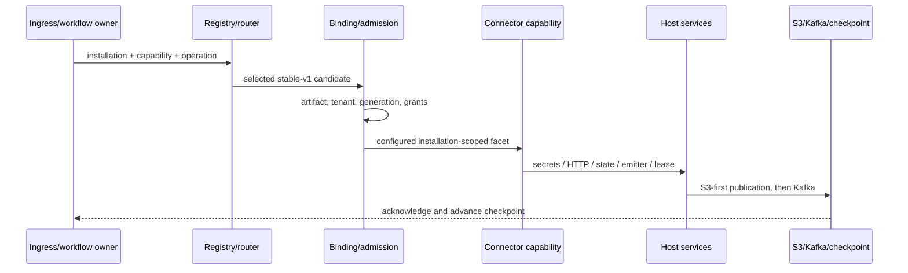
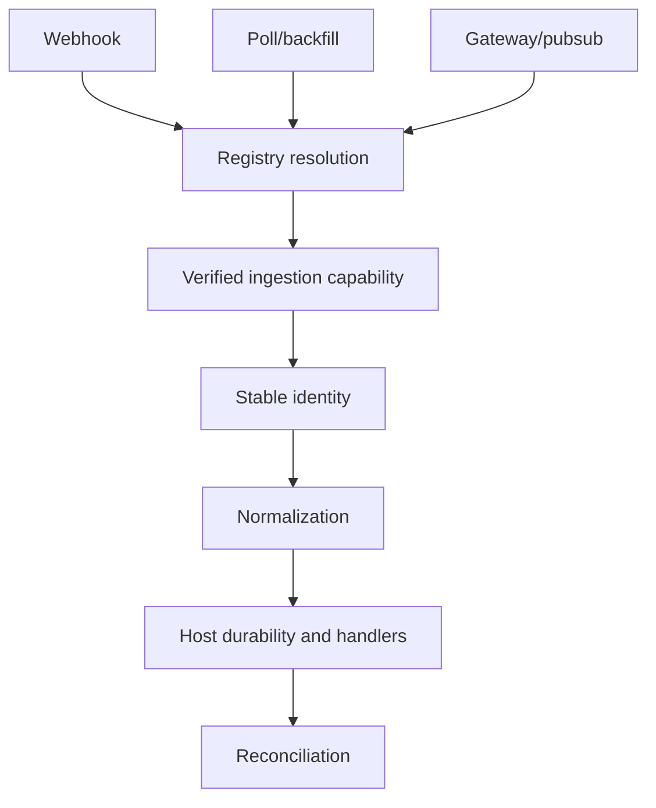
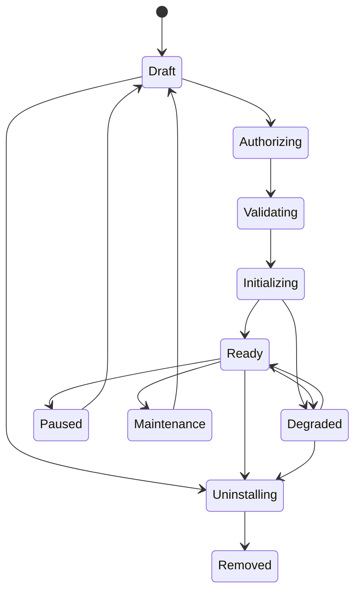
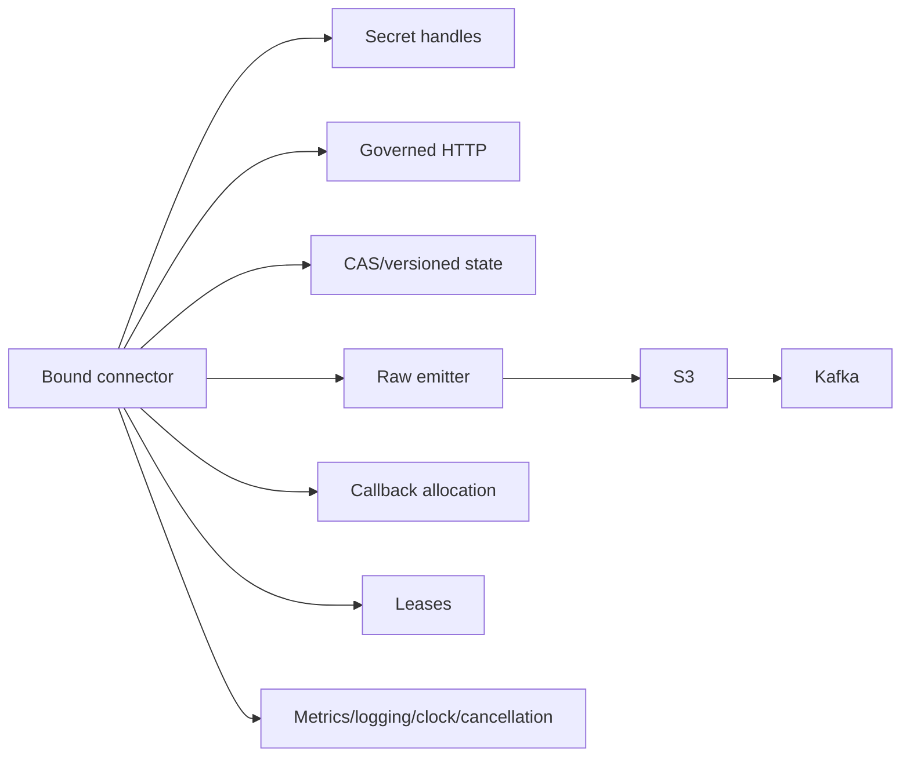

# Phase 3 Source Connector Stable-v1 Fleet Implementation Report

Date: 2026-08-03
Status: repository implementation complete; controlled production acceptance required
Scope: all 26 Fyralis ingestion source families

## Executive summary

Phase 3 makes the Source Connector Runtime the normal definition and execution
architecture for the first-party fleet. All 26 sources are represented by
checked-in `sources.fyralis.io/v1` manifests at connector major `1`, declared
stable, resolved to connector-local factories, admitted against independent
structural and behavioral evidence, and selected by the default native routing
policy.

The manifest catalog is now the connector-definition authority. Source identity
is owned by a generated/validated source index rather than the Python envelope
literal, and release validation proves exact inventory and ingress wiring across
the source index, manifests, catalog, candidates, channels, and handlers.

This completion does not fabricate live production evidence. Signed artifact
admission, tenant installation authority, staged rollout, resilience evidence,
and retirement evidence remain deployment gates. The old execution path is
retained only as a fail-closed quarantine and emergency rollback callable until
each surface has accepted production retirement evidence.

## Migration summary

Phase 3 delivered six connected changes:

1. A 26-source native stable-v1 fleet and manifest-derived catalog.
2. Availability/configuration semantics for capability declarations and
   installation-scoped least-authority construction.
3. One source-identity index consumed by raw envelopes, Kafka, S3, manifests,
   and fleet validation.
4. Explicit state-schema migrations, mixed-worker compatibility, downgrade
   policy, and replay certification storage.
5. Fleet resilience, observability, SLO, capacity, rollback, and retirement
   evidence contracts.
6. Migration `0189_source_connector_stable_v1.sql`, which imports existing
   source installation identities and secret references into the common control
   plane and adds stable-v1 evidence/state fields.

## Connectors migrated

The native registry contains these 26 source families:

- Collaboration and communication: Slack, Discord, Telegram, Signal, WhatsApp.
- Developer and operations: GitHub, Jira, Grafana, AWS.
- Google workspace: Gmail, Google Calendar, Google Drive.
- Knowledge and design: Notion, Miro, Figma.
- Finance and equity: Mercury, QuickBooks, Brex, Ramp, Carta.
- People and recruiting: Gusto, Deel, Fireflies, HiBob, Ashby, LinkedIn.

Slack, Notion, and WhatsApp retain their dedicated connector-local
implementations. The remaining 23 use immutable connector-local provider wire
profiles and shared native capability machinery. That machinery depends only on
the public source contract and host ports; it does not call legacy planners,
fetchers, integrations, normalizers, handlers, platform modules, or application
runtime code.

## Legacy components retired

Retired as architectural authority:

- compatibility candidate construction for the remaining 23 sources;
- legacy-by-default fleet bootstrap;
- manually maintained `CONNECTOR_CATALOG` entries;
- `RawEnvelope.SourceLiteral` as the source inventory owner;
- registration of unavailable or unconfigured capability facets;
- production imports of the old `build_runtime_candidates` naming in startup,
  workflow, and lifecycle composition.

Intentionally retained:

- the legacy execution callable used by artifact quarantine, shadow comparison,
  and emergency rollback;
- compatibility aliases for older internal builder names while callers migrate;
- source-specific storage that still contains provider extension data.

Those retained pieces have no manifest/catalog/registration authority. Physical
deletion is permitted only after one accepted
`source_connector_retirement_evidence` record per surface.

## Runtime architecture after migration

The runtime is deterministic and in-process. Arbitrary dynamic or third-party
code loading was not added. Out-of-process marketplace support remains a future
implementation of the same logical contract.

## Final execution flow

Provider code decodes source behavior and returns typed results. The host still
owns tenant selection, request bounds, durable publication, acknowledgement,
checkpoint order, retries, circuit breakers, DLQ, telemetry, leases, and
process lifecycle.

## Ingress flow

Fleet validation rejects a declared ingress kind that cannot resolve to both a
channel and handler. Runtime owners consume the admitted artifact and durable
installation authority rather than constructing a second candidate inventory.

## Installation lifecycle ownership

The continuous controller owns desired/observed transitions, health,
degradation, maintenance, idempotent cleanup, credential retirement, authority
revocation, and removal. Installation records now also persist state schema,
accepted mixed-worker schemas, and replay certification.

## OAuth and credential integration

OAuth-capable connectors use explicit authorization and lifecycle facets.
Callback state and tenant checks remain host-owned; connector results contain
secret candidates, not persisted token values. Durable authority records own
granted scopes, credential owner, permitted slots/hosts, trust ceiling, and
provenance. Rotation verifies a pending handle before atomic promotion; revoked
or ungranted credentials fail binding or execution closed.

Sources whose existing storage does not contain transferable per-installation
secret references import into `Maintenance` with
`requires_reauthorization=true`. Only non-null credential references become
granted slots. Migration alone is never treated as proof that a credential
exists.

## Authority model

Capability availability and configuration are separate:

- `available` decides whether discovery registers the declared facet;
- `configuredBy` lists manifest-declared secret slots needed to construct the
  facet for one installation;
- durable grants are intersected with manifest permissions and trust ceiling;
- a required capability cannot be declared unavailable;
- configured slots outside manifest permissions are rejected at load time.

This closes the former gap where a catalog declaration could be interpreted as
both implementation presence and installation permission.

## Host service integration

All provider access is mediated by the authority-scoped host surface. Native
fleet code has an import ratchet preventing dependencies on the legacy
ingestion/integration/platform/application implementations.

## Version and state evolution

The manifest API and connector major are stable v1. Contract, connector,
capability, envelope, and state versions remain independent. State migration is
deterministic and advances one schema edge at a time. Mixed workers must share a
connector major and explicitly accept the stored state schema. Downgrade is
forbidden by default and allowed only across declared reversible edges.

## Production rollout strategy

The default policy prefers connector execution, but admission and rollout are
still fail-closed. Production activation requires:

1. current signed measured-artifact admission;
2. complete tenant installation authority and configured capability grants;
3. shadow evidence where duplication is safe;
4. named canary and bounded cohorts;
5. error, parity, latency, lifecycle, and DLQ thresholds;
6. configuration-only rollback and quarantine drills;
7. current resilience and replay evidence for the exact version and region;
8. a production soak before legacy retirement.

The durable controller propagates monotonically increasing routing revisions,
records process adoption, evaluates bounded events, and creates a newer legacy
revision on a threshold breach.

## Operational improvements

- Fleet dashboard for throughput, error, latency, lifecycle, quarantine, and
  control-plane health.
- Prometheus recording rules and alerts for quarantine and control failures.
- Version-bound resilience evidence for provider throttle/outage, lease loss,
  cancellation, rotation, revocation, poison payload, multi-region failover,
  and disaster-recovery replay.
- Service-level objectives and explicit platform/source/security/SRE ownership
  in the operations runbook.
- Durable retirement evidence with parity acceptance, evidence reference, and
  rollback owner.

## Testing performed

- Final database-backed source contract, conformance, runtime, connector, and
  platform suite: 209 passed with no skips.
- Native-fleet tests: 71 passed across stable-v1 identity, forbidden imports,
  configured-facet withholding, provider 429/503 retryability, revoked
  credentials, and poison payload fail-closed behavior.
- Release gate: all 26 candidates passed stable-v1 fleet validation,
  generated/validated wiring, structural and behavioral evidence, measured
  artifact checks, native bootstrap policy, and signed fail-closed admission.
- Fresh PostgreSQL 16 + pgvector replay: all 189 core migrations applied;
  migration `0189` was then reapplied successfully to prove idempotency and its
  state/evidence schema was queried explicitly. Populated Jira, Discord, Gmail,
  and GitHub fixtures also proved actual-slot grants and safe Maintenance
  backfill for credentialless rows.

The user explicitly deferred full CI. Focused architecture ratchets, import
contracts, compilation, JSON validation, and diff hygiene are part of final
handoff verification.

## Performance observations

No unsupported production performance claim is made. The shared profile-driven
implementation bounds provider pages, reuses the host's existing retry,
breaker, publication, and checkpoint path, and does not introduce dynamic code
loading. Rollout requires p95 no worse than 1.25 times the accepted source
baseline and at least 99.9% successful eligible executions over the agreed
window. Live capacity and provider-rate-limit observations must come from the
target environment before retirement.

## Remaining technical debt and operational gates

- Execute live-provider sandbox/canary certification for each enabled source,
  especially specialized protocols such as AWS signing and gateway/session
  sources, before enabling its artifact in production.
- Populate version- and region-specific resilience rows from actual failover and
  disaster-recovery drills; the repository supplies the enforceable contract,
  not invented operational receipts.
- Complete each source's production soak and delete emergency dispatch surfaces
  only after durable retirement acceptance.
- Remove compatibility builder aliases after all internal callers have moved to
  the fleet names.
- Out-of-process, marketplace, third-party, and sandboxed execution remain
  optional future work.

These items do not require another connector architecture. They are controlled
release, provider certification, deprecation, or optional extension work.

## Risks

- Provider API/schema changes can invalidate a wire profile despite local
  deterministic evidence. Signed admission and canary rollout must remain on.
- Imported installations without usable secret references cannot execute
  natively and must stay validating/quarantined until reauthorized.
- Removing rollback code before full ingress and soak evidence would eliminate
  the safest recovery path.
- A stateless process without current signed admission/authority state must
  continue to fail closed.

## Future enhancements

- Generate deployment capacity hints from manifest runtime profiles.
- Add isolated RPC workers that implement the same stable logical contract.
- Add marketplace governance, third-party signing, and sandbox policy only
  after separately approved threat modeling.
- Automate retirement pull requests from accepted durable retirement evidence.

## Commits

- `56a10f6d feat(connectors): harden legacy-safe release foundation`
- `24886f65 feat(connectors): complete native pilot operations`
- Phase 3: the commit containing this report, summarized in
  `SOURCE_CONNECTOR_FINAL_SUMMARY.md` and the final handoff.

## Final confirmation

The Source Connector Runtime is now the authoritative first-party definition
and normal execution architecture in the repository. All 26 admitted candidates
execute through it and receive only contract host services. No compatibility
candidate remains. Legacy execution code intentionally remains as a fenced
quarantine/emergency rollback surface until production retirement evidence
permits its source-by-source deletion.
