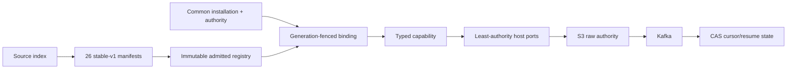

# Phase 3 Source Connector Contract-Only Implementation Report

Date: 2026-08-04
Status: repository implementation complete; database/live-provider certification remains deployment work
Scope: all 26 Fyralis ingestion source families

## Executive summary

Phase 3 now completes the architectural end state rather than retaining a dual
runtime. The Source Connector Runtime is the only source definition,
installation, binding and execution model. All source ingress/workflow owners
resolve typed capabilities from the manifest-derived immutable registry and the
common installation control plane.

The prior emergency legacy and shadow paths were removed because Fyralis is not
yet in production and availability continuity was explicitly waived for this
cutover. Artifact rollback still exists, but quarantine or invalid authority
fails closed; it does not select source-local code.

## Completed work

### 1. Contract-only execution foundation

- Kept stable-v1 manifest, registry, conformance, artifact and version
  contracts as the sole definition authority.
- Removed legacy/shadow modes and fallback callables from execution policy.
- Reduced authority to manifest permissions while allowing partial credential
  configuration; capability factories are withheld until their declared slots
  exist.
- Preserved installation generation fences through workflow execution and
  synchronized active authority generations during lifecycle mutations.

### 2. REST and OAuth sources

- Added explicit provider-owned REST factories with governed HTTP, pagination,
  cursor, identity, normalization, reconciliation and webhook behavior.
- Retained connector-owned OAuth facets for Slack, Notion and QuickBooks,
  including begin, callback exchange, refresh/revocation and secret candidates.
- Added one common configuration ingress for API key, Basic, token, passcode,
  session and manual OAuth-token sources.
- Enforced manifest secret slots/namespaces, cross-tenant collision checks,
  scope/slot validation, secret-store persistence and incomplete OAuth
  `Maintenance` state.

### 3. Google watch and Pub/Sub

- Implemented Gmail history cursor and watch lifecycle.
- Implemented Calendar sync tokens/watch channels and Drive changes/start page
  tokens/watch channels.
- Added host callback allocation, nonce/channel validation and subscription
  state CAS.
- Routed OIDC-authenticated Gmail Pub/Sub and Google watch callbacks into
  contract incremental polling and host raw emission.
- Replaced six source-specific Google poll/watch launchers with one subscription
  scheduler and the generic poll worker.

### 4. Gateway/session sources

- Implemented the gateway capability for Discord, Telegram and Signal.
- Added Discord identify/resume/heartbeat behavior, Telegram long-poll session
  semantics and Signal governed WebSocket sessions.
- Persisted resume state only after raw publication and owned sessions through
  one generic supervisor with stop/retry/lease behavior.
- Removed dedicated gateway workers and their source-local runtime ownership.

### 5. AWS and specialized authentication

- Implemented CloudTrail LookupEvents planning, polling and pagination.
- Built AWS Signature Version 4 inside the connector using scoped secret
  handles, optional session token and region-namespaced installation data.
- Routed all other specialized API-key, service-token, Basic, passcode and
  gateway credentials through manifest-declared common configuration and secret
  rotation.

### 6. Runtime owner cutover

- Mounted the common install router and installation-scoped source webhook
  route.
- Routed onboarding plan/fetch/reconcile/normalize through
  `ConnectorExecutionRouter`.
- Added generic poll, Google subscription and gateway processes to Compose and
  the canonical process manifest.
- Updated Prometheus and PgBouncer topology checks.
- Migrated local document raw emission to the common host-owned emitter.
- Kept only the generic tenant feature-flag service needed by unrelated platform
  extensions; removed source cutover flags and circuit-breaker routing code.

### 7. Legacy deletion

Removed source-specific:

- `services/ingest/integrations/**`;
- planner, fetcher and reconciler registries/implementations;
- ingestion source handlers and central channel mapping;
- webhook signature verifiers, provider install resolver and source router
  tests;
- dedicated installation management and source launch scripts;
- source synthetic/mock/spammer/validation harnesses tied to deleted paths;
- the unused central `lib/integrations/endpoints.py` dispatch;
- compatibility candidates, pilot registry, legacy context/execution and shadow
  modules.

Linear and Stripe billing webhook code remains because those are application
product channels, not the 26 ingestion sources.

### 8. Migration 0230

The final migration:

- adds common connector installation linkage to onboarding triggers;
- backfills then drops provider/Gmail onboarding references and indexes;
- imports Google/AWS extension configuration into common namespaced data;
- marks imported specialized rows requiring repair as `Maintenance`;
- rewrites routing revisions to connector-only and adds rejection constraints;
- removes parity/legacy rollout columns/events and dual-runtime retirement
  evidence;
- updates operator lifecycle audit actions.

The migration is intentionally destructive with respect to the old runtime
because the system is pre-production.

### 9. Tests, evidence and documentation

- All 26 connectors pass structural and behavioral conformance and the release
  evidence gate.
- The common lifecycle gate proves status/pause/resume/maintenance/uninstall for
  every manifest source.
- Install ingress tests cover Slack OAuth/common callbacks and AWS specialized
  configuration.
- Webhook integration covers Slack signature verification plus S3/Kafka raw
  emission through the contract.
- Runtime tests cover connector-only policy, quarantine, authority, configured
  capabilities, lifecycle and process topology.
- Stale tests importing deleted source code were removed or converted to the
  contract/non-source boundary; repository-wide test collection is clean.
- Architecture, runtime, development, migration, rollout, operations and final
  summary documentation now describe contract-only behavior.

## Current architecture

Quarantine, stale authority, missing credentials or an unavailable lifecycle
state stops at binding/execution. No branch leaves this graph for a second source
implementation.

## Verification

- Repository-wide collection: 4,924 tests, zero errors.
- Final focused suite: 133 passed, 9 skipped because `DATABASE_URL` is absent.
- Release gate: passed for all 26 stable-v1 native candidates.
- Lifecycle contract gate: passed for all 26 sources.
- Python compilation: passed for services and scripts during cutover validation.

No live database replay was possible in the final pass because no database URL
was configured. Ruff is not installed in the local virtual environment. Full CI
was explicitly not required by the user.

The general technical-debt ratchet remains red on 13 unchanged, non-connector
baseline mismatches already present on this branch. The cutover-modified shard
fetch loop is under its ratchet; no unrelated budget was raised as part of this
work.

## Remaining deployment work

The following are deliberately outside repository implementation completion:

- run migration `0230` against a disposable PostgreSQL/pgvector database and a
  staging clone;
- configure and verify real OAuth applications/provider sandboxes;
- reauthorize imported `Maintenance` installations;
- certify Google Pub/Sub/watch endpoints, AWS roles/keys and gateway sessions;
- populate valid signed artifact admission records in the target environment;
- run normal lint/CI and infrastructure S3/Kafka/load tests before production.

These are environment and release-certification tasks. They do not require a
legacy source architecture.

## Final confirmation

The repository has one authoritative Source Connector architecture for all 26
ingestion sources. A new source now adds a source-index entry, manifest,
connector factory/capabilities and conformance evidence; it does not modify
runtime routing or add a source-specific worker.
