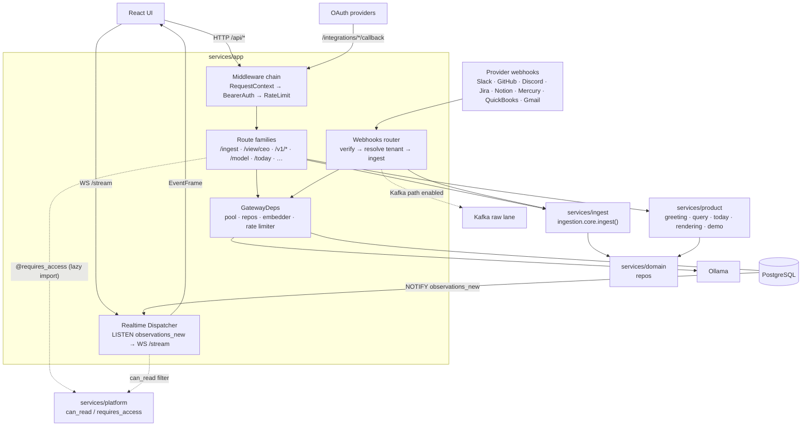

# App — Gateway & Transport

> Source: `services/app/` (packages `gateway`, `webhooks`, `realtime`).
> Part of the [architecture overview](index.md).

**One-line:** the HTTP/WS edge — it terminates every request, authenticates and
rate-limits it, and dispatches into the ingest, product, and reasoning layers;
it also ingests provider webhooks and fans realtime state out to the UI.

## Responsibilities

The gateway (`services/app/gateway/main.py`, built by `build_app()`) is the sole
HTTP entrypoint. It owns:

- **A three-stage middleware chain** (executed in this order):
  `RequestContextMiddleware` (assigns a `request_id`, binds tenant/actor to
  structlog, records access summaries) → `BearerAuthMiddleware` (validates
  `Authorization: Bearer <token>` against `actor_sessions`, populates
  `request.state.auth`, and on demo/public routes injects `X-Tenant-Id`) →
  `RateLimitMiddleware` (per-`(tenant, actor)` token bucket; `/ingest/*` gets a
  higher tier). A fixed set of public path prefixes (`/healthz`, `/auth/session`,
  `/view/ceo/*`, `/rendering/*`, `/webhooks/*`, `/integrations/*/callback`,
  `/v1/demo/*`, `/debug/*`, …) bypass auth.
- **Route registration + mounted routers**: the core ingest/auth/substrate
  routes plus mounted routers for demo, decision-deltas, forecasts, model/trace,
  history, webhooks, OAuth integrations, GitHub-intel, and (dev/test only)
  finance, Slack-DM, simulation, and debug.
- **A dependency lifecycle** (`_lifespan`): creates/owns the asyncpg pool
  (codecs for JSON/vector), constructs `GatewayDeps` (repos, optional Ollama
  embedder, rate limiter), wires the CEO-view stack, starts the realtime
  dispatcher, sweeps stale OAuth install-states, and — when
  `KAFKA_BOOTSTRAP_SERVERS` is set — wires the ingestion data-plane producer.
- **Webhook ingress** (`services/app/webhooks/router.py`): captures raw bytes,
  verifies the per-provider signature, resolves the tenant
  (`provider_installations` via the IN-08 tenant resolver + envelope-encrypted
  secret store), then either calls ingest **inline** or, when the tenant has the
  Kafka path enabled, publishes to the `ingestion.raw` lane (202) with graceful
  fallback to inline on any failure.
- **Realtime dispatch** (`services/app/realtime/`): a single per-process
  `Dispatcher` holds a dedicated asyncpg `LISTEN` on `observations_new` and fans
  events out to subscribed WebSocket clients over `WS /stream`, with per-client
  bounded queues (drop-oldest backpressure + a `stream_lagged` control frame) and
  cursor-based replay (`realtime_replay_cursors`).

## How it's wired

## Key modules

| Module | Path | What it does |
|--------|------|--------------|
| Gateway app factory | `services/app/gateway/main.py` | `build_app()`, middleware, route registration, lifespan, CEO-view wiring. |
| Bearer auth | `services/app/gateway/auth.py` | Token validation against `actor_sessions`, `AuthContext`, session minting. |
| DB bootstrap | `services/app/gateway/db_bootstrap.py` | asyncpg pool creation + JSON/vector codec registration. |
| Rate limiter | `services/app/gateway/rate_limit.py` | Per-`(tenant, actor)` token bucket, ingest vs. default tiers. |
| Realtime entry | `services/app/realtime/main.py` | `WS /stream`, subscription protocol, cursor persistence. |
| Dispatcher | `services/app/realtime/dispatcher.py` | Process-wide `LISTEN` → WS fan-out with backpressure. |
| Webhook router | `services/app/webhooks/router.py` | Multi-provider ingress, signature verify, tenant resolve, inline/Kafka cutover. |
| Tenant resolver | `services/app/webhooks/tenant_resolver.py` | `(provider, installation)` → tenant via `provider_installations` (cached). |
| Secret store | `services/app/webhooks/secrets.py` | IN-08 envelope-encrypted `secret_ref`, dev env-var fallback. |
| Gmail Pub/Sub | `services/app/webhooks/gmail_pubsub.py` | Gmail push-notification ingress (separate from the HTTP webhook router). |

## Entry points

- `uvicorn services.app.gateway:app` — the ASGI app (factory `build_app()`).
- `WS /stream` — realtime subscription endpoint.
- `POST /ingest/{channel}` — uniform signal ingestion (→ `ingestion.core.ingest()`).
- `POST /webhooks/{provider}/*` — provider webhook ingress.
- `GET/POST /view/ceo/*`, `/v1/demo/*`, etc. — product surfaces (see [Product](product.md)).

## Dependencies

**Inbound** *(verified)*: the React UI (HTTP + WS), external provider webhooks,
OAuth callbacks, and test harnesses (`build_app()` with injected deps).

**Outbound** *(verified)*: `services.ingest.ingestion.core.ingest()`; the
`services.domain` repos; the mounted `services.product` subsystems; PostgreSQL
(asyncpg); Ollama (optional embedder); Kafka raw lane + S3 (full-pipeline mode).
*Inferred:* external LLM providers are reached **through** product/reasoning, not
by the gateway directly.

**Data stores touched:** `observations`, `actor_sessions`, `view_ceo_cache`,
`view_render_costs`, `provider_installations`, `oauth_install_states`,
`realtime_replay_cursors`, plus the substrate tables read by mounted routers.

## Design rationale

> **TODO(human):** The code shows *what* but not *why* for several choices:
>
> - Why the CEO-view routers (rendering/greeting/query) are mounted **in-process**
>   in the gateway rather than run as separate services — and the failure-isolation
>   trade-off that implies.
> - Why the realtime dispatcher uses **drop-oldest** backpressure (preserving
>   "latest state") instead of a per-topic priority queue.
> - Whether bearer-token auth is the final scheme or a pre-"Wave 5" placeholder
>   (the code references a future auth wave).
> - Why the gateway owns the embedder (Ollama client) rather than centralizing it.
