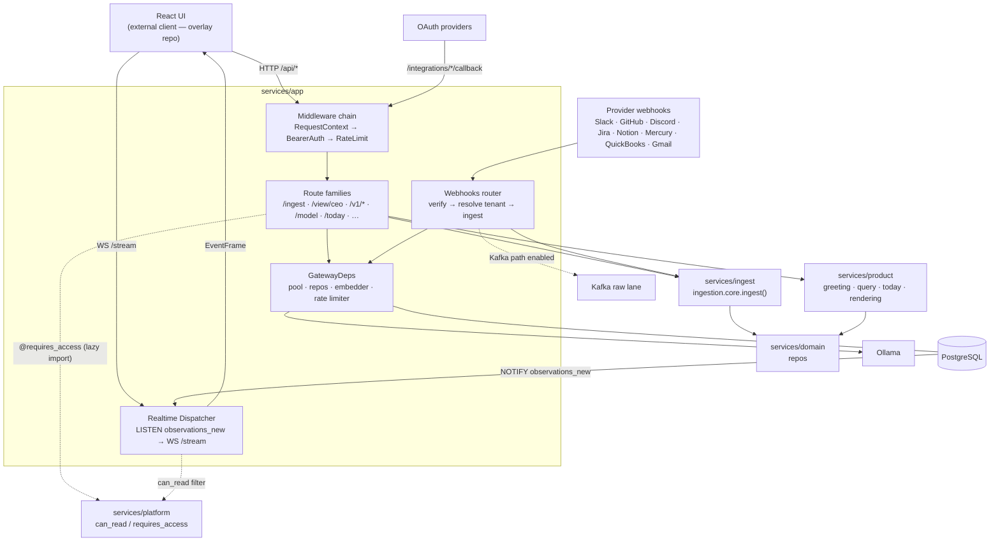

# App — Gateway & Transport

> Source: `services/app/` (packages `gateway`, `webhooks`, `realtime`).
> Part of the [architecture overview](index.md).

**One-line:** the HTTP/WS edge — it terminates every request, authenticates and
rate-limits it, and dispatches into the ingest, product, and reasoning layers;
it also ingests provider webhooks and fans realtime state out to the UI.

## Responsibilities

The gateway (`services/app/gateway/main.py`, built by `build_app()`) is the sole
HTTP entrypoint. Route implementations live in focused routers; the app factory
owns:

- **A three-stage middleware chain** (`services/app/gateway/middleware.py`,
  executed in this order):
  `RequestContextMiddleware` (assigns a `request_id`, binds tenant/actor to
  structlog, records access summaries) → `BearerAuthMiddleware` (validates
  `Authorization: Bearer <token>` against `actor_sessions`, populates
  `request.state.auth`, and on demo/public routes injects `X-Tenant-Id`) →
  `RateLimitMiddleware` (per-`(tenant, actor)` token bucket; `/ingest/*` gets a
  higher tier). A fixed set of **core** public path prefixes (`/healthz`,
  `/metrics`, `/auth/session`, `/view/ceo/*`, `/rendering/*`, `/webhooks/*`,
  `/integrations/*/callback`, `/debug/*`, `/finance/*`, `/slack/*`, and the
  BYOC control-plane intake prefix `/byoc/control-plane/*`) bypass actor-session
  auth. BYOC intake routes self-authenticate with signed payload contracts.
  Overlay public prefixes (e.g. `/v1/demo/*`, `/simulation/*`) are **not**
  hardcoded here — they are contributed at runtime by an installed gateway
  extension (see below).
- **Route registration + mounted routers** (`services/app/gateway/route_mounts.py`):
  core/auth/ingest, substrate, contest, dashboard, Sage internal,
  recommendations, Today core/artifacts, Structure, Map, decision-deltas,
  forecasts, model/trace, history, webhooks, OAuth integrations, GitHub-intel,
  and env-gated finance, Slack-DM, and debug surfaces.
- **An extension seam** (`services/app/gateway/extensions.py`, entry-point group
  `company_os.gateway_extensions`): the gateway discovers installed extensions and
  lets each contribute routers, startup hooks, and additional public path
  prefixes. The demo/simulation surfaces — including the `/v1/demo/*` routers, the
  Pelago seed, and the simulation mount — live in the separate **fyraliscore-demo**
  overlay repo and plug in here; they are present only when that overlay is
  installed. Core imports nothing from the overlay.
- **A dependency lifecycle** (`_lifespan`): creates/owns the asyncpg pool
  (codecs for JSON/vector), constructs `GatewayDeps` (repos, optional Ollama
  embedder, rate limiter), wires the CEO-view stack, starts the realtime
  dispatcher, sweeps stale OAuth install-states, delegates CEO-view wiring to
  `services/app/gateway/ceo_view_wiring.py`, and when
  `KAFKA_BOOTSTRAP_SERVERS` is set wires the ingestion data-plane producer via
  `services/app/gateway/state_wiring.py`.
- **Production/BYOC settings** (`services/app/gateway/settings.py`): production
  startup requires an explicit `FYRALIS_DEPLOYMENT_MODE`. In `byoc` mode the
  gateway settings fail closed unless the deployment/customer/cloud identity,
  egress-only control-plane URL, mTLS data-plane agent contract, disabled raw
  telemetry flags, and disabled control-plane inbound flag are present.
- **BYOC control-plane intake** (`services/app/gateway/byoc_control_plane_router.py`):
  receives signed sanitized evidence-package submissions from the data-plane
  agent and records only bounded receipt metadata through the current in-memory
  storage stub.
- **Webhook ingress** (`services/app/webhooks/router.py`): captures raw bytes,
  verifies the per-provider signature, resolves the tenant
  (`provider_installations` via the IN-08 tenant resolver + envelope-encrypted
  secret store), then publishes to the `ingestion.raw` lane (202) by default,
  with graceful fallback to **inline** `ingest()` on any failure. A tenant is
  kafka-first unless explicitly killed (`kafka_path_enabled=FALSE`); see
  [ADR-0001](../adr/0001-kafka-first-ingestion-default.md).
- **Realtime dispatch** (`services/app/realtime/`): a single per-process
  `Dispatcher` holds a dedicated asyncpg `LISTEN` on `observations_new` and fans
  events out to subscribed WebSocket clients over `WS /stream`, with per-client
  bounded queues (drop-oldest backpressure + a `stream_lagged` control frame) and
  cursor-based replay (`realtime_replay_cursors`).

## How it's wired

## Key modules

| Module | Path | What it does |
|--------|------|--------------|
| Gateway app factory | `services/app/gateway/main.py` | `build_app()`, lifespan, middleware registration, exception handlers, route mounting call. |
| Gateway settings | `services/app/gateway/settings.py` | Fail-closed production settings, including BYOC deployment identity, egress-only control-plane connectivity, agent auth mode, and raw telemetry controls. |
| Gateway middleware | `services/app/gateway/middleware.py` | Request context, bearer-session auth, public path allowlist, rate limiting. |
| Gateway route mounts | `services/app/gateway/route_mounts.py` | Mounts focused gateway/product/ingest routers in one ordered place. |
| BYOC control-plane intake | `services/app/gateway/byoc_control_plane_router.py` | Self-authenticated evidence-package intake route; verifies signed submissions and stores sanitized receipts only. |
| Gateway extension seam | `services/app/gateway/extensions.py` | Discovers installed `company_os.gateway_extensions` entry points; each contributes routers (e.g. overlay `/v1/demo/*`), startup hooks (Pelago seed, simulation mount), and public path prefixes. |
| Gateway state wiring | `services/app/gateway/state_wiring.py` | Secret store, tenant resolver, tenant flags, GitHub client/cache, Kafka/S3 data-plane clients. |
| CEO-view wiring | `services/app/gateway/ceo_view_wiring.py` | Rendering, greeting, query, conversations, Google ingress, and debug mounting. |
| Bearer auth | `services/app/gateway/auth.py` | Token validation against `actor_sessions`, `AuthContext`, session minting. |
| DB bootstrap | `services/app/gateway/db_bootstrap.py` | asyncpg pool creation + JSON/vector codec registration. |
| Rate limiter | `services/app/gateway/rate_limit.py` | Per-`(tenant, actor)` token bucket, ingest vs. default tiers. |
| Realtime entry | `services/app/realtime/main.py` | `WS /stream`, subscription protocol, cursor persistence. |
| Dispatcher | `services/app/realtime/dispatcher.py` | Process-wide `LISTEN` → WS fan-out with backpressure. |
| Webhook router | `services/app/webhooks/router.py` | Multi-provider ingress, signature verify, tenant resolve, inline/Kafka cutover. |
| Tenant resolver | `services/app/webhooks/tenant_resolver.py` | `(provider, installation)` → tenant via `provider_installations` (cached). |
| Secret store | `services/app/webhooks/secrets.py` | IN-08 envelope-encrypted `secret_ref`, dev env-var fallback. |
| Gmail Pub/Sub | `services/app/webhooks/gmail_pubsub.py` | Gmail push-notification ingress (separate from the HTTP webhook router). |
| Webhook metrics | `services/app/webhooks/metrics.py` | In-process `{provider,reason}` verification + resolver counters; `render_prometheus()` exposes every family at the gateway's public `GET /metrics` (text 0.0.4, no `prometheus_client` dependency). |

## Entry points

- `uvicorn services.app.gateway:app` — the ASGI app (factory `build_app()`).
- `WS /stream` — realtime subscription endpoint.
- `POST /ingest/{channel}` — uniform signal ingestion (→ `ingestion.core.ingest()`).
- `POST /webhooks/{provider}/*` — provider webhook ingress.
- `POST /byoc/control-plane/evidence-packages` — signed BYOC evidence-package
  intake; returns a sanitized receipt without storing raw reports.
- `GET /metrics` — Prometheus scrape of webhook verification + tenant-resolver counters (public; no Bearer).
- `GET/POST /view/ceo/*`, etc. — core product surfaces (see [Product](product.md)).
  Overlay surfaces such as `/v1/demo/*` appear only when the demo extension is installed.

## Dependencies

**Inbound** *(verified)*: the React UI (HTTP + WS) — an external client that now
lives in the fyraliscore-demo overlay repo — external provider webhooks, OAuth
callbacks, and test harnesses (`build_app()` with injected deps).

**Outbound** *(verified)*: `services.ingest.ingestion.core.ingest()`; the
`services.domain` repos; the mounted `services.product` subsystems; PostgreSQL
(asyncpg); Ollama (optional embedder); Kafka raw lane + S3 (full-pipeline mode).
*Inferred:* external LLM providers are reached **through** product/reasoning, not
by the gateway directly.

**Data stores touched:** `observations`, `actor_sessions`, `view_ceo_cache`,
`view_render_costs`, `provider_installations`, `oauth_install_states`,
`realtime_replay_cursors`, plus the substrate tables read by mounted routers.

## Design rationale

> **TODO(human):** The code shows *what* but not *why* for several choices:
>
> - Why the CEO-view routers (rendering/greeting/query) are mounted **in-process**
>   in the gateway rather than run as separate services — and the failure-isolation
>   trade-off that implies.
> - Why the realtime dispatcher uses **drop-oldest** backpressure (preserving
>   "latest state") instead of a per-topic priority queue.
> - Whether bearer-token auth is the final scheme or a pre-"Wave 5" placeholder
>   (the code references a future auth wave).
> - Why the gateway owns the embedder (Ollama client) rather than centralizing it.
