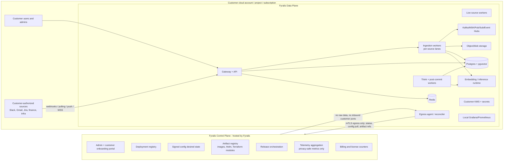
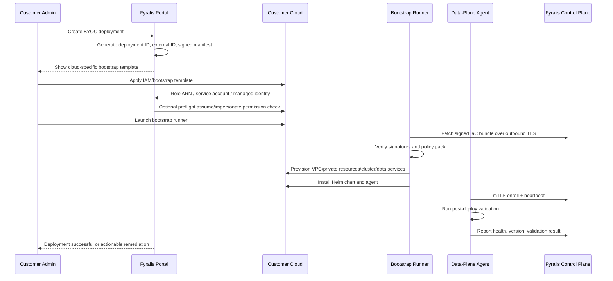
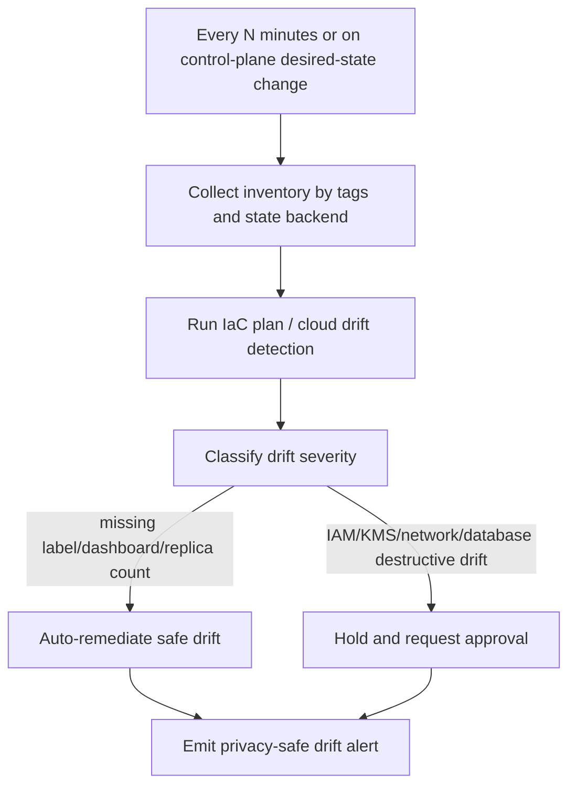
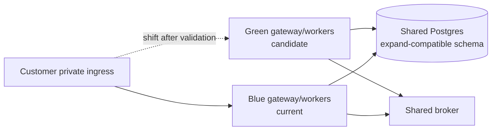

# Fyralis BYOC Production Blueprint

Last reviewed from `main` on 2026-06-24.

This document turns the generic BYOC prompt into a Fyralis-specific production
blueprint. It assumes Fyralis Core remains backend-only and that the demo/UI
overlay is deployed separately or bundled as a customer-facing surface on top of
the same data-plane boundary.

## Executive Position

The BYOC direction is correct for the first enterprise customer. Fyralis ingests
and reasons over sensitive organizational, financial, HR, infrastructure, and
communication data, so the production design must make the customer's cloud the
only place where raw customer content, provider credentials, embeddings, model
state, durable queues, and operational logs exist.

The Gemini prompt is directionally useful, but it needs these Fyralis-specific
corrections:

- The data plane is not only a stateless application runtime. For Fyralis it
  includes the gateway, ingestion workers, Think/post-commit workers, Postgres
  with pgvector, Kafka or compatible streaming, object/blob storage, Redis,
  embeddings/inference, local observability, and source-specific live workers.
- The control plane should not own long-lived broad admin access to customer
  clouds. Prefer a customer-side bootstrap runner and a persistent egress agent
  that pulls signed desired state from our control plane.
- The current DB RLS policy is a migration safety net with a permissive branch
  when no tenant is bound. Enterprise launch requires strict tenant binding,
  non-superuser DB roles, and RLS validation under the same role shape used in
  production.
- Static `.env` secrets are acceptable for local development only. BYOC must
  resolve secrets from the customer's cloud KMS/Secrets Manager/Vault and keep
  only opaque refs in Fyralis tables.
- Observability must be allowlisted, aggregated, and source/tenant-safe by
  design. Raw application logs, prompts, payloads, embeddings, database rows,
  and provider tokens must never leave the customer boundary.
- Self-service onboarding should feel like one wizard, but the privileged work
  should run in a customer-owned execution context with signed IaC artifacts,
  explicit external IDs, short-lived credentials, and auditable state changes.

## Implementation Path Update - 2026-06-26

After comparing this blueprint against the current gateway/runtime/deployment
code, the architecture remains correct. The most efficient first backend slice
is contract-first, not control-panel-first and not cloud-credential-first:

1. Define the data-plane deployment manifest that every later bootstrap runner,
   agent, IaC package, and hosted control-plane workflow must satisfy.
2. Validate that manifest locally with no cloud credentials.
3. Add runtime/env guards for BYOC mode so production startup fails closed on
   unsafe control-plane connectivity, raw telemetry, or raw bootstrap secrets.
4. Add static/readiness gates so future changes cannot silently weaken
   egress-only or customer-data-locality assumptions.

Repo-owned artifacts for this first slice:

- `services/platform/runtime/byoc_contract.py` is the typed BYOC data-plane
  contract and semantic validator.
- `deploy/byoc/dataplane.example.yaml` is the credential-free deployment
  manifest example used by tests and readiness gates.
- `scripts/validate_byoc_dataplane_manifest.py` validates JSON/YAML manifests
  and can print the JSON schema for control-plane or IaC consumers.
- `scripts/run_byoc_post_deploy_validation.py` runs the local post-deploy
  validator. In CI/offline mode it validates the manifest, production env
  contract, enabled runtime processes, secret refs, and telemetry privacy
  settings. In live mode it can additionally require gateway/worker health
  URLs, the production DB role/RLS probe, broker TCP reachability, and
  object-store endpoint reachability.
- `services/platform/runtime/byoc_agent_contract.py` defines the backend-owned
  data-plane agent enrollment and heartbeat contract. Enrollment proves a
  customer-side install-token secret by HMAC over a canonical request while
  serializing only the secret reference; heartbeat payloads are bounded status
  codes plus aggregate telemetry flags and reject raw logs, payloads, prompts,
  PII, and free-form customer text.
- The same module exposes a local mock control-plane FastAPI app for contract
  tests. It is intentionally not the hosted control plane; it lets bootstrap
  and agent work prove the egress-only registration and heartbeat shape before
  cloud credentials, mTLS issuance, persistence, or dashboard workflows exist.
- `services/platform/runtime/byoc_agent_probe.py` and
  `scripts/run_byoc_agent_probe.py` provide the local executable data-plane
  agent proof. The probe reads install-token material only from process memory,
  signs the enrollment request, pulls metadata-only desired state from the
  local mock control-plane contract, submits one bounded heartbeat, and emits a
  sanitized JSON/YAML report with no token, URL, raw payload, prompt, log,
  embedding, or PII fields.
- `services/platform/runtime/byoc_agent_runner.py` and
  `scripts/run_byoc_agent_runner.py` provide the first bounded data-plane agent
  loop skeleton. The runner enrolls once, polls metadata-only desired state for
  a caller-bounded number of iterations, sends one privacy-safe heartbeat per
  iteration, and emits a sanitized report that contains only scalar status,
  cadence, revision, apply-plan, artifact-verification, and aggregate count
  fields. For `apply_revision` desired state it builds a `plan_only`,
  zero-mutation-count apply plan with bounded step codes and, when supplied a
  bootstrap bundle, verifies that the desired revision maps to digest-pinned
  artifact metadata; it intentionally does not apply revisions, rotate tokens,
  issue mTLS credentials, or daemonize.
- `services/platform/runtime/byoc_agent_apply_plan.py` defines the sanitized
  non-mutating apply-plan contract. The plan records only current/desired
  revision metadata, config epoch, bounded step names, and mutation counts; it
  rejects unchanged revisions, mutating execution modes, mutating step counts,
  raw URL markers, signatures, payloads, prompts, embeddings, and secret-like
  material.
- `services/platform/runtime/byoc_agent_artifact_verification.py` defines the
  sanitized artifact verification evidence contract. It validates the apply
  plan against a bootstrap bundle whose `artifact_revision` matches the desired
  revision, checks bundle digest pinning and optional local file digests, and
  emits only roles, kinds, SHA-256 digests, counts, and bounded IDs. It never
  emits artifact refs, URLs, Sigstore bundle refs, signatures, payloads,
  prompts, embeddings, or secret-like material.
- `services/platform/runtime/byoc_agent_control_plane.py`,
  `services/app/gateway/byoc_agent_keys.py`, and
  `services/app/gateway/byoc_agent_router.py` provide the first hosted agent
  enrollment, heartbeat, and desired-state polling API. `POST
  /byoc/agent/enroll` verifies the HMAC install-token proof after resolving
  the request `key_ref` through
  `FYRALIS_DATA_PLANE_AGENT_INSTALL_TOKEN_SECRET_REF`; `POST
  /byoc/agent/heartbeat` accepts only enrolled agents and persists latest
  heartbeat aggregate counts plus bounded status codes in
  `byoc_agent_registrations`; `POST /byoc/agent/desired-state` requires a
  signed poll request from an enrolled agent and returns only desired revision,
  rollout action, poll cadence, telemetry contract, and config epoch metadata.
  The route stores no request bodies, signature values, raw tokens, mTLS
  material, logs, payloads, prompts, endpoint URLs, config bodies, or PII.
  Production mTLS issuance and fleet reconciliation remain deferred.
- `services/platform/runtime/byoc_permissions.py` defines the backend-owned
  customer-cloud permission contract. It validates role boundaries, explicit
  AWS actions, scoped resources, `iam:PassRole` service constraints, no
  admin-style managed policies, no control-plane mutation rights, and no
  control-plane access to customer data or secret material.
- `deploy/byoc/permissions.example.yaml` and
  `deploy/byoc/aws/iam.bootstrap.template.yaml` are credential-free AWS-first
  examples for customer-side bootstrap and runtime IAM shape.
- `scripts/validate_byoc_permissions_manifest.py` validates the permission
  manifest against the data-plane manifest and optional AWS IAM skeleton, and
  prints JSON schemas for future IaC/control-plane generators.
- `deploy/byoc/aws/iac-package.example.yaml`,
  `deploy/byoc/aws/terraform/*`, and
  `scripts/generate_byoc_aws_iac_package.py` define the first AWS BYOC IaC
  package scaffold. This slice is intentionally non-mutating: the Terraform
  root declares provider constraints, input variables, required tags, safety
  locals, and operator outputs only. The generator/checker re-renders the
  package from the data-plane, permissions, and IAM skeleton manifests, verifies
  deployment identity, rejects Terraform `resource`, backend, external-data,
  provisioner, and raw secret/customer-data value fragments, and fails if the
  checked-in manifest or Terraform scaffold drifts from generated output.
  `scripts/validate_byoc_aws_iac_package.py` remains available for direct
  package validation when generation is not needed.
- `services/platform/runtime/byoc_bootstrap_bundle.py` defines the signed
  bootstrap bundle contract. It requires digest-pinned image/chart/IaC/SBOM
  artifacts, Sigstore bundle metadata, matching signing identity, deployment
  manifest alignment, and optional local SHA-256 verification for checked-in
  IaC files.
- `deploy/byoc/bootstrap-bundle.example.yaml` is the credential-free example
  bundle tying the data-plane manifest, permission manifest, agent image,
  runtime images, Helm chart, AWS IAM skeleton, and SBOM artifacts together.
- `deploy/byoc/bootstrap-bundle.next.example.yaml` is the credential-free
  next-revision bundle fixture used by the local agent runner to prove
  `apply_revision` desired state can be tied to digest-pinned artifact
  metadata without mutating customer infrastructure.
- `scripts/verify_byoc_bootstrap_bundle.py` verifies the bundle locally and can
  print the cosign verification commands a customer-side bootstrap runner must
  execute before applying cloud resources.
- `services/platform/runtime/byoc_bootstrap_plan.py` defines the non-mutating
  bootstrap dry-run plan contract. It orders prerequisite validation, artifact
  verification, identity review, private network planning, stateful service
  planning, runtime rendering, agent enrollment preparation, post-deploy
  validation, and handoff without requiring cloud credentials.
- `deploy/byoc/bootstrap-plan.example.yaml` is the generated checked-in dry-run
  plan for the example manifests, and
  `scripts/generate_byoc_bootstrap_plan.py --check-plan` proves it still
  matches the current contracts.
- `services/platform/runtime/byoc_bootstrap_runner.py` and
  `scripts/run_byoc_bootstrap_runner.py` consume that plan and emit sanitized
  local evidence for CI or customer handoff. The runner replays only local
  contract/hash/offline-validation checks, prepares signature-command evidence
  as counts, and never executes cloud apply, live probes, or mutating commands.
- `services/platform/runtime/byoc_evidence_ledger.py`,
  `scripts/generate_byoc_evidence_ledger.py`, and
  `deploy/byoc/evidence-ledger.example.yaml` define the sanitized deployment
  evidence ledger. It records only deployment identity, pass/fail status,
  aggregate check counts, bounded failure codes, operation counts, and
  sanitized digests from the plan, bootstrap-runner report, and offline
  post-deploy validator. When a customer-side live post-deploy report is
  available, pass it with `--post-deploy-report`. If a signed envelope is
  supplied with `--post-deploy-envelope`, the ledger verifies deployment
  identity, report digest, timestamp freshness, and HMAC signature before
  import. The ledger imports only status, required flags, bounded check names,
  and counts, while discarding report details, endpoint strings, URLs, and
  metrics.
- `services/platform/runtime/byoc_evidence_package.py`,
  `scripts/generate_byoc_evidence_package.py`, and
  `deploy/byoc/evidence-package.example.yaml` define the sanitized customer
  handoff package. It embeds only the sanitized evidence ledger, digest-pinned
  source artifact refs, AWS IaC package fingerprint, and optional
  signed-envelope metadata; it never embeds raw post-deploy reports, command
  output, endpoint URLs, artifact refs, credentials, payloads, prompts, logs,
  embeddings, or PII.
- `services/platform/runtime/byoc_control_plane_intake.py` and
  `services/app/gateway/byoc_control_plane_router.py` define the first hosted
  control-plane intake contract for sanitized evidence packages. The data-plane
  agent submits a canonical HMAC-signed package submission to
  `POST /byoc/control-plane/evidence-packages`; the gateway stores only a
  sanitized receipt record and rejects raw reports, URL/credential markers, bad
  signatures, and package contract violations. When gateway database
  dependencies are present, receipts persist in
  `byoc_evidence_package_receipts` as scalar metadata only; the in-memory store
  remains for standalone contract tests. Receipt lookup and list APIs are
  backend automation surfaces only: reads require short-lived HMAC-signed
  headers, and list queries must be bounded by deployment or customer. The
  response contract returns sanitized scalar receipt metadata only. In BYOC
  production, submission and receipt-read HMAC keys are selected by `key_ref`
  and resolved through managed app-secret refs; raw process-env signing keys are
  allowed only for local/test app-state wiring. Architecture ratchets forbid
  receipt JSON/blob/body columns so raw evidence packages and live report
  details cannot become control-plane storage.
- `services/platform/runtime/byoc_runner_evidence_intake.py` extends that
  hosted intake with a signed sanitized runner-evidence envelope. Customer-side
  runner automation derives a `fyralis.byoc.runner_evidence_summary.v1`
  payload from the local bounded agent runner report, preserving only
  deployment/agent identity, revision intent, pass/fail status, apply-plan and
  artifact-verification IDs, and aggregate counts. It submits the canonical
  HMAC-signed `fyralis.byoc.runner_evidence_submission.v1` payload to `POST
  /byoc/control-plane/runner-evidence` using the existing evidence intake
  signing-key purpose. The gateway stores only a
  `fyralis.byoc.runner_evidence_receipt.v1` scalar receipt in
  `byoc_runner_evidence_receipts`; it does not store runner checks, iterations,
  apply-plan bodies, artifact inventories, raw report JSON, URLs, logs, request
  bodies, prompts, credentials, or PII. Architecture ratchets forbid JSON/blob
  body columns and raw-runner-report shaped columns for this table.
- `scripts/submit_byoc_runner_evidence.py` is the customer-side/local
  automation bridge for that route. It reads the runner report, derives and
  HMAC-signs only the sanitized summary, writes the signed submission JSON for
  audit if requested, and posts to the hosted route only when `--submit-url` is
  supplied. This keeps local CI and customer handoff flows testable without
  staging credentials.
- `.env.production.example` now exposes explicit `FYRALIS_DEPLOYMENT_MODE=byoc`
  settings, egress-only control-plane flags, data-plane agent auth shape, and
  privacy-safe telemetry flags.
- `scripts/check_production_env_contract.py`,
  `scripts/check_architecture_ratchets.py`, and
  `scripts/run_operational_readiness_gates.py` include the first automation
  hooks for BYOC contract drift.

This intentionally defers cloud apply, real agent reconciliation actions beyond
non-mutating apply-plan evidence, production Terraform/CloudFormation modules,
hosted onboarding UI, mTLS/token rotation, and fleet dashboard work until a
first-customer cloud/profile is selected. Those systems should consume these
manifests and the bounded runner contract instead of inventing new deployment,
permission, or agent protocol shape.

## Current Fyralis Baseline

Verified strengths already present in the repo:

- Backend-only layered architecture with import boundaries enforced through
  `lint-imports` in `pyproject.toml`.
- FastAPI gateway, bearer auth middleware, request IDs, route-template HTTP
  metrics, and header redaction via `lib/shared/http_headers.py`.
- Tenant-scoped domain data, `TenantContext`, RLS migrations, and CI ingestion
  tests that run under a non-superuser, non-BYPASSRLS role.
- Fernet-backed `encrypted_secrets` store with tenant-scoped lookups and a
  rotation seam.
- Production env contract checks that require fail-closed settings such as
  `AUTH_BOOTSTRAP_SECRET`, disabled debug panels, no default tenant IDs in prod,
  webhook env fallback disabled, and required ingestion data-plane wiring.
- Kafka-first ingestion path with S3 raw tier, per-source topic isolation, DLQ,
  source-lane circuit breaker, and inline fallback.
- Prometheus/Grafana metrics stack with worker `/healthz`, `/metrics`, DB pool
  gauges, queue depth, LLM cost metrics, and cardinality controls.
- Operational readiness harness for schema drift, production env contract,
  privacy probes, feedback-loop gates, calibration, and queue drain checks.

Open launch risks that must be treated as blockers for enterprise BYOC:

- Strict RLS is not complete while the permissive no-tenant branch remains.
- Some workers are implemented but not first-class compose/Kubernetes services.
- Scheduler and some gateway loops still need leader election or advisory locks
  before horizontal scaling.
- Known stability risks remain around network I/O inside DB transactions,
  trigger idempotency races, orphaned queue locks, unbounded artifacts, and
  incomplete dead-letter operator surfaces.
- Current production examples still rely on env-injected application secrets and
  local compose credentials.
- Existing deploy/migration workflow is host/compose-oriented, not yet a signed,
  reproducible multi-cloud release controller.

## Target Principles

- Customer data locality: raw payloads, extracted text, embeddings, prompts,
  model state, logs, and source credentials stay inside the customer cloud.
- Egress-only connectivity: the data plane initiates all control-plane
  communication. No inbound public firewall rule is required.
- Identity over secrets: runtime components use workload identity, IAM roles,
  managed identities, or service account impersonation. Static access keys are
  forbidden outside local development.
- Least privilege by artifact boundary: IaC, images, Helm charts, migrations,
  and agent commands are signed, versioned, and scoped to a single deployment.
- Local autonomy: the data plane continues serving local product traffic and
  processing already-authorized work during control-plane outages.
- Telemetry minimization: the control plane receives only predeclared aggregate
  metrics, health state, deployment state, billing counters, and privacy-safe
  product usage events.
- Reversible rollout: every app version, config change, and migration has an
  explicit rollout, pause, rollback, and reconciliation path.

## Phase 1 - Core Production Readiness Checklist

### Security And Data Hardening

Implementation requirements:

- Encrypt all data at rest using customer-owned keys.
  - Postgres/RDS/Cloud SQL/Azure Database encryption with customer managed KMS
    keys where the customer requires key ownership.
  - Object storage buckets for raw payloads and future large blobs encrypted
    with customer KMS keys, bucket public access blocked, versioning enabled,
    and lifecycle policy defined by the customer DPA.
  - Kafka/MSK/Confluent/Pub/Sub/Event Hubs storage encryption enabled.
  - Redis/ElastiCache/Memorystore encryption at rest and in transit where the
    service supports it.
- Encrypt all data in transit.
  - TLS 1.2 minimum, TLS 1.3 preferred, for browser/API, internal service,
    database, object storage, broker, and control-plane agent traffic.
  - mTLS between the data-plane agent and control plane.
  - Private networking for database, broker, object storage, Redis, and
    embedding endpoints. No public Postgres, Kafka, Redis, MinIO, or Ollama.
- Replace static env secrets with customer-owned secret providers.
  - AWS: Secrets Manager or SSM Parameter Store plus KMS.
  - GCP: Secret Manager plus Cloud KMS.
  - Azure: Key Vault plus managed identity.
  - HashiCorp Vault: Kubernetes auth or cloud IAM auth, with short TTL leases.
  - Fyralis DB stores only `secret_ref` values; plaintext only exists in memory
    for the active operation.
- Promote the current Fernet store to a compatibility layer.
  - `MASTER_KEK` must be resolved from customer KMS/Vault, never embedded in
    `.env.production`.
  - Add a `SecretStore` interface that can dispatch to cloud-native backends
    while preserving existing `FernetSecretStore` tests.
  - Add key rotation runbooks and an automated rotation rehearsal.
- Enforce strict tenant and customer boundaries.
  - Production DB role must not be superuser and must not have `BYPASSRLS`.
  - Remove the permissive no-tenant RLS branch after all production repos use
    `TenantContext` or explicit tenant-bound transactions.
  - Add a startup gate that fails if `current_user` has superuser/BYPASSRLS or
    if strict RLS policy shape is not installed.
  - Keep application-level `WHERE tenant_id = $1` filters as defense in depth.
- Remove hardcoded tenant assumptions.
  - `DEFAULT_ACTOR_ID`, `DEFAULT_TENANT_ID`, and `COMPANY_OS_TENANT_ID` are
    forbidden in production.
  - Any BYOC deployment ID, customer ID, region, cloud account, source list,
    and feature flags must come from signed control-plane config or local
    customer config, not code constants.
  - Demo and debug routers must be disabled unless explicitly enabled in a
    non-production deployment.
- Lock down source ingress.
  - All public webhooks must use provider signature verification or OIDC
    verification before any queue write.
  - Provider install rows must distinguish missing install from cross-tenant
    access without leaking existence.
  - Live workers such as Discord and Telegram must use single-leader leases.
- Add supply-chain controls.
  - Build SBOMs for images.
  - Sign images and Helm/IaC artifacts.
  - Verify signatures in the data-plane bootstrap runner before apply.
  - Pin base images and run vulnerability scans before promotion.

Strict RLS launch gate:

```sql
-- Target production policy shape after repo migration to TenantContext.
DROP POLICY IF EXISTS tenant_isolation ON observations;
CREATE POLICY tenant_isolation ON observations
  USING (tenant_id = current_setting('app.current_tenant', false)::uuid)
  WITH CHECK (tenant_id = current_setting('app.current_tenant', false)::uuid);

ALTER TABLE observations ENABLE ROW LEVEL SECURITY;
ALTER TABLE observations FORCE ROW LEVEL SECURITY;
```

### Performance And Scalability

Implementation requirements:

- Database query and index strategy.
  - Keep tenant/time composite indexes for every hot tenant-scoped queue and
    product read path.
  - Add missing queue indexes called out by the hardening backlog, especially
    `(tenant_id, scheduled_at)` for pending post-commit actions.
  - Validate every hot query with `EXPLAIN (ANALYZE, BUFFERS)` against a
    production-sized anonymized or synthetic dataset.
  - Maintain HNSW/vector index settings per environment and document
    `ef_search` / memory tradeoffs.
  - Partition high-volume append-only tables such as `observations`,
    `resource_transactions`, `think_run_artifacts`, and raw/error ledgers by
    time.
  - Add retention policies for debug artifacts, raw payloads, telemetry, and
    logs before external launch.
- Connection pooling.
  - Use pgbouncer transaction mode for high-fanout workers and configure
    `statement_cache_size=0` for compatible asyncpg pools.
  - Size pools per process class, not globally. Gateway, Think workers,
    observation writers, embedding workers, reconciler, and OAuth workers need
    separate budgets.
  - Expose `db_pool_*` gauges for every pool and alert at sustained saturation.
  - Add statement timeouts and lock timeouts for app roles.
- Stateless application layer.
  - Gateway replicas must not own singleton background work unless protected by
    leases.
  - Realtime dispatch, scheduler, OAuth sweeper, and source live workers must
    use DB or Redis leader locks with TTL refresh and failover.
  - Session/auth state must live in Postgres/Redis or customer IdP, not process
    memory.
  - Durable queues must use `FOR UPDATE SKIP LOCKED`, leases, heartbeat, and
    orphan recovery.
- Ingestion scalability.
  - Preserve per-source topics and per-source worker deployment from
    [source isolation](../ingestion/source-isolation.md).
  - Keep Kafka path enabled by default with an inline fallback kill switch.
  - Run normalizer with bounded per-tenant ordered concurrency.
  - Limit embedding concurrency per source to avoid thundering herd on Ollama or
    the selected embedder.
- Third-party dependency resilience.
  - Centralize retry policies with exponential backoff and jitter for source
    APIs, LLM providers, embedding backends, object storage, and broker flushes.
  - Keep circuit breakers for LLM and ingestion cutover. Add budget breakers for
    per-tenant LLM spend and tokens.
  - Do not hold DB transactions while calling LLMs, embedding providers, source
    APIs, object storage, or HTTP rendering adapters.
  - Prefer idempotent writes with `INSERT ... ON CONFLICT` and stable
    idempotency keys.
- Graceful degradation.
  - If Kafka is unhealthy, ingress can safely fall back to inline path when the
    tenant flag is tripped.
  - If embeddings fail, set `embedding_pending=True` and let the backlog worker
    retry.
  - If control-plane connectivity is down, local app traffic and local worker
    processing continue; telemetry queues locally.
  - If LLM budget is exhausted, product surfaces should return structured
    degraded states instead of silently fabricating placeholders.

### Error Handling And Code Hygiene

Implementation requirements:

- Standardize error propagation.
  - Domain/runtime errors inherit from `CompanyOSError` and carry structured
    `code`, `message`, and safe context.
  - User-facing HTTP responses must not include Python tracebacks, provider
    tokens, raw payloads, raw prompts, SQL text with values, or source secrets.
  - Internal logs may carry exception type and request ID; raw values require a
    local-only debug mode with explicit retention.
- Strengthen log redaction.
  - Keep the `safe_headers` and `redact_header_values` processors.
  - Add body/key redaction for common token fields in JSON payloads.
  - Add tests that captured logs do not contain `Bearer`, `xoxb-`, OAuth
    refresh tokens, webhook signatures, private keys, API keys, account/routing
    numbers, SSNs, or bank identifiers.
- CI/CD gates.
  - Required on every PR: ruff, import-linter, architecture ratchets,
    production env contract, technical debt budget, unit/integration tests, and
    migration prefix uniqueness.
  - Required before release: schema drift check, strict RLS probe under
    production-like non-superuser role, operational readiness harness, load/soak
    report, migration rehearsal, rollback rehearsal, SBOM/signature verification,
    and vulnerability scan.
  - Nightly: real LLM suite, ingestion subprocess E2Es, per-source pipeline
    drain, and representative source-contract fixtures.
- Type safety.
  - Continue Pydantic validation at boundaries.
  - Add mypy or pyright in staged mode for `lib/` and critical service packages.
  - Use typed config objects instead of ad hoc `os.environ` reads in hot paths.
- Integration test coverage.
  - Multi-replica scheduler and worker tests.
  - No network I/O inside transaction static check.
  - IaC bootstrap dry-run tests.
  - Upgrade/rollback tests against a staging BYOC cluster.
  - Telemetry privacy tests that attempt to emit PII and assert it is dropped.

## Phase 2 - BYOC Architecture

### System Boundary



### Control Plane Hosted By Fyralis

Allowed data:

- Customer account metadata: company name, billing owner, deployment owner,
  legal/DPA state, support tier, cloud provider, region, deployment ID.
- Cloud deployment metadata: cloud account/project/subscription IDs, region,
  VPC/VNet identifiers, cluster name, stack names, agent version, artifact
  versions, feature flags, rollout channel, allowed source families.
- Configuration desired state: signed release versions, chart values that do
  not contain secrets, resource sizing profiles, policy pack IDs, retention
  class, telemetry allowlist version.
- Aggregated billing counters: active seats, source family enabled counts,
  event counts by source family, LLM/embedding token buckets by coarse class,
  storage high-water marks, connector count.
- Health telemetry: heartbeat, component readiness, queue depth buckets,
  p50/p95/p99 latency, error-rate counters, deploy state, drift state, and
  alert state.
- Support metadata: deployment run IDs, failure codes, sanitized stack events,
  support tickets, customer-approved diagnostics bundle pointers.

Forbidden data:

- Raw source payloads or extracted text.
- Database row payloads, prompts, completions, embeddings, vector IDs tied to
  customer content, actor/user names, emails, file names, object keys that embed
  tenant/customer/source data, source API tokens, OAuth refresh tokens, webhook
  secrets, private keys, log lines containing payload fields.

Control-plane services:

- Onboarding portal.
- Deployment registry and desired-state store.
- Artifact registry and signing service.
- Release controller.
- Telemetry ingestion API with schema validation and PII rejection.
- Fleet dashboard for Fyralis operators.
- Customer support workflow that can request but not silently pull local logs.

Operator dashboard:

- Fleet list by customer, region, deployment status, current version, target
  version, drift status, last heartbeat, last successful reconcile, and support
  mode.
- Drill-down panels with aggregate health only: gateway up, worker up counts,
  queue-depth bands, DLQ counts, error-rate bands, storage/broker/database
  utilization, LLM spend/budget bands, and control-plane connectivity status.
- No raw logs by default. A diagnostics export requires customer admin approval
  and is generated inside the data plane with a privacy filter.

### Data Plane Hosted In The Customer Cloud

Required components:

- Application runtime:
  - Gateway/API service.
  - Ingestion gateway and webhooks.
  - Per-source normalizer, observation writer, embedding worker, DLQ writer.
  - Tenant/source onboarding workflows.
  - Think worker and post-commit worker.
  - Live workers such as Discord/Telegram/Gmail/Calendar/Drive where enabled.
  - Maintenance workers that are currently dormant in compose but required for
    production if their tables/features are enabled.
- Data services:
  - Postgres 16 plus pgvector.
  - Kafka/MSK/Confluent or cloud-native equivalent for the ingestion pipeline.
  - Object storage for raw payloads and future blob/chunk tiers.
  - Redis-compatible cache/rate limit/leader-lock store.
  - Embedding backend: local Ollama, customer-hosted model endpoint, or
    customer-approved managed embedding endpoint.
  - Local Prometheus/Grafana or equivalent.
- Customer cloud primitives:
  - IAM roles/service accounts/managed identities.
  - KMS keys.
  - Secrets manager.
  - Private subnets/security groups/firewall rules.
  - Object storage buckets.
  - Managed database, broker, Redis, and Kubernetes/ECS/Cloud Run/AKS/GKE/EKS
    compute depending on deployment profile.

Runtime identity:

- Pods/tasks use workload identity.
- Each component gets a distinct service account/role.
- Gateway cannot administer infrastructure.
- Workers can only read secrets and cloud resources for the source families
  they own.
- IaC runner/agent has elevated deployment permissions, but only in a dedicated
  namespace/account role and with an explicit permissions boundary.

### Secure Cross-Plane Connectivity

Preferred model: data-plane agent pull.

- The customer deploys a small bootstrap runner with one-time credentials.
- The runner installs the permanent Fyralis data-plane agent.
- The agent initiates mTLS to the Fyralis control plane over outbound 443.
- The agent authenticates with a deployment certificate bound to deployment ID,
  customer ID, cloud account/project, and allowed region.
- Initial enrollment uses the backend-owned
  `fyralis.byoc.agent.enrollment.v1` request shape: the agent signs canonical
  deployment metadata with the locally resolved install token and sends only
  the token's secret reference plus HMAC proof to the control plane.
- The agent polls desired state, verifies signatures, applies changes locally,
  and reports status.
- Heartbeats use the backend-owned `fyralis.byoc.agent.heartbeat.v1` shape and
  carry only bounded component status codes, validation state, desired revision
  alignment, and aggregate telemetry-contract flags.
- The control plane never opens an inbound socket into the customer network.

Optional private connectivity:

- AWS PrivateLink for customers that require private AWS backbone access to the
  control-plane endpoint.
- GCP Private Service Connect for private service attachment to the control
  plane.
- Azure Private Link for control-plane endpoints.
- Site-to-site VPN or Direct Connect/Interconnect is not the default. Use only
  when the customer already mandates it and still keep data-plane initiated
  control operations.

Connectivity contract:

```yaml
control_plane_connectivity:
  direction: egress_only
  protocol: https
  port: 443
  auth: mtls
  agent_poll_interval_seconds: 30
  heartbeat_interval_seconds: 15
  max_telemetry_batch_bytes: 262144
  raw_logs_allowed: false
  raw_payloads_allowed: false
  fail_closed_for_new_config_after: 24h
  continue_serving_local_traffic_when_disconnected: true
```

## Phase 3 - Self-Service BYOC Onboarding

### Wizard Flow



Wizard pages:

1. Deployment profile
   - Cloud provider, region, environment, expected data volume, source families,
     retention class, HA tier, and whether the customer supplies existing VPC,
     database, broker, and object storage.
2. Permission handshake
   - Generate external ID, role/service account template, permissions boundary,
     and customer-side approval commands.
3. Network plan
   - VPC/VNet/subnet validation, private endpoints, DNS, egress allowlist, and
     no-inbound assertion.
4. IaC execution
   - Customer runs bootstrap or authorizes the portal to trigger a customer-side
     runner.
5. Validation
   - Component checks, network checks, secret checks, migration checks,
     source-ready checks, and privacy telemetry checks.
6. Handoff
   - Local admin URL, local Grafana URL, first source setup, support boundary,
     backup/restore summary, and update channel.

### Cloud Authentication And Permission Handshake

AWS preferred handshake:

- Portal generates:
  - `deployment_id`
  - stack name prefix
  - required region
  - required tag keys
  - permissions boundary policy name
  - signed data-plane and permission manifests
- Customer applies the bootstrap template from a customer-owned execution
  context. The default path is a customer-side runner; Fyralis Core does not
  require the hosted control plane to assume a mutating role in the customer
  account.
- The template/runner creates or references:
  - dedicated bootstrap and CloudFormation/Terraform service roles
  - customer-owned KMS key or key reference
  - Secrets Manager namespace
  - S3 artifact/state/raw-payload buckets or customer-approved references
  - permissions boundary for every role created by the Fyralis stack
- Optional hosted preflight may later use a read-only assume-role handshake with
  an external ID, but the checked-in production contract forbids control-plane
  mutation rights and customer-data/secret-material access.
- The permanent data-plane agent later runs inside the customer account using
  IRSA/EKS Pod Identity, ECS task role, or EC2 instance role.

Repo-owned AWS contract:

- `deploy/byoc/permissions.example.yaml` is the source of truth for role
  actors, trust boundaries, allowed actions, resource scopes, data-access class,
  and IAM condition requirements.
- `deploy/byoc/aws/iam.bootstrap.template.yaml` is the first AWS skeleton that
  future CloudFormation/Terraform generation must satisfy.
- `scripts/validate_byoc_permissions_manifest.py` rejects wildcard/admin
  actions, AWS admin managed policies, unbounded `iam:PassRole`, mutating
  control-plane roles, customer-data/secret-material access by control-plane
  roles, missing permission boundaries, and data-plane manifest mismatches.
- Wildcard resources are permitted only for read-only account/region preflight
  actions such as `sts:GetCallerIdentity` and selected `Describe*` calls.
- Customer-data access is allowed only for runtime data-plane roles, and only as
  encrypted customer data inside the customer boundary.
- Secret-material access is allowed only inside the data plane; bootstrap
  service roles may create secret containers but must not receive raw secret
  values.
- Every BYOC-managed resource must require:
  - `fyralis:deployment-id`
  - `fyralis:customer-id`
  - `fyralis:managed=true`
  - `fyralis:environment`

GCP preferred handshake:

- Portal generates deployment ID and an allowlisted Fyralis workload identity
  principal.
- Customer creates `fyralis-byoc-provisioner@PROJECT.iam.gserviceaccount.com`.
- Customer grants our workload identity permission to impersonate that service
  account, or launches a customer-side bootstrap runner that uses it locally.
- Runtime services use GKE Workload Identity or Cloud Run service identities.

GCP custom role starting point:

```yaml
title: Fyralis BYOC Provisioner
description: Provision and reconcile one Fyralis BYOC data plane.
stage: GA
includedPermissions:
  - resourcemanager.projects.get
  - serviceusage.services.get
  - serviceusage.services.enable
  - compute.networks.get
  - compute.subnetworks.get
  - compute.addresses.create
  - compute.firewalls.create
  - compute.firewalls.get
  - container.clusters.create
  - container.clusters.get
  - container.clusters.update
  - container.nodePools.create
  - container.nodePools.get
  - iam.serviceAccounts.create
  - iam.serviceAccounts.get
  - iam.serviceAccounts.setIamPolicy
  - cloudkms.cryptoKeys.get
  - cloudkms.cryptoKeys.create
  - secretmanager.secrets.create
  - secretmanager.secrets.get
  - secretmanager.versions.add
  - storage.buckets.create
  - storage.buckets.get
  - storage.objects.get
  - logging.sinks.create
  - monitoring.alertPolicies.create
```

Azure preferred handshake:

- Customer creates a user-assigned managed identity for the bootstrap runner.
- Customer grants a custom role scoped to the resource group.
- Runtime workloads use managed identities with Key Vault, Storage, Database,
  and Container Registry access scoped per component.

### Automated Infrastructure Provisioning

Supported IaC delivery modes:

- Terraform module published as a signed OCI artifact.
- Helm chart published as a signed OCI artifact for Kubernetes profiles.
- CloudFormation template for AWS bootstrap and optional full AWS profile.
- GCP Deployment Manager or Terraform for GCP.
- Azure Bicep or Terraform for Azure.

Recommended profile for first enterprise customer:

- Kubernetes data plane on EKS/GKE/AKS if the customer already operates managed
  Kubernetes.
- Managed Postgres with pgvector support.
- Managed Kafka/MSK or customer-approved Kafka-compatible equivalent. For GCP
  and Azure, decide whether to run Kafka in-cluster or map to cloud-native
  messaging after validating ordering, replay, and consumer lag semantics.
- Managed object storage.
- Managed Redis.
- Customer KMS and Secrets Manager.
- Local Prometheus/Grafana deployed privately.

Control-plane trigger model:

- Control plane writes signed desired state:

```json
{
  "deployment_id": "dep_01j...",
  "desired_revision": "2026.06.24-3",
  "artifact_set": {
    "helm_chart": "oci://registry.fyralis.com/fyralis/dataplane:2026.06.24-3",
    "terraform_module": "oci://registry.fyralis.com/fyralis/aws-byoc:2026.06.24-3",
    "image_bundle": "sha256:..."
  },
  "policy_pack": "enterprise-default-v1",
  "telemetry_contract": "telemetry-v1",
  "signature": "cosign-or-dsse-signature"
}
```

- Data-plane agent pulls desired state.
- Agent verifies signature, evaluates policy pack, takes state lock, plans,
  applies, validates, and reports structured progress.
- Portal displays progress from agent events, not from raw IaC logs.

Helm values baseline:

```yaml
global:
  deploymentId: dep_01j...
  cloudProvider: aws
  region: us-east-1
  telemetry:
    controlPlaneUrl: https://control.fyralis.com
    mode: aggregate-only
    rawLogsAllowed: false
  secrets:
    provider: aws-secrets-manager
    kmsKeyArn: arn:aws:kms:us-east-1:123456789012:key/...

gateway:
  replicas: 3
  env:
    FYRALIS_ENV: prod
    WEBHOOK_SECRETS_ENV_FALLBACK_ALLOW: "0"
    DEBUG_ARTIFACT_CAPTURE: "0"
    GATEWAY_REQUIRE_INGESTION_DATA_PLANE: "1"
  serviceAccount:
    annotations:
      eks.amazonaws.com/role-arn: arn:aws:iam::123456789012:role/fyralis-gateway

workers:
  think:
    replicas: 2
    maxConcurrencyPerTenant: 1
  postCommit:
    replicas: 2
  ingestion:
    perSource: true
    sources:
      - slack
      - gmail
      - google_drive
      - jira

postgres:
  mode: managed
  sslMode: verify-full

observability:
  localGrafana: true
  exposePublicly: false
```

### Automated Post-Deployment Verification

Validation sequence:

1. Identity checks
   - Confirm workload identity for every service account.
   - Confirm data-plane agent certificate matches deployment ID.
   - Confirm runtime roles cannot mutate infrastructure.
2. Network checks
   - Gateway reachable only through approved customer ingress.
   - No public DB, broker, Redis, object storage, Ollama, or metrics endpoints.
   - Agent can egress to control-plane endpoint over 443.
   - Private DNS resolves managed service endpoints.
3. Secret checks
   - Read/write one test secret in customer secret provider.
   - Verify `MASTER_KEK` or equivalent key material is not present as a plain
     environment variable.
   - Verify application can resolve a `secret_ref` and cannot cross-resolve a
     different tenant/deployment ref.
4. Database checks
   - Apply migrations with state lock.
   - Run schema drift check.
   - Run strict RLS probe under production DB role.
   - Verify pgvector extension and vector index health.
   - Verify pool registration metrics.
5. Storage and broker checks
   - Put/get/delete test object with customer KMS encryption.
   - Produce/consume test event on every per-source topic.
   - Verify DLQ topic and DLQ writer.
6. Application checks
   - Verify the checked-in bootstrap dry-run plan matches current manifests.
   - Confirm the plan contains no mutating cloud commands or credential
     requirements.
   - Emit the sanitized bootstrap-runner dry-run evidence report.
   - Emit the sanitized BYOC deployment evidence ledger.
   - Verify the signed bootstrap bundle manifest and all local artifact hashes.
   - Verify bootstrap runner cosign checks completed before any apply step.
   - `/healthz`, `/readyz`, `/metrics` for gateway and workers.
   - Auth session minting disabled without bootstrap secret.
   - Debug panels disabled.
   - Webhook signature negative test returns rejection.
7. Ingestion checks
   - Synthetic non-sensitive event through Kafka path.
   - Inline fallback path behind controlled flag.
   - Embedding pending/retry path using a fake test payload.
8. Reasoning checks
   - Run a non-sensitive Think smoke with fixture data.
   - Verify queue drain, post-commit drain, and no dead letters.
9. Telemetry privacy checks
   - Emit a test metric and confirm it reaches the control plane.
   - Attempt to emit blocked fields and confirm local collector drops them.
   - Confirm control plane sees deployment IDs but no payload text or user IDs.

Success criteria:

- All required checks pass.
- Any optional degraded component is explicitly accepted by policy.
- Portal displays local dashboard link and source setup next step.
- Data-plane agent reports version, health, telemetry contract, and last
  successful validation timestamp.

## Phase 4 - Edge Cases, Boundaries, And Failure Modes

### Drift Detection

Drift sources:

- Customer manually deletes or edits an IAM role, KMS key policy, bucket policy,
  DB parameter group, security group, subnet route, Kubernetes object, secret,
  broker topic, or Grafana dashboard.
- Cloud provider changes managed service defaults.
- Fyralis agent is down during a partial rollout.
- Customer policy tooling mutates Fyralis-managed tags or network rules.

Reconciliation loop:



Severity classes:

- Informational: tag drift, dashboard drift, extra noncritical config.
- Degraded: missing scrape target, worker replica drift, topic config drift.
- Critical: IAM permission removed, secret inaccessible, KMS key disabled,
  database unreachable, public exposure detected, RLS policy drift.
- Security incident: public DB/broker/object store, cross-tenant RLS failure,
  secret leakage, unexpected egress destination.

Rules:

- Auto-remediate only non-destructive, policy-approved drift.
- Never recreate or delete customer data stores without explicit approval.
- Do not overwrite customer-managed network policy if it would open traffic.
- Keep a signed drift report in the customer environment and a sanitized status
  in the control plane.

### Failed Deployments And Rollbacks

Deployment state machine:

```text
planned -> preflight -> locked -> applying -> validating -> healthy
                                 \-> failed_preflight
                                 \-> failed_apply -> rollback_pending -> rolled_back
                                 \-> failed_validate -> rollback_or_hold
```

Failure handling:

- Quotas or unsupported region:
  - Fail in preflight.
  - Show exact cloud quota/service blocker.
  - Do not create partial resources.
- Failure during infrastructure apply:
  - Keep Terraform/CloudFormation state lock.
  - Capture sanitized stack events.
  - Roll back only resources marked ephemeral or newly created by the failed
    revision.
  - Preserve existing data stores unless the customer explicitly approved
    destroy for first-time onboarding.
- Failure during app rollout:
  - Keep previous deployment running.
  - Roll back Kubernetes deployment/Helm release to previous chart.
  - Leave DB migrations only if they are expand-only and backward compatible.
- Failure during validation:
  - Hold rollout if rollback might drop data.
  - Keep customer-facing app on previous healthy version where possible.
  - Surface validation failure with remediation.

Rollback requirements:

- Every migration follows expand/contract:
  - Release N adds nullable columns/tables/indexes.
  - Release N writes compatibly.
  - Release N+1 reads new shape.
  - Release N+2 removes old shape after validation.
- Destructive migrations require manual approval and backup verification.
- Queue schema changes require dual-read/dual-write or quiesced drain.
- Rollback never deletes tenant/customer data.

### Version Upgrades And Patching

Release model:

- Control plane publishes release channels: `stable`, `preview`, `emergency`.
- Each customer deployment pins a channel and a maintenance window.
- Data-plane agent pulls desired version, verifies signatures, and applies
  locally.
- Each update includes app images, Helm chart, migrations, config schema,
  policy pack, telemetry contract, and rollback metadata.

Application rollout:

- Gateway: rolling or blue/green deployment with readiness gates.
- Workers: canary one replica, verify queue processing, then roll remaining.
- Think worker: enforce per-tenant concurrency and drain/lease behavior.
- Source live workers: one leader at a time with lease handoff.
- Kafka consumers: cooperative rebalancing and lag checks.

Database rollout:

- Pre-migration backup or snapshot.
- Apply expand migrations before app rollout.
- Run schema drift check.
- Run strict RLS probe.
- Roll app.
- Run post-deploy health and queue drain.
- Contract migrations only in later releases.

Blue/green profile:



Patch emergency:

- Control plane marks advisory and target version.
- Agent pulls emergency release outside normal window only if customer policy
  allows.
- Otherwise portal shows required customer approval.
- Critical security patches can disable vulnerable feature flags before full
  rollout if the local data plane remains safe.

### Air-Gapped And Semi-Connected States

Semi-connected default:

- Data plane can lose control-plane connectivity without losing local app
  availability.
- Last known signed config remains active.
- Local source ingestion continues if source credentials and network are still
  available.
- Local observability remains available.
- Telemetry batches spool locally with bounded disk usage and TTL.
- New release/config changes are not applied until connectivity returns.

Disconnected behavior:

| Function | Behavior while control plane is unavailable |
| --- | --- |
| Customer UI/API | Continue serving locally. |
| Source ingestion | Continue if source APIs reachable from customer cloud. |
| Think/reasoning | Continue subject to local budgets and config. |
| Telemetry | Queue locally, aggregate, expire by TTL. |
| Billing counters | Accumulate locally and send aggregate after reconnect. |
| License/config | Continue until signed config TTL. After TTL, fail closed for new privileged changes but keep read/local service online according to customer contract. |
| Upgrades | Pause. |
| Support diagnostics | Local-only until customer approves export after reconnect. |

Agent local spool:

```yaml
telemetry_spool:
  path: /var/lib/fyralis-agent/telemetry
  max_bytes: 1073741824
  max_age: 7d
  overflow_policy: drop_oldest_aggregate
  raw_event_storage: false
```

Air-gapped option:

- Fully offline customers receive signed artifact bundles and license files
  through their approved software distribution process.
- Control-plane telemetry is disabled.
- Billing is based on customer-provided aggregate export or contract tier.
- Support bundles are generated locally with a customer-review step.
- Updates are customer-pulled from an offline registry mirror.

## Phase 5 - Observability, Metrics, And Product Insights

### Telemetry Isolation

Allowed to leave the customer boundary:

| Category | Examples | Labels allowed |
| --- | --- | --- |
| Deployment health | heartbeat, version, component up/down, validation status, drift status | deployment_id, region, component, version |
| Performance | API p50/p95/p99, worker duration buckets, queue-depth bands, DB pool saturation, broker lag bands | route template, component, source family, status class |
| Reliability | error counts by code, retry counts, circuit breaker state, DLQ counts, failed validation count | bounded error_code, component, source family |
| Capacity | CPU/memory/storage utilization, DB connections, object storage bytes, topic partitions | component, resource class |
| Billing/product aggregate | active seat count, enabled source families, event count by source family, token bucket totals, monthly active users | source family, coarse plan/tier |
| Release state | current version, target version, rollout phase, rollback count | version, phase |

Forbidden to leave:

- Raw logs.
- Request/response bodies.
- Source payloads.
- Prompt text and completion text.
- Embeddings and vector payloads.
- User identifiers, emails, display names, file names, channel names, object
  paths, message IDs, external IDs, OAuth subject IDs.
- Provider tokens, refresh tokens, webhook signatures, private keys, KMS data
  keys.
- Free-form exception messages from source APIs unless sanitized and mapped to
  bounded error codes.

Telemetry event contract:

```json
{
  "schema": "fyralis.telemetry.v1",
  "deployment_id": "dep_01j...",
  "sent_at": "2026-06-24T10:15:30Z",
  "window": {
    "start": "2026-06-24T10:14:30Z",
    "end": "2026-06-24T10:15:30Z"
  },
  "metrics": [
    {
      "name": "gateway_http_latency_p95_ms",
      "value": 184.2,
      "labels": {
        "route": "/v1/today",
        "status_class": "2xx"
      }
    },
    {
      "name": "ingestion_events_total",
      "value": 521,
      "labels": {
        "source_family": "gmail"
      }
    }
  ],
  "privacy": {
    "raw_logs": false,
    "contains_customer_payload": false,
    "contract": "aggregate-only-v1"
  }
}
```

### PII And Data Masking Guardrails

Architecture controls:

- Metrics API accepts only a compiled allowlist of metric names and bounded
  label keys/values.
- Label values are enums or buckets. Free-form labels are rejected locally.
- Tenant IDs, installation IDs, user IDs, email addresses, file names, channel
  names, raw routes, object keys, and external IDs are forbidden as labels.
- Logs stay local by default.
- If a support bundle is approved, a local scrubber runs before export and
  produces a manifest of removed fields.
- Prometheus remote write is disabled unless pointed at a customer-owned
  backend. Fyralis control-plane telemetry uses the agent aggregate API, not raw
  Prometheus federation.
- OpenTelemetry traces remain local until a privacy review defines span
  processors and attribute allowlists.

Collector filter sketch:

```yaml
processors:
  attributes/fyralis_redact:
    actions:
      - key: http.request.header.authorization
        action: delete
      - key: user.email
        action: delete
      - key: tenant_id
        action: delete
      - key: installation_id
        action: delete
      - key: db.statement
        action: delete
      - key: llm.prompt
        action: delete
      - key: llm.completion
        action: delete
  filter/fyralis_remote_allowlist:
    metrics:
      include:
        match_type: regexp
        metric_names:
          - "^gateway_http_.*"
          - "^worker_.*"
          - "^db_pool_.*"
          - "^ingestion_.*"
          - "^think_.*"
          - "^deployment_.*"
```

Application controls:

- Keep route-template metrics, never raw paths.
- Keep `tenant_id` out of Prometheus labels.
- Map source errors to bounded `error_code` values before telemetry export.
- Add a CI test that fails if a new metric defines forbidden labels.
- Add a log-capture test that injects known PII/secrets and confirms redaction.
- Disable debug artifact capture in production by default.

### Customer-Facing Status Dashboards

Local dashboards inside the customer boundary:

- System health:
  - Gateway/worker uptime.
  - Component readiness.
  - DB, broker, Redis, object storage, embedding backend.
- Ingestion:
  - Per-source throughput.
  - Per-source lag.
  - DLQ counts.
  - Source onboarding progress.
  - Circuit breaker state.
- Reasoning:
  - Think queue depth.
  - Think latency buckets.
  - Validation failures.
  - LLM spend/token local counters.
  - Post-commit queue depth.
- Security/privacy:
  - RLS probe status.
  - Secret provider health.
  - Public exposure checks.
  - Agent connectivity.
  - Telemetry export status.
- Deployment:
  - Current version, target version, rollout status.
  - Drift status.
  - Last migration run.
  - Last backup.
  - Last validation run.

Customer controls:

- Download local logs.
- Generate sanitized support bundle.
- Pause telemetry export.
- Pause upgrades.
- Trigger validation.
- Re-run drift detection.
- Rotate agent certificate.
- Revoke control-plane registration.

## Production Launch Gate

Minimum gates before first enterprise customer:

- Security:
  - Customer-owned KMS/secrets integrated.
  - Static production env secrets removed or limited to non-secret refs.
  - Strict RLS launch path completed or customer deployment constrained to a
    single-tenant DB with explicit compensating controls and a dated removal
    plan.
  - No public data services.
  - Header/body/log redaction tests passing.
  - Webhook signature negative tests passing.
- Reliability:
  - No LLM/embed/http calls inside DB transactions.
  - Scheduler leader election implemented.
  - Source live workers have leases.
  - Queue orphan recovery implemented.
  - Idempotency races fixed.
  - Dead-letter metrics, dashboard, and runbook available.
- Scalability:
  - Per-source ingestion lanes deployed.
  - Pool budgets set and measured.
  - Load/soak test at first-customer expected volume.
  - Kafka fallback and circuit breaker tested.
- Operations:
  - Signed release artifacts.
  - BYOC bootstrap dry run.
  - Upgrade and rollback rehearsal.
  - Backup/restore rehearsal.
  - Drift detection dry run.
  - Incident/support bundle workflow approved.
- Observability:
  - Local Grafana dashboards deployed.
  - Control-plane telemetry allowlist enforced.
  - PII egress test passing.
  - Customer-facing health status available.

## Roadmap

### Milestone 0 - Decision Freeze

- Select first-customer cloud provider and deployment profile.
- Decide Kubernetes vs customer-managed compose/ECS/Cloud Run equivalent.
- Decide managed Kafka vs in-cluster Kafka vs cloud-native eventing.
- Decide embedding/inference location and provider policy.
- Freeze data retention classes.

### Milestone 1 - Core Hardening

- Complete P0/P1 backlog items relevant to backend production.
- Add strict RLS migration plan and production startup gate.
- Finish secret-provider abstraction.
- Add no-network-in-transaction static check.
- Add worker leader election and orphan recovery.
- Add dead-letter operator endpoint/runbook.

### Milestone 2 - BYOC Bootstrap

- Keep the data-plane manifest/schema as the source of truth for bootstrap,
  agent, and IaC package compatibility.
- Validate the checked-in BYOC manifest in operational readiness gates.
- Keep the customer-cloud permission manifest and AWS IAM skeleton
  contract-backed before generating production Terraform/CloudFormation.
- Keep the bootstrap bundle manifest contract-backed so images, Helm charts,
  IaC templates, SBOMs, and signatures are verified before cloud apply.
- Keep the generated dry-run bootstrap plan contract-backed so the
  customer-side runner has an ordered non-mutating plan before live apply.
- Keep the bootstrap-runner evidence report sanitized and local-only until the
  first customer cloud profile supplies real staging credentials.
- Keep the evidence ledger contract-backed and sanitized; it may leave the data
  plane as deployment metadata, but raw report details, commands, artifact refs,
  credentials, payloads, prompts, logs, embeddings, and PII must not.
- Summarize customer-side live post-deploy reports through
  `scripts/generate_byoc_evidence_ledger.py --post-deploy-report`. For customer
  handoff, require a matching `--post-deploy-envelope` and signing secret so
  report digest, timestamp, and agent/runtime proof are verified before
  summarization. Never attach the raw validator JSON to a control-plane or
  support handoff artifact.
- Generate customer handoff artifacts through
  `scripts/generate_byoc_evidence_package.py`; the package may leave the data
  plane only after `--check-package` passes, the AWS IaC package fingerprint is
  present, and the raw live validator report is excluded.
- Submit evidence packages to the control-plane intake API only as signed
  `fyralis.byoc.evidence_package_submission.v1` payloads; control-plane storage
  may retain only the generated sanitized receipt metadata in
  `byoc_evidence_package_receipts`. Query receipt metadata only with signed
  read headers and deployment/customer bounds. Configure
  `FYRALIS_BYOC_EVIDENCE_INTAKE_*` and `FYRALIS_BYOC_EVIDENCE_READ_*` key refs
  through the managed secret provider; do not ship raw signing-key env values.
- Run the post-deploy validator in offline CI mode and live customer-data-plane
  mode before enabling source onboarding.
- Keep the data-plane agent enrollment, desired-state polling, and heartbeat
  schema contract-backed; use the local mock control-plane harness for
  offline proof while hosted deployments continue toward real mTLS, durable
  fleet reconciliation, and token rotation.
- Extend the bounded data-plane agent runner into a packaged daemon once mTLS,
  token rotation, and customer-cloud process supervision are selected.
- Publish signed Terraform/Helm artifacts.
- Build AWS first profile.
- Implement onboarding portal state machine.
- Add post-deployment validator.
- Add local dashboards.

### Milestone 3 - Release And Drift

- Add desired-state reconciler.
- Add drift detector.
- Add blue/green app rollout.
- Add migration expand/contract release policy.
- Add rollback rehearsal automation.

### Milestone 4 - Telemetry Privacy

- Implement telemetry allowlist.
- Add local scrubber and support bundle workflow.
- Add control-plane fleet dashboard.
- Add privacy test suite.

### Milestone 5 - Enterprise Pilot

- Run onboarding in a customer staging account.
- Run 72-hour soak.
- Rehearse network disconnect.
- Rehearse failed update rollback.
- Review generated support bundle with customer security team.
- Move to production with a written go/no-go checklist.
