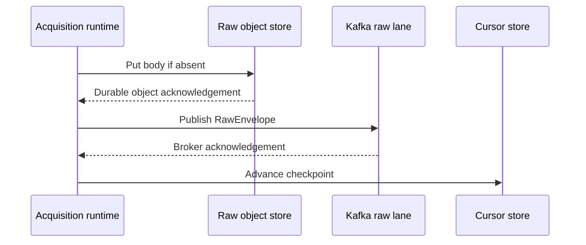
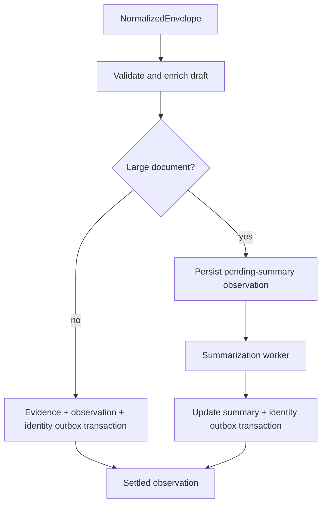
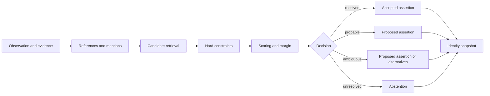
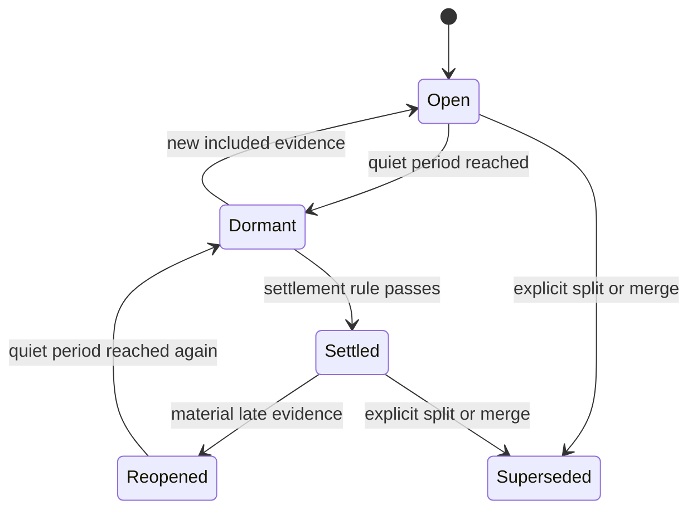
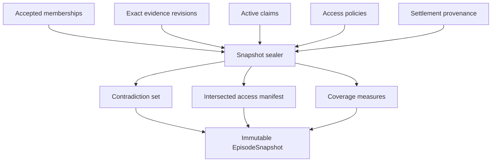
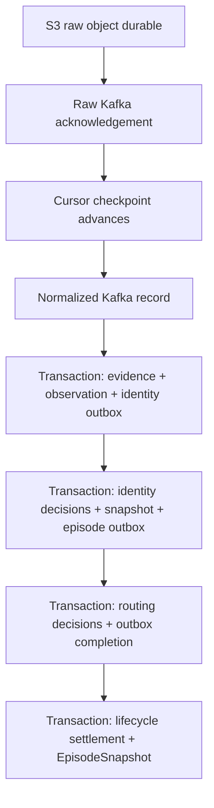

# Fyralis Data Ingestion — Subsystem Input, Process, and Output

**Start:** An external source and its changing native data<br>
**Finish:** An immutable, content-addressed `EpisodeSnapshot`<br>
**Scope:** The automatic source-ingestion path. Query-created episodes reuse the identity and situation stages but are not the primary flow described here.

## 1. The complete transformation

Fyralis progressively adds interpretation while retaining every earlier representation:

```text
External source
  -> bound source installation
  -> native SourceRecord
  -> durable raw object + RawEnvelope
  -> NormalizedEnvelope
  -> source evidence + observation
  -> identity snapshot
  -> immutable knowledge snapshot + evidence-bound claims
  -> topic + membership assertions
  -> settled episode
  -> EpisodeSnapshot
```

The system contains ten logical subsystems. All ten form the production path. A knowledge snapshot may legitimately contain zero claims, but the knowledge-settlement barrier is mandatory so the router always receives a fixed, replayable claim set.

| # | Plane | Subsystem | Input | Output |
| ---: | --- | --- | --- | --- |
| 1 | Perception | Source connection and authority | External provider, tenant configuration, credentials | Bound installation with permitted capabilities |
| 2 | Perception | Source acquisition | Bound installation, provider state and events | Native `SourceRecord` values and proposed checkpoint |
| 3 | Perception | Raw evidence capture | Native record bytes and ingress metadata | Durable raw object and `RawEnvelope` |
| 4 | Perception | Normalization | `RawEnvelope`, raw body, connector normalizer | One or more `NormalizedEnvelope` values |
| 5 | Perception | Evidence and observation settlement | `NormalizedEnvelope` | `source_evidence`, observation, identity-intake event |
| 6 | Identity and Knowledge | Entity resolution | Observation, evidence, identity-intake event | Immutable complete or partial identity snapshot |
| 7 | Identity and Knowledge | Claim grounding and knowledge settlement | Observation, evidence, immutable identity snapshot | Immutable knowledge snapshot with zero or more evidence-bound claims |
| 8 | Situation | Topic routing and membership | Episode-intake v3, identity and knowledge snapshots, source structure | Topic, episode, membership assertions |
| 9 | Situation | Episode lifecycle and settlement | Episode plus accepted memberships | Settled episode state and settlement provenance |
| 10 | Situation | Snapshot sealing | Settled episode, memberships, evidence, claims | Immutable `EpisodeSnapshot` |

## 2. Whole-system flow

```mermaid
flowchart LR
    EXT[External source]

    subgraph P[Perception Plane]
      S1[1. Source connection<br/>and authority]
      S2[2. Acquisition]
      S3[3. Raw evidence<br/>capture]
      S4[4. Normalization]
      S5[5. Evidence and<br/>observation settlement]
    end

    subgraph IK[Identity and Knowledge Plane]
      S6[6. Entity resolution]
      S7[7. Claim grounding and<br/>knowledge settlement]
      IS[(Identity snapshot)]
      CL[(Knowledge snapshot)]
    end

    subgraph ST[Situation Plane]
      S8[8. Topic routing<br/>and membership]
      S9[9. Lifecycle<br/>and settlement]
      S10[10. Snapshot sealing]
      ES[(EpisodeSnapshot)]
    end

    EXT --> S1 --> S2 --> S3 --> S4 --> S5
    S5 --> S6 --> IS
    IS --> S7 --> CL --> S8
    S5 --> S8
    S8 --> S9 --> S10 --> ES
```



The three inputs into episode routing have different roles:

- the observation and source evidence say **what was observed and where it came from**;
- the identity snapshot says **what its references may denote**; and
- claims say **what was asserted, by whom, and about what**.

Both immutable snapshots are admission requirements. The identity snapshot may be partial and the knowledge snapshot may contain zero claims, but neither boundary may be omitted.

## 3. Subsystem 1 — Source connection and authority

### Input

- External provider such as Slack, Notion, Jira, GitHub, Fireflies, or Google Drive.
- Fyralis connector manifest and implementation.
- Tenant installation request.
- OAuth grant, API key, token, gateway session, or other credential material.
- Requested provider resources and permissions.

### Process

1. The source catalog validates the connector ID and declared capabilities.
2. Installation ingress performs OAuth or configuration exchange.
3. Credentials are stored as opaque secret references.
4. The common control plane records installation generation, authority, callbacks, configuration, and lifecycle.
5. Runtime binding verifies tenant, source, generation, lifecycle, active grants, and manifest permission ceilings.
6. Only capabilities declared and currently authorized are exposed.

### Output

A tenant-scoped bound installation containing:

- connector ID and version;
- installation ID and installation scope;
- active capability set;
- least-authority credential grants;
- lifecycle state; and
- provider state namespaces for cursors, subscriptions, or gateway resume data.

### Coherence guarantee

The connector cannot choose a tenant or escape its installation authority. The installation scope established here remains part of evidence and identity keys throughout the pipeline.

## 4. Subsystem 2 — Source acquisition

### Input

- Bound installation from Subsystem 1.
- Provider events or current provider state.
- Previous cursor, checkpoint, subscription, or gateway resume state.
- Requested backfill window or selected resources.

### Process

The runtime invokes the connector through one of the supported acquisition capabilities:

| Acquisition mode | Process |
| --- | --- |
| Webhook | Resolve installation, verify request, decode native events |
| Historical pull | Plan shards, fetch pages, and propose checkpoints |
| Incremental poll | Fetch changes after a durable cursor with optional overlap |
| Push subscription | Create or renew watches; callback triggers incremental polling |
| Gateway stream | Open session, receive records, and propose resume state |
| Reconciliation | Compare completed shards and create repair work for gaps |

Each connector converts provider responses into `SourceRecord` values with native type, payload, identity hints, event time, and optional `SourceObjectRef`.

### Output

- One or more `SourceRecord` values.
- Native raw bytes or serializable payload.
- Ingress kind: webhook, gateway, Pub/Sub, backfill, or poll.
- Proposed next cursor, checkpoint, or resume state.
- Provider delivery and verification metadata.

### Coherence guarantee

The connector may propose progress, but the host does not persist that progress until the raw record has been stored and published successfully.

## 5. Subsystem 3 — Raw evidence capture

### Input

- Native source record and exact provider body.
- Tenant, source, and connector installation identity.
- Ingress kind and metadata.
- Idempotency hints.

### Process

1. Compute a cryptographic content hash of the provider body.
2. Build a tenant- and source-scoped object-storage key.
3. Store the body using content-addressed `put_if_absent` semantics.
4. Build a versioned `RawEnvelope` pointing to the stored object.
5. Publish the envelope to the source's raw Kafka lane.
6. Wait for broker acknowledgement.
7. Only then allow the acquisition owner to advance its cursor or resume state.



### Output

- Durable raw object containing the exact provider body.
- `RawEnvelope` containing:
  - tenant ID;
  - source;
  - connector installation ID;
  - raw object key;
  - content hash;
  - ingestion time;
  - ingress kind;
  - connector and parser versions; and
  - ingress and idempotency metadata.

### Coherence guarantee

Raw durability precedes progress. If object storage or Kafka fails, the provider checkpoint does not advance, so the signal remains recoverable.

## 6. Subsystem 4 — Normalization

### Input

- `RawEnvelope` from the raw Kafka lane.
- Exact raw body retrieved from object storage.
- Bound connector identity and normalization capabilities.

### Process

1. Validate envelope version, source, tenant, and raw content hash.
2. Reconstruct a source-contract `SourceRecord`.
3. Ask the connector identity capability for stable native identity where applicable.
4. Ask the connector normalization capability to interpret the native record.
5. Produce one or more source-independent `ObservationDraft` values.
6. Attach the complete raw lineage to each normalized record.
7. Publish each `NormalizedEnvelope` to the normalized Kafka lane.

Normalization extracts fields such as:

- source channel;
- natural-language content;
- structured content;
- source event time;
- trust tier;
- source actor reference;
- source external ID;
- structured entity hints; and
- source object, revision, hierarchy, thread, and access policy.

### Output

One or more `NormalizedEnvelope` values containing both:

- normalized `ObservationDraft` fields; and
- upstream tenant, installation, raw object, content hash, ingress, and producer-version lineage.

### Coherence guarantee

Normalization never discards the raw pointer. Every semantic interpretation remains traceable to the exact provider bytes and the versioned connector code that produced it.

## 7. Subsystem 5 — Evidence and observation settlement

### Input

- `NormalizedEnvelope` from Subsystem 4.
- PostgreSQL evidence and observation stores.
- Optional embedding and summarization workers.

### Process

The observation writer reconstructs the draft and runs one transaction:

1. Validate structured content and timestamps.
2. Resolve any already-known source actor mapping.
3. Resolve exact known aliases and retain unresolved phrases.
4. Compute an embedding or mark embedding work pending.
5. Build one `source_evidence` revision.
6. Deduplicate by tenant, source, installation scope, native object, revision, and operation.
7. Insert one observation linked to the evidence ID.
8. Insert `observation.ready_for_identity` into the identity outbox.
9. Commit the transaction.

For large documents, the initial observation is marked summary-pending and is not released to identity. After summarization, the summarized observation and its provenance are committed, then identity intake is enqueued.



### Output

- `source_evidence` row representing one exact source revision.
- Observation linked to that evidence.
- Optional unresolved actor and phrase markers.
- Optional embedding or summarization work.
- Durable `observation.ready_for_identity` event.

### Coherence guarantee

Evidence, observation, and identity-intake work are transactionally connected. There cannot be a committed observation that was intended for identity processing but lost its durable handoff.

During the current cutover, this transaction also emits the legacy direct T1 reasoning trigger. That parallel trigger is not part of the source-to-`EpisodeSnapshot` path and must eventually be retired when episode-based reasoning becomes authoritative.

## 8. Subsystem 6 — Entity resolution

### Input

- `observation.ready_for_identity` outbox item.
- Exact observation and evidence revision.
- Installation-scoped source actor and structured entity hints.
- Existing source references, actor mappings, aliases, actors, and constraints.

### Process

1. Lease the identity-intake item.
2. Revalidate observation and evidence lineage.
3. Register stable installation-scoped source references.
4. Register evidence-bound actor, structured, and unresolved-text mentions.
5. Start a versioned resolver run with a deterministic input hash.
6. Retrieve candidates from:
   - accepted principal mappings;
   - deterministic source references;
   - structured candidate hints;
   - exact or fuzzy aliases; and
   - actor display names and email addresses.
7. Apply expected-type, valid-time, must-link, and cannot-link constraints.
8. Compute inspectable weighted scores and runner-up margins.
9. Decide `resolved`, `probable`, `ambiguous`, or `unresolved` for every mention.
10. Persist candidates and any proposed or accepted `refers_to` assertions.
11. Seal an immutable, content-addressed identity snapshot.
12. Atomically enqueue `identity.ready_for_knowledge` and complete identity intake.



### Output

- Versioned resolver run.
- Registered source references and mentions.
- Ranked candidate records with features and reasons.
- Identity assertions and dependent links when applicable.
- Immutable `IdentityResolutionSnapshot`.
- Snapshot status:
  - `partial` when any mention is ambiguous or unresolved;
  - `complete` otherwise.
- `identity.ready_for_knowledge` containing observation/evidence and immutable identity snapshot lineage.

### Coherence guarantee

Partial identity does not block situation construction. The exact snapshot used by the episode router is carried by ID and hash, so later corrections cannot silently change the meaning of an already-constructed episode version.

## 9. Subsystem 7 — Evidence-bound claim grounding and knowledge settlement

This is a mandatory replay barrier after identity resolution.

### Input

- Settled observation and exact evidence revision.
- Observation text.
- Available claimant, subject, and identity references.
- Deterministic, model, or human claim extractor.

### Process

1. Extract a claimant, subject, predicate, object value, modality, and polarity.
2. Assign valid time and confidence.
3. Select the exact supporting character span in the observation.
4. Hash the selected text span.
5. Validate that the observation belongs to the same evidence revision.
6. Reject spans that exceed or do not hash to the observation text.
7. Persist the claim with extractor name, kind, version, and run ID.
8. Supersede earlier claims instead of overwriting them.
9. Select the exact active claim IDs after extraction.
10. Seal a content-addressed knowledge snapshot containing identity lineage, claim-set hash, extractor version, and manifest.
11. Atomically enqueue episode-intake contract v3.

### Output

An immutable `perception_knowledge_snapshot` plus zero or more active `perception_claims`, each carrying:

- claimant reference;
- subject reference;
- predicate and object;
- asserted, asked, proposed, planned, reported, denied, or unknown modality;
- positive, negative, or unknown polarity;
- confidence and valid time;
- evidence ID, observation ID, exact span, and span hash; and
- extractor provenance.

### Coherence guarantee

A claim cannot cite text outside its observation or evidence revision. Contradictions can later be computed without detaching beliefs from their claimants or sources.

The production worker retains existing source-specific claims, otherwise runs a conservative deterministic structured/status extractor. Claim insertions and status changes enqueue `claim.changed`; repeated work converges on the same content-addressed snapshot. A changed claim set produces a new v3 routing input, which can reactivate or reopen the affected episode.

## 10. Subsystem 8 — Topic routing and membership

### Input

- `observation.ready_for_episode` contract v3.
- Observation and exact source evidence.
- Required identity snapshot.
- Required knowledge snapshot and its exact claim IDs.
- Existing active topics and episodes for the tenant.

### Process

1. Lease the perception-outbox item.
2. Verify that observation, evidence, and identity snapshot lineage still match.
3. Assemble a source-independent routing signal containing:
   - stable entity and contextual anchors;
   - participants;
   - claim subjects and predicates;
   - source thread, parent, and container structure;
   - lexical terms;
   - event and ingestion times; and
   - source and installation scope.
4. Retrieve candidate topics in the same tenant.
5. Compare primary anchors, other anchor overlap, claim overlap, source structure, lexical terms, and time.
6. Apply a hard negative when stable primary anchors conflict.
7. Produce `include`, `hold`, or `exclude` decisions.
8. If nothing is included, create a new automatic topic and episode from the signal's primary anchor.
9. Persist all selected membership decisions with scores, reasons, features, producer versions, evidence, identity assertions, and claim IDs.
10. Open a new episode or reopen a settled episode when material late evidence arrives.

### Output

- Durable topic intent and topic version when newly created.
- Episode identity.
- Router run with input and result hashes.
- Append-only membership assertions:
  - `include` for accepted evidence;
  - `hold` for plausible but insufficient evidence; and
  - `exclude` for hard negatives or insufficient overlap.
- Open or reopened episode state.

### Coherence guarantee

Membership is an explainable assertion, not an opaque episode foreign key. Stable identity and source structure outrank lexical similarity, preventing similarly worded but unrelated situations from being merged.

## 11. Subsystem 9 — Episode lifecycle and settlement

### Input

- Episode identity and lifecycle history.
- Accepted include memberships.
- Event-time and ingestion-time watermarks.
- Settlement policy and quiet-period configuration.

### Process

1. Ensure the first included membership produces an `open` lifecycle event.
2. Update episode event and ingestion watermarks as memberships arrive.
3. After the configured quiet period, mark an open or reopened episode `dormant`.
4. Evaluate a named settlement rule such as quiet period, explicit close, query-scope satisfaction, or supersession.
5. Append a `settled` lifecycle event with rule version, causal reference, and watermarks.
6. If material late evidence is included later, append `reopened` and repeat the cycle.



### Output

- Append-only episode lifecycle event.
- Settled episode state.
- Event-time watermark.
- Ingestion-time watermark.
- Settlement reason, rule version, evaluation time, and causal provenance.

### Coherence guarantee

Settlement describes boundary stability, not truth. The episode may contain incomplete identity, opposing claims, or unresolved membership candidates and still settle under an explicit policy.

The constructor invokes `dormant -> open` for new included evidence and `settled -> reopened` for material late evidence. Settlement then produces a successor immutable snapshot rather than mutating prior history.

## 12. Subsystem 10 — Episode snapshot sealing

### Input

- Settled episode from Subsystem 9.
- Latest accepted include membership for every observation.
- Exact observations and source evidence.
- Active claims referenced by memberships.
- Source access policies.
- Settlement provenance and prior episode snapshot.

### Process

1. Serialize snapshot creation with an episode-scoped database lock.
2. Select the latest accepted include decision per observation.
3. Build exact observation, evidence, membership, and claim manifests; identity-snapshot and assertion lineage remains reachable through each membership assertion.
4. Detect contradictions among claims with the same subject and predicate when polarity or values conflict.
5. Preserve contradictions without selecting a winner.
6. Intersect every included source-evidence access policy.
7. Fail closed if evidence lineage or access data is incomplete.
8. Compute coverage, exclusion, hold, citation, contradiction, and authorization metrics.
9. Record event and ingestion watermarks plus settlement data.
10. Hash the stable input manifest.
11. Reuse an identical prior snapshot or create the next immutable snapshot version.

### Output

The final `EpisodeSnapshot`, containing:

- snapshot, topic, and episode identity;
- monotonically increasing version;
- prior snapshot link;
- immutable snapshot hash;
- included observation IDs;
- exact evidence IDs;
- claim IDs;
- membership assertion IDs;
- preserved contradiction set;
- composed access-policy manifest;
- coverage and quality measures;
- event and ingestion watermarks;
- lifecycle state; and
- settlement provenance.



### Coherence guarantee

The snapshot is the reproducible final state of ingestion. Its hash changes when its evidence, memberships, contradictions, access policy, or settlement basis changes. Later evidence creates a successor snapshot rather than mutating this one.

## 13. The identity and provenance spine

Coherence depends on identifiers being carried forward rather than regenerated at every stage.

| Identifier or property | Created in | Carried into |
| --- | --- | --- |
| `tenant_id` | Installation binding | Every envelope, row, outbox item, and snapshot |
| `connector_installation_id` / installation scope | Source connection | Raw envelope, evidence, source references, routing features |
| Content hash and raw object key | Raw capture | Raw envelope and source evidence |
| Source object ID and revision ID | Connector normalization | Source evidence and observation deduplication |
| `evidence_id` | Evidence settlement | Observation, mentions, claims, assertions, memberships, snapshot |
| `observation_id` and event time | Observation settlement | Identity run, episode intake, memberships, snapshot |
| `identity_snapshot_id` and hash | Entity resolution | Episode intake, router run, membership explanation |
| Claim IDs | Claim grounding | Routing signal, membership assertion, contradictions, snapshot |
| Membership assertion IDs | Episode routing | Lifecycle causes and snapshot manifest |
| Episode ID and topic ID | Topic creation | Lifecycle history and every snapshot version |
| Snapshot hash | Snapshot sealing | Final replay, citation, cache, and downstream reasoning identity |

This chain makes it possible to answer:

- Which exact provider revision caused this observation?
- Which identity decisions were used when it joined this episode?
- Which claims and contradictions were visible at settlement?
- Which access policies constrained the snapshot?
- Which producer and policy versions made each decision?

## 14. Transaction and delivery boundaries



The system combines at-least-once delivery with stable idempotency keys:

- provider redelivery converges on the same source evidence revision;
- Kafka redelivery converges on the same observation;
- identity retry converges on the same resolver run and snapshot;
- episode retry converges on the same router run and memberships; and
- snapshot retry converges on the same stable input hash.

## 15. Alpen Audit Week end-to-end example

```mermaid
sequenceDiagram
    participant N as Notion
    participant I as Fyralis ingestion
    participant ID as Identity
    participant EP as Episode constructor
    participant SS as Snapshot sealer

    N->>I: Security Audit page revision 17
    I->>I: Raw object and RawEnvelope
    I->>I: Normalized observation and source evidence
    I->>ID: Observation plus evidence
    ID->>ID: Resolve known people; retain Audit Week as context
    ID->>EP: Partial or complete identity snapshot
    EP->>EP: Route through security-audit anchor
    Note over EP: Slack, Jira, and meeting observations<br/>follow the same independent source path
    EP->>EP: Include shared audit evidence; exclude marketing audit
    EP->>SS: Settle after quiet period
    SS->>SS: Preserve conflicting authentication claims
    SS-->>I: Immutable cross-source EpisodeSnapshot
```

What makes the episode coherent is not that every source says the same thing. It is that every included observation shares sufficient structural or organizational grounding, while disagreements and uncertainty remain explicitly represented.

## 16. Final contract

The ingestion system is finished when it can produce an `EpisodeSnapshot` for a bounded organizational situation with:

1. exact source revisions;
2. complete raw and normalized provenance;
3. membership assertions that retain the identity snapshot used during construction;
4. explainable membership decisions;
5. claimant-separated and evidence-bound claims when available;
6. preserved contradictions;
7. event-time and ingestion-time boundaries;
8. a fail-closed access-policy intersection;
9. settlement provenance; and
10. an immutable content hash.

The snapshot is the last ingestion artifact and the first safe unit for coherent reasoning.
