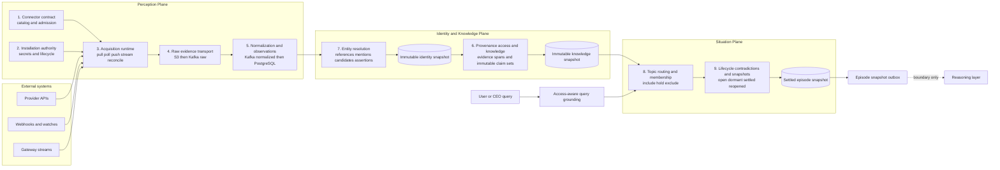
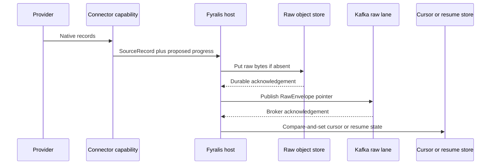
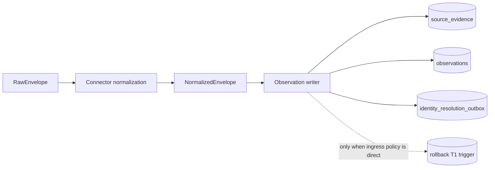
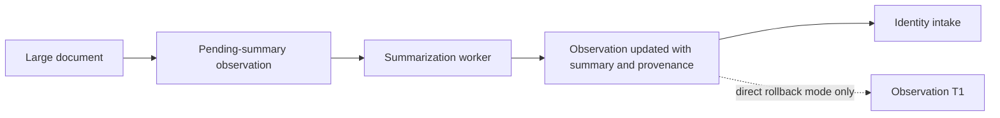
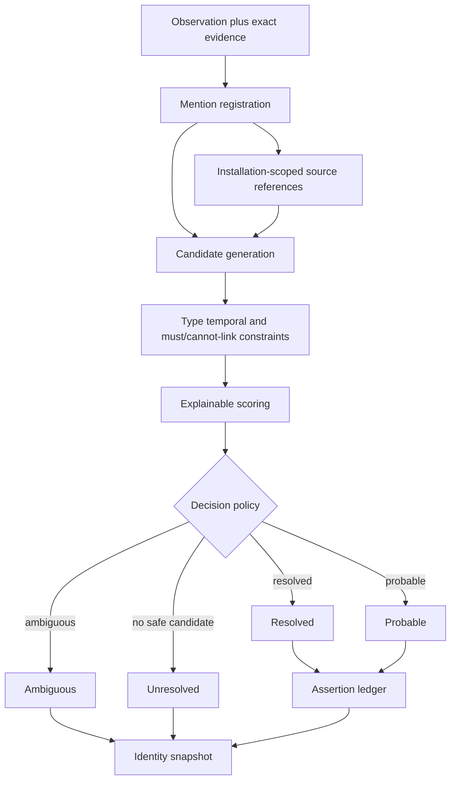
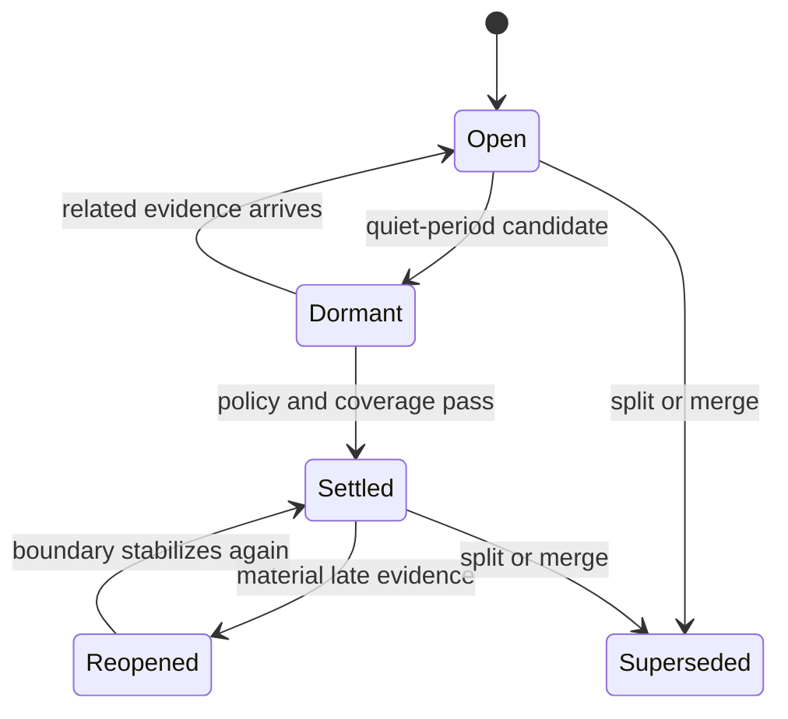
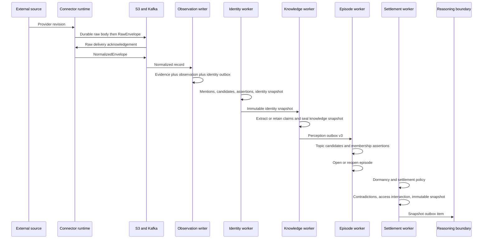
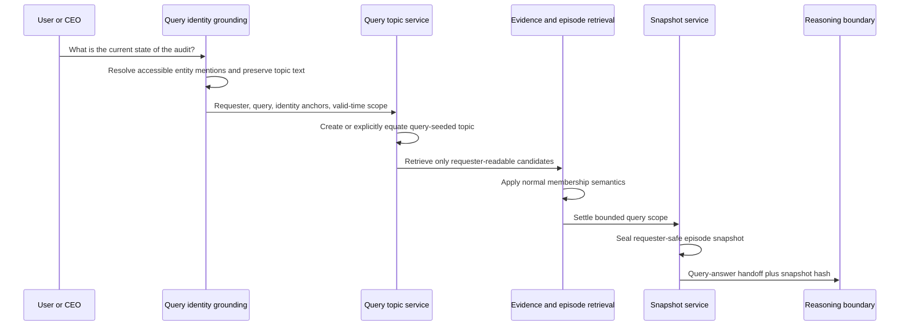
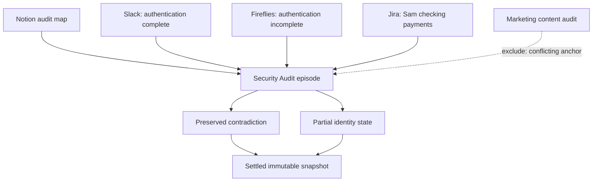

# Fyralis Data Ingestion System

**Status:** Consolidated architecture of the implemented source-to-episode path<br>
**Scope:** External source connection through settled episode snapshot and durable reasoning handoff<br>
**Boundary:** This document stops when external observations have been settled into episodes. Model reasoning and Company World Model mutation are downstream systems.

## 1. Executive summary

Fyralis ingestion is not merely an ETL pipeline. It is an organizational perception system that progressively turns provider-specific revisions into source-independent, identity-grounded, situation-bounded evidence packages.

The system is divided into three planes and nine subsystems:

| Plane | Subsystem | Primary output |
| --- | --- | --- |
| Perception | 1. Connector definition and admission | Validated connector capabilities |
| Perception | 2. Installation, authority, and lifecycle | Runnable tenant-scoped installation |
| Perception | 3. Source acquisition and reconciliation | Provider records from push, pull, poll, or stream |
| Perception | 4. Raw evidence transport | Durable raw object plus versioned pointer |
| Perception | 5. Normalization and observation construction | Immutable evidence revision and normalized observation |
| Identity and Knowledge | 6. Claims, provenance, and access | Evidence-bound semantic claims and policies |
| Identity and Knowledge | 7. Entity resolution | Immutable complete or partial identity snapshot |
| Situation | 8. Topic routing and episode membership | Explainable include, hold, and exclude assertions |
| Situation | 9. Episode lifecycle, snapshots, and handoff | Immutable settled episode snapshot |

The central architectural idea is progressive lossless interpretation:

```text
provider bytes
  -> source evidence
  -> observation
  -> identity snapshot
  -> knowledge snapshot containing the exact claim set
  -> episode membership
  -> settled episode snapshot
```

Each step adds interpretation without deleting the prior representation. Uncertainty, contradictory claims, access restrictions, source revisions, and producer versions remain inspectable.

## 2. Whole-system architecture



Two control flows enter the Situation Plane:

1. **Autonomous perception:** newly ingested observations cause Fyralis to create or update episodes.
2. **Query-triggered perception:** a user question creates a requester-scoped topic and a bounded evidence episode before reasoning.

Both flows use the same identity, membership, access, snapshot, and citation semantics.

## 3. Core data concepts

| Concept | Meaning |
| --- | --- |
| Source record | A connector-owned representation of one native provider record. |
| Raw object | The exact provider bytes stored content-addressably in object storage. |
| Source evidence | One immutable source-object revision with lineage, valid time, access policy, and raw pointer. |
| Observation | Fyralis's normalized interpretation of that evidence revision. |
| Source reference | A tenant- and installation-scoped native identity such as a Slack user or Jira issue. |
| Entity mention | An evidence-bound occurrence that may refer to a canonical entity or remain unresolved. |
| Identity assertion | A versioned statement such as `refers_to`, `same_as`, or `not_same_as`. |
| Identity snapshot | The exact identity decisions used for one observation or query. |
| Claim | A subject-predicate-object assertion tied to an exact evidence span and claimant. |
| Topic | A durable routing intent grounded by anchors and a valid-time scope. |
| Episode | A versioned container for evidence about one organizational situation. |
| Membership assertion | An explainable decision that an observation is included, held, or excluded. |
| Episode snapshot | An immutable evidence manifest for a specific episode version. |

An episode is therefore not a summary or a cluster label. It is a reproducible, access-controlled batch of organizational evidence prepared for coherent downstream reasoning.

## 4. Plane I — Perception

The Perception Plane answers: **What did an external system emit, and how did Fyralis observe it?**

### 4.1 Subsystem 1 — Connector definition and admission

The Source Connector Contract is the only execution contract for the 26 source families currently in the catalog:

`slack`, `github`, `discord`, `gmail`, `notion`, `google_calendar`, `google_drive`, `jira`, `mercury`, `quickbooks`, `grafana`, `telegram`, `brex`, `ramp`, `gusto`, `deel`, `fireflies`, `signal`, `aws`, `miro`, `figma`, `carta`, `hibob`, `ashby`, `linkedin`, and `whatsapp`.

A connector definition declares:

- stable connector identity and version;
- supported ingress kinds;
- required credentials and provider permissions;
- source trust ceiling;
- installation and lifecycle facets; and
- optional discovery, backfill, polling, webhook, subscription, gateway, normalization, identity, and reconciliation capabilities.

The manifest-derived registry validates definitions before they become runnable. Capability presence determines behavior; the host does not infer support through source-specific conditionals.

The responsibility boundary is strict:

| Connector owns | Fyralis host owns |
| --- | --- |
| Provider protocol and pagination meaning | Tenant selection and isolation |
| Webhook decoding and source-specific verification | Secret storage and least-authority grants |
| Native cursor semantics | Durable cursor advancement |
| Native record identity | S3, Kafka, PostgreSQL, retries, and DLQs |
| Source normalization | Topic selection and downstream orchestration |

This prevents a connector from bypassing provenance, delivery, access, or retry policy.

### 4.2 Subsystem 2 — Installation, authority, and lifecycle

A connector definition is global; an installation is its tenant-scoped binding to a provider account or workspace.

The common installation control plane owns:

- OAuth and non-OAuth configuration;
- opaque secret references rather than exposed credentials;
- requested and granted authority;
- connector generation and configuration state;
- installation-scoped callback endpoints;
- provider subscription and cursor state;
- health conditions and operator actions; and
- lifecycle states `Ready`, `Paused`, `Maintenance`, and `Removed`.

Installation ingress is unified:

```text
GET  /integrations/{source}/install
GET  /integrations/{source}/callback
POST /integrations/{source}/configure
POST /webhooks/{source}/callback/{endpoint_id}
```

Before a capability is invoked, binding validates tenant, connector, generation, lifecycle, active authority, and the permission ceiling declared by the manifest. Missing or stale authority fails closed.

Installation scope is carried forward into evidence and identity keys. The same Slack user ID or Jira issue ID in two workspaces is not treated as the same organizational object.

### 4.3 Subsystem 3 — Source acquisition and reconciliation

The acquisition runtime converts provider activity into bounded `SourceRecord` values using several execution archetypes.

| Mode | Behavior |
| --- | --- |
| Historical pull | Plans source-owned shards, fetches pages, and checkpoints acknowledged progress. |
| Incremental poll | Reads Ready or Degraded installations using an installation cursor and overlap window. |
| Webhook | Resolves the installation, verifies the bounded request, and decodes native events. |
| Push subscription | Creates or renews Gmail, Calendar, or Drive provider subscriptions; callbacks trigger polling. |
| Gateway stream | Supervises Discord, Telegram, or Signal sessions with leased resume state. |
| Reconciliation | Detects gaps after ingestion and proposes repair shards. |

Acquisition workers own leases, retry budgets, cancellation, and progress. A connector returns typed records and cursor state, but cannot durably advance progress itself.

The critical delivery order is:



If storage or publication fails, source progress does not advance.

### 4.4 Subsystem 4 — Raw evidence transport

Raw emission creates a durable, replayable boundary before semantic interpretation.

For each provider body, Fyralis:

1. computes a content hash;
2. builds a tenant- and source-scoped object key;
3. performs an S3 `put_if_absent`;
4. constructs a versioned `RawEnvelope`; and
5. publishes the pointer to the source's raw Kafka topic.

The raw body remains in object storage. Kafka carries a small pointer containing:

- tenant and source;
- connector installation ID;
- raw object key and content hash;
- ingress kind and ingestion time;
- connector and parser versions; and
- idempotency and ingress metadata.

This design provides exact replay without placing large documents or transcripts directly on Kafka.

### 4.5 Subsystem 5 — Normalization and observation construction

The normalizer fetches the raw object and invokes the bound connector's identity and normalization capabilities. It emits one or more `NormalizedEnvelope` records containing `ObservationDraft` fields plus complete raw lineage.

The observation writer then performs one transaction per normalized envelope:



Within the transaction it:

- persists or deduplicates the exact `source_evidence` revision;
- persists the normalized observation linked to that evidence;
- records source actor references, structured entity hints, and unresolved phrases;
- computes an embedding or marks it pending;
- enqueues `observation.ready_for_identity`; and
- enqueues the direct T1 reasoning trigger only when the tenant's reasoning-ingress policy is `direct`; production defaults to `episode`.

Evidence deduplication uses tenant, source, installation scope, source object type, source object ID, source revision ID, and operation. A redelivery of the same revision converges; an edit, deletion, retraction, or later revision remains new evidence.

#### Large-document path

Large Drive, Notion, or Fireflies documents can be withheld from identity and episode intake until summarize-on-ingest completes:



The original raw object remains the evidence root. The completed summary becomes the observation representation used by downstream identity and episode construction.

## 5. Plane II — Identity and Knowledge

The Identity and Knowledge Plane answers: **What organizational referents and claims does this evidence contain, and how certain are those interpretations?**

### 5.1 Subsystem 6 — Provenance, access, and claims

`source_evidence` is the provenance spine of the system. Each revision records:

- provider object and revision identity;
- connector installation scope;
- raw object key and content hash;
- operation, parent, container, and thread structure;
- source-recorded, valid, normalized, and ingestion times;
- connector, parser, normalizer, and contract versions; and
- the captured source access policy and its hash.

An observation is an interpretation of evidence, not a replacement for it. Claims add further interpretation while remaining bound to an exact observation and evidence revision.

A `perception_claim` contains:

- claimant, subject, predicate, and object;
- modality such as asserted, asked, proposed, planned, reported, or denied;
- positive, negative, or unknown polarity;
- confidence and valid-time range;
- exact character offsets and a hash of the cited text span; and
- extractor kind, name, version, and optional run ID.

Claims are append-oriented. A correction supersedes an earlier claim rather than rewriting its history.

Access is conservative:

- every evidence revision retains its source policy;
- a query must be authorized for every selected evidence item;
- an episode's policy is the intersection of all included evidence policies; and
- missing or `unknown` ACL state is a denial for requester-scoped use.

The knowledge worker preserves source- or human-produced active claims when they already exist. Otherwise it applies a conservative, versioned deterministic extractor to structured claim payloads and bounded status sentences. It then seals the exact active claim IDs, identity snapshot lineage, producer version, manifest, and content hashes in an immutable `perception_knowledge_snapshot`. A claim insert or status change automatically schedules re-settlement, so late knowledge can reroute and reopen affected episodes. Relations are not yet a first-class routing input; the current router consumes identity anchors, claims, source structure, lexical terms, and time.

### 5.2 Subsystem 7 — Entity resolution

Entity resolution turns source-bound references and mentions into explainable identity decisions without forcing every phrase into a canonical entity.

The current scope separates:

1. **Source references:** deterministic installation-scoped provider identities.
2. **Canonical entities:** durable organizational referents backed by sufficient evidence.
3. **Contextual referents:** phrases such as “Audit Week” or “mainnet launch” that can anchor an episode without becoming canonical entities.

The resolver executes this cascade:



Candidate sources include:

- deterministic source references;
- accepted principal mappings;
- structured connector hints;
- exact or fuzzy aliases;
- actor-name matches; and
- bounded context providers.

Deterministic mappings and must-link constraints outrank statistical scores. Cannot-link and incompatible-type constraints reject a candidate. The scorer persists retrieval methods, features, scores, rank, alternatives, and reasons.

The current decision policy uses type-specific thresholds. For people, automatic acceptance requires `0.98` with a `0.12` lead over the runner-up; the default is `0.95` with a `0.15` lead. Ambiguity or abstention is preferred to a false merge.

Every worker run seals an immutable, content-addressed identity snapshot. A `partial` snapshot is valid and proceeds to episode construction. Later corrections enqueue targeted re-resolution and produce new snapshots; prior snapshots remain reproducible.

## 6. Plane III — Situation

The Situation Plane answers: **Which observations jointly describe the same bounded organizational situation?**

### 6.1 Subsystem 8 — Topic creation, routing, and membership

Episode construction consumes `observation.ready_for_episode` contract v3. The event must contain observation/evidence lineage, identity snapshot ID/hash/status, immutable knowledge snapshot ID/hash, and claim-set hash.

The signal assembler builds a source-independent routing signal from:

- canonical and installation-scoped identity anchors;
- contextual topic hints;
- claim subjects and predicates;
- source thread, parent, and container structure;
- lexical terms;
- event time and ingestion time; and
- source and installation scope.

A topic is a durable routing intent with one of three origins:

- `automatic` — Fyralis discovers a coherent situation;
- `query_seeded` — a user question defines retrieval intent and requester scope; or
- `human_pinned` — a person explicitly declares a topic worth monitoring.

The router first tries explicit equivalence and stable identity or situation anchors, then claims and source structure, and only then lexical and temporal similarity.

The current deterministic scoring policy is:

| Feature | Maximum contribution |
| --- | ---: |
| Equal primary anchor | 0.70 |
| Other anchor overlap | 0.45 |
| Claim-predicate overlap | 0.18 |
| Thread/container overlap | 0.16 |
| Lexical overlap | 0.12 |
| Temporal proximity | 0.04 |

Decision thresholds are:

- `include` at `>= 0.65` without a conflicting stable primary anchor;
- `hold` at `>= 0.30` when evidence is plausible but incomplete; and
- `exclude` otherwise.

A conflicting stable primary anchor is a hard negative. For example, a security audit and a marketing content audit remain separate even when both say “the audit is complete.”

Every decision records the score, feature snapshot, structured reasons, router version, observation and evidence IDs, claim IDs, identity assertion IDs, and installation scope. Positive, uncertain, and negative decisions are all durable.

If no candidate episode is included, an observation with a routing seed creates an automatic topic and episode. An observation may belong to zero, one, or many episodes.

### 6.2 Subsystem 9 — Lifecycle, contradictions, snapshots, and handoff

Episodes are event-driven state machines:



Settlement means that the episode boundary is sufficiently stable under a named rule and event/ingestion-time watermarks. It does not mean that every included claim is true or that the real-world situation has finished.

When an episode settles, the snapshot service:

1. selects the latest accepted include decision for each observation;
2. verifies complete evidence and observation lineage;
3. gathers active claims;
4. materializes opposing-polarity or incompatible-value contradictions;
5. intersects all evidence access policies;
6. records coverage and contamination proxies;
7. freezes event-time and ingestion-time watermarks;
8. seals an immutable, content-addressed manifest; and
9. atomically enqueues `episode.snapshot_settled`.

The snapshot contains exact observation, evidence, claim, membership, contradiction, and prior-snapshot IDs. Late evidence reopens the episode and eventually produces a successor snapshot rather than mutating history.

The handoff supports two modes:

- `automatic_update` for autonomously constructed episodes; and
- `query_answer` for requester-scoped query episodes.

The structured reasoning reader can only expose evidence and claims in the snapshot manifest. Query reads repeat the authorization check. This outbox and reader are the terminal boundary of the ingestion system.

## 7. End-to-end automatic flow



## 8. End-to-end query flow



Query wording alone never silently merges a query topic with an automatic topic. Reuse requires a recorded equivalence decision.

## 9. Contract chain

| Boundary | Contract | Durable identity |
| --- | --- | --- |
| Connector to host | `SourceRecord` | Native type, payload, source-object reference |
| Raw storage to normalizer | `RawEnvelope` | Tenant, source, installation, object key, content hash |
| Normalizer to writer | `NormalizedEnvelope` | Raw lineage plus `ObservationDraft` fields |
| Writer transaction | `source_evidence` + `observation` | Exact source revision and normalized interpretation |
| Observation to identity | `observation.ready_for_identity` | Observation ID, evidence ID, dedupe key |
| Identity to knowledge | `identity.ready_for_knowledge` | Observation, evidence, immutable identity snapshot lineage |
| Knowledge to situation | `observation.ready_for_episode` v3 | Observation, evidence, identity and knowledge snapshot hashes, exact claim-set hash |
| Router to lifecycle | Membership assertion | Topic, episode, evidence, decision, features, versions |
| Lifecycle to handoff | `EpisodeSnapshot` | Snapshot ID, hash, manifest, settlement, access policy |
| Ingestion boundary | `episode.snapshot_settled` | Snapshot identity and automatic/query mode |

Each boundary is versioned and replay-idempotent. Transactional outboxes prevent a committed database state from being separated from its downstream work item.

## 10. Storage and processing topology

| Store or transport | Responsibility |
| --- | --- |
| Connector manifests and registry | Source definitions, capabilities, admission evidence |
| PostgreSQL connector control tables | Installations, authority, lifecycle, cursors, callbacks |
| S3-compatible raw store | Exact provider bytes, content-addressed |
| Kafka raw topics | Versioned pointers to raw objects |
| Kafka normalized topics | Source-independent observation drafts |
| Kafka embedding/summarization/DLQ topics | Asynchronous enrichment and failure recovery |
| PostgreSQL perception tables | Evidence revisions and observations |
| PostgreSQL identity tables | References, mentions, candidates, constraints, assertions, snapshots, outbox |
| PostgreSQL situation tables | Topics, versions, episodes, memberships, lifecycle, contradictions, snapshots, outbox |

## 11. System-wide invariants

1. **Tenant and installation isolation:** native source IDs are never globally unique by assumption.
2. **Raw-before-progress:** raw durability and broker acknowledgement precede cursor advancement.
3. **Evidence before interpretation:** observations, mentions, claims, memberships, and snapshots retain exact evidence lineage.
4. **Append over mutation:** corrections and late evidence produce new revisions, assertions, events, or snapshots.
5. **At-least-once plus idempotency:** redelivery is expected; stable keys make replay converge.
6. **Dual time:** source/event time and Fyralis ingestion/recording time remain distinct.
7. **Uncertainty is data:** ambiguous identity and held membership do not block the rest of a situation.
8. **Contradiction preservation:** ingestion exposes incompatible beliefs but does not adjudicate truth.
9. **Access only narrows:** an episode cannot be more visible than any evidence item it includes.
10. **Versioned interpretation:** connector, parser, normalizer, resolver, extractor, router, and settlement versions remain attributable.
11. **Reasoning is snapshot-bound:** downstream reasoning must cite evidence present in the exact episode snapshot.

## 12. Failure and recovery model

| Failure point | Recovery behavior |
| --- | --- |
| Invalid installation or revoked authority | Fail closed before provider execution. |
| Provider authentication/rate limit/transient error | Typed connector error with host-owned retry policy. |
| Raw object write failure | Do not publish or advance source progress. |
| Raw Kafka publish failure | Raw object remains replayable; do not advance progress. |
| Normalization failure | Source-isolated retry or DLQ with raw pointer. |
| Observation validation or poison message | Durable retry cap, explicit DLQ, and committed offset after deliberate disposition. |
| Missing historical observation partition | Guarded monthly-partition self-heal, otherwise DLQ. |
| Summarization failure | Preserve raw evidence, record failure state, and publish DLQ evidence. |
| Identity worker failure | Lease expiry, bounded retry, then dead letter without losing the observation. |
| Episode constructor failure | Lease expiry, bounded retry, then dead letter without losing perception intake. |
| Late evidence | Reopen episode and create a successor snapshot. |
| Unknown evidence ACL | Deny requester use; never guess visibility. |

## 13. Alpen Audit Week example

Suppose Fyralis receives:

- a Notion page containing the audit map;
- a Slack message saying authentication is complete;
- a Fireflies meeting statement saying authentication is not complete;
- a Jira item saying Sam is still checking payments; and
- an unrelated marketing content audit using similar wording.

The system behaves as follows:

1. Each source revision is captured independently with its exact installation, object revision, raw pointer, timing, and ACL.
2. Normalizers create source-independent observations.
3. Simanta can resolve through a source-principal mapping from any supported installation that supplies sufficient evidence; resolution is not Slack-only.
4. “Audit Week” may remain a contextual audit/workstream anchor instead of being promoted to a canonical entity.
5. “Sam” may remain ambiguous. The partial identity snapshot still proceeds.
6. Notion, Slack, Fireflies, and Jira observations join the security-audit episode through the shared stable anchor.
7. The marketing audit receives an exclude assertion because its stable primary anchor conflicts.
8. Opposing authentication claims are retained as an unresolved contradiction.
9. Settlement produces an immutable snapshot containing all included source revisions, identity uncertainty, claims, membership explanations, temporal order, access policy, and citations.



## 14. Current implementation and production cutover status

The domain path and its production authority are wired end to end.

| Area | Current state |
| --- | --- |
| Connector contract, installations, acquisition, raw and normalized lanes | Implemented and represented in runtime entry points. |
| Evidence and observation persistence | Implemented in the observation writer and uniform ingest path. |
| Large-document summarization and identity release | Implemented. |
| Evidence-bound claim ledger and knowledge barrier | Implemented with deterministic extraction, immutable knowledge snapshots, late-claim reprocessing, and durable retries. |
| Identity resolution domain, outbox, worker, and snapshots | Implemented, integration-tested, and registered as a monitored production process. |
| Episode routing, lifecycle, workers, snapshots, and reasoning handoff | Implemented, integration-tested, and registered as constructor, settlement, and handoff processes. |
| Relation-driven routing | Not integrated into the episode signal assembler. |
| Reasoning authority cutover | Production uses `episode`; a global or tenant `direct` policy is the explicit rollback path. |
| Query answering | Query episode and handoff are implemented; answer generation belongs to the downstream reasoning system. |

The remaining work is evaluation rather than missing wiring: calibrate richer claim extraction and identity policies, measure episode coverage/contamination and downstream answer quality, and retain the explicit rollback mode during rollout.

## 15. Architectural boundary

This ingestion system is complete when a source or user query has produced a settled, immutable, authorized episode snapshot and a durable handoff event.

It deliberately does not:

- decide which contradictory employee belief is true;
- synthesize an organization-level belief;
- mutate goals, tasks, workflows, or the Company World Model;
- generate the final answer or interface; or
- execute side effects in external systems.

Those are reasoning and action-plane responsibilities. The ingestion system's job is to ensure that those systems receive the most coherent, complete, attributable, temporally explicit, and access-safe evidence batch Fyralis can construct.

## 16. Primary implementation map

| Concern | Location |
| --- | --- |
| Source contract and catalog | `services/ingest/source_contract/` |
| Connector implementations | `services/ingest/connectors/` |
| Connector registry and execution | `services/ingest/connector_runtime/` |
| Installation and lifecycle control | `services/ingest/connector_platform/` |
| Raw and normalized ingestion | `services/ingest/ingestion/` |
| Evidence access and persistence | `services/domain/evidence/` |
| Observations | `services/domain/observations/` |
| Evidence-bound claims | `services/domain/perception/` |
| Entity resolution | `services/domain/identity/` |
| Episode construction | `services/domain/episodes/` |
| Source/evidence/identity/episode schema | `db/migrations/0187` through `db/migrations/0200` |
| Perception pipeline runtime | `scripts/run_perception_pipeline_worker.py` |
