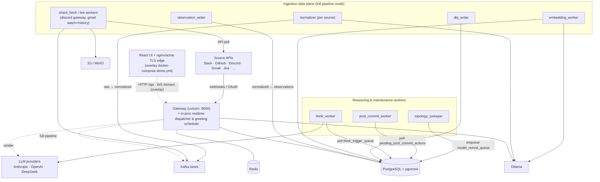

# Runtime & Data Plane

> Source: `docker-compose*.yml`, `scripts/run_*.py`, `pyproject.toml`,
> `db/migrations/`. Part of the [architecture overview](index.md).

**One-line:** the processes, containers, and data stores that host the layers —
a FastAPI gateway, a set of background/ingestion workers, PostgreSQL + pgvector
as the substrate, Ollama for embeddings, Redis for rate-limiting, and (for the
full ingestion pipeline) Kafka + an S3-compatible raw tier.

!!! note "Two deployment shapes"
    Local development per `README.md` runs only **Postgres + Ollama** (Docker)
    plus host processes started by `scripts/dogfood_up.sh` (gateway, Think worker,
    post-commit worker, topology sweeper). The richer multi-container
    topology below is what `docker-compose.yml` defines for a full/"production-ish"
    deployment. **TODO(human):** confirm which environment `docker-compose.yml`
    actually targets (dogfood / staging / production) and the HA story
    (it ships single-broker Kafka, `replication_factor=1`).

!!! note "UI and TLS edge live in the overlay"
    Core `docker-compose.yml` is **backend-only** (gateway + workers + data
    plane). The Vite/React UI container (`Dockerfile.ui`), the `nginx-proxy` /
    `acme-companion` TLS edge, and the `demo.fyralis.xyz` domain moved to the
    fyraliscore-demo overlay's `docker-compose.demo.yml`.

## Data stores

| Store | Role |
|-------|------|
| **PostgreSQL 16 + pgvector** | The substrate and control plane: actors/observations/models/acts/resources, durable queues, cache, audit/reconciliation/topology tables, plus `VECTOR(768)` semantic search. ~79 migrations in `db/migrations/`. |
| **Ollama** | Local embedding service (`nomic-embed-text`, 768-d) at `/api/embeddings`. |
| **Redis** | Rate-limiter state (token-bucket via Lua `EVALSHA`); optional cache backend. |
| **Kafka (KRaft)** | Per-source ingestion lanes (`ingestion.{raw,normalized,embedding,dlq}.{source}`) + a control-plane `tenant_traffic_signal` topic. Used only when the full pipeline is enabled. |
| **S3 / MinIO** | Raw-tier object storage (`fyralis-raw`) for ingestion payloads. |
| **Prometheus** | Metrics TSDB (15d / 2GB retention, loopback `:9090`). Scrapes the gateway, every worker's `:9300` health/metrics port, and the postgres/kafka/redis exporters. Config in `observability/prometheus/`. |
| **Grafana** | Dashboards + alerting (loopback `:3000`), fully provisioned from `observability/grafana/` (six dashboards, alert rules, contact point). See [Observability](observability_architecture.md). |

## Runtime topology

## Processes & containers

The `docker-compose.yml` stack (init one-shots, infra, then app processes):

- **Infra:** `postgres`, `ollama`, `kafka`, `minio`, `redis`; **init one-shots:**
  `migrate` (`scripts/docker-migrate.sh`), `kafka-init`
  (`scripts/provision_kafka_topics.py`), `minio-init` (bucket creation).
- **Ingress:** `gateway` (uvicorn). The UI container and the nginx-proxy /
  acme-companion TLS edge are **not** in core compose — they live in the overlay's
  `docker-compose.demo.yml`.
- **Backfill/onboarding workers:** `oauth_poller`, `tenant_onboarding`,
  `source_onboarding`, `shard_fetch`, `reconciler`, `periodic_reconciler`.
- **Ingestion consumer chain:** `normalizer`, `observation_writer`,
  `embedding_worker`, `embedding_backlog`, `dlq_writer`.
- **Live source workers:** `discord_gateway`, `gmail_watch`, `gmail_history`.
- **Reasoning:** `think_worker`, `post_commit_worker`.

!!! warning "`topology_sweeper` is not a compose service"
    Despite appearing in the runtime diagram above, `topology_sweeper` is **not**
    defined in `docker-compose.yml`. It runs as a host process via
    `scripts/run_topology_sweeper.py` (and is started by `scripts/dogfood_up.sh`).
    No `services/workers/*` package is wired into compose — see [Workers](workers.md).

`docker-compose.per-source.yml` overlays a per-source-isolated consumer topology
(one normalizer pinned per source via `INGESTION_SOURCE`), scaling the all-source
workers to zero. `docker-compose.dev.yml` is a thin dev overlay that brings up
Kafka + a moto-S3 mock.

## Key launch points

| Process | Entry point |
|---------|-------------|
| Gateway | `uvicorn services.app.gateway:app` (compose `gateway`). |
| Think worker | `scripts/run_think_worker.py`. |
| Post-commit worker | `scripts/run_post_commit_worker.py`. |
| Discord gateway / Gmail watch / Gmail history | `scripts/run_discord_gateway_worker.py`, `run_gmail_watch_scheduler.py`, `run_gmail_history_poller.py`. |
| Migrations | `scripts/docker-migrate.sh` (idempotent; tracks `schema_migrations`). |
| Kafka topics | `scripts/provision_kafka_topics.py` (derived from `RawEnvelope.SourceLiteral`). |
| Normalizer / writers | `python -m services.ingest.ingestion.normalizer.worker`, `…writers.observation_writer`, `…writers.dlq_writer.dlq_writer`, `…writers.embedding_worker.embedding_worker`. |

## How services communicate

- **HTTP / WS** — overlay UI ↔ gateway (`/api/*`, `/stream`); external providers → gateway webhooks.
- **asyncpg** — every Python process talks to PostgreSQL directly (the gateway owns its pool; workers create their own).
- **Durable DB queues** — `think_trigger_queue`, `model_reeval_queue`,
  `pending_post_commit_actions`, polled with `FOR UPDATE SKIP LOCKED`. This is the
  primary work-handoff mechanism, independent of Kafka.
- **Kafka** — only the full ingestion pipeline; the gateway/inline path does not require it.
- **Postgres `LISTEN/NOTIFY`** — `observations_new` drives the realtime dispatcher.

## Design rationale

Ingestion has **both** a synchronous inline path (gateway → `ingest()`) and the
Kafka pipeline because the pipeline is the default (async ack, durability buffer,
backfill, replay) while inline is the fallback when the broker/S3 is unreachable
or unwired, plus the dev/test/demo and synchronous-result path. The Kafka path is
**kafka-first by default**; the `kafka_path_enabled` flag is a per-tenant
kill-switch. See [ADR-0001](../adr/0001-kafka-first-ingestion-default.md).

> **TODO(human):** Capture the *why* behind:
>
> - Whether `docker-compose.yml` is dogfood, staging, or production — and why
>   single-broker Kafka (`replication_factor=1`) is acceptable there.
> - Why recovery/safety-net workers exist (`embedding_backlog`,
>   `periodic_reconciler`) — the exact failure modes they cover.
> - The `THINK_MAX_CONCURRENCY_PER_TENANT` cap and the model-row deadlock it guards.
