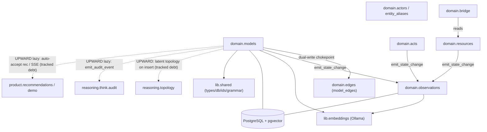

# Domain — The Substrate

> Source: `services/domain/` (packages `observations`, `models`, `acts`,
> `resources`, `actors`, `entity_aliases`, `bridge`, `falsifiers`).
> Part of the [architecture overview](index.md).

**One-line:** the core tenant-scoped, persisted system-of-record — plain-asyncpg
repositories and pure state machines over observations, models (+ typed edges),
acts, resources, actors, and entity aliases that every higher layer builds on.

## Responsibilities

The domain layer is the substrate. It is a namespace package grouping eight
sub-packages, each owning specific Postgres tables and exposing **plain-asyncpg
repositories (no ORM)**. Rows are hydrated into `lib.shared.types` Pydantic models
on every read (so schema drift surfaces immediately); new IDs are `uuid7`; nearly
every row carries `tenant_id` and queries scope by it.

- **Observations** (`observations/repo.py`) — append-oriented signals partitioned
  monthly by `occurred_at`; composite PK `(id, occurred_at)` (so FKs are
  application-level). Dedup on `(source_channel, external_id, occurred_at)`; HNSW
  cosine search over the 768-d embedding; `cascade_trace` is a recursive CTE up
  the `cause_id` chain. `state_change.emit_state_change` is the canonical helper
  every other domain write calls to record a `kind='state_change'` observation
  inside the caller's transaction — this builds the audit/cause chain. Post-commit
  `observations_new` NOTIFY is buffered in a ContextVar and flushed after commit.
- **Models** (`models/repo.py`) — the **9-step insert pipeline**: falsifier
  adequacy (confidence > 0.7) → proposition canonicalize/validate (four stances,
  legacy 12-kind normalized) → support-DAG acyclicity → calibration lookup + clip
  to `[0.05, 0.95]` → scope-actor existence → embedding → INSERT
  (`proposition_kind` is a GENERATED column; `confidence_at_assertion` is
  write-once) → dual-write typed edges via the `_set_model_relations` chokepoint →
  topology-discovered relationship proposals → `state_change` + `audit_events`.
  `EdgesRepo` is the single writer for `model_edges`.
- **Acts** (`acts/`) — goals/commitments/decisions with **pure declarative
  transition tables** in `state_machines.py` (the only source of truth for legal
  transitions), invariants C1–C10/G1–G4, a deadlock-retry shim, and the edge
  tables `contributes_to` / `depends_on` / `constrained_by`.
- **Resources** (`resources/`) — resources + monthly-partitioned
  `resource_transactions`, deployments, and `customer_commitments` (the **Bridge**
  spine), with `apply_delta` math under `SELECT … FOR UPDATE` and capacity
  invariant R1.
- **Actors / aliases** — `ActorRepo` (identity mappings keyed `<channel>:<ref>`;
  deactivation blocked if the owner has non-terminal commitments) and
  `EntityAliasRepo` (casefold/whitespace-collapse normalization, advisory-lock
  idempotency, ambiguity detection).
- **Bridge / falsifier rules** — `bridge/queries.py` holds dashboard-grade,
  tenant-scoped queries (revenue-at-risk, capability-at-risk, feasibility,
  critical path, customer health); `models/falsifier.py` owns falsifier
  adequacy rules.

## How it's wired

!!! warning "Known upward coupling (tracked debt)"
    The README/import-linter say domain imports only downward, but `models/repo.py`
    and `calibration.py` contain **upward** imports into `services.reasoning`,
    `services.product`, and `services.workers` (latent-topology on insert,
    `emit_audit_event`, auto-accept of low-risk recommendations, demo SSE). These
    are real and **documented as tracked debt in `CODEBASE-MANAGEMENT.md` §8**; the
    import-linter contract is deliberately scoped to *direct* imports
    (`allow_indirect_imports=true`) so this pre-existing edge does not fail the gate.

## Key modules

| Module | Path | Owns |
|--------|------|------|
| `ModelsRepo` | `services/domain/models/repo.py` | `models`; the 9-step insert; typed-edge dual-write; audit chain. |
| `EdgesRepo` | `services/domain/models/edges_repo.py` | `model_edges` (single writer); traversal, cycle checks, drift sample. |
| Propositions/falsifier/calibration/decay | `services/domain/models/propositions.py` | Proposition grammar, falsifier adequacy, calibration offsets, decay. |
| `ObservationRepository` | `services/domain/observations/repo.py` | `observations` CRUD + HNSW search + cascade trace. |
| state_change / events / partitions | `services/domain/observations/state_change.py` | Audit-chain emitter, NOTIFY buffer, partition self-heal. |
| Acts | `services/domain/acts/state_machines.py` | Goal/commitment/decision transition tables + invariants. |
| Resources | `services/domain/resources/repo.py` | Resource aggregate, `apply_delta`, Bridge spine. |
| Actors | `services/domain/actors/repo.py` | `ActorRepo` + `operating_context`. |
| Entity aliases | `services/domain/entity_aliases/repo.py` | Fast-path alias resolution. |
| Bridge | `services/domain/bridge/queries.py` | Dashboard-grade tenant-scoped queries. |

## Entry points

These are **imported**, not run — repositories constructed with an asyncpg pool by
the gateway, the Think applier/retrieval, and ingest writers. There is no process
or router in this layer.

## Dependencies

**Inbound** *(verified)*: `reasoning.think` (applier/reconciler/validator),
`reasoning.retrieval`, `app.gateway`, `ingest.ingestion`, `services.workers`, and
`product` + `platform.execution`.

**Outbound** *(verified)*: `lib.shared` (types/db/ids/errors/memory_grammar/
edge_registry), `lib.embeddings` (Ollama), `pgvector` — plus the upward
tracked-debt edges noted above.

## Design rationale

> **TODO(human):** Capture the *why* behind:
>
> - The upward `domain → reasoning/product/workers` edges (the proposed event-bus
>   inversion in `CODEBASE-MANAGEMENT.md` §8 — planned or abandoned?).
> - The dual-write of legacy array columns alongside `model_edges` — the Stage 2/3
>   cutover timeline.
> - The composite-PK `(id, occurred_at)` + application-level FK partitioning choice.
> - Server-side auto-accept of low-risk `create_commitment` recommendations inside
>   the Model insert (`_AUTO_ACCEPT_MIN_CONFIDENCE=0.55`) — the risk policy intent.
> - Whether the retired accepted-memory topology tables are safe to drop.
