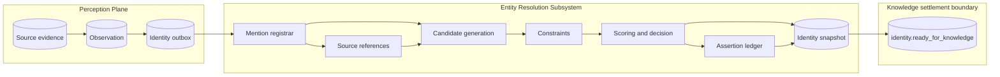
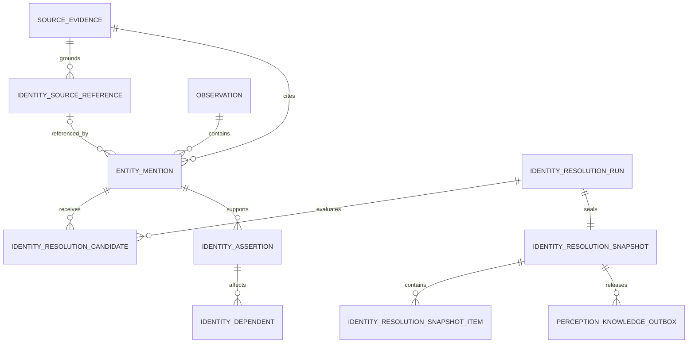
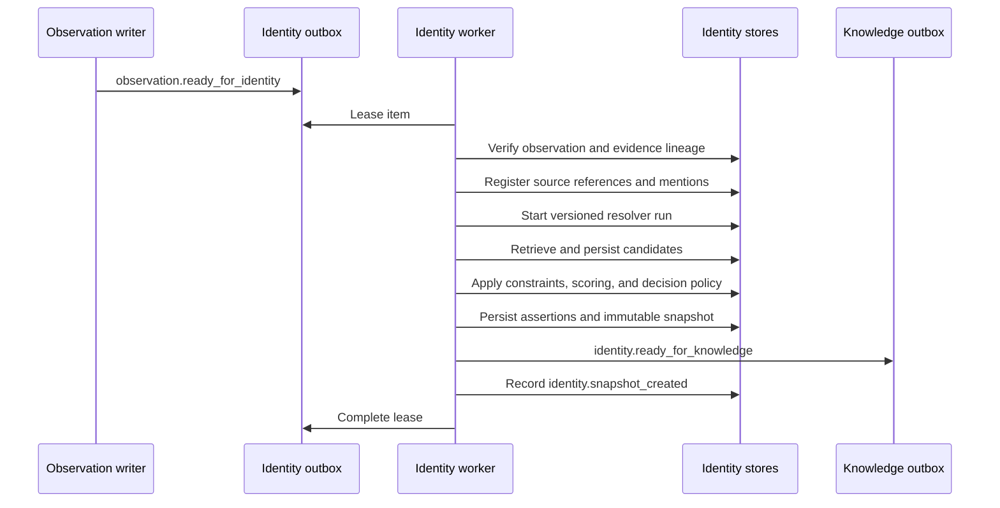
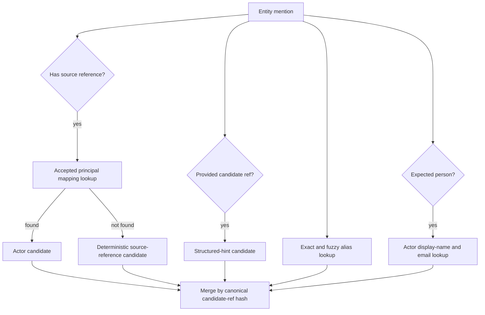
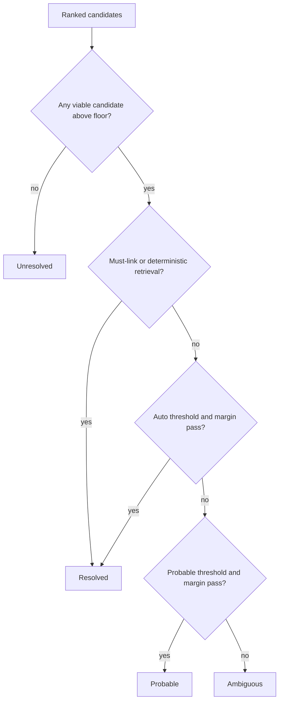
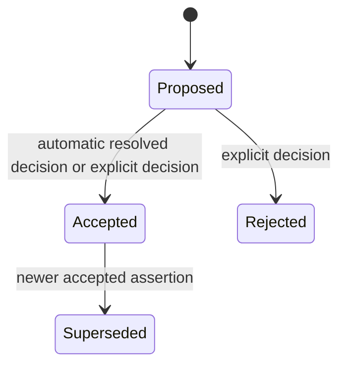
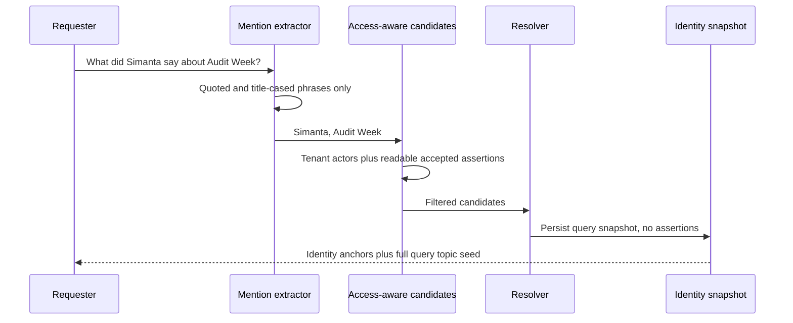

# Fyralis Entity Resolution — Implementation Architecture

**Status:** Code-grounded description of the implemented subsystem<br>
**Scope:** Persisted observation and source evidence through immutable identity snapshot and durable knowledge intake<br>
**Primary code:** `services/domain/identity/`, migrations `0192`, `0194`, `0195`, and `0196`

## 1. Executive summary

Fyralis entity resolution determines what source-specific identifiers and textual mentions may refer to, while preserving uncertainty and the evidence behind every decision.

The implemented resolver is deterministic and explainable. It does not currently use an LLM, embedding model, or learned clustering model. It combines:

- tenant- and installation-scoped native source identity;
- accepted source-principal mappings;
- connector-supplied structured references;
- exact and fuzzy aliases;
- actor-name and email similarity;
- expected entity types;
- temporal must-link and cannot-link constraints; and
- type-specific score and runner-up-margin thresholds.

Every resolution run persists its inputs, capability and policy versions, candidates, features, constraints, outcome, alternatives, and reasons. It then seals a content-addressed identity snapshot. Ambiguous or unresolved mentions produce a `partial` snapshot but do not block episode construction.

The subsystem has two paths:

1. **Observation path:** resolves identity for ingested evidence, writes durable assertions, and gates episode intake on a sealed snapshot.
2. **Query path:** grounds identity-shaped phrases for a specific requester, creates an auditable snapshot, but deliberately creates no durable identity assertions.

## 2. Boundary and responsibility



The subsystem owns:

- native reference registration;
- mention registration;
- candidate retrieval and ranking;
- identity constraints;
- identity assertions and their lifecycle;
- immutable resolution snapshots;
- query-specific identity grounding;
- targeted re-resolution; and
- the identity-aware handoff to episode construction.

It does not own:

- raw extraction from external sources;
- general named-entity recognition or coreference inference;
- creation of canonical company objects;
- episode topic or membership decisions;
- adjudication of organizational claims; or
- downstream reasoning.

## 3. Implemented components

| Component | Responsibility | Primary implementation |
| --- | --- | --- |
| Source capability registry | Records identity evidence available from every connector source | `capabilities.py` |
| Identity intake outbox | Durable observation and re-resolution work queue | `intake.py` |
| Mention registrar | Converts observation hints into evidence-bound mentions | `registrar.py` |
| Foundation repositories | Persists source references, mentions, and runs | `foundation_repo.py` |
| Candidate provider | Retrieves principal, source, structured, alias, and actor candidates | `resolution_repo.py` |
| Pure resolution policy | Merges candidates, applies constraints, scores, and decides | `resolution.py` |
| Resolution service | Coordinates per-mention decisions and seals snapshots | `service.py` |
| Assertion ledger | Persists and versions reversible identity assertions | `repo.py` |
| Identity worker | Executes the observation path transactionally | `worker.py` |
| Query resolver | Performs requester-aware, non-mutating query grounding | `query.py` |
| Lifecycle service | Schedules targeted re-resolution after corrections | `lifecycle.py` |

## 4. Source-grounded entity scope

The capability registry covers the same 26 source families as the Source Connector Contract. It describes what native reference types each connector can currently emit, not every entity that might exist in a company.

Examples include:

| Source family | Native references used by identity |
| --- | --- |
| Communication | Users, messages, channels, threads, email addresses, conversations |
| Knowledge | Pages, blocks, databases, comments, files, boards, versions |
| Work | Issues, events, repositories, work items |
| Meetings | Calendar events, attendees, transcripts |
| Operations | AWS events, Grafana annotations, software-system hints |
| People | Employees, candidates, contracts, person records |
| Finance | Transactions, counterparties, external organizations |

The code declares three canonical-admission levels:

| Admission | Types |
| --- | --- |
| `canonical` | `person` |
| `conditional` | `document`, `meeting`, `work_item`, `external_party`, `organization`, `repository` |
| `contextual_only` | `audit`, `goal`, `project`, `team`, `software_system`, `topic`, and unknown types |

This means the intended initial policy is conservative: only people are unconditionally canonical. “Audit Week” can remain a contextual episode anchor without becoming an Audit entity.

**Implementation caveat:** `canonical_admission()` is included in the versioned capability snapshot and tested, but the current candidate provider and decision function do not invoke it. A structured hint can therefore resolve to a provided reference when its type is compatible even if that type is declared `contextual_only`. The admission registry is currently policy metadata, not an enforced canonical-creation guard.

## 5. Persisted identity model



### 5.1 Source references

`identity_source_references` represents stable provider-native identities. Its SHA-256 key contains:

```text
tenant_id + installation_scope + source + native_type + native_id
```

Consequently, `U42` in one Slack workspace cannot collide with `U42` in another. A source reference keeps its first and latest evidence IDs, valid-time range, status, and monotonically increasing version.

Source references are durable projections rather than immutable revision rows: seeing a later revision updates `latest_evidence_id`, status, attributes, and version while the evidence ledger retains the immutable source history.

Reference kinds include principal, artifact, container, conversation, work record, scheduled event, transcript, operational event, financial record, employment record, external resource, and URL.

### 5.2 Mentions

`entity_mentions` represents an identity-shaped occurrence in an observation or query. Its content-addressed key includes the observation, evidence, mention kind, text, span, source reference, and context.

Supported mention kinds are:

- `source_actor`;
- `structured_reference`;
- `text`;
- `coreference`; and
- `query`.

Every non-query mention must have an observation ID, observation event time, and evidence ID. Query mentions may be transient and requester-scoped through their run.

### 5.3 Resolver runs and candidates

Each `identity_resolution_run` records:

- input kind: observation, query, or reprocess;
- deterministic input hash;
- observation or requester identity;
- resolver name and version;
- policy version;
- a complete capability snapshot; and
- running, completed, or failed status plus result hash.

Every retrieved candidate is stored with candidate reference, retrieval methods, feature values, score, rank, constraint outcome, and reasons.

### 5.4 Assertions

The assertion ledger supports:

- `same_as`;
- `not_same_as`;
- `refers_to`;
- `represents`;
- `part_of`; and
- `version_of`.

Assertions move through `proposed`, `accepted`, `rejected`, and `superseded`. They retain evidence, mention, resolver run, score components, access-policy hash, valid time, decision provenance, and the assertion they supersede.

The automatic resolver creates `refers_to` assertions. Resolved outcomes are accepted automatically; probable and ambiguous outcomes with a selected candidate remain proposed. Unresolved outcomes create no assertion.

### 5.5 Snapshots

An identity snapshot freezes all mention outcomes for one run. Each item contains:

- mention ID;
- resolved, probable, ambiguous, or unresolved outcome;
- selected reference when present;
- confidence;
- assertion ID when one was produced;
- alternatives; and
- human-readable decision reasons.

Snapshot rows and items are protected by database triggers that reject updates and deletes. The manifest is SHA-256 content-addressed and validates its own hash when loaded.

## 6. Observation-path execution

### 6.1 Intake

The observation writer atomically persists source evidence and the normalized observation, then writes `observation.ready_for_identity` to `identity_resolution_outbox`. Large documents enter this outbox only after summarize-on-ingest completes.

The outbox uses stable dedupe keys and states `pending`, `leased`, `completed`, and `dead_letter`. Lease expiry permits recovery after worker failure.

### 6.2 Worker transaction



All processing after the lease claim occurs in one tenant-scoped PostgreSQL transaction. If any step fails, the transaction rolls back and the worker returns the outbox item to pending with a delay, or eventually marks it dead-letter.

Knowledge intake cannot be written unless the identity snapshot belongs to the same tenant and observation. It carries the snapshot ID, hash, and `complete` or `partial` status. A separate knowledge worker freezes the claim set before it emits episode-intake contract v3.

## 7. Mention registration

The registrar currently derives mentions from three observation fields.

### 7.1 Source actor

When `observation.source_actor_ref` exists, the registrar creates:

- an installation-scoped principal source reference; and
- a person-typed `source_actor` mention.

If ingestion already supplied `observation.actor_id`, the mention context includes it as a structured candidate.

### 7.2 Structured entity hints

`observation.entities_mentioned` entries are translated through a fixed hint map. Examples:

| Hint | Source-reference kind | Expected canonical type |
| --- | --- | --- |
| `slack_user`, `notion_user`, `email_address` | principal | person |
| `notion_page`, `notion_block`, `notion_comment` | artifact | document |
| `notion_database`, `slack_channel` | container | unspecified |
| `linear_issue`, `linear_project` | work record | work item |
| `meeting_topic` | scheduled event | meeting |

Hints not mapped to a source-reference kind become structured mentions. Their original reference can be placed directly into `provided_candidate_ref`.

### 7.3 Unresolved phrases

The registrar turns strings in `observation.content._unresolved_phrases` into untyped text mentions. Ingestion currently derives these through a bounded 1–3-gram heuristic biased toward capitalized or hyphenated phrases.

**Current limitation:** the contracts support spans and coreference mentions, but the observation registrar does not discover spans, run named-entity recognition, or create coreference mentions. Richer extraction can be added before candidate generation without changing the downstream contracts.

## 8. Exact candidate-generation technique

Candidate generation is high-recall retrieval. Acceptance happens later.



### 8.1 Accepted principal mapping

For a principal source reference, the provider checks `actor_identity_mappings` using tenant, installation scope, source channel, and source actor reference. A match produces an actor candidate with score `1.0`.

### 8.2 Deterministic source reference

If no actor mapping exists, the native reference itself becomes a candidate such as:

```json
{"type":"source_reference","id":"...","reference_kind":"artifact"}
```

This candidate scores `1.0` and resolves deterministically when its type matches the mention.

### 8.3 Structured hint

`provided_candidate_ref` becomes a direct candidate. It scores `0.99` and is treated as deterministic by the decision policy.

### 8.4 Alias retrieval

`entity_aliases` is queried using normalized exact equality or PostgreSQL trigram similarity of at least `0.25`, with a maximum of 20 results. Features include:

- exact-alias flag;
- stored alias confidence;
- name similarity; and
- type compatibility.

### 8.5 Actor retrieval

Person-typed mentions query active tenant actors. A candidate is retrieved when display-name trigram similarity is at least `0.25` or the email matches exactly. At most 10 actors are returned.

### 8.6 Candidate merge

Candidates with identical canonical JSON references are merged. Each feature keeps its maximum value and all retrieval methods are retained. This lets independent evidence reinforce one candidate without duplicating it.

There is currently no embedding nearest-neighbor retrieval, graph-neighborhood retrieval, cross-encoder reranker, or model call in the implemented provider.

## 9. Constraints, scoring, and decisions

### 9.1 Constraint evaluation

Active constraints are time-bounded and carry source, system, or human authority.

- `must_link` forces the matching candidate to score `1.0`.
- `cannot_link` forces the matching candidate to score `0.0`.
- type incompatibility forces `type_rejected` and score `0.0`.

The current matcher applies constraints when one side identifies the exact mention or its source reference and the other side identifies the candidate. It does not yet perform general graph-wide transitive constraint propagation.

### 9.2 Weighted score

Non-deterministic candidates use this inspectable linear score, capped at `1.0`:

| Feature | Weight |
| --- | ---: |
| `exact_alias` | 0.40 |
| `alias_confidence` | 0.25 |
| `name_similarity` | 0.45 |
| `type_compatibility` | 0.10 |
| `context_similarity` | 0.05 |

Accepted principal mappings and deterministic source references score `1.0`. Structured hints score `0.99`.

Candidates are sorted by descending score and then by a stable hash of the candidate reference, making exact replay deterministic.

### 9.3 Thresholds

| Expected type | Auto-accept | Probable | Ambiguity floor | Minimum lead over runner-up |
| --- | ---: | ---: | ---: | ---: |
| Person | 0.98 | 0.85 | 0.55 | 0.12 |
| Default | 0.95 | 0.82 | 0.55 | 0.15 |

### 9.4 Decision procedure



Deterministic retrieval resolves even without a runner-up margin, after type and cannot-link checks. Non-deterministic candidates must pass both score and margin requirements.

An important semantic detail is that the snapshot status is:

- `partial` when any item is ambiguous or unresolved; otherwise
- `complete`.

Therefore a `complete` snapshot may still contain `probable` items whose assertions remain proposed. `complete` means the snapshot has no unresolved/ambiguous mention, not that every identity assertion has been accepted.

## 10. Assertion lifecycle and correction



For each source identity key, the repository serializes changes with a PostgreSQL advisory lock and assigns monotonically increasing versions. Accepting a non-negative assertion supersedes the prior accepted assertion for that key.

Assertion dependents record which observations, claims, topics, or episode memberships relied on an assertion. The current automatic resolver registers observation dependents.

When a human correction or other decision invalidates assertions, `IdentityLifecycleService.request_reresolution()`:

1. finds only dependent observations;
2. writes `identity.reresolution_requested` work items;
3. records an identity change event; and
4. lets the normal worker create a new run, snapshot, and episode delivery.

Previous snapshots and prior episode inputs remain unchanged.

Cluster merge, split, and relabel events have a durable persistence API, but no automatic clustering engine or operator workflow currently invokes and propagates them end to end.

## 11. Query identity resolution

The query path is deliberately non-mutating.



Default mention extraction keeps quoted phrases and title-cased sequences, excludes question words, deduplicates normalized text, and caps the result at 20. Callers may supply explicit mention texts.

The query candidate provider searches:

- active actors in the requester's tenant; and
- accepted identity assertions whose supporting evidence passes the requester's source ACL.

It does not use observation source references, principal mappings, or the general alias table directly. The full query is preserved as the downstream topic seed even when some identity-shaped phrases remain unresolved.

`persist_assertions=False` ensures a query cannot silently alter organizational identity. The run, candidates, decisions, and snapshot remain auditable.

**Current provenance gap:** readable assertion evidence is checked while query candidates are retrieved, but the selected candidate's supporting evidence ID is not stored in `CandidateSeed`, candidate rows, or snapshot items. Query access is fail-closed during retrieval, yet exact evidence-level explanation of why that candidate was available is incomplete in the sealed query snapshot.

## 12. Alpen Audit Week walkthrough

Input observation:

```text
Audit Week: Simanta says the authentication audit is complete;
Sam is checking payments.
```

Assume it came from Slack native user `U42` in installation scope `slack:alpen-workspace`.

1. The observation writer links the message to its exact Slack evidence revision and enqueues identity intake.
2. The registrar creates an installation-scoped principal reference for `U42` and a person mention.
3. `actor_identity_mappings` maps `U42` to the canonical Simanta actor, yielding a deterministic actor candidate with score `1.0`.
4. “Audit Week” and “Sam” arrive as unresolved text phrases.
5. “Audit Week” has no safe canonical candidate and remains unresolved. The Situation Plane can still use it as a contextual topic anchor.
6. “Sam” may retrieve multiple similar actors. If the top candidates do not clear the person margin of `0.12`, the outcome remains ambiguous.
7. The snapshot is `partial`, but contains Simanta's accepted `refers_to` assertion and the alternatives/reasons for the other mentions.
8. The identity worker writes knowledge intake with the exact snapshot ID and hash; knowledge settlement later emits episode-intake v3.
9. Notion, Jira, meeting, or later Slack evidence can independently resolve their identities and still join the same Audit Week episode through situation-level anchors.

Entity resolution is therefore cross-source at the organizational level, not Slack-only. Each source first produces its own installation-scoped evidence and references; canonical actors, aliases, structured organizational anchors, and downstream episode routing connect them.

## 13. Guarantees implemented

1. Native identities are tenant- and installation-scoped.
2. Every non-query mention is bound to an observation and exact evidence revision.
3. Candidate retrieval and acceptance are separate stages.
4. Hard negative and type constraints override similarity.
5. Decisions are deterministic under identical stored inputs and versions.
6. Candidates, features, ranks, alternatives, and reasons are persisted.
7. Ambiguous and unresolved are valid outcomes.
8. Snapshots are immutable and content-addressed.
9. Knowledge intake and downstream episode-intake v3 cannot omit identity snapshot lineage.
10. Re-resolution appends new history and targets affected observations.
11. Query resolution does not create durable assertions.
12. Query assertion candidates are filtered by source-evidence access.
13. Identity tables use tenant row-level security and tenant-scoped foreign keys.

## 14. Implemented versus operationalized

| Capability | State in current code |
| --- | --- |
| Source-reference and mention contracts | Implemented |
| Candidate retrieval and deterministic scorer | Implemented |
| Must-link/cannot-link constraints | Implemented |
| Assertion and snapshot persistence | Implemented |
| Observation identity worker and durable retries | Implemented and integration-tested |
| Query identity resolution | Implemented and integration-tested |
| Targeted re-resolution | Implemented and integration-tested |
| Identity-to-knowledge gate and episode-intake v3 lineage | Implemented and integration-tested |
| Dedicated identity worker runtime entry point/process registration | Implemented in the shared perception pipeline launcher and production manifest |
| Rich NER and coreference extraction | Not implemented in the registrar |
| Embedding or model-based candidate generation | Not implemented |
| Canonical-admission enforcement | Registry exists; enforcement is not wired into resolution |
| Learned score calibration | Not implemented; thresholds are hand-authored policy |
| Automatic merge/split adjudication | Persistence APIs exist; orchestration is not implemented |
| Operator review interface | Not part of this subsystem |

## 15. Architectural risks and next work

### 15.1 Admission and structured hints

Structured hints are treated as deterministic and can bypass the intent of the canonical-admission registry. Resolution should distinguish “this mention refers to this source/context reference” from “this reference is admitted as a durable canonical company entity.”

### 15.2 Mention recall

The current unresolved-phrase heuristic favors precision and obvious proper nouns. Lowercase entities, pronouns, aliases inside long prose, and cross-sentence coreferences may never become mentions.

### 15.3 Score calibration

Thresholds and weights are inspectable but manually chosen. They need labeled, source-stratified organizational data, calibration measurement, and per-entity error budgets before production auto-acceptance can be considered empirically justified.

### 15.4 Source-reference semantics

An unmapped native artifact resolves deterministically to a source-reference candidate. This proves native identity, not canonical equivalence across sources. Cross-source canonicalization must require explicit assertions or stronger evidence.

### 15.5 Query provenance

Query candidate rows and snapshots should carry supporting assertion and evidence IDs so access decisions and identity explanations can be reproduced without re-running retrieval.

### 15.6 Operational ownership

The worker classes exist but need dedicated runtime entry points, process-manifest registration, metrics, alerting, DLQ operations, tenant fairness evaluation, and controlled production rollout.

## 16. Code and schema map

| Concern | File or migration |
| --- | --- |
| Source identity capabilities and admission metadata | `services/domain/identity/capabilities.py` |
| Source-reference, mention, and run contracts | `services/domain/identity/foundation.py` |
| Foundation persistence | `services/domain/identity/foundation_repo.py` |
| Observation mention registration | `services/domain/identity/registrar.py` |
| Candidate and decision contracts | `services/domain/identity/resolution.py` |
| Candidate retrieval and snapshot persistence | `services/domain/identity/resolution_repo.py` |
| Resolution coordination | `services/domain/identity/service.py` |
| Assertion contracts and lifecycle | `services/domain/identity/models.py`, `repo.py` |
| Durable observation intake | `services/domain/identity/intake.py` |
| Transactional worker | `services/domain/identity/worker.py` |
| Query resolution | `services/domain/identity/query.py` |
| Targeted re-resolution | `services/domain/identity/lifecycle.py` |
| Episode handoff | `services/domain/episodes/intake.py` |
| Evidence access checks | `services/domain/evidence/access.py` |
| Initial assertion and access schema | `db/migrations/0232_identity_claims_and_evidence_access.sql` |
| Source-reference, mention, and run schema | `db/migrations/0234_entity_resolution_foundation.sql` |
| Candidate, constraint, and snapshot schema | `db/migrations/0235_entity_resolution_engine.sql` |
| Worker outbox and identity-aware episode gate | `db/migrations/0236_entity_resolution_orchestration.sql` |
