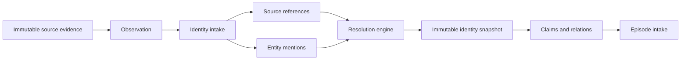
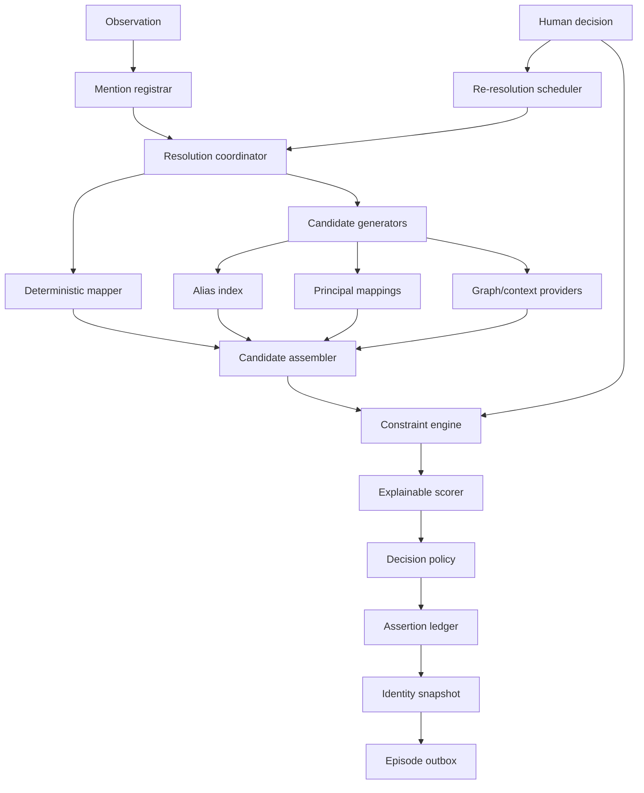
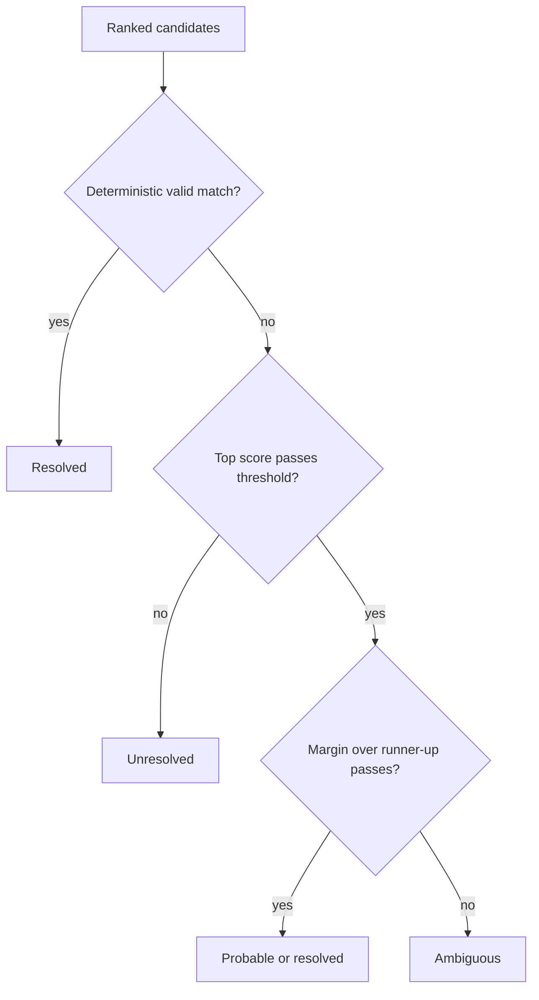

# Fyralis Entity Resolution Subsystem

## Purpose

Entity resolution converts source-bound references and textual mentions into
versioned, evidence-backed identity assertions. It does not erase ambiguity or
silently canonicalize organizational language.

The subsystem sits between observation construction and episode construction:

## Source-grounded scope

The current source catalog contains communication, knowledge, work, meeting,
operations, people, and finance systems. Connector presence alone does not
admit a canonical entity type.

Three scopes are kept separate:

1. **Source references** are deterministic identities supplied by a connector,
   such as a Slack user, Notion page, Jira issue, or Calendar event.
2. **Canonical entities** are durable company-world referents supported by
   sufficient cross-source or authoritative evidence. Person is the only
   unconditional initial canonical type.
3. **Contextual referents** are phrases such as “the audit” or “mainnet launch.”
   They may ground claims and episodes without becoming canonical entities.

Documents, meetings, work items, repositories, external parties, and
organizations are conditionally admissible. Audits, goals, projects, teams,
software systems, and topics remain contextual until a source-specific
normalizer, configured schema, or authoritative decision establishes durable
identity.

## Constitution

1. Resolution produces assertions, not destructive foreign-key rewrites.
2. Every non-query mention points to an exact observation and evidence revision.
3. Source identity keys include tenant and connector-installation scope.
4. `same_as`, `refers_to`, `represents`, `part_of`, and `version_of` are distinct.
5. Resolved, probable, ambiguous, and unresolved are legitimate outcomes.
6. Deterministic references outrank aliases, graph context, and semantic models.
7. Hard cannot-link constraints override model scores.
8. Every run records capability, policy, and resolver versions.
9. Corrections append superseding assertions and trigger targeted re-resolution.
10. Episode snapshots retain the identity snapshot used to construct them.
11. Query resolution is access-aware and does not silently alter canonical identity.
12. Episode context may re-rank candidates but cannot be circular proof.

## Logical components

## Resolution cascade

1. Register explicit source actors, structured entity hints, and unresolved text
   phrases as mentions.
2. Map native IDs through tenant/install-scoped source references.
3. Generate candidates from accepted principal mappings, aliases, typed source
   references, and bounded contextual providers.
4. Apply tenant, type, time, must-link, and cannot-link constraints.
5. Score remaining candidates with persisted explainable features.
6. Apply entity-type-specific thresholds and top-candidate margin requirements.
7. Persist candidates and assertions, then seal an immutable observation-level
   identity snapshot.
8. Release the observation to episode intake even if some mentions remain
   ambiguous or unresolved.

## Decision semantics

No candidate is preferable to a false merge. Entity consolidation is a
separate operation using must-link/cannot-link constraints and reversible
merge, split, and relabel events.

## Temporal and access semantics

Identity assertions carry valid time and recording time. A recurring audit or
renamed project is not automatically `same_as` its predecessor. Evidence ACLs
remain attached to the assertion and snapshot; a query-visible resolution can
only be explained with evidence visible to its requester.

## Episode boundary

Episode intake receives the observation, evidence, active assertion IDs,
resolution counts, and identity snapshot hash. A later correction emits a
re-evaluation request. Existing settled episode snapshots remain immutable.
