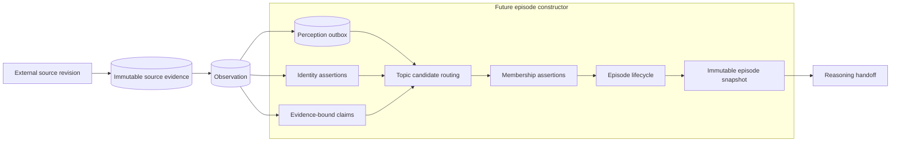
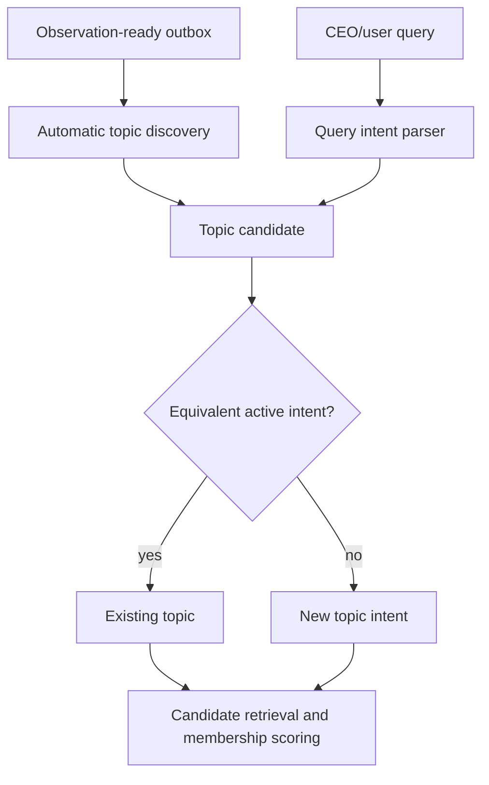
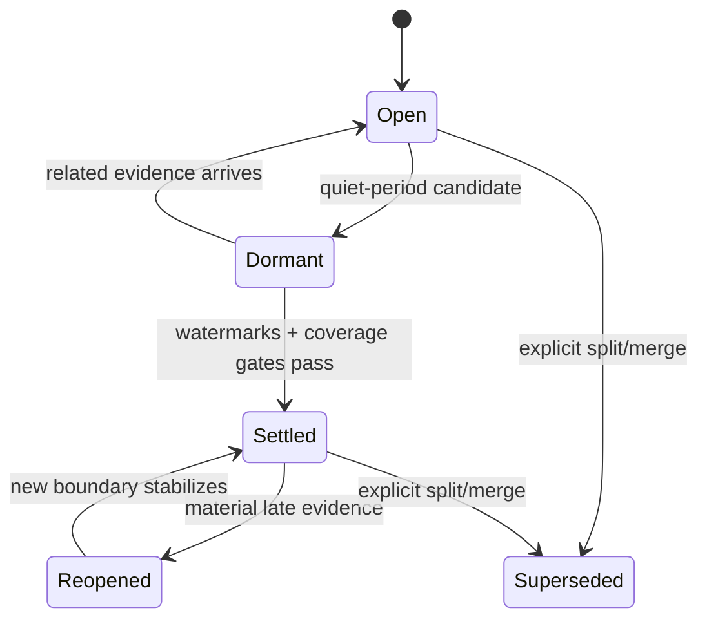

# Episode Construction Boundary

**Status:** Ratified prerequisite contract

**Scope:** Perception output through settled episode snapshots. This document
defines the future constructor's obligations; it does not select a clustering
algorithm or implement topic routing.

## 1. Constitution

An episode is a **bounded, versioned batch of organizational evidence about one
situation**, prepared for coherent reasoning. It is not a summary, a belief, a
chat thread, a vector cluster, or a claim that the situation is true.

The following rules are invariants:

1. Evidence is immutable; corrections create new revisions.
2. An observation may belong to zero, one, or many episodes.
3. Membership is an assertion with reasons and a producer version, never an
   unexplained foreign key.
4. An episode can contain opposing claimant perspectives. Construction exposes
   contradictions; it does not erase or adjudicate them.
5. A snapshot is immutable and content-addressed. Later evidence creates a new
   snapshot version.
6. Settlement means the constructor considers the boundary sufficiently stable
   at named event-time and ingestion-time watermarks. It does not mean every
   claim is true or the underlying situation is finished.
7. An episode's audience is no broader than the intersection of its evidence
   policies. Unknown policy is fail-closed.
8. Reasoning receives a snapshot ID and authorized evidence manifest, not a
   lossy concatenated text batch.

These invariants are executable in `EpisodeConstitution` and the versioned
contracts under `services/domain/episodes/contracts.py`.

## 2. Boundary now established

The outbox event `observation.ready_for_episode` is the durable ownership
boundary. It is inserted in the observation transaction. Large documents are
withheld while summarization is pending and enter the outbox atomically with
their completed summary. Exact observation replay does not create duplicate
work.

The existing T1 observation trigger remains authoritative during construction
and shadow evaluation. The outbox does not itself authorize episode reasoning.

## 3. Topic creation

A topic is a durable routing intent, not an episode and not merely a generated
label. It has three allowed origins:

- `automatic`: Fyralis detects a recurring or newly coherent situation from
  evidence, entities, claims, relations, and temporal structure;
- `query_seeded`: a user's question supplies intent, valid-time scope, requester,
  and initial retrieval anchors; or
- `human_pinned`: a human explicitly establishes a topic worth monitoring.

Automatic and query-created topics use the same routing and membership
machinery after seeding. Query-created topics may remain request-scoped, be
deduplicated into an existing topic, or be promoted to a durable monitored topic
by an explicit policy. Similar wording alone must never silently merge topics.

Topic deduplication must compare entity scope, claim predicates, valid-time
window, source context, and explicit negative evidence—not just embeddings.

## 4. Membership

Every include, exclude, or hold decision records:

- topic and episode IDs;
- exact observation, evidence, claim, and identity-assertion IDs;
- score and structured reasons;
- feature snapshot and schema version;
- router name and version;
- decision status and supersession link; and
- creation time.

Positive and negative decisions are both durable. Negative decisions prevent
repeated reconsideration of obvious noise and make contamination explainable.
`hold` preserves uncertain candidates such as unresolved identity without
forcing a false merge or exclusion.

## 5. Temporal model and lifecycle

The constructor tracks both clocks:

- **event time**: when the source says the event or state applied;
- **ingestion time**: when Fyralis learned it.

Late evidence may reopen a settled episode. An edit, deletion, or retraction is
new evidence and can supersede a claim or change current-state interpretation;
it never removes its earlier revision from history.

A split or merge creates new episode identities plus provenance links. It does
not mutate previously issued snapshots.

## 6. Snapshot and reasoning contract

A snapshot freezes:

- accepted membership assertions and their exact evidence;
- claims and unresolved contradictions;
- evaluated candidate counts and quality measures;
- the intersection access-policy manifest and all input policy hashes;
- event-time and ingestion-time watermarks;
- settlement decision when settled; and
- a SHA-256 manifest hash.

Reasoning receives `ReasoningEpisodeInput`, identifies the requester for query
answers, and dereferences evidence through authorization checks. The snapshot is
the unit of replay, citation, evaluation, and cache identity. A reasoning result
must cite evidence IDs present in that snapshot.

## 7. Ownership and cutover

| Transition | Owner before cutover | Owner after cutover |
|---|---|---|
| source revision → evidence/observation | ingestion | ingestion |
| observation → constructor intake | perception outbox | perception outbox |
| intake → memberships/snapshot | shadow constructor | constructor |
| reasoning trigger | direct T1 observation path | settled snapshot outbox |
| model/product side effects | direct T1 reasoning | episode reasoning |

Cutover has four states:

1. **Shadow:** construct episodes and score them; emit no reasoning or product
   side effects.
2. **Dual-read comparison:** run episode reasoning in a side-effect-free lane and
   compare evidence coverage, citations, contradictions, latency, and output
   drift with T1.
3. **Tenant canary:** episode reasoning becomes authoritative for flagged
   tenants; direct T1 remains replayable but cannot emit effects.
4. **General cutover:** episode snapshots are the sole reasoning trigger. Remove
   direct T1 enqueue only after the rollback window expires.

Rollback flips ownership to direct T1, stops snapshot-trigger consumption, and
retains every outbox row, membership assertion, and snapshot for diagnosis. It
does not require data deletion or reverse migration.

## 8. Evaluation gates

The audit-week corpus includes cross-source updates, a deletion, a question,
contradictory claims, an ambiguous identity, lexical hard negatives, an
installation collision, and restricted/unknown evidence. Constructor releases
must meet, per labeled corpus and tenant canary:

- recall at least 0.90;
- precision at least 0.90;
- citation completeness 1.00;
- contradiction preservation 1.00;
- deterministic membership under exact replay 1.00;
- zero authorization violations; and
- no duplicate downstream side effects.

Latency and settlement-delay budgets must be established from production shadow
traffic before cutover; inventing a fixed budget without workload evidence would
be false precision.

## 9. Unresolved research and architectural risks

These are intentionally not hidden by the contract:

- Notion and some providers do not expose a complete user-level ACL in each
  object payload. Such evidence remains `unknown` and fail-closed until a
  connector-specific permission snapshot is available.
- Topic identity across long time ranges may require hierarchical or recurrent
  topics rather than one flat identifier.
- The appropriate quiet period varies by situation; settlement rules must be
  learned or typed by topic class without making replay nondeterministic.
- Claim extraction quality can dominate routing quality. Model-extracted claims
  must remain attributable, versioned, and replaceable by re-extraction.
- Human corrections need an explicit precedence policy; “human” is provenance,
  not proof of factual truth.
- Query episodes can create unbounded transient work. Retention, promotion, and
  deduplication policy require production measurements.

The durable principle is to preserve evidence and decisions so every heuristic
above can evolve without rewriting history.
