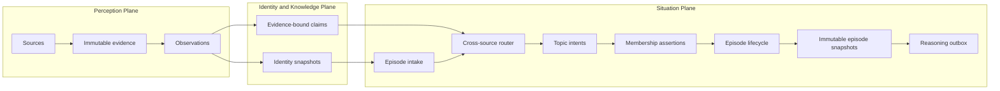
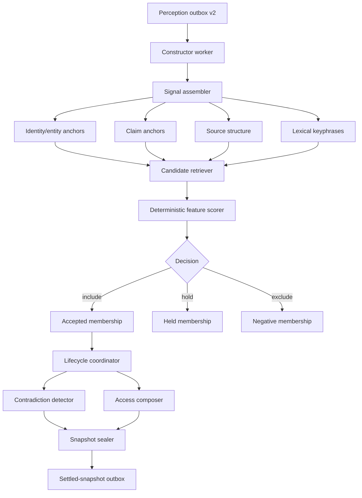
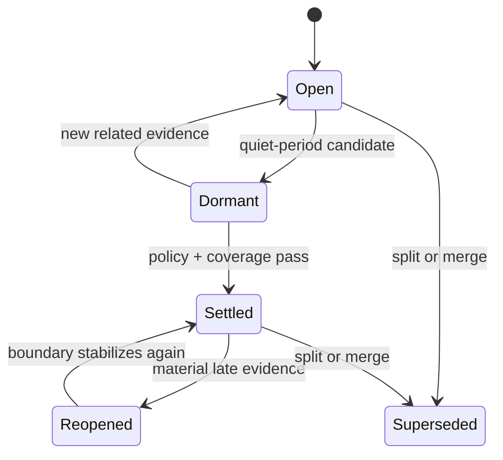
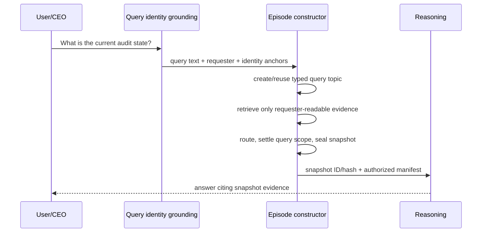

# Fyralis Episode Creation Subsystem

**Status:** Implemented through durable reasoning handoff.

## Purpose and boundary

An episode is a bounded, versioned, cross-source evidence batch about one
organizational situation. Episode creation begins with an identity-grounded
observation and ends with an immutable episode snapshot plus a durable reasoning
handoff. It does not decide which contradictory claim is true and does not
mutate the Company World Model.

## Constitutional invariants

1. One observation may belong to zero, one, or many episodes.
2. Membership is an append-only assertion with exact evidence and explanation.
3. Deterministic structure and identity precede lexical similarity.
4. Similar wording cannot by itself merge distinct source installations or
   organizational referents.
5. `hold` and `exclude` are durable outcomes; the router does not force a match.
6. Contradictions are represented, never silently resolved during batching.
7. Event time and ingestion time are both retained.
8. Settlement means boundary completeness under a named policy, not truth.
9. A snapshot is immutable, content-addressed, and reconstructable from ledgers.
10. Snapshot access is the intersection of all included evidence policies;
    unknown access is fail-closed.
11. Automatic and query-seeded episodes use the same routing and snapshot model.
12. Reasoning receives a snapshot manifest, never an unbounded text concat.

## Components

## Topic identity and routing

A topic is a durable routing intent, not a generated summary. It can be
automatic, query-seeded, or human-pinned. Its identity is grounded by a
versioned set of entity/claim/source-structure anchors plus a valid-time scope.
Lexical terms expand recall but cannot establish equivalence alone.

Candidate retrieval follows this order:

1. same tenant and explicit topic equivalence;
2. shared canonical or installation-scoped identity anchors;
3. shared claim subjects/predicates;
4. same source thread/container/object family;
5. bounded lexical overlap and temporal proximity.

The scorer persists every feature. Strong structural overlap produces
`include`; incomplete but plausible overlap produces `hold`; a conflicting
anchor or insufficient evidence produces `exclude`. A first unmatched signal
may propose a new automatic topic only when it carries a stable anchor or an
explicit normalized topic hint. Otherwise it remains held for later evidence.

## Lifecycle and time

Lifecycle transitions are events. A late observation creates a new episode
version and snapshot; it does not mutate the old snapshot. Split and merge
operations create successor episodes with provenance links.

## Query-created episodes

Query topics may reuse an automatic topic only through a recorded equivalence
decision. Requester access is evaluated when candidates are retrieved and again
when the snapshot is sealed.

## Completion boundary

The subsystem is complete when normal identity-grounded observations are
durably consumed, cross-source memberships are explainable and replay-stable,
episodes can settle/reopen without rewriting history, query-scoped episodes are
authorized, and immutable snapshots are handed to reasoning idempotently.
Reasoning logic and production ownership cutover remain separate systems.
