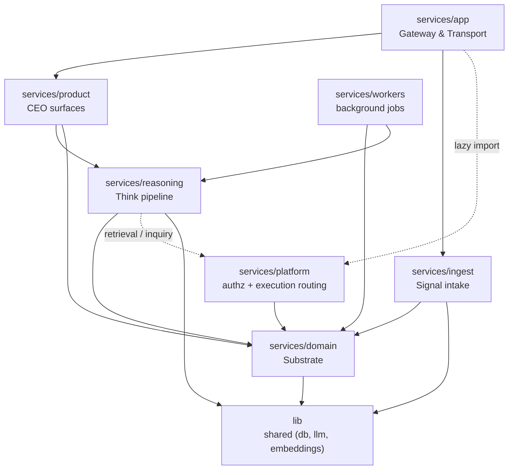

# Architecture

Fyralis Core is a source-level monolith organized into **layers** under
`services/`, plus a shared lower layer `lib/`. Each layer is a PEP 420 namespace
package with its own `README.md`, and the import boundaries between them are
**enforced** by `import-linter` (`lint-imports`, configured in `pyproject.toml`).

Layers are ordered so higher layers depend on lower ones. The directory tree
mirrors the data flow: **signal → ingest → domain substrate → reasoning →
product surface → app transport.**

## Enforced boundaries

These two contracts are enforced today (green on a clean tree, so a violation is
always a real regression — see `pyproject.toml` and `CONTRIBUTING.md`):

1. **`lib` is independent of `services`** — shared libraries never import app
   code (a few documented lazy-import exceptions exist in `lib/llm/provider.py`).
2. **The reasoning core does not *directly* import `app`, `product`, or
   `ingest`** — a known transitive edge (`reasoning → domain.models.repo →
   product.*`) is tracked as debt in `CODEBASE-MANAGEMENT.md` rather than
   enforced against.

## The subsystems

| Subsystem | What it owns |
|-----------|--------------|
| [App — Gateway & Transport](app.md) | HTTP/WS ingress, middleware auth, rate limits, webhook ingress, OAuth, realtime dispatch. |
| [Ingest — Signal intake](ingest.md) | Per-channel handlers, third-party integrations, normalization, the Kafka full-pipeline path, intel enrichment. |
| [Reasoning — Think pipeline](reasoning.md) | Retrieval, LLM reasoning, diff validation/apply, reconciliation, topology, judgment. |
| [Domain — Substrate](domain.md) | The persisted substrate: observations, models, acts, resources, actors, entity aliases. |
| [Product — CEO surfaces](product.md) | Greeting/CEO view, today, query/ask, conversations, forecasts, recommendations, rendering, demo. |
| [Platform — authz & routing](platform.md) | Five-layer access control and the execution-routing / adaptive-inquiry gate. |
| [Workers — background jobs](workers.md) | The polling/scheduled worker packages and which are actually deployed. |
| [Shared libraries (`lib`)](lib.md) | DB helpers, the structured-output LLM provider, embeddings, shared utilities. |
| [Runtime & data plane](data-plane.md) | The processes, containers, and data stores (Postgres, Kafka, S3, Redis, Ollama). |
| [Interfaces & Extensions](interfaces.md) | How interfaces (finance, CEO view) attach today, the `github_intel` extraction case study, and the proposed unified, externally-extensible extension layer. |

## Diagram conventions

On every architecture page, Mermaid edges drawn **dotted** or labelled
*(inferred)* are dependencies that were **not** directly verified in code — treat
them as best-effort inferences. Solid, unlabelled edges were verified by reading
the relevant import/call site.
