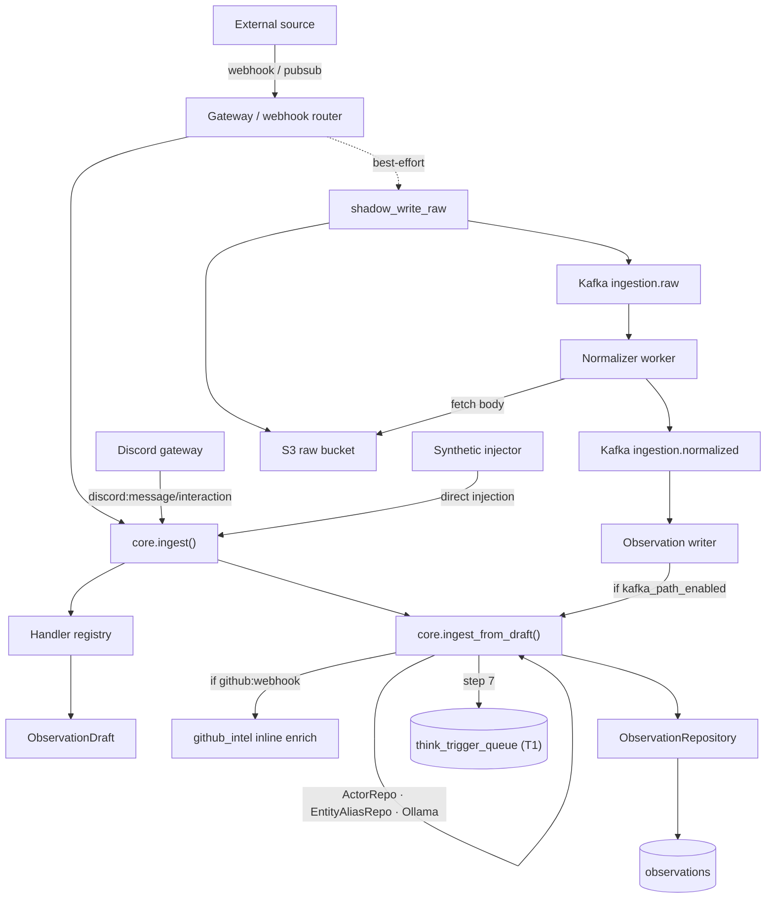

# Ingest — Signal Intake

> Source: `services/ingest/` (packages `ingestion`, `integrations`, `synthetic`,
> `code_intel`, `github_intel`). Part of the [architecture overview](index.md).

**One-line:** normalizes every external company signal into a tenant-scoped
`ObservationDraft`, persists it as a deduped [observation](../glossary.md), and
enqueues a `T1` Think trigger — via a synchronous **inline** path and a parallel
**Kafka/S3 pipeline** that converge on the same `ingest_from_draft` logic.

## Responsibilities

The ingest layer turns external signals into `observations` rows and kicks off
downstream reasoning. There are **two convergent paths**:

1. **Inline** — `core.ingest()` is called synchronously from the gateway webhook
   router, the Slack/finance routers, the Discord gateway, and the synthetic
   injector.
2. **Kafka full-pipeline** — `source → ingestion.raw.{source}` (raw body in S3 +
   a `RawEnvelope`) → **normalizer** worker → `ingestion.normalized.{source}` →
   **observation_writer**.

Both converge on `core.ingest_from_draft()`, so the written observation is
identical regardless of route. The `observation_writer` branches per tenant on
the `ingestion.kafka_path_enabled` flag.

**The 7-step ingest** (`core.py`): (1) handler extracts an `ObservationDraft`
[+ step 1.5 inline GitHub enrichment for `github:webhook`]; (2) pre-assign a
`uuid7`; (3) `ActorRepo` resolves the source actor ref (misses →
`content._unresolved_actor_ref`); (4) `EntityAliasRepo` fast-path entity lookup
over 1–3-gram phrases (misses → `content._unresolved_phrases` for the
[entity_resolver worker](workers.md)); (5) Ollama embedding (768-d; failure →
`embedding_pending=True`); (6) `ObservationRepository.insert` in a transaction
(dedup on `(source_channel, external_id, occurred_at)`); (7) enqueue a
`T1`/`event_arrival` row into `think_trigger_queue` unless deduped. Post-commit
`observations_new` NOTIFY is flushed after commit; missing monthly partitions
self-heal and retry once.

**Handler registry + trust map** (`handlers/__init__.py`): a `register(channel)`
decorator self-registers handlers at import; `CHANNEL_TRUST_MAP` is the
authoritative channel→trust-tier table (handlers may override per event). The
registered channels span Slack, internal, GitHub, Linear, Stripe, Discord,
Gmail/email, Notion, Google Calendar/Drive, calendar sync, Jira, Mercury, and
QuickBooks.

**Shadow / raw-tier path** (`shadow_write_raw`): hashes the raw body, `PutIfAbsent`
to S3 (`s3://fyralis-raw`), builds a `RawEnvelope`, and publishes to
`ingestion.raw.{source}`. Best-effort — it never fails the inline 200. Per-source
topic lanes prevent head-of-line blocking across sources.

**Intelligence enrichment** — `code_intel` maintains a commit-SHA-versioned
per-repo code graph + code-RAG embeddings ("blast radius"); `github_intel`
maintains PR/CI/branch/issue FSMs from `github:webhook` observations and writes
causal context inline into the observation's `content['intelligence']`
(raw-on-failure) and to `github_signal_enrichment` (an ordered per-repo worker
drains `github_intel_queue`).

## How it's wired

## Integration sources

The handler registry / `RawEnvelope.SourceLiteral` define **ten source families**:
Slack, GitHub, Discord, Gmail, Notion, Google Calendar, Google Drive, Jira,
Mercury, QuickBooks (plus internal/system channels, and Linear/Stripe handlers
registered in code). Each lives under `services/ingest/integrations/<source>/`
(OAuth, client, onboarding) with pipeline glue in `services/ingest/ingestion/`.

!!! note "Doc-vs-code discrepancies (verified)"
    - `CODEBASE-ARCHITECTURE.md` §6 (steps 9–11) describes a routing decision via
      `services/platform/execution/routing.py` writing `signal_routing_decisions`.
      **No such import exists in `services/ingest/`** — the ingest path does not
      call routing today (routing lives in [Platform](platform.md) and is
      shadow-only). **TODO(human):** confirm intended ownership/wiring of routing.
    - `docs/ingestion/README.md` says "eight production sources" while the code
      defines **ten** source families (adds Google Drive + the Mercury/QuickBooks
      finance pair). **TODO(human):** are finance/Drive non-production, or is the
      doc stale?

## Key modules & entry points

| Module | Path | Role |
|--------|------|------|
| Uniform ingest | `services/ingest/ingestion/core.py` | `ingest()` / `ingest_from_draft()` — the shared normalize→persist→enqueue path. |
| Handler registry | `services/ingest/ingestion/handlers/__init__.py` | `register`/`get_handler`, `CHANNEL_TRUST_MAP`, the `ObservationDraft` dataclass. |
| Workflows CLI | `services/ingest/ingestion/workflows/__main__.py` | `python -m services.ingest.ingestion.workflows` (onboarding, oauth poll, shard fetch, reconcilers — `WORKFLOW_SERVICE` selects one). |
| Normalizer | `services/ingest/ingestion/normalizer/worker.py` | Kafka Path B (no DB): raw → handler → `NormalizedEnvelope`. |
| Observation writer | `services/ingest/ingestion/writers/observation_writer.py` | Kafka Path A: normalized → `ingest_from_draft` when full-mode. |
| GitHub intel | `services/ingest/github_intel/worker.py`, `api.py` | Per-repo FSM + enrichment worker; read-only `/github-intel/*` router. |
| Integrations OAuth | `services/ingest/integrations/router.py` | `/integrations/{provider}/{install,callback}` (Slack/Discord/GitHub/Notion). |
| Synthetic | `services/ingest/synthetic/core.py` | Blessed direct-injection bypass routed through `core.ingest()` (tags `content.synthetic=true`). |

## Dependencies

**Inbound** *(verified)*: gateway webhook/slack/finance routers, the Discord
gateway dispatch, the synthetic injector, and the Kafka `raw`/`normalized` topics.

**Outbound** *(verified)*: `services.domain.observations` (insert + state-change
NOTIFY + partition self-heal), `services.domain.actors` / `entity_aliases`,
`lib.embeddings` (Ollama), `think_trigger_queue`, S3 + Kafka, and inline
`github_intel`/`code_intel` enrichment.

## Design rationale

> **TODO(human):** Capture the *why* for:
>
> - Why inline ingest was historically primary while the Kafka pipeline is now the
>   documented primary path — and the runbook/criteria for flipping
>   `ingestion.kafka_path_enabled` per tenant.
> - The full trust-tier ordering/semantics (the *mapping* is in code; the rationale
>   for `authoritative` vs `attested_agent` vs `inferential` vs `unvetted` is not).
> - The intended meaning of the `feels_onboarded` state and its thresholds.
> - The intended lifecycle of the Linear/Stripe/calendar/email handlers vs. the
>   "documented" sources — which are legacy or test-only.
