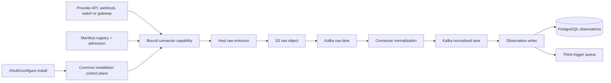

# Ingestion architecture

## Overview

Fyralis ingestion has one source control plane and one source execution path.
All 26 external ingestion sources enter through stable-v1 Source Connector
capabilities. Direct `ingestion.core.ingest()` remains only for Fyralis-owned and
non-source product channels such as internal events, email, Linear and Stripe
billing.



## Source definition and binding

`services/ingest/source_contract/source-index.json` owns source wire identity.
One JSON manifest per source declares its connector ID/version, factory,
capabilities, ingress kinds, credential slots, hosts, scopes, trust ceiling and
installation-data namespaces. Startup derives an immutable registry and verifies
the entire 26-source inventory plus structural/behavioral release evidence.

Before execution, the runtime binds a common installation to durable authority.
It validates tenant, connector, generation, lifecycle, active authority and
manifest permission ceilings. Only capabilities whose `configuredBy` slots have
current credential-backed grants are exposed.

## Installation ingress

The Gateway mounts one connector install router:

```text
GET  /integrations/{source}/install
GET  /integrations/{source}/callback
POST /integrations/{source}/configure
```

OAuth facets own provider redirects, code exchange, refresh/revocation semantics
and returned secret candidates. The host owns OAuth state/tenant validation,
secret persistence and authority. The configuration route handles API key,
Basic, token, AWS and gateway/session credentials. All installs persist to the
common `source_connector_*` tables.

## Ingress owners

### Webhooks

External source webhooks must use an active installation-scoped URL:

```text
POST /webhooks/{source}/callback/{endpoint_id}
```

The edge resolves the common callback/install, then invokes the source webhook
capability over the bounded raw body. Verified events are emitted through the
host. A bare source route is rejected. Linear and Stripe billing retain the
application webhook verifier path because they are not ingestion source
families.

Gmail Pub/Sub uses `/webhooks/gmail/pubsub` with Google OIDC audience and service
account validation before it resolves a Ready Gmail installation and triggers
contract polling. Calendar/Drive watch callbacks verify endpoint/channel IDs and
secret nonces.

### Backfill and reconciliation

Tenant/source onboarding reads Ready common installations. The shard workflow
invokes `ingestion.historical_pull`; source-specific planning and pagination stay
inside the connector. Each page is written S3-first and published to its raw
Kafka lane before the workflow cursor advances. Reconciliation invokes
`ingestion.reconciliation` through the same router and schedules repair shards.

### Incremental polling

`scripts/run_connector_poll_worker.py` discovers every manifest with
`ingestion.incremental_poll`, loads Ready/Degraded common installations, emits
each page durably and compare-and-set advances `poll.cursor` after
acknowledgement.

### Google subscriptions

`scripts/run_connector_subscription_scheduler.py` invokes
`ingestion.push_subscription` for Gmail, Google Calendar and Google Drive.
Provider subscription state is persisted under `subscription.state`; callbacks
trigger the incremental poll capability.

### Gateway sessions

`scripts/run_connector_gateway_worker.py` supervises Discord, Telegram and
Signal. Connect/open/receive/close use host-governed gateway or HTTP ports.
Records are emitted before `gateway.resume` advances. Lease heartbeat and
process retry remain host-owned.

## Raw and normalized data planes

`emit_raw()` hashes the provider body, performs content-addressed S3
`PutIfAbsent`, builds a versioned `RawEnvelope`, publishes it to the source raw
Kafka topic and awaits acknowledgement. The envelope carries tenant, source,
ingress kind and common connector installation identity.

The normalizer retrieves the raw body and calls the connector identity and
normalization facets. It does not use a central source channel/handler map. It
publishes `NormalizedEnvelope` records. The observation writer validates and
persists drafts, enforces tenant/idempotency constraints and enqueues downstream
reasoning triggers.

## Delivery invariants

- S3 raw durability precedes Kafka publication.
- Kafka acknowledgement precedes cursor/resume-state advancement.
- Provider credentials are opaque secret references outside the connector call.
- Connectors cannot choose tenants, topics, buckets, retry ceilings or final
  trust above the manifest/runtime ceiling.
- Raw and normalized envelopes remain versioned and source-index validated.
- Duplicate provider delivery converges through stable connector identity and
  downstream uniqueness.
- Typed errors preserve authentication, rate-limit, transient, payload, state,
  timeout and cancellation meaning.

## Lifecycle

The continuous lifecycle controller reconciles desired states `Ready`, `Paused`,
`Maintenance`, and `Removed` against observed phases. It invokes connector health
and cleanup facets, records conditions, uses generation fences, retires current
credentials and revokes authority after removal. Paused/Maintenance rows require
no provider binding; quarantine and missing authority fail closed.

## Process topology

| Owner | Entry point |
| --- | --- |
| Install/webhook edge | Gateway routers in `connector_platform/install_router.py` and `services/app/webhooks` |
| Backfill fetch | `services.ingest.ingestion.workflows.shard_fetch` |
| Tenant/source onboarding | workflow modules under `services/ingest/ingestion/workflows` |
| Reconciliation | `workflows.reconciler` and `workflows.periodic_reconciler` |
| Incremental poll | `scripts/run_connector_poll_worker.py` |
| Google subscriptions | `scripts/run_connector_subscription_scheduler.py` |
| Gateway sessions | `scripts/run_connector_gateway_worker.py` |
| Lifecycle | `services.ingest.connector_platform.lifecycle_worker` |
| Raw normalization | `python -m services.ingest.ingestion.normalizer` |
| Observation persistence | `python -m services.ingest.ingestion.writers` |

Compose and `services/platform/runtime/process_manifest.py` are the deployment
inventory. Prometheus scrapes these generic owners.

## Routing and failure behavior

Source routing is fixed to contract connector execution. Revisions select an
artifact rollout revision, not an alternate source implementation. Invalid
artifact admission, incomplete configuration or a stale/revoked grant makes the
source unavailable. Recovery is credential/configuration repair, lifecycle
control or known-good artifact revision rollback.

## Where to change code

- Contract/capability DTOs: `services/ingest/source_contract/`
- Connector implementations/manifests/evidence: `services/ingest/connectors/`
- Registry, binding and execution: `services/ingest/connector_runtime/`
- PostgreSQL/host/install/lifecycle wiring: `services/ingest/connector_platform/`
- Raw/normalized Kafka data plane: `services/ingest/ingestion/`
- Runtime processes: `scripts/run_connector_*` and workflow entry points

See the [runtime architecture](../ingestion/source-connectors/runtime-architecture.md),
[capabilities](../ingestion/source-connectors/capabilities.md),
[lifecycle](../ingestion/source-connectors/lifecycle.md), and
[development guide](../ingestion/source-connectors/development-guide.md).
