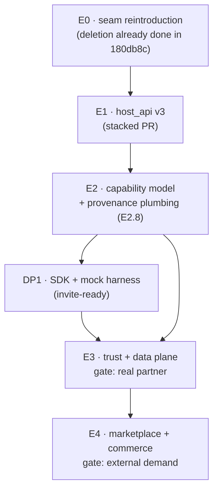

# Interface platform roadmap

> Execution breakdown for [ADR-0004](../adr/0004-interface-extension-platform.md). The
> *why* and the architecture are in the ADR + the [Interfaces & Extensions](interfaces.md)
> page; this page is the phased, story-level plan (epics, dependencies, trust tiers) a
> tracker can be seeded from.

!!! success "Status (2026-06-13): E0–E2 + DP-1 landed — production-grade for first-party/verified extensions; github + code intel is the first live interface."
    The platform is production-ready for **first-party and verified in-process
    extensions**, with real governance. The third-party data plane + marketplace
    (E3/E4) remain demand-gated per this ADR. Shipped:

    - **E0 — attach seam.** Draft-enricher registry
      (`services/ingest/ingestion/enrichers.py`, `run_enrichers` at the step-1.5 site,
      raw-on-failure) + `ExtensionManifest` discovery (`lib/extensions/manifest.py`) +
      the `company_os.draft_enrichers` / `company_os.interfaces` groups +
      `/debug/interfaces`. github-intel (`Fyralisinc/github-intel`) re-attaches through
      these — core never imports it.
    - **E1 — versioned, enforced host API.** `lib/extensions/host_api/v1` read
      *projections* (`ObservationView`/`ModelView`/`DraftView`, `_raw` stripped),
      the `SubstrateReader` Protocol + the capability-checked
      `CapabilityScopedReader` impl (`services/platform/extensions`), a `proposed/`
      surface for first-party-only `submit_diff`, and **`registry.py` that ENFORCES
      `engines.fyralis_host_api`** — an incompatible extension is rejected, shown in
      `/debug/interfaces`. A 4th import-linter contract guards the boundary.
    - **E2 — capability model.** Migration `0127` (`extension_grants` table + RLS) and
      the **`fyralis_ext_readonly` Postgres role** — a substrate write under it is
      denied *structurally* (DB-proven). Capability vocabulary (locked to `can_read`'s
      discriminators), `extension_can_read`, the grants repo, and
      `resolve_capabilities` running in **enforce-but-first-party-fully-granted** mode.
    - **DP-1 — developer foundation.** A self-contained public SDK
      (`Fyralisinc/fyralis-ext`): manifest + capability authoring/validation, a host-API
      client, a **local mock harness** + `fyralis-ext dev`/`validate` CLI, and a
      `create-fyralis-extension` scaffolder — so an external dev builds + tests against
      mocks with zero real-tenant access.

    **Verified:** core enricher + capability + access-control suites (57) green;
    github-intel 18/18 (incl. full-pipeline e2e) green under E1/E2; the structural
    write-denial proven against live Postgres; import-linter 4/4 KEPT; `mkdocs --strict`
    green.

    **Deliberately deferred (demand-gated):** the read-API HTTP endpoint test needs
    core's gateway ASGI harness shared cross-repo; **E3/E4** — the capability-filtered
    redacted egress stream, authed edge-ingest endpoint, consent flow, and
    marketplace/billing — are gated on real external demand (and external infra +
    legal/DPAs), exactly as this ADR phases them.

## Trust tiers (recap)

`T1` first-party (in-process) · `T2` verified-partner (separate worker / sidecar) · `T3`
third-party (network boundary, **developer-hosted**). See [Interfaces & Extensions](interfaces.md#trust-tiers).

## Cross-cutting invariants

Every phase must preserve these.

| # | Invariant | Enforcement |
|---|-----------|-------------|
| INV-1 | **E5 (reasoning writes / `submit_diff`) is first-party-only — the load-bearing containment, not conservatism.** Ownership-scoped isolation alone is insufficient: an edge observation still influences shared inferences via trust-weighted scoring (`services/reasoning/sage/structural_gates.py`, `services/reasoning/retrieval/scoring.py`). What stops a third party authoring a belief is E5-first-party **+** the INV-6 weight discount. *Relaxing either re-opens the "stronger sandbox?" question (ADR-0004 precondition).* | `proposed/` API only; ungrantable capability; CI contract test (E2.7). |
| INV-2 | No WASM / in-process sandbox. T3 is developer-hosted over the network only. | "do-not-build" gate. |
| INV-3 | Host API + capability model are **transport-agnostic** (so a hosted-sandbox tier could slot in later without re-architecture). | code-review gate on `host_api/**`. |
| INV-4 | Third parties **write only at the ingestion edge**; read everywhere granted. | edge-ingest endpoint; no DB pool handed to T3. |
| INV-5 | Raw-on-failure preserved end-to-end (any enricher/extension failure persists the raw observation). | `run_enrichers` swallow + the E0 equivalence test. |
| INV-6 | **Third-party edge-ingest trust ceiling.** `trust_tier` is a *weight, not a gate*, so the ceiling is the primary influence-limiter. Default `inferential_external` (0.45); ceiling `attested_agent` (0.9) by justified grant; `authoritative`/`authoritative_external` unreachable for non-first-party; over-ceiling POSTs **rejected, not downgraded**; unreviewed/private floor at `unvetted` (0.2). | E3.2 edge-ingest validation + per-grant ceiling field. |

**Do-not-build-yet** (each waits for the phase whose real signal justifies it): WASM /
in-process sandbox · public marketplace · `submit_diff` for non-first-party · signed-extension
verification · per-extension resource quotas · billing engine.

## Resolved governance decisions

Folded in from the design review; full rationale in
[Interfaces & Extensions § Governance decisions](interfaces.md#governance-decisions).

- **R-Q1 (redaction):** stream emits `ObservationView` projections, never raw rows;
  per-channel redaction authored with the handler; default-deny `content["_raw"]` +
  identity; channel-owner defines sensitive, tenant tightens only. → shapes **E3.1 / E3.1b**.
- **R-Q2 (trust ceiling):** see **INV-6**. → shapes **E3.2**.
- **R-Q3 (review rigor):** two lanes by blast radius — automated gate for both, manual
  review + signing only for public listing. → shapes **E4.2**.
- **R-Q4 (reasoning isolation):** ownership-isolation insufficient alone; contained by
  INV-1 + INV-6, plus provenance-tagging of third-party-driven Models. → shapes **E2.8 / E3.8**.

## Phase / dependency / trust-tier map

| Epic | Phase | Trust | Depends on | Gate to start | Standalone value |
|------|-------|-------|------------|---------------|------------------|
| **E0** | 0 | T1 | — (deletion done in `180db8c`) | now | one registered seam + one view of every interface |
| **E1** | 1 | T1 | E0 | E0 merged | host refactors stop breaking interfaces |
| **E2** | 2 | T1 | E1 | E1 merged | substrate access auditable + structurally enforced |
| **DP1** | DP-1 | T1 (mocks) | E2 | E2 merged | external devs build + test locally, zero real data |
| **E3** | 3 / DP-2 | T2 | E2, DP1 | a real partner appears | a vetted partner runs against a real tenant |
| **E4** | 4 / DP-3+4 | T3 | E3 | demonstrated external demand | public marketplace; publish + install |

---

## EPIC E0 — Reintroduce the attach seam: draft-enricher registry + manifest · T1

**Goal:** rebuild the hook that `180db8c` removed *as a generalized, registered seam*, so the
now-external `github-intel` re-attaches without core importing it, a *second* enricher becomes
possible without editing core, and every interface is declared once.

| Story | Title | Depends on | Acceptance criteria |
|-------|-------|------------|---------------------|
| **E0.1** | E2 enricher registry | — | New `services/ingest/ingestion/enrichers.py` modeled on `services/ingest/ingestion/handlers/__init__.py`: `@register_enricher(channel)` + `_ENRICHERS: dict[str, list[fn]]` (**list** per channel = generalization point), `run_enrichers(channel, draft, *, pool, tenant_id)` runs each in order **wrapped in the raw-on-failure `try/except`**; no-op when none. Re-add a single `await run_enrichers(...)` call at the former step-1.5 site in `ingest_from_draft`. |
| **E0.2** | Entry-point discovery for external enrichers | E0.1 | Add the `company_os.draft_enrichers` group (copy the cached, failure-isolated discovery from `services/reasoning/think/hooks.py` / `services/app/gateway/extensions.py`). **Now mandatory, not optional:** github-intel is external, so registration-by-import (the handlers pattern) no longer applies — it must be entry-point–discovered. |
| **E0.3** | Seam equivalence oracle | E0.1 | The in-repo github_intel endpoint test left with the extraction, so add a fresh in-repo test: a registered stub enricher runs, mutates `draft.content`, and **a raising enricher still persists the raw draft** (INV-5). Behavior-equivalence to the old inline `content["intelligence"]` output is now owned by the **extracted github-intel repo's** tests against the published enricher contract. |
| **E0.4** | `ExtensionManifest` + discovery | — | New `lib/extensions/manifest.py`: frozen `ExtensionManifest` (id · contributes (E1–E8) · activation.events · `engines.fyralis_host_api` · publisher/trust-tier · capabilities) — **pure dataclasses** (safe under the `lib` → `services` import-linter floor). `company_os.interfaces` discovery copies the defensive load from `extensions.py`. |
| **E0.5** | `/debug/interfaces` + truth-generated docs | E0.4 | Lists every discovered interface with declared contributes/capabilities; a deliberately-broken manifest is skipped without breaking startup. |
| **E0.6** | Retrofit in-repo interfaces with manifests | E0.4 | **finance:** manifest enumerating its E1 channels (document in-core router-mounting as the sanctioned in-repo pattern). **CEO view:** wrap `configure_ceo_view` into a `GatewayExtension` (E7) — removes the core → product import. *(github-intel's manifest now ships in the external repo, declaring `onChannel:github:webhook` + its draft-enricher contribution via the entry point.)* |

> **Within E0:** E0.1 → E0.2 → E0.3 is the critical path; E0.4–E0.6 (manifest) are independent and can run in parallel.

### Phase 0 ↔ Phase 1 sequencing & regression safety

**Recommendation: two stacked PRs, not one.** Phase 0 (seam) lands first; Phase 1 (host API)
branches off it. The risks are independent — "did the registry seam preserve the enricher
contract?" vs "did repointing interfaces to `host_api/v3` projections preserve behavior?" — and
stacking keeps a red test unambiguous while costing no parallelism (Phase 1 dev starts when
Phase 0's API is stable, not when it merges).

**The regression contract changed with the extraction.** The old oracle
(`test_github_intel_endpoints.py`) is gone from this repo. The new two-part oracle:

1. **In-repo (E0.3):** the enricher seam runs registered enrichers in order, mutates `content`,
   and preserves raw-on-failure.
2. **Cross-repo:** the extracted `github-intel` repo asserts its enricher, run through the
   published `company_os.draft_enrichers` contract, produces the same
   `content["intelligence"]` shape it did inline. This is the behavior-equivalence proof; it
   must be green in that repo against the version of the seam Phase 0 ships.

**The one subtle failure mode (call out in review):** with github-intel external, nothing
*imports* it to trigger registration — discovery is **entirely** via the E0.2 entry-point group.
A missing/typo'd entry-point means the enricher silently never runs. E0.5's `/debug/interfaces`
is the operational check that it registered.

---

## EPIC E1 — Stable versioned host API + stable/proposed split · T1

**Goal:** an explicit, semver'd surface interfaces bind against, so a core refactor/migration can
no longer silently break an interface.

| Story | Title | Depends on | Acceptance criteria |
|-------|-------|------------|---------------------|
| **E1.1** | `host_api/v3` read projections | E0 | `lib/extensions/host_api/v3/observation.py`: frozen `ObservationView` / `DraftView` (projections, not raw rows). Pure dataclasses in `lib`. **This is also the projection the E3.1 filtered stream emits (R-Q1).** |
| **E1.2** | `SubstrateReader` Protocol + impl split | E1.1 | **Protocol** in `lib/extensions/host_api/v3/substrate.py`; **implementation** in `services/platform/extensions/substrate_reader.py` — because it calls `can_read` and `lib` cannot import `services`. (Resolves the doc's "placement risk".) |
| **E1.3** | Write/trigger + bundle surface | E1.1 | `host_api/v3/triggers.py` (`enqueue_trigger`); `host_api/v3/bundle.py` (`BundleView`). |
| **E1.4** | `proposed/` surface for E5 | E1.1 | `host_api/proposed/diff.py` (`submit_diff`, typed diff never raw SQL). **First-party-only per INV-1.** |
| **E1.5** | `engines.fyralis_host_api` version check | E0.4, E1.1 | `lib/extensions/registry.py` validates each manifest's semver range against the host version; mismatch refused at discovery (logged, not fatal). |
| **E1.6** | Repoint in-repo interfaces onto `host_api/v3` | E1.2, E1.3 | finance / CEO view bind to view types + `SubstrateReader`, not internal types. |
| **E1.7** | Import-linter contract | E1.6 | `host_api/**` cannot import `services` internals — **largely free**: view types in `lib/extensions` are already covered by the existing *"lib independent of services"* contract in `pyproject.toml`; add an explicit named contract for the `services/platform/extensions` bridge so it stays one-directional. CI red on violation. |

---

## EPIC E2 — Capability / permission model (audit + structural enforcement, first-party fully-granted) · T1

| Story | Title | Depends on | Acceptance criteria |
|-------|-------|------------|---------------------|
| **E2.1** | `extension_grants` table — migration **0127** | E1 | Next free after `db/migrations/0126_observations_tenant_scoped_dedup.sql`. Columns: `tenant_id`, `extension_id`, `granted_version`, `capabilities JSONB`, `granted_by/at`, `revoked_at`, **per-extension trust-ceiling field** (for INV-6), PK `(tenant_id, extension_id)`. RLS via the standard tenant-isolation template. |
| **E2.2** | Capability vocabulary, validated against `can_read` | — | `read_channels`, `write_observations`, `substrate_read/write ⊆ {observation,commitment,goal,decision,resource,model}`, `mutate_reasoning ∈ {none,augment_only,contribute_diff}`, `resource_kinds`. `resource_kinds` **must equal** `_RESOURCE_KIND_ROLES` keys in `services/platform/access_control/checks.py`; test asserts vocab ⊆ live `can_read` discriminators (catches drift). |
| **E2.3** | `extension_can_read` wrapper | E2.2 | `services/platform/access_control/extension_caps.py`: runs the channel / kind / resource-kind layers of `can_read` but **skips actor-relationship layers** (an extension is infrastructure, not a person). |
| **E2.4** | `fyralis_ext_readonly` Postgres role | E2.1 | No substrate-write grants. Host hands extension points a connection via `SET LOCAL role = 'fyralis_ext_readonly'` + `SET LOCAL app.tenant_id` + optional channel predicate. |
| **E2.5** | Enablement wiring (reuse `TenantFlags`) | E2.1 | Enablement = `tenant_flags` `extension.<id>.enabled` (`services/ingest/ingestion/feature_flags/client.py`, with `set_by`); *what it may do* = `extension_grants`. Enforce-but-first-party-fully-granted. |
| **E2.6** | Structural-enforcement test | E2.3, E2.4 | A first-party interface granted `substrate_read=["observation"]` can read; a connection under `fyralis_ext_readonly` is **denied a write at the RLS layer, not the app layer**. |
| **E2.7** | INV-1 guard test | E2.2 | `substrate_write` / `mutate_reasoning:contribute_diff` **cannot** be granted to a non-first-party publisher. |
| **E2.8** | Model provenance-tagging foundation (R-Q4) | E2.1 | Extend the existing `provenance` / `source_boost` plumbing (`services/reasoning/retrieval/scoring.py`) so every synthesized Model records the **set of source identities (incl. extension ids) that materially drove it**. Cheap, first-party-useful now; the substrate E3.8 lights up for third parties. |

---

## EPIC DP1 — Developer foundation: SDK, local harness, scaffolder, identity · T1 (mocks only)

**Goal:** make it possible to *invite* external developers — build + test end-to-end against mocks,
zero real-tenant access, zero production-security spend.

| Story | Title | Depends on | Acceptance criteria |
|-------|-------|------------|---------------------|
| **DP1.1** | Public versioned SDK — `fyralis-ext` (Python) | E1, E2 | Auth handshake, filtered-stream consumer, host-API client (read + post edge observations), manifest schema + validation. Semver-pinned to `host_api/v3`; transport-agnostic (INV-3). |
| **DP1.2** | `fyralis-ext dev` local mock harness | DP1.1 | CLI runs a mock Fyralis: emits sample events, accepts edge posts, validates manifest, simulates a scoped grant. Reuses synthetic/demo data generators. **Build+test with zero real-tenant access.** |
| **DP1.3** | `create-fyralis-extension` scaffolder | DP1.1 | Generates a working extension skeleton (manifest + handler stubs + dev-harness config). |
| **DP1.4** | Extension identity / OAuth2 client registration | E2 | Each extension = a registered OAuth2 client (per-environment creds, rotation). Adapt `services/ingest/oauth_refresh.py` for *outbound* app auth. Sandbox creds only at this phase. |
| **DP1.5** | Developer portal + docs + scope catalog | DP1.1–DP1.4 | MkDocs: getting-started, E1–E8 reference, manifest schema, **scope catalog** (the E2.2 vocabulary), versioning/deprecation policy. |
| **DP1.6** | Sandbox tenant + sample data | DP1.2 | A synthetic tenant devs build against (reuse spam-run/demo tenants). |

---

## EPIC E3 (Phase 3 / DP-2) — Trust + data plane · T2 · *gate: a real partner appears*

| Story | Title | Depends on | Acceptance criteria |
|-------|-------|------------|---------------------|
| **E3.1** | Capability-filtered egress stream (emits `ObservationView`) | E1.1, E2, E3.1b | Per-`(extension, tenant)` Kafka projection delivering **only** for tenants with an active grant, **only** granted `read_channels`, **only** the E3.1b projection. No raw `observations` row ever crosses the boundary. |
| **E3.1b** | Per-channel redaction projections (R-Q1, default-deny) | E1.1 | For each **streamed** channel (those a partner is actually granted — **not all handlers up front; log channels not yet projection-covered** so the gap is explicit), author `redact(obs) -> ObservationView` **in the handler's module**, reviewed in the normal PR flow. Default-strip `content["_raw"]` + identity fields. Channel owner defines sensitive; tenant tightens only. |
| **E3.2** | Authed, rate-limited edge-ingest endpoint (INV-6) | E2, DP1.4 | Same handler/dedup pipeline (`services/ingest/ingestion/handlers/__init__.py`), tagged with the extension as source. Default tier `inferential_external`; grant may raise to ceiling `attested_agent` with recorded justification; **any POST asserting `authoritative`/`authoritative_external` or above the grant ceiling is rejected, not downgraded**; unreviewed floor `unvetted`. Re-checks grant + tenant scope on **every** write via RLS + `extension_can_read`. |
| **E3.3** | Admin consent / grant flow | E2.1 | Manifest scopes → consent screen → `extension_grants` row (`capabilities = intersection(declared, approved)`, `granted_version`, trust-ceiling) + flip `extension.<id>.enabled`. Public = consent per install; private = self-grant. |
| **E3.4** | Audit logging | E3.1, E3.2 | Full audit of what each extension read and wrote, per tenant. |
| **E3.5** | Kill-switch | E2.5 | Per-tenant **and** global instant disable; tear down stream subscription on revoke. |
| **E3.6** | T2 partner runtime (sidecar / worker) | E3.1 | A named partner ships code as its own compose service / Kafka consumer + host read API under the restricted role — process-isolated, no shared pool. No WASM (INV-2). |
| **E3.7** | Per-extension observability | E3.4 | Dashboards for each extension's API usage, errors, stream lag — reuse the Prometheus/Grafana stack. |
| **E3.8** | Surface third-party-driven Models as contestable (R-Q4) | E2.8, E3.2 | Any Model **materially driven by a single third-party extension** is flagged first-class contestable + visible (reuse the contestation surface). The aggregate-influence guard. |

---

## EPIC E4 (Phase 4 / DP-3 & DP-4) — Marketplace, review, lifecycle, commerce · T3 · *gate: demonstrated external demand*

| Story | Title | Depends on | Acceptance criteria |
|-------|-------|------------|---------------------|
| **E4.1** | Registry / catalog | E3 | `extension_catalog` + public marketplace listing + private per-tenant registry; install/enable/disable/uninstall; ratings. |
| **E4.2** | **Two-lane** review + signing (R-Q3) | E4.1 | **Lane A (both):** automated — manifest lint + scope justification + callback-domain verification. **Lane B (public listing only):** + manual review + signing; new-scope version re-triggers Lane B (gated by `granted_version`). Private/per-tenant stays Lane A (self-attested) with a **louder consent screen**. **The data-processing/legal gate (E4.7) is lane-independent.** Principle: *review rigor = tenants exposed, not code trust.* |
| **E4.3** | Lifecycle: install / uninstall / re-consent | E4.1, E3.3 | Install → consent → grant + enable. Uninstall → revoke + tear down subscription + flag off. New-scope version → re-consent (the `granted_version` gate). |
| **E4.4** | Production rate limits / quotas / metering | E3.2 | Per-extension API & stream quotas; usage metering. |
| **E4.5 (DP-4)** | Billing / commerce | E4.4 | Subscription / revenue-share, usage metering, payouts. Integrate a billing provider; defer heavy build. |
| **E4.6 (DP-4)** | Deprecation automation | E1.5 | Semver host-API sunset windows; stable-vs-proposed breaking-change policy. |
| **E4.7** | Legal / compliance (non-engineering, blocking for paid launch) | — | Developer ToS + Data Processing Agreements (employee comms + finance → SOC2/GDPR/data-residency), incident response. |
| **E4.8 (optional)** | Hosted-sandbox tier | INV-3 held | **Only if** synchronous, in-loop, low-latency demand materializes. Slots in because the manifest / capability model / host API are transport-agnostic — only execution/transport differs. |

---

## Verification matrix

| Gate | Phase | Assertion |
|------|-------|-----------|
| Seam equivalence | E0.3 | registered enrichers run in order, mutate `content`, raising enricher → raw draft persists (INV-5) |
| Cross-repo behavior-equivalence | E0 | extracted `github-intel` produces the same `content["intelligence"]` through the published enricher contract |
| Manifest robustness | E0.5 | `/debug/interfaces` lists every interface; broken manifest skipped, startup survives |
| Host-API contract | E1.7 | import-linter red if `host_api/**` imports `services` internals |
| Provenance plumbing | E2.8 | a Model synthesized from a tagged observation carries the driving source-id set |
| Structural enforcement | E2.6 | write under `fyralis_ext_readonly` denied **at RLS**, not app layer |
| INV-1 | E2.7 | non-first-party cannot be granted `contribute_diff` |
| Redaction default-deny (R-Q1) | E3.1/E3.1b | filtered stream **structurally cannot** carry `content["_raw"]` or identity; uncovered channels are not streamed (logged gap, not silent leak) |
| Trust ceiling (R-Q2 / INV-6) | E3.2 | edge-ingest POST asserting `authoritative` is **rejected** (not downgraded); default tier `inferential_external`; grant ceiling honored |
| Aggregate-influence guard (R-Q4) | E3.8 | a Model materially driven by one third-party extension is flagged contestable + visible |
| Tenant-scoping | E3 | stream delivers granted tenants only; edge-ingest re-checks per write; kill-switch disables instantly |

## Critical path

## Residual open questions

- Marketplace commercial terms — revenue share / review SLA (→ E4.5, ADR `TODO(human)`).
- Whether *cumulative* third-party influence on shared inferences needs a hard cap beyond
  visibility + contestation (revisit only if a real extension demonstrates belief-swinging volume).
- The exact criterion for granting the `attested_agent` re-attestation exception (E4.2 review policy).
