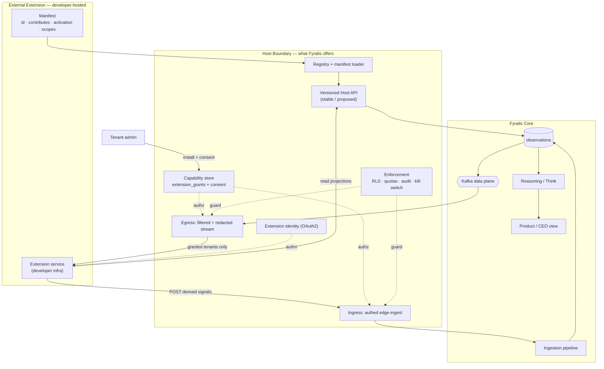

# Interfaces & Extensions

> Source: cross-cutting — `services/ingest/integrations/*` (finance),
> `services/product/greeting` (CEO view); the attach seams in
> `services/ingest/ingestion/handlers/`, `services/reasoning/think/hooks.py`, and
> `services/app/gateway/extensions.py`. The `github_intel` + `code_intel` interface
> was **extracted** to a separate repo (`Fyralisinc/github-intel`) as the first step
> of building this layer. Part of the [architecture overview](index.md).

**One-line:** an *interface* (extension) is a self-contained capability layered on
the core substrate — it consumes core signals and/or contributes derived ones.
The finance sources and the CEO view are the first in-core interfaces; `github_intel`
+ `code_intel` were the proof-of-concept, now **extracted** to `Fyralisinc/github-intel`
to return as the first true external interface. This page documents how interfaces
attach **today** and the **proposed** unified, externally-extensible interface layer
([ADR-0004](../adr/0004-interface-extension-platform.md)).

## What is an interface

Fyralis is a **core substrate** (ingestion → [observations](../glossary.md)
system-of-record → reasoning/synthesis → product) with **interfaces** built on top —
the editor-and-extensions analogy: one core, many capabilities layered on it. An
interface reads core signals (and reasoning outputs) and/or writes derived signals
back, without being part of the core.

## Today — how interfaces attach

Three different mechanisms have been in use. The inconsistency — in particular that
two of the three made the **core import the interface** — is what the proposed layer
resolves; the `github_intel` case has already been cut out of core (see the extracted row).

| Interface | Attachment mechanism | Code |
|-----------|----------------------|------|
| `github_intel` + `code_intel` *(extracted → re-attached as the first interface)* | **was** an inline draft-enrichment hook in `core.py`; **extracted** to `Fyralisinc/github-intel`, then **re-attached via the new seams** — the `company_os.draft_enrichers` registry (inline enrichment), `company_os.gateway_extensions` (the `/github-intel/*` read API), and `company_os.interfaces` (manifest). Core discovers it; it never imports it. | `Fyralisinc/github-intel` (installed editable) |
| Finance sources | **source-handler registry** — `@register("mercury:api")` + fetcher/planner/reconciler dispatch + OAuth routers | `services/ingest/ingestion/handlers/__init__.py`, `services/ingest/integrations/{mercury,quickbooks,…}/` |
| CEO view | **gateway surface** — routers + an in-process scheduler mounted in the gateway lifespan | `services/product/greeting/`, `services/app/gateway/` |

## Existing extensibility primitives

The platform already ships the building blocks an extension layer needs — about half
of the proposed boundary is *composing* these:

- **Entry-point plugin discovery** — the `company_os.reasoning_augmentors`
  (`services/reasoning/think/hooks.py`) and `company_os.gateway_extensions`
  (`services/app/gateway/extensions.py`) groups, discovered via `importlib.metadata`
  and failure-isolated. The `fyralis_demo` overlay already attaches through them
  *without the core importing it*.
- **Per-tenant feature flags** — `TenantFlags`
  (`services/ingest/ingestion/feature_flags/client.py`), the activation/enablement
  primitive (e.g. `ingestion.kafka_path_enabled`) and a kill-switch.
- **Tenant isolation** — `tenant_transaction` + RLS (`lib/shared/tenant_context.py`)
  on every tenant-scoped table.
- **Five-layer access control** — `can_read`
  (`services/platform/access_control/checks.py`), whose `source_channel` /
  `resource_kind` discriminators are the vocabulary a capability model reuses.

## The externally-extensible layer

!!! success "Status (ADR-0004): the host boundary + governance are implemented for first-party/verified extensions (E0–E2 + DP-1, 2026-06-13)"
    The discovery seam, the versioned + **enforced** host API (`lib/extensions/host_api/v1`),
    the capability model (`extension_grants` + the `fyralis_ext_readonly` RLS role,
    migration 0127), and a public developer SDK (`Fyralisinc/fyralis-ext`) are live —
    see the [interface platform roadmap](interface-platform-roadmap.md). The
    **third-party data plane + marketplace** (E3/E4 — filtered/redacted stream, edge-ingest,
    consent, review/billing) remain demand-gated. The six host offerings:

The core **inverts its dependency**: instead of importing interfaces, it exposes a
fixed **host boundary** that extensions bind to and are *discovered* through. The
host offers six things:

1. **Contribution surface** — a *closed* set of extension points. External (async,
   network-isolated) extensions use only the safe subset: **stream-consume**,
   **edge-ingest**, **product-surface**.
2. **Manifest + discovery registry** — an extension declares identity, contributions,
   activation events, and requested scopes; the host discovers + validates it
   (generalizing the existing entry-point groups).
3. **Stable versioned host API** — internals-hiding read *projections* (not raw
   tables) + a write API, with a SemVer `engines` pin and a stable/proposed split.
4. **Governed data channels** — *egress*: a capability-filtered, redacted,
   per-`(extension, tenant)` event stream; *ingress*: an authenticated,
   rate-limited edge-ingest endpoint at a constrained [trust tier](../glossary.md).
5. **Identity + capability + consent** — each extension is an OAuth2 principal;
   scopes are declared then granted (`extension_grants`) through an admin consent
   flow; enforced by an RLS-scoped role + rate limits + audit + a kill-switch.
6. **Lifecycle + catalog** — per-tenant install/enable/disable, versioning with
   re-consent on new scopes, and a marketplace/registry.

The genuinely **new** surface is just four pieces: the versioned host API, the
filtered/redacted egress stream, the `extension_grants` capability store, and the
edge-ingest endpoint. The rest is composing the primitives above.

## How it's wired (proposed target)

> The diagram is the **proposed target**, not current wiring. Per the
> [diagram conventions](index.md#diagram-conventions), dotted edges here are the
> authorization / enforcement relationships.

## Trust tiers

| Tier | Isolation | Who | May contribute |
|------|-----------|-----|----------------|
| First-party | in-process | core team | all points, incl. inline enrich + reasoning writes |
| Verified-partner | separate worker / sidecar | reviewed partners | sources, workers, post-commit actions, product surfaces |
| Third-party | network boundary (**developer-hosted**) | marketplace developers | read via stream + **write only at the ingestion edge** — never the synthesis loop |

External (third-party) extensions are **developer-hosted**: they run on the
developer's own infrastructure and interact only through the boundary — never the
database or the ingest hot path. They therefore operate **asynchronously** (consume
stream → compute → write back via edge-ingest), which is why, e.g., a third-party
"GitHub Code Intel" would be the out-of-band worker model rather than the inline
enricher.

## Key seams & primitives

| Concern | Path | Role |
|---------|------|------|
| Draft-enricher registry | `services/ingest/ingestion/enrichers.py` | the generalized replacement for the former hardcoded github hook — `register_enricher` (in-repo) + `company_os.draft_enrichers` discovery (installed extensions), run at the step-1.5 site in `ingest_from_draft`, raw-on-failure |
| Host API + manifest | `lib/extensions/host_api/v1`, `lib/extensions/manifest.py` | the stable contract (`DraftEnricher`, read projections, `HOST_API_VERSION`) + `ExtensionManifest` discovery (`company_os.interfaces`); surfaced at `/debug/interfaces` |
| Version enforcement | `lib/extensions/registry.py` | rejects an extension whose `engines.fyralis_host_api` range excludes the running host version |
| Capability model | `db/migrations/0127_extension_grants.sql`, `services/platform/extensions/` | `extension_grants` (RLS) + the `fyralis_ext_readonly` role (writes denied structurally) + `CapabilityScopedReader` + `resolve_capabilities` (first-party-fully-granted) |
| Capability check | `services/platform/access_control/extension_caps.py` | `extension_can_read` — the structural (channel/kind/resource-kind) layers of `can_read`, skipping actor-relationship layers |
| Developer SDK | `Fyralisinc/fyralis-ext` | self-contained SDK: manifest/capability authoring + validation, host-API client, local mock harness + `fyralis-ext dev`, `create-fyralis-extension` scaffolder |
| Handler registry | `services/ingest/ingestion/handlers/__init__.py` | `register(channel)` source-handler seam |
| Entry-point discovery | `services/reasoning/think/hooks.py`, `services/app/gateway/extensions.py` | the `company_os.*` plugin groups (reasoning augmentors, gateway extensions) to generalize |
| Feature flags | `services/ingest/ingestion/feature_flags/client.py` | per-tenant activation/enablement + kill-switch |
| Tenant isolation | `lib/shared/tenant_context.py` | RLS + `tenant_transaction` — the isolation substrate |
| Access control | `services/platform/access_control/checks.py` | `can_read` — the capability vocabulary |

## Design rationale

The full proposal — the developer-hosted ruling (vs a Fyralis-hosted sandbox), the
menu of candidate interfaces (Finance Intelligence, Persona views, Sales/CRM, People/HR),
the external research (VS Code / Backstage extensibility patterns), the
capability/isolation governance, and the phased rollout — is in
[ADR-0004](../adr/0004-interface-extension-platform.md); the story-level execution
breakdown (epics, dependencies, trust tiers) is in the
[Interface platform roadmap](interface-platform-roadmap.md). The first-party
consolidation it builds on (generalizing the inline hook into a registered enricher)
is the same `ingest_from_draft` path documented in [Ingest](ingest.md).

## Governance decisions

Four questions the proposal left open are now **decided** (ADR-0004, 2026-06-13). The
load-bearing fact behind three of them: in this substrate `trust_tier` is a continuous
*weight* in retrieval and edge scoring (`services/reasoning/retrieval/scoring.py`,
`services/reasoning/sage/structural_gates.py`), not a binary gate — so the read/write
ceilings, not a gate, are what bound third-party influence.

- **Egress redaction.** The filtered stream emits versioned read *projections*
  (`ObservationView`), never raw `observations` rows; each streamed channel ships a
  redaction projection authored alongside its handler, default-stripping the raw payload
  (`content["_raw"]`) and actor-identity fields. The channel owner defines "sensitive";
  a tenant admin may tighten, never loosen.
- **Edge-ingest trust ceiling.** Third-party edge-ingested observations default to
  `inferential_external` and are capped at `attested_agent` (granted only with a recorded
  re-attestation justification); `authoritative` / `authoritative_external` are
  unreachable for any non-first-party, and over-ceiling writes are rejected, not silently
  downgraded; unreviewed/private extensions floor at `unvetted`.
- **Review rigor scales with blast radius (tenants exposed), not code trust.** Both
  private and public extensions pass an automated gate (manifest lint + scope
  justification + callback-domain verification); manual review + signing is required only
  for *public listing*. Private per-tenant extensions are self-attested with a louder
  consent screen; the data-processing/legal gate applies to both.
- **Reasoning-substrate isolation.** Ownership-scoped isolation alone is insufficient for
  a synthesis substrate — an edge observation still influences shared inferences via
  trust-weighted scoring. E5 (reasoning writes) staying first-party, plus the trust-weight
  discount above, is the load-bearing containment; Models materially driven by a single
  third-party extension are tagged and surfaced as contestable.

> **TODO(human):** still open before a public developer portal — the marketplace
> commercial terms (revenue share / review SLA); and whether *cumulative* third-party
> influence on shared inferences needs a hard cap beyond visibility + contestation.
