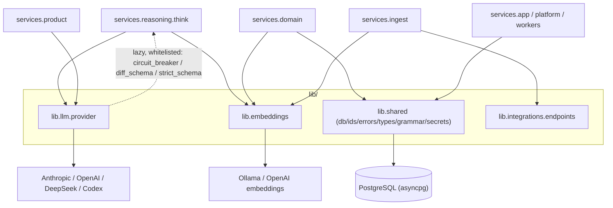

# Shared Libraries (`lib`)

> Source: `lib/` (packages `shared`, `llm`, `embeddings`, `integrations`).
> Part of the [architecture overview](index.md).

**One-line:** the dependency floor — shared building blocks (DB pool, IDs, errors,
schema-mirror types, memory-grammar/edge/trust registries, secret store, the
structured-output LLM provider, the embeddings abstraction, the outbound-endpoint
resolver) that every service imports but that **must never import `services`**.

## Responsibilities

`lib/` provides infrastructure and domain-vocabulary primitives consumed across
all `services/*` layers, with one enforced rule (import-linter `forbidden`
contract): **`lib` must not import `services`.**

- **`shared`** — the bulk of the layer. `errors.py` (`CompanyOSError` hierarchy
  with structured context, imported by ~102 modules), `ids.py` (`uuid7` +
  tenant ContextVar, ~80 importers), `db.py` (asyncpg pool + savepoint
  transactions + Pydantic row hydration), `types.py` (`*Row` models mirroring the
  schema-lock columns), `memory_grammar.py` / `edge_registry.py` /
  `claim_role_registry.py` (the Model epistemic grammar + declarative relationship
  registries), `trust.py` (the 7-tier `TrustTier` enum), `tenant_context.py` (RLS
  `app.current_tenant` binding), `env.py`, `migrations.py`, and `secrets/`
  (Fernet envelope-encrypted `SecretStore`).
- **`llm`** — `provider.py` (~2000 lines): one
  `LLMProvider.structured(system, user, schema)` surface returning a validated
  Pydantic instance with retry-on-parse-failure. Concrete providers: Anthropic,
  OpenAI, DeepSeek (strict tool-calling + JSON repair), and Codex (Responses API /
  app-server / CLI transports). Adds per-model pricing + timeouts, error
  classification + retry policies, usage aggregation, circuit-breaker routing, and
  an optional response cache.
- **`embeddings`** — the `Embedder` Protocol + `make_embedder()` factory choosing
  Ollama (`nomic-embed-text`) or OpenAI (`text-embedding-3-small`), both pinned to
  768-d (matches `VECTOR(768)`).
- **`integrations`** — `endpoints.py`, the single outbound base-URL resolver
  (per-source env var > synthetic spammer host > production default).

## The enforced boundary

!!! note "The only `lib → services` edges"
    Three **deliberate function-local lazy imports** inside `lib/llm/provider.py`
    reach into `services.reasoning.think.{circuit_breaker, diff_schema,
    strict_schema}`. They are explicitly whitelisted in the import-linter
    `ignore_imports` list (the rest of that list is test-only) and keep reasoning
    schemas decoupled at module-load time.

!!! warning "Code-vs-doc discrepancy (verified)"
    `CODEBASE-ARCHITECTURE.md` lists `lib/topology` as a live package. In the actual
    tree `lib/topology` contains **only stale `__pycache__/*.pyc` + a `tests/` dir —
    no `.py` source**. The real topology code was relocated to
    [`services/reasoning/topology/`](reasoning.md). Trust the code: there is no
    active `lib.topology` package.

## Key modules

| Module | Path | Role |
|--------|------|------|
| LLM provider | `lib/llm/provider.py` | Provider-agnostic structured-output abstraction (Anthropic/OpenAI/DeepSeek/Codex). |
| Embeddings | `lib/embeddings/factory.py` | `Embedder` protocol + `make_embedder()` (Ollama / OpenAI, 768-d). |
| DB | `lib/shared/db.py` | asyncpg pool, `transaction()`, typed row hydration. |
| IDs | `lib/shared/ids.py` | `uuid7` + tenant ContextVar. |
| Errors | `lib/shared/errors.py` | `CompanyOSError` hierarchy. |
| Types & registries | `lib/shared/types.py` | `*Row` models + memory-grammar / edge / claim-role / trust registries. |
| Secrets | `lib/shared/secrets/` | Fernet `SecretStore` over `encrypted_secrets`. |
| Endpoints | `lib/integrations/endpoints.py` | Outbound base-URL resolver. |

## Entry points

None — `lib/` is a library, not a process. It is reached purely by import. Key
surfaces: `build_provider()`, `make_embedder()`, `lib.shared.db` helpers.

## Dependencies

**Inbound** *(verified)*: every `services/*` layer + tests/scripts.

**Outbound** *(verified)*: third-party SDKs (asyncpg, pydantic, anthropic/openai,
cryptography) + the three whitelisted lazy imports into `services.reasoning.think`.

## Design rationale

> **TODO(human):** Capture the *why* behind:
>
> - Whether the three `lib.llm.provider → services.reasoning.think` lazy imports are
>   permanent or candidates for inversion (move the schemas down into `lib`).
> - The intended default LLM provider (`LLMConfig.from_env` defaults to Anthropic,
>   but `.env.example` sets DeepSeek) and the out-of-box posture.
> - The long-term tenancy model: the `ids` tenant ContextVar vs. the
>   `tenant_context` RLS binding currently coexist.
> - Ownership of the `MODEL_PRICING` / `MODEL_TIMEOUTS` tables (some flagged as
>   rough placeholders).
