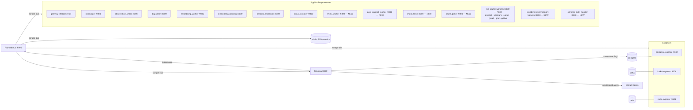

# Observability Architecture — Prometheus + Grafana

Design for the Fyralis metrics platform. The audit that motivates it is
[observability_audit.md](observability_audit.md); the validation record is
[observability_validation_report.md](../validation/observability_validation_report.md).

## 1. Principles

1. **Keep the hand-rolled exposition convention.** The codebase deliberately
   ships no `prometheus_client` (constitution principle X, cited in
   `services/app/webhooks/metrics.py`). Rather than introduce the dependency,
   a small shared registry — `lib/observability/` — provides labeled
   Counter/Gauge/Histogram primitives and Prometheus text rendering for every
   *new* metric. Pre-existing endpoints keep their exact output and append
   the shared registry's families, so no scrape contract breaks.
2. **Pull, don't push.** Every process exposes `/metrics`; Prometheus scrapes.
   The only push path that remains is the legacy `INGESTION_ALERT_WEBHOOK_URL`
   ops webhook (kept; Grafana alerting supersedes it operationally).
3. **The database is also a metrics substrate.** `think_run_costs`,
   `ingestion_failures`, `think_trigger_queue` and friends already persist
   what Prometheus can't hold (per-tenant attribution, unbounded enums).
   postgres-exporter custom queries lift bounded aggregates into Prometheus;
   Grafana's Postgres datasource queries the rest directly.
4. **Tenant safety.** `tenant_id` / `installation_id` are **never** Prometheus
   label values (existing FR-015 posture). Per-tenant views live only in the
   Grafana Postgres datasource, which is already access-controlled at the DB.

## 2. Topology



* All scraping happens on the compose network by service name; only Grafana
  (`127.0.0.1:3000`) and Prometheus (`127.0.0.1:9090`) get host ports, bound
  to loopback.
* The **NEW** worker targets reuse the existing
  `INGESTION_HEALTH_PORT=9300` env (already present in every container via the
  `x-app-env` anchor) and the same `/healthz` staleness contract. This now
  covers every long-running compose app worker: ingestion consumers, workflow
  loops, live source workers, Think/post-commit, GitHub Intel, and the SAGE /
  retrieval-memory workers.
* Infrastructure coverage includes postgres/kafka/redis exporters, Prometheus
  self-scrape, Grafana self-metrics, and MinIO's native cluster metrics endpoint.

## 3. Code layout

```
lib/observability/            # NEW — dependency-free, importable everywhere
  metrics.py                  # Registry, Counter, Gauge, Histogram + render_text()
  health.py                   # generic Heartbeat + start_health_server (think/post-commit/…)
  pools.py                    # asyncpg pool registration → scrape-time gauges
services/platform/schema_drift_monitor.py # continuous schema/RLS drift metrics
scripts/worker_observability.py # launcher helper for script-based workers
observability/                # NEW — stack configuration as code
  prometheus/prometheus.yml
  prometheus/rules/recording.yml
  postgres-exporter/queries.yaml
  grafana/provisioning/datasources/datasources.yml
  grafana/provisioning/dashboards/dashboards.yml
  grafana/provisioning/alerting/{alert-rules.yml,contact-points.yml,policies.yml}
  grafana/dashboards/*.json   # dashboards (see §6)
```

`services/ingest/ingestion/observability.py` stays the canonical server for
the ingestion consumers (unchanged contract); its `render_prometheus` now
*appends* `lib.observability.metrics.render_default()` so worker processes
automatically expose the shared-registry families (ollama, db pool, kafka
producer, oauth, integration counters) without per-worker wiring.

## 4. Metric naming + labeling conventions

* Families are `snake_case`; counters end `_total`, time histograms end
  `_seconds` (histograms render `_bucket`/`_sum`/`_count` with cumulative
  `le` buckets).
* Subsystem prefixes — `http_` (gateway requests), `webhook_` (existing),
  `ingestion_` (existing worker counters), `think_`, `ollama_`, `db_pool_`,
  `kafka_producer_`, `oauth_refresh_`, `integration_` (per-source modules).
  Product user journeys additionally emit bounded `product_workflow_` families
  by workflow enum, status class, and allowlisted event/outcome enums for SLOs
  and product workflow insight.
* Default latency buckets:
  `0.005, 0.01, 0.025, 0.05, 0.1, 0.25, 0.5, 1, 2.5, 5, 10, 30, 60` seconds.
* **Cardinality controls** (hard rules):
  * label values must come from bounded enums; free-form strings are
    sanitized to a bounded set or dropped;
  * HTTP metrics label by **route template** (`/v1/forecasts/{prediction_id}`),
    never the raw path — unmatched requests collapse into `unmatched`;
  * provider/source labels are bounded by the source registry (~25);
  * `tenant_id`, `installation_id`, ids of any kind: forbidden as labels;
  * think per-tenant queue gauges export only the aggregate (`all`) series
    plus a tracked-tenant count.
* Sample-based stores (resolver durations, think latency lists) are capped
  rolling windows; rendered as `_count`/`_sum` plus p50/p95/p99 gauges where
  a true histogram isn't available.

## 5. Scrape, retention, recording rules

* Scrape interval 15s (5s timeout), one static job per process class —
  static service names; this is a single-box compose, not service discovery.
* Retention: `--storage.tsdb.retention.time=15d` and
  `--storage.tsdb.retention.size=2GB`, whichever trips first. The named
  volume `company_os_prometheus` persists across restarts.
* Recording rules precompute the dashboard-hot expressions: per-source
  ingestion throughput rates, embed failure ratio, gateway error-rate by
  route class, product workflow SLO burn, and LLM spend hourly rate.

## 6. Dashboards (provisioned, folder "Fyralis")

| Dashboard | Backing data |
|---|---|
| System Health | heartbeat age + uptime per worker, `up`, DLQ depth, worst consumer lag, error-rate sparklines |
| Ingestion Funnel | per-source raw→normalized→written→embedded rates, dedup ratio, parse/invariant failures, DLQ by failure kind (pg-exporter), backfill shard progress (pg-exporter) |
| Webhook Ingress | volume/verification failures by provider+reason, resolver p95 + cache hit rate, Kafka-path fallback rate |
| Embeddings / Ollama | `ollama_embed_request_duration_seconds` p50/p95/p99, success/failure/retry rates, dim mismatches, backlog depth (pg-exporter `embedding_pending`), QPS |
| Reasoning / LLM Cost | spend/hour + tokens + calls by trigger kind (Prometheus), **per-tenant spend (Postgres datasource on `think_run_costs`)**, run latency, queue depth, validation drops, cascade violations, reconcile decision mix |
| Data Plane Infrastructure | kafka-exporter (lag, partitions), postgres-exporter (connections, locks, tx rate, custom gauges), redis-exporter, MinIO capacity, Grafana process health, scrape target health, `db_pool_*` saturation |
| Product Workflow Health | bounded product workflow request rate, 5xx ratio, p95 latency, normalized error/latency SLO burn, workflow/status mix, route-level 5xx, route-level p95 |

## 7. Alerting

Grafana-provisioned alert rules (`observability/grafana/provisioning/alerting/`),
evaluated against Prometheus:

| Alert | Expression sketch | For |
|---|---|---|
| WorkerHeartbeatStale | `ingestion_heartbeat_age_seconds > 120` | 1m |
| WorkerScrapeDown | `up{job=~"fyralis-.*"} == 0` | 2m |
| InfraScrapeDown | `up{job=~"prometheus\|postgres\|kafka\|redis\|minio\|grafana"} == 0` | 2m |
| DLQDepthHigh | `ingestion_dlq_writer_unresolved_depth > threshold` (default 25) | 5m |
| ConsumerLagHigh | `kafka_consumergroup_lag_sum > 1000` sustained | 10m |
| SignatureFailureSpike | `rate(webhook_verification_failures_total[5m])` over baseline | 5m |
| EmbedFailureRatio | failures / (successes+failures) > 0.05 | 10m |
| ThinkQueueBackpressure | `think_queue_depth > 500` | 5m |
| DBPoolSaturated | `db_pool_in_use / db_pool_max > 0.9` | 5m |
| SchemaRLSDriftDetected | `schema_drift_check_status{status=~"drift\|error"} or schema_drift_findings > 0` | 2m |
| ProductSLOBurnHigh | product route 5xx burn > 5x or p95 latency burn > 1.25x | 10m |
| LLMSpendBurnRate | `sum(rate(think_llm_cost_usd_total[1h])) * 3600 > $/h budget` | 15m |
| DeadLetterRowsPresent | pg-exporter `fyralis_dead_letter_rows > 0` (P2-2) | 15m |

Contact point: a provisioned webhook pointing at `INGESTION_ALERT_WEBHOOK_URL`
when set (same ops channel the dlq_writer uses today), else Grafana's default.

## 8. Tenant safety considerations

* Prometheus holds **no tenant-identifying series** (rule in §4). The
  postgres-exporter custom queries aggregate across tenants
  (`count(*)`, `sum(...) group by source/failure_kind` — never by tenant).
* Per-tenant spend/queue panels use the Grafana Postgres datasource with a
  **read-only** DB role; Grafana admin access is therefore equivalent to DB
  read access and the compose binds it to loopback. Production deployments
  must put Grafana behind the existing TLS edge + auth proxy before exposing
  it (documented in the runbook section of the validation report).
* The webhook `/metrics` endpoint on the gateway remains public-by-allowlist;
  it carries bounded-enum families only (FR-011/FR-015 unchanged).

## 9. What this deliberately does not do (yet)

* No OpenTelemetry traces — the installed OTel instrumentation packages stay
  dormant; adopting them is orthogonal (span-level tracing, not metrics).
* No Alertmanager — Grafana unified alerting suffices at single-box scale.
* No multiprocess aggregation — each process owns its registry; Prometheus
  aggregates across scrape targets.
* No enforcement of LLM budgets (P2-14): burn-rate alerting only; ceilings
  remain a `lib/llm/provider.py` follow-up.
