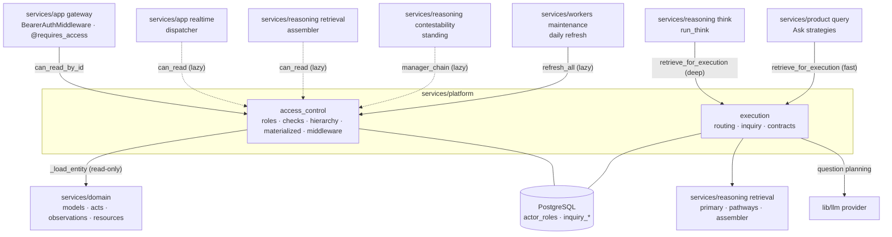

# Platform — Access Control & Execution Routing

> Source: `services/platform/` (packages `access_control`, `execution`).
> Part of the [architecture overview](index.md).

**One-line:** the cross-cutting layer that decides **who may see what**
(five-layer access control) and **how a signal should be processed**
(deterministic execution routing + the adaptive-inquiry retrieval loop).

## Responsibilities

### Access control (`access_control`)

A five-layer decision engine (`checks.can_read`) evaluated in order:

1. **Tenant isolation** — absolute deny on `tenant_id` mismatch; no override
   bypasses it.
2. **Observation scope** — author / mentioned / shared-channel / manager-chain
   (for non-HR channels).
3. **Act ownership** — commitment/goal/decision ownership and contributing roles.
4. **Resource kind** — financial / IP / relational / capacity / infrastructure
   each require specific roles.
5. **Model visibility** — explicit `visible_to_subjects` + `scope_actors`, with an
   admin/leadership tenant-wide override (skipped for HR channels).

It is backed by `actor_roles`, `shared_channels`, manager-chain traversal over
`actors.metadata.manager_id`, and `actor_visible_*` materialized views (refreshed
nightly + on role/hierarchy changes). It returns an `AccessDecision(allowed,
reason, override_applied)` and is enforced at the HTTP layer via the
`@requires_access` decorator and in WebSocket delivery via a lazy import.

### Execution routing & inquiry (`execution`)

- **`decide_route`** — a deterministic gate that scores a signal on text patterns
  (risk/commitment/decision/human-validation language), trust tier, entity
  overlap, and source importance, emitting one of six routes with a score
  breakdown and estimated cost. This helper is retained for experiments, but it
  is not wired into active ingest and no longer has a routing-decision table;
  migration `0127` dropped the retired `signal_routing_decisions` ledger.
- **Adaptive inquiry** (`retrieve_for_execution` / `run_inquiry_retrieval`) — wraps
  the low-level reasoning retrieval pathways in a question-planning loop: baseline
  seeding → hypothesis generation → (optional LLM-planned) discriminating
  questions → ranked retrieval actions → an evidence reservoir → a sufficiency
  gate → a synthesis **context packet** attached to the Think prompt. `FAST_PATH`
  signals skip multi-round questioning; `DEEP_INQUIRY_PATH` runs up to two rounds.

## How it's wired

## Key modules

| Module | Path | What it does |
|--------|------|--------------|
| Access checks | `services/platform/access_control/checks.py` | The five-layer `can_read` / `can_read_by_id` engine. |
| Roles | `services/platform/access_control/roles.py` | `actor_roles` grant/revoke/lookup; admin/leadership queries. |
| Hierarchy | `services/platform/access_control/hierarchy.py` | Manager-chain traversal + shared/HR channel detection. |
| Materialized | `services/platform/access_control/materialized.py` | Refresh of `actor_visible_*` views (concurrent after first build). |
| Access middleware | `services/platform/access_control/middleware.py` | `@requires_access(entity_type, resolver)` route decorator → 403 + reason. |
| Routing | `services/platform/execution/routing.py` | `decide_route`: deterministic signal classification + scoring. |
| Inquiry | `services/platform/execution/inquiry.py` | The adaptive multi-round retrieval/evidence/sufficiency loop. |
| Contracts | `services/platform/execution/contracts.py` | `SignalEnvelope`, `RoutingDecision`, the `SignalRoute` union. |

## Entry points

- `@requires_access(...)` decorators on gateway route handlers (call `can_read_by_id`).
- `BearerAuthMiddleware.dispatch` (in `services/app/gateway/middleware.py`) — resolves the auth context every access check relies on.
- `retrieve_for_execution(...)` — called by the [Think worker](reasoning.md) (deep) and [Query](product.md) strategies (fast).
- `refresh_all()` — invoked nightly by the [maintenance worker](workers.md).
- `decide_route(...)` — infrastructure-ready; **not yet wired into `ingestion.core.ingest`** (shadow only).

## Dependencies

**Inbound** *(verified)*: the gateway (auth + `@requires_access`), the realtime
dispatcher, the Think worker, Query strategies, the retrieval assembler, and
contestability standing checks — several via deliberate lazy imports.

**Outbound** *(verified)*: reads `services.domain` model/act/observation/resource
rows (read-only — `domain` does **not** call back into access control);
`services.reasoning.retrieval` pathways; `lib.llm.provider` for question planning;
PostgreSQL for `actor_roles` and `inquiry_*` tables.

**Data stores touched:** `actor_roles`, `shared_channels`, `actor_visible_*`,
`access_override_log`, `inquiry_sessions`,
`inquiry_questions`, `inquiry_evidence_items`, `actor_sessions`.

## Design rationale

> **TODO(human):** Confirm/expand the *why* behind:
>
> - Keeping eager `can_read` role queries **and** the materialized `actor_visible_*`
>   views — i.e. the consistency-vs-latency contract between them.
> - Why `decide_route` is built + tested but **shadow-only** (not yet gating the
>   Think queue): what confidence bar gates enforcement?
> - The intended product meaning of the six routing routes and when each fires.
> - The relationship between bearer-token auth here and the planned "Wave 5" auth.
