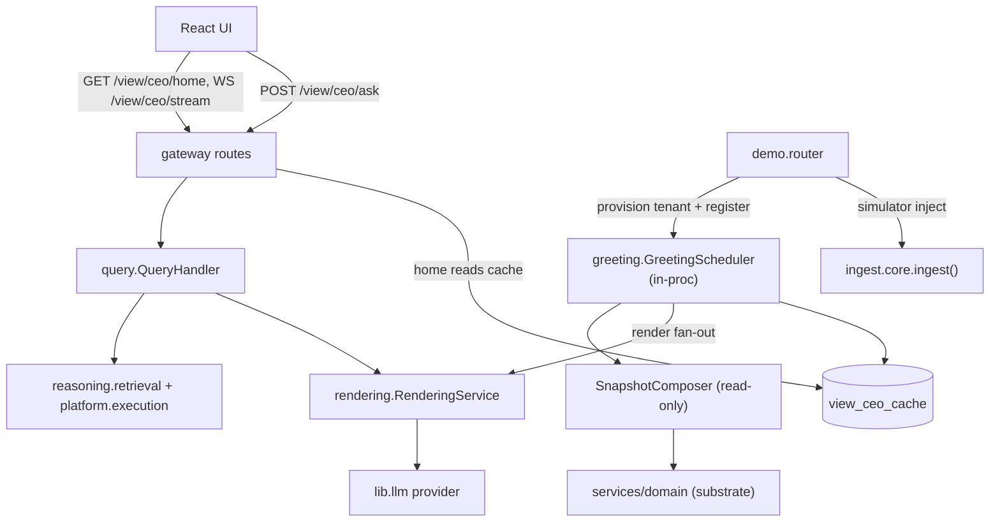

# Product — CEO-Facing Surfaces

> Source: `services/product/` (packages `greeting`, `today`, `forecasts`, `query`,
> `conversations`, `recommendations`, `decision_deltas`, `history`, `model_trace`,
> `rendering`, `demo`). Part of the [architecture overview](index.md).

**One-line:** the read/compose/render frontier — it composes cached substrate
snapshots + reasoning retrieval into voice-compliant, LLM-rendered CEO surfaces
(home / Ask / Today / Forecasts / History) and hosts the demo tenancy subsystem.
It does almost no signal mutation.

## Responsibilities

### CEO view cache (`greeting`)

`greeting/scheduler.py::GreetingScheduler` is an **always-on in-process worker**
started by the gateway. It refreshes `view_ceo_cache` per tenant via four loops:
scheduled (≈15 min), time-of-day boundary crossings, Postgres `LISTEN
view_ceo_refresh`, and a durable poll of `pending_post_commit_actions`. Each
refresh composes a read-only `SubstrateSnapshot`, renders
greeting/close_line/query_grid/cards concurrently through a `RenderingAdapter`
(plus a per-card reasoning/evidence pass), writes five cache keys, and publishes
WS updates. `greeting/api.py` serves `GET /view/ceo/home` (never 500s — fills safe
defaults); `greeting/stream.py` serves `WS /view/ceo/stream`.

### LLM rendering (`rendering`)

`rendering/core.py::RenderingService` is the single prose orchestrator: build
prompt → `lib.llm.provider` raw call (circuit-breakered, HTML not JSON) →
`voice_rules.check_all` → retry once on a REJECT-severity rule → record cost to
`view_render_costs`. It enforces structural HTML hooks deterministically at the
service boundary. Exposed as internal `/rendering/*` routes consumed only by the
greeting scheduler and the query layer — **never the UI directly**.

### Query / Ask (`query`)

`query/core.py::QueryHandler.answer_query` runs **classify → strategy → retrieve →
render**: a 6-category classifier (heuristic prefilter + DeepSeek fallback)
dispatches to a per-category strategy that runs `platform.execution` Fast-Path
retrieval + `reasoning.retrieval` context assembly in one transaction, then
renders a conversation turn. Supports prefetch caching and optional card context.

### Other surfaces

`today/` derives the Today payload (severity = impact × confidence);
`conversations/` persists per-card probe threads (routing free-form Ask through
`QueryHandler`); `recommendations/` is the action list (rank + act/dismiss/ratify
handlers that apply `proposed_change` via domain acts/resources and emit
state-change observations) + an SSE bus; `decision_deltas/` elevates the
Proposed-Change object; `forecasts/` backs predictions/accuracy/calibration;
`history/` derives the ledger; `model_trace/` walks `model_edges` for Trace
Back/Forward.

### Demo / simulation (`demo`)

`demo/router.py` mounts `/v1/demo/*`: the public picker + `sessions/start` (which
provisions a fresh tenant, loads a snapshot with per-tenant UUID remap, mints a
CEO `actor_sessions` token, promotes recommendations → decision deltas, and
registers the tenant with the greeting scheduler), plus `simulator/inject` (drives
the full `ingestion.core.ingest` pipeline) and SSE
`/v1/recommendations/stream`. `budget.py` enforces per-session cost caps;
`model_routing.py` overrides the LLM model per demo tenant/call-kind.

## How it's wired

## Key modules

| Module | Path | Role |
|--------|------|------|
| `RenderingService` | `services/product/rendering/core.py` | LLM prose with voice-rule retry + cost tracking. |
| `GreetingScheduler` | `services/product/greeting/scheduler.py` | Always-on CEO-cache pre-compute worker. |
| `ViewCeoCacheRepo` | `services/product/greeting/cache.py` | JSONB accessor over `view_ceo_cache`. |
| `QueryHandler` | `services/product/query/core.py` | Ask: classify → strategy → retrieve → render. |
| `build_today` | `services/product/today/aggregator.py` | Today payload from recs + calibration + acts. |
| recommendations handlers | `services/product/recommendations/handlers.py` | act/dismiss/ratify → domain mutations + audit. |
| `demo_router` | `services/product/demo/router.py` | Demo lifecycle, simulator, SSE. |
| `start_session` | `services/product/demo/sessions.py` | Clone-on-demand demo tenant + token. |
| forecasts router | `services/product/forecasts/router.py` | `/v1/forecasts/*` list/accuracy/calibration. |

## Entry points

All mounted into the gateway: `/rendering/*` (internal), `/view/ceo/home` + WS
`/view/ceo/stream`, `/view/ceo/ask`, `/v1/cards/{id}/conversation`,
`/v1/recommendations/*`, `/v1/decision-deltas/*`, `/v1/forecasts/*`, `/v1/history`,
`/v1/model/*`, and `/v1/demo/*`. The greeting scheduler starts in-process via the
gateway lifespan when `GATEWAY_START_GRT_SCHEDULER != 0`.

## Dependencies

**Inbound** *(verified)*: the gateway (mounted routers + scheduler start); the UI;
the demo `AutoDemoSession`.

**Outbound** *(verified)*: `services.domain` (snapshot/today/recommendation reads
+ mutations); `reasoning.retrieval` + `platform.execution` (Ask retrieval);
`lib.llm.provider` (rendering + classifier); and `ingest.core.ingest` (demo
simulator — a noted product→ingest edge).

## Design rationale

> **TODO(human):** Capture the *why* behind:
>
> - Whether `demo/simulator.py` importing `ingest.core.ingest` directly is an
>   accepted layering exception or debt to break.
> - The canonical path among duplicate surfaces (inline `/v1/today` handlers vs.
>   the `/today/*` spec routes; in-memory vs. HTTP/pg query adapters).
> - The cost/latency rationale for the per-card "Gate 4b" second render pass.
> - The auth posture of `/view/ceo/home` + `/view/ceo/ask` falling back to a default
>   tenant when the token is missing (dogfood) — acceptable in shared deploys?
> - The narrative meaning of the demo companies (Pelago / Truss / Northwind / …).
