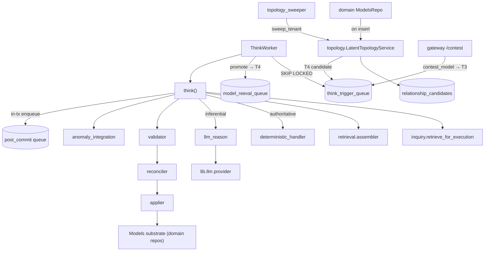

# Reasoning — The Think Pipeline

> Source: `services/reasoning/` (packages `think`, `retrieval`, `sage`,
> `topology`, `relationships`, `judgment`, `dynamics`, `contestability`,
> `calibration`).
> Part of the [architecture overview](index.md).

**One-line:** the cognitive runtime — it drains trigger queues, retrieves context,
reasons (deterministically or via LLM), validates and applies diffs to the
[Models substrate](domain.md) under region locks, then cascades, enqueues durable
post-commit work, and proposes latent relationship/topology candidates.

## Responsibilities

### The `think()` pipeline

`think/reason.py::think` → `_run_once` runs as **one DB transaction**:

1. Load any pending [relationship candidate](../glossary.md) for the trigger.
2. **Retrieve** via `platform.execution.inquiry.retrieve_for_execution(mode="deep")`
   (the active "inquiry" engine; the legacy resolver is `retrieval/primary.py`).
3. Optional second-pass expansion (`retrieval/second_pass.py`).
4. Build a `ReasoningFrame` and detect ephemeral `dynamics` signals (a detected
   state-jump enqueues a deferred `T3:missing_transition`).
5. Compute the touched region (`think/region_locks.py`), insert a `think_runs`
   row, and acquire an advisory **region lock**.
6. Assemble a bounded prompt context (`retrieval/assembler.py`).
7. **Reason:** authoritative triggers take the no-LLM `think/deterministic.py`
   path; inferential triggers call `think/llm_reason.py` →
   `lib.llm.provider.structured(schema=RawDiff|RawDiffClaimsOnly)`.
8. Deterministic safety-net injectors add create-commitment/block/decision/
   prediction ops when the LLM under-emits.
9. **Validate** (`think/validator.py`); a strict region check can raise
   `OutOfRegionError`, which re-runs retrieval with the missing entities allowed.
10. **Apply** (`think/applier.py`) claim/edge/act/resource ops — idempotent via the
    `applied_triggers` ledger; `think/reconciler.py` dedups claim inserts first.
11. Adjudicate the loaded relationship candidate against the applied diff.
12. Anomaly check/publish, enqueue durable post-commit actions, cascade from the
    first act op, update `think_runs` status, record LLM cost.

### The worker

`think/worker.py::ThinkWorker` polls `think_trigger_queue` with
`FOR UPDATE SKIP LOCKED`, promotes `model_reeval_queue` rows into `T4` triggers,
applies a per-tenant `asyncio.Semaphore` concurrency cap, heartbeats the region
lock, retries with backoff, and dead-letters after 5 attempts. Launched by
`scripts/run_think_worker.py` (compose `think_worker`).

### Sage, topology, relationships, judgment

`sage/` is the query-conditioned synthesis loop: reader activation, structural
features, inquiry traces, discovery shortcuts/negative memory, model residuals,
and topology optimization. It lives in the reasoning layer because it changes
how retrieval and synthesis inspect the model graph; it is not a separate
top-level service namespace.

`topology/field.py::LatentTopologyService` converts a new/changed Model into an
`ImpactSignature` (flows/pressures/surfaces/stakes/time-shape), searches bounded
neighbor pools, scores consequence interactions, and persists high-yield
candidates to `relationship_candidates` (enqueuing at most a small `T4` pass). It
runs **inline on Model insert** (called from `domain.models.repo`) and
periodically from the [topology_sweeper](workers.md). `relationships/` generates
and adjudicates per-edge-kind candidates; `judgment/scoring.py` provides the
shared `judgment_leverage` attention score.

### Calibration, contestability, dynamics

`calibration/hit_rate.py` computes conservative per-claim-class hit rates (returns
`None` below 5 samples). `contestability/` implements first-person belief override
(`contest_model`, reached via gateway `POST /contest/{model_id}`). `dynamics/`
emits ephemeral signals only — no new truth table.

## How it's wired

## Key modules

| Module | Path | Role |
|--------|------|------|
| `think.reason` | `services/reasoning/think/reason.py` | `think()` orchestration in one tx. |
| `think.worker` | `services/reasoning/think/worker.py` | `ThinkWorker` queue runner. |
| `think.llm_reason` | `services/reasoning/think/llm_reason.py` | Inferential path; smallest-safe output schema. |
| `think.deterministic` | `services/reasoning/think/deterministic.py` | `is_authoritative()` + non-LLM handlers. |
| `think.applier` | `services/reasoning/think/applier.py` | Applies ops via domain repos; idempotency ledger. |
| `think.reconciler` | `services/reasoning/think/reconciler.py` | Content-level Model dedup → `reconciliation_events`. |
| `think.post_commit` | `services/reasoning/think/post_commit.py` | Durable `pending_post_commit_actions` drainer. |
| `think.circuit_breaker` | `services/reasoning/think/circuit_breaker.py` | Per-provider LLM breaker. |
| `topology.field` | `services/reasoning/topology/field.py` | `LatentTopologyService` candidate generation. |
| `judgment.scoring` | `services/reasoning/judgment/scoring.py` | `judgment_leverage` attention score. |
| `calibration.hit_rate` | `services/reasoning/calibration/hit_rate.py` | Per-claim-class hit rate. |
| `contestability.service` | `services/reasoning/contestability/service.py` | `contest_model()`. |

## Entry points

- `scripts/run_think_worker.py` → `ThinkWorker.run()` (compose `think_worker`).
- `scripts/run_post_commit_worker.py` → `post_commit_worker` (compose `post_commit_worker`).
- `think()` — called by the worker per trigger row.
- `POST /contest/{model_id}` — model contestation over HTTP (gateway).
- Inline topology generation on Model insert (from `domain.models.repo`).

## Dependencies

**Inbound** *(verified)*: the Think/post-commit workers; gateway `/contest`;
`domain.models.repo` (inline topology on insert); the [topology_sweeper](workers.md)
and `maintenance` workers; product `today`/`forecasts`/`history` (calibration
anchors); and all upstream trigger producers (ingestion T1, anomaly T3, etc.).

**Outbound** *(verified)*: `lib.llm.provider`; `platform.execution.inquiry`;
`services.domain.{models,acts,resources,observations,actors}`; `lib.embeddings`;
`lib.shared`.

## Design rationale

> **TODO(human):** The code exposes many tuned constants and policy choices whose
> rationale isn't recoverable from source — capture the *why* for:
>
> - `THINK_MAX_CONCURRENCY_PER_TENANT` defaulting to 1 (cited model-row deadlocks)
>   and whether the long single-transaction design will be split.
> - Topology thresholds (`min_insert_score=0.46`, `min_think_score=0.66`, …) and the
>   per-trigger retrieval pathway weight mixes.
> - The `judgment_leverage` and contestation-multiplier coefficients.
> - Whether the post-commit action handlers (anomaly publish, realtime broadcast,
>   metric invalidation) are wired in production or still no-ops.
> - The conceptual model behind "imaginary-node" / `missing_transition` imputation.
