# Fyralis Source Connector Contract

> Implementation status (completion Phases 1 and 2, 2026-08-03): the contract,
> registry, declarative manifests, structural and behavioral release-evidence
> gates, least-authority binding, measured artifact admission, native pilot
> implementations, and closed-loop rollout form a legacy-safe platform slice.
> All sources still default to legacy execution. Slack, Notion, and WhatsApp
> are eligible only for an explicit audited cohort revision; the other 23
> cataloged source families are compatibility candidates. See the
> [runtime architecture](../ingestion/source-connectors/runtime-architecture.md),
> [development guide](../ingestion/source-connectors/development-guide.md), and
> [migration guide](../ingestion/source-connectors/migration-guide.md). The
> original roadmap is not complete; remaining work is tracked in
> `SOURCE_CONNECTOR_10_10_PLAN.md`.

Status: **Completion Phases 1 and 2 implemented; target architecture remains in progress**<br>
Audience: ingestion, platform, security, and product engineers<br>
Last reviewed: 2026-08-03

This document defines the target architecture for making a data source a
first-class Fyralis primitive. The implemented foundation exists alongside the
legacy runtime and remains v1alpha1. Native independence, behavioral admission,
closed-loop rollout, production proof, full source migration, and legacy
retirement remain required work.

## 1. Executive summary

Fyralis already has a sophisticated ingestion pipeline. Its raw and normalized
envelopes are explicit and versioned; its planner, fetcher, reconciler, and
handler contracts are reusable; its Kafka lanes are isolated by source; S3 is
the raw-data authority; and cursor advancement is tied to durable publication.
Those are valuable platform invariants and should remain.

What Fyralis does not have is one architectural object that represents a source.
Today a source is assembled by convention from a `SourceLiteral`, several
mutable dispatch maps, static import side effects, a channel mapping, webhook
tables, install storage, lifecycle scripts, database constraints, client
builders, migrations, and worker configuration. The engine therefore knows
about source-specific pieces directly. A source can be locally complete while
still being globally miswired.

The recommendation is a **Fyralis Source Connector Contract** with five defining
properties:

1. A connector is one first-class aggregate with stable identity, metadata,
   declared permissions, compatibility requirements, and capability facets.
2. Capability presence, not a large set of booleans or one oversized interface,
   determines what the connector can do. Backfill, polling, push, streaming,
   normalization, reconciliation, installation, discovery, and secret rotation
   are separate, versioned facets.
3. Fyralis owns orchestration and infrastructure. A connector never publishes
   Kafka directly, advances durable cursors, writes S3, selects a tenant by
   itself, or bypasses DLQ, metrics, retry budgets, and isolation policy. It
   receives narrow host capabilities and returns typed outcomes.
4. Registration is explicit, deterministic, manifest-driven, and validated at
   startup. Initial connectors remain first-party Python packages deployed with
   the service. Import-time mutation and scattered allowlists are retired.
5. The contract, connector implementation, capability, envelope, and persisted
   state each have independent versions. Compatibility is negotiated before a
   connector becomes runnable, and state migrations are explicit.

This is a controller/driver architecture more than a conventional ETL SDK. The
connector describes source-specific behavior; the runtime reconciles desired
installation state with observed state, invokes only declared capabilities, and
owns delivery guarantees. The registry is the control-plane authority. Kafka,
S3, PostgreSQL, and workers remain the data-plane substrate.

The proposal intentionally does **not** begin with arbitrary third-party code
loading. Fyralis is a Company OS: ingested information can influence models,
decisions, and executive workflows. First establish a stable in-process contract,
least-authority host services, conformance tests, and operational semantics.
An out-of-process RPC plugin runtime can later implement the same logical
contract for less-trusted connectors without changing the ingestion engine.

The migration should be incremental. Introduce the contract beside existing
registries, wrap current source implementations, route a small set of
representative sources through a compatibility adapter, then move source
families in cohorts. Unifying behavior must precede unifying the many installation
tables. A big-bang schema rewrite would combine two independent risks and is not
recommended.

## 2. Survey of existing connector architectures

The systems below solve different problems, but together expose the design
space relevant to Fyralis.

### 2.1 Data integration systems

#### Airbyte CDK

Airbyte models a source through protocol operations such as connection check,
catalog discovery, and read. Its Python CDK supplies abstract source and stream
types, while declarative sources can be expressed as manifests and executed by
a common runtime. The distinction between protocol, SDK, declarative manifest,
and connector implementation is important: a contract does not have to dictate
one authoring style. Airbyte's `AbstractSource` exposes `check`, `discover`, and
stream construction, and its manifest CLI supports `spec`, `check`, `discover`,
and `read` operations. See the official
[Airbyte Python CDK source API](https://airbytehq.github.io/airbyte-python-cdk/airbyte_cdk/sources.html)
and [declarative-manifest CLI](https://airbytehq.github.io/airbyte-python-cdk/airbyte_cdk/cli/source_declarative_manifest.html).

Strengths are a portable protocol, reusable stream abstractions, schema/catalog
discovery, and a low-code path for common HTTP APIs. Weaknesses for Fyralis are
that a tabular replication protocol does not naturally own webhook verification,
trust classification, source-specific observation semantics, or the rich
installation lifecycle needed by a Company OS. Fyralis should borrow separation
of protocol from authoring SDK and declarative metadata, not Airbyte's row-centric
data model.

#### Fivetran Connector SDK

Fivetran presents a very small author-facing surface: a connector declares a
`Connector` around a required `update(configuration, state)` method and an
optional `schema` method. The runtime supplies configuration and prior state;
the connector emits operations and checkpoints. The runtime atomically commits
the data between checkpoints, making progress ownership explicit. See
[required declarations](https://fivetran.com/docs/connector-sdk/technical-reference/connector-sdk-code/connector-sdk-required-declarations),
[supported methods](https://fivetran.com/docs/connector-sdk/technical-reference/connector-sdk-code/connector-sdk-methods),
and [state management](https://fivetran.com/docs/connector-sdk/connector-development-and-configuration/state-management).

Its strength is the narrow boundary between source logic and platform-managed
state/delivery. Its weakness is deliberate scope: the abstraction optimizes for
scheduled extraction into destination tables, not multi-modal push/gateway
ingress, installation controllers, or semantic observations. The relevant
lesson is that the host should own commit/checkpoint behavior even when the
connector owns cursor meaning.

#### Singer and Meltano

Singer separates taps from targets and standardizes records, schemas, and state
messages. Meltano's SDK gives taps stream discovery, connection testing, state
loading, and bookmark support. State is part of the protocol and targets confirm
checkpoints, which supports at-least-once processing. The SDK explicitly treats
backward compatibility of state as a connector responsibility. See the
[Meltano `Tap` API](https://sdk.meltano.com/en/latest/classes/singer_sdk.Tap.html)
and [Singer SDK state model](https://sdk.meltano.com/en/latest/implementation/state.html).

The composability of independently shipped taps and targets is strong. The weak
point is that the protocol's lowest common denominator can push authentication,
operational lifecycle, and source-specific guarantees outside the contract.
Fyralis should standardize its connector-to-runtime boundary without reducing
observations to a generic record stream.

### 2.2 Integration and pipeline frameworks

#### Apache NiFi

NiFi has explicit extension points for processors, controller services, and
reporting tasks. Extensions have lifecycle and configuration validation, are
registered through service metadata, and are packaged in NARs with isolated
classloaders. A controller service can expose an interface separately from its
implementation, allowing processors to depend on capabilities rather than
concrete clients. The official [NiFi developer guide](https://nifi.apache.org/docs/nifi-docs/html/developer-guide.html)
documents these extension points, lifecycle callbacks, validation, packaging,
and isolation.

NiFi demonstrates the value of host-provided lifecycle, configuration,
dependency isolation, and test harnesses. It also demonstrates a cost: a broad
component framework can become configuration-heavy and expose infrastructure
concepts to every extension. Fyralis should use narrow source capabilities and
avoid turning connector authors into general workflow authors.

#### Apache Camel

Camel components act as factories for endpoints. Endpoints create producers,
event-driven consumers, or polling consumers, while URI/options describe
configuration. Components are discoverable through service metadata and can
generate configuration metadata. See Camel's documentation for
[components](https://camel.apache.org/manual/component.html),
[endpoints](https://camel.apache.org/manual/endpoint.html), and
[writing components](https://camel.apache.org/manual/writing-components.html).

The producer/consumer/polling vocabulary maps cleanly to Fyralis ingress modes.
Camel's URI-centric configuration and enormous generic integration surface are
less suitable for sensitive tenant installations and semantic normalization.
The lesson is to separate a source family from a configured endpoint/install,
and to treat push and pull as capability variants of one source.

#### OpenTelemetry Collector

The Collector composes typed receivers, processors, exporters, connectors, and
extensions into pipelines. The core owns retries, batching, telemetry, and
deployment while distributions choose a supported component set. Its explicit
component taxonomy and registry illustrate how a platform can be extensible
without allowing each plugin to redefine the pipeline. See the official
[Collector architecture overview](https://opentelemetry.io/docs/collector/).

For Fyralis, the strongest lesson is that connectors should plug into named
ports and the host should compose them. A connector is not itself a worker graph.

### 2.3 Orchestration and resource abstractions

#### Temporal Activities

Temporal separates deterministic workflow orchestration from Activities that
perform non-deterministic I/O. Activities should be idempotent; long-running
Activities can heartbeat progress so retries resume safely. Task queues decouple
workers from workflow code but require compatible registrations among workers
polling the same queue. See [Temporal Activities](https://docs.temporal.io/activities)
and [Task Queues](https://docs.temporal.io/task-queue).

This is directly relevant to Fyralis. The runtime should own durable orchestration,
timeouts, retries, cancellation, and state transitions. Connector calls are
Activity-like source I/O units. However, a connector is broader than one
Activity because it also owns metadata, installation behavior, normalization,
and optional push surfaces.

#### Dagster Resources

Dagster Resources standardize access to external systems and make configuration,
initialization, teardown, environment replacement, and test substitution
explicit. See [Dagster external resources](https://docs.dagster.io/guides/build/external-resources).

Resources are a good model for the configured source client passed to connector
capabilities. They are not a complete source model: they describe dependencies,
not ingestion behavior or lifecycle state.

### 2.4 Adapter and provider ecosystems

#### dbt adapters

dbt separates a base adapter from database-specific implementations and ships a
shared adapter integration-test suite. The official
[`dbt-adapters` repository](https://github.com/dbt-labs/dbt-adapters) contains
the base adapter, first-party adapters, and conformance tests.

The important lesson is organizational as much as technical: a contract is only
credible when a reusable test suite verifies implementations. dbt's approach
also shows the risk of interface breadth—database differences inevitably leak
into optional methods and dispatch behavior. Fyralis should prefer cohesive
capability interfaces over one ever-growing base class.

#### Terraform providers and HashiCorp plugins

Terraform Core discovers providers, selects versions, records them in a lock
file, starts provider binaries, negotiates a versioned protocol, retrieves
schemas, and invokes resource operations over RPC. Providers are translation
layers for specific services, while Core retains graph, state, planning, and
execution authority. Protocol major versions define compatibility; minor
versions are additive. See the
[Terraform Plugin Framework](https://developer.hashicorp.com/terraform/plugin/framework),
[provider servers](https://developer.hashicorp.com/terraform/plugin/framework/provider-servers),
and [versioned plugin protocol](https://developer.hashicorp.com/terraform/plugin/terraform-plugin-protocol).

HashiCorp's lower-level `go-plugin` launches subprocesses and communicates over
RPC/gRPC. Process separation prevents a plugin panic from crashing the host and
enables cross-language implementations, at the cost of serialization, process
management, and a larger compatibility surface. See
[`hashicorp/go-plugin`](https://github.com/hashicorp/go-plugin).

This is the strongest precedent for a future untrusted Fyralis connector runtime.
It should not be Phase 1. The logical contract must first become stable in-process;
then an RPC transport can implement the same ports.

### 2.5 Controller and extension platforms

#### Kubernetes CRDs and controllers

Kubernetes separates declarative desired state (`spec`) from observed state
(`status`). A custom resource extends the API; a controller repeatedly reconciles
actual state toward desired state. API groups are independently versioned, and
stable evolution requires round-trip conversion and deprecation windows. See
[Custom Resources](https://kubernetes.io/docs/concepts/extend-kubernetes/api-extension/custom-resources/),
the [Operator pattern](https://kubernetes.io/docs/concepts/extend-kubernetes/operator/),
and the [Kubernetes API deprecation policy](https://kubernetes.io/docs/reference/using-api/deprecation-policy/).

Fyralis should adopt reconciliation semantics for installations, not copy the
Kubernetes API machinery wholesale. `desired_state=active|paused|removed` and an
operator-owned status/condition set are clearer than allowing commands to
imperatively mutate unrelated tables. The controller pattern also supports
repair after partial failure.

#### Visual Studio Code extensions

VS Code extensions combine a manifest, contribution points, activation events,
a version compatibility declaration, and `activate`/`deactivate` lifecycle
functions. Extensions load lazily and run in extension hosts that protect the
main UI process. See [Extension Anatomy](https://code.visualstudio.com/api/get-started/extension-anatomy)
and [Extension Host](https://code.visualstudio.com/api/advanced-topics/extension-host).

The useful pattern is declarative-before-imperative: the host can inspect
metadata and contributions without executing extension code, then activate only
when needed. Fyralis connector manifests should likewise be inspectable without
constructing source clients or touching secrets.

#### Language Server Protocol

LSP standardizes JSON-RPC between editors and language servers so an editor does
not need bespoke integration for each language. Initialization exchanges client
and server capabilities, allowing independently evolving implementations to use
only mutually supported features. See the official
[Language Server Protocol](https://microsoft.github.io/language-server-protocol/)
and [LSP specification](https://microsoft.github.io/language-server-protocol/specifications/lsp/3.17/specification/).

LSP's capability negotiation is preferable to guessing support from connector
version numbers. Fyralis should negotiate a small contract version plus explicit
capability versions and constraints.

### 2.6 Drivers, service providers, and storage engines

#### Operating-system driver model

The Linux driver model maintains registries of devices and drivers, matches them
through bus-specific rules, calls `probe` on a candidate, and calls `remove` on
unbinding. Common code owns enumeration and lifecycle while a driver owns
device-specific control. See [Linux Driver Binding](https://docs.kernel.org/driver-api/driver-model/binding.html).

This suggests a useful distinction: a **connector definition** is analogous to
a driver; a tenant **installation** is analogous to a bound device. Registration
does not imply that every installation is valid or active. Validation/probe is
part of binding.

#### Pluggable storage engines

MySQL presents a stable server layer while storage engines implement physical
data operations and advertise different capabilities. Applications use one SQL
surface despite engine differences. Engines can be installed and uninstalled,
but removal has consequences for existing data. See the
[MySQL pluggable storage architecture](https://dev.mysql.com/doc/refman/8.0/en/pluggable-storage-overview.html)
and its [`handler` interface](https://dev.mysql.com/doc/dev/mysql-server/latest/classhandler.html).

The lesson is to keep platform semantics above the plugin boundary and to make
capability differences explicit. It also warns that uninstalling implementation
code is distinct from deleting data created through it.

#### Service Provider Interfaces and module discovery

Java `ServiceLoader` and Python package entry points allow separately packaged
providers to advertise implementations of a host-defined service. Python entry
points divide discovery metadata into group, name, and object reference; the
consumer defines conflict policy. See the
[Java `ServiceLoader`](https://docs.oracle.com/en/java/javase/21/docs/api/java.base/java/util/ServiceLoader.html)
and [PyPA entry-points specification](https://packaging.python.org/en/latest/specifications/entry-points/).

This is a good discovery mechanism, not a complete registry architecture. It
does not validate semantic compatibility, permissions, duplicate identities,
or operational health. Fyralis can use entry points later as one input to a
strict registry builder; it should not make entry points the source of truth.

## 3. Academic foundations

### 3.1 Component-based architecture and explicit contracts

Component-based software engineering treats systems as compositions of units
with provided interfaces, required interfaces, explicit dependencies, and
independent evolution. A type signature is necessary but insufficient: the real
contract also includes lifecycle, state, error semantics, performance limits,
and invariants. Fyralis's current function protocols capture syntax, while
important semantics—idempotency, tenant resolution, cursor durability, and
trust—live in prose or calling code. The Source Contract must make those
semantic obligations testable.

### 3.2 Ports, adapters, clean boundaries, and dependency inversion

Cockburn's original [Hexagonal Architecture](https://alistair.cockburn.us/hexagonal-architecture)
defines ports by purposeful conversations and adapters by technology-specific
translation. Multiple adapters can satisfy one port, including test doubles.
The [Clean Architecture dependency rule](https://blog.cleancoder.com/uncle-bob/2012/08/13/the-clean-architecture.html)
requires source dependencies to point inward and external formats not to leak
into inner policy.

Applied here:

- The ingestion runtime owns ports such as `plan`, `fetch`, `verify push`,
  `normalize`, and `reconcile`.
- A source connector adapts Slack, GitHub, or another external API to those
  ports.
- Connector code may depend on the contract package; the contract and runtime
  must not import source packages.
- Source SDK models, HTTP responses, database rows, and framework request
  objects must not cross the boundary. Typed contract DTOs do.

This is dependency inversion in concrete form. Merely moving existing dispatch
maps into a class without reversing imports would not achieve it.

### 3.3 Microkernel and plugin architecture

A microkernel keeps stable policy and mechanisms in a small core, adding
variable behavior through plugins. The difficult design choice is what belongs
in the kernel. For Fyralis the kernel must include tenant isolation, durable
state, data-plane publication, idempotency enforcement, retries and budgets,
observability, lifecycle reconciliation, and security policy. API pagination,
OAuth provider peculiarities, webhook signature algorithms, source resource
enumeration, cursor meaning, and semantic mapping vary by connector.

An undersized kernel makes every connector reimplement reliability. An oversized
kernel accumulates `if source == ...` branches. The ownership matrix in Section
7 is the proposed boundary.

### 3.4 Open-closed principle and interface segregation

The architecture should be open to adding a connector without modifying runtime
dispatch code, while closed against a connector redefining platform guarantees.
This does not mean “no core change ever.” Adding a genuinely new platform
capability should be an intentional contract change. Adding the twenty-seventh
implementation of existing capabilities should not require edits in eleven
registries.

Interface segregation is essential. A live-only gateway source must not provide
fake planner and fetcher methods. A polling-only source must not implement
webhook stubs. Optional capability facets make unsupported behavior absent and
uninvokable.

### 3.5 Capability-oriented security

Capability-oriented systems replace ambient authority with explicit references
that confer narrowly scoped powers. Research on least authority argues that a
component should receive only the authority required for the request; see
[The Structure of Authority](https://papers.agoric.com/papers/the-structure-of-authority-why-security-is-not-a-separable-concern/abstract/).

For Fyralis, a connector should not receive an unrestricted database pool,
Kafka producer, S3 client, environment, or global secret reader. It should
receive host services such as:

- a secret handle limited to one installation and named credential;
- an outbound HTTP client governed by allowlist, timeout, rate, and telemetry;
- an emitter that accepts source records but owns S3/Kafka publication;
- a state handle limited to the current install, capability, and shard;
- a clock, logger, and meter already labeled by connector and tenant.

Python in-process execution cannot form a hard sandbox, but explicit authority
still improves testability and makes a future process boundary feasible.

### 3.6 Module systems, SPI, and registries

Module systems distinguish declaring a provider from discovering, resolving,
loading, and activating it. A registry must also define duplicate-ID behavior,
compatibility, ordering, failure containment, and introspection. Import-time
side effects conflate all of these stages. Fyralis should separate them:

1. discover manifests;
2. validate shape and compatibility without activation;
3. resolve exactly one implementation per connector ID;
4. build immutable registry snapshot;
5. activate a connector only for an operation;
6. publish registry health and diagnostics.

### 3.7 Contract and interface evolution

Semantic versioning alone does not answer whether an implementer will still
work. OSGi distinguishes API consumers from API providers: adding a method may
be harmless to a caller but breaking to every implementation. See the
[OSGi semantic-versioning summary](https://docs.osgi.org/whitepaper/semantic-versioning/010-executive-summary.html).
Because connectors implement Fyralis interfaces, adding required methods to a
stable capability is breaking.

Wire and stored-state evolution need separate rules. Protocol Buffers' guidance
not to reuse field numbers, to reserve removed fields, and to expect mixed
client/server versions illustrates the discipline required for durable
envelopes and state. See [Proto best practices](https://protobuf.dev/best-practices/dos-donts/).

### 3.8 State machines and reconciliation

Commands are events; lifecycle is state. Installation, pause, upgrade, repair,
and uninstall should be legal transitions with conditions, not unrelated helper
functions. A reconciliation loop is preferable to a fragile series of imperative
steps because it can re-observe partially completed work and converge. Desired
state belongs to the user/control plane; observed state and conditions belong to
the runtime.

## 4. Comparative analysis

### 4.1 Pattern comparison

| System | Core architecture | Lifecycle and registration | Capability discovery | Dependency inversion, extensibility, and evolution | Strength / weakness for Fyralis |
|---|---|---|---|---|---|
| Airbyte CDK | Source protocol implemented by code or declarative manifest; streams emit protocol messages | Definition is packaged, registered in the platform, checked, discovered, then read by the runtime | `spec`, `check`, `discover`, catalog/stream metadata | Runtime depends on protocol, not vendor SDK; protocol/CDK/connector versions evolve separately | Strong authoring and discovery model; too tabular/replication-centric for trust-rich observations and push lifecycle |
| Fivetran SDK | Small connector object around `update` and optional `schema`; runtime consumes operations | Connector is debugged/deployed; each sync receives config/state and ends or checkpoints | Fixed method surface; schema and emitted operations reveal behavior | Runtime owns state commit/destination effects; SDK and connector code evolve independently | Excellent checkpoint boundary and low author burden; lacks rich push/gateway/capability lifecycle |
| Singer/Meltano | Tap/target executables exchange schema, record, and state messages | Executables are composed into pipelines; taps discover streams, test connection, and resume bookmarks | Catalog/stream metadata and protocol message types | Tap and target depend on protocol rather than each other; loose packaging aids ecosystem growth | Highly composable and portable; operational/install semantics sit mostly outside the protocol |
| Apache NiFi | Typed Processors, ControllerServices, and ReportingTasks inside a flow runtime | Service metadata and NAR packaging; validate, initialize, schedule, stop, remove; isolated classloaders | Declared extension type, property descriptors, and ControllerService interfaces | Extensions implement host APIs and can depend on abstract services; API/NAR deprecation and compatibility govern evolution | Strong lifecycle, validation, DI, testing, and isolation; broad framework surface is heavier than Fyralis needs |
| Apache Camel | Component creates configured Endpoints; endpoints create producer, event-driven consumer, or polling consumer | Components discovered through service metadata; services start/stop with Camel context/routes | Component/endpoint schemes, generated option metadata, consumer/producer type | Routes depend on endpoint contracts rather than implementation; components add schemes without core branching | Excellent push/pull vocabulary and endpoint separation; URI-centric model is weak for tenant security/lifecycle |
| Temporal | Durable workflow orchestrates retryable, non-deterministic Activities via task queues | Workers register activity/workflow types, poll queues, heartbeat, cancel, and use worker versioning | Registered task types and task-queue routing, not a general feature negotiation protocol | Workflow policy is separate from I/O implementation; new workers can implement registered tasks | Best precedent for runtime-owned recovery/deadlines; an Activity is smaller than a complete source definition |
| Dagster | Resources inject configured external dependencies into jobs/assets | Resource initialization and teardown follow execution/code-location lifecycle; definitions register resources | Resource keys/types and configuration schema | Compute code depends on resource interfaces/config, making test/environment substitution straightforward | Good installation-scoped client/resource model; not an ingestion behavior or source lifecycle contract |
| dbt adapters | Base adapter and dispatch bridge dbt Core to database-specific implementations | Adapter Python packages register with dbt; shared integration suite validates behavior | Adapter type and implemented database operations/macros | Core targets base interfaces; packages extend supported databases; core/adapter compatibility constrains releases | Strong conformance culture and semantic adapter model; broad bases can accumulate optional methods |
| Terraform providers | Core communicates with provider server binaries over versioned gRPC/Protobuf | Registry discovery, version selection, checksum/signature, lock file, process handshake, configure, stop | Provider returns schemas/resources/data sources/functions; protocol version participates in selection | Core owns graph/state/planning; provider translates service API; major protocol compatibility and additive minors | Best model for a mature isolated plugin ecosystem; too much transport/deployment complexity for Fyralis Phase 1 |
| HashiCorp `go-plugin` | Host launches local subprocess and presents remote implementation as an interface | Host discovers executable, starts it, performs handshake/RPC setup, monitors, and kills it | Negotiated protocol/plugin set supplied during handshake | RPC inverts dependency and isolates crashes; gRPC enables cross-language evolution through protobuf | Strong future transport/security boundary; does not itself define connector semantics, lifecycle, or registry policy |
| Kubernetes CRD/controller | Declarative resource `spec` plus controller-updated `status`; reconciliation converges actual state | API registration creates resource kind; controllers watch/reconcile/finalize continuously | API discovery, kind/version, status/conditions, optional subresources | Clients depend on versioned API, controllers supply behavior; conversion/deprecation enables evolution | Best lifecycle/repair model; copying Kubernetes machinery wholesale would be excessive |
| VS Code extensions | Manifest contributions plus imperative API activated lazily in an extension host | Marketplace/install, manifest validation, activation events, `activate`, `deactivate`, uninstall | Contribution points, activation events, `engines.vscode`, runtime API registrations | VS Code consumes declarations/API, not extension internals; engine ranges and stable/proposed APIs manage evolution | Strong manifest-first and lazy-activation pattern; desktop extension authority differs from ingestion security |
| Linux drivers | Bus/core registry matches device IDs to driver operations | `device_register`/`driver_register`, match, `probe`, bind, `remove`, unbind | Supported device IDs and bus-specific match callback | Common kernel code owns binding/lifecycle while driver owns device details; kernel compatibility constrains modules | Excellent definition-versus-install binding analogy; kernel APIs are lower-level and less semantically versioned |
| MySQL storage engines | Common SQL/server layer delegates physical operations to pluggable `handler` implementations | Install/load plugin, advertise engine, create/use tables, unload only with data consequences considered | Server lists engines and feature support; handler operations form the SPI | Applications depend on common server API; engines vary internals and selected features | Strong host-policy and capability boundary; in-process plugins retain host crash/trust exposure |
| Language Server Protocol | Editor and language server communicate via versioned JSON-RPC | Client launches/connects, sends `initialize`, negotiates capabilities, then `shutdown`/`exit` | Bidirectional client/server capability sets, static and dynamic registration | Many editors and servers depend on one protocol; optional capabilities allow independent evolution | Best feature-negotiation precedent; a protocol alone does not define artifact trust or durable state |
| OpenTelemetry Collector | Host composes receivers, processors, exporters, connectors, and extensions into pipelines | Components are compiled into distributions, configured, started, observed, and shut down by Collector | Typed component factories, config, signal types, stability metadata, component registry | Pipeline core targets component contracts; distributions extend without changing routing semantics | Strong host-composed data plane and component taxonomy; telemetry signals are more uniform than Fyralis source semantics |

### 4.2 Candidate Fyralis designs

| Candidate | Benefit | Failure mode | Decision |
|---|---|---|---|
| One `SourceConnector` interface with every method | Simple lookup | Stub explosion; every addition breaks implementers | Reject |
| Boolean feature flags plus optional methods | Familiar | Flags drift from methods and operational reality | Reject as primary model |
| Manifest-only declarative connectors | Easy inspection and generation | Cannot express gateway sessions, complex reconciliation, or semantics | Support later as an authoring profile |
| Independent registries for each stage | Matches current code | No atomic completeness or unified lifecycle | Retire |
| Immediate out-of-process RPC plugins | Strong isolation and cross-language support | Premature protocol, deployment, debugging, and latency cost | Defer |
| First-class aggregate with versioned capability facets | Cohesive, truthful, evolvable | More up-front contract design | Adopt |

### 4.3 Synthesis

No surveyed system should be copied intact. Fyralis needs a hybrid:

- Kubernetes-style desired/observed installation lifecycle;
- driver-style definition-to-install binding and probe;
- VS Code-style inspectable manifest and lazy activation;
- LSP-style capability negotiation;
- Fivetran/Temporal-style host-owned checkpointing and recovery;
- NiFi/Terraform-style validation, conformance, and future isolation;
- ports-and-adapters dependency direction;
- OpenTelemetry-style host-composed data plane.

## 5. Problems with the current Fyralis architecture

### 5.1 What already works and must be preserved

The current system has several mature contracts:

- `RawEnvelope` is strict, carries a raw S3 pointer and content hash, and has an
  additive-within-v1 evolution policy.
- `NormalizedEnvelope` and `ObservationDraft` establish a semantic boundary
  before observation persistence.
- `Planner`, `Fetcher`, and `Reconciler` separate resource decomposition, page
  retrieval, and coverage repair.
- the fetch cursor is opaque to orchestration;
- source-specific Kafka topics isolate backpressure and failures;
- the raw body is written to S3 before publication;
- cursor advancement occurs only after durable publication acknowledgment;
- external-ID construction and live/backfill parity receive explicit attention;
- the observation writer converges the asynchronous and inline paths on shared
  ingestion logic;
- DLQ and circuit-breaker plumbing derive substantially from the canonical source
  tuple.

The redesign should wrap these contracts before replacing them. Reliability
regressions are a greater risk than temporary adapter duplication.

### 5.2 Fragmented source identity

The canonical source tuple currently originates from `SourceLiteral` in
`services/ingest/ingestion/raw_tier/envelope.py`. Kafka topic generation derives
from it, which is good. Other copies remain in onboarding workflow allowlists,
progress event types, webhook provider mappings, channel mappings, database
constraints, and lifecycle configuration. A source name is therefore both a
wire value and an informal join key across modules.

Consequences:

- adding a source is a repository-wide search exercise;
- static typing cannot prove that all keys describe the same source;
- a spelling or missing entry fails at runtime or silently disables a path;
- database migration order can determine which source set a CHECK constraint
  admits;
- source identity, connector implementation, and installed instance are not
  distinct concepts.

### 5.3 Multiple mutable dispatch registries

Planner, fetcher, and reconciler modules build mutable dictionaries and then
statically import every per-source module so it can replace a stub at import
time. Handlers similarly register by channel during import. This is a form of
plugin registration, but it has no atomic connector boundary.

Import side effects create several problems:

- discovery executes code;
- import order and last-write behavior are part of correctness;
- duplicate registration policy differs between registries;
- a source can be present in one registry and absent from another;
- tests often monkeypatch globals rather than exercise a complete connector;
- worker startup cannot inspect compatibility without importing all sources.

### 5.4 Runtime knowledge of source internals

Onboarding indexes planner and fetcher maps directly. Normalization translates
`(source, ingress_kind)` through a central channel table before asking the
handler registry. Webhook routing owns provider-to-source, cutover, and channel
maps. Client construction uses source-named builder functions. Lifecycle tools
know which source uses a generic installation table and which uses a dedicated
table.

These are inverted dependencies: the engine must change when a source is added.
The engine should know `connector_id` and capability contracts, never
`PLANNER_DISPATCH["slack"]` or a Slack installation table.

### 5.5 Split installation and lifecycle models

Slack, GitHub, Discord, and Notion use `provider_installations` for the generic
lifecycle path. Many other sources have dedicated installation and child-resource
tables. A lifecycle checker proves that every canonical source is covered by
one of two CLIs and exposes status/pause/resume/uninstall/rotate-secret. That is
valuable coverage, but it does not prove that the source's OAuth, webhook,
planner, fetcher, normalizer, reconciler, topics, and state schema agree.

The storage differences are sometimes legitimate. Google domain-wide delegation,
gateway sessions, finance account hierarchies, and webhook secrets have different
data. The architectural problem is not multiple tables; it is that the runtime
depends on their shapes directly. A connector-owned installation repository
adapter can present one lifecycle port while migration gradually normalizes
storage.

### 5.6 Capability is implied rather than declared

WhatsApp is live-only and retains planner/fetcher/reconciler stubs. Other sources
support combinations of backfill, polling, webhook, Pub/Sub, or persistent
gateway ingress. The runtime infers support from mappings, routes, stubs, and
deployment configuration. An operator cannot ask one authority, “What can this
connector do, at which version, under which constraints?”

This also conflates three distinct questions:

1. Does the connector implementation support a capability?
2. Is the capability configured for this installation?
3. Is it currently available and healthy?

### 5.7 Incomplete semantic ownership

Source-specific retry behavior is partly delegated to fetchers while global
circuit breakers and worker retry policy live in the runtime. Webhook validation
is source-specific but tenant-resolution security is platform policy. External
ID construction is centralized by source while normalization is handler-owned.
These boundaries can work, but they are not expressed through one contract, so
new contributors must learn them from precedent.

### 5.8 Deployment coupling

All current source implementations are compiled into and deployed with core
services. That is acceptable for trusted first-party connectors, but registration
and deployment are conflated. There is no connector artifact identity, contract
compatibility check, per-connector version/status, or quarantine state.

The existing external extension platform is intentionally a different boundary:
it allows capability-scoped access and derived observation ingest, not raw-source
registration into the privileged ingestion plane. The Source Contract should not
silently widen that trust decision.

## 6. Design principles

1. **One source family, one connector definition.** A connector aggregates all
   supported source behavior and metadata under one stable ID.
2. **Definition is not installation.** The Slack connector is code and metadata;
   a tenant Slack workspace is a configured binding with lifecycle state.
3. **Capabilities are cohesive interfaces.** Presence means support. No fake
   implementations and no boolean/method divergence.
4. **The host owns invariants.** Tenant isolation, durable publication,
   checkpoint ordering, DLQ, retry ceilings, observability, and policy cannot be
   bypassed by connector code.
5. **Connectors own source semantics.** API/resource knowledge, auth peculiarities,
   cursor meaning, signature algorithms, identity mapping, and normalization
   stay behind the boundary.
6. **Metadata is inspectable before code activation.** Registry construction must
   not access a network, database, or secret.
7. **Dependencies point inward.** Contract DTOs are free of source SDK,
   `asyncpg.Record`, FastAPI request, Kafka, and S3 types.
8. **Unsupported is absent.** A live-only source exposes no historical-pull
   capability.
9. **Supported is not the same as healthy.** Static declarations and dynamic
   status are separate.
10. **State is versioned and opaque, but not uncontrolled.** The connector owns
    state meaning and codecs; the runtime owns storage, size, fencing, and commit.
11. **At-least-once is explicit.** Connectors must produce stable identities;
    the runtime assumes retries and duplicates are possible.
12. **Trust is bounded.** A connector receives explicit host services and a trust
    ceiling; it cannot self-assert higher authority.
13. **First-party in-process first, transport-neutral later.** Logical contracts
    should be serializable enough for RPC, without paying the RPC cost now.
14. **Conformance is part of the contract.** Registration requires automated
    behavioral tests, not only type checking.
15. **Migration is reversible.** Dual registration/read paths are temporary,
    observable, and guarded by per-source feature flags.

## 7. Proposed Source Contract architecture

### 7.1 Architectural concepts

The target model has six distinct concepts:

| Concept | Meaning | Cardinality |
|---|---|---|
| Connector ID | Stable source-family identity, e.g. `fyralis/slack` | one forever per family |
| Connector manifest | Declarative identity, compatibility, capabilities, permissions, schemas, and runtime profile | one per artifact version |
| Connector implementation | Factory and capability implementations | one selected version per runtime snapshot |
| Connector installation | A tenant-bound configuration/credential binding | zero to many per tenant |
| Connector execution | One invocation for install/shard/event | many and ephemeral |
| Connector status | Runtime-observed conditions and capability health | one current view per installation |

The **Source Connector** is the aggregate of manifest, factory, and capability
providers. It is not a god object. The stable root exposes identity and a typed
capability resolver; actual work occurs through small facets.

Illustrative shape:

```python
class SourceConnector(Protocol):
    @property
    def manifest(self) -> ConnectorManifest: ...

    def bind(self, context: BindingContext) -> BoundConnector: ...


class BoundConnector(Protocol):
    @property
    def installation(self) -> InstallationRef: ...

    def capability(self, key: CapabilityKey[T]) -> T | None: ...
```

This is illustrative, not production code. `bind` must not perform remote I/O;
validation/initialization are explicit lifecycle operations. A bound connector
is scoped to one tenant installation and receives narrow host capabilities.

### 7.2 Manifest

The manifest is declarative and loadable without importing implementation code.
It should contain at least:

```yaml
apiVersion: sources.fyralis.io/v1alpha1
kind: SourceConnector
metadata:
  id: fyralis/slack
  source: slack
  displayName: Slack
  version: 1.4.0
  owner: ingestion
spec:
  contract: ">=1.0,<2.0"
  implementation: fyralis_connectors.slack:create_connector
  maturity: stable
  capabilities:
    - id: installation.oauth2
      version: 1
    - id: ingestion.historical_pull
      version: 1
    - id: ingestion.webhook
      version: 1
    - id: ingestion.reconciliation
      version: 1
    - id: semantic.normalization
      version: 1
  ingressKinds: [backfill, webhook]
  permissions:
    secretSlots: [bot_token, signing_secret]
    outboundHosts: [slack.com]
    requestedScopes: [channels:history, channels:read]
  trust:
    maximumTier: attested_agent
  runtime:
    isolation: in_process_trusted
    networkProfile: slack_api
    resourceClass: io_standard
```

The manifest declares requested authority; platform policy grants an equal or
smaller set. It should not contain tenant secrets or mutable health. JSON Schema
validates its structure. Registry validation cross-checks declared capabilities
against the factory before activation.

### 7.3 Core contract DTOs

Contract DTOs should be immutable or treated as immutable, versioned, and free
of infrastructure types. The initial set should include:

- `ConnectorId`, `ConnectorVersion`, and `ContractVersionRange`;
- `ConnectorManifest` and `CapabilityDeclaration`;
- `InstallationRef` containing opaque installation ID, tenant ID, connector ID,
  and revision—not a database row;
- `OperationContext` containing invocation, deadline, cancellation, trace, and
  granted host services;
- `ResourceDescriptor` and `ShardPlan`;
- `CursorState` as a versioned opaque payload with bounded serialized size;
- `FetchedPage` with records, next cursor, terminal marker, and source hints;
- `InboundEvent` with verified identity result and raw payload reference/value;
- `NormalizationInput` and existing `ObservationDraft` output;
- `ReconciliationInput` and existing `ReconciliationDecision` output;
- typed error/result and health-condition models.

Existing `Shard`, `FetchResult`, and reconciliation models can initially be
adapted to these shapes. Do not let `asyncpg.Record` cross the new boundary.

### 7.4 Capability facets

Recommended initial facets are:

| Capability | Connector responsibility | Typical operation |
|---|---|---|
| `installation.configure` | validate source-specific configuration shape | `validate_config` |
| `installation.oauth2` | provider authorization URL/exchange/refresh semantics | `begin`, `complete`, `refresh` |
| `installation.secret_rotation` | source-side credential replacement semantics | `prepare`, `verify`, `commit` |
| `resource.discovery` | enumerate source resources selectable for ingestion | `discover` |
| `ingestion.historical_pull` | plan shards and fetch pages | `plan`, `fetch` |
| `ingestion.incremental_poll` | produce the next bounded poll plan/page | `poll` or reuse `fetch` with mode |
| `ingestion.webhook` | verify request and derive external install key/event | `verify_and_decode` |
| `ingestion.push_subscription` | create/renew/revoke provider-side subscriptions | `ensure`, `renew`, `revoke` |
| `ingestion.gateway_stream` | run a resumable persistent source session | `open`, `receive`, `checkpoint`, `close` |
| `ingestion.reconciliation` | assess coverage and propose repair shards | `reconcile` |
| `semantic.normalization` | transform a native record into observation drafts | `normalize` |
| `semantic.identity` | create stable, path-independent external IDs | `external_id` |
| `lifecycle.cleanup` | source-side revocation and remote cleanup | `prepare_remove`, `remove` |
| `health.probe` | perform bounded source-aware readiness checks | `probe` |

Not every capability must become a separate Python class on day one. The rule is
semantic: optional behavior is a separately versioned facet and can evolve
without expanding the root interface.

### 7.5 Source adapter and runtime ports

The contract has two directions.

**Runtime-to-connector ports** invoke source-specific behavior: plan, fetch,
verify, normalize, reconcile, rotate, probe.

**Connector-to-runtime ports** are granted host capabilities:

- `SecretsPort`: retrieve a named secret by scoped handle;
- `HttpPort`: source API requests with enforced policy and telemetry;
- `RawEmissionPort`: accept source-native records for durable publication;
- `StatePort`: read current state and propose a compare-and-set checkpoint;
- `InstallStorePort`: read/write through a connector-specific repository within
  the bound installation;
- `ClockPort`, `MetricsPort`, and `LogPort`;
- `SubscriptionCallbackPort`: obtain a platform-owned callback address/nonce;
- `LeasePort`: heartbeat and cancellation for long-running streams.

Connectors return decisions and data. The runtime performs effects that establish
platform guarantees.

### 7.6 Ownership matrix

| Concern | Connector owns | Runtime/platform owns |
|---|---|---|
| Installation | config schema, provider-specific validation, remote setup | desired/observed state, tenancy, persistence transaction, audit |
| Credentials | credential names, OAuth/refresh/rotation semantics | encryption, storage, redaction, access grants, expiry scheduling |
| OAuth | provider endpoints/parameters and exchange adapter | public callback shell, CSRF/state binding, tenant session, audit |
| Webhooks | signature algorithm, event decoding, provider install key | HTTP server, body limits, replay guard, tenant authorization, S3/Kafka |
| Push subscription | provider API create/renew/revoke | callback allocation, renewal scheduling, lease status |
| Planning | resource semantics and shard decomposition | run creation, queueing, limits, persistence |
| Fetching | API calls, pagination, cursor meaning, record extraction | retries budget, deadline, S3/Kafka publication, checkpoint commit |
| Polling | delta query and cursor semantics | cadence, overlap/fencing, pause and backpressure |
| Streaming | protocol/session logic and resume token meaning | process supervision, lease, restart, event durability |
| Cursor | schema, encode/decode, monotonicity checks | durable storage, version tag, CAS/fencing, commit ordering |
| Reconciliation | source-specific coverage algorithm | schedule, pass limits, shard creation transaction |
| Rate limits | interpret provider headers/errors; suggest retry time | enforce concurrency/token budget, jitter, maximum delay |
| Retry | classify retryable/source errors | retry policy, attempt accounting, deadlines, poison threshold |
| Circuit breaker | provide source failure classification | breaker state, cross-worker coordination, open/half-open policy |
| Identity | canonical external-ID ingredients and versioning | uniqueness/idempotent write enforcement and collision telemetry |
| Channel mapping | native event to connector-local event type | global routing by connector/capability; no central source table |
| Normalization | semantic mapping into `ObservationDraft` | validate draft, cap trust, build normalized envelope, persist |
| Trust | evidence metadata and requested maximum | authoritative trust policy and final tier ceiling |
| Schema evolution | native/state schema adapters | envelope versions, compatibility gates, migration execution |
| Health | source-specific probe | status aggregation, SLOs, alerts, scheduling consequences |
| Metrics | domain labels within bounded vocabulary | metric instruments, cardinality policy, export and dashboards |
| Feature flags | declare optional experimental features | rollout, tenant/source targeting, kill switch, audit |
| Pause/resume | optional remote quiesce behavior | desired state, stop scheduling, drain/fence executions |
| Repair | propose source-specific recovery action | authorize, schedule, limit, audit, apply state transition |
| Uninstall | revoke remote resources/credentials where possible | drain, tombstone, retention policy, secret deletion, audit |

### 7.7 What the connector must not own

A connector must never:

- create or choose Kafka topic names;
- instantiate a raw Kafka producer or consumer;
- write directly to the raw S3 namespace;
- advance durable state before host publication succeeds;
- query arbitrary tenant rows or resolve a tenant from unverified payload data;
- assign its final trust tier above policy;
- bypass observation validation/idempotency;
- choose unlimited retry or concurrency;
- emit unbounded metric labels;
- silently perform contract or state migration at import time.

These prohibitions are the architectural contract's most important part.

## 8. Capability model

### 8.1 Why booleans are insufficient

Flags such as `supports_backfill` are useful for display but weak as the primary
model. A boolean says nothing about interface version, constraints, configured
state, maturity, or whether the implementation is present. It can drift from
methods and encourages conditionals throughout the engine.

Use **capability declarations** keyed by stable names. Presence indicates
implementation support. Each declaration has:

- capability ID and major version;
- maturity: experimental, preview, stable, deprecated;
- modes/constraints, such as maximum page size or supported resource kinds;
- required permissions and secret slots;
- optional feature identifiers;
- deprecation/replacement metadata.

Booleans can be derived for UI and queries.

### 8.2 Static, configured, and operational capability views

The registry exposes three layers:

| View | Example | Source of truth |
|---|---|---|
| Implemented | Slack connector implements historical pull | connector manifest + implementation validation |
| Configured | this workspace enabled channel history and granted scopes | installation spec/status |
| Available | historical pull is runnable now; OAuth valid and breaker closed | runtime status/conditions |

The runtime must require all three before invocation. “Implemented” is immutable
for a registry snapshot. “Configured” changes through lifecycle reconciliation.
“Available” is dynamic and never cached as manifest metadata.

### 8.3 Ingestion modes and orthogonal features

Avoid a flat list in which `push`, `webhook`, and `streaming` overlap. Use a
small taxonomy:

- **Historical pull**: bounded or exhaustible traversal used for onboarding or
  re-sync.
- **Incremental poll**: repeated delta pull with persisted high-water state.
- **Webhook push**: independent inbound requests verified per event.
- **Subscription push**: webhook push plus provider-side subscription lease.
- **Gateway stream**: long-lived connection with session/resume state.

Orthogonal features refine a mode:

- resource discovery;
- delta/cursor support;
- snapshot-only semantics;
- delete/tombstone capture;
- reconciliation;
- remote subscription renewal;
- partial resource selection;
- secret rotation without reinstall.

This allows, for example, a connector to implement both webhook and historical
pull while sharing one semantic identity facet.

### 8.4 Capability negotiation

At registry build time:

1. the host announces supported contract and capability major versions;
2. the manifest declares its required contract range and capabilities;
3. the implementation confirms the same declarations;
4. the registry chooses the highest mutually supported capability version;
5. required incompatibility quarantines the connector;
6. unsupported optional capabilities are excluded with a diagnostic;
7. the negotiated view is immutable until the next registry snapshot/restart.

Do not negotiate per record. It belongs at registration and installation upgrade
boundaries.

### 8.5 Capability sets, not inheritance trees

Source families do not form a stable class hierarchy. Finance connectors may
share HTTP/OAuth/HMAC utilities while differing in resource and identity
semantics. Gateway sources share supervision behavior without sharing install
storage. Prefer composition of capability implementations and support libraries
to `FinanceConnectorBase`, `WebhookConnectorBase`, and deep inheritance.

### 8.6 Trust and permission capabilities

Functional capability and authority are separate. `ingestion.webhook` says the
connector can verify/decode a webhook. It does not grant:

- arbitrary network access;
- arbitrary secret access;
- direct tenant selection;
- the right to emit authoritative observations.

Manifest requests are intersected with environment policy and installation
grants. The resulting `GrantedAuthority` is passed to binding. Registration
fails if a required grant cannot be satisfied; optional behavior becomes
unavailable if its grant is absent.

## 9. Lifecycle model

### 9.1 Separate artifact, installation, and execution lifecycles

One state machine cannot truthfully represent all concerns.

**Connector artifact lifecycle**:

`discovered -> validated -> compatible -> registered -> enabled`, with side
states `incompatible`, `quarantined`, `disabled`, and `retired`.

**Installation lifecycle** records desired and observed state.

**Execution lifecycle** covers one plan/fetch/push/normalize/reconcile operation
and is managed by the worker runtime.

### 9.2 Installation resource

Conceptually:

```yaml
metadata:
  id: installation-uuid
  tenantId: tenant-uuid
  connectorId: fyralis/slack
spec:
  desiredState: active
  connectorVersion: ">=1.4,<2"
  configurationRef: encrypted-config-handle
  selectedResources: [C123, C456]
  enabledCapabilities: [ingestion.webhook, ingestion.historical_pull]
status:
  observedGeneration: 7
  phase: ready
  boundConnectorVersion: 1.4.2
  conditions: []
  capabilityStatus: {}
```

The persisted implementation can remain relational. `spec/status` is a semantic
separation, not a requirement to store YAML or adopt Kubernetes.

### 9.3 Installation lifecycle states

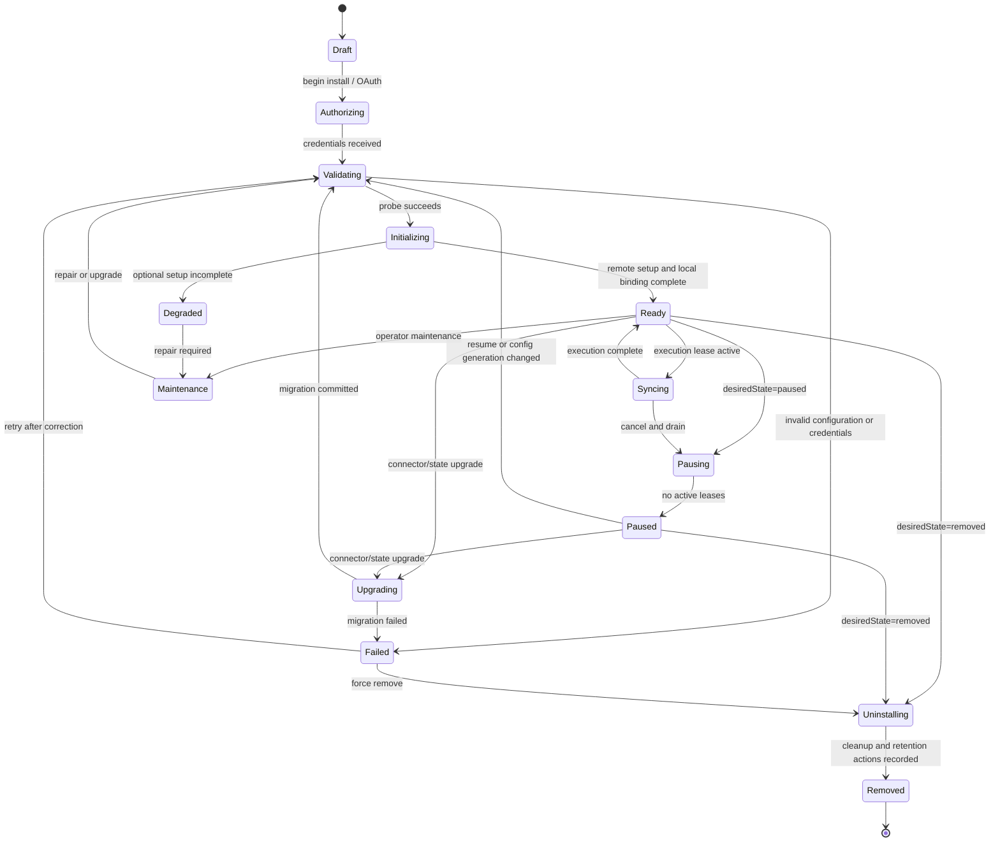

`Degraded` means some work can continue; `Failed` means required readiness is
absent. `Paused` is durable user intent. `Maintenance` is operator intent and
must not be automatically cleared. Circuit-breaker open is a condition, not an
installation phase.

### 9.4 Conditions

Conditions should be typed, timestamped, reason-coded, and independently
recoverable:

- `CredentialsValid`;
- `ConfigurationValid`;
- `RemoteReachable`;
- `SubscriptionsReady`;
- `HistoricalSyncComplete`;
- `IncrementalReady`;
- `GatewayLeaseReady`;
- `StateMigrationRequired`;
- `RateLimited`;
- `CircuitOpen`;
- `ConnectorCompatible`;
- `CleanupComplete`.

Status messages are operator-facing and redacted. Reason codes, not free text,
drive automation.

### 9.5 Lifecycle operations

- **Install/configure** creates desired state and secret handles; it does not
  immediately mark ready.
- **Validate/probe** checks syntax locally before bounded remote I/O.
- **Initialize** creates subscriptions/resources idempotently.
- **Plan/execute** is allowed only when required conditions and capabilities are
  available.
- **Pause** fences new leases, cancels/drains active work, and optionally invokes
  source-side quiesce. It preserves state.
- **Resume** revalidates credentials and compatibility before scheduling.
- **Repair** is an explicit requested action with an audit record and bounded
  effect.
- **Upgrade** selects a compatible connector artifact, migrates state, validates,
  and advances the bound version atomically or rolls back.
- **Uninstall** first fences execution, then revokes remote subscriptions/tokens,
  applies data-retention policy, deletes secrets, and writes a durable tombstone.
- **Shutdown** is process lifecycle: stop accepting work, cancel/heartbeat,
  close clients, and leave installation desired state unchanged.

### 9.6 Reconciliation loop

The installation controller repeatedly:

1. reads installation spec and current status generation;
2. resolves a compatible connector snapshot;
3. evaluates required grants and capabilities;
4. obtains an installation-scoped lease;
5. invokes one bounded idempotent lifecycle step;
6. commits effects/status with generation fencing;
7. requeues based on next action, renewal time, or failure policy.

This turns crashes between OAuth completion, subscription creation, onboarding
trigger creation, and status update into recoverable partial progress.

## 10. Registry architecture

### 10.1 Requirements

The registry must be:

- the single runtime authority for connector definitions;
- deterministic and immutable for a process snapshot;
- inspectable without activating connectors;
- strict about duplicate IDs and manifest/implementation mismatch;
- capable of compatibility and permission validation;
- queryable by connector ID, source wire value, capability, maturity, and status;
- observable and able to quarantine a bad connector without hiding diagnostics;
- independent of tenant installations.

### 10.2 Recommended hybrid registry

Use a **manifest-driven explicit registry** with two initial discovery inputs:

1. a checked-in first-party connector catalog generated/validated during build;
2. explicitly configured Python package entry points for separately packaged,
   trusted connectors in a later phase.

Both produce the same `ConnectorCandidate`. A registry builder performs:

```text
discover manifest -> schema validate -> ID conflict check
-> host compatibility check -> permission-policy check
-> load factory -> declaration/implementation cross-check
-> conformance fingerprint check -> freeze registry snapshot
```

No reflection over arbitrary modules. No `__init__.py` that imports every
connector to mutate global dictionaries. No last-writer-wins behavior. A
duplicate ID is a startup error for production and an explicit test override in
test-only builders.

### 10.3 Why not a database-only registry

A database can record enabled versions and operational status, but it cannot by
itself prove that executable code exists in the running image. Treating rows as
the definition authority would permit desired connectors the process cannot
load. The immutable runtime registry comes from deployed artifacts; the control
plane stores allowed/desired selection and status. Startup compares the two.

### 10.4 Why not dynamic loading first

Hot-loading Python code would complicate dependency resolution, memory safety,
rollback, and observability without removing the need to deploy workers capable
of running it. Initial registry snapshots should change on deployment/restart.
Dynamic enable/disable can select already registered connectors. True dynamic
artifact installation belongs with an out-of-process plugin service and signed
artifact policy.

### 10.5 Registry API

The engine should use only operations such as:

```text
registry.require(connector_id)
registry.resolve_for_install(installation_ref)
registry.list_by_capability(capability_id)
registry.describe(connector_id)
registry.health()
```

Workers receive a `ConnectorId` from a work item, resolve a bound connector, and
request the needed capability. They never import source modules or access a
source-keyed dispatch dictionary.

### 10.6 Registry validation and conformance

Startup/build validation should prove:

- connector ID, source wire value, and aliases are unique;
- declared contract range intersects host support;
- declared capability implementations exist and have supported major versions;
- no undeclared capability is exposed;
- ingress kinds and semantic routes are covered by normalization;
- every push capability has verification and install-resolution behavior;
- every pull capability has state codec, identity facet, and bounded page model;
- trust requests fit policy;
- secret slots and outbound hosts are declared;
- state/envelope schema references resolve;
- lifecycle repository and cleanup behavior exist;
- conformance tests for the artifact version have passed.

The existing lifecycle coverage script becomes one subset of this connector
conformance suite.

## 11. Runtime interaction diagrams

### 11.1 Logical component model

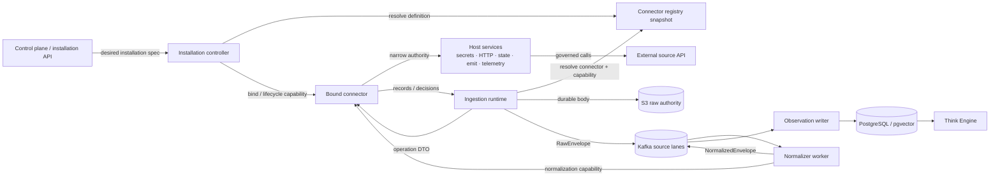

The connector is logically one object even though different workers may create
separate bound instances. The manifest and capability semantics unify them; no
shared mutable connector instance is required.

### 11.2 Runtime composition

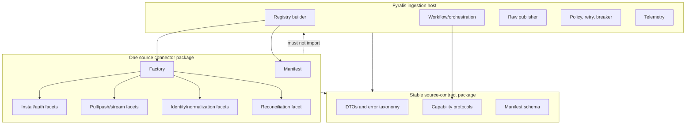

The dashed dependency is forbidden. A future RPC adapter can implement the same
contract on both sides without changing orchestration policy.

### 11.3 Deployment model

For initial first-party connectors:

- manifests and connector packages ship in the same image or locked Python
  environment as ingestion workers;
- workers may still run per source using the existing `INGESTION_SOURCE`
  deployment topology;
- a worker image can contain all trusted connectors while configuration restricts
  its registry view to one connector;
- registry fingerprint and selected connector versions appear in startup logs,
  health endpoints, and deployment metadata;
- a connector activation failure quarantines that connector. A source-dedicated
  worker fails readiness; a multi-source development worker can remain ready only
  if policy marks the connector non-required.

For a future less-trusted runtime:

- a signed connector artifact runs in a separate process/container;
- an RPC adapter maps the same capability DTOs and host ports;
- network, filesystem, CPU, and memory permissions enforce manifest grants;
- the registry selects `rpc_isolated` instead of `in_process_trusted` as runtime
  profile;
- envelopes and checkpoint invariants remain host-owned.

## 12. Dependency architecture

### 12.1 Allowed dependencies

```text
source connector implementation
        |
        v
source-contract  <--- ingestion runtime / workers
        ^                    |
        |                    v
conformance kit       platform adapters
                             |
                             v
                 Kafka / S3 / Postgres / Redis / HTTP
```

The `source-contract` package may depend only on small shared primitives needed
for IDs, time, and validation. It must not import application routes, workflow
services, database drivers, Kafka libraries, or any source SDK.

### 12.2 Proposed package boundaries

An eventual repository shape could be:

```text
services/ingest/source_contract/
  manifest.py
  capabilities/
  models/
  errors.py
  versioning.py

services/ingest/connector_runtime/
  registry.py
  binding.py
  lifecycle_controller.py
  host_services/
  adapters/legacy.py

services/ingest/connectors/
  slack/
    connector.yaml
    connector.py
    installation.py
    pull.py
    webhook.py
    normalization.py
    reconciliation.py
    tests/
  ...

services/ingest/connector_conformance/
  manifest_suite.py
  lifecycle_suite.py
  pull_suite.py
  push_suite.py
  normalization_suite.py
```

This is a target shape, not a requirement to move all files immediately. During
migration, connector facets may delegate to existing planner/fetcher/handler
modules.

### 12.3 Prohibited dependencies and data leakage

- A connector capability cannot accept `asyncpg.Record`; installation repository
  adapters translate rows to contract models.
- Webhook facets cannot accept a FastAPI `Request`; the host supplies a bounded
  headers/body/query DTO.
- Pull facets cannot return Kafka messages or S3 keys; they return source records.
- Normalization cannot accept a Kafka consumer record; it receives an envelope
  context and raw payload.
- Connector errors cannot expose provider SDK exceptions across the boundary;
  they are classified and retain a redacted diagnostic/cause chain for logs.
- Host services cannot expose global mutable clients without installation and
  operation scoping.

### 12.4 Shared connector utilities

Reusable source utilities are allowed below connector implementations but above
vendor SDKs: OAuth2 helpers, HMAC verification primitives, bounded pagination,
HTTP error parsing, common timestamp handling, and cursor codecs. They do not
register capabilities or own runtime policy. Sharing a helper must not imply a
source family inheritance hierarchy.

## 13. Sequence diagrams

### 13.1 Installation and initialization

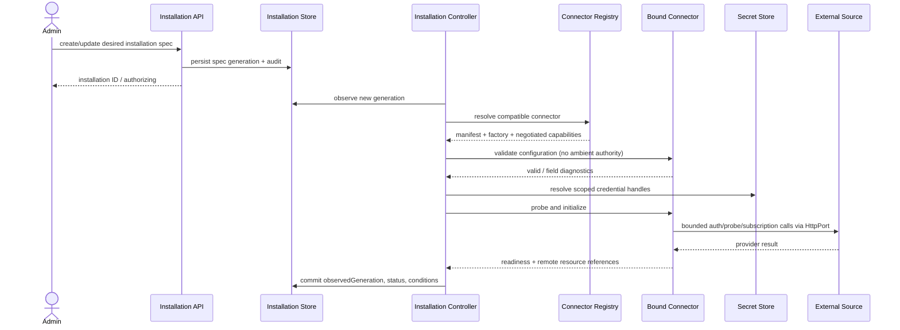

OAuth adds a host-owned browser/callback exchange before validation. The
connector provides provider parameters and token-exchange behavior; the host
owns state/nonce binding and installation/tenant association.

### 13.2 Historical pull and checkpoint

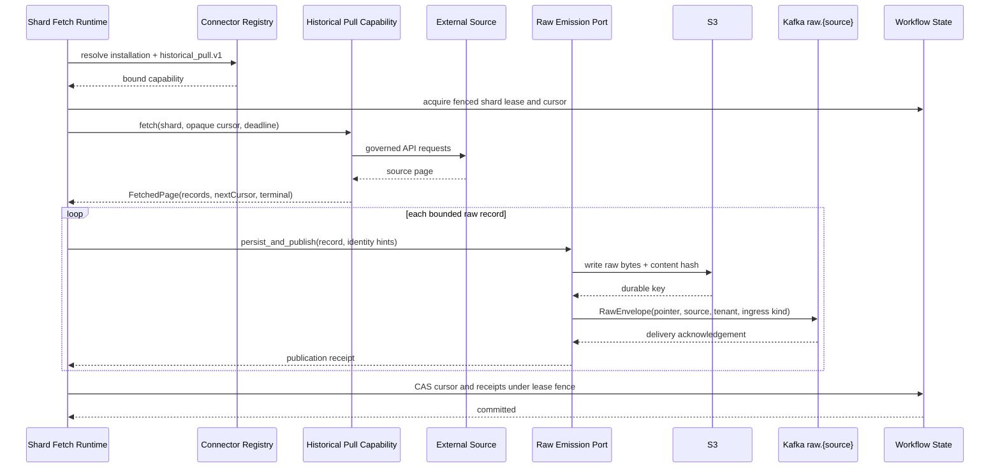

The existing N1 invariant remains: no cursor advance before S3 write and Kafka
acknowledgment. The connector cannot accidentally weaken this guarantee because
it never receives state storage or Kafka authority.

### 13.3 Webhook push

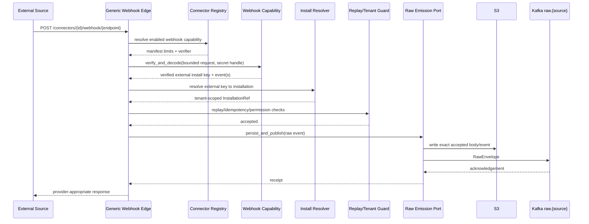

Tenant lookup occurs only after source-specific verification yields a trusted
external installation key. A connector can define lookup material, but cannot
return an arbitrary tenant ID as authority.

### 13.4 Normalization and observation production

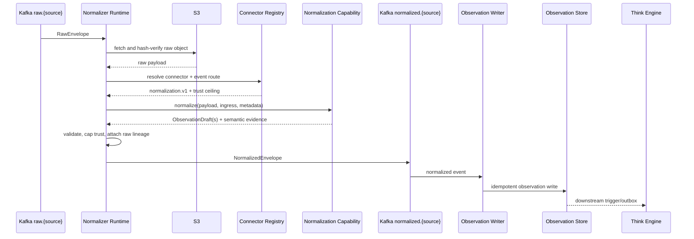

Channel selection becomes connector-local event routing. The engine no longer
maintains a global `(source, ingress_kind) -> channel` table.

### 13.5 Reconciliation and repair

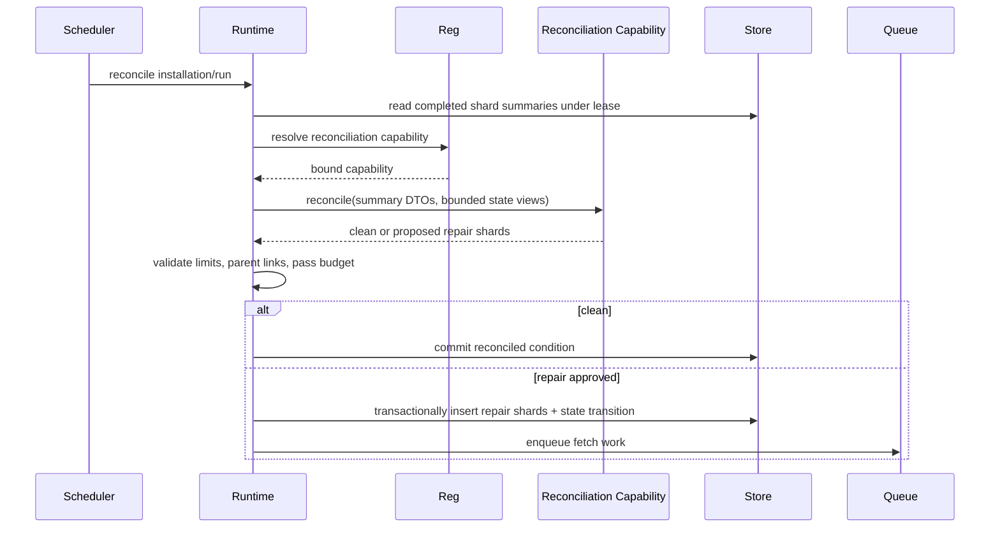

The connector proposes repair; the runtime authorizes and applies it. This
prevents a faulty reconciler from generating unbounded work.

## 14. State machines

### 14.1 Connector artifact state

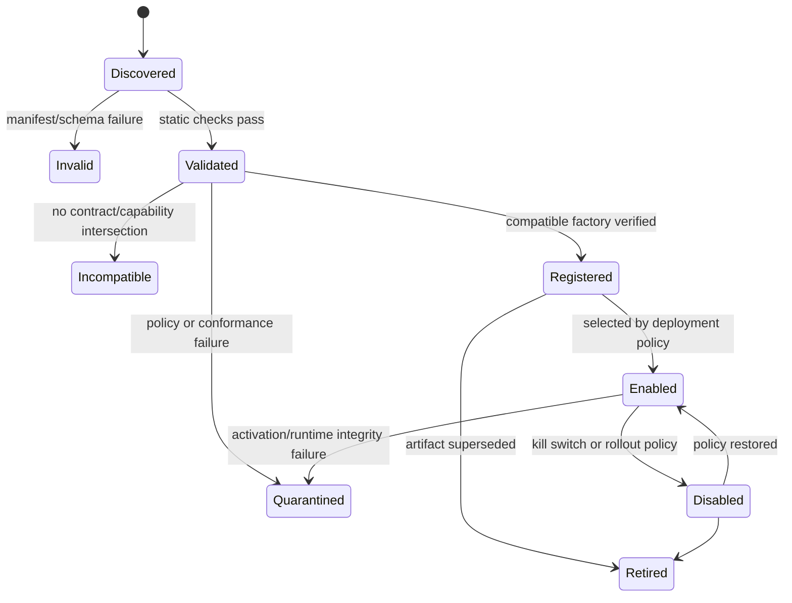

Artifact status is runtime-global. Installation status cannot override an
incompatible or quarantined artifact.

### 14.2 Execution state

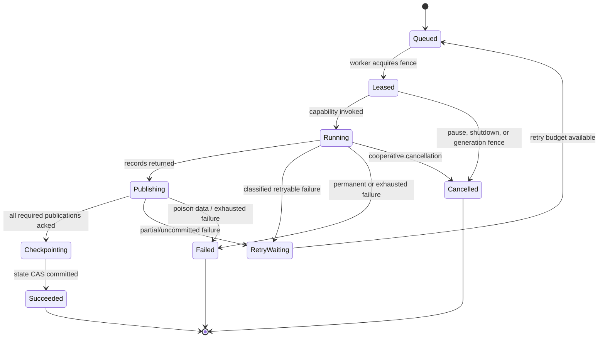

If publication succeeds but checkpointing fails, the execution retries from the
old cursor and may republish. Stable external IDs and idempotent observation
writes are therefore mandatory.

### 14.3 Secret rotation state

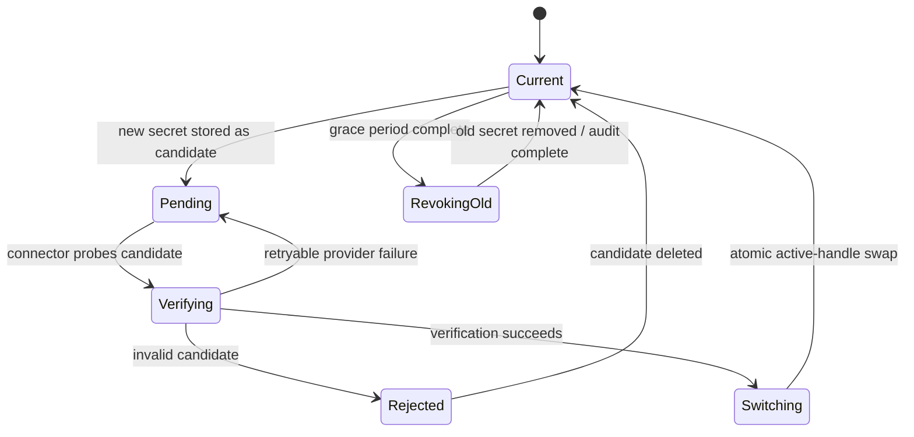

The runtime owns the dual-secret storage and atomic handle swap. The connector
owns source-specific verification and optional remote revocation.

## 15. Failure handling

### 15.1 Typed failure taxonomy

Connectors should translate vendor exceptions into a closed host taxonomy while
preserving a redacted diagnostic chain:

| Failure | Retry? | Typical runtime response |
|---|---|---|
| `InvalidConfiguration` | no | mark condition false; await spec change |
| `AuthenticationRejected` | no automatic loop | degrade/fail; request reauth or rotation |
| `PermissionDenied` | no until scope changes | disable affected capability |
| `ResourceNotFound` | contextual | tombstone resource or fail selected resource |
| `RateLimited(retry_at)` | yes | enforce shared provider/tenant budget and jitter |
| `TransientSourceFailure` | yes | bounded retry and breaker accounting |
| `SourceUnavailable` | yes, slower | open breaker after threshold |
| `PayloadRejected` | no for same payload | DLQ with redacted reason and lineage |
| `StateIncompatible` | no | maintenance; require migration/rollback |
| `ContractViolation` | no | quarantine connector version |
| `Cancelled` | no | release lease without marking source unhealthy |
| `Bug` | policy-limited | capture, fail execution, possibly quarantine |

Connector authors classify source semantics; the runtime decides retry count,
deadline, and operational consequence. A `retry_at` suggestion is bounded by
platform policy.

### 15.2 Failure domains

Failures should be isolated at the smallest truthful scope:

- one record: DLQ/skip according to explicit data policy;
- one page/shard: retry or mark shard failed;
- one selected resource: condition on that resource, continue others if safe;
- one installation: pause/degrade that tenant binding;
- one connector artifact: quarantine version across installations;
- one source lane: circuit breaker and worker scaling isolation;
- platform infrastructure: global incident behavior, not connector blame.

Metrics and alerts must distinguish these scopes.

### 15.3 Retry, rate limiting, and circuit breaking

The host owns a hierarchical budget:

```text
global platform
  -> connector/provider
    -> tenant installation
      -> capability/resource
```

The connector returns classification and provider hints such as reset time or
cost units. The host applies concurrency limits, token buckets, exponential
backoff with jitter, attempt/deadline budgets, and circuit state. This prevents
twenty-six connectors from implementing inconsistent retry storms.

Breaker keys and status should normally be `(connector_id, provider account or
installation, capability)` rather than source alone. A webhook normalization bug
should not necessarily halt historical API fetch, while a provider-wide outage
may affect both.

### 15.4 Poison data and DLQ

The runtime owns DLQ publication and the durable link to:

- connector ID and version;
- contract/capability version;
- installation and tenant references;
- raw S3 key/content hash;
- ingress kind and native event route;
- operation/shard/cursor version without secret values;
- normalized error code, attempt count, and trace ID.

Replay must resolve the originally used connector version when available or run
through an explicit migration/re-normalization mode. Silent replay with a new
normalizer can change semantics.

### 15.5 Partial effects and idempotency

Lifecycle capabilities that create remote subscriptions or revoke credentials
must accept an operation ID and support observe-before-create behavior where the
provider permits it. The controller records remote references before advancing
status. If the provider operation succeeds and the local commit fails, the next
reconciliation observes/reuses the remote object rather than creating another.

Data operations remain at-least-once. The identity facet must be deterministic
across live, backfill, and poll paths. Conformance tests run parity fixtures
through every implemented ingress mode and require equal external IDs for the
same source fact.

### 15.6 Timeouts, cancellation, and shutdown

Every capability invocation receives a deadline and cancellation token. The
connector may request a smaller internal timeout, never a larger one. Gateway
streams heartbeat leases and checkpoint resume state at bounded intervals.
Shutdown drains publication receipts, stops new fetches, cancels source I/O, and
does not mutate durable desired installation state.

### 15.7 Quarantine

Quarantine is for contract integrity or systemic connector faults, not routine
provider outages. Triggers can include:

- manifest/implementation mismatch;
- invalid DTOs crossing the boundary;
- repeated state monotonicity violations;
- undeclared network/secret access attempts in an isolated runtime;
- systematic trust-ceiling or tenant-boundary violation;
- crash rate above connector-integrity threshold after rollout.

Quarantine is version-specific, auditable, and reversible only by operator or
safe rollout policy.

## 16. Versioning strategy

### 16.1 Independent version axes

Fyralis must track at least five versions:

| Version | Example | Governs |
|---|---|---|
| Contract API | `sources.fyralis.io/v1` | root manifest/DTO compatibility |
| Capability API | `ingestion.historical_pull/v1` | one optional facet's methods/semantics |
| Connector implementation | `fyralis/slack@1.4.2` | shipped source behavior |
| Persisted connector state | `slack.pull_state/v3` | cursor/install/subscription state schema |
| Data envelope | `RawEnvelope v1`, `NormalizedEnvelope v1` | durable Kafka/S3-facing messages |

Do not infer one from another. A connector patch can change API error parsing
without changing contract or state. A new capability can be added without
bumping the root contract. An envelope may evolve independently of connector
implementation.

### 16.2 Compatibility policy

- Contract/capability major versions are breaking.
- Minor versions are additive for consumers, but because connectors are
  providers/implementers, adding a required abstract method is **not** additive.
- Patch versions clarify behavior or fix defects without changing schema.
- Stable capability v1 never gains a new required operation. Add an optional
  extension facet or publish v2.
- Manifests declare a host contract range and exact supported capability majors.
- The host can support two adjacent majors through adapters during migration.
- Production selection pins connector artifact versions or approved ranges and
  records the resolved version per installation/execution.

### 16.3 Additive evolution patterns

Prefer, in order:

1. new optional fields with defaults in DTOs;
2. new optional capability declarations;
3. a sub-capability/extension interface;
4. a new capability major with a host adapter;
5. a new root contract major only for cross-cutting semantic change.

Avoid default method implementations that silently claim behavior. Defaults are
appropriate only for semantically neutral host behavior, such as “no additional
health details,” not “reconciliation is clean.” The current default-clean
reconciler can remain during migration but should not be the final contract
semantics; absence of reconciliation must mean no reconciliation guarantee.

### 16.4 Persisted state versioning

Every opaque state payload carries:

- connector ID;
- state kind/capability;
- schema version;
- producing connector version;
- checksum and size;
- payload.

The connector supplies pure `decode`, `validate`, and stepwise `migrate`
functions. The runtime executes migration under a lease, stores pre-migration
backup/reference, enforces size/time limits, validates the result, and commits
with compare-and-set. Migrations must be deterministic and side-effect free;
source API repair is a separate lifecycle action.

Support either:

- `N -> N+1` stepwise upgrades; or
- direct read compatibility for a documented version range.

Downgrade policy must be explicit. If v3 cannot round-trip to v2, rollout must
pause executions, retain v2 state, and use a cutover marker so rollback is safe.

### 16.5 Envelope evolution

Preserve the existing RawEnvelope policy: additive fields within v1 and a new
model/version for breaking changes. Connector manifests declare which envelope
majors their adapter supports, but connectors do not construct on-wire envelopes.
The runtime translates contract DTOs to the selected envelope version.

Normalized semantics need equal care. Observation fields are Company OS inputs,
not transient ETL rows. Semantic changes to kind, actor/entity identity, trust,
or external ID require connector release notes, fixture diffs, and possibly
re-normalization plans even if the Pydantic schema remains binary-compatible.

### 16.6 Deprecation

Each stable capability or field should have:

- deprecation announcement and replacement;
- first-warning version/date;
- minimum support window;
- runtime usage telemetry;
- a conformance test with deprecated behavior disabled;
- removal only in a major version.

Persisted events and state outlive deployment code. Removed decoders must remain
available in replay/migration tooling for the retention window.

### 16.7 Compatibility adapters

Two adapter directions are useful:

- **Legacy implementation adapter**: presents current planner/fetcher/handler
  registries as a v1 connector during migration.
- **Protocol compatibility adapter**: allows a v1 connector to run on a v2 host
  when semantics can be faithfully translated.

Adapters must be explicit, observable, and time-bounded. A compatibility layer
that remains the permanent path simply recreates the old architecture behind a
new name.

## 17. Migration strategy from the current implementation

### 17.1 Migration rule: behavior before storage

Do not first merge all dedicated installation tables into one universal JSON
table. The connector boundary can hide current storage through repository
adapters, delivering architectural value with lower data risk. Once all runtime
callers use `InstallationRef` and installation ports, storage can evolve based on
actual commonality.

Similarly, do not move every source file before introducing the registry. A
connector package can delegate to existing modules. Dependency direction and
runtime lookup matter before folder aesthetics.

### 17.2 Compatibility architecture

During transition:

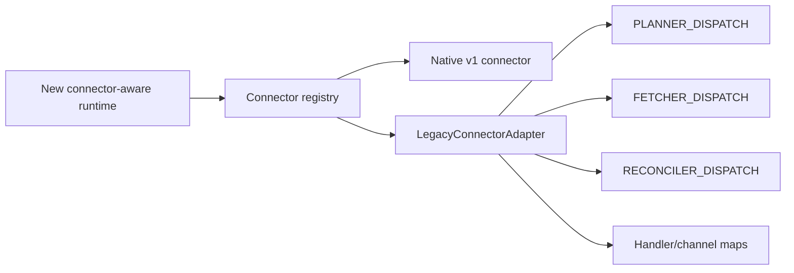

Each source has a routing flag selecting legacy or native connector behavior per
capability. Shadow comparison can invoke pure planning/normalization/identity
operations on both paths without double-publishing.

### 17.3 Establish the canonical connector catalog

Create one manifest per current source family:

Slack, GitHub, Discord, Gmail, Notion, Google Calendar, Google Drive, Jira,
Mercury, QuickBooks, Grafana, Telegram, Brex, Ramp, Gusto, Deel, Fireflies,
Signal, AWS, Miro, Figma, Carta, HiBob, Ashby, LinkedIn, and WhatsApp.

The catalog becomes the generator/validator input for:

- the source wire enumeration;
- topic provisioning and per-source compose definitions;
- worker deployment source selectors;
- lifecycle coverage;
- documentation inventory;
- supported-source API/UI metadata.

Database admissibility should eventually use a connector definitions table and
foreign key rather than repeated CHECK lists. The source wire value can remain
stable for envelope compatibility.

### 17.4 Representative pilot cohort

Select pilots by architecture, not popularity alone:

- **Slack**: OAuth, webhook, historical pull, common installation path;
- **Notion**: pull + poll + webhook sharing identity/normalization;
- **Gmail**: domain-specific installation, Pub/Sub-triggered fetch, poll and
  historical parity;
- **Telegram or Signal**: persistent gateway supervision;
- **WhatsApp**: live-only source proving capability absence rather than stubs;
- **Grafana**: one source with distinct historical and live semantic channels.

This set exercises the contract before mass migration. Migrating twenty similar
REST/HMAC sources first could leave gateway and multi-channel flaws undiscovered.

### 17.5 Source cohort migration

After pilots, suggested cohorts are:

1. collaboration/document pull: GitHub, Discord, Google Calendar, Google Drive,
   Jira;
2. finance/operations HTTP sources: Mercury, QuickBooks, Brex, Ramp, Gusto, Deel;
3. vertical/design sources: Fireflies, AWS, Miro, Figma, Carta;
4. people sources: HiBob, Ashby, LinkedIn;
5. remaining gateways/live-only modes.

Within a source, migrate in this order:

1. manifest and registry identity;
2. installation repository adapter and health;
3. semantic identity and normalization (pure, easy to shadow);
4. planning/resource discovery;
5. fetch/poll;
6. reconciliation;
7. webhook/subscription or gateway ingress;
8. lifecycle cleanup/rotation;
9. remove source-specific runtime branches.

The exact order may vary when a source lacks a capability.

### 17.6 Shadowing and cutover

For a migrated source:

- validate manifest/registry at build and startup;
- run fixture-based identity and normalization comparison;
- shadow planner outputs and compare shard sets without scheduling duplicates;
- shadow fetch only in controlled test tenants because it consumes provider
  quotas;
- route a small tenant cohort through the connector registry;
- compare raw counts, external-ID collision/parity, normalized diffs, lag, retry,
  DLQ, and reconciliation outcomes;
- expand cohort behind a per-source/per-capability flag;
- retain a time-bounded rollback to legacy registration;
- remove legacy entry only after two production release windows or an agreed
  evidence threshold.

### 17.7 Database migration

Near-term:

- retain existing installation tables;
- implement connector-local repository adapters;
- introduce stable `connector_id` and installation reference views where needed;
- replace new source CHECK-list migrations with registry-backed validation.

Mid-term:

- create a common installation header containing ID, tenant, connector ID,
  desired state, generation, bound version, and lifecycle timestamps;
- keep typed extension tables for source-specific fields/resources;
- migrate generic `provider_installations` and dedicated rows into the common
  header with back-references;
- move lifecycle status/conditions into common tables;
- preserve audit and retention semantics.

Long-term:

- decide from evidence whether source-specific extension tables remain or can be
  consolidated;
- remove repeated source CHECK constraints;
- use foreign keys from onboarding/shard/workflow state to connector definition
  and installation IDs.

Avoid an unvalidated arbitrary JSON credential/config blob as the only source of
truth. Config schemas may be declarative, but storage must preserve encryption,
indexing, referential integrity, and migration needs.

### 17.8 Legacy removal criteria

Do not remove a legacy path until:

- all 26 source manifests pass registry validation;
- no runtime imports `PLANNER_DISPATCH`, `FETCHER_DISPATCH`,
  `RECONCILER_DISPATCH`, handler globals, or central channel mapping outside the
  compatibility adapter;
- all source workers resolve through the registry;
- lifecycle commands operate on the common installation service;
- topic/deployment generation derives from the connector catalog;
- conformance and integration tests cover every declared capability;
- production telemetry shows no legacy invocations for the agreed window;
- rollback and replay procedures are documented and tested.

## 18. Risks and tradeoffs

### 18.1 Contract over-design

Trying to model every peculiarity of 26 sources in v1 could freeze a poor API.
Mitigation: ship a minimal root plus capability facets, use current contracts as
adapters, pilot across diverse archetypes, and keep v1alpha1 until conformance
evidence exists.

### 18.2 God manifest

A manifest can become a second programming language. It should describe identity,
compatibility, permissions, schemas, and contributions—not pagination logic or
complex normalization. Declarative connector authoring can later compile into
the same capabilities.

### 18.3 False isolation in-process

Passing narrow host ports does not prevent trusted Python code from importing
network or filesystem libraries. Import boundaries and review help, but this is
not a security sandbox. Less-trusted connectors require process/container
isolation and enforceable egress/secret policy.

### 18.4 Too many capability interfaces

Excessive granularity makes authoring and negotiation burdensome. Capabilities
should correspond to independently optional lifecycle/behavior units, not every
method. Start with the set in Section 7.4 and split only when versioning or
authority differs.

### 18.5 Runtime abstraction leakage

Opaque cursor/state and generic records can still leak source SDK types or
database rows. DTO validation and transport-neutral serialization tests are
required even for in-process connectors.

### 18.6 Version-matrix complexity

Contract, capability, connector, state, and envelope versions create a matrix.
The alternative is implicit incompatibility. Mitigation: support only a narrow
window, expose negotiated versions, pin production artifacts, and generate a
compatibility report in CI and startup diagnostics.

### 18.7 Dual-path migration drift

Compatibility adapters can become permanent and double the mental model.
Every adapter needs an owner, removal issue, telemetry, and deadline. New sources
must use the new contract after Phase 3 unless explicitly exempted.

### 18.8 Operational overhead

Lifecycle controllers, conditions, registry diagnostics, and conformance tests
add machinery. That cost is justified because current source addition already
spends the complexity informally across routes, scripts, migrations, and workers.
The design centralizes rather than invents most of it.

### 18.9 Performance overhead

Typed DTO construction and registry resolution add small CPU cost. Bindings and
capability resolution can be cached per installation generation; remote API,
Kafka, S3, and model work dominate latency. Future RPC isolation adds meaningful
serialization/IPC cost and should be selected by trust profile, not universally.

### 18.10 Connector-level blast radius

One architectural object could tempt shared mutable state across tenants. The
definition/factory is global, but bound connectors and clients must be
installation-scoped or safely pooled under host control. No tenant secret or
cursor may live on a global connector singleton.

### 18.11 Declarative catalog as another source of truth

The connector catalog only solves drift if other lists are generated from or
validated against it. CI must reject hand-maintained source sets outside approved
wire compatibility code. Database/runtime state remains authoritative for
installations; the catalog is authoritative for shipped definitions.

### 18.12 Company OS semantic risk

ETL systems can tolerate some schema drift as a warehouse concern. Fyralis uses
observations to influence company understanding and reasoning. A connector bug
can misattribute an actor, inflate trust, duplicate events, or alter decisions.
Therefore normalization/identity versions, provenance, trust ceilings, replay,
and semantic fixture diffs are first-class release gates—not optional connector
quality extras.

## 19. Final recommendation

Adopt the Source Connector Contract as the sole target extension boundary for
raw data sources.

The root contract should remain small: immutable manifest, binding to one
installation, and typed capability resolution. Implement functionality as
separately versioned facets. Use a manifest-driven immutable registry, explicit
compatibility negotiation, host-owned lifecycle reconciliation, and
least-authority runtime services. Preserve current envelopes, S3/Kafka ordering,
source lanes, observation writing, and idempotency guarantees by putting them
above the connector boundary.

Do not make these choices:

- do not replace scattered maps with one oversized abstract base class;
- do not use boolean capabilities as the invocation authority;
- do not let connectors publish directly to Kafka/S3 or persist cursors;
- do not hot-load arbitrary Python connectors in the first implementation;
- do not merge every installation schema before behavioral unification;
- do not expose raw-source registration through the existing third-party
  extension plane without a separate security decision;
- do not migrate all 26 sources in one cutover.

The architecture is successful when adding a conventional twenty-seventh source
requires:

1. one connector package and manifest;
2. implementations for only its real capabilities;
3. connector-local installation/storage migrations if needed;
4. conformance and semantic fixtures;
5. catalog registration and deployment policy;

and requires **no edits** to planner/fetcher/reconciler/handler dispatch tables,
webhook provider maps, central channel mapping, source allowlists, topic lists,
or lifecycle command source lists.

The resulting platform is not merely a connector SDK. It is a controlled
component model for admitting external organizational evidence into Fyralis.
That boundary is appropriate for a Company OS: source diversity remains at the
edge, while trust, lineage, durability, tenancy, and semantic integrity remain
platform policy.

## Phased implementation roadmap

This roadmap is intentionally implementation-ready but contains no production
implementation itself.

### Phase 1 – Architectural foundations

**Objective:** establish vocabulary, dependency boundaries, and baseline
evidence without changing production routing.

1. Approve this proposal or record contested decisions as ADRs: host ownership,
   capability facets, registry model, trust boundary, and version axes.
2. Inventory every current source across install storage, auth, ingress modes,
   planners, fetchers, reconcilers, handlers, identity functions, routes,
   workers, migrations, and lifecycle commands.
3. Produce a machine-readable baseline matrix for all 26 sources and flag
   current stubs/deferred capabilities truthfully.
4. Define import-boundary rules: contract cannot import runtime; runtime cannot
   import source implementations; connectors cannot import runtime infrastructure.
5. Capture existing invariants as characterization tests, especially S3-before-
   Kafka, cursor-after-ack, external-ID live/backfill parity, source isolation,
   DLQ lineage, and trust capping.
6. Define terminology in the glossary: connector definition, installation,
   binding, capability, execution, desired state, condition, state schema.

**Milestone:** reviewed ADR set, complete source matrix, dependency check in CI,
and green characterization suite. No traffic behavior changes.

### Phase 2 – Core connector contract

**Objective:** create the stable logical boundary and conformance models.

1. Create the dependency-light source-contract package.
2. Define connector IDs, manifest schema, version ranges, capability keys,
   installation/operation DTOs, error taxonomy, health conditions, and authority
   grants.
3. Define v1alpha1 capability protocols for installation, pull, poll, webhook,
   gateway, normalization, identity, reconciliation, cleanup, and health.
4. Define host service ports without implementing source-specific behavior.
5. Specify serialization limits and forbid infrastructure/vendor types.
6. Build the conformance-kit skeleton and fake host services.
7. Implement a `LegacyConnectorAdapter` design/prototype in tests that can wrap
   current contracts; do not route production traffic yet.
8. Run design spikes against the representative pilot cohort and revise while
   still alpha.

**Milestone:** contract package has no source/runtime dependencies, all DTOs
round-trip, pilot adapters pass contract tests, and no connector must implement
unsupported capabilities.

### Phase 3 – Registry

**Objective:** establish one definition authority and compatibility gate.

1. Define one manifest per current source with truthful capability and maturity
   declarations.
2. Implement deterministic manifest discovery and schema validation.
3. Implement factory loading separately from manifest inspection.
4. Reject duplicate IDs, aliases, source wire values, unsupported capability
   majors, and manifest/factory mismatch.
5. Build immutable registry snapshots and diagnostic/health output.
6. Add deployment policy for enabled/disabled/quarantined connectors.
7. Generate or validate `SourceLiteral`, topics, compose fragments, and
   supported-source metadata from the connector catalog.
8. Add CI conformance report covering all 26 definitions.

**Milestone:** the registry can describe every shipped source and capability;
startup can prove compatibility without invoking source I/O; existing runtime
still uses legacy dispatch through adapters.

### Phase 4 – Runtime integration

**Objective:** make workers interact only with registry-resolved capabilities.

1. Implement installation-scoped binding and granted host services.
2. Add the connector-aware planner/fetch runtime while preserving existing
   shard tables and N1 checkpoint ordering.
3. Replace central normalizer channel dispatch with connector-local event
   routing behind the normalization capability.
4. Add the generic webhook edge with connector verifier/decode and host-owned
   installation/tenant resolution.
5. Add gateway supervision/lease adapter for persistent sources.
6. Implement typed failure translation, hierarchical retry/rate budgets,
   connector/capability breaker keys, and registry-version telemetry.
7. Implement desired/observed installation lifecycle controller over current
   repositories.
8. Add shadow execution and per-source/per-capability cutover flags.

**Milestone:** representative pilots can run end-to-end through registry and host
ports with current delivery guarantees; rollback to legacy is tested.

### Phase 5 – Migration of existing connectors

**Objective:** convert all source families without a big-bang cutover.

1. Migrate the representative pilots and observe at least one agreed production
   evidence window.
2. Migrate source cohorts using the per-source order in Section 17.5.
3. For each source, add capability-specific conformance, identity parity,
   normalization golden fixtures, cursor restart, rate-limit, secret rotation,
   lifecycle, and uninstall tests.
4. Introduce a common installation header while retaining connector-specific
   extension tables and repository adapters.
5. Record connector/capability/state versions on executions, DLQ entries, and
   status.
6. Publish migration dashboards: legacy/native counts, output diffs, DLQ, lag,
   retry, parity collisions, and reconciliation gaps.
7. Make the new contract mandatory for any newly added source.

**Milestone:** all 26 sources resolve through connector definitions; every
declared capability is exercised by conformance/integration tests; no source
requires a fake capability stub.

### Phase 6 – Removal of legacy registration paths

**Objective:** make the connector registry the only runtime path.

1. Disable and then delete direct use of planner, fetcher, reconciler, and
   handler registries outside archived compatibility tests.
2. Remove static per-source import side effects and central channel/provider
   maps after their connector equivalents are active.
3. Replace duplicated workflow allowlists and lifecycle source lists with
   registry/catalog queries.
4. Replace repeated database source CHECK constraints with reference-backed
   validation where migration safety permits.
5. Remove per-source client-builder dispatch from runtime modules.
6. Delete `LegacyConnectorAdapter` after telemetry proves zero use and rollback
   windows close.
7. Enforce forbidden imports and source-keyed dispatch patterns in CI.

**Milestone:** a repository search finds no production source dispatch outside
the connector registry; adding a test connector requires no runtime edits.

### Phase 7 – Testing, observability, and documentation

**Objective:** harden the connector platform as a product-quality subsystem.

1. Complete capability conformance suites and a connector test harness with
   fake secrets, HTTP, time, emitter, state, cancellation, and fault injection.
2. Add contract/state/envelope compatibility matrix tests across supported
   versions and upgrade/rollback tests.
3. Add chaos tests for crash-after-publish-before-checkpoint, lease loss,
   duplicate webhook, provider timeout, rate-limit storms, state migration
   failure, and gateway reconnect.
4. Publish dashboards and SLOs by connector, installation, capability, and
   failure domain with bounded cardinality.
5. Add operator views for registry health, negotiated versions, quarantine,
   installation conditions, state migration, and capability availability.
6. Write the connector-author guide, manifest/capability reference, security
   model, migration guide, source checklist, and troubleshooting runbooks.
7. Decide through a separate security/architecture review whether to support
   signed, out-of-process third-party connectors. If approved, map the same
   logical contract to versioned RPC and enforced capability grants.
8. Promote the contract from alpha to stable only after pilot diversity,
   migration completion, and deprecation policy are demonstrated.

**Milestone:** the connector platform has stable v1 contracts, operational SLOs,
complete author/operator documentation, tested upgrades, and an explicit—not
accidental—policy for third-party execution.

## Research references

Primary and official sources used in this proposal:

- [Airbyte Python CDK](https://github.com/airbytehq/airbyte-python-cdk)
- [Fivetran Connector SDK](https://fivetran.com/docs/connector-sdk)
- [Meltano Singer SDK](https://sdk.meltano.com/)
- [Apache NiFi Developer Guide](https://nifi.apache.org/docs/nifi-docs/html/developer-guide.html)
- [Apache Camel Architecture](https://camel.apache.org/manual/architecture.html)
- [Temporal Activities](https://docs.temporal.io/activities)
- [Dagster Resources](https://docs.dagster.io/guides/build/external-resources)
- [dbt adapters](https://github.com/dbt-labs/dbt-adapters)
- [Terraform Plugin Protocol](https://developer.hashicorp.com/terraform/plugin/terraform-plugin-protocol)
- [Kubernetes Operator Pattern](https://kubernetes.io/docs/concepts/extend-kubernetes/operator/)
- [Visual Studio Code Extension Anatomy](https://code.visualstudio.com/api/get-started/extension-anatomy)
- [HashiCorp go-plugin](https://github.com/hashicorp/go-plugin)
- [Linux Driver Binding](https://docs.kernel.org/driver-api/driver-model/binding.html)
- [MySQL Pluggable Storage Engines](https://dev.mysql.com/doc/refman/8.0/en/pluggable-storage-overview.html)
- [Language Server Protocol](https://microsoft.github.io/language-server-protocol/)
- [OpenTelemetry Collector](https://opentelemetry.io/docs/collector/)
- [Python entry-points specification](https://packaging.python.org/en/latest/specifications/entry-points/)
- [Java Service Provider loading](https://docs.oracle.com/en/java/javase/21/docs/api/java.base/java/util/ServiceLoader.html)
- [Hexagonal Architecture](https://alistair.cockburn.us/hexagonal-architecture)
- [Clean Architecture](https://blog.cleancoder.com/uncle-bob/2012/08/13/the-clean-architecture.html)
- [OSGi Semantic Versioning](https://docs.osgi.org/whitepaper/semantic-versioning/010-executive-summary.html)
- [Protocol Buffers API evolution practices](https://protobuf.dev/best-practices/dos-donts/)
- [The Structure of Authority](https://papers.agoric.com/papers/the-structure-of-authority-why-security-is-not-a-separable-concern/abstract/)
