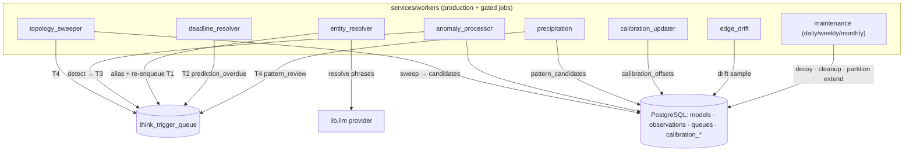

# Workers — Background Jobs

> Source: `services/workers/` + launchers in `scripts/`.
> Part of the [architecture overview](index.md).

**One-line:** out-of-request-path worker packages (anomaly, entity, calibration,
deadline, precipitation, edge-drift, topology-sweep, maintenance) that poll
Postgres tables/queues to enqueue Think triggers and maintain the substrate.

!!! note "Deployment status — verified on this branch"
    `anomaly_processor` and `entity_resolver` now run as first-class compose
    services. Default lifecycle jobs from `maintenance`, `deadline_resolver`,
    `calibration_updater`, and `edge_drift` run through `housekeeper_worker`.
    Expensive or non-selected jobs such as precipitation remain flag-gated until
    launch scope and cost are explicit. The enforced launch-scope source of
    truth is `services.platform.runtime.worker_launch_policy`; see the
    [worker fabric runbook](../operations/worker-fabric-runbook.md).

## The worker packages

| Package | Job (from module docstring) | Deployed? |
|---------|------------------------------|-----------|
| `topology_sweeper` | Re-runs the latent topology field over high-activation Models → `relationship_candidates` + `T4` (`LatentTopologyService.sweep_tenant`). | Launcher only (`scripts/run_topology_sweeper.py`, dogfood). |
| `anomaly_processor` | Wave 4-B. Detects six anomaly kinds, scores significance, debounces, writes sub-threshold signals to the Memory Fabric (`signal_memory_fabric`), and enqueues `T3` triggers. | Production compose service: `anomaly_processor_worker`. |
| `entity_resolver` | Deferred LLM resolution of `content._unresolved_phrases` → inserts aliases, appends entities, re-enqueues `T1` (medium-confidence → `entity_review_queue`). | Production compose service: `entity_resolver_worker`. |
| `calibration_updater` | Wave 4-C weekly. Turns the append-only `calibration_stats` log into the mutable `calibration_offsets` table. | Runs through `housekeeper_worker`. |
| `deadline_resolver` | Wave 4-A. Polls prediction Models whose `evaluate_at` passed → enqueues `T2 prediction_overdue` (never writes `models` directly; Think's deterministic T2 handler owns the deltas). | Runs through `housekeeper_worker`. |
| `precipitation` | Wave 4-C nightly. Clusters related `hypothesis`/`concern` Models into one `pattern_candidates` row per dense embedding cluster → promoted by Think `T4 pattern_review`. | Flag-gated in `housekeeper_worker`; disabled by default. |
| `edge_drift` | Samples `model_edges` vs. legacy array columns to detect typed-edge drift parity (`EdgesRepo.get_drift_sample`). | Runs through `housekeeper_worker`. |
| `maintenance` | Wave 4-D. `daily.py` (decay + archival + alias cleanup + orphan/think_runs/region-lock cleanup), `weekly.py` (relationship maintenance + calibration + partition extension + memory-fabric decay), `monthly.py` (vacuum analyze, cold-partition notes, reports), `scheduler.py` (in-process asyncio scheduler). | Default lifecycle jobs run through `housekeeper_worker`; expensive/monthly work remains flag-gated. |
| `neighborhood_detector` | **No source on this branch** — only stale `__pycache__/` + `tests/`. Relates to the retired accepted-memory "neighborhood" topology. | Not present. |
| `topology_updater` | **No source on this branch** — only stale `__pycache__/` + `tests/`. Relates to the retired accepted-memory topology. | Not present. |

## How it's wired

## Entry points

- `topology_sweeper` — `scripts/run_topology_sweeper.py` (also via `dogfood_up.sh`).
- `anomaly_processor` — `scripts/run_anomaly_processor_worker.py`
  (`anomaly_processor_worker` compose service).
- `entity_resolver` — `scripts/run_entity_resolver_worker.py`
  (`entity_resolver_worker` compose service).
- `deadline_resolver`, `calibration_updater`, `edge_drift`, and default
  `maintenance` jobs — scheduled by `housekeeper_worker`.
- `precipitation` and expensive/monthly maintenance jobs — present but disabled
  by default behind housekeeper feature flags.

## Dependencies

**Inbound** *(verified)*: `anomaly_processor_worker`,
`entity_resolver_worker`, `housekeeper_worker`, and the dogfood
`topology_sweeper` launcher invoke these today. Expensive flag-gated jobs still
need explicit production enablement.

**Outbound** *(verified)*: `services.domain` (models decay/repo, `EdgesRepo` drift
sample, entity aliases, falsifiers), `services.reasoning` (topology field,
retrieval maintenance), `lib.llm.provider` (entity resolver), and the
`think_trigger_queue` / calibration tables.

## Design rationale

> **TODO(human):** This is the most decision-heavy layer to document. Capture:
>
> - **Why most workers are not deployed** — are anomaly/precipitation/calibration/
>   edge-drift/deadline intended for production and pending a wiring PR, or
>   deliberately dormant? (The memory of the project notes these are "coded +
>   migrated but NOT deployed.")
> - The fate of the source-less `neighborhood_detector` and `topology_updater`
>   packages (delete, or placeholders for re-introduction?).
> - The intended schedule/cadence and ownership of each worker once deployed.
