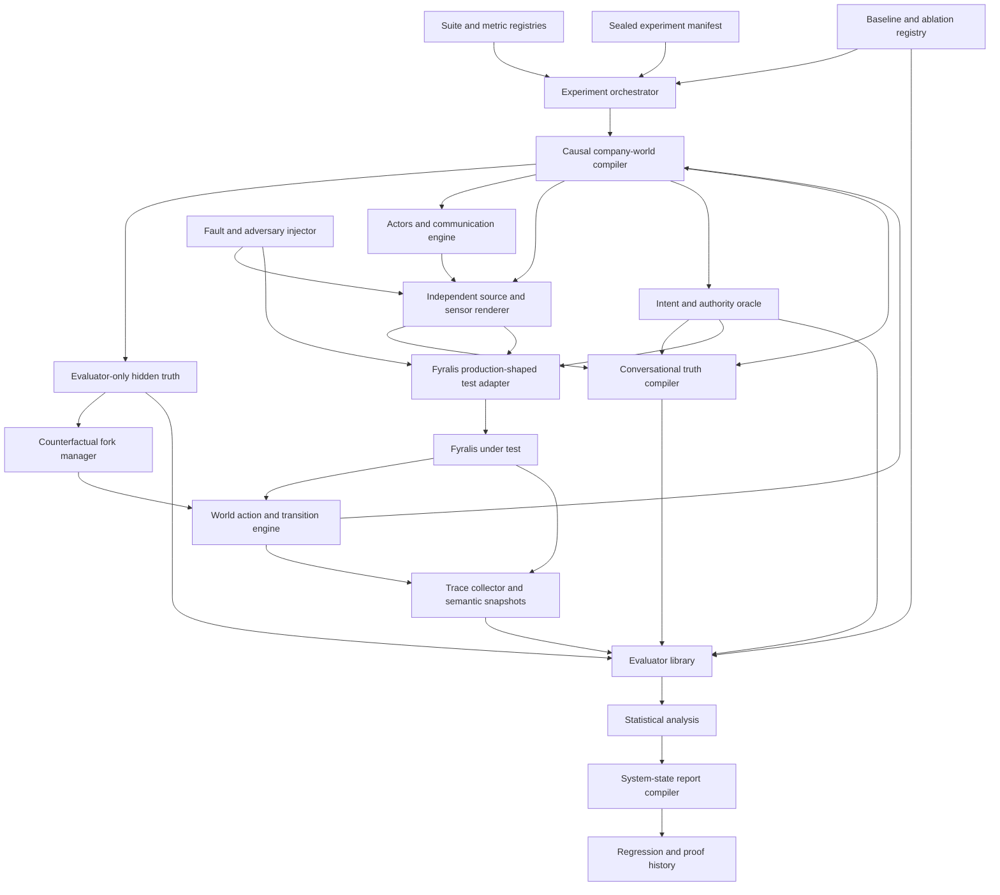
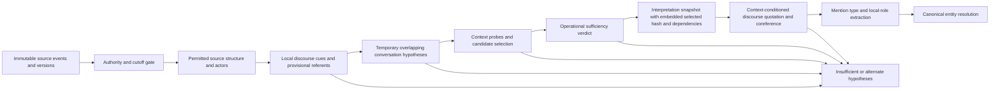
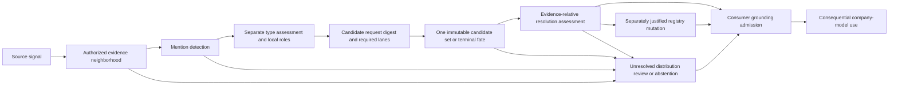
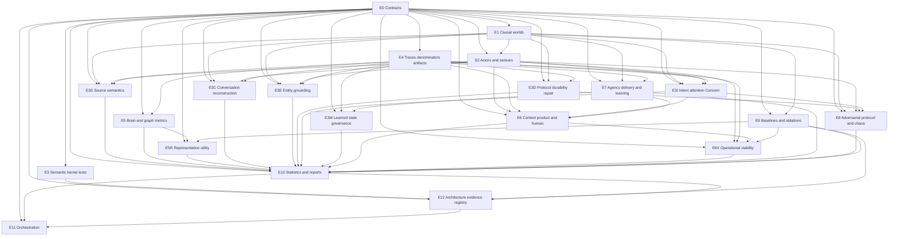

# Revised System Continuous Objective Evaluation Framework

Date: 2026-07-16

Status: architecture-aligned evaluation framework with executable component
evaluators and a focused autonomous company-learning assurance checkpoint.
Current evidence includes live E3 component proof and bounded paired E4
recurrence evidence. No full-system, open-world, E5 customer-value, scale or
production-readiness proof is claimed.

Companion implementation plan:
[Revised Company Physics–Brain–Intent System Implementation](../plans/revised-reality-belief-intent-system-implementation.md)

Architecture compatibility target:
`a3e75c96080101cc547b5ea144c51a57988b6ff5f054aa32b57d1d234daecf4a`
(current SHA-256 of the companion implementation plan on 2026-07-16).
Every evaluation manifest and rendered report must record the implementation-
plan digest it claims to cover; a digest mismatch is a visible compatibility
gap, never silently treated as current proof. This digest remains a
compatibility target for the reviewed design, not evidence that the live
runtime implements every object, flow or proof obligation in that plan.

Current-runtime references:

- [Core System Architecture](../reference/CORE-SYSTEM-ARCHITECTURE.md)
- [Codebase Architecture](../reference/CODEBASE-ARCHITECTURE.md)
- [Company Intelligence Harness](./company_intelligence_harness.md)
- [Company Understanding Vitals Harness](./company_understanding_vitals_harness.md)

## Active Evaluation Profile

The active product profile is **autonomous company learning and company
modeling**: reconstruct company signals, ground company entities, build and
revise company memory, reuse governed corrections, and autonomously close the
learning and feedback loop around that model.

Autonomous task planning, scheduling, leasing, execution and external-effect
control are excluded from the active profile. Existing task/agency contracts
and evaluators remain future compatibility surfaces with zero active-product
exposure; they must not be used to imply that task autonomy is enabled or
proven.

## Purpose

This document defines how to evaluate the revised Fyralis system objectively
from its smallest functions through its highest product and organizational
claims. Its output is not primarily a pass/fail verdict. It is a precise,
continuous model of the current system state.

The framework must answer:

> How capable, reliable, safe, efficient, generalizable, and causally useful is
> Fyralis today; under which conditions; with what uncertainty and proof
> strength; where does it fail; and which constraint most limits the whole
> system?

A reader of a completed report should be able to determine:

- what the system can and cannot currently do;
- how often it succeeds, abstains, degrades, or fails;
- where its performance distribution and worst tails lie;
- which company structures, evidence conditions, and risk classes are covered;
- whether the graph, adaptive inquiry, concerns, and learning loops add causal
  value beyond simpler baselines;
- whether every cross-plane distinction and authority boundary holds;
- whether stream-native conversational evidence is reconstructed sufficiently
  before entity extraction without importing future or unauthorized context;
- whether outcomes improve rather than merely producing plausible artifacts;
- whether autonomous work is bounded and becomes quiet;
- whether each workload received a consequence-appropriate processing depth,
  and whether lower-cost processing preserved the same semantic and authority
  laws rather than silently weakening them;
- whether the system produced the most useful safe result available instead of
  mistaking abstention, review, or inactivity for success;
- how effectively intent was observed, proposed, clarified, authorized, and
  maintained, including the human attention required to do so;
- how every adaptive loop behaves before it has enough feedback to learn and
  whether it earns promotion from default, temporary, or shadow operation;
- whether semantic decisions, computational bundling, and durable commit
  authority remain independently testable even when one model call performs
  several inferences jointly;
- whether model, calibration, and policy state obey tenant, purpose, training,
  revocation, deletion, and unlearning authority;
- which architectural commitments are constitutional laws, stable contracts,
  governed policies, empirical hypotheses, or rebuildable mechanisms, and how
  evidence changes each class;
- whether the complete lawful path is economically operable at the declared
  scale without relying on informal bypasses;
- whether every architecture document, schema, writer map, proof row, and
  generated artifact agrees with one canonical architecture registry;
- how strong, fresh, and reproducible the evidence is; and
- which proof gaps or system changes deserve attention next.

This is a plan for the evaluation system. It does not claim that the current
runtime has already achieved any unmeasured target.

## Highest Legitimate Pre-Customer Claim

Simulation can provide strong evidence of technical coherence, component and
dataflow correctness, epistemic discipline, causal usefulness, safety,
adaptation, recovery, scaling behavior, and generalization across modeled
organizations.

Simulation cannot fully establish real organizational trust, politics,
adoption, workflow fit, willingness to pay, employee perception, or long-term
social and cultural effects. Those require controlled human and customer
validation.

The strongest honest pre-customer conclusion is therefore:

> Fyralis is technically coherent, epistemically disciplined, bounded, safe,
> adaptive, and causally useful across a broad and explicitly described class
> of modeled organizations, with known uncertainty and proof gaps, and is ready
> for controlled customer validation.

## What Must Be Absolutely True

The framework exists to establish the following system properties with graded
evidence rather than rhetorical confidence.

| Level | Required truth |
| --- | --- |
| Primitive | Types, time, tenant, provenance, authority, idempotency, version, and lifecycle semantics survive every operation |
| Evidence | The system preserves what sources produced without converting source statements into unqualified truth |
| Source semantics | SourceAssertion, SemanticFrame and SpeechAct interpretations preserve attribution, arguments, negation, modality, conditionality, quantity and time before semantic admission |
| Conversational reconstruction | For stream-native sources, the system distinguishes what was historically and legally answerable from how well it reconstructed the necessary discourse; no channel, thread, or time window is mistaken for a self-contained semantic object |
| Entity grounding | Every consequential signal is attached to the correct company objects or retains calibrated ambiguity; extraction, typing, role, linking and lifecycle errors cannot hide downstream |
| Physics | Recorded state, capabilities, constraints, execution, and outcomes reflect authoritative or independently measured reality with known conditions |
| Belief | Beliefs are calibrated, revisable, contradiction-aware, source-dependent, temporally correct, and distinguishable from evidence and intent |
| Graph | Durable structure is typed, scoped, evidence-grounded, compact, correctable, and measurably useful to a named consumer |
| Intent | Goals, priorities, decisions, and commitments are plural, scoped, authorized, versioned, and never inferred as factual truth |
| Intent admission | Direct typed constitutive commands, interpreted proposals and exact proposal acceptance remain mechanically distinct; existing intent receives an explicit fate when its authority basis or grounding changes |
| Attention governance | Autonomous attention has a complete source-specific governance binding, bounded modifiers and nonwaivable constraints; incomplete sources remain passive |
| Context | Retrieval provides the smallest sufficient authorized evidence packet, including material counterevidence and omissions |
| Inquiry | Questions reduce decision-relevant uncertainty economically, remain temporary, and stop at the right time |
| Concern | Attention is directed by consequential divergence between current belief/state and authorized intent, not by generic graph growth |
| Prediction | Consequential expectations are falsifiable, preregistered, calibrated, and immutable after outcome evidence |
| Agency | Proposals, authorization, execution, and outcomes remain distinct; side effects are fenced, idempotent, and reconcilable |
| Delivery | An in-app brief remains a rebuildable projection; every external notification or clarification follows proposal/specification, authorization, work, effect, receipt and reconciliation fates |
| Learning | Beliefs and policies change only from attributable evidence or terminal outcomes, with versioning, controls, and rollback |
| Product | Users see observed, believed, intended, proposed, executed, outcome, and unknown states clearly enough to make better decisions |
| Runtime | Work is durable, prioritized, recoverable, finite, and converges to quiescence without new external obligations |
| Correction closure | Correction, revocation and deletion discover, fence and terminalize every consequential dependent through explicit repair generations, receipts, watermarks and residue |
| Product goal | The system improves actionable organizational understanding and decisions relative to credible simpler alternatives |
| Safety | Reduced authority never increases access or action; constitutional violations never average away inside a good overall score |
| Proportional rigor | Processing depth rises with consequence, uncertainty, irreversibility and expected downstream value; lower resolution preserves the same epistemic, authority and fate semantics |
| Useful safe liveness | Every eligible opportunity reaches a useful safe result, a calibrated bounded alternative, or an explicit reason no such result is currently possible within a measured time and resource envelope |
| Intent acquisition | Institutional acts, expressed direction, proposed interpretation, behavioral evidence, conflict and absence remain distinct while the system progressively reduces intent uncertainty at acceptable human cost |
| Loop bootstrap | Every adaptive loop has an explicit cold-start prior, temporary or shadow regime, evidence threshold, promotion rule, and safe behavior when evidence remains insufficient |
| Semantic/computational/commit separation | Required propositions and decisions remain separately observable and calibratable; models may infer them jointly, but only their named writer can durably admit each result |
| Representation scope | Optional structural utility is established at a declared relation-family, consumer, risk and organization cohort, with instance escalation where consequence or heterogeneity requires it |
| Human attention | Confirmation, clarification, correction and review consume measured scarce attention; routing and interruption are justified by expected information or regret reduction |
| Learned-state authority | Training examples, calibration sets, thresholds, embeddings, policies and model parameters have explicit provenance, tenant influence, use authority, revocation and deletion or unlearning fates |
| Architectural learning | Architecture mechanisms change through preregistered hypotheses, discriminating experiments, explicit decisions and regression evidence rather than undocumented intuition |
| Architecture commitment class | Every design commitment has one declared ArchitectureCommitmentClass whose evidence, mutability, approval and compatibility rules match the strength of the claim |
| Economic correctness | Compute, storage, latency, source traffic, operator load and human attention for the lawful path remain inside a declared value-and-risk envelope at realistic scale |
| Architecture self-consistency | One canonical machine-readable registry owns architectural identity; documentation, schemas, catalogs, ownership maps, proof obligations and diagrams are generated or mechanically checked projections |

## Ideal Behavior Envelope

The ideal is an asymptote and comparison surface, not a claim that every metric
can literally reach perfection. Each metric records five reference points:

1. current observed performance;
2. credible simple baseline;
3. risk-specific minimum safe or useful bound, where governance needs one;
4. intended operating target for the declared environment; and
5. oracle, theoretical ideal, or best-known frontier.

| Domain | Ideal asymptotic behavior |
| --- | --- |
| Semantic integrity | No object changes class, tenant, authority, time, provenance, or lifecycle meaning accidentally |
| Evidence fate | Every acknowledged input has one complete semantic fate and is replayable |
| Conversational reconstruction | Every target receives the smallest sufficient authorized historical evidence neighborhood, including long-range and cross-source dependencies; genuine ambiguity stays explicit and irrelevant conversation approaches zero |
| Entity grounding | Every material mention is detected, typed and role-bound; the true entity remains in candidates; canonical links are calibrated and risk-optimal; unresolved cases stay explicit and every error is fully repairable |
| Belief | Posterior estimates are as accurate and calibrated as available evidence permits, and abstention expands as evidence weakens |
| Intent conditioning | Attention changes immediately with authorized intent while factual belief remains invariant without new evidence |
| Graph | Every retained distinction has positive marginal value; no useful structure is missing; irrelevant structure approaches zero |
| Context | The packet contains all and only decision-relevant authorized evidence, including counterevidence, at minimum cost |
| Inquiry | Each question maximizes expected decision-relevant information per total cost and stops exactly when more inquiry has non-positive value |
| Concern control | Every consequential divergence is noticed early, ranked correctly, owned, and closed only by its real terminal condition |
| Prediction | Forecast distributions match outcome frequencies and magnitudes at every horizon and subgroup |
| Decision | Chosen authorized action minimizes counterfactual regret subject to plural intent, resources, risk and authority |
| Execution | Every intended action occurs once as authorized, no unintended action occurs, and ambiguous effects reconcile immediately |
| Learning | Each defensible residual produces the smallest correct belief or policy revision; future regret declines without instability |
| Product | A user reaches a better-calibrated and lower-regret decision with less time and cognitive load, without losing agency |
| Runtime | Correctness is preserved under faults and load; after external obligations cease, semantic work and cost approach zero |
| Safety | Incident probability approaches zero, coverage approaches the relevant threat surface, and uncertainty about residual risk narrows |
| Proportional rigor | Each item receives the least expensive processing class that preserves the decision-relevant result and all constitutional invariants; excess work and under-processing both approach zero |
| Useful safe liveness | For every answerable or actionable opportunity, useful safe yield approaches the attainable oracle frontier, time to first useful result shrinks, and silent stalls approach zero |
| Intent acquisition | Authorized direction becomes available with minimum interruption; proposals are well calibrated, conflicts and absence remain explicit, and no observed behavior silently becomes constituted intent |
| Loop bootstrap | Cold-start policies are immediately safe and minimally useful, evidence accumulates without contaminating truth, and each loop promotes, remains shadowed, or expires at the evidence-optimal time |
| Inference topology | Joint, staged and hybrid computation produce semantically equivalent decision records at equal information; the cheapest reliable topology is chosen without collapsing commit authority |
| Representation utility | Every admitted optional relation family has positive named-consumer value net of compute, maintenance, correction and tail harm; within-family harmful cohorts are fenced or escalated |
| Human attention | Each interruption reaches the most capable person at a valuable moment; expected information gained exceeds total cognitive and coordination cost, with equitable burden and no fatigue spiral |
| Learned state | No tenant or purpose influences a learned artifact outside its declared authority; revoked or deleted influence is isolated, unlearned, or honestly declared irreducible within a measured residual-risk bound |
| Architecture evolution | Every nonconstitutional design choice remains an evidence-bearing hypothesis until earned; experiments reduce uncertainty and architecture changes improve value without safety regression |
| Commitment classes | Constitutional laws remain stable, semantic contracts evolve compatibly, policies remain governed, empirical mechanisms remain replaceable, and projections remain rebuildable |
| Economic operability | The complete lawful system lies on a favorable outcome-versus-total-cost frontier and degrades deliberately rather than forcing teams to bypass correctness under pressure |
| Architecture registry | Every derived architecture artifact is complete, current and semantically equivalent to one canonical registry; drift, duplicate authority and undocumented objects approach zero |

Constitutional targets may be zero incidents, but measured confidence depends on
exposure count and attack coverage. Performance targets are parameterized by
world family, risk, scale and cost envelope rather than asserted universally.

## Formal Evaluation Model

For each simulated time step:

```text
W_t  = hidden real company state
E_<=t = evidence available to Fyralis by the cutoff
Z_t  = purpose-, cutoff-, and authority-relative conversational evidence neighborhood
B_t  = Fyralis's versioned belief about company state
I_t  = plural scoped authorized intent
A_t  = information, decision, and action authority
C_t  = active concerns connecting estimated state to intent
Q_t  = inquiry chosen to reduce decision-relevant uncertainty
P_t  = preregistered prediction
U_t  = proposed intervention
D_t  = authorized decision
X_t  = action actually executed
Y_t  = independently observed outcome
R_t  = classified prediction-outcome residual
L_t  = versioned adaptive policy state
K_t  = selected processing class and declared consequence/cost envelope
H_t  = human-attention budget, interactions and realized burden
M_t  = versioned learned model/calibration state and tenant-influence lineage
G_v  = canonical architecture-registry version and commitment classes
```

Ideal behavior means Fyralis:

1. reconstructs Z_t only from authorized E_<=t, preserving alternate context
   hypotheses when conversational boundaries are ambiguous;
2. estimates the best defensible B_t from E_<=t and Z_t without seeing W_t;
3. uses I_t to determine relevance without changing factual probability;
4. respects A_t before context selection, retrieval, reasoning, delivery,
   decision, and action;
5. detects consequential gaps between B_t or physical state and I_t;
6. selects bounded Q_t with positive expected information or regret-reduction
   value;
7. produces falsifiable P_t and feasible alternatives including no action;
8. preserves the distinctions among U_t, D_t, and X_t;
9. observes Y_t independently and classifies R_t conservatively;
10. improves future beliefs, decisions, or policies only when attribution is
    defensible; and
11. selects the least costly K_t that preserves consequence-appropriate
    quality and every constitutional law;
12. produces a useful safe fate for each eligible opportunity, including a
    bounded partial result, clarification, calibrated abstention or explicit
    impossibility rather than a silent stall;
13. treats H_t as a scarce governed resource and learns from human responses
    without converting behavior into authority;
14. allows joint computation while preserving separate semantic observations,
    commit decisions and writer authority;
15. admits M_t only through declared training authority and closes correction,
    revocation, deletion and unlearning over its influence lineage;
16. changes nonconstitutional mechanisms only through registered hypotheses,
    experiments and evidence compatible with G_v; and
17. returns to quiescence when no valuable obligation remains.

## Evaluation Principles

### Measure A System-State Vector, Not One Score

The primary output is:

```text
system state
  = capability profile
  + reliability profile
  + robustness and tail profile
  + efficiency and value frontier
  + scenario and semantic coverage
  + proof-strength and reproducibility profile
  + constitutional incident ledger
  + trend and regression history
  + explicit proof gaps
```

An optional domain index may aid navigation, but it cannot replace raw metrics,
coverage, evidence strength, or incident reporting. There is no authoritative
single overall Fyralis score.

### Preserve Raw Measurements

Every normalized value retains its numerator, denominator, unit, distribution,
sample size, interval, tested conditions, baseline, target or oracle, evaluator,
version, and artifact references. Normalization is a view over evidence, not a
new fact.

### Unknown Is Neither Failure Nor Success

Unmeasured behavior is reported as unmeasured. Missing evidence lowers coverage
and assurance. It must not silently receive zero, one, or the score of an
adjacent metric.

### Report Distributions And Tails

For stochastic metrics report central tendency, robust dispersion, confidence
or credible intervals, relevant 5th/10th/90th/95th/99th percentiles, worst
decile, worst world family, worst risk class, and failure-mode distribution.

### Separate Performance, Coverage, And Proof Strength

A high score on a narrow mocked case is not equivalent to the same score on an
unseen interactive full-stack world. Every capability card reports these three
quantities separately.

### Keep Constitutional Incidents Separate

Cross-tenant leakage, unauthorized action, epistemic-class corruption,
postdiction, irrecoverable canonical corruption, and similar violations cannot
be offset by strong product or reasoning performance. Evaluation remains
continuous; release governance may apply hard gates to these incident classes.

### Prefer Causal Contribution Over Participation

Being retrieved, cited, accepted, clicked, or completed is not proof of value.
Graph, inquiry, context, recommendation, and learning components must be tested
through matched baselines, ablations, counterfactual worlds, or randomized
policies wherever possible.

### Treat Useful Liveness And Economic Operability As Correctness Dimensions

Safety by permanent abstention, review by default, or unbounded resource use is
not the target behavior. Evaluation reports the best useful safe result
achieved for every eligible opportunity, how long it took, why a stronger fate
was unavailable, and the complete compute, storage, source, latency, operator
and human-attention cost. Safety incidents remain separate; usefulness and cost
cannot excuse them. Conversely, zero incidents do not imply useful liveness.

### Separate Semantic, Computational, And Commit Evaluation

The evaluator treats semantic decomposition, computational topology and commit
authority as orthogonal axes. Detection, typing, resolution, admission and
identity mutation remain separately labeled decisions even if one joint model
emits several candidates in one invocation. Staged, joint and hybrid execution
are compared on semantic quality, calibration, coupling errors, cost, latency
and correction blast radius. No computational optimization may acquire durable
write authority by implication.

### Evaluate Architecture At Its Declared Commitment Class

Constitutional invariants, stable semantic contracts, governed policies,
empirical hypotheses and rebuildable mechanisms require different evidence and
change controls. Reports must not describe an untested mechanism as a law,
freeze a provider-dependent hypothesis as a stable semantic contract, or use a
successful experiment to waive a constitutional invariant. Architectural
learning itself is evaluated through prediction, experiment, decision,
rollback and regression traces.

### Extend The Existing Proof Spine

The framework should extend the current benchmark to company-vitals to report
flow and artifact contract. It should not create an unrelated top-level health
system. Simulation and hidden truth remain outside production-core dependency
direction.

### Current executable evaluation checkpoint

The framework now has a shared proof spine rather than only a normative metric
catalog. The architecture registry defines INV-01–INV-42, each executable
evaluator emits denominator records, continuous metric observations, localized
incidents, evidence tier, uncertainty and artifact references, and the proof
compiler refuses to treat absent exposure as success.

The focused autonomous company-learning checkpoint currently establishes:

- one sealed 60-pair exact-alias recurrence population, executed without
  selective reruns, with `60/60` observed pairs and 15 pairs each for customer,
  project, team and system entities;
- all nine sealed Slack reconstruction families supported and correct, with
  selected-context precision `1.0`, contamination `0.0`, topology and
  sufficient-set recall `1.0`, and explicit insufficient-evidence behavior;
- four matched negative controls with zero detected safety incidents;
- a sealed 24-pair non-exact variant population across six lexical
  families and four entity types, where governed candidate memory exposes the
  target only to the adaptive arm, adaptive correctness is `1.0`, the frozen
  arm safely reviews or abstains, source evidence remains immutable and no hard
  safety incident is recorded;
- a first-class real-Postgres seeded correction burn in which the wrong
  admitted Model is superseded, direct and second-hop dependents are
  immediately fenced and then terminalized, affected relations are retired,
  contaminated projection state is removed, and the existing projector runtime
  consumes the queued refresh into a fresh uncontaminated projection; and
- a digest-sealed combined assurance summary that Company Vitals accepts only
  after reopening every included artifact, checking run/component identity,
  recomputing component and outer digests, recomputing raw population and safety
  facts, matching the current architecture-registry and implementation-plan
  digests, and applying noncompensatory incident handling.

The v3 combined assurance profile requires positive adaptive/frozen evidence,
the four negative controls, the 60-pair exact population, the 24-pair variant
population, the nine-family Slack gold and the seeded recursive correction
burn. Correction and variant evidence are self-verifying artifacts that the v3
contract must reopen and cross-bind before Company Vitals can accept the
combined result.

The postmortem repair checkpoint at `8f4e75e8` additionally establishes focused
executable contracts for persisted-batch mention-candidate terminal fate,
adjudication-authorized canonical aliases, claim-local Model scope,
role-stable asymmetric edge direction, maturity- and quality-weighted
Model-first retrieval with explicit raw-evidence reopening reasons, and causal
thesis confidence/calibration diagnostics. Mention-fate coverage is a protocol
closure metric only: it must never be reported as entity extraction precision,
recall, boundary, typing or canonical-link accuracy without labeled gold.
Recovered attempts and terminally failed triggers must also remain separate
reliability populations.

The exact-alias authority proof is narrower but stronger than “promotion is
unproven.” For the measured tenant-global clarification path, an answered
clarification authorizes one traced alias mutation, closes the predecessor
grounding, creates the exact successor grounding, preserves source evidence and
permits later governed replay. The resolver may propose candidates, assessments
and terminal fates, but may not persist an accepted canonical alias. An
authenticated source-identity binding may resolve that exact mention without a
model call; its authority is mention-scoped and explicitly non-transferable as
general alias-write authority. Novel/open-world promotion, ambiguous variants
and broader identity lifecycle remain unproven.

These contracts are focused proof. The authoritative 45-batch artifact was
produced before these changes and remains `not_credible`; no second large run is
claimed or authorized. If the user later requests an end-state rerun, it must
show that the fixes interact correctly at company scale. Connector/listener ingestion
transport remains outside this active profile: evaluation starts from
normalized, source-attributed signals already persisted in PostgreSQL.

Within the broader evaluation catalog, current component evaluators cover:

| Evaluator | Mechanically measured now | Explicit proof boundary |
| --- | --- | --- |
| Writer ownership and cutover | Canonical head/version integrity, legal lifecycle, epoch monotonicity, exact active partition claims, typed transition-proof coverage, explicit zero-writer fencing, split/merge conservation, command reconstructability, command/event/outbox closure, immutable guards and localized incidents for registered WriterScopeEpochs | E3 Postgres/component proof only. It does not inventory unregistered legacy or direct writers, prove every semantic applier is cut over, supply an external constitutional root for the registry's tenant root, or establish live process crash/restart, advancing-tail replay, rebalance and consumer-drain behavior |
| Conversational context selection | Durable head/snapshot integrity, typed command reconstruction, independent selection replay equivalence, candidate/probe fate coverage, required probe-surface coverage, exact SelectionDependency coverage, unsafe-selection and premature-sufficiency incidents, immutable guards and command/event/outbox closure; plus nine sealed Slack families covering thread/reply, edit, deletion/tombstone, reaction, long-range, contamination abstention, cross-thread, cross-channel and pronoun/coreference behavior | Exact sealed-family evidence only. Unseen discourse forms, open-ended channel history, multilingual/code-switched conversation, source-equivalent email/Jira comparison, authority/revocation races, large histories and production source drift remain unproven |
| Entity grounding, alias learning and relation topology | Opportunity/request/set/assessment/admission/work fates, trace integrity, pre-model versus persisted context equality, context-sufficiency admission fencing, exact predecessor/successor grounding plus answered-clarification authority for tenant-global alias mutation, four-entity exact-alias recurrence at `60/60`, four matched safety controls, candidate-memory lift across 24 variants, and evaluator-owned topology metrics. The positive DB vertical populates five canonical links, two belief Models, two safe no-admissions and one exact-lineage relation. Adversarial v2 safely rejects four harmful writes across critical/high tiers, exercises a two-hop chain and exposes immediate correction propagation. Objective entity v2 scores `0.9901315789` with clear blockers | Focused positive and adversarial paths are proven. The adversarial population is four relation attempts and two open-world cases; transitive repair remains pending by design. These denominators cannot establish open-world, load, drift or company-scale graph quality. Workstream F1 remains `0.5` |
| Governed intent | Typed command/proposal paths, authority bases, exact acceptance, versions/events/outboxes and legacy gaps | Not every legacy producer is cut over; human/institutional legitimacy remains outside component proof |
| Attention governance and Concern | Binding validity, plural-contributor reducer, CAS, identity correction and command closure | Live CriteriaProjector/source coverage and organization-level attention value remain unproven |
| Consequential agency | Proposal/InterventionSpec atomicity, prediction preregistration, exact authorization, independent Outcome, settlement/residual, conservative attribution and episode continuity | Population calibration, correction closure and causal-world value remain unproven |
| Workflow, work, failure and external effects | Workflow/task/work/lease/failure/effect legal histories, work/failure lineage and processing envelope, exact cross-owner terminalization result for AgencyStateApplier Task and ProposalAppender proposal fates with aggregate and per-writer closure rates, heartbeat exposure, pure-computation and effect-capable missed-heartbeat takeover safety with exact no-attempt, reserved-version or terminal-receipt ledger evidence, atomically coordinated identity-preserving Work/Failure redrive authorization and closure, repair-child success and reverse-terminal owner-result closure, spec/authorization/capability/task/work/fence continuity, dispatch-before-observation, known-no-effect retry safety, separately governed compensation integrity and closure through unknown/reconciling to success, failure or terminal partial state, exact rejected/expired proposal fates and rejection of non-reversible nesting, receipt-backed completion, immutable guards and command/event/outbox closure | Real provider calls, crash/restart/reorder around handshakes, semantic-owner types beyond the two covered classes, positively authorized nested compensation and live cutover remain unproven |
| Correction invalidation and repair | Existing repair-ledger contracts plus a real-Postgres bounded homeostasis run: two corrections, eight fenced Models, eight reevaluation pairs, two rejected cycle writes, zero replay-created work, exact restart fingerprint stability and continuous score `1.0` | Bounded restart and deep-cycle-safe correction are proven. Infrastructure loss, large/deep production cascades, sustained load, partition rebalance, revocation/deletion and policy/reward/intent repair remain unproven |
| Retrieval and company-model learning | Nine genuine batches meet the preregistered retrieval transition: early observation share `1.0`, late Model selection `8/11`, late actual Model reference `0.8`, reopening-reason coverage `1.0`. Real three-by-six ablations preserve equal batches and hidden truth. V2 and postfix v3 remain falsifying evidence (`0/3` both arms, zero lift, ECE `0.5725`, score `0.7`); v3 proves selection without reference. Development v4 uses a generic summary consumer and references exactly `0/0`, `3/3`, `6/6` learned Models across batches | V4 meets bounded policy: learned `3/3` versus frozen `0/3`, lift `1.0`, ECE `0.1925` versus `0.5725`, Brier `0.037056` versus `0.327756`, score `1.0`. This proves the corrected mechanism on versioned development data, not untouched generalization, long-horizon learning or customer value |

| Strict single-Model synthesis | The active v7 holdout remains accumulation-only evidence because its collective-facet judge unions facets across multiple same-tenant Models. The separate frozen `single-model-synthesis-evaluation-v1` holdout now proves the stricter claim on three disjoint subjects across six batch-only, zero-seed batches: learned `3/3`, frozen `0/3`, exactly one qualifying persisted Model per learned thesis, complete required facets and eligible prior-Model lineage. Facets distributed across multiple Models score zero | Bounded sealed synthetic evidence only. It does not establish open-world synthesis, customer value, connector behavior, unbounded histories or production drift. The report's `proof_boundary` describes this scope; it is not an unresolved failure of the measured strict-synthesis claim |
| Normalized source equivalence | Two semantic cases across eight Slack/email/Jira/document-meeting batches score `1.0` for semantic outcomes, source authority, coordinates, conversational boundary and learning lineage | Bounded normalized-input equivalence only; not connector behavior, open-world discourse or source drift |
| Objective company-learning composition | SHA-bound composer keeps eight mandatory component populations independent, fail-closes missing or digest-invalid components and separates observed from coverage-adjusted quality. Joined runtime, matched feedback quality and strict single-Model synthesis are independently required; SAGE salience or collective facet availability cannot substitute for later-conclusion quality or one-Model synthesis | Current v8 composition at `/private/tmp/objective_company_learning_evidence_v8_boundaries.json` (file SHA-256 `9816c876…25706`, composition SHA `a6b9c9a5…67e125`) observes all eight components; coverage, observed score and adjusted score are `1.0`, verdict `meets_bounded_policy`, with no below-policy component or blocker. Its component proof gaps are empty and 16 successful scope limitations are emitted separately as `proof_boundaries`. This remains a bounded pass, not release proof |
| Governed control policy | Bootstrap/manifest coverage, experiment preregistration, pre-exposure assignment, independent measurement reconstruction, eligibility, principal-separated promotion, artifact/policy lifecycle, family CAS/fallback, immutable history and command closure | Live policy consumers, confidence-interval recomputation, cross-tenant empirical isolation, policy/reward correction propagation and long-horizon causal lift remain unproven |
| Cross-component evidence compiler and trusted Vitals | Compatible evidence identity, source-manifest digests, explicit denominator partitioning, fail-closed aggregation and one continuous matrix row per invariant; the focused positive, negative, exact population, variant population, Slack and correction artifacts are reopened, digest-recomputed, raw-fact-recomputed and cross-bound before Company Vitals accepts them; the outer summary is bound to the current architecture-registry and implementation-plan digests | Declared partitions are not raw membership-overlap proofs, and system-wide populations, intervals, history, exact database tenant/observation-manifest binding, cryptographic attestation and freeze evidence remain incomplete |

Every rate in these evaluators is population-aware. A zero denominator is
rendered `unknown/not exposed`; it is never converted to 100%. Component tests
may use virtual time and simulated independent sources, but reports retain that
fact and do not upgrade it into source-fidelity, E4 world-family or E5 causal
evidence.

#### Executable cross-component evidence aggregation

Every component evaluator emits an `InvariantEvidenceManifest` with exact
architecture digest, run ID, system version and sealed experiment-manifest
reference. The system-state report accepts repeated component manifests only
when all four identities match. It records each content digest and refuses an
exact duplicate, so rerunning a report cannot accidentally count one artifact
twice.

The aggregation unit is an invariant row, but a shared invariant ID is not by
itself permission to add populations. A multi-source row is legal only when its
source denominators have unique IDs, the same declared mutually exclusive
partition dimension and proof reference, unique partition values, one report
cutoff and noncolliding incident IDs. Otherwise compilation stops. A legal
union preserves all source denominator IDs and manifest digests; adds source,
accepted, eligible, attempted, excluded, unknown, lineage and fate counts;
unions trace facts and executed scenarios; sums raw metric numerators,
denominators, violations and severity before recomputing point estimates;
retains all incidents and artifact references; and chooses the lowest evidence
tier among contributors.

The machine artifact is an `InvariantEvidenceBundle` with one explicit
aggregation record per invariant. The human rendering shows whether each row
is single-source or a declared disjoint-partition union, source/denominator
counts and partition values before the normal proof matrix. The union carries a
mandatory uncertainty statement: the compiler validates the partition
declaration but does not inspect raw population member identities. Therefore a
schema/query/membership audit must independently support any strong claim that
the declared component populations are actually disjoint.

This prevents both earlier failure modes: later component rows cannot silently
overwrite earlier rows, and similar-looking component counts cannot be summed
without an explicit disjointness contract. It still does not create statistical
independence, confidence intervals, causal evidence or higher-tier proof. A
merged row remains insufficient whenever its mandatory trace, scenario,
metric, denominator or evidence-tier requirements are incomplete.

## Levels Of Evaluation

| Level | Unit under test | Central question | Typical evidence |
| --- | --- | --- | --- |
| L0 | Schema, function, transition, query | Is the primitive semantically correct? | Properties, invariants, golden cases |
| L1 | Component | Does one component transform inputs into intended outputs reliably? | Component harness, calibration set, fault cases |
| L2 | Boundary and dataflow | Is meaning, authority, time, and fate preserved between components? | Contract, metamorphic, trace and replay tests |
| L3 | Subsystem loop | Does a complete evidence, inquiry, concern, action, or learning loop work? | Interactive scenarios and ablations |
| L4 | Full intervention episode | Does the system move from reality through outcome and learn correctly? | Full-stack causal world and episode trace |
| L5 | Product and individual decision | Does the product improve comprehension and choice? | Blinded human synthetic-company exercises |
| L6 | Team and organization | Does it reduce regret and improve outcomes under constraints and plural intent? | Multi-agent causal worlds and counterfactuals |
| L7 | Adaptation and homeostasis | Does performance improve safely over time and then stabilize? | Long-horizon adaptive-versus-frozen runs |
| L8 | Pilot readiness | Are capability, assurance, coverage, safety, and operational evidence sufficient for controlled use? | Sealed suite, independent review, readiness synthesis |

## Executable Invariant Proof Matrix

Invariant identities, semantic scopes and required proof projections come from
the companion `ArchitectureContractRegistry`. The executable
`InvariantProofMatrix` is its evaluator projection and is registered with the
suite-specific scenarios, metrics and run requirements; it is neither a
parallel checklist nor a second architecture authority. A row is covered only
when the named trace fields exist, the population is closed or its unknown
remainder is reported, the scenarios ran at the stated evidence tier, and the
metric observations link back to that row. Static inspection can establish
only E1.

Each registry row contains:

```yaml
invariant_id:
invariant_version:
architecture_digest:
object_and_transition_scope:
eligibility_predicate_version:
exposure_unit:
fate_vocabulary_version:
mutually_exclusive_fates:
mandatory_trace_facts:
oracle_or_metamorphic_relation:
suite_and_scenario_ids:
continuous_metric_ids:
incident_class:
minimum_evidence_tier:
accountable_workstream:
known_blind_spots:
```

INV-01 through INV-42 collectively cover every stated constitutional invariant
and every companion-alignment closure contract. INV-01 through INV-18 are the
direct architecture-law rows; INV-19 through INV-30 make the cross-writer,
generation, repair, attention, delivery, source-semantic, temporal-authority,
Concern, transport, policy-correction and embedded-dependency obligations
independently executable rather than hiding them inside broad laws. INV-31
through INV-42 make operational viability and architectural evolvability
independently visible: one row each for proportional rigor, useful safe
liveness, intent acquisition, loop bootstrap, semantic/computational/commit
separation, representation-family utility, human attention, learned-state
authority, architectural meta-learning, architecture commitment classes,
economic
correctness and canonical-registry consistency.
Metric IDs are stable registry prefixes; executable definitions must refine,
not weaken, these denominators.

| ID | Invariant and object/transition scope | Mandatory trace facts | Oracle or metamorphic relation and suite IDs | Continuous measure and denominator | Minimum proof and owner | Known blind spot |
| --- | --- | --- | --- | --- | --- | --- |
| INV-01 | Intent may alter attention/materiality/resolution, not factual belief; Goal/Priority/Concern versus BeliefAssertion apply | Evidence cutoff/hash, belief proposal/apply versions, intent and criterion versions, before/after probability | Goal-only matched branch; `META-INTENT-01`, `BELIEF-INTENT-SEALED` | `inv.intent_belief_invariance`: unsupported belief deltas / eligible goal-only pairs; attention-response delta reported separately | Tier E4; owners E3 + E5 | Model stochasticity can widen equivalence tolerance |
| INV-02 | Less authority never yields more information/action; AuthorityContext, projections, retrieval, delivery and execution | Processing and consumption fingerprints, grants/revocations, candidate/read/action fates, exposed features/counts/timing | Restriction lattice branch; `META-AUTH-01`, `AUTH-NONINTERFERENCE` | `inv.authority_monotonicity`: violations / matched authority reductions, plus unnecessary withholding | Tier E4; Tier E5 for causal high-risk claims; owners E3 + E8 | Unmodeled side channels and external-provider timing |
| INV-03 | Copies are not corroboration; lineage across evidence, summaries, projections and answers | Direct-parent lineage, independent-source set, confidence and applied-evidence delta | Duplicate one lineage 1/10/100 times; `META-LINEAGE-01` | `inv.lineage_dedup`: confidence/support inflation / duplicate-lineage pairs | Tier E4; owners E3 + E5 | Unknown upstream copying outside observable lineage |
| INV-04 | Conversation events are Evidence; referents, mentions, frames, candidates and assessments are interpretations and never independent Evidence | Content/epistemic/plane axes, source revision, annotation writer, re-ingest lineage | Feed derived interpretations back as source-shaped inputs; `META-PLANE-01`, `EVIDENCE-REENTRY` | `inv.perception_reentry`: independent-evidence admissions / derived-object exposures | Tier E4; owners E3 + E3C | Deliberate human export and later resubmission may require provenance adjudication |
| INV-05 | Mention detection, typing, linking, referent birth and merge are separate | MentionAnchor, type assessment/admission, request/set, ResolutionAssessment, registry command/result and GroundingAdmissionDecision versions | Ambiguous/new/wrong-type ladder; `ENTITY-STAGE-FATE`, `ENTITY-ORACLE-LADDER` | `inv.entity_stage_separation`: collapsed or untraceable stage transitions / material mentions | Tier E4; owner E3E | Gold ambiguity in implicit mentions |
| INV-06 | Every EntityCandidateGenerationRequest has exactly one immutable authority-safe set or one terminal fate with complete required-lane coverage | Request digest, permitted lanes, per-lane fate, CommandResult, set hash/version, lineage head and authority fingerprint | Retry/redrive/crash and impermissible-population twins; `CANDIDATE-FATE`, `META-CANDIDATE-NI` | `inv.candidate_total_fate`: requests with zero/multiple/partial hidden fates / all accepted request digests | Tier E4; owners E3E + E3D | Search-provider internals may be opaque |
| INV-07 | Local co-reference or same-observation association does not imply global identity merge | LocalRoleBinding/referent track, merge proposal, independent evidence and registry result | Same-message collaborators and homonyms; `ENTITY-LOCAL-NOT-GLOBAL` | `inv.local_global_separation`: unjustified bindings/merges / eligible local associations | Tier E4; owner E3E | Sparse worlds may not reveal delayed merge harm |
| INV-08 | Content domain, epistemic status, lifecycle, relation, provenance, plane and write authority do not collapse | All orthogonal axes, input/output schema, writer scope/epoch, transition | Axis permutation and illegal-writer suite; `SEMANTIC-AXES`, `WRITER-SCOPE` | `inv.axis_conformance`: illegal or missing axis combinations / durable objects and transitions | Tier E3; owner E3 | New semantic types absent from registry remain unknown |
| INV-09 | Prediction precedes outcome and is immutable afterward | Prediction commit position/cutoff/hash, first outcome-visible position and all edit attempts | Reveal outcome only after registration; `META-PREDICTION-01` | `inv.prediction_preregistration`: late or mutated predictions / eligible consequential predictions | Tier E4; owner E7 | Outcome leakage through uninstrumented sources |
| INV-10 | Execution/task completion is not outcome | Workflow/task, effect, receipt, independent Outcome and settlement links | Complete task without changing world; `META-OUTCOME-01` | `inv.execution_outcome_separation`: outcome/closure inferred only from completion / executed episodes due for measurement | Tier E4; owner E7 | Long-censored outcomes remain unresolved, not erroneous |
| INV-11 | Residual is not causal proof; error classes remain separable | Prediction, effect, measurement, shock/confounder, settlement, attribution and uncertainty | Known-mechanism residual worlds; `RESIDUAL-TAXONOMY`, `ATTRIBUTION-WITHHOLD` | `inv.residual_attribution`: unjustified causal credits / settled residuals, plus per-class confusion | Tier E5; owner E7 | Simulator causal fidelity caps the claim |
| INV-12 | Every external action has live authority, preconditions, semantic idempotency, effect state and reconciliation | Spec/capability hashes, authorization epoch, fence, provider key, dispatch-before-call, observations, reconciliation/compensation | Crash/timeout/partial/duplicate suite; `EFFECT-FENCE`, `CHAOS-EFFECT` | `inv.external_effect_safety`: unsafe or duplicate effects / reserved attempts; complete effect-fate coverage | Tier E4; owners E7 + E8 | Providers without authoritative reconciliation require explicit residual risk |
| INV-13 | Free-text intent is only an interpreted Proposal; direct constitutive intent requires an exact governed typed command and high-risk grounding | Source semantics, normalized proposal digest, ProposalAppender result, exact acceptance, authority basis/survival policy, GroundingAdmissionDecision | Fake approval/material edit/replay; `INTENT-ADMISSION`, `META-INTENT-DIGEST` | `inv.intent_admission`: bypasses or mismatched acceptances / intent-bearing interpretations and direct commands | Tier E4; owners E3I + E8 | Institutional/legal validity needs domain review |
| INV-14 | Correction supersedes and repairs while preserving historical as-known state | Old/new source generations, invalidation epoch, DependencyEdges, RepairObligation/Receipt lineage, as-of snapshots | Correct after consequential use; `CORRECTION-CLOSURE`, `META-ASOF` | `inv.correction_closure`: unsafe unresolved current dependents / oracle expected dependents; history-preservation errors / historical queries | Tier E4; owner E3D plus domain evaluators | Dependency oracle is exact only in synthetic worlds |
| INV-15 | Optional inferred durable relations require truth evidence plus membership in a preregistered qualifying relation-family/consumer/risk/cohort utility scope and a live admission decision | Scope hypothesis, candidate membership/exposure assignment, complete denominator, immutable measurement, heterogeneity/escalation decision, live fence, BeliefAssertion and projector versions | Family/control paired exposure, harmful cohort, corrected outcome and invalidation; `REP-UTILITY`, `REP-CORRECTION` | `inv.representation_admission`: unqualified durable/visible relations or mis-scoped consequential instances / optional inferred candidates and admitted beliefs | Tier E5; owners E5R + E8 | Long-horizon consumer value, sparse subgroups and interference |
| INV-16 | Every consequential result is reconstructable from cutoff, principal, authority, configuration, provenance, validation and versions | Complete dependency manifest, object/event/result IDs, versions, authority, trace and artifact hashes | Delete caches and replay; `TRACE-RECONSTRUCT`, `REPLAY-CONSEQUENTIAL` | `inv.reconstructability`: missing/incorrect required trace facts / consequential durable results | Tier E4; owners E4 + E3 | Third-party systems may retain only limited receipts |
| INV-17 | Internal processing output cannot re-enter Evidence as independent company evidence | Origin class, lineage, ingest path, source authentication, independence decision | Re-submit Fyralis answer/summary/projection; `EVIDENCE-SELF-CITE` | `inv.self_evidence`: independent-support admissions / system-output re-entry exposures | Tier E4; owners E3 + E8 | Humans can independently endorse a claim; endorsement must be separated from copied content |
| INV-18 | Stable reality and discharged obligations yield stable beliefs, drained work and quiescence | Complete obligation lineage denominator, due/future state, leases, effects, repairs, outboxes, policy/version changes and repeated WatermarkVectors | Stop external input and hold world stable; `QUIESCENCE-STABLE`, `CHAOS-DRAIN` | `inv.quiescence`: active/due work and semantic writes per stable horizon; drain time; reopen/oscillation rate / all registered obligation lineages | Tier E4; owners E3D + E8 | Real periodic duties require a declared future-eligibility horizon |
| INV-19 | IngestionReceipt raw durability plus versioned capture and processing generations have total fate and cross-owner terminalization | Delivery/hash/cursor, capture and processing generation/config/digest/parent/fate, raw ref/ack, Failure/Work and owner command/result | Model-based reducer, duplicate/redrive and every crash boundary; `INGEST-GENERATIONS`, `CHAOS-INGEST-HANDSHAKE` | `inv.ingestion_total_fate`: pre-durable acks, missing/illegal current fates and orphan handshakes / emitted deliveries, receipts and all generations | Tier E4; owners E3D + E8 | Connector-known source gaps may cap the emitted denominator |
| INV-20 | Complete AttentionGovernanceBinding controls autonomous criteria/work; passive sources stay passive and Priority only narrows within permission | Source/binding/criterion/contributor versions, modifier, disposition capability, composed work envelope and fate | All source kinds, incomplete bindings and modifier/composition permutations; `ATTENTION-BINDING`, `META-ATTENTION-MEET` | `inv.binding_envelope`: passive activations, Priority broadening, waiver and composition mismatch / source, modifier, disposition and autonomous-work exposures | Tier E4; owners E3I + E8 | Legal interpretation of nonwaivability needs governed policy fixtures |
| INV-21 | Already constituted intent follows the AuthorityBasisSurvivalPolicy reducer under prospective basis loss versus retrospective invalidity | Basis snapshot/change class, survival mode, grounding dependencies, immediate fence, IntentApplier fate and repair lineage | Every basis/mode, same versus changed referent and replacement basis; `INTENT-SURVIVAL`, `META-NO-REACTIVATION` | `inv.basis_survival_accuracy`: wrong/late fates or implicit reactivations / basis-change x dependent-intent pairs | Tier E4; owners E3I + E8 | Irreversible real-world legal consequences require expert review |
| INV-22 | ProposalAppender atomically registers exact Proposal/InterventionSpec fate; external delivery follows the full authorized effect chain | Proposal/spec/auth/work/lease/effect/receipt/episode versions, hashes and fates; in-app projection identity | Spec-field mutation, fake approval, delivery crash-after-send and duplicate provider; `PROPOSAL-SPEC`, `DELIVERY-EFFECT` | `inv.spec_continuity`: orphan specs, digest discontinuities, bypasses or blind repeats / action proposals, episodes and delivery candidates | Tier E4; owners E7 + E8 | Provider receipt semantics can remain partially observable |
| INV-23 | WorkObligation, LeaseToken and FailureRecord reducers are total, fenced and closed through owner-terminalization and successor-generation rules | Obligation lineage/generation/state, binding envelope, decision, lease fence, worker result, FailureRecord and owner handshake | Model-based transitions, expiry/takeover, stale worker, poison and redrive; `WORK-LEASE-REDUCER`, `CHAOS-OWNER-TERM` | `inv.work_lease_fate`: illegal/stale commits and orphan handshakes / work generations, leases, failures and owner terminalizations | Tier E4; owners E3D + E8 | Provider-side effects can keep a legal reconciliation state open |
| INV-24 | RepairObligation has one acyclic effective lineage, dependent-owner result, RepairReceipt/child-work handshake, complete WatermarkVector and explicit residue | Request/epoch, oracle/index dependents, vector, generation/parent/head, child work, dependent result, receipt, residue and convergence | Hidden dependents, partition rebalance, supersession/redrive/deletion; `REPAIR-LINEAGE`, `CHAOS-REPAIR-REBALANCE` | `inv.repair_closure`: dependency-discovery recall, lineage integrity, allowed-tail closure and unsafe residue / corrections x oracle material dependents and logical lineages | Tier E4; owners E3D + E8 | Oracle dependency coverage is exact only in instrumented/synthetic worlds |
| INV-25 | Selected packet/context dependencies are embedded in owners; named projections rebuild equivalently under one writer and inherited authority | Snapshot and selected-hypothesis hash, packet manifest in each consumer, projection input/transform/authority/writer scope | Zero rebuild, wrong writer, stale correction and authority reduction; `DERIVED-EMBEDDING`, `PROJECTION-REBUILD` | `inv.derived_embedding`: missing/standalone dependencies, rebuild divergence, wrong-writer/stale/authority leaks / required consumers, builds and matched queries | Tier E4; owners E3 + E4 + E8 | Non-deterministic ranking requires semantic rather than byte equality |
| INV-26 | SourceAssertion/SemanticFrame/SpeechAct preserve expression semantics and route only to legal destination planes | Exact coordinates, source/attributed speakers, predicate/arguments, negation/modality/condition/quantity/time, uncertainty and destination command/result | Operator-by-operator perturbation and oracle substitution; `SOURCE-SEMANTICS`, `META-FRAME-OPERATOR` | `inv.source_semantics`: extraction/operator/routing loss and class collapses / all eligible source acts and gold frame roles | Tier E4; owner E3S | Human ambiguity and sarcasm cap single-label gold |
| INV-27 | Valid/transaction time and processing/consumption authority compose correctly across every plane | Temporal mode/cutoff, object versions, processing and consumption fingerprints/epochs, restriction join, live revocation and decision | As-known/current and authority-lattice branches; `BITEMPORAL-ALGEBRA`, `AUTHORITY-TWO-STAGE` | `inv.time_authority`: as-of/future/stale/mixed-label/noninterference errors / all bitemporal queries and consequential use decisions | Tier E4; owners E3 + E8 | External source retention may prevent retrospective reconstruction |
| INV-28 | Concern preserves one scoped gap, all contributors and per-criterion state under a total reducer and atomic successor correction | Gap key, contributor history, criterion/binding state, reducer version, CAS attempts, mutation plan and predecessor/successor | Concurrent permutations, partial dispositions and corrected-key races; `CONCERN-REDUCER`, `META-CONCERN-CAS` | `inv.concern_reducer`: lost contributors, illegal/false global states or successor forks / gold gaps, contributor events, criterion pairs, transitions and correction plans | Tier E4; owners E3I + E8 | Consequence/materiality oracle is simulator-dependent |
| INV-29 | Command/state/result/event/required-outbox commit is atomic, writer-epoch fenced and every consumer has explicit fate | Command key/hash/scope/epoch, aggregate version, result, event/sequence/position, required outboxes and ConsumerReceipts | Crash each commit/consume boundary, key-hash conflict and writer transfer; `TRANSPORT-ATOMICITY`, `WRITER-CUTOVER` | `inv.transport_atomicity`: partial bundles, conflict misclassification, stale-writer commits or missing consumer fates / commands, commits, required outboxes and deliveries | Tier E4; owners E3 + E3D + E4 + E8 | Database/storage guarantees differ by deployment topology |
| INV-30 | Corrections close over settlement, attribution, reward, active policy and dependent policy-derived intent through separate writers | Corrected dependency, settlement/attribution, reward retraction, policy fence/lifecycle/CAS, repair receipts and IntentApplier fate | Correct after activation, rollback and replacement policy; `POLICY-CORRECTION`, `META-POLICY-INTENT-SEPARATION` | `inv.policy_correction`: unretracted rewards, contaminated active exposure, missing deterministic policy fate or missing separate intent fate / corrected dependencies x affected descendants | Tier E4 for closure and Tier E5 for value; owners E7 + E3D + E8 | Long-lag downstream policy effects can remain censored |
| INV-31 | Processing rigor is proportional to consequence, uncertainty, reversibility and expected value without changing semantic, authority or fate law | Eligibility features, risk/consequence estimate, available budget, selected class/reason, stages attempted/skipped, semantic outputs, invariant incidents and cost | Matched class ladder and budget pressure; `RIGOR-LADDER`, `META-RIGOR-MONOTONE` | `inv.proportional_rigor`: under-processing, unjustified over-processing and semantic-law divergence / all class-eligible processing opportunities, reported separately | Tier E4; owners E6V + E9 + E8 | The oracle-minimal sufficient class is estimated, not directly observable, in open worlds |
| INV-32 | Every eligible service opportunity receives one timely useful safe fate or an explicit calibrated no-result reason; safety through silence is not success | Opportunity ID/class, oracle answerability/actionability, start/deadline, attempted classes, result/partial/question/abstention/defer/impossible fate, usefulness, safety and cost | Answerable/unanswerable twins, constrained budget and outage; `SAFE-LIVENESS`, `META-OPPORTUNITY-FATE` | `inv.safe_liveness`: useful-safe yield / oracle-useful opportunities; explicit justified-no-result / oracle-no-safe-result opportunities; silent/late/unsafe fates / all eligible opportunities | Tier E4 and E5 for value; owner E6V, incidents with E8 | Human utility labels and long-censored action value limit oracle certainty |
| INV-33 | Intent acquisition keeps constituted intent, expressed direction, proposed interpretation, behavioral evidence, conflict and absence distinct while reducing uncertainty through authorized interaction | Intent-acquisition opportunity, observation basis, state distribution, proposed interpretation/version, target principal, interaction and burden, acceptance/rejection/correction/expiry, constituted command/result | Latent-intent worlds with silence, conflict, deceptive behavior and paraphrase; `INTENT-ACQUISITION`, `META-BEHAVIOR-NOT-INTENT` | `inv.intent_acquisition`: state-class confusion and unauthorized constitutions / all intent-bearing observations and proposals; authorized intent coverage, calibration, time and human cost / oracle-relevant intent opportunities | Tier E4; E5 for decision-value contribution; owners E3I + E6V + E8 | Real institutional legitimacy and response propensity require human/pilot evidence |
| INV-34 | Every adaptive loop has an explicit cold-start prior, useful bounded pre-evidence behavior, shadow/temporary state, evidence threshold and governed promotion/expiry fate | Loop kind/version, bootstrap policy, prior provenance, evidence count/quality, shadow assignments, promotion criteria/decision, rollback and terminal fate | New tenant/domain/entity/consumer with zero-to-mature feedback; `LOOP-BOOTSTRAP`, `META-NO-EVIDENCE-PROMOTION` | `inv.loop_bootstrap`: useful-safe cold-start yield, premature promotion, bootstrap stall, time/evidence to earned promotion and post-promotion lift / loop x cold-start episode population | Tier E4 and Tier E5 for learned lift; owners E7 + E5R + E6V | Rare loops may remain legitimately censored before promotion |
| INV-35 | Semantic decisions, computational bundles and durable commits are orthogonal: joint inference may share compute but cannot collapse proposition identity, calibration or writer authority | Semantic decision IDs/types/distributions, model-call bundle and shared features, intermediate alternatives, commit commands/results, writer scopes, correction dependencies and cost | Staged/joint/hybrid matched topology plus single-field perturbation; `INFERENCE-TOPOLOGY`, `META-COMPUTE-COMMIT` | `inv.inference_topology`: missing/collapsed semantic records, coupling divergence and wrong-writer commits / eligible semantic decisions and commit attempts; equal-information quality-cost frontier | Tier E4; owners E3S + E3C + E3E + E9 | Provider internals may hide shared latent coupling even when outputs are separated |
| INV-36 | Optional representation utility is governed at an explicit relation-family x consumer x risk x organization cohort, with instance escalation for consequential or heterogeneous cases | Scope definition/version, candidate membership, assignment, complete cohort denominator, heterogeneity/tail analysis, decision/fence, instance escalation and consumer outcomes | Family admission versus no/all/per-instance and leave-one-cohort-out; `REP-FAMILY-UTILITY`, `META-REP-SCOPE` | `inv.representation_scope`: qualifying net consumer lift and harmful-tail rate / eligible family-consumer-risk cohorts; uncovered or mis-scoped consequential instances / all cohort members | Tier E5; owners E5R + E9 + E8 | Sparse families and interference can make subgroup effects weakly identified |
| INV-37 | Human attention is a scarce governed resource; every interruption has a capable target, expected value, budget, burden fate and learning-safe response interpretation | Eligible interaction, recipient capability/authority, expected information/regret value, interruption policy, timing, channel, response/nonresponse, minutes/steps, fatigue/trust state and downstream effect | Equal-information routing, batch-versus-interrupt and fatigue/nonresponse worlds; `HUMAN-ATTENTION`, `META-NONRESPONSE-NOT-REJECTION` | `inv.human_attention`: realized information/regret reduction per human minute; avoidable interruption, misroute, abandonment and burden inequality / eligible and delivered interactions | Tier E4; E5/E6 for causal human-value claims; owners E6V + E6 | Synthetic actors poorly reproduce social interruption and surveillance effects |
| INV-38 | Learned model, embedding, calibration and policy state has explicit training/use authority, tenant-influence lineage and correction/revocation/deletion/unlearning fate | Training artifact IDs, tenant/purpose/source labels, consent/basis, transformation/aggregation, assignment, model/version/parameter adapter, consumers, deletion request, influence obligations, attestation and residual probes | Tenant add/remove twins, canaries, membership/memorization probes and retrain/unlearn/isolate branches; `MODEL-STATE-AUTHORITY`, `META-LEARNED-NONINTERFERENCE` | `inv.model_state_authority`: unauthorized training/use or cross-tenant influence / artifact-model-consumer exposures; deletion/unlearning closure and residual influence / affected artifacts, learned states and obligations | Tier E4; E5/E6 for bounded influence claims; owners E3M + E8 | Black-box tests cannot prove formal noninterference or complete unlearning of opaque shared weights |
| INV-39 | Architectural mechanisms evolve through registered hypotheses, predictions, bounded experiments, evidence decisions and rollback/regression closure | ArchitectureHypothesis/version/commitment class, predicted effects, frozen design, suite separation, results, ArchitectureDecisionRecord/rationale, implementation compatibility, rollback and regression traces | Retrospective replay and prospective alternative-mechanism experiments; `ARCH-META-LEARNING`, `META-DESIGN-POSTDICTION` | `inv.architecture_learning`: preregistration, experiment, decision and follow-up completeness; prediction calibration, decision regret and realized lift / eligible architecture decisions | Tier E3 for governance, E5 for causal mechanism claims; owners E12 + E9 | Few high-level design decisions limit statistical power and invite evaluator dependence |
| INV-40 | Every architectural commitment has one ArchitectureCommitmentClass—constitutional invariant, stable semantic contract, governed policy, empirical hypothesis or rebuildable mechanism—with class-correct evidence and change control | Registry item/class, rationale, dependency and compatibility scope, required evidence, approval, change/version history and generated consumers | Class mutation, unsupported freeze and law-as-policy attack; `ARCH-COMMITMENT-CLASS`, `META-CLASS-CONTROL` | `inv.architecture_commitment_class`: missing/ambiguous/misclassified commitments and class-control violations / all active registry commitments; stale/frozen-hypothesis age reported separately | Tier E3; owners E12 + E11 + E8 | Classification contains architectural judgment that needs independent review |
| INV-41 | The complete lawful path is economically operable at declared scale, risk and value; pressure cannot be satisfied by bypassing correctness | Per-stage resource ledger, fixed/variable cost, human/operator minutes, source traffic, scale/load, processing class, useful terminal outcome, budget decision and bypass/incident trace | Load/cost/provider-price and attention-scarcity sweeps; `ECONOMIC-OPERABILITY`, `META-BUDGET-SAFETY` | `inv.economic_correctness`: total cost per useful safe outcome, marginal cost/value slopes, budget-attainment and invariant-preserving degradation / all eligible opportunities and declared operating cohorts | Tier E4; E5 for outcome-value frontier; owners E6V + E10 + E8 | Simulated willingness to pay and real vendor pricing do not establish commercial viability |
| INV-42 | A canonical architecture registry owns object, transition, writer, commitment-class and proof identity; docs, schemas, maps, diagrams and evaluation rows are generated or checked projections with no duplicate authority | Registry digest/version, item IDs, projection generator/version, artifact digests, coverage, drift, orphan/duplicate/conflict and compatibility decisions | Mutate each canonical field and each projection independently; `ARCH-REGISTRY`, `META-REGISTRY-DRIFT` | `inv.architecture_registry`: exact projection equivalence, orphan and duplicate-authority rates, stale projection age and proof-row coverage / all registry items x required projections | Tier E3; owners E12 + E11 | Natural-language explanatory completeness still requires review beyond structural equivalence |

Each run emits a continuous substantiation record for every row:

```yaml
invariant_id:
run_id:
applicable_exposures:
required_trace_fact_coverage:
denominator_coverage:
scenario_execution_coverage:
metric_observation_refs:
incident_refs:
achieved_evidence_tier:
substantiation_state: substantiated | contradicted | insufficient | not_applicable
uncertainty:
blind_spots:
artifact_refs:
```

`substantiation_state` describes whether the continuous measurements can be
interpreted; it is not the metric result. Matrix-level coverage reports
registered rows / required architecture rows, observed trace slots / required
trace slots, executed scenarios / registered scenarios, observed exposures /
discoverable exposures, violation/severity rates, evidence-tier distribution
and stale-proof share.

No aggregate score may compensate for a matrix-row incident. A missing row,
missing denominator or missing mandatory trace is reported as an architecture
coverage gap at E0/E1 even if neighboring component metrics are strong.

## Evaluation Architecture



## Evaluation Component Catalog

| Component | Inputs | Process | Outputs | Intended behavior |
| --- | --- | --- | --- | --- |
| Suite registry | Scenario definitions, risk, owners, budgets, sealing policy | Version, classify, map contracts/components/world dimensions, prevent sealed-test reuse | Suite catalog and coverage map | Every claim traces to maintained scenarios |
| Metric registry | Metric definitions, units, direction, populations, evaluators | Version semantic meaning, denominators, aggregation, targets and known biases | Executable metric catalog | A metric cannot change meaning silently across versions |
| Invariant evidence aggregator and proof compiler | Architecture digest, compatible component manifests, InvariantProofMatrix, suite registry, metric observations, traces and incidents | Validate source/run compatibility and explicit disjoint partitions; preserve provenance; then resolve every law through object/transition scope, trace coverage, denominator coverage, scenarios, achieved evidence tier and blind spots | Auditable evidence bundle plus per-invariant substantiation records with metric/incident references | Never overwrite overlapping rows, blindly add denominators or invent a second score; make missing proof and contradiction mechanically visible |
| Fate-denominator ledger | Source/oracle populations, accepted objects, obligation and generation lineages, trace fates and report cutoff | Materialize versioned eligible, attempted, current-head, historical-generation, due-terminal and unknown populations | Content-addressed denominator records | Prevent successful survivors, retries or known edges from impersonating the complete population |
| Experiment manifest | Code/schema/model/prompt/policy versions, seeds, suites, baselines, statistical plan | Freeze and hash all inputs before execution | Immutable reproducibility manifest | Prevent hindsight changes from appearing preregistered |
| Experiment orchestrator | Manifest, infrastructure, cost and time budgets | Provision, seed, schedule, isolate, retry infrastructure failures, record availability | Run state and artifact index | Complete fate accounting without selecting favorable runs |
| World compiler | Topology, causal mechanisms, actors, resources, intent, authority, horizon, shocks | Validate and instantiate a coherent dynamic company | World snapshot and transition model | Create causal dynamics, not a scripted answer sequence |
| Hidden truth ledger | Initial state, actions, shocks, transitions, forks | Maintain bitemporal evaluator-only facts and counterfactuals | Truth and outcome queries | Never enter Fyralis inputs or prompts |
| Actor engine | Local knowledge, incentives, reliability, goals, communication and memory limits | Generate partial, mistaken, conflicting, strategic, corrective, or absent behavior | Communications and human responses | Actors are partially informed participants, not omniscient narrators |
| Source/sensor renderer | Hidden state, actor output, schemas, noise, delay, duplicates, deletion and outage | Render production-shaped source streams with lineage and permissions | Webhooks, polls, files, messages and corrections | Expose only what the source could observe |
| Conversational truth compiler | Hidden event dependencies, rendered message versions, discourse structure, entity truth, authority, purpose and cutoff | Record explicit and implicit discourse links, overlapping episode hypotheses, coreference, alternative sufficient context sets, forbidden context and answerability class | Evaluator-only conversational hypergraph and context-gold manifests | Make stream reconstruction scoreable without pretending that a channel, thread or fixed window is the semantic object |
| Entity-truth and mention compiler | Hidden entity registry, aliases, temporal roles, rendered signals and downstream dependency truth | Record gold spans/fields, implicit/coreference chains, types, local roles, candidate population, identity/lifecycle and observable cues by cutoff | Evaluator-only entity truth and corpus manifests | Make every grounding stage objectively scoreable without leaking answers |
| Intent/authority oracle | Roles, grants, delegations, goals, conflicts, revocations, purpose | Resolve correct information, decision and action permissions over time | Visibility, permitted-action and intent histories | Measure both leaks and unnecessary withholding |
| World action engine | Hidden state, authorized request, execution behavior, constraints, shocks | Model full, partial, delayed, failed, duplicate and unknown execution plus side effects | New state, receipts and delayed outcomes | A recommendation changes reality only if authorized and executed |
| Counterfactual fork manager | Pre-decision snapshot, candidate policies/actions, matched randomness | Run Fyralis action, alternatives and no-action branch on paired worlds | True action value, treatment effect and regret | Measure intervention usefulness, not plausibility |
| Fault/adversary injector | Attack library, fault schedule, targets and severity | Inject source, model, database, queue, authority, graph, action and reward faults | Exposure, detection, containment and recovery traces | Make boundary failures reproducible and attributable |
| Fyralis adapter | Rendered signals, actor requests, intent/authority changes, outcomes | Drive normal ingestion, API, worker, product and action paths | Accepted inputs, responses, actions and runtime IDs | Evaluate real paths without test-only shortcuts |
| Trace collector | Events, state, queues, packets, prompts, mutations, policies and receipts | Link causal parents and capture before/after semantic snapshots | Episode trace, boundary records, semantic diffs | Reconstruct consequences without treating logs as truth |
| Conversational reconstruction evaluator | Conversational gold, source/event ledger, context-selection traces, discourse/coreference outputs, entity traces and matched ablations | Separate answerability from reconstruction and extraction; score boundary hypotheses, sufficiency, contamination, calibration, forbidden influence, oracle lift and repair | Conversational state vector, context-risk frontiers, propagation traces and proof gaps | Prevent downstream entity quality from hiding missing, polluted, future-informed or unauthorized context |
| Source-semantic admission evaluator | Gold source utterances/fields, interpretation snapshots, SourceAssertions, SemanticFrameCandidates, SpeechActCandidates and destination commands | Score attribution, arguments, negation, modality, conditionality, quantity, time, uncertainty and plane routing | Source-semantic state vector, admission confusion matrix and trace-linked incidents | Prove that understanding an expression does not silently constitute truth, intent or authority |
| Entity-integrity evaluator | Complete eligible mention/work population, context/candidate/assessment/admission traces, gold entity truth, canonical registry, downstream traces and identity ablations | First reconcile every opportunity to a durable retry or terminal work head; verify immutable source/registry separation, stage continuity, closed candidate fates and review obligations; then score accuracy, calibration, asymmetric loss, blast radius, repair debt, oracle gap and critical-use integrity | Entity fate funnel, structural and constitutional incidents, state vector, propagation traces and proof gaps | Prevent missing work or upstream identity failure from hiding inside successful survivors or downstream aggregate quality |
| Protocol and repair evaluator | Command/result/event/outbox facts, receipt/work/lease/failure/effect/repair reducers, dependency oracle and WatermarkVectors | Model-check legal transitions, generation lineage, cross-owner terminalization, fencing, catch-up and residue | Fate funnels, transition coverage, orphan/unsafe-state metrics and convergence proof | A queue looking empty or a known-edge scan looking complete can never substitute for closed logical fate |
| Resolution, liveness and economic evaluator | Eligible service opportunities, risk/uncertainty/reversibility, processing-class traces, results, safety, costs and oracle attainable fates | Score class selection, under/over-processing, time to first useful safe fate, invariant-preserving degradation and total resource frontier | Processing-class confusion, safe-liveness fate funnel and cost-value frontier | Cheap, safe and useful are measured together without allowing one to conceal failure of another |
| Intent-acquisition and human-attention evaluator | Intent observations/proposals/commands, latent-intent oracle, recipients, interactions, burden, responses and downstream decisions | Separate expressed/proposed/constituted states, score uncertainty reduction, routing, friction, fatigue and decision contribution | Intent-acquisition funnel, attention-value frontier, burden distribution and failure traces | Direction becomes available progressively without converting behavior or nonresponse into authority |
| Inference-topology evaluator | Semantic decision records, model-call bundles, commit commands, versions, staged/joint/hybrid variants and costs | Compare equal-information semantic quality, calibration, coupling, correction and writer conformance across compute topologies | Semantic-equivalence matrix and quality-cost-latency frontier | Computational fusion never hides a semantic decision or grants commit authority |
| Learned-state governance evaluator | Training/calibration artifacts, tenant-purpose authority, learned-state lineage, model consumers, corrections, deletion/unlearning obligations and probes | Audit eligibility and influence, run tenant twins/canaries/membership probes, and score isolation or unlearning closure | Model-state authority profile, influence bounds, deletion fates and honest guarantee class | Learned parameters are inside the information-flow constitution, not an ungoverned side channel |
| Architecture evidence and registry evaluator | ArchitectureContractRegistry, commitment classes, ArchitectureHypotheses, ArchitectureDecisionRecords and generated artifacts | Check class controls and projection equivalence; score preregistration, discriminating evidence, decision outcomes, drift and rollback | Architecture-learning history, commitment-class profile, registry-consistency matrix and stale-proof gaps | Fyralis's architecture evolves through its own evidence discipline and has one description of record |
| Evaluator library | Hidden truth, oracle, traces, snapshots, predictions and counterfactuals | Run deterministic, statistical, semantic, causal and human evaluators | Raw observations, errors and incident candidates | Tie every score to inspectable evidence |
| Statistics engine | Observations, clusters, matched seeds, baselines and hypotheses | Estimate distributions, intervals, paired effects, calibration, worst groups and missingness | Estimates, warnings and regression probabilities | Do not treat correlated messages or edges as independent samples |
| Report compiler | Estimates, coverage, incidents, costs, history and gaps | Render machine and human reports, localize bottlenecks and rank interventions | Precise system-state package | A reader can understand the system without raw-log archaeology |

## Continuous Measurement Contract

Every observation uses one versioned metric record:

```yaml
metric_id:
metric_version:
architecture_digest:
architecture_registry_digest:
architecture_commitment_class:
invariant_ids:
contract_versions:
system_version:
run_id:
scope:
component:
dataflow_stage:
object_and_transition_scope:
writer_scope:
suite_id:
scenario_ids:
scenario_manifest_ref:
world_family:
risk_class:
consequence_class:
reversibility_class:
processing_class:
processing_class_policy_version:
service_opportunity_id:
service_opportunity_fate:
population_and_denominator:
eligibility_predicate_version:
exposure_unit:
fate_vocabulary_version:
source_or_oracle_population:
production_accepted_population:
eligible_population:
attempted_or_committed_population:
due_terminal_population:
unknown_or_missing_trace_count:
denominator_completeness:
denominator_id:
denominator_version:
fate_coverage:
lineage_id:
generation:
is_effective_head:
paired_branch_id:
semantic_decision_ids:
computational_bundle_id:
commit_command_ids:
authority_context_kind:
temporal_query_mode:
intent_acquisition_state:
human_interaction_id:
human_attention_minutes:
learned_state_ids:
tenant_influence_class:
training_authority_basis:
deletion_or_unlearning_obligation_ids:
unit:
direction_of_improvement:
raw_numerator:
raw_denominator:
point_estimate:
distribution:
confidence_or_credible_interval:
effective_independent_sample_size:
scenario_coverage:
semantic_coverage:
evidence_tier:
baseline:
oracle_or_target:
normalized_position:
worst_group:
tail_statistics:
resource_cost_vector:
useful_safe_result_class:
trend_and_change_point:
evaluator_version:
evaluator_agreement:
freshness:
known_biases_and_confounders:
proof_gaps:
trace_fact_refs:
artifact_refs:
```

### Denominator And Generation Law

Fate-bearing evaluations must report the whole population funnel, not only
objects that reached the component being scored:

```text
source/oracle population
  -> production accepted population
  -> eligible population
  -> attempted or committed population
  -> explicit current fate
  -> due-terminal population
  + unknown or missing traces at every boundary
```

Every fate vocabulary is mutually exclusive and versioned. Zero failures with
an incomplete or unknown denominator is `unknown`, not a zero-percent failure
rate. Suppressed, deferred, quarantined, censored, abstained, unresolved,
expired, rejected and unavailable are named fates, not dropped rows.

```yaml
denominator_id:
population_definition_version:
query_or_manifest_hash:
source_or_oracle_population:
production_accepted:
eligible:
attempted_or_committed:
terminal_fates:
nonterminal_fates:
excluded_by_preregistered_reason:
unknown_or_untraced:
successor_lineages:
effective_heads:
report_cutoff:
```

Retries are clustered attempts within one generation and never independent
successes. Any retry/redrive/successor architecture has two mandatory views:

- **historical-generation reliability:** every generation and attempt remains
  visible, including failures later covered by a successor; and
- **current logical health:** every logical lineage is reduced through its
  authorized, acyclic successor chain to exactly one effective head/tail.

An old terminal failure covered by a valid successor remains in reliability
history but is not counted again as the current fate. Forked, cyclic, missing
or ambiguous lineage is an integrity failure, not an arbitrary head choice.
Metamorphic denominators count matched pairs or world clusters; they do not
count each item inside the pair as independent evidence. Correction reports
show evaluator-oracle expected dependents, known dependency-index dependents
and unknown/uninstrumented coverage separately.

Required cross-domain measures include:

```text
state_registration_coverage
  = accepted units with exactly one legal current state / accepted units

due_terminality
  = due logical heads in an allowed terminal fate
    / all logical heads due by the report cutoff

lineage_integrity
  = lineages with one acyclic legally linked effective head / all lineages

noninterference_violation_rate
  = matched pairs with any permitted semantic or internal-feature divergence
    / valid matched pairs

stale_fence_use
  = consequential reads or commits after a live fence
    / adversarial stale-use opportunities
```

Each also publishes numerator, denominator, exclusions, pending/unknown count,
p50/p95/p99 time in an unsafe or unresolved state, and a one-sided upper bound
where a zero incident rate is safety-relevant.

### Optional Baseline-Relative Normalization

Where a meaningful baseline and oracle or target exist:

```text
normalized_position
  = (observed - baseline) / (oracle_or_target - baseline)
```

Do not clip values below zero or above one. They expose regression below the
baseline or performance beyond an assumed target. Raw native-unit values remain
primary.

### Capability Dimension Card

| Field | Required interpretation |
| --- | --- |
| Performance | Central estimate in native units |
| Uncertainty | Confidence or credible interval and effective sample size |
| Distribution | Median, dispersion, tails and failure modes |
| Coverage | Scenario, semantic, world-family and risk-space coverage |
| Evidence tier | Strength and directness of proof |
| Worst group | Lowest-performing meaningful subgroup |
| Trend | Comparable movement, change point and regression probability |
| Baseline lift | Improvement over credible simpler systems |
| Oracle gap | Distance to attainable or theoretical upper bound |
| Cost | Compute, storage, latency, source traffic and human attention |
| Incidents | Relevant constitutional exposures and violations |
| Proof gaps | Untested, proxy-only, stale or evaluator-disputed regions |

### Evidence Tiers

| Tier | Meaning |
| --- | --- |
| E0 — Unmeasured | No relevant current evidence |
| E1 — Proxy | Static analysis, mock, heuristic, or indirect proxy |
| E2 — Artifact | Retrospective evaluation of saved artifacts |
| E3 — Live component | Current code executed in controlled component tests |
| E4 — Full-stack | Production-shaped end-to-end execution on interactive worlds |
| E5 — Causal | Paired, randomized, or counterfactual evidence establishes contribution |
| E6 — Independent | Sealed unseen suite, independent replication, or blinded human study |

### Claim Substantiation Stack

Top-level success claims require evidence at several levels. A report records
which layers exist rather than collapsing them into a binary certified flag.

| Evidence layer | What it establishes |
| --- | --- |
| Mechanism | Primitive, transition, component and boundary behavior is correct under controlled cases |
| Live integration | Current production-shaped paths produce complete end-to-end traces |
| Causal contribution | Paired baseline, ablation, randomization or counterfactual shows the claimed component improves a terminal measure |
| Robustness | Benefit persists across noise, faults, tails, subgroups, scales and long horizons |
| Generalization | Benefit persists on unseen world structures and mechanisms |
| Human validity | For user-facing claims, people comprehend and decide better in blinded exercises |
| Independent assurance | Sealed rotation, independent evaluator or external review reproduces the result |

For example, graph correctness alone does not substantiate graph value. It also
needs a graph/no-graph or shuffled-graph comparison on prediction, retrieval,
inquiry, feasibility, or outcome measures. Learning-loop traces alone do not
substantiate adaptation; paired adaptive-versus-frozen outcome improvement is
required.

### Capability Maturity

Maturity is an ordinal profile and must not substitute for measured quality:

1. unobserved;
2. instrumented;
3. repeatable;
4. calibrated against truth or outcomes;
5. robust across noise, faults, and subgroups;
6. generalized to unseen world families;
7. causally validated downstream; and
8. independently replicated.

### Optional Domain Index

If a compact domain index is needed for navigation, combine normalized metrics
with a weighted geometric mean so one near-zero core capability remains
visible. Publish the weights and sensitivity analysis. Never mix coverage,
proof strength, or incidents into that index; show them beside it.

## Constitutional Incident Ledger

### Incident Classes

- cross-tenant or unauthorized information disclosure;
- semantic side-channel disclosure through counts, topology, embeddings, or
  generated wording;
- unauthorized intent mutation, delegation, or external action;
- behavior, repeated compliance, nonresponse or a system interpretation treated
  as constituted intent without a legal basis;
- evidence, physical state, belief, intent, proposal, authorization, execution,
  outcome, or projection class collapse;
- SourceAssertion, SemanticFrame, SpeechAct, mention, candidate or assessment
  promoted as independent Evidence, physical truth or constituted intent;
- natural-language interpretation applied as intent without ProposalAppender and
  exact normalized-version acceptance, or an invalid authority-basis survival
  transition;
- autonomous criterion/work created without a complete
  AttentionGovernanceBinding, Priority creating direction, or a modifier/
  disposition weakening a nonwaivable source constraint;
- unsupported canonical belief or durable graph relation;
- derived-output self-corroboration;
- future-evidence leakage into historical decisions;
- future or unauthorized conversational evidence influencing context
  candidates, features, derived representations, confidence or entity
  grounding;
- prediction registration after outcome evidence;
- duplicate semantic effect or partial canonical mutation;
- cross-tenant entity candidate contamination or identity merge;
- untraceable canonical entity assignment;
- stale or disputed identity/role used for restricted access, authorization or
  action;
- irreversible identity corruption or known correction with silent dependent
  residue;
- blind action retry after unknown external effect;
- source cursor or webhook acknowledged before receipt-level raw durability;
- orphaned/mutated InterventionSpec, cross-stage spec-hash discontinuity,
  unauthorized external delivery, or an in-app projection recorded as delivery;
- stale work/lease/effect/writer fence accepted or cross-owner terminalization
  declared by the non-owning ledger;
- optional inferred relation used after its representation-admission fence was
  invalidated, or reactivated without a new epistemic apply;
- repair declared converged with unknown dependency coverage, a forked/cyclic
  successor lineage, a nonterminal/failed effective tail, unsafe residue or an
  incomplete WatermarkVector;
- temporary EvidencePacket, ConversationEpisodeHypothesis, or standalone
  ProjectionDependency treated as durable truth authority;
- policy learning without terminal outcome or defensible attribution;
- tenant-derived material used to train, calibrate, embed or route outside its
  declared purpose/tenant authority or learned-state guarantee class;
- learned-state deletion/unlearning declared complete with an undiscovered,
  nonterminal or materially influential affected state;
- budget or processing-class downgrade that bypasses an applicable semantic,
  trace, authority, correction or safety law;
- an accepted due service or human-review obligation silently dropped without
  a result, explicit no-result reason or lawful wake condition;
- canonical architecture-registry drift that creates an unregistered semantic
  type, duplicate writer/authority, missing constitutional proof row or stale
  unsafe contract projection;
- hidden simulator truth or sealed-test leakage;
- non-convergent self-generated work; and
- unrecoverable canonical corruption or deletion failure.

### Continuous Incident Measurements

For every law and attack family, report exposures, incidents, incident rate,
severity-weighted rate, statistical upper bound, detection rate, time to detect,
containment time, recovery time, blast radius, recurrence, prevention coverage,
scenario coverage, and untested attack surface.

Zero observed incidents is not proof of zero risk. With no incidents in n
independent exposures, the rough 95 percent upper bound is approximately 3/n;
the statistics engine should use the correct interval for the experimental
design.

### Release-Governance Separation

The measurement remains continuous. A separate, explicit release policy may
block deployment for particular incident severities, weak proof tiers, or
unacceptably wide upper bounds. A block is a governance decision, not a
replacement for the underlying measurements.

## Metric Families By System Level

Metric names below define the minimum catalog. Each is reported with the common
measurement contract, relevant breakdowns, and exact supporting traces.

### Foundation, Schema, And Transition Semantics

| Capability | Continuous measures | Ideal behavior and diagnostic splits |
| --- | --- | --- |
| Schema conformance | Valid-input acceptance, invalid-input rejection, field-loss rate, schema-version compatibility | Equivalent valid objects survive serialization; malformed and ambiguous objects fail explicitly |
| Orthogonal semantic axes | Content-domain, epistemic-status, lifecycle, relation, provenance, plane and writer-scope combination coverage; illegal-combination acceptance; missing-axis rate | Every durable type composes its axes independently; adding a lifecycle or relation role cannot silently change epistemic class or plane |
| Epistemic classification | Per-class precision, recall, confusion matrix, unsupported-class rate | Evidence, state, belief, hypothesis, intent, proposal, authorization, execution, outcome, residual, control, and derived remain distinct |
| Transition correctness | Legal-transition recall, illegal-transition rejection, missing-precondition rate, stale-transition rate | Only the named owner can perform a legal lifecycle transition |
| Write authority | Attempted and successful non-owner writes, bypass-path coverage | Exactly one logical writer per semantic class; every bypass is visible |
| Named derived writers | Cross-scope write attempts and offset/scope collisions among ConversationTopologyProjector, CriteriaProjector, EffectiveAuthorityProjector, UnifiedGraphProjector and GeneralProjectionProjector | Shared infrastructure never implies shared semantic write authority |
| Integration-DAG conformance | Import/manifest edge coverage, cycles, hidden dependencies, dual canonical paths, base-path dependence on downstream consumers and late `REPAIR`/`ADAPT` merge ordering | The live base graph remains acyclic and independently testable; repair and governed adaptation join only after all required writer/receipt ports exist |
| Temporal correctness | Observation/ingestion/valid/cutoff accuracy, ordering error, late-event correctness, future-leak rate | Historical results use only evidence available by the declared cutoff |
| Bitemporal algebra | As-known/current equivalence, valid/transaction-time interval error, late-arrival behavior, query-mode confusion and stale-as-of rate | General historical queries reproduce what was knowable then while retrospective-current views may supersede without rewriting history |
| Provenance integrity | Direct-parent completeness, lineage accuracy, orphan rate, cycle rate, hash verification | Every consequential derivation is reconstructable and copied evidence remains dependent |
| Version reproducibility | Configuration capture, rerun equivalence, unavailable-version rate | Exact schema, code, model, prompt, and policy versions reproduce semantically equivalent results |
| Idempotency | Duplicate delivery rate, duplicate semantic-effect rate, receipt consistency | At-least-once inputs cause one semantic effect |
| Command/result/event/outbox closure | Atomic CommandResult/CanonicalEventEnvelope/OutboxRecord coverage, canonical request-hash conflict handling, producer-sequence gaps, unknown-schema stops, ConsumerReceipt fate and trace/invalidation/work outbox completeness | The named applier atomically records state, idempotency result, minimal event and mandatory outboxes; downstream appenders remain unique writers |
| Atomicity | Partial-write rate under injected crash, orphan outbox/state rate | Canonical state, audit, receipt, and outbox commit together |
| Concurrency | Conflict detection, lost-update rate, stale-proposal acceptance, retry success | Concurrent work converges without silent overwrite |
| Replay | Canonical state equivalence, event-count divergence, external-side-effect replay rate | Replaying evidence reconstructs truth without repeating external actions |
| Correction/supersession | Dependent-discovery recall, convergence time, unrelated-change rate | Corrections repair dependents, preserve history, and avoid collateral mutation |
| Temporary and embedded object conformance | Standalone durable EvidencePacket, ConversationEpisodeHypothesis or ProjectionDependency count; required embedded-manifest coverage | Temporary working artifacts stay temporary; exact selected dependencies are embedded only in the consequential owner |

### Evidence And Company Physics

| Capability | Continuous measures | Ideal behavior and diagnostic splits |
| --- | --- | --- |
| Capture completeness | Accepted/source-emitted events, loss rate, cursor gaps, tombstone capture | Every acknowledged source event is durably represented or explicitly rejected |
| Receipt-level raw durability | Authenticated arrivals with IngestionReceipt, pre-durable external acknowledgement, raw-reference/hash fidelity and receipt-level monotonicity | Cursor/webhook acknowledgement occurs only after raw durability; later processing failure remains replayable |
| Capture-attempt generations | Legal transition coverage, retry attempts, exhaustion/escalation, terminal absorption, authorized-redrive successor uniqueness, current-head age and historical failure/recovery | Retry stays inside one nonterminal generation; redrive creates one linked generation without rewriting terminal history |
| Processing generations | Raw-durable receipts with one current generation fate, generation-digest integrity, normalization/commit retry, quarantine, exhaustion/escalation, redrive and duplicate semantic effect | Mapping/configuration/authority changes create explicit generations; observation commit occurs once |
| Ingestion owner-terminalization | EvidenceAppender/WorkLedger handshake coverage, orphan pending states, stale result recovery and handshake latency under each crash ordering | Work cannot declare another owner's receipt fate; both ledgers close from exact command results without distributed atomicity |
| Intake latency | Source-to-durable p50/p95/p99 by source and load | Evidence arrives within the operating envelope without silent loss under pressure |
| Raw fidelity | Payload/hash equality, field preservation, replay decode rate | Original source output remains recoverable under retention policy |
| Normalization | Field accuracy, unit/time accuracy, deterministic equivalence, ambiguity-preservation rate | Equivalent encodings normalize alike; missing meaning is not invented |
| Source-statement discipline | Statement-to-unqualified-state error rate, source attribution completeness | A claim such as a CRM status remains a sourced record rather than objective truth |
| SourceAssertion extraction | Assertion/question span and predicate accuracy, author/attributed-speaker accuracy, quotation depth and source-status fidelity | What the source expressed remains attributable to exact evidence coordinates |
| SemanticFrame extraction | Predicate/event and argument attachment F1, role error, negation, modality, conditionality, quantity/unit, valid-time and uncertainty calibration | The system preserves proposition structure and uncertainty before grounding or admission |
| SpeechAct extraction | Macro/micro F1 and calibration for report, question, recommendation, promise, approval, rejection, correction and hypothetical | A recommendation or apparent approval cannot be mistaken for a constitutive decision |
| Semantic admission routing | Destination confusion matrix, unsupported direct mutation, no-admission accuracy and proposal/temporary-input routing coverage | Authoritative state commands, temporary belief proposals, durable interpreted Proposals, inquiry inputs and unresolved cases enter only their legal plane |
| Measurement integrity | Definition/version capture, unit compatibility, sensor-health recall, incomparable-merge rate | Business changes are not confused with metric-definition or sensor changes |
| Physical-state accuracy | Precision, recall, value error, interval overlap, staleness by authoritative source | Recorded instantiated state tracks source-of-record reality with explicit validity |
| Resource/constraint accuracy | Feasibility precision/recall, stale-constraint rate, impossible-plan admission | Recommended actions respect current capability, capacity, location, policy, and time |
| Outcome independence | Outcome sourced independently from prediction/recommendation, contamination rate | What happened is not inferred from what was proposed or marked complete |
| Deletion propagation | Canonical deletion compliance, derived-remnant rate, convergence time | Required removal reaches indexes, caches, prompts, projections, and future products |

### Source-Semantic Interpretation And Admission

This profile evaluates every eligible assertion, question and speech act and
every gold frame role, including cases where extraction emits nothing. It
separates expression reconstruction from destination-plane admission:

```text
exact source coordinates
 -> SourceAssertion and attribution
 -> SemanticFrameCandidate and typed arguments
 -> SpeechActCandidate alternatives
 -> entity/type/local-role grounding
 -> authoritative state candidate | temporary belief input
    | durable interpreted Proposal | inquiry | unresolved/no admission
```

Reports include extraction precision/recall, graph-edit and argument-attachment
loss, polarity/modality/conditional/quantity/time accuracy, calibration,
destination confusion, and downstream loss mediated by each substage. Required
cases cover structured fields, fragmented Slack, nested quotation, reported
speech, negated and conditional commitments, recommendation phrased as
approval, correction/supersession, relative time, quantities and genuinely
ambiguous acts. Oracle substitution at each substage separates semantic-
extraction loss from later grounding and admission loss.

Every result traces exact EvidenceRecord or ConversationEventRevision
coordinates, source and attributed speakers, predicate/roles, semantic
operators, extractor/configuration versions, uncertainty distribution and the
typed destination command/result/fate. A source-semantic result cannot be
scored as correct merely because a downstream LLM guessed the right answer.

### Conversational Evidence Reconstruction

Slack-like streams are not collections of self-contained documents. A message
is a fragment, a channel is a venue, a thread is an imperfect structural hint,
and a fixed time window is only a retrieval heuristic. The evidence required
to understand one target may be discontinuous, cross a thread or channel,
recur after a long gap, depend on a linked Jira or email object, and overlap
with the evidence required for another target.

The object under evaluation is therefore a **purpose-, cutoff-, and
authority-relative evidence neighborhood**, not a universal conversation
document. A message may belong to several episode hypotheses. When the
evidence does not determine one interpretation, reconstruction must preserve
alternatives or declare insufficiency rather than manufacture a hard boundary.

#### Required Stage And Denominator Separation



Every conversational result preserves three independent denominators:

1. **Answerability:** did at least one sufficient evidence set exist in the
   source history available by the cutoff and permitted to the principal?
2. **Reconstruction:** if the target was answerable, did Fyralis assemble
   sufficient, uncontaminated context and interpret its discourse correctly?
3. **Extraction and grounding:** conditional on the selected context, did
   Fyralis detect, type, role-bind, and resolve the correct entities?

The evaluator also records a full-information oracle ceiling and an authorized
historical oracle ceiling. Their difference is an observability or authority
gap, not a reconstruction defect. An answerable target missed by reconstruction
is different from an inherently underdetermined target, and both are different
from correct context followed by failed entity extraction.

#### Conversational Reconstruction State Vector

| Stage | Continuous measurements | Required splits and ideal behavior |
| --- | --- | --- |
| Source event reconstruction | Message/edit/delete/reaction/reply completeness, version accuracy, duplicate effect, event-order and timestamp error, redaction/unavailability classification | Source, delivery mode, retention state and fault; reproduce retained history exactly and represent lawful redaction or unavailable history without fabricated recovery |
| Structural-cue retention | Thread, reply, quotation, attachment, mention and linked-record accuracy | Cue type and source reliability; preserve only permitted source structure without treating it as semantic truth |
| Local referent proposal | Cue/referent recall at k, provisional-type accuracy, calibration, unresolved coverage and premature-canonicalization rate | Message-local and permitted adjacent cues; provide high-recall retrieval hooks without claiming final discourse or identity |
| Historical answerability | Share of targets with any sufficient evidence set by cutoff, plus answerability uncertainty | Purpose, target type and temporal reach; distinguish absent evidence from system failure |
| Authorized answerability | Share answerable from the principal's allowed history, unnecessary-withholding ceiling and full-versus-authorized oracle gap | Principal, purpose, field and membership interval; safe lack of access is not scored as retrieval failure |
| Conversation-edge inference | Precision, recall, AUPRC, Brier/log loss and calibration for same-episode and typed discourse edges | Edge type, distance and ambiguity; estimate relationships rather than force one partition |
| Boundary and episode quality | Pairwise episode F1, tolerant boundary F1, Pk, WindowDiff, variation of information, fragmentation, overmerge and hypothesis coverage | Threaded/unthreaded, overlapping and interleaved; boundary scores remain secondary to sufficiency |
| Episode-hypothesis ownership | Temporary-hypothesis standalone-durability rate, selected membership/content-hash continuity into InterpretationContextSnapshot, alternate-hypothesis retention and writer conformance | ConversationEpisodeHypothesis remains temporary; only the exact selected contents/hash become an embedded dependency of the durable interpretation snapshot |
| Topic transition and recurrence | Switch-detection delay, dormant-topic recovery, recurrence-link precision/recall and unrelated-interval contamination | Gap length and concurrent topics; recover long-range antecedents without absorbing intervening chatter |
| Gold dependency capture | Weighted required-dependency recall, must-include recall and semantic-orphan rate | Dependency type and scale; include decisive antecedents or mark the target unresolved |
| Context contamination | Irrelevant/misleading item and token share, topic-bleed rate and contamination-induced semantic loss | Distractor density, near-topic negatives and entity popularity; avoid context that changes a correct local interpretation into a wrong one |
| Minimal sufficiency | Entity quality versus items, tokens, calls, latency and cost; removable-context fraction and context-set regret | Budget and risk; prefer the cheapest sufficient authorized set rather than maximal history |
| Probe and stop calibration | OperationalSufficiencyVerdict calibration, probe-to-final-context change, premature/late stop, perturbation stability and reason fidelity | The selected context is frozen only when the declared operational probes support sufficiency at the named risk/budget |
| Context-grounding circularity | Pre-resolution context/hypothesis change when only the focal resolver's later output is perturbed, focal-result feature exposure and circular-corroboration incidents | Context may use independently verified as-of source handles but never the focal identity decision it is helping to produce as evidence for itself |
| Discourse interpretation | Macro/micro relation F1 and graph-edit distance for answer, correction, elaboration, disagreement, decision, commitment, continuation and supersession | Relation and actor count; preserve what each turn is doing |
| Speaker and quotation attribution | Author, quoted-speaker, addressee, reported-speech and original/forwarded attachment accuracy | Quotation form and nested depth; another person's words never become the author's belief or commitment |
| Conversational coreference | MUC, B-cubed, CEAF, LEA, mention-pair F1 and calibration | Pronoun, nominal, ellipsis, shorthand, within/cross-thread and long range; alternatives remain explicit when reference is ambiguous |
| Group deixis | Referent and membership-interval accuracy for we, they, the team, you all and role-based collectives | Speaker, audience, time and channel membership; groups are not inferred from a static channel roster |
| Cross-boundary evidence | Precision, recall and marginal utility of cross-thread, cross-channel and linked-source jumps | Boundary type and authority; reach Jira/email/document context only when evidence and permission justify it |
| Insufficiency behavior | Sufficient/insufficient calibration, abstention precision/recall, risk-coverage and false-certainty rate | Answerability class and consequence; confidence contracts as decisive context disappears |
| Incremental stability and repair | Unjustified hypothesis churn, justified-update rate, late-event/edit/delete/revocation detection, dependent invalidation and convergence time | Change type and blast radius; update current truth while preserving historical as-of results |
| SelectionDependency coverage | Material source/topology/episode/referent/participant/linked-object dependencies recorded, invalidation discovery recall, stale-snapshot read rate and repair convergence | Every selected or omitted decision that can change interpretation is versioned and correctable without promoting the whole temporary workspace |
| Operations | Throughput, p50/p95/p99 latency, backlog age, tokens, provider calls and cost per target | Stream volume, burstiness and context scale; quality degrades smoothly and work remains bounded |

Message-level observations are correlated within conversations, actors,
entities and worlds. Estimates therefore report micro results, macro
conversation/world results and effective independent sample size.

Retention is a separate conditioning variable, not an extraction defect.
Targets are classified as replayable payload, legally redacted tombstone or
unavailable historical payload. Reconstruction quality is scored on legitimately
available evidence; deletion compliance separately measures payload removal,
derived-remnant cleanup, cache/index purge completeness and convergence time.

#### Sufficiency And Context-Value Measures

For selected context C, gold dependency weights w, and acceptable sufficient
sets S-star:

```text
dependency_recall
  = selected required-dependency weight
    / total required-dependency weight

context_set_regret
  = minimum over S-star of:
      missing-dependency cost
    + contamination cost
    + excess-context cost

recovered_context_lift
  = (entity_quality(selected) - entity_quality(message_only))
    / (entity_quality(authorized_oracle) - entity_quality(message_only))
```

If the oracle denominator is negligible, publish the native deltas rather than
forcing a ratio. Also report context rescue rate, context-induced harm,
semantic-orphan rate, quality per thousand tokens, minimum budget at which
sufficiency is reached, and the quality-latency-cost Pareto frontier.

No one segmentation metric is authoritative because multiple evidence
neighborhoods may be acceptable. Weighted dependency recall, set-valued
sufficiency, calibration, downstream entity utility and actual semantic loss
are primary. Boundary F1 and cluster scores are diagnostics.

#### Multi-Scale Profile

| Scale | Required evidence and marginal measure |
| --- | --- |
| Intra-message | Names, shorthand, quotations, code blocks and nested mentions; message-only ceiling |
| Adjacent turns | Elliptical answers, acknowledgements and corrections; marginal lift over message-only |
| Explicit thread | Branches and topic drift; lift and contamination relative to thread-only baseline |
| Channel episode | Unthreaded multi-party sequences and concurrent topics; episode recovery and topic bleed |
| Long-range recurrence | Antecedents resurfacing after days or weeks; utility and false reconnection by gap |
| Cross-channel | Discussion migrated or repeated across venues; precision, recall, authority and cost |
| Cross-source | Slack shorthand grounded in Jira, email, CRM or documents; source jump accuracy and marginal entity lift |
| Organizational background | Time-scoped roles, memberships, aliases and shared accounts; authorized registry contribution |

The report shows how frequently decisive evidence occurs at each scale, how
much the scale improves entity grounding, its cost, and the remaining
authorized-oracle gap. This prevents strong local-thread performance from
hiding failure on genuinely stream-native conversation.

#### Future And Authority Leakage

Leakage is measured at three layers:

1. **Exposure:** forbidden content enters candidates, features, prompts,
   summaries, embeddings, indexes, counts, or caches.
2. **Influence:** a result changes because of forbidden information even when
   the content is not rendered.
3. **Semantic disclosure:** wording, confidence, topology, timing, or counts
   reveal unauthorized or future meaning.

Report future and unauthorized exposure per target/item/token, derived-feature
leakage, authority-fingerprint mismatch, membership-interval error,
private/public quotation leakage, deleted/revoked residue, cutoff-equivalence
error, semantic noninterference, unnecessary withholding and one-sided upper
confidence bounds by risk tier. Authority must be enforced before source
topology, reply structure, actor/channel membership, embeddings, counts or
other cues can influence episode hypotheses or semantic ranking. Changing
inaccessible evidence in a matched branch must not change permitted
hypotheses, candidates, internal permitted features, timing-visible counts or
output.

#### Downstream Causal Attribution

On matched targets and equal model/token budgets where applicable, compare:

1. message only;
2. simple thread/window context;
3. current reconstruction;
4. authorized historical oracle context; and
5. oracle mentions and canonical identities.

This ladder measures:

- context contribution over message-local evidence;
- reconstruction loss relative to authorized oracle context;
- extraction/resolution loss after oracle context;
- source-normalized Slack gap against the same company event rendered as a
  self-contained email, Jira, or document object;
- entity errors mediated by local referent proposal, hypothesis/context
  selection, missing dependencies, contamination, context-conditioned
  discourse/coreference, mention extraction, candidates, or canonical
  resolution;
- context-induced false merge/split loss and corruption amplification;
- repair debt after late evidence, correction, deletion, or authority change;
  and
- critical-use integrity for restricted retrieval, responsibility,
  authorization, execution, and outcome attribution.

Every downstream entity-bearing object traces to the exact message versions,
selected context, material omissions, reconstruction hypothesis and version,
discourse/coreference decisions, entity-resolution version, purpose, cutoff
and authority fingerprint.

### Entity Extraction And Identity Integrity: The Company-Physics Foundation

Entity grounding is the coordinate system of company physics, not an ordinary
upstream feature. Every downstream claim assumes Fyralis correctly determined
what real company objects a signal refers to, whether mentions across sources
share identity, which roles they occupy, and when those identities apply.

A false merge can fabricate shared history, relationships, authority,
contradictions, actions and outcomes. A false split fragments memory and hides
patterns. A missed consequential mention creates a blind spot. Evaluation must
therefore measure identity integrity under uncertainty and downstream
consequence—not generic named-entity F1 alone.

#### Required Stage Separation



The report preserves four different propositions:

1. **Context answerability and reconstruction:** the mention was or was not
   interpretable from authorized evidence available by the cutoff, and the
   named context hypothesis was selected with this uncertainty.
2. **Observation truth:** the signal contained this exact mention at these
   source coordinates.
3. **Resolution inference:** given the available evidence, the mention may or
   does refer to these candidate entities with stated uncertainty.
4. **Canonical entity state:** the registry currently contains this stable
   tenant-scoped identity, lifecycle and source mappings.

It must separately report performance conditional on answerability, successful
reconstruction, mention detection and correct-candidate presence, plus the full
end-to-end result. Otherwise a conversational assembler can look strong because
underdetermined targets were excluded, a resolver can look strong because
difficult mentions were missed, or an extractor can inherit bad context while
appearing to be the root cause.

#### Entity Integrity State Vector

| Stage | Continuous measurements | Required splits and ideal behavior |
| --- | --- | --- |
| Signal eligibility | Parseable-source coverage, retained identifying-cue coverage, unsupported/corrupt-field rate | Source, schema, language, modality and noise; every usable cue is visible or explicitly unsupported |
| Mention detection | Exact/overlap span precision and recall, boundary intersection-over-union, nested/implicit mention recall, hallucinations per signal/token | Entity type, source, explicit/implicit, quoted/original and head/tail frequency; detect material references without inventing referents |
| Mention provenance | Exact span/field, speaker, quotation, thread and timestamp attachment accuracy | Structured/unstructured and forwarded/quoted content; every mention reconstructs from immutable evidence |
| Entity typing | Micro/macro F1, hierarchical accuracy, semantic-distance error and confusion matrix | Person, role, team, customer/account, vendor, product/project, system, resource, capability, metric and other company-specific types |
| Identity attributes | Identifier, alias, domain, address, role, organization, location and temporal-qualifier accuracy | Attribute/source authority; preserve cues without manufacturing missing attributes |
| Local role binding | Subject/object/owner/approver/beneficiary/affected/blocker role accuracy and attachment error | Event/claim type and confusable roles; correct identity alone cannot excuse wrong role |
| Coreference-to-entity grounding | Canonical referent accuracy conditional on gold context versus selected context, plus MUC/B-cubed/CEAF/LEA where clustering applies | Pronouns, descriptions, quotations, scale and same-name actors; conversational evaluation owns missing/discourse context while entity evaluation owns final company-object grounding |
| Candidate-request integrity | Canonical-field completeness, digest reproducibility/sensitivity, authority and as-of fingerprint accuracy, required-lane declaration and duplicate-request convergence | Every candidate lookup is one self-contained authenticated EntityCandidateGenerationRequest; changing any semantic field changes its digest |
| Required-lane fate | Per-request lane coverage, ran/failed/unavailable correctness, partial-lane rate, policy/configuration failure classification and terminal-lane completeness | Every permitted required lane has an explicit fate; missing work cannot impersonate abstention or zero candidates |
| Candidate generation | CanonicalReferent recall at k, mean reciprocal rank, correct-candidate rank, candidate volume, none-of-the-above/create-new/unresolved availability and zero-candidate correctness | Existing/new entity, alias ambiguity, source/type/popularity; almost never exclude the true permissible referent while bounding review cost |
| One-set-or-terminal fate | Accepted digests with exactly one immutable EntityCandidateSet or one terminal no-set CommandResult, multiple/zero-current-fate rate, current-head age and historical retry/redrive reliability | Retry does not create competing results; authorized redrive creates a new linked request digest rather than reopening a terminal result |
| Candidate-set replay | Content/hash equality, authority-safe replay, required-lane metadata fidelity and unavailable-version rate | The exact authorized set used for assessment is durable, immutable and replayable without persisting impermissible identities |
| Candidate noninterference | Permitted candidate/feature/set/hash/output divergence in worlds differing only by future, unauthorized or other-tenant candidate populations; timing-distribution distance separately | Hidden populations cannot change allowed counts, reasons, scores, timing-visible metadata or fates |
| Deterministic constraints | Correct forced mappings, impossible-candidate elimination, false elimination and hard-conflict detection | Tenant, authoritative ID, type, time, uniqueness and cardinality; hard evidence dominates similarity |
| Open-set detection | New/NIL precision and recall, AUROC/AUPRC, false attachment of novel entities and duplicate-birth rate | Novelty distance, entity class and evidence sparsity; novelty remains new or unresolved instead of attaching to a familiar hub |
| Pair association | Accepted-link precision/recall, false-link/false-separate rates, risk-coverage curve and abstention/review share | Automatic/reviewed, source, purpose, risk and entity type; link only when expected harm is lower than separation or review |
| Resolution assessment | Evidence-relative posterior/calibration, support/counterevidence and dependence fidelity, expiry and purpose-independent assessment stability | ResolutionAssessment describes the evidence; a downstream consumer does not rewrite it to suit its risk tolerance |
| Registry mutation separation | Mention adjudications causing unjustified referent birth/binding/merge/type mutation, accepted mutation precision and writer conformance | Canonical referent, genuine SourceIdentityBinding, type admission and merge/split each require their own evidence and EntityIdentityApplier result |
| Consumption admission | GroundingAdmissionDecision correctness by consumer/risk, assessment/set/version continuity, distribution/mention-local/clarification/abstention coverage and stale-admission use | Each consumer explicitly decides how much grounding risk it can accept without creating tenant-global identity truth |
| Grounding continuity | Complete request-digest -> set/terminal -> ResolutionAssessment -> optional referent/binding -> GroundingAdmissionDecision trace, hash/version discontinuity and bare-entity-ID rate | Every consequential entity use reconstructs the exact assessment, selected referent, optional genuine binding and admission versions |
| Cluster resolution | B-cubed precision/recall, CEAF, variation of information, adjusted Rand, purity and fragmentation | Cluster size/age/source count/head-tail; recover real tracks without hub entities absorbing unrelated mentions |
| Calibration | Brier, log loss, calibration intercept/slope, reliability curves, expected/max calibration error | Source, type, ambiguity, novelty, tenant size, language, evidence density and risk; confidence estimates a named identity proposition |
| Temporal identity | Role/membership/ownership/authority interval accuracy, identifier-reuse error and reorganization accuracy | Join/leave, rename, transfer, rehire, merger and split; stable identity remains distinct from changing role and authority |
| Alias lifecycle | Alias precision/recall, collision, staleness, source/time scope and correction | Names, handles, emails, acronyms and codenames; aliases are scoped and reversible, never globally unique by assumption |
| Canonical lifecycle | Provisional/confirmed accuracy, duplicate entities, merge/split churn, oscillation and time to stable identity | Type/source/risk; canonicalization converges as evidence grows without premature consolidation |
| Repair | Bad-merge/split detection, history retention, dependent-repair completeness, orphan/stale-reference rate and convergence latency | Injected/natural correction and dependent class; repair every affected object without rewriting raw evidence |
| Operations and total work fate | Eligible-opportunity-to-work-head coverage, pending/retry-scheduled/terminal distribution, next-attempt completeness, terminal-trace coverage, duplicate effective heads, throughput, p50/p95/p99 latency, backlog age, restart recovery, availability and cost per mention/resolution | Source/load/batch/failure/processing class; every accepted phrase has one restart-safe current work fate, terminal work links to one complete grounding trace, and quality remains stable under production-shaped delivery and restart |

Mention-level observations are correlated within entities and worlds. Report
micro, macro-entity and macro-world estimates with effective independent sample
size so one large entity cluster cannot dominate the evidence.

#### End-To-End Entity Fate Funnel

Every gold or predicted material mention receives one traceable fate:

```text
target historically and legally answerable or underdetermined
  -> conversational context sufficient | insufficient | contaminated | forbidden
  -> discourse/coreference interpreted | ambiguous | wrong
  -> mention detected or missed
  -> separately typed/role-bound | uncertain | wrong
  -> complete EntityCandidateGenerationRequest digest accepted | rejected
  -> every required authorized lane ran | failed | unavailable
  -> exactly one immutable EntityCandidateSet | one terminal no-set result
  -> true candidate present or missing
  -> evidence-relative ResolutionAssessment | unresolved
  -> separately justified referent birth/binding/type/merge | no registry mutation
  -> consumer GroundingAdmissionDecision:
       single | distribution | mention-local | clarification/review | abstention
  -> correct or incorrect consequential use
  -> stable | disputed | corrected | merged | split
  -> downstream dependents created
  -> dependents retained | repaired | invalidated | silently stale
```

Report counts, transition yields, rejection reasons, latency, loss and cost at
each arrow. Unresolved, abstained and reviewed cases remain in denominators as
distinct outcomes, not hidden missing data.

#### Asymmetric Identity Loss

Identity decisions optimize expected downstream loss, not symmetric F1:

```text
identity_episode_loss
  = error_class_cost
  x downstream_risk
  x observed_blast_radius
  x persistence_until_repair
  x exposure
  + review_and_delay_cost
```

Publish every factor separately. Blast radius comes from actual dependent
traces, not only cluster size.

| Error | Typical consequence and treatment |
| --- | --- |
| Cross-tenant candidate or merge | Privacy/isolation failure; constitutional incident |
| Restricted/unrestricted identity merge | Semantic authority leak; constitutional incident |
| Wrong actor for authorization/action | Misdirected or unauthorized operation; constitutional incident |
| False merge | Fabricated shared history, graph, contradiction and attribution; highest ordinary semantic cost |
| Temporal merge across incompatible roles | Stale authority and false responsibility; very high risk |
| Wrong type or local role | Invalid relationship, feasibility or responsibility semantics; type/use dependent |
| False split | Fragmented evidence, missed corroboration and incomplete retrieval; accumulating repairable cost |
| Missed mention | Blind spot whose cost depends on materiality and recoverability |
| Abstention/review | Delay and human effort without silent semantic corruption |
| Incomplete repair | Original error multiplied by persistent downstream residue |

For candidate same-identity probability p:

```text
expected_loss(auto_link) = (1 - p) x false_link_cost
expected_loss(keep_separate) = p x false_split_cost
expected_loss(review) = review_cost + delay_cost + residual_review_error
```

The chosen disposition minimizes expected consequence subject to constitutional
constraints. Thresholds therefore vary by entity type, source, purpose,
authority sensitivity, reversibility and downstream use. An identity used only
to broaden exploratory retrieval has a different risk budget from one used to
assign responsibility, expose restricted evidence, authorize action or settle
an outcome.

Required continuous outputs include:

- expected semantic loss per material mention;
- false-link and false-split loss separately;
- p50/p95/p99 and worst-episode loss;
- actual downstream objects and users exposed per error;
- corruption-time area until repair;
- automatic coverage at each empirical error/semantic-loss level;
- review burden, delay and reviewer disagreement;
- unresolved volume and aging by materiality;
- upper confidence bounds for high-risk link error; and
- dependent objects invalidated per correction.

Zero observed high-risk errors still produces an upper confidence bound. As a
rough one-sided 95 percent approximation, the bound is 3/n: supporting an error
budget near 0.0001 with zero observations requires roughly 30,000 effectively
independent relevant exposures, not 30,000 correlated mentions from one large
company or entity cluster.

#### Downstream Causal Entity Measures

Direct entity accuracy is necessary but not sufficient. Matched runs measure:

- **oracle identity gap:** downstream difference between current grounding and
  evaluator-perfect identities;
- **identity contribution:** improvement over mention-local evidence with no
  durable cross-signal linking;
- **identity corruption amplification:** downstream semantic/outcome loss per
  upstream false link, split or missed mention;
- **identity integrity coefficient:** fraction of terminal claims, decisions,
  actions and outcomes whose complete entity lineage is correct;
- **repair debt:** downstream corruption integrated over time until convergence;
- **coverage-risk frontier:** organizational value and harm as automatic
  resolution coverage changes; and
- **critical-use integrity:** identity correctness specifically for authority,
  execution, restricted retrieval and outcome attribution.

These effects are also measured on belief calibration, graph correctness,
retrieval, concerns, prediction, recommendation regret, action routing,
settlement, policy learning and product answers. High mention F1 with a large
oracle gap or high corruption amplification is not success.

### Authority, Privacy, And Human Agency

| Capability | Continuous measures | Ideal behavior and diagnostic splits |
| --- | --- | --- |
| Read authorization | Leak rate, unnecessary-withholding rate, semantic-answer leakage, field/purpose accuracy | Correctly authorized information is available; restricted meaning is absent from selection and wording |
| Processing-versus-consumption authority | Context/derivation allowed but delivery denied/reauthorized accuracy, historical-processing fingerprint misuse and live-revocation override | Processing authority controls derivation and label inheritance; consumption authority is independently checked for every current read, delivery and action |
| Authority monotonicity | Violations under systematically reduced grants | Removing authority can only remove information or actions, never add them |
| Derived authority inheritance | Projection/cache/index leak rate, fingerprint mismatch | Derived views remain no more permissive than material sources unless explicitly declassified |
| Delegation | Scope/time/action accuracy, expired-delegation acceptance, over-delegation | Delegated power is live, scoped, revocable, and auditable |
| Constitutive source contracts | Source/schema/mapping/digest/authentication coverage, unknown-schema fail-closed behavior, inactive-contract use and no-default mapping conformance | Institutional direct intent has an explicit governed trust root rather than connector convention |
| Trust-root non-self-widening | Attempted/successful connector, mapper, learner, institutional-basis or delegated-basis creation/reactivation/widening of ConstitutiveIntentSourceContract, AuthorityGrant, Delegation, Revocation, PlatformObligation or policy-promotion authority | Only an exact capable-principal basis or independently governed accepted Proposal may mutate a trust root; no source or policy bootstraps its own authority |
| Revocation | Pending-action cancellation, cache invalidation and future-read convergence time | Revocation constrains all future reads and actions promptly |
| Proposal-to-intent boundary | Unapproved transition rate, correct review routing, expiration handling | A recommendation becomes intent only through an explicit authorized transition |
| Typed versus interpreted intent | Direct-command basis/schema/payload/grounding validity, free-text bypass rate, ProposalAppender coverage, normalized-digest continuity, exact-version acceptance and DelegatedIntentPolicyActor bound conformance | A direct TypedConstitutiveIntentCommand proves deliberate constitution; free text produces an InterpretedIntentProposal and cannot serve as post-hoc approval; the learner is never the delegated actor |
| Authority-basis survival | Oracle fate accuracy and transition latency across point-in-time, basis-contingent and review-required modes; prospective-loss versus retrospective-defect confusion; grounding revalidation and automatic-reactivation rate | IntentApplier gives every affected current intent one explicit legal fate; wrong-referent/invalid-at-commit contamination always fences use and no replacement basis silently reactivates intent |
| Action authorization | Unauthorized execution, stale-approval use, live-precondition recheck coverage | Every consequential side effect has current scoped authority |
| Contestability | Correction/appeal accessibility, resolution time, repair completeness | Authorized people can challenge, correct, and trace resulting revisions |
| Human override | Override success, ignored-override rate, policy persistence after override | Humans retain meaningful control without silently corrupting evidence |

Authority-basis survival uses the population of every basis-change or grounding-
invalidation event crossed with every dependent current intent. The report does
not score only intents that happened to be repaired. It preserves separate fates
for lasting valid-at-commit effects, suspension, review, reauthorization,
revalidated same-referent grounding, dispute and irreversible-effect
reconciliation.

Direct-command scenarios cover every tagged ConstitutiveIntentAuthorityBasis:
exact capable-principal acknowledgement; active ConstitutiveIntentSourceContract
plus the exact EvidenceRecord; and active Delegation plus an independently
authorized ControlPolicyVersion for the DelegatedIntentPolicyActor. Results are
split by basis and AuthorityBasisSurvivalPolicy mode, including unknown schema,
mapping gaps, stale policy/contract/delegation and entity-role grounding risk.

### Belief And Epistemic State

| Capability | Continuous measures | Ideal behavior and diagnostic splits |
| --- | --- | --- |
| Claim correctness | Atomic-claim precision, recall, F1 and abstention by fact type | Beliefs represent defensible propositions rather than fluent summaries |
| State-estimation error | Native-unit error, rank correlation, interval coverage and lag | Estimated company state tracks hidden state at declared resolution |
| Calibration | Reliability curves, Brier score, log loss, expected/max calibration error | A stated probability corresponds to observed frequency |
| Selective prediction | Risk-coverage curve, accuracy at abstention levels, unsupported assertion rate | The system abstains as evidence becomes insufficient |
| Source dependence | Confidence inflation from duplicates, lineage-deduplication accuracy | Ten copies of one source do not count as ten independent sources |
| Counterevidence | Material-counterevidence recall, impact on confidence, omission rate | Contradictory evidence is surfaced and changes belief when warranted |
| Contradiction taxonomy | Per-class precision/recall for true conflict, time, entity, segment, definition, modality and partial compatibility | Disagreement is not flattened into false consensus or average |
| Unknown taxonomy | Precision/recall for unobserved, stale, ambiguous, contradicted, censored, computationally unresolved and unknowable | Missing knowledge is typed so the next action can be appropriate |
| Intent invariance | Belief delta under goal-only transformations | Changing goals changes attention but not factual probability without new evidence |
| Correction responsiveness | Correct-belief convergence time, overcorrection, dependent repair and historical preservation | Authoritative correction repairs current belief while preserving what was known earlier |
| Belief stability | Churn per stable world, oscillation, unjustified confidence change | Stable evidence yields stable belief rather than model-driven noise |
| Memory consolidation | Duplicate-belief ratio, unique distinctions per record, compression with truth retention, supersession depth | Memory becomes smaller and more useful without erasing scoped disagreement |

### Typed Graph Quality And Utility

| Capability | Continuous measures | Ideal behavior and diagnostic splits |
| --- | --- | --- |
| Relation correctness | Edge/frame precision, recall, F1 by type, modality and source | Durable relations correspond to hidden or defensible structure |
| Plane-owned relation conformance | Assertions with exactly one source-plane owner, duplicate proposition authority, projection-only canonical writes and source-plane confusion | Evidence/source, physical, belief and intent relations retain their own truth authority; the unified graph only projects them |
| Direction and role accuracy | Direction error, role-binding error, n-ary-to-binary information loss | Causal, dependency, normative, actor/object and contextual roles remain explicit |
| N-ary projection fidelity | Argument-role preservation, assertion-to-edge coverage, graph reconstruction loss and provenance/time/authority facet completeness | Traversal edges retain the role-bearing source assertion rather than inventing a binary fact |
| Scope and time | Organizational-scope accuracy, interval overlap, stale-edge survival | Relations apply only where and when supported |
| Evidence grounding | Supported-relation rate, provenance completeness, counterevidence linkage | No durable graph structure exists without evidence and revision semantics |
| Semantic type discipline | Confusion among similarity, correlation, support, cause, dependency, authority and intent | Traversal never silently changes relation meaning |
| Candidate precision | Promotion precision, useful-candidate recall, rejection quality and review load | Weak candidates do not pollute canonical graph truth |
| Graph compactness | Relations per unique distinction, duplicate/path redundancy, orphan/unused relation rate | Graph growth follows reusable structure rather than signal volume |
| Resolution elasticity | Expansion precision, time to useful detail, over-expansion, post-stability consolidation and retained outcome value | The graph becomes more detailed only where a consequential question requires it and compresses safely afterward |
| Revision and decay | Stale-relation detection, correction convergence, warranted retention | The graph changes when evidence or scope changes and otherwise remains stable |
| Predictive contribution | Paired predictive loss with graph versus no graph, shuffled graph and stale graph | Graph structure materially improves predictions when it exists |
| Retrieval contribution | Decisive-evidence recall and token/latency change with graph ablation | Graph traversal reduces search cost or improves evidence coverage |
| Inquiry contribution | Questions and time to resolution with graph versus no graph | Reused structure avoids repeated investigation |
| Feasibility/explanation value | Impossible-action rejection lift, explanation fidelity and causal-path accuracy | Relations improve a named decision, explanation, feasibility, or authority consumer |
| Marginal relation utility | Downstream lift per relation family, removal sensitivity, maintenance cost | Every durable relation family earns its complexity |
| Projection dependency integrity | Embedded canonical-input/version, transform, authority fingerprint, subject, freshness and invalidation-key coverage; standalone dependency rate | ProjectionDependency exists only as an atomic facet of its named owning projection |

#### Optional Representation Utility And Durable Admission

Source-required, physical/institutional and accepted-intent relations are
evaluated for plane fidelity and never subjected to a product-utility truth
test. The following measures apply only to optional inferred relational
BeliefAssertions.

The default admission unit is a versioned scope, not every edge in isolation:

```text
relation family x named consumer x risk class x organization/domain cohort
```

Each candidate relation remains in the exposure denominator and still needs
truth evidence for belief admission. It inherits utility eligibility only from
an exact, qualifying, current scope. Evidence rigor is itself evaluated as a
policy choice: established low-risk families may use sealed logged
shadow/replay cohorts; novel, sparse, heterogeneous or consequential structure
requires paired candidate/control evidence; live exposure or causal-value
claims require immutable pre-outcome assignment. This preserves representation
discipline without requiring an independent randomized program for every
ordinary edge or allowing a cheap cohort to license high-risk structure.

| Capability | Continuous measures | Ideal behavior and denominator |
| --- | --- | --- |
| Scope declaration and proof-tier fit | Pre-exposure relation-family/consumer/risk/cohort registration, scope-version continuity, baseline/metric/population/horizon/denominator/minimum-effect/cost/expiry completeness, required-versus-used proof tier and under/over-rigorous evaluation rate | Every optional family scope is excluded from durability or has a complete RepresentationUtilityHypothesis and proportionate evidence plan before exposure; denominator is all scopes submitted for durable consideration |
| Membership and exposure fate | Candidate-to-scope membership accuracy; eligible members with exactly one measured/censored/failed/excluded-preregistered fate; immutable assignment/replay-manifest integrity and post-outcome cohort mutation | The complete denominator includes every member, missing and failed attempt; retries cluster under one exposure unit and no candidate borrows utility from another consumer, risk or cohort |
| Measurement quality | Scope-level candidate/control effect, uncertainty, tails, incremental cost, interference, corrected-outcome state and effective independent sample size | RepresentationUtilityMeasurement is immutable for its input versions and cannot hide adverse tails, sparse cohorts or cost |
| Heterogeneity and escalation | Consumer/domain/subgroup effect variance, harmful-tail rate, novelty distance, instance-escalation precision/recall and consequential-use coverage | Broad average lift cannot authorize a harmful subgroup; high-risk or out-of-distribution instances receive a narrower experiment, review or exclusion |
| Admission correctness | Qualifying-scope and membership precision, durable-eligible precision, stale-decision rejection, policy conformance, operator proof-waiver and utility-as-truth rate | RepresentationAdmissionDecision is necessary but insufficient; EpistemicApplier still owns belief truth admission for every instance |
| Live invalidation fence | Correction-to-fence latency, stale consequential reads/graph edges, known dependent coverage and time at risk | Invalidating a Measurement/Decision immediately removes the optional relation from consequential reads and new projections before asynchronous belief repair |
| Dependent-belief fate | EpistemicApplier-owned suspended/disputed/superseded accuracy, RepairReceipt coverage and automatic-reactivation rate | A replacement decision never silently reactivates an old belief; a new exact epistemic apply is required |

The core continuity metrics are:

```text
representation_scope_attempt_coverage
  = eligible family-consumer-risk-cohort scopes with one predeclared,
    proof-tier-appropriate terminal measurement fate
    / every eligible scope in the frozen denominator

representation_member_fate_coverage
  = eligible candidate members with one exact scope assignment and current fate
    / every eligible candidate member in all frozen scope denominators
```

They are reported beside paired consumer lift, within-scope heterogeneity,
instance-escalation coverage, cost and tail risk. A high lift over only
surviving attempts or only an aggregate family is invalid evidence.

The graph passes no special test merely by looking coherent. Its causal value is
the paired difference between the system with correct graph access and credible
alternatives, while holding evidence and budgets constant.

### Retrieval And Context Compilation

| Capability | Continuous measures | Ideal behavior and diagnostic splits |
| --- | --- | --- |
| Decisive-evidence recall | Fraction of oracle-decisive evidence included by cutoff and authority | The packet contains what can change the answer or decision |
| Context precision | Relevant canonical items / exposed items, distraction sensitivity | Irrelevant context does not dominate reasoning |
| Counterevidence recall | Material opposing evidence and alternative-hypothesis coverage | The system sees why its preferred conclusion may be wrong |
| Source diversity | Independent lineage count, concentration, correlated-source inflation | Context is not falsely diversified through copies |
| Authority-before-ranking | Restricted-candidate exposure, side-channel leakage, post-filter use | Unauthorized content never reaches ranking features, prompts, or counts |
| Canonical rehydration | Projection hits correctly mapped to live canonical objects, stale-source rate | Indexes locate candidates but never become truth |
| Cutoff integrity | Future-item exposure and as-of equivalence | Historical context contains no later evidence |
| Minimal sufficiency | Decision quality versus tokens/items/latency, removable-context fraction | The smallest packet that preserves performance is preferred |
| Coverage and omissions | Required-facet coverage, omission-ledger accuracy, unknown visibility | Partial packets declare what is missing and why |
| Freshness | Stale-item rate, expiry enforcement, decision degradation by age | Stale evidence is refreshed, discounted, or labeled |
| Context-use fidelity | Exposed versus selected versus cited versus applied evidence accuracy | Participation stages remain distinguishable for attribution |
| Cross-path coherence | Equivalent Think, Ask, product and inquiry packets under same request/authority | All reasoning surfaces share one trustworthy context boundary |
| Packet ownership and manifest | Standalone durable packet count, immutable attempt hash, consequential consumers with exact embedded EvidencePacketDependencyManifest, ordered-object/version/omission/cutoff/authority/compiler continuity and replay equivalence | EvidencePacket remains temporary; each consequential owner persists only the exact dependency manifest/hash required to reconstruct its use |

```text
packet_manifest_coverage
  = consequential consumers with a complete exact dependency manifest and hash
    / consumers whose contract requires one
```

The report includes every consumer in the denominator even if packet creation
failed, the consumer was rejected, or its trace is missing.

### Adaptive Inquiry

| Capability | Continuous measures | Ideal behavior and diagnostic splits |
| --- | --- | --- |
| Question value | Expected and realized entropy reduction, decision-regret reduction, answerability | Questions target uncertainty that could change a consequential choice |
| First-question quality | Regret after first question, oracle rank, wasted-question probability | The highest-value discriminating question is asked first |
| Resolution efficiency | Questions, retrieval actions, latency, tokens and human minutes per resolved uncertainty | Inquiry reaches sufficiency economically |
| Unnecessary inquiry | Questions when the answer is already sufficient or no decision can change | The system does not investigate for its own sake |
| Stopping accuracy | Premature-stop and over-inquiry rates by risk and uncertainty | Inquiry stops on sufficiency, low value, budget, human need, or non-identifiability |
| Hypothesis coverage | True-hypothesis recall, no-update and measurement/execution-failure alternatives | The workspace considers credible competing explanations |
| Human routing | Correct person/role, response value, interruption cost and non-response handling | Human questions are rare, answerable, and routed to capable authority |
| Temporary-state hygiene | Inquiry objects promoted without validation, retrieval-as-truth rate, stale-session pollution | Temporary hypotheses never become a second graph or company memory |
| Adaptive contribution | Paired outcome/decision lift over fixed retrieval, one-shot reasoning and no-inquiry baselines | Adaptive inquiry earns its extra cost |

### Concern And Attention Control

| Capability | Continuous measures | Ideal behavior and diagnostic splits |
| --- | --- | --- |
| Attention-source eligibility | AttentionSource direction-bearing/passive classification, complete-binding coverage, NormativeCriterion/AttentionCriterion rejection and passive-source work incidence | An AttentionSource without a complete versioned AttentionGovernanceBinding may inform retrieval/product but CriteriaProjector cannot let it originate autonomous Concern or WorkObligation |
| Governance-binding fidelity | Work/interruption budget, satisfaction/expiry/review/stop rule, maximum duration, allowed Priority fields, permitted dispositions, capability and nonwaivable-field preservation | Criteria copy the exact source-specific envelope and never invent a default waiver, budget, stop rule or operator power |
| Priority modifier discipline | Allowed-field precision/recall, Priority-originated direction, budget broadening, source suppression and protected-field override | Priority only modifies direction where every affected binding permits; it cannot create a gap or weaken a duty |
| Binding composition | Effective envelope equality to the monotone meet of applicable bindings, conflict/escalation accuracy and overly restrictive composition cost | Multiple sources compose to the most restrictive budget, fence and disposition unless an explicit capable-principal rule says otherwise |
| Criterion identity independence | NormativeCriterion/AttentionCriterion identity/content changes under physical/belief-only transformations, rebuild determinism and source-version continuity | Criteria derive only from direction/control sources and authorized Priority modifiers; observed state changes evaluation and Concern, not criterion identity |
| Concern detection | Precision, recall, F1 against consequential hidden gaps | Material divergences are noticed without flooding the system |
| Detection lead time | Time from first observable evidence to concern versus action deadline | Important gaps are detected early enough to matter |
| Intent linkage | Correct goal/decision/commitment links, missing or spurious impact | Direction comes from explicit authorized intent |
| Materiality ranking | Rank correlation with oracle consequence and pairwise ordering accuracy | Scarce attention follows consequence, urgency, uncertainty and actionability |
| Intent conflict | Conflict precision/recall, escalation correctness and invented-resolution rate | Valid competing objectives remain visible to proper authority |
| Deduplication | Duplicate concerns per underlying gap, false merges, fragmentation | One evolving concern represents one material problem at the right scope |
| Scoped-gap identity | Dedupe-key precision/recall over tenant, object/scope, state dimension or missing proposition, valid window and policy; criterion/urgency/order contamination | Independently remediable gaps remain separate while the same gap across sources converges on one aggregate |
| Plural contributor preservation | Historical/current contributor coverage, lost concurrent additions, CAS retry/convergence and cease/supersede history retention | Every contributing source and criterion remains visible; an origin confers no precedence |
| Per-criterion state completeness | Applicability, impact, conflict, disposition/capability/expiry and work-state coverage per Concern-criterion pair | Global state is reduced from the complete plural state rather than the loudest or newest criterion |
| Total reducer conformance | Legal-transition recall, illegal-transition rejection, false resolution/accepted-risk/dismissal/suppression, reopen-cause accuracy and transition-state coverage | One ceased criterion or partial disposition cannot close a shared material gap |
| Gap-identity correction | Atomic two-aggregate plan success, lost concurrent change, successor fork/cycle, reciprocal-link and deterministic-successor accuracy | Correction invalidates the old key and creates/idempotently confirms exactly one linked successor under CAS |
| Lifecycle accuracy | State-transition accuracy, aging, stalled-state detection, reopen precision/recall | Concern state follows evidence, decisions, action and outcomes |
| Closure validity | Outcome-backed closure, premature closure, unresolved task-completion closure | A completed task or accepted proposal never substitutes for outcome criteria |
| Attention efficiency | Valuable concerns investigated / work performed, low-value work ratio | Generic graph growth and self-generated maintenance do not displace real obligations |
| Notification burden | Alerts per material correction, duplicate deliveries, recipient actionability | The product is silent when no useful correction exists |

For autonomous obligations, publish:

```text
binding_envelope_conformance
  = obligations whose effective envelope equals the lawful monotone composition
    / all autonomous WorkObligations
```

The denominator includes suppressed, rejected and passive-source attempts so a
fail-closed compiler is measured rather than disappearing from the report.
AttentionSource strata cover Goal, direction-bearing Decision, Commitment,
StandingComplianceObligation, WorkflowSpec, PlatformObligation and bounded
DiscoveryDuty. Priority is tested only as an authorized modifier; it is never
counted as an independent source of desired state. PlatformObligation and other
protected sources receive dedicated nonwaivability and capable-disposition
attack cohorts.

### Reasoning, Recommendation, And Decision Quality

| Capability | Continuous measures | Ideal behavior and diagnostic splits |
| --- | --- | --- |
| Structured-output validity | Schema success, repair rate, provider failure and invalid-operation rate | Probabilistic reasoning emits typed proposals or explicit no-op |
| Claim support | Entailed, contradicted, unsupported and unverifiable claim rates | Every consequential statement maps to evidence and uncertainty |
| Explanation fidelity | Cited-factor causal contribution, counterfactual explanation tests | The explanation describes what actually drove the result |
| Alternative quality | Feasible option recall, dominated-option rate, diversity and no-action inclusion | The planner considers credible alternatives and do-nothing |
| Feasibility | Recommended-action feasibility precision and resource/constraint violation | Recommendations are possible under current physics |
| Trade-off fidelity | Impact accuracy across plural goals, commitments and stakeholders | Conflicts are exposed rather than collapsed into one objective |
| Recommendation value | Counterfactual outcome lift, regret, expected-value calibration, risk-adjusted return | Proposed interventions outperform credible alternatives |
| Abstention/escalation | Correct no-op, abstain and human-escalation rates | The system knows when evidence, authority, or value conflict is insufficient |
| Decision support | Authorized chooser accuracy/regret/time versus baseline | Fyralis improves the human or policy decision, not just the prose |

### Prediction, Authorization, Execution, Outcome, And Residual

| Capability | Continuous measures | Ideal behavior and diagnostic splits |
| --- | --- | --- |
| Prediction preregistration | Registered before outcome evidence, cutoff validity, edit/postdiction rate | Consequential expectations can become wrong |
| Falsifiability | Target, comparator, baseline, window, metric, direction, magnitude and assumptions completeness | Predictions have objective settlement conditions |
| Forecast quality | Brier/log loss, calibration, interval coverage/width, MAE/RMSE, rank and direction accuracy | Expected distributions match observed frequencies and magnitudes |
| Horizon behavior | Accuracy/calibration by lead time and censoring | Confidence widens appropriately with horizon |
| Proposal/decision separation | Recommendation-to-intent bypass, correct authorized transition and rejection preservation | Company choice is explicit and auditable |
| Proposal registration and fate | ProposalAppender coverage, append/idempotent-reuse atomicity, orphaned specification, review-due and accepted/rejected/deferred/expired/superseded fate completeness | One writer records each exact typed Proposal and, when action-bearing, atomically registers or reuses its immutable InterventionSpec |
| InterventionSpec continuity | Material-field-to-new-hash sensitivity and one-hash continuity across prediction, proposal, authorization, workflow/task, work, effect, receipt and InterventionEpisode | Any material target/parameter/comparator/adapter change restarts prediction and authorization rather than substituting beneath approval |
| Authorization exactness | Decision-to-proposal/spec hash match, stale/revoked/expired approval use, constraint and live-precondition recheck | Approval applies to one exact immutable specification and current authority state |
| Workflow/task reducer | AgencyStateApplier legal/illegal transition behavior, prerequisite/owner correctness, spec continuity and task-completion-as-outcome confusion | WorkflowRun and Task operationalize a chosen step without proving company outcome |
| Execution fencing | Live authority/precondition checks, duplicate effects, dry-run use and idempotency | Side effects occur once under current authority and feasibility |
| Adapter capability continuity | Bound ActionAdapterCapabilities hash, provider-idempotency/reconciliation claim accuracy, guarantee downgrade detection and unsafe-autonomy denial | Execution assumes only verified provider semantics; weaker capability narrows behavior or requires explicit risk authorization |
| External-effect reducer | ExecutionLedgerApplier legal transition coverage, dispatch-intent-before-call, fence monotonicity, unsafe redispatch, terminal absorption, unknown/partial age and new-attempt generation integrity | Unknown, partial and compensation states remain explicit and block blind repeat |
| Execution observability | Complete/partial/failed/unknown classification, receipt latency and fidelity | Unknown effects are visible and block blind retries |
| Reconciliation | Actual-state discovery, time to reconcile, correct compensation and repeat-effect avoidance | Ambiguous operations converge safely |
| Compensation separation | Compensation Proposal/spec/authorization coverage, automatic rollback rate, linked-episode fidelity and compensation outcome | Reversal is a new consequential action, never an executor-invented rollback |
| Outcome capture | Outcome completeness, independent-source rate, measurement quality and delay | Results are observed under declared definitions rather than inferred from completion |
| Settlement | Eligible predictions settled, settlement delay, incorrect comparability and censoring | Due predictions reach a defensible terminal or censored state |
| Residual classification | Per-class precision/recall for model, execution, timing, measurement, assumption, shock, confounding and non-identifiability | The system learns the right lesson from error |
| Attribution | Coverage, precision, calibration, causal confidence and false-credit rate | Credit is graded and withheld when causality is not identifiable |
| Episode completeness | EpisodeCoordinator required-stage coverage, typed missing reasons, source-writer link integrity and trace reconstruction time | Every consequential intervention can be inspected end to end without the coordinator owning any linked semantic state |

#### Executable workflow, work and external-effect evaluator

The current `evaluate_execution_state` evaluator independently reads the full
committed histories of every WorkflowRun, Task, WorkObligation, LeaseToken and
ExternalEffectAttempt whose head changed in the requested tenant/time scope. It
does not call the writers or trust their successful CommandResults. It replays
the legal reducers and reports raw counts, current-fate distributions, optional
rates and localized incidents for:

- contiguous version history, immutable identity fields and head/version/digest
  agreement for WorkflowRun and Task;
- exact succeeded-receipt backing for every completed external-effect Task;
- WorkObligation generation history, one current lineage head, processing-class
  decisions inside the registered minimum/maximum envelope and legal terminal
  evidence;
- LeaseToken history, obligation/generation binding, monotonic fence/attempt,
  work deadline, attempt budget and effect-possible classification;
- FailureRecord identity/generation history, retry budget, quarantine, atomic
  Work-redrive admission, successor-key/lineage continuity, parent closure and
  terminal absorption; plus exact request-to-owner-CommandResult-to-resolution
  continuity for every exposed `owner_terminalization_pending` handshake,
  reported both in aggregate and by semantic-owner writer;
- ExternalEffectAttempt reducer legality, dispatch intent before provider
  observation, complete receipt-per-transition closure and visible nonterminal
  attempts;
- one-hash continuity across InterventionSpec, AuthorizationDecision,
  ActionAdapterCapabilities, Task, WorkObligation, LeaseToken, provider key and
  effect-attempt lineage;
- successor-attempt safety: only a known rejected, failed or reconciled-no-
  effect predecessor can authorize another generation;
- compensation integrity: a distinct compensation Proposal and
  InterventionSpec grounded in the original attempt, exact accepted
  AuthorizationDecision, separately leased effect attempt with a back-reference
  to the original and exact terminal linked receipt; plus terminal closure of
  both the compensation work and the non-successful original work;
- immutable storage-trigger coverage; and
- reconstruction of every component command plus exactly one canonical event
  and one outbox record.

Zero-exposure ratios are `null`/`not measured`, not 100%. The strict CLI gate
also requires nonzero workflow, task, work, lease, failure, owner-
terminalization, effect, completed external-task, receipt-transition and
command populations, so an empty database cannot claim protocol closure.
Compensation integrity and terminal-closure exposure are also strict gates when
the evaluated population contains compensation episodes. The
evaluator emits component-partitioned E3 evidence
for INV-12, INV-16, INV-22, INV-23 and INV-29. Its passing Postgres component
population covers reservation, dispatch intent, provider timeout, explicit
unknown, unsafe-retry rejection, reconciliation to known no effect, an admitted
generation-two retry, independently observed successor success, receipt-backed
work/task/workflow completion, idempotent command replay, a direct append-only
mutation attack, poison failure/quarantine and exact AgencyStateApplier-result-
backed Work/Failure terminalization. Compensation proposal-fate populations
also close Work/Failure through exact ProposalAppender rejected and expired
CommandResults, proving a second semantic-owner/result class. A separate
component population covers
pre-deadline heartbeat, missed-heartbeat pure-computation takeover with exact
owner/fence/attempt advancement, and an identity-preserving Work generation
redrive with rejected premature, drifted and stale successors. Work successor
admission atomically advances the exact effect-safe FailureRecord authorization;
a child Failure generation then uses a new semantic key, binds the exact child
Work, reaches a typed terminal fate and permits parent closure only after the
child Work is also terminal. The report exposes takeover, Work-redrive
authorization, Failure-redrive authorization and Failure-redrive closure
numerators/denominators independently of generic lease and lineage validity. A
separate population partially executes an original effect, registers and
authorizes a distinct compensation Proposal and InterventionSpec, links a new
compensation Workflow/Task/Work/lease/effect attempt, and closes both attempts
and their work with exact receipts after explicit `unknown` and `reconciling`
states ending in success, failure or terminal partial execution. A
non-reversible compensation spec rejects a nested compensation proposal. Wrong
authorization and wrong-receipt probes are rejected. Separate replays reject an unreviewed proposal fate and premature
expiry, then close `compensation_rejected` and `compensation_expired` only from
the exact current Proposal review CommandResult. A failure injected after
compensation state/version/receipt writes but before event/outbox completion
proves complete transaction rollback and clean retry at that boundary. The
report exposes
`compensation_integrity_rate` and `compensation_closure_rate` independently of
generic effect-transition validity.

That proof is deliberately bounded. Simulated provider observations do not
prove a real adapter or provider guarantee; no process is killed and restarted.
The single compensation-link rollback injection does not prove crash/reorder
recovery across all owner handshakes. Semantic-owner types beyond
AgencyStateApplier Task and ProposalAppender proposal fates, plus positively
authorized nested compensation, are not yet in the passing population.
The successful, failed, partial, rejected and expired compensation paths and
their negative linkage probes are component-level mechanics, not provider-world
or full-stack proof.
The passing takeover population includes pure computation
and effect-capable work with no attempt, an exact reserved attempt version or an
exact terminal known-no-effect receipt. It rejects free-form, unrelated and
stale evidence, reconstructs effect state at the takeover transaction, fences a
stale predecessor dispatch and admits a successor attempt only from terminal
known-no-effect evidence.
The execution evaluator is also exercised over receipt-backed repair
child completion, while reverse child exhaustion and repair successor lineage
are independently measured by the correction evaluator below.
The execution evaluator therefore reports
E3 mechanics and explicit blind spots, never E4 external-effect or full-stack
assurance.

#### In-App Projection Versus External Delivery

| Capability | Continuous measures | Ideal behavior and denominator |
| --- | --- | --- |
| Surface classification | In-app ProductProjection recorded as external delivery/effect and external send recorded only as projection | Rebuildable visibility and real-world communication remain mechanically distinct; denominator is every brief/notification/clarification candidate |
| Delivery-path closure | External candidates traversing ProposalAppender, exact delivery InterventionSpec, AuthorizationApplier, WorkLedger, ExecutionLedger, receipt and `InterventionEpisode(kind=delivery)`; bypass and missing-stage rate | Every external notification/clarification uses the same agency/effect safety path as other consequential actions |
| Delivery-spec continuity | Content, recipient, channel, send-window and provider-capability digest continuity at all stages | Authorization and deduplication bind exactly what, to whom, where and when the system may send |
| Delivery fate | Delivered/rejected/suppressed/expired/unknown/reconciling/failed distributions, duplicate send, crash-after-send classification, receipt fidelity and reconciliation time | No-response after dispatch is unknown, never safe-to-repeat by assumption |
| Clarification semantics | Delivered-question versus ResolutionObligation-resolution confusion, response capture/admission fate and unresolved-discriminator aging | Sending a question completes delivery work only; the ambiguity resolves only from newly admitted evidence or its own terminal rule |

```text
spec_continuity
  = episodes whose every applicable stage carries one identical current spec hash
    / all episodes with an InterventionSpec
```

### Feedback And Learning Loops

The framework evaluates six update classes with distinct eligible evidence,
targets and commit authorities. A loop is successful only if its update improves
a future terminal measure and does not destabilize another constitutional or
operational dimension.

| Update class | Eligible feedback | Change target and sole commit authority | Continuous measures | Forbidden shortcut and ideal behavior |
| --- | --- | --- | --- | --- |
| Authoritative state revision | New authoritative source versions, reconciled effects and independently observed outcomes | Physical/institutional state or Outcome through its named state/outcome writer | State correction accuracy, sensor/definition fidelity, lag, historical preservation and dependent closure | Prediction, proposal or task completion cannot become physical state/outcome; reality changes only from qualified source semantics |
| Belief revision | Evidence, grounded interpretations, counterevidence and defensibly settled residuals | BeliefAssertion through EpistemicApplier | Calibration lift, false revision, contradiction handling, residual recurrence and convergence | Intent or representation utility cannot establish truth; beliefs improve without goal contamination |
| Optional representation admission | Predeclared named-consumer exposures at the required evidence tier, with complete fates and corrected outcomes/cost | RepresentationUtilityHypothesis/Measurement/Decision through RepresentationRegistryApplier; any belief through EpistemicApplier | Consumer lift, denominator completeness, proof-tier fit, cost/tails, invalidation fence and dependent-belief fate | Utility is not truth and no operator waives proof; optional relations remain temporary or excluded unless both gates agree, while low-risk families are not burdened with unjustified experimental machinery |
| Perception calibration | Adjudicated mentions/referents/types/roles, source corrections and downstream error mediation | Extraction/grounding policy or model candidate through governed policy lifecycle; annotations remain versioned under GroundingAnnotationAppender | Mention/frame/role/candidate calibration lift, false-link loss, source/family transfer, correction debt and old-family retention | A corrected label does not rewrite raw Evidence or silently mutate canonical identity |
| Fyralis control-policy learning | Immutable pre-exposure assignments, terminal outcomes, settlement and defensible attribution | Retrieval, inquiry, scheduling or routing ControlPolicyVersion through PolicyRegistryApplier | Adaptive-versus-frozen lift, sample efficiency, safety non-inferiority, stability, reward retraction and rollback | The learner cannot promote itself, grant authority, create company intent or train on its output as independent truth |
| Company workflow/strategy reconsideration | Outcomes, counterfactual regret, explicit stakeholder review and authorized trade-off evidence | Proposal through ProposalAppender; Goal/Priority/Decision/Commitment/WorkflowSpec only through IntentApplier after exact authorization | Outcome lift, conflict visibility, review quality, action regret, adoption friction and reversal/compensation | Learning may recommend, but only a capable principal or separately delegated actor constitutes company direction |

Additional learning measures:

- cumulative regret and regret slope over time;
- time and episodes to a declared performance improvement;
- transfer lift on unseen but related worlds;
- catastrophic-forgetting and old-family regression;
- policy churn in a stable environment;
- exploration cost and unsafe-exploration exposure;
- reward-hacking susceptibility;
- causal-credit coverage and uncertainty;
- rollback completeness and time; and
- performance after policy freeze, restart, restore, and replay.

Correction closure is mandatory across the last four classes. If an identity,
outcome, settlement or attribution changes, report affected reward discovery,
settlement/attribution supersession, reward retraction, policy fence time,
recompute/roll-forward/rollback fate, dependent policy-derived intent discovery
and the separate IntentApplier survival fate. ExperimentPlan and
ExperimentAssignment remain historically immutable; correction invalidates or
supersedes their use, never rewrites the original cohort.

The primary causal comparison is adaptive policy versus a frozen copy started
from the same state and run on paired worlds. Pre/post improvement alone is
insufficient because worlds may become easier or the evidence stream may drift.

#### Executable governed-control evaluator

The current `evaluate_control_policy_state` component evaluator materializes a
tenant/time-bounded state vector rather than a pass/fail badge. Its report
contains raw numerators, denominators and optional rates for:

- valid `BootstrapPolicy` coverage and current cold-start fate;
- valid `LearnedArtifactManifest` scope and promotion-governed activation;
- preregistered experiment plans and immutable pre-exposure assignments;
- candidate coverage by exact bootstrap policy, learned artifact, tenant and
  purpose;
- every append-only `ControlPolicyVersion` and legal lifecycle transition;
- independently reconstructable eligibility measurements, including unique
  cited Settlements/Attributions, exact independent Outcome metric, assignment
  arm, evidence count and direction-aware control-versus-treatment point effect;
- computed eligibility agreement with frozen minimum-evidence, confidence-bound
  effect and harm thresholds;
- separation between the processing service and the capable governance
  principal, exact authority scope and decision freshness;
- active-policy lineage through eligible, authorized and canary states;
- family-head/base-version integrity, atomic replacement and explicit frozen
  fallback history;
- proposal-only LearningUpdates and corrected-reward retraction;
- command reconstruction plus exactly one event/outbox; and
- append-only storage guard coverage.

It also reports policy-version and cold-start fate distributions, median time to
eligibility/activation, mean qualifying effect, localized incident references
and proof limits. Empty populations produce `null`/`unknown not exposed`, not a
perfect rate. The CLI can require no observed incidents and full closure of
exposed protocol populations while still preserving unknown unexposed cohorts.

This evaluator emits E3 evidence for INV-34 and INV-38 only. It does not elevate
the registered confidence interval into an independently recomputed interval,
does not infer causal lift from pre/post change, and does not satisfy INV-30
correction closure. E4 cold-start world families, E5 adaptive-versus-frozen
paired causal worlds, long-horizon drift/forgetting, live consumer cutover,
cross-tenant twins, deletion/unlearning probes and RepairLedger propagation are
separate required suites.

### Runtime, Durability, And Homeostasis

| Capability | Continuous measures | Ideal behavior and diagnostic splits |
| --- | --- | --- |
| Fate completeness | Accepted units with one legal explicit current fate, due-terminality, nonterminal age/wake/deadline completeness, unknown-fate rate and trace gaps | Every accepted item is applied, rejected, quarantined, canceled, or explicitly pending; only due lineages must be terminal |
| WorkObligation reducer | Legal-transition recall, illegal-transition acceptance, due/future eligibility, exact no-op predicate, terminal absorption, retry budget/depth and current-head fate | Every registered generation is eligible, leased, deferred, suppressed, rejected, canceled, expired, completed, no-op, reconciled, exhausted, escalated or visibly nonterminal under the closed reducer |
| Retry versus redrive | Same-generation retry correctness, independently authorized redrive, successor digest/parent uniqueness, terminal rewrite, fork/cycle and historical/current-fate accounting | Retry cannot reset budget; redrive creates one linked successor and preserves the old fate |
| LeaseToken fencing | Legal reducer coverage, monotonically increasing takeover fence, stale heartbeat/completion/descendant acceptance and effect-possible expiry routing | No expired/revoked/superseded worker commits state or descendants; possible effect enters reconciliation_required |
| FailureRecord and quarantine | Classification coverage, retry/redrive key integrity, reconciliation evidence, terminal fate, disappearance rate, poison isolation and age | Every nontrivial failure remains owned, bounded and diagnosable; lack of evidence never means reconciled |
| Cross-owner terminalization | WorkLedgerApplier `owner_terminalization_pending` population, exact owner command/result handshake, orphan/stale/conflicting result, recovery and latency | WorkLedgerApplier never declares another semantic owner's terminal fate; both ledgers converge visibly under crash/duplicate/reorder |
| Throughput and latency | Native throughput and p50/p95/p99 stage latency by load/source/tenant | Work meets objectives without hiding queue delay |
| Backpressure | Queue growth, shedding quality, priority inversion and recovery time | Correctness and authorized obligations survive overload first |
| Crash durability | Lost/duplicate work under crash points, recovery time, semantic equivalence | Crashes do not lose acknowledged evidence or duplicate effects |
| Poison isolation | Healthy-work delay and blast radius from malformed or repeatedly failing work | One poison item cannot stall a lane or tenant |
| Scheduling quality | Oracle/heuristic priority regret, deadline miss, valuable-work fraction | Work order follows correctness, intent value, uncertainty reduction, risk and cost |
| Work amplification | Descendants per external trigger, semantic changes per job, no-op rate | Internal output does not create unbounded new work |
| Quiescence | Drain time, steady-state jobs/events/writes/tokens, reopened-work rate | With no obligations, work approaches zero and stays there |
| Complete-denominator quiescence | QuiescenceSnapshot obligation-class coverage; current logical heads by due/deferred/future/suppressed/quarantined/reconciliation/owner-terminalization state; active leases, outboxes, effects, settlements, repairs/residue and stable WatermarkVector scans | Quiescence is proven over all durable obligation lineages and repeated stable horizons, never inferred from an empty visible queue |
| Oscillation | Repeated opposing transitions, concern reopen cycles, projection churn | Stable worlds converge rather than alternate indefinitely |
| Degraded operation | Capability retained and truth/safety preserved under provider/DB/source outage | Optional intelligence can defer without corrupting canonical state |
| Backup/restore | Recovery-point loss, recovery time, canonical/queue/projection equivalence | Restored system is semantically equivalent and can resume pending obligations |
| Cost | Compute, model tokens, queries, storage, source traffic and human interruption per useful outcome | Cost is bounded, attributable, and compared on a value frontier |

#### Correction, Revocation, Deletion And Repair Closure

| Capability | Continuous measures | Ideal behavior and denominator |
| --- | --- | --- |
| Immediate source fence | Correction/revocation/deletion commits with atomic request/fence, stale consequential use and fence latency | New unsafe reads/actions stop before asynchronous discovery; denominator is every canonical correction/revocation/deletion |
| Dependency coverage | Required-edge declaration, evaluator-oracle dependency discovery recall, known-index precision/coverage and unknown/uninstrumented share | Reports distinguish oracle expected dependents, known edges and unknown coverage; known-edge closure never impersonates complete repair |
| RepairObligation reducer | RepairLedgerApplier generation-registration coverage, legal/illegal transitions, terminal absorption, no-op proof, adjudicated-residue authority/safety and retry budget | Every material dependent has one visible logical obligation lineage and typed current fate |
| Repair successor lineage | One-head acyclic CAS chain, supersession/redrive uniqueness, fork/cycle/missing generation and effective-tail correctness | Historical failed generations remain reliability evidence; current closure reduces only the unique authorized tail |
| Cross-writer repair handshake | Child Work, dependent-applier CommandResult, RepairReceipt and Work terminalization completeness, stale/duplicate/crash interleavings and orphan age | The dependent writer alone changes its state, RepairLedger alone closes repair, and WorkLedger closes only from the exact receipt |
| WatermarkVector catch-up | In-scope partition/epoch coverage, predecessor mapping, snapshot token consistency, gaps, advancing-tail drain and rebalance correctness | Repair, replay and cutover catch up over explicit partition vectors; timestamps/counts are never accepted as complete watermarks |
| Episode convergence | Allowed-tail closure, uncovered exhausted/escalated/nonterminal tails, unsafe/adjudicated residue, time at risk and deletion retention/erasure completeness | Converged means all oracle-known material lineages repaired/no-op or safely adjudicated under a continuing fence, vector caught up and no unsafe effect/lease remains |

Mandatory repair outputs include both:

```text
known_edge_closure
  = known indexed logical lineages with an allowed effective tail
    / all known indexed logical lineages

oracle_dependency_closure
  = evaluator-oracle material dependents with an allowed effective tail
    / all evaluator-oracle material dependents
```

When the oracle denominator is unavailable, the second measure is unknown and
the report cannot claim complete convergence.

#### Executable correction and repair evaluator

The current `evaluate_repair_state` evaluator reads committed repair state
without calling `RepairLedgerApplier` or trusting a successful CommandResult. It
reconstructs and continuously reports:

- DependencyEdge contract/digest/column agreement and the material known-edge
  denominator for each scoped invalidation;
- exact InvalidationRequestRecord binding to the source writer, object, ID and
  successor version in the cited source CommandResult;
- contiguous RepairEpisode and RepairObligation histories, legal reducer edges,
  immutable identities, compare-and-swap head/digest agreement and one effective
  lineage head;
- exact obligation-to-request-to-material-edge continuity and current fate
  distributions, including unresolved-tail counts;
- exact child Work generation/attempt/target/owner/purpose binding, transactional
  registration on `work_requested`, success closure from the exact RepairLedger
  receipt CommandResult, and reverse exhausted/escalated closure from the exact
  current terminal WorkLedger CommandResult;
- one receipt for every receipt-bearing generation, including a superseded
  historical generation, exact dependent-writer
  result continuity for `repaired`, typed proof for `no_op`/residue and receipt
  WatermarkVector coverage of the episode snapshot;
- generation-two redrive authorization, parent/child identity continuity,
  exact shared supersession commit, stale/fork rejection and safe current-tail
  closure as separate numerator/denominator rates;
- convergence recomputed from stored known and instrumented-oracle denominators,
  allowed effective tails, historical generation count, residue count, source
  fence, catch-up vector, stable scans and unsafe child Work;
- append-only trigger coverage for all six immutable repair tables; and
- exact reconstruction of each repair command plus one canonical event and one
  outbox record.

Every zero-exposure ratio is `null`/`not measured`. The strict CLI requires
nonzero DependencyEdge, invalidation, episode, convergence, obligation, receipt
and command populations; all integrity, coverage, oracle, immutable-guard and
transport rates must equal 1.0; every exposed child binding/closure and repair
redrive authorization/closure rate must equal 1.0; and no current obligation may
remain unresolved.
It emits component-partitioned E3 evidence for INV-14, INV-16, INV-24 and
INV-29.

The passing real-Postgres component population is intentionally bounded. One
exact source-bound correction reaches a proof-backed first-generation `no_op`
receipt and a fully recomputed converged episode, survives idempotent command
replay and rejects direct receipt mutation. A second correction atomically
creates child Work, leases it, changes an actual dependent Work aggregate
through its own writer, rejects a mismatched dependent result, commits the exact
repair receipt, rejects premature child completion, closes the child only from
that receipt result and then converges. A third replay rejects a child Work,
binds the exhausted repair fate to its exact current WorkLedger result, rejects
missing-authority, drifted and stale redrives, atomically supersedes the failed
parent with one identity-preserving generation-two repair, closes its effective
tail as a proof-backed `no_op`, and converges without erasing failed history. A
failure injected after parent supersession, lineage advance and child writes but
before event/outbox completion proves full transaction rollback and clean retry
at that boundary. The report exposes child binding/closure and repair-redrive
authorization/closure numerators and denominators separately. It does not prove
the semantic completeness of production DependencyEdges, a separately governed
redrive-authorization aggregate, process kill/restart or reorder at the other
handshakes, partition rebalance, distinct revocation/deletion, historical
as-known behavior or policy/reward/intent correction. Those remain visible proof
gaps rather than being inferred from the component's 100% rates.

### Projections And Product Surfaces

| Capability | Continuous measures | Ideal behavior and diagnostic splits |
| --- | --- | --- |
| Named projector scope | Wrong-writer attempts/successes, WriterScopeEpoch overlap, source-offset ownership and cross-class generic writes for ConversationTopology, Criteria, EffectiveAuthority, UnifiedGraph and GeneralProjection | Every derived semantic class has one disjoint writer scope even when it shares transaction, lease or rebuild libraries |
| Rebuild equivalence | Semantic equality after deletion/rebuild, missing/extra object rate | Derived views are disposable and reproducible |
| Authorized query equivalence | Matched canonical-versus-rebuilt semantic results, result/omission divergence and authority-label weakening by principal/purpose/cutoff | Rebuild equivalence is evaluated on semantic authorized behavior, not storage IDs or ordering |
| Freshness | Source-version lag, stale-read rate, invalidation convergence | Products declare or avoid stale state according to contract |
| Authority equivalence | Canonical versus projected visibility difference and cache-key correctness | Acceleration never broadens access |
| Immediate invalidation exclusion | Stale projection/read opportunities after source or RepresentationAdmissionDecision fence, blocked/fallback accuracy and time until rebuild | Consequential products exclude fenced optional relations immediately even when projection or belief repair lags |
| Epistemic rendering | Label precision/recall for observed, believed, intended, proposed, executed, outcome and unknown | Users cannot confuse what happened with what Fyralis thinks or wants |
| Answer quality | Claim correctness/support, completeness, calibrated uncertainty, counterevidence and cutoff clarity | Ask answers the question without false completeness |
| Brief value | Material-correction precision/recall, recipient capability, actionability, duplicate burden | A brief changes actionable understanding at the right moment |
| Brief/delivery distinction | In-app-only briefs with no effect ledger, external candidates with complete delivery chain, surface-confusion rate and delivery-fate denominator coverage | Visibility inside the product remains a rebuildable read; external notification is an authorized reconcilable effect |
| Explanation usability | Comprehension, trace-navigation success and time to identify decisive evidence | Users can inspect why a result exists and what would change it |
| Correction usability | Time and steps to challenge, repair visibility and downstream convergence | Contestability is practical, not merely technically possible |
| Product reliability | Availability, latency, graceful-degradation and error transparency | A surface fails explicitly and never invents a result |

### Individual, Team, Organization, And Economic Value

| Level | Continuous measures | Ideal behavior |
| --- | --- | --- |
| Individual comprehension | Hidden-state understanding, contradiction detection, calibrated confidence, time and cognitive load versus baseline | A person builds a more accurate mental model faster |
| Individual decision | Decision accuracy, counterfactual regret, option quality and time versus no-Fyralis and simpler-tool baselines | The user makes better choices without automation bias |
| Team coordination | Shared-state accuracy, disagreement localization, handoff loss, duplicate work and commitment conflict | Teams coordinate from explicit evidence, intent and uncertainty |
| Organizational sensing | Consequential-change recall, detection lead time, false-alert burden and coverage | Important reality reaches the right attention before it is too late |
| Organizational memory | Fact/decision/rationale retention after simulated turnover, correction persistence and repeated-investigation rate | Learning survives people and source churn without fossilizing error |
| Organizational action | Feasible action rate, execution fidelity, outcome lift and side effects | Understanding leads to safer, higher-value authorized intervention |
| Organizational learning | Repeated-scenario regret decline, calibration lift, residual recurrence and transfer | The company becomes better at understanding and changing itself |
| Plural intent | Per-goal impact, unresolved conflict visibility, minority/stakeholder harm and authority correctness | Improvement for one objective does not silently erase another |
| Economic frontier | Outcome lift versus compute, storage, latency, source load and human attention | Higher value is achieved at a defensible total cost |
| Scaling | Quality/cost/latency slopes over people, sources, evidence volume, graph size, tenants and horizon | Capability degrades gradually and predictably rather than cliffing |
| Generalization | Performance and calibration on unseen industries, structures, causal mechanisms and source mixes | The system learns organization-independent principles rather than suite artifacts |

High-level organizational value is reported as a vector by authorized goal and
stakeholder, not collapsed into a fabricated universal company utility. A
separate evaluator may calculate policy regret only where the world definition
contains an explicit authorized trade-off rule.

### Operational Viability And Architectural Evolvability

The following twelve profiles prevent epistemic safety from being evaluated in
isolation from usefulness, operability and the system's ability to evolve.
They share one frozen **service-opportunity ledger**. An opportunity is any
accepted signal, question, ambiguity, concern, decision, learning episode,
architecture decision or correction for which the declared contract makes some
processing fate eligible. The ledger exists before successful work is selected.

```text
discoverable opportunity population
  -> production-accepted opportunities
  -> eligible under current authority and policy
  -> selected processing class or explicit exclusion
  -> attempted semantic decisions and computational bundles
  -> committed, temporary, deferred, abstained, impossible or failed fate
  -> useful/safe/outcome and complete resource observations
  + unknown or missing traces at every boundary
```

Every profile reports result quality, safety incidents, coverage, latency and
cost separately. A cheap but wrong result, a safe but useless result, and a
valuable but unauthorized result therefore occupy visibly different regions of
the state vector.

#### 1. Proportional Rigor

The selected `ProcessingClass` is evaluated against the least expensive class
that could preserve the relevant semantic result and constitutional laws for
the declared consequence. The class vocabulary is policy-versioned; a typical
ordered family is preserve-only, minimal interpretation, provisional grounding,
durable belief/structure, consequential decision support and external action.

| Measure | Numerator and denominator | Diagnostic meaning |
| --- | --- | --- |
| Class-selection regret | Extra total resource cost over the oracle-minimal sufficient class / all eligible opportunities with a class oracle | Quantifies unjustified over-processing without rewarding weak output |
| Under-processing rate | Opportunities whose selected class omits a required quality, trace, authority or safety obligation / all class-eligible opportunities | Split by consequence, uncertainty, reversibility and omitted obligation |
| Over-processing rate | Opportunities using a more expensive class without material quality, risk or downstream-value gain / all class-eligible opportunities | Shows maximal-pipeline waste and policy conservatism |
| Stage invocation fit | Unnecessary or missing conversational reconstruction, model extraction, candidate-generation, review and durability stages / every accepted signal stratified by class and consumer | Proves that durable capture is universal while expensive interpretation is selected, not merely promised in policy |
| Escalation continuity | Higher-class successors preserving the exact lower-class evidence, limitations, fate and trigger / all escalated opportunities | A cheap path can be promoted without silent re-ingestion, loss of provenance or semantic reset |
| Rigor monotonicity | Matched increases in consequence/uncertainty/irreversibility that reduce required rigor without a documented reason / valid matched transformations | A riskier case cannot receive weaker treatment merely because it is expensive |
| Semantic-law equivalence | Lower-class outputs whose applicable semantic axes, provenance, authority, fates or correction behavior diverge from the full-class contract / matched outputs | Lower resolution may omit optional interpretation, never change meaning |
| Resolution elasticity | Quality, safe coverage, latency and cost as class thresholds move | Produces a frontier rather than one universal threshold |

When the oracle-minimal class is uncertain, report an interval or distribution
over acceptable classes. Do not force a single gold label. The report includes
both cost of excess rigor and downstream loss caused by insufficient rigor.

#### 2. Useful Safe Liveness

Every eligible opportunity has exactly one current `UsefulSafeFate`
classification:

```text
useful complete | useful bounded/partial | clarification/inquiry
| calibrated abstention | explicit non-interruption/no-result
| deferred-with-wake-condition
| impossible-under-current-information/authority
| expired | failed | silent/unknown
```

Usefulness is scored in the terminal native unit—decisive evidence recovered,
uncertainty reduced, user comprehension, regret reduced, concern closed or
outcome lift—not by fluent output or task completion.

```text
useful_safe_yield
  = oracle-useful opportunities receiving a useful result without incident
    / all oracle-useful eligible opportunities

justified_no_result_coverage
  = opportunities with no attainable safe result receiving a calibrated,
    explicit no-result fate
    / all eligible opportunities with no attainable safe result

silent_liveness_failure
  = eligible opportunities with no result, no reason and no valid wake condition
    / all eligible opportunities
```

Reports also show time to first useful result, time to best final result,
partial-result value, productive-abstention precision/recall, unnecessary-review
rate, safe coverage at each usefulness level, oldest silent opportunity and the
liveness frontier under load, outage, authority and budget pressure. A separate
maximally conservative baseline reveals whether apparent safety is merely
permanent abstention.

An explicit non-interruption may count only in justified-no-result coverage:
it must name the nonpositive interruption value or absent capable/authorized
recipient and preserve any material unresolved obligation with a wake
condition. Missing output or a trace-free silence remains a liveness failure.

#### 3. Intent Acquisition

The evaluator scores the `IntentAcquisitionLoop` as a sensing-and-clarification
loop without weakening the constitutive-intent boundary. Gold and predicted
states remain distinct:

```text
institutionally constituted intent
| likely expressed direction
| proposed interpretation awaiting confirmation
| behavioral evidence relevant to belief only
| conflicting intent
| absent or genuinely unknown intent
```

The denominator begins with every oracle-relevant intent state or intent-bearing
observation, including cases for which the system emits no proposal. Measures
include state precision/recall, proper scoring and calibration; consequential
intent discovery recall; proposal accuracy and coverage; capable-principal
routing; acceptance, rejection, correction and expiry fates; time and human
minutes to authorized clarity; conflict/absence preservation; decision-value
lift from acquired intent; and behavioral-evidence-to-intent contamination.

Two conversion measures remain separate:

```text
proposal_quality
  = materially correct proposals / all delivered proposals

authorized_intent_coverage
  = oracle-relevant direction correctly constituted through a legal basis
    / all oracle-relevant direction that was lawfully acquirable
```

A low conversion rate may indicate poor proposals, excessive friction, absent
authority, rational rejection or legitimately unknown intent. The report must
show this fate decomposition rather than treating every nonacceptance as error.

The acquisition measures are joined to an exact governed-intent protocol
profile; otherwise a good semantic proposal score could hide a direct-write
bypass:

| Protocol measure | Numerator and denominator | Required diagnostic split |
| --- | --- | --- |
| Proposal fate coverage | Proposals with exactly one current legal fate and complete fate history / all registered proposal identities | source interpreter, Think operation, product recommendation, structured source, delegated policy and repair |
| Proposal contract validity | Proposals whose stored payload, semantic key and canonical digest reconstruct exactly / all proposal rows | object kind, operation, schema version and producer |
| Exact-acceptance integrity | Accepted proposal versions with a capable principal, exact proposal/digest match and no expiry/version mismatch / all accepted proposal versions | explicit principal, institutional source-contract and delegated-policy basis |
| Accepted-to-applied coverage | Accepted proposals with one applied, rejected or still-lawfully-pending command fate / all accepted proposals due for application | target object, risk, failure class and age |
| Command reconstructability | Consequential commands preserving exact typed command, target/base version, principal, basis, processing and consumption authority fingerprints, grounding dependencies and configuration / all command results | complete, legacy-missing and corrupt capture states |
| Transactional closure | Applied commands with exactly one target version, canonical event and outbox record under one command result / all applied commands | duplicate/idempotent, first apply, rejection and crash point |
| Intent-writer bypass | Intent aggregate mutations without a matching governed command/result and current writer scope / all intent aggregate mutations | Think `ActOp`, recommendation action, direct Acts/API, source contract, delegated actor, repair and migration/backfill |

For each rate, a zero denominator is `unknown/not exposed`, not 100%. Legacy
baselines remain visible as `authority provenance unknown/review required`; the
evaluator never fabricates historical acceptance to improve closure. Failed
capability or authority checks must retain an attributable proposal/attempt fate
when the proposal was already durably registered, so rejected attempts do not
vanish from the denominator.

#### 4. Adaptive-Loop Bootstrap

Every adaptive loop is registered with a versioned `BootstrapPolicy` and its
pre-feedback state machine:

```text
declared prior/default
  -> temporary or shadow operation
  -> evidence accumulation
  -> candidate eligibility
  -> governed active promotion
  -> stable | rolled back | expired | still insufficient
```

Required loop families include entity/perception calibration, representation
utility, retrieval and inquiry policy, concern ranking, scheduling/routing,
control-policy learning and company-workflow recommendation. For each loop,
report cold-start safe-useful yield, default-versus-oracle regret, shadow
coverage, evidence quality and diversity, time/episodes/human labels to
eligibility, premature-promotion rate, indefinite-bootstrap rate, promotion
precision, post-promotion causal lift, rollback behavior and old-domain
retention. The denominator is every `loop kind x tenant/domain/consumer`
cold-start episode, not only loops that eventually promoted.

Cold-start behavior that merely blocks all output is compared with bounded
priors, transparent heuristics and temporary/shadow alternatives. A loop may
remain unpromoted indefinitely, but it must retain a useful bounded behavior and
an explicit evidence gap rather than disappear from the report.

#### 5. Semantic, Computational And Commit Architecture

The evaluator constructs three linked but independent matrices:

| Axis | Evaluation unit | Required measures |
| --- | --- | --- |
| Semantic | Each proposition or decision—assertion, frame, mention, type, local role, candidate, resolution, admission, mutation | Per-decision quality/calibration, alternative retention, perturbation sensitivity and error propagation |
| Computational | Model call, deterministic transform, retrieval call or joint bundle | Calls, tokens, latency, shared-input coverage, bundle failure, coupling and retry amplification |
| Commit | Typed command/result to each sole writer | Admission precision, wrong-writer/bypass rate, stale decision, idempotency and correction closure |

Joint, staged and hybrid topologies run on matched evidence, model family,
semantic contract and operating budget. Reports show equal-information semantic
equivalence, stage-conditional calibration, correlated/coupled error, cost and
latency, partial-bundle failure behavior, correction blast radius and commit
conformance. A successful joint final answer cannot hide a missing or
uncalibrated semantic subdecision; a staged topology does not receive credit
merely for having more calls.

##### 5.1 Writer-Scope Epoch And Cutover State

`evaluate_writer_epoch_state.py` independently reconstructs the registered
writer-control plane from canonical heads, immutable versions, partition
claims, transition proofs and the shared command/event/outbox protocol. Its
report is continuous and denominator-bearing:

| Measure | Numerator / denominator | Incident localization |
| --- | --- | --- |
| Head integrity | Heads whose state, version, epoch and digest exactly match their referenced immutable current version / all heads | Tenant, responsibility, scope, head version and mismatch kind |
| Lifecycle conformance | Adjacent scope-version pairs satisfying the legal transition relation and state-specific shape / all adjacent pairs | Scope, from/to state, aggregate versions and command |
| Epoch monotonicity | Transitions with the required unchanged or exactly incremented ownership epoch / all adjacent pairs | Scope, expected/observed epoch and transition |
| Partition-claim integrity | Active scope partitions represented by exactly one matching claim, with no orphan, overlap or retired-parent claim / all expected claims plus observed anomalies | Tenant, responsibility, partition and competing scope IDs |
| Typed cutover-proof coverage | Required proof kinds durably bound to the exact transition command/version / all required transition-proof obligations | Scope, transition and missing proof kind |
| No-writer-fence integrity | `writer_fenced` versions with no permitted canonical writer and an exact pending owner / all fenced versions | Scope, epoch, old owner, pending owner and malformed acceptance state |
| Split and merge conservation | Commands whose child/merged partition union equals the complete parent union with no loss, duplication or foreign partition / all split or merge commands | Parent/child scope set and missing, duplicate or added partition |
| Command reconstructability | WriterEpoch commands whose stored typed command and canonical request digest reconstruct exactly / all WriterEpoch command results | Command ID, idempotency key and corrupt or missing field |
| Transactional closure | WriterEpoch commands with the exact canonical event and required outbox record / all applied WriterEpoch commands | Command/result/event/outbox IDs and partial bundle kind |
| Immutable-storage guards | Required append-only history tables protected by the expected database guards / all required immutable stores | Table and missing or altered guard |

A zero denominator is `unknown/not exposed`, never success. The evaluator emits
current state counts, rates, incident counts and exact object/artifact
references, and maps its E3 evidence into INV-08, INV-16, INV-29 and INV-35.
Those rows prove properties only for registered scopes represented in the
artifact. Finite claim completeness cannot prove that the producer inventory
itself is complete. A separate rollout denominator must therefore enumerate
every actual write entrypoint and classify it as registered-and-enforced,
registered-but-bypassing, unregistered legacy, retired or unknown.

Required E4 cutover worlds additionally race semantic commits against fences,
kill and restart both old and new producers around every handshake, advance the
source tail during snapshot and catch-up, rebalance partitions, exercise
consumer drain and repair residue, and attempt rollback after new-only states
exist. The current serialization component test establishes that a shared-
protocol semantic commit completes before a conflicting split or the split
wins and the stale commit is rejected; it does not substitute for those live
worlds.

##### 5.2 Conversational Context-Selection Protocol State

`evaluate_conversation_context_state.py` independently reconstructs the
durable context-selection population. It does not trust a stored verdict merely
because a row exists; it parses the typed command, rebuilds candidate and probe
manifests, reruns the pure selector, and compares the resulting snapshot,
decision and dependency with committed state.

| Measure | Numerator / denominator | Incident localization |
| --- | --- | --- |
| Head integrity | Heads whose selection key, aggregate version, snapshot digest and decision digest exactly match the referenced immutable snapshot / all context heads | Tenant, selection key, snapshot and mismatch kind |
| Selection reconstructability | Stored GroundingAnnotationAppender commands whose typed command and canonical request digest reconstruct exactly / all context-selection command results | Command result, invalid field or digest mismatch |
| Independent replay equivalence | Reconstructable selections whose independently replayed snapshot hash, decision digest, SelectionDependency and selected candidate IDs equal committed state / all selection commands | Command, snapshot, dependency and divergent artifact |
| Candidate/probe fate coverage | Authorized candidates with one parseable exact-hash probe record / all candidates declared by reconstructable commands | Command, candidate and missing/invalid/extra fate |
| Required probe-surface coverage | Completed required candidate probe surfaces / all required surface x candidate obligations | Probe surface, candidate, explicit omission or failure |
| SelectionDependency coverage | Selections whose dependency names the exact snapshot/version, selected event revisions, embedded episode-hypothesis hashes, topology version and event invalidation keys / all selection commands | Snapshot and missing or inconsistent dependency class |
| Command/event closure | Selection command results with exactly one canonical event / all context-selection command results | Command result and zero/duplicate event IDs |
| Command/outbox closure | Selection command results whose sole event has exactly one required outbox record / all context-selection command results | Event and zero/duplicate outbox IDs |
| Immutable-storage guards | Required snapshot and candidate/probe history tables protected by the expected append-only guards / all required immutable stores | Table and absent or altered guard |
| Unsafe selected candidates | Selected candidates whose probe reports a future or authority incident / all selected candidates, reported as a count and localized incident rather than normalized away | Command, candidate and incident reference |
| Premature sufficiency | Sufficient or multi-context verdicts for which independent replay finds no eligible candidate / all committed sufficient verdicts, with native count retained | Command, selected disposition and missing eligibility basis |
| Disposition profile | Counts and shares of operationally sufficient, multi-context, needs expansion, needs clarification and budget-exhausted outcomes / all committed selections | Tenant, source partition, phrase class and risk tier |

Every zero-exposure rate is `null`/`unknown`, never 100%. Probe-surface
coverage is intentionally descriptive rather than a universal pass gate:
partial candidates may legally terminate as needs-expansion, clarification or
budget-exhausted. The safety requirement is fidelity between actual probe fate,
declared disposition and downstream admission, not fabricated completeness.

The current E3 evidence maps to INV-16, INV-25, INV-27 and INV-29. It proves
only protocol integrity for represented selections. It does not prove that the
candidate generator found the decisive context, that a completed probe surface
was semantically correct, or that every legacy context consumer uses this path.
Those claims require the conversational gold worlds, perturbation attacks and
E4 process/revocation/repair scenarios defined elsewhere in this framework.

#### 6. Representation-Family Utility

The detailed representation-admission profile above is aggregated at the
declared family/consumer/risk/cohort `RepresentationAdmissionScope`. Its
primary state vector is:

- scope and member denominator completeness;
- paired consumer lift and confidence interval;
- compute, storage, retrieval and correction cost;
- between-organization and within-scope effect heterogeneity;
- harmful-tail and interference rate;
- out-of-distribution and consequential-instance escalation coverage;
- marginal value of each additional family; and
- invalidation, dependent-belief repair and nonreactivation closure.

Reports compare no optional relations, admitted families, all candidates made
durable, per-instance experiments and shuffled/stale families. Scope breadth is
tuned as a bias-variance and operational-cost frontier. A family may qualify for
one consumer and fail for another; utility never establishes truth and never
transfers implicitly across risk or organization cohorts.

#### 7. Human Attention And Friction

Human interaction is governed by a versioned `human-attention envelope` and
has its own complete fate funnel:

```text
eligible information/review opportunity
  -> candidate recipient set
  -> scheduled, batched, suppressed or expired
  -> delivered to one authorized capable recipient
  -> answered, corrected, delegated, declined, timed out or abandoned
  -> response admitted through its legal semantic path
  -> downstream uncertainty, decision or correction effect
```

Measures include expected and realized information gain, regret reduction and
correction value per interruption and human minute; routing capability;
response probability/calibration; number of steps and context switches;
time-to-response and time-to-resolution; unnecessary, duplicate and mistimed
interruptions; nonresponse handling; per-person/team burden distribution;
fatigue, habituation, abandonment, override and trust-calibration trends; and
decision lift at equal human-time budget. The denominator includes suppressed,
unanswered and abandoned candidates, not only completed reviews.

Plane-conformance is evaluated separately from interaction quality. Observed
delivery, response, correction and burden must enter as Evidence or Outcome;
capability, availability and channel constraints as Physics; response, fatigue
and trust estimates as revisable Brain beliefs; and declared preference,
consent, interruption budget and nonwaivable duty as Intent or governed control
state. Metamorphic tests swap an estimate for an observation and a preference
for an authorization to verify that routing may change while truth and
authority ownership do not.

Nonresponse is not rejection, repeated compliance is not authority, and a high
response rate is not value. Reports show information gained, downstream effect
and burden separately, with synthetic results explicitly discounted until
blinded human evidence exists.

#### 8. Learned-Model-State Authority, Isolation And Unlearning

The model-state profile evaluates `LearnedArtifactManifest` and
`TenantInfluenceLineage` over prompts retained for training, labeled examples,
embeddings, calibration sets, thresholds, adapters, routing policies, learned
parameters and shared foundation-model updates. Every learned artifact declares
one guarantee class:

1. no tenant-derived shared learning;
2. tenant-isolated learned state;
3. governed aggregate or deidentified shared learning with a declared influence
   and deletion contract; or
4. unknown/unbounded influence, which cannot support noninterference claims.

The denominator begins with every tenant-derived artifact eligible for or
actually used in learning, then follows every learned state and consumer it can
influence. Metrics include training eligibility precision/recall, purpose and
tenant-label completeness, lineage reconstruction, unauthorized/shared-use
rate, cross-tenant matched-output divergence, membership/memorization and
canary exposure, tenant-isolation escape, deletion-obligation discovery,
fence/retrain/unlearn completion, post-removal residual influence, retained
authorized utility and time/cost to closure.

```text
learned_state_deletion_closure
  = affected learned-state obligations with a verified allowed terminal fate
    / all evaluator-oracle affected learned-state obligations
```

Black-box invariance and attack tests establish empirical bounds, not formal
noninterference or proof of complete unlearning. If opaque shared weights cannot
support the requested guarantee, the report narrows the claim instead of
inferring safety from zero observed leakage.

#### 9. Architecture Meta-Learning Loop

Every empirical architecture choice is an `ArchitectureHypothesis` with a
commitment class, predicted changes to named metrics, credible alternatives,
population, budget, minimum effect, safety noninferiority conditions, expiry
and rollback plan frozen before results. Its fate is proposed, running,
measured, contradicted, supported-with-scope, adopted, rejected, superseded or
expired.

The result is an immutable `ArchitectureDecisionRecord` that binds the frozen
hypothesis and evidence to its retain, revise, narrow, reject or defer decision,
operating region, residual uncertainty, compatibility impact and follow-up
obligation.

Continuous measures include registration coverage, prediction calibration,
experiment completion and selection-bias rate; discriminating power between
alternatives; time from uncertainty to evidence; evidence-to-decision latency;
decision consistency with preregistered criteria; realized post-adoption lift
and regression; rollback success; repeated unresolved debate; and reuse of
evidence across compatible decisions. The denominator includes every material
architecture decision made, including undocumented decisions and experiments
that failed or never completed.

Architecture experiments use development, validation and sealed suites
separately. Adopting a mechanism because it optimized the same cases used to
design it is reported as weak evidence, not architectural learning.

#### 10. Architecture Commitment Classes

`ArchitectureCommitmentClass` is distinct from object `epistemic_status` and
from evaluation Evidence Tier E0–E6.

| Commitment class | Primary proof obligation | Change-control evidence |
| --- | --- | --- |
| Constitutional invariant | Executable law, exposure denominator, attacks and incident bound | Explicit constitutional review; no product/cost trade-off can waive it |
| Stable semantic contract | Compatibility, writer/transition ownership and live integration | Versioned migration and consumer compatibility |
| Governed policy | Frontier, calibration, budget, authority and rollback | Authorized policy decision with monitoring |
| Empirical hypothesis | Preregistered discriminating experiment and uncertainty | Support, reject, narrow or remain provisional |
| Rebuildable mechanism | Semantic equivalence and rebuild/replacement behavior | Implementation change with regression proof |

Report classification coverage, ambiguous/multiple-class rate, class-control
violations, untested hypotheses frozen as contracts, constitutional laws
weakened as policy, rebuildable mechanisms treated as canonical truth, stale
hypothesis age and dependency-adjusted blast radius of each change. The
denominator is every active canonical architecture registry item.

#### 11. Economic Feasibility As Correctness

Every eligible opportunity and terminal outcome carries an
`EconomicOperatingEnvelope` resource vector:

```text
compute and model tokens
+ storage and write amplification
+ database/index/network operations
+ source API traffic
+ end-to-end and queue latency
+ human attention
+ operator/review/incident/repair effort
```

Native resource units remain primary. A versioned rate card may render money,
but reports preserve units and sensitivity to price changes. Required measures
include cost per accepted signal, grounded entity, durable distinction, useful
answer, resolved concern, safe authorized action and improved outcome; fixed
and marginal cost curves; p50/p95/p99 and worst-tenant cost; source/write/work
amplification; idle cost; budget adherence; quality/safe-coverage/value versus
cost frontiers; scale elasticity; and cost of correction, deletion, unlearning
and assurance.

```text
lawful_operability_coverage
  = eligible opportunities producing their declared useful safe fate inside
    the operating resource envelope without invariant bypass
    / all eligible opportunities in the declared operating cohort
```

Cost-pressure scenarios record which work is downgraded, deferred or shed and
whether the fate is explicit. Any invariant violation or hidden omission under
budget pressure remains an incident, not a favorable cost saving. Simulation
can establish technical/economic resource feasibility under declared prices
and workloads; it cannot establish willingness to pay.

#### 12. Canonical Architecture Registry And Self-Consistency

The evaluator treats the companion `ArchitectureContractRegistry` as the
single architecture authority for at least objects, semantic axes,
owners/writers, commands and transitions,
obligation classes, commitment classes, dependencies, schemas, lifecycle and
correction rules, invariant rows and required report profiles. Documentation,
catalogs, RACI/writer maps, diagrams, schemas, validation fixtures and proof
matrices are named projections with generator/checker versions.

```text
registry_projection_equivalence
  = registry items represented exactly and compatibly in every required
    projection
    / registry items x required projection kinds

projection_orphan_rate
  = projection claims with no current canonical registry identity
    / all projected architecture claims
```

Reports also show duplicate-authority conflicts, undocumented live types and
transitions, missing proof rows, stale-projection age, digest compatibility,
generator determinism, round-trip/schema conformance and change-to-projection
latency. Mutation tests alter each registry fact and each derived artifact in
turn: canonical changes must update or invalidate every projection, while a
hand edit to one projection must be detected rather than becoming a second
source of truth.

## End-To-End Dataflow Evaluation

Every run reports both quality and fate through three linked flows. The main
physics/grounding flow is:

```text
source delivery emitted or connector gap declared
 -> authenticated delivery received or explicitly rejected
 -> IngestionReceipt capture-attempt generation
 -> raw durable with exact reference/hash | visible terminal capture fate
 -> external cursor/webhook acknowledgement only after raw durability
 -> versioned processing generation
 -> EvidenceRecord/ConversationEventRevision | explicit generation fate
 -> processing-authorized bitemporal context reconstruction
 -> temporary overlapping ConversationEpisodeHypotheses and probes
 -> selected InterpretationContextSnapshot with exact embedded dependencies
    | explicit insufficiency/alternate hypotheses
 -> SourceAssertion + SemanticFrameCandidate + SpeechActCandidate
 -> mention + separate type assessment + local role/coreference
 -> complete EntityCandidateGenerationRequest digest
 -> one immutable authority-safe EntityCandidateSet | one terminal no-set fate
 -> evidence-relative ResolutionAssessment
 -> separately justified referent/binding/type/merge mutation where applicable
 -> consumer-specific GroundingAdmissionDecision
 -> authoritative physical/state command
    | temporary ProposedBeliefAssertion -> EpistemicApplier
    | interpreted durable Proposal through ProposalAppender
    | inquiry/unresolved/no-admission fate
```

The direction, concern and intervention flow is:

```text
direct exact TypedConstitutiveIntentCommand with governed authority basis
  | exact accepted normalized intent Proposal
 -> IntentApplier current intent and AuthorityBasisSurvivalPolicy dependencies
 -> CriteriaProjector + complete AttentionGovernanceBinding
    | passive/ineligible criterion fate
 -> scoped-gap Concern with plural contributor/criterion state
 -> inquiry and temporary EvidencePacket
 -> embedded EvidencePacketDependencyManifest in consequential owner
 -> typed Proposal + immutable InterventionSpec registered by ProposalAppender
 -> preregistered Prediction where applicable
 -> exact AuthorizationDecision
 -> WorkflowRun/Task and WorkObligation/WorkDecision/LeaseToken
 -> reserved/fenced ExternalEffectAttempt
 -> dispatch, unknown/partial/reconciliation or terminal effect fate
 -> ExecutionReceipt
 -> independently observed Outcome
 -> Settlement -> residual -> Attribution/LearningEligibility
 -> belief update, governed policy update or new company-intent Proposal
    through its separate writer
```

Product visibility branches before any external effect:

```text
canonical state -> rebuildable authorized in-app ProductProjection brief

notification/clarification candidate
 -> exact delivery Proposal/InterventionSpec
 -> live authorization -> Work/Lease -> ExternalEffectAttempt/Receipt
 -> InterventionEpisode(kind=delivery)
 -> recipient response captured as new Evidence or a new exact command/proposal
```

The correction/revocation/deletion flow is concurrent with every other flow:

```text
canonical correction/revocation/deletion
 -> immediate source-version/authority fence + atomic request outbox
 -> RepairLedger InvalidationEvent/episode
 -> dependency snapshot plus WatermarkVector catch-up
 -> one RepairObligation logical lineage per material dependent
 -> optional child WorkObligation
 -> dependent owning applier result
 -> RepairReceipt
 -> child-work owner-terminalization
 -> repeated vector drain and effective-tail reduction
 -> converged | converged_with_adjudicated_residue | escalated
 -> correction-closed settlement/attribution/reward/policy/intent fate
 -> full-obligation-denominator quiescence after repeated stable scans
```

For every arrow, report source/oracle, accepted, eligible, attempted, current-
fate, due-terminal and unknown denominators; transition yield; rejection reason;
latency; retry versus redrive; historical generation reliability; cost;
authority; version/hash continuity; and downstream quality. This
allows a report to distinguish, for example, a weak forecast from a good
forecast whose action failed, a good action whose outcome sensor failed, or a
correct component whose input coverage was poor.

This global funnel links to the conversational and entity fate funnels for the
full substage denominators; it does not allow an aggregate identity/state yield
to hide receipt generations, authority slicing, source-semantic routing,
candidate-request fate, assessment/admission, attention governance, spec/work/
effect continuity, outbound delivery, repair, or quiescence failures.

Every run also emits five domain fate ledgers keyed by logical lineage:

1. delivery -> capture generation -> processing generation -> semantic effect;
2. candidate request -> set/terminal -> assessment -> registry/admission use;
3. Proposal/spec -> authorization -> work/lease -> effect/receipt/outcome;
4. invalidation -> repair lineage -> dependent result/receipt -> convergence;
5. policy exposure -> settlement/attribution/reward -> correction-closed policy
   and dependent-intent fate.

### Bottleneck Attribution

The report compiler should estimate each stage's contribution to end-to-end
loss through:

- controlled replacement with an oracle input or output;
- leave-one-component-out and feature-family ablations;
- paired failure mediation analysis;
- trace-based error propagation; and
- sensitivity analysis over uncertainty in upstream measurements.

The result is a ranked bottleneck hypothesis with confidence and supporting
episodes, not an unsupported root-cause label.

## Simulation And Scenario Science

### Causal World Requirements

A useful simulated company is not a static corpus with hidden answer labels. It
is a partially observable dynamic world in which:

- hidden company state changes over time;
- actors observe different, incomplete parts of that state;
- evidence arrives through imperfect independent source systems;
- intent is plural and changes through authorized acts;
- resources, capabilities, dependencies, and authority constrain action;
- interventions causally alter future state with delay and side effects;
- exogenous shocks and confounders occur;
- predictions can settle against independent outcomes; and
- matched counterfactual branches can estimate the value of decisions.

Hidden truth must never be rendered into a source unless the source's sensor
model could observe it. The system adapter must expose only production-shaped
signals, user interactions, authority changes, and outcome measurements.

### Scenario Portfolio

| Family | Primary purpose | Required examples |
| --- | --- | --- |
| Deterministic micro-worlds | Exact primitive and transition diagnosis | One entity, relation, correction, authorization, action, outcome and failure at a time |
| Protocol state-machine worlds | Total reducer, generation, fencing and cross-writer fate diagnosis | Capture/processing, Concern, Work/Lease/Failure, effect, Repair and policy transitions with every legal/illegal edge and absorbing terminal state |
| Conversational-stream worlds | Answerability, latent boundaries, discourse reconstruction and context-dependent grounding | Threadless fragments, overlapping topics, long-range recurrence, cross-channel/source dependencies, edits/deletions, group deixis and authority-relative context |
| Entity-grounding worlds | Perception, identity association and repair | Company-specific types, aliases, implicit references, hard negatives, open-set novelty, temporal roles, source-ID reuse, false merge/split and correction |
| Intent and attention-governance worlds | Constitutive versus interpreted intent, basis survival and bounded autonomous direction | All three authority bases, prospective/retrospective loss, passive sources, Priority limits, nonwaivable duties, plural contributors and conflicting dispositions |
| Structural causal worlds | Prediction, intervention and attribution | Known mechanisms, confounders, mediators, delayed effects and counterfactual branches |
| Agent organizations | Partial knowledge, disagreement, incentives and coordination | Honest error, conflicting goals, withholding, turnover, delegation and non-response |
| Production-shaped source worlds | Ingestion and dataflow realism | Slack/email/CRM/issues/telemetry/finance/support/doc streams with source semantics |
| Replay-shaped interactive worlds | Preserve empirical distributions without replaying fixed answers | Timing, volume, schema, failure and topology patterns derived from allowable artifacts |
| Human-authored sealed worlds | Novelty and suite-overfitting resistance | Unseen mechanisms, wording, org structures and trick cases |
| Adversarial worlds | Constitutional and epistemic attack resistance | Prompt injection, graph poisoning, source sybils, reward hacking and authority probes |
| Chaos worlds | Recovery and bounded degradation | Crashes, timeouts, reorder, duplicates, partitions, stale replicas and unknown action effects |
| External-delivery worlds | Projection-versus-effect and provider uncertainty | In-app only, notification/clarification authorization, crash-after-send, unknown receipt, duplicate provider and unresolved delivered question |
| Repair and cutover worlds | Dependency discovery, successor lineage and complete catch-up | Hidden dependents, projection lag, correction/revocation/deletion, child-work handshake, partition rebalance, writer transfer and WatermarkVector drain |
| Long-horizon worlds | Memory, adaptation, drift and quiescence | Months/years of turnover, seasonality, policy changes, concept drift and stable quiet periods |
| Rigor, liveness and economic-pressure worlds | Consequence-aware resolution, useful safe fate and lawful operability | Matched consequence/uncertainty/reversibility ladders, answerable/unanswerable twins, budget/load/provider-price pressure, safe shedding and silent-stall traps |
| Intent-acquisition and attention worlds | Direction discovery under realistic human scarcity | Expressed versus constituted intent, conflict/absence, proposal/clarification, capable routing, nonresponse, fatigue, batching and uneven team burden |
| Cold-start and promotion worlds | Useful behavior before loop feedback and evidence-earned adaptation | New tenant/domain/entity/relation family, sparse labels/outcomes, shadow exposure, premature promotion, expiry, rollback and transfer |
| Inference-topology worlds | Semantic equivalence independent of call topology | Joint, staged and hybrid extraction with matched evidence/model/budget, coupled errors, partial bundle failure and writer-bypass probes |
| Representation-scope worlds | Family-level utility with instance-safe truth admission | Homogeneous and heterogeneous relation families, consumer/risk/organization cohort shifts, sparse and high-blast-radius instances, harmful tails, scope narrowing and corrected membership |
| Learned-state governance worlds | Training/use authority, tenant isolation, correction, deletion and unlearning | Tenant add/remove twins, canaries, memorization probes, isolated/shared adapters, derived training artifacts, opaque providers and residual influence |
| Architecture-evolution fixtures | Commitment classes, meta-learning and registry self-consistency | Preregistered mechanism alternatives, postdiction traps, unsupported freezes, registry/projection mutation, orphan/duplicate authority and rollback |
| Human decision exercises | Product comprehension and decision value | Blinded synthetic-company investigations with and without Fyralis |

### Coverage Axes

The suite registry tracks coverage over at least:

- industry and operating model;
- organization size, hierarchy, matrix structure, geography and time zone;
- centralized versus distributed decision making;
- source count, source type, schema diversity and evidence volume;
- event rate, burstiness, duplication, disorder, delay, staleness and deletion;
- concurrent conversation count, topic-switch frequency, interleaving density,
  message fragmentation and thread/reply-metadata reliability;
- decisive-context distance, recurring-topic interval, cross-channel migration,
  cross-source dependency depth and context-budget pressure;
- edits, retractions, quotations, forwards, reactions, bots, automated
  notifications and shared-channel membership churn;
- observation noise, missingness, contradiction and source dependence;
- actor reliability, expertise, incentives, deception, absence and turnover;
- entity ambiguity, aliases, mergers, splits and reorganization;
- semantic-frame complexity, argument count, quotation depth, negation,
  modality, conditional scope, quantity/time expression and speech-act ambiguity;
- company-specific entity classes including people/roles, teams, customers and
  accounts, vendors, products/projects, systems, resources, capabilities,
  contracts and operational assets;
- explicit, implicit, nested, pronoun, nominal, quoted and forwarded mentions;
- common-name and alias collisions, head/tail popularity, hub-attraction and
  hard-negative entities with similar roles/history;
- new entities and types, shared/bot accounts, recycled identifiers, renames,
  transfers, departures, rehires, acquisitions and temporal ownership;
- multilingual names, transliteration, code-switching, typos, OCR/transcription
  noise, Unicode normalization and company-specific shorthand;
- graph density, causal depth, cycles, hyper-relations and structural drift;
- intent count, hierarchy, conflict, ambiguity, revision and horizon;
- authority complexity, delegation, revocation, purpose and field sensitivity;
- constitutive authority-basis class, survival mode, source-contract maturity,
  processing-versus-consumption difference and declassification path;
- attention-source kind, binding completeness/restrictiveness, allowed Priority
  modifiers, nonwaivable fields, contributor count and disposition conflicts;
- candidate-lane combination, request/generation depth and required-lane failure;
- resource scarcity, capability gaps and action reversibility;
- outcome delay, censoring, confounding, shocks and measurement change;
- provider idempotency/reconciliation/partial-effect capability, external-
  delivery channel and unknown-effect duration;
- work/repair successor depth, dependency fan-out, partition/epoch topology,
  residue class and obligation-state composition;
- novelty distance from development worlds;
- runtime load, infrastructure faults, provider availability and cost pressure;
- risk tier and consequence severity; and
- processing-class policy, uncertainty, reversibility, expected value, resource
  envelope and oracle-minimal sufficient class;
- service-opportunity answerability/actionability, useful-result class,
  deadline, partial-value availability and explicit no-result cause;
- intent acquisition state, proposal ambiguity, capable-principal availability,
  interaction channel, response propensity, fatigue, burden concentration and
  time-to-authorization;
- loop kind, prior/default, feedback sparsity, shadow duration, promotion
  threshold, domain novelty and rollback condition;
- semantic decision granularity, joint/staged/hybrid compute topology, provider,
  call budget and commit-writer layout;
- representation family, consumer, risk, organization cohort, effect
  heterogeneity, consequential-instance rate and novelty distance;
- learned-artifact type, tenant-influence guarantee class, training/use basis,
  sharing scope, deletion method and provider observability;
- ArchitectureCommitmentClass, hypothesis age, decision reversibility,
  registry projection kind and drift/mutation class;
- compute, storage, source traffic, human/operator attention and price-envelope
  pressure; and
- stable periods long enough to measure convergence and quiescence.

Coverage is not merely the number of scenarios. It reports distribution over
these axes, important interactions, and untested regions. Pairwise or
combinatorial coverage should be used for interactions that cannot be tested
exhaustively.

### Conversational Ground-Truth Contract

There is often no single objectively correct Slack boundary. Gold truth is
therefore a purpose-, principal-, and cutoff-relative conversational
hypergraph, not one contiguous window or hard episode partition.

For every target message, mention, claim, or extraction request, the
evaluator-only record contains:

- exact source event IDs, message versions, edit/delete history, authors,
  channels, thread/reply cues and timestamps;
- evaluation purpose, observing principal, authority fingerprint and evidence
  cutoff;
- temporal mode (as-known-at-cutoff or retrospective-current),
  reconstruction-authority epoch, and the separate live delivery-authority
  decision time;
- whether the target is answerable from full historical evidence and whether
  it is answerable from authorized historical evidence;
- explicit and implicit discourse links, quotation/speaker attribution,
  coreference chains, overlapping topic/episode memberships and correction or
  supersession edges;
- every generated/probed episode hypothesis, exact selected membership/content
  hash, OperationalSufficiencyVerdict and the SelectionDependencies embedded in
  the final InterpretationContextSnapshot;
- cross-thread, cross-channel and cross-source dependency edges;
- must-include context, alternative sufficient context sets, supportive
  context, irrelevant context, misleading hard negatives and forbidden
  future/unauthorized context;
- every gold entity mention, local role and referent whose interpretation
  depends on conversation;
- which cues were actually observable at the cutoff; and
- whether independently verified source-handle/background lookup was legal and
  whether any focal entity-resolution output would create circular context
  selection; and
- downstream objects that should depend on the reconstruction.

As-known-at-cutoff results must remain invariant to later evidence.
Retrospective-current results may improve or supersede the current
interpretation when late context arrives, but must retain the historical
version and lineage. Delivery is reauthorized at delivery time in either mode;
historical reconstruction authority never grants present access by itself.

Each target receives a recoverability class:

- recoverable from the message alone;
- recoverable from adjacent conversation;
- recoverable from a thread or channel episode;
- recoverable only through long-range or recurring conversation;
- recoverable only through an authorized linked source or entity registry;
- present historically but unauthorized to this principal;
- knowable only from future evidence; or
- genuinely underdetermined.

This contract prevents unanswerable cases from being counted as retrieval
failures and prevents forbidden future or restricted knowledge from being
counted as successful reconstruction.

Gold evidence comes from three complementary strata:

1. **Mechanistic synthetic conversations:** compile hidden company events and
   dependency graphs, then fragment and interleave them through a Slack-like
   renderer. This provides exact causal and informational truth.
2. **Human-authored sealed organizations:** independently authored realistic
   conversations with blinded, multi-annotator dependency, discourse,
   coreference and entity labels. This tests language not generated from the
   evaluator's own templates.
3. **Source-equivalent renderings:** express the same underlying event through
   Slack and self-contained email/Jira/document objects. This isolates the
   penalty caused by conversational fragmentation from semantic difficulty.

Human annotation proceeds in stages: context dependencies and sufficient sets,
then discourse/coreference, then entity mentions and referents, followed by
independent adjudication. Annotators see only information allowed by the
declared cutoff and annotation role. Genuine disagreement remains a
distribution or set of acceptable labels rather than being forced into false
certainty. Reports include annotator agreement, adjudication rate, gold
coverage and a ceiling imposed by label reliability.

Development, validation and sealed splits occur by organization, conversation
family, channel/time range and entity population—not by random message. Hidden
truth, future turns, stable fixture ordering and evaluator artifacts must not
leak through rendered IDs, metadata, context candidates or prompts.

### Entity Ground-Truth Contract

Every identity-evaluation world provides evaluator-only truth for:

- stable entity ID, tenant, type and subtype;
- aliases and identifiers with source, validity interval and authority;
- roles, memberships, ownership and authority intervals;
- lifecycle events including creation, rename, transfer, departure, rehire,
  merger, split, identifier reuse and deletion;
- every gold signal mention, exact span/field, implicit reference and
  coreference chain;
- signal-local roles and cross-signal identity;
- which identity cues were observable at each evidence cutoff;
- permitted tenant/authority candidate population; and
- canonical EntityCandidateGenerationRequest fields/digest, permitted and
  required retrieval lanes, per-lane oracle fate and the exact immutable
  authorized candidate-set contents or terminal no-set result;
- evidence-relative ResolutionAssessment distribution and expiry;
- independently sufficient referent birth, SourceIdentityBinding, type or
  merge/split mutation evidence versus ordinary mention adjudication;
- oracle GroundingAdmissionDecision by consumer purpose/risk, including
  distribution, mention-local, clarification/review and abstention; and
- every downstream object that should depend on the identity.

Rendered sources must not leak hidden identity through fixture names, stable
ordering, inaccessible metadata or evaluator artifacts. Development,
validation, and sealed splits occur by company/world, entity and time—not by
random mention—so memorized aliases cannot leak across sets.

Public NER or entity-linking datasets may diagnose generic perception but
cannot establish company-physics readiness by themselves. They rarely contain
tenant isolation, company-specific object types, source provenance, temporal
roles, authority consequences, open-world entities or downstream causal traces.

### Protocol And Fate Ground-Truth Contract

Every protocol scenario freezes evaluator-only truth for:

- the source/oracle population and production acceptance boundary;
- the eligibility predicate and mutually exclusive legal fate vocabulary;
- exact legal/illegal transitions, terminal absorption and timing constraints;
- logical lineage, generation/attempt identity, authorized successor and
  effective-head reduction;
- sole writer and any required owner-terminalization command/result handshake;
- expected CommandResult, canonical event, outbox and ConsumerReceipt facts;
- writer/lease/effect fences and provider capability assumptions;
- expected material DependencyEdges, repair obligations/receipts and residue;
- every in-scope EventPosition partition/epoch and target WatermarkVectors; and
- the complete durable-obligation set used for quiescence.

Model-based tests generate transition sequences for IngestionReceipt capture
and processing generations, Concern, WorkObligation, LeaseToken, FailureRecord,
ExternalEffectAttempt, RepairObligation and ControlPolicyVersion. They compare
the implementation's state and side effects after every command to the frozen
reference reducer. Random generation is supplemented by deterministic cases for
every legal edge, every illegal edge, terminal-state repetition, stale version,
duplicate key/hash, crash boundary and cross-writer interleaving.

For repair worlds, the simulator seeds material dependents both inside and
outside the production dependency index. This allows dependency-index recall
and known-edge closure to be measured separately. A world with intentionally
unknown dependents can test safe uncertainty reporting, but cannot support a
claim of full convergence.

### Simulator Validation

The simulator is itself a system under test. Report:

- transition-rule unit and property coverage;
- conservation and feasibility invariant violations;
- hidden-truth temporal consistency;
- identical-seed determinism and intended stochastic variance;
- sensor conditional accuracy, noise, delay and missingness calibration;
- conversational renderer dependency preservation, fragmentation/interleaving
  calibration and source-equivalence validity;
- actor local-knowledge and authority leakage;
- counterfactual common-randomness equivalence;
- action causal-effect recovery using known policies;
- oracle-policy performance and dominance checks;
- impossible-world and scripted-answer detection;
- scenario-generator distribution and mode coverage;
- evaluator-to-world coupling and hidden-label leakage;
- independent review of sealed mechanisms; and
- sensitivity of Fyralis rankings to plausible simulator parameter changes.

No system claim may exceed the validation strength of the world or evaluator
that supports it. Results from a weakly validated simulator carry an explicit
proof discount rather than silently appearing full strength.

## Baselines, Oracles, And Ablations

Every major contribution claim needs the simplest credible comparator that can
disprove it.

### System Baselines

| Comparator | Question answered |
| --- | --- |
| No Fyralis | Is any system assistance better than unaided actor/world behavior? |
| Source-of-record dashboard | Does synthesis add value beyond direct operational state? |
| Keyword retrieval | Is semantic and structural retrieval necessary? |
| Vector RAG | Does the revised memory/control architecture beat standard retrieval and generation? |
| Static curated knowledge base | Does continuous observation and revision matter? |
| One-shot LLM with equal context budget | Do durable memory, concerns and loops add value beyond prompt intelligence? |
| Expert heuristic policy | Does learned/adaptive control outperform a transparent rule set? |
| Oracle information | How much loss comes from partial observability rather than system quality? |
| Oracle action or decision | What is the attainable outcome and regret floor? |

### Conversational Reconstruction Baselines

Conversational comparisons use the same target messages, cutoff, principal,
model family and token/call budget wherever possible.

| Comparator | Question answered |
| --- | --- |
| Message alone | How much interpretation is possible without reconstruction? |
| Previous 1/5/20/100 messages | Does learned context beat a simple turn-count window, and at what cost? |
| Fixed temporal window | Does adaptive temporal reach beat recency alone? |
| Explicit thread only | How much do source-native reply structures solve, and what remains outside them? |
| Recent channel history at equal budget | Does selection add value beyond supplying more nearby text? |
| Keyword/BM25 context | Is semantic discourse reconstruction necessary? |
| Vector context | Does structure and typed discourse beat similarity retrieval? |
| Source-native heuristic | Does Fyralis beat a transparent combination of thread, author mentions, links and recency? |
| One-shot LLM with equal context budget | Is reconstruction value distinct from model intelligence? |
| Oracle episode memberships | How much loss comes from topic/episode inference? |
| Oracle minimal sufficient context | What is the best quality-cost frontier if context selection were perfect? |
| Oracle authorized historical context | How much answerable quality remains lost to reconstruction and extraction? |
| Full-information oracle | How much gap is unavoidable because evidence is future, missing or unauthorized? |
| Source-equivalent email/Jira rendering | How much additional loss is specifically caused by Slack-style fragmentation? |

### Required Component Ablations

| Ablation | Contribution isolated |
| --- | --- |
| Oracle conversational context with current extraction | Reconstruction ceiling and entity loss caused before mention extraction |
| Message-only conversational path | Value of any conversational context |
| Thread/window-only conversational path | Value beyond obvious structural and temporal boundaries |
| No typed discourse relations | Contribution of question/answer, correction, quotation, decision and supersession structure |
| No conversational coreference | Contribution of cross-turn pronoun, nominal, ellipsis and group resolution |
| No long-range recurrence | Value of reconnecting dormant topics |
| No cross-channel or cross-source jumps | Value and authority/cost consequences of discontinuous context |
| Forced single episode | Cost of collapsing overlapping or ambiguous conversation hypotheses |
| Aggressive maximum context | Coverage benefit versus contamination, cost and context-induced entity harm |
| Conservative minimal context | Safety/cost benefit versus semantic-orphan and abstention burden |
| No negative/distractor evidence | Sensitivity to near-topic chatter and popular-entity attraction |
| No temporal versioning | Postdiction, stale-edit and historical-reconstruction sensitivity |
| Oracle SourceAssertion/frame/speech act | Downstream loss attributable to source-semantic extraction versus grounding/admission |
| Oracle entity mentions and identities | Downstream ceiling and loss attributable to entity grounding rather than later reasoning |
| Mention-local evidence with no durable linking | Value of cross-signal identity continuity |
| Conservative no-auto-link/merge policy | Value and human/delay cost of maximum caution |
| Aggressive entity resolver | Coverage benefit versus false-link amplification and tail harm |
| Entity clusters shuffled within type/size | Whether correct identity matters beyond grouped context volume |
| Stale identity registry or no temporal roles | Sensitivity to identity freshness, role and authority intervals |
| No negative identity evidence | Value of incompatibility and none-of-the-above reasoning |
| All required candidate lanes versus reduced lanes | Candidate recall/cost frontier and whether a missing lane is being hidden as abstention |
| No graph | Overall durable structural value |
| Shuffled graph preserving degree/type frequency | Whether correct topology matters beyond graph-shaped noise |
| Stale graph | Sensitivity to structural freshness |
| Overgrown graph | Robustness to irrelevant or weak relations |
| No optional inferred relations | Value of representation admission beyond plane-required relations |
| All optional relation candidates made durable | Cost, contamination and correction burden prevented by the representation gate |
| Stale or invalidated representation eligibility | Immediate-fence and dependent-belief repair value |
| No intent conditioning | Whether intent improves relevance and concern direction |
| Intent incorrectly allowed to affect belief | Detect factual contamination from goals |
| No concerns | Value of sustained gap-centered attention |
| Single-source Concern state | Value and safety of preserving plural contributor/criterion impacts and conflicts |
| Ungoverned Priority/attention | Harm and work amplification prevented by AttentionGovernanceBinding |
| Fixed retrieval | Adaptive context-policy value |
| No adaptive inquiry / one-shot | Question-planning value |
| No counterevidence requirement | Value of contradiction-aware context |
| No lineage deduplication | Cost of self-corroborating copied evidence |
| No consolidation | Effect of memory redundancy and fossilization |
| No preregistered prediction | Value of falsifiability and settlement |
| In-app only versus authorized external delivery | Marginal correction/action lift versus interruption, duplicate and unknown-effect burden |
| Task completion treated as outcome | Detect proxy-learning corruption |
| Frozen learning policy | Causal contribution of adaptation |
| Corrected adaptive policy versus unretracted policy | Value of settlement/reward/policy correction closure |
| Random or proxy reward | Reward-hacking sensitivity |
| No authority prefilter | Security and product effects of late filtering |
| No quiescence governor | Contribution to work amplification and cost |
| Known-edge-only repair versus oracle dependency repair | Harm hidden by incomplete dependency coverage |
| Canonical reads versus rebuilt, stale and shuffled projections | Product/retrieval contribution while separating authority and rebuild invariants |
| Uniform maximal processing versus proportional rigor | Excess cost/latency/human burden avoided by consequence-aware resolution |
| Uniform minimal processing versus proportional rigor | Quality, trace and safety loss prevented by escalation to higher rigor |
| Permanent abstention/review versus useful-safe liveness policy | Whether safety metrics hide avoidable uselessness or delay |
| Explicit manual intent only versus progressive intent acquisition | Direction coverage and decision value gained per interruption without weakening authorization |
| Behavior treated as constituted intent negative control | Harm prevented by preserving evidence/proposal/intent distinctions |
| No bootstrap behavior versus bounded default/shadow loop | Cold-start useful yield, delay and evidence accumulation enabled by bootstrap contracts |
| Premature active learning versus governed promotion | Harm, instability and false confidence prevented by evidence thresholds |
| Joint versus staged versus hybrid inference | Semantic quality, calibration, coupling, latency and cost of computational topology at equal information |
| Family/cohort representation admission versus per-edge admission | Experimental burden, sample efficiency and heterogeneous-tail risk of admission scope |
| Family/cohort admission versus global family admission | Harm prevented by consumer, risk, organization and novelty scoping |
| Immediate interruptions versus value-aware batching/routing | Information and decision lift versus human burden, fatigue and response delay |
| Tenant-isolated versus governed shared learned state | Transfer lift versus cross-tenant influence, deletion and residual-risk cost |
| Learned-state deletion without retrain/unlearning versus full closure | Residual influence and false deletion assurance |
| Frozen architecture versus preregistered architecture-learning loop | Time, decision regret and realized system lift from evidence-driven evolution |
| Blanket architectural freeze versus commitment-class change control | Safety/stability benefit and mechanism-learning delay caused by misclassification |
| Unbudgeted lawful pipeline versus budget-aware proportional pipeline | Value-cost frontier and invariant-preserving degradation under pressure |
| Hand-maintained architecture projections versus canonical-registry generation/checking | Drift, orphan, duplicate-authority and change-propagation burden |

Run ablations on matched seeds and budgets. Report both primary benefit and
secondary effects such as cost, latency, safety, coverage, and tail risk.

## Metamorphic And Invariant Evaluation

Many constitutional claims are best tested by transformations that should
preserve or monotonically change behavior.

| Transformation | Expected relation |
| --- | --- |
| Redeliver the same source event | Same semantic state and one effect |
| Retry a nonterminal capture/processing/work/repair operation | Attempt increments within the same generation and cannot reset budget, lineage or idempotency identity |
| Authorize redrive after a terminal generation | Exactly one linked successor digest/head is created; old terminal history remains immutable and current health counts only the effective head |
| Acknowledge a source cursor at every capture crash point | Acknowledgement is impossible before receipt-level raw durability and redelivery resumes the visible fate |
| Paraphrase without changing meaning/source | Equivalent normalized evidence and belief within tolerance |
| Split one utterance across several consecutive messages | Equivalent discourse, entity and proposition meaning within tolerance |
| Change attribution, negation, modality, conditional scope, quantity or valid time one at a time | The corresponding source-semantic field and only its semantic dependents change |
| Merge consecutive same-speaker fragments | Equivalent meaning unless the transformation removes a real temporal distinction |
| Rename channel, thread and message identifiers while preserving structure | No semantic or canonical-entity change |
| Remove an explicit reply edge while preserving sufficient semantic cues | Confidence or cost may degrade measurably, but the system does not invent certainty or a new referent |
| Add an inaccessible private conversation | Permitted candidates, features and output remain exactly unchanged |
| Change only impermissible, future or other-tenant candidate populations | Permitted lane metadata, set/hash, internal allowed features and output remain identical; timing distribution stays within its preregistered bound |
| Add a decisive clarification only after the historical cutoff | Historical context, entity and confidence remain unchanged |
| Edit a message after the historical cutoff | Historical reconstruction uses the earlier version; current reconstruction may revise |
| Reintroduce a dormant topic after a long gap | Relevant prior context reconnects without absorbing intervening unrelated conversation |
| Render the same event as Slack fragments or one self-contained source object | Grounded proposition and entities remain source-normalized equivalents; residual source gap is measured |
| Add ten copies sharing one lineage | No confidence increase from apparent corroboration |
| Permute independent event order | Equivalent final semantic state where no time dependency exists |
| Add irrelevant authorized evidence | Material conclusion remains stable; cost may increase only within bound |
| Remove decisive evidence | Confidence, coverage, or willingness to act cannot improve unjustifiably |
| Change only the active goal | Attention and concern may change; factual belief does not |
| Hold intent/control sources and Priority fixed while changing only current physical/belief state | NormativeCriterion/AttentionCriterion identity and content remain unchanged; Concern applicability/impact/current estimate may change |
| Present the same intent meaning as free text versus an authenticated typed command | Free text can only append an interpreted Proposal; only the exact governed typed command or exact accepted Proposal may constitute intent |
| Prospectively revoke each intent basis under each survival mode | IntentApplier emits the mode-specific current fate; retrospective invalid-at-commit evidence always fences and disputes regardless of survival mode |
| Reactivate a delegation, source contract or replacement policy | Previously affected intent stays inactive until a new exact IntentApplier command or accepted Proposal |
| Remove one required field from an AttentionGovernanceBinding | The source becomes passive/ineligible for autonomous work rather than receiving an invented default |
| Add a more restrictive contributing binding or permute contributor arrival | The effective work/disposition envelope remains the lawful monotone meet; Priority cannot broaden or waive it |
| Concurrently add Concern contributors in every order | One scoped-gap aggregate retains all contributors and reaches the same lawful state after CAS retries |
| Correct Concern gap identity during concurrent update | One atomic deterministic successor exists with reciprocal lineage; no fork or lost contributor is allowed |
| Reduce a principal's authority | Returned information/actions form a subset or the system abstains |
| Advance historical query cutoff | Only newly available evidence can change the result |
| Rebuild projections from zero | Equivalent authorized product state |
| Persist a temporary EvidencePacket/episode hypothesis or standalone ProjectionDependency | The write is rejected; only the exact embedded owner manifest or facet remains replayable |
| Invalidate a RepresentationAdmissionDecision while projection and belief repair lag | Consequential reads and new graph snapshots immediately exclude the relation; only EpistemicApplier changes belief and no new decision auto-reactivates it |
| Crash at each transaction boundary then retry | One canonical effect and complete fate |
| Expire/take over a lease then let the stale worker complete or spawn descendants | Every stale commit is rejected; the replacement lease has a strictly larger fence and possible effects enter reconciliation |
| Mutate any material InterventionSpec field after proposal/authorization | A new spec hash, proposal/prediction and authorization are required; existing stages retain the old hash |
| Crash before dispatch, after dispatch-intent commit and after provider send | Pre-dispatch may retry safely; post-intent ambiguity becomes unknown and fences repeat until reconciliation or provider idempotency proves safety |
| Correct authoritative evidence | Dependents converge to revised state while historical snapshots remain |
| Rebalance event partitions during repair catch-up | WatermarkVector predecessor mapping preserves complete coverage; timestamps or row counts cannot substitute |
| Add a hidden material dependent absent from the production index | Known-edge closure may stay high but oracle dependency closure falls and full convergence becomes insufficient/unknown |
| Revoke action authority before execution | Pending side effect does not occur |
| Mark task complete without outcome | Task changes; concern and prediction remain unsettled |
| Reveal outcome after prediction | Original prediction stays immutable and settles normally |
| Hold world and obligations stable | Background work drains and remains quiet |
| Hide deferred, quarantined, future or unknown-effect work behind an empty queue | Quiescence remains false or explicitly not-yet-due because the complete obligation denominator still contains it |
| Rename actors and reorder identifiers | Semantically equivalent decisions without identity-name bias |
| Replace a mention with a valid alias at the same time | Canonical identity and local role remain equivalent |
| Swap evidence histories of same-name entities | Resolution follows evidence rather than surface-name or popularity prior |
| Remove the decisive identity cue | Correct-link confidence cannot increase; multi-candidate, abstention or review expands |
| Add an independent consistent identifier | Correct-candidate support should not decrease absent conflict |
| Mutate any semantic EntityCandidateGenerationRequest field | The request digest changes; duplicating the unchanged digest yields the same immutable set or terminal result |
| Omit or fail one required candidate lane | The lane has an explicit failure/unavailable fate and the request cannot appear complete or silently abstained |
| Add another tenant with identical names and aliases | Original tenant candidates, scores and outputs remain unchanged |
| Change only a person's role or team | Person identity remains stable while role/membership intervals change |
| Move a signal across an employment/role boundary | Historical role and authority assignment changes appropriately |
| Convert original text to quotation/forward | Speaker, author and subject do not silently swap |
| Split a deliberately merged entity | Every dependent object is repaired or explicitly unresolved; evidence history remains |
| Merge proven duplicate entities | Lineages stay distinct and do not manufacture independent corroboration |
| Revoke access to an identifying source | Future candidates/products do not leak the identity cue and confidence reflects its removal |
| Scale copied summaries without new evidence | No new independent support or graph truth |
| Increase only consequence, uncertainty or irreversibility | Selected rigor cannot decrease without an explicit policy reason; applicable semantic and safety obligations remain monotone |
| Lower the resource budget | Work may downgrade, defer or abstain with an explicit fate, but cannot drop trace, authority or semantic law |
| Make an answerable opportunity cheaper while holding evidence fixed | Useful safe liveness cannot decrease solely because more resources are available |
| Remove expressed intent while preserving behavior | Behavioral evidence may affect belief about likely direction but cannot become constituted intent |
| Reorder or batch equivalent human questions | Admitted answers and intent meaning remain equivalent; burden and latency change visibly |
| Start a loop with zero feedback | Its declared prior/default or shadow behavior appears; no active learned policy is fabricated |
| Bundle staged semantic decisions into one joint model call | Separately typed semantic records and named-writer commit decisions remain reconstructable and equivalent within tolerance |
| Move a relation candidate between consumer/risk/cohort scopes | Utility eligibility changes only according to the destination scope; truth evidence remains unchanged |
| Add or remove a tenant's training artifacts | Other tenants remain invariant to the declared guarantee class, or the observed influence narrows the guarantee explicitly |
| Delete a learning-eligible artifact | Every affected learned state gains an explicit fence/retrain/unlearn/isolate/residual-risk fate; silent disappearance is impossible |
| Reveal architecture-experiment outcomes before hypothesis registration | The result is post hoc evidence and cannot appear preregistered |
| Reclassify a commitment without required class authority/evidence | The change is rejected or surfaced as a class-control violation |
| Increase load or prices without changing evidence | The cost frontier and chosen processing fates change explicitly; correctness invariants do not |
| Mutate one canonical registry fact | Every required projection updates or invalidates, and the architecture digest changes |
| Hand-edit one generated architecture projection | The drift checker detects it; the projection cannot silently become canonical |

Metamorphic violations receive exact before/after traces and are mapped to the
first boundary at which the expected relation fails.

## Adversarial And Chaos Program

### Epistemic Attacks

- confident false statement from an authoritative but fallible actor;
- many copied or colluding sources asserting one false claim;
- subtle temporal contradiction and retroactive correction;
- metric-definition change presented as business improvement;
- fabricated entity alias and malicious merge suggestion;
- graph edge poisoning, relation-type confusion and causal-language inflation;
- prior Fyralis summary reintroduced as external evidence;
- prompt injection inside retrieved documents or user messages;
- deceptive evidence designed to maximize model confidence; and
- outcome leakage before prediction registration.

### Source-Semantic Admission Attacks

- nested quotation or forwarded content crafted to swap author, attributed
  speaker, subject and approver;
- negated, conditional, hypothetical or sarcastic commitments rendered as
  unconditional state or intent;
- recommendation, acknowledgement or reported approval phrased to resemble a
  constitutive command;
- unit, quantity, comparator, relative-time and valid-time manipulation;
- source correction/supersession that leaves the earlier polarity or speaker
  active; and
- semantically valid extraction routed to the wrong plane or reintroduced as
  independent Evidence.

### Conversational Reconstruction Attacks

- dense interleaving of near-identical topics intended to cause episode
  overmerge and entity bleed;
- a malicious semantic bridge that mentions actors or projects from unrelated
  conversations to join their histories;
- poisoned or corrupted thread/reply metadata;
- prompt injection in messages, channel topics, pins, snippets, link previews,
  filenames and bot output;
- quotations, forwards or screenshots that obscure the original speaker,
  time, authority or edit state;
- restricted private material quoted or summarized into a public conversation;
- reaction, acknowledgement, mention and automated-notification floods;
- code and logs containing entity-like strings or dialogue-like text;
- stale conversation deliberately resurfaced after roles, ownership or
  authority changed;
- edit, delete, retraction and late-backfill sequences designed to rewrite the
  apparent historical episode;
- future clarification inserted to test postdiction resistance;
- cross-channel count, timing, candidate-volume and confidence side channels;
- copied Fyralis summaries reintroduced as new conversational evidence; and
- long-range shorthand, ambiguous group deixis and shared/bot accounts designed
  to force a confident referent without sufficient context.

Each attack reports answerability class, forbidden candidate/feature exposure,
context dependency capture, contamination, semantic influence, confidence
response, entity loss, detection, containment, dependent repair, residue, cost
and statistical upper bound.

### Entity Grounding Attacks

- false explicit assertions that two different entities are identical;
- alias flooding, colluding/copy-derived identity cues and malicious directory
  edits;
- Unicode homoglyphs, zero-width characters, punctuation and normalization
  collisions;
- prompt injection inside names, aliases, profiles and source identity fields;
- sender spoofing, account takeover, shared inboxes and recycled addresses;
- signatures, quotations and forwarded threads designed to swap speaker and
  subject;
- famous or high-degree hub entities designed to attract unrelated mentions;
- two same-name actors with deliberately similar roles, teams and histories;
- role accounts becoming personal accounts or the reverse;
- stale authoritative directories conflicting with newer weaker signals;
- source identifiers reused across valid-time intervals;
- cross-tenant aliases, embeddings, caches and candidate-neighborhood
  collisions;
- Fyralis summaries reintroduced as external identity corroboration;
- partial deletion intended to leave aliases or identity traces in derived
  stores;
- simultaneous conflicting create, link, merge, split and correction commands;
  and
- identity poisoning intended to reroute evidence, authority, action or outcome
  attribution.

Each attack reports candidate exposure, success, semantic loss, blast radius,
detection, containment, repair completeness, residue, cost and statistical
upper bound.

### Authority And Agency Attacks

- cross-tenant identifier collision and semantic query probe;
- restricted information inferred through counts, topology or wording;
- stale role, expired delegation and purpose mismatch;
- recommendation formatted to resemble an approved decision;
- approval revoked between planning and execution;
- parameter substitution after authorization;
- duplicated external command and ambiguous timeout;
- partial action followed by unsafe compensation; and
- unauthorized learning policy attempting to broaden access.

### Intent-Basis And Attention-Governance Attacks

- free-text fake approval, normalized-payload substitution or replay of an
  acceptance against a different Proposal version;
- inactive/stale ConstitutiveIntentSourceContract, unknown field under a
  no-default mapping, expired delegation or learner-issued intent command;
- connector, mapper, learner, institutional-source basis or delegated-policy
  basis attempting to create, reactivate or widen its own source contract,
  grant, delegation, revocation, PlatformObligation or promotion authority;
- prospective basis revocation presented as retrospective invalidity, or a
  retrospective wrong-referent defect waived by a permissive survival policy;
- replacement delegation/source contract/policy attempting to reactivate old
  intent automatically;
- incomplete AttentionGovernanceBinding silently receiving defaults;
- Priority creating autonomous direction, broadening a budget, suppressing a
  source or waiving a protected field;
- ordinary operator accepting risk/dismissing a source without the exact
  source-specific capability; and
- concurrent Concern updates, mixed dispositions or gap-key correction designed
  to lose a contributor, fork a successor or falsely resolve the aggregate.

### Representation-Admission Attacks

- denominator or metric changed after exposure/outcome visibility;
- failed/censored candidate attempts removed to inflate consumer lift;
- operator declaring durable eligibility without qualifying Measurement;
- utility score used as epistemic truth or source/physical/intent fidelity
  made conditional on product utility;
- corrected exposure/outcome with projector lag intended to keep the optional
  relation visible;
- direct belief mutation by the representation registry; and
- replacement admission decision attempting to reactivate a suspended belief.

### Delivery And External-Effect Attacks

- in-app brief recorded as proof that an external notification was delivered;
- external notification/clarification bypassing Proposal, spec, authorization
  or Work/Execution ledgers;
- content, recipient, channel, send-window or provider capability substituted
  after authorization;
- dispatch crash after provider acceptance, lost acknowledgement, duplicate
  outbox and ambiguous timeout intended to trigger a duplicate send;
- provider capability downgrade hiding loss of idempotency/reconciliation;
- partial effect followed by automatic, unauthorized compensation; and
- delivered clarification incorrectly closing the underlying
  ResolutionObligation without new admitted evidence.

### Feedback-Loop Attacks

- click, acknowledgement, retrieval count or task completion used as reward;
- system-generated summary cited to reinforce itself;
- policy learns to ask easy questions rather than useful ones;
- alert policy learns engagement and creates unnecessary concerns;
- model routes cases away from evaluators likely to record failure;
- adaptive policy overfits one world family or forgets old families;
- exploration selects unsafe irreversible actions; and
- evaluator metric is optimized while true organizational outcome declines.

### Operational-Viability, Learned-State And Architecture Attacks

- route every item through maximal rigor until the lawful system becomes
  economically unusable, or force minimal rigor onto consequential items;
- report safe abstention, endless review or silent expiry as successful service;
- treat behavior, repeated compliance or nonresponse as authorized intent;
- exhaust one person with individually plausible interactions whose aggregate
  burden is hidden;
- promote a bootstrap loop from sparse, copied, unrepresentative or
  self-generated feedback;
- use one joint model output to bypass semantic stage records or the named
  commit writer;
- admit a representation family on average lift while hiding a harmful
  organization, consumer or consequence cohort;
- train, calibrate or route through another tenant's material outside the
  declared guarantee class;
- claim deletion after removing records while learned influence, adapters,
  thresholds or provider-retained state remain unaccounted for;
- register an architecture hypothesis after observing the preferred result,
  freeze an empirical mechanism as constitutional, or downgrade a law to
  policy to permit an optimization;
- induce budget or provider-price pressure that makes an informal invariant
  bypass look operationally necessary; and
- hand-edit a generated architecture artifact, duplicate a writer/owner, omit a
  new object from proof rows or preserve a stale projection digest.

### Infrastructure And Temporal Faults

- source duplication, omission, reorder, late delivery and cursor reset;
- model timeout, malformed output and provider behavior change;
- process crash before/after canonical commit and during outbox consumption;
- database deadlock, transient disconnect and replica staleness;
- queue lease loss, poison item and priority inversion;
- projection rebuild failure and cache invalidation lag;
- clock skew, daylight-saving boundaries and long outcome delay;
- storage pressure, rate limiting and partial source outage; and
- backup restore with pending work and unsettled predictions.

### Protocol, Repair And Quiescence Attacks

- cursor acknowledgement between delivery receipt and raw durable commit;
- capture/processing retry that resets a budget or redrive that overwrites a
  terminal generation;
- same idempotency key with a different request hash, stale WriterScopeEpoch,
  event-sequence gap and unknown consumer schema;
- lease expiry/takeover followed by stale worker completion or descendant work;
- FailureRecord or WorkObligation exhaustion before the semantic owner returns
  its terminal result;
- correction with a deliberately missing DependencyEdge, partition rebalance
  during WatermarkVector catch-up and conflicting repair successors;
- child-work exhaustion, dependent-owner rejection, duplicate/stale receipt,
  redrive and deletion with protected residue across every handshake ordering;
- correction after settlement/policy activation intended to leave reward,
  policy or policy-derived intent active; and
- empty visible queues with deferred, quarantined, future, unreconciled-effect,
  open-repair or unconsumed-outbox obligations hidden from quiescence.

For each injected fault, report exposure, detection, containment, degraded
behavior, recovery, semantic loss, duplicate effect, blast radius, cost, and
time to quiescence.

Every named protocol attack also reports legal-current-state registration,
historical generation reliability, logical-head fate, owner-handshake latency,
unknown denominator, time at risk and a one-sided incident bound. A terminal
state is not automatically a successful one.

## Statistical Protocol

### Experimental Design

- Freeze hypotheses, metrics, worlds, seeds, policies, budgets, exclusions and
  stopping rules in the run manifest.
- Prefer paired worlds with common exogenous randomness for system comparisons.
- Randomize policy assignment when adaptive interaction makes deterministic
  pairing invalid.
- Treat worlds, organizations, causal mechanisms, conversations, entities and
  actors as clusters; do not count messages, claims, edges, or time steps as
  independent replicates.
- Separate within-world from between-world variation with hierarchical models
  where appropriate.
- Rotate unseen scenario families and keep a sealed release set.
- Report every planned comparison, including negative and inconclusive results.

### Estimates

Use metric-appropriate estimates:

- exact counts and proportions with Wilson, beta-binomial, or design-aware
  intervals;
- paired mean/median differences and bootstrap intervals;
- calibration curves with uncertainty bands;
- survival analysis for detection, settlement, repair and recovery time;
- risk-coverage curves for abstention;
- learning and regret curves with uncertainty over worlds;
- Pareto frontiers for quality, latency, cost, safety and human attention;
- worst-group and distributionally robust estimates;
- sensitivity bounds for evaluator error and unobserved confounding; and
- posterior or frequentist regression probability against a comparable prior
  version.

### Sample Size And Stopping

The metric registry specifies the minimum detectable effect or desired interval
width for each key claim. Sequential monitoring uses alpha/evidence controls
defined before the run. Infrastructure failures are reported separately and
cannot be silently excluded when they reflect production behavior.

### Multiple Comparisons And Selection

Identify primary metrics per domain. Control false discovery or use hierarchical
shrinkage for large exploratory catalogs. Never select only the best world,
seed, evaluator, model call, or stopping time.

### Evaluator Reliability

Deterministic evaluators are preferred. Semantic or LLM judges require:

- decomposed atomic claims and a written rubric;
- blinded system identity and condition order;
- multiple evaluators or repeated judgments;
- agreement and disagreement reporting;
- set-valued or probabilistic gold where several context neighborhoods,
  discourse links or referents are genuinely defensible;
- calibration against human-labeled cases;
- prompt/model/version capture;
- adversarial judge-consistency tests; and
- sensitivity of conclusions to plausible evaluator error.

## Human Synthetic-Company Evaluation

Human studies are still possible before a customer and provide stronger product
evidence than model judges alone.

### Study Design

Participants receive a realistic synthetic-company role and must diagnose,
decide, coordinate, or review an intervention. Randomize or crossover among:

- raw source tools only;
- source dashboard or standard RAG;
- Fyralis without selected component;
- complete Fyralis; and
- where useful, an expert-authored reference brief.

Blind participants and evaluators to the hypothesis where feasible. Use unseen
worlds, equal time budgets, and objective decision/outcome scoring.

### Human Measures

- hidden-state and relationship comprehension;
- decision accuracy and counterfactual regret;
- calibrated confidence and appropriate reliance;
- time to defensible decision;
- ability to distinguish observed, believed, intended, proposed and unknown;
- ability to distinguish a source statement, system belief, constituted intent,
  Proposal, AuthorizationDecision, Workflow/Task, external effect, independent
  outcome, in-app brief and externally delivered notification;
- evidence and counterevidence discovery;
- ability to identify what would change the conclusion;
- cognitive load and interruption burden;
- correction and contestability success;
- automation bias, overtrust and undertrust;
- perceived usefulness, clarity, agency, privacy and surveillance concern; and
- qualitative failure taxonomy.

These exercises improve pilot-readiness evidence but do not substitute for
longitudinal use by real organizations.

## Report Contract

Every completed evaluation produces one self-contained, immutable report
directory. At minimum:

```text
executive_state.md
evaluation_manifest.json
architecture_compatibility.json
evidence_bundle.json
evidence_aggregation.json
invariant_proof_matrix.json
invariant_proof_results.json
fate_denominators.json
system_scorecard.json
metric_catalog.json
confidence_and_coverage.json
constitutional_incidents.json
layer_scorecards/
component_scorecards/
conversational_reconstruction/
source_semantic_admission/
entity_integrity/
semantic_axis_and_graph_conformance/
bitemporal_and_authority_algebra/
intent_admission_and_authority_survival/
attention_governance/
plural_contributor_concerns/
representation_utility/
operating_resolution_and_safe_liveness/
intent_acquisition_and_human_attention/
loop_bootstrap/
inference_topology_and_commit/
model_state_governance/
architecture_learning_and_commitment_classes/
economic_operability/
architecture_registry_consistency/
ingestion_capture_and_processing_fates/
protocol_and_work_fates/
proposal_spec_and_effect_ledger/
outbound_delivery/
policy_governance_and_correction_closure/
repair_coverage_and_residue/
projection_packet_integrity/
quiescence_and_bounded_autonomy/
architecture_delivery_conformance/
dataflow_fates.json
intervention_episodes.jsonl
baseline_comparisons.json
ablation_effects.json
counterfactual_regret.json
calibration.json
metamorphic_results.json
authority_adversarial.json
chaos_recovery.json
learning_ablation.json
cost_value_frontiers.json
regressions.json
proof_gaps.json
trace_index.json
ranked_interventions.md
artifact_integrity.json
```

Saved inputs, traces, world/evaluator artifacts, and raw metric observations are
content-addressed and referenced from this directory. Evaluator-only hidden
truth receives separate access controls and is never embedded in product-facing
artifacts.

Each dedicated profile is a rendered view over the one metric, denominator,
trace and incident registry. It does not copy values into a second authority.
Every profile shows:

- eligible/exposed, accepted, attempted, terminal, nonterminal, excluded,
  pending, unknown and missing-trace populations;
- historical-generation reliability and current effective-lineage health;
- transition/scenario/metamorphic coverage and achieved evidence tier;
- native distributions, tails, time at risk and one-sided safety bounds;
- worst subgroup, representative/worst traces and constitutional incidents;
- baseline/oracle comparison where causal value is claimed; and
- blind spots, proof gaps and the cheapest discriminating next experiment.

### Executive State

The first page must answer, without a single composite score:

1. What version and environment were actually exercised?
   Which architecture digest does the report cover, and did compatibility
   validation find any unrepresented object, transition or invariant?
2. Was this a fresh full-stack run, live component run, artifact rerender, or
   proxy-only analysis? Which capability/source/object/action cohorts were
   enabled, shadow-only, inactive or outside the authority surface?
3. Which capabilities are strongest, weakest, regressing, or unmeasured?
4. What scenario and semantic space was covered?
5. How uncertain are the estimates and how strong is the proof?
6. What are the worst tails and subgroups?
7. What constitutional incidents occurred and what is their upper-bound risk?
8. Which component or boundary most limits end-to-end value?
9. Does the system outperform simpler baselines and by how much?
10. What share of conversational targets is historically and legally
    answerable; how often does reconstruction assemble sufficient context; and
    what future or authority leakage bound is supported?
11. How much downstream quality is currently lost to entity grounding, and what
    is the false-link risk at actual automatic coverage?
12. Does graph, inquiry, and learning each add causal value?
13. Are source-semantic routing, typed/interpreted intent, attention governance,
    Proposal/spec continuity, external delivery, and representation admission
    all independently measured rather than hidden in generic component scores?
14. What are the complete ingestion/work/effect/repair logical-head fates, the
    historical failure/recovery rates, and the oldest unknown or unsafe state?
15. Is repair closure measured against oracle dependents or only known index
    edges, and is quiescence proven over every obligation class?
16. What does the system cost per useful outcome?
17. Which processing classes are over- or under-used, and does every eligible
    opportunity have a useful safe or explicitly justified no-result fate?
18. How much authorized intent is acquired, at what calibration and human
    burden, and how do loops behave before enough feedback exists?
19. Do joint, staged and hybrid inference preserve the same semantic and commit
    boundaries, and which lies on the best quality-cost frontier?
20. What representation families earn value for which consumers, risks and
    organization cohorts, including harmful tails and instance escalation?
21. What tenant-derived influence exists in learned state, and what isolation,
    deletion and unlearning guarantees are actually substantiated?
22. Are architecture changes evidence-driven and class-correct, and do all
    architecture projections agree with the canonical registry?
23. Is the complete lawful path operable at declared scale and resource prices
    without invariant bypass?
24. What exactly remains unproven before a controlled pilot?

### Required Executive Table

The rendered report uses real values; brackets below are a schema example, not
fabricated current results.

| Domain | Current estimate | Uncertainty and tails | Coverage | Evidence | Baseline/oracle | Trend | Dominant failure or gap |
| --- | --- | --- | --- | --- | --- | --- | --- |
| Evidence and physics | [native metrics] | [CI, p95, worst family] | [tested space] | [E0–E6] | [delta/gap] | [improving/stable/regressing/uncertain] | [trace-linked cause] |
| Ingestion generation fate | [raw durability, capture/processing current fates, due terminality] | [handshake/age tails, incident bounds] | [delivery, source, fault, generation states] | [...] | [reference reducer] | [...] | [capture, processing, cursor or owner handshake] |
| Source-semantic admission | [assertion/frame/speech-act/routing vector] | [calibration and worst operator/act] | [source, frame, act, ambiguity] | [...] | [oracle semantics] | [...] | [attribution, argument, polarity, modality, time or routing] |
| Conversational reconstruction | [answerability, dependency capture, sufficiency, contamination and recovered entity lift] | [risk-coverage, leakage bounds, worst scale/source] | [conversation regimes, gaps, authority and budgets] | [...] | [message/thread/current/authorized oracle] | [...] | [boundary, discourse, coreference, authority or budget] |
| Entity grounding and integrity | [stage vector and semantic loss] | [risk-coverage, upper bounds, worst entity/source] | [types/sources/ambiguity/uses] | [...] | [mention-local/current/oracle] | [...] | [miss, candidate, link, lifecycle or repair] |
| Candidate/assessment/admission continuity | [one-set fate, lane coverage, replay and use continuity] | [noninterference bound, oldest incomplete] | [lanes, risks, consumers, authority] | [...] | [oracle candidates/admission] | [...] | [digest, lane, set, assessment, registry or admission] |
| Belief and calibration | [...] | [...] | [...] | [...] | [...] | [...] | [...] |
| Graph correctness/value | [...] | [...] | [...] | [...] | [no-graph/shuffled/oracle] | [...] | [...] |
| Semantic-axis and projection integrity | [axis/writer/rebuild/authority conformance] | [incident bounds, stale-read tails] | [types, planes, projectors, queries] | [...] | [canonical/rebuild] | [...] | [class collapse, writer, embedding or rebuild] |
| Representation admission | [scope/member coverage, paired lift, heterogeneity, escalation, eligibility and live fencing] | [effect/tail/cost, stale-use bound] | [consumer, relation family, risk, organization cohort, members] | [...] | [no/all/per-instance/incumbent] | [...] | [scope, membership, tail, decision, fence or belief fate] |
| Proportional rigor and safe liveness | [class regret, useful-safe yield, justified-no-result and silent fates] | [time-to-useful, worst class/risk/budget] | [opportunities, consequence, uncertainty, reversibility] | [...] | [uniform max/min, abstention-only, oracle class] | [...] | [under/over-processing, stall or unsafe output] |
| Context and inquiry | [...] | [...] | [...] | [...] | [fixed/one-shot] | [...] | [...] |
| Concern control | [...] | [...] | [...] | [...] | [no-concern] | [...] | [...] |
| Intent protocol and attention governance | [proposal fate/contract validity, exact acceptance, accepted-to-applied, reconstructability, transactional closure, writer-bypass, survival and binding envelope] | [bypass/waiver bounds, oldest pending and repair tails] | [producer/entrypoint, basis modes, object/operation, source/binding kinds] | [...] | [oracle protocol/reducer/governance] | [...] | [proposal, acceptance, command, version/event/outbox, basis, passive source, Priority or capability] |
| Intent acquisition and human attention | [state calibration, authorized coverage, information/value per minute] | [response, fatigue and burden tails] | [intent states, roles, channels, teams] | [...] | [manual-only, no/batched interaction] | [...] | [misclassification, friction, misroute or authority gap] |
| Adaptive-loop bootstrap | [cold-start yield, shadow coverage, promotion and rollback] | [time/evidence to promotion, worst loop/domain] | [loop, tenant, domain, consumer, feedback sparsity] | [...] | [no bootstrap, heuristic, premature promotion] | [...] | [stall, unsafe prior or unearned learning] |
| Plural-contributor Concern | [dedupe, contributor retention and reducer state] | [CAS/successor tails] | [contributors, conflicts, dispositions] | [...] | [oracle gap/reducer] | [...] | [lost contributor, false closure or successor] |
| Prediction and decision | [...] | [...] | [...] | [...] | [simple/oracle policy] | [...] | [...] |
| Agency and outcome | [...] | [...] | [...] | [...] | [...] | [...] | [...] |
| Proposal/spec/work/effect fate | [registration, spec continuity, work/lease and effect state] | [unknown-effect and handshake tails] | [actions, providers, faults, risks] | [...] | [reference reducers] | [...] | [orphan, substitution, stale fence or reconciliation] |
| Outbound delivery | [candidate-to-receipt fate, duplicate and clarification semantics] | [unknown delivery and interruption tails] | [channel, recipient, provider, authority] | [...] | [in-app only/no send] | [...] | [bypass, hash, duplicate, unknown or false resolution] |
| Learning | [...] | [...] | [...] | [...] | [frozen policy] | [...] | [...] |
| Inference topology and commit | [semantic equivalence, calibration, writer conformance] | [coupling, bundle-failure and correction tails] | [semantic stages, joint/staged/hybrid, providers] | [...] | [matched topology variants] | [...] | [collapsed decision, compute coupling or bypass] |
| Learned-model-state governance | [training/use eligibility, isolation, deletion/unlearning closure] | [cross-tenant/residual-influence bounds] | [artifact, learned state, guarantee class, consumer] | [...] | [isolated/shared/remove twins] | [...] | [unknown lineage, memorization or irreducible state] |
| Policy correction closure | [reward retraction, policy fate and dependent intent repair] | [fence/recovery tails] | [correction, policy and intent classes] | [...] | [frozen/unretracted] | [...] | [settlement, attribution, policy or intent residue] |
| Authority and safety | [incident rates] | [upper bounds] | [attack space] | [...] | [policy target] | [...] | [incident class] |
| Runtime and quiescence | [...] | [...] | [...] | [...] | [...] | [...] | [...] |
| Repair convergence | [oracle discovery, lineage integrity, receipts, vector and residue] | [time-at-risk, worst fan-out] | [episode, dependent, partition, residue] | [...] | [known-edge/oracle] | [...] | [coverage, handshake, tail, watermark or erasure] |
| Full-denominator quiescence | [obligation heads by state and stable-horizon activity] | [drain survival and oscillation tails] | [all obligation classes/load/faults] | [...] | [no-governor/reference drain] | [...] | [hidden work, effect, repair, outbox or future duty] |
| Product and human value | [...] | [...] | [...] | [...] | [RAG/no tool] | [...] | [...] |
| Organizational outcomes | [...] | [...] | [...] | [...] | [no action/oracle] | [...] | [...] |
| Architecture learning and commitment classes | [hypothesis/decision completeness, realized lift, class conformance] | [stale-hypothesis and regression tails] | [decisions, classes, mechanisms] | [...] | [frozen/post-hoc alternatives] | [...] | [postdiction, misclassification or rollback gap] |
| Economic operability | [lawful-operability coverage and native cost vector per useful outcome] | [p95/p99/worst tenant and price sensitivity] | [scale, load, risk, resource envelope] | [...] | [unbudgeted/uniform/simple system] | [...] | [amplification, attention, price or bypass pressure] |
| Architecture registry consistency | [projection equivalence, orphan/duplicate/proof-row coverage] | [stale-age and change-propagation tails] | [registry items x projection kinds] | [...] | [mutation/checker oracle] | [...] | [drift, undocumented live item or duplicate authority] |

### Required Report Sections

1. **Run identity, architecture compatibility and proof boundary** — exact
   implementation-plan digest, versions, environment, infrastructure, suites,
   seeds, exclusions, fresh versus rerendered artifacts, and an explicit matrix
   of enabled, shadow-only, inactive and out-of-scope capability cohorts.
2. **Executable invariant proof profile** — every matrix row's exposure,
   required-trace and scenario coverage, incidents, achieved evidence tier,
   uncertainty and blind spots.
3. **Executive system-state vector** — capability, reliability, robustness,
   efficiency, coverage, assurance, trend and gaps.
4. **Constitutional incident ledger** — exposure denominators, severity, upper
   bounds, detection, containment, recovery and untested attacks.
5. **Measurement and denominator coverage map** — source/oracle, accepted,
   eligible, current-head, historical-generation, due-terminal and unknown
   populations across scenarios, components, risks and evidence tiers.
6. **Semantic-axis, plane-owned graph and named-writer conformance** — axis
   integrity, relation ownership, embedded dependencies, writer scopes,
   authorized rebuild equivalence and cutover state.
7. **Ingestion capture and processing-generation fate** — raw durability,
   cursor acknowledgement, retry/redrive, current/historical lineage,
   EvidenceAppender/WorkLedger terminalization and semantic-effect uniqueness.
8. **Source-semantic interpretation and admission** — SourceAssertion,
   SemanticFrame, SpeechAct, grounding and destination-plane routing.
9. **Conversational reconstruction profile** — answerability, exact selected
   hypothesis/dependency embedding, context sufficiency/contamination,
   discourse/coreference, noninterference, source equivalence and repair.
10. **Entity request/assessment/admission profile** — mention/type/role,
    request digest, lane fate, immutable set replay, ResolutionAssessment,
    registry mutation, GroundingAdmissionDecision, asymmetric loss and repair.
11. **Bitemporal and authority algebra** — valid/transaction time,
    as-known/retrospective modes, processing/consumption authority, monotone
    restriction composition, reauthorization and declassification.
12. **Governed intent protocol and authority survival** — proposal contract and
    fate coverage, all producer/entrypoint cohorts, exact acceptance,
    accepted-to-applied fate, full command/authority reconstructability,
    command-to-version/event/outbox closure, direct-writer bypass, honest legacy
    baselines, grounding, prospective versus retrospective reducer fates,
    repair and non-reactivation.
13. **Attention governance and plural-contributor Concern** — complete
    bindings, passive-source fate, Priority limits, binding meet, contributor
    preservation, total reducer and atomic gap successor.
14. **Representation-family utility admission** — preregistered family x
    consumer x risk x organization-cohort scopes, complete member fates,
    candidate/control measurement, heterogeneity and instance escalation,
    eligibility, correction fence, dependent-belief fate and causal value.
15. **Proposal, InterventionSpec, work/lease and effect profile** — registration
    and review fate, hash/capability continuity, authorization, workflow/task,
    reducers, fencing, unknown/partial effect and compensation.
16. **Outbound delivery profile** — in-app projection versus external
    notification/clarification, complete delivery chain, duplicate prevention,
    crash-after-send, receipt and reconciliation.
17. **Repair coverage and convergence** — immediate fences, oracle versus
    known dependency coverage, RepairObligation lineage, child-work/dependent-
    owner/receipt handshake, WatermarkVector, residue and deletion completion.
18. **Feedback, policy governance and correction closure** — all six update
    classes, settlement/attribution/reward retraction, adaptive-versus-frozen,
    promotion/freeze/rollback and dependent-intent fate.
19. **Full-denominator quiescence and bounded autonomy** — all obligation
    classes, current logical heads, stable-horizon scans, drain, amplification,
    oscillation and cost.
20. **End-to-end fate and dataflow contract map** — counts, transitions,
    latency, semantic/time/authority/provenance integrity and first divergence
    across the physics, intervention, delivery and repair branches.
21. **Baseline, ablation and oracle comparisons** — paired effects with cost,
    safety and tail consequences.
22. **Robustness, worst tails, regressions and drift** — weakest worlds,
    subgroups, risks, adversarial/fault cases, change points and regression
    probability.
23. **Economic operability and scale frontiers** — useful safe outcome against
    native compute, storage, source, latency, operator and human-attention cost;
    amplification, price sensitivity and invariant-preserving degradation.
24. **Proof gaps and ranked interventions** — unmeasured/proxy/stale/disputed
    claims plus the cheapest, highest-leverage discriminating experiments.
25. **Proportional rigor and useful safe liveness** — service-opportunity fate,
    class-selection regret, under/over-processing, time to useful result,
    productive abstention, silent stall and risk/budget frontiers.
26. **Intent acquisition and human attention** — expressed/proposed/
    constituted/conflicting/absent state calibration, authorized direction
    coverage, interaction fates, value per minute, fatigue and burden tails.
27. **Adaptive-loop bootstrap** — every loop's prior/default, shadow exposure,
    evidence threshold, promotion/expiry/rollback fate, cold-start value and
    time to earned learning.
28. **Semantic/computational/commit topology** — per-decision observations,
    joint/staged/hybrid bundles, semantic equivalence, coupling, writer
    conformance and quality-cost-latency frontier.
29. **Learned-model-state governance** — artifact eligibility, tenant and
    purpose influence lineage, guarantee class, cross-tenant probes, correction,
    deletion/unlearning obligations and residual influence.
30. **Architecture learning and commitment classes** — registered hypotheses,
    predictions, experiments, decisions, realized lift/regression, rollback and
    class-correct evidence/change control.
31. **Canonical architecture registry consistency** — item/projection coverage,
    digests, orphans, duplicate authority, mutation tests, drift age and proof-
    row completeness.

### Required Conversational-Reconstruction Artifact

The conversational-reconstruction directory contains at least:

```text
conversational_reconstruction/
  executive_state.json
  source_event_integrity.json
  answerability_and_gold_contract.json
  boundary_and_episode_scorecard.json
  context_snapshot_contract.json
  selection_dependency_coverage.json
  circularity_and_perturbation.json
  dependency_and_context_fates.json
  context_sufficiency_curves.json
  discourse_and_coreference.json
  temporal_and_authority_integrity.json
  source_equivalence.json
  downstream_entity_impact.json
  baselines_and_ablations.json
  metamorphic_and_adversarial.json
  repair_and_stability.json
  representative_traces.jsonl
  coverage_matrix.json
  constitutional_incidents.json
  proof_gaps.json
```

Its human report renders:

1. historical and authorized answerability by purpose and source regime;
2. source-event-to-context-to-entity fate funnel;
3. gold-dependency recall, contamination and minimal-sufficiency curves;
4. episode/edge, discourse, quotation and coreference diagnostics;
5. selected-hypothesis hash/SelectionDependency coverage, probe/stop
   calibration and focal-grounding circularity perturbations;
6. quality, latency and cost by conversational scale and context budget;
7. message-only, window, thread, lexical, vector, current and oracle
   comparisons;
8. Slack versus source-equivalent email/Jira quality gaps;
9. future and unauthorized exposure, influence and semantic-disclosure bounds;
10. downstream entity error mediation and corruption amplification;
11. update, invalidation and repair behavior after late messages, edits,
    deletions and revocations;
12. worst interleaved, long-range, threadless and authority-sensitive traces;
    and
13. unmeasured conversation regimes, scales, entity classes and purposes.

### Required Entity-Integrity Artifact

The entity-integrity directory contains at least:

```text
entity_integrity/
  executive_state.json
  fate_funnel.json
  mention_metrics.json
  type_attribute_role_metrics.json
  coreference_metrics.json
  candidate_metrics.json
  candidate_request_fates.json
  lane_coverage.json
  candidate_snapshot_replay.json
  assessment_admission_continuity.json
  registry_mutation_integrity.json
  authority_noninterference.json
  linking_open_set_metrics.json
  cluster_metrics.json
  calibration_and_risk_coverage.json
  temporal_identity.json
  lifecycle_and_repair.json
  asymmetric_loss.json
  downstream_ablations.json
  propagation_traces.json
  adversarial_results.json
  constitutional_incidents.json
  coverage_matrix.json
  proof_gaps.json
```

Its human report renders:

1. signal-to-canonical-identity fate funnel;
2. request-digest, required-lane and one-set-or-terminal fate plus immutable
   candidate-set replay;
3. assessment-to-registry/admission continuity and hidden-population
   noninterference;
4. precision and semantic loss versus automatic-coverage frontier;
5. calibration curves and statistical error upper bounds by risk class;
6. type, role and source confusion matrices;
7. cluster impurity and fragmentation distributions;
8. performance by alias frequency, entity popularity, novelty and ambiguity;
9. temporal identity transition accuracy;
10. worst false-link, false-split and missed-mention episodes with trace links;
11. downstream error-propagation and repair-convergence views;
12. current versus mention-local, conservative, aggressive, shuffled and oracle
    identity ablations;
13. high-risk and cross-tenant constitutional incident ledger; and
14. unmeasured entity types, sources, ambiguity conditions and downstream uses.

### Required Architecture-Contract Profiles

The remaining dedicated directories contain at least an `executive_state.json`,
`population_fates.json`, `transition_coverage.json`,
`metamorphic_and_adversarial.json`, `representative_traces.jsonl`,
`constitutional_incidents.json`, `coverage_matrix.json` and `proof_gaps.json`,
plus these domain artifacts:

| Directory | Mandatory domain artifacts |
| --- | --- |
| `source_semantic_admission/` | `assertion_metrics.json`, `frame_and_argument_metrics.json`, `speech_act_metrics.json`, `routing_and_fates.json`, `downstream_oracle_substitution.json` |
| `semantic_axis_and_graph_conformance/` | `axis_registry_coverage.json`, `plane_owned_relations.json`, `named_writer_scopes.json`, `authorized_rebuild_equivalence.json` |
| `bitemporal_and_authority_algebra/` | `valid_and_transaction_time.json`, `as_known_and_retrospective.json`, `processing_and_consumption_authority.json`, `restriction_join_and_noninterference.json`, `declassification_and_reauthorization.json` |
| `intent_admission_and_authority_survival/` | `direct_command_bases.json`, `interpreted_proposal_acceptance.json`, `basis_survival_reducer.json`, `grounding_and_reactivation.json` |
| `attention_governance/` | `binding_completeness.json`, `passive_source_fates.json`, `priority_and_composition.json`, `disposition_capability.json` |
| `plural_contributor_concerns/` | `gap_identity.json`, `contributor_history.json`, `criterion_state.json`, `total_reducer.json`, `atomic_successors.json` |
| `representation_utility/` | `scope_hypotheses.json`, `scope_and_member_denominators.json`, `cohort_measurements_and_decisions.json`, `heterogeneity_and_instance_escalation.json`, `live_fencing.json`, `dependent_belief_repair.json` |
| `operating_resolution_and_safe_liveness/` | `service_opportunity_fates.json`, `processing_class_selection.json`, `under_and_over_processing.json`, `useful_safe_yield.json`, `time_to_useful.json`, `risk_budget_frontiers.json` |
| `intent_acquisition_and_human_attention/` | `intent_state_calibration.json`, `proposal_and_authorization_fates.json`, `interaction_fates.json`, `information_value_per_minute.json`, `fatigue_and_burden.json` |
| `loop_bootstrap/` | `loop_registry.json`, `cold_start_yield.json`, `shadow_and_evidence_fates.json`, `promotion_expiry_rollback.json`, `post_promotion_lift.json` |
| `inference_topology_and_commit/` | `semantic_decision_coverage.json`, `computational_bundles.json`, `joint_staged_hybrid_equivalence.json`, `coupling_and_failures.json`, `writer_conformance.json`, `quality_cost_frontier.json` |
| `model_state_governance/` | `training_eligibility.json`, `tenant_influence_lineage.json`, `guarantee_classes.json`, `cross_tenant_and_memorization_probes.json`, `deletion_unlearning_fates.json`, `residual_influence.json` |
| `architecture_learning_and_commitment_classes/` | `architecture_hypotheses.json`, `predictions_experiments_decisions.json`, `realized_lift_and_regression.json`, `commitment_class_coverage.json`, `class_control_violations.json`, `rollback.json` |
| `economic_operability/` | `native_resource_ledger.json`, `cost_per_useful_outcome.json`, `lawful_operability_coverage.json`, `amplification_and_scale.json`, `price_sensitivity.json`, `quality_value_cost_frontiers.json` |
| `architecture_registry_consistency/` | `registry_coverage.json`, `projection_equivalence.json`, `orphan_and_duplicate_authority.json`, `mutation_results.json`, `drift_and_digest_compatibility.json`, `proof_row_coverage.json` |
| `ingestion_capture_and_processing_fates/` | `receipt_raw_durability.json`, `capture_generations.json`, `processing_generations.json`, `cursor_acknowledgement.json`, `owner_terminalization.json` |
| `protocol_and_work_fates/` | `command_result_outbox.json`, `writer_epochs.json`, `work_obligation_reducer.json`, `lease_fencing.json`, `failure_and_quarantine.json` |
| `proposal_spec_and_effect_ledger/` | `proposal_review_fates.json`, `spec_hash_continuity.json`, `authorization_and_capabilities.json`, `effect_state.json`, `reconciliation_and_compensation.json` |
| `outbound_delivery/` | `surface_classification.json`, `delivery_candidate_fates.json`, `delivery_hash_continuity.json`, `unknown_and_duplicate_delivery.json`, `clarification_semantics.json` |
| `policy_governance_and_correction_closure/` | `settlement_attribution_dependencies.json`, `reward_retraction.json`, `policy_lifecycle.json`, `dependent_intent_repair.json` |
| `repair_coverage_and_residue/` | `dependency_oracle_vs_index.json`, `repair_lineages.json`, `cross_writer_handshakes.json`, `watermark_vectors.json`, `residue_and_deletion.json` |
| `projection_packet_integrity/` | `packet_manifest_coverage.json`, `episode_hypothesis_embedding.json`, `projection_dependency_facets.json`, `stale_fence_reads.json` |
| `quiescence_and_bounded_autonomy/` | `obligation_registry_coverage.json`, `logical_head_states.json`, `drain_and_stable_horizons.json`, `amplification_and_oscillation.json` |
| `architecture_delivery_conformance/` | `contract_compatibility.json`, `raci_writer_coverage.json`, `import_and_integration_dag.json`, `cutover_watermarks.json` |

These profiles must show both correctness and population completeness. A
profile with no observed violation but missing eligible units, trace facts or
required scenarios is rendered as insufficient evidence, never green by
default.

### Failure Localization

Every weak aggregate links to:

- the affected world families and conditions;
- the relevant component and dataflow boundary;
- representative and worst intervention episodes;
- the first semantic divergence from hidden truth or intended behavior;
- upstream input coverage and downstream consequences;
- baseline and oracle behavior on the same cases;
- whether the result is deterministic, stochastic, evaluator-dependent, or
  infrastructure-related; and
- the smallest experiment likely to disambiguate competing root causes.

### Proof-Gap Semantics

A proof gap is a first-class record containing the unproven claim, affected
component/product goal, why evidence is insufficient, current evidence tier,
coverage gap, risk if wrong, cheapest discriminating evaluation, owner and
freshness deadline.

The report must be allowed to conclude that the current state is not precisely
known. Precision includes knowing where uncertainty comes from.

### Ranked Improvement Logic

Rank improvement opportunities using visible factors rather than a hidden
score:

```text
expected leverage
  = affected end-to-end value
  x observed failure prevalence
  x estimated causal contribution
  x confidence in diagnosis
  x tractability
  adjusted for safety risk, cost, dependencies, and coverage uncertainty
```

Publish each factor and sensitivity to reasonable alternatives. Constitutional
repairs may receive policy priority independent of expected product-value lift.

## Evaluation Cadence

| Cadence | Scope | Purpose |
| --- | --- | --- |
| Per change | Deterministic properties, contracts, promoted regressions, small metamorphic and replay cases | Fast localization of primitive and boundary regressions |
| Nightly | Live components, representative full loop, stochastic seeds, fault slices and artifact report | Detect integration, calibration and performance drift |
| Weekly | Broad world matrix, baselines, graph/inquiry ablations, long drain and scale curves | Maintain system-level state and bottleneck map |
| Release candidate | Fresh production-shaped full stack, sealed scenarios, authority/adversarial, chaos/restore, adaptive-vs-frozen | Produce pilot/release evidence package |
| Periodic independent | Rotated unseen worlds, blinded human exercises, evaluator audit and external review | Raise assurance and detect suite/evaluator overfitting |

Runs that require unavailable infrastructure remain explicitly pending. A report
may rerender existing artifacts, but must state that no fresh behavior was
executed and preserve the original run's evidence tier and date.

## Parallel Evaluation Implementation Program

### Foundation Gate E0: Contracts

Before independent streams merge, freeze:

- architecture-digest compatibility, metric record/catalog,
  InvariantProofMatrix and run-specific substantiation schemas;
- fate-denominator ledger, logical-lineage/generation/effective-head semantics,
  mandatory trace-fact vocabulary and complete-obligation registry;
- run manifest, sealing and artifact-integrity contract;
- world/hidden-truth/sensor separation;
- conversational event/version, purpose/principal/cutoff, temporal mode,
  reconstruction-authority epoch, live delivery-authority decision,
  answerability, dependency-hypergraph, alternative-sufficient-set,
  supersession relation and forbidden-context contracts;
- gold mention/entity/temporal-role contract, entity fate vocabulary and
  asymmetric-loss/risk-tier semantics;
- SourceAssertion/SemanticFrame/SpeechAct gold and destination-admission
  contract;
- candidate request/set/assessment/registry/admission continuity and lane-fate
  contract;
- typed/interpreted intent, basis survival, AttentionGovernanceBinding,
  plural-Concern and InterventionSpec contracts;
- capture/processing, command/outbox, work/lease/failure/effect and repair
  reducer reference contracts;
- trace, embedded packet/projection dependencies, InterventionEpisode,
  WatermarkVector and cross-owner terminalization linkage;
- evidence-tier, coverage and proof-gap semantics;
- service-opportunity, processing-class, useful-safe fate and native-resource
  ledger contracts;
- intent-acquisition state, human-interaction fate/burden and adaptive-loop
  bootstrap/promotion contracts;
- semantic-decision, computational-bundle and commit linkage contract;
- representation family/consumer/risk/organization-cohort scope and member-
  escalation contract;
- learned-artifact/model-state influence, guarantee-class and deletion/
  unlearning obligation contract;
- canonical ArchitectureContractRegistry, ArchitectureCommitmentClass and
  ArchitectureHypothesis/ArchitectureDecisionRecord projection contracts;
- constitutional incident vocabulary; and
- report directory and backward-compatibility contract.

E0 should deliver schemas, fixtures, registry loaders and contract tests rather
than centralizing every evaluator.

Implementation C0 owns production semantic objects, neutral trace facts and
the production manifest envelope. E0 owns evaluator-only gold truth, metrics,
suites, sealing and proof metadata. Both use one versioned compatibility
package and joint contract tests, so evaluator schemas can extend production
traces without redefining their meaning or leaking hidden truth into runtime.

### Independent Workstreams

| ID | Team scope | Deliverables | Inputs/dependencies |
| --- | --- | --- | --- |
| E1 | Causal world kernel | Hidden state, causal transitions, actions, shocks, counterfactual fork and simulator self-tests | E0 world contract |
| E2 | Actors, sensors, intent and authority | Partial-knowledge actors, source renderers, source faults, goal/conflict and authority oracle | E0; develops on E1 interfaces |
| E3 | Semantic kernel and boundary evaluators | Orthogonal-axis, bitemporal, authority algebra, writer-scope, idempotency, command/result/event/outbox and metamorphic libraries | E0; production fixtures |
| E3S | Source-semantic admission evaluation | Assertion/frame/speech-act gold, attribution/argument/operator metrics, destination routing, oracle substitution and source-semantic report | E0/E1/E2/E4; develops on structured and conversational fixtures |
| E3C | Conversational reconstruction evaluation | Slack-like stream renderer, conversational hypergraph gold, answerability, boundary/dependency/sufficiency, discourse/coreference, leakage, source-equivalence, downstream entity mediation and conversational report | E0/E1/E2/E4 contracts; can develop on sealed stream fixtures |
| E3E | Entity-grounding evaluation | Mention/type/role metrics; request digest/lane fate/immutable set; assessment, registry mutation and admission continuity; identity lifecycle, asymmetric loss and report | E0/E1/E2/E3C/E3S/E4 fixtures; oracle context and oracle semantics permit independent development |
| E3D | Protocol, durability and repair evaluation | Capture/processing, Work/Lease/Failure/effect/Repair reducer models, owner handshakes, dependency oracle, WatermarkVector and quiescence instruments | E0/E1/E4; develops on deterministic reducer fixtures |
| E3I | Intent, attention and Concern evaluation | All command bases, proposal acceptance, survival reducer, binding/passive/Priority composition, plural contributors, total Concern reducer and successor tests | E0/E1/E2/E4; develops on oracle intent/authority fixtures |
| E3M | Learned-model-state governance | Training/use eligibility, tenant-purpose influence lineage, isolated/shared guarantee classes, cross-tenant/memorization probes, correction and deletion/unlearning closure | E0/E2/E4/E7 contracts; develops with synthetic artifact/model lineage |
| E4 | Trace, denominator and artifact collector | Production adapter, mandatory causal traces, snapshots, lineage/generation fates, denominator ledger, integrity and evaluator-only separation | E0; shared trace and fate contract |
| E5 | Brain and plane-owned graph evaluators | Belief, calibration, contradiction, unknown, memory, n-ary relation ownership and graph correctness/value | E0/E1/E4 fixtures |
| E5R | Representation-utility evaluator | Preregistered hypotheses/assignments, complete attempt denominator, measurements/decisions, live fence, dependent-belief repair and consumer-value ablations | E0/E1/E4/E5/E9 fixtures |
| E6 | Context, product and human evaluators | Retrieval, inquiry, Ask, in-app brief, delivery value, correction usability and human-exercise instruments | E0/E2/E4 fixtures; consumes E3I/E7 outcomes |
| E6V | Operational viability and human liveness | Processing-class selection, service-opportunity fate, intent acquisition, human attention/friction, loop bootstrap and native resource/value frontiers | E0/E1/E2/E4/E6/E7/E9 fixtures; component lanes develop against oracle opportunity fates |
| E7 | Proposal, agency, delivery, outcome and learning evaluators | Proposal/spec fate, prediction, authorization, workflow/task, effect/delivery, settlement, residual, attribution, policy correction and adaptive-vs-frozen suites | E0/E1/E4; episode/effect contracts |
| E8 | Adversarial, authority, protocol and chaos | Epistemic/authority/feedback attacks, generation/lease/handshake/effect/repair faults, restore, rebalance, cutover and quiescence suites | E1/E2/E3/E3D/E3I contracts |
| E9 | Baselines and ablations | Dashboard/RAG/one-shot baselines, no-graph/shuffled/frozen/no-inquiry variants, oracle adapters | E0/E1; equal-budget policy |
| E10 | Statistics and reporting | Metric engine, denominator integrity, clustering, intervals, calibration, proof-matrix compiler, dedicated contract profiles, frontiers and history | E0; consumes all metric records by reference |
| E11 | Orchestration and governance | Fast/nightly/weekly/release suites, sealed rotation, budgets, artifact retention, invariant-row completeness and reviewer/freeze workflow | E0; integrates all streams |
| E12 | Architecture evidence and canonical registry | ArchitectureContractRegistry and ArchitectureCommitmentClass coverage, ArchitectureHypothesis/ArchitectureDecisionRecord evidence, projection generators/checkers, mutation suite, digest compatibility and architecture-learning report | E0; consumes E3/E9/E10 evidence without owning their metric results |

E1, E2, E3, E3S, E3C, E3E, E3D, E3I, E3M, E4, E5, E5R, E6V, E10 and E12 can begin in
parallel after E0 against frozen fixtures. E3C can use oracle source semantics
and mentions; E3S can use self-contained and oracle-context examples; E3E can
use oracle context/frames; E3D and E3I use reference reducers/oracles. Thus no
perception team waits for another team's implementation. E7 and E9 implement
against fixed episode/world fixtures before closed-loop integration. E8 builds
fault libraries against contracts. E11 integrates completed lanes without
owning their metrics or creating a second registry.
E3M owns learned-state information flow, E6V owns cross-domain viability
denominators, and E12 owns canonical architecture identity and projection
checks; none may redefine domain metrics owned by another lane.

### Dependency Graph



### Merge Waves

| Wave | Parallel delivery | Integrated proof gained |
| --- | --- | --- |
| 0 | Architecture digest/registry and commitment classes; metric/run, InvariantProofMatrix, opportunity/fate/resource denominators, trace-fate, reducer, gold and report-profile contracts | Every team can emit compatible observations tied to the same laws, architecture identity and populations |
| 1 | World/sensor kernel; source-semantic, conversation and entity gold; semantic/bitemporal tests; protocol/intent reducer models; trace/denominator collection; learned-state and registry mutation fixtures | Primitive, interpretation, grounding, generation, authority, intent/attention, model influence and architecture consistency become visible |
| 2 | Source-equivalence and mediation; request/set/admission continuity; plane graph and family-scoped representation admission; context/product; rigor/liveness/intent/human/bootstrap evaluators; inference-topology, spec/effect/delivery, authority and handshake faults | Boundary and subsystem-loop quality, safety, fate closure, human friction, operability and amplification become visible |
| 3 | Intervention settlement, repair/policy correction closure, causal forks, baselines/ablations, adaptive-vs-frozen, architecture experiments, economic frontiers and full-denominator quiescence | Component contribution, architecture learning and complete closed-loop behavior become measurable |
| 4 | Broad scenarios, scale, adversarial/chaos/rebalance/cutover, sealed runs and human exercises | Pilot-readiness, generalization and independent proof profile |

### Shared Hotspot Ownership

Assign one integration owner to the metric registry, experiment manifest,
architecture-digest compatibility, InvariantProofMatrix, fate-denominator
ledger, mandatory trace vocabulary, company-vitals composition, report schema,
artifact index, scenario registry, gold source-semantic/conversational/entity/
protocol contracts, and sealed-suite controls.
Evaluator teams add isolated metric modules and fixtures; they do not each
rewrite the central orchestrator or report compiler.

Do not preassign migration or artifact-version numbers in this plan. The
integration owner allocates them at merge time against the live repository.

## Existing Fyralis Assets To Reuse

| Evaluation responsibility | Existing seam to extend |
| --- | --- |
| Full-loop orchestration and timeout boundary | Company intelligence loop runner |
| Scenario materialization and batch runs | Storyline batch benchmark |
| Canonical additive health report | Company vitals |
| Real-runtime scenario, durability and drain infrastructure | Real-LLM infrastructure tests |
| Linguistic, multitenant, sequencing, concurrency, reconciliation and slow-burn cases | Synthesis adversarial harness |
| Production-shaped synthetic payloads and source faults | Ingest synthetic renderers and mock clients |
| Evaluator packet, metrics and reporting | Fyralis evaluation benchmark package |
| Durable promoted failures | Quality-replay regression suite |

The evaluation implementation should add metric modules and artifact sections
to these seams rather than introduce a competing top-level health verdict.

## Recommended Evaluation Package Boundaries

The exact paths are implementation decisions, but ownership should resemble:

```text
tests/company_twin/
  world/
  actors/
  sensors/
  interventions/
  scenarios/
  adversarial/

benchmarks/fyralis_eval/
  contracts
  manifests
  traces
  metrics/
  baselines/
  ablations/
  statistics/
  reporting/
```

Source renderers may reuse production-shaped synthetic-ingestion utilities, but
the production core must not import hidden truth, scenario answers, evaluator
policies, or simulator transitions.

## Implementation Phases

### Phase 0: Inventory Current Proof

- Map current tests, benchmarks, vitals, saved artifacts and runtime traces to
  the metric and evidence-tier catalogs.
- Register the companion architecture digest and populate every INV-01 through
  INV-42 matrix row; mark missing objects, transitions, traces, denominators and
  scenarios explicitly unmeasured.
- Mark every top-level claim E0 where no direct evidence exists.
- Separate fresh runtime evidence from retrospective artifact analysis.
- Identify evaluator contradictions and stale result lineages.
- Inventory every architecture commitment into one canonical registry with an
  ArchitectureCommitmentClass; record conflicting projections as proof gaps.

Output: an honest initial system-state report even if much of it is unmeasured.

### Phase 1: Primitive And Boundary Visibility

- Implement E0 contracts, trace IDs, denominator/lineage fate accounting,
  architecture compatibility and semantic snapshots.
- Add deterministic primitive, transition, authority and metamorphic measures.
- Add source-event/version, conversational answerability, selected-context,
  material-omission and forbidden-exposure telemetry plus the first
  conversational-reconstruction report.
- Add SourceAssertion/SemanticFrame/SpeechAct and destination-routing telemetry
  plus the source-semantic profile.
- Add entity mention/type/role/candidate/resolution/lifecycle fate telemetry and
  the first entity-integrity report.
- Add candidate-request digest/lane/set/assessment/registry/admission continuity.
- Add receipt capture/processing, command/outbox, Work/Lease/Failure,
  Proposal/spec/effect and Repair reducer observations with reference-model
  component tests.
- Add typed/interpreted intent, authority-basis survival,
  AttentionGovernanceBinding and plural-Concern reducer observations.
- Add component cards for evidence, belief, context and intent boundaries.
- Add service-opportunity, processing-class, useful-safe fate, human-
  interaction, learned-state influence and native-resource ledgers.
- Add semantic-decision/computational-bundle/commit linkage and registry-
  projection consistency telemetry.
- Produce the first machine-readable report and proof-gap registry.

### Phase 2: Interactive Company Worlds

- Implement causal kernel, actors, source renderers, intent/authority oracle and
  action transition engine.
- Compile Slack-like overlapping conversations, dependency hypergraphs,
  alternative sufficient context sets, long-range/cross-source cases and
  source-equivalent self-contained renderings.
- Compile hidden entity truth, company-specific mention corpora, temporal
  identity transitions, hard negatives and open-set cases.
- Compile protocol truth for generations, owners, legal transitions,
  successor lineages, dependency oracle, partitions/WatermarkVectors and the
  complete obligation registry.
- Validate simulator behavior independently.
- Drive the normal Fyralis ingestion, worker and product paths.
- Add full Proposal/InterventionSpec/work/lease/effect/outbound-delivery and
  repair handshakes to the production-shaped adapter.
- Add outcome settlement, intervention/delivery episode reconstruction and
  correction-closed reward/policy/intent traces.
- Add intent-acquisition, attention-scarcity, zero-feedback bootstrap,
  consequence/rigor, budget-pressure and learned-state tenant/delete worlds.

### Phase 3: Contribution And Learning

- Implement matched forks, credible baselines and graph/inquiry/concern
  ablations.
- Run message-only, fixed-window, thread-only, lexical, vector, current,
  authorized-oracle and full-oracle conversational comparisons; decompose
  downstream entity loss into reconstruction versus extraction.
- Run mention-local, conservative, aggressive, shuffled-cluster and
  oracle-identity ablations; measure amplification and repair debt.
- Run adaptive versus frozen policies on paired long-horizon worlds.
- Run proportionate representation family/consumer/risk/organization-cohort
  evidence—logged shadow/replay, sealed paired or immutable-assignment
  candidate/control exposure as required—with complete member fates,
  immediate-fence/correction cases, in-app-versus-delivery comparisons,
  plural-versus-single-Concern and known-edge-versus-oracle-repair ablations.
- Measure causal outcome lift, regret, sample efficiency, stability and cost.
- Add bottleneck replacement with oracle inputs/outputs.
- Compare proportional versus uniform rigor, useful liveness versus permanent
  abstention, manual versus progressive intent acquisition, bootstrap policies,
  joint/staged/hybrid inference and family/cohort representation scopes.
- Run preregistered alternative-architecture experiments and preserve every
  supported, contradicted, narrowed, rejected or expired decision fate.

### Phase 4: Robustness And Assurance

- Expand scenario coverage and unseen-world distance.
- Add adversarial authority, epistemic and feedback-loop attacks.
- Add topic/thread poisoning, context flooding, quotation/speaker confusion,
  future-evidence, restricted-context influence, edit/delete/backfill and
  long-range stale-context attacks.
- Add alias/identity poisoning, cross-tenant collision, temporal-role,
  identifier-reuse, false-merge/split and mass-provisional-birth attacks.
- Add fake intent acceptance, basis-survival, binding/waiver, spec substitution,
  crash-after-send, stale lease/writer, owner-terminalization, repair/rebalance,
  policy-correction and full-denominator quiescence attacks.
- Add chaos, backup/restore, writer cutover, scale and repeated-stable-horizon
  quiescence suites.
- Add human-fatigue/burden, learned-state isolation/memorization/unlearning,
  lawful-path cost pressure, commitment-class and registry-drift attacks.
- Rotate sealed scenarios and conduct blinded human exercises.

### Phase 5: Continuous Evaluation Operations

- Promote failures into regression suites.
- Track comparable history, change points and simulator/evaluator drift.
- Retire or revise stale metrics through versioned governance.
- Keep ranked proof gaps and improvement experiments current.
- Track architecture-hypothesis prediction accuracy, realized design lift,
  registry projection drift and resource-price sensitivity over time.
- Refuse release-profile completeness when any required invariant row,
  denominator, dedicated profile or current architecture digest is missing.

## Conversational Reconstruction Pre-Customer Evidence Standard

Conversational quality remains a continuous profile rather than a generic
pass/fail result. Before declaring Slack-like sources usable at a named
automatic-coverage, cost and consequence level, the report must nevertheless
support these claims for explicitly listed stream regimes, context scales,
entity classes, authority conditions and downstream purposes:

1. Every reconstruction and downstream entity result traces to exact source
   events and versions, selected context, material omissions, purpose, cutoff,
   principal, authority fingerprint and policy/model version.
2. Historical answerability, authorized answerability, reconstruction quality
   and extraction quality have separate denominators and oracle ceilings.
3. Alternative sufficient sets, overlapping episode membership and genuine
   ambiguity are represented without forcing one document-like boundary.
4. Threads, channels, recency and similarity are treated as fallible cues, not
   semantic truth.
5. Dependency recall, contamination, minimal sufficiency, calibration,
   context-induced harm and downstream entity lift are visible at the actual
   token, latency and cost budget.
6. Performance does not hide collapse on unthreaded, interleaved, long-range,
   recurring, cross-channel, cross-source, edited, deleted, quoted, group-deixis
   or shared/bot-account cases.
7. Source-equivalent Slack and email/Jira/document worlds expose the remaining
   conversational-fragmentation penalty.
8. Removing decisive context cannot increase confidence; insufficient evidence
   expands alternatives, inquiry, review or abstention according to risk.
9. Current reconstruction is compared with message, window, thread, lexical,
   vector, oracle-context and oracle-identity alternatives on matched budgets.
10. Future and unauthorized information is absent from candidates, features,
    prompts, derived representations and semantic influence, with cluster-aware
    statistical upper bounds.
11. Late messages, edits, deletion, correction and revocation update current
    interpretations, preserve historical as-of truth and repair every dependent
    object within a measured window.
12. Injected reconstruction failures have finite, traced entity and downstream
    blast radii, corruption-time debt and containment behavior.
13. Duplicate delivery, reorder, backlog, restart and context pressure do not
    alter semantic results beyond measured bounds.
14. Gold-label ambiguity, annotator agreement, evaluator reliability, effective
    sample size, sealed-world novelty and untested regimes are explicit.

The appropriate conclusion is not that Slack parsing passed. It is:

> At context budget B, latency L and automatic-coverage level C, for these
> conversational regimes, entity classes, temporal distances and authority
> conditions, Fyralis recovers this share of authorized-oracle entity quality
> with these dependency, contamination, calibration, leakage and downstream
> risk distributions; remaining weak and untested regions are explicit.

The following remain constitutional release blockers regardless of aggregate
quality:

- future evidence influences an historical reconstruction or entity result;
- unauthorized content or derived meaning influences candidates, features,
  confidence or output;
- a critical entity assignment has no exact conversational lineage;
- authority, execution, restricted delivery, outcome attribution or policy
  learning proceeds from materially insufficient or invalid context; or
- a known edit, deletion, correction or revocation leaves silent dependent
  residue after the declared repair window.

## Entity Grounding Pre-Customer Evidence Standard

### Current executable entity-physics checkpoint (`0d9d8e65`)

The evaluator now measures gold exact-span extraction and stage-level pipeline
quality independently from protocol-fate closure. Persisted signals are tested
in batches, learned discovery emits typed candidates, and committed detections
enter the existing resolver bridge. Discovery mode records learned execution or
deterministic availability fallback; provider/model readiness is preflighted.

Current evidence must be read as a vector, not a pass:

| Evidence | Current result | Valid conclusion |
| --- | ---: | --- |
| Historical v1 real `gpt-5.4` run | fresh exact-span P/R/F1 `0.8163/0.6452/0.7207`; type accuracy `0.9556`; negative cleanliness `1.0` | Historical fresh provider evidence; useful but not exceptional |
| Historical v1 source-verifiable repair and threshold rescore | exact-span P/R/F1 `0.8500/0.8226/0.8361`; type accuracy `0.9286` | Post-hoc rescore of the same saved v1 outputs only; not a fresh or untouched run |
| Sealed v2 recovered `gpt-5.4` run | 80 signals, eight ten-signal batches, 114 spans and 40 negatives; exact recovered P/R/F1 `0.8020/0.7105/0.7535`; type accuracy `0.8163`; negative cleanliness `0.95`; one schema-invalid batch | Exact recovery of eight completed structured turns after report rendering failed, not a provider rerun. One invalid item caused batch-atomic loss; no canonical-link claim |
| Mutable development corpus and checkpointed runner (`5b708d0c`) | four genuine ten-signal batches; post-verification P/R/F1 `0.7727/0.7969/0.7846`; type accuracy `0.8906`; negative cleanliness `1.0`; four calls, zero provider errors | Prompt-development feedback only. The corpus and results were inspected and informed later prompt work, so this is explicitly not generalization evidence |
| Complete-boundary and role-typed prompt (`813848ce`) | production prompt/schema require complete written designations, per-signal omission passes, role-grounded closed types and transport-coordinate negatives | Focused contract tests prove instructions and sealed v3 is its one untouched provider-quality execution |
| Sealed one-shot v3 (`0d9d8e65`) | 40 signals, four ten-signal batches, 70 gold mentions, 20 negatives; four calls/no errors; raw exact F1 `0.762590`; 13 coordinates uniquely source-repaired; complete path 70/70 overlap, 66/70 exact, post P/R/F1 `0.942857`; type `0.985714`; cleanliness `1.0`; report SHA `4427b73f…2263eca` | Strong untouched one-shot complete-pipeline extraction evidence for this frozen population, not direct model-offset quality. Canonical links are null, four boundaries remain wrong, workstream F1 is `0.5`, and one exact high-confidence (`0.92`) resource-vs-goal type error remains |
| Supplemental boundary/type holdout v2 (`acc09f3e`) | 30 signals in three ten-signal Slack/email/Jira batches; 31 gold, 32 predictions, 31 exact; P/R/F1 `0.96875/1.0/0.984127`; type `1.0`; worst type resource F1 `0.888889`; 14/15 clean negative signals; one false positive `request AB-22` | Exceptional narrow full-boundary/code-ambiguity evidence only. It does not replace broader v3 or erase v3 workstream F1 `0.5`. Completion receipt and post-verification candidates exist, but the executed run lacks a pre-call running receipt and raw provider output; those are explicit auditability blockers |
| Small protocol-closure holdout v3 | One untouched ten-signal Slack/email/Jira batch; 10 gold, 10 predictions, 10 exact; span P/R/F1 and type accuracy `1.0`; five negative signals all clean | Closes the explicit syntax/example/schema-meta false-positive family on a small disjoint population. Pre-call running receipt, raw structured output, checkpoint and one-attempt completed receipt are present. This clears the new small component, but does not retroactively repair v2 auditability or replace broader v3 extraction |
| V3 source strata | Slack F1 `0.9545`, email `0.9286`, Jira `0.95` | Strong measured cross-source extraction within the sealed fixture; not connector/listener or open-world source-drift evidence |
| Relation-topology evaluator (`a8487036`) | Evaluator-owned edge admission/non-admission, endpoint, type, direction, mention-lineage, unexpected-edge, harmful propagation, unknown-endpoint and unlineaged-active-edge metrics | Executable stage-localization machinery; populated evidence is reported separately rather than inferred from evaluator existence |
| Deterministic holdouts | first adapted holdout strong; final untouched holdout weak | Fixture adaptation is regression evidence, not generalization proof |
| Sealed company-physics vertical (`eaa02f3f`) | seven normalized persisted signals in one genuine batch; candidate recall@1/3/5 `1.0`; canonical coverage/accuracy `5/5`; safe decisions `1.0`; harmful false links and resolver canonical writes `0`; two belief Models, two safe no-admissions and one exact-lineage directed `blocks` edge | Populated production-bridge evidence for these exact known/open/homonym/source-identity/correction cases; not open-world, load, drift or company-scale accuracy |
| Adversarial company-physics v2 | four harmful graph writes safely rejected across critical/high tiers; two-hop chain, exact mention lineage and immediate correction propagation; no transitive-repair overclaim | Bounded DB pass over four attempts and two open-world cases, not broad topology or load evidence |
| Pipeline metrics (`f24e79ae`) | exact disposition-aware denominators; grounding, semantic disposition, Model materialization, no-admission safety and relation lineage all `1.0` on the sealed vertical | The tested vertical closes canonical-to-semantic/topology fate; unlabeled populations remain explicit rather than counted as success |
| Canonical linking | v3 referents remain null; the separate sealed vertical reports candidate and canonical outcomes | No v3 canonical-link claim. Bounded vertical link coverage/accuracy is `5/5`; generalization beyond its labeled population is unproven |
| Batch failure fate closure (`6967e605`) | schema failure, timeout and malformed sibling preserve `10/10` terminal signal fates, zero learned credit and idempotent replay | Failure accountability is batch-complete without relabeling failed output as learned quality |
| Objective readiness v3 | Preserves digest-bound v3, positive vertical and adversarial v2, then adds the SHA-bound supplemental boundary/type component at continuous score `0.984127`; its negative cleanliness is `0.933333` and its auditability blocker verdict is `unknown` | Precise bounded state, not a release certificate. The supplement cannot compensate for v3 workstream F1 `0.5`, its one syntax-negative false positive, or missing raw/pre-call audit evidence |
| Tenant-scoped resolver polling (`b5cb50b8`) | scoped polls filter unresolved observations by tenant while omitted scope preserves production global polling | Focused isolation/worker contract only; it neither improves extraction quality nor grants alias-write authority |
| Full company simulation | The immutable 45-batch, 1,125-signal run started with zero semantic Models and processed only genuine 25-signal T1 batches. The current synthesis-aware, failure-fate-corrected, assurance-backed evaluator rerender is `/private/tmp/fyralis-authoritative-45-be401f25/autonomous-learning-cold-start-45-be401f25/authoritative_evaluation_postfix_synthesis_boundaries_v1/large_company_simulation_evaluation.json` (SHA-256 `22a6c520…146e4`): `not_credible`, score `0.8883`, coverage `1.0`, two company-physics hard failures, 68 proof gaps and 16 separately reported proof boundaries | All eight bounded components are visible at `1.0`. The recovered Think attempt remains reliability degradation rather than terminal workload loss; the two company-physics incidents remain noncompensatory. The simulation itself was not rerun, and no second large run is authorized for this milestone |

Every report must keep historical v1, sealed v2, mutable development, sealed
one-shot v3 and deterministic-fallback populations separate. Development
feedback cannot be relabeled as a holdout because it is checkpointed or
provider-backed. V3's completed receipt and report SHA make the one execution
auditable and prohibit selective rerun; they do not widen its scope. Separate
independent work has now populated one production-shaped persisted-batch
vertical through canonical link, semantic admission/non-admission and an
evaluator-owned relation expectation, plus a four-attempt adversarial DB
extension. The next evidence must widen that population across organizations,
entity classes, ambiguity, time, relation families and load. A post-hoc artifact rescore or recovered prior output may
diagnose
parser/admission loss, but cannot substitute for the sealed v3 evidence or
prove identity/topology/company-scale behavior.

V3 reports must render raw-model and post-verification metrics side by side.
Unique source repair is legitimate production behavior because it is
deterministic and evidence-bound, but its lift cannot be attributed to the
model. The four residual boundary errors and the high-confidence wrong-type
case remain immutable error populations. Detection and type confidence are now
separate, and ambiguous code-like types without local role evidence are capped
below consequential narrowing (`200d7e48`), but this mechanism fix does not
rescore v3. Boundary/type work may use development data but must not mutate or
rerun sealed v3.

The versioned readiness budget (`ab4b93fd`) reports continuous measurements,
exact denominators and noncompensatory incidents separately. Missing metrics or
eligible populations are `unknown`, never implicit passes. The objective
composer v2 (`9bcfde1e`) binds exact v3, positive vertical and adversarial v2
file hashes before composition. Its present readiness score is `0.9901315789`
with complete component coverage and no blocker, but workstream exact F1
remains below budget and broad canonical/open-world, topology and
semantic-impact denominators remain declared gaps.

The top-level evaluator (`499acfd0`) accepts only objective entity evidence; an
`active_surfaces.status=observed` label cannot manufacture a perfect entity
score. Rerendering the existing 45-batch artifact with the post-fix component
produces `not_credible`, score `0.8858`, evidence coverage `1.0`, three hard
failures and 62 proof gaps. The hard failures remain the historical recovered
Think failure count, 10,325 mention opportunities without detection fates and
50 resolver-owned identity writes. This is an evaluator rerender, not a
simulation rerun, and it deliberately preserves historical facts.

Most entity health remains continuous. Before calling the system ready for a
controlled pilot, the report must nevertheless support these claims at the
declared automatic-coverage level and for explicitly listed entity classes,
sources, ambiguity conditions, temporal regimes and downstream uses:

1. Every canonical assignment reconstructs to exact signal spans/fields,
   source, time, type/role interpretation, candidate set, evidence for/against,
   policy/model version, probability, decision path and authority.
2. Raw evidence survives extraction, linking, merge, split and correction.
3. None-of-the-above, novel entity, multi-candidate, unresolved, disputed and
   review states work through every downstream consumer.
4. Candidate generation normally contains the true existing entity; missing
   candidates are measured separately from calibrated abstention.
5. False-link risk and its one-sided statistical upper bound are visible at the
   actual automatic coverage for each consequence tier.
6. Authority, execution, restricted retrieval and outcome settlement require
   materially stronger and fresher grounding than suggestion-only uses.
7. Overall quality does not hide collapse on common names, new/tail entities,
   shared accounts, implicit references, temporal transitions, noisy or
   multilingual sources, and authority-sensitive cases.
8. Duplicate/copy-derived evidence cannot reinforce identity, and confidence
   remains calibrated on sealed organizations, entities and future time splits.
9. Temporal identity distinguishes enduring referents from changing role,
   membership, ownership, identifier and authority.
10. Merge/split/correction tests show complete dependent repair across beliefs,
    graph, retrieval, concerns, projections, predictions, pending actions,
    outcomes and learning state, with no silent residue after the repair window.
11. Oracle and no-link ablations show how much downstream value grounding adds,
    what share of the oracle ceiling it recovers and where remaining entity loss
    enters the system.
12. Injected single false links and splits have finite, traced blast radii and
    measurable detection, containment, repair and corruption-time debt.
13. Production-shaped load, duplicate delivery, reorder, backlog, restart and
    schema drift do not change semantic identity outcomes beyond measured
    bounds.
14. The evaluator's hidden identity cannot leak, effective sample size is
    cluster-aware, sealed worlds rotate, and human adjudication disagreement is
    visible.

The appropriate conclusion is not that entity resolution passed. It is:

> At this automatic-coverage level, for these company-object classes, sources,
> ambiguity conditions, temporal regimes and downstream uses, measured
> identity risk—including uncertainty, statistical upper bounds and actual
> downstream propagation—is within the declared budgets; remaining weaknesses
> and untested regions are explicit.

The following remain constitutional release blockers regardless of aggregate
quality:

- any cross-tenant candidate or identity contamination;
- an untraceable canonical assignment;
- forced high-risk resolution when evidence is insufficient;
- consequential Model, relation, authority or learning admission from a known
  wrong company-object type, including a high-confidence exact span;
- irreversible merge or known correction with silent dependent residue;
- high-risk automatic-link upper bound above its accepted risk budget;
- authorization, execution or restricted delivery using stale/wrong identity or
  role state; and
- outcome attribution or policy learning from a known/disputed wrong entity.

## Architecture-Protocol And Learning Pre-Customer Evidence Standard

The revised architecture is not characterized by Slack/entity scores alone.
There is no credible binary claim that the entire planned architecture is
"ready." Before a controlled pilot, the report must state a continuous
operating profile for the exact enabled vertical slice. Constitutional-kernel
items apply globally; each other item applies to every source, object,
transition, writer, consumer and risk class the slice can actually exercise.
An inactive capability is reported with zero exposure and an explicit proof
gap, not scored as success and not allowed to block an unrelated slice merely
because it exists in the long-term plan:

1. The report architecture digest matches the reviewed companion plan and every
   INV-01 through INV-42 row has run-specific exposure, trace, scenario,
   denominator, incident, tier and blind-spot state.
2. Every durable semantic class has complete orthogonal axes, one writer and
   legal correction/deletion behavior; every named projector has a disjoint
   writer scope and authorized rebuild-equivalent queries.
3. SourceAssertion, SemanticFrame and SpeechAct evaluation covers eligible
   unextracted cases and separates attribution, arguments, polarity, modality,
   conditionality, quantity/time and destination routing.
4. Bitemporal queries work across every plane, ProcessingAuthorityContext and
   ConsumptionAuthorityContext remain distinct, and authority reduction is
   noninterfering before candidates/features/counts as well as at output.
5. Every source delivery has a visible IngestionReceipt fate; raw durability
   precedes acknowledgement; capture and processing generation lineages,
   retry/redrive and EvidenceAppender/WorkLedger closure are complete over the
   emitted/accepted denominator.
6. Every entity use preserves request digest, required-lane fate, immutable
   candidate set or terminal result, ResolutionAssessment, any independently
   justified registry mutation and the exact GroundingAdmissionDecision.
7. Every intent-bearing interpretation has proposal contract/fate coverage;
   every accepted proposal has an exact acceptance and due application fate;
   every applied mutation reconstructs the typed command, principal, basis,
   processing/consumption authority, grounding, target version, CommandResult,
   intent version, canonical event and outbox. All enabled Think,
   recommendation, direct API/Acts, structured-source, delegated and repair
   entrypoints appear in the bypass denominator. Prospective basis loss and
   retrospective invalidity receive the oracle-expected IntentApplier fate
   without implicit reactivation, while legacy provenance gaps remain explicit.
8. Every autonomous attention source has a complete binding; passive sources,
   Priority modifiers, multiple-source composition, source-specific
   disposition capability and nonwaivable fields behave within measured
   bounds.
9. Concern identity/dedupe, concurrent contributor preservation, per-criterion
   state, total reducer and atomic corrected-gap successor have complete
   transition and adversarial coverage.
10. Optional inferred relations belong to predeclared relation-family x
    consumer x risk x organization-cohort scopes with complete member fates and
    proof rigor proportional to novelty, heterogeneity, consequence and causal
    claim: logged shadow/replay for established low-risk families, sealed paired
    units for novel/high-risk structure and immutable assignment for live or
    causal claims. Qualifying current Measurements/Decisions, heterogeneity and
    consequential-instance escalation are visible; invalidation causes
    immediate read/projection exclusion and EpistemicApplier-owned repair
    without automatic reactivation.
11. Every action-bearing Proposal atomically binds one InterventionSpec hash;
    hash and provider-capability continuity hold across prediction,
    authorization, workflow/task, work/lease, effect, receipt and episode.
12. Every external effect has dispatch-before-call state, live authority/
    grounding/preconditions, a monotonic fence, declared provider semantics,
    unknown/partial reconciliation and separately authorized compensation.
13. In-app briefs remain rebuildable projections. Every external notification
    or clarification has a complete candidate-to-receipt denominator, full
    agency path, crash-after-send handling, duplicate prevention and a distinct
    underlying ResolutionObligation fate.
14. WorkObligation, LeaseToken and FailureRecord pass closed-reducer,
    retry/redrive, stale-fence, successor and cross-owner terminalization tests
    without disappearing work.
15. Correction, revocation and deletion immediately fence stale use, discover
    dependents against an explicit coverage oracle where available, close one
    acyclic RepairObligation lineage per dependent through exact writer
    handshakes, catch up every partition/epoch WatermarkVector and declare
    residue honestly.
16. Corrected outcome/identity/settlement/attribution dependencies retract
    rewards and deterministically freeze/recompute/roll forward/roll back
    affected policies; policy-derived intent receives a separate survival fate.
17. Quiescence uses the complete obligation registry and repeated stable scans,
    including future/deferred/quarantined work, active leases, outboxes,
    unknown effects, due settlements, repairs/residue and policy experiments.
18. Performance is reported at the declared scale, budget, source/world/risk
    coverage and statistical precision, with current effective health separated
    from historical failure/recovery reliability.
19. Processing-class selection is calibrated to consequence, uncertainty,
    reversibility and expected value; lower rigor preserves applicable semantic,
    authority, trace and correction laws, and both under- and over-processing
    remain visible.
20. Every eligible service opportunity has a timely useful-safe, bounded,
    inquiry, justified-no-result, deferred, failed or unknown fate; permanent
    abstention and silence cannot impersonate successful liveness.
21. Intent acquisition distinguishes constituted, expressed, proposed,
    behavioral, conflicting and absent states and reports authorized coverage,
    calibration, downstream value and human burden.
22. Every adaptive loop has an evaluated prior/default, shadow/temporary
    regime, evidence threshold and promotion/expiry/rollback fate, including
    loops that never acquire enough feedback.
23. Semantic decision records, computational bundles and writer commits remain
    independently observable across joint, staged and hybrid inference, with
    semantic equivalence and quality-cost trade-offs measured.
24. Human interactions have complete eligible-to-admitted fates, capable-
    recipient routing, information/value per minute, nonresponse semantics,
    fatigue and burden-distribution evidence.
25. Every tenant-derived training artifact and learned model/calibration/policy
    state declares its influence guarantee, use authority and correction,
    deletion or unlearning fate; empirical probes do not overclaim formal
    noninterference.
26. Material architecture mechanisms have preregistered hypotheses,
    discriminating evidence, explicit decisions and realized regression/lift;
    every registry item has a class-correct ArchitectureCommitmentClass.
27. The complete lawful path has a native resource ledger and measured
    useful-safe value frontier under scale, outage and cost pressure; invariant
    bypass never counts as economic feasibility.
28. Objects, writers, transitions, commitment classes and proof obligations
    have one canonical registry whose docs, schemas, maps, diagrams and report
    profiles are generated or mechanically checked projections.

Evidence floors constrain the claim, without turning the framework into one
binary score:

- Tier E1/E2 can prove a contract or saved artifact exists, not that its live
  reducer or handshake is correct.
- Every state-machine law requires at least live-component Tier E3 evidence.
- Cross-writer handshakes, authority boundaries, external effects, repair and
  quiescence require production-shaped full-stack Tier E4 evidence.
- Graph, Concern, inquiry, representation, learning, delivery and product-value
  contribution claims require paired/randomized/counterfactual Tier E5 evidence.
- Pilot-readiness synthesis requires sealed or independently reviewed Tier E6
  coverage for the declared critical paths and risk classes.

Constitutional blockers include any pre-durable source acknowledgement,
semantic-class or intent-admission bypass, autonomous work outside its binding,
cross-stage spec substitution, blind unknown-effect/delivery repeat, stale
lease/writer/representation fence use, false repair convergence, unclosed
policy reward contamination, or quiescence claim over an incomplete obligation
denominator. All nonconstitutional weaknesses remain continuous profiles with
explicit uncertainty, cost and operating frontiers.

## Evaluation Framework Definition Of Done

The framework is comprehensive enough to characterize the revised system when:

1. The report records the reviewed architecture digest and every INV-01 through
   INV-42 matrix row has an executable scope, trace facts, denominator,
   scenarios, metrics, minimum tier, owner and blind spot.
2. Every implementation component, object, reducer, writer and cross-plane
   boundary maps to that one registry; no second checklist or generic score can
   hide an unmeasured proof domain.
3. Every fate-bearing metric uses a closed source/oracle-to-current-fate
   denominator, separates historical generations from logical effective heads
   and reports unknown/missing traces.
4. Reports separate raw performance, uncertainty, distribution, coverage,
   evidence tier, cost, trend, incidents and proof gaps; unknown and proxy-only
   behavior cannot appear as success.
5. Deterministic metrics reproduce; stochastic metrics include design-aware
   uncertainty, clustering and effective sample size; simulator truth remains
   hidden and system claims are capped by evaluator assurance.
6. Orthogonal semantic axes, plane-owned n-ary relations, named writers,
   embedded temporary/dependency artifacts and authorized projection rebuild
   equivalence have dedicated conformance proof.
7. General bitemporal behavior and processing-versus-consumption authority are
   measured across every consequential plane, including noninterference before
   candidates/features/counts and live reauthorization at use.
8. Receipt-level raw durability, capture/processing generations, cursor
   acknowledgement, retry/redrive and EvidenceAppender/WorkLedger
   terminalization are evaluated over the complete delivery denominator.
9. SourceAssertion, SemanticFrame and SpeechAct extraction/admission is measured
   separately for attribution, arguments, negation, modality, conditionality,
   quantity, time, uncertainty and destination routing.
10. Conversational answerability, overlapping temporary hypotheses, exact
    selected embedding, SelectionDependencies, sufficiency, contamination,
    discourse/coreference, forbidden influence, circularity,
    source-equivalence and repair are separately measured before entity use.
11. Entity request digest, required-lane fate, one immutable set-or-terminal
    result, ResolutionAssessment, separate registry mutation and
    GroundingAdmissionDecision have end-to-end continuity, noninterference,
    asymmetric-loss and oracle-ablation measures.
12. Direct typed versus interpreted intent admission, every authority basis,
    exact Proposal acceptance, AuthorityBasisSurvivalPolicy and grounding/
    basis correction fate have dedicated reducer and adversarial proof.
13. AttentionGovernanceBinding completeness, passive-source behavior, Priority
    limits, source-specific disposition capability and monotone/nonwaivable
    composition are measured over all source, modifier and work exposures.
14. Concern scoped-gap identity, plural contributor history, per-criterion
    state, CAS concurrency, total reducer and atomic successor correction have
    complete transition and scenario coverage.
15. Optional inferred relation utility uses preregistered family x consumer x
    risk x organization-cohort scopes, complete member fates, immutable
    measurement, heterogeneity and consequential-instance escalation, current
    eligibility, immediate fence, EpistemicApplier-owned repair and no-
    reactivation tests, while plane-required relations remain governed by
    fidelity.
16. Proposal/InterventionSpec registration and review, hash/capability
    continuity, AuthorizationDecision, WorkflowRun/Task, Work/Lease and effect
    fates are independently evaluated through the complete episode.
17. In-app projections and external notification/clarification are distinct;
    delivery bypass, crash-after-send, unknown/duplicate effect,
    reconciliation, receipt and underlying clarification-resolution semantics
    have explicit denominators.
18. Command/result/event/outbox, WriterScopeEpoch, WorkObligation, LeaseToken,
    FailureRecord and owner-terminalization protocols have model-based reducer,
    crash, concurrency, poison and redrive evidence.
19. Correction/revocation/deletion proof includes immediate fences, oracle-
    versus-known dependency coverage, total RepairObligation lineages,
    dependent-writer/RepairReceipt/child-work handshakes, WatermarkVectors,
    residue and lawful erasure.
20. Prediction, execution, independent outcome, settlement, residual and
    attribution remain distinct, and correction closes over reward, policy and
    dependent-intent state without rewriting immutable assignments.
21. Adaptive policies and optional representations are compared with frozen or
    simpler controls for outcome/consumer lift, stability, old-family
    retention, safety, tails and cost.
22. Quiescence is measured over the complete registered obligation denominator
    and repeated stable horizons, including hidden nonqueue obligations,
    amplification and oscillation.
23. The report localizes end-to-end weakness to world conditions, objects,
    components, boundaries, first divergence and representative/worst traces;
    it can say evidence is insufficient and name the cheapest discriminating
    experiment.
24. A fresh full-stack report can be independently reproduced from its sealed
    manifest, architecture digest, denominator queries and artifact hashes, and
    states exactly what simulation does and does not establish before a pilot.
25. Every eligible service opportunity has a complete processing-class and
    liveness fate, and reports expose under/over-processing, useful-safe yield,
    justified no-result, silent stalls and risk-budget frontiers separately.
26. Intent acquisition has state-calibrated, authorization-correct and human-
    burden-aware denominators from oracle-relevant direction through proposal,
    interaction and constituted fate; behavior and nonresponse never become
    intent by implication.
27. Every adaptive loop is evaluated from zero feedback through default/shadow,
    evidence threshold, promotion/expiry/rollback and post-promotion causal
    value, including loops that never promote.
28. Semantic decisions, computational bundles and named-writer commits remain
    independently measurable across matched joint, staged and hybrid
    topologies; no final-output score hides a collapsed subdecision.
29. Human interaction reporting covers every eligible, suppressed, delivered,
    answered and abandoned opportunity with information/regret value, minutes,
    routing, fatigue and burden distribution.
30. Learned model/calibration/policy state has complete tenant-purpose influence
    lineage, declared guarantee class, empirical isolation bounds and oracle-
    denominator correction/deletion/unlearning fates without overstating
    black-box proof.
31. Architecture hypotheses, predictions, experiments, decisions, realized
    lift/regression and rollback are traceable; every canonical item has a
    class-correct ArchitectureCommitmentClass distinct from Evidence Tier.
32. Economic evaluation allocates native resource units over the complete
    lawful path and reports useful-safe value, tails, amplification, scale and
    price sensitivity; budget-pressure bypass remains an incident.
33. One canonical architecture registry generates or mechanically checks every
    documentation/schema/writer/proof projection, with mutation, orphan,
    duplicate-authority, drift-age and digest-compatibility evidence.

The successful output is not a verdict that Fyralis passed. It is a precise,
auditable and continuously improving map of how well the current system turns
partial company evidence into safe, useful, outcome-linked organizational
learning—and exactly where that claim is still weak.
