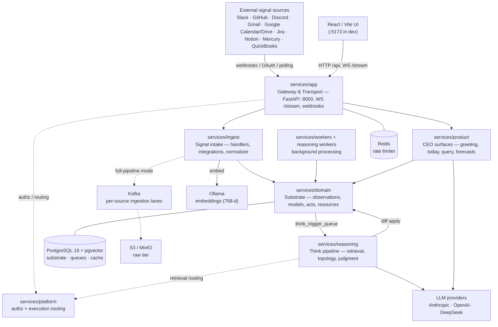

# Fyralis Core — Internal Docs

Fyralis Core (package name `company-os`, "Company OS") is an **organizational
intelligence runtime**. It ingests company signals (Slack, GitHub, email,
calendars, finance tools, …), stores them as tenant-scoped *observations*,
reasons over them into a live *model* of the organization, and renders the
result into CEO-facing product surfaces.

> **This site is for the engineering team and our AI coding agents** — it
> explains how the system is wired and why. It is **not** a public/customer API
> reference or SDK. Everything here is derived from the source tree; pages that
> require human knowledge carry a visible **TODO(human)** callout.

!!! note "How to read this site"
    - **[Architecture](architecture/index.md)** — one page per subsystem (layer),
      each with a diagram of how it's actually wired plus its responsibilities.
    - **[Services](services.md)** — the single coordination table: every service,
      what it does, and how it connects.
    - **[Glossary](glossary.md)** — the proprietary domain vocabulary.
    - **[Decisions (ADRs)](adr/README.md)** — where new architecture decisions are
      recorded.

## What the system is

A monorepo split into architectural layers under `services/`, plus a shared
lower layer `lib/`, a React/Vite UI, SQL migrations, and simulation tooling.
Operationally it runs as a FastAPI gateway, a set of background workers,
PostgreSQL + pgvector as the substrate, Ollama for embeddings, and external LLM
providers for reasoning/rendering.

The layers, ordered so higher layers depend on lower ones (signal → ingest →
domain substrate → reasoning → product surface → app transport):

| Layer | Package | Role |
|-------|---------|------|
| [App](architecture/app.md) | `services/app` | HTTP/WS entrypoints, auth, webhooks, realtime dispatch. |
| [Product](architecture/product.md) | `services/product` | CEO-facing surfaces composed from substrate + reasoning. |
| [Reasoning](architecture/reasoning.md) | `services/reasoning` | The Think pipeline, retrieval, topology, scoring. |
| [Ingest](architecture/ingest.md) | `services/ingest` | Signal intake, third-party integrations, synthetic signals. |
| [Domain](architecture/domain.md) | `services/domain` | The core persisted substrate (models, acts, resources, observations). |
| [Platform](architecture/platform.md) | `services/platform` | Cross-cutting authz + execution routing. |
| [Workers](architecture/workers.md) | `services/workers` | Background worker packages. |
| [Shared libraries](architecture/lib.md) | `lib` | Shared building blocks (db, llm, embeddings); must not import `services`. |
| [Runtime & data plane](architecture/data-plane.md) | — | Processes, containers, and data stores that host all of the above. |

## Top-level architecture



*All edges above are verified from code except those drawn dotted, which are
mode-gated or cross-cutting. The detailed, per-subsystem diagrams live on each
[architecture page](architecture/index.md).*

## The core data flow

The "signal → memory → surface" path that defines the system:

```text
source event
  → ingestion handler (normalize to ObservationDraft)
  → observations row (tenant-scoped, embedded)
  → think_trigger_queue row (T1)
  → Think: retrieval + LLM reasoning + diff validation
  → diff applied to Models / Acts / Resources
  → audit, reconciliation, cascades, post-commit queue
  → cached / rendered CEO views and UI routes
```

See [Reasoning](architecture/reasoning.md) for the Think pipeline and
[Domain](architecture/domain.md) for what the diff mutates.

## Why it's built this way

> **TODO(human):** This page derives *what* the system is from the code. The
> *why* — the product thesis (what "organizational intelligence" means for the
> business and the user), the bet behind modelling the org as a graph of
> falsifiable beliefs ("Models") rather than documents or dashboards, and what
> success looks like — is not inferable from source. Fill in a few paragraphs of
> framing here. The decision narrative for the monorepo + layering already lives
> in `CODEBASE-MANAGEMENT.md` at the repo root.

## Pointers to existing deep-dives

Some detailed internal docs predate this site and are **not** yet part of the
built MkDocs site (they link directly to source files, which MkDocs cannot
resolve). They remain in the repo and are worth reading:

- `docs/ingestion/` — end-to-end ingestion architecture and a page per source.
- `docs/github-intelligence/` — the GitHub intelligence layer (spec, API, UI).
- `docs/testing/` — comprehensive test reports.
- `CODEBASE-ARCHITECTURE.md`, `CODEBASE-MANAGEMENT.md`, `CONTRIBUTING.md` (repo root).

> **TODO(human):** Decide whether to port the `docs/ingestion/` and
> `docs/github-intelligence/` deep-dives into this site. Doing so means
> converting their ~150 links to source files into either GitHub blob links or
> prose references (MkDocs `--strict` rejects links that escape `docs/`).
