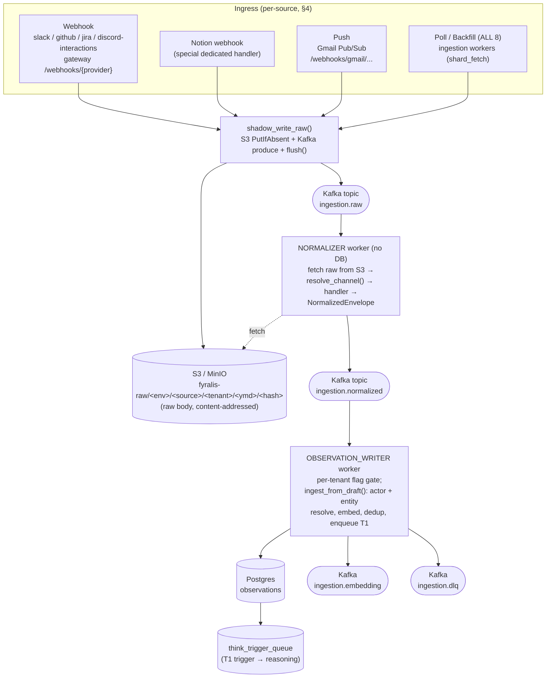
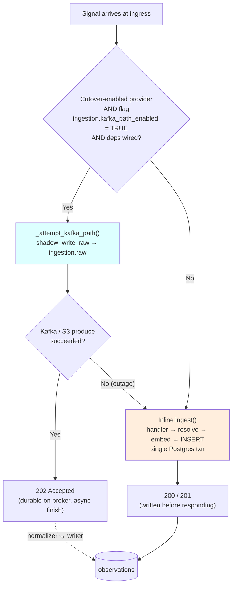
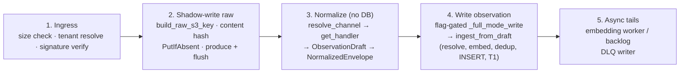
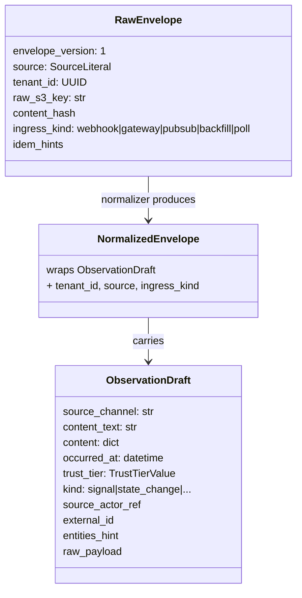
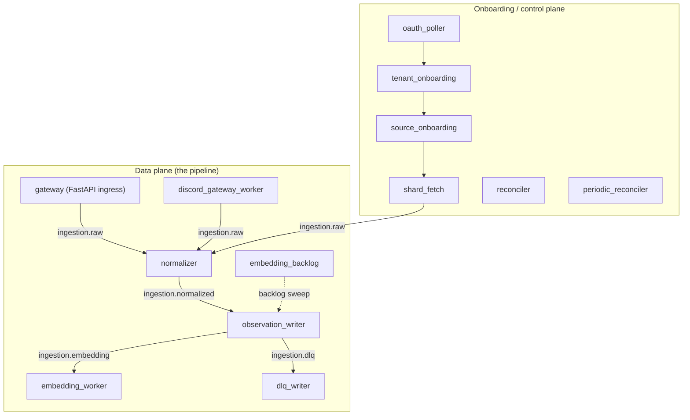
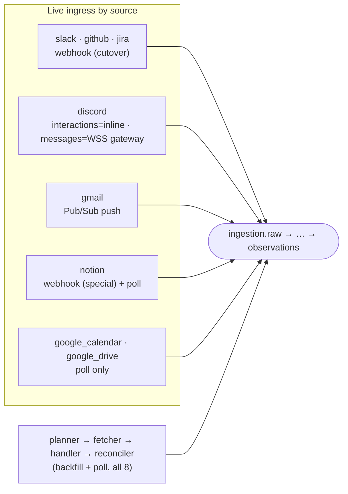
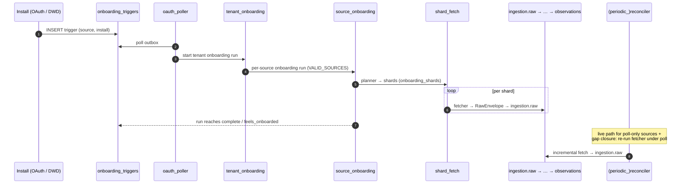
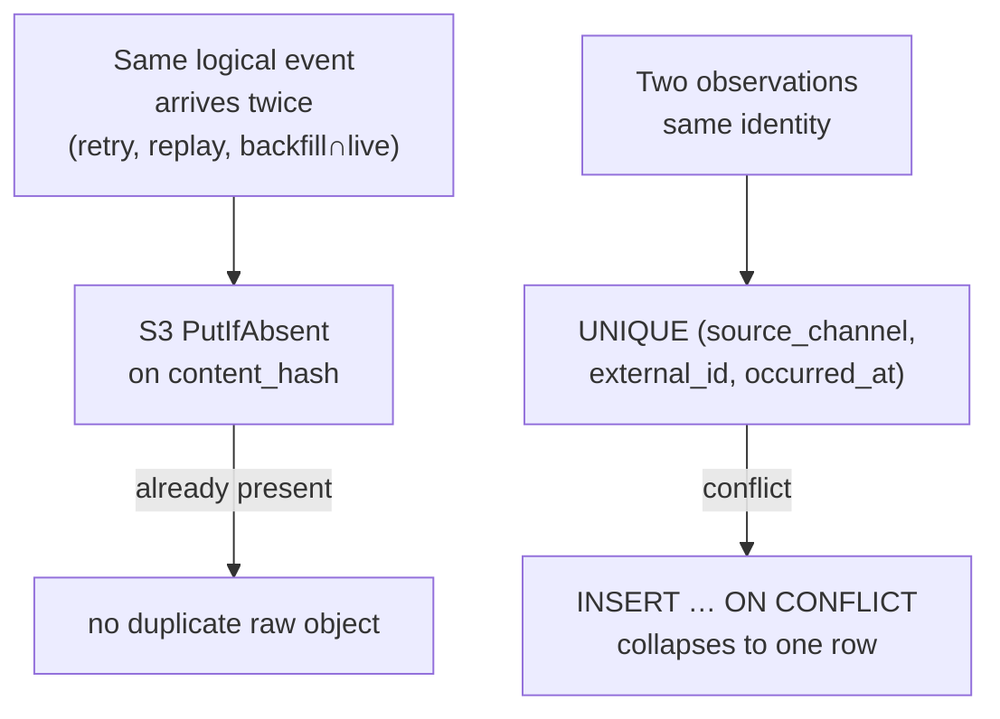

# Canonical Ingestion Architecture

> **Status:** authoritative as of branch `feature/unify-ingestion-pipeline`
> (off `integration/ingestion-hardening`), 2026-05-26.
>
> **Scope:** the 8 production signal sources — `slack`, `discord`, `notion`,
> `github`, `google_drive`, `google_calendar`, `gmail`, `jira` — and the one
> pipeline they all share.
>
> **The one-sentence model:** every source's *primary* path is the **full Kafka
> pipeline** (`source → ingestion.raw → normalizer → ingestion.normalized →
> observation_writer → observations`); synchronous in-process `ingest()` is only
> a **fallback** for Kafka-outage degradation (and one deliberate exception:
> Discord *interactions*, which need a synchronous response shape).

This document contains every diagram needed to explain how ingestion is
implemented. For an end-to-end prose overview and the source index, see
[README.md](README.md). For one integration's specifics, see
[sources/](sources/).

---

## 1. The pipeline in one diagram

The synchronous **fallback** collapses all of the above into one call:
[`services/ingestion/core.py::ingest()`](../../services/ingestion/core.py) runs
handler → resolve → embed → INSERT in a single transaction against Postgres,
with no Kafka/S3 hop.

---

## 2. The two paths, and why the full pipeline is primary

| | **Full pipeline (primary)** | **Inline `ingest()` (fallback)** |
|---|---|---|
| Trigger | flag TRUE and deps wired | flag FALSE, OR Kafka/S3 produce fails, OR direct call |
| Webhook response | `202 Accepted` | `200/201` |
| Durability | S3 PutIfAbsent + Kafka idempotent produce + `flush()` | single Postgres txn |
| Observation written by | `observation_writer` worker | the caller's process |
| Decoupling | provider ack independent of DB load; bursts absorbed by Kafka | provider ack blocks on DB |

**Why the full pipeline is canonical:** it decouples provider acknowledgement
from observation persistence, so a slow/locked Postgres or an embedding stall
never makes us drop or 5xx a provider webhook; Kafka absorbs bursts; and one
normalizer→writer chain gives a single place to apply back-pressure, retries,
and DLQ. The inline path exists for **graceful degradation**
(`_attempt_kafka_path` returns `False` → caller falls back to `ingest()`), kept
correct by **idempotency**: S3 `PutIfAbsent` on the content hash +
`observations UNIQUE (source_channel, external_id, occurred_at)` dedup mean a
fallback write and a later pipeline replay converge to the same single row.

### The gate is read in two places (both default FALSE)

Flag `ingestion.kafka_path_enabled`, 30 s TTL cache
([feature_flags/client.py](../../services/ingestion/feature_flags/client.py)):

1. **Webhook router**
   ([services/webhooks/router.py](../../services/webhooks/router.py)) — decides
   *cutover vs inline* at ingress for cutover-enabled providers.
2. **Observation writer**
   ([writers/observation_writer.py](../../services/ingestion/writers/observation_writer.py))
   — per envelope, decides *full write vs shadow-only*; a FALSE tenant's
   normalized envelopes are recorded as shadow events and **not** persisted.

> **The "0 observations despite a clean run" trap.** A fresh tenant defaults to
> FALSE, so its data-plane envelopes flow through Kafka but the writer drops them
> in shadow mode. Enable per tenant:
> `TenantFlags.set_bool(tenant, "ingestion.kafka_path_enabled", True, set_by=...)`.
> The sandbox tenant `00000000-…-0001` already has it TRUE.

---

## 3. The five pipeline stages (source-agnostic)

| Stage | Entry / file | Topic in → out | Notes |
|---|---|---|---|
| **1. Ingress** | webhook [router.py::receive](../../services/webhooks/router.py); push [gmail_pubsub.py](../../services/webhooks/gmail_pubsub.py); poll/backfill [shard_fetch.py](../../services/ingestion/workflows/shard_fetch.py) | — → `ingestion.raw` | size check, tenant resolution, signature verify |
| **2. Shadow-write raw** | [shadow_write.py::shadow_write_raw](../../services/ingestion/shadow_write.py) | — → `ingestion.raw` (+ S3) | `build_raw_s3_key`, content hash, `PutIfAbsent`, produce **+ flush** at the webhook boundary |
| **3. Normalize** | [normalizer/worker.py](../../services/ingestion/normalizer/worker.py) (`python -m services.ingestion.normalizer.worker`) | `ingestion.raw` → `ingestion.normalized` | **no DB**; fetch raw from S3 → `resolve_channel(source, ingress_kind, meta)` → `get_handler(channel)` → `ObservationDraft` → `NormalizedEnvelope` |
| **4. Write observation** | [writers/observation_writer.py](../../services/ingestion/writers/observation_writer.py) | `ingestion.normalized` → Postgres `observations` | flag-gated `_full_mode_write` → `ingest_from_draft` (actor resolve, fast-path entities, embed, dedup, INSERT, enqueue T1) |
| **5. Async tails** | [writers/embedding_worker/](../../services/ingestion/writers/embedding_worker/), [recovery/embedding_backlog/](../../services/ingestion/recovery/embedding_backlog/), [writers/dlq_writer/](../../services/ingestion/writers/dlq_writer/), [dlq/publish.py](../../services/ingestion/dlq/publish.py) | `ingestion.embedding`, `ingestion.dlq` | embeds pending rows; persists failures to `ingestion_failures` |

The **inline core** ([core.py](../../services/ingestion/core.py)) is the shared
implementation of stage-4 logic: `ingest()` (fallback entry) and the writer's
`_full_mode_write()` both converge on `ingest_from_draft()`, so the observation
produced is byte-identical regardless of path (verified by
`test_observation_writer_m5.py::test_writer_observations_match_inline_for_same_input`).

### The contract objects (what flows on each topic)

`SourceLiteral = slack | github | discord | gmail | notion | google_calendar |
google_drive | jira` and `IngressKindLiteral = webhook | gateway | pubsub |
backfill | poll`
([raw_tier/envelope.py](../../services/ingestion/raw_tier/envelope.py)).

---

## 4. The workers / process topology

All workers launch from
[docker-compose.yml](../../docker-compose.yml), one process each.

The control plane drives **onboarding & backfill** (see §6); the data plane is
the live pipeline. `reconciler` / `periodic_reconciler` re-run fetchers to close
gaps and to provide the *live* path for poll-only sources (Notion, Calendar,
Drive).

---

## 5. Per-source landing — how each of the 8 reaches `observations`

Every source has a **planner → fetcher → handler → reconciler** quartet
([services/ingestion/{planners,fetchers,handlers,reconcilers}/&lt;source&gt;.py](../../services/ingestion/))
for the poll/backfill path, plus its source-specific ingress.
**Backfill/poll always feeds the full pipeline**: `shard_fetch` writes the raw
body to S3 and produces a `RawEnvelope` to `ingestion.raw` exactly like a
webhook — it never calls inline `ingest()`.

### Cutover-enabled webhook sources

In `_CUTOVER_ENABLED_PROVIDERS` ([router.py](../../services/webhooks/router.py)).
Flag TRUE → router calls `_attempt_kafka_path` → `202`; flag FALSE or Kafka down
→ inline `ingest()`.

- **[slack](sources/slack.md)** — webhook `/webhooks/slack` → `slack:message`; backfill enumerates channels → history.
- **[github](sources/github.md)** — webhook `/webhooks/github` → `github:webhook` (App installation events handled separately first); backfill per accessible repo.
- **[jira](sources/jira.md)** — webhook `/webhooks/jira/events` (HMAC `X-Hub-Signature`, GitHub-style) → `jira:issue`; backfill via `POST /rest/api/3/search/jql` (classic `/search` is HTTP 410 since 2025). Live tenant resolution reuses the generic `provider_installations` edge; backfill uses dedicated `jira_*` tables.

### Special webhook source

- **[notion](sources/notion.md)** — webhook `/webhooks/notion/...` **always** routes to the full pipeline via a dedicated handler that fetches the full page and calls `shadow_write_raw()` directly (using the `app.state.notion_data_plane` alias, which points at the *same* producer/S3 instances). There is **no** inline path and **no** `_PROVIDER_CHANNEL` entry for Notion — the handler short-circuits the router before the inline block. Channel `notion:object`; a DB row with a status property → `kind=state_change`. The "live" path is a **poll** via `periodic_reconciler` (`NOTION_POLL_INTERVAL_SECONDS`).

### Push (Pub/Sub) source

- **[gmail](sources/gmail.md)** — Google Pub/Sub push hits the dedicated endpoint [gmail_pubsub.py](../../services/webhooks/gmail_pubsub.py) (NOT the generic router), which publishes to `ingestion.raw` via the canonical `app.state.kafka_producer`/`s3_raw_client` (with `flush()`). Channel `gmail:`, `ingress_kind="pubsub"`. Backfill/poll via the History API (`ingress_kind="poll"`).

### Poll/backfill-only sources (no webhook)

- **[google_calendar](sources/google-calendar.md)** — **no push/webhook**. Planner enumerates calendars → fetcher pulls events (incremental via `nextSyncToken`) → `google_calendar:event`. Mutable entities use a versioned `external_id` (`gcal:{cal}:{event}:{status}:{start}`).
- **[google_drive](sources/google-drive.md)** — **no push/webhook**. Planner enumerates My Drive + Shared Drives → fetcher pulls file activity + **content extraction** (Docs/Sheets/Slides/PDF→text) + comments + revisions → all on channel `google_drive:file`, distinguished by `content.object_type` + `external_id` namespace. Incremental via the Changes-API start-page-token captured at backfill **start**. Versioned `external_id` `gdrive:{file_id}:{version}`.

### The one intentional inline exception

- **[discord](sources/discord.md)** has three surfaces:
  - **interactions** (slash commands, webhook type-2) → `discord:interaction`. **Stays inline by design** — Discord requires a specific synchronous response body (`CHANNEL_MESSAGE_WITH_SOURCE`), which the async `202` cutover contract cannot satisfy. *Not* in `_CUTOVER_ENABLED_PROVIDERS`.
  - **gateway messages** (live `MESSAGE_CREATE` over the bot WSS) → `discord_gateway_worker` builds a `RawEnvelope` → full pipeline → `discord:message`.
  - **backfill** (channel-window sampling) → full pipeline → `discord:message`.

### Source / channel quick reference

| Source | Webhook→pipeline | Push | Poll/backfill→pipeline | Primary channel(s) | Inline-only? |
|---|---|---|---|---|---|
| slack | ✅ cutover | — | ✅ | `slack:message` | no |
| github | ✅ cutover | — | ✅ | `github:webhook` | no |
| jira | ✅ cutover | — | ✅ | `jira:issue` | no |
| notion | ✅ always (special handler) | — | ✅ (poll) | `notion:object` | no |
| gmail | — | ✅ Pub/Sub | ✅ | `gmail:` | no |
| google_calendar | — | — | ✅ | `google_calendar:event` | no |
| google_drive | — | — | ✅ | `google_drive:file` (+comment/revision) | no |
| discord | interactions inline (by design) | — | ✅ messages | `discord:message`, `discord:interaction` | interactions only |

### Channel → trust tier ([handlers/__init__.py](../../services/ingestion/handlers/__init__.py) `CHANNEL_TRUST_MAP`)

| Channel | Trust tier |
|---|---|
| `slack:message`, `gmail:`, `discord:message`, `discord:interaction` | `attested_agent` |
| `github:webhook`, `jira:issue`, `google_calendar:event`, `google_drive:file` | `authoritative` |

---

## 6. Onboarding & backfill (the control plane)

When an install lands (OAuth callback / DWD provision), an `onboarding_triggers`
row is written. That fans out through the control-plane workers into shard-level
fetches that feed the same pipeline.

State tables: `onboarding_runs`, `source_onboarding_runs`, `onboarding_shards`,
`onboarding_triggers` (outbox), `workflow_states`/`signals`. The reconciler
probes live high-water vs cursor and re-runs the fetcher to close gaps; for
poll-only sources it *is* the live path.

---

## 7. Idempotency & dedup (why replays are safe)

- **Raw tier**: S3 `PutIfAbsent` keyed on the content hash → identical bodies
  store once.
- **Observation tier**: `UNIQUE (source_channel, external_id, occurred_at)` →
  backfill twins, poll twins, and a fallback-then-replay converge to one row.
- **Mutable entities** (calendar events, Drive files, Notion DB rows) embed a
  *version* in `external_id` so a genuine change lands a new observation while
  identical re-fetches dedup. See each source file's "Dedup / external_id"
  section.

---

## The source registry (every place a source must be allow-listed)

Adding/keeping a source on the pipeline means it must appear in **all** of these
(missing any one silently drops the source — usually a `normalizer_parse_error`
DLQ or a never-started run). All 8 are currently present in all of them:

- [raw_tier/envelope.py](../../services/ingestion/raw_tier/envelope.py) — `SourceLiteral` + `IngressKindLiteral`
- [raw_tier/s3.py](../../services/ingestion/raw_tier/s3.py) `build_raw_s3_key` — source guard
- [normalizer/invariants.py](../../services/ingestion/normalizer/invariants.py) `_S3_KEY_RE` — source alternation
- [core.py](../../services/ingestion/core.py) — embedding gate
- [progress/events.py](../../services/ingestion/progress/events.py) — `Source` Literal
- [dlq/publish.py](../../services/ingestion/dlq/publish.py) — `_VALID_SOURCES`
- [workflows/tenant_onboarding.py](../../services/ingestion/workflows/tenant_onboarding.py) — `VALID_SOURCES` + `_LOAD_ACTIVE_SOURCES_SQL` `provider IN (...)`
- [workflows/source_onboarding.py](../../services/ingestion/workflows/source_onboarding.py) — `VALID_SOURCES` + install-load SQL
- [workflows/shard_fetch.py](../../services/ingestion/workflows/shard_fetch.py) — install-load SQL
- [handlers/__init__.py](../../services/ingestion/handlers/__init__.py) — handler import (runs `@register`); trust tier via `CHANNEL_TRUST_MAP` entry **or** the handler's own `setdefault` at import (gcal/drive/jira/notion)
- DB migrations — the four M6 source `CHECK` constraints (the newest migration must carry forward every prior source; see [0062_jira.sql](../../db/migrations/0062_jira.sql))
- Webhook-only sources also need: [router.py](../../services/webhooks/router.py) maps (`_PROVIDER_TO_SHADOW_SOURCE`, `_CUTOVER_ENABLED_PROVIDERS`, `_PROVIDER_CHANNEL`) + a `tenant_resolver` extractor + a `signatures/<provider>.py` verifier

> **Migration landmine.** The newest source (added after the last widening
> migration) poisons the prior widening migration's test re-run against a
> populated DB; integration tests must clean up. The four M6 source CHECKs are
> on `onboarding_shards`, `ingestion_failures`, `onboarding_triggers`,
> `source_onboarding_runs`.

---

## Non-pipeline handlers (kept, but NOT among the 8 sources)

Registered handlers that are **not** production ingestion sources — kept because
they have live callers/tests, but with **no** planner/fetcher/reconciler and not
in the source registry:

- [handlers/email.py](../../services/ingestion/handlers/email.py) (`email:inbound`) and [handlers/calendar.py](../../services/ingestion/handlers/calendar.py) (`calendar:sync`) — imported only by [services/demo/simulator.py](../../services/demo/simulator.py) (demo UI routes friendly payloads through inline `ingest()`). Superseded for real ingestion by `gmail` / `google_calendar`.
- [handlers/linear.py](../../services/ingestion/handlers/linear.py) (`linear:webhook`) and [handlers/stripe.py](../../services/ingestion/handlers/stripe.py) (`stripe:webhook`) — registered handlers with signature verifiers + tests, but no source-registry/quartet wiring; not reachable via the production webhook router. Legacy/forward-looking.
- [handlers/system.py](../../services/ingestion/handlers/system.py) (`internal:*`) — system-originated observations (state_change / anomaly / prediction_resolution), not external ingress.

---

## Proving it — the sandbox

The real-API sandbox ([docker-compose.sandbox.yml](../../docker-compose.sandbox.yml)
+ `.env.sandbox`) stands the whole pipeline up locally under **prod guards**
(`FYRALIS_ENV=prod`: real signature verification, real OAuth) and exercises the
**real** Slack / GitHub / Discord / Notion / Jira APIs (the Google suite is out
of scope there — it needs GCP domain-wide delegation). ngrok tunnels provider
webhooks to the local gateway; the Discord live path is the bot WSS (no public
URL).

Validation oracle: [scripts/sandbox_inspect.py](../../scripts/sandbox_inspect.py)
— pass when, per source, there is an enabled install, an `install` onboarding
trigger, runs reaching `complete`/`feels_onboarded`, observations on the right
`source_channel`, per-channel `total == distinct_external_id` (cross-path dedup
holds), embeddings draining, and an empty `ingestion_failures`. The raw tier in
MinIO (`fyralis-raw/dev/<source>/...`) is the durable evidence each source
produced to `ingestion.raw`.
