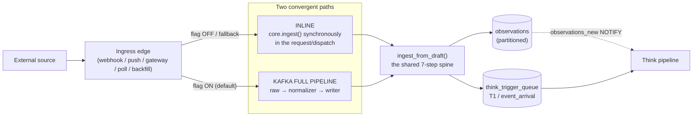
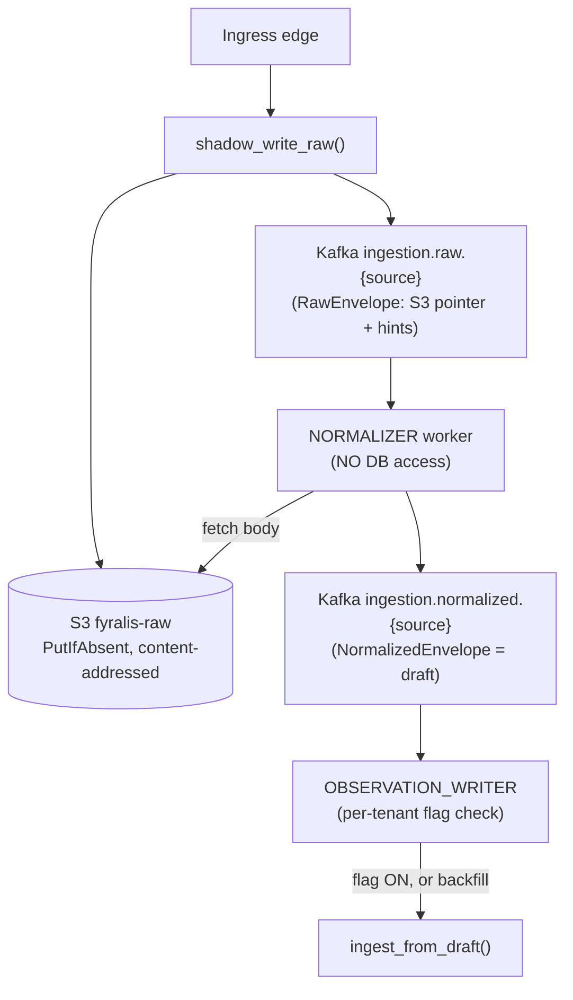
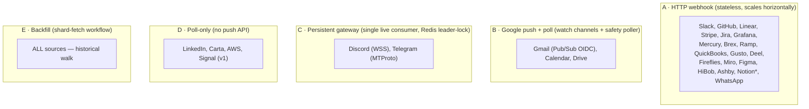
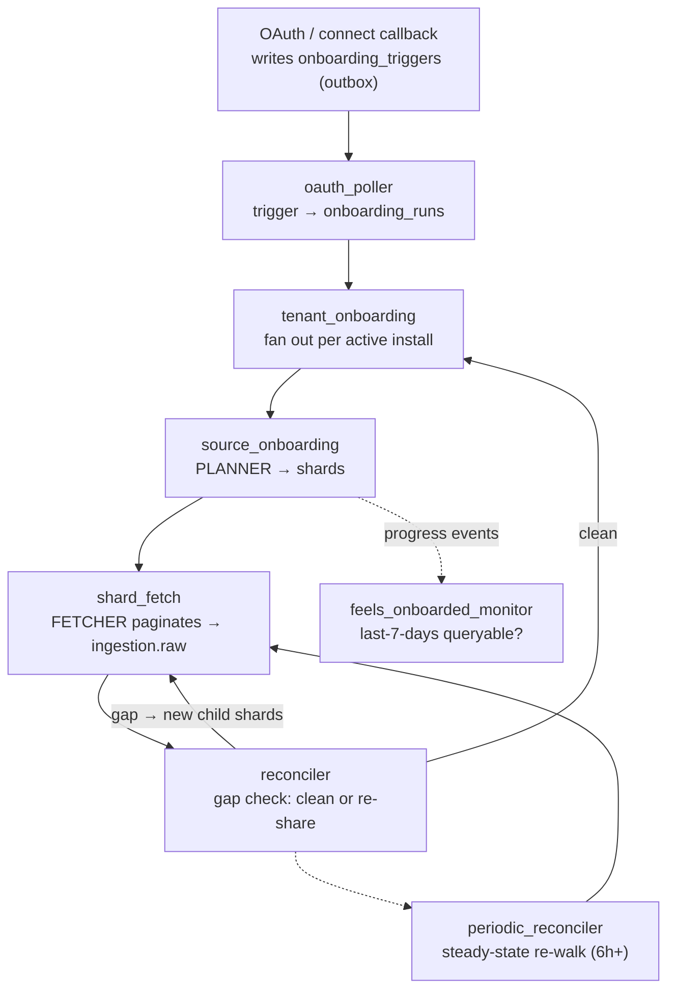

# Ingestion Flow & Architecture — The Whole Picture

> **Why this doc exists.** It is a single, end-to-end mental model of how *every*
> external signal becomes a queryable `observation` in Fyralis — the runtime
> paths, the ingress edges, the backfill lifecycle, the enrichment, and the data
> plane it all runs on. It is written so that after one read you can *visualize
> the flow as a whole* and reason about where to optimize. The last section
> ([§9 The optimization surface](#9-the-optimization-surface)) is the payoff: a
> catalogued list of bottlenecks and candidate system changes, grounded in the
> code.
>
> It synthesizes the per-layer page ([architecture/ingest.md](../architecture/ingest.md)),
> the per-source deep dives ([flows/](flows/)), and a fresh read of the code on
> `main`. Where the code and older docs disagree, this doc follows the code and
> says so. Inferences are labelled **(inferred)**.

---

## 1. The 60-second mental model

Fyralis ingestion has **one job**: turn any external company signal (a Slack
message, a GitHub PR, a Mercury transaction, a Gmail thread, …) into a
tenant-scoped, deduplicated **`observation`** row, and then poke the reasoning
("Think") pipeline that something new arrived.

Everything in ingestion is a variation on four moves:

1. **Arrive** — a signal hits an *ingress edge* (HTTP webhook, Google push,
   persistent gateway socket, a poll loop, or a backfill fetch).
2. **Normalize** — a per-channel *handler* turns the raw payload into a uniform
   `ObservationDraft`.
3. **Resolve & persist** — the shared `ingest_from_draft()` spine resolves the
   actor + entities, computes an embedding, and inserts a deduped `observation`.
4. **Hand off** — it enqueues a `T1` *event-arrival* trigger and fires a
   `observations_new` NOTIFY. Ingestion's job ends here; Think takes over.

The twist that shapes the whole architecture: **there are two physical paths
that do moves 2–4**, and they converge on the exact same code.

The **Kafka full pipeline is the default**; **inline is the fallback and the
kill-switch**. Which one a given event takes is decided per-tenant by one flag
(`ingestion.kafka_path_enabled`) plus a circuit breaker. Both paths produce a
*byte-identical* observation because they share `ingest_from_draft()`. Hold onto
that single fact — most of the design follows from it.

---

## 2. The two convergent runtime paths

This is the central architectural decision (see [ADR-0001](../adr/0001-kafka-first-ingestion-default.md)).

### 2.1 Inline path

`core.ingest()` is called **synchronously** in the caller's request or dispatch
loop. Callers:

- the gateway **webhook router** (`services/app/webhooks/router.py`),
- the **Slack / finance** debug routers,
- the **Discord / Telegram / Signal** gateway dispatchers (fallback),
- the **Gmail** Pub/Sub push handler (fallback),
- the **poll loops** (LinkedIn, Carta, AWS, …),
- the **synthetic injector** (`services/ingest/synthetic/core.py`).

When `ingest()` returns, the observation is already in Postgres and the `T1`
trigger is enqueued. The HTTP edge answers **200/201**. Simple, strongly
consistent, and **everything happens in the request path** — including the
Ollama embedding call, which is the dominant latency (see §9).

### 2.2 Kafka full pipeline path

The edge does **not** persist. Instead it `shadow_write_raw()`s the raw body and
returns **202 Accepted**, and three decoupled stages finish the work
asynchronously:

- **`shadow_write_raw()`** (`ingestion/shadow_write.py`) hashes the body
  (blake2b), `PutIfAbsent`s it to S3 (so a re-delivery is a free no-op), wraps a
  `RawEnvelope` (S3 key + content hash + `ingress_kind` + `idem_hints`) and
  publishes to the **per-source** topic `ingestion.raw.{source}`. The request
  flush is bounded by `CUTOVER_FLUSH_TIMEOUT_SEC` (default 2.0s): if the broker
  is slow, the edge gives up and falls back to inline rather than hanging.
- **Normalizer** (`ingestion/normalizer/worker.py`) is **deliberately
  DB-free** (enforced by a test). It consumes `raw`, fetches the body from S3,
  runs the same channel handler, and republishes a `NormalizedEnvelope` (a
  serialized `ObservationDraft` + provenance) to `ingestion.normalized.{source}`.
- **Observation writer** (`ingestion/writers/observation_writer.py`) consumes
  `normalized` and calls `ingest_from_draft()` — the same spine the inline path
  uses. It is where the per-tenant path decision is *actually enforced* for live
  traffic (below).

> **Same envelope, both stages are envelopes.** `RawEnvelope` carries a *pointer*
> (the body lives in S3, keeping Kafka messages ~1–4 KB); `NormalizedEnvelope`
> carries the *fully-shaped draft* so the writer never re-fetches or re-parses.

### 2.3 The path selector — one flag, one helper, one breaker

| Mechanism | Where | Behaviour |
|---|---|---|
| **`ingestion.kafka_path_enabled`** flag | `feature_flags/client.py`, `tenant_flags` table | **Default ON** (a *missing* row = kafka-first). Explicit `FALSE` = forced inline. Read through one helper `TenantFlags.kafka_path_enabled()` (30s cache TTL) by **both** the ingress edge and the writer, so they cannot drift. |
| **Backfill exemption** | writer | A `backfill` envelope is **always** written full-mode regardless of the flag — `shard_fetch` advances its cursor *after* publishing to Kafka, so a flag=FALSE drop would silently lose history. Backfill is single-path. |
| **Cutover circuit breaker** | `feature_flags/circuit_breaker.py` (own process) | Every 60s it measures committed-offset **lag-in-seconds** on each `ingestion.raw.{source}` lane and samples active tenants from the 1% `ingestion.tenant_traffic_signal` topic. Lag > 60s for 5 consecutive ticks (~5 min) flips that tenant's flag to FALSE (`set_by=auto:circuit_breaker`) and alerts. **Recovery is operator-driven** (`scripts/reenable_kafka_path.py`) — no auto-recovery, to avoid flapping during an incident. |

So the live-traffic decision is: *kafka-first unless this tenant was explicitly
killed or auto-tripped; backfill always goes through Kafka; if the broker is
slow at request time, degrade to inline for that one event.*

---

## 3. The shared spine — the 7-step ingest core

Both paths converge on `ingest_from_draft()` in
[ingestion/core.py](../../services/ingest/ingestion/core.py). This is the single
most important function in ingestion. The steps:

| # | Step | What happens | On miss / failure |
|---|------|--------------|-------------------|
| 1 | **Handler extract** | `get_handler(channel)` → `ObservationDraft` (`content_text`, `content`, `source_actor_ref`, `external_id`, `occurred_at`, `trust_tier`, `kind`, `entities_hint`). | `HandlerNotFound` / `ValidationError` → DLQ (kafka) or 4xx (inline). |
| 1.5 | **Enricher seam** | `run_enrichers(channel, draft)` — channel-keyed plugins may augment `draft.content` in place. Discovered via the `company_os.draft_enrichers` entry-point group; gated per-tenant by `access.enricher_allowed`. **(This is where github_intel/code_intel now plug in — see §5.4.)** | Any enricher error is **swallowed**; the raw draft still persists. |
| 2 | **Pre-assign id** | `obs_id = uuid7()` (time-ordered). | — |
| 3 | **Resolve actor** | `ActorRepo.resolve_by_source_actor_ref("{channel}:{ref}")` → `actor_id`. **1 DB round-trip.** | miss → `content["_unresolved_actor_ref"]`, `actor_id=NULL`, **and ingestion opens a best-effort `actor_identity` clarification request** (human-in-the-loop, via `services/domain/clarifications`; try/except so it never blocks). Still no *automated* async actor resolver (contrast the LLM entity_resolver). |
| 4 | **Resolve entities** | Extract 1/2/3-gram phrases from `content_text` → `EntityAliasRepo.fast_path_resolve_many()` (one batched indexed lookup, **exact** match only). | unresolved phrases → `content["_unresolved_phrases"]`, picked up async by the **entity_resolver worker** (LISTENs on `observations_new`, LLM-resolves). |
| 5 | **Embed** | Ollama `embed(content_text)` → 768-d vector (`nomic-embed-text`). **Synchronous network+inference call, ~100–500ms — the dominant latency.** | failure / no embedder → `embedding_pending=TRUE`; an async **embedding worker** (Kafka `ingestion.embedding.{source}`) + a **backlog drainer** (scans `embedding_pending=TRUE`) fill it in later. |
| 6 | **Insert observation** | In one transaction: advisory-lock the dedup key, `ObservationRepository.insert()`. **Dedup key = `(source_channel, external_id, occurred_at)`.** If the monthly partition is missing → self-heal (create it, retry once) within a guardrail window. | dedup hit → return early, **no trigger enqueued**. Out-of-guardrail `occurred_at` → DLQ as corrupt. |
| 7 | **Enqueue T1** | `enqueue_think_trigger(kind="T1", subkind="event_arrival", observation_id, payload={source_channel, kind, trust_tier, seed_occurred_at, seed_natural_text[:2000], scope_actors})` into `think_trigger_queue`. Post-commit, fire `observations_new` NOTIFY. | only when not deduped. |

Key properties:

- **Idempotency is structural.** Every source's `external_id` is built by the
  *central* constructors in
  [ingestion/idempotency/__init__.py](../../services/ingest/ingestion/idempotency/__init__.py),
  so the *same* upstream object produces the *same* dedup key whether it arrived
  via webhook, gateway, poll, or backfill. An object that is both backfilled and
  delivered live collapses into **one** observation. Mutable resources use
  *versioned* keys (e.g. `jira:site:issue:id:updated_at`) so each state change is
  a new observation; immutable ones use stable keys.
- **Misses are not failures.** Unresolved actor/entity/embedding are recorded on
  the row and reconciled by async workers. Ingestion never blocks on them.

---

## 4. Ingress edges — how data physically arrives

The canonical source list is `RawEnvelope.SourceLiteral` — **26 sources** — and
there are **5 ingress kinds**: `webhook`, `gateway`, `pubsub`, `backfill`,
`poll`. A source typically supports several. The handler registry
(`ingestion/handlers/__init__.py`) maps a `channel` (e.g. `slack:message`) to a
handler and to a **trust tier**.

### 4.1 The five edge patterns

- **A · HTTP webhook** — `services/app/webhooks/router.py`. Capture raw body →
  1 MB precheck → **signature verify** (`VERIFIERS[provider]`: HMAC-SHA256 for
  most, ed25519 for Discord, OIDC-JWT for Gmail Pub/Sub) → resolve tenant from
  `provider_installations` → handler → (cutover decision) inline *or*
  `shadow_write_raw`. Notable special cases: **QuickBooks** fans one delivery out
  per `realmId` to multiple tenants; **Notion** sends a *thin* event (id + type
  only) so the edge **fetches the full page back** then shadow-writes it (no
  inline handler). **WhatsApp** (source #26) follows the same webhook shape on
  its own `whatsapp_router.py` — Meta `X-Hub-Signature-256`, one raw envelope per
  message/status item — and is **webhook-live only today** (its backfill
  planner/fetcher/reconciler are registered but stubbed, ticket IN-WHATSAPP-BACKFILL).
- **B · Google push + poll** — `_google_watch.py` registers `watch()` channels
  (7-day TTL, renewed 24h early); Google pings `/webhooks/google_*/push` with a
  channel token (constant-time verified); both push and a **liveness poller**
  drain through the *same* fetcher, deduping at the unique constraint. Gmail uses
  Pub/Sub (OIDC-signed) for push and a history poller as the gap-filler.
- **C · Persistent gateway** — Discord (WSS) and Telegram (MTProto) hold a
  *single* live connection per credential. A Redis **leader lease**
  (`gateway:{src}:leader_lock`) guarantees exactly one consumer — two replicas
  would double-deliver every frame. `REDIS_URL` is **mandatory** for these
  (missing → fail loud). They persist session cursors for crash-RESUME and
  advance native update-state for gap recovery.
- **D · Poll-only** — interval loops that re-list changed resources and run the
  same cutover (`shadow_write_raw` with `ingress_kind="poll"`, else inline).
- **E · Backfill** — every source's historical walk, driven by the onboarding
  workflow chain (§5).

### 4.2 Trust tiers

`CHANNEL_TRUST_MAP` assigns each channel a tier:
`authoritative` › `authoritative_external` › `attested_agent` › `reputable` ›
`inferential_external` › `unvetted`. First-party systems of record (Slack,
GitHub, Jira, finance) are `authoritative`; chat is `attested_agent`; scraped/
social is lower. *The rationale for the ordering is undocumented* — see the
TODO in [architecture/ingest.md](../architecture/ingest.md).

> **Maturity note.** Channels like `news:*`, `social:twitter`, `market:api`,
> `regulatory:api`, `analyst:report`, `journal:ui` are registered but not wired
> into a live ingress edge — treat them as scaffolding, not production sources.
> Signal is handler+backfill only (gateway is a v1 stub, poll-only).

---

## 5. Historical backfill & onboarding — the workflow chain

When a tenant installs a source, ingestion must walk its *history*, not just
catch new events. This is a chain of **7 long-running workflow services**
(`ingestion/workflows/*.py`), each a poll-loop that **claims work via
`UPDATE`/`SKIP LOCKED`**, does one transactional step, and emits a **signal** to
the next service's inbox (`workflow_signals` table). No service calls another
directly — they hand off through durable rows, so any service can crash and
resume.

| Service | Trigger | Core move | Writes |
|---|---|---|---|
| **oauth_poller** | unconsumed `onboarding_triggers` | claim trigger → create `onboarding_runs` (pending) | signal → tenant_onboarding |
| **tenant_onboarding** | `onboarding_run_created` | enumerate **active installs at tick-time** (overrides the trigger snapshot), one `source_onboarding_runs` row per source, set `kafka_path_enabled=TRUE`, mark `running` | signals → source_onboarding (per source); progress: `tenant.onboarding.started` |
| **source_onboarding** | `source_onboarding_requested` | run the **planner** → a list of `Shard`s (e.g. GitHub: one per `(repo, event_type)`); insert `onboarding_shards` | signals → shard_fetch (per shard); progress: `source.onboarding.started` |
| **shard_fetch** | `shard_fetch_requested` | the heavy lifter — claim shard, run the **fetcher** in a long fetch loop, rate-limited; publish each page to `ingestion.raw.{source}` | cursor in `workflow_states`; progress: `shard.fetched` |
| **reconciler** | `source_shards_completed` | per-source **gap algorithm**: clean → complete; gap → create child shards (`parent_shard_id`) and re-share | signals → tenant_onboarding (clean) or shard_fetch (re-share); progress: `source.onboarding.complete` |
| **periodic_reconciler** | schedule (≥6h old, every 5min tick) | re-run the gap algorithm on already-reconciled runs to catch drift (this is how **poll/no-push sources stay fresh**) | re-shares via shard_fetch |
| **feels_onboarded_monitor** | poll active runs | "is the last 7 days queryable?" (`count(*)` of recent observations per source) → fire `feels_onboarded`; or `behind_schedule` (ops-only) | claim slots on `onboarding_runs` |

### 5.1 The shard / work-stack model

- A source's backfill is decomposed into **shards** (`onboarding_shards`): a
  `(shard_kind, shard_identifier JSONB, window)` with a `recency_score`
  (`exp(-age_days/7)`) so recent data is fetched first. State machine:
  `pending → in_progress → done | failed | reconciliation_resharded`.
- **The cursor lives in `workflow_states.state_data["cursor"]`, not on the shard
  row** (load-bearing). `shard_fetch` only advances the cursor *after* the page's
  Kafka publish flushes successfully (the "N1 invariant") — so a crash mid-shard
  re-fetches the last page (at-least-once), never skips it.
- **Crash recovery** is an *orphan scan*: a shard stuck `in_progress` past its
  lease timeout (30s) is re-claimed by any worker.

### 5.2 Rate limiting the fetch loop

Before *every* page fetch, `shard_fetch` acquires a token from a Redis Lua
token-bucket keyed `rate:{tenant}:{source}:{method}`
(`ingestion/rate_limit/`). Budgets live in `BUCKET_DEFAULTS` (Slack tiers,
GitHub, Gmail, Discord); unbudgeted sources pass through. If the wait would
exceed `max_wait` (30s) the shard exits cleanly and resumes next tick.

### 5.3 Progress events

The chain emits 7 `onboarding.progress` Kafka events (partitioned by tenant for
ordering) that the Bridge/UI consumes:
`tenant.onboarding.started` → `source.onboarding.started` → `shard.fetched` →
`source.onboarding.complete` → `source.onboarding.feels_onboarded` →
`tenant.onboarding.complete` (+ ops-only `behind_schedule`). They are published
post-commit and Bridge dedups them, so a dropped event is non-fatal.

### 5.4 Enrichment & the downstream handoff

After the 7-step spine writes a row, three things finish the picture:

- **Async resolvers.** The **entity_resolver** worker LISTENs on
  `observations_new`, LLM-resolves `_unresolved_phrases` (confidence > 0.8 →
  insert alias + append to `entities_mentioned`; 0.5–0.8 → review queue; else
  drop). The **embedding** worker/backlog drainer fills `embedding_pending` rows.
  On an unresolved actor, ingestion now also opens a best-effort
  **`actor_identity` clarification request** (a human-in-the-loop question —
  *map to existing actor / new internal / new external / not an actor*,
  prioritized by the ref shape) via `services/domain/clarifications`. There is
  still no *automated* async actor resolver mirroring the entity_resolver
  **(inferred)**.
- **The enricher seam (step 1.5).** Previously `github_intel` (PR/CI/branch/issue
  FSMs, causal context) and `code_intel` (commit-SHA code graph + "blast radius"
  RAG) ran *inline and hardcoded* for `github:webhook`. **They have now been
  extracted out of this repo** (the `services/ingest/github_intel`,
  `services/github_intel`, and `services/ingest/code_intel` dirs hold only stale
  `__pycache__`). Core now exposes a generalized, capability-gated entry-point
  seam (`ingestion/enrichers.py`); the intelligence layers plug in as
  *extensions* (see [ADR-0004](../adr/0004-interface-extension-platform.md) and
  §8). This is the biggest
  recent architectural change and supersedes the "inline github_intel"
  description in older docs.
- **The handoff to Think is deliberately thin.** Ingestion does **not** call
  reasoning. It enqueues a `T1`/`event_arrival` row in `think_trigger_queue` and
  fires the `observations_new` NOTIFY. The Think worker pulls from the queue.
  This is the clean seam between the two subsystems.

---

## 6. The data plane it runs on

| Substrate | Role in ingestion | Key facts |
|---|---|---|
| **Kafka** | the async backbone | **5 per-source stages** (`raw`, `normalized`, `embedding`, `summarization`, `dlq`) × **26 sources = 130 data-plane topics**, all derived from one module (`kafka/topics.py`) so they can't drift. Plus control-plane topics (`tenant_traffic_signal`, `onboarding.progress`) and extension egress (`ext.egress.v1`). Default 12 partitions, zstd, 7-day retention, **auto-create disabled**. Per-source lanes exist so one source's lag can't head-of-line-block another. |
| **S3** (`fyralis-raw`) | raw-body tier | Content-addressed (`{env}/{source}/{tenant}/{ym}/{hash}.zst`), `PutIfAbsent` → re-deliveries are free no-ops. Keeps Kafka messages tiny (pointers). |
| **Redis** | locks + limits + cache | Gateway **leader leases** (mandatory for Discord/Telegram), fetch **rate-limit** buckets (optional), feature-**flag cache** (30s TTL). |
| **Postgres** | the substrate of record | `observations` (range-partitioned by `occurred_at`, monthly, self-healing), `actors`/`actor_identity_mappings`, `entity_aliases`, the onboarding tables (`onboarding_runs/_shards/_triggers`, `source_onboarding_runs`, `workflow_signals/_states`), `tenant_flags`, `circuit_breaker_state`, `provider_installations` + ~20 per-source install tables, `encrypted_secrets` (envelope-encrypted secret store), `think_trigger_queue`. RLS by tenant on the tenant-scoped tables. |
| **Ollama** | embeddings | Single endpoint, `nomic-embed-text`, 768-d. Used by the inline spine, the embedding worker, the backlog drainer (and, in the planned large-object pipeline, the chunk-embedder). |

**Deployment topology** (`docker-compose.yml`): ingestion alone is **~30
long-running processes** — 1 gateway, 7 onboarding workflow services, the
normalizer + observation_writer + dlq_writer + embedding_worker +
embedding_backlog + summarization workers, the circuit breaker, and ~9 live
gateways/pollers/watch-schedulers. `docker-compose.per-source.yml` can split the
data-plane workers per source for isolation, multiplying that count.

---

## 7. End-to-end trace — follow two events

**A live Slack message (kafka-first tenant):**

1. Slack POSTs `/webhooks/slack`. Router verifies the v0 HMAC, resolves the
   tenant from `provider_installations`, reads `kafka_path_enabled` (ON).
2. `shadow_write_raw()`: blake2b hash → S3 `PutIfAbsent` → `RawEnvelope` →
   `ingestion.raw.slack` → flush (≤2s). Router returns **202**.
3. Normalizer consumes the envelope, fetches the body from S3, runs the
   `slack:message` handler → `NormalizedEnvelope` → `ingestion.normalized.slack`.
4. Writer consumes it, re-checks `kafka_path_enabled` (still ON) → calls
   `ingest_from_draft()`: resolve actor, resolve entities, embed (or mark
   pending), insert deduped on `slack:channel:ts`, enqueue `T1`, NOTIFY.
5. Think wakes on the trigger. Meanwhile the entity_resolver may LLM-resolve any
   unresolved phrases off the NOTIFY.

**A GitHub backfill shard:**

1. Install → `onboarding_triggers` → `oauth_poller` → `onboarding_runs` →
   `tenant_onboarding` fans out a `source_onboarding_runs` row for `github`.
2. `source_onboarding` runs the GitHub planner → ~one shard per
   `(repo, event_type)` → `onboarding_shards` + a `shard_fetch_requested` signal
   each.
3. `shard_fetch` claims a shard, and **per page**: rate-limit token → fetcher
   pulls a page from the GitHub API → each record → S3 + `ingestion.raw.github`
   → flush → advance cursor. Backfill envelopes are **always** written full-mode
   by the writer (flag-exempt), so they flow `raw → normalizer → writer →
   observations` exactly like live traffic and **dedup against any live events**
   via the shared `external_id`.
4. When all shards finish, `reconciler` runs the gap algorithm — clean →
   `source.onboarding.complete`; gap → child shards re-fetch. `periodic_reconciler`
   keeps re-checking later.

---

## 8. In-flight directions (already designed)

Two specs that landed recently are directly relevant to "how could this be
better" — they're partly the answer:

- **Large-object pipeline** (`specs/large-object-pipeline/`, [ADR-0005](../adr/0005-large-object-pipeline.md)). Today inline
  handlers cap payloads (Drive 10 MB, Slack blocks 64 KB, PDF 50 pages) and the
  gateway 413s oversized-but-valid bodies — **large content is silently
  truncated or dropped, and binary/attachments are never fetched**. The spec
  decouples *detection* (handler emits a tiny `LargeContentRef`, fast-acks) from
  *materialization* (async `blob_fetcher → extractor → chunker → embedder` over a
  new `fyralis-blobs` tier and `observation_chunks` multi-vector table). Phased
  P0→P5 (blob tier → Drive end-to-end → retrieval roll-up → binary sources →
  large structured JSON → STT/OCR). This closes the single biggest *coverage*
  gap.
- **Extension / interface platform** (`services/platform/extensions/`,
  ADR-0004). Adds (a) the **enricher seam** that github_intel/code_intel now use
  (§5.4); (b) an **edge-ingest** endpoint (`ext.v1.ingest`) letting capability-
  granted extensions inject signals under a per-grant **trust ceiling** into a
  namespaced `ext:{id}:{sub}` channel — through the *same* `ingest_from_draft()`
  spine; and (c) a **substrate reader** giving extensions capability-scoped,
  RLS-enforced read access under a restricted Postgres role. Net effect:
  ingestion becomes pluggable at both the write edge and the read edge.

---

## 9. The optimization surface

This is the part to mine for "system changes". Each item is grounded in the code
above; **(planned)** means a spec already addresses it, **(inferred)** is my
read, not a documented decision. Roughly ordered by likely leverage.

### 9.1 Latency

| # | Observation | Candidate change |
|---|---|---|
| L1 | **The Ollama embedding call (~100–500ms) sits in the inline request path** (spine step 5). The kafka-first path already runs it off-request (in the writer), but the **inline fallback still blocks on it**, and the writer still does it synchronously per envelope. | Make embedding **always deferred**: write `embedding_pending=TRUE` and let the embedding worker/drainer fill it, on *both* paths. Removes the single largest latency from the hot path; the async embedding machinery already exists. **(inferred)** |
| L2 | **Onboarding latency stacks across 7 poll-loops.** A fresh install waits oauth_poller (5s) → tenant_onboarding (10s) → source_onboarding (5s) → shard_fetch (5s) → … before the first byte is fetched — tens of seconds of pure *scheduling* latency. | Replace fixed-interval polling with **NOTIFY/LISTEN wakeups** on the signal inbox (Postgres `NOTIFY` already used for `observations_new`), or collapse adjacent stages. Keeps the durable-handoff design but cuts idle waits. **(inferred)** |
| L3 | `shard_fetch` claims only `MAX_SIGNALS_PER_TICK=10` per 5s tick. A GitHub tenant with ~100 shards needs ~50s just to *claim* them, then each fetch loop runs serially within a worker. | Scale `shard_fetch` replicas (the orphan-scan + claim-via-UPDATE design is already HA-safe) and/or raise per-tick concurrency. Throughput is replica-bound, not correctness-bound. |

### 9.2 Throughput & scale

| # | Observation | Candidate change |
|---|---|---|
| T1 | **No insert batching** — the spine does one transaction (≈3 DB round-trips) **per observation**, on both paths. The writer already consumes Kafka in per-tenant batches but still inserts one-by-one. | **Micro-batch** observation inserts within a writer batch (multi-row INSERT, single `entity`/`actor` lookup per batch). The per-tenant grouping needed for ordering already exists. |
| T2 | **130 data-plane topics × 12 partitions = ~1,560 partitions**, most for low-volume sources (a tenant may have zero Carta/Figma traffic). That's broker metadata, consumer-group, and rebalance overhead paid whether or not a lane is used. | **Tier the lanes by volume**: keep dedicated lanes for hot sources (Slack/GitHub/Gmail), collapse the long tail of low-volume sources onto a shared lane keyed by source. Or lazily provision a lane on first traffic. Preserves head-of-line isolation where it matters. **(inferred)** |
| T3 | **Embedding is a cross-cutting chokepoint** — inline spine, embedding worker, backlog drainer, and (planned) chunk-embedder all hit a **single Ollama**. | Use `embed_batch()` (it exists) in the workers; run an Ollama pool / GPU node or a managed embedding endpoint. Pairs naturally with L1. |

### 9.3 Cost & storage

| # | Observation | Candidate change |
|---|---|---|
| C1 | **The kafka-first path writes each event many times**: S3 raw body + `raw` topic + `normalized` topic + Postgres row (+ embedding topic). For a *killed* tenant, `shadow_write_raw` still runs as a pure **audit double-write** that produces nothing. | Make the post-inline audit shadow-write **sampled or disable-able** per tenant; it exists for the migration soak that's now complete. Re-evaluate 7-day retention per stage (does `normalized` need 7 days once written?). **(inferred)** |
| C2 | **No-push sources rely on periodic re-walks** (`periodic_reconciler`, ≥6h) and pollers, which re-list resources to find changes — repeated API + fetch cost. | Tune per-source re-walk cadence by observed change rate; prefer native deltas/cursors where the API offers them (several fetchers already do). |

### 9.4 Coverage & correctness

| # | Observation | Candidate change |
|---|---|---|
| K1 | **Large/binary content is truncated or dropped** (Drive 10 MB, Slack 64 KB, PDF 50 pages; gateway 413s). | The **large-object pipeline** spec is the fix. **(planned)** — prioritizing P0→P1 unlocks Drive end-to-end. |
| K2 | **`_unresolved_actor_ref` has no *automated* resolver.** On a miss, ingestion now raises an `actor_identity` **clarification request** (human-in-the-loop), so an unresolved actor is no longer a dead end — but unlike entities it still gets no automated second-chance resolution. | Add an automated actor-resolution worker (mirror the entity_resolver: LISTEN on `observations_new`, LLM-resolve, backfill `actor_id` + `entities_mentioned`) to complement the clarification path. **(inferred)** |
| K3 | `feels_onboarded_monitor` runs `count(*) ... WHERE source_channel LIKE 'src:%' AND occurred_at >= now()-7d` every tick — a potential partition scan as `observations` grows. | Confirm an index supports `(tenant_id, source_channel, occurred_at)`; or maintain a per-source rolling counter. **(inferred)** |

### 9.5 Operability

| # | Observation | Candidate change |
|---|---|---|
| O1 | **~30 long-running ingestion processes**; the circuit breaker is a **single instance** monitoring all tenants/sources (breaker down = no lag protection). | Health is already exposed (`/healthz` 503 → restart). Consider sharding the breaker by source-set, and document the runbook for "breaker down". |
| O2 | The **inline ↔ kafka fallback is silent** to the caller (202 vs 200) and only surfaces via a `kafka_path.fallback` metric. | Dashboard/alert on sustained fallback rate per source — it's the early signal of broker trouble before the breaker trips. |

---

## 10. Appendix — where to look in the code

| Concern | Path |
|---|---|
| Shared spine (7 steps) | `services/ingest/ingestion/core.py` |
| Handler registry + trust map | `services/ingest/ingestion/handlers/__init__.py` |
| Central dedup-key constructors | `services/ingest/ingestion/idempotency/__init__.py` |
| Enricher seam | `services/ingest/ingestion/enrichers.py` |
| Kafka path: shadow-write / normalizer / writer | `ingestion/shadow_write.py`, `ingestion/normalizer/worker.py`, `ingestion/writers/observation_writer.py` |
| Path flag + circuit breaker | `ingestion/feature_flags/{client,circuit_breaker}.py` |
| Topic registry | `ingestion/kafka/topics.py` |
| Raw tier (S3) | `ingestion/raw_tier/{s3,envelope}.py` |
| Onboarding chain | `ingestion/workflows/*.py` |
| Planners / fetchers | `ingestion/planners/*.py`, `ingestion/fetchers/*.py` |
| Rate limit | `ingestion/rate_limit/{client,buckets,gate}.py` |
| Progress events | `ingestion/progress/{events,publisher}.py` |
| Webhook router | `services/app/webhooks/router.py` |
| Gateways | `services/ingest/integrations/{discord,telegram}/gateway/` |
| Async resolvers | `services/workers/entity_resolver/`, `ingestion/writers/embedding_worker/` |
| Actor-identity clarification | `services/domain/clarifications.py` (opened from `core.py` on an actor miss) |
| Observations storage | `services/domain/observations/` |
| Extension platform | `services/platform/extensions/` |
| Large-object spec | `specs/large-object-pipeline/` |

> **Doc-vs-code reconciliation notes (verified on `main` @ this writing):**
> github_intel/code_intel are **extracted** (only `__pycache__` remains in-repo);
> enrichment is now the `company_os.draft_enrichers` entry-point seam. The
> `normalized`/`embedding`/`summarization`/`dlq` stages are **per-source** topics
> (an all-sources worker just subscribes to every lane). Embedding is **768-d**
> (`nomic-embed-text`), not 1536. There are **26** canonical sources (WhatsApp
> is the newest — webhook-live, backfill stubbed). Unresolved actors now open an
> `actor_identity` clarification request rather than silently staying `NULL`.
