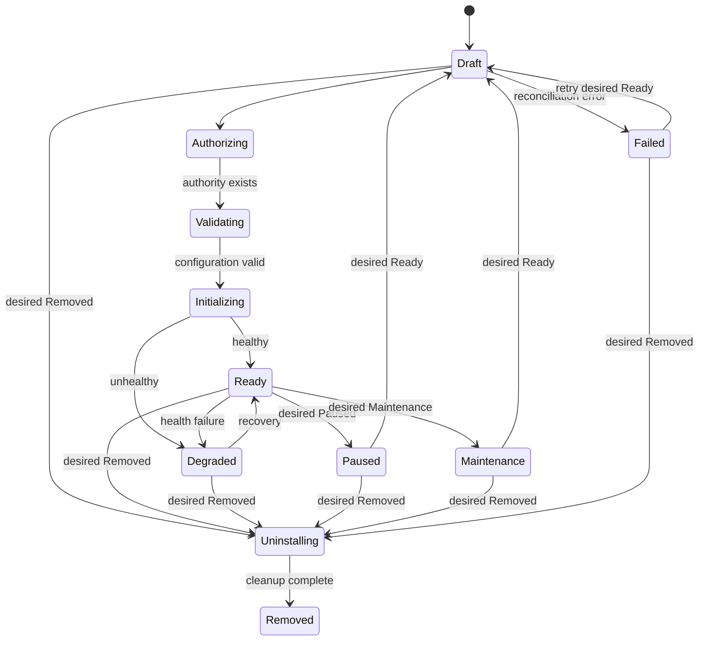

# Source connector installation lifecycle

## Ownership

The continuous connector lifecycle controller owns desired/observed
installation reconciliation. API handlers request a desired state; they do not
declare an installation healthy or removed. Connector health and cleanup facets
provide evidence, and the controller persists the transition with a generation
fence.

## Desired and observed state

Desired states are `Ready`, `Paused`, `Maintenance`, and `Removed`. Observed
phases are `Draft`, `Authorizing`, `Validating`, `Initializing`, `Ready`,
`Degraded`, `Paused`, `Maintenance`, `Failed`, `Uninstalling`, and `Removed`.

Each record carries a desired generation, observed generation, conditions, the
bound connector version, enabled capabilities, provenance, and next reconcile
time. It also records the active state-schema version, the schemas accepted by
mixed workers, and the most recent replay certification. Writes use the
generation as an optimistic fence. State upgrades are explicit one-schema-step
transforms; downgrade is forbidden unless every crossed edge declares a
reversible transform.

## Reconciliation loop

For each due installation, the controller:

1. loads lifecycle and durable authority;
2. validates authority against installation identity and generation;
3. builds installation-scoped production host services;
4. binds through the immutable registry;
5. invokes remote health when the phase needs health evidence;
6. invokes idempotent cleanup when removal is desired;
7. retires credentials and revokes authority after cleanup completes;
8. computes one lifecycle transition and saves it with a generation fence.

Ready and degraded installations are re-observed at a slower cadence; transient
phases reconcile more frequently. Removed installations are no longer due.

## Execution gate

Connector capability execution is available only in `Ready` and `Degraded`.
Paused, maintenance, failed, uninstalling, and removed installations fail before
the provider operation. Legacy fallback is a routing decision, not a way to
bypass durable tenant authority for native execution.

## Health and degradation

`health.probe/v1` may perform local or remote checks. A negative report produces
degraded lifecycle evidence; exceptions are recorded as sanitized failure
conditions. Recovery returns an installation to ready on a later reconcile.
Health checks must not leak tokens or provider payloads into conditions.

## Cleanup and uninstall

`lifecycle.cleanup/v1` receives a stable operation ID and must tolerate retries.
It may revoke remote subscriptions or credentials and clean connector-owned
state. The host retires credential references and revokes the authority grant
only after the capability reports completion. The lifecycle then becomes
`Removed`; destructive persistence deletion is not required for state
transition and audit history is retained.

## Running the controller

The worker entry point is
`services.ingest.connector_platform.lifecycle_worker`. It requires
`DATABASE_URL`; `CONNECTOR_LIFECYCLE_INTERVAL_SECONDS` controls the idle loop
interval and `CONNECTOR_CALLBACK_BASE_URL` enables callback allocation.
