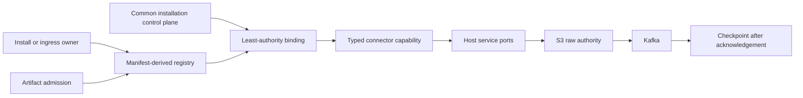

# Source connector runtime architecture

## Authority boundary

The Source Connector Runtime is the sole definition and execution authority for
all 26 first-party ingestion sources. A source must exist in the canonical source
index, have one stable-v1 manifest, resolve one first-party factory, pass
structural and behavioral conformance, and bind to a common installation before
any source operation can run.

There is no source-local fallback. Artifact quarantine, missing authority,
missing credentials, stale generations, or an unavailable capability fail
closed with a typed connector error.



## Layers

| Layer | Responsibility |
| --- | --- |
| `source_contract` | Manifest/DTO schemas, capability protocols, source index, versions, typed errors, host ports |
| `connector_conformance` | Reusable structural and behavioral verification |
| `connector_runtime` | Immutable registry, admission, binding, policy, execution, lifecycle and telemetry |
| `connectors` | Provider authentication, API/wire behavior, identity and normalization |
| `connector_platform` | PostgreSQL repositories, production host adapters, install ingress, lifecycle and process composition |
| Runtime owners | HTTP bounds, scheduling, leases, S3/Kafka durability, acknowledgement, retry and process supervision |

Dependencies point inward. Connectors do not import application routes, legacy
source implementations, PostgreSQL records, Kafka producers, or S3 clients.

## Definition and admission

`source-index.json` owns the 26 source wire identities. JSON manifests declare
connector identity/version, implementation factory and artifact modules,
capabilities, ingress kinds, installation-data namespaces, secret slots,
outbound hosts, scopes, trust ceiling, and runtime profile.

Startup constructs an immutable catalog and validates exact agreement among the
source index, manifests, factories, capabilities, and checked-in release
evidence. Artifact admission measures implementation and manifest digests and
can quarantine a connector. Quarantine never changes execution mode; it makes
that connector unavailable.

## Installation and authority

Every source uses these common records:

- `source_connector_installations` for identity, desired/observed lifecycle,
  generation fences, bound version and enabled capabilities;
- `source_connector_authority_grants` for credential owner, granted slots,
  scopes, hosts, trust and provenance;
- `source_connector_credentials` for current/pending/retired secret references;
- `source_connector_installation_data` for manifest-declared namespaced state;
- `source_connector_callbacks` for installation-scoped webhook/watch endpoints.

Binding validates installation identity, tenant, connector ID, lifecycle,
generation, active authority, manifest permission ceilings, and configured
secret slots. Capability factories are exposed only when their `configuredBy`
slots are present. Pure normalization/identity can bind without provider
credentials; provider I/O cannot.

## Install surfaces

OAuth-capable connectors use:

```text
GET /integrations/{source}/install
GET /integrations/{source}/callback
```

API-key, service-token, AWS, gateway/session, and manually supplied OAuth-token
installations use:

```text
POST /integrations/{source}/configure
{
  "external_installation_id": "provider-native-id",
  "credentials": {"manifest_slot": "secret-value"},
  "configuration": {"selected_resources": []},
  "installation_data": {"declared_namespace": {}}
}
```

Undeclared slots/namespaces and incomplete required credentials are rejected.
OAuth callbacks that lack another required slot are persisted in `Maintenance`
and do not enqueue onboarding until completed.

## Execution families

REST/OAuth calls run through governed HTTP with manifest host allowlists and
typed provider failure translation. Google subscription scheduling uses the
push-subscription capability; Pub/Sub or watch callbacks trigger connector
incremental polling. Gateway workers open/receive/close through the gateway
port and persist resume state only after raw publication. AWS CloudTrail builds
SigV4 requests inside its connector using scoped secret handles.

All successful source records use host-owned raw emission. The host writes the
raw object to S3, publishes the versioned envelope to Kafka, then commits cursor
or resume state. Connectors cannot reverse that ordering.

## Runtime owners

- `run_connector_poll_worker.py` owns all poll-capable installations.
- `run_connector_subscription_scheduler.py` owns Google watches/subscriptions.
- `run_connector_gateway_worker.py` owns Discord, Telegram, and Signal sessions.
- the generic workflow router owns plan/fetch/reconcile/normalize capability
  calls;
- the webhook router accepts source callbacks only through common callback
  records;
- the continuous lifecycle controller owns health, pause, maintenance,
  degradation, cleanup, revocation and removal.

Compose, the canonical process manifest, Prometheus targets, and PgBouncer
checks name these owners. The source-specific worker launchers were removed.

## Routing and rollout

Routing policy contains only a monotonically increasing artifact revision and
the fixed global mode `connector`. Source-, tenant-, and capability-specific
execution overrides are rejected. Rollout stages and thresholds can promote or
roll back artifact revisions, but every revision still executes the same
contract path.

## Failure and availability semantics

Provider failures are translated into the contract error taxonomy and retain
retryability, rate-limit, authentication, payload, state, cancellation, and
timeout meaning. Paused and Maintenance installations do not bind provider
capabilities. Removed installations bind only long enough to execute idempotent
cleanup and retire authority. With no alternative runtime, failures are visible
and recoverable through configuration, credential repair, lifecycle control, or
artifact revision rollback—not hidden source dispatch.
