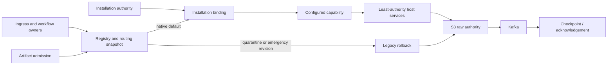

# Source connector runtime architecture

## Final authority boundary

The Source Connector Runtime is the definition and normal execution authority
for the 26 first-party ingestion source families. Every candidate is discovered
from a checked-in stable-v1 manifest, resolves a connector-local factory, and
must match independently checked-in structural and behavioral evidence before
registration. The default fleet policy selects connector execution.

Durable installation authority and signed measured-artifact admission remain
higher-precedence gates. A missing, invalid, disabled, or quarantined artifact
fails closed to the retained legacy emergency path. That path is rollback
infrastructure, not a second catalog or registration authority, and may be
deleted source by source only after durable retirement evidence is accepted.

## Layers

| Layer | Responsibility |
| --- | --- |
| `source_contract` | Stable-v1 manifests, DTOs, capability protocols, source index, identity, versions, state migrations, typed errors, host-service ports |
| `connector_conformance` | Structural and deterministic behavioral evidence before admission |
| `connector_runtime` | Immutable registry, binding, execution, policy, lifecycle, rollout, artifact admission, resilience contract, diagnostics |
| `connectors` | Connector-local provider behavior and immutable first-party wire profiles |
| `connector_platform` | Fyralis persistence, fleet composition, production host services, lifecycle/routing controllers, OAuth and ingress wiring |
| Ingress/workflow hosts | Request bounds, tenancy, S3/Kafka durability, checkpoints, retries, breakers, DLQ, process ownership |

Dependencies point inward. The source contract does not import provider
clients, FastAPI, Temporal, PostgreSQL, Kafka, or S3. Native connector modules
do not import legacy ingestion, integration, platform, or application runtime
modules.

## Definition and startup

`source-index.json` is the source-identity authority used by raw envelopes,
Kafka topics, and raw S3 layout. The 26 manifests define metadata,
implementation factories, capability availability/configuration, ingress,
permissions, trust, and runtime requirements. `CONNECTOR_CATALOG` is derived
from the manifests rather than maintained as another source list.

Gateway and workflow startup build the same immutable candidate set. Fleet
validation proves exact equality among source index, manifests, catalog, and
candidate identities; stable API/maturity/version; connector-local native
origins; and resolvable channel/handler wiring for every declared ingress kind.
Registration then validates host compatibility and exact structural plus
behavioral fingerprints. The registry fingerprint identifies the resulting
process-local composition.

Artifact admission verifies enabled records and compares their signed digest
with the running implementation module and exact manifest. A continuous
controller refreshes admission and durable routing. Production processes that
cannot obtain required signed state are quarantined rather than allowed to run
an unattested native path.

## Binding and capability resolution

An execution request carries an installation reference, durable authority,
scoped host services, typed capability key, deadline, connector call, and
emergency rollback call. The registry validates tenant, connector,
installation, generation, trust ceiling, and granted authority before creating
a bound connector.

A manifest declaration distinguishes three states:

- declared but unavailable: no factory is registered;
- available but not configured: one or more `configuredBy` secret slots are
  absent from the grant and the facet is withheld;
- configured: a factory constructs the installation-scoped facet.

Connector code receives only the granted secret slots, outbound hosts, scopes,
trust ceiling, state, emitter, callback, lease, metrics, logging, clock, and
cancellation ports. It cannot publish Kafka, write S3, advance checkpoints, or
select a tenant directly.

## Execution and ingress

Routing supports `legacy`, `shadow`, and `connector`, with quarantine evaluated
first. The stable fleet default is `connector`. Shadow retains the rollback
result as authoritative and duplicates only operations declared safe to
compare. Bounded execution, error, duration, parity, lifecycle, and DLQ events
feed staged rollout and automatic rollback.

Planner, pull/poll, webhook, gateway, reconciliation, normalization, OAuth, and
lifecycle owners resolve the admitted registry artifact and durable
installation authority. A release-time cross-layer validator rejects a
manifest whose ingress cannot resolve to a registered channel and handler.
The host preserves existing envelope, retry, circuit-breaker, DLQ, S3-first,
Kafka-ordering, and checkpoint semantics around the capability call.

## Lifecycle and state evolution

The continuous lifecycle controller owns desired/observed reconciliation,
configuration, health, degradation/recovery, maintenance, cleanup, authority
revocation, credential retirement, and removal. API handlers request desired
state; they do not assert health.

Connector state has an independent schema version and producing connector
version. Upgrades advance through explicit deterministic one-step transforms.
Mixed workers are allowed only within the same connector major and when they
declare the current state schema. Downgrade is forbidden unless every crossed
edge provides a reversible transform. Installation records persist accepted
schemas and replay certification.

## Operations and retirement

The fleet dashboard and Prometheus rules expose execution, latency, quarantine,
control failure, lifecycle, and rollback signals. Resilience certification has
an explicit, version-bound evidence contract for throttling, provider outage,
lease loss, cancellation, secret rotation, credential revocation, poison
payload, multi-region failover, and disaster-recovery replay.

Full native routing does not itself authorize deletion. A legacy surface may be
removed only after parity and soak acceptance, a successful rollback drill, a
named rollback owner, and a durable `source_connector_retirement_evidence`
record. Until that point it remains a fenced recovery mechanism and has no
manifest, catalog, or registration authority.
