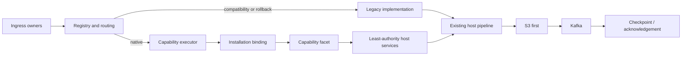

# Source connector runtime architecture

## Authority boundary

The Source Connector Runtime is the target authoritative architecture and the
current canonical definition catalog. Execution remains legacy-safe by default
for all 26 sources. Slack, Notion, and WhatsApp are transitional native-root
candidates; they are not production-authoritative until behavioral admission,
ambient legacy dependency removal, and closed-loop rollout evidence pass.

## Layers

| Layer | Responsibility |
| --- | --- |
| `source_contract` | Manifests, DTOs, capability protocols, identity, versioning, typed errors, host-service ports |
| `connector_conformance` | Structural and behavioral proof before registration |
| `connector_runtime` | Registry, compatibility validation, binding, execution, policy, lifecycle, rollout, artifacts, diagnostics |
| `connector_platform` | Fyralis persistence, native composition, legacy bridges, production host services, OAuth and ingress wiring |
| Ingress/workflow hosts | Request bounds, tenancy, S3/Kafka durability, checkpoints, retries, breakers, DLQ, process ownership |

Dependencies point inward: contract code does not import provider clients,
FastAPI, Temporal, PostgreSQL, Kafka, or S3.

## Startup

Gateway and workflow startup build the same immutable 26-connector candidate
set. Registration validates IDs, sources, versions, manifest/capability parity,
host compatibility, and independently checked-in structural conformance
fingerprints. A durable routing controller then applies the active revision.
Artifact admission verifies enabled records and compares their claimed digest
with the running implementation module plus exact manifest;
invalid or missing required attestations enter an in-memory quarantine that
forces legacy mode even if a later routing revision asks for connector mode.

The registry fingerprint identifies the exact process-local composition.

## Execution

An execution request contains the installation reference, durable granted
authority, scoped host services, typed capability key, deadline, connector call,
and legacy call. Routing selects `legacy`, `shadow`, or `connector` by the most
specific configured scope. Artifact quarantine has higher precedence than all
routing scopes.

For connector execution, the registry validates installation identity and
authority, constructs an immutable bound connector, resolves the declared
capability, enforces cancellation/deadline checks, emits connector telemetry,
and translates typed failures. Shadow execution retains the legacy result as
authoritative and records a canonical comparison only for operations declared
safe to duplicate.

## Installation and authority

Common PostgreSQL records own desired/observed lifecycle, connector identity,
credential references, granted secret slots/scopes/hosts, trust ceiling,
installation data, callbacks, artifact provenance, routing revisions, rollout
metrics, and audit history. Row-level security protects tenant-owned control
plane tables.

Binding rejects revoked, cross-installation, cross-tenant, cross-connector, or
stale-generation authority. Host services independently enforce the resulting
grant.

## Host ownership

The connector may request secrets, governed HTTP, CAS state, installation data,
raw publication, callbacks, leases, metrics, logs, time, and cancellation only
through `HostServices`. Production adapters connect these ports to Fyralis
secret storage, PostgreSQL, S3/Kafka raw publication, callback allocation,
database leases, and telemetry.

Connectors never own tenant authorization, the canonical envelope schemas,
checkpoint commits, Kafka topology, DLQ policy, global retry budgets, or the
domain write path.

## Routing precedence

Normal precedence is tenant/capability, tenant/connector, connector/capability,
tenant, connector, capability, then global. Missing configuration resolves to
legacy. Quarantine is evaluated before that chain. Policies are immutable
snapshots and revisions must increase.

## Catalog state

The catalog is immutable for a process and exactly matches the 26-source raw
envelope literal. Native candidates carry first-party capability factories.
Compatibility candidates are conformed definitions over legacy behavior and
remain global-legacy unless explicitly migrated. There is no database-driven
dynamic code loading.
