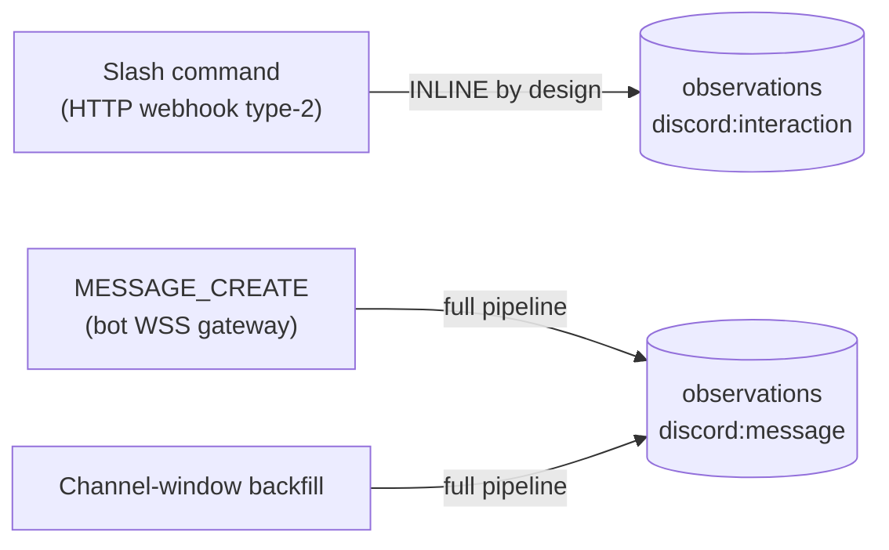

# Discord (IN-09 interactions + IN-12 gateway messages)

> The only source with **three** ingress surfaces and the **one intentional
> inline exception** in the whole pipeline.

| Field | Value |
|---|---|
| Source | `discord` |
| Channels | `discord:message` (gateway + backfill), `discord:interaction` (slash commands) |
| Trust tier | `attested_agent` |
| Live ingress | interactions = **HTTP webhook (inline)**; messages = **persistent WSS gateway** |
| Backfill | channel-window sampling → `discord:message` |
| Auth | OAuth `applications.commands+bot`; bot token in `encrypted_secrets` |
| Signature | Ed25519 (PyNaCl), per-installation public key |

## Three surfaces

### 1. Interactions (IN-09) — stays inline

Slash commands hit `gateway /webhooks/discord`. Discord requires a **synchronous
response body** (`CHANNEL_MESSAGE_WITH_SOURCE`) that the async `202` cutover
contract cannot satisfy, so interactions are **not** in
`_CUTOVER_ENABLED_PROVIDERS` and run inline `ingest()` →
[handlers/discord.py](../../../services/ingest/ingestion/handlers/discord.py) →
`discord:interaction`. `content.text` is the primary string option verbatim
(`/fyralis ask "What's our churn rate?"` → `"What's our churn rate?"`). The
per-interaction `token` is stripped from metadata before persistence — it is the
follow-up REST credential.

PING (type=1) handshake precedes any install and uses the `WEBHOOK_SECRET_DISCORD`
env-var fallback; otherwise the per-installation public key in `encrypted_secrets`
verifies Ed25519 signatures
([signatures/discord.py](../../../services/app/webhooks/signatures/discord.py)).

### 2. Gateway messages (IN-12) — full pipeline

`discord_gateway_worker`
([services/ingest/integrations/discord/gateway/](../../../services/ingest/integrations/discord/gateway/))
holds a persistent `wss://gateway.discord.gg` connection (IDENTIFY, heartbeat,
RESUME), dispatches every `MESSAGE_CREATE`, builds a `RawEnvelope`
(`ingress_kind="gateway"`) with the canonical producer → full pipeline →
`discord:message`.

- **Author filter is structural**: `author.bot` + `webhook_id` checks run
  *before* tenant resolution — the inbound-loop guard against Fyralis's own
  outbound replies.
- **MESSAGE_CONTENT is privileged**: worker exits fatally on close 4014
  regardless of `FYRALIS_ENV`. Operator must enable the intent in the Discord
  Developer Portal before deploy.
- No raw `guild_id` in logs — `short_guild_hash` (BLAKE2b 8-byte) only.

### 3. Backfill

Channel-window sampling → `RawEnvelope` (`ingress_kind="backfill"`) →
`discord:message`, deduping against gateway twins via the observations unique
index.

## Auth & uninstall

OAuth ([discord/oauth.py](../../../services/ingest/integrations/discord/oauth.py)): bot
token + mirrored application public key per installation; token exchange via HTTP
Basic with `(DISCORD_CLIENT_ID, DISCORD_CLIENT_SECRET)`; registers the `/fyralis`
slash command. **No uninstall webhook** — the outbound REST client
([client.py](../../../services/ingest/integrations/discord/client.py)) is the single
chokepoint; on 401 (or 403 code 50001) it calls `_disable_and_zeroize_discord`
(idempotent under concurrent races).

**Zero new migrations** — the existing observations unique index enforces
interaction-id idempotency; `discord:message` / `discord:interaction` are
application-layer conventions.

Specs: `specs/IN-09-discord-interactions-integration/`,
`specs/IN-12-discord-gateway-message-ingest/`. See
[architecture.md](../architecture.md).
