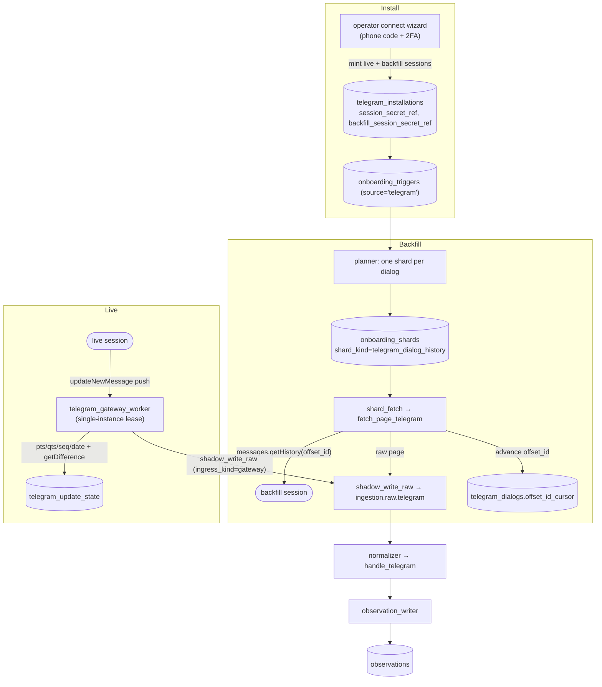

# Telegram (MTProto) — source spec & implementation plan

> **Status:** in development (`feat/telegram-mtproto-ingestion`). This page is
> the **spec + implementation plan + task breakdown** for adding Telegram as the
> 12th ingestion source. The decision record is
> [ADR-0003](../../adr/0003-telegram-mtproto-user-account-ingestion.md).
>
> Source code (as it lands): `services/ingest/integrations/telegram/`,
> `services/ingest/ingestion/{planners,fetchers,reconcilers,handlers}/telegram.py`,
> `db/migrations/0094_telegram.sql`, and the synthetic harness under
> `services/ingest/synthetic/`.

## One-line

Telegram is a **gateway-style** source (persistent connection live ingress, no
HTTP webhook) backed by the **MTProto user-account API**: per-dialog history
backfill via `messages.getHistory` cursored on `offset_id`, and live
`updateNewMessage` updates cursored on `pts/qts/seq/date` with
`updates.getDifference` as the reconciler — both running concurrently against the
same account through the existing Kafka full-pipeline.

## Why MTProto, not the Bot API (research summary)

The design rests on a cited, adversarially-verified research pass (23/23 surviving
claims passed 3-0 against Telegram's primary spec + Telethon docs). The
load-bearing facts:

| Fact | Consequence | Source |
|---|---|---|
| `messages.getHistory` is **"Only users can use this method."** | Backfill *requires* the MTProto user API; the Bot API can't read history. | [getHistory](https://core.telegram.org/method/messages.getHistory) |
| The durable credential is a per-DC **`auth_key`** (2048-bit, DH-negotiated once, never sent on the wire; on-wire id = `auth_key_id`). | Persist a Telethon `StringSession`, not a token. Reused across reconnects. | [/mtproto](https://core.telegram.org/mtproto), [/api/auth](https://core.telegram.org/api/auth) |
| Login = `auth.sendCode` → `auth.signIn`; 2FA signalled by `SESSION_PASSWORD_NEEDED` → SRP + `auth.checkPassword`. | Install is interactive/operator-mediated, not an OAuth redirect. | [/api/auth](https://core.telegram.org/api/auth) |
| Backfill paging: `offset_id` / `offset_date` / `add_offset` / `limit` (1–100); oldest returned id → next `offset_id`. | The per-dialog backfill cursor is `offset_id`. | [/api/offsets](https://core.telegram.org/api/offsets) |
| `FLOOD_WAIT` = error **420**; wait the **server-returned seconds** (not client backoff). Telethon auto-sleeps ≤ `flood_sleep_threshold` (default 60s). | Honour the server's `seconds`; don't hardcode a quota. | [Telethon errors](https://docs.telethon.dev/en/stable/concepts/errors.html) |
| Live ingress = a **persistent push connection**, *not* an HTTP webhook (webhooks are Bot-API-only). | Gateway-style worker (Discord analog); no HMAC gate. | [Telethon client](https://docs.telethon.dev/en/stable/modules/client.html) |
| Live gap-recovery state = **`pts`/`qts`/`seq`/`date`**; gap rule `local_pts + pts_count == pts`; common vs per-channel sequences reconciled by `updates.getDifference` / `updates.getChannelDifference` (channel catch-up auto-triggered by `updateChannelTooLong`). | The live cursor + reconciler primitive. | [/api/updates](https://core.telegram.org/api/updates) |
| Userbots are "automatically put under observation"; flooding → permanent ban. | Operational ban risk; conservative request patterns. | [/api/obtaining_api_id](https://core.telegram.org/api/obtaining_api_id) |

**Refuted (do not rely on):** that one `auth_key` hosts multiple concurrent
"sessions" (0-3) — the 64-bit session is a transport id, not an authorization.
This is *why* concurrency uses two authorizations (below), not session fan-out.

## How it maps onto the pipeline

Both paths converge on `ingestion.raw.telegram` → normalizer (`handle_telegram`) →
observation_writer → `observations`, exactly like every other Kafka-first source.
Live updates land in `observations` **while backfill is still in flight** because
they share that chain — the overlap property the acceptance gate proves.

## Data model (`db/migrations/0094_telegram.sql`)

Mirrors the Jira/Mercury two-table shape (install + per-resource cursor) plus a
live-state table; all tables `ENABLE`+`FORCE` RLS keyed on `app.current_tenant`.

- **`telegram_installations`** — one row per `(tenant, account)`. Columns:
  `id`, `tenant_id`, `account_label` (phone/username, display only), `api_id`,
  `api_hash_secret_ref`, `session_secret_ref` (the **live** `StringSession`),
  `backfill_session_secret_ref` (the **backfill** `StringSession` — Topology B),
  `created_at`, `disabled_at`. `UNIQUE (tenant_id, account_label)`.
- **`telegram_dialogs`** — per-dialog backfill cursor (the `jira_projects`
  analog). Columns: `id`, `tenant_id`, `telegram_installation_id` (FK CASCADE),
  `dialog_id` (chat/channel id), `dialog_kind` (`user`|`chat`|`channel`),
  `access_hash`, `title`, `offset_id_cursor` (the backfill high-water — oldest
  message id reached as we page toward history start; `NULL` = not started),
  `last_synced_at`, `state` (`pending`|`active`|`paused`|`errored`), `last_error`,
  `created_at`. `UNIQUE (telegram_installation_id, dialog_id)`.
- **`telegram_update_state`** — per-install live update state (the live cursor).
  Columns: `id`, `tenant_id`, `telegram_installation_id` (FK CASCADE, `UNIQUE`),
  `pts`, `qts`, `seq`, `date` (the common state), `channel_pts JSONB` (per-channel
  `pts`, keyed by channel id — the `getChannelDifference` cursors),
  `updated_at`. One row per install.
- **CHECK widening** (the standard 4-table superset, last touched by 0081 for
  grafana): add `'telegram'` to `source IN (...)` on `source_onboarding_runs`,
  `onboarding_shards`, `ingestion_failures`, `onboarding_triggers`.

`observations` is unchanged. Per the global-`UNIQUE(source_channel, external_id,
occurred_at)` rule (no `tenant_id` by design), `external_id` must embed install
context: `telegram:{installation_id}:{dialog_id}:{message_id}` (with edit
versioning appended when `edit_date` is present).

## Cursor & state primitives — at a glance

| Concern | Backfill | Live |
|---|---|---|
| Cursor | `offset_id` (per dialog) | `pts` / `qts` / `seq` / `date` (per install) + per-channel `pts` |
| Advance rule | oldest returned message id → next `offset_id` | apply when `local_pts + pts_count == pts`; gap → `getDifference` |
| Reconciler | `reconcile_telegram` re-probes dialogs for new history | `updates.getDifference` / `updates.getChannelDifference` (native) |
| State home | `telegram_dialogs.offset_id_cursor` | `telegram_update_state` |
| Owner | backfill worker (backfill session) | gateway worker (live session) |

## Concurrency topology (Topology B)

Two independent authorizations on the same account (see
[ADR-0003 §6](../../adr/0003-telegram-mtproto-user-account-ingestion.md)):

- **Live session** — owned solely by `telegram_gateway_worker`; holds the
  persistent updates connection; its `pts/qts/date` advance only from real live
  updates and are never head-of-line-blocked by backfill.
- **Backfill session** — owned by the per-account backfill path; multiplexes
  `messages.getHistory` across that account's dialog shards on one connection.

They share the account-wide FLOOD_WAIT budget but not connection head-of-line, so
live signals keep arriving while backfill sweeps — and `getDifference` reconciles
anything the live connection missed while busy.

## Test environment (the deliverable)

No real Telegram credentials/network/Telethon runtime are required. A
`MockTelegramClient` drives the production seams:

- **Backfill seam** `_open_telegram_client(install)` in `fetchers/telegram.py` →
  mock `get_history(dialog, offset_id, limit)` returning fixture pages.
- **Live seam** — the gateway worker's client is monkeypatched to a mock that
  emits synthetic `updateNewMessage` deltas on demand (the
  `TelegramGatewayGenerator` live driver, mirroring `discord_gateway.py`).

The acceptance gate is the existing all-sources concurrent overlap run extended
to **12 sources**: backfill in progress while live updates arrive, per-source
observation-count parity, cross-path dedup, and
`assert_live_during_backfill_overlap` green for `telegram`. Telethon is an
**optional** dependency (`pip install 'fyraliscore[telegram]'`), import-guarded so
the synthetic gate runs without it.

## Implementation plan — task breakdown

**Phase 0 — Docs & decision (this PR, first).** ADR-0003 + this spec; nav +
architecture/services updates. ✅ *(landing now)*

**Phase 1 — Schema & registry.**
1. `db/migrations/0094_telegram.sql` — the three tables + RLS + 4-table CHECK
   widening (strict superset).
2. Add `"telegram"` to `RawEnvelope.SourceLiteral` (envelope.py) — this
   auto-propagates to `INGESTION_SOURCES`, the S3-key allowlist, normalizer
   regex, circuit-breaker lanes, and Kafka topic derivation.
3. Add `"telegram"` to the hardcoded source lists: `progress/events.py`
   `Source`, `workflows/source_onboarding.py` + `workflows/tenant_onboarding.py`
   `VALID_SOURCES`, and `channel_mapping.py` (`("telegram","gateway")` +
   `("telegram","backfill")` → `telegram:message`).
4. `idempotency/__init__.py` — the `telegram` `external_id` constructor.

**Phase 2 — Production backfill slice.**
5. `integrations/telegram/client.py` — `TelegramClient` wrapping Telethon
   (`get_history`, `iter_dialogs`, `connect`/`disconnect`), import-guarded.
6. `planners/telegram.py` — `plan_shards_telegram`: one shard per dialog
   (`shard_kind="telegram_dialog_history"`); register in `PLANNER_DISPATCH`.
7. `fetchers/telegram.py` — `TelegramCursor` (`offset_id`), `fetch_page_telegram`
   (`getHistory` → records + next cursor + `end_of_data`), `_open_telegram_client`
   seam; register in `FETCHER_DISPATCH`.
8. `fetchers/_clients.py` — `build_telegram_client` / `open_telegram_client`.
9. `workflows/shard_fetch.py` — `_LOAD_TELEGRAM_INSTALL_SQL` + dispatch in
   `_load_install`.
10. `reconcilers/telegram.py` — `reconcile_telegram` (re-probe dialogs for new
    history past the high-water); register in `RECONCILER_DISPATCH`.
11. `handlers/telegram.py` — `@register("telegram:message")` `handle_telegram` →
    `ObservationDraft` (text, `occurred_at` = message date, `source_actor_ref` =
    sender, `external_id` via the idempotency constructor).
12. `integrations/telegram/onboarding.py` — `finalize_install` (UPSERT install +
    dialogs + `onboarding_triggers` in one tenant transaction).

**Phase 3 — Production live slice (gateway worker, Discord analog).**
13. `integrations/telegram/gateway/{worker,dispatch,client,session_state}.py` —
    persistent updates connection; `handle_update` → cutover `shadow_write_raw`
    (`ingress_kind="gateway"`) when `kafka_path_enabled`, else inline
    `core.ingest("telegram:message", …)`; persist `pts/qts/seq/date`; reuse
    Discord's `leader_lock` for the single-instance lease.
14. `scripts/run_telegram_gateway_worker.py` — launcher (mirror Discord's): wire
    pool, `IdempotentProducer`, `S3Client`, `TenantFlags`, lease, session state.
15. `docker-compose.yml` — `telegram_gateway_worker` service.

**Phase 4 — Synthetic harness.**
16. `synthetic/fixtures/telegram_generator.py` — `make_telegram(dialogs,
    messages_per_dialog, base_iso, seed)`; tenant-unique ids via `seed` (the
    Mercury pattern — avoids the global-`UNIQUE` collision). Register in
    `fixtures/__init__.py`.
17. `synthetic/mock_clients/telegram.py` — `MockTelegramClient` (`get_history`
    pagination + `_check_fault`; a live-delta injection surface). Register in
    `mock_clients/__init__.py`.
18. `synthetic/backfill_harness/{harness,scenarios}.py` — `_build_fixture`,
    `_make_mock`, `_install_factories` seam patch, `_VALID_SOURCES`.
19. `synthetic/validation_runs/{runs,preflight,composition}.py` — scenario
    builder, preflight records, `LiveTarget` fields + `live_target_for` +
    `build_live_drivers` + `seed_live_installs` + `dispatch_live_concurrent`.
20. `synthetic/live_generators/telegram_gateway.py` — `TelegramGatewayGenerator`
    driving the live worker's dispatch in-process with synthetic updates.
    Register in `live_generators/__init__.py`.
21. `synthetic/validation_runs/run_all_sources.py` — add `telegram` to
    `_EXPECTED`, `_scen_params`, the live dispatch, and the per-source live
    coroutine (source #12).

**Phase 5 — Tests & acceptance.**
22. Per-layer edge-case tests (pagination/cursor-resume, `getDifference` gap
    recovery, FLOOD_WAIT backoff, edit/dedup versioning, empty delta, malformed
    record → DLQ) + the drift regression (SourceLiteral-derived lists include
    `telegram`).
23. The all-12 concurrent backfill+live overlap gate green; write the run report
    under `docs/validation/`.

## Acceptance criteria

- All 12 sources run with **backfill in progress while live signals are received**
  for `telegram` (overlap, not sequential).
- Per-`telegram`-tenant observation-count parity (backfill fixture + live bursts).
- No duplicate observations; `external_id` unique across backfill/live paths.
- `assert_live_during_backfill_overlap` green for `telegram` (≥1 live obs lands
  before that tenant's backfill completion).
- All regression suites green; the run is reproducible on a throwaway DB +
  dev-compose Kafka.

## Open questions

> **TODO(human):** Before enabling a production tenant, run a throwaway Telethon
> spike on a real test account: a multi-thousand-message `getHistory` backfill
> while asserting live `updateNewMessage` events keep landing throughout. This
> closes the two research gaps — (1) the single-connection concurrency property
> (Topology A) is high-confidence *inference*, not a cited fact, and (2) concrete
> `FLOOD_WAIT` durations / per-method rate limits are not verifiable from primary
> sources. The spike result determines whether Topology B (two authorizations) is
> necessary or whether one shared connection suffices.

> **TODO(human):** Decide dialog-selection scope for backfill — all dialogs, or an
> operator-provided inclusion list (channels/groups of interest)? Affects planner
> shard enumeration and the connect wizard UI.
