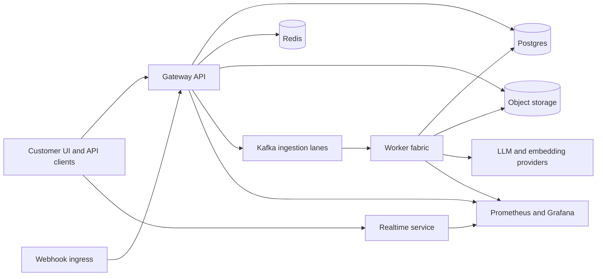

# Production Architecture Overview

Owner: Platform Engineering.
Last reviewed: 2026-06-24.

This page is the launch-oriented map of Fyralis core as production software. It
does not describe BYOC control-plane/data-plane separation; it describes the
single deployment unit that must be reliable before enterprise rollout.

## System Boundary

## Production Components

| Component | Production responsibility | Primary docs |
| --- | --- | --- |
| Gateway API | Auth, route access policy, product APIs, admin APIs, request metrics, safe errors | [App architecture](../architecture/app.md), [Gateway route access inventory](gateway-route-access-inventory.md) |
| Realtime service | Tenant-scoped websocket delivery and access control | [Platform architecture](../architecture/platform.md) |
| Webhook ingress | Signature/OIDC verification, tenant resolution, deduplication, safe handoff to ingestion | [Ingestion architecture](../architecture/ingest.md) |
| Kafka ingestion lanes | Source-isolated raw, normalized, embedding, summarization, and DLQ topics | [Source isolation](../ingestion/source-isolation.md) |
| Worker fabric | Ingestion, post-commit, Think, topology, entity resolution, cleanup, drift checks | [Worker fabric runbook](worker-fabric-runbook.md) |
| Postgres | Source of truth for tenant data, RLS, durable queues, audit, backup status | [Data retention, backup, and recovery](data-retention-backup-recovery.md) |
| Object storage | Raw payloads, large objects, attachments, blob chunks, restore inventories | [Data retention, backup, and recovery](data-retention-backup-recovery.md) |
| Observability | Bounded metrics, product SLOs, drift, backup status, worker health | [Observability and alert guide](observability-alert-guide.md) |

## Production Invariants

- Every customer data read or write must be tenant scoped in application code
  and protected by database RLS where the table supports RLS.
- Production startup must fail closed for unsafe flags, local/demo credentials,
  debug endpoints, query-string websocket auth, and demo/spec routes.
- Product-critical workers must either run with health/metrics endpoints or be
  deliberately disabled by production launch policy.
- Raw secrets must stay in the configured secret provider. Install rows and
  source configs must store opaque secret references.
- Logs and metrics may include bounded operational labels only. They must not
  include raw prompts, source payloads, access tokens, object keys, or PII.
- Rollback must never delete customer data. Schema rollback is a separate,
  explicitly approved recovery action.

## Release Boundary

Production readiness for a release means:

1. CI passes architecture ratchets, env contract, lint, tests, docs, security
   scans, SBOM generation, and artifact signing.
2. Staging deploy verifies signed artifacts and passes release acceptance.
3. Production deploy verifies signed artifacts from the production branch.
4. Post-deploy health, readiness, drift, backup freshness, and product SLO
   dashboards are green.
5. Open limitations are documented in
   [Known limitations and feature flags](known-limitations-feature-flags.md).

## Failure Domains

| Failure domain | Expected behavior |
| --- | --- |
| Gateway unhealthy | Deploy workflow rolls back if `/healthz` does not recover. |
| Product SLO burn | Deploy workflow runs `scripts/check_product_slo_gate.py` against bounded product workflow burn gauges after health recovery and rolls back if error or latency burn exceeds configured thresholds. Operators still use the observability guide for follow-up pause/roll-forward decisions. |
| Kafka or worker lag | Source-isolated lanes are scaled or paused without blocking unrelated sources. |
| Provider outage | Circuit breakers and retry budgets should preserve local availability where possible. Gaps remain per integration. |
| Schema/RLS drift | Schema drift monitor alerts without exposing table names in metric labels. |
| Backup stale or missing | Promotion is blocked until backup and restore-test status is fresh. |

## Open Production Gaps

This overview is not a readiness certificate. The source of truth remains the
[production readiness master checklist](fyralis-production-readiness-master-checklist.md).
The largest remaining launch blockers are strict tenant/RLS closure, full
source lifecycle verification, staging load/soak evidence, frontend overlay
readiness, cost ceilings, and governance evidence.
