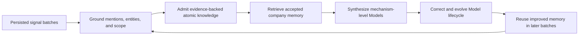
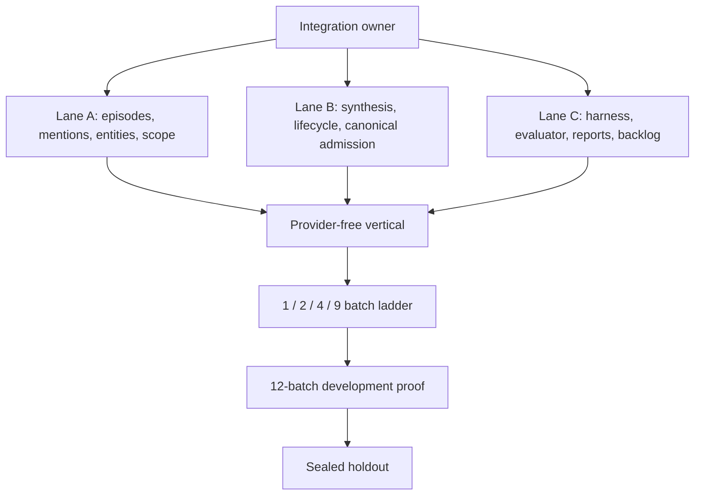

# Autonomous Company Learning — Core Fast-Path Agent Coordinator

**Document type:** Executable multi-agent implementation and evaluation plan

**Status:** M0, CF3-A, and CF3-B complete; CF3-C second run isolated the final synthesis-binding defect and its provider-free repair is green

**Active branch:** `codex/autonomous-company-learning`

**Required worktree:** `/Users/rachinkalakheti/fyraliscore-autonomous-learning`

**Companion scratchpad:**
[Company-Learning Epistemic Repair Learning Log](company-learning-epistemic-repair-learning-log.md)

**Current-state record:**
[Autonomous Company-Learning Journey Status](autonomous-company-learning-journey-status.md)

**Existing qualification program:**
[Company-Learning Epistemic Repair Agent Coordinator](company-learning-epistemic-repair-agent-coordinator.md)

## 1. Mission

Reach a working autonomous company-learning loop as quickly as possible without
corrupting truth or hiding semantic failure.

The target loop begins with normalized, source-attributed signals already
persisted in PostgreSQL and ends when later reasoning demonstrably reuses and
corrects the company memory learned from earlier batches.



The active goal is autonomous learning and feedback, not autonomous task
execution.

## 2. Fast-Path Finish Line

The fast path is complete only when all of the following are demonstrated end
to end:

1. Signals are processed in intact batches, never as individual-signal tests.
2. Slack-like, Jira-like, and email/CRM-like evidence is grounded to the right
   entities and semantic scopes.
3. Atomic knowledge has exact, immutable evidence lineage.
4. Distributed evidence becomes coherent, scope-local, mechanism-level company
   Models rather than unrelated fragments or generic hubs.
5. Contradictions and higher-authority evidence revise or supersede current
   Models without erasing history.
6. Later batches retrieve and use accepted Models; raw observations are reopened
   only when Models are insufficient.
7. Composite Models and their governed relations are admitted atomically.
8. No cross-tenant, cross-scope, evaluator, wrapper, or control-plane state
   enters accepted company truth.
9. The behavior repeats on a previously unseen, sealed holdout population.
10. A bounded ablation shows that learned memory improves later understanding,
    correction, efficiency, or answerability without increasing unsafe truth
    errors.

## 3. Explicit Non-Goals

The following must not delay the core fast path unless they violate a hard truth
invariant:

- Slack, Jira, email, CRM, or other connector listeners;
- OAuth, webhooks, polling, delivery retries, and transport durability;
- autonomous task planning or execution;
- UI, customer workflow, and human-review ergonomics;
- exhaustive relation vocabulary expansion;
- broad-scale concurrency qualification;
- perfect latency or token economics;
- rare legacy-fixture compatibility;
- every wording variation and source-specific edge case;
- production deployment hardening beyond the bounded checks in CF8.

All test inputs begin as normalized signals already stored in PostgreSQL.
Real-model tests use Codex CLI. DeepSeek is not required.

## 4. Starting Evidence and Honest Boundary

The existing artifacts establish the following bounded starting point:

- a four-batch, zero-seed prefix has demonstrated strong atomic extraction,
  uncertainty fate, evidence lineage, scope isolation, and one legitimate
  scope-local composite;
- complete twelve-batch development runs have processed all 300 signals but
  failed coherent multi-story synthesis and lifecycle behavior;
- the most recent full run produced strong atomic/substrate metrics but only one
  of four required composite Models, zero completed lifecycle transitions, and
  zero canonical semantic relations;
- the existing P6 population has been inspected and executed repeatedly and is
  therefore a development/regression population, not an unbiased holdout;
- the last attempted twelve-batch run was stopped by user direction after two
  successful batches and is diagnostic only.

Agents must not relabel these artifacts as final success. They may use them for
regression, diagnosis, and development.

## 5. Milestone Model

| Milestone | Meaning | Required phase |
| --- | --- | --- |
| M0 — Mechanically ready | The complete production-shaped path works against real PostgreSQL without a live model. | CF0-CF2 |
| M1 — Learning loop works | One storyline reaches atomics, synthesis, correction, and later reuse. | CF3-CF4 |
| M2 — Mixed-stream core works | Multiple interleaved storylines remain distinct and evolve correctly. | CF5 |
| M3 — Independently validated | M2 behavior repeats on an unseen sealed population. | CF6 |
| M4 — Memory value demonstrated | A matched ablation shows measurable benefit from learned memory. | CF7 |
| Core closeout | Bounded recovery, isolation, evidence report, and backlog handoff are complete. | CF8 |

M0, M1, and M2 are the immediate critical path. CF6-CF8 must not introduce
broad new architecture before M2 works.

## 6. Non-Negotiable Core Invariants

These invariants apply to every phase. A violation is a core blocker.

### 6.1 Entity and scope fidelity

- Every admitted claim has a governed mention or explicit evidence address.
- Canonical entity identity is tenant-scoped.
- Ambiguous identity remains uncertain or reviewable; it is not coerced.
- High-consequence entity merge, split, or cross-scope incidents are zero.
- Transport batch boundaries never become semantic episode boundaries by
  default.

### 6.2 Evidence fidelity

- Every accepted atomic or composite truth references immutable observation or
  Model-version evidence.
- Direct evidence, transitive Model evidence, contradiction evidence, relation
  evidence, and auxiliary context remain distinguishable.
- Auxiliary retrieval context cannot silently become truth evidence.

### 6.3 Truth atomicity

- A composite and its required relation either both enter canonical truth or
  neither does.
- Validation failure leaves canonical truth unchanged.
- Legacy relation claims, retrieval indexes, and projections cannot become
  independent sources of canonical truth.

### 6.4 Lifecycle correctness

- Current truth has exactly one accepted head per governed belief address.
- Confirm, revise, supersede, invalidate, and abstain are distinguishable.
- Old versions remain historically queryable but are not returned as current.
- Dependent relations and projections follow canonical lifecycle changes.

### 6.5 Batch and barrier integrity

- Test signals enter in batches of 25 unless a phase explicitly specifies a
  smaller mechanical fixture; no semantic proof processes signals individually.
- Every batch has a durable completion fate.
- Truth-critical work drains before the batch barrier closes.
- A failed or timed-out batch cannot be reported as successful.

### 6.6 Isolation and blindness

- Cross-tenant reads or writes are zero.
- Gold labels, storyline IDs, expected theses, and evaluator-only hooks are
  unavailable to production reasoning.
- Wrapper, receipt, control, lifecycle-probe, and evaluator objects cannot enter
  company truth.

## 7. Minimal Coherent Contract Seam

The fast path must not begin with a broad rewrite. It should add or consolidate
the smallest boundary needed to make the existing runtime coherent.

| Contract | Required meaning | Must contain |
| --- | --- | --- |
| Governed learning episode | The semantic unit being learned, independent of transport batch. | Tenant, canonical scope, governed observations, mention coordinates, canonical references, temporal bounds, assertions, uncertainty. |
| Accepted memory snapshot | One immutable view of current accepted memory used for a reasoning attempt. | Model heads and versions, relations, scope/entity identities, lifecycle state, snapshot/version identity, retrieval provenance. |
| Typed evidence manifest | The exact role and authority of every evidence item. | Direct observations, supporting Model versions, contradictions, relation evidence, grounding evidence, auxiliary context. |
| Learning command union | The only truth mutations reasoning may request. | Insert atomic, confirm head, revise/supersede head, admit composite plus relation, abstain. |
| Canonical truth transaction | One admission point for accepted company truth. | Validation result, evidence manifest, expected heads, atomic write, outbox/projection events. |

Existing SAGE, adaptive retrieval, inquiry planning, entity resolution, Think
context assembly, model writers, relation admission, lifecycle handling, and
evaluation telemetry should be reused behind these contracts wherever they
already satisfy the invariant.

Replacement order is fixed:

1. reuse directly;
2. wrap behind the contract;
3. make a narrow repair;
4. replace only with written evidence that the existing component cannot satisfy
   the invariant.

## 8. Multi-Agent Coordination Model

Use at most one integration owner and three implementation/evaluation lanes.



### 8.1 Integration owner

The integration owner must:

- own the active plan and phase state;
- assign non-overlapping file surfaces;
- approve changes to shared contracts;
- merge only at phase checkpoints;
- freeze the commit before provider execution;
- classify every failure before authorizing a rerun;
- update the journey record after material milestones;
- prevent backlog work from entering the core critical path.

### 8.2 Lane A — perception and episode owner

Owns:

- governed observation assertions;
- mention coordinates;
- entity resolution and canonical references;
- uncertainty preservation;
- semantic episode and scope continuity;
- Slack-like boundaryless context fixtures.

Must not independently change canonical truth admission.

### 8.3 Lane B — memory and truth owner

Owns:

- accepted memory snapshot;
- synthesis candidate and decision contracts;
- typed evidence manifest;
- composite/relation atomic command;
- validation, canonical admission, lifecycle, and projection outbox behavior.

Must not change evaluation gold or thresholds.

### 8.4 Lane C — evaluation and evidence owner

Owns:

- deterministic fixtures and provider-free harness;
- incremental 1/2/4/9/12-batch scoring;
- evaluator blindness and integrity tests;
- execution-surface digests;
- reports, artifacts, and deferred-behavior ledger;
- holdout construction and sealing, with access controls appropriate to the
  local environment.

Must not tune production behavior to make a metric pass.

### 8.5 Parallelization rules

- Agents may work in parallel only on disjoint owned surfaces.
- One agent owns any shared core file at a time.
- Provider and shared-database executions require exclusive ownership.
- No code mutation occurs during a frozen provider run.
- Evaluator-only work may continue during implementation only when it cannot
  affect runtime semantics or the active artifact identity.
- Cheap evidence regeneration may run in parallel after the release candidate is
  frozen.

## 9. Phase State Machine

Each phase has exactly one state:

- `not_started`
- `active`
- `mechanically_blocked`
- `semantic_failure`
- `evaluator_invalid`
- `complete`
- `deferred`

An agent may not mark a phase `complete` merely because its code is merged. All
listed success criteria and artifacts must exist.

Every phase handoff must record:

- exact commit;
- database/migration identity;
- provider/model/configuration when applicable;
- commands executed;
- immutable artifact paths and digests;
- success-criterion results;
- known proof boundaries;
- deferred behavior IDs;
- next authorized phase.

## 10. CF0 — Clean Baseline, Reuse Map, and Dispatch

### Objective

Create a reproducible starting point and prevent agents from rebuilding
capabilities that already exist.

### Prerequisites

- P6 is stopped.
- No provider or shared-database proof run is active.
- The isolated autonomous-learning worktree exists.

### Parallel work

- Integration owner: baseline and branch/worktree verification.
- Lane A: entity/episode reuse inventory.
- Lane B: synthesis/truth/lifecycle reuse inventory.
- Lane C: harness/evaluator/artifact inventory.

### Exact steps

1. Confirm the active branch and isolated worktree.
2. Confirm whether the runtime baseline named in the latest learning-log handoff
   remains the intended baseline; record any later doc-only commits separately.
3. Record `git status`, HEAD, migrations, Python environment, PostgreSQL
   availability, and Codex CLI configuration without exposing secrets.
4. Run the narrow static/import checks relevant to the current changed surface.
5. Run the existing focused epistemic-repair suite against PostgreSQL.
6. Inventory existing components for every contract in Section 7.
7. For each component, record `reuse`, `wrap`, `repair`, or `replace`, including
   direct source/test evidence.
8. Identify shared files and assign one owner per file.
9. Record existing P6 artifacts as development evidence only.
10. Create the first deferred-behavior ledger entries from known noncore issues.

### Required outputs

- baseline record in the journey-status document;
- component reuse matrix;
- file ownership/dispatch table;
- focused test receipt;
- initial deferred-behavior ledger;
- one clean baseline commit.

### Success criteria

- Worktree is clean before the baseline commit.
- One exact runtime baseline is named.
- Database migration identity is recorded.
- Existing focused tests either pass or every failure is classified before CF1.
- Every Section 7 contract has an identified existing implementation surface.
- Every proposed replacement has evidence that reuse/wrapping is insufficient.
- No ingestion or task-autonomy work is scheduled.
- No shared core file has multiple simultaneous owners.

### Stop conditions

Stop CF0 only for:

- an unclean or ambiguous baseline that cannot be isolated safely;
- an unknown database migration state;
- an active conflicting proof run;
- a core contract with no identifiable implementation owner.

Noncore test failures are logged and do not block CF1.

### Commit checkpoint

`docs/company-learning: freeze core fast-path baseline and reuse map`

## 11. CF1 — Minimal Learning Contract Seam

### Objective

Make episode, memory, evidence, and truth-command meaning stable across the
existing pipeline without rewriting the runtime.

### Prerequisites

- CF0 is complete.
- File ownership is recorded.
- Reuse decisions are approved by the integration owner.

### Parallel work

- Lane A: governed learning episode and entity/scope adapters.
- Lane B: accepted memory snapshot, typed evidence manifest, command union, and
  canonical transaction adapter.
- Lane C: contract fixtures, serialization checks, negative cases, and tracing.

### Exact steps

1. Define or consolidate the five contracts in Section 7.
2. Build thin adapters around existing components before moving logic.
3. Establish one stable episode identity that does not equal the transport batch
   by default.
4. Freeze one accepted memory snapshot per reasoning attempt.
5. Convert loose evidence arrays into typed evidence roles at the contract seam.
6. Represent composite plus supported relation as one atomic command.
7. Require expected accepted-head versions on mutation commands.
8. Make canonical admission emit projection/outbox work after truth acceptance.
9. Reject missing scope, missing immutable evidence, invalid endpoint versions,
   or unsupported relation semantics before canonical writes.
10. Add tracing that follows episode ID, snapshot ID, evidence-manifest ID, and
    command ID through validation and application.

### Required outputs

- contract definitions or consolidated adapters;
- positive contract tests;
- negative invariant tests;
- trace example from persisted signal to canonical mutation;
- updated reuse matrix showing exactly what was reused or wrapped.

### Success criteria

- One governed episode reaches validation without being reconstructed from
  untyped transport data downstream.
- One immutable memory snapshot is used by candidate generation, validation, and
  apply checks for a reasoning attempt.
- Evidence roles remain distinguishable through canonical admission.
- Composite/relation admission cannot partially succeed.
- A stale expected Model head fails before truth mutation.
- Missing direct or transitive immutable evidence fails before truth mutation.
- Legacy/projection writes cannot occur before canonical acceptance.
- Existing unrelated reasoning behavior remains covered by targeted regression
  tests.
- No broad module rewrite or new parallel truth plane is introduced.

### Stop conditions

Stop and open an architecture decision only if the same invariant cannot be
enforced after two bounded adapter attempts without duplicating canonical truth.

All style, naming, optional-field, and legacy-fixture issues go to the backlog
unless they break one of the success criteria.

### Commit checkpoint

`feat(company-learning): establish governed learning contract seam`

## 12. CF2 — Provider-Free Four-Batch Vertical

### Objective

Prove the complete database and truth path before spending a Codex call.

### Fixture

Use four intact batches of 25 normalized signals, starting from zero accepted
Models and relations. The fixture must include:

- one primary mechanism-bearing storyline;
- Slack-like pronouns and delayed conversational return;
- one structured Jira/Linear-style source;
- one email/CRM-style higher-authority contradiction;
- high-similarity distractors;
- ambiguous mentions that should remain unresolved or explicitly uncertain.

Use deterministic reasoning decisions, not deterministic bypasses around
production validation or application.

### Batch behavior

| Batch | Required behavior |
| --- | --- |
| 1 | Ground entities and create evidence-backed atomics; do not synthesize prematurely. |
| 2 | Retrieve accepted batch-1 Models and confirm or extend the episode. |
| 3 | Accumulate sufficient evidence and admit one scope-local mechanism Model. |
| 4 | Introduce higher-authority contradiction, revise the current head, and preserve history. |

### Parallel work

- Lane A: signal fixture, mention/entity/scope gold, uncertainty fate.
- Lane B: deterministic decisions through real validator/admission/apply path.
- Lane C: independent scorer, barrier checks, receipts, and database snapshots.

### Exact steps

1. Create an isolated tenant and assert zero semantic seed state.
2. Insert 25 normalized signals for batch 1 in one database operation or one
   batch transaction.
3. Run the actual batch worker path through barrier completion.
4. Repeat for batches 2-4 without resetting learned memory.
5. Persist snapshots after every batch.
6. Independently score entity grounding, atomic truth, evidence, scope,
   synthesis, lifecycle, retrieval use, pending work, and contamination.
7. Re-run the fixture once from a clean tenant to prove deterministic mechanical
   behavior.

### Required outputs

- raw execution artifact;
- per-batch truth and retrieval snapshots;
- independent score artifact;
- database contract receipt;
- complete signal/model/relation/lifecycle fate table;
- failure-classification report if any criterion is red.

### Success criteria

- Exactly 100 signals are processed as four batches of 25.
- Zero accepted Models and relations exist before batch 1.
- Every signal, mention decision, uncertainty decision, and canonical mutation
  has a persisted fate.
- Expected governed mention coordinates are exact for the deterministic fixture.
- Expected canonical entity references are exact; ambiguous mentions remain
  uncertain.
- Zero high-consequence entity incidents occur.
- Every accepted atomic has direct immutable observation evidence.
- Batch 2 retrieves at least one exact accepted Model version from batch 1.
- Batch 3 admits exactly one expected composite with exact supporting Model
  versions.
- No unrelated observation or Model enters the composite evidence manifest.
- Unsupported relations remain candidates or abstentions.
- Batch 4 changes the accepted head through a valid lifecycle transition.
- The old head remains historically available but is not current.
- Composite/relation atomicity holds under an injected validation failure.
- Truth-critical pending work is zero at every barrier.
- Cross-tenant and cross-scope contamination are zero.
- The second clean-tenant run produces the same semantic fates.

### Stop conditions

CF2 may not call a live provider. Any schema, row-shape, evidence, transaction,
barrier, or lifecycle failure must be solved here before CF3.

Latency, token cost, optional relation breadth, and natural-language elegance are
not CF2 blockers.

### Commit checkpoint

`test(company-learning): prove provider-free four-batch learning vertical`

## 13. CF3 — Fail-Fast Codex Provider Ladder

### Objective

Introduce real semantic decisions gradually and discover failures at the
smallest observable prefix.

### Prerequisites

- CF2 is green on a clean commit.
- Codex CLI provider/model/configuration is recorded.
- Attempt, batch, and total timeout budgets are internally consistent.
- The existing P6 population is labeled development-only.

### General rules

- Freeze code before each provider run.
- Score raw output before any edit.
- Do not patch during a run.
- Do not advance to a longer prefix while a shorter prefix is red.
- Every rerun requires a classified failure and a written repair hypothesis.

### CF3-A — One-batch transport canary

#### Purpose

Prove provider configuration, parsing, compilation, receipts, batch commitment,
and barrier closure. Do not claim synthesis or lifecycle quality.

#### Success criteria

- Exactly 25 signals are processed in one batch.
- Provider is Codex through CLI with one recorded model/configuration.
- Physical and logical attempt receipts are complete.
- Reported token usage is present when the provider exposes it.
- Parse, compile, validate, admit, and apply complete without fallback bypass.
- Every signal and mention has a fate.
- Zero truth-critical work remains at the barrier.
- No wrapper/control/evaluator truth is created.
- No high-consequence entity incident occurs.

### CF3-B — Two-batch memory canary

#### Purpose

Prove that accepted memory is available and actually used on the next batch.

#### Success criteria

- Exactly 50 signals are processed as two batches of 25.
- Batch 1 creates at least one accepted evidence-backed Model.
- Batch 2 context contains at least one exact accepted Model version from batch
  1.
- The decision trace demonstrates use of retrieved Model context rather than
  merely recording its presence.
- Retrieved Model context is separated from raw observation context.
- Both barriers close with zero truth-critical pending work.
- Entity/scope contamination remains zero.
- Projected call rate and latency are reported, not used to block semantics
  unless a budget makes the next rung mechanically impossible.

#### Verified result — 2026-07-19

CF3-B is green for tenant `e188354c-4a88-406d-bf25-f005cf9af275`. The two
batches completed in `227.633s` (`113.399s` / `114.124s`); batch 1 admitted
`14/14`, and batch 2 selected 14 prior Models with 12 authorized/material,
trace-referenced, durably applied, receipted effects. Both barriers closed and
the strict report had no failed gates. Usage was 204,011 input, 42,466 output,
and 121,856 cache tokens. Evidence lives at
`/tmp/fyralis-cf3b-provenance-scope-two-batch-spark-r1.json` and its
`-cf3b-v1.json` report. CF3-C is unlocked; EDGE-058 remains deferred.

### CF3-C — Four-batch synthesis canary

#### Purpose

Prove one real-model company-synthesis opportunity with exact evidence and no
cross-story contamination.

#### Success criteria

- Exactly 100 signals are processed as four batches of 25.
- Boundary B-cubed F1 is at least `0.90` for observable episode membership.
- Exact mention F1 is at least `0.92`.
- Entity-type accuracy is at least `0.95`.
- Canonical-link precision/recall are at least `0.98` / `0.90`.
- Atomic precision/recall/F1 are at least `0.90` / `0.85` / `0.875`.
- Evidence-lineage coverage is `1.0`.
- Scope precision/recall are at least `0.95` / `0.90`.
- Exactly one expected mature composite is admitted at the expected opportunity.
- No composite is admitted before sufficient evidence exists.
- The composite is scope-local and cites exact supporting Model versions.
- Direct evidence remains claim-local; prior phases arrive transitively through
  member Models.
- False Models or relations from noise are zero.
- Unsupported relations remain outside canonical truth.
- Mature accepted Model context is used in later batches.
- All barriers and receipts are complete.

### Required CF3 outputs

- separate immutable artifacts for 1-, 2-, and 4-batch runs;
- independent score for every prefix;
- projected calls/signal and latency after every prefix;
- one milestone report identifying M1 readiness;
- backlog entries for nonblocking quality or efficiency issues.

### CF3 failure policy

- Infrastructure interruption: retry or resume only under identical execution
  identity.
- Mechanical failure: fix offline and rerun only the failed prefix.
- Semantic failure: make one smallest hypothesis-driven repair and rerun only
  the failed prefix.
- Same semantic boundary failing twice: stop local patching and require an
  explicit architecture decision.
- Noncore weakness: log and continue.

### Commit checkpoint

`test(company-learning): close Codex 1-2-4 batch semantic ladder`

## 14. CF4 — Lifecycle and Correction Canary

### Objective

Prove that a learned company Model evolves correctly when later evidence
contradicts or refines it.

### Fixture

Run the development population through the first eight or nine batches, covering
initial evidence, synthesis, contradiction/trust conflict, correction, and
dependent repair. Do not require external outcomes that occur only in batches
11-12.

### Parallel work

- Lane A: verify entity/scope continuity through contradiction.
- Lane B: inspect expected-head checks, lifecycle command, canonical mutation,
  relation repair, and stale-state fencing.
- Lane C: independently score transitions, historical availability, retrieval,
  and barrier state.

### Exact steps

1. Freeze a clean commit after CF3.
2. Run through the earliest prefix containing the complete lifecycle opportunity.
3. Record accepted heads and relations before contradiction.
4. Record evidence authority and uncertainty at contradiction.
5. Record the exact lifecycle command and expected prior head.
6. Record accepted heads, historical versions, relations, and retrieval after
   correction.
7. Test one stale concurrent mutation against the expected-head contract.

### Required outputs

- eight/nine-batch raw artifact;
- before/after lifecycle truth snapshots;
- transition score artifact;
- stale-mutation rejection receipt;
- retrieval comparison before and after correction.

### Success criteria

- At least one mature composite exists before the contradiction.
- Contradictory or higher-authority evidence is assigned the correct evidence
  role and scope.
- The expected lifecycle transition is selected.
- Lifecycle expected-transition accuracy is `1.0` for every observable terminal
  transition in the prefix.
- Exactly one accepted current head remains after correction.
- The prior head remains historically queryable.
- The prior head is not retrieved or presented as current truth.
- A stale expected-head mutation is rejected without partial writes.
- Dependent canonical relations and projections follow the accepted lifecycle
  transition.
- Unrelated scopes and storylines remain unchanged.
- Historical reopening includes an explicit reason and evidence trace.
- Later context uses the corrected head.
- All completed batches have closed barriers and complete receipts.

### Stop conditions

Do not proceed to a full twelve-batch run if the learned Model cannot survive a
complete contradiction/correction cycle. Efficiency and refresh-duplication
issues remain backlog unless they cause incorrect current truth.

### Commit checkpoint

`test(company-learning): prove Model correction and lifecycle reuse`

## 15. CF5 — Full Twelve-Batch Development Proof

### Objective

Demonstrate the mixed-stream core across the existing 300-signal development
population after every cheaper prefix is green.

### Prerequisites

- CF0-CF4 are complete.
- All code, migrations, prompts, configuration, evaluator, and development
  population are frozen.
- Worktree is clean.
- No other agent owns the provider or shared database.
- No unresolved core blocker exists.

### Exact steps

1. Record the exact execution-surface identity.
2. Start an isolated tenant from zero accepted Models, relations, pattern
   candidates, and latent gaps.
3. Run exactly twelve batches of 25 signals.
4. Preserve checkpoints and per-batch truth/context/retrieval snapshots.
5. Freeze raw output before independent scoring.
6. Score before editing any file.
7. Publish one report containing all criteria, weakest cases, costs, latency,
   proof boundaries, and deferred behaviors.
8. Accept the result. A valid semantic failure ends CF5 as
   `semantic_failure`; it does not authorize indefinite P6 repair.

### Hard success criteria

- Exactly 300 signals and 12 genuine batches are observed.
- Zero semantic seed state is proven.
- Every signal, boundary decision, mention, uncertainty, and canonical mutation
  has a complete fate.
- High-consequence entity/relation incidents are zero.
- Wrapper/control/evaluator Models are zero.
- Active candidate/review leakage into accepted truth is zero.
- Invalid reciprocal, self-negating, cross-scope, and partial relations are zero.
- Every mature hidden storyline has one coherent accepted synthesis Model; a
  union of fragments does not count.
- Every batch closes its truth-critical barrier.
- One execution identity owns the result.

### Continuous success criteria

| Dimension | Threshold |
| --- | ---: |
| Boundary B-cubed F1 | `>= 0.90` |
| Selected-context contamination | `<= 0.05` |
| Sufficient-context recall | `>= 0.95` |
| Exact mention F1 | `>= 0.92` |
| Entity-type accuracy | `>= 0.95` |
| Canonical-link precision / recall | `>= 0.98` / `>= 0.90` |
| Atomic precision / recall / F1 | `>= 0.90` / `>= 0.85` / `>= 0.875` |
| Evidence-lineage coverage | `1.0` |
| Scope precision / recall | `>= 0.95` / `>= 0.90` |
| Direct thesis accuracy | `4/4` |
| Mean thesis-facet completeness | `>= 0.90` |
| Relation joint precision / recall | `>= 0.95` / `>= 0.80` when observable |
| Lifecycle expected-transition accuracy | `1.0` |
| Historical reopening reason coverage | `1.0` |
| Mature actual Model-use share | `>= 0.70` |
| Mature unnecessary historical-observation use | `<= 0.10` |
| Selected-context utilization | `>= 0.80` |
| False Model/relation from noise | `0` |
| Duplicate causal-credit fanout | `0` |
| Truth-critical pending work at barriers | `0` |

Latency, call rate, refresh duplication, and calibration must be measured and
reported. They do not block the core semantic milestone unless they make the
system unable to finish or invalidate the experiment. They remain binding for a
later production-release claim.

### Required outputs

- immutable raw execution;
- independent evidence extraction;
- independent score artifact;
- per-batch model/relation/lifecycle/retrieval evolution report;
- token, call, latency, attempt, and context-use report;
- explicit `complete`, `semantic_failure`, or `evaluator_invalid` verdict;
- M2 milestone update.

### Stop conditions

- Terminal execution or truth-corruption failure permits repair and replay after
  cheaper regression gates pass.
- A valid semantic failure does not permit immediate full replay. Open a focused
  work package, use the development population, and return through the smallest
  affected rung.
- Efficiency, optional relation breadth, and new edge cases are logged.

### Commit checkpoint

`eval(company-learning): record full mixed-stream development verdict`

## 16. CF6 — Sealed Generalization Holdout

### Objective

Determine whether the working behavior generalizes beyond the repeatedly
observed development population.

### Holdout construction

Preserve the structural difficulty while changing:

- company and entity names;
- vocabulary and source phrasing;
- source ordering and temporal gaps;
- causal mechanisms and expected theses;
- distractor similarity;
- contradiction timing and evidence authority;
- expected relation types;
- external outcome timing.

### Separation rules

- Lane C owns generation and sealing.
- Production agents may know the structural contract but not gold labels,
  expected theses, or scenario-specific identifiers.
- Freeze population digest, gold, evaluator, thresholds, provider configuration,
  and stopping rules before execution.
- Do not change production code after opening the holdout result.
- If the holdout fails, preserve it and convert it into a future development
  regression; it can never again be the final unseen holdout.

### Exact steps

1. Build a nonsealed companion population and run the full prefix ladder on it.
2. Resolve all mechanical failures on the companion only.
3. Seal the final holdout artifacts and digests.
4. Freeze the release-candidate execution surface.
5. Run the full holdout once.
6. Independently score and publish the result before any code change.

### Success criteria

- All holdout digests match preregistration.
- Hook/gold blindness passes.
- The complete twelve-batch run finishes from zero semantic seed.
- All CF5 hard semantic criteria pass.
- CF5 continuous semantic thresholds pass on the holdout.
- No scenario-specific production identifiers, rules, or phrase matches are
  detected.
- Result provenance is complete and independently reproducible from sealed
  artifacts.
- The report clearly separates observed generalization from untested customer
  behavior.

### Failure policy

- Evaluator-integrity failure invalidates the experiment and must be repaired on
  synthetic evaluator fixtures before creating a new holdout.
- Mechanical execution failure may resume only under identical frozen identity
  and verified checkpoint state; otherwise restart.
- Semantic failure is preserved, the holdout is retired, and the smallest
  affected development rung reopens.

### Commit checkpoint

`eval(company-learning): seal unseen core-learning holdout verdict`

## 17. CF7 — Minimal Memory-Value Ablation

### Objective

Show that maintaining compressed company memory materially improves later
understanding or efficiency.

### Minimum arms

| Arm | Behavior |
| --- | --- |
| Adaptive memory | Normal accepted memory, retrieval, lifecycle mutation, and feedback reuse. |
| Memory hidden / observation-only | Signals and budgets are matched, but accepted Models and relations are unavailable to reasoning. |

Use identical chronology, provider/model, token budget, evaluator, and outcome
questions. Run arms in isolated tenants or databases.

### Primary measurements

- later-batch thesis accuracy and completeness;
- correction/lifecycle accuracy;
- answerability after long temporal gaps;
- selected context size and utilization;
- observation retrieval volume;
- Model retrieval and actual-use share;
- cost per correct company-level conclusion;
- contamination and high-consequence truth incidents.

### Success criteria

- Both arms complete under matched, verified configurations.
- Adaptive memory has zero additional high-consequence truth incidents.
- Adaptive memory improves at least one preregistered primary outcome:
  - thesis accuracy/completeness;
  - correction accuracy;
  - delayed answerability; or
  - cost/context required for an equally correct conclusion.
- The benefit is not explained by unequal calls, tokens, chronology, gold
  exposure, or signal access.
- Raw observation reopening decreases or stays justified as accepted Model
  coverage matures.
- Negative or neutral results are reported without changing the primary metric
  after observation.

### Proof boundary

The two-arm ablation is sufficient for the fast-path M4 milestone. The broader
five-arm, multiworld confidence program remains future qualification unless the
two-arm result is ambiguous.

### Commit checkpoint

`eval(company-learning): measure minimal adaptive-memory lift`

## 18. CF8 — Bounded Robustness and Core Closeout

### Objective

Prove that the working loop does not expose partial or cross-tenant truth during
the most important operational failures, then hand all other hardening to the
backlog.

### Required checks

1. Interrupt one batch after reasoning but before final truth admission.
2. Restart or resume under verified identical state.
3. Assert that partial composite/relation truth was never visible.
4. Run two isolated tenants with overlapping entity names.
5. Assert zero cross-tenant retrieval, truth, receipt, and projection leakage.
6. Run a moderate bounded load sufficient to expose obvious unbounded behavior.
7. Produce the final core report and future-hardening backlog.

### Success criteria

- Interrupted work is either safely resumed or safely retried.
- No partial canonical truth is exposed.
- Replayed work is idempotent or explicitly deduplicated.
- Tenant isolation is exact across observations, Models, relations, retrieval,
  lifecycle state, and receipts.
- The bounded load completes without data loss, runaway pending work, or
  unbounded per-batch growth.
- All known noncore failures have durable backlog entries.
- Journey/status and evaluator reports state exactly what the system now proves
  and what it does not prove.
- Normative architecture documentation is updated only with behavior supported
  by completed evidence.

### Deferred after CF8

- connector and listener durability;
- broad scale characterization;
- regional/distributed failure behavior;
- exhaustive source and relation coverage;
- customer-specific vocabulary and workflows;
- production SLO qualification;
- full P7/P8/P9 release-grade qualification beyond the bounded core proof;
- autonomous task execution.

### Commit checkpoint

`docs(company-learning): close core loop and hand off production backlog`

## 19. Failure Classification and Rerun Policy

Every failure must be assigned exactly one primary class before more work begins.

| Class | Examples | Required action | Full-run replay allowed? |
| --- | --- | --- | --- |
| Infrastructure interruption | Provider outage, process crash, transient database loss. | Resume only under identical verified state; otherwise rerun the same smallest prefix. | Only after prefix recovery. |
| Mechanical contract | Schema drift, row-shape mismatch, parse error, invalid timeout inequality. | Add provider-free regression and repair offline. | No. |
| Core truth corruption | Cross-tenant write, missing evidence, partial admission, stale current head. | Stop, repair, pass CF2 and affected prefix. | Yes, after all lower gates pass. |
| Core semantic failure | Wrong entity, contamination, missing synthesis, wrong lifecycle. | One focused trace, one smallest hypothesis-driven repair, rerun affected prefix. | Not until prefix is green. |
| Evaluator invalidity | Gold leakage, wrong cutoff, arithmetic error, mutable threshold. | Preserve raw output, repair against independent synthetic counterexample, rescore when valid. | Only if raw execution was affected. |
| Noncore weakness | Slight latency miss, optional relation, rare phrasing, refresh inefficiency. | Log and continue. | No. |

The same semantic boundary failing twice triggers an explicit architecture review;
it does not authorize repeated local patches or immediate long runs.

## 20. Deferred-Behavior Ledger

Use the companion learning log as the scratchpad and durable journey record.
Every deferred item must use this schema:

```markdown
### DEFER-<number> — <short title>

- Date:
- Discovered in phase/run:
- Artifact or reproduction:
- Category:
- Observed behavior:
- Affected component:
- Core invariant affected: yes/no
- Severity:
- Why deferred:
- Revisit trigger:
- Recommended future phase:
- Status: open/closed/superseded
```

Allowed categories:

- `CORE-BLOCKER`
- `EVALUATOR-INTEGRITY`
- `ENTITY-QUALITY`
- `SEMANTIC-QUALITY`
- `LIFECYCLE`
- `ROBUSTNESS`
- `PERFORMANCE`
- `COMPATIBILITY`
- `PRODUCT-IDEA`

Only these conditions may interrupt the current phase:

- cross-tenant access;
- high-consequence entity corruption;
- accepted truth without immutable evidence;
- incorrect accepted current head;
- partial composite/relation admission;
- data loss;
- inability to complete the phase's batch objective;
- invalid evaluator or contaminated holdout;
- failure of an explicit success criterion for the current phase.

Everything else is logged and deferred.

## 21. Artifact and Commit Discipline

### 21.1 Commit checkpoints

Commit after each completed phase or independently reversible contract slice.
Do not combine production behavior, evaluator changes, and generated evidence in
one opaque commit.

Recommended sequence:

1. CF0 baseline and reuse map.
2. CF1 learning-contract seam.
3. CF2 provider-free vertical.
4. CF3 1/2/4-batch ladder.
5. CF4 lifecycle proof.
6. CF5 development verdict.
7. CF6 holdout definition and verdict as separate commits.
8. CF7 memory ablation.
9. CF8 closeout and backlog handoff.

### 21.2 Development versus release identity

- Development artifacts bind to execution-surface digests covering product code,
  migrations, prompts/configuration, population, provider/model, and receipts.
- Evaluator-only rescoring may reuse immutable raw execution when the execution
  surface and raw artifact are unchanged.
- Final holdout/release evidence binds to the exact selected release commit.
- Documentation-only changes must not force provider replay.

### 21.3 Checkpoint resume

Resume is allowed only for external interruption under identical:

- execution-surface identity;
- population digest;
- provider/model/configuration;
- tenant and database identity;
- accepted-head and barrier digest;
- prior attempt ledger.

Code, prompt, migration, population, or semantic-decision changes require a new
tenant and fresh run.

## 22. Reporting Template for Every Phase

Each phase report must answer:

1. What exact behavior was being proved?
2. What commit and configuration ran?
3. What inputs entered, in how many batches?
4. What canonical truth existed before and after?
5. What Models and relations were created, revised, rejected, or deferred?
6. What evidence supported each accepted change?
7. What retrieved context was present and actually used?
8. Which success criteria passed, failed, or were not yet observable?
9. Where time, tokens, and calls were spent?
10. What is proven now?
11. What is explicitly not proven?
12. Which deferred-behavior IDs were opened?
13. What exact next phase is authorized?

Continuous metrics must include numerator, denominator, value, source IDs, and
worst cases. `Not yet observable` must remain distinct from `pass`, `fail`, and
`insufficient population`.

## 23. First Agent Dispatch Wave

Agents may begin with these bounded packages immediately after the integration
owner verifies the clean baseline.

### Package A0 — Reuse and episode contract

- Owner: Lane A.
- Scope: inventory current observation/mention/entity/episode flow; propose the
  thinnest governed-episode adapter and exact file ownership.
- Output: reuse matrix rows, contract proposal, affected tests, no broad rewrite.
- Success: every governed assertion has mention coordinates, canonical reference
  or explicit uncertainty, scope, time, and source evidence.

### Package B0 — Truth vertical contract

- Owner: Lane B.
- Scope: trace candidate to compiled decision, validation, admission, application,
  lifecycle, and projection; identify the thinnest accepted-snapshot,
  evidence-manifest, and atomic-command seam.
- Output: vertical trace, reuse decisions, invariant test list, exact shared-file
  ownership.
- Success: one proposed command can admit a composite and supported relation
  atomically against exact accepted heads.

### Package C0 — Provider-free harness and evaluator ladder

- Owner: Lane C.
- Scope: define CF2 four-batch fixture, independent gold, incremental scorer
  states, and execution-surface identity without changing runtime behavior.
- Output: fixture manifest, metric/gate map, artifact schema, fail-fast decision
  table.
- Success: every CF2/CF3 criterion has a measurable source and the harness cannot
  expose gold to production reasoning.

### Package I0 — Baseline and integration control

- Owner: integration owner.
- Scope: confirm worktree/baseline, run focused checks, assign shared files,
  reconcile A0/B0/C0, and authorize CF1.
- Output: CF0 handoff record and baseline commit.
- Success: CF0 criteria pass and no conflicting file ownership remains.

No provider run is authorized during the first dispatch wave.

## 24. Final Core Verdict

The core may be called working only when:

- CF0-CF5 demonstrate the complete loop on the development population;
- CF6 repeats the behavior on an untouched sealed holdout;
- CF7 shows that learned memory provides measurable value;
- CF8 proves bounded interruption safety and tenant isolation;
- all remaining behaviors have explicit backlog entries and honest proof
  boundaries.

Passing unit tests, creating many Models, completing 300 signals, or producing a
green four-batch prefix alone is not the end goal. The required outcome is an
evidence-grounded company memory that forms, evolves, and is reused correctly.
