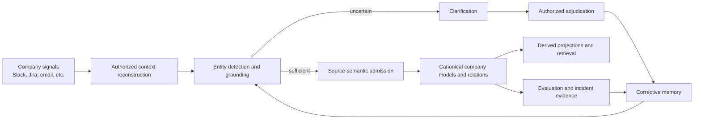

# Autonomous Company Learning — Journey, Current State and Remaining Work

**Document type:** Living execution record

**Branch:** `codex/autonomous-company-learning`

**Worktree:** `/Users/rachinkalakheti/fyraliscore-autonomous-learning`

**Current checkpoint:** `24f345a8`

**Last updated:** 2026-07-16

## Purpose

This document records the journey of the autonomous company-learning goal:
what we intended to build, what was actually implemented, what went wrong in
the implementation process, what evidence currently exists, and what remains.

It is deliberately separate from:

- the normative architecture documents;
- the architecture discovery log;
- the implementation/reuse audit;
- the objective evaluation framework.

Those documents explain what the system should be. This document explains where
the work actually is.

## Update Protocol

Update this document whenever one of these occurs:

1. a meaningful implementation checkpoint is committed;
2. an end-to-end or causal evaluation changes the confidence boundary;
3. a major architecture decision is accepted, rejected or deferred;
4. a new blocker changes the remaining-work sequence;
5. the progress estimate changes materially.

For every update:

- change the current checkpoint and date;
- update the component-state and remaining-work sections;
- record exact validation evidence without inflating what it proves;
- append one dated entry to the progress ledger;
- keep task autonomy explicitly outside the active scope.

## Highest-Level Objective

The active goal is:

> Build a company-memory substrate that continuously converts authorized company
> signals into a more accurate, coherent and useful model of the company, learns
> from human and system feedback, and reuses those corrections autonomously
> without corrupting source truth.

The learning and feedback loop should be autonomous. The system should:

1. observe company signals;
2. reconstruct enough authorized context;
3. detect and ground company entities;
4. preserve ambiguity when evidence is insufficient;
5. admit only justified semantic beliefs;
6. ask for clarification at the highest-leverage uncertainty;
7. turn an authorized answer into corrective memory;
8. reuse that memory on later signals;
9. repair affected derived state;
10. measure whether reuse improves outcomes without increasing unsafe behavior.

## Explicit Non-Goal

Autonomous task execution is not part of the current goal.

The system is not currently being optimized to autonomously plan and execute
company work. Existing task-autonomy/agency code may remain for compatibility,
but it must not define or contaminate the active company-learning architecture.

## Core Mental Model



The graph is not an end in itself. It is the current, evidence-grounded company
model produced by this metabolism. Retrieval and adaptive inquiry are consumers
and feedback mechanisms around that substrate.

## Where the Journey Started

The work began as an architecture and evaluation-design exercise:

- reinterpret the graph as a living model of company physics;
- make feedback and learning loops central;
- define ideal system behavior from low-level functions to product outcomes;
- produce detailed implementation and evaluator documents;
- make company-entity extraction a first-order correctness boundary;
- handle Slack as a boundaryless, context-dependent signal source.

The initial work generated substantial specification detail, but implementation
progress was slower than expected and insufficiently isolated from the existing
repository.

## Why the Journey Took Too Long

### 1. Repository isolation happened too late

The original repository contained roughly 150 unrelated dirty paths. Working
inside that tree made every inspection, edit, test and commit require extra
caution.

Correction:

- created a dedicated worktree;
- created `codex/autonomous-company-learning`;
- made isolation a P0 prerequisite rather than an optimization.

### 2. Too much was treated as sequential

Shared-worktree and shared-Postgres failures led to excessive serialization.
Only overlapping edits, commits and shared-database test runs needed to be
serialized. Static analysis, evaluator work, documentation, domain extraction
and independent code lanes could run concurrently.

Correction:

- use non-overlapping file ownership for parallel agents;
- keep shared-Postgres suites sequential;
- merge at explicit checkpoints.

### 3. Edge cases were pursued before the core vertical was proven

The work repeatedly expanded into architecture gaps before proving one complete
signal-to-learning-to-reuse path.

Correction:

- prioritize one end-to-end Slack/entity/correction/reuse path;
- record discovered gaps in the reuse audit and discovery log;
- return to them after the core vertical is executable.

### 4. Existing components were not audited for reuse early enough

There was a risk of creating parallel subsystems for evaluation, clarification,
ingest and proof.

Correction:

- use the existing ingest `alias_repo` injection seam;
- use the canonical proof models and manifest aggregator;
- keep Company Vitals as the sole system report;
- extract clarification adjudication from the gateway into one reusable domain
  operation;
- preserve existing grounding, source-semantic and Model writers.

### 5. Mechanical closure was initially confused with causal learning proof

Storing a clarification, closing a grounding trace and later replaying an alias
show that the loop is connected. They do not prove that the learned policy
improves held-out outcomes.

Correction:

- add matched adaptive-versus-frozen experiments;
- seal gold before execution;
- derive correctness in the evaluator rather than trusting the harness;
- preserve every hard-safety incident;
- keep E3 runtime health separate from E4 synthetic causal evidence.

### 6. Attractive metrics were accepted before adversarial review

The first paired harness reported a strong lift, but review found treatment
leakage, global queue races, self-labelled correctness and shared longitudinal
state.

Correction:

- fresh adaptive/frozen tenants for every case;
- sequential arm execution with terminal semantic barriers;
- freeze the earliest corrective-memory consumer;
- preserve ordinary manual aliases in the frozen arm;
- require `resolved_for_consumer`;
- snapshot source observations;
- assert tenant noninterference;
- independently recompute the typed report in Company Vitals.

## Working Method Going Forward

1. Isolate the scope before editing.
2. Audit existing components before adding new ones.
3. Implement the smallest complete vertical first.
4. Keep architecture discoveries in the separate discovery log.
5. Record deferred edge cases instead of blocking the vertical.
6. Parallelize non-overlapping code, evaluator, audit and documentation lanes.
7. Run shared-database tests sequentially.
8. Commit every coherent, validated checkpoint.
9. Treat validation boundaries as part of the implementation.
10. Do not call a result causal or proof-bearing until adversarial review agrees.

## Current End-to-End Implemented Slice

```mermaid
flowchart LR
    A["Slack message with ambiguous NBI"] --> B["Grounding opportunity"]
    B --> C["Resolver review"]
    C --> D["Canonical clarification request"]
    D --> E["Authorized human adjudication"]
    E --> F["Adjudicated tenant-global exact alias"]
    F --> G["Later held-out Slack recurrence"]
    G --> H{"Adaptive or frozen arm"}
    H -->|adaptive| I["Governed exact-alias replay"]
    I --> J["Correct customer resolved<br/>0 LLM calls"]
    H -->|frozen| K["Learned alias hidden at ingest and resolver"]
    K --> L["Safe abstention<br/>1 LLM call"]
    J --> M["Source-semantic terminal fate"]
    L --> M
    M --> N["Typed paired report"]
    N --> O["Canonical INV-05 evidence"]
    O --> P["Company Vitals"]
```



## Component State

| Component | Current behavior | State |
| --- | --- | --- |
| Isolated development scope | Dedicated worktree and branch protect the main tree and enable narrow commits | Complete |
| Task-autonomy boundary | Active learning path is statically prevented from importing task-autonomy/legacy agency surfaces | Complete for active slice |
| Slack epistemic ownership | Unresolved grounding-owned Slack no longer competes with generic T1 Think ownership | Complete for current Slack path |
| Canonical entity review | New review obligations live in `clarification_requests`; legacy review queue remains compatibility-only | Complete |
| Clarification adjudication | Public domain operation owns authorization, alias persistence, successor grounding and feedback lineage; gateway delegates | Complete |
| Corrective-memory persistence | Authorized entity answers become lineage-valid adjudicated aliases without mutating source evidence | Complete for exact tenant-global aliases |
| Governed corrective replay | Later exact aliases can resolve autonomously from the adjudicated correction | Complete for exact tenant-global aliases |
| Frozen control seam | Clarification-learned memory can be hidden at ingest and resolver while ordinary manual aliases remain visible | Complete for experiment |
| Source semantics | Grounded Slack reaches interpretation and an explicit `belief_applied` or `no_admission` fate | Complete for current vertical |
| Canonical Model write | Renewal creates one Model; duplicate/unsupported support and risk signals correctly create none | Complete for sealed cases |
| Source immutability | Paired harness snapshots the recurrence Observation and reports mutation as a hard incident | Complete in paired harness |
| Tenant isolation | Paired harness asserts recurrence observations, grounding, Models and aliases do not cross arm tenants | Complete in paired harness |
| Company-learning evaluator | Context, grounding and source-semantic state compile into one active-slice evaluation | Complete for measured slice |
| Paired causal evaluator | Correctness is derived from sealed arm-specific gold and terminal consumer fate; incidents are noncompensatory | Complete for current case family |
| Canonical proof integration | Experiment scenario and lift metric are registered under INV-05 and aggregated through canonical proof models | Complete |
| Company Vitals | Reopens and validates positive, negative, population, Slack and correction artifacts; verifies architecture and implementation-plan identity; enforces noncompensatory safety; displays the combined assurance without score inflation | Complete for current assurance surfaces |
| Evaluator synchronization | V2 assurance binds architecture/plan identity, explicit Slack proof scope, active company-learning scope and first-class correction convergence | Complete |
| Negative/adversarial recurrence families | Contextual phrase, source conflict, homonym and unrelated controls run on real Postgres with zero incidents | Complete for four sealed controls |
| Held-out recurrence population | The sealed 60-case registry executes exactly once with continuous intervals, all four entity types and no selective reruns | Complete: 60/60 observed |
| Slack conversational reconstruction | All nine target families are source-native, supported and correct with zero contamination | Complete for sealed gold: 9/9 |
| Broad correction propagation | Wrong Models, recursive dependents, relations and projections are fenced or rebuilt; queued refresh work is consumed through the existing projector runtime | Complete for the seeded recursive cascade |
| Cross-source company physics | Equivalent learning behavior across Jira, email, documents and other sources | Partial / unproven |
| Long-duration autonomous learning | Drift, retention, rollback and regression behavior across many learning cycles | Not proven |

## Important Implementation Checkpoints

| Commit | Meaning |
| --- | --- |
| `ecaa28cc` | Isolated autonomous company-learning scope |
| `d9128436` | Turned entity clarifications into corrective memory |
| `6503dd41` | Isolated neutral semantic write context |
| `dea89ffc` | Measured corrective-memory closure |
| `745dc9bd` | Repaired reviewed grounding into company memory |
| `34774139` | Replayed governed entity corrections autonomously |
| `52d97538` | Unified company-learning proof in Company Vitals |
| `a1303b19` | Made clarifications own entity review |
| `b241134e` | Gave unresolved Slack one epistemic owner |
| `9df63148` | Added frozen corrective-memory control |
| `7527a34d` | Moved entity adjudication from the gateway into the domain |
| `5f04dbf8` | Added sealed paired evidence and canonical proof integration |
| `5ba59e42` | Added isolated real-Postgres corrective-memory experiment |
| `3337c9b2` | Extended fail-closed correction repair to relations, projections and correction-specific T4 convergence |
| `31eb46fd` | Sealed all nine Slack reconstruction families and fixed long-range contamination |
| `7738487d` | Added the real-Postgres 60-case held-out population runner |
| `e81419cd` | Proved correction end-state convergence on real Postgres |
| `5cc358e6` | Normalized canonical entity candidate identity across implicit/explicit version one |
| `11248d5a` | Integrated digest-verified, noncompensatory combined assurance into Company Vitals |
| `6c0a273a` | Aligned the assurance report with the real-Postgres correction convergence proof boundary |
| `b5afa9af` | Generalized the held-out runtime to customer, project, team and system targets |
| `1142a8ed` | Closed recursive correction fanout and projection refresh convergence |
| `6902b149` | Added source-native Slack deletion, reaction and cross-channel reconstruction |
| `8140b942` | Sealed the 60-case and nine-family combined assurance gate |
| `d6908b39` | Removed proof gaps already closed by the complete sealed run |

## Current Validation Evidence

### Paired causal slice

Real-Postgres result:

- three independent matched recurrence pairs;
- six distinct arm tenants;
- adaptive correctness: `1.0`;
- frozen correctness: `0.0`;
- adaptive-minus-frozen lift: `1.0`;
- adaptive LLM calls: `0`;
- frozen LLM calls: `3`;
- calls avoided: `3`;
- detected hard-safety incidents: `0`;
- complete correction-to-grounding/source-semantic lineage: `1.0`.

Semantic outcomes:

- renewal: `belief_applied`, exactly one new Model;
- support: `no_admission`, zero new Models;
- risk: `no_admission`, zero new Models.

This distinction matters: entity learning succeeds on all three cases without
forcing every resolved signal to become a belief.

### Focused validation

- trusted combined assurance CLI integration: `1 passed in 58.28s`;
- final combined assurance command: exit `0`, status `working`, no blocking
  failures;
- focused evaluator, Vitals, Slack, grounding and correction unit suite:
  `67 passed`;
- correction end-state real-Postgres integration: `1 passed`;
- 60-case held-out population real-Postgres execution: exit `0`, `60/60`
  observed;
- import-linter: 7 contracts kept, 0 broken;
- architecture ratchets: passed;
- production environment contract: passed;
- changed-file Ruff and Python compilation: passed;
- every combined-assurance component is reopened, identity-checked,
  digest-recomputed and cross-bound before Company Vitals accepts it.

### Held-out population

The sealed registry contains 60 cases and was executed once without selective
reruns:

- 60 selected and assigned cases;
- 120 unique fresh tenants;
- 60 measured pairs: 15 each customer, project, team and system;
- zero unsupported cases;
- adaptive correctness: `1.0`, Wilson 95% interval `[0.9398, 1.0]`;
- frozen correctness: `0.0`, Wilson 95% interval `[0.0, 0.0602]`;
- paired correctness lift: `1.0`, bootstrap interval `[1.0, 1.0]`;
- adaptive and frozen observed unsafe rate: `0.0`;
- mean LLM calls avoided: `1.0`.

The statistical result covers every sealed entity-type stratum in the registry.

### Slack reconstruction

All nine intended Slack boundary families are now sealed:

- supported and correct: thread root/replies, edit revision, deletion/tombstone,
  reaction evidence, long-range recurrence, high-similarity abstention,
  cross-thread dependency, cross-channel dependency and pronoun/coreference;
- correct and supported: `9/9`;
- selected-context precision: `1.0`;
- contamination: `0.0`;
- topology recall: `1.0`;
- long-range recall: `1.0`;
- budget adherence: `1.0`;
- sufficient-set recall: `1.0`;
- edit/delete correctness: `1.0`;
- cross-channel recall: `1.0`.

### Correction convergence

The real-Postgres correction proof now verifies that:

- the predecessor-admitted wrong Model becomes `archived/superseded`;
- direct dependents are immediately hidden;
- contaminated relation frames and relation-edge projections are retired;
- contaminated projection snapshots and dependencies are removed;
- direct and second-hop dependents receive immediate-parent correction lineage
  and are hidden in the original transaction;
- T4 archives both dependent levels after their last positive support
  disappears rather than applying a confidence nudge;
- the existing projector runtime consumes the queued refresh and rebuilds an
  empty, fresh projection with no contaminated source Model;
- replay is idempotent;
- source observations and another tenant remain unchanged.

### Known validation caveat

The repository-wide technical-debt budget currently fails on pre-existing
global counts and unrelated named files. The current changes preserve one large
clarification workflow while moving it from the gateway into the domain; they
do not resolve the repository-wide debt budget.

## What the Current Evidence Proves

The current system proves one narrow but real causal statement:

> Across all 60 sealed exact-alias Slack cases spanning customers, projects,
> teams and systems, authorized corrective memory causes correct later entity
> resolution and avoids resolver-model calls, while the matched frozen system
> safely abstains.

It also proves:

- source evidence is not mutated in this path;
- the resolver is not allowed to invent entity IDs;
- corrective memory can be persisted and replayed with human authorization;
- frozen evaluation blocks corrective-memory use at the earliest consumers;
- ordinary manual entity knowledge remains available in the frozen arm;
- identity correctness and semantic belief admission are separately evaluated;
- typed evidence can be validated, recomputed and integrated into canonical
  invariant proof.
- direct correction can converge through Models, relations and projections
  without mutating source truth or another tenant.

## What the Current Evidence Does Not Prove

It does not yet prove:

- safety and calibration when unseen spellings, acronyms or short forms collide
  with another permitted entity;
- broad contextual references, descriptions or local nicknames beyond the
  sealed cases;
- broad conflicting-evidence and homonym populations beyond one case each;
- canonical merge, split, replacement or resurrection behavior beyond the
  customer rename/archive/name-reuse proof;
- `SourceIdentityBinding` rebind and revocation lifecycle;
- open-world Slack reconstruction across long time spans and channels;
- real-provider/model robustness;
- production connector transport of authenticated source-identity claims;
- equivalent behavior across Jira, email, documents and meetings;
- very large correction cascades beyond the bounded seeded proof;
- long-term retention without catastrophic overgeneralization;
- customer value or E5 production benefit.

## Progress Estimate

These are planning estimates, not evaluator metrics.

The estimate assumes reuse of the existing SAGE learner, retrieval machinery,
Model/event writers, projection runtime, grounding protocols and proof
framework. Existing code is credited only where the active learning loop
actually consumes it or a focused test proves the intended integration. SAGE's
mere presence in the repository is not counted as completed company learning.

| Scope | Estimate | Meaning |
| --- | ---: | --- |
| Exact-alias Slack clarification-to-reuse vertical | 100% | Implemented, real-Postgres tested and causally compared |
| Active autonomous company-learning runtime | 90–92% | Exact replay, unambiguous candidate-memory variants, the full 16-case collision matrix and the 8-case customer lifecycle proof are green; production connector claim transport, broader lifecycle and multi-source breadth remain |
| Customer-free objective substantiation | 84–87% | The 60-case registry, nine-family Slack gold, negative controls, correction convergence, 24-case positive variants, 16-case collision matrix and 8-case lifecycle proof are green; open-world, retention and provider robustness remain |
| Broader revised system excluding task autonomy | 76–80% | The core company-memory and autonomous correction loop is strong, but cross-source production semantics, merge/split/resurrection lifecycle, SAGE outcome adaptation and long-duration validation remain incomplete |

Task autonomy is excluded from all percentages.

## Remaining Work

### P0 — Required before believing the company-learning system broadly works

1. **Synchronize the evaluator with the implemented company-learning system**
   - Update the objective-evaluation framework's current executable checkpoint
     to reflect the sealed 60-case four-entity population, all nine Slack
     reconstruction families, negative controls, recursive correction
     convergence and trusted Company Vitals integration.
   - Remove or narrow proof-gap statements that the executable evidence has
     closed while preserving open-world, scale, source-breadth and E5 limits.
   - Repair the stale implementation-plan digest and bind the combined
     assurance summary to the reviewed architecture and implementation-plan
     identity.
   - Make correction convergence a first-class component of the combined
     assurance command instead of citing a separately executed Postgres proof.
   - Replace the hard-coded Slack `diagnostic_only` classification with explicit
     evidence tier, scope completeness, open-world completeness and blocking
     policy.
   - Declare an active evaluator profile for autonomous company learning and
     company modeling with autonomous task planning and execution excluded.
   - Keep Company Vitals and the existing invariant-proof spine as the sole
     system evaluator; do not create a parallel health or assurance framework.
   - Current result: complete for the active profile. Assurance v5 runs and
     cross-validates positive, negative, exact population, variant population,
     collision, customer lifecycle, Slack reconstruction and correction
     evidence; validates architecture and plan digests; excludes task autonomy;
     and passes the real-Postgres CLI integration.

2. **Add non-resolution and ambiguity controls**
   - Contextual phrase negative.
   - Unrelated alias negative.
   - Homonym/local-association case.
   - Conflicting source hint.
   - Assert zero unsafe global alias creation and zero wrong Models.
   - Current result: all four cases execute on real Postgres with eight fresh
     tenants, zero adaptive/frozen safety incidents and zero wrong Models.
     Context-local adjudications no longer enter ingest entity hints, while
     tenant-global exact reuse remains adaptive `3/3` versus frozen `0/3`.

3. **Expand and adversarially bound non-exact surface reuse**
   - Unseen spelling and abbreviation variants.
   - Pronouns, descriptions and local nicknames.
   - Context-dependent references whose meaning changes by channel/thread/time.
   - Explicitly measure when retrieval/context helps and when it contaminates.
   - Current result: a sealed 24-pair population covers six mechanically
     rankable families across customer, project, team and system entities:
     acronym, punctuation-compaction, hyphen/spacing, anchored short form,
     omitted-letter subsequence and possessive/plural. The adaptive arm receives
     the governed target candidate and resolves `24/24`; the frozen arm receives
     no target-candidate exposure and safely reviews or abstains `24/24`.
     Source evidence remains immutable and the report records zero hard-safety
     incidents. This proves candidate-memory lift for unambiguous variants, not
     collision safety or canonical alias promotion.

4. **Prove Slack conversational reconstruction**
   - Source-native edit/delete/reaction behavior.
   - Cross-thread and cross-channel dependencies.
   - Long-range temporal context.
   - Sufficient-context and contamination gold.
   - Boundaryless episode reconstruction rather than fixed windows.
   - Current result: all nine families are supported and correct. Precision,
     contamination avoidance, topology, long-range recall, cross-channel
     recall, edit/delete correctness, budget adherence, sufficient-set recall
     and safe abstention are all `1.0`.

5. **Complete correction propagation**
   - Identify every accepted Model, relation, edge and projection that depended
     on the wrong grounding.
   - Fence unsafe reads immediately.
   - Recompute or supersede all affected derived state.
   - Measure convergence time and residual correction debt.
   - Current result: the seeded real-Postgres cascade includes wrong-Model
     archival, direct and second-hop dependent hiding/archive, relation and
     relation-edge retirement, projection snapshot/dependency removal and
     successful refresh-job consumption. Only larger/deeper cascade
     characterization remains.

6. **Scale the held-out population**
   - Generate enough independent matched pairs for uncertainty intervals.
   - Stratify by source, ambiguity, entity type, context length and consequence.
   - Preserve every pair and prevent selective rerun reporting.
   - Current result: all 60 cases are observed and pass, with 15 cases each for
     customer, project, team and system and zero incidents.

7. **Prove variant collision and minimum entity-lifecycle safety**
   - Colliding acronyms, short forms, punctuation forms and omitted-letter
     variants across both the same and different entity types must review or
     abstain rather than select the learned target.
   - A true rename must preserve one referent only with explicit continuity and
     valid-time lineage; an archived name reused by a new entity must not
     redirect historical evidence.
   - Merge, split, replacement and resurrection must use canonical lifecycle
     writers and dependent repair rather than alias mutation.
   - Current result: the sealed collision matrix runs `16/16` cases on real
     PostgreSQL with zero incidents, unsafe resolutions, wrong Models or alias
     promotions. Both authenticated source-native cases resolve the authorized
     conflicting target in both arms, while unauthenticated competing hints
     preserve both candidates and force safe uncertainty. The separate
     customer lifecycle proof runs `8/8`: UUID continuity, valid-time
     resolution, stale/current alias safety, historical name reuse, old
     Observation/Model immutability, archive rejection, interval non-overlap,
     tenant isolation and replay idempotency are all `1.0`. Merge, split,
     replacement, resurrection and non-customer identity lifecycle remain.

### P1 — Required for a strong multi-source product

1. Converge source-semantic direct application and normal Think application on
   one validation/apply contract.
2. Extend the same entity-learning loop to Jira, email, documents, meetings and
   other structured sources.
3. Extend the customer lifecycle proof to creation/transfer plus merge, split,
   replacement, resurrection and non-customer populations.
4. Expand actor/customer/project/system same-surface ambiguity beyond the P0
   variant-collision matrix.
5. Measure correction retention, forgetting and old-family regression.
6. Add cross-tenant adversarial suites beyond the current paired assertions.
7. Neutralize remaining active command-kernel `agency_*` naming without
   reactivating task autonomy.
8. Move shared database codec/bootstrap ownership out of gateway scope.

### P2 — Required for production confidence

1. Frozen real-provider/model runs.
2. Long-duration replay and restart testing.
3. Burst/load, backlog, cost and latency characterization.
4. Provider outage and partial-failure recovery.
5. Append-only experiment registry and signed/attested evidence manifests.
6. Open-world simulation with hidden company truth.
7. E5 customer-value evaluation after synthetic assurance is strong enough.

## Working Version Runbook

The primary runnable working version now executes the positive adaptive/frozen
learning loop, real-Postgres negative controls, the sealed 60-case population
the nine-family Slack reconstruction gold and the seeded recursive correction
burn through one command. It writes one digest-sealed v2 assurance summary,
reopens every component, checks the current architecture and implementation-plan
digests and embeds the validated result into Company Vitals without adding a
score.

### Prerequisite and command

`DATABASE_URL` must point to a reachable PostgreSQL database. The harness applies
the repository migrations before running. The same value can instead be passed
with `--database-url`.

```bash
DATABASE_URL=postgresql://... \
  python scripts/run_company_learning_assurance_suite.py \
    --output-dir reports/company-learning-assurance \
    --run-id company-learning-assurance \
    --system-version <git-sha-or-version>
```

`--llm-call-cost-usd` is optional and defaults to `0.001`.

### Generated artifacts

The output directory contains:

- `company_learning_assurance_summary.json`;
- `positive/company_learning_scenario_evidence.json`;
- `positive/vitals/company_learning_evaluation.json`;
- `positive/vitals/company_learning_evidence_bundle.json`;
- `positive/vitals/company_learning_assurance_summary.json`;
- `positive/vitals/vitals_scorecard.json`;
- `negative/company_learning_negative_controls_evidence.json`;
- `population/company_learning_population_evidence.json`;
- `slack/slack_reconstruction_observations.jsonl`;
- `slack/slack_reconstruction_existing_surface_report.json`;
- `correction/correction_assurance.json`;
- `correction/correction_assurance.md`.

### Successful-run behavior

A successful run:

- exits with status `0`;
- prints the summary path, working status, positive adaptive lift, negative
  incident count, held-out coverage, Slack status and correction status;
- validates and independently recomputes the positive, negative and held-out
  population results;
- executes and validates recursive correction convergence rather than relying
  on a separately cited test;
- joins real-database E3 runtime evidence with the paired E4 recurrence evidence
  in the positive Company Vitals component;
- preserves all detected hard-safety incidents rather than averaging them away;
- rejects recomputed outer summaries whose safety state, component digests,
  run identity, architecture/plan identity or population accounting contradict
  the underlying artifacts;
- fails on a positive hard failure, a missing required artifact or any negative
  safety/correction incident;
- treats incomplete sealed Slack scope as active-slice blocking while retaining
  explicit E4 and open-world-incomplete labels;
- leaves all 30 general product vitals explicitly unmeasured in the focused
  positive Vitals component.

### Proof boundary

This working version proves a real-Postgres exact tenant-global learning slice,
four matched negative controls, all 60 measured recurrence pairs, all nine
Slack reconstruction families, all 24 positive variant cases, all 16 collision
cases, all eight customer identity-lifecycle cases and a recursive correction
cascade across Models, relations and projections. The joined E3/E4 evidence
remains insufficient for broad invariant closure. It is not open-world or
customer E5 evidence, does not prove equivalent multi-source production
learning, and does not include autonomous task execution.

The implementation assumes reuse of the existing SAGE learner, retrieval
machinery, Model/event writers, projection runtime, grounding protocols and
proof framework. This command does not prove generalized SAGE-mediated policy
adaptation merely because SAGE exists in the repository. Future learning should
feed outcome and utility evidence into those existing learning surfaces rather
than create a second learner. SAGE may adapt retrieval and reasoning policy, but
must not directly write canonical Models, graph truth, relations or source
evidence.

The typed experiment is bound to the report's run and system version and carries
its own sealed digests. It is not yet cryptographically bound to the exact
database tenant and observation manifest, so copied-artifact swap resistance is
not claimed by this working version.

### Explicitly deferred production hardening

- larger open-world homonym/conflict populations;
- merge/split/replacement/resurrection and non-customer identity lifecycle;
- `SourceIdentityBinding` rebind/revocation;
- production connector claim transport beyond the current evaluated surfaces;
- open-world simulation, real-provider runs and customer E5 validation;
- very large recursive correction cascades and sustained refresh load;
- cross-source equivalence;
- load, restart, outage, durability and evidence-attestation testing;
- cryptographic binding between the experiment artifact and the exact
  database-backed tenant/observation manifest.

## Next Execution Sequence

1. Add merge/split/replacement/resurrection cases through the canonical
   identity writer rather than alias mutation.
2. Complete production connector claim transport, then repeat the causal suite
   across Jira, email and document sources.
3. Add `SourceIdentityBinding` rebind/revocation lifecycle with stale-binding
   fencing and historical resolution.
4. Feed measured retrieval/reasoning outcomes into the existing SAGE adaptation
   surfaces without giving SAGE canonical write authority.
5. Add retention, forgetting and old-family regression evaluation.
6. Run frozen real-provider and long-duration restart/load suites.
7. Reassess progress from the same combined Company Vitals assurance report.

## Progress Ledger

### 2026-07-16 — Living journey record created

- Added a durable status document separate from architecture truth.
- Recorded the active objective and explicit task-autonomy exclusion.
- Captured the causes of the slow implementation journey and the corrected
  working method.
- Recorded the exact-alias paired causal result and its proof boundary.
- Split remaining work into P0/P1/P2.

### 2026-07-16 — Paired experiment accepted after adversarial repair

- Rejected the first attractive lift claim because of treatment leakage,
  semantic queue races, caller-labelled correctness and shared longitudinal
  state.
- Rebuilt the experiment with fresh tenants per case, sealed per-arm gold,
  sequential terminal barriers, source snapshots and tenant isolation.
- Real Postgres produced three adaptive wins, three avoided model calls and no
  detected hard-safety incident.

### 2026-07-16 — Proof and domain ownership consolidated

- Registered the paired scenario and lift metric under INV-05.
- Converted the report into canonical invariant evidence.
- Preserved the lower E3 tier during evidence aggregation.
- Moved entity-resolution adjudication from a private gateway helper into a
  public domain operation.

### 2026-07-16 — Runnable joined Company Vitals working version

- Added the exact command and database prerequisite for the joined
  company-learning harness.
- Documented its saved experiment, evaluation, manifest, evidence-bundle,
  scorecard and summary artifacts.
- Defined successful execution without inflating E3 plus synthetic E4 evidence
  into open-world or customer proof.
- Kept generalized SAGE adaptation, broader recurrence populations, confidence
  intervals and production hardening explicitly outside the proven slice.

### 2026-07-16 — Parallel breadth measurements

- Added and executed four real-Postgres negative controls with eight fresh,
  isolated tenants.
- Confirmed safe identity outcomes for the unrelated alias and source-hint
  conflict cases, while detecting two adaptive
  `contextual_alias_globalized` incidents for a local description and homonym.
- Added a deterministic 60-case exact-alias population with complete-registry
  enforcement and continuous confidence intervals; runtime execution remains
  pending.
- Added four sealed Slack reconstruction cases and measured the current
  handler/context-selection surface at `0/4` correct despite full required
  context recall.
- Added a read-only correction-propagation audit and a real-Postgres seeded
  stale-dependency test that proves unsafe readable debt can be detected without
  cross-tenant or source mutation.
- Preserved every failure as an explicit observed result rather than converting
  it into a passing benchmark.

### 2026-07-16 — Production fixes and combined assurance

- Prevented independently adjudicated `source_context_only` aliases from
  entering ingest entity hints while preserving governed tenant-global exact
  replay.
- Reran the positive and negative real-Postgres suites: positive adaptive
  correctness remains `1.0` versus frozen `0.0`, and all four negative controls
  now have zero safety incidents.
- Made Slack sufficiency candidate-specific, added evidence-relative bare-name
  ambiguity and source-derived context costs, then projected immutable Slack
  thread, reply and edit structure.
- Improved the four-case Slack gold from `0/4` to `3/4`, with topology and edit
  correctness at `1.0`.
- Added and real-Postgres-proved a direct correction fence that archives the
  wrong Model, hides direct dependents and queues idempotent correction-specific
  re-evaluation.
- Added one assurance command and digest-sealed summary combining positive
  Company Vitals, negative safety controls and Slack reconstruction. The final
  run is `working` with no blocking failures.

### 2026-07-16 — Trusted breadth and correction convergence

- Executed the sealed 60-case registry once: 15 customer pairs measured, 45
  project/team/system cases explicitly unsupported, zero observed incidents.
- Sealed all nine Slack families, fixed long-range contamination and added
  passing cross-thread and pronoun/coreference cases.
- Extended correction repair through relations and projections and proved
  archive convergence, replay idempotency, source immutability and tenant
  isolation on real Postgres.
- Found and fixed a canonical identity defect where implicit and explicit
  version-one entity references generated different candidate IDs.
- Integrated the full assurance into Company Vitals without score inflation.
- Added fail-closed validation for safety contradictions, component identity,
  component digests, Slack observation cross-binding and recomputed raw
  population accounting.
- Final real-Postgres assurance status: `working`, positive lift `1.0`, negative
  incidents `0`, population coverage `15/60`, Slack status
  `observed_with_gaps`.

### 2026-07-16 — Complete sealed working-version gate

- Generalized the recurrence runtime to canonical customer/resource/actor
  targets while preserving logical customer/project/team/system semantics.
- Reran the unchanged 60-case registry: `60/60` observed, zero unsupported and
  zero incidents.
- Added immutable Slack tombstones, reaction evidence and bounded cross-channel
  phrase-anchor retrieval; the nine-family report is now `9/9`.
- Extended correction propagation to bounded, cycle-safe second-hop fanout and
  consumed the queued refresh through the existing projection runtime.
- Final trusted combined assurance: status `working`, positive lift `1.0`,
  negative incidents `0`, population `60/60`, Slack status `observed`.

### 2026-07-16 — Evaluator synchronization promoted to P0

- Audited the executable assurance suite against the normative objective
  evaluation framework after the complete sealed working-version gate.
- Confirmed that the executable evaluator reflects the latest population,
  Slack, safety and trusted-report behavior, while the normative document still
  contains stale proof boundaries and a stale implementation-plan digest.
- Made evaluator synchronization, architecture identity binding, first-class
  correction convergence and explicit task-autonomy exclusion the first P0
  before further capability expansion.

### 2026-07-16 — Evaluator synchronization P0 completed

- Added the v2 combined assurance contract with current architecture-registry
  and implementation-plan digests and a machine-readable active profile that
  excludes autonomous task planning and execution.
- Replaced Slack's permanent diagnostic flag with explicit E4 evidence tier,
  sealed-scope completeness, open-world incompleteness and active-slice blocking
  semantics.
- Added a reusable correction assurance artifact and executable real-Postgres
  burn covering dependency discovery, immediate fences, direct and recursive
  repair, relation retirement, projection invalidation/rebuild, source
  immutability, replay idempotency and tenant isolation.
- Integrated correction into the same combined command and trusted Company
  Vitals envelope instead of citing a separate test.
- Real-Postgres CLI integration passed in `54.53s`.
- Durable combined artifact:
  `/tmp/fyralis-company-learning-assurance-p0-24f345a8`.
- Final status: `working`, no blocking failures, positive lift `1.0`, negative
  incidents `0`, population `60/60`, Slack scope complete at `9/9`, correction
  converged with every measured rate `1.0` and residual unsafe debt `0`.

### 2026-07-16 — Governed variant candidate-memory population

- Added a sealed 24-pair population with six non-exact variant families and six
  cases for each of customer, project, team and system.
- Preserved the causal boundary: both arms receive the same scripted model
  response, while only the adaptive arm may expose the clarification-learned
  target candidate.
- The full integration harness requires adaptive correctness `1.0`, frozen
  correctness `0.0`, frozen safe review/abstention `1.0`, source immutability
  `1.0`, zero control-integrity violations and zero hard-safety incidents.
- Assurance v3 now makes the variant population mandatory and
  noncompensatory, reopens its typed evidence, recomputes its digests and
  requires complete `24/24` coverage plus valid mechanism metrics before the
  combined result can remain `working`.

### 2026-07-16 — Variant proof joined to the real-Postgres system gate

- Integrated the variant population into the same executable assurance command,
  artifact path set, component-digest namespace and trusted Company Vitals
  envelope as the positive, negative, exact-population, Slack and correction
  evidence.
- The committed CLI integration test passed against local PostgreSQL, and the
  post-commit architecture ratchets, production environment contract and all
  seven import-linter contracts passed.
- The exact commit-labelled artifact is
  `/tmp/fyralis-company-learning-assurance-p0-6032fa84` with summary digest
  `e170f96475bb44da4c5d4b9c528165c0f6847e56b0e84969066ba73cba7d998d`.
- Final assurance status is `working` with no blocking failures: positive lift
  `1.0`, four negative controls with zero incidents, exact aliases `60/60`,
  variants `24/24`, Slack `9/9`, and correction convergence with zero residual
  unsafe debt.
- The variant mechanism evidence reports adaptive correctness `1.0`, frozen
  correctness `0.0`, adaptive and frozen unsafe rates `0.0`, candidate-memory
  mediated success `1.0`, adaptive target authorization `1.0`, frozen target
  exposure `0.0`, frozen safe review/abstention `1.0`, source immutability
  `1.0`, zero control-integrity violations and zero hard-safety incidents.

### 2026-07-16 — Variant collision evaluator sealed

- Added a deterministic 16-case negative-control registry covering same- and
  cross-type acronyms, ambiguous short forms, normalization collisions,
  channel-local nicknames, source-native conflicts, inactive targets and
  historical-name reuse.
- The evaluator distinguishes unsafe learned resolution from safe resolution
  backed by an explicitly authorized source-native identifier; ambiguous fixture
  text no longer leaks the conflicting answer.
- Continuous reports preserve candidate visibility, none-of-the-above
  availability, safe containment, unsafe and authoritative resolution, wrong
  Models, alias promotion, source immutability, support coverage and exact
  collision/entity/lifecycle strata.
- At this evaluator-only checkpoint, the two source-native-ID cases remained
  explicitly unsupported until genuine source-identity authority was
  persisted. The later runtime checkpoint below closes that historical gap.
- The working-version evaluator currently adds one file-over-threshold debt
  item. It is recorded for later module decomposition rather than delaying the
  first honest end-to-end collision result.

### 2026-07-16 — Full collision and customer lifecycle scope closed safely

- Added a reusable real-Postgres collision runner using the existing paired
  tenant, clarification, alias, resolver, grounding and candidate-set seams
  rather than a second entity-resolution subsystem.
- The first pre-fix report exposed `10/14` unsafe adaptive learned-target
  resolutions. The narrow ambiguity gate then changed the runtime law:
  multiple live exact candidates without one decisive authority now force
  review regardless of model confidence.
- Persisted `SourceIdentityBinding` evidence and explicit source-surface
  attachment then closed the two authenticated source-native cases. The
  current report is `observed`: adaptive and frozen arms safely satisfy all
  `16/16` cases with zero incidents, zero unsafe resolutions, zero wrong Models
  and zero alias promotions.
- Both arms retained complete colliding-candidate visibility,
  none-of-the-above availability and source immutability at `1.0`; no wrong
  downstream Models or alias promotions were observed.
- The liveness fence removed archived and inactive UUID-backed actor/resource/
  customer targets from ingest fast paths and resolver candidate inputs. That
  made all four stale-lifecycle collision cases safe.
- Added the resource-backed customer lifecycle and an eight-case real-Postgres
  proof. Rename continuity, valid-time lookup, stale/current alias safety,
  historical name reuse, old Observation/Model immutability, archive
  rejection, interval non-overlap, tenant isolation and rename/archive replay
  idempotency all measure `1.0` with `8/8` cases observed and zero violations.
- Assurance v5 makes both collision and customer lifecycle artifacts mandatory,
  reopens and recomputes their typed evidence and blocks `working` on any
  unsupported case, lifecycle metric below `1.0`, interval overlap, mutation,
  tenant leak, replay divergence or collision-safety regression.
- The full real-Postgres assurance CLI passed with status `working`, collision
  `16/16`, customer lifecycle `8/8` and no blocking failures. Summary digest:
  `40c8c30c8bbc40d08e2160176a156c9d54398a2535d2d38e56af3718aa201214`.
- Historical diagnostic artifact:
  `/tmp/fyralis-variant-collisions-first-honest`.
