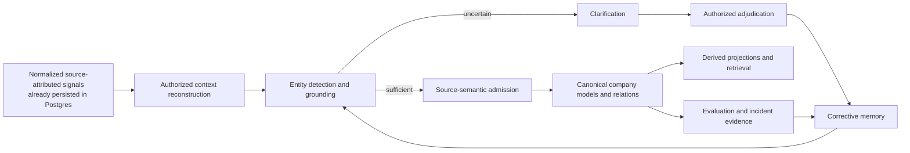

# Autonomous Company Learning — Journey, Current State and Remaining Work

**Document type:** Living execution record

**Branch:** `codex/autonomous-company-learning`

**Worktree:** `/Users/rachinkalakheti/fyraliscore-autonomous-learning`

**Current checkpoint:** `be401f25`

**Last updated:** 2026-07-17

## Purpose

This document records the journey of the autonomous company-learning goal:
what we intended to build, what was actually implemented, what went wrong in
the implementation process, what evidence currently exists, and what remains.

It is deliberately separate from:

- the normative architecture documents;
- the architecture discovery log;
- the implementation/reuse audit;
- the objective evaluation framework.

Those documents explain what the system should be. This document explains where
the work actually is.

## Update Protocol

Update this document whenever one of these occurs:

1. a meaningful implementation checkpoint is committed;
2. an end-to-end or causal evaluation changes the confidence boundary;
3. a major architecture decision is accepted, rejected or deferred;
4. a new blocker changes the remaining-work sequence;
5. the progress estimate changes materially.

For every update:

- change the current checkpoint and date;
- update the component-state and remaining-work sections;
- record exact validation evidence without inflating what it proves;
- append one dated entry to the progress ledger;
- keep task autonomy explicitly outside the active scope.

## Highest-Level Objective

The active goal is:

> Build a company-memory substrate that continuously converts authorized company
> signals into a more accurate, coherent and useful model of the company, learns
> from human and system feedback, and reuses those corrections autonomously
> without corrupting source truth.

The learning and feedback loop should be autonomous. The system should:

1. observe company signals;
2. reconstruct enough authorized context;
3. detect and ground company entities;
4. preserve ambiguity when evidence is insufficient;
5. admit only justified semantic beliefs;
6. ask for clarification at the highest-leverage uncertainty;
7. turn an authorized answer into corrective memory;
8. reuse that memory on later signals;
9. repair affected derived state;
10. measure whether reuse improves outcomes without increasing unsafe behavior.

## Explicit Non-Goal

Autonomous task execution is not part of the current goal.

The system is not currently being optimized to autonomously plan and execute
company work. Existing task-autonomy/agency code may remain for compatibility,
but it must not define or contaminate the active company-learning architecture.

Connector, listener and source-ingestion transport is also outside the active
implementation and evaluation goal. The current tests begin from simulated,
normalized, source-attributed signals that are already durably persisted in
PostgreSQL. Source semantics, identity authority, company-memory learning,
correction and lifecycle repair remain in scope; proving how Slack, Jira,
email or another provider delivers those normalized rows does not.

## Core Mental Model



The graph is not an end in itself. It is the current, evidence-grounded company
model produced by this metabolism. Retrieval and adaptive inquiry are consumers
and feedback mechanisms around that substrate.

## Where the Journey Started

The work began as an architecture and evaluation-design exercise:

- reinterpret the graph as a living model of company physics;
- make feedback and learning loops central;
- define ideal system behavior from low-level functions to product outcomes;
- produce detailed implementation and evaluator documents;
- make company-entity extraction a first-order correctness boundary;
- handle Slack as a boundaryless, context-dependent signal source.

The initial work generated substantial specification detail, but implementation
progress was slower than expected and insufficiently isolated from the existing
repository.

## Why the Journey Took Too Long

### 1. Repository isolation happened too late

The original repository contained roughly 150 unrelated dirty paths. Working
inside that tree made every inspection, edit, test and commit require extra
caution.

Correction:

- created a dedicated worktree;
- created `codex/autonomous-company-learning`;
- made isolation a P0 prerequisite rather than an optimization.

### 2. Too much was treated as sequential

Shared-worktree and shared-Postgres failures led to excessive serialization.
Only overlapping edits, commits and shared-database test runs needed to be
serialized. Static analysis, evaluator work, documentation, domain extraction
and independent code lanes could run concurrently.

Correction:

- use non-overlapping file ownership for parallel agents;
- keep shared-Postgres suites sequential;
- merge at explicit checkpoints.

### 3. Edge cases were pursued before the core vertical was proven

The work repeatedly expanded into architecture gaps before proving one complete
signal-to-learning-to-reuse path.

Correction:

- prioritize one end-to-end Slack/entity/correction/reuse path;
- record discovered gaps in the reuse audit and discovery log;
- return to them after the core vertical is executable.

### 4. Existing components were not audited for reuse early enough

There was a risk of creating parallel subsystems for evaluation, clarification,
ingest and proof.

Correction:

- use the existing ingest `alias_repo` injection seam;
- use the canonical proof models and manifest aggregator;
- keep Company Vitals as the sole system report;
- extract clarification adjudication from the gateway into one reusable domain
  operation;
- preserve existing grounding, source-semantic and Model writers.

### 5. Mechanical closure was initially confused with causal learning proof

Storing a clarification, closing a grounding trace and later replaying an alias
show that the loop is connected. They do not prove that the learned policy
improves held-out outcomes.

Correction:

- add matched adaptive-versus-frozen experiments;
- seal gold before execution;
- derive correctness in the evaluator rather than trusting the harness;
- preserve every hard-safety incident;
- keep E3 runtime health separate from E4 synthetic causal evidence.

### 6. Attractive metrics were accepted before adversarial review

The first paired harness reported a strong lift, but review found treatment
leakage, global queue races, self-labelled correctness and shared longitudinal
state.

Correction:

- fresh adaptive/frozen tenants for every case;
- sequential arm execution with terminal semantic barriers;
- freeze the earliest corrective-memory consumer;
- preserve ordinary manual aliases in the frozen arm;
- require `resolved_for_consumer`;
- snapshot source observations;
- assert tenant noninterference;
- independently recompute the typed report in Company Vitals.

## Working Method Going Forward

1. Isolate the scope before editing.
2. Audit existing components before adding new ones.
3. Implement the smallest complete vertical first.
4. Keep architecture discoveries in the separate discovery log.
5. Record deferred edge cases instead of blocking the vertical.
6. Parallelize non-overlapping code, evaluator, audit and documentation lanes.
7. Run shared-database tests sequentially.
8. Commit every coherent, validated checkpoint.
9. Treat validation boundaries as part of the implementation.
10. Do not call a result causal or proof-bearing until adversarial review agrees.
11. Time-box seam discovery: if an implementation lane has not produced a
    first test, artifact or code checkpoint after a bounded audit, cut scope to
    the smallest runnable proof instead of continuing design exploration.
12. Require early reversible checkpoints: evaluator contracts and pure tests
    land before expensive Postgres orchestration, and runtime schema/repository
    changes land before being folded into the combined assurance command.
13. Give every database-backed lane its own disposable database. Parallel
    agents may inspect and edit disjoint files concurrently, but they must not
    share mutable test tenants, queues or migration state.
14. Reuse production seams directly. A new evaluator may measure an existing
    writer, resolver or SAGE consumer, but it must not introduce a
    second authority, truth store, learner or health-report spine.
15. Keep the critical path explicit: source identity and entity grounding,
    feedback reuse, correction safety and Company Vitals evidence take
    precedence over exhaustive matrices, generalized frameworks and production
    polish.

### Parallel Lane Contract

Every parallel lane must declare:

- exclusive file ownership or a new-file-only boundary;
- the production seam it reuses;
- one continuous metric and one noncompensatory safety condition;
- the smallest independently committable checkpoint;
- the exact disposable-database or no-database validation boundary;
- deferred breadth that will be recorded instead of blocking the vertical.

The integration lane does not wait for every edge case. It joins only committed,
independently validated component artifacts, recomputes their digests and
preserves their proof gaps.

## Current End-to-End Implemented Slice

```mermaid
flowchart LR
    A["Simulated normalized signal in Postgres<br/>with ambiguous NBI"] --> B["Grounding opportunity"]
    B --> C["Resolver review"]
    C --> D["Canonical clarification request"]
    D --> E["Authorized human adjudication"]
    E --> F["Adjudicated tenant-global exact alias"]
    F --> G["Later held-out Slack recurrence"]
    G --> H{"Adaptive or frozen arm"}
    H -->|adaptive| I["Governed exact-alias replay"]
    I --> J["Correct customer resolved<br/>0 LLM calls"]
    H -->|frozen| K["Learned alias hidden at ingest and resolver"]
    K --> L["Safe abstention<br/>1 LLM call"]
    J --> M["Source-semantic terminal fate"]
    L --> M
    M --> N["Typed paired report"]
    N --> O["Canonical INV-05 evidence"]
    O --> P["Company Vitals"]
```



## Component State

| Component | Current behavior | State |
| --- | --- | --- |
| Isolated development scope | Dedicated worktree and branch protect the main tree and enable narrow commits | Complete |
| Task-autonomy boundary | Active learning path is statically prevented from importing task-autonomy/legacy agency surfaces | Complete for active slice |
| Signal-input boundary | Evaluation begins from simulated, normalized, source-attributed signals already persisted in PostgreSQL; connector/listener transport is not exercised | Complete and explicit for the active scope |
| Conversational-signal epistemic ownership | Unresolved grounding-owned conversational signals no longer compete with generic T1 Think ownership | Complete for the current persisted-signal path |
| Canonical entity review | New review obligations live in `clarification_requests`; legacy review queue remains compatibility-only | Complete |
| Clarification adjudication | Public domain operation owns authorization, alias persistence, successor grounding and feedback lineage; gateway delegates | Complete |
| Corrective-memory persistence | Authorized entity answers become lineage-valid adjudicated aliases without mutating source evidence | Complete for exact tenant-global aliases |
| Governed corrective replay | Later exact aliases can resolve autonomously from the adjudicated correction | Complete for exact tenant-global aliases |
| Frozen control seam | Clarification-learned memory can be hidden at ingest and resolver while ordinary manual aliases remain visible | Complete for experiment |
| Source semantics | A grounded persisted signal reaches interpretation and an explicit `belief_applied` or `no_admission` fate | Complete for current vertical |
| Canonical Model write | Renewal creates one Model; duplicate/unsupported support and risk signals correctly create none | Complete for sealed cases |
| Source immutability | Paired harness snapshots the recurrence Observation and reports mutation as a hard incident | Complete in paired harness |
| Tenant isolation | Paired harness asserts recurrence observations, grounding, Models and aliases do not cross arm tenants | Complete in paired harness |
| Company-learning evaluator | Context, grounding and source-semantic state compile into one active-slice evaluation | Complete for measured slice |
| Paired causal evaluator | Correctness is derived from sealed arm-specific gold and terminal consumer fate; incidents are noncompensatory | Complete for current case family |
| Canonical proof integration | Experiment scenario and lift metric are registered under INV-05 and aggregated through canonical proof models | Complete |
| Company Vitals | Reopens Assurance v7, DB-backed company-physics traces and the authoritative 45-batch simulation artifacts; noncompensatory entity and reliability incidents override high continuous scores | Complete for current v7 and large-simulation reporting |
| Evaluator synchronization | V7 requires replacement and source-binding lifecycle evidence, reopens digest-bound raw DB manifests, binds repository provenance and rejects unsupported evidence-tier inflation | Complete for the current E4 assurance profile |
| Negative/adversarial recurrence families | Contextual phrase, source conflict, homonym and unrelated controls run on real Postgres with zero incidents | Complete for four sealed controls |
| Held-out recurrence population | The sealed 60-case registry executes exactly once with continuous intervals, all four entity types and no selective reruns | Complete: 60/60 observed |
| Conversational reconstruction | All nine Slack-shaped semantic families are source-attributed, supported and correct with zero contamination from persisted normalized fixtures; provider transport is not part of the claim | Complete for sealed gold: 9/9 |
| Broad correction propagation | Wrong Models, recursive dependents, relations and projections are fenced or rebuilt; queued refresh work is consumed through the existing projector runtime | Complete for the seeded recursive cascade |
| Cross-source company physics | Persisted Jira-, Linear-, Google Drive- and Gmail-attributed fixtures preserve governed source identity through grounding; connector/listener transport and equivalent causal learning are outside or beyond the current proof | Complete for the persisted identity semantics measured |
| SAGE feedback reuse | Grounding and source-semantic terminal outcomes alter future matching-source retrieval salience without truth or authority writes | Complete for first bounded source-salience bridge |
| Active-surface evaluator | Six sealed identity surfaces across Jira, Linear, Google Drive and Gmail plus five source-salience cases are recomputed, reopened and gated noncompensatorily | Complete in assurance v6: identity 6/6, salience 5/5 |
| Source-identity lifecycle | Bindings support close, revoke and supersede with valid-time history, immutable attachment versions, a database exclusion constraint, populated colliding-tenant proof and a digest-bound query/row/error manifest | Complete for the sealed 12/12 E4 lifecycle proof |
| Retention and forgetting evaluator | Exact and governed-variant behavior is measured at 0/4/16 alias-interference cycles and 0/1/2 worker-object restarts; correction, four negative controls and three collision families are checked noncompensatorily | Complete in assurance v6: 14/14, forgetting 0.0; not process-restart or long-duration proof |
| Canonical resource replacement | One atomic orchestrator governs transition lineage, predecessor retirement, alias closure, exact source-binding supersession and projection invalidation while preserving Observations, attachments and Models; resource reads can resolve the lineage head at explicit valid/known cutoffs | Complete for the sealed resource vertical: 20/20 observed, zero gaps or violations |
| Large cold-start company learning | One fresh tenant processed 1,125 signals in 45 genuine 25-signal batches from zero semantic memory; all work drained and later evidence changed memory | Executed; authoritative verdict `not_credible` because entity grounding and retrieval behavior failed required trust gates |

## Important Implementation Checkpoints

| Commit | Meaning |
| --- | --- |
| `ecaa28cc` | Isolated autonomous company-learning scope |
| `d9128436` | Turned entity clarifications into corrective memory |
| `6503dd41` | Isolated neutral semantic write context |
| `dea89ffc` | Measured corrective-memory closure |
| `745dc9bd` | Repaired reviewed grounding into company memory |
| `34774139` | Replayed governed entity corrections autonomously |
| `52d97538` | Unified company-learning proof in Company Vitals |
| `a1303b19` | Made clarifications own entity review |
| `b241134e` | Gave unresolved Slack one epistemic owner |
| `9df63148` | Added frozen corrective-memory control |
| `7527a34d` | Moved entity adjudication from the gateway into the domain |
| `5f04dbf8` | Added sealed paired evidence and canonical proof integration |
| `5ba59e42` | Added isolated real-Postgres corrective-memory experiment |
| `3337c9b2` | Extended fail-closed correction repair to relations, projections and correction-specific T4 convergence |
| `31eb46fd` | Sealed all nine Slack reconstruction families and fixed long-range contamination |
| `7738487d` | Added the real-Postgres 60-case held-out population runner |
| `e81419cd` | Proved correction end-state convergence on real Postgres |
| `5cc358e6` | Normalized canonical entity candidate identity across implicit/explicit version one |
| `11248d5a` | Integrated digest-verified, noncompensatory combined assurance into Company Vitals |
| `6c0a273a` | Aligned the assurance report with the real-Postgres correction convergence proof boundary |
| `b5afa9af` | Generalized the held-out runtime to customer, project, team and system targets |
| `1142a8ed` | Closed recursive correction fanout and projection refresh convergence |
| `6902b149` | Added source-native Slack deletion, reaction and cross-channel reconstruction |
| `8140b942` | Sealed the 60-case and nine-family combined assurance gate |
| `d6908b39` | Removed proof gaps already closed by the complete sealed run |
| `ac963125` | Reused grounding/source-semantic outcomes as bounded SAGE source-salience memory |
| `4b6ef3c8` | Added governed Linear project/team structured identity transport |
| `e450eec4` | Added Google Drive file and Gmail thread structured identity nominations |
| `d47eb391` | Proved Drive/Gmail exact attachment, forged-text rejection and tenant/source isolation |
| `c11ff6ba` / `042ad293` / `41ae2771` | Defined, sealed and ran the standalone active structured-identity/source-salience proof |
| `a4ca188f` | Added versioned source-identity close, revoke and supersede lifecycle |
| `c64585fb` | Rejected overlapping source bindings after scheduled terminal transitions |
| `33a50ac2` / `e9ca7057` | Defined and ran the bounded retention/forgetting regression proof |
| `9d9db9e5` | Made correction-authority and negative/collision retention regressions noncompensatory |
| `4d2023ac` | Added active-surface and retention components to assurance v6 and Company Vitals |
| `00bf559f` | Sealed exact source-claim, cross-tenant and 14-observation retention scope |
| `3a21f6b1` | Made Unicode corrective-memory verification use production Python normalization and retained exact authority checks |
| `04b0f0bd` | Aligned the full CLI integration with the sealed six-surface identity scope |
| `5149df1b` | Added canonical referent-transition schema and typed replacement invariants |
| `43d86dd5` | Added the idempotent replacement transition registry and domain service |
| `dced1ae0` | Sealed the typed source-identity binding lifecycle evaluation contract |
| `79317be8` | Corrected the source-binding lifecycle evaluator's expected closure-version semantics |
| `7ad02256` | Added resource retirement and exact source-binding lookup adapters for replacement |
| `3c7dff0c` | Added predecessor-scoped projection invalidation and replacement refresh metadata |
| `8ce4b555` | Materialized atomic canonical resource replacement across lifecycle surfaces |
| `7f839521` | Exposed replacement and source-binding lifecycle assurance state in Company Vitals |
| `860915b4` | Established the assurance v7 schema and made replacement evidence mandatory |
| `eb1f9a84` | Added the self-authenticating real-Postgres replacement proof runner with 20/20 obligations observed |
| `3a03981d` | Added tenant-scoped, bitemporal lineage-aware canonical resource reads |
| `15020d6b` | Updated the Company Vitals fixture to exercise the assurance-v7 lifecycle surface |

## Current Validation Evidence

### Paired causal slice

Real-Postgres result:

- three independent matched recurrence pairs;
- six distinct arm tenants;
- adaptive correctness: `1.0`;
- frozen correctness: `0.0`;
- adaptive-minus-frozen lift: `1.0`;
- adaptive LLM calls: `0`;
- frozen LLM calls: `3`;
- calls avoided: `3`;
- detected hard-safety incidents: `0`;
- complete correction-to-grounding/source-semantic lineage: `1.0`.

Semantic outcomes:

- renewal: `belief_applied`, exactly one new Model;
- support: `no_admission`, zero new Models;
- risk: `no_admission`, zero new Models.

This distinction matters: entity learning succeeds on all three cases without
forcing every resolved signal to become a belief.

### Focused validation

- trusted assurance v6 CLI integration: `1 passed in 31.43s`;
- final combined assurance command: exit `0`, status `working`, no blocking
  failures;
- focused evaluator, Vitals, Slack, grounding and correction unit suite:
  `67 passed`;
- correction end-state real-Postgres integration: `1 passed`;
- 60-case held-out population real-Postgres execution: exit `0`, `60/60`
  observed;
- import-linter: 7 contracts kept, 0 broken;
- architecture ratchets: passed;
- production environment contract: passed;
- changed-file Ruff and Python compilation: passed;
- every combined-assurance component is reopened, identity-checked,
  digest-recomputed and cross-bound before Company Vitals accepts it.

Exact assurance v6 artifact:

`/tmp/fyralis-company-learning-assurance-v6-04b0f0bd-final/company_learning_assurance_summary.json`

- schema: `company-learning-assurance-summary-v6`;
- run identity: `final-04b0f0bd`;
- system version: `04b0f0bd`;
- file SHA-256:
  `6c82f10ec8c8a1b79c069bc14a195415f9d625697b346a6e72e4bac25f55931f`;
- summary digest:
  `b4b039648f82b2156236853e36b3eb24a2ae118f932094beb2e9daabb424fbe3`;
- status: `working`;
- blocking failures: `0`;
- structured identity: `6/6`;
- source salience: `5/5`;
- retention: `14/14`;
- overall forgetting rate: `0.0`.

The first disposable-Postgres attempt used `SQL_ASCII` and stopped on the
sealed Unicode collision before summary creation. That was an environment
bootstrap failure, not a system assertion failure. A subsequent UTF8 run
exposed a separate harness-only verification mismatch: SQL `lower()` did not
share Python `casefold()` behavior for fullwidth `Ａ`. Commit `3a21f6b1`
changed the verifier to use the production Python normalization and retained
exact target, scope and adjudication-authority checks. Dedicated active-surface
database tests were already green; the fresh UTF8 full CLI then passed.

### Held-out population

The sealed registry contains 60 cases and was executed once without selective
reruns:

- 60 selected and assigned cases;
- 120 unique fresh tenants;
- 60 measured pairs: 15 each customer, project, team and system;
- zero unsupported cases;
- adaptive correctness: `1.0`, Wilson 95% interval `[0.9398, 1.0]`;
- frozen correctness: `0.0`, Wilson 95% interval `[0.0, 0.0602]`;
- paired correctness lift: `1.0`, bootstrap interval `[1.0, 1.0]`;
- adaptive and frozen observed unsafe rate: `0.0`;
- mean LLM calls avoided: `1.0`.

The statistical result covers every sealed entity-type stratum in the registry.

### Slack reconstruction

All nine intended Slack boundary families are now sealed:

- supported and correct: thread root/replies, edit revision, deletion/tombstone,
  reaction evidence, long-range recurrence, high-similarity abstention,
  cross-thread dependency, cross-channel dependency and pronoun/coreference;
- correct and supported: `9/9`;
- selected-context precision: `1.0`;
- contamination: `0.0`;
- topology recall: `1.0`;
- long-range recall: `1.0`;
- budget adherence: `1.0`;
- sufficient-set recall: `1.0`;
- edit/delete correctness: `1.0`;
- cross-channel recall: `1.0`.

### Correction convergence

The real-Postgres correction proof now verifies that:

- the predecessor-admitted wrong Model becomes `archived/superseded`;
- direct dependents are immediately hidden;
- contaminated relation frames and relation-edge projections are retired;
- contaminated projection snapshots and dependencies are removed;
- direct and second-hop dependents receive immediate-parent correction lineage
  and are hidden in the original transaction;
- T4 archives both dependent levels after their last positive support
  disappears rather than applying a confidence nudge;
- the existing projector runtime consumes the queued refresh and rebuilds an
  empty, fresh projection with no contaminated source Model;
- replay is idempotent;
- source observations and another tenant remain unchanged.

### Structured identity and active learning surfaces

Focused production-path evidence now covers four structured sources:

- Jira project identity;
- Linear project and team identity;
- Google Drive file identity across file, comment and revision records;
- Gmail thread identity attached to the exact message subject surface.

All four use the same rule: handlers nominate typed, source-namespaced claims;
ingestion may attach only a pre-existing governed binding for the same tenant,
source system and exact normalized surface. Missing IDs, names, subjects or
bindings remain inert. Free text, a foreign source and a foreign tenant cannot
create or consume authority.

Assurance v6 now runs six sealed structured-identity surfaces:

- overall status: `observed`;
- Jira project;
- one Linear issue bundle covering project name, team key and team name;
- Google Drive file, comment and revision;
- Gmail thread;
- structured identity: `6/6` observed, `0` violations;
- source salience: `5/5` observed, `0` violations;
- salience direction rate: `1.0`;
- noncompensatory structured-identity and source-salience status.

The artifact records and checks exact expected versus observed source system,
native identifier, source surface and authority reference. It also performs a
real foreign-tenant consumer probe instead of inferring isolation from an empty
attachment query. Assurance v6 reopens the raw observations, validates the
sealed claim contracts and gates every metric at `1.0`.

### Source-identity lifecycle

The repository path now supports versioned `SourceIdentityBinding` close,
revoke and supersede operations:

- valid-time closure and successor intervals;
- transaction-time versions and replayable operation records;
- idempotent operation references with request fingerprints;
- stale expected-version rejection;
- tenant-scoped reads and writes;
- exact observation attachments pinned to one binding row/version;
- application-level rejection of a new binding whose interval overlaps an
  existing current-knowledge interval;
- a replacement may begin exactly at the prior interval boundary.

The adversarial overlap case was reproduced and fixed in `c64585fb`. The
focused Jira, Linear and lifecycle suite passed `13` tests after the fix.

The attachment behavior is deliberately fail-closed. An old attachment remains
storage-exact and continues to reference binding v1; it never silently redirects
to a later version. Once v1's transaction interval closes,
`resolve_observation_source` returns no result for that attachment. A delayed
historical Observation can attach the visible closure version v2. This is a safe
stale fence, not proof that an already-attached historical Observation can be
operationally reconstructed after correction.

### Retention and old-family regression

The standalone real-Postgres retention run contains `14/14` sealed
observations:

- exact-alias retention: `1.0`;
- governed-variant retention: `1.0`;
- corrected retention: `1.0`;
- overall forgetting rate: `0.0`;
- restart survival rate: `1.0`;
- correction-authority rate: `1.0`;
- unsafe-globalization rate: `0.0`;
- all four existing negative-control kinds safe: `1.0`;
- three representative collision families safe: `1.0`;
- source immutability, Model consistency and evidence-lineage consistency:
  `1.0`;
- hard-safety incident rate: `0.0`;
- retention-horizon AUC: `1.0`.

The explicit horizons are 0, 4 and 16 unrelated alias-registry additions with
0, 1 and 2 fresh worker-object constructions. Correction-authority,
negative-control and collision failures are noncompensatory after `9d9db9e5`;
ordinary exact/variant forgetting remains continuously measurable rather than
being collapsed into pass/fail.

Assurance v6 now binds this exact 14-observation registry, including the named
four negative controls, three representative collision families and exact
horizon distribution. A smaller or substituted population cannot satisfy the
combined `working` contract.

### Canonical resource replacement proof

The replacement vertical now composes the transition registry with production
resource, alias, source-binding and projection seams in one transaction:

- `7ad02256` adds explicit non-customer resource retirement and exact
  source-binding lookup;
- `3c7dff0c` discovers active predecessor-scoped Models from normalized
  sidecars, invalidates their disposable projections and reuses the existing
  refresh queue with replacement metadata;
- `8ce4b555` applies transition registration, endpoint validation, predecessor
  retirement, alias closure, binding supersession, projection invalidation and
  lineage verification atomically while preserving canonical Models and source
  evidence;
- `eb1f9a84` executes and reopens a self-authenticating UTF8 PostgreSQL artifact.
- `3a03981d` resolves a requested resource referent to the lineage head visible
  at explicit valid-time and knowledge-time cutoffs while preserving historical
  reads and tenant isolation.

The standalone database proof reports:

- schema: `canonical-resource-replacement-evidence-v1`;
- status: `observed`;
- expected and observed obligations: `20/20`;
- unsupported obligations: `0`;
- violating obligations: `0`;
- safety and immutability violations: `0`;
- exact operation replay, operation-conflict rejection, stale-head rejection
  and tenant isolation;
- predecessor retirement, successor liveness, current and as-of alias safety;
- source-binding boundary safety, delayed-event stale fencing and immutable old
  attachment identity;
- immutable source Observation and Model scope;
- projection snapshot/dependency invalidation and one deduplicated pending
  refresh;
- reason/time-correct lineage;
- missing-successor rejection with rollback and a separate forced downstream
  failure proving transaction atomicity.

Latest standalone CLI artifact:

`/tmp/fyralis-replacement-artifact.R2Pkks/canonical_resource_replacement_evidence.json`

- run identity: `cli-canonical-replacement-final`;
- declared system version: `3c7dff0c`;
- evidence digest:
  `7cea7a1f9548582c3255ff0862ff2c3b77cd6ebc029d1b1f13e511823a671a64`.

Commits `860915b4` and `7f839521` establish the assurance-v7 schema and Vitals
surface that require this replacement component without averaging gaps away.
`15020d6b` keeps the Vitals fixture aligned with this v7 lifecycle surface.
This is a v7 contract foundation, not yet a claim that the full combined v7
command has run successfully. The database-backed source-binding lifecycle
runner is still in flight.

### Known validation caveat

The repository-wide technical-debt budget currently fails on pre-existing
global counts and unrelated named files. The current changes preserve one large
clarification workflow while moving it from the gateway into the domain; they
do not resolve the repository-wide debt budget.

## What the Current Evidence Proves

The current system proves one narrow but real causal statement:

> Across all 60 sealed exact-alias Slack cases spanning customers, projects,
> teams and systems, authorized corrective memory causes correct later entity
> resolution and avoids resolver-model calls, while the matched frozen system
> safely abstains.

It also proves:

- source evidence is not mutated in this path;
- the resolver is not allowed to invent entity IDs;
- corrective memory can be persisted and replayed with human authorization;
- frozen evaluation blocks corrective-memory use at the earliest consumers;
- ordinary manual entity knowledge remains available in the frozen arm;
- identity correctness and semantic belief admission are separately evaluated;
- typed evidence can be validated, recomputed and integrated into canonical
  invariant proof.
- direct correction can converge through Models, relations and projections
  without mutating source truth or another tenant.
- persisted Jira-, Linear-, Google Drive- and Gmail-attributed fixtures preserve
  authenticated, mention-scoped structured identity through the same governed
  binding path.
- source bindings can be closed, revoked and superseded with visible valid-time
  history and idempotent repository operations.
- exact and one governed-variant family survive bounded unrelated alias growth
  and fresh worker-object construction without regressing the measured negative
  and representative collision controls.
- canonical resource replacement safely materializes across transition,
  resource, alias, source-binding and projection surfaces while preserving
  historical evidence and Models.

## What the Current Evidence Does Not Prove

It does not yet prove:

- canonical merge, split or resurrection behavior, or replacement beyond the
  sealed exact resource vertical;
- adoption of the lineage-aware read seam by every resource consumer and
  historical-reference pathway;
- a completed database-backed source-binding lifecycle artifact or a final
  joined assurance-v7 system artifact;
- open-world Slack reconstruction across long time spans and channels;
- real-provider/model robustness;
- equivalent causal learning across Jira, Linear, Drive, Gmail and meetings;
- very large correction cascades beyond the bounded seeded proof;
- true process, deployment, queue or database restart survival;
- long-term retention without catastrophic overgeneralization;
- a second correction replacing a previously learned wrong target;
- complete retention coverage for all eight collision families;
- operational reconstruction of an old v1 source attachment after its
  transaction interval closes;
- database-level exclusion of source-binding interval overlap outside the
  repository writer;
- customer value or E5 production benefit.

## Progress Estimate

These are planning estimates, not evaluator metrics.

The estimate assumes reuse of the existing SAGE learner, retrieval machinery,
Model/event writers, projection runtime, grounding protocols and proof
framework. Existing code is credited only where the active learning loop
actually consumes it or a focused test proves the intended integration. SAGE's
mere presence in the repository is not counted as completed company learning.

| Scope | Estimate | Meaning |
| --- | ---: | --- |
| Exact-alias clarification-to-reuse vertical | 100% | Implemented, real-Postgres tested and causally compared from persisted normalized signals |
| Scoped company-learning runtime implementation | 90–93% | The batched cold-start metabolism, learning, correction, lifecycle, replacement, projection and drain paths execute end to end; the remaining work is concentrated in semantic trust rather than missing orchestration |
| Customer-free objective substantiation | 68–75% | Assurance v7 is green and the 45-batch run has 96.7% evidence coverage, but the authoritative verdict is `not_credible` because mention fate coverage is zero, resolver identity writes are unauthorized and mature retrieval is not Model-first |
| Broader revised system excluding task autonomy | 72–80% | The core company-memory substrate is substantial and large-run operational behavior is proven, but entity truth, claim-local scope, graph directionality, calibration, human gap closure and customer-value evidence remain incomplete |

Task autonomy is excluded from all percentages.

## Remaining Work

### P0 — Required before believing the company-learning system broadly works

1. **Synchronize the evaluator with the implemented company-learning system**
   - Update the objective-evaluation framework's current executable checkpoint
     to reflect the sealed 60-case four-entity population, all nine Slack
     reconstruction families, negative controls, recursive correction
     convergence and trusted Company Vitals integration.
   - Remove or narrow proof-gap statements that the executable evidence has
     closed while preserving open-world, scale, source-breadth and E5 limits.
   - Repair the stale implementation-plan digest and bind the combined
     assurance summary to the reviewed architecture and implementation-plan
     identity.
   - Make correction convergence a first-class component of the combined
     assurance command instead of citing a separately executed Postgres proof.
   - Replace the hard-coded Slack `diagnostic_only` classification with explicit
     evidence tier, scope completeness, open-world completeness and blocking
     policy.
   - Declare an active evaluator profile for autonomous company learning and
     company modeling with autonomous task planning and execution excluded.
   - Keep Company Vitals and the existing invariant-proof spine as the sole
     system evaluator; do not create a parallel health or assurance framework.
   - Current result: complete for the active profile. Assurance v6 runs and
     cross-validates positive, negative, exact population, variant population,
     collision, customer lifecycle, Slack reconstruction and correction
     evidence plus active identity/salience and bounded retention; validates
     architecture and plan digests; excludes task autonomy; and passes the
     real-Postgres CLI integration.

2. **Add non-resolution and ambiguity controls**
   - Contextual phrase negative.
   - Unrelated alias negative.
   - Homonym/local-association case.
   - Conflicting source hint.
   - Assert zero unsafe global alias creation and zero wrong Models.
   - Current result: all four cases execute on real Postgres with eight fresh
     tenants, zero adaptive/frozen safety incidents and zero wrong Models.
     Context-local adjudications no longer enter ingest entity hints, while
     tenant-global exact reuse remains adaptive `3/3` versus frozen `0/3`.

3. **Expand and adversarially bound non-exact surface reuse**
   - Unseen spelling and abbreviation variants.
   - Pronouns, descriptions and local nicknames.
   - Context-dependent references whose meaning changes by channel/thread/time.
   - Explicitly measure when retrieval/context helps and when it contaminates.
   - Current result: a sealed 24-pair population covers six mechanically
     rankable families across customer, project, team and system entities:
     acronym, punctuation-compaction, hyphen/spacing, anchored short form,
     omitted-letter subsequence and possessive/plural. The adaptive arm receives
     the governed target candidate and resolves `24/24`; the frozen arm receives
     no target-candidate exposure and safely reviews or abstains `24/24`.
     Source evidence remains immutable and the report records zero hard-safety
     incidents. This proves candidate-memory lift for unambiguous variants, not
     collision safety or canonical alias promotion.

4. **Prove Slack conversational reconstruction**
   - Source-native edit/delete/reaction behavior.
   - Cross-thread and cross-channel dependencies.
   - Long-range temporal context.
   - Sufficient-context and contamination gold.
   - Boundaryless episode reconstruction rather than fixed windows.
   - Current result: all nine families are supported and correct. Precision,
     contamination avoidance, topology, long-range recall, cross-channel
     recall, edit/delete correctness, budget adherence, sufficient-set recall
     and safe abstention are all `1.0`.

5. **Complete correction propagation**
   - Identify every accepted Model, relation, edge and projection that depended
     on the wrong grounding.
   - Fence unsafe reads immediately.
   - Recompute or supersede all affected derived state.
   - Measure convergence time and residual correction debt.
   - Current result: the seeded real-Postgres cascade includes wrong-Model
     archival, direct and second-hop dependent hiding/archive, relation and
     relation-edge retirement, projection snapshot/dependency removal and
     successful refresh-job consumption. Only larger/deeper cascade
     characterization remains.

6. **Scale the held-out population**
   - Generate enough independent matched pairs for uncertainty intervals.
   - Stratify by source, ambiguity, entity type, context length and consequence.
   - Preserve every pair and prevent selective rerun reporting.
   - Current result: all 60 cases are observed and pass, with 15 cases each for
     customer, project, team and system and zero incidents.

7. **Prove variant collision and minimum entity-lifecycle safety**
   - Colliding acronyms, short forms, punctuation forms and omitted-letter
     variants across both the same and different entity types must review or
     abstain rather than select the learned target.
   - A true rename must preserve one referent only with explicit continuity and
     valid-time lineage; an archived name reused by a new entity must not
     redirect historical evidence.
   - Merge, split, replacement and resurrection must use canonical lifecycle
     writers and dependent repair rather than alias mutation.
   - Current result: the sealed collision matrix runs `16/16` cases on real
     PostgreSQL with zero incidents, unsafe resolutions, wrong Models or alias
     promotions. Both authenticated source-native cases resolve the authorized
     conflicting target in both arms, while unauthenticated competing hints
     preserve both candidates and force safe uncertainty. The separate
     customer lifecycle proof runs `8/8`: UUID continuity, valid-time
     resolution, stale/current alias safety, historical name reuse, old
     Observation/Model immutability, archive rejection, interval non-overlap,
     tenant isolation and replay idempotency are all `1.0`. Merge, split,
     resurrection and non-resource identity lifecycle remain. Canonical
     resource replacement now has a `20/20` observed database proof with zero
     gaps or violations.

8. **Keep active-surface and retention evidence joined without weakening its
   boundaries**
   - Emit, reopen and digest-check the active structured-identity/
     source-salience component.
   - Emit, reopen and digest-check the retention component.
   - Keep source-binding lifecycle evidence outside combined assurance until
     its sealed typed contract has a database-backed artifact.
   - Preserve their noncompensatory gates and explicit proof limitations.
   - Current result: complete for active surfaces and retention in assurance
     v6. Their raw evidence, exact registries, component digests, run/system
     identity and noncompensatory status are reopened and recomputed by the
     combined command. Source-binding lifecycle now has a sealed typed evaluator
     contract, but its database runner and final v7 join remain in flight.

### P1 — Required for a strong multi-source product

1. Converge source-semantic direct application and normal Think application on
   one validation/apply contract.
2. Extend the same entity-learning semantics across simulated normalized,
   source-attributed Jira, email, document and meeting signal populations.
   Connector/listener transport is excluded from this objective.
   - Current result: persisted Jira-, Linear-, Google Drive- and Gmail-attributed
     fixtures exercise one typed source-identity contract through observation,
     governed binding lookup and mention-scoped resolution. Missing bindings
     are inert, forged text is ignored and cross-source/cross-tenant bindings
     fail closed. Equivalent full causal-loop behavior remains.
3. Extend the customer lifecycle proof to creation/transfer plus merge, split,
   replacement, resurrection and non-customer populations.
   - Current result: canonical resource replacement now materializes transition,
     resource, alias, exact source-binding and projection repair, passes all
     `20/20` sealed obligations and has a tenant-scoped bitemporal resource-read
     seam. Merge, split, resurrection, other referent types and adoption across
     every downstream consumer remain.
4. Expand actor/customer/project/system same-surface ambiguity beyond the P0
   variant-collision matrix.
5. Expand correction retention, forgetting and old-family regression.
   - Current result: a bounded standalone run measures exact and one variant
     family at 0/4/16 alias-interference cycles, all four negative controls and
     three representative collision families. It does not yet prove process
     restart, unrelated end-to-end learning, a second correction or the
     remaining five collision families.
6. Add cross-tenant adversarial suites beyond the current paired assertions.
7. Neutralize remaining active command-kernel `agency_*` naming without
   reactivating task autonomy.
8. Move shared database codec/bootstrap ownership out of gateway scope.

### P2 — Required for production confidence

1. Frozen real-provider/model runs.
2. Long-duration replay and restart testing.
3. Burst/load, backlog, cost and latency characterization.
4. Provider outage and partial-failure recovery.
5. Append-only experiment registry and signed/attested evidence manifests.
6. Open-world simulation with hidden company truth.
7. E5 customer-value evaluation after synthetic assurance is strong enough.

## Working Version Runbook

The primary runnable working version now executes the positive adaptive/frozen
learning loop, real-Postgres negative controls, the sealed 60-case exact
population, 24-case variant population, 16-case collision population, 8-case
customer lifecycle population, nine-family Slack reconstruction gold and the
seeded recursive correction burn through one command. Assurance v6 also runs
the six-case structured-identity surface, five-case source-salience surface and
14-observation retention registry. It writes one digest-sealed v6 assurance
summary, reopens every component, checks the current architecture and
implementation-plan digests and embeds the validated result into Company
Vitals without adding a score.

Assurance v6 remains the last fully executed combined working artifact.
Assurance v7 has a sealed schema foundation that makes canonical resource
replacement mandatory and exposes replacement/source-lifecycle state in
Company Vitals. A final combined v7 run is not yet claimed because the
database-backed source-binding lifecycle runner is still in flight.

### Prerequisite and command

`DATABASE_URL` must point to a reachable PostgreSQL database. The harness applies
the repository migrations before running. The same value can instead be passed
with `--database-url`.

```bash
DATABASE_URL=postgresql://... \
  python scripts/run_company_learning_assurance_suite.py \
    --output-dir reports/company-learning-assurance \
    --run-id company-learning-assurance \
    --system-version <git-sha-or-version>
```

`--llm-call-cost-usd` is optional and defaults to `0.001`.

### Generated artifacts

The output directory contains:

- `company_learning_assurance_summary.json`;
- `positive/company_learning_scenario_evidence.json`;
- `positive/vitals/company_learning_evaluation.json`;
- `positive/vitals/company_learning_evidence_bundle.json`;
- `positive/vitals/company_learning_assurance_summary.json`;
- `positive/vitals/vitals_scorecard.json`;
- `negative/company_learning_negative_controls_evidence.json`;
- `population/company_learning_population_evidence.json`;
- `variant-population/company_learning_variant_population_evidence.json`;
- `variant-collision/company_learning_variant_collision_evidence.json`;
- `customer-lifecycle/company_learning_customer_lifecycle_evidence.json`;
- `active-surfaces/company_learning_active_surfaces_evidence.json`;
- `retention/company_learning_retention_evidence.json`;
- `slack/slack_reconstruction_observations.jsonl`;
- `slack/slack_reconstruction_existing_surface_report.json`;
- `correction/correction_assurance.json`;
- `correction/correction_assurance.md`.

### Successful-run behavior

A successful run:

- exits with status `0`;
- prints the summary path, working status, positive adaptive lift, negative
  incident count, held-out coverage, Slack status and correction status;
- validates and independently recomputes the positive, negative and held-out
  exact, variant, collision and customer-lifecycle population results plus the
  active-surface and retention registries;
- executes and validates recursive correction convergence rather than relying
  on a separately cited test;
- joins real-database E3 runtime evidence with the paired E4 recurrence evidence
  in the positive Company Vitals component;
- preserves all detected hard-safety incidents rather than averaging them away;
- rejects recomputed outer summaries whose safety state, component digests,
  run identity, architecture/plan identity or population accounting contradict
  the underlying artifacts;
- fails on a positive hard failure, a missing required artifact or any negative
  safety/correction incident;
- treats incomplete sealed Slack scope as active-slice blocking while retaining
  explicit E4 and open-world-incomplete labels;
- leaves all 30 general product vitals explicitly unmeasured in the focused
  positive Vitals component.

### Proof boundary

All active experiments begin from simulated normalized, source-attributed
signals already persisted in PostgreSQL. They do not prove connector polling,
webhook receipt, listener reliability, provider backfill or ingestion
transport. Within that boundary, this working version proves a real-Postgres
exact tenant-global learning slice,
four matched negative controls, all 60 measured recurrence pairs, all nine
Slack reconstruction families, all 24 positive variant cases, all 16 collision
cases, all eight customer identity-lifecycle cases and a recursive correction
cascade across Models, relations and projections. It also proves six sealed
identity surfaces across Jira, Linear, Google Drive and Gmail, five bounded
source-salience cases and the exact 14-observation retention registry. The
joined E3/E4 evidence remains insufficient for broad invariant closure. It is
not open-world or customer E5 evidence, does not yet prove equivalent causal
learning across those sources or meetings, and does not include autonomous
task execution.

The implementation reuses the existing SAGE learner, retrieval machinery,
Model/event writers, projection runtime, grounding protocols and proof
framework. The first live bridge now folds tenant-scoped grounding/context/
source-semantic terminal outcomes into SAGE source-salience priors: repeated
useful outcomes can raise matching-source retrieval salience, corrected
predecessors lose credit, safe no-admission remains low/near-neutral, and the
profile is read-only policy memory with `canonical_write=false`,
`salience_only=true` and `authority_effect=none`. This does not prove generalized
route-specific causal optimization, calibrated weights or production-scale
read performance.

The typed experiment is bound to the report's run and system version and carries
its own sealed digests. It is not yet cryptographically bound to the exact
database tenant and observation manifest, so copied-artifact swap resistance is
not claimed by this working version.

The v6 retention component has a narrower boundary than its metric
names may suggest:

- `restart_survival_rate` proves fresh `EntityResolverWorker` and
  `SourceSemanticWorker` object construction against the same live process,
  connection pool and database. It does not prove process termination, queue
  recovery, connection re-establishment, database restart or deployment
  restart survival.
- Intervening learning cycles are direct governed `EntityAliasRepo` writes over
  newly seeded resources. They prove resistance to unrelated alias-registry
  growth, not retention through unrelated clarification, worker or complete
  company-learning cycles.
- Model consistency is a cardinality/ID round-trip check against IDs previously
  read from the same recurrence rows. It does not independently validate Model
  proposition semantics, lifecycle status, canonical referent or downstream
  projections.
- Evidence-lineage consistency proves that the Observation, answered
  clarification and adjudicated alias rows still exist. It does not yet prove
  their complete relational linkage, digest continuity or correction
  propagation.
- Corrected retention reuses the final exact-alias recurrence and validates the
  original clarification-learned replay authority. It does not execute a second
  correction that replaces a previously learned wrong target.
- The proof covers one governed variant case, all four existing negative
  controls and three representative collision families; five collision
  families remain deferred. Tenant noninterference is inherited from underlying
  paths but is not independently measured by this adaptive-only runner.

The source-binding lifecycle also has an explicit reconstruction boundary.
Old attachments are storage-exact: they remain pinned to v1 and never redirect.
After v1's transaction interval closes, operational resolution returns no
result; delayed historical events may attach the visible closure version v2.
This is safe stale fencing, not operational reconstruction of the old
attachment. The overlap guard is enforced by `SourceIdentityBindingRepo`, not a
database exclusion constraint, and lifecycle calls made with a caller-owned
connection depend on the caller supplying the surrounding transaction.

### Explicitly deferred production hardening

- larger open-world homonym/conflict populations;
- merge/split/resurrection, non-resource replacement and broader identity
  lifecycle;
- source-binding historical attachment reconstruction, DB-level interval
  exclusion and caller-transaction enforcement;
- open-world simulation, real-provider runs and customer E5 validation;
- very large recursive correction cascades and sustained refresh load;
- cross-source equivalence;
- load, restart, outage, durability and evidence-attestation testing;
- cryptographic binding between the experiment artifact and the exact
  database-backed tenant/observation manifest.

## Next Execution Sequence

1. Wire every eligible mention candidate through a detection head and one
   terminal detection/rejection fate.
2. Prohibit resolver-owned writes to canonical identity aliases; require a
   promotion/adjudication trace for every canonical alias mutation.
3. Enforce claim-local Model scope and reject batch/context-only entities from
   durable proposition scope.
4. Add source/target role contracts and reciprocal-edge guards for asymmetric
   relations such as `blocks` and `early_warning_for`.
5. Reject benchmark, prompt, inquiry and wrapper language from canonical
   Models.
6. Make mature retrieval Model-first, require a reason for raw-observation
   reopening and measure selected-versus-used context per wave.
7. Make independent causal-thesis correctness the primary hidden-pattern
   metric and add cross-storyline contamination penalties.
8. Recalibrate confidence against later outcomes after entity and scope fixes.
9. Coalesce projection refresh work and govern T4 repair by durable-outcome ROI.
10. Run focused regression/evaluator suites for these defects. Do not run a
    second large company simulation unless the user explicitly requests it.

## Progress Ledger

### 2026-07-16 — Living journey record created

- Added a durable status document separate from architecture truth.
- Recorded the active objective and explicit task-autonomy exclusion.
- Captured the causes of the slow implementation journey and the corrected
  working method.
- Recorded the exact-alias paired causal result and its proof boundary.
- Split remaining work into P0/P1/P2.

### 2026-07-16 — Paired experiment accepted after adversarial repair

- Rejected the first attractive lift claim because of treatment leakage,
  semantic queue races, caller-labelled correctness and shared longitudinal
  state.
- Rebuilt the experiment with fresh tenants per case, sealed per-arm gold,
  sequential terminal barriers, source snapshots and tenant isolation.
- Real Postgres produced three adaptive wins, three avoided model calls and no
  detected hard-safety incident.

### 2026-07-16 — Proof and domain ownership consolidated

- Registered the paired scenario and lift metric under INV-05.
- Converted the report into canonical invariant evidence.
- Preserved the lower E3 tier during evidence aggregation.
- Moved entity-resolution adjudication from a private gateway helper into a
  public domain operation.

### 2026-07-16 — Runnable joined Company Vitals working version

- Added the exact command and database prerequisite for the joined
  company-learning harness.
- Documented its saved experiment, evaluation, manifest, evidence-bundle,
  scorecard and summary artifacts.
- Defined successful execution without inflating E3 plus synthetic E4 evidence
  into open-world or customer proof.
- Kept generalized SAGE adaptation, broader recurrence populations, confidence
  intervals and production hardening explicitly outside the proven slice.

### 2026-07-16 — Parallel breadth measurements

- Added and executed four real-Postgres negative controls with eight fresh,
  isolated tenants.
- Confirmed safe identity outcomes for the unrelated alias and source-hint
  conflict cases, while detecting two adaptive
  `contextual_alias_globalized` incidents for a local description and homonym.
- Added a deterministic 60-case exact-alias population with complete-registry
  enforcement and continuous confidence intervals; runtime execution remains
  pending.
- Added four sealed Slack reconstruction cases and measured the current
  handler/context-selection surface at `0/4` correct despite full required
  context recall.
- Added a read-only correction-propagation audit and a real-Postgres seeded
  stale-dependency test that proves unsafe readable debt can be detected without
  cross-tenant or source mutation.
- Preserved every failure as an explicit observed result rather than converting
  it into a passing benchmark.

### 2026-07-16 — Production fixes and combined assurance

- Prevented independently adjudicated `source_context_only` aliases from
  entering ingest entity hints while preserving governed tenant-global exact
  replay.
- Reran the positive and negative real-Postgres suites: positive adaptive
  correctness remains `1.0` versus frozen `0.0`, and all four negative controls
  now have zero safety incidents.
- Made Slack sufficiency candidate-specific, added evidence-relative bare-name
  ambiguity and source-derived context costs, then projected immutable Slack
  thread, reply and edit structure.
- Improved the four-case Slack gold from `0/4` to `3/4`, with topology and edit
  correctness at `1.0`.
- Added and real-Postgres-proved a direct correction fence that archives the
  wrong Model, hides direct dependents and queues idempotent correction-specific
  re-evaluation.
- Added one assurance command and digest-sealed summary combining positive
  Company Vitals, negative safety controls and Slack reconstruction. The final
  run is `working` with no blocking failures.

### 2026-07-16 — Trusted breadth and correction convergence

- Executed the sealed 60-case registry once: 15 customer pairs measured, 45
  project/team/system cases explicitly unsupported, zero observed incidents.
- Sealed all nine Slack families, fixed long-range contamination and added
  passing cross-thread and pronoun/coreference cases.
- Extended correction repair through relations and projections and proved
  archive convergence, replay idempotency, source immutability and tenant
  isolation on real Postgres.
- Found and fixed a canonical identity defect where implicit and explicit
  version-one entity references generated different candidate IDs.
- Integrated the full assurance into Company Vitals without score inflation.
- Added fail-closed validation for safety contradictions, component identity,
  component digests, Slack observation cross-binding and recomputed raw
  population accounting.
- Final real-Postgres assurance status: `working`, positive lift `1.0`, negative
  incidents `0`, population coverage `15/60`, Slack status
  `observed_with_gaps`.

### 2026-07-16 — Complete sealed working-version gate

- Generalized the recurrence runtime to canonical customer/resource/actor
  targets while preserving logical customer/project/team/system semantics.
- Reran the unchanged 60-case registry: `60/60` observed, zero unsupported and
  zero incidents.
- Added immutable Slack tombstones, reaction evidence and bounded cross-channel
  phrase-anchor retrieval; the nine-family report is now `9/9`.
- Extended correction propagation to bounded, cycle-safe second-hop fanout and
  consumed the queued refresh through the existing projection runtime.
- Final trusted combined assurance: status `working`, positive lift `1.0`,
  negative incidents `0`, population `60/60`, Slack status `observed`.

### 2026-07-16 — Evaluator synchronization promoted to P0

- Audited the executable assurance suite against the normative objective
  evaluation framework after the complete sealed working-version gate.
- Confirmed that the executable evaluator reflects the latest population,
  Slack, safety and trusted-report behavior, while the normative document still
  contains stale proof boundaries and a stale implementation-plan digest.
- Made evaluator synchronization, architecture identity binding, first-class
  correction convergence and explicit task-autonomy exclusion the first P0
  before further capability expansion.

### 2026-07-16 — Evaluator synchronization P0 completed

- Added the v2 combined assurance contract with current architecture-registry
  and implementation-plan digests and a machine-readable active profile that
  excludes autonomous task planning and execution.
- Replaced Slack's permanent diagnostic flag with explicit E4 evidence tier,
  sealed-scope completeness, open-world incompleteness and active-slice blocking
  semantics.
- Added a reusable correction assurance artifact and executable real-Postgres
  burn covering dependency discovery, immediate fences, direct and recursive
  repair, relation retirement, projection invalidation/rebuild, source
  immutability, replay idempotency and tenant isolation.
- Integrated correction into the same combined command and trusted Company
  Vitals envelope instead of citing a separate test.
- Real-Postgres CLI integration passed in `54.53s`.
- Durable combined artifact:
  `/tmp/fyralis-company-learning-assurance-p0-24f345a8`.
- Final status: `working`, no blocking failures, positive lift `1.0`, negative
  incidents `0`, population `60/60`, Slack scope complete at `9/9`, correction
  converged with every measured rate `1.0` and residual unsafe debt `0`.

### 2026-07-16 — Governed variant candidate-memory population

- Added a sealed 24-pair population with six non-exact variant families and six
  cases for each of customer, project, team and system.
- Preserved the causal boundary: both arms receive the same scripted model
  response, while only the adaptive arm may expose the clarification-learned
  target candidate.
- The full integration harness requires adaptive correctness `1.0`, frozen
  correctness `0.0`, frozen safe review/abstention `1.0`, source immutability
  `1.0`, zero control-integrity violations and zero hard-safety incidents.
- Assurance v3 now makes the variant population mandatory and
  noncompensatory, reopens its typed evidence, recomputes its digests and
  requires complete `24/24` coverage plus valid mechanism metrics before the
  combined result can remain `working`.

### 2026-07-16 — Variant proof joined to the real-Postgres system gate

- Integrated the variant population into the same executable assurance command,
  artifact path set, component-digest namespace and trusted Company Vitals
  envelope as the positive, negative, exact-population, Slack and correction
  evidence.
- The committed CLI integration test passed against local PostgreSQL, and the
  post-commit architecture ratchets, production environment contract and all
  seven import-linter contracts passed.
- The exact commit-labelled artifact is
  `/tmp/fyralis-company-learning-assurance-p0-6032fa84` with summary digest
  `e170f96475bb44da4c5d4b9c528165c0f6847e56b0e84969066ba73cba7d998d`.
- Final assurance status is `working` with no blocking failures: positive lift
  `1.0`, four negative controls with zero incidents, exact aliases `60/60`,
  variants `24/24`, Slack `9/9`, and correction convergence with zero residual
  unsafe debt.
- The variant mechanism evidence reports adaptive correctness `1.0`, frozen
  correctness `0.0`, adaptive and frozen unsafe rates `0.0`, candidate-memory
  mediated success `1.0`, adaptive target authorization `1.0`, frozen target
  exposure `0.0`, frozen safe review/abstention `1.0`, source immutability
  `1.0`, zero control-integrity violations and zero hard-safety incidents.

### 2026-07-16 — Variant collision evaluator sealed

- Added a deterministic 16-case negative-control registry covering same- and
  cross-type acronyms, ambiguous short forms, normalization collisions,
  channel-local nicknames, source-native conflicts, inactive targets and
  historical-name reuse.
- The evaluator distinguishes unsafe learned resolution from safe resolution
  backed by an explicitly authorized source-native identifier; ambiguous fixture
  text no longer leaks the conflicting answer.
- Continuous reports preserve candidate visibility, none-of-the-above
  availability, safe containment, unsafe and authoritative resolution, wrong
  Models, alias promotion, source immutability, support coverage and exact
  collision/entity/lifecycle strata.
- At this evaluator-only checkpoint, the two source-native-ID cases remained
  explicitly unsupported until genuine source-identity authority was
  persisted. The later runtime checkpoint below closes that historical gap.
- The working-version evaluator currently adds one file-over-threshold debt
  item. It is recorded for later module decomposition rather than delaying the
  first honest end-to-end collision result.

### 2026-07-16 — Full collision and customer lifecycle scope closed safely

- Added a reusable real-Postgres collision runner using the existing paired
  tenant, clarification, alias, resolver, grounding and candidate-set seams
  rather than a second entity-resolution subsystem.
- The first pre-fix report exposed `10/14` unsafe adaptive learned-target
  resolutions. The narrow ambiguity gate then changed the runtime law:
  multiple live exact candidates without one decisive authority now force
  review regardless of model confidence.
- Persisted `SourceIdentityBinding` evidence and explicit source-surface
  attachment then closed the two authenticated source-native cases. The
  current report is `observed`: adaptive and frozen arms safely satisfy all
  `16/16` cases with zero incidents, zero unsafe resolutions, zero wrong Models
  and zero alias promotions.
- Both arms retained complete colliding-candidate visibility,
  none-of-the-above availability and source immutability at `1.0`; no wrong
  downstream Models or alias promotions were observed.
- The liveness fence removed archived and inactive UUID-backed actor/resource/
  customer targets from ingest fast paths and resolver candidate inputs. That
  made all four stale-lifecycle collision cases safe.
- Added the resource-backed customer lifecycle and an eight-case real-Postgres
  proof. Rename continuity, valid-time lookup, stale/current alias safety,
  historical name reuse, old Observation/Model immutability, archive
  rejection, interval non-overlap, tenant isolation and rename/archive replay
  idempotency all measure `1.0` with `8/8` cases observed and zero violations.
- Assurance v5 makes both collision and customer lifecycle artifacts mandatory,
  reopens and recomputes their typed evidence and blocks `working` on any
  unsupported case, lifecycle metric below `1.0`, interval overlap, mutation,
  tenant leak, replay divergence or collision-safety regression.
- The full real-Postgres assurance CLI passed with status `working`, collision
  `16/16`, customer lifecycle `8/8` and no blocking failures. Summary digest:
  `40c8c30c8bbc40d08e2160176a156c9d54398a2535d2d38e56af3718aa201214`.
- Historical diagnostic artifact:
  `/tmp/fyralis-variant-collisions-first-honest`.

### 2026-07-16 — Structured-source transport and SAGE feedback reuse activated

- Added one typed `StructuredSourceIdentityClaim` transport through handler,
  inline/Kafka normalization, observation persistence, governed binding lookup
  and exact mention-surface grounding. Handlers can nominate only structured
  source fields; they cannot create a binding or mutate canonical identity.
- Jira project ID/key and Linear project/team ID plus name/key surfaces now use
  this shared path. Real-Postgres controls prove missing bindings and missing
  fields create no authority, forged title/text cannot impersonate a structured
  identity, Jira bindings cannot satisfy Linear claims and delayed events use
  event-time liveness.
- Extended the existing SAGE company profile rather than adding a second
  learner. Every completed grounding/source-semantic terminal contributes
  bounded operational-yield evidence; corrected predecessors are negative,
  correction successors and safe no-admission are low/near-neutral, and
  repeated useful source outcomes can raise matching-source retrieval salience.
- The SAGE bridge is tenant-isolated and read-only with no truth or authority
  effect. In the focused real-Postgres proof, the corrected source effective
  score was `-0.1420` with no salience lift, while the repeated useful source
  scored `0.2911` and raised the relevant salience multiplier to `1.0466`.
- Exact final committed assurance artifact:
  `/tmp/fyralis-company-learning-assurance-v5-19bf73e1` with status `working`,
  no blocking failures and summary digest
  `6fd1b0b2ee246db512de292c4a1475913ce2a8b2d694bdb1e22936d8caa1fe31`.

### 2026-07-17 — Drive/Gmail identity and active-surface proof

- Extended governed structured identity to Google Drive file identity across
  file, comment and revision records and to Gmail thread identity on the exact
  message subject surface.
- Focused tests require exact source and tenant bindings, preserve inert
  behavior for missing IDs/names/subjects and reject forged free text.
- The historical standalone active-surface checkpoint `41ae2771` remains a
  `2/2` Jira/Linear structured-identity result plus `5/5` source-salience cases
  with zero violations and salience direction `1.0`.
- Drive/Gmail are focused-path proven but are not part of that checkpoint's
  artifact. At that checkpoint assurance v6 integration was still in progress;
  the later commit-labelled v6 result below supersedes that integration state
  without changing what the historical artifact itself proved.

### 2026-07-17 — Versioned source-binding lifecycle

- Added idempotent close, revoke and supersede operations with valid-time and
  transaction-time history, stale-version rejection and tenant isolation.
- Preserved immutable attachment version identity and added repository-level
  rejection of overlapping current-knowledge binding intervals, including the
  scheduled-terminal overlap case found during adversarial review.
- Focused lifecycle and structured-source tests pass, but there is no standalone
  typed lifecycle evidence artifact yet at this historical checkpoint. The
  later `dced1ae0` checkpoint seals the typed contract; its database runner is
  still in flight.
- Old attachments remain storage-exact and stale-fenced: once v1's transaction
  interval closes, operational resolution returns no result; a delayed
  historical Observation may attach v2. The repository overlap guard is not a
  database exclusion constraint, and caller-owned connections rely on the
  surrounding caller transaction.

### 2026-07-17 — Bounded retention proof and fail-closed safety

- Added a `14/14` standalone real-Postgres retention run covering exact,
  governed-variant and corrected recurrence at 0/4/16 unrelated alias-registry
  additions and 0/1/2 fresh worker-object constructions.
- Measured retention and authority rates at `1.0`, forgetting and unsafe
  globalization at `0.0`, all four negative controls and three representative
  collision families safe, hard-safety incidents `0.0` and retention-horizon
  AUC `1.0`.
- Made correction-authority and negative/collision regressions
  noncompensatory in `9d9db9e5`.
- The proof does not cover process/deployment/database restart, unrelated
  end-to-end learning cycles, a second correction, the remaining five collision
  families or independent semantic validation of Models and complete evidence
  lineage.

### 2026-07-17 — Assurance v6 joined and trusted

- Added active-surface and retention as first-class, noncompensatory combined
  assurance components in `4d2023ac`.
- Adversarial review in `00bf559f` sealed exact source claims, a direct
  foreign-tenant probe, six identity surfaces and the exact named 14-observation
  retention population rather than accepting reduced self-consistent evidence.
- Kept source-binding lifecycle outside the digest-bound component set because
  it remains focused-test-backed without a typed artifact.
- The first disposable cluster was `SQL_ASCII` and failed before summary
  creation on Unicode input; this was environment bootstrap, not system
  behavior. On UTF8, a harness-only SQL/Python normalization mismatch was fixed
  in `3a21f6b1`, and `04b0f0bd` aligned the CLI expectation with the sealed
  six-surface scope.
- Final real-Postgres CLI: `1 passed in 31.43s`, status `working`, zero blockers,
  identity `6/6`, salience `5/5`, retention `14/14`, forgetting `0.0`.
- Exact commit-labelled artifact:
  `/tmp/fyralis-company-learning-assurance-v6-04b0f0bd-final/company_learning_assurance_summary.json`;
  schema `company-learning-assurance-summary-v6`, run `final-04b0f0bd`, system
  version `04b0f0bd`, file SHA-256
  `6c82f10ec8c8a1b79c069bc14a195415f9d625697b346a6e72e4bac25f55931f`.
- Trusted summary digest:
  `b4b039648f82b2156236853e36b3eb24a2ae118f932094beb2e9daabb424fbe3`.

### 2026-07-17 — Canonical replacement transition foundation

- Added typed transition invariants and migration-backed canonical referent
  transition/operation tables in `5149df1b`.
- Added a tenant-isolated, idempotent transition registry and domain service in
  `43d86dd5`, including stale-version and request-fingerprint protection.
- At this historical checkpoint, replacement recorded intent and lifecycle
  history only. The later materialization and proof checkpoint below closes the
  resource, alias, exact source-binding and projection-repair gap for one sealed
  resource vertical.

### 2026-07-17 — Canonical resource replacement materialized and proven

- Added production resource retirement and exact source-binding discovery in
  `7ad02256`, predecessor-scoped projection invalidation in `3c7dff0c`, and the
  atomic cross-surface replacement orchestrator in `8ce4b555`.
- The runtime preserves source Observations, old attachment identity and
  canonical Models while retiring the predecessor, closing its current alias,
  superseding exact source bindings, invalidating derived projections and
  exposing bitemporal lineage.
- The self-authenticating UTF8 PostgreSQL runner in `eb1f9a84` observes all
  `20/20` sealed obligations with zero unsupported cells, zero violations and
  zero safety or immutability failures.
- Missing-successor rejection proves required physical dependency failure and
  rollback. A separate forced downstream projection failure proves the entire
  transition/resource/alias/state-change transaction rolls back atomically.

### 2026-07-17 — Assurance v7 foundation and active input boundary

- `dced1ae0` seals the typed source-binding lifecycle contract, and
  `79317be8` corrects its closure-version expectation.
- `860915b4` establishes assurance schema v7 and requires complete replacement
  evidence; `7f839521` exposes replacement and source-lifecycle state through
  Company Vitals, and `15020d6b` aligns the Vitals v7 fixture.
- `3a03981d` adds tenant-scoped, bitemporal lineage-aware resource reads that
  preserve the requested historical cutoff and resolve the visible lineage
  head.
- Assurance v6 remains the last fully executed combined system artifact.
  The source-binding lifecycle database runner is still in flight, so no final
  combined v7 result is claimed.
- Connector/listener ingestion transport is explicitly outside this goal.
  Active tests start from simulated normalized, source-attributed signals that
  are already persisted in PostgreSQL.

### 2026-07-17 — Assurance v7 sealed and authoritative cold-start run completed

- `53083717`, `7284bc4f` and `84c6d199` harden source-binding and canonical
  replacement evidence with populated colliding tenants, digest-bound raw DB
  manifests, descriptive checklist ratios and exact repository provenance.
- `f97f0ab2` moves source-binding overlap enforcement into a PostgreSQL
  exclusion constraint.
- Exact Assurance v7 at `be401f25` reports `working`, zero blockers,
  replacement `20/20`, source-binding lifecycle `12/12` and clean repository
  provenance.
- The authoritative cold-start run processed 1,125 signals as 45 genuine
  25-member T1 batches with zero pre-wave Models, edges, pattern candidates or
  hypotheses. All triggers, 242 post-commit actions and 65 topology items
  drained.
- The combined benchmark scored company intelligence `0.9354`, product proxy
  value `0.9431` and independent hidden-thesis recovery `5/9`.
- The authoritative aggregate report is `not_credible` at measured quality
  `0.9159` and evidence coverage `0.9667`. Hard failures are zero mention-fate
  protocol coverage, 50 unauthorized resolver-owned canonical identity writes
  and one recovered but expensive Think attempt failure.
- Mature retrieval remained flat/mixed rather than Model-first. The late phase
  retrieved 278 Models and 280 observations, and late reasoning referenced
  observations substantially more often than Models.
- Durable analysis is recorded in
  `docs/evaluation/autonomous-company-learning-cold-start-45-postmortem-20260717.md`.
