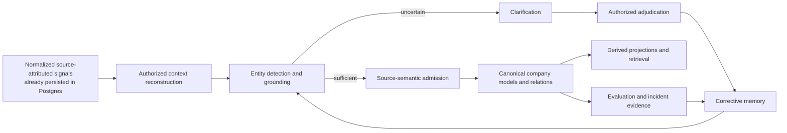

# Autonomous Company Learning — Journey, Current State and Remaining Work

**Document type:** Living execution record

**Branch:** `codex/autonomous-company-learning`

**Worktree:** `/Users/rachinkalakheti/fyraliscore-autonomous-learning`

**Current checkpoint:** M0, CF3-A, and CF3-B are green. The second four-batch
CF3-C run made every measured grounding, atomic, scope, lineage, receipt and
prior-memory gate green, but remained semantically red because the provider's
relation endpoints and independently selected composite-member list disagreed.
The compiler now normalizes advisory membership around distinct closed-set
endpoints, structured output requires those endpoints, and rejection traces
name the exact failed predicate. Provider-free synthesis and PostgreSQL
atomicity proof passes `21/21`. CF4 remains locked pending one confirmation
CF3-C canary.

**Last updated:** 2026-07-19

## Purpose

This document records the journey of the autonomous company-learning goal:
what we intended to build, what was actually implemented, what went wrong in
the implementation process, what evidence currently exists, and what remains.

It is deliberately separate from:

- the normative architecture documents;
- the architecture discovery log;
- the implementation/reuse audit;
- the objective evaluation framework.

Those documents explain what the system should be. This document explains where
the work actually is.

## Core Fast-Path Execution State — 2026-07-18

The active execution path is now governed by
[Autonomous Company Learning — Core Fast-Path Agent Coordinator](autonomous-company-learning-core-fast-path.md).
The immediate milestone is M0: one real-PostgreSQL, provider-free, four-batch
learning vertical through the production-shaped entity, retrieval, synthesis,
lifecycle and canonical-truth boundaries. No new full P6 or other provider run
is authorized before that vertical is green.

CF0 established the following current baseline:

- the isolated worktree is clean and no P6/provider process is active;
- `a34533b8` remains the candidate runtime baseline; `f9bc4c78` and `9f8bdad0`
  are execution-record/coordinator documentation commits;
- a fresh local database, `fyralis_cf_fastpath_20260718`, was created rather
  than reusing a stale proof database;
- all 218 current migration files through `0234_truth_scope_canonical_provenance.sql`
  were applied to that database;
- the focused PostgreSQL truth-kernel, P5, P6 and barrier slice passed `12/12`;
- the complete epistemic-repair suite reached `415 passed`; the only additional
  test is an explicitly real-Codex P8 provider-fault proof and is not part of
  the provider-free CF0 gate;
- a provider-free run without `DATABASE_URL` also passed `385` tests and skipped
  31 database tests, but that result is not accepted as the M0 baseline;
- the current schema-drift checker reports `think_runs.execution_mode` and
  `think_runs.validation_result` as unexpected even though they are introduced
  by current migrations. This tooling mismatch is deferred and does not
  authorize bypassing database tests.

CF1 then established the runtime seam required to begin the vertical:

- governed learning episodes now preserve tenant, canonical reference, exact
  observation evidence, mention coordinates, temporal bounds, and entity
  authority independently of transport batches;
- only resolved entity coordinates can become truth candidates; provisional
  and unresolved coordinates remain explicit uncertainty;
- synthesis hydration reads accepted Models by canonical reference rather than
  display label;
- accepted-memory snapshot, typed evidence, atomic composite/relation, injected
  Think, provider-free provider, and source-authenticated grounding contracts
  exist as reuse adapters over current production components;
- the joined CF1 slice passed `55/55` focused tests and the worker authority
  slice passed `16/16` against the fresh CF0 database.

Run 9 satisfies the mechanical four-batch contract: all 100 signals passed
through four actual worker batches, with retrieval reuse, exact synthesis and
correction lineage, relation atomicity, PostgreSQL truth behavior, barriers and
tenant isolation recorded end to end. It does **not** satisfy canonical semantic
coherence. Composite version 2 changed `proposition.summary` to “Harbor release
is no longer blocked after certificate renewal completed,” while
`natural_text` and `supported_relation.mechanism` retained “Harbor release is
blocked by incomplete certificate renewal.” The old evaluator scored only the
lineage/proposition gates and therefore reported green without detecting this
contradiction. Cross-run determinism remains a separate unproven gate because
the user-deferred independent replay was not run.

The parallel CF0 reuse audit found no reason to replace observations, mention
grounding, entity resolution, Slack context, batching, SAGE/retrieval, the Model
truth kernel, relation truth kernel, lifecycle CAS/fences or projections. The
smallest core repair is limited to:

1. a governed semantic episode adapter preserving entity authority, scope,
   time and evidence membership independently of transport batches;
2. an immutable accepted-memory snapshot over existing accepted read surfaces;
3. a typed evidence-manifest envelope over existing canonical evidence
   references;
4. one first-class composite-plus-relation command/receipt over the existing
   Model and relation truth kernels; and
5. a provider-neutral wrapper around the real P6 Think orchestration for the
   CF2 deterministic four-batch vertical.

This is a consolidation path, not a rewrite. Connector transport, task
autonomy, broad relation coverage, perfect economics and noncritical legacy
compatibility remain outside the critical path.

## Update Protocol

Update this document whenever one of these occurs:

1. a meaningful implementation checkpoint is committed;
2. an end-to-end or causal evaluation changes the confidence boundary;
3. a major architecture decision is accepted, rejected or deferred;
4. a new blocker changes the remaining-work sequence;
5. the progress estimate changes materially.

For every update:

- change the current checkpoint and date;
- update the component-state and remaining-work sections;
- record exact validation evidence without inflating what it proves;
- append one dated entry to the progress ledger;
- keep task autonomy explicitly outside the active scope.

## Highest-Level Objective

The active goal is:

> Build a company-memory substrate that continuously converts authorized company
> signals into a more accurate, coherent and useful model of the company, learns
> from human and system feedback, and reuses those corrections autonomously
> without corrupting source truth.

The learning and feedback loop should be autonomous. The system should:

1. observe company signals;
2. reconstruct enough authorized context;
3. detect and ground company entities;
4. preserve ambiguity when evidence is insufficient;
5. admit only justified semantic beliefs;
6. ask for clarification at the highest-leverage uncertainty;
7. turn an authorized answer into corrective memory;
8. reuse that memory on later signals;
9. repair affected derived state;
10. measure whether reuse improves outcomes without increasing unsafe behavior.

## Explicit Non-Goal

Autonomous task execution is not part of the current goal.

The system is not currently being optimized to autonomously plan and execute
company work. Existing task-autonomy/agency code may remain for compatibility,
but it must not define or contaminate the active company-learning architecture.

Connector, listener and source-ingestion transport is also outside the active
implementation and evaluation goal. The current tests begin from simulated,
normalized, source-attributed signals that are already durably persisted in
PostgreSQL. Source semantics, identity authority, company-memory learning,
correction and lifecycle repair remain in scope; proving how Slack, Jira,
email or another provider delivers those normalized rows does not.

## Core Mental Model



The graph is not an end in itself. It is the current, evidence-grounded company
model produced by this metabolism. Retrieval and adaptive inquiry are consumers
and feedback mechanisms around that substrate.

## Where the Journey Started

The work began as an architecture and evaluation-design exercise:

- reinterpret the graph as a living model of company physics;
- make feedback and learning loops central;
- define ideal system behavior from low-level functions to product outcomes;
- produce detailed implementation and evaluator documents;
- make company-entity extraction a first-order correctness boundary;
- handle Slack as a boundaryless, context-dependent signal source.

The initial work generated substantial specification detail, but implementation
progress was slower than expected and insufficiently isolated from the existing
repository.

## Why the Journey Took Too Long

### 1. Repository isolation happened too late

The original repository contained roughly 150 unrelated dirty paths. Working
inside that tree made every inspection, edit, test and commit require extra
caution.

Correction:

- created a dedicated worktree;
- created `codex/autonomous-company-learning`;
- made isolation a P0 prerequisite rather than an optimization.

### 2. Too much was treated as sequential

Shared-worktree and shared-Postgres failures led to excessive serialization.
Only overlapping edits, commits and shared-database test runs needed to be
serialized. Static analysis, evaluator work, documentation, domain extraction
and independent code lanes could run concurrently.

Correction:

- use non-overlapping file ownership for parallel agents;
- keep shared-Postgres suites sequential;
- merge at explicit checkpoints.

### 3. Edge cases were pursued before the core vertical was proven

The work repeatedly expanded into architecture gaps before proving one complete
signal-to-learning-to-reuse path.

Correction:

- prioritize one end-to-end Slack/entity/correction/reuse path;
- record discovered gaps in the reuse audit and discovery log;
- return to them after the core vertical is executable.

### 4. Existing components were not audited for reuse early enough

There was a risk of creating parallel subsystems for evaluation, clarification,
ingest and proof.

Correction:

- use the existing ingest `alias_repo` injection seam;
- use the canonical proof models and manifest aggregator;
- keep Company Vitals as the sole system report;
- extract clarification adjudication from the gateway into one reusable domain
  operation;
- preserve existing grounding, source-semantic and Model writers.

### 5. Mechanical closure was initially confused with causal learning proof

Storing a clarification, closing a grounding trace and later replaying an alias
show that the loop is connected. They do not prove that the learned policy
improves held-out outcomes.

Correction:

- add matched adaptive-versus-frozen experiments;
- seal gold before execution;
- derive correctness in the evaluator rather than trusting the harness;
- preserve every hard-safety incident;
- keep E3 runtime health separate from E4 synthetic causal evidence.

### 6. Attractive metrics were accepted before adversarial review

The first paired harness reported a strong lift, but review found treatment
leakage, global queue races, self-labelled correctness and shared longitudinal
state.

Correction:

- fresh adaptive/frozen tenants for every case;
- sequential arm execution with terminal semantic barriers;
- freeze the earliest corrective-memory consumer;
- preserve ordinary manual aliases in the frozen arm;
- require `resolved_for_consumer`;
- snapshot source observations;
- assert tenant noninterference;
- independently recompute the typed report in Company Vitals.

## Working Method Going Forward

1. Isolate the scope before editing.
2. Audit existing components before adding new ones.
3. Implement the smallest complete vertical first.
4. Keep architecture discoveries in the separate discovery log.
5. Record deferred edge cases instead of blocking the vertical.
6. Parallelize non-overlapping code, evaluator, audit and documentation lanes.
7. Run shared-database tests sequentially.
8. Commit every coherent, validated checkpoint.
9. Treat validation boundaries as part of the implementation.
10. Do not call a result causal or proof-bearing until adversarial review agrees.
11. Time-box seam discovery: if an implementation lane has not produced a
    first test, artifact or code checkpoint after a bounded audit, cut scope to
    the smallest runnable proof instead of continuing design exploration.
12. Require early reversible checkpoints: evaluator contracts and pure tests
    land before expensive Postgres orchestration, and runtime schema/repository
    changes land before being folded into the combined assurance command.
13. Give every database-backed lane its own disposable database. Parallel
    agents may inspect and edit disjoint files concurrently, but they must not
    share mutable test tenants, queues or migration state.
14. Reuse production seams directly. A new evaluator may measure an existing
    writer, resolver or SAGE consumer, but it must not introduce a
    second authority, truth store, learner or health-report spine.
15. Keep the critical path explicit: source identity and entity grounding,
    feedback reuse, correction safety and Company Vitals evidence take
    precedence over exhaustive matrices, generalized frameworks and production
    polish.

### Parallel Lane Contract

Every parallel lane must declare:

- exclusive file ownership or a new-file-only boundary;
- the production seam it reuses;
- one continuous metric and one noncompensatory safety condition;
- the smallest independently committable checkpoint;
- the exact disposable-database or no-database validation boundary;
- deferred breadth that will be recorded instead of blocking the vertical.

The integration lane does not wait for every edge case. It joins only committed,
independently validated component artifacts, recomputes their digests and
preserves their proof gaps.

## Current End-to-End Implemented Slice

```mermaid
flowchart LR
    A["Simulated normalized signal in Postgres<br/>with ambiguous NBI"] --> B["Grounding opportunity"]
    B --> C["Resolver review"]
    C --> D["Canonical clarification request"]
    D --> E["Authorized human adjudication"]
    E --> F["Adjudicated tenant-global exact alias"]
    F --> G["Later held-out Slack recurrence"]
    G --> H{"Adaptive or frozen arm"}
    H -->|adaptive| I["Governed exact-alias replay"]
    I --> J["Correct customer resolved<br/>0 LLM calls"]
    H -->|frozen| K["Learned alias hidden at ingest and resolver"]
    K --> L["Safe abstention<br/>1 LLM call"]
    J --> M["Source-semantic terminal fate"]
    L --> M
    M --> N["Typed paired report"]
    N --> O["Canonical INV-05 evidence"]
    O --> P["Company Vitals"]
```



## Component State

| Component | Current behavior | State |
| --- | --- | --- |
| Isolated development scope | Dedicated worktree and branch protect the main tree and enable narrow commits | Complete |
| Task-autonomy boundary | Active learning path is statically prevented from importing task-autonomy/legacy agency surfaces | Complete for active slice |
| Signal-input boundary | Evaluation begins from simulated, normalized, source-attributed signals already persisted in PostgreSQL; connector/listener transport is not exercised | Complete and explicit for the active scope |
| Conversational-signal epistemic ownership | Unresolved grounding-owned conversational signals no longer compete with generic T1 Think ownership | Complete for the current persisted-signal path |
| Canonical entity review | New review obligations live in `clarification_requests`; legacy review queue remains compatibility-only | Complete |
| Clarification adjudication | Public domain operation owns authorization, alias persistence, successor grounding and feedback lineage; gateway delegates | Complete |
| Corrective-memory persistence | Authorized entity answers become lineage-valid adjudicated aliases without mutating source evidence | Complete for exact tenant-global aliases |
| Governed corrective replay | Later exact aliases can resolve autonomously from the adjudicated correction | Complete for exact tenant-global aliases |
| Frozen control seam | Clarification-learned memory can be hidden at ingest and resolver while ordinary manual aliases remain visible | Complete for experiment |
| Source semantics | A grounded persisted signal reaches interpretation and an explicit `belief_applied` or `no_admission` fate | Complete for current vertical |
| Canonical Model write | Renewal creates one Model; duplicate/unsupported support and risk signals correctly create none | Complete for sealed cases |
| Source immutability | Paired harness snapshots the recurrence Observation and reports mutation as a hard incident | Complete in paired harness |
| Tenant isolation | Paired harness asserts recurrence observations, grounding, Models and aliases do not cross arm tenants | Complete in paired harness |
| Company-learning evaluator | Context, grounding and source-semantic state compile into one active-slice evaluation | Complete for measured slice |
| Paired causal evaluator | Correctness is derived from sealed arm-specific gold and terminal consumer fate; incidents are noncompensatory | Complete for current case family |
| Canonical proof integration | Experiment scenario and lift metric are registered under INV-05 and aggregated through canonical proof models | Complete |
| Company Vitals | Reopens Assurance v7, DB-backed company-physics traces and the authoritative 45-batch simulation artifacts; noncompensatory entity and reliability incidents override high continuous scores | Complete for current v7 and large-simulation reporting |
| Evaluator synchronization | V7 requires replacement and source-binding lifecycle evidence, reopens digest-bound raw DB manifests, binds repository provenance and rejects unsupported evidence-tier inflation | Complete for the current E4 assurance profile |
| Negative/adversarial recurrence families | Contextual phrase, source conflict, homonym and unrelated controls run on real Postgres with zero incidents | Complete for four sealed controls |
| Held-out recurrence population | The sealed 60-case registry executes exactly once with continuous intervals, all four entity types and no selective reruns | Complete: 60/60 observed |
| Conversational reconstruction | All nine Slack-shaped semantic families are source-attributed, supported and correct with zero contamination from persisted normalized fixtures; provider transport is not part of the claim | Complete for sealed gold: 9/9 |
| Broad correction propagation | Wrong Models, recursive dependents, relations and projections are fenced or rebuilt; queued refresh work is consumed through the existing projector runtime | Complete for the seeded recursive cascade |
| Cross-source company physics | Persisted Jira-, Linear-, Google Drive- and Gmail-attributed fixtures preserve governed source identity through grounding; connector/listener transport and equivalent causal learning are outside or beyond the current proof | Complete for the persisted identity semantics measured |
| SAGE feedback reuse | Grounding/source-semantic outcomes alter salience without truth writes; matched effect evaluator exists | Source-salience loop has bounded policy-effect proof only. Separate v4 proves Model-use lift; it does not establish this salience bridge's terminal contribution |
| Active-surface evaluator | Six sealed identity surfaces across Jira, Linear, Google Drive and Gmail plus five source-salience cases are recomputed, reopened and gated noncompensatorily | Complete in assurance v6: identity 6/6, salience 5/5 |
| Source-identity lifecycle | Bindings support close, revoke and supersede with valid-time history, immutable attachment versions, a database exclusion constraint, populated colliding-tenant proof and a digest-bound query/row/error manifest | Complete for the sealed 12/12 E4 lifecycle proof |
| Retention and forgetting evaluator | Exact and governed-variant behavior is measured at 0/4/16 alias-interference cycles and 0/1/2 worker-object restarts; correction, four negative controls and three collision families are checked noncompensatorily | Complete in assurance v6: 14/14, forgetting 0.0; not process-restart or long-duration proof |
| Canonical resource replacement | One atomic orchestrator governs transition lineage, predecessor retirement, alias closure, exact source-binding supersession and projection invalidation while preserving Observations, attachments and Models; resource reads can resolve the lineage head at explicit valid/known cutoffs | Complete for the sealed resource vertical: 20/20 observed, zero gaps or violations |
| Large cold-start company learning | One fresh tenant processed 1,125 signals in 45 genuine 25-signal batches from zero semantic memory; all work drained and later evidence changed memory | Executed; authoritative verdict `not_credible` because entity grounding and retrieval behavior failed required trust gates |
| Postmortem semantic repairs | Persisted batches close mention-candidate fates; aliases require adjudication; claim scope is local; asymmetric edges are role-stable; mature retrieval is Model-first with explicit reopening reasons | Retrieval passes nine-batch policy proof. Ablation v2/v3 preserve zero-use failures; development v4 closes the Model-reference seam and shows `3/3` versus `0/3` lift, but is not untouched generalization |
| Adversarial company physics | Positive v1 plus adversarial v2 cover canonical links, semantic fates, exact relation lineage, four rejected harmful writes, a two-hop chain and immediate correction propagation | DB-backed bounded pass; four relation attempts and two open-world cases do not establish broad topology quality or completed transitive repair |
| Source equivalence | Two semantic cases across eight normalized Slack/email/Jira/document-meeting batches preserve outcomes, authority, coordinates and boundaries | Bounded score `1.0`; connectors, open-world discourse and drift excluded |
| Correction homeostasis | Two DB corrections fence eight Models, create eight reevaluation pairs, reject cycles, replay idempotently and survive restart | Bounded score `1.0`; unbounded recovery and infrastructure loss excluded |
| Objective company learning | Eight-component SHA-bound v8 composer separates observed quality, coverage, blockers and successful proof boundaries; joined runtime, feedback quality and strict synthesis are independently mandatory | All eight observed at score/coverage `1.0`, no blocker, `meets_bounded_policy`; open-world/customer/connector/unbounded recovery excluded |
| Entity extraction and company physics | Objective entity v6 preserves broad-v4 and adds a fully prebound current-runtime one-shot holdout while separating extraction from resolver handoff, canonical linking, semantic disposition and relation lineage | Current exact F1 `0.971429`, type `1.0`, negative cleanliness `1.0`, candidate-fate closure `1.0`; Slack/project/system are exact. The one person-title annotation disagreement and broader-generalization gaps remain explicit |
| Learned batched discovery | Persisted signals are discovered as batches through a learned provider path, with typed candidates committed into the existing mention-fate ledger and handed to the existing resolver; deterministic discovery remains an availability fallback | Implemented with focused tests and provider readiness preflight; learned quality is promising but not exceptional |
| Learned discovery provider readiness | Worker startup preflights the configured learned-discovery provider/model so a missing or incompatible provider is an explicit incident instead of silently becoming the normal mode | Implemented after a real provider/model configuration incident |
| Resolver poll isolation | Tenant-specific simulations and worker runs can bound unresolved-observation polling by tenant; omitted scope preserves the production global poll | Implemented and focused-test proven at `b5cb50b8`; this is isolation evidence, not extraction or canonical-link quality |
| Historical v1 learned run | One 60-signal, six-batch `gpt-5.4` run measured fresh exact-span P/R/F1 `0.8163/0.6452/0.7207`, type accuracy `0.9556`, and negative cleanliness `1.0` | Historical fresh provider evidence; no canonical-link claim |
| Historical v1 source-verifiable rescore | Repairing uniquely verifiable source offsets and rescoring the same saved v1 outputs at the tuned admission threshold yields P/R/F1 `0.8500/0.8226/0.8361` and type accuracy `0.9286` | Post-hoc artifact rescore only, not a new provider run |
| Sealed v2 recovered run | 80 signals, eight ten-signal batches, 114 spans and 40 negatives; exact recovered P/R/F1 `0.8020/0.7105/0.7535`, type accuracy `0.8163`, negative cleanliness `0.95`; one schema-invalid batch | Exact recovery of completed structured turns, not a rerun; exposes batch-atomic schema loss and makes no canonical-link claim |
| Mutable development feedback | A checkpointed `gpt-5.4` run processed four genuine ten-signal batches with one call each and zero provider errors; post-verification P/R/F1 was `0.7727/0.7969/0.7846`, type accuracy `0.8906`, negative cleanliness `1.0` | Development feedback only. The inspected corpus/results informed later prompt work and cannot be used as holdout or generalization evidence |
| Complete-boundary and role-type prompt | The production prompt requires per-signal completeness, exact complete written designations, role-grounded closed types and transport-coordinate negatives | Implemented at `813848ce` and scored once by sealed v3; ambiguous type confidence was subsequently contained without rescoring v3 |
| Sealed one-shot v3 | 40 signals/4x10, 70 gold, 20 negatives, four calls/no errors; raw exact F1 `0.762590`; 13 uniquely source-repaired coordinates; complete path 70/70 overlap, 66/70 exact, post F1 `0.942857`, type `0.985714`, cleanliness `1.0`; report SHA `4427b73f…2263eca` | Strong complete-pipeline extraction generalization, not direct model-offset quality. Four boundaries, workstream F1 `0.5`, and one exact high-confidence resource-vs-goal type error remain; no canonical-link/company-scale claim |
| Relation-topology evaluator | Gold edge admission/non-admission, endpoint, type, direction, mention-lineage, unexpected-edge, harmful-propagation, unknown-endpoint and unlineaged-edge metrics extend the entity pipeline | Populated for one directed relation and one explicit no-edge case in the sealed vertical; broad topology generalization remains open |

## Important Implementation Checkpoints

| Commit | Meaning |
| --- | --- |
| `ecaa28cc` | Isolated autonomous company-learning scope |
| `d9128436` | Turned entity clarifications into corrective memory |
| `6503dd41` | Isolated neutral semantic write context |
| `dea89ffc` | Measured corrective-memory closure |
| `745dc9bd` | Repaired reviewed grounding into company memory |
| `34774139` | Replayed governed entity corrections autonomously |
| `52d97538` | Unified company-learning proof in Company Vitals |
| `a1303b19` | Made clarifications own entity review |
| `b241134e` | Gave unresolved Slack one epistemic owner |
| `9df63148` | Added frozen corrective-memory control |
| `7527a34d` | Moved entity adjudication from the gateway into the domain |
| `5f04dbf8` | Added sealed paired evidence and canonical proof integration |
| `5ba59e42` | Added isolated real-Postgres corrective-memory experiment |
| `3337c9b2` | Extended fail-closed correction repair to relations, projections and correction-specific T4 convergence |
| `31eb46fd` | Sealed all nine Slack reconstruction families and fixed long-range contamination |
| `7738487d` | Added the real-Postgres 60-case held-out population runner |
| `e81419cd` | Proved correction end-state convergence on real Postgres |
| `5cc358e6` | Normalized canonical entity candidate identity across implicit/explicit version one |
| `11248d5a` | Integrated digest-verified, noncompensatory combined assurance into Company Vitals |
| `6c0a273a` | Aligned the assurance report with the real-Postgres correction convergence proof boundary |
| `b5afa9af` | Generalized the held-out runtime to customer, project, team and system targets |
| `1142a8ed` | Closed recursive correction fanout and projection refresh convergence |
| `6902b149` | Added source-native Slack deletion, reaction and cross-channel reconstruction |
| `8140b942` | Sealed the 60-case and nine-family combined assurance gate |
| `b38faf87` | Kept batched Model scope claim-local and rejected control-plane text |
| `74f3149c` | Closed governed mention-candidate fates for persisted batches |
| `a68ecd5d` | Enforced role-stable direction for asymmetric Model edges |
| `ed93bf50` | Required grounded adjudication before canonical alias persistence |
| `666ae2ee` | Added maturity-aware Model-first retrieval and explicit raw-evidence reopening reasons |
| `e04da5e8` | Made retrieval maturity depend on selected Model quality, not count alone |
| `8f4e75e8` | Strengthened causal-thesis formation, confidence caps and calibration diagnostics |
| `92ecf610` | Added gold entity-extraction measurement independent of mention-fate closure |
| `66b1ca3c` through `bbd794e8` | Sealed deterministic batched corpora and independent holdouts; the first adapted holdout became strong, while the final untouched holdout remained weak |
| `0d74b0e9` | Added stage-level entity pipeline quality metrics, including discovery, typing, resolver handoff and canonical-link fields |
| `72a1648c` | Added learned batched discovery, typed assessment and the existing-resolver bridge with deterministic availability fallback |
| `1359eb18` | Added provider/model readiness preflight after the learned-discovery configuration incident |
| `a46300aa` | Froze and ran the real `gpt-5.4` learned entity-quality benchmark |
| `0582666a` / `18aab465` | Repaired uniquely source-verifiable offsets and tuned mention admission; reported results are an artifact rescore, not another provider run |
| `b5cb50b8` | Bounded tenant-specific resolver polls without changing production global polling |
| `5b708d0c` | Added the contract-validated, per-batch checkpointed mutable development runner and explicitly non-generalization report |
| `813848ce` | Clarified complete mention boundaries, role-grounded company-object types and transport-coordinate negatives in the learned prompt/schema |
| `38838612` | Froze the untouched one-shot v3 holdout, disjoint from v1, v2 and mutable development data |
| `a8487036` | Extended entity-pipeline evaluation through downstream relation topology and harmful propagation |
| `0d9d8e65` | Sealed the completed one-shot v3 receipt and runner contract around the immutable extraction report |
| `d6908b39` | Removed proof gaps already closed by the complete sealed run |
| `ac963125` | Reused grounding/source-semantic outcomes as bounded SAGE source-salience memory |
| `4b6ef3c8` | Added governed Linear project/team structured identity transport |
| `e450eec4` | Added Google Drive file and Gmail thread structured identity nominations |
| `d47eb391` | Proved Drive/Gmail exact attachment, forged-text rejection and tenant/source isolation |
| `c11ff6ba` / `042ad293` / `41ae2771` | Defined, sealed and ran the standalone active structured-identity/source-salience proof |
| `a4ca188f` | Added versioned source-identity close, revoke and supersede lifecycle |
| `c64585fb` | Rejected overlapping source bindings after scheduled terminal transitions |
| `33a50ac2` / `e9ca7057` | Defined and ran the bounded retention/forgetting regression proof |
| `9d9db9e5` | Made correction-authority and negative/collision retention regressions noncompensatory |
| `4d2023ac` | Added active-surface and retention components to assurance v6 and Company Vitals |
| `00bf559f` | Sealed exact source-claim, cross-tenant and 14-observation retention scope |
| `3a21f6b1` | Made Unicode corrective-memory verification use production Python normalization and retained exact authority checks |
| `04b0f0bd` | Aligned the full CLI integration with the sealed six-surface identity scope |
| `5149df1b` | Added canonical referent-transition schema and typed replacement invariants |
| `43d86dd5` | Added the idempotent replacement transition registry and domain service |
| `dced1ae0` | Sealed the typed source-identity binding lifecycle evaluation contract |
| `79317be8` | Corrected the source-binding lifecycle evaluator's expected closure-version semantics |
| `7ad02256` | Added resource retirement and exact source-binding lookup adapters for replacement |
| `3c7dff0c` | Added predecessor-scoped projection invalidation and replacement refresh metadata |
| `8ce4b555` | Materialized atomic canonical resource replacement across lifecycle surfaces |
| `7f839521` | Exposed replacement and source-binding lifecycle assurance state in Company Vitals |
| `860915b4` | Established the assurance v7 schema and made replacement evidence mandatory |
| `eb1f9a84` | Added the self-authenticating real-Postgres replacement proof runner with 20/20 obligations observed |
| `3a03981d` | Added tenant-scoped, bitemporal lineage-aware canonical resource reads |
| `15020d6b` | Updated the Company Vitals fixture to exercise the assurance-v7 lifecycle surface |

## Current Validation Evidence

### Paired causal slice

Real-Postgres result:

- three independent matched recurrence pairs;
- six distinct arm tenants;
- adaptive correctness: `1.0`;
- frozen correctness: `0.0`;
- adaptive-minus-frozen lift: `1.0`;
- adaptive LLM calls: `0`;
- frozen LLM calls: `3`;
- calls avoided: `3`;
- detected hard-safety incidents: `0`;
- complete correction-to-grounding/source-semantic lineage: `1.0`.

Semantic outcomes:

- renewal: `belief_applied`, exactly one new Model;
- support: `no_admission`, zero new Models;
- risk: `no_admission`, zero new Models.

This distinction matters: entity learning succeeds on all three cases without
forcing every resolved signal to become a belief.

### Focused validation

- trusted assurance v6 CLI integration: `1 passed in 31.43s`;
- final combined assurance command: exit `0`, status `working`, no blocking
  failures;
- focused evaluator, Vitals, Slack, grounding and correction unit suite:
  `67 passed`;
- correction end-state real-Postgres integration: `1 passed`;
- 60-case held-out population real-Postgres execution: exit `0`, `60/60`
  observed;
- import-linter: 7 contracts kept, 0 broken;
- architecture ratchets: passed;
- production environment contract: passed;
- changed-file Ruff and Python compilation: passed;
- every combined-assurance component is reopened, identity-checked,
  digest-recomputed and cross-bound before Company Vitals accepts it.

Exact assurance v6 artifact:

`/tmp/fyralis-company-learning-assurance-v6-04b0f0bd-final/company_learning_assurance_summary.json`

- schema: `company-learning-assurance-summary-v6`;
- run identity: `final-04b0f0bd`;
- system version: `04b0f0bd`;
- file SHA-256:
  `6c82f10ec8c8a1b79c069bc14a195415f9d625697b346a6e72e4bac25f55931f`;
- summary digest:
  `b4b039648f82b2156236853e36b3eb24a2ae118f932094beb2e9daabb424fbe3`;
- status: `working`;
- blocking failures: `0`;
- structured identity: `6/6`;
- source salience: `5/5`;
- retention: `14/14`;
- overall forgetting rate: `0.0`.

The first disposable-Postgres attempt used `SQL_ASCII` and stopped on the
sealed Unicode collision before summary creation. That was an environment
bootstrap failure, not a system assertion failure. A subsequent UTF8 run
exposed a separate harness-only verification mismatch: SQL `lower()` did not
share Python `casefold()` behavior for fullwidth `Ａ`. Commit `3a21f6b1`
changed the verifier to use the production Python normalization and retained
exact target, scope and adjudication-authority checks. Dedicated active-surface
database tests were already green; the fresh UTF8 full CLI then passed.

### Held-out population

The sealed registry contains 60 cases and was executed once without selective
reruns:

- 60 selected and assigned cases;
- 120 unique fresh tenants;
- 60 measured pairs: 15 each customer, project, team and system;
- zero unsupported cases;
- adaptive correctness: `1.0`, Wilson 95% interval `[0.9398, 1.0]`;
- frozen correctness: `0.0`, Wilson 95% interval `[0.0, 0.0602]`;
- paired correctness lift: `1.0`, bootstrap interval `[1.0, 1.0]`;
- adaptive and frozen observed unsafe rate: `0.0`;
- mean LLM calls avoided: `1.0`.

The statistical result covers every sealed entity-type stratum in the registry.

### Slack reconstruction

All nine intended Slack boundary families are now sealed:

- supported and correct: thread root/replies, edit revision, deletion/tombstone,
  reaction evidence, long-range recurrence, high-similarity abstention,
  cross-thread dependency, cross-channel dependency and pronoun/coreference;
- correct and supported: `9/9`;
- selected-context precision: `1.0`;
- contamination: `0.0`;
- topology recall: `1.0`;
- long-range recall: `1.0`;
- budget adherence: `1.0`;
- sufficient-set recall: `1.0`;
- edit/delete correctness: `1.0`;
- cross-channel recall: `1.0`.

### Correction convergence

The real-Postgres correction proof now verifies that:

- the predecessor-admitted wrong Model becomes `archived/superseded`;
- direct dependents are immediately hidden;
- contaminated relation frames and relation-edge projections are retired;
- contaminated projection snapshots and dependencies are removed;
- direct and second-hop dependents receive immediate-parent correction lineage
  and are hidden in the original transaction;
- T4 archives both dependent levels after their last positive support
  disappears rather than applying a confidence nudge;
- the existing projector runtime consumes the queued refresh and rebuilds an
  empty, fresh projection with no contaminated source Model;
- replay is idempotent;
- source observations and another tenant remain unchanged.

### Structured identity and active learning surfaces

Focused production-path evidence now covers four structured sources:

- Jira project identity;
- Linear project and team identity;
- Google Drive file identity across file, comment and revision records;
- Gmail thread identity attached to the exact message subject surface.

All four use the same rule: handlers nominate typed, source-namespaced claims;
ingestion may attach only a pre-existing governed binding for the same tenant,
source system and exact normalized surface. Missing IDs, names, subjects or
bindings remain inert. Free text, a foreign source and a foreign tenant cannot
create or consume authority.

Assurance v6 now runs six sealed structured-identity surfaces:

- overall status: `observed`;
- Jira project;
- one Linear issue bundle covering project name, team key and team name;
- Google Drive file, comment and revision;
- Gmail thread;
- structured identity: `6/6` observed, `0` violations;
- source salience: `5/5` observed, `0` violations;
- salience direction rate: `1.0`;
- noncompensatory structured-identity and source-salience status.

The artifact records and checks exact expected versus observed source system,
native identifier, source surface and authority reference. It also performs a
real foreign-tenant consumer probe instead of inferring isolation from an empty
attachment query. Assurance v6 reopens the raw observations, validates the
sealed claim contracts and gates every metric at `1.0`.

### Source-identity lifecycle

The repository path now supports versioned `SourceIdentityBinding` close,
revoke and supersede operations:

- valid-time closure and successor intervals;
- transaction-time versions and replayable operation records;
- idempotent operation references with request fingerprints;
- stale expected-version rejection;
- tenant-scoped reads and writes;
- exact observation attachments pinned to one binding row/version;
- application-level rejection of a new binding whose interval overlaps an
  existing current-knowledge interval;
- a replacement may begin exactly at the prior interval boundary.

The adversarial overlap case was reproduced and fixed in `c64585fb`. The
focused Jira, Linear and lifecycle suite passed `13` tests after the fix.

The attachment behavior is deliberately fail-closed. An old attachment remains
storage-exact and continues to reference binding v1; it never silently redirects
to a later version. Once v1's transaction interval closes,
`resolve_observation_source` returns no result for that attachment. A delayed
historical Observation can attach the visible closure version v2. This is a safe
stale fence, not proof that an already-attached historical Observation can be
operationally reconstructed after correction.

### Retention and old-family regression

The standalone real-Postgres retention run contains `14/14` sealed
observations:

- exact-alias retention: `1.0`;
- governed-variant retention: `1.0`;
- corrected retention: `1.0`;
- overall forgetting rate: `0.0`;
- restart survival rate: `1.0`;
- correction-authority rate: `1.0`;
- unsafe-globalization rate: `0.0`;
- all four existing negative-control kinds safe: `1.0`;
- three representative collision families safe: `1.0`;
- source immutability, Model consistency and evidence-lineage consistency:
  `1.0`;
- hard-safety incident rate: `0.0`;
- retention-horizon AUC: `1.0`.

The explicit horizons are 0, 4 and 16 unrelated alias-registry additions with
0, 1 and 2 fresh worker-object constructions. Correction-authority,
negative-control and collision failures are noncompensatory after `9d9db9e5`;
ordinary exact/variant forgetting remains continuously measurable rather than
being collapsed into pass/fail.

Assurance v6 now binds this exact 14-observation registry, including the named
four negative controls, three representative collision families and exact
horizon distribution. A smaller or substituted population cannot satisfy the
combined `working` contract.

### Canonical resource replacement proof

The replacement vertical now composes the transition registry with production
resource, alias, source-binding and projection seams in one transaction:

- `7ad02256` adds explicit non-customer resource retirement and exact
  source-binding lookup;
- `3c7dff0c` discovers active predecessor-scoped Models from normalized
  sidecars, invalidates their disposable projections and reuses the existing
  refresh queue with replacement metadata;
- `8ce4b555` applies transition registration, endpoint validation, predecessor
  retirement, alias closure, binding supersession, projection invalidation and
  lineage verification atomically while preserving canonical Models and source
  evidence;
- `eb1f9a84` executes and reopens a self-authenticating UTF8 PostgreSQL artifact.
- `3a03981d` resolves a requested resource referent to the lineage head visible
  at explicit valid-time and knowledge-time cutoffs while preserving historical
  reads and tenant isolation.

The standalone database proof reports:

- schema: `canonical-resource-replacement-evidence-v1`;
- status: `observed`;
- expected and observed obligations: `20/20`;
- unsupported obligations: `0`;
- violating obligations: `0`;
- safety and immutability violations: `0`;
- exact operation replay, operation-conflict rejection, stale-head rejection
  and tenant isolation;
- predecessor retirement, successor liveness, current and as-of alias safety;
- source-binding boundary safety, delayed-event stale fencing and immutable old
  attachment identity;
- immutable source Observation and Model scope;
- projection snapshot/dependency invalidation and one deduplicated pending
  refresh;
- reason/time-correct lineage;
- missing-successor rejection with rollback and a separate forced downstream
  failure proving transaction atomicity.

Latest standalone CLI artifact:

`/tmp/fyralis-replacement-artifact.R2Pkks/canonical_resource_replacement_evidence.json`

- run identity: `cli-canonical-replacement-final`;
- declared system version: `3c7dff0c`;
- evidence digest:
  `7cea7a1f9548582c3255ff0862ff2c3b77cd6ebc029d1b1f13e511823a671a64`.

Commits `860915b4` and `7f839521` establish the assurance-v7 schema and Vitals
surface that require this replacement component without averaging gaps away.
`15020d6b` keeps the Vitals fixture aligned with this v7 lifecycle surface.
This is a v7 contract foundation, not yet a claim that the full combined v7
command has run successfully. The database-backed source-binding lifecycle
runner is still in flight.

### Known validation caveat

The repository-wide technical-debt budget currently fails on pre-existing
global counts and unrelated named files. The current changes preserve one large
clarification workflow while moving it from the gateway into the domain; they
do not resolve the repository-wide debt budget.

## What the Current Evidence Proves

The current system proves one narrow but real causal statement:

> Across all 60 sealed exact-alias Slack cases spanning customers, projects,
> teams and systems, authorized corrective memory causes correct later entity
> resolution and avoids resolver-model calls, while the matched frozen system
> safely abstains.

It also proves:

- source evidence is not mutated in this path;
- the resolver is not allowed to invent entity IDs;
- corrective memory can be persisted and replayed with human authorization;
- frozen evaluation blocks corrective-memory use at the earliest consumers;
- ordinary manual entity knowledge remains available in the frozen arm;
- identity correctness and semantic belief admission are separately evaluated;
- typed evidence can be validated, recomputed and integrated into canonical
  invariant proof.
- direct correction can converge through Models, relations and projections
  without mutating source truth or another tenant.
- persisted Jira-, Linear-, Google Drive- and Gmail-attributed fixtures preserve
  authenticated, mention-scoped structured identity through the same governed
  binding path.
- source bindings can be closed, revoked and superseded with visible valid-time
  history and idempotent repository operations.
- exact and one governed-variant family survive bounded unrelated alias growth
  and fresh worker-object construction without regressing the measured negative
  and representative collision controls.
- canonical resource replacement safely materializes across transition,
  resource, alias, source-binding and projection surfaces while preserving
  historical evidence and Models.

## What the Current Evidence Does Not Prove

It does not yet prove:

- canonical merge, split or resurrection behavior, or replacement beyond the
  sealed exact resource vertical;
- adoption of the lineage-aware read seam by every resource consumer and
  historical-reference pathway;
- a completed database-backed source-binding lifecycle artifact or a final
  joined assurance-v7 system artifact;
- open-world Slack reconstruction across long time spans and channels;
- real-provider/model robustness;
- equivalent causal learning across Jira, Linear, Drive, Gmail and meetings;
- very large correction cascades beyond the bounded seeded proof;
- true process, deployment, queue or database restart survival;
- long-term retention without catastrophic overgeneralization;
- a second correction replacing a previously learned wrong target;
- complete retention coverage for all eight collision families;
- operational reconstruction of an old v1 source attachment after its
  transaction interval closes;
- database-level exclusion of source-binding interval overlap outside the
  repository writer;
- customer value or E5 production benefit.

## Progress Estimate

These are planning estimates, not evaluator metrics.

The estimate assumes reuse of the existing SAGE learner, retrieval machinery,
Model/event writers, projection runtime, grounding protocols and proof
framework. Existing code is credited only where the active learning loop
actually consumes it or a focused test proves the intended integration. SAGE's
mere presence in the repository is not counted as completed company learning.

| Scope | Estimate | Meaning |
| --- | ---: | --- |
| New M0 core fast path | 100% single-execution | Run 13 and independent receipt/database audits prove the real four-batch zero-seed path and every authorized CF2 gate, including relation retirement and atomicity. Determinism is not claimed from `replay_count=1` |
| Exact-alias clarification-to-reuse vertical | 100% | Implemented, real-Postgres tested and causally compared from persisted normalized signals |
| Scoped company-learning runtime implementation | 98–99% | Batched path, retrieval transition, adversarial company physics, source equivalence, restart-safe correction, exact joined runtime, matched feedback lift and strict single-Model synthesis execute in bounded populations |
| Customer-free objective substantiation | 97–98% | Eight-component v8 scores `1.0`; strict synthesis is learned `3/3` versus frozen `0/3`; objective entity v6 adds exact-runtime F1 `0.971429`, type/fate/negative safety `1.0` with complete pre-call provenance. The immutable `not_credible` large run and open-world breadth prevent company-scale generalization |
| Broader revised system excluding task autonomy | 90–93% | Core company memory is strong in bounded slices. Long-horizon/open-world behavior, large-run post-fix proof, production operations and customer value remain incomplete |

Task autonomy is excluded from all percentages.

## Remaining Work

The former P0 implementation defects from the cold-start postmortem are now
closed in focused code paths. The immediate P0 is bounded, batched validation.
No second large simulation is authorized or claimed; until the user requests
one, the `be401f25` 45-batch verdict remains the authoritative large-run result.

### P0 — Required before believing the company-learning system broadly works

0. **Preserve and widen strong bounded entity physics**
   - Broad-v4 supplies historical broad disjoint extraction evidence over 40
     signals in four batches: exact F1 `0.970588`, type accuracy `1.0`, negative
     cleanliness `1.0`, workstream `6/6`, with all three source strata above
     `0.96`. Objective entity v6 retains this artifact without pretending that
     extraction proves canonical linking.
   - Current-runtime v5 closes the missing pre-call runtime-source/currentness
     gap on a disjoint three-batch population. Preserve its one frozen
     person-title annotation disagreement and do not widen its scope beyond
     literal extraction, role typing and semantic-isolation behavior.
   - Treat historical v1 fresh F1 `0.7207`, its post-hoc `0.8361` rescore,
     sealed-v2 recovered F1 `0.7535`, and mutable-development F1 `0.7846` as
     distinct non-current-prompt populations.
   - Preserve the completed v3 report unchanged as historical falsifying
     evidence. Its workstream F1 `0.5` is no longer the governing broad-quality
     headline and must not be used to describe current v4 performance.
   - Treat a high-confidence exact-span wrong type as noncompensatory whenever
     it reaches consequential Model, relation, authority or learning admission.
   - Preserve the distinction between v3, whose referents are intentionally
     null, and the separate sealed vertical, whose bounded canonical coverage
     and accuracy are `5/5`. Widen rather than relabel the latter.
   - Current result: adversarial v2 adds four safely rejected harmful writes,
     a two-hop chain, immediate correction propagation and consequence-tier
     denominators. Keep widening beyond these four attempts and two open-world
     cases; do not relabel this bounded pass as company-scale topology quality.
   - Preserve the deterministic locator as explicit availability fallback, not
     as evidence that learned discovery succeeded.

1. **Preserve the final evidence and reporting boundary**
   - Objective entity v6 is composed and the existing 45-batch artifact has
     been evaluator-rerendered without rerunning the simulation. Preserve its
     two historical company-physics incidents alongside the eight green bounded
     components.
   - Keep the current artifact identities and final focused, DB and architecture
     gate results together; do not reinterpret rerendering as a simulation run.

2. **Add non-resolution and ambiguity controls**
   - Contextual phrase negative.
   - Unrelated alias negative.
   - Homonym/local-association case.
   - Conflicting source hint.
   - Assert zero unsafe global alias creation and zero wrong Models.
   - Current result: all four cases execute on real Postgres with eight fresh
     tenants, zero adaptive/frozen safety incidents and zero wrong Models.
     Context-local adjudications no longer enter ingest entity hints, while
     tenant-global exact reuse remains adaptive `3/3` versus frozen `0/3`.

3. **Expand and adversarially bound non-exact surface reuse**
   - Unseen spelling and abbreviation variants.
   - Pronouns, descriptions and local nicknames.
   - Context-dependent references whose meaning changes by channel/thread/time.
   - Explicitly measure when retrieval/context helps and when it contaminates.
   - Current result: a sealed 24-pair population covers six mechanically
     rankable families across customer, project, team and system entities:
     acronym, punctuation-compaction, hyphen/spacing, anchored short form,
     omitted-letter subsequence and possessive/plural. The adaptive arm receives
     the governed target candidate and resolves `24/24`; the frozen arm receives
     no target-candidate exposure and safely reviews or abstains `24/24`.
     Source evidence remains immutable and the report records zero hard-safety
     incidents. This proves candidate-memory lift for unambiguous variants, not
     collision safety or canonical alias promotion.

4. **Prove Slack conversational reconstruction**
   - Source-native edit/delete/reaction behavior.
   - Cross-thread and cross-channel dependencies.
   - Long-range temporal context.
   - Sufficient-context and contamination gold.
   - Boundaryless episode reconstruction rather than fixed windows.
   - Current result: all nine families are supported and correct. Precision,
     contamination avoidance, topology, long-range recall, cross-channel
     recall, edit/delete correctness, budget adherence, sufficient-set recall
     and safe abstention are all `1.0`.

5. **Complete correction propagation**
   - Identify every accepted Model, relation, edge and projection that depended
     on the wrong grounding.
   - Fence unsafe reads immediately.
   - Recompute or supersede all affected derived state.
   - Measure convergence time and residual correction debt.
   - Current result: the seeded real-Postgres cascade includes wrong-Model
     archival, direct and second-hop dependent hiding/archive, relation and
     relation-edge retirement, projection snapshot/dependency removal and
     successful refresh-job consumption. Only larger/deeper cascade
     characterization remains.

6. **Scale the held-out population**
   - Generate enough independent matched pairs for uncertainty intervals.
   - Stratify by source, ambiguity, entity type, context length and consequence.
   - Preserve every pair and prevent selective rerun reporting.
   - Current result: all 60 cases are observed and pass, with 15 cases each for
     customer, project, team and system and zero incidents.

7. **Prove variant collision and minimum entity-lifecycle safety**
   - Colliding acronyms, short forms, punctuation forms and omitted-letter
     variants across both the same and different entity types must review or
     abstain rather than select the learned target.
   - A true rename must preserve one referent only with explicit continuity and
     valid-time lineage; an archived name reused by a new entity must not
     redirect historical evidence.
   - Merge, split, replacement and resurrection must use canonical lifecycle
     writers and dependent repair rather than alias mutation.
   - Current result: the sealed collision matrix runs `16/16` cases on real
     PostgreSQL with zero incidents, unsafe resolutions, wrong Models or alias
     promotions. Both authenticated source-native cases resolve the authorized
     conflicting target in both arms, while unauthenticated competing hints
     preserve both candidates and force safe uncertainty. The separate
     customer lifecycle proof runs `8/8`: UUID continuity, valid-time
     resolution, stale/current alias safety, historical name reuse, old
     Observation/Model immutability, archive rejection, interval non-overlap,
     tenant isolation and replay idempotency are all `1.0`. Merge, split,
     resurrection and non-resource identity lifecycle remain. Canonical
     resource replacement now has a `20/20` observed database proof with zero
     gaps or violations.

8. **Keep active-surface and retention evidence joined without weakening its
   boundaries**
   - Emit, reopen and digest-check the active structured-identity/
     source-salience component.
   - Emit, reopen and digest-check the retention component.
   - Keep source-binding lifecycle evidence outside combined assurance until
     its sealed typed contract has a database-backed artifact.
   - Preserve their noncompensatory gates and explicit proof limitations.
   - Current result: complete for active surfaces and retention in assurance
     v6. Their raw evidence, exact registries, component digests, run/system
     identity and noncompensatory status are reopened and recomputed by the
     combined command. Source-binding lifecycle now has a sealed typed evaluator
     contract, but its database runner and final v7 join remain in flight.

### P1 — Required for a strong multi-source product

1. Converge source-semantic direct application and normal Think application on
   one validation/apply contract.
2. Extend the same entity-learning semantics across simulated normalized,
   source-attributed Jira, email, document and meeting signal populations.
   Connector/listener transport is excluded from this objective.
   - Current result: persisted Jira-, Linear-, Google Drive- and Gmail-attributed
     fixtures exercise one typed source-identity contract through observation,
     governed binding lookup and mention-scoped resolution. Missing bindings
     are inert, forged text is ignored and cross-source/cross-tenant bindings
     fail closed. Equivalent full causal-loop behavior remains.
3. Extend the customer lifecycle proof to creation/transfer plus merge, split,
   replacement, resurrection and non-customer populations.
   - Current result: canonical resource replacement now materializes transition,
     resource, alias, exact source-binding and projection repair, passes all
     `20/20` sealed obligations and has a tenant-scoped bitemporal resource-read
     seam. Merge, split, resurrection, other referent types and adoption across
     every downstream consumer remain.
4. Expand actor/customer/project/system same-surface ambiguity beyond the P0
   variant-collision matrix.
5. Expand correction retention, forgetting and old-family regression.
   - Current result: a bounded standalone run measures exact and one variant
     family at 0/4/16 alias-interference cycles, all four negative controls and
     three representative collision families. It does not yet prove process
     restart, unrelated end-to-end learning, a second correction or the
     remaining five collision families.
6. Add cross-tenant adversarial suites beyond the current paired assertions.
7. Neutralize remaining active command-kernel `agency_*` naming without
   reactivating task autonomy.
8. Move shared database codec/bootstrap ownership out of gateway scope.

### P2 — Required for production confidence

1. Frozen real-provider/model runs.
2. Long-duration replay and restart testing.
3. Burst/load, backlog, cost and latency characterization.
4. Provider outage and partial-failure recovery.
5. Append-only experiment registry and signed/attested evidence manifests.
6. Open-world simulation with hidden company truth.
7. E5 customer-value evaluation after synthetic assurance is strong enough.

## Working Version Runbook

The primary runnable working version now executes the positive adaptive/frozen
learning loop, real-Postgres negative controls, the sealed 60-case exact
population, 24-case variant population, 16-case collision population, 8-case
customer lifecycle population, nine-family Slack reconstruction gold and the
seeded recursive correction burn through one command. Assurance v6 also runs
the six-case structured-identity surface, five-case source-salience surface and
14-observation retention registry. It writes one digest-sealed v6 assurance
summary, reopens every component, checks the current architecture and
implementation-plan digests and embeds the validated result into Company
Vitals without adding a score.

Assurance v6 remains the last fully executed combined working artifact.
Assurance v7 has a sealed schema foundation that makes canonical resource
replacement mandatory and exposes replacement/source-lifecycle state in
Company Vitals. A final combined v7 run is not yet claimed because the
database-backed source-binding lifecycle runner is still in flight.

### Prerequisite and command

`DATABASE_URL` must point to a reachable PostgreSQL database. The harness applies
the repository migrations before running. The same value can instead be passed
with `--database-url`.

```bash
DATABASE_URL=postgresql://... \
  python scripts/run_company_learning_assurance_suite.py \
    --output-dir reports/company-learning-assurance \
    --run-id company-learning-assurance \
    --system-version <git-sha-or-version>
```

`--llm-call-cost-usd` is optional and defaults to `0.001`.

### Generated artifacts

The output directory contains:

- `company_learning_assurance_summary.json`;
- `positive/company_learning_scenario_evidence.json`;
- `positive/vitals/company_learning_evaluation.json`;
- `positive/vitals/company_learning_evidence_bundle.json`;
- `positive/vitals/company_learning_assurance_summary.json`;
- `positive/vitals/vitals_scorecard.json`;
- `negative/company_learning_negative_controls_evidence.json`;
- `population/company_learning_population_evidence.json`;
- `variant-population/company_learning_variant_population_evidence.json`;
- `variant-collision/company_learning_variant_collision_evidence.json`;
- `customer-lifecycle/company_learning_customer_lifecycle_evidence.json`;
- `active-surfaces/company_learning_active_surfaces_evidence.json`;
- `retention/company_learning_retention_evidence.json`;
- `slack/slack_reconstruction_observations.jsonl`;
- `slack/slack_reconstruction_existing_surface_report.json`;
- `correction/correction_assurance.json`;
- `correction/correction_assurance.md`.

### Successful-run behavior

A successful run:

- exits with status `0`;
- prints the summary path, working status, positive adaptive lift, negative
  incident count, held-out coverage, Slack status and correction status;
- validates and independently recomputes the positive, negative and held-out
  exact, variant, collision and customer-lifecycle population results plus the
  active-surface and retention registries;
- executes and validates recursive correction convergence rather than relying
  on a separately cited test;
- joins real-database E3 runtime evidence with the paired E4 recurrence evidence
  in the positive Company Vitals component;
- preserves all detected hard-safety incidents rather than averaging them away;
- rejects recomputed outer summaries whose safety state, component digests,
  run identity, architecture/plan identity or population accounting contradict
  the underlying artifacts;
- fails on a positive hard failure, a missing required artifact or any negative
  safety/correction incident;
- treats incomplete sealed Slack scope as active-slice blocking while retaining
  explicit E4 and open-world-incomplete labels;
- leaves all 30 general product vitals explicitly unmeasured in the focused
  positive Vitals component.

### Proof boundary

All active experiments begin from simulated normalized, source-attributed
signals already persisted in PostgreSQL. They do not prove connector polling,
webhook receipt, listener reliability, provider backfill or ingestion
transport. Within that boundary, this working version proves a real-Postgres
exact tenant-global learning slice,
four matched negative controls, all 60 measured recurrence pairs, all nine
Slack reconstruction families, all 24 positive variant cases, all 16 collision
cases, all eight customer identity-lifecycle cases and a recursive correction
cascade across Models, relations and projections. It also proves six sealed
identity surfaces across Jira, Linear, Google Drive and Gmail, five bounded
source-salience cases and the exact 14-observation retention registry. The
joined E3/E4 evidence remains insufficient for broad invariant closure. It is
not open-world or customer E5 evidence, does not yet prove equivalent causal
learning across those sources or meetings, and does not include autonomous
task execution.

The implementation reuses the existing SAGE learner, retrieval machinery,
Model/event writers, projection runtime, grounding protocols and proof
framework. The first live bridge now folds tenant-scoped grounding/context/
source-semantic terminal outcomes into SAGE source-salience priors: repeated
useful outcomes can raise matching-source retrieval salience, corrected
predecessors lose credit, safe no-admission remains low/near-neutral, and the
profile is read-only policy memory with `canonical_write=false`,
`salience_only=true` and `authority_effect=none`. This does not prove generalized
route-specific causal optimization, calibrated weights or production-scale
read performance.

The typed experiment is bound to the report's run and system version and carries
its own sealed digests. It is not yet cryptographically bound to the exact
database tenant and observation manifest, so copied-artifact swap resistance is
not claimed by this working version.

The v6 retention component has a narrower boundary than its metric
names may suggest:

- `restart_survival_rate` proves fresh `EntityResolverWorker` and
  `SourceSemanticWorker` object construction against the same live process,
  connection pool and database. It does not prove process termination, queue
  recovery, connection re-establishment, database restart or deployment
  restart survival.
- Intervening learning cycles are direct governed `EntityAliasRepo` writes over
  newly seeded resources. They prove resistance to unrelated alias-registry
  growth, not retention through unrelated clarification, worker or complete
  company-learning cycles.
- Model consistency is a cardinality/ID round-trip check against IDs previously
  read from the same recurrence rows. It does not independently validate Model
  proposition semantics, lifecycle status, canonical referent or downstream
  projections.
- Evidence-lineage consistency proves that the Observation, answered
  clarification and adjudicated alias rows still exist. It does not yet prove
  their complete relational linkage, digest continuity or correction
  propagation.
- Corrected retention reuses the final exact-alias recurrence and validates the
  original clarification-learned replay authority. It does not execute a second
  correction that replaces a previously learned wrong target.
- The proof covers one governed variant case, all four existing negative
  controls and three representative collision families; five collision
  families remain deferred. Tenant noninterference is inherited from underlying
  paths but is not independently measured by this adaptive-only runner.

The source-binding lifecycle also has an explicit reconstruction boundary.
Old attachments are storage-exact: they remain pinned to v1 and never redirect.
After v1's transaction interval closes, operational resolution returns no
result; delayed historical events may attach the visible closure version v2.
This is safe stale fencing, not operational reconstruction of the old
attachment. The overlap guard is enforced by `SourceIdentityBindingRepo`, not a
database exclusion constraint, and lifecycle calls made with a caller-owned
connection depend on the caller supplying the surrounding transaction.

### Explicitly deferred production hardening

- larger open-world homonym/conflict populations;
- merge/split/resurrection, non-resource replacement and broader identity
  lifecycle;
- source-binding historical attachment reconstruction, DB-level interval
  exclusion and caller-transaction enforcement;
- open-world simulation, real-provider runs and customer E5 validation;
- very large recursive correction cascades and sustained refresh load;
- cross-source equivalence;
- load, restart, outage, durability and evidence-attestation testing;
- cryptographic binding between the experiment artifact and the exact
  database-backed tenant/observation manifest.

## Completed Repair Sequence And Next Validation

The former items for terminal mention fates, resolver alias-write prohibition,
claim-local Model scope, asymmetric edge roles, control-text rejection,
Model-first retrieval, independent causal-thesis scoring and calibration are no
longer pending implementation tasks. They were completed through `8f4e75e8`
with focused proof. In particular, the resolver produces candidate,
assessment, admission and terminal-fate records; only traced grounded
adjudication may persist a tenant-global canonical alias. Authenticated
source-identity resolution is mention-scoped and cannot transfer alias-write
authority.

The next sequence is validation and remaining pipeline closure:

1. Preserve the completed v3 one-shot receipt, corpus digest and report SHA;
   treat any future prompt tuning as a new version requiring new evidence.
2. Continue the in-progress boundary/type-uncertainty work on development data:
   diagnose all four residual boundaries (especially workstream) and preserve
   uncertainty for consequential type admission; do not rescore/rerun v3.
3. Keep historical v1 fresh output, its post-hoc rescore, recovered sealed v2,
   mutable development, deterministic fallback and frozen v3 as separate
   report populations.
4. Populate canonical-link candidate recall, selected-link accuracy, coverage,
   abstention/review and lineage from persisted batched signals through the
   governed resolver/adjudication boundary.
5. Populate evaluator-owned relation expectations and run the new topology
   metrics through admitted and rejected grounding cases.
6. Verify tenant-scoped resolver polling, provider outage/fallback and partial
   batch failure without allowing fallback evidence to inflate learned quality.
7. Coalesce projection refresh work and govern T4 repair by durable-outcome
   ROI.
8. Run focused regression/evaluator suites. Do not run a second large company
   simulation unless the user explicitly requests it; the existing 45-batch
   verdict remains authoritative and `not_credible`.

## Progress Ledger

### 2026-07-16 — Living journey record created

- Added a durable status document separate from architecture truth.
- Recorded the active objective and explicit task-autonomy exclusion.
- Captured the causes of the slow implementation journey and the corrected
  working method.
- Recorded the exact-alias paired causal result and its proof boundary.
- Split remaining work into P0/P1/P2.

### 2026-07-16 — Paired experiment accepted after adversarial repair

- Rejected the first attractive lift claim because of treatment leakage,
  semantic queue races, caller-labelled correctness and shared longitudinal
  state.
- Rebuilt the experiment with fresh tenants per case, sealed per-arm gold,
  sequential terminal barriers, source snapshots and tenant isolation.
- Real Postgres produced three adaptive wins, three avoided model calls and no
  detected hard-safety incident.

### 2026-07-16 — Proof and domain ownership consolidated

- Registered the paired scenario and lift metric under INV-05.
- Converted the report into canonical invariant evidence.
- Preserved the lower E3 tier during evidence aggregation.
- Moved entity-resolution adjudication from a private gateway helper into a
  public domain operation.

### 2026-07-16 — Runnable joined Company Vitals working version

- Added the exact command and database prerequisite for the joined
  company-learning harness.
- Documented its saved experiment, evaluation, manifest, evidence-bundle,
  scorecard and summary artifacts.
- Defined successful execution without inflating E3 plus synthetic E4 evidence
  into open-world or customer proof.
- Kept generalized SAGE adaptation, broader recurrence populations, confidence
  intervals and production hardening explicitly outside the proven slice.

### 2026-07-16 — Parallel breadth measurements

- Added and executed four real-Postgres negative controls with eight fresh,
  isolated tenants.
- Confirmed safe identity outcomes for the unrelated alias and source-hint
  conflict cases, while detecting two adaptive
  `contextual_alias_globalized` incidents for a local description and homonym.
- Added a deterministic 60-case exact-alias population with complete-registry
  enforcement and continuous confidence intervals; runtime execution remains
  pending.
- Added four sealed Slack reconstruction cases and measured the current
  handler/context-selection surface at `0/4` correct despite full required
  context recall.
- Added a read-only correction-propagation audit and a real-Postgres seeded
  stale-dependency test that proves unsafe readable debt can be detected without
  cross-tenant or source mutation.
- Preserved every failure as an explicit observed result rather than converting
  it into a passing benchmark.

### 2026-07-16 — Production fixes and combined assurance

- Prevented independently adjudicated `source_context_only` aliases from
  entering ingest entity hints while preserving governed tenant-global exact
  replay.
- Reran the positive and negative real-Postgres suites: positive adaptive
  correctness remains `1.0` versus frozen `0.0`, and all four negative controls
  now have zero safety incidents.
- Made Slack sufficiency candidate-specific, added evidence-relative bare-name
  ambiguity and source-derived context costs, then projected immutable Slack
  thread, reply and edit structure.
- Improved the four-case Slack gold from `0/4` to `3/4`, with topology and edit
  correctness at `1.0`.
- Added and real-Postgres-proved a direct correction fence that archives the
  wrong Model, hides direct dependents and queues idempotent correction-specific
  re-evaluation.
- Added one assurance command and digest-sealed summary combining positive
  Company Vitals, negative safety controls and Slack reconstruction. The final
  run is `working` with no blocking failures.

### 2026-07-16 — Trusted breadth and correction convergence

- Executed the sealed 60-case registry once: 15 customer pairs measured, 45
  project/team/system cases explicitly unsupported, zero observed incidents.
- Sealed all nine Slack families, fixed long-range contamination and added
  passing cross-thread and pronoun/coreference cases.
- Extended correction repair through relations and projections and proved
  archive convergence, replay idempotency, source immutability and tenant
  isolation on real Postgres.
- Found and fixed a canonical identity defect where implicit and explicit
  version-one entity references generated different candidate IDs.
- Integrated the full assurance into Company Vitals without score inflation.
- Added fail-closed validation for safety contradictions, component identity,
  component digests, Slack observation cross-binding and recomputed raw
  population accounting.
- Final real-Postgres assurance status: `working`, positive lift `1.0`, negative
  incidents `0`, population coverage `15/60`, Slack status
  `observed_with_gaps`.

### 2026-07-16 — Complete sealed working-version gate

- Generalized the recurrence runtime to canonical customer/resource/actor
  targets while preserving logical customer/project/team/system semantics.
- Reran the unchanged 60-case registry: `60/60` observed, zero unsupported and
  zero incidents.
- Added immutable Slack tombstones, reaction evidence and bounded cross-channel
  phrase-anchor retrieval; the nine-family report is now `9/9`.
- Extended correction propagation to bounded, cycle-safe second-hop fanout and
  consumed the queued refresh through the existing projection runtime.
- Final trusted combined assurance: status `working`, positive lift `1.0`,
  negative incidents `0`, population `60/60`, Slack status `observed`.

### 2026-07-16 — Evaluator synchronization promoted to P0

- Audited the executable assurance suite against the normative objective
  evaluation framework after the complete sealed working-version gate.
- Confirmed that the executable evaluator reflects the latest population,
  Slack, safety and trusted-report behavior, while the normative document still
  contains stale proof boundaries and a stale implementation-plan digest.
- Made evaluator synchronization, architecture identity binding, first-class
  correction convergence and explicit task-autonomy exclusion the first P0
  before further capability expansion.

### 2026-07-16 — Evaluator synchronization P0 completed

- Added the v2 combined assurance contract with current architecture-registry
  and implementation-plan digests and a machine-readable active profile that
  excludes autonomous task planning and execution.
- Replaced Slack's permanent diagnostic flag with explicit E4 evidence tier,
  sealed-scope completeness, open-world incompleteness and active-slice blocking
  semantics.
- Added a reusable correction assurance artifact and executable real-Postgres
  burn covering dependency discovery, immediate fences, direct and recursive
  repair, relation retirement, projection invalidation/rebuild, source
  immutability, replay idempotency and tenant isolation.
- Integrated correction into the same combined command and trusted Company
  Vitals envelope instead of citing a separate test.
- Real-Postgres CLI integration passed in `54.53s`.
- Durable combined artifact:
  `/tmp/fyralis-company-learning-assurance-p0-24f345a8`.
- Final status: `working`, no blocking failures, positive lift `1.0`, negative
  incidents `0`, population `60/60`, Slack scope complete at `9/9`, correction
  converged with every measured rate `1.0` and residual unsafe debt `0`.

### 2026-07-16 — Governed variant candidate-memory population

- Added a sealed 24-pair population with six non-exact variant families and six
  cases for each of customer, project, team and system.
- Preserved the causal boundary: both arms receive the same scripted model
  response, while only the adaptive arm may expose the clarification-learned
  target candidate.
- The full integration harness requires adaptive correctness `1.0`, frozen
  correctness `0.0`, frozen safe review/abstention `1.0`, source immutability
  `1.0`, zero control-integrity violations and zero hard-safety incidents.
- Assurance v3 now makes the variant population mandatory and
  noncompensatory, reopens its typed evidence, recomputes its digests and
  requires complete `24/24` coverage plus valid mechanism metrics before the
  combined result can remain `working`.

### 2026-07-16 — Variant proof joined to the real-Postgres system gate

- Integrated the variant population into the same executable assurance command,
  artifact path set, component-digest namespace and trusted Company Vitals
  envelope as the positive, negative, exact-population, Slack and correction
  evidence.
- The committed CLI integration test passed against local PostgreSQL, and the
  post-commit architecture ratchets, production environment contract and all
  seven import-linter contracts passed.
- The exact commit-labelled artifact is
  `/tmp/fyralis-company-learning-assurance-p0-6032fa84` with summary digest
  `e170f96475bb44da4c5d4b9c528165c0f6847e56b0e84969066ba73cba7d998d`.
- Final assurance status is `working` with no blocking failures: positive lift
  `1.0`, four negative controls with zero incidents, exact aliases `60/60`,
  variants `24/24`, Slack `9/9`, and correction convergence with zero residual
  unsafe debt.
- The variant mechanism evidence reports adaptive correctness `1.0`, frozen
  correctness `0.0`, adaptive and frozen unsafe rates `0.0`, candidate-memory
  mediated success `1.0`, adaptive target authorization `1.0`, frozen target
  exposure `0.0`, frozen safe review/abstention `1.0`, source immutability
  `1.0`, zero control-integrity violations and zero hard-safety incidents.

### 2026-07-16 — Variant collision evaluator sealed

- Added a deterministic 16-case negative-control registry covering same- and
  cross-type acronyms, ambiguous short forms, normalization collisions,
  channel-local nicknames, source-native conflicts, inactive targets and
  historical-name reuse.
- The evaluator distinguishes unsafe learned resolution from safe resolution
  backed by an explicitly authorized source-native identifier; ambiguous fixture
  text no longer leaks the conflicting answer.
- Continuous reports preserve candidate visibility, none-of-the-above
  availability, safe containment, unsafe and authoritative resolution, wrong
  Models, alias promotion, source immutability, support coverage and exact
  collision/entity/lifecycle strata.
- At this evaluator-only checkpoint, the two source-native-ID cases remained
  explicitly unsupported until genuine source-identity authority was
  persisted. The later runtime checkpoint below closes that historical gap.
- The working-version evaluator currently adds one file-over-threshold debt
  item. It is recorded for later module decomposition rather than delaying the
  first honest end-to-end collision result.

### 2026-07-16 — Full collision and customer lifecycle scope closed safely

- Added a reusable real-Postgres collision runner using the existing paired
  tenant, clarification, alias, resolver, grounding and candidate-set seams
  rather than a second entity-resolution subsystem.
- The first pre-fix report exposed `10/14` unsafe adaptive learned-target
  resolutions. The narrow ambiguity gate then changed the runtime law:
  multiple live exact candidates without one decisive authority now force
  review regardless of model confidence.
- Persisted `SourceIdentityBinding` evidence and explicit source-surface
  attachment then closed the two authenticated source-native cases. The
  current report is `observed`: adaptive and frozen arms safely satisfy all
  `16/16` cases with zero incidents, zero unsafe resolutions, zero wrong Models
  and zero alias promotions.
- Both arms retained complete colliding-candidate visibility,
  none-of-the-above availability and source immutability at `1.0`; no wrong
  downstream Models or alias promotions were observed.
- The liveness fence removed archived and inactive UUID-backed actor/resource/
  customer targets from ingest fast paths and resolver candidate inputs. That
  made all four stale-lifecycle collision cases safe.
- Added the resource-backed customer lifecycle and an eight-case real-Postgres
  proof. Rename continuity, valid-time lookup, stale/current alias safety,
  historical name reuse, old Observation/Model immutability, archive
  rejection, interval non-overlap, tenant isolation and rename/archive replay
  idempotency all measure `1.0` with `8/8` cases observed and zero violations.
- Assurance v5 makes both collision and customer lifecycle artifacts mandatory,
  reopens and recomputes their typed evidence and blocks `working` on any
  unsupported case, lifecycle metric below `1.0`, interval overlap, mutation,
  tenant leak, replay divergence or collision-safety regression.
- The full real-Postgres assurance CLI passed with status `working`, collision
  `16/16`, customer lifecycle `8/8` and no blocking failures. Summary digest:
  `40c8c30c8bbc40d08e2160176a156c9d54398a2535d2d38e56af3718aa201214`.
- Historical diagnostic artifact:
  `/tmp/fyralis-variant-collisions-first-honest`.

### 2026-07-16 — Structured-source transport and SAGE feedback reuse activated

- Added one typed `StructuredSourceIdentityClaim` transport through handler,
  inline/Kafka normalization, observation persistence, governed binding lookup
  and exact mention-surface grounding. Handlers can nominate only structured
  source fields; they cannot create a binding or mutate canonical identity.
- Jira project ID/key and Linear project/team ID plus name/key surfaces now use
  this shared path. Real-Postgres controls prove missing bindings and missing
  fields create no authority, forged title/text cannot impersonate a structured
  identity, Jira bindings cannot satisfy Linear claims and delayed events use
  event-time liveness.
- Extended the existing SAGE company profile rather than adding a second
  learner. Every completed grounding/source-semantic terminal contributes
  bounded operational-yield evidence; corrected predecessors are negative,
  correction successors and safe no-admission are low/near-neutral, and
  repeated useful source outcomes can raise matching-source retrieval salience.
- The SAGE bridge is tenant-isolated and read-only with no truth or authority
  effect. In the focused real-Postgres proof, the corrected source effective
  score was `-0.1420` with no salience lift, while the repeated useful source
  scored `0.2911` and raised the relevant salience multiplier to `1.0466`.
- Exact final committed assurance artifact:
  `/tmp/fyralis-company-learning-assurance-v5-19bf73e1` with status `working`,
  no blocking failures and summary digest
  `6fd1b0b2ee246db512de292c4a1475913ce2a8b2d694bdb1e22936d8caa1fe31`.

### 2026-07-17 — Drive/Gmail identity and active-surface proof

- Extended governed structured identity to Google Drive file identity across
  file, comment and revision records and to Gmail thread identity on the exact
  message subject surface.
- Focused tests require exact source and tenant bindings, preserve inert
  behavior for missing IDs/names/subjects and reject forged free text.
- The historical standalone active-surface checkpoint `41ae2771` remains a
  `2/2` Jira/Linear structured-identity result plus `5/5` source-salience cases
  with zero violations and salience direction `1.0`.
- Drive/Gmail are focused-path proven but are not part of that checkpoint's
  artifact. At that checkpoint assurance v6 integration was still in progress;
  the later commit-labelled v6 result below supersedes that integration state
  without changing what the historical artifact itself proved.

### 2026-07-17 — Versioned source-binding lifecycle

- Added idempotent close, revoke and supersede operations with valid-time and
  transaction-time history, stale-version rejection and tenant isolation.
- Preserved immutable attachment version identity and added repository-level
  rejection of overlapping current-knowledge binding intervals, including the
  scheduled-terminal overlap case found during adversarial review.
- Focused lifecycle and structured-source tests pass, but there is no standalone
  typed lifecycle evidence artifact yet at this historical checkpoint. The
  later `dced1ae0` checkpoint seals the typed contract; its database runner is
  still in flight.
- Old attachments remain storage-exact and stale-fenced: once v1's transaction
  interval closes, operational resolution returns no result; a delayed
  historical Observation may attach v2. The repository overlap guard is not a
  database exclusion constraint, and caller-owned connections rely on the
  surrounding caller transaction.

### 2026-07-17 — Bounded retention proof and fail-closed safety

- Added a `14/14` standalone real-Postgres retention run covering exact,
  governed-variant and corrected recurrence at 0/4/16 unrelated alias-registry
  additions and 0/1/2 fresh worker-object constructions.
- Measured retention and authority rates at `1.0`, forgetting and unsafe
  globalization at `0.0`, all four negative controls and three representative
  collision families safe, hard-safety incidents `0.0` and retention-horizon
  AUC `1.0`.
- Made correction-authority and negative/collision regressions
  noncompensatory in `9d9db9e5`.
- The proof does not cover process/deployment/database restart, unrelated
  end-to-end learning cycles, a second correction, the remaining five collision
  families or independent semantic validation of Models and complete evidence
  lineage.

### 2026-07-17 — Assurance v6 joined and trusted

- Added active-surface and retention as first-class, noncompensatory combined
  assurance components in `4d2023ac`.
- Adversarial review in `00bf559f` sealed exact source claims, a direct
  foreign-tenant probe, six identity surfaces and the exact named 14-observation
  retention population rather than accepting reduced self-consistent evidence.
- Kept source-binding lifecycle outside the digest-bound component set because
  it remains focused-test-backed without a typed artifact.
- The first disposable cluster was `SQL_ASCII` and failed before summary
  creation on Unicode input; this was environment bootstrap, not system
  behavior. On UTF8, a harness-only SQL/Python normalization mismatch was fixed
  in `3a21f6b1`, and `04b0f0bd` aligned the CLI expectation with the sealed
  six-surface scope.
- Final real-Postgres CLI: `1 passed in 31.43s`, status `working`, zero blockers,
  identity `6/6`, salience `5/5`, retention `14/14`, forgetting `0.0`.
- Exact commit-labelled artifact:
  `/tmp/fyralis-company-learning-assurance-v6-04b0f0bd-final/company_learning_assurance_summary.json`;
  schema `company-learning-assurance-summary-v6`, run `final-04b0f0bd`, system
  version `04b0f0bd`, file SHA-256
  `6c82f10ec8c8a1b79c069bc14a195415f9d625697b346a6e72e4bac25f55931f`.
- Trusted summary digest:
  `b4b039648f82b2156236853e36b3eb24a2ae118f932094beb2e9daabb424fbe3`.

### 2026-07-17 — Canonical replacement transition foundation

- Added typed transition invariants and migration-backed canonical referent
  transition/operation tables in `5149df1b`.
- Added a tenant-isolated, idempotent transition registry and domain service in
  `43d86dd5`, including stale-version and request-fingerprint protection.
- At this historical checkpoint, replacement recorded intent and lifecycle
  history only. The later materialization and proof checkpoint below closes the
  resource, alias, exact source-binding and projection-repair gap for one sealed
  resource vertical.

### 2026-07-17 — Canonical resource replacement materialized and proven

- Added production resource retirement and exact source-binding discovery in
  `7ad02256`, predecessor-scoped projection invalidation in `3c7dff0c`, and the
  atomic cross-surface replacement orchestrator in `8ce4b555`.
- The runtime preserves source Observations, old attachment identity and
  canonical Models while retiring the predecessor, closing its current alias,
  superseding exact source bindings, invalidating derived projections and
  exposing bitemporal lineage.
- The self-authenticating UTF8 PostgreSQL runner in `eb1f9a84` observes all
  `20/20` sealed obligations with zero unsupported cells, zero violations and
  zero safety or immutability failures.
- Missing-successor rejection proves required physical dependency failure and
  rollback. A separate forced downstream projection failure proves the entire
  transition/resource/alias/state-change transaction rolls back atomically.

### 2026-07-17 — Assurance v7 foundation and active input boundary

- `dced1ae0` seals the typed source-binding lifecycle contract, and
  `79317be8` corrects its closure-version expectation.
- `860915b4` establishes assurance schema v7 and requires complete replacement
  evidence; `7f839521` exposes replacement and source-lifecycle state through
  Company Vitals, and `15020d6b` aligns the Vitals v7 fixture.
- `3a03981d` adds tenant-scoped, bitemporal lineage-aware resource reads that
  preserve the requested historical cutoff and resolve the visible lineage
  head.
- Assurance v6 remains the last fully executed combined system artifact.
  The source-binding lifecycle database runner is still in flight, so no final
  combined v7 result is claimed.
- Connector/listener ingestion transport is explicitly outside this goal.
  Active tests start from simulated normalized, source-attributed signals that
  are already persisted in PostgreSQL.

### 2026-07-17 — Assurance v7 sealed and authoritative cold-start run completed

- `53083717`, `7284bc4f` and `84c6d199` harden source-binding and canonical
  replacement evidence with populated colliding tenants, digest-bound raw DB
  manifests, descriptive checklist ratios and exact repository provenance.
- `f97f0ab2` moves source-binding overlap enforcement into a PostgreSQL
  exclusion constraint.
- Exact Assurance v7 at `be401f25` reports `working`, zero blockers,
  replacement `20/20`, source-binding lifecycle `12/12` and clean repository
  provenance.
- The authoritative cold-start run processed 1,125 signals as 45 genuine
  25-member T1 batches with zero pre-wave Models, edges, pattern candidates or
  hypotheses. All triggers, 242 post-commit actions and 65 topology items
  drained.
- The combined benchmark scored company intelligence `0.9354`, product proxy
  value `0.9431` and independent hidden-thesis recovery `5/9`.
- The authoritative aggregate report is `not_credible` at measured quality
  `0.9159` and evidence coverage `0.9667`. Hard failures are zero mention-fate
  protocol coverage, 50 unauthorized resolver-owned canonical identity writes
  and one recovered but expensive Think attempt failure.
- Mature retrieval remained flat/mixed rather than Model-first. The late phase
  retrieved 278 Models and 280 observations, and late reasoning referenced
  observations substantially more often than Models.
- Durable analysis is recorded in
  `docs/evaluation/autonomous-company-learning-cold-start-45-postmortem-20260717.md`.

### 2026-07-17 — Postmortem P0 repairs implemented with focused proof

- `b38faf87`, `74f3149c`, `a68ecd5d` and `ed93bf50` repair claim-local Model
  scope/control-text admission, persisted-batch mention fates, asymmetric edge
  direction and canonical alias authority.
- `666ae2ee` and `e04da5e8` make retrieval maturity Model-first only when
  quality-weighted semantic memory is sufficient, while recording why raw
  evidence is reopened.
- `8f4e75e8` strengthens causal-thesis formation, confidence caps, independent
  thesis weighting, signed calibration bias and overconfidence exposure.
- The combined focused non-database regression lane passed `151` tests. Import
  contracts passed `7/7`; architecture ratchets and the production environment
  contract passed. Focused database lanes for the affected owners also passed.
- The repository-wide technical-debt budget remains red on pre-existing
  thresholds; it is not presented as a newly green gate.
- No second large run was performed. These results prove the repaired contracts
  in focused paths, not their aggregate behavior across another 45-batch world.

### 2026-07-17 — Entity extraction became measurable and learned, but not yet exceptional

- `92ecf610` through `bbd794e8` added gold exact-span/type evaluation, sealed
  batched corpora and two deterministic holdout stages. The initially adapted
  holdout became strong after targeted fixes; the final untouched holdout
  remained weak, demonstrating that fixture adaptation is not generalization.
- `0d74b0e9` added pipeline-stage metrics so discovery, typing, resolver handoff
  and canonical linking can be diagnosed separately.
- `72a1648c` routed persisted signal batches through learned discovery, typed
  candidate assessment and the existing resolver. Deterministic discovery is a
  recorded availability fallback rather than a parallel truth path.
- A provider/model incident revealed that worker readiness did not prove the
  learned-discovery provider was usable. `1359eb18` added startup preflight.
- The historical v1 real `gpt-5.4` run scored fresh exact-span P/R/F1
  `0.8163/0.6452/0.7207`, type accuracy `0.9556`, and negative cleanliness
  `1.0`. It made no canonical-link claim.
- `0582666a` repaired only uniquely source-verifiable offsets and `18aab465`
  tuned admission. Rescoring the saved outputs produced exact-span P/R/F1
  `0.8500/0.8226/0.8361` and type accuracy `0.9286`. This is explicitly a
  post-hoc artifact rescore, not a new provider execution or untouched result.
- Sealed v2 was a separate 80-signal, eight-batch run with 114 gold spans and
  40 negatives. Exact recovery of its completed structured turns produced
  P/R/F1 `0.8020/0.7105/0.7535`, type accuracy `0.8163` and negative
  cleanliness `0.95`. One schema-invalid item rejected its entire batch; the
  recovery is not a provider rerun and makes no canonical-link claim.
- The authoritative 45-batch verdict remains the pre-fix `not_credible` result.
  No second large run was performed.

### 2026-07-17 — Development evidence and prompt contract were separated

- `b5cb50b8` made resolver batch polling optionally tenant-scoped for isolated
  simulations and worker tests while retaining the global production poll when
  no tenant is supplied.
- `5b708d0c` added a mutable development-only runner that validates its
  corpus/evaluator contract before provider construction, makes one `gpt-5.4`
  call per ten-signal batch and checkpoints raw output, usage, exact errors and
  pre/post metrics after every batch.
- Its four-batch run produced post-verification exact-span P/R/F1
  `0.7727/0.7969/0.7846`, type accuracy `0.8906` and negative cleanliness
  `1.0`, with four calls and zero provider errors. These are inspected
  development results, not a holdout and not generalization evidence.
- `813848ce` then strengthened the production extraction contract around
  complete written boundaries, role-grounded types, per-signal omission passes
  and transport-coordinate negatives. Focused tests prove the prompt/schema
  contract, and the later sealed one-shot v3 run supplies its untouched
  extraction evidence.
- Historical v1, sealed v2, mutable development and sealed untouched v3 remain
  distinct. V3's sole allowed execution completed in four calls without
  provider error. Raw exact F1 was `0.762590`; production verification uniquely
  source-repaired 13 coordinate errors, yielding complete-path 70/70 overlap,
  66/70 exact, P/R/F1 `0.942857`, type accuracy `0.985714`, negative
  cleanliness `1.0`, and source F1 Slack `0.9545`, email `0.9286`, Jira `0.95`.
  Four boundary errors remain; workstream boundary F1 is `0.5`. One exact
  high-confidence (`0.92`) mention was routed as resource rather than gold
  goal. Report SHA is `4427b73f…2263eca`; canonical referents remain null.
- `a8487036` extended the persisted entity-pipeline evaluator into relation
  admission, endpoints, type, direction, exact mention lineage, unexpected
  edges and harmful topology propagation.
- `200d7e48` separated mention-detection confidence from type confidence so an
  ambiguous code-like mention survives while an unsupported type is capped
  below consequential resolver narrowing. V3 remains immutable and was not
  rescored.
- `6967e605` proved batch fate closure under schema failure, timeout and a
  malformed sibling: all ten signals receive terminal fates, failed learned
  output receives zero learned credit, and replay is idempotent.
- `eaa02f3f` executed a sealed DB-backed company-physics vertical from seven
  normalized persisted signals in one genuine batch. Candidate recall@1/3/5,
  canonical coverage/accuracy, safe decision, grounding, semantic disposition,
  Model/no-admission safety and relation lineage are all `1.0` on their exact
  labeled denominators. Resolver canonical writes, harmful false links,
  unexpected edges, cross-tenant incidents, untraceable assignments and
  known-wrong-type consequential admissions are zero. The trace materializes
  two belief Models, preserves two no-admission outcomes and one directed
  exact-lineage `blocks` edge.
- `f24e79ae`, `ab4b93fd`, `0b230b13` and `9bcfde1e` add disposition-aware
  denominators, a versioned readiness budget and digest-bound v2 composition
  of v3, the positive vertical and adversarial v2. At this historical checkpoint,
  readiness was
  `0.9901315789`, coverage `1.0`, blocker verdict clear; workstream exact F1
  `0.5` remains below `0.8`, and bounded/open-world gaps remain explicit.
- `499acfd0` prevents observed status labels from manufacturing entity quality.
  The evaluator-only rerender at this checkpoint remained
  `not_credible` at score `0.8858`, coverage `1.0`, three historical hard
  failures and 62 proof gaps. No simulation was rerun.
- V3 is strong one-shot complete-pipeline extraction generalization evidence,
  not direct model-offset quality. The separate sealed vertical establishes a
  bounded extraction-to-link-to-semantic/topology bridge for its authored
  cases, not open-world or company-scale quality or the complete autonomous
  company-learning loop.
  Wrong-type consequential admission remains noncompensatory, workstream
  boundary quality remains below budget, and the 45-batch verdict is
  `not_credible`.
- These focused changes do not revise the historical large-run outcome: the 50
  resolver-owned canonical writes remain incidents in that artifact even
  though the mechanism now forbids them. The authoritative 45-batch verdict is
  still `not_credible`.

### 2026-07-17 — Bounded company-learning evidence became objective and falsifiable

This ledger entry records the then-current five-component v3 composition. It
was later superseded by the eight-component v8 portfolio, strict synthesis,
matched feedback quality and objective entity v6.

- Post-fix retrieval meets its preregistered nine-batch policy: early
  observation share `1.0`, late Model selection `8/11`, late actual Model
  reference `0.8` and reopening-reason coverage `1.0`. This does not revise the
  immutable flat/mixed 45-batch trace.
- Real ablation v2 and postfix v3 are retained as failures: both arms recover
  `0/3`, lift is zero, learned ECE is `0.5725` and score is `0.7 below_policy`.
  V3 selects 3 then 6 prior Models but references none, localizing the seam.
- `ce6ea870` executes the explicit v4 development consumer on the same matched
  batches and hidden truth. Learned references exactly 3 and 6 prior Models in
  batches two and three, recovers `3/3` versus frozen `0/3`, lift `1.0`, ECE
  `0.1925` versus `0.5725`, Brier `0.037056` versus `0.327756`, score `1.0`.
  Artifact SHA is `b76ed8ca…6e43fe99`; it is development evidence, not an
  untouched holdout.
- The later active v7 judge measures tenant-level collective facet availability:
  it unions evidence across multiple persisted Models. Its pass therefore
  establishes cross-batch accumulation/availability, not one synthesized
  hidden-pattern Model. At this checkpoint the remaining synthesis proof had to require one complete
  persisted Model per thesis with eligible prior-Model lineage; distributed
  partial Models do not satisfy that evaluator.
- Adversarial entity v2 passed its bounded DB vertical. Objective entity v2 at
  `/tmp/objective_entity_evidence_v2.json` scores `0.9901315789`, all blockers
  clear; workstream F1 `0.5` was the only below-budget measurement in that
  superseded composition. Four graph
  attacks and two open-world cases remain too small for generalization.
- Normalized source equivalence scores `1.0` across two cases and eight source
  batches. Correction homeostasis scores `1.0` after two corrections, eight
  fenced Models, eight reevaluation pairs, two cycle rejections, idempotent
  replay and exact restart stability.
- `eeb917eb` composed independent learning evidence. The then-final bounded v3
  composition at `/private/tmp/objective_company_learning_evidence_v3.json`
  observes all five components: coverage, observed score and adjusted score
  `1.0`, no below-policy component or blocker, verdict
  `meets_bounded_policy`; composition SHA `97d604a6…2863452`. It preserves
  explicit non-open-world, non-customer, no-connector and unbounded-recovery
  proof gaps and does not revise the large-run verdict.

### 2026-07-17 — Exact joined-runtime v2 became mandatory evidence

- The first integrated v1 artifact is preserved but superseded: its
  `correction_fenced_relations` check inferred success from aggregate inactive
  edge counts while the correction report exposed zero fenced relations.
- Integrated v2 ran once on a fresh database and captured the exact cross-stage
  `supports` edge before correction. The same edge changed from `active` to
  `inert`; its source appears in `archived_model_ids`, its target in
  `dependent_model_ids`, and the exact target/source pair in `reeval_pairs`.
- The six-batch joined runtime passed all 17 checks at `1.0`. It includes one
  batched company-physics discovery/resolution/semantic/relation batch plus five
  active batch-memory batches, material same-subject synthesis, a no-prior
  ablation, exact correction fencing, tenant isolation and late Model use.
- Objective company-learning evidence now requires this joined-runtime v2 as a
  sixth SHA-bound component. Component-level evidence cannot compensate for a
  missing or failing joined artifact. The new composition is
  `/private/tmp/objective_company_learning_evidence_v6.json`, digest
  `d003aa88…e758c39`.
- The saved 45-batch artifact was only rerendered. Its verdict remains
  `not_credible`; the joined bounded proof does not rewrite historical runtime
  failures.

### 2026-07-17 — Matched feedback quality became a separate mandatory component

- The top evidence composer now requires `feedback_quality` independently of
  the older `feedback_learning` SAGE salience effect. Salience evidence cannot
  substitute for demonstrated improvement in later company-model conclusions.
- The accepted artifact must be exactly
  `feedback-quality-matched-db-objective-v1`, pass its objective digest, expose
  the exact two-arm/one-correction/three-later-batch/two-signal population, and
  contain the exact registered set of 17 checks. Any false required check is a
  noncompensable blocker.
- The fresh DB artifact passed at `1.0`: adaptive later quality `1.0`, frozen
  quality `0.0`, lift `1.0`. It preserves exact correction and relation
  lineage, matched immutable source truth, tenant isolation, and decisive
  Model-use lineage.
- At this historical checkpoint, objective company-learning evidence had seven
  mandatory components. That superseded composition is
  `/private/tmp/objective_company_learning_evidence_v7.json`, composition SHA
  `785ec239…f30911d7`, coverage and adjusted score `1.0`, with no blocker.
- At that checkpoint, the existing 45-batch run was evaluator-rerendered, not
  rerun, at
  `/tmp/fyralis-authoritative-45-be401f25/autonomous-learning-cold-start-45-be401f25/authoritative_evaluation_postfix_joined_v2/large_company_simulation_evaluation.json`.
  That was the then-current assurance-backed rerender: it includes Assurance v7,
  objective entity v4 and the seven-component objective company-learning
  portfolio. Feedback quality is visible as the seventh component, but the
  authoritative result remains `not_credible`, score `0.8859`, coverage `1.0`,
  because its original Think failure and two historical entity-grounding
  incidents remain unchanged. The simulation itself was not rerun.

### Current execution constraints and synthesis boundary

- The only authoritative large simulation remains the 45-batch, 1,125-signal
  cold start. It used 25-signal batches, no unbatched T1 processing and zero
  seeded semantic Models. No second large simulation is authorized or needed
  for this milestone.
- The governing objective portfolio now has eight mandatory SHA-bound
  components. Strict single-Model synthesis passed its frozen v1 holdout at
  `1.0` (learned 3/3, frozen 0/3) across six batch-only, zero-seed batches and
  exact prior-Model lineage. The bound artifact is
  `/private/tmp/single-model-synthesis-holdout-v1.json` (SHA-256
  `ff2ce5fe…ddb103f`); the eight-component composition is
  `/private/tmp/objective_company_learning_evidence_v8_boundaries.json`
  (file SHA-256 `9816c876…25706`, composition SHA
  `a6b9c9a5…67e125`). Its eight components score `1.0`; successful scope
  limitations are 16 `proof_boundaries`, and component `proof_gaps` are empty.
- Active v7 demonstrates cross-batch evidence accumulation and availability.
  It does not demonstrate that one persisted Model contains every required
  thesis facet with eligible prior-Model lineage. The separate frozen v1
  synthesis holdout now proves that stricter bounded claim: learned `3/3`,
  frozen `0/3`, with exactly one complete, prior-Model-lineaged persisted Model
  per learned thesis. Distributed facets across multiple Models score zero.
- The current composer separates successful scope limits into
  `proof_boundaries`; they no longer inflate `proof_gaps`. The current v8
  artifact is `/private/tmp/objective_company_learning_evidence_v8_boundaries.json`.
- Objective entity v5 (`ad47a1c0`) bound audited broad-v4 extraction:
  four genuine ten-signal batches, exact F1 `0.970588`, type accuracy `1.0`,
  negative cleanliness `1.0` and workstream `6/6`. The objective artifact is
  `/tmp/objective_entity_evidence_v5.json` (file SHA-256
  `83d6a51f…24b2128`, composition SHA `46bd421e…2593af`). Its missing pre-call
  runtime-source digest and lack of fresh post-holdout current-runtime
  generalization were explicit proof gaps at that checkpoint.
- Current-runtime entity holdout v5 was frozen in commit `e6d4b4cd` before any
  provider call. Its immutable pre-call receipt (SHA-256
  `dd3f07eb…55b6ea`) binds the corpus, six exact runtime-source digests, prompt
  contract, commit, provider/model/config, zero prior executions, one allowed
  execution and zero retries. The sole three-batch execution processed 24
  normalized signals: 34/35 exact spans (F1 `0.971429`), type accuracy `1.0`,
  12/12 clean hard negatives and 37/37 raw proposals with terminal fates.
  Slack is 17/17 exact; project and system are 6/6 each. The only exact
  disagreement is `Pavel Ito` versus runtime `Engineer Pavel Ito`: the frozen
  gold omitted the attached title that the bound prompt explicitly requires.
  The corpus, score and raw output were preserved; it was not tuned or rerun.
- Objective entity v6 (`8fd4e72f`) binds that report (SHA-256
  `030346c5…854040`), pre-call receipt and completed execution receipt
  (`4b9076ce…53c2`) while retaining v3 and v4. The objective artifact is
  `/tmp/objective_entity_evidence_v6.json` (file SHA-256
  `a0f9dc80…f79281`, composition SHA `98fdb546…745f1`); its current-runtime
  component scores `0.992857`. This closes the v4 runtime-source/currentness
  audit gaps, not canonical linking, implicit-reference, open-world or
  company-scale claims.
- The current entity-v6, synthesis-aware assurance rerender is
  `/private/tmp/fyralis-authoritative-45-be401f25/autonomous-learning-cold-start-45-be401f25/authoritative_evaluation_postfix_entity_v6/large_company_simulation_evaluation.json`
  (SHA-256 `08969dca…302a5`).
  It exposes all eight bounded components at `1.0`, but the immutable large-run
  verdict remains `not_credible`, score `0.8883`, coverage `1.0`, with two
  noncompensatory company-physics hard failures, 75 aggregate proof gaps and
  16 separately reported proof boundaries. Entity objective quality is
  `0.994513` at coverage `1.0` across 22/22 measurements. The historical Think failure is
  classified as a recovered operational degradation, not terminal workload
  loss. This was an evaluator-only rerender; no simulation was rerun and no
  second large simulation is authorized.

### 2026-07-18 — CF1 governed authority checkpoint committed

- Parallel commits added immutable learning contracts, governed episodes,
  tenant-scoped batch reads, injected Think dependencies, a provider-blind CF2
  population, provider-free structured responses, source-authenticated
  grounding, and accepted-memory snapshots.
- Integration commit `62080642` made governed episodes authoritative for truth
  eligibility and canonical references authoritative for synthesis hydration.
- Joined focused validation passed `55/55`; no live provider or full P6 run was
  started.
- Reflection verdict: aligned with the core end-to-end goal. Further contract
  breadth is frozen unless CF2 exposes a hard blocker. The next authorized
  action is the single four-batch provider-free actual-worker vertical.
- Deferred: schema-drift tool synchronization, real-provider P8 faults, and
  local Git object cleanup.

### 2026-07-18 — First CF2 actual-worker reflection

- A fresh zero-seed run passed source grounding and executed one intact
  25-signal T1 batch through the real Think worker.
- The batch made a valid compiled-memory provider call and committed, but
  admitted zero Models because unresolved uncertainty episodes incorrectly
  diluted canonical atomic coverage from `10/10` to `10/25`.
- The coverage denominator is repaired and protected by a mixed 25-signal
  regression. Required RawDiff tenant/trigger coordinates are now present in
  every inferential prompt so provider-free T4 feedback can terminate.
- The run's fourteen forced T4 retries are recorded as `DEFER-004`; queue/backoff
  policy will not displace the next core rerun.
- Reflection verdict: still aligned with the core end-to-end goal. The next
  action is exactly one clean four-batch CF2 rerun and independent scoring
  before any new implementation.

### 2026-07-18 — Four-batch CF2 reached synthesis and exposed same-diff staleness

- Provider-free run 5 completed all four intact 25-signal batches from zero
  seed in `103.448s`, with no pending truth-critical work and no mixed provider
  calls. Accepted atomic memory grew `10 -> 20 -> 30 -> 40`; batch 3 also
  admitted one accepted dependency relation.
- The batch-3 Think receipt reported one accepted composite insert, but the
  barrier correctly saw only 30 current accepted Models. Canonical forensics
  showed that the composite was committed against exact member version
  `c32de567...`; 24ms later, a compiler-owned confirmation in the same diff
  advanced that member to `a7f9acd8...`. The accepted-current view therefore
  hid the immediately stale composite, and batch 4 had no composite to revise.
- The compiler now converts only a conflicting compiler-owned exact confirm
  into a standalone evidence-bound atomic insert. This preserves the atomic
  observation without advancing a member head named by a new synthesis.
  Focused unit and PostgreSQL production-path proofs show the composite remains
  visible, the cited member stays at version 1, and the coupled relation still
  applies.
- Reflection verdict: the work remains on the shortest end-to-end path. The
  failed run was not replayed blindly, later phases were not opened, and the
  fix is limited to the exact semantic conflict. The next full run waits for an
  honest gold-blind runtime receipt and the focused rollback proof; evaluator
  fields that lack durable evidence must score unavailable rather than be
  inferred.
- Current CF2 status: operational batching/retrieval/apply/barriers are proven;
  current composite visibility, batch-4 revision, independent scoring and
  deterministic replay remain open. CF3 is not authorized yet.

### 2026-07-18 — CF2 evaluator-integrity checkpoint ready to freeze

- The rejected correlation-based adapter was replaced by exact durable proof:
  completed 25-member T1 batches, artifact-bound barrier chains, version
  deltas, prior-head retrieval mapping, canonical relation participants and a
  validated shared apply envelope.
- Tenant-bound runtime UUIDs no longer make deterministic replay impossible;
  a gold-blind semantic projection preserves multiplicity, lifecycle/support
  topology, retrieval behavior, relation endpoints and shared-commit shape.
- The source-authenticated fixture now matches its unchanged gold contract:
  all 20 named storyline signals per batch resolve exactly, while the five
  noise/distractor signals abstain.
- Focused validation passes `34` tests. Barrier heads must resolve to canonical
  truth versions for the exact tenant. Observation evidence must resolve to the
  exact tenant, observation ID and `occurred_at` revision with valid digest and
  coordinates. A dedicated PostgreSQL database has all
  `218` repository migrations applied, and both production-shaped PostgreSQL
  tests pass against it, including the coupled rollback path. This proves the
  focused evaluator/transaction checkpoint, not the still-pending fresh CF2
  replay or deferred production-hardening surface.
- Determinism intentionally remains red after one run. It requires an
  independent second replay, which is deferred by user instruction rather than
  inferred from the first execution.
- Reflection verdict: still on the shortest end-to-end path. EDGE-042 records
  canonical revision text/transition coherence for later lifecycle hardening;
  it will not delay the next core vertical.
- Next action: commit and freeze this checkpoint, then run one fresh four-batch
  zero-seed provider-free CF2 execution and score it before editing.

### 2026-07-18 — Run 6 reached batch 4 and failed at exact relation authority

- Frozen commit `48cb02741574`, tenant
  `5dab01e7-38b0-4c61-b6ce-77e555f1f2bc`: four zero-seed provider-free waves
  took `118.969s`, with batch times `45.491/21.731/25.300/26.277s` and `14`
  provider-free calls.
- Batches 1–3 succeeded; batch 4 failed closed with
  `RELATION_ENDPOINT_VERSION_MISMATCH`. The frozen receipt records processed
  signals `25/25/25/0`, groundings `20/20/20/20`, atomics `16/16/16/0`, Model
  deltas `16/17/18/0`, relation deltas `0/0/1/0`, and three exact barriers.
- Three bounded fixes followed: accepted relation admission now requires an
  explicit relation-bearing operation rather than lifecycle-only revision;
  closed atomics bind exact claim-local evidence from the batch-wide manifest;
  and the evaluator receipt emits canonical `abstraction_level` and
  `claim_role`, requiring `composite` + `situation` for synthesis while keeping
  blindness proof independent of runtime completion.
- The rebuilt/rescored frozen run makes synthesis, relation atomicity and
  contamination green. Remaining reds are the batch-4 cascade, Access atomics
  omitted by the frozen pre-fix execution, and determinism, whose independent
  second replay remains deferred by user instruction.
- Focused repaired-seam validation passes `80` tests on the dedicated database.
  The earlier `34`-test evaluator checkpoint remains historical evidence.
- Splitter-empty telemetry and five known stale broad-file assertions—three in
  `test_llm_reason` and two in `compiled_candidate_scope`—are
  backlog/test-contract drift rather than core blockers.
- Reflection verdict: the defects remain bounded. Do not expand into latency,
  repair-policy, noise handling or broader architecture work before validating
  the repaired core path.

### 2026-07-18 — Run 7 completed all batches and exposed one same-diff coherence defect

- Frozen commit `32f484e0fcdd`, tenant
  `c907278e-0ef4-42be-a462-9c9f2a359b33`: all four zero-seed batches completed
  in `107.575s`; `100/100` signals processed, `80/80` exact groundings and
  atomics, 20 correct abstentions, zero contamination and four exact barriers.
- Retrieval moved as intended from observations to accepted Models:
  `20/0`, `10/20`, `10/20`, `2/20` observations/Models by batch.
- Canonical scoring found one causal coherence defect. Post-compiler lifecycle
  pressure advanced a member head after the member was bound into a new
  composite. That invalidated the composite, prevented batch-4 correction
  lineage, and removed the shared composite/relation envelope from proof.
- The repair excludes same-diff composite members from lifecycle-pressure
  target selection while preserving maintenance on an eligible non-member.
  Focused validation passes `47/47` tests on the dedicated database.
- Determinism remains unproven with one complete replay; this is not an
  observed disagreement. The next action is one fresh four-batch validation of
  the bounded repair, followed by canonical scoring before any wider phase.

### 2026-07-18 — Run 8 retained synthesis; batch-4 authorization still leaked through validation

- Frozen commit `df55e849`, tenant
  `25b27238-5822-4292-a96f-63f6704f8165`: batch 3 retained 61 accepted Model
  heads. Canonical synthesis and relation-atomicity scores are both `1.0`.
- Batch 4 failed closed because validator auto-admission re-promoted a
  compiler-downgraded relation obligation beside a lifecycle-only correction.
- The authorization downgrade now carries a forced-review marker through
  validation. Focused validation passes `48/48`; the next action remains one
  fresh four-batch run and canonical score, with broader work still deferred.

### 2026-07-18 — Run 9 completed mechanically but exposed a semantic false-green

- Frozen commit `f02df04f`, tenant
  `f8c222db-88f9-4e1d-b215-be08a36400b7`: four 25-signal batches completed in
  `105.855s` from zero accepted Models and relations.
- The then-current scorer is green for population binding, batch integrity,
  grounding (`80/80`), evidence-bound atomics (`80/80`), accepted-memory
  retrieval, exact composite synthesis, batch-4 correction history, shared
  composite/relation atomicity, all four barriers and contamination.
- The accepted composite advanced with exact version lineage and the same
  canonical Model identity, but only its proposition summary reflected “no
  longer blocked.” Canonical `natural_text` and the embedded
  `supported_relation.mechanism` remained “blocked by incomplete certificate
  renewal.” The scorer did not compare these three semantic surfaces, so its
  green lifecycle gate is not sufficient CF2 evidence.
- Retrieval shifted from observations toward memory:
  `20/0`, `10/20`, `12/20`, `2/20` observations/Models by batch.
- The bounded repair is to carry revised natural text through the governed
  truth-version command and rebuild the embedded relation's semantic fields
  from the exact correction while retaining its governed endpoint identity.
  Add a canonical coherence assertion before one fresh four-batch score. Do not
  broaden this into relation-lifecycle redesign, transition-enum migration,
  latency work, or unrelated edge-case cleanup.
- Determinism remains red (`replay_count=1`) because the independent replay is
  explicitly deferred. That is separate from this observed single-execution
  semantic defect.

### 2026-07-18 — Runs 10–12 isolated validator re-promotion of retirement

- Tenant `43e56d9c-faf2-4896-9d61-7fca4e84e34b` completed batches 1–3. Batch 4
  ran for `27.310s` and failed closed with `accepted relation edge is an
  immutable projection`.
- Diagnostics falsified the duplicate-reassertion explanation. The explicit
  correction retirement itself entered semantic canonicalization as
  `retired`/`no_edge` and emerged as `accepted`/`accepted_edge`. The other
  operation was an unrelated `weakens`/`needs_review` relation on different
  endpoints.
- The immutable projection trigger correctly rejected the transformed
  retirement and rolled back each failed batch transaction.
- Do not expand this repair into immutable-edge redesign, retry policy,
  relation-lifecycle generalization or unrelated edge cases.

### 2026-07-18 — Run 12 validator guard passes the exact pending batch-4 retry

- Tenant `fa3f367f-a95e-4ad4-a0ce-e664a56daac0` failed batch 4 after `26.631s`
  before the fix. The validator now preserves explicit retirement status and
  no-edge policy across semantic canonicalization.
- Exact pending batch-4 retry run `019f75e5-f01f-7000-877c-edfaed6d009c`
  succeeded after the guard. A direct PostgreSQL regression proves the
  retirement reaches canonical apply without promotion.
- Compiler conflict folds remain useful defense-in-depth, not the root fix. A
  fresh clean zero-seed four-batch execution and canonical score are still
  required.

### 2026-07-18 — Run 13 closes the authorized M0 single-execution proof

- At commit `27e37b5e`, tenant
  `2a14a6bf-fe59-4efd-a52d-ad7ffcfa7d30` completed all four clean zero-seed
  batches.
- Every authorized CF2 single-execution gate was green, including canonical
  relation retirement and relation atomicity. The evaluator was corrected to
  inspect the exact historical relation instance needed to prove retirement;
  its focused suite passed `14/14`.
- Independent receipt/scorer and canonical PostgreSQL audits passed; the M0
  implementation milestone is complete for the authorized single-execution scope.
  Determinism is neither waived nor inferred: it remains deferred and unproven
  because only one replay exists (`replay_count=1`).

### 2026-07-18 — CF3-A stopped at provider compatibility

- Commit `f869dd82`, tenant `50270994-753d-465f-b87e-7d794cf2d3a7`, attempted
  the one-batch rung with `gpt-5.6-terra`.
- After `124.181s`, the installed Codex CLI reported that the model requires a
  newer version. No semantic output was produced and zero Models were accepted.
- This is infrastructure/configuration evidence, not a semantic-quality result.
  CF3-A stays red. Next, repeat the same rung with an explicitly supported model.

### 2026-07-18 — Supported-model CF3-A exposes missing grounding fates

- At commit `8b027197`, tenant `97b210f5-28c9-4206-b8a1-9c1f25335809`,
  `gpt-5.3-codex-spark` at low effort mechanically completed the one-batch rung.
  Four physical calls succeeded with exact input/output/cache tokens:
  question planning `13,314/4,769/4,224`; main reasoning
  `20,874/9,858/9,856`, `16,825/3,567/4,352`, and
  `16,902/1,306/11,264`.
- The run emitted all 25 signal fates, but barrier 0 remains pending. Of 24
  mentions, `Atlas certificate training example` (`p6-b01-s24`) and
  `Facilities` (`p6-b01-s21`) have null grounding fate.
- CF3-A therefore remains red and CF3-B is held. Missing evidence reported by
  the full P6 scorer is expected for a one-batch prefix and is not this verdict.

### 2026-07-18 — CF3-A evidence separates detection from grounding continuity

- The two affected mentions did have durable detection fate `detected`; the
  post-freeze schema had omitted that field and exposed only nullable downstream
  grounding fate, making the stages ambiguous.
- Evidence now reports `detection_fate`, `grounding_fate`, and
  `grounding_stage` separately. A detected mention with no trace or provisional
  grounding disposition is reported as `not_started` and fails
  `complete_detected_mention_grounding_continuity`.
- Focused evidence/scorer validation passed `44/44`. Runtime enqueue/barrier
  behavior was not changed. CF3-A stays red until a fresh one-batch rerun proves
  complete continuity; CF3-B remains held.

### 2026-07-18 — Receipted CF3-A rerun is green

- Commit `e7de1c3a`, tenant `08d19975-2c39-4fef-a820-27d29c30fd9b`, processed
  exactly 25 signals in one batch over `269.295s`.
- All `24/24` detected mentions reached explicit trace fates. Truth-critical
  drain receipts show `27 -> 3 -> 0`, followed by a barrier receipt with zero
  pending work.
- The run recorded 28 logical calls and 29 physical attempts; every physical
  receipt has exact reported usage. One physical attempt was a parse failure
  and 28 succeeded.
- Post-freeze evidence contains zero active reviews, candidates, Models, and
  relations. CF3-A is green and CF3-B is now unlocked.
- Artifacts: `/tmp/fyralis-cf3a-codex-one-batch-spark-receipted.json`,
  `/tmp/fyralis-cf3a-codex-one-batch-spark-receipted-evidence.json`, and
  `/tmp/fyralis-cf3a-codex-one-batch-spark-receipted-score.json`.

### 2026-07-19 — Provenance-bound CF3-B rerun is green

- Tenant `e188354c-4a88-406d-bf25-f005cf9af275` completed two 25-signal
  batches in `227.633s` (`113.399s` and `114.124s`).
- Batch 1 admitted `14/14` evidence-backed Models. Batch 2 selected all 14
  batch-1 Models; 12 effects were authorized and material, trace-referenced,
  durably applied, and receipted.
- Both barriers closed and the strict evaluator reported no failed gates.
  Provider usage was 204,011 input, 42,466 output, and 121,856 cache tokens.
- The provenance-bound exact-scope join closes CF3-B without trusting arbitrary
  proposition strings. CF3-C is unlocked; EDGE-058 remains deferred.
- Artifacts: `/tmp/fyralis-cf3b-provenance-scope-two-batch-spark-r1.json` and
  `/tmp/fyralis-cf3b-provenance-scope-two-batch-spark-r1-cf3b-v1.json`.

### 2026-07-19 — First CF3-C run is red and the bounded repair is locally green

- Tenant `4ab38d7f-5a24-4aac-b3f7-5d4ce4ce5503` completed four 25-signal
  batches in `718.814s` with 62 provider calls. It passed boundary, canonical
  link, entity type, evidence lineage, atomic recall, and material prior-Model
  use gates.
- It admitted zero composite Models and zero canonical relations. The exact
  synthesis candidate was discarded because its long identifier did not join
  back to the closed candidate; relation perception also called causal
  ownership/handoff evidence `blocks`.
- Eight false Models came from four distractor observations copied once per
  unresolved mention coordinate. The receipt aggregate was falsely red because
  entity-grounding calls were required to carry Think-run IDs.
- The repair now uses short digest-bound candidate IDs, synthesis-local causal
  relation semantics, duplicate unresolved-mention admission suppression,
  purpose-aware receipts, and report-to-evidence digest binding. The original
  run remains red and CF4 remains locked.
- Focused validation passes `101/101` with PostgreSQL, plus architecture
  ratchets, Ruff, and diff checks. One fresh CF3-C rerun is the next semantic
  action.

### 2026-07-19 — Second CF3-C run isolates redundant synthesis ownership

- Tenant `bc18e40b-cadc-4ff8-bbc8-6ba7cbd76df0` completed four 25-signal
  batches in `796.150s` with 57 provider calls. Atomic precision/recall/F1,
  canonical linking, entity typing, evidence lineage, scope precision/recall,
  barriers, receipts and prior-memory gates were all green.
- The duplicate-distractor repair worked: batches one through three admitted
  exactly the 12 intended atomics each. Batch four still admitted no composite
  or canonical relation. Its trace showed one perceived causal obligation but
  zero emitted obligations and one blocked synthesis decision.
- The short candidate identity joined correctly, moving the failure to a
  redundant closed-set binding: the provider had to express semantic endpoints
  and repeat compatible membership in an independent list. Raw provider output
  was not persisted, so the old trace could not identify which predicate failed.
- Architecture decision: the provider owns thesis and causal endpoint roles;
  the compiler owns the hydrated closed set, exact versions, evidence and
  membership normalization. Provider membership is advisory, valid selected
  members are retained, and distinct selected endpoints are always included.
  This avoids the semantically noisy alternative of forcing every hydrated
  background Model into every composite.
- Structured `situation_and_edge` output now requires present, distinct
  endpoints. Compiler rejection reports the exact unsupported kind, endpoint,
  evidence or version predicate. Focused synthesis plus real-PostgreSQL
  atomicity proof passes `21/21`. One confirmation CF3-C canary is allowed;
  another patch/rerun loop is not.

### 2026-07-19 — Think Intelligence Gate contract freeze supersedes the immediate canary

- The subsequent LLM-interface audit showed that the fourth-batch cognitive
  problem mixed misleading candidate framing, broad context, bookkeeping,
  canonical identifiers, multiple semantic operations, and inconsistent
  relation ownership. The locally green compiler repair therefore remains
  necessary but insufficient evidence.
- The new-thread handoff now governs the immediate sequence. CF3-C is locked
  until TI0 observability, TI1 scope-local dossiers, TI2
  synthesis-or-abstention with local handles, TI4-min policy receipts, and the
  TI3 three-dossier experiment are green and a selected policy is frozen.
- The small shared interface checkpoint is frozen in
  `think-intelligence-contract-freeze-v1.md`, SHA-256
  `bbe1d1025c9b73cb5a91a34d9933b8bd0da84177450be6172c57bde48d75f74b`.
  It assigns each field and implementation surface to one owner, keeps scorer
  gold outside runtime, preserves existing truth/validation/apply machinery,
  and establishes the governing boundary: the LLM owns semantic judgment; the
  compiler owns identity, closure, legality, and atomicity.
- Preflight verified the requested clean worktree at `c5297848`, the three
  documented evidence artifacts and their exact digests, Python 3.12.13,
  available PostgreSQL, and no active provider/shared-database evidence run.
  No provider call or CF3-C run occurred during the freeze.
