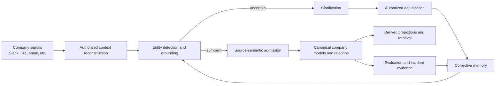

# Autonomous Company Learning — Journey, Current State and Remaining Work

**Document type:** Living execution record

**Branch:** `codex/autonomous-company-learning`

**Worktree:** `/Users/rachinkalakheti/fyraliscore-autonomous-learning`

**Current checkpoint:** `5ba59e42`

**Last updated:** 2026-07-16

## Purpose

This document records the journey of the autonomous company-learning goal:
what we intended to build, what was actually implemented, what went wrong in
the implementation process, what evidence currently exists, and what remains.

It is deliberately separate from:

- the normative architecture documents;
- the architecture discovery log;
- the implementation/reuse audit;
- the objective evaluation framework.

Those documents explain what the system should be. This document explains where
the work actually is.

## Update Protocol

Update this document whenever one of these occurs:

1. a meaningful implementation checkpoint is committed;
2. an end-to-end or causal evaluation changes the confidence boundary;
3. a major architecture decision is accepted, rejected or deferred;
4. a new blocker changes the remaining-work sequence;
5. the progress estimate changes materially.

For every update:

- change the current checkpoint and date;
- update the component-state and remaining-work sections;
- record exact validation evidence without inflating what it proves;
- append one dated entry to the progress ledger;
- keep task autonomy explicitly outside the active scope.

## Highest-Level Objective

The active goal is:

> Build a company-memory substrate that continuously converts authorized company
> signals into a more accurate, coherent and useful model of the company, learns
> from human and system feedback, and reuses those corrections autonomously
> without corrupting source truth.

The learning and feedback loop should be autonomous. The system should:

1. observe company signals;
2. reconstruct enough authorized context;
3. detect and ground company entities;
4. preserve ambiguity when evidence is insufficient;
5. admit only justified semantic beliefs;
6. ask for clarification at the highest-leverage uncertainty;
7. turn an authorized answer into corrective memory;
8. reuse that memory on later signals;
9. repair affected derived state;
10. measure whether reuse improves outcomes without increasing unsafe behavior.

## Explicit Non-Goal

Autonomous task execution is not part of the current goal.

The system is not currently being optimized to autonomously plan and execute
company work. Existing task-autonomy/agency code may remain for compatibility,
but it must not define or contaminate the active company-learning architecture.

## Core Mental Model

The graph is not an end in itself. It is the current, evidence-grounded company
model produced by this metabolism. Retrieval and adaptive inquiry are consumers
and feedback mechanisms around that substrate.

## Where the Journey Started

The work began as an architecture and evaluation-design exercise:

- reinterpret the graph as a living model of company physics;
- make feedback and learning loops central;
- define ideal system behavior from low-level functions to product outcomes;
- produce detailed implementation and evaluator documents;
- make company-entity extraction a first-order correctness boundary;
- handle Slack as a boundaryless, context-dependent signal source.

The initial work generated substantial specification detail, but implementation
progress was slower than expected and insufficiently isolated from the existing
repository.

## Why the Journey Took Too Long

### 1. Repository isolation happened too late

The original repository contained roughly 150 unrelated dirty paths. Working
inside that tree made every inspection, edit, test and commit require extra
caution.

Correction:

- created a dedicated worktree;
- created `codex/autonomous-company-learning`;
- made isolation a P0 prerequisite rather than an optimization.

### 2. Too much was treated as sequential

Shared-worktree and shared-Postgres failures led to excessive serialization.
Only overlapping edits, commits and shared-database test runs needed to be
serialized. Static analysis, evaluator work, documentation, domain extraction
and independent code lanes could run concurrently.

Correction:

- use non-overlapping file ownership for parallel agents;
- keep shared-Postgres suites sequential;
- merge at explicit checkpoints.

### 3. Edge cases were pursued before the core vertical was proven

The work repeatedly expanded into architecture gaps before proving one complete
signal-to-learning-to-reuse path.

Correction:

- prioritize one end-to-end Slack/entity/correction/reuse path;
- record discovered gaps in the reuse audit and discovery log;
- return to them after the core vertical is executable.

### 4. Existing components were not audited for reuse early enough

There was a risk of creating parallel subsystems for evaluation, clarification,
ingest and proof.

Correction:

- use the existing ingest `alias_repo` injection seam;
- use the canonical proof models and manifest aggregator;
- keep Company Vitals as the sole system report;
- extract clarification adjudication from the gateway into one reusable domain
  operation;
- preserve existing grounding, source-semantic and Model writers.

### 5. Mechanical closure was initially confused with causal learning proof

Storing a clarification, closing a grounding trace and later replaying an alias
show that the loop is connected. They do not prove that the learned policy
improves held-out outcomes.

Correction:

- add matched adaptive-versus-frozen experiments;
- seal gold before execution;
- derive correctness in the evaluator rather than trusting the harness;
- preserve every hard-safety incident;
- keep E3 runtime health separate from E4 synthetic causal evidence.

### 6. Attractive metrics were accepted before adversarial review

The first paired harness reported a strong lift, but review found treatment
leakage, global queue races, self-labelled correctness and shared longitudinal
state.

Correction:

- fresh adaptive/frozen tenants for every case;
- sequential arm execution with terminal semantic barriers;
- freeze the earliest corrective-memory consumer;
- preserve ordinary manual aliases in the frozen arm;
- require `resolved_for_consumer`;
- snapshot source observations;
- assert tenant noninterference;
- independently recompute the typed report in Company Vitals.

## Working Method Going Forward

1. Isolate the scope before editing.
2. Audit existing components before adding new ones.
3. Implement the smallest complete vertical first.
4. Keep architecture discoveries in the separate discovery log.
5. Record deferred edge cases instead of blocking the vertical.
6. Parallelize non-overlapping code, evaluator, audit and documentation lanes.
7. Run shared-database tests sequentially.
8. Commit every coherent, validated checkpoint.
9. Treat validation boundaries as part of the implementation.
10. Do not call a result causal or proof-bearing until adversarial review agrees.

## Current End-to-End Implemented Slice

```mermaid
flowchart LR
    A["Slack message with ambiguous NBI"] --> B["Grounding opportunity"]
    B --> C["Resolver review"]
    C --> D["Canonical clarification request"]
    D --> E["Authorized human adjudication"]
    E --> F["Adjudicated tenant-global exact alias"]
    F --> G["Later held-out Slack recurrence"]
    G --> H{"Adaptive or frozen arm"}
    H -->|adaptive| I["Governed exact-alias replay"]
    I --> J["Correct customer resolved<br/>0 LLM calls"]
    H -->|frozen| K["Learned alias hidden at ingest and resolver"]
    K --> L["Safe abstention<br/>1 LLM call"]
    J --> M["Source-semantic terminal fate"]
    L --> M
    M --> N["Typed paired report"]
    N --> O["Canonical INV-05 evidence"]
    O --> P["Company Vitals"]
```

## Component State

| Component | Current behavior | State |
| --- | --- | --- |
| Isolated development scope | Dedicated worktree and branch protect the main tree and enable narrow commits | Complete |
| Task-autonomy boundary | Active learning path is statically prevented from importing task-autonomy/legacy agency surfaces | Complete for active slice |
| Slack epistemic ownership | Unresolved grounding-owned Slack no longer competes with generic T1 Think ownership | Complete for current Slack path |
| Canonical entity review | New review obligations live in `clarification_requests`; legacy review queue remains compatibility-only | Complete |
| Clarification adjudication | Public domain operation owns authorization, alias persistence, successor grounding and feedback lineage; gateway delegates | Complete |
| Corrective-memory persistence | Authorized entity answers become lineage-valid adjudicated aliases without mutating source evidence | Complete for exact tenant-global aliases |
| Governed corrective replay | Later exact aliases can resolve autonomously from the adjudicated correction | Complete for exact tenant-global aliases |
| Frozen control seam | Clarification-learned memory can be hidden at ingest and resolver while ordinary manual aliases remain visible | Complete for experiment |
| Source semantics | Grounded Slack reaches interpretation and an explicit `belief_applied` or `no_admission` fate | Complete for current vertical |
| Canonical Model write | Renewal creates one Model; duplicate/unsupported support and risk signals correctly create none | Complete for sealed cases |
| Source immutability | Paired harness snapshots the recurrence Observation and reports mutation as a hard incident | Complete in paired harness |
| Tenant isolation | Paired harness asserts recurrence observations, grounding, Models and aliases do not cross arm tenants | Complete in paired harness |
| Company-learning evaluator | Context, grounding and source-semantic state compile into one active-slice evaluation | Complete for measured slice |
| Paired causal evaluator | Correctness is derived from sealed arm-specific gold and terminal consumer fate; incidents are noncompensatory | Complete for current case family |
| Canonical proof integration | Experiment scenario and lift metric are registered under INV-05 and aggregated through canonical proof models | Complete |
| Company Vitals | Validates and recomputes the typed experiment artifact, displays continuous metrics and keeps it non-scoring | Complete |
| Negative/adversarial recurrence families | Contextual, conflict, homonym, unrelated and unseen-spelling cases | Not implemented |
| Broad correction propagation | Repair every dependent Model, relation, edge and projection after a corrected identity | Partial |
| Cross-source company physics | Equivalent learning behavior across Jira, email, documents and other sources | Partial / unproven |
| Long-duration autonomous learning | Drift, retention, rollback and regression behavior across many learning cycles | Not proven |

## Important Implementation Checkpoints

| Commit | Meaning |
| --- | --- |
| `ecaa28cc` | Isolated autonomous company-learning scope |
| `d9128436` | Turned entity clarifications into corrective memory |
| `6503dd41` | Isolated neutral semantic write context |
| `dea89ffc` | Measured corrective-memory closure |
| `745dc9bd` | Repaired reviewed grounding into company memory |
| `34774139` | Replayed governed entity corrections autonomously |
| `52d97538` | Unified company-learning proof in Company Vitals |
| `a1303b19` | Made clarifications own entity review |
| `b241134e` | Gave unresolved Slack one epistemic owner |
| `9df63148` | Added frozen corrective-memory control |
| `7527a34d` | Moved entity adjudication from the gateway into the domain |
| `5f04dbf8` | Added sealed paired evidence and canonical proof integration |
| `5ba59e42` | Added isolated real-Postgres corrective-memory experiment |

## Current Validation Evidence

### Paired causal slice

Real-Postgres result:

- three independent matched recurrence pairs;
- six distinct arm tenants;
- adaptive correctness: `1.0`;
- frozen correctness: `0.0`;
- adaptive-minus-frozen lift: `1.0`;
- adaptive LLM calls: `0`;
- frozen LLM calls: `3`;
- calls avoided: `3`;
- detected hard-safety incidents: `0`;
- complete correction-to-grounding/source-semantic lineage: `1.0`.

Semantic outcomes:

- renewal: `belief_applied`, exactly one new Model;
- support: `no_admission`, zero new Models;
- risk: `no_admission`, zero new Models.

This distinction matters: entity learning succeeds on all three cases without
forcing every resolved signal to become a belief.

### Focused validation

- paired harness real-Postgres tests: `2 passed`;
- full entity-resolver test directory: `37 passed`;
- evaluator, Company Vitals, domain adjudication, router and boundary tests:
  `47 passed`;
- paired evaluator and Company Vitals focused suite: `32 passed`;
- import-linter: 7 contracts kept, 0 broken;
- architecture ratchets: passed;
- production environment contract: passed;
- changed-file Ruff and Python compilation: passed;
- typed artifact from the CLI smoke run was accepted and recomputed by the
  Company Vitals validator.

### Known validation caveat

The repository-wide technical-debt budget currently fails on pre-existing
global counts and unrelated named files. The current changes preserve one large
clarification workflow while moving it from the gateway into the domain; they
do not resolve the repository-wide debt budget.

## What the Current Evidence Proves

The current system proves one narrow but real causal statement:

> For the sealed exact-alias Slack recurrence population, authorized corrective
> memory causes correct later entity resolution and avoids resolver-model calls,
> while the matched frozen system safely abstains.

It also proves:

- source evidence is not mutated in this path;
- the resolver is not allowed to invent entity IDs;
- corrective memory can be persisted and replayed with human authorization;
- frozen evaluation blocks corrective-memory use at the earliest consumers;
- ordinary manual entity knowledge remains available in the frozen arm;
- identity correctness and semantic belief admission are separately evaluated;
- typed evidence can be validated, recomputed and integrated into canonical
  invariant proof.

## What the Current Evidence Does Not Prove

It does not yet prove:

- performance on unseen alias spellings;
- contextual references, pronouns or local nicknames;
- conflicting evidence;
- homonyms and same-name companies/people;
- negative controls where no entity should resolve;
- open-world Slack reconstruction across long time spans and channels;
- statistical confidence from a large held-out population;
- real-provider/model robustness;
- equivalent behavior across Jira, email, documents and meetings;
- complete downstream repair after an identity correction;
- long-term retention without catastrophic overgeneralization;
- customer value or E5 production benefit.

## Progress Estimate

These are planning estimates, not evaluator metrics.

| Scope | Estimate | Meaning |
| --- | ---: | --- |
| Exact-alias Slack clarification-to-reuse vertical | 100% | Implemented, real-Postgres tested and causally compared |
| Active autonomous company-learning runtime | 55–60% | Core loop exists, but breadth, repair and generalized grounding remain |
| Customer-free objective substantiation | 30–35% | Strong typed framework and first E4 slice exist; population breadth is still small |
| Broader revised system excluding task autonomy | 50–55% | Core substrate and proof path are substantial, but multiple end-state components remain partial |

Task autonomy is excluded from all percentages.

## Remaining Work

### P0 — Required before believing the company-learning system broadly works

1. **Run one joined full Company Vitals report**
   - Include the normal E3 company-learning manifest and the paired E4 artifact
     in one production-shaped report directory.
   - Verify declared-partition evidence aggregation and artifact-only rerender
     from real saved artifacts, not only unit fixtures.

2. **Add non-resolution and ambiguity controls**
   - Contextual phrase negative.
   - Unrelated alias negative.
   - Homonym/local-association case.
   - Conflicting source hint.
   - Assert zero unsafe global alias creation and zero wrong Models.

3. **Expand beyond exact surface replay**
   - Unseen spelling and abbreviation variants.
   - Pronouns, descriptions and local nicknames.
   - Context-dependent references whose meaning changes by channel/thread/time.
   - Explicitly measure when retrieval/context helps and when it contaminates.

4. **Prove Slack conversational reconstruction**
   - Source-native edit/delete/reaction behavior.
   - Cross-thread and cross-channel dependencies.
   - Long-range temporal context.
   - Sufficient-context and contamination gold.
   - Boundaryless episode reconstruction rather than fixed windows.

5. **Complete correction propagation**
   - Identify every accepted Model, relation, edge and projection that depended
     on the wrong grounding.
   - Fence unsafe reads immediately.
   - Recompute or supersede all affected derived state.
   - Measure convergence time and residual correction debt.

6. **Scale the held-out population**
   - Generate enough independent matched pairs for uncertainty intervals.
   - Stratify by source, ambiguity, entity type, context length and consequence.
   - Preserve every pair and prevent selective rerun reporting.

### P1 — Required for a strong multi-source product

1. Converge source-semantic direct application and normal Think application on
   one validation/apply contract.
2. Extend the same entity-learning loop to Jira, email, documents, meetings and
   other structured sources.
3. Add entity lifecycle cases: creation, rename, merge, split, archive and
   resurrection.
4. Add actor/customer/project/system same-surface ambiguity.
5. Measure correction retention, forgetting and old-family regression.
6. Add cross-tenant adversarial suites beyond the current paired assertions.
7. Neutralize remaining active command-kernel `agency_*` naming without
   reactivating task autonomy.
8. Move shared database codec/bootstrap ownership out of gateway scope.

### P2 — Required for production confidence

1. Frozen real-provider/model runs.
2. Long-duration replay and restart testing.
3. Burst/load, backlog, cost and latency characterization.
4. Provider outage and partial-failure recovery.
5. Append-only experiment registry and signed/attested evidence manifests.
6. Open-world simulation with hidden company truth.
7. E5 customer-value evaluation after synthetic assurance is strong enough.

## Next Execution Sequence

1. Commit this living status document and the updated audit/discovery records.
2. Produce a joined real-artifact Company Vitals run.
3. Add contextual/conflict/homonym/unrelated negative cases in parallel lanes.
4. Add larger held-out exact and variant-alias populations.
5. Implement dependent-state correction propagation.
6. Add Slack reconstruction gold and context ablations.
7. Repeat the causal suite across structured sources.
8. Reassess progress and reprioritize from the combined report.

## Progress Ledger

### 2026-07-16 — Living journey record created

- Added a durable status document separate from architecture truth.
- Recorded the active objective and explicit task-autonomy exclusion.
- Captured the causes of the slow implementation journey and the corrected
  working method.
- Recorded the exact-alias paired causal result and its proof boundary.
- Split remaining work into P0/P1/P2.

### 2026-07-16 — Paired experiment accepted after adversarial repair

- Rejected the first attractive lift claim because of treatment leakage,
  semantic queue races, caller-labelled correctness and shared longitudinal
  state.
- Rebuilt the experiment with fresh tenants per case, sealed per-arm gold,
  sequential terminal barriers, source snapshots and tenant isolation.
- Real Postgres produced three adaptive wins, three avoided model calls and no
  detected hard-safety incident.

### 2026-07-16 — Proof and domain ownership consolidated

- Registered the paired scenario and lift metric under INV-05.
- Converted the report into canonical invariant evidence.
- Preserved the lower E3 tier during evidence aggregation.
- Moved entity-resolution adjudication from a private gateway helper into a
  public domain operation.
