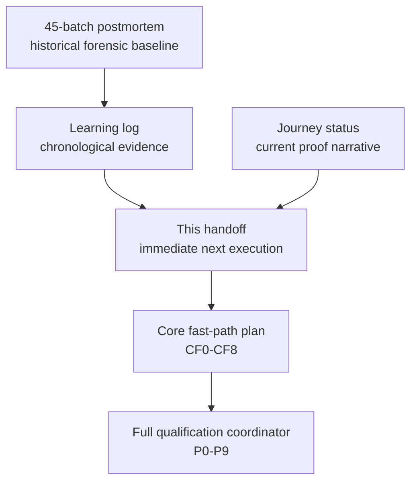
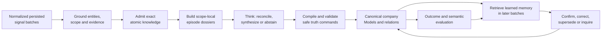
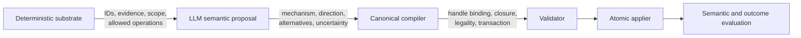
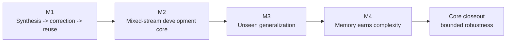
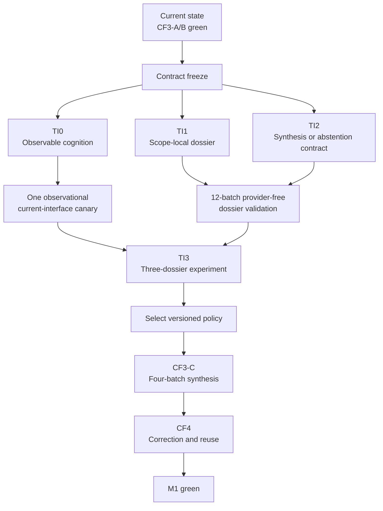
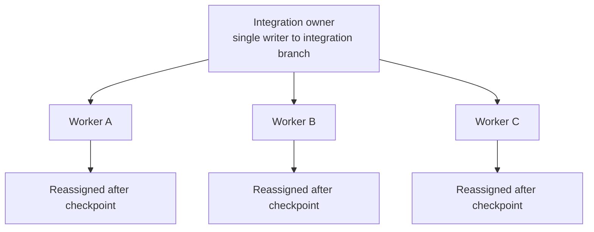

# Autonomous Company Learning — New-Thread Execution Handoff

**Document type:** Authoritative new-thread orientation and immediate execution
handoff

**Status:** Ready for contract freeze; implementation has not begun for the
Think Intelligence Gate

**Date:** 2026-07-19

**Active branch:** `codex/autonomous-company-learning`

**Required worktree:**
`/Users/rachinkalakheti/fyraliscore-autonomous-learning`

**Verified handoff HEAD:**
`5437ee42d926c6483a7a59b28bbdfd34c9c3165a`
(`fix(company-learning): normalize synthesis relation ownership`)

**Working-tree state at handoff:** clean

## 1. Purpose And Authority

This is the starting document for continuing the autonomous company-learning
goal in a new Codex thread. It is designed to give a new integration agent and
its subagents enough context to act without reconstructing the entire previous
conversation.

It explains:

- what Fyralis is trying to achieve;
- what is already proven;
- what remains unproven;
- why the last two real-model synthesis runs failed;
- what the new Think/LLM analysis changed;
- the bounded plan that now supersedes the previously scheduled immediate
  CF3-C confirmation canary;
- how to parallelize implementation safely with the available agent slots;
- exact success, stop, evidence, and handoff criteria; and
- which existing components must be reused rather than rebuilt.

This document is authoritative for the **immediate execution sequence** until
its decisions are reconciled into the central coordinator. It does not replace
the historical journal, the full qualification program, or normative system
architecture.

Do not edit the main architecture documents merely because this handoff
contains a proposal. A finding becomes normative only after implementation,
validation, an explicit coordinator decision, and an evidence-backed
documentation update.

## 2. Read These Records First

### 2.1 Historical journal and current-state records

- [Company-Learning Epistemic Repair Learning Log](company-learning-epistemic-repair-learning-log.md)
  is the chronological journal for learnings, failed assumptions, repair
  hypotheses, artifacts, pitfalls, and decisions. Read at least its current
  snapshot and `LOG-068` through `LOG-070` before editing runtime behavior.
- [Autonomous Company-Learning Journey Status](autonomous-company-learning-journey-status.md)
  is the durable narrative of what was attempted, why the journey became slow,
  what succeeded, and what remained open at each checkpoint.
- [Autonomous Company Learning Core Fast-Path](autonomous-company-learning-core-fast-path.md)
  defines the existing `CF0`-`CF8` proof ladder and core success criteria.
- [Company-Learning Epistemic Repair Agent Coordinator](company-learning-epistemic-repair-agent-coordinator.md)
  contains the broader `P0`-`P9` qualification and release-evidence program.
- [45-Batch Cold-Start Postmortem](../evaluation/autonomous-company-learning-cold-start-45-postmortem-20260717.md)
  is the forensic baseline that exposed the original semantic failure cluster.

### 2.2 How the records relate



The older records currently say that one confirmation CF3-C canary is the next
semantic action. That was correct before the subsequent LLM-interface audit.
The new evidence changes the immediate order:

> Do not run another CF3-C canary until the bounded Think Intelligence Gate in
> this document is complete.

The rest of the existing `CF3-C -> CF4 -> CF5 -> CF6 -> CF7 -> CF8` ladder
remains valid.

## 3. Highest-Level Objective

Fyralis is not currently being built as an autonomous task-execution agent.
Its active purpose is:

> Continuously convert authorized company signals into an increasingly
> accurate, coherent, evidence-grounded and useful model of how the company
> works, changes, and relates; then reuse feedback and learned memory to improve
> later understanding without corrupting source truth.

The graph is not the product merely because it contains nodes and edges. It is
valuable only when it represents company semantics the system has earned from
evidence and can revise over time.



The core autonomous behavior is the company-understanding and feedback loop.
Task autonomy remains explicitly outside scope.

## 4. Explicit Scope Boundary

### 4.1 In scope

- Normalized, source-attributed signals already persisted in PostgreSQL.
- Intact batch processing; semantic tests must not process signals one at a
  time.
- Entity detection, grounding, authority, uncertainty, and semantic scope.
- Slack-like context represented in the simulated normalized signal corpus.
- Evidence-bound atomic knowledge.
- Mechanism-level Models and governed relations.
- Retrieval and actual use of accepted Models in later batches.
- Contradiction, correction, lifecycle, and historical preservation.
- Autonomous company-memory feedback and reuse.
- Objective semantic evaluation, observability, and bounded robustness.

### 4.2 Out of scope for the active finish line

- Slack, Jira, email, CRM, or other source listeners and connector transport.
- OAuth, webhooks, polling, retries, and delivery durability.
- Autonomous task planning or consequential external action.
- UI and customer workflow implementation.
- General-purpose multi-agent debate systems.
- Runtime prompt self-modification.
- Exhaustive entity and relation edge cases.
- Broad production hardening, distributed operation, and production SLOs.
- Perfect token economics before semantic correctness.
- A second 45-batch run.

When an out-of-scope issue is discovered, record it in
[the edge-case ledger](autonomous-company-learning-edge-case-ledger.md) or the
[learning log](company-learning-epistemic-repair-learning-log.md). Do not fix it
unless it violates a current hard invariant or prevents the current phase from
finishing.

## 5. Current State At Handoff

### 5.1 Milestone state

| Milestone or phase | State | Honest proof boundary |
| --- | --- | --- |
| Repository isolation | Green | Dedicated worktree and branch; clean at handoff |
| M0 mechanical learning path | Green | Provider-free, production-shaped PostgreSQL path is proven for the bounded four-batch vertical |
| CF3-A real-provider transport | Green | One intact 25-signal batch, Codex CLI, receipts and barrier completion |
| CF3-B prior-memory use | Green | A second batch selected and materially applied exact accepted prior Models |
| CF3-C synthesis | Red | Two four-batch real-model runs completed but admitted no expected Atlas composite or canonical causal relation |
| Latest compiler repair | Provider-free green only | Focused synthesis and PostgreSQL atomicity proof passes `21/21`; no confirmation provider run |
| CF4 correction/lifecycle | Locked | Cannot begin until CF3-C synthesis is genuinely green |
| CF5 full mixed stream | Not proven | Existing complete twelve-batch runs remain development failures |
| CF6 unseen holdout | Not run | Final holdout must be independently sealed |
| CF7 memory ablation | Not run | Memory has not yet earned its complexity under matched arms |
| CF8 bounded robustness | Not run | Core interruption/replay/isolation closeout remains |

### 5.2 What is already strong enough to reuse

Do not rebuild these systems merely because the new Think boundary changes:

- PostgreSQL observation storage and normalized signal substrate.
- Existing mention discovery and entity-resolution substrate.
- Founder/bootstrap exact identity vocabulary where explicitly authorized.
- Governed learning episodes and canonical semantic scope coordinates.
- SAGE, retrieval, adaptive inquiry, and accepted-memory selection.
- Accepted Model truth kernel and current-head lifecycle controls.
- Canonical relation truth kernel.
- Immutable evidence and Model-version lineage.
- Validator, applier, compare-and-set fences, and atomic transactions.
- Projection/outbox path.
- Batch workers, barriers, queue fates, and tenant isolation.
- Codex provider abstraction and physical call receipts.
- Existing CF3 and P6 runners, evidence extractors, and scorers.

The default replacement order remains:

1. reuse directly;
2. wrap behind a clearer contract;
3. make one narrow repair;
4. replace only with written evidence that existing behavior cannot satisfy a
   core invariant.

## 6. Most Important Existing Evidence

### 6.1 CF3-B: prior memory is genuinely usable

Tenant `e188354c-4a88-406d-bf25-f005cf9af275` processed two intact batches in
`227.633s`:

- batch 1 admitted `14/14` evidence-backed Models;
- batch 2 selected all 14 exact prior Models;
- 12 prior-memory effects were authorized, trace-referenced, durably applied,
  and receipted;
- both barriers closed; and
- the strict evaluator reported no failed gate.

Provider usage was:

- 204,011 input tokens;
- 42,466 output/reasoning tokens; and
- 121,856 cache tokens.

This proves retrieval presence can become a concrete later memory effect. It
does not prove mechanism-level synthesis.

Artifact:

- `/tmp/fyralis-cf3b-provenance-scope-two-batch-spark-r1.json`
- SHA-256:
  `9bc3a827cb4b0fd8ea688ddc9f8303ca747787de94fb337d98ad17473e8a968a`

### 6.2 First CF3-C: candidate identity and noise defects

The first dedicated four-batch CF3-C run completed 100 signals in `718.814s`
with 62 provider calls. Entity, boundary, lineage, atomic-recall, and prior-use
behavior was mostly healthy, but:

- the long synthesis candidate ID failed to join after provider output;
- no composite or canonical relation was admitted;
- four distractor observations were duplicated under unresolved mention
  coordinates; and
- receipt aggregation confused entity-grounding calls with Think-run calls.

Those mechanisms were repaired without relabeling the failed artifact.

### 6.3 Second CF3-C: lower substrate green, synthesis still absent

Tenant `bc18e40b-cadc-4ff8-bbc8-6ba7cbd76df0` processed four intact batches of
25 in `796.150s` with 57 physical LLM calls.

All measured grounding, atomic, canonical-link, entity-type, evidence-lineage,
scope, barrier, receipt, and prior-memory gates were green. The first three
batches admitted exactly the intended 12 atomics each. Batch four still
admitted no composite and no canonical relation.

The original run-level classification was:

- one causal obligation perceived;
- zero causal obligations emitted;
- one synthesis decision blocked; and
- raw structured provider output unavailable after the run.

The immediate compiler defect was redundant semantic ownership: the provider
selected relation endpoints and independently repeated a compatible member
list, while the compiler required those two provider-authored fields to agree.
The latest commit normalizes advisory membership around valid distinct closed
endpoints. Focused provider-free synthesis and PostgreSQL atomicity tests pass
`21/21`.

This local result does **not** prove that the real provider now performs the
right semantic synthesis.

Artifacts:

- `/tmp/fyralis-cf3c-four-batch-spark-r2.json`
- SHA-256:
  `43b0c5c5f69a7d24f277ea003baf22fda53289d0a5eae6a363ddedc378dce340`
- `/tmp/cf3c-r2-b4-context-packet.json`
- SHA-256:
  `a203469cbd02add55ae8b0b86d9ba36e29cf94c87228aa47865357fe20234a2f`

These `/tmp` files are local evidence, not committed repository artifacts.
Verify their existence and digests before relying on them in the new thread.

## 7. The New Think/LLM Diagnosis

The latest analysis changes the next action. Fyralis has invested much more in
controlling the LLM than in giving it a well-formed cognitive problem.

The architecture increasingly enforces:

- evidence authority;
- deterministic identity;
- allowed-operation boundaries;
- compiler ownership;
- validation;
- atomic application; and
- evaluator gates.

Those protections should remain. But the main LLM is frequently used as a
large bookkeeping and serialization engine instead of a focused company
sense-making engine.

### 7.1 What the second CF3-C run consumed

| LLM purpose | Calls | Input tokens | Output/reasoning tokens | Cache tokens |
| --- | ---: | ---: | ---: | ---: |
| Entity grounding, currently coarsely grouped | 45 | 604,960 | 31,551 | 514,688 |
| Main Think reasoning | 9 | 254,619 | 87,984 | 98,816 |
| Question planning | 3 | 41,273 | 14,481 | 34,560 |
| Total | 57 | 900,852 | 134,016 | 648,064 |

The fourth batch's largest main call used 40,378 input tokens and 28,782
output/reasoning tokens. It coordinated 23 candidates, many exact prior-memory
classifications, and full canonical identifiers, yet produced no accepted
mechanism-level Model or relation.

The frozen artifact names `gpt-5.3-codex-spark`, but does not reliably preserve
the reasoning-effort setting. Do not infer the effort from older runs.

### 7.2 The cognitive problem was misframed

The fourth batch contained evidence suggesting a useful Atlas mechanism:

- an unresolved release certificate;
- a delayed rollout window;
- certificate ownership changing near the status change; and
- independent records linking ownership/handoff state to rollout timing.

The synthesis candidate presented to the LLM was nevertheless framed as:

> `Atlas release is ready.`

The LLM then had to undo that misleading headline while simultaneously:

- processing unrelated storylines;
- deciding more than twenty candidates;
- classifying effects against many prior Models;
- coordinating full UUIDs;
- choosing operations;
- selecting endpoints and members;
- satisfying evidence rules; and
- obeying relation instructions that were not fully consistent.

This is a task-design failure before it is evidence of inadequate model
capability.

### 7.3 Specific structural weaknesses

1. Transport batches and semantic reasoning scopes are too easily conflated.
2. Retrieval returns relevant data but not a compact causal reasoning dossier.
3. Candidate construction can pre-bias the thesis away from the hidden
   mechanism.
4. One flat decision schema exposes many irrelevant fields.
5. Full UUID copying consumes attention and creates avoidable failure modes.
6. Reconciliation, synthesis, inquiry, abstention, and database coordination
   are mixed in one task.
7. Prompt instructions disagree about who owns relation and membership
   semantics.
8. Some semantic responsibility has drifted into lexical compiler heuristics.
9. Model and reasoning effort are not routed by cognitive difficulty.
10. Raw prompt and pre-compiler provider decisions are not frozen in current
    artifacts.
11. Existing prompt-size engineering mostly optimizes the older generic prompt
    path, while the critical compiled batch path bypasses it.
12. The feedback loop measures retrieval and memory effects but does not yet
    learn which prompt, schema, model, effort, or context representation
    produced better semantic outcomes.

### 7.4 Correct responsibility boundary



The governing rule is:

> The LLM owns semantic judgment. The compiler owns identity, evidence closure,
> legality, and atomicity. Validators constrain. Appliers mutate.

Do not make the LLM transport canonical UUIDs. Do not make the compiler infer
business meaning through fixture-shaped keyword rules.

## 8. Updated Milestones

The project needs two distinct finish lines.

### 8.1 M1 — First closed company-learning loop

M1 is green immediately when:

1. CF3-C forms the correct scope-local mechanism Model and governed relation;
2. CF4 receives later evidence and correctly confirms, revises, supersedes, or
   invalidates that Model; and
3. a later batch retrieves and uses the corrected current head.

This is the first working-core milestone. Record it explicitly even though
broader qualification remains.

### 8.2 Core system complete

Core completion additionally requires:

- a green twelve-batch mixed-stream development proof;
- the same behavior on a sealed unseen company;
- a matched memory-versus-observation-only ablation showing value;
- bounded interruption, replay, and tenant-isolation proof; and
- a precise final report of what is and is not guaranteed.



## 9. Immediate Plan: Think Intelligence Gate

Insert the following bounded gate between the already-green CF3-B result and
the next CF3-C provider run.



### 9.1 Contract freeze

Freeze only the shared interfaces needed for independent implementation:

1. telemetry event and trace envelope;
2. scope-local synthesis dossier schema;
3. `SynthesisProposal | AbstentionDecision`;
4. local-handle binding contract;
5. semantic scorer case/result format;
6. prompt, schema, model, effort, and policy version envelope;
7. artifact naming and digest rules; and
8. file/database ownership manifest.

The contracts may be drafted in parallel but have one integration owner and
one final frozen digest.

**Success criteria**

- Every field has one owner and one semantic meaning.
- No evaluator gold appears in a runtime contract.
- Runtime lanes can implement without editing one another's files.
- Amendment authority belongs only to the integration owner.
- The freeze is a small contract checkpoint, not a framework project.

### 9.2 TI0 — Make the active Think call observable

Capture for the active compiled Think path:

- cognitive purpose;
- exact system and user prompt;
- prompt, schema, model, effort, and policy versions;
- selected dossier/context manifest;
- raw structured provider response before compiler normalization;
- compiler normalizations and exact rejection predicates;
- validated command;
- applied result;
- physical/logical attempt identity, retries, tokens, cache, and latency; and
- final semantic score.

Split coarse call purposes enough to distinguish at least mention discovery,
entity resolution, question planning, main reconciliation, and main synthesis.
Do not redesign the global telemetry framework if the critical compiled path
can be made fully observable with a smaller extension.

Likely implementation surfaces:

- `lib/llm/telemetry.py`
- `services/reasoning/think/llm_receipts.py`
- `services/reasoning/think/debug_capture.py`
- `services/reasoning/think/llm_reason.py`
- `services/reasoning/think/reason.py`
- `services/reasoning/think/run_pipeline.py`
- focused receipt and observability tests

**Success criteria**

- A synthetic provider-free call reconstructs prompt -> raw response -> compile
  -> validate -> apply.
- Physical calls, logical calls, retries, costs, and Think runs reconcile.
- The first real observational canary preserves enough evidence to assign a
  failure unambiguously to context, model, schema, compiler, validator, or
  applier.
- The trace contains no evaluator gold or secrets.

### 9.3 One observational current-interface canary

After TI0 is green, freeze its commit and run exactly one current-interface
four-batch canary in a clean proof worktree and isolated database.

This run is **observation only**:

- it tests the already-committed compiler repair in the live path;
- it produces the missing raw baseline;
- it becomes Arm A evidence for TI3; and
- it must cause no patch, prompt tweak, threshold change, or follow-up rerun.

Its result has no blocking authority. TI1-TI3 proceed whether it is red or
green. If the integration team cannot enforce that precommitment, skip the
canary rather than reopening the patch/rerun loop.

### 9.4 TI1 — Scope-local synthesis dossier

Build a bounded dossier from existing governed scope assignments. It should
contain:

- canonical scope and time window;
- ordered state-changing events;
- current accepted Model heads;
- direct observations;
- source authority and independence;
- supporting evidence;
- contradictory evidence;
- open uncertainty;
- candidate causes, conditions, and outcomes;
- previously considered explanations; and
- missing evidence that would discriminate between alternatives.

TI1 must **not** solve general open-world Slack segmentation. It assembles a
better reasoning problem from scopes and episodes the existing grounding path
already produced.

Likely implementation surfaces:

- `services/platform/execution/context_packet.py`
- `services/platform/execution/question_generation.py`
- `services/platform/execution/question_text.py`
- `services/platform/execution/routing.py`
- a new small dossier module if that prevents ownership overlap
- context-packet and CF3 fixture tests

**Provider-free success criteria**

- Run dossier construction across all twelve development batches.
- Canonical synthesis evidence is scope-local.
- Wrapper/control/evaluator objects are absent.
- Malformed derived entities are absent.
- Temporal order is correct.
- Direct, transitive, contradictory, and auxiliary evidence remain typed.
- Atlas and Cobalt each create one mature opportunity at the expected point.
- A null case creates no mechanism opportunity.
- No expected thesis or storyline identifier enters the dossier.

Cross-scope analogies may eventually become explicitly typed auxiliary context,
but they are excluded from the immediate gate.

### 9.5 TI2 — Minimal semantic decision contract

Before CF3-C, implement only:

```text
SynthesisProposal | AbstentionDecision
```

Do not redesign every Think cognitive operation.

`SynthesisProposal` should contain semantic content such as:

- thesis;
- mechanism;
- cause/condition handles;
- effect handles;
- supporting evidence handles;
- counterevidence;
- strongest alternative;
- novelty relative to accepted memory;
- confidence; and
- falsifying evidence.

Use local handles such as `M1`, `M2`, `O1`, and `O2`. The compiler maps those
handles to canonical identifiers.

The LLM owns mechanism, direction, alternatives, novelty, counterevidence, and
uncertainty. The compiler owns canonical identity, evidence closure, allowed
operations, endpoint existence, exact versions, and atomic transaction
construction.

Likely implementation surfaces:

- `services/reasoning/think/compiled_reasoning.py`
- dedicated synthesis schema/compiler module if useful
- `services/reasoning/think/tests/test_compiled_synthesis_contract.py`
- `services/reasoning/think/tests/test_compiled_synthesis_atomicity.py`
- `tests/unit/think/test_compiled_candidate_scope.py`

**Provider-free success criteria**

- No provider-authored canonical UUID is required.
- Every local handle maps to exactly one closed dossier object.
- Unknown, stale, duplicate, or unauthorized handles fail before mutation.
- Composite and required governed relation apply atomically or not at all.
- One authoritative relation contract exists.
- The compiler does not infer business meaning from fixture-shaped lexical
  rules.
- Existing atomic and prior-memory behavior remains covered and unchanged.

Introduce `CorrectionProposal` only when CF4 begins and only if the existing
lifecycle interface cannot express the required correction cleanly.

### 9.6 TI4-min — Minimum cognitive-policy governance

Before CF3-C, implement only:

- prompt-policy version;
- schema version;
- model and effort record;
- evaluation receipt;
- deterministic rollback; and
- semantic failure classification.

Do not build a broad self-optimizing prompt registry before M1. The larger
offline replay-and-promotion loop can mature between CF4 and CF5.

### 9.7 TI3 — Controlled three-dossier experiment

Freeze three development dossiers:

1. **Atlas positive:** ownership/certificate state affecting rollout timing.
2. **Cobalt positive:** a structurally different mechanism such as procurement
   or constraint propagation.
3. **Null/adversarial:** tempting correlations with insufficient evidence; the
   correct output is abstention or targeted inquiry.

Compare:

| Arm | Interface | Model/effort | Purpose |
| --- | --- | --- | --- |
| A | Current compiled interface | Current configuration | Baseline |
| B | New dossier and schema | Same model/effort | Is task design the main gain? |
| C | New dossier and schema | Stronger or higher-effort configuration | Does added model capability earn its cost? |

Use a staged experiment:

1. screening: three dossiers x three arms x one sample = nine calls;
2. confirmation: best two arms x three dossiers x two additional samples =
   twelve calls; and
3. expand only if variance prevents a decision.

The calls are isolated but not deterministic or free. Run at controlled
concurrency of at most three after a provider-concurrency preflight. Use unique
attempt IDs and artifact directories. Do not use concurrent load measurements
as production latency evidence.

Likely evaluator surfaces:

- `services/evaluation/epistemic_repair/cf3c_four_wave.py`
- `scripts/evaluate_cf3c_four_wave.py`
- `tests/epistemic_repair/p6/test_cf3c_four_wave.py`
- a small frozen-dossier replay module and independent tests

**Continuous scores**

- scope precision;
- mechanism correctness;
- thesis-facet completeness;
- causal-direction correctness;
- evidence precision and coverage;
- counterevidence recognition;
- alternative quality;
- novelty judgment;
- confidence calibration;
- abstention appropriateness;
- schema validity;
- compiler acceptance;
- cross-scope contamination;
- run-to-run consistency;
- tokens, latency, and cost; and
- semantic value per thousand tokens.

**Hard gates**

- invented or unresolved handles: zero;
- missing evidence references: zero;
- cross-scope canonical evidence: zero;
- unsupported canonical relations: zero;
- schema/compiler acceptance: 100% for accepted proposals;
- correct mechanism and direction for accepted positive cases;
- correct abstention or inquiry for the null case;
- partial composite/relation application: zero; and
- validator/applier failures: zero.

Choose the cheapest configuration within a preregistered quality tolerance of
the best. If Arm B wins, proceed without a factorial study. If Arm B
underperforms, run at most one targeted isolation arm selected from the
observed failure, then stop for an architecture decision if the boundary is
still unresolved.

## 10. Resume The Existing Proof Ladder

### 10.1 CF3-C — Four-batch synthesis canary

Run one clean zero-seed, four-batch Codex canary with the selected policy.

It must prove:

- exactly 100 signals in four intact batches of 25;
- existing grounding, linking, typing, atomic, lineage, scope, receipt, and
  barrier gates remain green;
- exactly one expected mature Atlas composite at the expected opportunity;
- no premature composite;
- correct mechanism and causal direction;
- expected governed relation admitted atomically when supported by the frozen
  oracle;
- exact member versions and evidence roles;
- no cross-story contamination;
- explicit counterevidence and alternative assessment;
- mature prior Models actually used; and
- complete prompt -> raw decision -> compiler -> apply trace.

A failed canary must be reproduced on its frozen dossier before any repair or
rerun.

### 10.2 CF4 — Correction, lifecycle, and reuse

Run only to the first complete contradiction/correction opportunity, expected
around eight or nine batches.

It must prove:

- the mature Model exists before contradiction;
- higher-authority or contradictory evidence receives the right scope and
  evidence role;
- the expected lifecycle transition is selected;
- exactly one current accepted head remains;
- the old head remains historically queryable but is not current;
- dependent relations and projections follow the current head;
- a stale expected-head mutation fails without partial writes;
- unrelated scopes remain unchanged; and
- a later batch retrieves and uses the corrected head.

When CF3-C and CF4 are both green, publish the M1 working-core verdict before
continuing.

### 10.3 CF5 — Twelve-batch mixed-stream development proof

Run all 300 signals only after CF3-C and CF4 are green. Preserve the existing
hard and continuous criteria in the core fast-path plan, including:

- four coherent hidden-storyline theses;
- lifecycle accuracy;
- governed relations;
- Model-first retrieval;
- justified observation reopening;
- zero high-consequence contamination; and
- complete barriers and evidence.

Accept the first valid result. A valid semantic failure is evidence and does
not authorize immediate full replay.

### 10.4 CF6 — Sealed unseen company

Design can begin early, but do not open or instantiate the final holdout in the
implementation workspace. Prefer:

- an independent environment or reviewer; or
- a frozen independent generator whose final seed is withheld until the
  release-candidate surface is frozen.

The current subagent environment shares a filesystem, so instruction-only
blindness is operational, not cryptographic. Do not overclaim it.

### 10.5 CF7 — Minimal memory-value ablation

Compare adaptive accepted memory against an observation-only arm under matched
signals, chronology, provider, token budget, and evaluator.

Memory must improve at least one preregistered semantic or efficiency outcome
without adding high-consequence truth incidents. This is where the Model/graph
layer earns or fails to earn its complexity.

### 10.6 CF8 — Bounded robustness and closeout

Prove interruption safety, replay/idempotency, tenant isolation, and bounded
growth. Publish the final report and durable backlog. Update normative
architecture only with behaviors supported by completed evidence.

## 11. Maximum Safe Parallelization

The current environment supports four total agent slots, including the root
integration agent. Treat the larger reviewer roster as reusable roles across
waves, not simultaneous agents.



### 11.1 Contract-freeze dispatch

Three agents may draft the telemetry, dossier, and decision/scorer contracts
in parallel. The integration owner reconciles and freezes one shared version.

### 11.2 Wave 1

| Agent | Owns | Suggested database | Must not touch |
| --- | --- | --- | --- |
| Telemetry | TI0 capture and reconciliation | `fyralis_ti0` | Prompt meaning and decision schema |
| Dossier | TI1 assembler and 12-batch mechanical validation | `fyralis_ti1` | Canonical admission and compiler |
| Contract | TI2 schema, handles, compiler boundary, atomicity tests | `fyralis_ti2` | Evaluator gold and scorer thresholds |

Give each lane:

- a `codex/*` branch;
- a separate worktree;
- a separate PostgreSQL database, not merely a shared mutable schema unless
  existing connection behavior is proven schema-safe;
- a separate artifact directory;
- the frozen contract digest;
- owned and forbidden file lists; and
- one reversible commit checkpoint.

As soon as TI0 is green, run the observational canary on its frozen commit in a
separate proof worktree while TI1 and TI2 continue.

### 11.3 Wave 2

| Agent | Owns |
| --- | --- |
| Scorer | Frozen replay, semantic metrics, TI4-min receipts |
| Fixture | Cobalt and null cases plus gold annotations |
| Auditor | Read-only attack on TI0-TI2, contracts, and baseline artifacts |

The auditor is a recurring checkpoint role, not a permanently occupied slot.
Run it after contract freeze, Wave 1 integration, TI3, CF3-C, CF4, and before
opening the holdout.

### 11.4 Wave 3

Run TI3 with at most three concurrent provider calls. Keep policy selection
serial and governed by the preregistered cheapest-within-tolerance rule.

### 11.5 Wave 4 and later

CF3-C and CF4 are serial evidence runs. While they execute, other worktrees may
prepare CF5 artifact plumbing, CF7 preregistration, a holdout generator spec,
and bounded CF8 fixtures. They may not modify production behavior, prompts,
gold, or thresholds during an active evidence run.

Use checkpoint-based integration, not daily merge quotas.

## 12. Agent Work Contract

Every agent assignment must specify:

```text
Objective
Owned files
Forbidden files
Input contract digest
Worktree and branch
Database name
Artifact directory
Provider access: permitted or forbidden
Exact success criteria
Required focused tests
Stop conditions
Deferred-behavior rule
Commit boundary
Handoff format
```

Every agent handoff must report:

- exact commit;
- files changed;
- contract digest used;
- tests run and exact results;
- success criteria and failures;
- deferred findings;
- whether database or provider state was mutated; and
- recommended integration order.

### 12.1 Authority table

| Decision | Authority |
| --- | --- |
| Change owned implementation files | Assigned lane |
| Amend frozen shared contract | Integration owner |
| Merge integration branch | Integration owner |
| Change fixture gold before freeze | Fixture/scorer owner |
| Weaken threshold or truth invariant | User or explicit architecture decision |
| Authorize provider evidence run | Integration owner |
| Change code during evidence run | Nobody |
| Score and classify run | Independent scorer |
| Select TI3 policy | Preregistered rule |
| Add nonblocking work to critical path | Nobody |

All subagent worktrees share the host filesystem. Owned-file rules reduce
conflicts but are not a confidentiality boundary. The integration owner must
inspect diffs before every merge.

## 13. Anti-Drift And Stop Rules

These rules exist because the previous journey repeatedly lost time to broad
repair, repeated provider runs, and activity that did not close the core loop.

1. Do not run a new CF3-C evidence canary before the Think Intelligence Gate is
   green.
2. Do not run a full twelve-batch provider proof before four-batch synthesis
   and correction/reuse are green.
3. Every provider rerun must answer one written hypothesis.
4. One semantic boundary receives at most one focused repair before an explicit
   architecture review.
5. Do not weaken evaluator gates to make runtime output pass.
6. Do not tune production prompts using holdout gold.
7. Do not implement all cognitive operations before the synthesis/abstention
   seam works.
8. Do not turn TI1 into general Slack episode discovery.
9. Do not turn TI4 into a runtime self-modification platform before M1.
10. Do not optimize every entity-grounding call unless quality, completion, or
    mechanical feasibility requires it.
11. Log edge cases rather than following them off the current phase.
12. Preserve existing components unless a failing invariant proves they cannot
    be reused.
13. Commit each reversible contract or phase checkpoint.
14. Update the journal and journey record when the proof boundary changes.
15. Pause and reflect after every material failure or merge wave: identify
    whether work is still moving directly toward M1.

### 13.1 Gate expansion stop condition

The Think Intelligence Gate consists of:

- one contract freeze;
- one observability slice;
- one observational canary;
- one synthesis dossier assembler over existing scopes;
- one synthesis/abstention contract;
- one provider-free 12-batch dossier inspection;
- one staged three-dossier experiment; and
- one selected, versioned policy.

If the gate expands into general episode discovery, every cognitive operation,
a full prompt platform, global entity redesign, multiple debating agents,
repeated full canaries, or broad product work, stop and return to this boundary.

## 14. Failure Classification

Every failure receives one primary class before new work begins.

| Class | Examples | Required response |
| --- | --- | --- |
| Context/dossier | Mixed scope, missing phase, malformed anchor | Reproduce provider-free and repair TI1 only |
| Semantic/model | Wrong mechanism, direction, alternative, or abstention | Compare frozen arms; change policy only through TI3 |
| Schema/binding | Missing field, invalid handle, conflicting operation | Repair TI2 provider-free |
| Compiler | Wrong normalization, authority, or evidence closure | Repair compiler with exact negative tests |
| Validator/applier | Gate erosion, partial write, stale head | Stop; repair truth boundary before provider rerun |
| Evaluator | Gold leak, arithmetic error, missing population | Preserve raw run; repair scorer independently |
| Infrastructure | CLI failure, process crash, database outage | Resume only under identical verified identity or rerun same smallest rung |
| Noncore | Optional edge, rare phrasing, efficiency, UI | Log and continue |

## 15. Required Report At Every Major Checkpoint

The report must make the current state vivid enough that a new reviewer does
not need to inspect raw tables first. Include:

- exact commit, database, tenant, provider, model, effort, and policy version;
- signals and genuine batch count;
- call count by cognitive purpose;
- input, output/reasoning, cache, latency, and retry totals;
- entity, scope, atomic, evidence, synthesis, relation, lifecycle, and
  contamination metrics;
- Model and relation evolution by batch;
- observations-versus-Models retrieval trend;
- one strongest example and one weakest example;
- raw proposal -> compiler -> validator -> applied fate for every composite;
- continuous scores and hard-gate results;
- what the artifact proves;
- what it does not prove;
- deferred findings; and
- exact next authorized action.

## 16. First Actions For The New Thread

The new integration agent should perform these steps in order:

1. Read this handoff and the linked journal entries `LOG-068` through
   `LOG-070`.
2. Verify worktree, branch, HEAD, status, local artifacts, Python environment,
   PostgreSQL availability, and absence of an active provider/shared-database
   run.
3. Inspect any inherited subagents and stop or reassign stale work before
   creating new ownership.
4. Do **not** run CF3-C.
5. Add the Think Intelligence Gate and reviewer corrections to the central
   coordinator and journey state without rewriting historical evidence.
6. Freeze the small shared contracts in Section 9.1.
7. Dispatch TI0, TI1, and TI2 into three isolated lanes using Section 12's work
   contract.
8. Keep a live integration checklist and update the learning journal at every
   material checkpoint.
9. Merge only when each lane's falsifiable criteria are green.
10. Execute the observational canary and TI3 exactly as preregistered.
11. Resume CF3-C only after the selected policy and complete telemetry are
    frozen on a clean commit.

Suggested starting instruction for the new thread:

> Read `docs/plans/autonomous-company-learning-new-thread-handoff.md` completely,
> then read the linked learning-log entries and current fast-path coordinator.
> Continue the autonomous company-learning goal from verified HEAD `5437ee42`.
> Do not run another CF3-C canary yet. First reconcile the Think Intelligence
> Gate into the coordinator, freeze its shared contracts, and dispatch TI0,
> TI1, and TI2 into isolated agent lanes. Preserve existing truth, grounding,
> retrieval, validation, and apply components; keep task autonomy, connectors,
> broad edge cases, and production polish out of scope. Commit reversible
> checkpoints and update the learning journal whenever the proof boundary
> changes.

## 17. Definition Of A Successful Handoff

This handoff has succeeded when the new thread can answer, before editing:

- what the system is trying to become;
- why task autonomy and connector transport are excluded;
- what M0 and CF3-A/B prove;
- why CF3-C remains red;
- why the latest compiler fix is not sufficient evidence;
- why the LLM is currently underused;
- what semantic work belongs to the LLM versus compiler;
- why TI0-TI3 now precede CF3-C;
- how the work is split across three worker agents and one integration owner;
- which components must be reused;
- what exactly completes M1;
- what additionally completes the core system; and
- which next action is authorized.

The authorized next action is **contract freeze**, not implementation of broad
architecture and not another provider canary.
