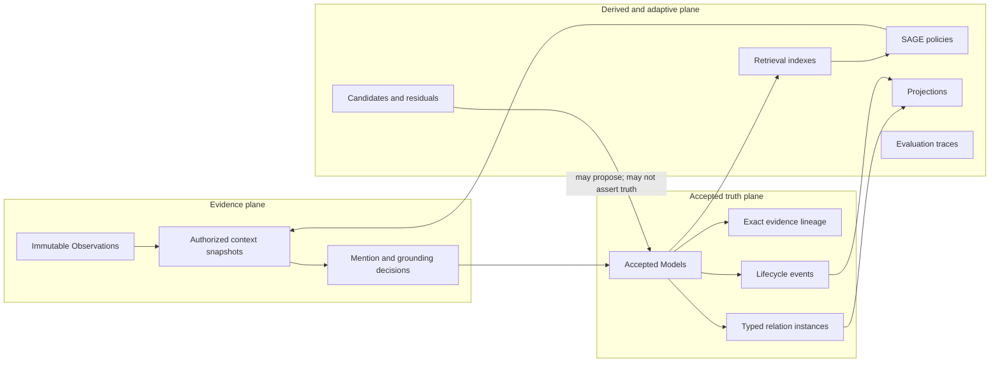
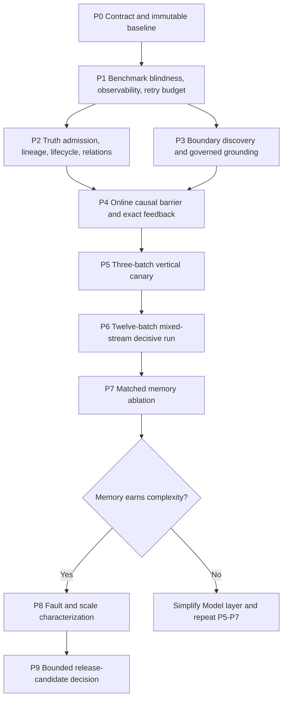

# Company-Learning Epistemic Repair — Multi-Agent Execution Coordinator

**Document type:** Central implementation and evaluation coordinator

**Status:** In execution — Think Intelligence Gate contract frozen; TI0-TI2
implementation precedes any new CF3-C provider canary

**Active branch:** `codex/autonomous-company-learning`

**Active worktree:** `/Users/rachinkalakheti/fyraliscore-autonomous-learning`

**Companion scratchpad:**
[Company-Learning Epistemic Repair Learning Log](company-learning-epistemic-repair-learning-log.md)

**Historical evidence:**
[45-Batch Cold-Start Postmortem](../evaluation/autonomous-company-learning-cold-start-45-postmortem-20260717.md)

**Reuse boundary:**
[Autonomous Company-Learning Reuse Audit](autonomous-company-learning-reuse-audit.md)

## Current execution checkpoint — 2026-07-19 Think Intelligence Gate

The immediate sequence is governed by
[the new-thread handoff](autonomous-company-learning-new-thread-handoff.md).
The prior authorization for one immediate CF3-C confirmation canary is
superseded: **do not run CF3-C yet**.

Shared TI0-TI4-min interfaces are frozen in
[Think Intelligence Gate Shared Contract Freeze v2](think-intelligence-contract-freeze-v1.md),
SHA-256 `b1e234eee1cdfaf279a431efda4abe39bb7aff5896d1f1d2de1f0b5fbcb48717`.
Only the integration owner may amend that contract; amendments require a new
version and digest.

V2 is a narrow ownership correction: TI0 may emit the exact sanitized raw
response from `lib/llm/provider.py`, the only boundary that possesses it before
structured parsing. No semantic field or authority changed.

The authorized order is:

1. implement and provider-free validate TI0 observability;
2. implement and provider-free validate TI1 scope-local dossiers over all
   twelve development batches;
3. implement and provider-free validate TI2 synthesis/abstention and local
   handle binding;
4. freeze TI0 and run exactly one observation-only current-interface canary;
5. integrate TI4-min receipts and independent scoring;
6. run the preregistered three-dossier TI3 experiment and select the cheapest
   policy within the frozen quality tolerance; and
7. resume the existing `CF3-C -> CF4 -> CF5 -> CF6 -> CF7 -> CF8` ladder only
   after the complete telemetry and selected policy are frozen cleanly.

The first closed learning-loop milestone, M1, is green only after correct
scope-local synthesis, later correction/lifecycle handling, and retrieval/use
of the corrected current head. Task autonomy, connectors, general episode
discovery, broad prompt platforms, and production polish remain deferred.

## Current execution checkpoint — 2026-07-18

| Phase/package | State | Evidence |
| --- | --- | --- |
| P0-P2 constitutional evidence | Runtime work previously validated; strict P9 regeneration/member contracts ready. Current-commit artifacts must still be regenerated from a clean worktree. | `db44386d` |
| P3 perception and grounding | Raw eligible probe evidence and strict P9 sidecar path ready; current-commit artifact regeneration remains required. | `b057a20e`, `5a7a30ce` |
| P4 causal closure and feedback | Raw learning evidence and strict P9 sidecar path ready; bounded PostgreSQL evidence is not an integrated P6 substitute. | `e476f9fa` |
| P5 zero-seed vertical | Strict member-derived P9 sidecar ready for the existing deterministic vertical. It proves a bounded vertical, not provider-semantic quality. | `ffaf1341` |
| P6 12-batch mixed stream | **FOUR-BATCH CORE PASS; FULL P6 NOT YET PROVEN.** The clean run through batch four produced 56/56 precise atomics, 32/32 expected atomic coordinates, atomic F1 1.0, uncertainty precision/coverage 24/24, evidence lineage 57/57, and scope precision/recall 4/4. Zero-seed truth was clean. It created exactly one mature Atlas composite, with only `p6-b04-s09` as direct evidence, and no premature B2 synthesis. Relations remained zero because the observed support edge stayed candidate-only; lifecycle and full-thesis metrics are correctly unmeasured at this prefix. | `/tmp/p6-think-4batch-core-bf26d622.json`, `/tmp/p6-think-4batch-core-bf26d622-evidence.json`, `/tmp/p6-think-4batch-core-bf26d622-score.json`; `1e089459`..`bf26d622` |
| P7 matched memory ablation | Historical 45-call run remains falsifying/insufficient evidence. The production lifecycle runner, raw-member oracle, strict P9 sidecar, reported-usage gate, clean-worktree preflight, and exclusive lock are ready; provider execution waits for P6. | `f8375cdf`, `ba800d97` |
| P8 fault, scale, and characterization | Historical fault proofs remain bounded; the one-pass concurrency result remains red. Strict P9 sidecar and preregistered repeated warm-pair diagnostic are ready; the locked rerun waits for P6/P7 ownership. | `345eb31c`, `f594cc16` |
| P9 release decision | Fail-closed manifest, exact phase gate/metric sets, content digests, evidence classes, independent reviewer reproduction receipt, and verdict precedence are implemented. No release manifest may be sealed until current-commit P0-P8 artifacts exist. | `63809479`, `ca850161` |

The repository now has strict normalization paths for P0-P8, but code readiness
is not evidence readiness. The clean four-batch prefix proves the repaired core
formation path: exact closed atomics survive splitting, uncertainty remains
outside truth, synthesis waits for a mature scope-level conclusion, and its
direct evidence stays claim-local. This bounded pass does not prove later
contradiction/correction/outcome lifecycle or all four theses. The next
dependency is the full decisive P6 run on the clean repair commit. P7 may start
only after P6 produces a digest-bound exit artifact; P8
warm-pair work must retain exclusive database ownership; P9 may consume only
artifacts regenerated on the selected release commit.

Every real-model phase, including P7 ablations, must use only
`CODEX_TRANSPORT=cli` and prove `provider=codex`, the pinned model, and
`usage_exactness=reported` in durable physical receipts.
Deterministic providers are permitted only in unit and fault-injection tests.
Estimated or unavailable usage is preserved as diagnostic evidence but cannot
qualify economics. Codex subprocess transport still has no lower SDK retry
knob, so retry ownership and receipt identity remain at wrapper-invocation
granularity.

### Current proof boundaries

- Failed and partial P6/P7/P8 executions remain immutable diagnostics; a later
  rerun cannot relabel them as current success.
- P0-P5 sidecar readiness proves normalization code and bounded source
  contracts, not that current release-commit artifacts have been regenerated.
- P6 is not scored as successful until its full-run barrier,
  member-level evidence, oracle, and strict sidecar all reopen and agree.
- The one-batch smoke proves cold-start atomic formation, exact evidence
  authorization, uncertainty separation, entity extraction coordinates, and
  zero distractor truth. It does not prove 12-batch thesis synthesis, relation
  formation, lifecycle evolution, mature Model-first retrieval, latency tails,
  or release economics. Its boundary B-cubed F1 was 0.8247, below the decisive
  0.9 threshold; this remains an explicit risk that the decisive run must meet,
  not a metric inferred from the otherwise-green smoke.
- The prior P7 experiment did not apply the required adaptive lifecycle and did
  not earn memory complexity; only the locked production rerun may replace that
  strategic evidence.
- P8's fault evidence and component characterization do not waive the red
  scale ratio. The preregistered warm-pair rerun must preserve cold and steady
  latency separately.
- P9 requires one clean commit, exact phase contracts, an independent reviewer
  receipt, and an explicit non-customer proof boundary.

### P6 diagnostic record and next gate

The immutable 12-batch artifacts are `/tmp/p6-think-12batch-c3c4dc43.json`,
`/tmp/p6-think-12batch-c3c4dc43-evidence.json`, and
`/tmp/p6-think-12batch-c3c4dc43-score.json`. All 12 waves completed, with 300
signals processed in 12 transport batches. Atomic claim precision was 73/93
(0.7849), recall was 45/92 (0.4891), and F1 was 0.6027. Direct-thesis accuracy
and mean thesis-facet completeness were both 0/4; the coherent-synthesis hard
gate therefore failed. Of 93 accepted Models, 73 were singleton local atomics
and 20 combined 2-37 evidence signals, often across unrelated storylines. No
accepted Model represented one pure storyline across three lifecycle phases.

The four-batch diagnostic artifacts are
`/tmp/p6-think-4batch-core-a2dd5376.json`,
`/tmp/p6-think-4batch-core-a2dd5376-evidence.json`, and
`/tmp/p6-think-4batch-core-a2dd5376-score.json`. They contained 24 accepted
Models, all atomic facts. Every `MDC_SYNTH_*` candidate was accepted as an edge,
so four relation claims and no synthesis Model were emitted for each affected
batch. This isolated the typed-operation failure: relation obligation dominated
synthesis materialization.

Repairs through `c04a0445` address the observed mechanisms: persisted entity
identity now precedes source fallback for episode boundaries (`881a6fac`);
uncertainty dispositions are durable but outside Models (`0d703818`);
entity-scoped synthesis survives atomic formation (`53f31c7f`); lifecycle probes
and absorption evidence remain claim-local (`3b143e53`, `ae0b8441`); accepted
synthesis materializes a scope-local hypothesis Model with an explicit contract
(`c479da91`); lifecycle evidence authority is enforced (`b958076a`); accepted
relations replay into projections (`0128aaf2`); and grounding tests now match
the no-write veto and write-intent contracts (`4fe2a338`, `c04a0445`). None of
these commits retroactively changes the failed run.

The clean post-repair four-batch artifacts are
`/tmp/p6-think-4batch-core-bf26d622.json`,
`/tmp/p6-think-4batch-core-bf26d622-evidence.json`, and
`/tmp/p6-think-4batch-core-bf26d622-score.json`. They prove atomic
precision/recall/F1 of 1.0, uncertainty fate precision/coverage of 1.0,
evidence-lineage coverage of 1.0, scope precision/recall of 1.0, and a true
zero-seed canonical-truth gate. Canonical truth contains 56 atomics and one
Atlas `situation/composite`; the composite has only the conclusion signal
`p6-b04-s09` as direct evidence and inherits prior phases through its member
Models. No synthesis exists in B2. Relation truth is correctly empty because
the only observed support edge was candidate-only, and the prefix contains no
terminal lifecycle opportunity, so lifecycle accuracy is unmeasured rather
than failed. Full-thesis metrics are also unmeasured until all preregistered
synthesis opportunities execute.

Repairs from `1e089459` through `bf26d622` establish the bounded result:
synthesis requires a scope-level conclusion plus diverse prior Models and
persists as composite situation (`1e089459`); exact evidence binding and closed
atomic durable fates are deterministic (`7a268344`, `9ddf2970`); evaluator
atomic and synthesis populations are separated (`70247268`); deterministic
confirmation remains monotonic (`49c853e0`); and compiler-authorized closed
atomic evidence survives splitter allocation (`bf26d622`).

### DEFERRED BACKLOG — do not execute during the core milestone

The current milestone is one working autonomous company-understanding and
learning/feedback loop beginning with simulated, database-resident signal
batches. Agents must record, not pursue, the following unless an item becomes a
direct blocker to semantic correctness:

- source listeners/connectors, OAuth, webhooks, polling, delivery retries, and
  transport durability for Slack, Jira, email, or other systems;
- task/action autonomy and any external consequential action;
- production hardening, high availability, deployment polish, and broad
  operational framework work;
- latency, token, call-count, and throughput optimization that does not block
  correctness;
- broad schema or architectural refactors and non-blocking edge cases; and
- another expensive large replay before focused post-repair semantic tests pass.
- `EDGE-038`: characterize candidate-only adaptive support edges separately
  from governed canonical relations; do not promote or score them as accepted
  relation truth without a bound semantic relation opportunity.

Evaluator defects that prevent an honest core verdict are not deferred. Missing
relation/scope measurements remain required before final P6 exit, but should be
implemented only when the repaired semantic loop is green enough to measure.

## 1. Purpose

This document is the central coordinator for repairing the epistemic failures
exposed by the 45-batch cold-start run and its adversarial audit. It is written
so that multiple implementation and evaluation agents can execute the work
with minimal user input.

The coordinator defines:

- the target system shape;
- the non-negotiable invariants;
- phase order and dependency gates;
- parallel work packages and file ownership rules;
- exact test populations;
- hard success gates and continuous measurements;
- evidence and report contracts;
- autonomous stop, retry, escalation, and completion rules; and
- the strategic decision rule for whether the Model layer has earned its
  complexity.

This is not a new normative architecture document. New discoveries belong in
the learning log until a phase is validated. The main architecture documents
must not be edited speculatively while this plan is being executed.

## 2. Highest-Level Objective

> Build the smallest mechanically enforced company-learning kernel that turns
> mixed normalized evidence into grounded, evidence-linked, lifecycle-consistent
> company Models and relations, learns which context improves later reasoning,
> and prevents derived or uncertain state from becoming canonical truth.

The target is autonomous company understanding, feedback, and learning.
Autonomous task execution is explicitly outside scope.

## 3. Scope

### 3.1 Included

- normalized, source-attributed signals already persisted in PostgreSQL;
- provisional conversational/episode boundary discovery;
- authorized context selection;
- mention detection and total-fate entity grounding;
- claim-local evidence and scope;
- canonical Model admission and lifecycle;
- typed relation admission and projection;
- retrieval and actual context-use measurement;
- correction, falsification, supersession, and dependent fencing;
- online causal closure between benchmark batches;
- decision-level feedback attribution and SAGE policy learning;
- truthful provider-attempt, token, latency, and write-amplification telemetry;
- adversarial mixed-stream evaluation;
- matched memory ablation;
- deterministic fault and scaling evaluation; and
- one coherent evidence report for one commit and configuration.

### 3.2 Excluded

- connector polling, webhooks, OAuth, transport durability, and provider
  backfills;
- production deployment or customer rollout;
- autonomous task planning or execution;
- external consequential effects;
- broad ontology growth;
- topology auto-promotion into canonical truth;
- a second 45-batch real-LLM simulation without explicit user authorization;
- speculative edits to the main architecture documents; and
- unrelated repository cleanup.

## 4. Target System Shape

There are three logical planes and one accepted company graph.



There is no persistent working graph. Episode hypotheses, retrieved
neighborhoods, candidates, residuals, and inquiries are temporary or derived.
The accepted graph consists only of accepted Models and canonical typed
relations.

The intended dataflow is:

```text
mixed normalized signals
  -> overlapping episode/context hypotheses
  -> smallest sufficient authorized context
  -> mention detection and governed entity grounding
  -> local atomic claim candidates
  -> canonical memory retrieval and matching
  -> one admission/lifecycle compiler
  -> Model, relation, residual, clarification, or justified no-op
  -> exact decision/outcome attribution
  -> SAGE policy learning
  -> later reasoning
```

A processing batch is a scheduling unit. It is never evidence that every batch
member belongs to one semantic episode.

## 5. Reuse And Consolidation Rules

Agents must extend existing owners before proposing a new subsystem.

| Responsibility | Required direction |
| --- | --- |
| Observations and T1 batch triggers | Reuse |
| Conversation-context candidates and snapshots | Extend existing perception contracts |
| Entity-grounding episode, assessment, admission, clarification | Reuse and integrate |
| Canonical identity writes | Consolidate behind one governed applier/repository |
| Think diff, proposal compiler, validator, and applier | Consolidate into one admission kernel |
| Models, model events, readings, and evidence lineage | Reuse; normalize only where current lineage cannot express the invariant |
| Relation instances and participants | Make canonical for business relations |
| Binary Model edges | Treat as compatibility/derived projections during cutover |
| Model activation, retrieval count, and last-retrieved time | Move to rebuildable retrieval/control sidecars; reads never mutate semantic truth |
| Retrieval and adaptive inquiry | Reuse with bounded budgets and exact use telemetry |
| SAGE utilities, negative memory, reflective policy | Reuse as derived policy only |
| Projections | Reuse, coalesce, and keep rebuildable |
| Company Vitals and benchmark report flow | Keep as the sole system-report owner |

No work package may add a second canonical belief store, entity registry,
clarification system, policy learner, graph authority, or system-readiness
report.

### 5.1 Required relation-truth cutover

The current repository has a contract contradiction that must be resolved in
P0 and physically enforced in P2:

- `docs/reference/CODEBASE-ARCHITECTURE.md` and
  `services/domain/models/edges_repo.py` still permit accepted `model_edges`
  to look like truth;
- `services/reasoning/edge_intelligence/relation_frames.py` and migration
  `0150_relation_instances.sql` describe `relation_instances` as the semantic
  source of truth.

The target rule is unambiguous:

1. accepted business semantics live in versioned, role-bearing, N-ary
   relation instances;
2. epistemic support/counterevidence live in evidence lineage;
3. lifecycle supersession/revision live in lifecycle history;
4. binary `model_edges` are deterministic compatibility/retrieval projections;
5. direct accepted `model_edges` writes are permitted only to the projector;
6. Think may propose a relation instance but may not directly assert an
   accepted binary edge; and
7. legacy accepted edges without a validated canonical relation source are
   quarantined as legacy candidates/diagnostic projections. They are not
   silently blessed as truth.

The cutover manifest must give every legacy Model, relation instance, and edge
one explicit fate: `canonical`, `projected`, `candidate`, `quarantined`,
`retired`, or `unresolved_with_owner`.

## 6. Global Hard Gates

Hard gates are noncompensatory. Every required hard gate must pass with zero
violations. A high average score cannot compensate for one violation.

| Gate | Requirement | Required result |
| --- | --- | ---: |
| HG-01 Benchmark blindness | Production reasoning contains no fixture-specific noise phrases, capability injection, storyline labels, expected relation words, or benchmark-specific bridge vocabulary | 0 reachable production hooks |
| HG-02 Identity authority | Every canonical alias/entity mutation passes through the registered governed identity writer and carries authority plus provenance | 100% governed; 0 bypasses |
| HG-03 Total evidence fate | Every eligible signal and detected mention has exactly one durable terminal or pending-with-owner fate | 100% coverage; 0 duplicate terminal fates |
| HG-04 Admission isolation | Candidate, rejected, or `needs_review` claims and relations cannot appear in active truth, default retrieval, or active relation projections | 0 leaks |
| HG-05 Evidence lineage | Every accepted Model and canonical relation has exact direct or transitive evidence lineage and source cutoff | 100% coverage |
| HG-06 Claim-local scope | Every scoped entity has a typed role and claim-local provenance; batch-wide propagation is forbidden | 100% lineage; 0 untyped scope entries |
| HG-07 Representation coherence | Structured proposition and natural rendering identify the same immutable semantic version and digest | 100% equality; 0 stale renderings |
| HG-08 Lifecycle closure | Falsification, supersession, archival, and correction atomically fence stale retrieval and incompatible dependent truth | 100% required effects; 0 stale active reads |
| HG-09 Relation validity | Accepted relations have valid roles, endpoints, direction, time, evidence, and a rationale consistent with the relation | 100% valid; 0 self-negating relations |
| HG-10 Plane isolation | SAGE, topology, projections, embeddings, shortcuts, candidates, and evaluator artifacts cannot directly mutate canonical truth | 0 direct writes |
| HG-11 Online causal availability | Truth-critical state from batch N is available to batch N+1 at the declared version barrier | 100% required availability |
| HG-12 Feedback attribution | Feedback credit is decision-level and linked to selected/included/referenced evidence and later outcomes; no batch-member fanout | 100% attributable; 0 pseudo-replicated causal rewards |
| HG-13 Telemetry reconciliation | Physical attempts, logical calls, Think runs, cost rows, stage times, batch walls, and run walls reconcile | 0 count mismatch; measured wall error <= 1% |
| HG-14 Tenant and authority isolation | No cross-tenant read, candidate, scope, Model, relation, policy, or projection contamination | 0 incidents |
| HG-15 Metric validity | Every normalized score is in `[0,1]`; unknown denominators are reported as unknown; no different-run evidence enters a coherent-run score | 0 invalid metrics; 0 mixed-run claims |

Any HG violation blocks phase completion and must be logged as an incident in
the learning log.

## 7. Continuous Metrics

Continuous metrics describe quality after hard gates pass. They do not convert
a hard-gate failure into a pass.

### 7.1 Boundary and context

- B-cubed precision, recall, and F1 for episode membership;
- pairwise episode-membership precision and recall;
- variation of information;
- selected-context contamination rate;
- sufficient-context recall;
- omitted-decisive-evidence rate;
- boundary-confidence calibration; and
- downstream claim sensitivity to boundary perturbation.

### 7.2 Entity grounding

- exact-span precision, recall, and F1;
- entity-type accuracy;
- canonical-link precision and recall;
- false-link rate by consequence tier;
- safe abstention precision;
- clarification rate and useful-clarification rate;
- correction convergence time; and
- unresolved mention debt.

### 7.3 Models and synthesis

- atomic claim precision, recall, and F1;
- evidence-lineage precision and coverage;
- scope-role precision and recall;
- direct thesis accuracy;
- thesis-facet completeness;
- unsupported-claim rate;
- active-candidate leakage rate;
- Model insert/update/archive rates by phase;
- exact and semantic duplicate rates;
- synthesis compression and retained answerability; and
- Model ECE and Brier score against external outcomes.

### 7.4 Relations and topology

- relation endpoint, direction, type, and joint accuracy;
- role-binding precision and recall;
- reciprocal-invalid-edge rate;
- active relation without evidence/rationale rate;
- relation confidence ECE and Brier score;
- hub concentration at top 1, 3, 5, and 10 nodes;
- situation-Model isolation rate;
- component count and largest-component ratio;
- cross-episode relation precision; and
- candidate review-debt age and resolution rate.

### 7.5 Retrieval and learning

- Models selected and actually referenced;
- current-episode observations referenced;
- historical observations reopened and reason coverage;
- selected-context utilization;
- unused-context token rate;
- prompt tokens by early, middle, and mature phase;
- decision-level immediate credit coverage;
- delayed semantic-credit coverage;
- adaptive-versus-frozen lift;
- correction reuse rate; and
- policy regret where a counterfactual arm exists.

### 7.6 Operations and economics

- per-stage p50, p90, p95, and maximum latency;
- failed-attempt wall time;
- physical attempts per logical call;
- actual and estimated tokens reported separately;
- cost-basis version and uncertainty;
- queue depth and drain slope;
- canonical writes per signal;
- derived writes per accepted mutation;
- projection refresh coalescing ratio;
- background-call count and durable-outcome rate; and
- tenant-fairness slowdown.

## 8. Metric Definitions

Agents must use these definitions consistently.

| Metric | Definition |
| --- | --- |
| Evidence-lineage coverage | Accepted truth items with a complete direct/transitive provenance path divided by all accepted truth items |
| Scope precision | Correct typed scope roles divided by all persisted scope roles |
| Scope recall | Required typed scope roles represented divided by all gold scope roles |
| Relation joint accuracy | Relation attempts with correct kind, endpoint identities, participant roles, direction, temporal validity, and admission fate divided by all scored attempts |
| Direct thesis accuracy | Hidden theses judged complete in one explicit accepted synthesis Model divided by all hidden theses; a distributed union does not count |
| Actual Model-use share | Referenced accepted Models divided by all referenced historical semantic-memory items; current trigger evidence is reported separately |
| Historical reopening reason coverage | Historical raw-observation reopenings with a typed reason divided by all historical reopenings |
| Causal-barrier latency | Time from T1 semantic commit to availability of every truth-critical dependent state required by the next batch |
| Canonical write amplification | Canonical truth inserts, versions, lifecycle events, and accepted relation mutations divided by input signals |
| Derived write amplification | Projection, index, topology, shortcut, policy, and candidate writes divided by accepted canonical mutations |
| Feedback attribution coverage | Outcome/credit records with exact decision, route, selected evidence, included evidence, influence classification, mutation/no-op, and later outcome links divided by all credit-bearing records |

If an evaluator cannot compute a denominator, it must emit `not_observed` or
`unknown`, never `1.0`.

Every continuous metric record must contain:

```json
{
  "metric_id": "stable_name",
  "numerator": 0,
  "denominator": 0,
  "value": null,
  "confidence_interval": null,
  "prior_baseline": null,
  "delta": null,
  "early_middle_mature_slices": {},
  "source_artifact": "path#selector",
  "worst_example_ids": []
}
```

Do not collapse epistemic safety, semantic quality, retrieval value, and cost
into one compensating score. At minimum, evaluators must implement these exact
derived definitions:

| Metric | Exact formula and interpretation |
| --- | --- |
| Unsupported-claim rate | Accepted current ModelVersions lacking at least one valid decisive evidence link / all accepted current ModelVersions. Hard target `0`. |
| Scope-contamination rate | Scope associations without a valid claim-local provenance path / all scope associations. Hard target `0`. |
| Scope-expansion factor | Distinct scoped entities / distinct entities justified by evidence closure, per claim. Report median, p90, and share above `1`. |
| Candidate-leakage rate | Review, unresolved, or rejected objects returned by canonical readers or used as accepted endpoints / all such objects. Hard target `0`. |
| Stale-truth exposure | Integral over time of retrievable falsified/superseded current versions, in object-seconds; also report p95 correction-fence latency. Contract-test target `0`. |
| Lifecycle-cascade completeness | Expected dependent reconciliations completed / expected reconciliations, both at the causal barrier and at eventual quiescence. |
| Representation parity | ModelVersions whose natural rendering digest matches the structured proposition digest plus renderer version / checked versions. Target `1`. |
| Relation exact-tuple F1 | F1 over `(kind, ordered typed participant roles, effective interval)`. Endpoint F1, kind F1, and direction accuracy remain separate. |
| Projection parity | Canonical relations whose derived edge multiset exactly matches the projector oracle / canonical relations. Target `1`. |
| Reciprocal-conflict rate | Asymmetric participant pairs with an unsupported reverse accepted relation / asymmetric accepted pairs. Target `0`. |
| Cross-episode lineage precision | Accepted cross-episode relations with explicit valid synthesis lineage / all accepted cross-episode relations. Lineage target `1`; semantic correctness is still oracle-scored. |
| Semantic-credit coverage | Outcome-bearing mutations with exact decision and evidence lineage / all outcome-bearing mutations. Target `1`. |
| Pseudo-replication factor | Reward-row weight / distinct credited decisions. Target exactly `1`; any hierarchical fanout must normalize total weight back to `1`. |
| Memory lift | Paired semantic outcome of adaptive memory minus the paired control outcome. Report claims, theses, relations, lifecycle, lineage, latency, tokens, and cost independently with bootstrap intervals. |

Calibration scores may use only externally authored future outcomes. A
scripted fixture that explicitly confirms its own expected answer is useful for
mechanics but is excluded from Brier/ECE claims about real calibration.

## 9. Preregistration And Evidence Integrity

Before the first non-smoke execution of a scenario version, the coordinator
must persist:

- scenario manifest and SHA-256;
- gold manifest and SHA-256;
- evaluation-policy version and SHA-256;
- production source digests for all affected semantic paths;
- git commit and dirty-state receipt;
- provider/model configuration;
- random seeds;
- retry and call budgets;
- phase and work-package identifiers;
- exact metric definitions and thresholds; and
- expected proof boundaries.

After execution begins:

- signal/gold edits require a new scenario version;
- threshold changes require a new evaluation-policy version;
- the original result remains immutable and visible;
- selective reruns may not replace failed populations;
- post-hoc rerenders must be labeled as rerenders;
- different commit/configuration evidence may be shown side by side but may not
  share one coherent-run headline score; and
- every report must name what it does not prove.

## 10. Multi-Agent Coordination Protocol

### 10.1 Roles

| Role | Authority |
| --- | --- |
| Root coordinator | Owns this coordinator, the learning log, dependency state, integration order, shared migrations, final commits, and final reports |
| Work-package agent | Owns only assigned files and tests; may not change gates, scenario gold, or unrelated architecture |
| Evaluation agent | Owns sealed gold/evaluator code but not production behavior for the same capability |
| Integration agent | Reviews merged behavior against hard gates and executes shared-Postgres tests sequentially |
| Adversarial reviewer | Attempts to falsify the phase result; may not patch the result being reviewed |

One agent must not own both a production behavior and the only oracle that
judges that behavior.

### 10.2 Work-package states

```text
pending -> claimed -> in_progress -> ready_for_review -> merged -> validated
                         |                  |
                         v                  v
                       blocked          needs_revision

pending -> deferred
pending -> rejected
```

### 10.3 Required work-package handoff

Every agent handoff must include:

1. work-package ID and input commit;
2. exact files changed;
3. behavior implemented;
4. invariants affected;
5. focused tests and results;
6. evidence artifact paths;
7. known limitations;
8. migration or compatibility impact;
9. learning-log entry text; and
10. recommended merge order.

### 10.4 File and database ownership

- Use separate short-lived branches/worktrees for concurrent code lanes.
- Assign exclusive file ownership before agents edit.
- One coordinator owns migrations and monotonically allocates prefixes.
- Agents may run unit/static tests concurrently.
- Shared-Postgres migrations and integration suites run sequentially.
- Prefer isolated databases or schemas for independent DB work.
- No agent may reset, overwrite, or clean another agent's worktree.
- Generated reports, provider outputs, logs, and local databases are not
  committed.

### 10.5 Commit protocol

Commit after each coherent, revertible checkpoint:

1. contract/test preregistration;
2. production behavior;
3. focused tests;
4. integration proof; and
5. documentation/log update.

Do not wait for an entire phase to become one large commit. Do not mix unrelated
cleanup into a phase commit.

### 10.6 Autonomous decision rules

Agents may autonomously:

- choose implementation details inside an assigned work package;
- extend an existing owner when the semantic contract remains unchanged;
- add focused tests and non-production fixtures;
- record new noncritical edge cases in the ledger;
- retry deterministic or local checks after fixing a discovered defect; and
- split a package when file ownership remains non-overlapping.

Agents must stop and escalate to the coordinator when:

- a change would add a parallel truth/identity/policy authority;
- a success threshold would need to change after evidence was observed;
- the only path requires destructive migration or data loss;
- a new external effect, customer system, secret, or deployment authority is
  required;
- the work expands into connectors or task autonomy;
- two accepted architecture invariants conflict;
- a real-provider run would exceed its preregistered call/time envelope;
- the same blocker has survived three focused implementation attempts; or
- evidence supports both sides of the strategic memory fork without a
  statistically or operationally decisive result.

Routine implementation ambiguity should be resolved by the priority order in
Section 11 rather than by asking the user.

## 11. Decision Priority

When requirements conflict, use this order:

1. tenant, authority, and source-truth safety;
2. canonical truth and lifecycle consistency;
3. exact provenance and correction closure;
4. evaluator integrity and evidence reproducibility;
5. one working end-to-end company-learning loop;
6. semantic quality;
7. operational durability;
8. scalability and cost;
9. code elegance and cleanup; and
10. deferred breadth.

## 12. Phase Dependency Graph



P2 and P3 may run in parallel after P1 contracts are stable. P4 cannot close
until both are integrated.

---

## 13. Phase P0 — Contract, Baseline, And Preregistration

### 13.1 Objective

Freeze the minimum epistemic kernel, identify every active bypass path, and
create the immutable baseline from which all later claims are measured.

### 13.2 Entry conditions

- clean isolated worktree confirmed;
- historical 45-batch artifacts remain unchanged;
- no implementation agent is editing the same files; and
- this coordinator and its learning log are present.

### 13.3 Parallel work packages

| ID | Package | Primary output | Dependencies |
| --- | --- | --- | --- |
| P0-A | Active writer and authority inventory | Machine-readable writer map for entity, Model, relation, lifecycle, policy, and projection writes | None |
| P0-B | Benchmark-hook inventory | Reachability report for noise, capability, bridge, storyline, and evaluator-specific production behavior | None |
| P0-C | Truth-state inventory | Current legal/illegal combinations for Model, relation, lifecycle, scope, natural/proposition, and retrieval eligibility | None |
| P0-D | Telemetry inventory | Exact map of physical attempts, logical calls, runs, timings, tokens, costs, queues, and exported receipts | None |
| P0-E | Test/evidence inventory | Existing focused, bounded, large-run, and missing proof populations with commit/config identities | None |
| P0-F | Scenario/evaluator preregistration scaffold | Versioned manifest schemas and immutable receipt generator | P0-E |

### 13.4 Exact steps

1. Record `git rev-parse HEAD`, `git status --short`, migration head, Python
   version, and active provider configuration.
2. Enumerate every production writer for canonical aliases/entities, Models,
   model events, Model edges, relation claims/instances, and lifecycle state.
3. Enumerate every production read that can surface active Models or relations.
4. Enumerate every benchmark-specific condition reachable from production
   Think.
5. Trace one existing signal through context, grounding, Think, validation,
   apply, post-commit, retrieval feedback, and Vitals.
6. Produce an invariant-to-writer-to-reader matrix for HG-01 through HG-15.
7. Define manifest schemas for scenarios, gold, evaluation policy, runtime
   sources, and pre-call receipts.
8. Create failing characterization tests for every historical illegal state;
   do not fix production behavior in this phase.
9. Update the learning log with confirmed versus inferred root causes.
10. Commit the contract, inventories, and failing characterization tests as
    separate coherent commits.

### 13.5 Evaluation

Evaluation is static plus deterministic characterization. No real-LLM run is
allowed.

Required outputs:

- complete writer map;
- complete production-hook map;
- complete hard-gate ownership map;
- characterization tests that reproduce the known historical classes;
- preregistration schema with digest round-trip tests; and
- baseline receipt tied to one clean commit.

### 13.6 Success criteria

- 100% of canonical writer families have a named current owner.
- 100% of HG gates have at least one enforcement seam and one test seam.
- Every known bypass is either reproduced or explicitly labeled
  `artifact_only_not_reproducible` with evidence.
- Scenario, gold, policy, source, and configuration digests round-trip exactly.
- No production behavior changes are mixed into P0.
- No real-provider calls are made.

### 13.7 Exit artifact

`epistemic-repair-p0-baseline-v1.json` with commit, inventories, gate ownership,
known failures, and proof boundaries.

---

## 14. Phase P1 — Benchmark Blindness, Truthful Observability, And Retry Control

### 14.1 Objective

Remove fixture-specific behavior from production reasoning and make every
provider attempt, logical call, cost estimate, stage, retry, and queue effect
reconcilable before semantic repairs are evaluated.

### 14.2 Parallel work packages

| ID | Package | Primary output | Dependencies |
| --- | --- | --- | --- |
| P1-A | Hook quarantine | Production paths free of fixture-specific noise, capability, bridge, and storyline behavior | P0-B |
| P1-B | Provider-attempt ledger | One durable/exported receipt for every physical attempt, including timeout/failure | P0-D |
| P1-C | Unified retry budget | One owner for physical attempts and one whole-operation deadline | P1-B contract |
| P1-D | Timing reconciliation | Exclusive stage and wall-clock accounting with no nested double counting | P0-D |
| P1-E | Cost-basis integrity | Actual versus estimated tokens/cost separated; pricing source/version explicit | P1-B |
| P1-F | Hook-blind evaluator scan | Static/runtime scan that fails on production benchmark fingerprints | P1-A contract; separate agent |

### 14.3 Exact steps

1. Move benchmark capability construction into test/benchmark fixtures that
   submit ordinary production diffs or signals.
2. Replace fixture phrases/channels with a generic no-op decision contract;
   retain deterministic cheap paths only when defined by production semantics.
3. Quarantine benchmark-specific latent bridge logic; do not replace it with a
   new special-case rule.
4. Add attempt identity, logical-call identity, trigger/run identity, purpose,
   provider/model, start/end, outcome, token fields, estimation flags, pricing
   version, prompt/context digest, validation outcome, and apply outcome.
5. Record failed and timed-out attempts even when provider usage is absent.
6. Enforce a total physical-attempt budget across all retry layers. The initial
   test policy is at most 3 physical attempts and one 240-second whole-operation
   deadline; inner and outer retries share this budget.
7. Export timing categories separately: persistence, retrieval/context, main
   reasoning, failed attempts, validation/apply, causal-barrier work,
   background maintenance, evaluator/judge, and total wall.
8. Add reconciliation checks among attempts, logical calls, Think runs, cost
   rows, stage timings, batch walls, and whole-run wall.
9. Add a hook-blind scan over source code, prompt output, and runtime traces.
10. Run deterministic two-batch smoke tests, then one bounded real-provider
    telemetry smoke only after deterministic reconciliation is green.

### 14.4 Evaluation population

- two batches of 10 signals each;
- one normal mixed batch and one subtle-noise-plus-actionable batch;
- no benchmark labels or fixture phrases;
- one injected timeout followed by success;
- one injected invalid structured response; and
- one clean real-provider batch after all deterministic tests pass.

### 14.5 Hard success criteria

- HG-01 and HG-13 pass.
- Every injected physical attempt has exactly one receipt.
- Attempt, call, Think-run, and cost-row counts reconcile exactly.
- Measured exclusive stages reconcile to measured wall within 1%.
- No estimated token/cost field is labeled actual.
- Failed attempts are present in latency and uncertainty totals.
- No logical operation exceeds 3 total physical attempts or 240 seconds under
  the test policy.
- No hook-blind scan finding remains reachable from production Think.

### 14.6 Continuous success criteria

- clean-batch T1 p95 <= 120 seconds in the bounded test environment;
- no clean batch exceeds 3 times the clean-batch median;
- question-planning calls occur in <= 25% of T1 batches;
- background calls have an explicit non-negative cap; and
- call purpose, outcome, and cost-basis coverage equal 1.0.

### 14.7 Exit artifact

`epistemic-repair-p1-observability-v1.json` with reconciled counts, timings,
attempt history, hook-scan result, and explicit cost uncertainty.

---

## 15. Phase P2 — Truth Admission, Evidence Lineage, Lifecycle, And Relations

### 15.1 Objective

Make known truth-plane corruption states mechanically unrepresentable or
unreadable through every canonical consumer.

### 15.2 Parallel work packages

| ID | Package | Primary output | Dependencies |
| --- | --- | --- | --- |
| P2-A | Admission state machine | Candidate/review/rejected truth cannot enter active readers | P0-C |
| P2-B | Evidence and typed-scope lineage | Exact direct/transitive citations, coordinates, roles, and cutoff | P0-C |
| P2-C | Representation version coherence | Proposition and natural rendering bound to one semantic version/digest | P0-C |
| P2-D | Lifecycle transaction | Atomic falsify, supersede, contest, archive, and correction cascade | P2-A contract |
| P2-E | Relation semantic separation | Epistemic, lifecycle, and business relation invariants with typed participants | P2-B contract |
| P2-F | Truth invariant evaluator | Independent HG-04 through HG-10 evaluator and adversarial fixtures | All contracts; separate agent |
| P2-G | Compatibility/read cutover | Existing consumers use accepted-truth views and derived binary projections | P2-A/P2-D/P2-E |

### 15.3 Exact steps

1. Define candidate admission separately from accepted truth lifecycle.
   Candidate history remains immutable pre-truth; an AdmissionDecision creates
   a new canonical ModelVersion/RelationVersion that references the candidate.
   Admission is not an in-place candidate status mutation into truth.
2. Make default readers and graph participants consume accepted truth only.
3. Reject batch envelopes, prompt/control language, and generic processing
   wrappers from canonical Model admission.
4. Require each accepted claim to cite bounded typed evidence references and
   exact coordinates: Observation, ModelVersion, or another registered
   evidence kind with tenant, authority, and cutoff validation. Never infer a
   source Observation from the first item in a generic event-ID list.
5. Derive typed scope roles only through claim-local provenance. Do not copy
   the batch or retrieval entity set.
6. Preserve valid synthesis by allowing cited accepted Models with complete
   transitive provenance.
7. Bind proposition, natural rendering, scope, provenance, and semantic digest
   to one versioned transition using existing Models/model-events machinery
   where possible.
8. Implement kind-aware lifecycle transitions. `confirm`, `unchanged`,
   `deduplicated`, and `touched` remain events, not truth states.
9. When falsifying or superseding, synchronously fence stale retrieval and
   incompatible support; preserve historical evidence.
10. Enforce `old superseded_by new`: same valid lineage, target newer, target
    active, source no longer active.
11. Separate epistemic evidence links, lifecycle lineage, and business
    relations logically. Use canonical role-bearing relation instances for
    business relations and derive binary views.
12. Reject relation rationales that negate the proposed kind/direction.
13. Keep unknown relation kinds as candidates or ontology gaps; never coerce
    them to the nearest accepted kind.
14. Version relation instances immutably. Advance the current head with
    compare-and-swap; do not mutate a relation in place or delete-and-replace
    its participant bindings.
15. Start the P0 business-relation vocabulary with `causal_influence`,
    `dependency_constraint`, `enablement`, and `predictive_indicator`.
    `analogous`, `co_occurs`, and `same_issue` remain structural/candidate-only
    until they earn a semantic contract. This is a versioned cutover, not a
    permanent ontology theorem; legitimate new semantics remain typed
    candidates until their contracts are admitted.
16. When a ModelVersion used as relation evidence is falsified, exclude the
    affected relation from consequential/current reads and create exactly one
    version-bound repair obligation. Mark it disputed/pending revalidation
    unless falsity deterministically entails retirement; do not erase its
    history. Do not silently rebind a superseded participant to its
    replacement; require an admitted relation revision.
17. Add migration/backfill only when existing sidecars cannot represent the
    required role or provenance. Migrations are coordinator-owned.
18. Cut over readers incrementally behind compatibility views and architecture
    ratchets.
19. Derive relation confidence from unique signed evidence. Duplicate evidence,
    conflict retries, and projector rebuilds are epistemically idempotent;
    counterevidence may lower confidence or dispute the relation. Do not use
    monotonic `GREATEST`/confirmation-count updates as epistemic truth.
20. Move `activation`, retrieval counts, and last-retrieved timestamps out of
    Model semantic state. Repeated retrieval cannot change a Model head,
    confidence, lifecycle, or semantic digest.

### 15.4 Evaluation population

At minimum, deterministic database-backed fixtures must cover:

- 10 candidate/review/rejected admission attempts;
- 10 accepted atomic Models;
- 5 legitimate synthesis Models with transitive provenance;
- 5 attempted batch-wrapper/control-plane Models;
- 5 same-ID conflicting entity-type attempts;
- 5 proposition/natural divergence attempts;
- 5 falsifications with support and dependent projections;
- 5 valid and 5 invalid supersessions;
- 20 business-relation attempts spanning valid direction, reverse direction,
  wrong role, wrong endpoint, self-negating rationale, unknown type, and
  reciprocal invalidity; and
- 5 topology/SAGE/projection attempts to write canonical truth directly.

The population must also execute these transactional/race cases:

- falsify a Model with five incident projections, inject failure after the
  third projection fence, and assert total rollback to the wholly old state;
- retry that command and assert a wholly fenced new state with one lifecycle
  event;
- race `confirm` and `falsify` from the same expected ModelVersion: exactly one
  compare-and-swap wins, the stale operation is rejected/reconciled, and a
  terminal version cannot be resurrected;
- falsify evidence used by a relation without being a participant and assert
  immediate consequential-read exclusion plus one repair obligation; and
- supersede a relation participant and assert that no automatic endpoint
  rebinding occurs.

### 15.5 Hard success criteria

- HG-04 through HG-10 pass with zero violations.
- All 10 nonaccepted admission attempts remain outside active truth.
- All 5 wrapper/control candidates are rejected or remain noncanonical.
- Every accepted item has complete provenance and typed scope.
- Every falsification fences stale retrieval and incompatible supports in the
  same semantic commit/barrier.
- Every valid supersession succeeds and every invalid supersession fails
  without partial state.
- Transaction failure injection leaves either the wholly old or wholly new
  state; no partially fenced graph is observable.
- Concurrent lifecycle commands produce one winning head transition and no
  terminal-state resurrection.
- Every self-negating or direction-invalid relation is rejected.
- No derived/adaptive component directly writes canonical truth.
- Repeating a retrieval 100 times leaves the canonical Model digest and head
  unchanged.
- Duplicate evidence and projection replay do not increase relation
  confidence or confirmation count.
- Replaying each command is idempotent.

### 15.6 Continuous success criteria

- evidence-lineage coverage = 1.0;
- scope precision = 1.0 on the sealed fixtures;
- relation joint accuracy = 1.0 on the sealed fixtures;
- semantic duplicate absorption >= 0.90 for the registered duplicate family;
- active wrapper contamination = 0.0;
- active unexplained perfect-confidence relation rate = 0.0; and
- lifecycle transition latency is reported separately from background repair.

### 15.7 Exit artifact

`epistemic-repair-p2-truth-kernel-v1.json` with invariant results, command
receipts, before/after truth snapshots, reader cutover coverage, and remaining
compatibility debt.

---

## 16. Phase P3 — Boundary Discovery, Context Selection, And Governed Grounding

### 16.1 Objective

Ensure trustworthy claims begin from a defensible semantic episode and
grounded referents rather than a transport batch or preseeded batch scope.

### 16.2 Parallel work packages

| ID | Package | Primary output | Dependencies |
| --- | --- | --- | --- |
| P3-A | Mixed-stream scenario/gold | Sealed boundary, sufficient-context, contamination, mention, entity, and authority gold | P0-F; evaluator agent |
| P3-B | Episode hypothesis generation | Overlapping source-topology, temporal, participant, link, and semantic candidates | Existing context contracts |
| P3-C | Context sufficiency and perturbation | Cheapest sufficient authorized snapshot plus alternatives/omissions | P3-B contract |
| P3-D | Total-fate mention detection | Anchored mentions and discourse references with explicit detection/rejection fates | P3-C contract |
| P3-E | Entity candidate/assessment/admission | Closed tenant-local candidates, separate assessment/admission, safe unknown/review | P3-D contract |
| P3-F | Governed identity application | Sole alias/entity mutation path with correction, replay, and authority | P3-E; P2-A |
| P3-G | Independent perception evaluator | Boundary/entity metrics and high-consequence safety incidents | P3-A contracts; separate agent |

### 16.3 Exact steps

1. Keep processing batches separate from semantic episode hypotheses.
2. Build multiple bounded candidates using source-native topology first, then
   temporal, participant, link/object, and semantic continuity.
3. Preserve overlapping, split, merge, and uncertain episode alternatives as
   noncanonical interpretation state.
4. Select the smallest authorized context that is operationally sufficient;
   record omitted candidates and why they were omitted.
5. Freeze an immutable as-known context snapshot before model assessment.
6. Run boundary perturbation: remove/add plausible members and measure whether
   interpretation materially changes.
7. Detect anchored mentions and discourse references from every eligible focal
   signal/context.
8. Give every detection opportunity an explicit fate. Heuristic phrase
   opportunities alone are not gold mentions.
9. Build a closed tenant-local candidate set from source identity, governed
   aliases, and canonical objects.
10. Keep model assessment separate from consumer admission.
11. Admit unresolved/review state only to candidate/review surfaces, never
    canonical scopes or accepted relations.
12. Route canonical alias/entity writes through one governed applier with
    correction and replay lineage.
13. Prove future evidence cannot leak into an earlier as-known snapshot.

### 16.4 Evaluation population

Create a sealed 120-signal deterministic perception population:

- 40 Slack-like events across 4 interleaved episodes, including replies,
  unthreaded continuation, quote, edit, delete/tombstone, reaction, pronoun,
  definite description, and long-range recurrence;
- 20 self-contained Jira/Linear-like objects;
- 20 email/document-like signals with quotes and forwarded attribution;
- 20 cross-source linked events;
- 10 high-similarity boundary distractors; and
- 10 entity negatives/ambiguities, including homonyms, competing aliases,
  unseen names, and none-of-the-above.

The population must contain at least:

- 12 episode split/merge decisions;
- 30 gold mentions;
- 8 high-consequence link opportunities;
- 8 required safe abstentions/reviews; and
- 5 correction/replay episodes.

### 16.5 Hard success criteria

- HG-02, HG-03, HG-06, and HG-14 pass.
- Every eligible focal signal has a boundary/context decision.
- Every gold mention and every detected non-gold candidate has exactly one fate.
- High-consequence wrong canonical links = 0.
- Unsafe canonical alias/entity writes = 0.
- Future-to-past context leakage = 0.
- Cross-tenant candidate or context leakage = 0.
- Every canonical entity scope used downstream cites its grounding lineage.

### 16.6 Continuous success criteria

- B-cubed boundary F1 >= 0.90;
- pairwise boundary precision >= 0.92 and recall >= 0.85;
- selected-context contamination <= 0.05;
- sufficient-context recall >= 0.95;
- exact mention F1 >= 0.92;
- type accuracy >= 0.95;
- canonical-link precision >= 0.98 and recall >= 0.90;
- safe-abstention precision = 1.0;
- context budget adherence = 1.0; and
- correction/replay convergence coverage = 1.0.

### 16.7 Exit artifact

`epistemic-repair-p3-perception-grounding-v1.json` with member-level boundary,
context, mention, entity, authority, correction, and contamination receipts.

---

## 17. Phase P4 — Online Causal Barrier, Retrieval Use, And Exact Feedback

### 17.1 Objective

Make canonical learning from batch N available to batch N+1, while ensuring
feedback attaches to exact decisions rather than batch activity.

### 17.2 Parallel work packages

| ID | Package | Primary output | Dependencies |
| --- | --- | --- | --- |
| P4-A | Truth-critical causal barrier | Versioned completion barrier for accepted truth and required dependent fences | P2-D/P2-G |
| P4-B | Retrieval class separation | Current episode, historical observation, accepted Model, relation, residual, and candidate telemetry | P2/P3 contracts |
| P4-C | Actual influence trace | Selected, included, referenced, counterevidence, background, and unused classifications | P4-B |
| P4-D | Decision/outcome credit ledger | Exact route -> evidence -> decision -> mutation/no-op -> later outcome chain | P4-C |
| P4-E | SAGE policy boundary | Policy updates consume attributed outcomes and cannot write truth | P4-D; HG-10 |
| P4-F | Background work partition | Truth-critical work separated from optional topology/projection/question work | P4-A |
| P4-G | Online-loop evaluator | Independent barrier, reuse, attribution, queue, and policy metrics | All contracts; separate agent |

### 17.3 Exact steps

1. Define truth-critical completion: accepted Model/relation state, lifecycle
   fences, required dependency invalidation, and retrieval visibility.
2. Emit a versioned causal-barrier receipt for each batch/semantic commit.
3. Allow optional topology, broad projections, low-priority questions, and
   utility learning to continue asynchronously against a declared version.
4. Separate current episode evidence from historical raw reopening.
5. Require a typed reason for every historical raw reopening: cold start,
   sparse coverage, contradiction, provenance, novelty, correction, or
   unresolved question.
6. Record each context item as retrieved, selected, included, referenced,
   counterevidence-retained, confidence-affecting, necessary background, or
   unused.
7. Join each accepted mutation/justified no-op/validator drop to the exact
   context and route decision.
8. Add delayed outcome links for confirmation, revision, falsification,
   correction, and human adjudication.
9. Remove signal-member fanout of one batch outcome.
10. Update SAGE only from attributed immediate/delayed outcomes; label
    non-counterfactual credit associative rather than causal.
11. Coalesce duplicate projection refreshes by affected subject/family/version.
12. Add bounded background-call and work-queue budgets.

### 17.4 Evaluation population

Use 6 deterministic batches of 20 signals:

- batches 1-2 create two accepted Models and one relation;
- batches 3-4 require actual reuse and one justified raw reopening;
- batch 5 introduces contradiction and correction;
- batch 6 must use corrected state and avoid stale state;
- every batch mixes at least two semantic episodes; and
- at least 20 selected context items are deliberately useful, 10 are
  counterevidence/background, and 10 are irrelevant distractors.

### 17.5 Hard success criteria

- HG-10 through HG-13 pass.
- Every batch emits a complete truth-critical causal-barrier receipt.
- Batch N+1 can retrieve the accepted truth version from batch N.
- Corrected/falsified state is used; stale active state is not retrievable.
- Every credit-bearing record has one decision identity and exact evidence
  lineage.
- Batch-member pseudo-replicated causal rewards = 0.
- Historical raw reopening reason coverage = 1.0.
- SAGE direct canonical writes = 0.
- Truth-critical pending work at the next batch boundary = 0.

### 17.6 Continuous success criteria

- selected-context utilization >= 0.80 after excluding registered necessary
  background/counterevidence;
- late actual Model-use share >= 0.70 among historical semantic-memory items;
- late unnecessary historical-observation use <= 0.10;
- decision-level immediate attribution coverage = 1.0;
- delayed semantic attribution coverage >= 0.90 for resolved outcomes;
- causal-barrier p95 <= 30 seconds under deterministic evaluation;
- duplicate refresh-key processing ratio <= 1.10 per barrier version; and
- optional background work has zero positive queue-growth slope after drain.

### 17.7 Exit artifact

`epistemic-repair-p4-online-learning-v1.json` with per-batch version barriers,
retrieval/reference traces, outcome chains, SAGE effects, queues, and refresh
coalescing.

---

## 18. Phase P5 — Three-Batch Online Vertical Canary

### 18.1 Objective

Force perception, grounding, admission, retrieval, relation formation,
correction, feedback, observability, and online closure through one small
inspectable end-to-end path before broader evaluation.

### 18.2 Population

Exactly 3 batches x 25 signals = 75 zero-seed normalized signals.

Each batch contains three interleaved source-attributed episodes and subtle
noise. No signal contains benchmark labels, explicit expected relation words,
or instructions about memory operations.

| Batch | Required semantic event |
| --- | --- |
| 1 | Ground entities and admit one atomic Model with exact claim evidence |
| 2 | Retrieve and actually reference batch-1 memory; admit one correctly typed and directed relation or explicit justified no-relation fate |
| 3 | Introduce contradiction/correction; transition the exact Model, fence incompatible dependent truth, and use corrected state |

### 18.3 Agent allocation

- one scenario/gold agent;
- one deterministic provider/test harness agent;
- one real-provider runner agent after deterministic pass;
- one artifact/evaluator agent; and
- one adversarial reviewer agent.

Production implementation agents may not edit the sealed scenario or oracle
after preregistration.

### 18.4 Exact execution

1. Generate and digest scenario, gold, policy, source, commit, and provider
   manifests.
2. Assert zero semantic seed Models/relations.
3. Run the deterministic provider.
4. Complete the truth-critical causal barrier after each batch.
5. Persist an immutable checkpoint after each barrier.
6. Run all hard-gate evaluators and member-level oracles.
7. If deterministic execution passes, execute the same scenario once through
   the real-provider path with no fixture edit.
8. Run the independent evaluator and adversarial review.
9. Preserve both deterministic and real-provider results, including failures.

### 18.5 Success criteria

- All HG gates pass.
- Exact required batch count and 25-member batching = 1.0.
- Grounding, claim, relation/no-relation, correction, and reuse expected fates
  each equal 1.0.
- Batch-2 actual reference to batch-1 Model is observed.
- Batch-3 stale active Model reference count = 0.
- Incompatible support after correction = 0.
- All queues are empty at each truth-critical barrier.
- Actual/estimated economics remain separated.
- Deterministic and real-provider executions use the same sealed scenario and
  evaluator version.
- Any real-provider semantic miss is a failed P5 result, not permission to edit
  the fixture and rerun in place.

### 18.6 Exit decision

- `pass`: proceed to P6;
- `mechanics_pass_semantics_fail`: fix production reasoning without editing the
  sealed fixture, issue a new source version, and rerun as a new result;
- `hard_gate_fail`: return to the owning P1-P4 package; or
- `insufficient_evidence`: add instrumentation only, not semantic hints.

---

## 19. Phase P6 — Twelve-Batch Mixed-Stream Decisive Run

### 19.1 Objective

Measure the integrated system on the actual hard problem: discovering and
maintaining company understanding from an interleaved stream whose transport
batches do not reveal semantic episodes.

### 19.2 Fixed population

Exactly 12 batches x 25 signals = 300 zero-seed normalized signals.

- 4 hidden storylines x 60 signals = 240 storyline signals;
- 3 subtle noise/distractor signals per batch = 36;
- 2 cross-storyline high-similarity distractors per batch = 24.

Every batch contains five signals from each storyline, three subtle noise
signals, and two high-similarity causal distractors. Storyline phases are:

| Batches | Phase |
| --- | --- |
| 1-3 | weak initial evidence and ambiguous boundaries |
| 4-6 | cross-source corroboration and emerging memory |
| 7-8 | contradiction, missing transition, or trust conflict |
| 9-10 | correction/adjudication and dependent repair |
| 11-12 | external outcome and retained answerability |

No batch contains a complete thesis. At least two storylines share vocabulary
or an entity-adjacent surface without sharing a causal mechanism.

### 19.3 Source regimes

The four storylines must include:

1. Slack-like boundaryless conversation with pronouns and long-range return;
2. structured Jira/Linear plus Slack linkage;
3. customer/email/CRM contradiction with trust-tier conflict; and
4. cross-source operational pattern requiring one explicit synthesis Model.

### 19.4 Exact execution

1. Preregister manifests and all thresholds before the first run.
2. Run static hook-blind and source-digest checks.
3. Start from zero Models, accepted relations, pattern candidates, and latent
   gaps; permitted nonsemantic scaffolding is reported separately.
4. Process exactly 25 signals per T1 batch. No signal is individually tested in
   this run.
5. Complete and record the truth-critical causal barrier after every batch.
6. Preserve per-batch truth, relation, context, grounding, queue, and cost
   snapshots.
7. Run external-outcome evaluation only after all prior claims are frozen.
8. Run independent claim, thesis, relation, lifecycle, calibration, and
   contamination evaluators.
9. Produce one coherent report tied to one commit/configuration.

### 19.5 Hard success criteria

- All HG gates pass.
- Exactly 300 signals and 12 genuine batches are observed.
- Every signal, boundary decision, detected mention, and canonical mutation has
  a complete fate.
- High-consequence entity/relation incidents = 0.
- Wrapper/control-plane Models = 0.
- Active candidate/review leakage = 0.
- Invalid reciprocal/self-negating relations = 0.
- External outcomes are not described as `confirms`, `falsifies`, `update
  memory`, or equivalent instructions in input text.
- One coherent accepted synthesis Model exists for each hidden thesis; a union
  of fragments does not count.
- Every batch closes the truth-critical causal barrier.
- One commit/provider/configuration owns the headline result.

### 19.6 Continuous success criteria

| Dimension | Threshold |
| --- | ---: |
| Boundary B-cubed F1 | >= 0.90 |
| Selected-context contamination | <= 0.05 |
| Sufficient-context recall | >= 0.95 |
| Exact mention F1 | >= 0.92 |
| Entity-type accuracy | >= 0.95 |
| Canonical-link precision / recall | >= 0.98 / >= 0.90 |
| Atomic claim precision / recall / F1 | >= 0.90 / >= 0.85 / >= 0.875 |
| Evidence-lineage coverage | 1.0 |
| Scope precision / recall | >= 0.95 / >= 0.90 |
| Direct thesis accuracy | 4/4 |
| Mean thesis-facet completeness | >= 0.90 |
| Relation joint precision / recall | >= 0.95 / >= 0.80 |
| Lifecycle expected-transition accuracy | 1.0 |
| Historical reopening reason coverage | 1.0 |
| Mature actual Model-use share | >= 0.70 |
| Mature unnecessary historical-observation use | <= 0.10 |
| Resolved-outcome Model ECE / Brier | <= 0.15 / <= 0.20 |
| Selected-context utilization | >= 0.80 |
| False Model/relation from noise | 0 |
| Duplicate causal-credit fanout | 0 |
| Clean T1 p95 | <= 120 seconds |
| Clean maximum / median | <= 3.0 |
| Total metered LLM calls / signals | <= 0.08 |
| Question-planning batch share | <= 0.25 |
| Truth-critical pending work at barriers | 0 |
| Refresh-key duplicate processing ratio | <= 1.10 |

Calibration thresholds apply only when at least 20 preregistered resolved
outcomes exist. Otherwise calibration is reported with coverage and status
`insufficient_population`, not passed.

### 19.7 Exit artifact

`epistemic-repair-p6-mixed-stream-v1.json` and Markdown report containing
member-level traces, hard gates, continuous metrics, weakest cases, proof
boundaries, economics uncertainty, and immutable artifact hashes.

---

## 20. Phase P7 — Matched Memory Ablation And Strategic Fork

### 20.1 Objective

Determine whether compressed company memory materially improves reasoning
enough to justify its complexity in the integrated hook-free mixed-stream
system.

### 20.2 Arms

All arms use the same scenario version, chronology, provider/model, prompt
version, token budget, retry policy, code commit, gold, and evaluator.

| Arm | Definition |
| --- | --- |
| A Adaptive | Full accepted memory, lifecycle mutation, retrieval, and SAGE learning |
| B Frozen after bootstrap | Clone A after batch 3; batches 4-12 may read the snapshot but may not mutate canonical memory or policy |
| C Observation-only | No Models or accepted relations are visible to reasoning; observation budgets match A |
| D Memory-hidden | Normal memory writes occur, but Models/relations are hidden from reasoning; measures maintenance cost without benefit |
| E Corrupted-memory | Adaptive path with preregistered plausible wrong Models injected after batch 3; correction must detect and recover |

Arms run in isolated tenants/databases. Execution may be parallel when provider
and database isolation are guaranteed.

### 20.3 Population and sampling

Start with three preregistered world variants, each containing the P6 four-
storyline structure. If the paired 95% bootstrap confidence interval for the
primary adaptive lift includes zero, add variants sequentially up to seven.
World generation seeds and the maximum population must be preregistered before
the first result is observed.

Deterministic/mechanical execution must pass for all variants before real-
provider semantic arms run. Real-provider call limits must be preregistered and
enforced by the attempt ledger.

### 20.4 Exact execution

1. Seal every world, gold set, arm configuration, corruption schedule, seed,
   budget, evaluator, and stopping rule before observing an arm result.
2. Prove database/tenant isolation and forbidden-surface guards for every arm.
3. Execute shared bootstrap once per world and clone the exact checkpoint into
   arm-specific isolated state.
4. Execute deterministic arms first and compare state digests against each
   arm's frozen/mutable contract.
5. Execute real-provider arms with identical chronology, budgets, and provider
   configuration; schedule arms in randomized/interleaved order to limit
   temporal provider bias.
6. Preserve every failed paired unit. Retry only under the global physical-
   attempt policy and keep all attempt receipts.
7. Compute paired unit-level deltas, early/middle/mature curves, bootstrap
   intervals, safety differences, and cost/latency Pareto positions.
8. Add preregistered world variants sequentially only under the stopping rule
   in Section 20.3; never inspect a new seed and selectively discard it.
9. Run an adversarial audit for hidden Model access, budget asymmetry, memory
   mutation in frozen arms, and corruption-label leakage.
10. Apply exactly one strategic verdict from Section 20.8.

### 20.5 Primary endpoints

1. direct thesis accuracy;
2. thesis-facet completeness;
3. atomic claim F1;
4. relation joint accuracy;
5. correction latency and stale-truth exposure;
6. boundary/entity safety;
7. calibration against external outcomes;
8. retained answerability; and
9. prompt tokens, calls, latency, and canonical/derived writes.

### 20.6 Hard success criteria

- All arms pass applicable HG safety gates.
- Adaptive safety is not worse than any baseline.
- Corrupted-memory unsafe accepted persistence = 0.
- Every injected corrupted Model is detected, contested, superseded, or safely
  isolated within at most two subsequent batches.
- No arm receives hidden labels or a different token/context budget.
- Paired populations and failures remain visible; no selective replacement.

### 20.7 Memory-earns-complexity decision

Memory earns its role as the primary company-learning substrate only if all of
the following hold:

1. adaptive direct-thesis accuracy exceeds both frozen and observation-only by
   at least 0.20 absolute, or by at least one additional complete thesis per
   four-thesis world;
2. adaptive atomic-claim F1 exceeds the best baseline by at least 0.05;
3. the paired 95% confidence interval for mean thesis-facet-completeness lift
   excludes zero after at most seven worlds;
4. adaptive correction latency is no worse than frozen and stale-truth
   exposure is lower;
5. adaptive entity/relation safety is not worse;
6. adaptive calibration is not worse by more than 0.02 ECE; and
7. the semantic lift is not purchased with more than 1.5 times the best
   baseline prompt tokens or wall time.

If semantic accuracy saturates equally across arms, memory may earn a limited
compression role only if it reduces mature historical raw evidence, prompt
tokens, or latency by at least 25% with no quality or safety loss. This does not
qualify it as the primary intelligence substrate.

### 20.8 Strategic outcomes

- `primary_memory_earned`: proceed with Model-first historical retrieval,
  explicit synthesis, typed business relations, and P8.
- `limited_compression_value`: retain Models as bounded summaries/projections;
  do not expand autonomous topology; revise architecture and repeat P5-P7.
- `not_earned`: simplify to governed perception, grounding, indexed evidence,
  and concern detection; keep Models candidate/experimental; repeat P5-P7.
- `insufficient_evidence`: preserve result, identify missing population or
  variance source, and escalate to the coordinator without choosing the more
  complex architecture.

### 20.9 Exit artifact

`epistemic-repair-p7-memory-ablation-v1.json` with paired member-level results,
arm manifests, confidence intervals, safety comparisons, economics, and the
strategic decision.

---

## 21. Phase P8 — Fault, Retry, Restart, And Scale Characterization

### 21.1 Objective

Prove that the earned semantic kernel remains correct under failures, longer
memory horizons, different batch sizes, and tenant concurrency.

### 21.2 Parallel work packages

| ID | Package | Primary output | Dependencies |
| --- | --- | --- | --- |
| P8-A | Provider/parse fault suite | Timeout, invalid output, rate limit, and retry convergence | P1/P5 |
| P8-B | Transaction/crash suite | Crash before/after apply, ack, post-commit, and causal barrier | P2/P4 |
| P8-C | Correction/restart suite | Restart with pending correction and dependent repair | P2/P4 |
| P8-D | Deterministic scale matrix | Batch, horizon, and tenant curves | P7 decision |
| P8-E | Write-amplification and coalescing | Canonical/derived growth and refresh efficiency | P4/P7 |
| P8-F | Real-provider scale canaries | Selected representative operating points only | P8-D green |
| P8-G | Sealed component characterization | Large denominator-complete boundary, context, entity, retrieval, and feedback distributions | P3/P4 evaluators |

### 21.3 Fault population

Inject at least one of each:

- provider timeout before response;
- provider timeout after partial work;
- invalid structured output;
- validation rejection;
- database serialization failure;
- crash after validation before apply;
- crash after apply before queue acknowledgement;
- crash during dependent lifecycle fencing;
- crash during post-commit projection refresh;
- restart with pending truth-critical work;
- duplicate delivery/replay; and
- authority revocation between selection and commit.

### 21.4 Exact execution

1. Seal fault schedules and uninterrupted reference digests for every fault
   case before injection.
2. Execute each fault once at its exact boundary, restart from durable state,
   drain truth-critical work, and compare canonical and derived digests.
3. Repeat every fault with duplicate delivery to prove idempotent convergence.
4. Run the deterministic scale matrix in isolated databases; capture resource,
   queue, latency, prompt, quality, and write-amplification samples at every
   batch barrier.
5. Run shared-resource contention separately from isolated semantic scaling so
   their causes are distinguishable.
6. Build and seal the large component populations in five evaluator-owned
   packages; production agents may inspect schemas but not gold labels.
7. Execute the characterization suite and report overall, difficulty, source,
   consequence, and memory-maturity slices.
8. Run only the two authorized real-provider canaries after deterministic
   gates pass.
9. Reopen every artifact by hash and have an adversarial reviewer attempt to
   find partial state, hidden retries, selective exclusions, and mixed-run
   evidence.

### 21.5 Fault success criteria

- total physical attempts stay within the preregistered shared budget;
- every physical attempt has a receipt;
- canonical final state is exactly once and replay-idempotent;
- duplicate Models/relations/lifecycle transitions = 0;
- partial truth state = 0;
- stale active truth after recovery = 0;
- dead-lettered truth-critical work = 0;
- every fault converges or has an explicit terminal blocked fate;
- restart result digest equals uninterrupted reference digest; and
- cross-tenant effects = 0.

### 21.6 Deterministic scale matrix

Run the fixed semantic workload with a deterministic provider across:

- batch sizes: 10, 25, 50;
- memory horizons: 12, 50, 100 batches; and
- tenant concurrency: 1, 5, 20.

Independent cells may run in parallel with isolated databases. Shared-resource
contention tests run separately and deliberately.

### 21.7 Scale success criteria

- all HG gates remain green in every cell;
- queue-depth slope over the final half of each run <= 0;
- retrieval p95 at 100 batches <= 2 times retrieval p95 at 12 batches for the
  same batch/concurrency setting;
- prompt-token p95 at 100 batches <= 1.25 times the 12-batch value;
- last-quartile new-Model insertion rate <= 0.50 times first-quartile rate after
  correcting for new gold theses;
- derived refresh processing per unique subject/family/version <= 1.10;
- no unbounded candidate, residual, review, or negative-memory growth;
- tenant-concurrency-20 p95 latency <= 2 times tenant-concurrency-1 p95 under
  the declared shared-resource envelope;
- tenant fairness minimum/maximum throughput ratio >= 0.80;
- cross-tenant leakage = 0; and
- semantic quality degradation from the smallest to largest comparable cell
  <= 0.03 absolute.

### 21.8 Real-provider canaries

Run real-provider canaries only at:

1. batch 25, horizon 12, concurrency 1; and
2. the largest deterministic cell that passed all gates.

Do not run the full real-provider matrix.

### 21.9 Sealed component characterization

P3 and P4 use deliberately small qualification populations so the vertical
loop can become real quickly. Before P9, run the same frozen evaluators over a
larger sealed characterization suite. Building the five gold populations is
five parallel evaluator-only packages; production agents may not see their
labels.

| Population | Exact size | Required composition |
| --- | ---: | --- |
| Boundary discovery | 1,200 normalized observations / 240 episodes | 60 structured, 120 conversational, 60 cross-source; include at least 200 reply/thread/edit, 120 discourse reference, 100 topic drift, 80 split/merge, 80 temporal distractor, 60 quote/link, 60 incomplete topology, and 100 cross-source object-link cases; challenge categories may overlap and must be labeled |
| Context selection | 600 frozen decisions | 200 topology sufficient, 150 temporal/combined expansion, 100 semantically unstable/multi-context, 75 needs expansion, 50 needs clarification, 25 budget exhausted |
| Entity grounding | 2,400 mention opportunities | 1,200 explicit, 600 discourse/deictic, 300 open-world/none-known, 300 negatives; include 300 ambiguous aliases, 200 near-name collisions, 120 cross-customer traps, 100 novel referents, and 80 merge/split/correction cases |
| Retrieval | 600 claim-local decisions | 150 supporting/equivalent, 150 contradiction/lifecycle, 120 multi-hop relation, 90 sparse/no-match raw reopen, 90 noise/no-op; exactly 200 each cold, intermediate, and mature memory |
| Feedback | 360 base decisions executed under two paired route policies | 120 later confirmed, 80 revised, 60 falsified, 40 justified no-op, 30 entity/human correction, 30 no-observable-outcome controls |

The characterization suite is deterministic or replay-backed by default. It
does not authorize thousands of new real-provider calls. The coordinator may
preregister a stratified real-provider sample only after the deterministic
suite passes and must keep deterministic and provider results separate.

Success requires:

- all applicable HG gates pass over the full populations;
- P3 boundary/entity thresholds pass both overall and for every registered
  high-consequence subset;
- P4 retrieval/feedback thresholds pass overall and by cold/intermediate/
  mature slice;
- automatic false merges across the 200 near-name and 120 cross-customer trap
  cases = 0;
- all exclusions and denominators are explicit;
- confidence intervals, worst-example IDs, and source artifacts are present
  for every continuous metric; and
- no production code or prompt contains characterization labels.

### 21.10 Exit artifact

`epistemic-repair-p8-fault-scale-v1.json` with fault receipts, digest
comparisons, scale curves, quality stability, queue slopes, resource envelopes,
and real-provider canary boundaries.

---

## 22. Phase P9 — Bounded Release-Candidate Decision

### 22.1 Objective

Compose one coherent readiness decision from the current integrated system
without mixing historical failures, later bounded components, or different
commits into one score.

### 22.2 Required evidence

- P0 baseline and preregistration integrity;
- P1 hook blindness and reconciled observability;
- P2 truth-kernel invariants;
- P3 boundary/entity grounding;
- P4 online causal closure and feedback attribution;
- P5 vertical canary;
- P6 mixed-stream integrated run;
- P7 memory decision; and
- P8 fault/scale result appropriate to the selected architecture.

### 22.3 Exact steps

1. Freeze one release-candidate commit and reject a dirty or mixed-source run.
2. Reopen and digest-verify every required phase artifact.
3. Recompute all hard gates from member-level evidence on the release commit.
4. Recompute continuous metrics with their numerators, denominators,
   uncertainty, slices, source artifacts, and worst examples.
5. Separate integrated current evidence, bounded current evidence, historical
   falsifying evidence, and unmeasured areas.
6. Apply report precedence: any constitutional failure makes the run invalid
   for semantic/product proof while leaving diagnostics visible.
7. Have an independent reviewer reproduce the verdict from the manifest and
   scorecard without using coordinator interpretation.
8. Emit exactly one verdict from Section 22.5 and update the learning log.

### 22.4 Success criteria

- every required phase artifact reopens and digest-verifies;
- all required HG gates are green on one current commit;
- no phase is substituted by a historical artifact from another code state;
- every continuous metric includes numerator, denominator, coverage, and
  uncertainty where applicable;
- the report explicitly distinguishes current integrated proof, bounded
  component proof, historical falsifying evidence, and unmeasured areas;
- task autonomy and connector transport remain excluded;
- no customer-value claim is made; and
- a future large real-provider run remains separately authorized.

### 22.5 Possible verdicts

- `ready_for_bounded_internal_company_learning`;
- `mechanically_ready_semantically_insufficient`;
- `memory_not_earned_simplification_required`;
- `operationally_insufficient`;
- `safety_or_truth_blocked`; or
- `insufficient_evidence`.

Only the first verdict represents successful completion of this coordinator.

## 23. Completion Definition

This repair is complete only when:

1. one current commit implements the selected simple architecture;
2. production reasoning is benchmark-blind;
3. canonical truth is mechanically admission-gated;
4. boundary and grounding run before claim admission;
5. every accepted item has exact claim-local lineage;
6. lifecycle transitions consistently fence dependent truth;
7. online learning from one batch is available to the next;
8. feedback is decision-level rather than activity-level;
9. memory has passed the matched strategic ablation or has been simplified;
10. fault and scale gates appropriate to the selected architecture pass;
11. one coherent report describes the result precisely; and
12. the learning log records the decisions, failures, and remaining proof
    boundaries.

## 24. Coordinator Checklist

The root coordinator should use this checklist at every phase transition.

- [ ] Entry dependencies are validated.
- [ ] Work packages have exclusive owners and file boundaries.
- [ ] Scenario/gold/evaluator ownership is independent from production code.
- [ ] Preregistration receipts are written before non-smoke execution.
- [ ] Hard gates are unchanged from the preregistered policy.
- [ ] All failures remain preserved.
- [ ] Shared migrations and DB suites are serialized.
- [ ] Focused tests pass before broader tests.
- [ ] Architecture and import ratchets pass for changed surfaces.
- [ ] Git diff contains no unrelated changes or generated artifacts.
- [ ] A coherent checkpoint commit exists.
- [ ] The learning log has been updated.
- [ ] The next phase is not started while a required hard gate is red.

## 25. Required Validation Commands

Every code phase must run the narrowest relevant tests plus the repository
ratchets:

```bash
.venv/bin/python -m pytest <focused-test-paths> -v --tb=short
ruff check --select E9,F63,F7,F82,F821,F811,F401 <changed-paths>
.venv/bin/lint-imports
.venv/bin/python scripts/check_architecture_ratchets.py
.venv/bin/python scripts/check_production_env_contract.py
.venv/bin/python scripts/check_tech_debt_budget.py
```

Database-changing phases also run, when a database is available:

```bash
.venv/bin/python scripts/check_schema_drift.py
```

The coordinator must record unavailable infrastructure instead of claiming the
corresponding validation passed.

## 26. Learning-Log Requirement

Update
[company-learning-epistemic-repair-learning-log.md](company-learning-epistemic-repair-learning-log.md)
when any of the following occurs:

- a work package begins or completes;
- a hard gate fails;
- a benchmark teaches a reusable lesson;
- an implementation assumption is falsified;
- a threshold or scenario requires a new version;
- a strategic memory decision is made;
- a phase checkpoint is committed; or
- a blocker changes the execution order.

The learning log is a scratchpad and evidence index, not canonical
architecture. Findings become normative only after validation and an explicit
coordinator decision.

## 27. Final Pre-Freeze Checkpoint — Decisive P6 Failure and Repair Set

The completed zero-seed, 12 x 25 P6 execution pinned to `bf26d622` is preserved
as immutable failed integrated evidence:

- execution: `/tmp/p6-think-12batch-bf26d622.json`;
- post-freeze evidence: `/tmp/p6-think-12batch-bf26d622-evidence.json`; and
- score: `/tmp/p6-think-12batch-bf26d622-score.json`.

The run completed all 12 batches and 300 signals. Atomic claim F1, uncertainty
fate coverage, scope precision, scope recall, and evidence-lineage coverage
were each `1.0`. Those results prove the lower claim-local substrate for this
run; they do not prove company-level learning. Direct thesis accuracy was
`0/4`, lifecycle expected-transition accuracy was `0/4`, and canonical
relations created were `0`. Relation joint precision/recall and refresh-key
duplicate processing remained unmeasured. P6 therefore failed semantic exit
despite clean execution and green truth-critical barriers.

The exact failure was not a post-freeze scorer mismatch. Frozen truth contained
only one canonical composite: a Beacon situation created at batch 6. Atlas,
Cobalt, and Delta had no synthesis Model. Beacon cited only its conclusion
observation directly; the four member Model IDs were decorative proposition
JSON rather than canonical Model-version truth evidence, so transitive lineage
was empty. Its prose described co-occurrence but omitted the explicit supported
dependency relation required by the semantic oracle. Later batches attempted
to attach broad, multi-scope evidence to this first Beacon composite instead of
creating scope-local composites. Consequently no synthesis covered the five
required lifecycle phases, lifecycle transitions had no coherent thesis to
advance, and relation admission had no correctly structured endpoints.

The production-general repair set now on the branch is:

- `77796e77`: synthesis admission requires identical canonical scope, active
  exact member versions, canonical `MODEL_VERSION` derivation evidence, one
  direct conclusion opener, and an explicit supported mechanism;
- `45b0bbad`: coherent synthesis evolves through later evidence phases without
  replacing its identity with unrelated prose;
- `3a903aa8`: exact governed semantic relations enter canonical relation truth;
- `39ea688a`: explicit synthesis lifecycle phases are classified without
  benchmark identifiers;
- `b01e8290`: a scope-level conclusion performs one bounded, receipted,
  canonical-scope accepted-memory hydration, independent of the arbitrary
  selected retrieval subset; and
- P7 repairs `bf268c99` and `9771c083` freeze matched arm populations at the
  bootstrap checkpoint, while P8 repairs `6828d168`, `940851a7`, and
  `32f3ea9e` gate provider canaries on deterministic proof, exercise restart
  faults over production-shaped batches, and scale the deterministic semantic
  kernel.

Focused validation for these repairs is readiness evidence only. The failed P6
artifact is not retroactively repaired, and P6 remains open until a new complete
run on the final frozen commit proves all four theses, lifecycle, and governed
relations. P7/P8 artifacts must likewise be regenerated on that same release
commit before P9 sealing.

Efficiency optimization and refresh-key behavior remain deferred. They must be
reported as unmeasured rather than silently treated as passing, and they must
not delay the immediate semantic rerun unless they become a direct correctness
blocker.
