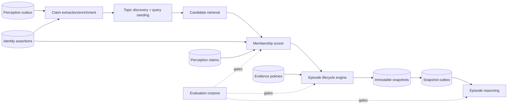

# Fyralis Episode Creation Subsystem — Three-Phase Implementation Plan

**Starting condition:** prerequisite gap closure is complete. Immutable source
revisions, evidence lineage, tenant/installation identity, evidence-bound
claims, source-policy composition, constructor contracts, transactional intake,
and a deterministic audit-week evaluation harness now exist.

**Goal:** turn ready observations into explainable, versioned, settled episodes
and make those snapshots the coherent input to reasoning.

**Non-goal:** this plan does not turn an episode into a company belief. Think and
later reasoning layers remain responsible for inference, synthesis, and model
updates.

## Architecture to implement

## Phase 1 — Shadow topic routing and membership construction

### Outcome

Fyralis autonomously creates topic candidates and query-seeded topic intents,
routes each ready observation to zero or more open episode candidates, and
records explainable membership assertions. Nothing from this phase triggers
authoritative reasoning or user-visible side effects.

### Work

1. Add durable `topic_intents`, topic-version/alias, `episodes`, and
   `episode_membership_assertions` stores with tenant RLS and append-only
   decision history.
2. Build an idempotent perception-outbox consumer with lease recovery,
   dead-letter handling, per-tenant fairness, and observation/evidence version
   keys.
3. Run versioned claim extraction for observations that lack adequate
   deterministic claims. Preserve all extractor outputs and their evidence
   spans; never overwrite prior extraction runs.
4. Implement automatic topic proposal using a hybrid candidate generator:
   shared entities/claims, source structure and relation paths first; semantic
   retrieval and temporal proximity as recall expanders.
5. Implement query seeding from query text, requester, valid-time intent, entity
   anchors, and authorized source scope. Reuse an existing active topic only
   when a typed equivalence decision is recorded.
6. Score include/exclude/hold memberships with a stored feature snapshot,
   router version, structured reasons, identity-assertion dependencies, and
   exact claim/evidence IDs.
7. Support multi-membership. Persist hard negatives and uncertain candidates;
   do not force one winning cluster.
8. Run exclusively in shadow mode and export corpus/canary metrics by router
   version and source mix.

### Exit gates

- Exact outbox replay creates no duplicate topic, episode, or membership
  assertion.
- Audit-week recall and precision are each at least 0.90.
- Citation completeness and contradiction preservation are 1.00.
- Cross-tenant and cross-installation identity collision tests pass.
- Restricted or unknown evidence produces zero authorization violations.
- A query and an automatic signal can converge on the same episode only through
  a recorded topic-equivalence decision.
- Shadow operation has no Think, notification, artifact, or product side effects.

## Phase 2 — Lifecycle, settlement, query answers, and immutable snapshots

### Outcome

Open evidence groups evolve through explicit lifecycle transitions and emit
content-addressed snapshots. Automatic situations and CEO/user questions use
the same snapshot model, with different opening and settlement policies.

### Work

1. Add episode lifecycle events and a serialized per-episode transition worker.
   Record open, dormant, settled, reopened, split, merge, and superseded events.
2. Track event-time and ingestion-time watermarks. Accept late evidence and
   reopen without mutating a prior snapshot.
3. Define typed settlement policies by topic class: quiet period, explicit
   close, query-scope satisfied, or superseded. Record the rule version and
   coverage state that justified settlement.
4. Materialize contradiction sets from active claims while preserving claimant,
   modality, polarity, valid time, and evidence.
5. Compose exact evidence access policies. A snapshot with unknown policy is
   non-shareable; a restricted snapshot carries the audience intersection and
   all input policy hashes.
6. Seal immutable episode snapshots with observations, evidence, claims,
   membership assertions, contradictions, coverage measures, policy manifest,
   watermarks, and manifest hash.
7. Add query-episode orchestration: create/reuse intent, retrieve authorized
   historical candidates, construct until query-scope completion, snapshot, and
   retain the snapshot as the answer's reproducible evidence batch.
8. Add read APIs for episode history, membership explanation, contradictions,
   citations, and snapshot diff. Shareable artifacts reference a snapshot ID,
   never a mutable episode head.
9. Emit `episode.snapshot_settled` through a second transactional outbox. Do not
   yet allow it to produce authoritative downstream side effects.

### Exit gates

- Every snapshot validates its manifest hash and can be reconstructed from
  immutable ledgers.
- Create → edit → delete → late-arrival replay yields deterministic snapshots.
- Split, merge, and reopen preserve older IDs and snapshot history.
- Query answers can cite every material assertion to evidence in one authorized
  snapshot.
- Adding one restricted item can only narrow, never widen, snapshot visibility.
- Snapshot generation passes audit-week quality gates and production shadow
  latency/settlement budgets.

## Phase 3 — Episode reasoning integration and controlled cutover

### Outcome

Reasoning consumes authorized episode snapshots as its sole batch abstraction.
The direct observation-to-T1 path is retired only after parity, safety, and
rollback gates pass.

### Work

1. Implement a snapshot-outbox consumer that creates idempotent reasoning jobs
   keyed by snapshot ID, hash, reasoning contract version, and query requester
   when applicable.
2. Replace concatenated observation batches with a structured reader over
   claims, contradictions, temporal order, exact evidence, and membership
   explanations. Enforce the snapshot evidence manifest during citation.
3. Separate automatic organizational updates from query answers. Both consume a
   snapshot; only query mode carries requester and question context.
4. Run side-effect-free dual reasoning against current T1. Compare evidence
   coverage, propositions, confidence, contradiction handling, citations, cost,
   and latency—not only text similarity.
5. Add a tenant-scoped ownership flag with mutually exclusive modes:
   `direct_authoritative`, `episode_shadow`, and `episode_authoritative`.
   Assert at the side-effect boundary that only the authoritative lane can
   mutate models, notify users, or publish artifacts.
6. Canary selected tenants, retain direct T1 inputs for replay, and monitor
   outbox lag, dead letters, episode churn, reopening, answer drift, and access
   denials.
7. Backfill historical evidence through the same constructor versions in
   bounded tenant partitions. Keep backfill snapshots distinguishable from live
   snapshots.
8. After the agreed soak window, stop direct T1 enqueue and remove its batcher in
   a later cleanup migration. Do not delete legacy triggers or results during
   the rollback window.

### Exit gates

- Episode and direct lanes never both emit business side effects for one input.
- Exact snapshot replay is deterministic and side-effect idempotent.
- Citation completeness and contradiction preservation remain 1.00.
- Authorization violations remain zero under requester changes and ACL
  revocation tests.
- Canary answer quality meets the agreed parity or improvement criteria and no
  severity-one regression remains open.
- Rollback to direct authority is exercised in staging without schema rollback
  or data loss.
- After general cutover, all new reasoning jobs identify an episode snapshot ID
  and hash.

## Cross-phase engineering rules

- Every persisted decision names its producer and schema/model version.
- Deterministic candidate generation precedes model scoring where possible.
- Models propose; versioned ledgers record; policy code authorizes.
- No queue relies on notification alone. PostgreSQL notifications may wake a
  worker, but durable rows own delivery and retries.
- Every worker is idempotent, lease-recoverable, observable, and safe under
  concurrent delivery.
- Schema changes are forward-only. Rollback changes ownership flags and
  consumers, not historical evidence.
- Evaluation data grows from real misses, contamination, identity corrections,
  late evidence, and ACL incidents.

## Principal residual risks

| Risk | Required mitigation before affected phase exits |
|---|---|
| Provider ACL cannot be fully observed | Fail closed; add provider permission snapshots; never infer broad access from connector reachability. |
| Topic explosion or duplicate query topics | Typed equivalence ledger, per-tenant quotas, retention and promotion policies, shadow metrics. |
| Claim extractor drift changes memberships | Version extraction runs, retain spans, replay corpora per version, recompute dependents explicitly. |
| Late evidence causes excessive reopening | Topic-class lateness policies and churn budgets; preserve late evidence even when it does not reopen. |
| Identity correction invalidates episodes | Dependency index from identity assertion to membership; append superseding memberships and snapshots. |
| Dual-path duplicate effects | Single tenant ownership flag checked at the final side-effect transaction. |
| A concise episode omits relevant evidence | Coverage denominator and reviewed exclusions are part of the snapshot; recall is a release gate. |

## Definition of done

The subsystem is complete only when a CEO query such as “What is the current
state of the audit?” creates or reuses a query topic, constructs an authorized
episode from all material cross-source evidence, preserves unresolved employee
contradictions, seals a reproducible snapshot, and returns reasoning whose every
material claim cites that snapshot—while the same machinery autonomously builds
and updates audit-week episodes without a query.
