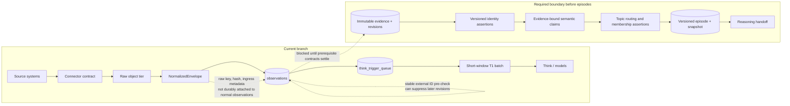
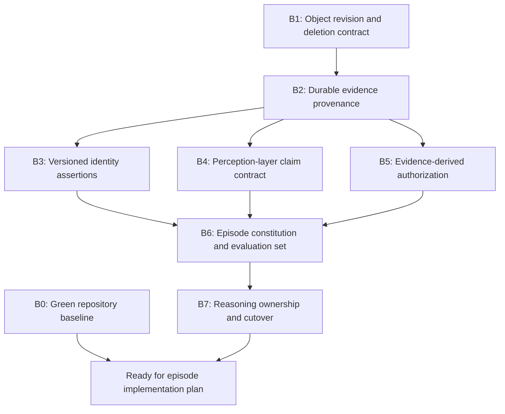

# Episode Creation Subsystem: Prerequisite Blocker Assessment

**Repository:** Fyralis Core

**Inspected branch:** `feature/source-connector-contract`

**Inspected revision:** `d3264900`

**Assessment date:** 2026-08-04

**Decision:** **Blocked — do not begin the episode-creation subsystem yet.**

## 1. Executive verdict

The branch provides a useful ingestion skeleton: connector contracts, raw-object capture, normalization envelopes, observation persistence, entity hints, durable reasoning triggers, and a short-window reasoning batcher. It does **not** yet provide the durable evidence, change-history, identity, authorization, or semantic contracts that an episode constructor must rely on.

Beginning episode implementation now would bake unstable assumptions into episode identity and membership. In particular:

- updates to mutable source objects can be discarded as duplicates;
- normalized raw-evidence lineage is mostly lost at observation persistence;
- cross-source identities are not represented by an auditable, tenant-safe identity ledger;
- observations do not have a source-independent assertion/claim representation;
- source-object visibility is not carried into observations, so a combined episode cannot safely derive its audience;
- the existing Think path consumes observations before episodes exist; and
- the repository's observation-writer test baseline is currently failing.

Accordingly, this document is the conditional deliverable requested: a blocker report with resolution gates. It intentionally does not prescribe the implementation phases for episodes until these contracts are settled.

## 2. Scope and decision rule

The intended subsystem boundary is:

> External signals become immutable observations, acquire resolved identity and evidence-bound claims, are routed into topics, and settle into versioned episodes. Reasoning begins only after an episode snapshot is available.

The assessment treats an issue as a blocker when it can cause one of the following even if the episode-clustering algorithm itself is correct:

1. missing or overwritten evidence;
2. incorrect cross-source membership;
3. an episode that cannot be reconstructed or cited;
4. unauthorized information disclosure;
5. competing sources of truth between the current reasoning path and the episode path; or
6. inability to determine whether construction quality improved or regressed.

## 3. What exists on the branch

The branch already contains several foundations that should be retained:

| Foundation | Current capability | Assessment |
|---|---|---|
| Connector contract | `SourceRecord`, `NormalizationInput`, and `ObservationDraft` define a uniform connector-to-normalizer boundary. | Useful base, but semantically too thin for episodes. |
| Raw tier | Raw envelopes carry an object key, content hash, ingress type, and ingestion timestamp. | Good provenance inputs; not preserved end to end. |
| Normalized envelope | Carries raw provenance plus normalized observation fields. | Strong handoff envelope. |
| Observation write path | Persists observations and transactionally enqueues T1 reasoning work. | Durable pattern worth reusing for episode intake. |
| Identity hints | Actor mappings, entity aliases, and `entities_mentioned` provide early entity signals. | Useful candidates, not a safe identity authority. |
| Think batching | Groups T1 events by an entity/actor lane and a short arrival window. | Execution optimization, not an episode model. |
| Tenant isolation | Core domain tables use tenant IDs and RLS coverage is present in later migrations. | Necessary but insufficient for evidence-level authorization. |

The connector-focused contract suite passed (`40 passed`). The broader observation-writer baseline did not: three tests error during setup because they still call the removed `reset_shadow_log()` API.

## 4. Current and required data flow



The existing T1 batch is not an episode. It has no persistent episode identity, topic lifecycle, explicit positive and negative membership assertions, boundary history, contradiction set, supersession semantics, coverage measure, settlement rule, or reproducible snapshot. It groups events for execution convenience and emits a lossy text payload.

## 5. Blocking issues

### B0 — The branch baseline is not green

**Observed evidence**

- Connector/contract tests pass: `40 passed`.
- The normalizer/model/invariant/writer run ends in `................EEE`.
- The writer test fixture calls `reset_shadow_log()`, but the writer no longer exposes the shadow-log API: [`test_observation_writer.py`](../../services/ingest/ingestion/writers/tests/test_observation_writer.py#L65).

**Why this blocks the work**

Episode work would modify the same observation-writer boundary. With a pre-existing failing baseline, a new failure cannot be reliably attributed to episode changes, and the normal PR/CI gate is already compromised.

**Exit gate**

- Decide whether shadow-mode behavior was intentionally removed.
- Align the tests and documented writer modes with that decision.
- Run the repository's required unit and integration test gates from a clean branch and record a passing baseline.

### B1 — Source object identity, revisions, and deletions are not durable

**Observed evidence**

- The observation repository explicitly pre-checks `(tenant_id, source_channel, external_id)` and returns the latest existing row, ignoring `occurred_at`: [`repo.py`](../../services/domain/observations/repo.py#L175).
- Notion emits stable IDs such as `notion:page:{id}` and uses `last_edited_time` as occurrence time: [`notion.py`](../../services/ingest/connectors/notion.py#L170).
- Consequently, a later version of the same Notion page is treated as an already-seen observation and can be discarded.
- Slack message deletion events are rejected because they have no content: [`slack.py`](../../services/ingest/connectors/slack.py#L100).
- Slack edits carry an original timestamp in JSON, but no typed revision or supersession relation exists.

**Why this blocks the work**

An episode about “audit week” must distinguish object identity from object version. Creation, edit, status transition, retraction, and deletion all change the episode's current state. If revisions disappear, the system cannot answer “what is true now?” or explain how that answer changed.

**Required decision before implementation**

Adopt a source-independent change contract with, at minimum:

- `source_installation_id`;
- `source_object_type` and `source_object_id`;
- immutable `source_revision_id` or a deterministic revision hash;
- `operation` (`create`, `update`, `delete`, `snapshot`, `backfill`);
- `source_recorded_at`, `valid_from`, and optional `valid_to`;
- `supersedes_revision_id`; and
- an idempotency key for the **revision**, not only the object.

**Exit gate**

- Replaying the same revision is idempotent.
- Ingesting a later revision creates a new immutable observation/evidence record.
- Deletion and retraction are represented as state-changing evidence rather than rejected.
- Tests cover create → update → update → delete for at least Notion and Slack.

### B2 — Evidence provenance is lost between normalization and persistence

**Observed evidence**

- `NormalizedEnvelope` carries `raw_s3_key`, `content_hash`, `raw_ingested_at`, `normalized_at`, `ingress_metadata`, and `idem_hints`: [`models.py`](../../services/ingest/ingestion/normalizer/models.py#L30).
- The writer rebuilds an `ObservationDraft` with `raw_payload=None` and passes only `raw_s3_key` and `ingress_kind` into ingestion: [`observation_writer.py`](../../services/ingest/ingestion/writers/observation_writer.py#L156).
- The observation table has no canonical evidence reference, content hash, installation, parser version, normalizer version, or source-revision columns: [`0001_foundation.sql`](../../db/migrations/0001_foundation.sql#L65).
- `raw_s3_key` is added to observation content only in the large-document summarization path; it is not a universal lineage link: [`core.py`](../../services/ingest/ingestion/core.py#L165).
- Raw-object retention defaults to 30 days: [`s3.py`](../../services/ingest/ingestion/raw_tier/s3.py#L45).

**Why this blocks the work**

Episode membership must be inspectable down to exact evidence. Without a durable observation-to-raw link and transformation version, Fyralis cannot reproduce an episode, verify a citation, re-normalize after parser changes, or distinguish source evidence from generated interpretation.

**Required decision before implementation**

Define an immutable evidence ledger (either by extending observations or introducing an evidence table) that records:

- raw object key and cryptographic content hash;
- source installation, object, and revision identity;
- ingestion and source timestamps;
- connector, schema, parser, and normalizer versions;
- transformation lineage; and
- retention state or a durable tombstone when raw bytes expire.

**Exit gate**

- Every persisted observation can resolve to a raw evidence record or an explicit, integrity-verifiable retention tombstone.
- A citation can identify the source object, exact revision, captured time, and transformation version.
- The raw-retention policy is reconciled with the required lifetime of episodes and citations.
- Replay/re-normalization produces a new derived version without mutating historical evidence.

### B3 — Cross-source entity resolution is not yet a safe dependency

**Observed evidence**

- `actor_identity_mappings` has primary key `(source_channel, source_actor_ref)` but no tenant or connector-installation scope: [`0001_foundation.sql`](../../db/migrations/0001_foundation.sql#L41).
- Actor lookup queries that pair without a tenant filter: [`repo.py`](../../services/domain/actors/repo.py#L205).
- `entity_aliases` is tenant-scoped but stores the resolution as arbitrary JSON plus a scalar confidence; it does not record candidate sets, evidence used, decision author/model, validity interval, or merge/split history: [`0001_foundation.sql`](../../db/migrations/0001_foundation.sql#L343).
- `entities_mentioned` is JSON embedded in an observation, not a versioned assertion ledger.

**Why this blocks the work**

Topic routing depends heavily on shared entities. A mistaken merge can combine unrelated evidence; a missed merge fragments one real episode. More importantly, future identity corrections must be able to re-evaluate episode membership without rewriting history.

**Required minimum before episode implementation**

- Tenant- and installation-scoped source identities.
- Immutable identity assertions linking source-native identities to canonical entities.
- Explicit assertion status (`proposed`, `accepted`, `rejected`, `superseded`) and decision provenance.
- Candidate and ambiguity representation; unresolved identity must remain unresolved.
- Versioned merge/split operations and a way to recompute affected membership assertions.

This does not require perfect entity resolution. It requires uncertainty and correction to be first-class.

**Exit gate**

- The same external ID in two tenants or installations cannot collide.
- Every resolved entity link is attributable and reversible.
- Episode construction can consume identity at a named version.
- A later identity split can identify every affected topic/episode membership for recomputation.

### B4 — There is no perception-layer claim contract

**Observed evidence**

- Observations contain source-specific content and free-form `content_text`; connector structure is embedded inconsistently in JSON.
- `relation_claims` are downstream Think write-plan objects, not a general signal-to-claim ledger: [`0148_relation_claim_lifecycle.sql`](../../db/migrations/0148_relation_claim_lifecycle.sql#L9).
- Existing `models` with proposition kind `situation` are reasoned, compositional beliefs: [`0045_situation_compositional_fields.sql`](../../db/migrations/0045_situation_compositional_fields.sql#L7). They are not evidence batches and should not be renamed or reused as episodes.

**Why this blocks the work**

Raw textual similarity alone cannot reliably answer whether two observations concern the same episode. Routing needs source-independent semantic atoms such as:

- actor or claimant;
- subject, predicate, and object/value;
- modality (`asserted`, `asked`, `proposed`, `planned`, `reported`, `denied`);
- polarity and confidence;
- valid time;
- exact evidence span; and
- extractor and extraction version.

Without this boundary, episode construction and reasoning collapse into one opaque model call. Contradictions become difficult to represent, and membership cannot explain why a signal belongs.

**Exit gate**

- Approve the distinction among evidence, observation, semantic assertion/claim, topic, episode, and downstream belief/model.
- Define a versioned claim/assertion contract with span-level provenance and claimant perspective.
- Standardize typed structural references needed across sources: parent, container, thread, reply, attachment, and referenced object.
- Demonstrate that opposing employee claims remain separate and can coexist in one episode as an explicit contradiction.

### B5 — Episode authorization cannot be derived from current observations

**Observed evidence**

- `ObservationDraft` has no ACL, audience, visibility, or source-object access context: [`models.py`](../../services/ingest/source_contract/models.py#L135).
- Observation access is computed later from author, mentions, broad `source_channel`, shared-channel registration, and manager hierarchy: [`checks.py`](../../services/platform/access_control/checks.py#L281).
- Sensitive classification relies partly on channel prefixes such as `hr:`, `legal:`, and `incident:`: [`hierarchy.py`](../../services/platform/access_control/hierarchy.py#L28).
- Connectors use broad channels such as `notion:object` and `slack:message`, which do not identify the source object's actual audience.

**Why this blocks the work**

An episode is a join across evidence. Its safe audience is constrained by the evidence contributing to the exact snapshot and by the requested mode of disclosure. A coarse channel-level rule cannot safely authorize a shareable audit map built from private pages, channels, messages, and meetings.

**Required decision before implementation**

Define evidence-derived authorization with:

- source-object ACL/audience capture and its version;
- tenant and installation scope;
- an explicit composition rule for episode visibility;
- redacted or audience-specific projections where useful; and
- access checks traversing the exact evidence/membership graph, not only cached episode metadata.

**Exit gate**

- Each evidence revision has a resolvable access policy or a conservative “restricted/unknown” state.
- The episode snapshot records the policy inputs used to derive its audience.
- Adding restricted evidence cannot silently make that evidence visible to a broader audience.
- Access revocation and source ACL changes have defined effects on existing snapshots and generated artifacts.

### B6 — Episode semantics and quality gates have not been formalized

**Observed evidence**

No first-class episode schema or evaluation corpus exists on this branch. The current T1 window offers batching parameters, but arrival proximity is not a definition of organizational relatedness.

**Why this blocks the work**

Implementation choices depend on semantics that are presently undecided:

- Is a topic a durable routing address, a learned concept, or both?
- Is an episode a bounded event, an evolving situation, or an immutable snapshot over either?
- Can one observation belong to multiple episodes?
- What evidence opens, extends, splits, merges, reopens, and settles an episode?
- Are query-created episodes temporary views, durable episodes, or both?
- What does “cover all relevant observations” mean, and how is irrelevant contamination penalized?

These decisions affect table keys, indexes, queue partitioning, model prompts, recomputation, and public APIs. They cannot be deferred to the clustering implementation.

**Exit gate**

- Approve an episode constitution defining identity, lifecycle, temporal semantics, multi-membership, and snapshot immutability.
- Define membership as an assertion with score, reasons, router version, evidence/claim inputs, and status—not as an untraceable foreign key.
- Define automatic and query-seeded topic creation, including deduplication and promotion rules.
- Build a representative labeled corpus (including “audit week”) with positive memberships, hard negatives, contradictions, edits, deletions, ambiguous identities, and access boundaries.
- Set acceptance metrics for coverage/recall, contamination/precision, boundary quality, citation completeness, contradiction preservation, stability under replay, and latency.

### B7 — The reasoning handoff has conflicting ownership

**Observed evidence**

- Observation ingestion transactionally enqueues a T1 `event_arrival` trigger: [`core.py`](../../services/ingest/ingestion/core.py#L556).
- The Think worker groups these into short-window batches by entity/actor lane, with a fallback to tenant and arrival time: [`worker.py`](../../services/reasoning/think/worker.py#L1599).
- Its batch payload truncates individual signal text and constructs a combined prompt seed: [`worker.py`](../../services/reasoning/think/worker.py#L1812).

**Why this blocks the work**

The intended architecture says reasoning should consume settled episodes. The current architecture reasons directly from observations or ephemeral event batches. Running both paths without an ownership decision can create duplicate or divergent models, citations, notifications, and side effects.

**Required decision before implementation**

Choose and document the handoff contract:

1. observation persistence transactionally enqueues durable episode intake;
2. the constructor emits immutable episode snapshots through an outbox;
3. reasoning consumes a snapshot ID plus authorized evidence manifest;
4. the existing T1 event path operates in shadow mode during comparison; and
5. one path becomes authoritative only after parity and quality gates pass.

PostgreSQL `NOTIFY` may remain a wake-up optimization, but it must not be the only durable delivery mechanism.

**Exit gate**

- One component owns each transition: observation → episode intake → episode snapshot → reasoning trigger.
- Idempotency and retry keys are defined at every handoff.
- Shadow-mode results can be compared without producing duplicate business side effects.
- Cutover, rollback, and backfill behavior are documented before schema or worker implementation begins.

## 6. Blocker dependency order



Some resolution work can proceed in parallel, but the contracts should be approved in this order:

1. restore a trustworthy test baseline;
2. settle immutable source revision and evidence provenance;
3. settle identity, semantic assertion, and authorization contracts;
4. ratify episode semantics against an evaluation corpus; and
5. decide the single reasoning handoff and migration path.

## 7. What is not a blocker

The following should not delay contract resolution or be treated as prerequisites:

- choosing a vector database, graph database, or streaming framework;
- implementing a sophisticated global clustering model;
- resolving every entity with certainty;
- creating a separate microservice solely for episodes;
- replacing PostgreSQL, S3, or the existing durable queue patterns; or
- solving downstream organizational reasoning before the episode boundary exists.

The durable architectural requirement is correctness of identity, lineage, membership, authorization, versioning, and handoff. The deployment topology can remain an implementation choice.

## 8. Resolution checklist

The episode implementation plan can be written once all boxes below have named owners and accepted artifacts, and the production-cutover blockers have an agreed delivery dependency:

- [ ] Writer baseline is green on the required CI suite.
- [ ] Source object/revision/operation contract is approved.
- [ ] Mutable revisions and tombstones persist as immutable evidence.
- [ ] Observation-to-raw lineage and retention semantics are durable.
- [ ] Identity assertions are tenant-safe, versioned, attributable, and reversible.
- [ ] Perception-layer assertion/claim schema is approved.
- [ ] Evidence-level authorization and episode composition rules are approved.
- [ ] Episode constitution, membership assertion, and snapshot semantics are approved.
- [ ] Gold evaluation corpus and acceptance thresholds exist.
- [ ] Observation-to-episode-to-reasoning ownership, shadow migration, and rollback are approved.

## 9. Validation record

Commands executed on `feature/source-connector-contract` at `d3264900`:

```text
uv run pytest -q \
  services/ingest/source_contract/tests \
  services/ingest/connector_platform/tests/test_normalizer_ingress.py \
  services/ingest/connectors/tests/test_native_pilots.py

Result: 40 passed
```

```text
uv run pytest -q \
  services/ingest/ingestion/normalizer/tests/test_models.py \
  services/ingest/ingestion/normalizer/tests/test_invariants.py \
  services/ingest/ingestion/writers/tests/test_observation_writer.py

Result: 16 passed, 3 errors
Cause: stale fixture references to removed shadow-log APIs
```

No episode implementation code was changed. An unrelated pre-existing untracked research file, `docs/research/entity-resolution-architecture-review.md`, was left untouched and was not treated as branch implementation.

## 10. Final recommendation

Do not start with an `episodes` table or a clustering worker. First make the observation boundary capable of preserving source evolution, exact evidence, identity uncertainty, claim provenance, and access policy. Then define the episode constitution and test it against the audit-week corpus. Only after those gates are accepted can an implementation plan specify schemas, workers, routing stages, settlement algorithms, APIs, observability, backfill, and cutover without being built on assumptions that are already contradicted by the repository.
