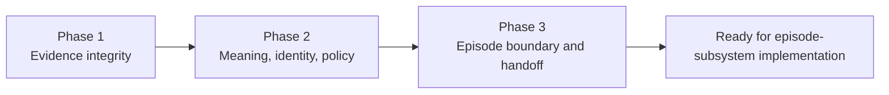

# Episode Prerequisite Gap-Closure Phases

This work closes the prerequisites identified in
`episode-creation-prerequisite-blockers.md`. It deliberately stops at the
boundary where external evidence is ready for episode construction; it does
not implement topic routing, episode membership, or episode settlement.

## Completion record

| Phase | Status | Delivered boundary |
|---|---|---|
| Phase 1 | Complete | Immutable source revisions, raw lineage, tombstones, and revision-safe observation deduplication. |
| Phase 2 | Complete | Tenant/installation identity ledger, evidence-bound claims, contradiction preservation, and fail-closed evidence access. |
| Phase 3 | Complete | Transactional constructor intake, episode constitution/contracts, audit-week quality gates, and reasoning cutover ownership. |

The next work is defined in `episode-creation-implementation-plan.md`.

## Phase 1 — Immutable evidence and source evolution

Close B0, B1, and B2:

- restore a green observation-writer baseline;
- distinguish source-object identity from source-revision identity;
- retain create, update, snapshot, delete, and retract operations;
- persist exact raw-object lineage and transformation versions;
- make revision replay idempotent without collapsing later revisions; and
- make retention/tombstone state explicit.

**Exit:** create → update → delete histories remain immutable and each
observation cites an integrity-verifiable evidence revision.

## Phase 2 — Identity, claims, and authorization

Close B3, B4, and B5:

- tenant- and installation-scope actor identities;
- add an attributable, reversible identity-assertion ledger;
- add a perception-layer semantic-claim ledger with exact evidence spans;
- preserve ambiguity and contradictions instead of forcing resolution; and
- attach source access policy to evidence and derive safe combined audiences.

**Exit:** episode routing can consume identity and claims at named versions,
and no future evidence grouping needs to guess its authorization boundary.

## Phase 3 — Episode boundary, evaluation, and reasoning ownership

Close B6 and B7 without implementing the constructor itself:

- ratify the episode constitution and immutable snapshot contract;
- define explainable, versioned membership assertions;
- define automatic and query-seeded topic intent contracts;
- add a durable transactional perception outbox for constructor intake;
- define the shadow/cutover/rollback contract for replacing direct T1 input;
- add an audit-week evaluation corpus and deterministic contract validator; and
- set measurable coverage, contamination, citation, contradiction, replay,
  authorization, and latency gates.

**Exit:** the future constructor has stable inputs, outputs, quality gates, and
a single migration path into reasoning.

