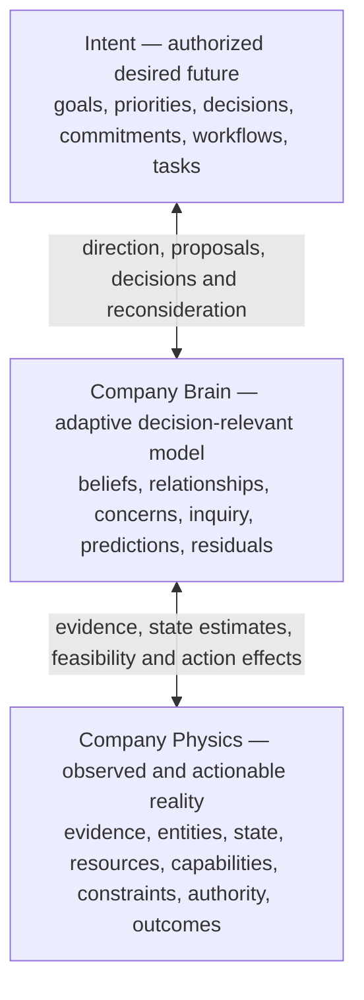
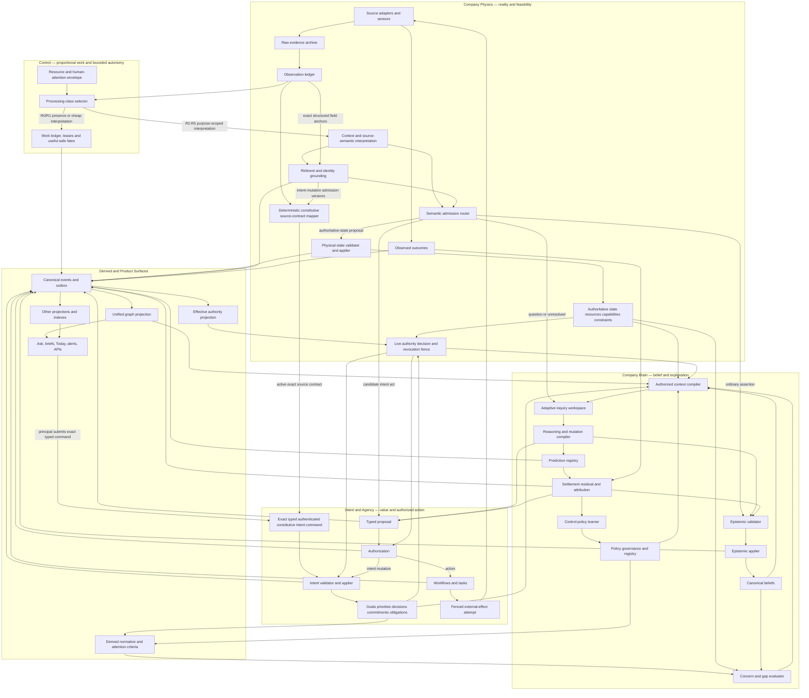
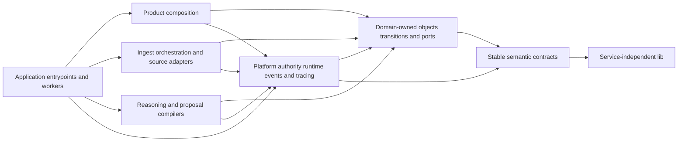
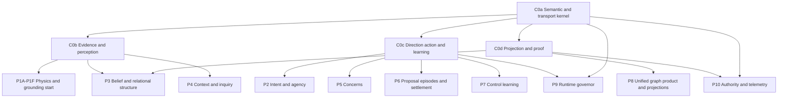
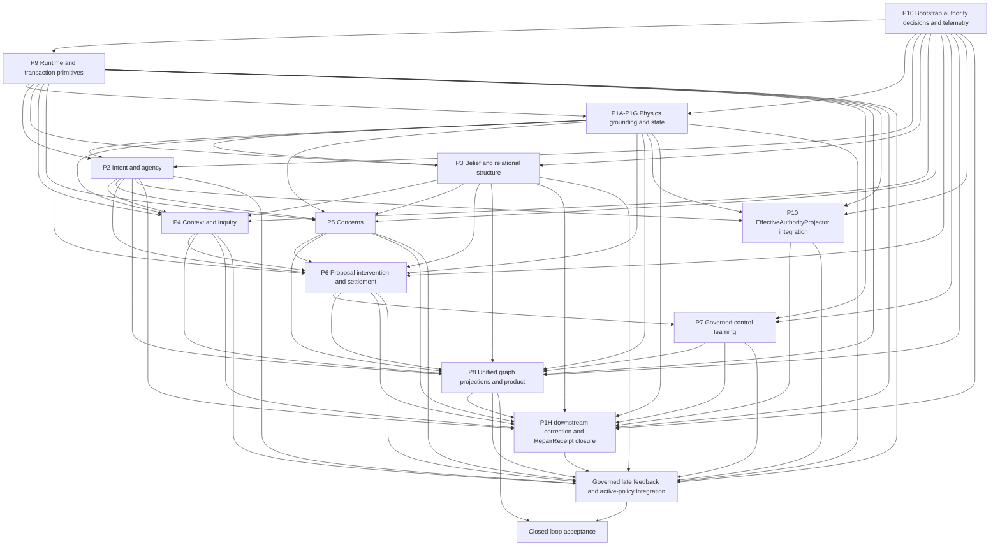

# Revised Company Physics–Brain–Intent System Implementation

Date: 2026-07-16

Status: normative architecture candidate under capability-scoped adoption.
The constitutional kernel and controlled component slices for entity grounding,
governed intent, Concern, consequential agency/settlement, workflow/work/
external-effect truth and governed control policy now exist, but this is not a
claim that the complete architecture or any production/customer deployment is
ready. This document authorizes no deployment or external action by itself. A
disposable simulation/shadow calibration slice requires the constitutional-
kernel gate; each canonical production capability requires its own reviewed
gate over the sources, objects, writers, consumers and risk classes it can
exercise.

Companion evaluation plan:
[Revised System Objective Evaluation Framework](../evaluation/revised-system-objective-evaluation-framework.md)

Current-runtime references:

- [Core System Architecture](../reference/CORE-SYSTEM-ARCHITECTURE.md)
- [Codebase Architecture](../reference/CODEBASE-ARCHITECTURE.md)

## Purpose

This document defines the implementation architecture for the revised Fyralis
system. It turns the company-physics, company-brain, and intent/agency model
into explicit components, contracts, dataflows, write authorities, intended
behaviors, and parallel delivery workstreams.

This is an implementation target, not a claim that every boundary described
here is already mechanically true in the current codebase.

### Current implementation checkpoint

The current repository has mechanically exercised the following architecture
slices. Evidence below is component-scoped unless a stronger tier is named;
none of it is a full-company simulation or customer-value result.

| Slice | Current mechanical state | What remains outside the claim |
| --- | --- | --- |
| Constitutional contracts and architecture registry | Pure cross-layer contracts, one canonical writer/contract registry, INV-01–INV-42 proof mapping and drift checks are live | Most invariants remain below their required evidence floor; production freeze remains false |
| Writer ownership and cutover control | A canonical WriterScopeEpoch registry now has tenant-root bootstrap, immutable scope/version/proof history, exact finite partition claims, compare-and-swap lifecycle transitions, explicit zero-writer fencing, atomic split/merge/transfer/retirement, command/result/event/outbox closure and an independent continuous evaluator. Registered scopes used through the shared agency transaction protocol are checked and read-locked in the semantic commit, so a commit linearizes before a concurrent epoch change or is rejected afterward | Complete inventory and registration of every legacy/direct writer, integration of paths outside the shared agency protocol, an external constitutional owner for transfer or retirement of the tenant writer-registry root, and E4 live producer/process crash, replay, rebalance and consumer-drain proof |
| Conversational/entity grounding | The entity resolver now chooses an exact context before the model call through a durable candidate -> probe -> selection protocol. It filters future evidence before authorization, binds every candidate event revision to exact processing authority, preserves temporary Slack episode hypotheses inside the selected snapshot, exposes only selected context to the prompt, records an exact SelectionDependency, and commits command/result/snapshot/head/candidate-probe/event/outbox plus the grounding assessment in one transaction through GroundingAnnotationAppender. Explicit context-independent mentions may use the cheapest probe-supported focal context; deictic or definite Slack phrases receive the most informative safe partial context but cannot auto-admit unless the context verdict is operationally sufficient. Independent continuous context and entity-grounding evaluators report zero-exposure denominators as unknown | The current probe is a deterministic context-light safety heuristic, not a learned or gold-calibrated semantic oracle. The resolver still reads legacy Observation rows rather than complete source-native ConversationEventRevision/edit/delete/reaction/tombstone history; cross-thread/channel/source jumps, long-range recurrence, real coreference/deixis, gold sufficiency and contamination, all legacy-consumer cutover, downstream correction closure and customer evidence remain unproven |
| Governed intent and Concern | Typed authority-basis intent commands, proposal/application paths, attention bindings and plural-contributor Concern reducer have component tests/evaluators | All legacy intent writers, live CriteriaProjector producers, human-attention loop and intent-specific authority-basis repair integration |
| Consequential proposal through attribution | Atomic Proposal/InterventionSpec, preregistered Prediction, exact AuthorizationDecision, independent Outcome, Settlement, conservative Attribution and episode manifest are live component protocols | Legacy producer cutover, population calibration, correction closure and causal-world proof |
| Workflow, work, failure, lease and external-effect truth | Canonical WorkflowRun/Task reducers, bounded and identity-preserving WorkObligation redrive generations atomically coordinated with FailureRecord authorization/progress/successor/closure, processing decisions, lease heartbeat and missed-heartbeat takeover with monotonic fences, exact ledger-bound no-effect proof for pure computation and effect-capable work with no attempt, a reserved attempt or a terminal known-no-effect receipt, exact cross-owner terminalization for AgencyStateApplier Task and ProposalAppender proposal fates with per-writer closure rates, adapter-capability versions, effect attempts, dispatch-before-observation, unknown/reconciliation, known-no-effect safe retry, separately governed compensation with exact specification/proposal/authorization/attempt/receipt linkage through unknown/reconciling to success, failure or terminal partial state, exact rejected/expired proposal fates and rejection of non-reversible nesting, repair-child terminalization and immutable receipts have one-writer Postgres protocols plus independent continuous evaluators | Real provider execution, crash/restart/reorder around handshakes, semantic-owner types beyond the two covered classes, positively authorized nested compensation and live producer/consumer cutover |
| Correction invalidation and repair | Exact source-result-bound InvalidationRequestRecords, immutable DependencyEdges, versioned RepairEpisodes/RepairObligations, proof-bearing RepairReceipts, source fences, complete-denominator convergence and independent continuous evaluation have a one-writer Postgres protocol; component replays cover first-generation no-op, real dependent-writer repair with atomic child Work and receipt-backed closure, exact reverse child exhaustion, and an authorized identity-preserving successor generation with rejected missing, drifted and stale redrives plus full rollback of an injected successor-commit failure | Production semantic-writer emission breadth, durable authorization-object integration beyond the explicit redrive authority reference, process kill/restart and reorder at other handshakes, partition rebalance, distinct revocation/deletion semantics, historical as-known query proof and policy/intent correction closure |
| Governed control policy and learned artifacts | Bootstrap, immutable experiment plan/assignment, manifest, candidate/shadow/eligibility/authorization/canary/active/frozen lifecycle, family CAS/fallback and continuous evaluator are live | Live retrieval/inquiry/scheduling/routing consumers, complete influence/deletion/unlearning closure, statistically independent interval recomputation and correction propagation |
| Cross-component objective evidence | Versioned component evidence manifests, continuous per-invariant proof compilation and conservative multi-manifest aggregation are executable | Raw population-member overlap audit, complete-system evidence for all 42 invariants, statistical intervals/history and immutable report-directory assembly |

The executable state remains deliberately narrower than this document. A
component marked live means its typed command, sole writer, storage transition,
event/outbox and focused evaluator have run against real Postgres; it does not
mean the surrounding product loop, long-horizon adaptation or organization-
level objective has been proven.

Components in this document are logical responsibilities and commit
authorities, not a mandate for one service, worker, table, or deployment per
row. Deployment boundaries should be chosen only after transaction, scaling,
fault-isolation, and ownership evidence justifies them.

The change is a reorientation rather than a blank-slate rewrite. Existing
ingestion, observations, Models, accepted edges and relations, Think,
retrieval, adaptive inquiry, projections, authority, acts, SAGE, workers, and
product surfaces should be reused behind clearer contracts.

## North Star

The highest-level objective is:

> Maintain the smallest defensible, authority-safe model of the company that
> measurably improves authorized understanding and decision quality, and only
> when valuable and authorized, supports bounded interventions that reduce
> regret or close consequential gaps.

Fyralis therefore has two coupled loops rather than one mandatory march toward
action.

The always-running understanding loop is:

```text
observe reality
  -> preserve evidence
  -> reconstruct source meaning and ground referents
  -> revise state or belief at the correct semantic boundary
  -> answer, brief, clarify, preserve uncertainty, or record non-interruption
  -> return to quiescence
```

The optional intervention loop is entered only when a consequential divergence
exists, additional action has positive expected value, and the relevant
authority is available:

```text
current state and belief
  + explicit intent, standing obligation, or bounded discovery duty
  -> concern
  -> minimal inquiry
  -> alternatives including no action
  -> preregistered prediction
  -> proposal
  -> authorization
  -> fenced execution
  -> independently observed outcome
  -> settlement, residual, and conservative attribution
  -> appropriate belief, perception, control-policy, or intent-reconsideration path
  -> resolve, reopen, suppress, accept risk, dismiss, or continue the concern
  -> return to quiescence
```

A successful cycle may end in a corrected belief, an answer, a brief, an
explicit unknown, a clarification request, accepted risk, or an explicit non-
interruption fate when interruption value is nonpositive and no material
obligation disappears.
It need not produce an intervention.

The graph is not the product and is not a universal company ontology. It is the
smallest reusable, evidence-grounded structure needed to explain, predict, and
navigate the gap between actual and intended company state.

## Company Physics Priority: Reconstruct Conversational Signals

Structured Jira issues, CRM records and many emails arrive with useful object,
field and document boundaries. Slack-like sources do not. A message has a clear
transport boundary, but usually not a self-contained semantic boundary.

Its meaning may depend on:

- a thread root or an unthreaded message several turns earlier;
- a different channel, DM, linked issue, document or customer record;
- who is speaking, who is present and what their roles were at that time;
- quoted or forwarded text whose original speaker differs from the sender;
- edits, deletions, reactions, attachments and link unfurls;
- company shorthand, pronouns and phrases such as it, that issue, the customer,
  the launch or same as last week;
- several conversations interleaved in one channel; or
- a topic that resumes after hours, days or months.

Slack should therefore be treated as a partially observed conversational event
stream, not a bag of independent messages and not one infinite channel
document. The immutable message/event remains the evidence atom. An
InterpretationContextSnapshot is a versioned interpretive envelope constructed
around a focal signal for a particular cutoff, processing-authority context and
purpose.

There is no universally correct Slack boundary. Within an authority-filtered
as-of topology slice, Fyralis should assemble overlapping multi-scale context
candidates—reply structure, temporal burst, participant continuity, semantic
topic, source-native handles, noncanonical reference continuity and linked
external objects—then select the smallest historical context that makes the
extraction sufficiently stable. Boundary uncertainty remains explicit.

```text
Slack event stream
  -> reconstruct source structure and versions
  -> cut an authorized as-of topology view before semantic features
  -> generate context-light cues and several plausible neighborhoods
  -> preserve episode and discourse-referent alternatives
  -> choose or combine the smallest sufficient historical context
  -> extract mentions, roles, claims and events
  -> record post-extraction which context materially changed the interpretation
  -> revise later when new context resolves old ambiguity
```

### Executable conversational-grounding boundary

The current adopted slice implements the middle safety boundary without
claiming the complete conversational architecture above:

```text
legacy source Observation and same-source candidates
  -> cutoff filter
  -> exact candidate-level processing authority
  -> focal, source-topology, temporal and combined context candidates
  -> one recorded probe fate per candidate
  -> cheapest sufficient context, or most informative safe partial context
  -> exact selected snapshot shown to the resolver model
  -> context sufficiency gates consumer admission
  -> one transactional context and grounding episode commit
```

GroundingAnnotationAppender independently replays the selection command at
commit time. The persisted snapshot ID, content digest, decision digest and
disposition must equal the pre-model selection; a mismatch aborts the whole
grounding episode. Snapshot history and candidate/probe records are append-only,
the current head advances by compare-and-swap, and command/result/event/outbox
closure is part of the same transaction. A selected Slack episode hypothesis
is embedded in the snapshot and its hash is carried by SelectionDependency;
there is no standalone durable conversation-episode aggregate.

This slice deliberately distinguishes **context visible for assessment** from
**context sufficient for automatic admission**. A vague phrase may receive
bounded prior messages so the model can propose a candidate, while the
consumer still receives review, clarification or unresolved state if boundary
stability is missing. Conversely, an explicit context-independent identifier
does not inherit nearby same-channel chatter merely because it is available.

The present probe uses phrase-level deixis/definite-description cues and
source-topology availability. That is a conservative bootstrap, not proof of
semantic context quality. Source-native revision reconstruction, edits,
deletions, reactions, cross-boundary retrieval, long-range topic recurrence,
semantic coreference, gold sufficient-set calibration, context-contamination
measurement, live revocation races and dependent repair remain later slices.

New evidence may improve the current retrospective interpretation of an older
message, but historical replay must preserve what could have been known at the
earlier cutoff. Future messages cannot leak into past decisions.

This layer and entity grounding form a chained perception boundary:

```text
context quality sets the ceiling for entity extraction
entity grounding sets the ceiling for the company model
```

## Company Physics Priority: Entity Grounding

The system cannot understand a signal until it knows, or explicitly does not
know, what company objects the signal is about. Entity grounding therefore
sets a hard quality ceiling for the rest of Fyralis.

```text
wrong entity
  -> wrong evidence scope
  -> wrong belief
  -> wrong graph neighborhood
  -> wrong concern
  -> wrong prediction or recommendation
  -> misleading outcome attribution
  -> harmful learning
```

A sophisticated brain operating on incorrectly grounded entities can produce a
highly coherent fiction. Company Physics must therefore treat signal parsing,
mention extraction, entity typing, role binding, candidate linking, canonical
identity resolution, novel-entity creation, and merge/split correction as a
first-class perception subsystem rather than a preprocessing convenience.

The subsystem optimizes expected downstream loss, not raw extraction volume.
Its default ordering of error cost is:

```text
destructive false merge
  > confident wrong link
  > missed consequential mention or persistent false split
  > explicit unresolved candidate
```

The exact ordering is risk- and use-dependent. Missing a critical customer or
security entity can be more costly than abstaining, while linking two different
customers or people can contaminate an entire company model. Thresholds must
therefore vary by entity type, evidence strength, downstream operation,
reversibility, and blast radius.

An unresolved mention is valid physics state. Fyralis should preserve a
candidate distribution, seek discriminating evidence when valuable, or abstain
rather than force a single identity. Downstream beliefs and actions may not be
more certain about their subject than the grounding evidence permits.

## Architectural Commitments

1. Company physics constrains claims through evidence, grounded referents,
   authoritative state, feasibility, and effective authority; it does not
   manufacture objective truth from observations.
2. Intent determines relevance and authorized direction, never factual truth.
3. The company brain maintains revisable beliefs and explanatory structure.
4. Retrieval plus adaptive inquiry is the temporary reasoning workspace. There
   is no second working graph.
5. Recommendations remain proposals until an authorized transition accepts
   them.
6. Predictions belong to the brain, outcomes belong to observed reality, and
   residuals belong to the learning boundary.
7. Canonical objects have one named writer per semantic class.
8. Derived views and policy state never become independent evidence.
9. Reward-bearing adaptive control-policy updates require independently
   measured, attributable terminal outcomes or an equally strong controlled
   experiment. State, belief, and perception corrections require evidence
   appropriate to their own semantic class rather than an intervention
   outcome.
10. Autonomous work must be bounded and become quiet when nothing meaningful
    remains unresolved.
11. Explicit intent directs attention but is not the only eligibility source:
    standing safety/compliance obligations and bounded discovery or
    truth-maintenance duties may also open work.
12. Operational workflow or strategic changes remain intent proposals unless
    a live, narrowly bounded delegation explicitly authorizes automatic
    adaptation through the separate DelegatedIntentPolicyActor and exact typed
    command path. The learner itself never acquires or executes that authority.
13. Epistemic, authority, provenance and correction laws are uniform, but
    interpretation effort and durability are proportional to consequence,
    uncertainty, reversibility and expected value.
14. Safety includes useful liveness: inside a declared operating region, the
    system must reach the most useful safe terminal result available rather
    than using abstention, review or indefinite deferral as its default product.
15. Intent acquisition is a governed sensing and clarification process.
    Behavioral or linguistic evidence may support an expressed-direction belief
    or exact Proposal, but only a constitutive authority path creates intent.
16. Semantic decisions, computational execution and durable commit authority
    are separate architectures. One joint model or service may compute several
    candidates, but it cannot collapse their meanings or admission gates.
17. Every adaptive loop has a useful cold-start policy, shadow-evidence phase,
    promotion rule and fallback; lack of historical labels or outcomes cannot
    silently disable the system or justify self-training.
18. Human attention, source reads, latency, compute, storage and repair are
    scarce system resources. Their measured feasibility is part of correctness,
    not a post-architecture optimization.
19. Information-flow authority extends through training examples, calibration
    sets, learned thresholds, policies and model parameters. Shared learning
    cannot weaken tenant isolation, revocation or deletion claims.
20. Architectural truth has one machine-readable source and an explicit
    `ArchitectureCommitmentClass`. Generated catalogs, schemas, ownership maps
    and proof obligations may not drift into competing descriptions.

## Governing Architecture: Safety, Usefulness And Evolvability

The sandwich and constitutional invariants remain the semantic foundation.
The following twelve operating doctrines determine how Fyralis applies that
foundation without becoming uniformly expensive, safely inert or impossible to
change. They are cross-cutting architecture, not a fourth runtime plane.

### 1. Proportional Rigor

Every unit of work declares a `ProcessingClass` chosen from a
versioned policy by downstream consequence, uncertainty, reversibility,
authority sensitivity, expected information value and resource envelope. The
class controls how much context, corroboration, review, durability and compute
may be used; it never weakens tenant isolation, provenance, plane separation,
grounding uncertainty, authority checks or correction behavior.

| Class | Minimum useful behavior | Typical terminal result | Forbidden use |
| --- | --- | --- | --- |
| R0 preserve | Authenticated capture, integrity, source coordinates, authority labels and explicit processing fate | Preserved evidence awaiting justified interpretation | Semantic claim, canonical entity link or product conclusion |
| R1 minimal interpretation | Source-native/deterministic structure, cheap semantic cues and explicit unknowns | Searchable/inspectable signal or bounded routing decision | Durable inferred belief or consequential entity choice |
| R2 provisional grounding | Purpose-scoped context, mentions, candidate distribution, source meaning and temporary hypotheses | Bounded answer, unresolved distribution, clarification candidate or InquirySession state | Canonical or consequential use without its destination admission |
| R3 durable understanding | Calibrated grounding, full provenance, destination-plane validation, correction dependencies and reusable consumer need | Admitted state/belief/intent proposal plus authorized product use | External action merely because understanding is durable |
| R4 consequential decision support | Independent checks appropriate to risk, alternatives/no-action, material assumptions, fresh authority and review where required | Recommendation, registered prediction or exact Proposal | Execution or constitutive intent without separate authorization |
| R5 external agency | Exact immutable specification, live authority, preconditions, dispatch fence, reconciliation and outcome plan | Authorized effect attempt with observable terminal fate | Broader scope or weaker evidence because a budget is exhausted |

The initial class is the cheapest one capable of serving the named consumer.
The system escalates when lower resolution is unstable, a discriminator is
decision-relevant, downstream consequence rises or the value of information
exceeds incremental cost. It de-escalates or stops when stability is sufficient,
expected value falls below cost, authority disappears or a declared budget is
spent. An R0/R1 result may later seed a higher-class successor, but the earlier
result remains historically addressable. A higher class may reuse lower-class
artifacts only with their limitations intact.

### 2. Useful Liveness

Correct abstention remains essential, but abstention volume is not evidence of
system quality. For each eligible request, signal or obligation inside a
declared operating region, Fyralis must reach one finite, reasoned result:

```text
fully answer or apply
  | bounded answer/provisional distribution
  | discriminating clarification or review request
  | explicit unknown/deferred result with wake condition
  | explicit inability/abstention with missing capability or authority
  | explicit non-interruption fate when interruption value is nonpositive
```

The useful-liveness obligation is to return the highest-value safe result
available under the current authority and budget, not to force an answer or
action. Indefinite `pending`, repeated generic clarification, review queues with
no capable recipient, and blanket high-confidence thresholds that make the
system inert are liveness defects. Every safe failure or deferral names what is
known, what remains unknown, why it matters, whether a lower-risk result is
available and the exact condition for reconsideration.
That terminal contract is a `UsefulSafeFate`; it combines the semantic result,
usefulness ceiling, unresolved need, stop reason, resource use and lawful wake
condition without pretending a partial result is complete.

### 3. Intent Acquisition Is Governed Sensing

Fyralis cannot rely on a fully populated goal registry at cold start, yet it may
not infer company intent from repeated behavior. It therefore observes and
progressively clarifies direction while preserving these distinct states:

```text
constitutive typed/source-contract intent ------------------> authorized intent
natural-language or behavioral evidence -> expressed-direction assessment
                                      -> exact normalized Proposal
                                      -> clarification/acceptance
                                      -> authorized intent
conflicting, absent or stale direction -> explicit intent gap, never invented intent
```

Constitutive source contracts and exact authenticated commands remain the
direct path. Slack, email, meetings, user behavior, recurring work and product
clicks can only supply evidence about apparent direction, Proposal content,
conflict or an intent gap. The intent-acquisition policy selects the smallest
useful clarification for a capable principal and may offer structured defaults,
bulk review or progressive confirmation, but it cannot use interaction design
to make silence count as acceptance. Sparse intent limits goal-relative
autonomy; it does not prevent evidence preservation, company understanding,
Ask, correction, standing obligations or bounded discovery.
This end-to-end `IntentAcquisitionLoop` owns no new truth: Grounding writers own
the expressed-direction interpretation, ProposalAppender owns the exact
Proposal and IntentApplier alone owns constituted intent.

### 4. Every Adaptive Loop Has A Bootstrap Contract

No adaptive subsystem may assume that the labels, outcomes or consumer history
needed to train itself already exist. Its contract declares:

```text
governed prior or deterministic baseline
  -> safe useful cold-start behavior
  -> temporary/shadow operation with complete fate capture
  -> independent evidence accumulation
  -> measured eligibility and governed promotion
  -> active adaptation with frozen fallback and rollback
```

The relevant prior differs by loop. Entity grounding begins with source IDs,
type constraints, open-set candidates and calibrated unresolved state;
representation begins in inquiry or shadow use against a nongraph baseline;
intent acquisition begins with constitutive contracts plus explicit Proposals;
concern formation begins only from authorized criteria or duties; attribution
begins at no credit; and learned routing begins with a static governed policy.
When evidence remains insufficient, the loop continues in its declared useful
fallback rather than self-labeling, blocking unrelated product behavior or
silently becoming active.
These declarations form a versioned `BootstrapPolicy` per adaptive family; the
policy is governed control state and cannot manufacture its own promotion
evidence.

### 5. Semantic, Computational And Commit Architectures Are Separate

For every inference path the architecture specifies three independent views:

| View | Governs | Example |
| --- | --- | --- |
| Semantic decision | Which propositions and decisions must remain distinguishable | context selection, mention detection, typing, resolution, state/belief/intent routing |
| Computational topology | Which decisions may share one model, call, feature pass, service or accelerator | one joint extractor emits frames, mentions, roles, types and candidate scores |
| Commit authority | Which validated outputs may become durable, in what plane and through which writer | GroundingAnnotationAppender records assessments; EntityIdentityApplier alone mutates identity; destination appliers admit state/belief/intent |

A joint model is permitted and often preferable when it improves quality or
economics. It must return separately versioned propositions, uncertainties and
provenance sufficient for independent validation, correction and replay.
Conversely, logical separation never mandates one network call, queue, database
or service per semantic stage. Compute topology is a governed, measurable and
replaceable mechanism; semantic boundaries and writer authority are not.

### 6. Representation Utility Uses The Smallest Valid Scope

Optional inferred Brain structure still earns durability through a named
consumer and measured incremental value. The measurement unit, however, is the
smallest scope that supports a valid conclusion: an exact relation candidate,
a versioned representation family, or a family-by-consumer/risk/domain/
organization-cohort scope.
A `RepresentationFamilyDefinition` fixes predicate/role semantics, admissible
evidence and scope, membership rules, exclusions, correction behavior and
version. Its exact candidate or family-by-consumer/risk/domain/organization-
cohort coverage is a `RepresentationAdmissionScope`. A family-level
`RepresentationAdmissionDecision` may cover an
assertion only when the assertion proves exact membership and its consumer,
risk and organization cohort match the measured population.

Candidate-specific preregistration remains mandatory for novel semantics,
exceptional blast radius, sparse or heterogeneous families and any case where
family evidence would hide material tails. Family evidence never establishes
the truth of an instance: EpistemicApplier still validates every assertion.
This makes graph discipline proportional while preventing one popular relation
family from licensing unrelated edges.

### 7. Human Attention And Friction Are Company Physics

Human confirmation, correction, clarification and governance are causal inputs
to whether the system can learn or act. The scheduler and product surfaces
therefore treat human attention as a limited resource with observable—not
invented—signals:

- recipient capability, scope and current authority;
- interruption and opportunity cost by channel and urgency;
- probability and latency of a useful response;
- unanswered, abandoned, deferred and duplicate requests;
- accumulated review load, habituation and fatigue indicators; and
- trust-relevant outcomes such as corrections, overrides and later reversals.

The versioned `human-attention envelope` is control/evaluation state, not a
psychological fact or company intent. It can change routing, batching, timing,
explanation and whether to ask; it cannot broaden authority, suppress a
nonwaivable duty or turn nonresponse into agreement. The underlying facts stay
in their proper semantic homes: delivered responses, corrections and measured
burden are Evidence or Outcome; recipient capability, availability and channel
constraints are Physics; response probability, fatigue or trust estimates are
revisable Brain beliefs; and declared preferences, consent, interruption
budgets and nonwaivable duties are Intent or governed control state. This does
not create a human-attention truth plane. Every human-facing loop measures the
complete denominator from eligible request through delivery, comprehension
proxy, response and downstream resolution rather than optimizing click-through
alone.

### 8. Authority And Isolation Extend Into Model State

Every learned artifact has an information-flow contract covering training
examples, features, embeddings, calibration data, evaluation sets, parameters,
prompts, thresholds and policy state. A `LearnedArtifactManifest` records its
training/evaluation corpus lineage, procedure, isolation class, evaluation
scope, promotion state, retention and deletion dependencies. Its
`TenantInfluenceLineage` records exact tenant/purpose eligibility,
consent/contract basis, contribution class and removal disposition without
exposing one tenant's population to another.

The default is tenant-isolated learning for tenant-derived material. A shared
artifact may consume only data admitted by an explicit cross-tenant learning
policy whose aggregation/privacy mechanism, leakage tests, allowed purposes,
revocation semantics and residual guarantees are declared before training.
Tenant deletion or authority loss fences new use immediately where required and
opens a model-state disposition: prove the artifact unaffected, retrain/unlearn
and replace it, restrict its scope, or disclose an irreducible residual and
narrow the non-interference claim. "The record was deleted" is never treated as
proof that its influence left model parameters.

Provider-retained or provider-trained state whose influence cannot be traced is
classified `unknown/unbounded`; that path cannot support a stronger tenant-
isolation, revocation or deletion claim merely because no leakage was observed.

### 9. The Architecture Itself Learns Through Evidence

Architecture decisions about language-model topology, context sufficiency,
thresholds, graph utility, human response and economics are hypotheses. They
follow the same disciplined loop as the product:

```text
architectural hypothesis and prediction
  -> sealed simulator/shadow vertical slice
  -> quality, safety, cost, friction and isolation evidence
  -> residual and failed-assumption classification
  -> decision record: retain, revise, narrow or reject
  -> contract promotion only at the appropriate tier
```

Experiments may challenge mechanisms and policies, never bypass constitutional
invariants. Architecture evidence retains scenario, system, model, policy,
resource and evaluator versions plus known external-validity limits. A result
from one thin slice can stabilize the tested mechanism only within its measured
operating region; it cannot certify the whole product.
Each test begins from a versioned `ArchitectureHypothesis` and closes with an
`ArchitectureDecisionRecord` that preserves the prediction, result, residual,
evidence tier, scope and retain/revise/narrow/reject decision.

### 10. Every Commitment Has An ArchitectureCommitmentClass

Contract maturity (`experimental`, `candidate`, `stable`) describes change and
compatibility. It is separate from the `ArchitectureCommitmentClass` of the
underlying design claim:

| Class | Meaning | Change rule |
| --- | --- | --- |
| T0 constitutional invariant | Violation makes evidence, isolation or action untrustworthy | Explicit constitutional review, migration and proof that safety is not weakened |
| T1 stable semantic contract | Durable shared meaning or writer boundary needed for interoperability | Versioned compatibility law and migration evidence |
| T2 governed policy | Threshold, budget, routing, retention or escalation choice inside T0/T1 | Authorized version/promotion, measurement and rollback |
| T3 empirical hypothesis | Unproven claim about model behavior, cost, user friction or organizational value | Preregistered test and explicit retain/revise/reject result |
| T4 rebuildable mechanism | Replaceable model, index, projection, cache, batching or compute topology | Equivalence/safety tests and operational cutover |

No T2–T4 choice is frozen merely because it appears in a detailed document.
Every architecture item declares both commitment class and maturity, evidence owner,
decision owner, applicable operating region and known uncertainty.

### 11. Economic Feasibility Is Part Of Correctness

Every consequential dataflow has an `EconomicOperatingEnvelope` covering source/API reads,
model calls and tokens, wall-clock and queue latency, storage and write
amplification, projection/rebuild cost, correction/repair fan-out, external
provider cost and human interruption. The envelope reports distributions and
tails by source, tenant scale, processing class and outcome—not only averages.

A product capability is not architecturally complete when its only lawful path
cannot meet a declared cost, latency or attention envelope under its target
load. The response is to improve joint computation, reuse, batching, resolution
selection, retention or scope while preserving T0/T1 laws. Hidden shortcuts are
forbidden. Budget exhaustion produces the safe bounded result defined by useful
liveness and a measured unmet-demand fate, so economics cannot silently become
epistemic loss.

### 12. One Canonical Architecture Registry

The semantic-object catalog, composable traits, writer map, lifecycle machines,
contract versions, compatibility rules, architecture commitment class/maturity,
dependency owners, trace requirements and invariant-to-proof mappings are
generated views of one version-controlled machine-readable
`ArchitectureContractRegistry`.
Schemas and prose may add explanation, but may not redefine registry facts.

The registry has one schema steward and reviewed change path. Its compiler
rejects missing or multiple writers, overlapping writer scopes, unknown types,
illegal lifecycle references, absent correction/deletion rules, orphan proof
obligations and incompatible stable-contract changes. CI regenerates and
compares the durable semantic table, writer table, component/RACI views, schema
manifests, compatibility fixtures and evaluation proof manifest. Drift is a
build failure, not documentation debt.

`ArchitectureHypothesis` and `ArchitectureDecisionRecord` are repository-
governed design-evidence records inside this build-time registry package, not
company-data objects or a runtime truth plane. P0 owns their schema and
lifecycle; the named architecture decision owner supplies the judgment, and
the evaluator supplies evidence by reference without acquiring design
authority.

## Constitutional Invariants

These are architecture laws, not optional product preferences:

- Intent changes attention, materiality, and requested resolution; it does not
  change the probability of a factual belief without new evidence.
- Reducing a principal's authority may only remove information or actions or
  produce abstention. It may never expose a more informative answer or stronger
  action path.
- Repetition is not corroboration. Copies, summaries, projections, previous
  answers, and shared upstream sources remain one dependent lineage.
- ConversationEventRevision is source Evidence; DiscourseReferent,
  EntityMention, semantic frames, candidate sets and assessments are versioned
  grounding interpretations and can never re-enter Evidence as independent fact.
- A detected reference is recorded as an EntityMention anchored to an exact
  source span/field or typed implicit anchor, not automatically as a canonical
  entity. Extraction, typing, linking, entity creation, and merging are separate
  decisions with separate confidence and provenance.
- Every EntityCandidateGenerationRequest produces exactly one immutable
  authority-safe EntityCandidateSet or one explicit terminal result/fate with
  complete required-lane coverage; missing work cannot impersonate abstention.
- A local co-reference or same-observation association may be preserved without
  globally merging the referenced entities.
- Evidence, physical state, belief, hypothesis, intent, proposal,
  authorization, execution, outcome, residual, control state, and projection
  never collapse silently.
- A prediction is registered before outcome evidence and remains historically
  immutable.
- Execution is not outcome. Task or command completion cannot prove the desired
  company result.
- A residual is not causal proof. Model, execution, measurement, timing,
  assumption, confounding, shock, and censoring failures remain separable.
- Every consequential external action has live authority, checked
  preconditions, one semantic idempotency key, an external-effect state, and a
  reconciliation path.
- Natural-language intent interpretation cannot become constitutive intent until
  a capable principal accepts the exact normalized payload/version. A direct
  typed command must carry one governed authority basis and intent-risk grounding
  for every entity-scoped role.
- Corrections supersede and repair; they preserve the historical evidence and
  belief snapshot used by earlier decisions.
- Every optional durable inferred relational `BeliefAssertion` must have
  evidence, scope, revision semantics, a named consumer and a measurable utility
  hypothesis at an exact RepresentationAdmissionScope, complete exposure
  denominator and live durable-eligibility decision whose measured scope
  contains that assertion. Utility cannot establish truth. Source-required, physical/
  institutional and accepted-intent relations remain governed by their own
  plane-fidelity contracts rather than a product-utility test.
- Every consequential result is reconstructable from its evidence cutoff,
  principal, authority, configuration, provenance, validation and versions.
- A lower ProcessingClass may reduce interpretation, durability or
  compute, but may never weaken a constitutional boundary or be consumed above
  its declared purpose/risk ceiling.
- Every eligible operation has an explicit terminal fate. Inside its declared
  operating region, the system must return the most useful safe result available
  rather than remain indefinitely pending or route to an incapable reviewer.
- Apparent direction, behavior, product interaction and nonresponse can support
  a belief, intent gap or exact Proposal; none constitutes authorized intent.
- Training data, calibration state and learned parameters inherit applicable
  information-flow restrictions. Cross-tenant learning is denied unless a
  governed policy proves and continuously tests the narrower allowed guarantee.
- Internal processing output cannot re-enter the evidence plane as independent
  company evidence.
- Stable reality and discharged obligations must lead to stable beliefs,
  drained queues and quiescence.

## Non-Goals

- Do not create a second canonical graph beside Models, accepted edges, and
  accepted relation structures.
- Do not persist every inquiry hypothesis.
- Do not build a universal ontology of every possible company relationship.
- Do not allow an LLM to mutate canonical state directly.
- Do not infer authoritative goals from repeated behavior.
- Do not convert recommendations into decisions or commitments automatically.
- Do not treat task completion as proof of outcome success.
- Do not introduce new tables or workers when an existing lifecycle can carry
  the required semantics.
- Do not add generic graph growth without a named prediction, explanation,
  feasibility, authority, retrieval, or repeated-inquiry consumer.
- Do not make a single system score the source of truth for system health.

## Logical Architecture

The core semantic sandwich is deliberately simple:



Physics grounds the brain from below. Intent constrains relevance and
authorized direction from above. The brain changes its representational
resolution between them while preserving both boundaries.

The full logical component flow is:



Probabilistic components emit proposals, assessments, or hypotheses. Only the
named deterministic validator and applier for a semantic class can commit it.
The unified graph is a rebuildable traversal surface over plane-owned
assertions; it is not a universal writer of truth.

The diagram does not require every signal to traverse every box. Durable
capture is universal; interpretation depth is not. `ProcessingClass` selects
the cheapest lawful path for the named consumer. R0 may stop after durable
capture, R1 may add source-native searchable structure, and only justified
R2-R5 work invokes conversational reconstruction, probabilistic grounding,
durable semantic admission, decision support or agency. Escalation creates a
versioned successor over the preserved evidence rather than making the
expensive path the default.

## Orthogonal Semantic Axes

Physics, Brain, and Intent are functional ownership boundaries, not one enum
that can encode every meaning. Every durable contract composes independent
axes instead of forcing incompatible ideas into `epistemic_class` or
`relation_modality`:

| Axis | Question answered | Example values |
| --- | --- | --- |
| content_domain | What kind of company meaning is represented? | descriptive world, institutional, normative intent, operational action, measurement/outcome, system control |
| epistemic_status | How is this meaning known? | source-emitted, source-asserted, authoritative-record, inferred-belief, hypothesis, adjudicated, derived |
| lifecycle_status | Where is this object in its own lifecycle? | proposed, active, disputed, superseded, authorized, executing, observed, settled, retired |
| relation_semantics | What does the predicate mean? | structural, causal, dependency, statistical, normative, authority, similarity; with explicit direction and roles |
| provenance_and_confidence | What supports it and how uncertain is it? | source lineage, model/policy version, confidence distribution, counterevidence |

A relation may be causal in meaning, inferred epistemically, active in
lifecycle, and supported by source assertions at the same time. C0a must encode
those as separate fields or traits, never as mutually exclusive labels.

## Planes And Semantic Authority

| Plane | Canonical responsibility | May contain | Must never do |
| --- | --- | --- | --- |
| Evidence | Preserve what a source produced and under what conditions | Raw payloads, normalized observations, source identity, time, delivery integrity, declared source metadata and provenance | Claim that a source statement is objectively true or embed a model's truth-reliability score as source fact |
| Grounding and perception | Preserve versioned interpretations of source meaning and referent identity without claiming objective truth | Source assertions, semantic frames, mentions, discourse referents, resolution assessments, source-identity bindings, canonical referents | Turn a probabilistic interpretation into physical state, belief, or intent without the destination plane's admission rule |
| Physical and institutional state | Record externally instantiated or source-of-record state | Resources, capabilities, metrics, constraints, source ACL/role/ownership facts, source-authoritative relationships, execution state and outcomes | Be rewritten by an inference or ordinary assertion |
| Brain | Maintain Fyralis's current calibrated interpretation | Belief assertions including relation-bearing beliefs, contradictions, knowledge gaps, predictions and explanations | Manufacture company intent, overwrite authoritative state, or directly execute actions |
| Intent and agency | Preserve authorized value, choices, promises, obligations, normative relationships and operations | Goals, priorities, decisions, commitments, standing compliance obligations, workflow specs, workflow runs and tasks | Redefine evidence, make assumptions true, or treat a recommendation as acceptance |
| Inquiry state | Hold temporary reasoning scaffolding | Hypotheses, evidence sets, counterevidence, discriminating questions | Acquire canonical truth authority |
| Control and learning | Optimize routing, scheduling, retrieval, model selection, bounded discovery and system policies | Utility estimates, platform obligations, DiscoveryDuties, control-policy versions, work decisions and experiment assignments | Become company knowledge, change company workflows without delegation, or become independent evidence |
| Derived views | Serve efficient reads, evaluable criteria and cross-plane navigation | NormativeCriteria, AttentionCriteria, EffectiveAuthorityState, unified graph projection, summaries, indexes, caches and briefs | Become an independent source, overwrite its source plane, or broaden authority |

Authority crosses the sandwich in three distinct forms. An authorized grant or
delegation is a normative/institutional act. EffectiveAuthorityState is the
current enforceable result of grants, roles, ownership, revocations, policy and
time. An AuthorizationDecision is an intent/agency event binding one exact
proposal or intervention specification. The authority service evaluates these
objects but does not become their competing writer.

Company Physics is the umbrella for Evidence, Grounding and Perception, and
Physical/Institutional State. Keeping these subplanes distinct prevents an
uncertain entity resolution or ordinary Slack assertion from masquerading as
authoritative company reality.

## Durable Semantic Registry

Canonical means authoritative for one semantic responsibility, not objectively
infallible. Every durable type must occur exactly once in this registry or in a
versioned extension registered under the same contract. A durable type without
one commit authority is an architecture defect.

This table is the explanatory runtime-semantic projection of the build-time
`ArchitectureContractRegistry`, not a second architecture authority. Until the
registry compiler exists, the table is a normative implementation target; once
the compiler exists, CI must generate or mechanically check it from the
registry together with the writer map and `InvariantProofMatrix` projection.

| Durable class | Semantic status | One commit authority | Correction or rebuild rule |
| --- | --- | --- | --- |
| RawEvidenceEnvelope, EvidenceRecord and ConversationEventRevision | Canonical evidence that a source emitted, revised or retracted content/interaction under stated conditions | EvidenceAppender | Append correction/tombstone or source revision; content may be lawfully erased while logical metadata records the typed absence |
| IngestionReceipt | Durable evidence-delivery/capture control state with receipt-level monotonic raw durability plus versioned capture-attempt and processing generations | EvidenceAppender | Idempotent source-delivery/capture transition; external acknowledgement only after raw durability; retry/redrive creates or advances the authorized generation without overwriting a terminal attempt |
| SignalSegment, DiscourseReferent, SourceAssertion, SemanticFrameCandidate and SpeechActCandidate | Versioned grounding/perception annotations over exact evidence coordinates | GroundingAnnotationAppender | Append a new extractor interpretation; never overwrite source evidence |
| InterpretationContextSnapshot and SelectionDependency | Durable audit snapshot only when a downstream object depends on selected context | GroundingAnnotationAppender | Supersede by new cutoff/mode; retain deterministic lineage and invalidation keys |
| MaterialityEstimate | Optional counterfactual control/evaluation estimate, not evidence | GroundingAnnotationAppender | Recompute by estimator version; never rewrite historical selection rationale |
| MentionAnchor, EntityMention, EntityTypeAssessment, LocalRoleBinding, EntityCandidateSet, ResolutionAssessment and ReferentTrackHypothesis | Versioned grounding/perception state with explicit uncertainty; each candidate set is an immutable authority-safe snapshot bound to one complete generation-request digest at one cutoff | GroundingAnnotationAppender | Append, dispute, expire or supersede; never mutate a candidate snapshot used by an assessment/review, and persist exactly one set or terminal request fate |
| CanonicalReferent, SourceIdentityBinding, EntityTypeAssertion and EntityBirthDecision | Tenant-scoped identity registry and its accepted lineage, not proof of every attribute | EntityIdentityApplier | Versioned source-ID bind/create/type/merge/split/dispute; historical IDs remain addressable |
| GroundingAdmissionDecision | Purpose/risk-specific permission to consume a resolution assessment; durable when it licenses canonical or consequential use, otherwise a trace fact | GroundingAdmissionApplier | Expires or is superseded when evidence, authority, risk policy or target use changes |
| PhysicalStateRecord and PhysicalRelationAssertion | Canonical source-of-record or externally instantiated state | PhysicalStateApplier | Append source correction or new valid/transaction-time version |
| BeliefAssertion and durable KnowledgeGap | Canonical current Fyralis interpretation with evidence, scope and uncertainty; relational beliefs use the same assertion type with explicit roles/semantics | EpistemicApplier | Revise, split, supersede, decay or close without erasing support history |
| RepresentationFamilyDefinition, RepresentationAdmissionScope, RepresentationUtilityHypothesis, RepresentationUtilityMeasurement and RepresentationAdmissionDecision | Canonical control/evaluation state governing whether optional inferred relational structure earns durable Brain storage at an exact RepresentationAdmissionScope; never company evidence or truth authority | RepresentationRegistryApplier | Version family semantics/membership, declare candidate- or family-scope evidence and proportional proof tier before exposure, shadow/replay/experiment as required, decide, expire, invalidate/recompute on corrected inputs and propose consolidation/retirement; scope expansion requires new evidence and EpistemicApplier alone changes BeliefAssertion |
| Goal, Priority, Decision, Commitment, StandingComplianceObligation, AuthorityGrant, Delegation, Revocation, ConstitutiveIntentSourceContract, WorkflowSpec and IntentRelation | Canonical authorized normative/institutional intent, including the governed trust root for exact external constitutive events | IntentApplier | Authorized amendment, supersession, fulfillment, cancellation, suspension, expiry, revocation or dispute; each constituted intent preserves its authority-basis dependencies and survival policy, and source contracts are versioned and fail closed when inactive |
| PlatformObligation and DiscoveryDuty | Governed control direction with explicit tenant scope, budget and stop rule; not factual company truth | PolicyRegistryApplier | Authorized version/promotion, expiry, freeze, supersession or revocation |
| NormativeCriterion and AttentionCriterion | Derived evaluable consequence of canonical intent/control objects | CriteriaProjector | Rebuild from declared source versions; never replace intent, obligations, Priority modifiers or policy |
| EffectiveAuthorityState | Derived effective view of canonical grants/delegations/revocations plus institutional/source authority facts | EffectiveAuthorityProjector | Rebuild from declared source versions/epochs; never replace grants, roles or the live authority decision/revocation fence |
| Proposal and InterventionSpec | Canonical record that an exact typed change/intervention was proposed, not accepted | ProposalAppender | Amend by creating a new version/hash; preserve rejected and expired versions |
| Concern | Canonical control record for one deduplicated consequential gap/attention predicate, its contributing governed sources/criteria, per-criterion impact/conflict state, risk dispositions and resolution rule | ConcernApplier | Re-evaluate contributors from evidence/intent/policy; response progress, one ceased criterion or partial accepted risk cannot mark the shared gap resolved |
| InquirySession | Durable-while-active temporary reasoning state plus immutable terminal summary | InquiryRecorder | Expire or close; only validated outputs may cross into canonical planes |
| Prediction | Immutable preregistered forecast under a named prediction kind and evidence cutoff | PredictionWriter | Never edit after registration; correction creates superseding prediction where legitimate |
| InterventionEpisode | Append-only coordination/audit spine linking distinct stage objects | EpisodeCoordinator | Stage links append or are invalidated; linked objects retain their own truth authority |
| AuthorizationDecision | Canonical principal/policy decision over one exact proposal or InterventionSpec version | AuthorizationApplier | Revoke, expire or supersede; material spec change requires a new decision |
| WorkflowRun and Task | Canonical instantiated agency state | AgencyStateApplier | Versioned state transition; completion never proves external outcome |
| ActionAdapterCapabilities, ExternalEffectAttempt and ExecutionReceipt | Canonical external-effect capability/attempt ledger around a fenced network call | ExecutionLedgerApplier | Version/verify adapter guarantees and reconcile unknown/partial effects; executor and reconciler submit commands to this one writer |
| Outcome | Independently measured result under a named definition/window | OutcomeRecorder | Append correction/supersession or censoring state; never infer from prediction or task completion |
| Settlement and Residual | Canonical comparison of eligible prediction and outcome plus classified difference | SettlementApplier | Supersede on corrected inputs and emit reward retraction/invalidation |
| Attribution and LearningEligibility | Canonical graded credit assessment and whether it may train a named policy | AttributionApplier | Recompute or revoke on correction; default to no credit when unidentified |
| ExperimentPlan, ExperimentAssignment, ControlPolicyCandidate, ControlPolicyVersion, PolicyPromotionDecision, LearningUpdate, BootstrapPolicy, ProcessingClassPolicy and EconomicOperatingEnvelope | Versioned preregistered experiment, bootstrap, proportional-processing/economic and system-control adaptation state | PolicyRegistryApplier | Immutable pre-exposure assignment plus governed baseline/envelope and candidate/shadow/canary/active/frozen/rolled-back lifecycle with base-version CAS; a policy cannot relax constitutional boundaries |
| LearnedArtifactManifest and TenantInfluenceLineage | Canonical control/audit lineage for models, prompts, embeddings, calibration, thresholds and other learned state; never company evidence | PolicyRegistryApplier | Register before promotion; version permitted tenant/purpose/isolation scope; fence on invalid lineage or authority loss; prove unaffected, restrict, replace/retrain/unlearn or record irreducible residual without deleting history |
| ResolutionObligation, WorkObligation, WorkDecision, LeaseToken and QuiescenceSnapshot | Durable bounded-work and runtime-control state, including the chosen ProcessingClass and embedded UsefulSafeFate where applicable | WorkLedgerApplier | Fenced lease transitions, class escalation/de-escalation, retry/terminal reason, future eligibility, economic accounting and drain snapshot; the same obligation cannot be made safer merely by disappearing |
| FailureRecord and QuarantineItem | Durable failure, redrive and terminal-fate state | WorkLedgerApplier | Bounded retry/redrive, explicit exhaustion or escalation; never disappear from a queue |
| CorrectionEpisode, RevocationEpisode, DeletionEpisode, InvalidationEvent, RepairObligation and RepairReceipt | Durable correction/access/erasure propagation state | RepairLedgerApplier | Monotonic epoch, bounded scan/catch-up, explicit residue and convergence |
| WriterScopeEpoch | Canonical control-plane ownership fence for a disjoint semantic-responsibility/tenant/source partition | WriterEpochApplier | Compare-and-swap split, transfer, merge or retirement; every registered semantic write validates the current epoch, and rollout is incomplete until every actual entrypoint is registered and enforced |
| CommandResult, MultiAggregateMutationPlan, CanonicalEventEnvelope, EventPosition, WatermarkVector, OutboxRecord, TraceOutboxRecord, InvalidationRequestRecord, RevocationRequestRecord, ConsumerReceipt and DependencyEdge | Cross-cutting transactional protocol state partitioned by owning aggregate/consumer | Owning semantic applier through TransactionKernel; consuming component for its receipt | Commit with owning state/result; only that aggregate/consumer owner may create its keyed record; requests/fences trigger but do not steal downstream writer authority |
| GroundingTrace, EvaluationTrace and authority/fate audit facts | Durable neutral audit facts, not company evidence | TraceLedgerAppender | Append-only with lawful content redaction; missing facts remain measurable gaps |
| ConversationTopology | Rebuildable source-topology view with embedded ProjectionDependency facet | ConversationTopologyProjector | Delete and rebuild from exact ConversationEventRevision/source versions and authority labels |
| UnifiedGraphProjectionSnapshot and UnifiedGraphEdge | Rebuildable cross-plane traversal view of plane-owned assertions with embedded ProjectionDependency facet | UnifiedGraphProjector | Delete and rebuild from declared assertion/projector versions and authority labels |
| ProductProjectionSnapshot and RetrievalIndexSnapshot | Rebuildable non-graph product/read acceleration views with embedded ProjectionDependency facet | GeneralProjectionProjector | Delete and rebuild from declared source versions and authority labels |

## Write Authorities

Each semantic class has one logical write authority. Implementations may use
multiple packages or workers, but all writes must cross the same contract.
This table is a reader-facing projection of the same
`ArchitectureContractRegistry` entries as the durable registry above. It is
generated or mechanically checked; teams do not edit it as an independent
ownership source.

| Authority | Owns | Accepts proposals from | Required validation |
| --- | --- | --- | --- |
| EvidenceAppender | Raw, normalized and conversational event-revision evidence history | Authenticated connectors and authorized actors | Tenant, source, cursor/event/revision identity, schema, valid/transaction time, dedupe, provenance and revision/tombstone legality |
| GroundingAnnotationAppender | Context snapshots, source-semantic annotations, mention anchors, mentions, type/role and candidate/resolution assessments, and optional materiality estimates | Deterministic parsers and versioned perception models | Exact or typed-implicit evidence anchor, processing authority, source/context versions, extractor policy, uncertainty and provenance; EntityCandidateSet additionally requires a complete generation-request digest, lane coverage and one-set-or-terminal-fate result |
| EntityIdentityApplier | Canonical referents, genuine source-native identity bindings, explicitly admitted type assertions and identity lifecycle | Authenticated source-ID mappings, positive referent-birth evidence, merge/split proposals, type assessments and authorized clarification/review; an adjudicated mention-to-referent choice alone is not a SourceIdentityBinding | Tenant, source identifier presence/authority for bindings, separate identity/type admission, temporal scope, evidence independence, uniqueness, version and lineage preservation |
| GroundingAdmissionApplier | Purpose/risk-specific decision to use a ResolutionAssessment as a distribution, mention-local state or selected CanonicalReferent | Quality governor or authorized reviewer | Assessment/candidate/registry versions, operation, expected loss, authority, freshness, blast radius and expiry; SourceIdentityBinding is optional and source-ID-specific |
| PhysicalStateApplier | Source-of-record resources, capabilities, metrics, constraints and physical/institutional relations | Authoritative sources and reconciled external actions | Source authority, grounded scope, valid and transaction time, measurement definition and stale-version check |
| EpistemicApplier | Belief assertions, including relation-bearing assertions, and knowledge-gap lifecycle | Think and deterministic epistemic compilers | Evidence, scope, valid/knowledge time, predicate/roles, relation/projectability facets, uncertainty, authority and stale-version check; optional inferred relational durability additionally requires a live `durable_eligible` RepresentationAdmissionDecision |
| RepresentationRegistryApplier | RepresentationFamilyDefinition, RepresentationAdmissionScope, RepresentationUtilityHypothesis, immutable RepresentationUtilityMeasurement and RepresentationAdmissionDecision lifecycle | Relational compiler, shadow consumer evaluator and authorized representation-policy operator | Named consumer, exact family/candidate semantics and membership version, candidate- or family-by-consumer/risk/domain/organization-cohort scope, declared baseline/metric/population/horizon/denominator/minimum effect and proof tier; sealed logged shadow/replay for established low-risk families, sealed paired units for novel/high-risk/heterogeneous structure, or a PolicyRegistry-owned ExperimentAssignment for live/causal claims; cost, tails, correction state, decision policy/version and expiry; `durable_eligible` requires qualifying measurement at no broader scope and an operator may only restrict, never waive proof or mutate company truth |
| IntentApplier | Goals, priorities, decisions, commitments, standing compliance obligations, authority grants/delegations/revocations, ConstitutiveIntentSourceContracts, workflow specs and normative relations | Exact TypedConstitutiveIntentCommands carrying a valid principal, institutional-source-contract or delegated-policy basis, and AuthorizationDecisions over exact normalized Proposal versions; free-text interpretation and the learner may only propose | Exact payload/schema/digest, basis-specific acknowledgement/contract/delegation, entity grounding/admission versions, immutable AuthorityBasisSurvivalPolicy, live authority, scope, conflict/precedence, feasibility, target version, idempotency and audit |
| ProposalAppender | Typed belief, intent, action or policy Proposals and immutable InterventionSpecs | Semantic-admission routing, reasoning, concern/intervention, residual and authorized human workflows | Exact proposed transition/spec digest, evidence cutoff, alternatives, assumptions, risk, expiry, proposer authority, legal proposal fate and immutable-spec continuity |
| InquiryRecorder | Active InquirySession and immutable terminal summary | Adaptive inquiry workspace | Evidence cutoff, authority, hypothesis/question lineage, budget, stop reason and expiry |
| ConcernApplier | Concern lifecycle, contributor set and risk disposition | Attention/gap evaluator and authorized operators | Scoped gap dedupe key, optional originating source, append-only historical contributor set, per-criterion applicability/impact/conflict/disposition/work state and AttentionGovernanceBinding version, complete evaluation coverage, reducer/policy version, current estimate, owner, exact resolution predicate, source-specific disposition capability/nonwaivability, disposition authority/expiry, CAS/atomic-successor plan and version |
| PredictionWriter | Immutable preregistered predictions | Reasoning and decision workflows | Prediction kind, evidence cutoff, target, horizon, metric, uncertainty and comparator where causally required |
| EpisodeCoordinator | InterventionEpisode stage-link manifest | ConcernApplier, InquiryRecorder, ProposalAppender, PredictionWriter, AuthorizationApplier, AgencyStateApplier, WorkLedgerApplier, ExecutionLedgerApplier, OutcomeRecorder, SettlementApplier, AttributionApplier and PolicyRegistryApplier | Exact object versions, embedded EvidencePacketDependencyManifest/hash, InterventionSpec hash, work-obligation/decision/lease terminal fate, typed missing-stage reason, source-writer event identity and episode consistency |
| AuthorizationApplier | AuthorizationDecision | Authorized principal or bounded policy | Exact proposal/spec hash, live grant, scope, constraints, expiry and decision version |
| AgencyStateApplier | WorkflowRun and Task lifecycle | Accepted intent, authorization and workflow engine | Spec/run version, prerequisites, target grounding, authority, fencing and legal transition |
| ExecutionLedgerApplier | ActionAdapterCapabilities, ExternalEffectAttempt and ExecutionReceipt | Capability registrar, fenced executor and reconciler | Verified provider semantics, InterventionSpec/request hash, attempt generation, live authority/preconditions, provider key and legal effect transition |
| OutcomeRecorder | Independently measured outcomes | Sensors, source systems, reconciler | Measurement definition, time, censoring, provenance and execution linkage only where action-linked |
| SettlementApplier | Settlement and Residual | Settlement compiler | Immutable prediction, comparable outcome, execution fidelity, timing, censoring and input versions |
| AttributionApplier | Attribution and LearningEligibility | Causal evaluator | Experiment assignment, alternatives, independence, correction state and calibrated causal uncertainty |
| PolicyRegistryApplier | PlatformObligations, DiscoveryDuties, experiment plans/assignments, BootstrapPolicies, ProcessingClassPolicies, EconomicOperatingEnvelopes, LearnedArtifactManifests/TenantInfluenceLineage, control-policy candidates, promotion decisions, active versions and learning updates | Outcome learner, model/training pipeline and authorized policy-governance principal | Tenant/scope/budget/stop rule, governed prior/fallback, processing class and economic envelope, exact corpus/influence/isolation/deletion lineage and independently authorized cross-tenant data-use policy, pre-exposure eligibility/assignment, eligible attribution where learned, base-version CAS, frozen control, leakage/regression/tail checks, canary limits and rollback; manifest registration never grants corpus access |
| WorkLedgerApplier | Work obligations, ProcessingClassDecision, decisions, leases, embedded UsefulSafeFates and quiescence snapshots | Scheduler/governor and workers | Dedupe key, obligation generation, named consumer/purpose/risk, governing criterion/AttentionGovernanceBinding where autonomous, ProcessingClass ceiling/floor, expected value, composed EconomicOperatingEnvelope/budget/stop rule, fencing token, deadline, terminal usefulness/omission/wake semantics and terminal reason |
| WriterEpochApplier | WriterScopeEpoch registry | Authorized cutover coordinator | Disjoint scope, current epoch/owner, expected epoch, high-water vector, cutover state and legal split/transfer/merge |
| RepairLedgerApplier | Invalidation/revocation events, repair episodes/obligations and receipts | InvalidationRequestRecords and RevocationRequestRecords from canonical writers plus dependent-applier/WorkLedger terminalization results | Source generation/authority epoch, dependency versions, blast radius, fence policy, expected repair generation/state, legal reducer transition, dependent CommandResult, completion WatermarkVector, coverage, residue authority and terminal fate |
| TraceLedgerAppender | Neutral causal, authority, fate, cost and evaluation trace facts | Required TraceOutboxRecords and permitted direct diagnostic facts | Tenant/authority labels, semantic object/version, causal IDs, source versions, fate vocabulary, integrity and lawful redaction |
| ConversationTopologyProjector | ConversationTopology only | ConversationEventRevision canonical events | Exact event/revision identities, deterministic source-topology transform, temporal validity, authority inheritance, version and freshness |
| CriteriaProjector | NormativeCriterion and AttentionCriterion only | Canonical intent/control events and explicit Priority modifiers; current physical/belief state is consumed later by Concern evaluation, not compiled into criterion identity | Direction-bearing source eligibility, complete AttentionGovernanceBinding, Priority modifier permission, source versions, authority, transform version and conflict/nonwaivability preservation |
| EffectiveAuthorityProjector | EffectiveAuthorityState only | AuthorityGrant/Delegation/Revocation, role/ownership/ACL and authority-policy events | Complete source epochs, monotone restriction join, revocation epoch, transform version and freshness; output is never sufficient without the live fence |
| UnifiedGraphProjector | UnifiedGraphProjectionSnapshot and UnifiedGraphEdge only | Plane-owned canonical assertion events | Assertion/role identity, source versions, authority inheritance, transform version, no duplicate proposition authority and rebuild equivalence; an optional inferred relational belief additionally requires a live RepresentationAdmissionDecision/correction epoch and is excluded immediately when fenced or invalidated |
| GeneralProjectionProjector | ProductProjectionSnapshot and RetrievalIndexSnapshot only | Canonical event stream | Declared source set/versions, transform semantics, authority inheritance, projection version and freshness |

TransactionKernel is a shared atomic persistence protocol, not a competing
semantic writer. It can create CommandResult, mutation-plan, event, outbox,
trace/invalidation request and DependencyEdge rows only inside the transaction
authorized by the owning semantic applier.
Likewise, one consumer creates only its own keyed ConsumerReceipt. This keeps
cross-cutting durability generic without weakening per-aggregate write
authority.

The side-effecting executor is deliberately not a canonical writer. It performs
the network call using an already-reserved effect attempt and submits observed
state to ExecutionLedgerApplier. Reconciliation follows the same path. This
keeps one authoritative external-effect ledger even when multiple workers or
providers are involved.

## Composable Object And Message Traits

A large universal envelope would create mostly-null fields and false semantic
uniformity. Contracts instead use a small transport header plus required
composable traits. Each durable type declares its exact trait set in C0a–C0d.

The universal transport header is limited to:

| Field | Purpose |
| --- | --- |
| tenant_id | Isolation boundary |
| object_id or message_id | Stable identity |
| semantic_type | Exact contract and operation meaning |
| schema_version | Contract interpretation and compatibility |
| trace_id, correlation_id and causation_id | End-to-end, request-family and direct-cause reconstruction |
| recorded_at | When this immutable version was committed |
| payload_hash | Canonical request/content integrity |

Contracts then compose the following traits only where semantically required:

| Trait | Required fields and rule |
| --- | --- |
| semantic axes | content_domain, epistemic_status, lifecycle_status and relation_semantics remain independent |
| provenance | direct parent refs, source lineage, copy/dependence group, required DependencyEdges/coverage declaration and derivation version |
| grounding | mention/frame refs, ResolutionAssessment refs, GroundingAdmissionDecision and grounding uncertainty |
| authority | inherited labels, processing principal/purpose, policy version, grant epoch, AuthorityDecision refs and declassification rule if any |
| temporality | source event time, observation/assertion time, valid_from/until, known_from/until transaction interval, evidence cutoff, effective query time, freshness and expiry |
| interpretation | focal signal refs, InterpretationContextSnapshot, as-known/retrospective mode, boundary/referent uncertainty and SelectionDependencies |
| probabilistic assessment | proposition being scored, distribution/confidence, calibration cohort, counterevidence and estimator version |
| lifecycle | current state, prior version, legal transition, revision/supersession rule and terminal reason |
| command/idempotency | command ID, semantic dedupe scope, canonical request hash, WriterScopeEpoch, one aggregate/expected version or complete bounded aggregate/version set, and idempotency retention |
| canonical event | committed aggregate version, producer sequence, EventPosition, command/result ref and outbox IDs |
| work/lease | obligation ID, attempt, monotonic fence token, heartbeat/deadline, next eligibility, generation depth and budget |
| external effect | InterventionSpec/request hash, authorization/precondition versions, provider idempotency key, dispatch state and reconciliation owner |
| model/policy reproducibility | model, prompt, feature, calibration and policy versions actually used |
| proportional processing | ProcessingClass, named consumer/purpose/risk, escalation basis, permitted resource envelope and highest lawful downstream use |
| useful safe fate | UsefulSafeFate kind, semantic result or reference, usefulness ceiling, omissions/unknowns, stop reason, spent budget, capable next actor and exact wake condition |
| economic operating envelope | source/API reads, calls/tokens, latency, storage/write amplification, repair fan-out, provider and human-attention distributions plus policy/version |
| learned-artifact influence | LearnedArtifactManifest, TenantInfluenceLineage summary, isolation class, permitted tenant/purpose scope, revocation/deletion fence and replacement disposition |

`known_from` and `known_until` are the system transaction-time interval. They
are separate from when the source says something was valid. Historical queries
declare both an effective/valid time and a knowledge cutoff. As-known queries
use only versions whose `known_from` is at or before the cutoff and whose
`known_until` had not yet occurred; retrospective queries may use later
corrections but never rewrite the recorded historical result.

Authority is also split explicitly:

- **ProcessingAuthorityContext** controls what a connector or service principal
  may ingest and use to derive a labeled artifact.
- **ConsumptionAuthorityContext** controls what a user/action principal and
  purpose may retrieve, receive, or act upon now.

Derived labels are the monotone join of all material source restrictions unless
an explicit, separately authorized declassification transform proves a safer
projection. Shared projections retain source labels; only principal-specific
caches carry a consumption-authority fingerprint, and every delivery rechecks
live authority.

At every boundary validate:

```text
type
tenant
authority
provenance
time
version
idempotency
atomicity
failure semantics
observability
```

## Core Data Objects

This catalog is another generated/checkable projection of the canonical
architecture registry, optimized for component consumers. It may elaborate
fields but cannot introduce an object, plane, owner or lifecycle absent from
the registry. A discrepancy fails architecture validation instead of being
resolved by choosing whichever table looks newer.

| Object | Plane | Core contents | Primary consumers |
| --- | --- | --- | --- |
| EvidenceRecord | Evidence | Raw reference, normalized source payload/fields, source, author, time, delivery integrity/declared quality metadata and authority labels | Belief compiler, audit, retrieval |
| IngestionReceipt | Evidence/control | Delivery/source cursor, raw hash, receipt-level raw-durable state/reference, versioned capture-attempt generations and versioned processing generations with digest/config/authority/attempt/fate/parent lineage | Connector acknowledgement, replay, redrive and operations |
| WriterScopeEpoch | Control/runtime | Disjoint semantic-responsibility/tenant/source partition, writer owner, monotonic epoch, parent/split lineage, cutover state and high-water vector | Every named applier and cutover coordinator |
| CommandEnvelope, CommandResult and MultiAggregateMutationPlan | Cross-cutting protocol | Semantic operation/key, writer scope/epoch, request hash, one or bounded complete aggregate/version set, isolation/lock plan, causal IDs, deadline and prior-result linkage | Every named applier and caller |
| CanonicalEventEnvelope, EventPosition, WatermarkVector, OutboxRecord, TraceOutboxRecord, InvalidationRequestRecord, RevocationRequestRecord and ConsumerReceipt | Cross-cutting protocol | Committed versions, aggregate sequence, partition epoch/offset vector, causal/fate or correction/revocation trigger, retry/deadline and consumer result | Workers, repair/cutover, TraceLedgerAppender and replay consumers |
| SignalSegment | Grounding annotation | Source-local coordinates, modality, speaker/author, structured fields, nesting and integrity hash | Source-semantic extractor, mention extractor, replay |
| ConversationEventRevision | Evidence | Message/create/edit/delete/reaction/attachment/reference event, source IDs, exact content or tombstone, author and source time | Conversation reconstruction, audit, replay |
| ConversationTopology | Derived | Rebuildable reply/thread/quote/edit/link/participant edges with source basis and temporal validity | Context candidate generator, products, evaluation |
| AuthorizedConversationSlice | Temporary/control | Focal event plus only topology nodes/edges and linked objects permitted by the ProcessingAuthorityContext and evidence cutoff; authority-safe gap state | Context-light cue extraction, candidate generation, audit |
| ConversationContextCandidate | Control/pre-truth | Focal signals plus structural, temporal, participant, lexical/discourse and external-link neighborhoods; inclusion reasons and boundary scores | Episode estimator, discourse resolver, context selector, evaluation |
| ConversationEpisodeHypothesis | Temporary derived/control candidate; only an exact selected hypothesis is embedded in a durable InterpretationContextSnapshot | Weighted event membership, possible start/end, topic state, continuity and split/merge evidence, boundary confidence, generator version and content hash | Context compiler, stability gate and evaluation; it has no standalone durable ID or writer |
| DiscourseReferent | Grounding/perception annotation | Local pronoun, nominal, ellipsis, group or deictic reference; candidate antecedents, temporal interpretation, exact evidence anchors and confidence | Context compiler, mention/type/role extraction, evaluation |
| ContextProbeResult | Temporary/pre-truth | Lightweight mention/frame/referent alternatives, unresolved dependencies and perturbation stability; no canonical identity decision | Operational sufficiency gate only |
| OperationalSufficiencyVerdict | Temporary/control | Named probe, risk tier, budget, perturbation policy, sufficient/expand/clarify/abstain result and stop reason | Interpretation context freezer, scheduler, evaluation |
| ProcessingClassPolicy, ProcessingClassDecision and UsefulSafeFate | Control/runtime; the decision/fate may be embedded in WorkDecision, CommandResult or a product result rather than form a new aggregate | Versioned R0-R5 policy; named consumer/purpose/risk, expected value, uncertainty, reversibility, authority sensitivity and EconomicOperatingEnvelope; chosen class/escalation; terminal semantic result, usefulness ceiling, omissions, stop/wake reason and spent resources | Every orchestrator, destination applier, product composer, scheduler and evaluator |
| InterpretationContextSnapshot | Grounding annotation | Selected historical context references, focal signal, cutoff/mode, processing authority/labels, live-delivery recheck requirement, included/omitted items, exact selected episode hypothesis contents/weights/boundaries/generator version/hash, referent alternatives and boundary uncertainty | Final semantic/entity extraction, audit, reprocessing |
| SelectionDependency | Audit/control | Snapshot ID plus embedded hypothesis hash and deterministic message, topology, participant/role, referent and linked-object versions used for selection, with invalidation keys | Late-context invalidation, correction, replay |
| MaterialityEstimate | Control/evaluation | Optional removal/substitution estimate, estimator version, uncertainty and cost | High-risk review, selection-policy learning, evaluation |
| SourceAssertion | Grounding annotation | What the source utterance/field asserts or asks, speaker, attributed speaker, exact evidence coordinates and source status | Semantic-frame compiler, admission router, audit |
| SemanticFrameCandidate | Grounding/perception | Predicate/event type, typed argument slots, negation, modality, conditionality, quantities, valid time and uncertainty | Entity/role grounding, state/belief/intent admission |
| SpeechActCandidate | Grounding/perception | Report, question, recommendation, promise, approval, rejection, correction or hypothetical classification with authority cues | Intent admission, belief compiler, clarification |
| MentionAnchor | Grounding annotation | Exact span/field/time-range for explicit mentions, or typed ImplicitReferentAnchor with zero-width/field anchor, triggering frame/omitted role, supporting context and inference basis | EntityMention, replay, evaluation |
| EntityMention | Grounding/perception annotation | MentionAnchor, optional surface form, source context and extractor version; it makes no identity/type claim and never becomes independent evidence | Type/role binder, candidate generator, review |
| EntityTypeAssessment | Grounding/perception | Open-world type distribution for a mention or candidate referent, evidence basis, source/time scope, model/calibration version and uncertainty | Candidate generator, explicit type-admission transition, review |
| LocalRoleBinding | Grounding annotation | Mention-to-SemanticFrame argument role and local co-reference scoped to the source interpretation | Admission router, relation candidates, review |
| EntityCandidateGenerationRequest | Temporary authenticated command input | Tenant, EntityMention/type/local-role/context versions, registry/as-of cutoff, ProcessingAuthority fingerprint, permitted candidate sources/types, required retrieval lanes, generator/index/model/config versions, budget and generation_request_digest | GroundingAnnotationAppender command path, fate trace and replay |
| EntityCandidateSet | Durable grounding/control annotation | Immutable processing-authorized snapshot bound to generation_request_digest/CommandResult: exact input refs, required-lane coverage/fate, permissible referents, explicit none-of-the-above/novel/unknown options, authorized positive/negative evidence, generator/index/registry/model/config versions and expiry; impermissible identities are neither queried/scored/persisted nor reflected in data-dependent counts/reasons | Resolution scorer, inquiry, review, replay and candidate-recall/fate evaluation |
| ResolutionAssessment | Grounding/perception | Evidence-relative candidate distribution, basis, independence, time, authority labels, version and correction chain | Grounding admission, entity registry, belief compiler |
| ReferentTrackHypothesis | Pre-truth/control | Weighted cluster of unresolved mentions, novelty/existence evidence and split alternatives | Entity birth manager, review, evaluation |
| CanonicalReferent | Grounding/identity | Stable tenant-local address and merge/split lineage; existence is distinct from type, role and current activity | All plane-owned assertions and relations |
| SourceIdentityBinding | Grounding/identity | Source-native identifier to CanonicalReferent mapping with source authority and validity | Candidate generator, source reconciliation, audit |
| EntityTypeAssertion | Grounding/identity | Accepted versioned type assertion for a CanonicalReferent with admission decision, evidence scope and temporal validity | State/belief admission, products, correction |
| EntityBirthDecision | Grounding/identity control | Positive existence/novelty evidence, uniqueness checks, source/track lineage and accepted/rejected rationale | EntityIdentityApplier, review, evaluation |
| GroundingAdmissionDecision | Grounding/control | Whether one assessment may be used for a named purpose, operation and risk | Plane-owned assertion admission, retrieval, action fence |
| ResolutionObligation | Control | Persisted ambiguity, missing discriminator, expected clarification value, retry state, risk and terminal reason | Inquiry, authorized reviewer, scheduler |
| GroundingTrace | Audit/evaluation | Extraction, type, role, candidates, constraints, scores, adjudication, versions, authority and correction lineage | Replay, evaluation, operator repair |
| PhysicalStateRecord | Physics | Authoritative state, validity, source, measurement definition | Belief compiler, feasibility checks, products |
| PhysicalRelationAssertion | Physics | Source-authoritative n-ary predicate/roles, scope and valid/transaction time | Feasibility, graph projection, belief compiler |
| ProposedBeliefAssertion | Temporary pre-truth command input | Exact candidate proposition/roles, evidence cutoff, grounding, support/counterevidence, uncertainty, compiler version and idempotency digest | EpistemicApplier validation port; it is not a durable Proposal unless an explicit review/choice workflow asks ProposalAppender to record it |
| BeliefAssertion | Brain | One atomic/n-ary proposition contract with predicate/roles, optional relation semantics/projectability facet, scope, confidence, support, counterevidence, falsifier, named consumer where inferred and lifecycle | Retrieval, concerns, predictions, explanation and graph projection |
| RepresentationFamilyDefinition and RepresentationAdmissionScope | Control/evaluation | Versioned predicate/role semantics, admissible evidence, exact membership/exclusion rule and correction behavior; exact candidate or family-by-consumer/risk/domain/organization-cohort scope to which a utility conclusion may generalize | Relational compiler, representation evaluator, EpistemicApplier and audit |
| RepresentationUtilityHypothesis | Control/evaluation | Exact RepresentationAdmissionScope/version, named consumer, nongraph/incumbent baseline, pre-exposure metric/population/horizon/denominator/minimum useful effect, proportional proof tier, storage/reasoning/maintenance cost, exposure policy and expiry | Shadow/replay/experiment evaluator as required, RepresentationRegistryApplier and audit |
| RepresentationUtilityMeasurement | Control/evaluation | Immutable hypothesis/exposure versions, eligible attempts and complete denominator, baseline/candidate task outcomes, effect/uncertainty/tail/cost results, correction state and trace lineage | Representation admission decision, reporting and correction repair |
| RepresentationAdmissionDecision | Control | Exact hypothesis/candidate/measurement/policy versions and one decision: keep temporary, continue shadow, durable eligible, reject, consolidate proposal or retire proposal; it makes no epistemic claim | EpistemicApplier gate, InquirySession, representation controller and audit |
| KnowledgeGap | Brain/control | Required variable/proposition, why unknown, absence basis, consequence, expiry and resolution rule | Inquiry, concern evaluator, products |
| Goal, Priority, Decision, Commitment and StandingComplianceObligation | Intent | Distinct authorized contracts with owner/source, scope, horizon, assumptions, acceptance, conflict and lifecycle; every direction-bearing source enabling autonomous attention supplies or references an authorized attention budget/stop/disposition policy, while Priority declares only permitted modifier scope | CriteriaProjector, context, products |
| AuthorityGrant, Delegation and Revocation | Intent/institutional | Grantor/grantee, capabilities, objects/fields/purposes, constraints, validity, delegation chain, authority basis and revocation epoch | EffectiveAuthorityState projector, Authority service, audit |
| ConstitutiveIntentSourceContract | Intent/institutional trust contract | Tenant/source instance, exact event/schema versions, authenticity requirements, no-default field-to-command mapping, allowed operations/targets, principal-attribution semantics, adapter/schema digest, authority grant, validity and active/suspended/revoked lifecycle | Deterministic constitutive mapper, IntentApplier, audit and correction |
| ConstitutiveIntentAuthorityBasis | Temporary tagged command basis | One of explicit-principal acknowledgement, active ConstitutiveIntentSourceContract plus exact EvidenceRecord, or active delegated-policy actor plus Delegation and ControlPolicyVersion | IntentApplier validation and trace |
| AuthorityBasisSurvivalPolicy | Immutable embedded intent-admission contract | One of point-in-time-constitutive, basis-contingent or review-required; trigger/fence/current-intent fate, reactivation rule and compensation/reconciliation rule, narrowed by the operation schema and authority basis | IntentApplier, RepairLedger and execution reconciliation; never grants authority or mutates intent by itself |
| TypedConstitutiveIntentCommand | Temporary authenticated command input | Exact typed operation/payload, schema/digest, ConstitutiveIntentAuthorityBasis and AuthorityBasisSurvivalPolicy, source field/command anchors, entity ResolutionAssessment/selected referent/optional genuine SourceIdentityBinding/GroundingAdmission versions, scope/time, expected target version, writer epoch and idempotency key | IntentApplier only; the committed intent object, CommandResult and audit facts are durable |
| WorkflowSpec, WorkflowRun and Task | Intent/agency | Normative workflow definition versus instantiated run/step state | Agency runtime, authorization, products |
| IntentRelation | Intent | Normative predicate/roles such as pursues, obligates, owns or authorizes | CriteriaProjector, graph projection, audit |
| AttentionSource | Cross-plane tagged reference | Exact direction-bearing Goal, Decision, Commitment, StandingComplianceObligation or WorkflowSpec version, or PlatformObligation/DiscoveryDuty version, plus writer, authority, tenant/scope, lifecycle and complete AttentionGovernanceBinding | CriteriaProjector, Concern, scheduler, audit |
| AttentionGovernanceBinding | Embedded derived/control contract in each criterion | Exact source/policy versions, work and interruption budgets, satisfaction/expiry/review/stop rule, allowed Priority modifiers, permitted dispositions, required source-specific capability, maximum duration and nonwaivable fields | ConcernApplier, scheduler, products and audit; never a standalone truth object |
| NormativeCriterion | Derived | Evaluable target predicate/metric, tolerance, horizon, beneficiary/obligor, precedence, satisfaction/violation rule and complete AttentionGovernanceBinding | Concern evaluator, prediction, products |
| PlatformObligation and DiscoveryDuty | Control | Governed safety/truth-maintenance/discovery scope, tenant authorization, evidence trigger, risk tier, budget, expiry and stop rule | CriteriaProjector, scheduler, policy governor |
| AttentionCriterion | Derived/control | Evaluable eligibility/novelty/correctness predicate, attention source, scope and complete AttentionGovernanceBinding; it need not define a desired future state | Concern evaluator, scheduler, evaluation |
| EffectiveAuthorityState | Derived/control | Effective grant/delegation/role/revocation result, label/field/purpose constraints, epoch, validity and source versions | Authority decisions, caches, action fence |
| Concern | Control | One scoped gap/attention predicate and dedupe key, optional originating AttentionSourceRef, nonempty historical contributing AttentionSourceRefs, applicable criterion and AttentionGovernanceBinding versions, per-criterion applicability/impact/conflict/disposition/work state, current estimate, uncertainty, consequence, owner and exact resolution/reopen rule | Inquiry, scheduler, products |
| ContextRequest, EvidencePacket and embedded EvidencePacketDependencyManifest | Temporary control/read artifacts; only the exact dependency manifest/hash is embedded in a consequential durable consumer | Authorized request/purpose/cutoff/budget; selected canonical refs/versions, bounded permitted excerpts, support/counterevidence/unknowns, coverage/omissions, authority fingerprint, compiler version and ordered content hash | Think, inquiry and products; Proposal/Prediction/Inquiry terminal summary/episode audit persists the manifest when consequentially dependent, never a standalone packet aggregate |
| InquirySession | Temporary | Evidence cutoff, hypotheses, counterevidence, questions, budget, stop reason | Reasoning, audit |
| Prediction | Brain | Prediction kind, target, distribution, window, assumptions and comparator/treatment only where causally required | Settlement, product explanation |
| Proposal | Cross-plane pre-truth/control | Durable exact proposed belief, intent, action or policy transition with evidence cutoff, alternatives, assumptions, risk, expiry and proposer authority; it is never accepted truth or intent by itself | Owning destination validator and authorized actor |
| InterventionSpec | Cross-plane pre-action/control | Immutable proposed target, parameters, comparator, expected effects, workflow/action/adapter-capability versions and digest; registration is not authorization | Prediction, proposal, authorization, execution |
| InterventionEpisode | Audit/control | Versioned links among concern, inquiry/packet manifest, InterventionSpec, prediction, proposal, authorization, workflow/task, WorkObligation/WorkDecision/LeaseToken fate, execution, outcome, settlement and learning | Audit, settlement, evaluation |
| AuthorizationDecision | Intent | Decision over exact proposal/InterventionSpec hash, principal, constraints, expiry and revocation state | Workflow, effect fence, audit |
| ActionAdapterCapabilities | Control/agency | Provider request canonicalization, idempotency scope/retention, reconciliation/query consistency, cancellation, partial-effect detection and compensation support | Authorization risk gate, executor, reconciler, evaluation |
| ExternalEffectAttempt | Physics/agency | Reserved request hash, fence generation, provider key, dispatch/unknown/reconciliation state | Executor, reconciler, audit |
| ExecutionReceipt | Physics/agency | Requested versus accepted versus executed effect, parameters, external identifiers and reconciliation result | Outcome recorder, settlement |
| Outcome | Physics | Independently observed result, metric, window, execution fidelity, censoring | Settlement, products |
| Settlement and Residual | Brain/control | Versioned comparability decision, prediction-outcome difference and classified cause | Belief revision, inquiry, attribution |
| Attribution and LearningEligibility | Control | Graded causal credit, experiment context, uncertainty and named eligible policy family | Policy learner, audit, evaluation |
| ExperimentPlan and ExperimentAssignment | Control | Preregistered hypothesis/metric/cohort/randomization, subject eligibility, immutable assignment, exposure time and authority/consent | Prediction, attribution, policy governor, evaluation |
| ControlPolicyCandidate, ControlPolicyVersion, PolicyPromotionDecision and LearningUpdate | Control | Candidate/active policy, base version, training/outcome lineage, governance principal, canary and promotion/rollback state | Context compiler, scheduler, policy governor |
| BootstrapPolicy | Control | Adaptive family, governed prior/baseline, cold-start output, shadow evidence requirement, promotion rule, frozen fallback, rollback and insufficient-evidence behavior | Perception, intent acquisition, representation, attribution, routing, policy governance and evaluation |
| LearnedArtifactManifest and TenantInfluenceLineage | Control/audit | Exact training/evaluation corpora and procedures, artifact/prompt/embedding/calibration/threshold lineage, isolation class, tenant/purpose eligibility and contribution class, cross-tenant policy, promotion scope, deletion/revocation dependencies, leakage evidence and affected/unaffected/restrict/retrain/unlearn/residual disposition | Model/policy router, PolicyRegistryApplier, authority/deletion repair and evaluation |
| DependencyEdge, InvalidationEvent, RepairObligation and RepairReceipt | Control/audit | Source/dependent versions, dependency/fence class, correction epoch, repair watermark, residue and terminal result | All consequential consumers, operations |
| CorrectionEpisode, RevocationEpisode and DeletionEpisode | Control/audit | Distinct semantic state, epoch, scan/catch-up watermarks, affected scope, residue and terminal convergence | Repair coordinator, authority, erasure workers, evaluation |
| ProjectionDependency | Embedded derived/control facet, never a standalone aggregate | Canonical input refs/versions, transform version, inherited authority fingerprint, dependent subjects, freshness and invalidation keys | Committed and rebuilt only with its owning ConversationTopology/Criteria/EffectiveAuthority/UnifiedGraph/General projection object |
| WorkObligation, WorkDecision, LeaseToken and QuiescenceSnapshot | Control/runtime | Bounded work denominator, ProcessingClass/EconomicOperatingEnvelope, decision/suppression, active fence, due/future state, UsefulSafeFate, terminal reason and drain proof | Scheduler, workers, evaluation |
| FailureRecord and QuarantineItem | Control/runtime | Causal operation, class, owner, retry/redrive budget, effect uncertainty, remediation evidence and fate | Operators, scheduler, evaluator |
| UnifiedGraphProjectionSnapshot and UnifiedGraphEdge | Derived | Plane-owned assertion/role source IDs, traversal payload, transform/source versions, provenance, authority fingerprint and freshness | Authorized graph traversal, context candidate location, explanation and evaluation |
| ProductProjectionSnapshot and RetrievalIndexSnapshot | Derived | Non-graph view/index payload, declared source versions, provenance, authority fingerprint and freshness | Ask, Today, briefs, APIs and context candidate location |

## Component Catalog

### Company Physics Components

| Component | Inputs | Process | Outputs | Intended behavior |
| --- | --- | --- | --- | --- |
| Source adapters | Webhooks, APIs, files, streams, user submissions | Authenticate, establish tenant/source identity, preserve cursors and tombstones, emit durable raw envelopes and wait for durable acceptance before advancing externally owned cursors | Raw evidence envelope, IngestionReceipt or explicit rejection | Capture exactly what the source produced without business interpretation or cursor-loss gaps |
| Raw evidence archive | Authenticated raw envelopes | Tenant-scope content addressing, encrypt erasable payload separately from immutable logical metadata, retain, deduplicate delivery and preserve replay metadata | Durable raw reference, integrity hash and capture-state transition | Make every permitted later transformation replayable while supporting lawful erasure |
| Normalizer | Raw payload and mapping version | Parse, normalize units/time/encoding, preserve original fields, surface ambiguity | Typed normalized observation | Produce deterministic common evidence without turning assertions into truth |
| Observation ledger | Normalized observation | Append with bitemporal metadata, semantic dedupe, provenance and authority | Durable EvidenceRecord and observation event | Preserve what was known when and support replay from zero |
| Signal segmenter | Raw/normalized structured fields, messages, documents, transcripts and modality metadata | Split signals into addressable source-faithful segments while preserving nesting, speaker, thread, layout and offsets | SignalSegments with stable source coordinates | Make every extraction traceable to the exact bytes, fields or time span that produced it |
| Conversational event reconciler | Slack-like create/edit/delete/reaction/thread/attachment/link events and source cursors | Reconstruct append-versioned message state, tombstones, speaker and source-order history without losing earlier versions | ConversationEventRevisions and source-structure events | Preserve the actual conversational stream before interpreting it |
| ConversationTopologyProjector | ConversationEventRevisions, reply/thread IDs, quotations, links, participants, attachments and source metadata | Build rebuildable deterministic reply, edit, quote, link and participant topology with temporal validity | ConversationTopology and invalidation keys | Represent known source structure without claiming semantic episode boundaries |
| Conversation authority and cutoff slicer | Focal event, ConversationTopology, linked-object labels, ProcessingAuthorityContext and evidence cutoff | Remove future or impermissible nodes and edges before generating counts, cues, scores or episode features; compose source restrictions monotonically and represent gaps only when disclosure is permitted | AuthorizedConversationSlice with processing-authority basis | Ensure restricted topology cannot influence or leak through perception and every derived artifact inherits its complete restriction set |
| Multi-scale context candidate generator | AuthorizedConversationSlice, named consumer, ProcessingClass and remaining resource envelope | At R1 use only cheap source-native structure; at R2+ generate bounded overlapping structural, temporal-burst, participant, lexical/discourse and external-object neighborhoods at the scales permitted by the class, using noncanonical cues | ConversationContextCandidates with inclusion reasons, costs, class and omitted scale/lane reasons | Keep plausible decisive context available without making full channel reconstruction the default or assuming the entity resolution it is meant to enable |
| Discourse boundary and topic estimator | Context candidates, conversational turns, versioned AsOfParticipantLocator and source structure | Estimate topic/episode membership, transitions, resumptions and interleaving; preserve multiple overlapping segmentations and use source-native-only fallback when participant identity is unavailable | Boundary/topic distributions and ConversationEpisodeHypotheses | Treat episode boundaries as uncertain interpretations without requiring the focal entity resolution they are meant to enable |
| Context-light coreference and deixis resolver | Context candidates, episode hypotheses, original utterances, speakers, source-native handles, quotations, timestamps and timezones | Produce local alternatives for pronouns, definite descriptions, ellipsis, group references and temporal/conversational deixis without consulting proposed canonical links from the focal extraction | DiscourseReferents with candidate antecedents, normalized time alternatives, source support and confidence | Make shorthand interpretable before entity extraction without circularly confirming an identity |
| Authorized conversational context compiler | Pre-authorized candidates, episode hypotheses, DiscourseReferents, cutoff, processing purpose and probe requirements | Consume only the processing-authorized as-of slice and compose the cheapest candidate context with explicit omissions | Candidate InterpretationContextSnapshot | Prepare a versioned context for probing without claiming that it is objectively complete |
| Context interpretation probe | Candidate InterpretationContextSnapshot and versioned lightweight parser | Produce noncanonical mention, frame and referent alternatives without canonical identity lookup | ContextProbeResult | Supply the sufficiency loop with a real pre-final interpretation while preventing identity circularity |
| Context sufficiency and stability gate | Candidate snapshot, ContextProbeResult, episode/referent alternatives, budget, perturbation policy and risk | Test unresolved references and probe stability as context expands/contracts; stable-but-wrong remains possible and is not labeled complete | OperationalSufficiencyVerdict: freeze, expand, clarify, abstain or budget-exhausted | Stop at the smallest context that satisfies a named operational criterion, not a claim of universal semantic completeness |
| Interpretation context freezer | Candidate snapshot and sufficiency verdict | Persist selected evidence refs, rationale, uncertainty, processing authority, cutoff/mode and SelectionDependencies only when a durable consumer depends on them | Final InterpretationContextSnapshot | Give final extraction a replayable, authority-labeled boundary |
| Source assertion and semantic-frame extractor | Final InterpretationContextSnapshot or self-contained source object, ProcessingClass and extraction-topology version | Extract what was asserted/asked, speaker and attributed speaker, predicate/event, argument slots, negation, modality, conditionality, quantities, time and speech-act alternatives; it may share one joint model call with mention/type/role extraction but must emit independently versioned semantic decisions | SourceAssertions, SemanticFrameCandidates and SpeechActCandidates plus bundle lineage | Preserve source meaning before deciding whether it supports state, belief, or intent without requiring one model call per semantic stage |
| Semantic admission router | Grounded SourceAssertions/SemanticFrames/SpeechActs, source authority, destination contracts and uncertainty | Classify each interpretation as source-authoritative state command candidate, temporary ProposedBeliefAssertion, durable interpreted intent/action/policy Proposal, inquiry input or unresolved; emit no canonical mutation itself | Typed destination-plane input, ProposalAppender command or explicit no-admission reason | Prevent correct parsing from silently turning assertion into truth, recommendation into decision or question into belief |
| Late-context reinterpretation service | New messages, replies, edits/deletes, linked-object changes, identity/role corrections and SelectionDependencies | Identify affected prior interpretations, open invalidation/repair obligations, recompile at a new cutoff and preserve historical snapshots | New interpretation versions, invalidation events and repair obligations | Let later clarification improve current understanding without rewriting what was knowable earlier or causing unbounded replay |
| Entity mention extractor | InterpretationContextSnapshot, SourceAssertions/SemanticFrameCandidates, source schema, ProcessingClass and optional joint-bundle lineage | Detect explicit, nested, abbreviated, implicit, elided and source-native mentions; create exact anchors for literal mentions and typed implicit anchors for omitted roles; accept staged or joint computation while preserving a separately testable mention decision | EntityMentions with MentionAnchors, detection confidence, extractor/topology version and bundle lineage | Maximize consequential mention coverage without fabricating a text span, claiming identity, hiding context dependence or confusing shared computation with shared commit authority |
| Entity type and role binder | EntityMentions, SemanticFrameCandidates, speaker attribution, source fields and open type vocabulary | Estimate mention/referent types, frame argument roles, local co-reference and attribute attachment while preserving separate uncertainties | EntityTypeAssessments and LocalRoleBindings; later referent-level type-admission proposal where justified | Keep model-produced type assessment mechanically separate from an accepted registry type assertion |
| Tenant lexicon and source-identity mapper | Authenticated source IDs, addresses, handles, account keys, tenant vocabulary and historical mappings | Resolve deterministic source-local identities, normalize aliases and maintain temporal identifiers | High-assurance identity mappings and candidate seeds | Prefer source-native identity evidence over surface-name similarity |
| Entity candidate generator | EntityCandidateGenerationRequest, processing-authorized referent registry, aliases, source bindings and bitemporal state | Canonicalize/hash the complete request; prefilter permitted indexes/sources, then run every required authorized retrieval lane or record a policy/configuration failure fate independent of hidden population; retrieve plausible CanonicalReferents plus none-of-the-above/create-new/unresolved; submit one immutable result | Exactly one EntityCandidateSet or terminal rejected/exhausted CommandResult per request digest with no hidden-population-dependent count/reason; retryable failures append FailureRecord/WorkObligation under the same still-nonterminal request, and clarification may create a ResolutionObligation | Keep the true permissible referent available without forcing, leaking or silently dropping a generation request |
| Deterministic identity constraint resolver | Candidate set, authoritative identifiers, tenant, type, validity intervals, uniqueness and cardinality constraints | Force only logically entailed mappings, eliminate impossible candidates and quarantine conflicting hard identifiers | Forced mapping, constrained candidates or identity conflict | Let hard evidence dominate similarity and fail closed on contradictions |
| Resolution evidence scorer and calibrator | Candidate set, independent identity evidence, interpretation context, temporal compatibility and verified corrections | Estimate evidence-relative candidate probabilities and dependence, calibrate by type/source, and expose decisive/missing evidence | ResolutionAssessment | Make identity uncertainty interpretable without letting a low-risk use policy change the evidence-relative assessment |
| Grounding admission governor | ResolutionAssessment, consumer purpose/operation/risk, blast radius, ConsumptionAuthorityContext and freshness | Decide whether this consumer may use one referent, preserve a distribution, clarify, review or abstain | GroundingAdmissionDecision with expiry | Keep assessment truth separate from risk-conditioned permission to consume it |
| Entity birth and track manager | ReferentTrackHypothesis, authoritative identifiers, novelty/existence evidence and uniqueness constraints | Decide whether a real new referent is supported; propose birth without relying on an empty search result alone | EntityBirthDecision proposal or continued unresolved track | Discover genuinely new company objects without flooding the registry with duplicates |
| Canonical referent registry and lifecycle | Accepted source-bind/create/merge/split/supersede commands and current registry | Apply stable referent IDs, version source bindings/type assertions, preserve identity lineage and make registry mutations supersedable | CanonicalReferent, SourceIdentityBinding and EntityTypeAssertion changes | Provide stable addresses without conflating identity, type, current role or activity; external consequences of prior use are repaired, not falsely called reversible |
| Entity correction and re-assessment service | Source correction, user clarification, identity contradiction, changed source mapping, merge/split evidence and stale assessments/bindings | Traverse dependent assessment, binding and admission versions; generate a new candidate snapshot, re-assess, stage high-blast-radius registry review, supersede accepted mappings where justified and emit invalidations | New ResolutionAssessment, binding/referent versions where justified, new GroundingAdmissionDecisions, review obligations and dependency events | Repair the company model from the grounding boundary outward without hiding which boundary changed |
| Resolution-obligation planner | Ambiguous candidate sets, missing discriminators, consequence, authority and inquiry cost | Select the most discriminating safe source lookup or human question and stop when expected value is low | Clarification, deferred unresolved state or terminal non-identifiability | Ask which entity only when the answer can materially change downstream behavior |
| Temporal resolver | Source event/assertion time, valid interval, known_from/known_until transaction interval, ingestion time and query cutoff/mode | Establish bitemporal applicability, as-known versus retrospective selection and ordering | Temporal scope and version relation | Prevent future knowledge from contaminating historical reasoning across every plane |
| Source-state reconciler | Source-of-record updates, tombstones, execution receipts | Resolve versions and source precedence without erasing history | PhysicalStateRecord and state-change event | Keep externally instantiated state separate from belief |
| Resource and capability service | Physical state, allocation, capacity, policy constraints | Calculate current feasibility and freshness | Feasibility facts and constraint results | Make impossible or stale plans visibly impossible or uncertain |
| Outcome recorder | Independent sensors/source measurements, metric definitions, prediction window and execution linkage | Capture the measured result, censoring, shocks and measurement conditions; use receipts only to establish execution fidelity, never desired outcome success | Outcome object | Record what happened independently from what was intended, predicted or merely executed |

#### Conversational Signal Reconstruction

```mermaid
flowchart LR
    EVENTS[Slack-like source events]
    RECON[Versioned event reconciliation]
    TOPO[Source topology projection]
    FOCAL[Focal message or event]
    POLICY[Processing principal purpose cutoff and authority epoch]
    SLICE[AuthorizedConversationSlice]
    CUES[Context-light structural and discourse cues]
    CANDS[Multi-scale context candidates]
    EPISODES[ConversationEpisodeHypotheses]
    REFERENTS[DiscourseReferents and deictic time alternatives]
    COMPILE[Authorized context compiler]
    PROBE[ContextProbeResult]
    GATE{Operational sufficiency gate}
    CONTEXT[InterpretationContextSnapshot]
    FRAME[SourceAssertion and SemanticFrameCandidates]
    ENTITY[Final mention role and identity grounding]
    DEPS[SelectionDependencies and optional MaterialityEstimates]
    LATE[Later reply edit deletion or correction]

    EVENTS --> RECON --> TOPO
    RECON --> FOCAL
    FOCAL --> SLICE
    TOPO --> SLICE
    POLICY --> SLICE
    SLICE --> CUES --> CANDS
    CANDS --> EPISODES --> COMPILE
    CANDS --> REFERENTS --> COMPILE
    POLICY --> COMPILE
    COMPILE --> PROBE --> GATE
    GATE -->|expand within budget| CANDS
    GATE -->|operationally sufficient or explicitly partial| CONTEXT --> FRAME --> ENTITY --> DEPS
    LATE --> DEPS --> SLICE
```



The system preserves five distinct kinds of structure:

| Structure | Semantic status | Examples |
| --- | --- | --- |
| Source event | Canonical evidence that Slack emitted this event | Message, edit, deletion, reaction, attachment, reply ID |
| Source topology | Rebuildable structure entailed by source metadata | Reply-to, thread-root, edit-of, quoted-message, permalink, participant |
| ConversationEpisodeHypothesis | Temporary derived/control candidate about coherent discourse; selected form is embedded in the snapshot | Weighted membership in a topic burst, resumed issue or interleaved customer discussion |
| DiscourseReferent | Local pre-truth interpretation of shorthand | Candidate antecedents for she, it, that issue, the customer, here or tomorrow |
| InterpretationContextSnapshot | Versioned processing-purpose/cutoff-specific interpretive envelope | Focal message plus selected evidence, uncertainty and deterministic dependencies |
| SourceAssertion and SemanticFrameCandidate | Grounding/perception interpretation of what was expressed | Predicate/event, argument roles, attribution, modality, negation, time and speech-act alternatives |

Thread membership is useful structure but not proof of one topic. Channel
adjacency is useful but not proof of semantic continuity. Semantic similarity
is useful but not proof that messages belong to the same episode. Episode
candidates may overlap, nest, split or remain ambiguous; they never become
independent evidence or a second canonical graph.

A ConversationEpisodeHypothesis reconstructs discourse so Company Physics can
interpret evidence. It is distinct from an InterventionEpisode, which traces a
concern through prediction, authorization, execution, outcome and learning.
Neither object can be promoted into the other: conversational membership does
not prove that an organizational intervention occurred, and an intervention
trace does not retroactively define what a message meant.

Episode hypotheses are candidate-generation state, not standalone durable
aggregates. Unselected candidates may remain ephemeral or appear in a neutral
trace with no semantic write authority. When a context is frozen, the complete
selected hypothesis contents—membership weights, boundary alternatives,
generator/configuration version and content hash—are embedded in the durable
InterpretationContextSnapshot. A SelectionDependency refers to that snapshot ID
and embedded hypothesis hash, never to an invented independent hypothesis ID.
This gives replay and correction an exact dependency while avoiding a second
writer and lifecycle for temporary discourse search state.

##### Multi-Scale Context Construction

The candidate generator considers several neighborhoods without assuming one is
always correct:

1. the focal message, exact version, author and direct source metadata;
2. reply ancestors, thread root/children, quotes, forwarded blocks, links,
   attachments, edits and reactions;
3. nearby temporal bursts with gaps learned per channel/tenant rather than one
   universal time window;
4. participant and speaker continuity using the identities/roles valid at the
   message time;
5. semantic topic and discourse continuity, including resumptions and topic
   switches;
6. source-native handle and noncanonical reference continuity around pronouns,
   shorthand, codenames and definite descriptions;
7. explicitly linked Jira, CRM, document, email or other source objects; and
8. authorized cross-channel or prior-episode context when a direct reference or
   high-value unresolved discriminator justifies it.

The compiler records why every item was included, which candidate layer found
it, its message/source version, its authority and its time relation to the focal
signal. These become pre-extraction SelectionDependencies bound to the frozen
snapshot and embedded selected-hypothesis hash. A noncanonical
ContextProbeResult then tests whether the candidate boundary is operationally
sufficient; it may cause bounded expansion before the final snapshot is
frozen. After final extraction, optional paired removal, substitution, or
boundary-expansion experiments may append MaterialityEstimates. The compiler
cannot use a final extraction result that does not yet exist, and a later
materiality estimate cannot be rewritten into the historical selection
rationale as if it had existed beforehand.

This reconstruction phase cannot use a proposed entity link from the focal
extraction to prove that the context containing that entity is relevant. It may
use authenticated source IDs and independently verified mappings valid at the
cutoff as retrieval anchors, but they remain lineage-dependent locators rather
than corroboration for the identity decision being made.

##### Context-Light Coreference And Deixis

Before canonical entity extraction, the system creates local discourse
hypotheses for pronouns, nominal references, ellipsis, group references and
deictic expressions. Examples include she, they, the account, the same issue,
it, here, above, tomorrow and next Friday. Temporal expressions are interpreted
relative to the message time, speaker timezone and declared historical mode.

Each DiscourseReferent preserves its exact source span, candidate antecedents,
episode hypotheses, supporting turns, normalized time alternatives and
confidence. The output may remain multi-referent or unresolved. It does not
contain a canonical entity ID unless an authenticated source-native reference
already entails that mapping. Canonical candidate generation and adjudication
remain later, separate decisions.

##### Temporal And Authority Interpretations

Every conversational interpretation declares an evidence cutoff, an authority
as-of time/epoch and one mode:

| Mode | Evidence rule | Authority rule |
| --- | --- | --- |
| As-known-at-cutoff | Uses only evidence and identity/role state available at the historical cutoff; required for replaying decisions and predictions | Reconstructs with the recorded historical authority epoch only inside an authorized audit/replay capability; any present delivery still rechecks live authority |
| Retrospective-current | May use later replies, corrections and identity evidence to improve the current understanding of an older signal while preserving prior snapshots | Uses the current authority epoch and current purpose before any cue, topology feature or context item is exposed |

A later message such as by Acme I meant the subsidiary may supersede today's
entity resolution of yesterday's message. It cannot be inserted into the
context that supposedly produced yesterday's decision. A historical authority
snapshot is reproduction metadata, not a way to bypass a later revocation.

##### Context Sufficiency And Boundary Uncertainty

The gate does not ask whether a context boundary is objectively correct. It
uses a versioned noncanonical ContextProbeResult to ask whether the current
processing-authorized context is operationally sufficient for the intended
extraction and stable under named plausible boundary changes.

It evaluates:

- unresolved pronouns, demonstratives, nominal references and speaker/subject
  ambiguity;
- whether decisive antecedents, definitions and linked objects are covered;
- competing topic/episode interpretations;
- probe interpretation changes when adjacent or alternate candidate context is
  added;
- irrelevant-context distraction and entity contamination;
- future, authority and source-lineage integrity;
- downstream risk and reversibility; and
- expected value of one more context expansion or clarification.

The output may be operationally-sufficient, sufficient-with-omissions,
multi-context hypotheses, needs-expansion, needs-clarification,
budget-exhausted or non-identifiable. It records the probe, perturbation policy,
risk tier and budget that justify the decision. Stable-but-wrong remains a
measured possibility. The system never treats a full channel dump as evidence
of sufficiency.

##### Slack-Specific Invariants

- A message is the immutable evidence anchor; a chosen context is a versioned
  interpretation and can change.
- Context is authorized before semantic ranking. Restricted messages, channel
  membership, participant lists and topology cannot leak through scores,
  counts, omissions or generated language.
- A thread does not guarantee one topic, and messages outside a thread may
  belong to its conversation.
- Topic episodes are allowed to overlap and resume; no forced global partition
  of a channel is canonical.
- A ConversationEpisodeHypothesis is temporary candidate state, not canonical
  evidence, not a standalone durable object and not an InterventionEpisode; its
  exact selected form is embedded in the InterpretationContextSnapshot.
- A DiscourseReferent is local and may remain multi-candidate. A proposed
  canonical entity link cannot select the context that then confirms that same
  link.
- Edits and deletions append source revisions/tombstones. They do not erase
  which content was available to an earlier decision except where deletion law
  requires physical removal.
- Historical replay therefore has three explicit retention outcomes:
  replayable source payload, legally redacted tombstone with non-content audit
  metadata, or unavailable history with a typed reason. A redacted or
  unavailable payload is never reconstructed from a derived summary, cache or
  prior model.
- A reaction is an observed interaction, not proof of agreement, approval,
  truth, commitment or outcome.
- An at-mention or Slack user ID is strong evidence of an addressed identity,
  not automatically the subject, owner or approver of the statement.
- Quoted and forwarded text retains original speaker/author separately from the
  person who transmitted it.
- Channel proximity and semantic similarity cannot count as independent
  corroboration.
- Later context may trigger re-extraction, a new EntityCandidateSet and
  ResolutionAssessment, separately justified registry changes and new
  GroundingAdmissionDecisions, but every prior artifact retains its original
  context version and cutoff.
- Self-contained sources use the same contract with a one-object context when
  that context passes sufficiency; Slack is not given a separate truth model.

##### Conversational Failure Semantics

| Failure | Required behavior |
| --- | --- |
| Missing thread/reply metadata | Preserve event, generate alternate structural/temporal contexts and label topology incomplete |
| Interleaved topics | Preserve multiple episode candidates and avoid combining entity/event evidence until sufficiently discriminated |
| Conversation resumes after a long gap | Retrieve by source-native handle, local-reference, direct-link or topic continuity and record the cross-time dependency rather than relying on a fixed window |
| Relevant context is unauthorized | Omit without disclosure, reduce sufficiency and confidence, or abstain/escalate within authority |
| Context budget expires | Emit bounded partial grounding with omissions and unresolved references; do not invent closure |
| New reply resolves old shorthand | Reinterpret at the new cutoff, supersede dependent extraction and retain the historical as-known view |
| Edit/delete arrives out of order | Reconcile source versions bitemporally, invalidate affected contexts and replay idempotently |
| Topic/boundary model fails | Fall back to safe source structure and explicit uncertainty; never discard the message |
| Whole-channel retrieval causes instability | Reduce context, preserve competing hypotheses and record distraction sensitivity |
| Cross-channel reference cannot be followed | Keep an unresolved SelectionDependency and route targeted retrieval/clarification only if valuable |

##### Concrete Slack Example

Suppose a focal message says:

> Same issue again. Sam said ship it after the role map lands.

In isolation, issue, Sam, it and role map are unresolved, and said may refer to
quoted speech rather than the current sender. The compiler may need the thread
root, a prior unthreaded Acme discussion, the sender/participant snapshot, the
linked Jira role-map issue and the earlier message attributed to Sam. It should
stop once those references stabilize, not retrieve the whole channel.

The resulting entity and event extractions remain anchored to the focal message
while listing every contextual dependency. If two Sams remain plausible, the
message is partially grounded and no approval, ownership or durable relation is
assigned to either one until the ambiguity is resolved.

#### Source Semantic Interpretation And Admission

Context reconstruction determines which evidence may be needed to interpret a
signal; it does not determine what the signal means. Before canonical entity
identity or destination-plane admission, every selected signal passes through a
source-semantic layer:

```text
final InterpretationContextSnapshot or self-contained source object
  -> SourceAssertion
       exact source coordinates
       current speaker/author
       attributed or quoted speaker
       asserted, asked, recommended, promised, approved, rejected, corrected,
       or hypothesized content
  -> SemanticFrameCandidate
       predicate or event type
       typed argument slots and local roles
       negation, modality, conditionality and uncertainty
       quantity, unit, temporal scope and tense/aspect
  -> entity grounding of frame arguments
  -> semantic admission proposal
       source-authoritative field -> physical/institutional state proposal
       ordinary assertion/report -> temporary ProposedBeliefAssertion -> P3
       candidate goal/decision/commitment/approval
         -> InterpretedIntentProposal -> P6 ProposalAppender
       question or unresolved act -> inquiry/clarification input
```

SourceAssertion, SemanticFrameCandidate and SpeechActCandidate are append-only
grounding annotations. They preserve what the source expressed and how Fyralis
interpreted it; they are not themselves proof that the proposition is true or
that the speaker had authority to create company intent. The destination
plane's named validator and applier make the separate admission decision.

Intent admission has two deliberately noninterchangeable paths. An exact typed,
authenticated constitutive command—or an institutional source event whose
active ConstitutiveIntentSourceContract supplies those exact typed semantics—
may be validated by IntentApplier after entity grounding and live intent-mutation
admission. An extracted natural-language decision,
promise, approval, delegation or workflow change can only create a Proposal
whose normalized typed payload and version are shown to, and explicitly accepted
by, a capable principal. The original utterance remains evidence and may support
a belief about what was expressed; it is never retroactively treated as approval
of model-derived fields the speaker did not see.

When the direct path originates in an external institutional system, the source
event is still captured durably in Evidence first. A deterministic, versioned
contract mapper may then combine exact field anchors with grounding/admission
versions to produce the typed command and evidence reference. It cannot use an
LLM interpretation or silently fill absent constitutive or entity fields. Thus
the path bypasses semantic uncertainty, not evidence fidelity, grounding,
authority or audit.

Source authority is predicate-, field-, scope- and time-specific. Jira may be
authoritative that its issue status field equals `Done`; that does not by itself
prove the underlying work or customer outcome is complete. Slack may be
authoritative that a person sent a message; it is not therefore authoritative
for every claim or commitment in the message.

Quoted speech retains both the transmitter and attributed speaker. A question
does not become a belief, a recommendation does not become a decision, a
predicted event does not become an outcome, and a casual promise does not
become an institutional commitment merely because all mentioned entities were
resolved correctly.

#### Entity Grounding Pipeline

```mermaid
flowchart LR
    RAW[Raw or normalized signal]
    SEG[Source-faithful segments]
    CTX[Final InterpretationContextSnapshot]
    FRAME[Source assertions and semantic frames]
    MENTION[Mention extraction]
    TYPE[Type and local-role binding]
    MAP[Source-native identity mapping]
    CAND[Immutable authority-safe EntityCandidateSet]
    SCORE[Evidence-relative ResolutionAssessment]
    MUTATE{Identity mutation supported}
    LINK[Append genuine source-ID binding]
    NEW[Create referent from positive existence evidence]
    TRACK[Preserve ReferentTrackHypothesis]
    ADMIT{Consumer-specific GroundingAdmissionDecision}
    MULTI[Use supported candidate distribution]
    ASK[Clarification or review]
    REG[Versioned entity registry]
    USE[Downstream grounding contract]
    FEEDBACK[Correction re-assessment registry review and re-admission]

    RAW --> SEG --> CTX --> FRAME --> MENTION --> TYPE --> CAND
    MAP --> CAND
    CAND --> SCORE --> MUTATE
    MUTATE -->|source-ID mapping justified| LINK --> REG
    MUTATE -->|positive novel existence| NEW --> REG
    MUTATE -->|not yet supported| TRACK
    SCORE --> ADMIT
    REG --> ADMIT
    TRACK --> ADMIT
    ADMIT -->|distribution permitted| MULTI --> USE
    ADMIT -->|single referent permitted| USE
    ADMIT -->|valuable discriminator| ASK --> FEEDBACK
    ADMIT -->|unsafe or unknowable| TRACK
    USE --> FEEDBACK
    FEEDBACK --> CAND
```



The vocabulary must cover company-native objects—not only generic person,
organization and location names. It includes people, bots, shared accounts,
roles, teams, departments, customers, accounts, prospects, vendors, partners,
products, services, projects, programs, repositories, applications,
infrastructure, datasets, documents, contracts, tickets, locations, legal
entities, resources, capabilities, metrics and named constraints. Tenant-local
extensions and unknown types are versioned.

Events, states, claims, goals, decisions, commitments, outcomes and residuals
retain independent semantic axes and lifecycles. Their participant references
may use CanonicalReferents, but they are not silently flattened into generic
entity nodes.

The pipeline makes six decisions separately:

1. **Detection:** which exact source spans or fields might denote company
   objects, or which frame roles contain an implicit/elided referent anchored to
   an exact source position and context?
2. **Frame, typing and role:** what was expressed, what kinds of objects might
   the mentions be, and what local role does each play in that expression? Type
   output remains an EntityTypeAssessment until separately admitted.
3. **Candidate generation:** which existing entities, novel entity, or unknown
   state could explain the mention?
4. **Resolution assessment:** what evidence-relative distribution over
   referents is justified, independent of a downstream consumer's risk policy?
5. **Identity lifecycle:** does source-authoritative or adjudicated evidence
   justify binding, creating, merging, splitting, superseding, or disputing a
   CanonicalReferent?
6. **Grounding admission:** may a named consumer, operation, and risk tier use a
   single referent, a distribution, or only an unresolved local reference?

The steps may exchange features or use joint models, but their output
uncertainties and provenance remain separate. A strong identity match cannot
repair a missed mention; a correct mention span cannot justify an identity; and
a correct entity link cannot justify an incorrect local event role.

#### Resolution Decision Policy

| Resolution result | When it is appropriate | Downstream behavior |
| --- | --- | --- |
| Deterministic source binding | Authenticated source-native identifier has a unique valid mapping and the source is authoritative for that identity | Append a SourceIdentityBinding; consumers still pass their own authority/freshness gate |
| Adjudicated single-referent admission | Independent evidence and type/time compatibility make one existing CanonicalReferent usable for this purpose, without a genuine source-native identifier to register | GroundingAdmissionDecision names the chosen CanonicalReferent and ResolutionAssessment; do not append SourceIdentityBinding or mutate identity merely because a consumer selected one candidate |
| Create new referent | Positive evidence supports existence, no existing referent adequately explains it, and uniqueness checks pass | Create a stable CanonicalReferent and retain source/mention/track lineage; type remains a separate assertion |
| Multiple candidates | Several identities remain materially plausible | Branch or marginalize reasoning; do not collapse to top-one silently |
| Unresolved | Candidate recall/evidence is insufficient or the reference is genuinely vague | Preserve mention and local roles; withhold entity-scoped canonical conclusions |
| Clarification/review | Expected value of one discriminating answer exceeds interruption cost, or blast radius/risk requires authority | Route exact ambiguity, alternatives and decisive evidence to a capable actor |
| Consumer-specific admission | A ResolutionAssessment exists, but operation risk, freshness or live consumption authority varies | Permit a single referent, distribution, local-only use, clarification or abstention without changing identity truth |
| Disputed/invalidated | New evidence challenges an accepted binding or assessment | Fence dependent high-risk work; create a new ResolutionAssessment, version the registry binding/referent if justified, and issue a new GroundingAdmissionDecision before further canonical use |

#### Grounding Invariants

- Candidate search is tenant-scoped before any similarity computation.
- Candidate generation starts from a self-contained
  EntityCandidateGenerationRequest. Its digest fixes every semantic input,
  authority/cutoff, registry/index/model/config version, required retrieval lane
  and budget. The same digest has exactly one durable EntityCandidateSet result
  or one explicit terminal CommandResult/fate; it can never disappear between
  request and scoring. Retryable attempts remain nonterminal under that digest.
  Once a terminal no-set result commits, the digest is permanently closed; a
  later redrive requires a newly digested request with an explicit changed
  budget/config/authority/input or authorized redrive generation.
- A candidate set declares each required lane complete, unavailable, deferred or
  failed. Partial lane coverage remains measurable and cannot be reported as a
  complete-recall denominator.
- An exact name match is weak evidence; authenticated source IDs, verified
  addresses and independent contextual constraints are stronger evidence.
- Entity type is open-world. Unknown or new types remain explicit rather than
  being coerced into the nearest familiar class.
- Local co-reference, co-occurrence and same-observation relationships may be
  stored without globally merging identities.
- Mentions, candidate sets, assessments, accepted bindings and canonical referents retain
  distinct IDs, versions and correction histories.
- Explicit mentions use exact source spans/fields/time ranges. Implicit or
  elided referents use a typed ImplicitReferentAnchor; no extractor fabricates
  literal text that the source did not contain.
- Candidate scores cannot use a Fyralis-generated summary, graph projection or
  prior ResolutionAssessment as independent corroboration of its own source
  lineage.
- Entity resolution is temporal. The same address, role, name or external key
  may refer differently across valid-time intervals.
- Merge and split operations are versioned, supersedable and blast-radius
  aware. External effects already caused are not claimed to be reversible; they
  require repair, reconciliation or separately authorized compensation. The
  evidence that motivated earlier state remains auditable subject to lawful
  content deletion.
- High-risk actions require stronger grounding than low-risk exploratory
  retrieval. No universal confidence threshold is sufficient.
- Every downstream canonical object records the ResolutionAssessment version,
  selected CanonicalReferent version, optional SourceIdentityBinding version only
  when a genuine source-native mapping was used, and GroundingAdmissionDecision
  version/expiry on which its scope depends.
- A correction invalidates dependent beliefs, relations, concerns,
  predictions, projections and pending actions according to materiality.
- Feedback trains the resolver only from source-authoritative bindings,
  verified corrections or independently adjudicated outcomes—not from repeated
  retrieval, model confidence or downstream acceptance.

#### Resolution State Machines

Mention interpretation and identity assessment are append-versioned:

```text
detected
  -> interpreted
  -> candidate_set
  -> assessed
  -> current | disputed
  -> corrected | superseded | expired
```

Identity confidence, operational activity and lineage are orthogonal; they are
not one impossible linear lifecycle:

```text
binding epistemic status: provisional | confirmed | disputed | superseded
referent operational status: active | inactive | retired
lineage events: created | merged | split | rebound | source-identifier-reused
type assertions: proposed | current | disputed | superseded
```

An empty candidate result does not prove a new entity exists. Unstructured
signals normally create a provisional track only after positive novelty and
existence evidence; authenticated source-of-record identifiers may justify a
confirmed binding directly. Merge and split retain every prior ID in the
lineage and schedule dependent repair. A CanonicalReferent's stable address
does not prove its type, current role, activity, or any proposition about it.

#### Failure Semantics

| Failure | Required behavior |
| --- | --- |
| Segmenter or mention extractor fails | Preserve the signal, record an extraction coverage gap and retry under a named version; never discard or fabricate grounding |
| Type or role is uncertain | Preserve the distribution and local alternatives rather than forcing top-one |
| Candidate generation returns nothing | Remain unresolved; create no entity without positive novelty evidence |
| Candidate scores are close | Preserve multiple candidates and seek one discriminating fact only when valuable |
| Hard identifiers conflict | Quarantine the identity mutation and open a repair obligation |
| Candidate index is stale or unavailable | Permit safe deterministic mappings only; otherwise defer |
| Source identifier is reused | Propose a temporal split/correction rather than rewriting historical identity |
| Resolver is unavailable | Persist an idempotent backlog and keep the observation explicitly ungrounded |
| Candidate evidence is outside ProcessingAuthorityContext | Exclude it before counts, scoring or assessment and expose no candidate-existence side channel |
| A candidate/assessment is impermissible for ConsumptionAuthorityContext | GroundingAdmissionDecision abstains or permits only a safer local/distribution use without modifying or revealing the underlying assessment |
| False merge is discovered | Fence high-risk dependents, split bindings, preserve lineage and recompute affected state |
| False split is discovered | Merge through an authorized idempotent operation and retain both former IDs in lineage |
| Provisional births spike | Trip an anomaly circuit breaker before duplicate entities pollute the graph |
| Human corrections disagree | Record a dispute with evidence and authority; never use last-write-wins |
| Extractor/resolver version changes | Append new interpretations and compare in shadow; do not overwrite old traces |

#### Downstream Admission Rules

| Consumer | Grounding requirement |
| --- | --- |
| Observation ledger | Preserves the immutable source observation; grounding state is an append-only sidecar and never rewrites the evidence payload |
| Belief compiler | May reason over candidate distributions but preserves identity uncertainty plus the exact ResolutionAssessment, accepted binding/referent where used and GroundingAdmissionDecision versions |
| Plane-owned relation applier | Requires argument grounding appropriate to that plane and relation risk; otherwise retains a mention-local proposal or unresolved frame |
| Unified graph projection | Projects only admitted plane-owned assertions and labels unresolved or disputed endpoints; it never decides canonical grounding |
| Concern evaluator | May represent identity ambiguity but cannot confidently assign ownership, responsibility or impact to an unresolved actor/object |
| Prediction/recommendation | Exposes material identity uncertainty and conditions its confidence or alternatives on that uncertainty |
| Intent registry | Preserves the source speech act or proposal even when identity is unresolved, but blocks consequential intent admission until subject, owner, obligor or beneficiary grounding is sufficient |
| Action executor | Requires confirmed current target identity, valid temporal role and live authority |
| Outcome/attribution | Requires comparable entity lineage or explicitly classifies identity mismatch/ambiguity |
| Product projection | Labels provisional, disputed and corrected identity state and inherits its authority |
| Learning policy | Receives reward only after verified identity lineage; no policy learns from a potentially misattributed outcome |

#### Concrete Behavior Example

For the signal:

> Acme's renewal is blocked; Sam in Legal must approve by Friday.

The subsystem should detect Acme, the renewal, Sam, Legal and Friday; type and
bind their local roles; resolve Acme and the renewal through authoritative
source identifiers where available; resolve Legal through the temporal
organization registry; and preserve multiple Sam candidates when more than one
appropriate actor existed at the observation time.

The observation remains useful even if Sam is unresolved. The system may ask
which Sam only if the ambiguity materially changes routing, responsibility,
prediction or action. It admits no plane-owned Sam-approves-renewal assertion,
so no such unified-graph edge is projected, and it performs no approval action
until the person and current role satisfy the appropriate grounding policy.
Later clarification creates a superseding ResolutionAssessment and, only where
there is a genuine source-ID mapping or identity lifecycle change, a new
SourceIdentityBinding or CanonicalReferent lineage version. A
new purpose-specific GroundingAdmissionDecision then fences or re-enables use,
and repair traverses every object that depended on the old versions.

#### Uncertainty Propagation

Every consumer receives one of four explicit GroundingAdmission contracts:

```text
single-referent use
  -> ResolutionAssessment@version
  + selected CanonicalReferent@version
  + optional SourceIdentityBinding@version only for a genuine source-ID mapping
  + GroundingAdmissionDecision@version/purpose/expiry
distribution use
  -> ResolutionAssessment@version with supported alternatives
  + GroundingAdmissionDecision@version/purpose/expiry
mention-local-only use
  -> EntityMention and LocalRoleBinding@version, no accepted identity binding
  + GroundingAdmissionDecision@version/purpose/expiry
clarify, review or abstain
  -> disputed/stale assessment or registry versions and explicit reason
  + GroundingAdmissionDecision@version/expiry
```

The Belief compiler may preserve candidate-scoped belief alternatives. The
relevant plane may preserve mention-local relation proposals but cannot admit a
canonical entity-scoped assertion until argument grounding meets its policy.
The unified graph projector only reflects that decision; it cannot promote a
candidate relation itself.
The concern evaluator may open an identity-clarification concern when the
ambiguity is consequential. The action executor must fail closed when the
target entity is disputed or below the action's grounding requirement.

#### Entity Feedback Loop

```text
EntityMention and immutable EntityCandidateSet
  -> ResolutionAssessment or explicit uncertainty
  -> optional referent birth/lineage mutation or genuine source-ID binding
  -> consumer-specific GroundingAdmissionDecision
  -> downstream use records assessment, binding/referent and admission versions
  -> source correction, human clarification, contradiction or independently
     identity-bearing outcome evidence
  -> new candidate snapshot and ResolutionAssessment
  -> registry version change only where separately justified
  -> new GroundingAdmissionDecision for each affected use
  -> dependent invalidation and repair
  -> resolver calibration update from verified label
```

This loop improves company-specific aliases, source mappings and resolution
policy while preventing the system from reinforcing its own guesses.

### Company Brain Components

| Component | Inputs | Process | Outputs | Intended behavior |
| --- | --- | --- | --- | --- |
| Belief compiler | Grounded SourceAssertions/SemanticFrames, EvidenceRecords, physical state and prior beliefs | Construct or update propositions, model source dependence, preserve attribution, modality, support and counterevidence | Proposed BeliefAssertions | Turn ordinary source assertions into calibrated, revisable interpretation without mistaking them for authoritative state |
| Contradiction and unknown classifier | Beliefs and evidence with time, scope and definitions | Distinguish genuine conflict from temporal, entity, segment, opinion, or metric differences | Contradiction, ambiguity, stale, unobserved, or compatible-partial classification | Preserve uncertainty instead of forcing false consensus |
| Memory consolidator | Proposed and existing beliefs | Match semantic identity, update, split scope, merge duplicates, supersede or decay | Compact canonical belief changes | Grow with unique reusable distinctions rather than signal volume |
| Relational belief compiler | Accepted beliefs, grounded semantic frames, repeated inquiry and prediction residuals | Propose role-bearing BeliefAssertions with explicit relation semantics/projectability, evidence, counterevidence, scope and named consumer; keep optional inferred structure temporary until utility eligibility exists | Candidate relational BeliefAssertions plus RepresentationUtilityHypothesis proposal | Add inferred explanatory structure through the same nonduplicating belief contract; never rewrite evidence, physical or intent relations |
| Representation utility evaluator and registry | Versioned family/candidate semantics and RepresentationAdmissionScope, shadow/control consumer attempts, complete eligible denominator, task outcomes, cost, heterogeneity and correction state | Choose the smallest valid candidate- or family-by-consumer/risk/domain/organization-cohort scope and proportional proof tier; use logged shadow/replay for established low-risk families, sealed paired units for novel/high-risk structure, or reference an immutable ExperimentPlan/Assignment from PolicyRegistryApplier for live/causal claims; measure scoped candidate-versus-reference utility and tails; narrow when cohorts diverge | RepresentationFamilyDefinition, RepresentationUtilityHypothesis, immutable Measurements and scoped RepresentationAdmissionDecision | Make durable inferred structure earn storage through observable consumer value at no broader scope or heavier experiment than consequence and uncertainty require, without duplicating experiment authority or letting utility assert truth |
| Representation resolution controller | Active concerns, repeated inquiry traces, prediction residuals, RepresentationAdmissionDecisions, cost and stable periods | Propose expansion after durable eligibility or propose consolidation/retirement after corrected low marginal utility; route every belief mutation through EpistemicApplier | Bounded expansion/consolidation/retirement proposal with named consumer and stop rule | Change representation resolution with decision need instead of accumulating universal ontology or letting a control decision write beliefs |
| Attention and gap evaluator | Current beliefs/state plus applicable NormativeCriteria or AttentionCriteria | Evaluate desired-state divergence or governed novelty/correctness predicates, materiality, urgency, uncertainty, actionability and current risk disposition | Proposed Concern transitions | Give the system direction without turning intent, obligation or discovery policy into factual truth |
| Authorized context compiler | Question/trigger/concern, beliefs, graph, evidence, intent, principal and purpose | Select minimal diverse authorized context, include counterevidence, rehydrate canonical sources | Temporary EvidencePacket with coverage/omissions and deterministic dependency manifest/hash | Produce one trustworthy context boundary for Think and product reads without creating another durable knowledge object |
| Adaptive inquiry workspace | EvidencePacket, concern, question, budget | Maintain temporary hypotheses, select retrieval or human questions by expected value, stop on sufficiency or low value | Inquiry trace, refined packet, unresolved discriminators | Reason richly without creating a second graph or polluting memory |
| Reasoning and mutation compiler | Inquiry result, beliefs, intent and operation vocabulary | Produce explicit assessments, predictions, belief diffs, proposals and alternatives | Typed proposed diff and product explanation | Let probabilistic reasoning propose while deterministic systems constrain |
| Prediction registry | State/event forecast, proposed InterventionSpec, comparative policy or settlement expectation | Freeze prediction-kind-specific target, baseline, distribution, window, metric, assumptions and comparator only where causally required | Immutable Prediction | Make consequential reasoning falsifiable without forcing every forecast into a treatment/comparator schema |
| Epistemic validator | Proposed belief and relation mutations plus live canonical state | Validate schema, plane ownership, provenance, authority, time, region and lifecycle | Validated diff or structured rejection | Be deterministic, side-effect free and fail closed |
| Epistemic applier | Validated diff | Recheck versions, acquire required locks, apply atomically, emit neutral events/outbox | Canonical beliefs/relations and write result | Make accepted epistemic state durable and replay safe |
| Settlement and residual classifier | Prediction, independently observed outcome, optional execution receipt where the prediction kind involves action, and external-shock evidence | Determine comparability, settle immutable prediction, classify model/execution/measurement/timing/confounding error | Settlement and Residual | Settle forecasts and interventions under kind-specific evidence without postdiction |
| Outcome attribution service | Settled episode, alternatives, experiment assignment and causal evidence | Estimate whether selected evidence, belief, decision or action deserves credit | Attribution record with uncertainty | Prefer no credit over fabricated causality |
| Control-policy learner | Eligible attributed terminal outcomes, controlled experiments, verified perception labels and prior control policy | Produce a versioned candidate retrieval, inquiry, scheduling, grounding-threshold or model-routing update with exact training lineage | Candidate LearningUpdate only | Improve Fyralis control behavior without self-promotion or writing company truth/workflow intent |
| Experiment assignment registry | Authorized ExperimentPlan, eligible subject/cohort, live authority/consent and current assignment state | Preregister metric/hypothesis/randomization, assign before policy exposure and prevent reassignment after outcome visibility | Immutable ExperimentAssignment or ineligible reason | Make adaptive-versus-control evidence resistant to post-hoc cohort selection and contamination |
| Learned-artifact governance | Proposed model/prompt/embedding/calibration/threshold artifact, exact corpora and procedures, tenant/purpose eligibility, deletion/revocation events and leakage evidence | Register LearnedArtifactManifest and TenantInfluenceLineage before evaluation/promotion; enforce tenant-isolated default; validate any shared-learning policy; fence, prove unaffected, restrict, replace/retrain/unlearn or declare residual on lineage change | Governed artifact version and explicit isolation/deletion disposition | Extend authority, non-interference and correction into learned parameters rather than stopping at records and indexes |
| Policy governance and registry | Candidate LearningUpdate, BootstrapPolicy, ProcessingClassPolicy/EconomicOperatingEnvelope, learned-artifact lineage, frozen-control comparison, leakage/tail-risk/regression evidence, live governance principal and current policy version | Shadow, declare eligibility, authorize, canary, activate, freeze, roll forward or roll back with base-version compare-and-swap | PolicyPromotionDecision, governed baseline/envelope and ControlPolicyVersion transition | Keep measurement separate from the authority to change active autonomous behavior and preserve a useful safe cold-start/fallback path |
| Scheduler and metabolism governor | Evidence arrivals, user obligations, concerns, due predictions, maintenance candidates, ProcessingClassPolicies, EconomicOperatingEnvelopes and human-attention envelopes | Select the cheapest class sufficient for the named consumer; rank by correctness need, authorized value, uncertainty reduction and cost; escalate/de-escalate finitely; require a UsefulSafeFate | Bounded WorkDecision/Lease or terminal UsefulSafeFate | Preserve truth and product freshness, deliver the best safe result within resources and eventually become quiet |

### Intent And Agency Components

| Component | Inputs | Process | Outputs | Intended behavior |
| --- | --- | --- | --- | --- |
| Intent acquisition loop | Constitutive intent commands/source contracts, grounded SpeechActCandidates and SourceAssertions, recurring-work/product-interaction evidence, current intent, conflicts/gaps, principal capability and human-attention envelope | Preserve constitutive direct path; estimate expressed direction only as grounding/belief; normalize exact Proposals; batch or ask the smallest discriminating clarification; track absent/conflicting/stale intent; require explicit exact acceptance and treat nonresponse as nonacceptance | TypedConstitutiveIntentCommand to direct validation, expressed-direction assessment, exact InterpretedIntentProposal through ProposalAppender, clarification candidate or explicit intent gap | Acquire usable direction progressively without making language, behavior, defaults or silence constitutive intent |
| Goal and priority registry | Authorized human commands or explicitly delegated bounded policy commands | Validate owner, scope, horizon, metrics, conflicts and version | Active, superseded, disputed, or retired goals/priorities | Preserve plural authorized value without inventing a single company objective |
| Decision registry | Authorized choice, alternatives, evidence cutoff, assumptions and owner | Validate authority, preserve dissent and review conditions | Versioned Decision | Remember what was chosen and why without treating assumptions as facts |
| Commitment registry | Proposed promise, obligor, beneficiary, terms and acceptance | Distinguish casual promise, proposed date and authorized obligation | Versioned Commitment | Preserve real obligations and their dependencies |
| Grant, delegation and revocation registry | Authorized institutional authority act, current source ACL/role/ownership facts and delegation chain | Validate grantor capability, scope, purpose/field constraints, validity, redelegation limit and monotonic revocation epoch | AuthorityGrant, Delegation or Revocation | Preserve the canonical normative acts from which effective authority is derived without confusing them with one-action authorization |
| Constitutive intent source-contract registry | Governance-principal command, connector/schema evidence, exact mapping and source-authenticity proof | Validate source instance/event/schema, require no-default total mapping for constitutive fields, bind allowed operation/target/attribution scope and version lifecycle | Active, suspended, revoked or expired ConstitutiveIntentSourceContract | Make deterministic external intent admission depend on an explicit governed trust root rather than connector convention |
| Intent applicability and conflict resolver | Intent versions, scopes, authority, explicit precedence/trade-off rules and current context | Determine which criteria apply, expose conflicts and require clarification/authorized adjudication when no precedence exists | Applicable criteria set, explicit conflict or abstention | Never invent a single utility weight or silently let newer/louder intent override another authorized objective |
| Workflow registry | Owner-approved policy, triggers, guards, roles, steps, outcomes and rollback | Version and validate workflow definition separately from runs | WorkflowSpec and WorkflowRun | Represent how authorized work should proceed under uncertainty |
| Task service | Workflow or decision-selected operation | Validate prerequisites, ownership, due semantics and completion evidence | Task lifecycle and execution request | Execute a chosen step without claiming broader outcome success |
| Proposal review and authorization service | Exact Proposal and InterventionSpec hash, principal, authority, risk and alternatives | Accept, reject, defer, expire or replace with a newly hashed specification; bind approval to one immutable specification and explicit constraints | AuthorizationDecision or unresolved/replaced proposal | Keep recommendation, company choice and executable identity separate |
| Delegated intent policy actor | Active governance-authorized ControlPolicyVersion, independently granted live Delegation, exact trigger/evidence, current intent/grounding state and actor fence | Deterministically instantiate only allowed bounded parameters and the no-more-permissive AuthorityBasisSurvivalPolicy, remain inside operation/object/risk/cadence/expiry limits and submit a TypedConstitutiveIntentCommand with delegated-policy basis | Exact command or abstention/escalation | Permit explicitly delegated automatic adaptation without letting the learner grant, promote, execute or decide the survival of its own authority |
| Fenced action executor | Reserved ExternalEffectAttempt, exact authorized InterventionSpec, bound ActionAdapterCapabilities, provider key, live preconditions and monotonic lease fence | Recheck live authority/spec/capabilities/preconditions, dispatch once under declared provider semantics, record observed provider state, and reconcile unknown results before retry | Effect observation command and external state evidence | Cause bounded real effects without becoming the competing ledger writer, assuming nonexistent provider guarantees or blindly repeating an unknown effect |

The direct command path is narrower than the proposal path. A
`TypedConstitutiveIntentCommand` carries an authenticated principal or
institutional/delegated actor, exact operation and typed payload, schema version,
payload digest, expected target version, writer scope/epoch, idempotency key,
exact source-field/command anchors and all entity-grounding dependency versions.
Its ConstitutiveIntentAuthorityBasis is exactly one of: explicit principal
acknowledgement of that payload; an active ConstitutiveIntentSourceContract plus
the exact captured EvidenceRecord; or an active Delegation plus independently
authorized ControlPolicyVersion for the DelegatedIntentPolicyActor.
IntentApplier checks all of these, including a live GroundingAdmissionDecision
for every entity-scoped role, in the canonical transaction. Free text—including
Slack, email, chat and an unstructured Ask request—does not satisfy this
contract. It produces an interpreted Proposal and requires a new explicit
acceptance of the normalized typed payload/version; merely having authority is
not evidence that the principal accepted Fyralis's interpretation.

Goal, Priority, Decision, Commitment, WorkflowSpec, WorkflowRun and Task are not
subtypes that may be substituted for one generic intent object:

- a **Goal** values a future state;
- a **Priority** supplies an authorized ordering or trade-off rule;
- a **Decision** records an authorized choice among alternatives;
- a **Commitment** creates terms among an obligor, beneficiary and acceptance
  conditions;
- a **WorkflowSpec** defines a normative operating procedure; and
- a **WorkflowRun/Task** instantiates operational state without proving the
  goal or commitment was fulfilled.

NormativeCriterion is a rebuildable evaluator input derived only from a
direction-bearing Goal, Decision, Commitment, StandingComplianceObligation or
WorkflowSpec. Priority modifies applicability/precedence; WorkflowRun and Task
are operational state. None is replaced by the criterion. Unresolved conflicts
remain plural and visible.
The control-policy learner may tune how Fyralis retrieves, asks, schedules or
routes within delegation; it can only propose a change to company WorkflowSpec,
Goal, Priority, Decision or Commitment.

The DelegatedIntentPolicyActor is not the learner. It may act only from an
already active ControlPolicyVersion promoted by a separate governance principal
and an independently created live Delegation naming the allowed intent operation,
object/field scope, parameter bounds, risk, cadence, expiry, rollback and
redelegation prohibition. It cannot issue grants/delegations, alter its own
limits, promote a policy, change PlatformObligations or treat a candidate
LearningUpdate as active. IntentApplier rechecks the delegation and policy base
version for every command; revocation or staleness fails closed.

Every autonomous attention decision names at least one governed AttentionSource,
and no source is silently discarded when several authorized objectives or
duties are affected:

- authorized Goal, direction-bearing Decision, Commitment,
  StandingComplianceObligation or WorkflowSpec from Intent;
- PlatformObligation from a constitutionally governed control-policy source; or
- bounded DiscoveryDuty from a ControlPolicyVersion, with tenant authorization,
  evidence trigger, risk limits, budget, expiry and stop rule.

AttentionSource is an embedded tagged reference in a criterion/Concern, not a
new canonical object or writer. Each direction-bearing source must carry or
reference a complete versioned AttentionGovernanceBinding before it can create
autonomous Concern or WorkObligation state. The binding fixes work and
interruption budgets, satisfaction/expiry/review/stop semantics, permitted
Priority modifiers, permitted dispositions, the source-specific capability
required for each disposition, maximum duration and nonwaivable fields. A
source without this binding is passive: it may inform retrieval or a product,
but it cannot originate autonomous work. CriteriaProjector rejects an
autonomous criterion when the binding is incomplete; it does not invent a
default budget, stop rule, waiver or operator power.

When several criteria contribute to one gap, governance composes monotonically:
the most restrictive applicable budget, stop/fence condition and disposition
constraint wins unless an explicit capable-principal rule defines a lawful
composition. Priority can modify only fields its binding permits and cannot
suppress a source, broaden a budget or waive a protected duty. An ordinary
operator cannot dismiss, suppress or accept risk for a
StandingComplianceObligation or PlatformObligation unless that exact source
binding grants the required capability; PlatformObligation is nonwaivable by a
learner and by default nonwaivable by an ordinary operator. No later generic
policy may weaken a source's nonwaivable field.

Direction-bearing intent sources compile to NormativeCriteria only when their
typed contract specifies an evaluable desired/required state or workflow trigger.
A Priority is not an AttentionSource and cannot originate a Concern by itself;
it supplies authorized applicability, precedence or trade-off semantics among
already grounded sources/criteria. A Decision with no prospective consequence
is historical intent, not an attention source. A WorkflowSpec originates
attention only when an authorized trigger is satisfied in scope.

Platform/discovery duties compile to AttentionCriteria that only establish
eligibility for bounded truth-maintenance or discovery work. They cannot
manufacture a factual gap, company goal or permission to act. An AttentionSource
without a writer, authority, budget and terminal condition is ineligible to
create a Concern or WorkObligation.

A Concern is keyed by one scoped gap/attention predicate, not by one criterion.
It has an optional `originating_attention_source_ref` for historical provenance,
a nonempty set of `contributing_attention_source_refs`, and versioned
per-criterion applicability, impact (`unknown`, `satisfied`, `nonmaterial_gap`
or `material_gap`), conflict and disposition entries. Multiple
goals, commitments, compliance obligations or discovery duties that are harmed
by the same underlying gap therefore converge on one Concern instead of creating
duplicates or losing plural intent. The originating source has no precedence by
virtue of arriving first. Conflicts remain explicit until a capable principal or
an authorized precedence rule resolves them.

At creation, at least one contributing criterion is applicable. Later snapshots
retain the append-only complete historical contributor set while versioning each
membership as applicable, ceased, superseded, inapplicable or invalidated. The
current applicable set is derived from those membership states; no transition
removes a historical contributor reference. The Concern remains open or
suspended while any applicable criterion has a material, undisposed gap. A global
`accepted_risk` or `dismissed` state is legal only when every materially
unsatisfied applicable criterion has that same live disposition from a capable
principal. A `suppressed` state is legal when every remaining unsatisfied entry
is nonmaterial under its authorized threshold or has the same explicit live
suppression. Unknown, untreated, mixed or partial material dispositions remain
visible and cannot close the shared gap.

PlatformObligations are constitutional bounds and cannot be weakened or
deleted by the learner whose behavior they constrain. Only the named governance
principal may change them through a separately audited policy transition.
DiscoveryDuty parameters may be learned only inside those bounds and still
require normal promotion governance.

### Derived, Product, And Cross-Cutting Components

| Component | Inputs | Process | Outputs | Intended behavior |
| --- | --- | --- | --- | --- |
| Transactional event and outbox kernel | Atomic writes from canonical appliers | Co-persist canonical state, CommandResult, minimal CanonicalEventEnvelope and required Trace/Invalidation/Work OutboxRecords inside the owning applier's transaction | Durable transition proof and leased post-commit work | Decouple truth from optional derived behavior without competing with Trace/Repair writers or leaving crash gaps |
| UnifiedGraphProjector | Evidence/source, physical/institutional, epistemic and intent assertion events | Project role-bearing n-ary assertions into typed traversal edges with plane ownership, provenance, uncertainty, time and authority intact | UnifiedGraphProjectionSnapshot and UnifiedGraphEdge versions | Make the graph cross-plane connective tissue and navigation, never a competing truth authority |
| GeneralProjectionProjector | Canonical events and source versions | Rebuild non-graph product views, indexes, watch keys and dependencies with inherited authority | ProductProjectionSnapshot, RetrievalIndexSnapshot and retrieval accelerators | Serve fast reads without acquiring truth authority |
| CriteriaProjector | Authorized direction-bearing Goals/Decisions/Commitments/StandingComplianceObligations/WorkflowSpecs, Priority modifiers, PlatformObligations and DiscoveryDuties | Compile desired-state NormativeCriteria separately from bounded correctness/discovery AttentionCriteria; reject an autonomous criterion without a complete AttentionGovernanceBinding; apply Priority only where that binding permits and preserve the most restrictive conflict/nonwaivability semantics | NormativeCriterion and AttentionCriterion versions, or explicit ineligible/passive fate | Make every source of autonomous direction explicit and evaluable without inventing governance, letting Priority create a gap or replacing any canonical source |
| EffectiveAuthorityProjector | Grant/delegation/revocation, temporal role/ownership/ACL facts and authority-policy events | Rebuild EffectiveAuthorityState with complete source versions and monotone restrictions | EffectiveAuthorityState candidate view | Accelerate authority decisions without replacing the live source/epoch/revocation fence |
| Intervention episode coordinator | Concern, embedded EvidencePacketDependencyManifest/inquiry, InterventionSpec/proposal, prediction, authorization, agency, work-obligation/decision/lease fate, effect, outcome, settlement, attribution and policy events | Maintain a versioned link manifest and stage completeness without owning the truth of any linked stage | InterventionEpisode version and typed missing-stage state | Provide one audit/learning spine while preserving plane-specific writers |
| Invalidation and repair coordinator | Canonical correction, revocation or deletion event plus dependency edges | Open epoch-scoped repair obligations, fence unsafe consumers, track watermarks and residue, and declare convergence | InvalidationEvent, RepairObligation and RepairReceipt commands | Make corrections closed over every materially dependent object and policy |
| Ask and answer composer | Authorized EvidencePacket and user question | Compose answer that labels observed, believed, intended, proposed and unknown | Answer with evidence, uncertainty and cutoff | Answer the actual question without false completeness or writeback self-corroboration |
| Human-attention governor | Eligible clarification/review/notification candidates, recipient capability/authority, channel constraints, interaction history, complete delivery/response/resolution fates and human-attention envelope | Estimate interruption cost and useful-response value; deduplicate, batch, time and route; account for fatigue/habituation and capable-recipient availability; never interpret nonresponse as acceptance | Ranked/batched human interaction candidate, deferral with wake condition, alternate safe route or explicit non-interruption fate | Spend scarce human attention where it can change a consequential result without manipulating intent or hiding unresolved work |
| Brief and notification service | Concern changes or P1/P4 ResolutionObligation/inquiry question candidates, recipient model, authority and human-attention envelope | Deduplicate, rank material novelty, target capable recipient and attach next step; keep in-app output derived, and route any external send through P6 spec/proposal, P2 authorization and P9/P2 effect ports | Rebuildable ProductProjection brief, exact delivery Proposal/InterventionSpec candidate, ExternalEffectAttempt/ExecutionReceipt for an external notification/clarification, or explicit non-interruption fate | Deliver the smallest valuable correction without inventing an unowned delivery ledger or hiding crash-after-send/unknown-delivery state |
| Clarification and correction service | High-value unknown, user correction, counterevidence or dispute | Use ResolutionObligation/WorkObligation and InquirySession for the request lifecycle; route any external delivery through ExecutionLedgerApplier; admit the response through EvidenceAppender or IntentApplier according to its semantics and propagate correction | Existing obligation/inquiry/effect/evidence-or-intent transitions and downstream reevaluation; no standalone Clarification aggregate | Make the system corrigible without treating disagreement as a truth label or creating an unnamed writer |
| Authority service | Principal, purpose, object/provenance and live grants | Decide read, decision and execution authority; propagate revocation | Authorized semantic view or denial | Prevent information or action authority from expanding through derivation |
| Trace and audit service | Events from every component | Build append-only causal traces with evidence, versions, suppression and failures | Causal trace and operator audit; episode links remain owned by EpisodeCoordinator | Make every consequential result reconstructable without competing for semantic lifecycle ownership |
| Evaluation instrumentation | Trace events, ProcessingClass/UsefulSafeFate, EconomicOperatingEnvelope, human-attention, learned-artifact and companion-framework metric contracts | Emit fate, latency, source-read/compute/storage/write/repair/human cost, coverage, calibration, isolation, decision and lifecycle facts; package component-scoped populations as immutable evidence manifests | Evaluation ledger plus component `InvariantEvidenceManifest` artifacts | Make safety, usefulness, evolvability and economic viability objectively measurable without changing production semantics |
| Objective evidence aggregator and proof compiler | Compatible component evidence manifests and the ArchitectureContractRegistry | Verify exact architecture/run/system/experiment identity; preserve source digests; reject duplicate or ambiguous populations; form only declared disjoint unions; compile all 42 non-compensatory proof rows | Auditable `InvariantEvidenceBundle` and `InvariantProofMatrix` report | Combine component evidence without overwrite, denominator inflation or promotion of component mechanics into system proof |
| Architecture contract compiler (build-time, not a runtime plane) | ArchitectureContractRegistry changes | Validate one-writer/trait/lifecycle/commitment-class/maturity/proof/compatibility completeness and generate catalog, schema, RACI, fixture and proof-manifest views | Reproducible generated architecture artifacts or a blocking drift/contract error | Give the architecture one authoritative description without introducing runtime semantic authority |

P8 owns rendering and selection of an outbound notification/clarification
candidate, but no delivery truth. For every external send it calls this existing
acyclic public-port path:

```text
P1/P4 ResolutionObligation or product/Concern trigger
  -> P8 authorized delivery candidate
  -> P6 ProposalAppender
       exact delivery InterventionSpec
       content + recipient + channel + send-window + provider-capability digest
  -> P2 AuthorizationApplier
       exact bounded standing-delivery policy or capable-principal decision
  -> P9 WorkLedgerApplier + P2 ExecutionLedgerApplier
  -> ExternalEffectAttempt -> reconciliation -> ExecutionReceipt
  -> InterventionEpisode(kind=delivery) and delivery fate trace
```

The delivery episode may declare prediction/settlement stages not applicable
with typed reasons; it cannot omit spec, authorization, work/effect or receipt
fates. P8 invokes upstream public ports already represented by P6/P2/P9 -> P8
live-integration edges; it writes only its rebuildable product projection. P1
and P4 create obligations/question candidates, never send directly. A recipient
response is captured through EvidenceAppender and semantic admission; free text
can only become a P6 Proposal. Only a separately authenticated exact
TypedConstitutiveIntentCommand may reach IntentApplier's direct path.

## Representation Resolution And Graph Admission

The graph has one precise meaning: it is a rebuildable cross-plane traversal and
computation surface over assertions whose truth remains owned by their source
planes. It is not a store into which heterogeneous relations are admitted by
one graph writer.

Canonical relations remain role-bearing, preferably n-ary assertions:

- source-entailed structure such as `reply_to` belongs to Evidence;
- source-of-record membership, ownership, allocation or capability belongs to
  Physical and Institutional State;
- commitments, delegation, priority and workflow rules belong to Intent;
- inferred dependency, mechanism or statistical association belongs to the
  Brain; and
- binary traversal edges, adjacency indexes and cross-plane neighborhoods are
  derived by the UnifiedGraphProjector.

The same proposition may not exist once as an atomic claim and again as an
independent canonical edge. One plane-owned assertion is the semantic object;
all convenient binary edges declare it as their source. Projection rebuilds
must preserve plane, argument roles, epistemic status, uncertainty, valid and
transaction time, provenance and authority labels.

Source-required, institutional and accepted intent relations are retained
according to their plane's fidelity and lifecycle contracts even if no current
product has measured their utility. The stricter utility admission rule applies
to optional inferred Brain structure. Such a proposed relational BeliefAssertion
must have:

1. a named downstream consumer;
2. an evidence, dependence and counterevidence contract;
3. explicit predicate, roles, relation semantics, time and organizational
   scope;
4. a measurable hypothesis about improved prediction, retrieval, explanation,
   feasibility, authority, or repeated-inquiry cost;
5. correction, supersession, decay or consolidation behavior; and
6. expected benefit that justifies storage, reasoning and maintenance cost.

These requirements are durable contracts, not comments on a belief proposal,
but their proof burden is proportional. Temporary inquiry structure and
rebuildable projection edges need no utility experiment because they have no
independent truth or durability claim. A relation submitted for durable Brain
storage first joins a `RepresentationFamilyDefinition` where semantics repeat
and a pre-exposure `RepresentationAdmissionScope` naming its consumer, risk,
domain and organization cohort. Evidence then follows the cheapest valid tier:

1. **Established, low-risk family:** a declared baseline, metric, cost envelope
   and complete logged shadow/replay cohort may support family-scoped admission.
2. **Novel, sparse, heterogeneous or high-blast-radius structure:** a sealed
   paired candidate/control evaluation and narrower scope are required.
3. **Live exposure or a causal value claim:** an immutable `ExperimentPlan` and
   pre-outcome `ExperimentAssignment` owned by PolicyRegistryApplier are
   required.

RepresentationRegistryApplier cannot create or rewrite an assignment. A
`RepresentationUtilityMeasurement` records every eligible member in the
declared cohort or an explicit terminal fate, candidate/control or reference
outcomes, uncertainty, tails and incremental storage/retrieval/reasoning/repair
cost. Missing outcomes remain censored or unknown. The evaluator may demand a
higher tier when novelty, consequence or heterogeneity rises; it may not demand
a bespoke randomized program for every ordinary member of an already measured
low-risk family.

Only a live `durable_eligible` RepresentationAdmissionDecision supported by the
required proof tier and whose exact
RepresentationAdmissionScope contains the candidate's family version, consumer,
risk, domain and organization cohort allows EpistemicApplier to persist that
optional inferred relational BeliefAssertion. The applier validates membership
as well as instance evidence and semantics; utility is not truth. Scope is
monotone with evidence: an operator may narrow it, while broadening requires a
new qualifying hypothesis and measurement. Source-required,
physical/institutional and accepted-intent relations are exempt from this
utility gate. Corrected exposure/outcome/evidence invalidates the affected
Measurement and every decision whose scope depended on it, pending
recomputation. A
`consolidate_proposal` or `retire_proposal` still requires EpistemicApplier to
supersede the belief; RepresentationRegistryApplier never edits Brain truth.

If inferred structure is useful for only one investigation, it remains in the
InquirySession. If it repeatedly proves useful, it may be proposed through the
epistemic validator. If it ceases to distinguish outcomes or decisions, the
resolution controller may supersede or consolidate the assertion without
deleting historical evidence or episode traces. Projection granularity may be
changed freely because it is rebuildable; canonical assertion semantics may
change only through the owning plane.

```text
coarse reusable belief
  -> consequential uncertainty or residual
  -> temporary inquiry expansion
  -> proportionate measured utility at candidate or family scope
  -> validated durable structure
  -> stable low marginal value
  -> consolidation or derived-only representation
```

This makes inferred structure demand-driven and projection resolution
consumer-aware without requiring a bespoke experiment for every homogeneous,
low-risk edge. Optional inferred graph structure is judged by decision and
understanding value at a defensible admission scope, not node or edge count;
that test never prunes relations required to faithfully project accepted
plane-owned truth.

## Required End-To-End Dataflows

### Flow 1: Source Signal To The Correct Semantic Plane

```text
source event
  + connector ProcessingAuthorityContext and evidence cutoff
  + named consumer/purpose/risk, resource envelope and initial ProcessingClass
  -> authenticated raw envelope
  -> durable raw acceptance and IngestionReceipt
  -> acknowledge or advance source cursor only after durable capture
  -> normalized observation
  -> bitemporal evidence record
  -> proportional-processing decision
       R0: preserve with explicit fate and lawful wake condition; stop
       R1: add source-native deterministic/searchable structure; stop unless
           an instability, consumer need or expected-value rule justifies escalation
       R2-R5: select only the context, extraction, grounding, review and
              durability stages permitted and required for that consumer
  -> optional exact-constitutive branch, only under a versioned source contract
       exact structured field/command anchors
       -> entity grounding and GroundingAdmissionDecision for intent_mutation
       -> active-contract/digest validation
       -> deterministic total field mapping with no inferred/defaulted fields
       -> TypedConstitutiveIntentCommand -> IntentApplier
  -> when selected by ProcessingClass: source-faithful segmentation
  -> when selected by ProcessingClass: source-aware context path
       self-contained object: one-object candidate context
       conversational source: reconcile revisions and observed topology
         -> processing-authorized as-of slice before semantic features
         -> context-light structural/discourse cues
         -> overlapping multi-scale context candidates
         -> overlapping ConversationEpisodeHypotheses
         -> local DiscourseReferents and deictic time alternatives
       -> ContextProbeResult
       -> OperationalSufficiencyVerdict
       -> frozen InterpretationContextSnapshot or explicit partial/abstain state
  -> selected source-semantic and entity decisions, computed jointly or staged
       -> SourceAssertion, SemanticFrameCandidate and SpeechActCandidate
       -> context-aware EntityMention, type and frame-role decisions
       -> independent versions, uncertainty, provenance and validation gates
  -> entity type and local-role binding
  -> tenant-scoped candidate generation
  -> evidence-relative ResolutionAssessment
  -> independently governed canonical binding/create/track decision
  -> consumer-specific GroundingAdmissionDecision
  -> semantic admission branch
       authoritative source field or reconciled external effect
         -> PhysicalStateApplier proposal
       ordinary assertion or report
         -> temporary ProposedBeliefAssertion -> P3 EpistemicApplier validation
       candidate goal, decision, commitment, approval or workflow change
         -> normalized typed InterpretedIntentProposal
         -> P6 ProposalAppender -> exact durable Proposal version
         -> capable principal explicitly accepts exact payload/version
         -> AuthorizationDecision -> IntentApplier
       question, ambiguity or missing discriminator
         -> KnowledgeGap, ResolutionObligation or InquirySession input
  -> destination-plane deterministic validation and atomic apply
  -> canonical event
  -> unified graph and other projection refresh
  -> UsefulSafeFate with result ceiling, omissions, resources and wake condition
```

Intended result:

- Evidence remains immutable evidence; interpretations and grounding are
  append-only sidecars.
- Every accepted signal pays the constitutional capture cost, but only a named
  consumer and measured escalation rule can spend the full reconstruction and
  grounding budget. A low-cost fate is explicit, replayable and promotable; it
  is not an informal bypass.
- Duplicate delivery produces no duplicate semantic effect.
- Ingestion processing uses the connector/service authority context, while a
  later retrieval or action uses a distinct live ConsumptionAuthorityContext.
- Conversational interpretation names the exact message revisions, frame,
  episode/referent hypotheses, authority and cutoff that conditioned it; no
  thread, channel, fixed window or guessed entity silently becomes the boundary.
- Every entity-scoped conclusion points to exact EntityMentions,
  ResolutionAssessment version, accepted binding/referent version where one was
  used, and GroundingAdmissionDecision version/expiry.
- False certainty does not replace ambiguity; unresolved and multi-candidate
  state is preserved.
- Wrong or disputed entity mappings fence consequential downstream use and
  trigger dependent repair.
- Correct identity never turns a report into physical truth or a suggestion
  into intent; the destination plane admits each claim independently.
- An exact typed authenticated `TypedConstitutiveIntentCommand` uses the separate
  direct IntentApplier path. Natural-language interpretation cannot masquerade
  as that command or reuse the original utterance as acceptance of its normalized
  fields.
- The same proposition updates an existing belief where possible.
- Contradictions preserve scope, time and source dependence.

### Flow 2: Direction And Attention

```text
potential direction signals
  -> constitutive typed/source-contract path where exact and authorized
  or expressed-direction assessment / conflicting-or-absent intent gap
  -> exact normalized Proposal registered at interpretation time when
     clarification has positive expected value
  -> surface in the principal's existing decision flow using the lowest-friction
     lawful interaction: inline confirmation, batched review, structured source
     action or a single discriminating clarification
  -> principal sees the material normalized fields and consequences
  -> explicit exact acceptance, correction, rejection, deferral or expiry;
     delivery, view, click-through and nonresponse are never acceptance
  -> authorized intent only through IntentApplier

explicit authorized intent from that path
  or StandingComplianceObligation / PlatformObligation
  or bounded governed DiscoveryDuty
  + current belief and physical state
  -> compile all applicable NormativeCriteria and AttentionCriteria
  -> evaluate scoped gap predicates and criterion-specific impact/conflict
  -> deduplicate the same underlying gap into one Concern with all contributors
  -> concern materiality and urgency without collapsing plural intent
  -> authorized context compilation
  -> adaptive inquiry when evidence is insufficient
  -> assessment, answer, brief, prediction, question, proposal, accepted risk,
     explicit unknown, or UsefulSafeFate with explicit non-interruption
```

Intended result:

- Intent changes attention and resolution, not belief truth.
- Conflicting goals remain visible.
- One gap can affect many criteria; the first source neither owns the Concern nor
  gains implicit precedence.
- Safety and bounded discovery do not depend on someone first encoding the
  exact problem as a goal.
- Sparse intent reduces goal-relative attention rather than disabling company
  understanding or causing inferred goals.
- Intent acquisition is a product-critical causal loop, not an administrative
  review queue. It reports proposal yield, principal burden, time to lawful
  clarity and abandonment by interaction surface, and it retains each proposal
  fate even when no mutation occurs.
- Non-interruption is a justified no-result fate only when no authorized
  recipient can improve the result or interruption value is nonpositive;
  unresolved material work retains a wake condition and cannot disappear as
  "silence."

### Flow 3: Concern To Intervention

```text
open concern
  -> minimal authorized evidence packet
  -> bounded inquiry
  -> feasible options and do-nothing comparator
  -> select exact WorkflowSpec/action adapter versions
  -> immutable InterventionSpec and intervention_spec_hash
  -> preregistered intervention-effect Prediction over that exact hash
  -> Proposal over that exact hash
  -> live AuthorizationDecision over that exact hash and constraints
  -> constrained WorkflowRun/Task instantiation
  -> ExternalEffectAttempt reservation
```

Intended result:

- The brain recommends; authorized agency decides.
- A material change to target, parameters, comparator, workflow/action version,
  measurement contract or safety constraint creates a new InterventionSpec,
  invalidates execution eligibility, and requires a new prediction and
  authorization. Approval is never transferred to a merely similar action.
- High-risk or irreversible work requires stronger review.

### Flow 4: Fenced External Effect

```text
authorized InterventionSpec hash
  + live preconditions and ConsumptionAuthorityContext
  -> WorkObligation and monotonic LeaseToken
  -> reserve ExternalEffectAttempt with request hash and provider key
  -> dry run where supported
  -> dispatch once
  -> acknowledged | explicitly rejected | unknown
  -> for unknown: fence further dispatch and reconcile provider state
  -> succeeded | failed | partially_executed | reconciled_no_effect
  -> ExecutionReceipt
  -> separately authorized compensation when safe and required
```

Intended result:

- A crash or timeout after dispatch cannot cause a blind retry.
- Executor and reconciler report observations to one ExecutionLedgerApplier;
  neither becomes a competing canonical writer.
- Lease expiry is not evidence that the external effect did not happen.

### Flow 5: Outcome, Settlement And Class-Appropriate Learning

```text
due prediction
  + applicable execution receipt when action-linked
  + independently measured outcome
  -> settlement
  -> residual classification
  -> conservative attribution and LearningEligibility
  -> one or more explicitly governed update paths
       new authoritative evidence -> PhysicalStateApplier
       new support/counterevidence -> EpistemicApplier
       verified identity/frame label -> perception calibration candidate
       eligible attributed terminal outcome/experiment -> control-policy candidate
       proposed company workflow or strategic change -> Proposal -> IntentApplier
  -> policy shadow/regression/tail checks and PolicyPromotionDecision where applicable
  -> concern resolution, risk disposition, reopening, or new inquiry
```

Intended result:

- Predictions cannot be rewritten after outcomes.
- Execution failure is not confused with model failure.
- Reward-bearing control learning requires terminal or controlled experimental
  evidence and conservative attribution; belief, state and perception updates
  use evidence appropriate to their own semantic class.
- Fyralis cannot promote its own policy candidate or silently rewrite company
  workflow/strategy.

### Flow 6: User Question

```text
principal + purpose + question
  + optional active relevant intent
  -> authorized context compiler
  -> projection/index candidate selection
  -> canonical evidence rehydration
  -> optional adaptive inquiry
  -> answer composition
  -> observed/believed/intended/proposed/unknown response
```

Intended result:

- All user-facing retrieval paths share one authority and evidence boundary.
- A cached answer or prior summary never becomes independent support.

### Flow 7: Correction And Closed Repair

```text
authenticated correction or contradiction
  -> owning semantic writer validates correction
  -> atomically append corrected evidence/interpretation/identity/state,
     source correction generation and InvalidationRequestRecord
  -> RepairLedgerApplier opens CorrectionEpisode and monotonic InvalidationEvent
  -> dependency snapshot and catch-up scans
  -> fence unsafe current consumers
  -> re-evaluate context, frames, grounding, state, beliefs, relations, criteria,
     concerns, pending predictions/actions, outcomes and projections
  -> supersede affected settlements, residuals, attribution and learning eligibility
  -> retract contaminated reward events
  -> freeze and deterministically recompute, roll forward or roll back affected policy
  -> RepairReceipts, explicit residue and convergence watermark
```

Intended result:

- Corrections alter dependent conclusions without destroying unrelated truth.
- A correction is not complete while an already-active policy still contains
  unreconciled learning from invalidated evidence or attribution.

### Flow 8: Revocation

```text
grant, role, ownership or delegation revocation
  -> owning state/intent writer atomically commits canonical revocation,
     new authority epoch and RevocationRequestRecord
  -> immediately deny/fence affected new reads, deliveries and actions
  -> RepairLedgerApplier opens RevocationEpisode
  -> invalidate principal-specific caches and derived views
  -> scan in-flight work, unknown external effects and delegated policy scope
  -> cancel, expire, reconcile or escalate according to effect state
  -> retain non-content historical audit visible only under current audit authority
  -> terminal convergence or explicit unrecoverable residue
```

Intended result:

- Reducing authority can only remove information/action capability or cause
  abstention; stale caches, leases and historical authority snapshots cannot
  bypass live revocation.

### Flow 9: Lawful Deletion And Redaction

```text
validated deletion/redaction obligation
  -> DeletionEpisode and content-scope manifest
  -> cryptographic/content erasure in raw payloads and mutable stores
  -> purge or rebuild embeddings, caches, traces, evaluation artifacts and exports
  -> propagate provider/backup retention obligations
  -> preserve only permitted non-content logical metadata and tombstones
  -> residue report and terminal retention state
```

Intended result:

- Logical event identity and non-content audit may remain immutable where law
  permits, while protected content is actually erasable.
- Derived summaries are never used to reconstruct deleted source content.

### Flow 10: Rebuildable Unified Graph And Projection

```text
plane-owned canonical semantic event
  -> affected subject calculation
  -> canonical source read
  -> deterministic graph/index projection
  -> provenance and authority inheritance
  -> snapshot version
  -> product read
```

Intended result:

- Deleting and rebuilding all projections produces an equivalent authorized
  view.
- Projection output never feeds back as independent evidence.
- Every graph edge identifies the plane-owned n-ary assertion from which it was
  projected; a graph edge is never an independent competing proposition.

## Existing Fyralis Anchors To Reuse

| Revised responsibility | Existing anchor to reuse and converge |
| --- | --- |
| Evidence capture and normalization | Ingestion connectors, raw tier, normalizer, observation writer |
| Evidence and mention provenance | Observations plus raw/source metadata; add exact extraction coordinates and versioned grounding annotations rather than overwriting evidence |
| Entity registry and linking | Actors/entities, aliases, source identity mappings and entity resolver; converge them behind one calibrated EntityGroundingResult and canonical lifecycle |
| Entity uncertainty and repair | Existing unresolved/candidate, clarification, create-new and canonical-operation review surfaces; preserve observation-local associations without forcing global merges |
| Brain memory | Models, model events, accepted edges, relation claims/instances |
| Temporary inquiry workspace | Platform execution inquiry, question planning, retrieval actions, context packets |
| Epistemic mutation | Think raw diff, validator, applier, locks and idempotency |
| Unknown and concern lifecycle | Residuals, open questions, curiosity obligations, latent gaps, clarification requests |
| Governed intent and operations | Existing goals, decisions, commitments, recommendations, acts, resources and workflow surfaces are legacy storage/adapters only; converge every intent-bearing interpretation on ProposalAppender plus exact acceptance, and every constituted mutation on IntentApplier before retiring direct Acts writes |
| Prediction and residual learning | Prediction operations, outcome events, prediction errors, feedback statistics |
| Adaptive control | SAGE route/question policy, metabolic work decisions, Think lanes |
| Derived reads | Model events, projection snapshots, search/index sidecars, product read surfaces |
| Authority | Access-control checks, provenance edges, object labels, authority fingerprints |
| Proof | Benchmark harnesses, company vitals, evaluation runner and saved report artifacts |

Reuse is preferred, but existing objects must be assigned one clear semantic
class and write authority before they are treated as part of the revised
architecture.

## Standard Component Implementation Contract

Every component delivered under this plan must publish a short contract using
the following template. The purpose is to let teams implement in parallel
without relying on undocumented behavior in another team's internals.

| Contract field | Required content |
| --- | --- |
| Purpose | One semantic responsibility and the user or system outcome it protects |
| Plane and owner | Evidence, physics, brain, intent, control, or derived; owning team and logical writer |
| Inputs | Named schemas, accepted lifecycle states, ordering guarantees, and authority requirements |
| Semantic decisions | Distinct propositions/decisions, uncertainty and plane transitions that must remain separable even under joint inference |
| Computational topology | Deterministic/probabilistic steps, allowed joint model calls, shared features, batching/caching, external calls and replaceability assumptions |
| Commit authority | Validator/applier, transaction boundary and exact rule preventing computation from acquiring write authority |
| Outputs | Named objects, events, rejections, and lifecycle transitions |
| Persistent state | Canonical, temporary, control, or rebuildable data owned by the component |
| Authority | Read purpose, action principal, delegation, and revocation behavior |
| Time | Observation, validity, ingestion, cutoff, deadline, and expiry semantics |
| Failure behavior | Retryable, terminal, quarantined, compensating, or reconciliation-required outcomes |
| Idempotency | Stable key and duplicate-delivery result |
| Concurrency | Version check, lock scope, conflict result, and stale-work behavior |
| Observability | Trace spans, fate events, latency, cost, uncertainty, suppression, and health metrics |
| Proportional processing and liveness | Accepted ProcessingClasses, class-selection/escalation policy, permitted downstream ceilings and complete UsefulSafeFates |
| Economic and human-attention envelope | Target load/operating region; source, compute, latency, storage/write/repair/provider distributions; human interruption/response budget; exhaustion behavior |
| Bootstrap and learning lineage | BootstrapPolicy/frozen fallback where adaptive; independent promotion evidence; LearnedArtifactManifest/TenantInfluenceLineage and deletion/revocation behavior where learned state is consumed |
| Dependencies | Contract versions consumed; no private implementation imports across teams |
| Aggregate boundary | Aggregate key, writer scope/epoch, maximum atomic write set, expected-version set, isolation/lock order and saga threshold |
| Correction dependencies | Required DependencyEdge kinds/coverage, invalidation fence behavior, repair handler and safe stale-read rule |
| Compatibility | Shadow, dual-read, backfill, rollback, and old-object handling |
| Objective tests | Invariants and companion-framework measures that demonstrate intended behavior |
| Definition of done | Artifact, tests, migration, replay, runbook, and proof required for handoff |

## Shared Boundary Contracts

These contracts are the minimum shared surface. Relevant candidate versions and
fixtures must exist before isolated feature branches begin; stable versions are
required before live convergence or canonical cutover. Fields may be extended
compatibly, but their semantic meaning must not be redefined by a feature team.

### InterpretationContextRequest And InterpretationContextSnapshot

InterpretationContextRequest contains tenant, exact focal source-event/message
versions, as-known or retrospective mode, effective query time, evidence/
knowledge cutoff, source topology version, ProcessingAuthorityContext, allowed
source spaces, interpretation risk tier, required probe/extraction surface,
context/latency/cost budget and policy versions. Ingestion uses a connector or
service processing principal; it does not invent an end-user principal to
create tenant-wide perception state.

The context pipeline returns or records:

- the exact focal event and reconciled source version;
- the processing-authorized as-of source slice and deterministic
  reply/thread/quote/edit/link/participant topology used;
- generated structural, temporal, participant, lexical/discourse and
  external-object candidate neighborhoods with costs and inclusion reasons;
- ConversationEpisodeHypotheses and DiscourseReferents with weighted
  membership, candidate antecedents, deictic time alternatives and boundary
  uncertainty;
- one or more noncanonical ContextProbeResults;
- an OperationalSufficiencyVerdict naming probe, risk, perturbation policy,
  budget, omissions and stop reason;
- the frozen InterpretationContextSnapshot only when a durable downstream
  interpretation depends on it;
- SelectionDependencies naming every source/topology/episode/referent/
  participant/linked-object version plus invalidation keys; and
- policy/model versions, inherited authority labels, cost, latency and trace.

In the current resolver cutover, these fields are represented by a typed
CommitInterpretationContextCommand, immutable ConversationContextCandidates,
one ContextProbeEnvelope per candidate, a deterministic ContextSelectionOutcome,
an InterpretationContextSnapshot and SelectionDependency. GroundingAnnotationAppender
is the sole implemented writer for this slice. It stores an immutable candidate
and probe audit population, compare-and-swap head, typed command result,
canonical event and outbox record before the linked candidate set, assessment,
admission and grounding trace can commit. This current subset must not be read
as implementation of source-native edit/delete/reaction reconstruction or of
the full semantic context probe described by the target contract.

The contract permits overlapping contexts and multiple boundary hypotheses. It
never exposes a bare channel window as if adjacency established meaning.
Context construction may use a versioned read-only AsOfParticipantLocator made
from authenticated source handles and independently verified bindings valid at
the cutoff. A source-native-only fallback is mandatory. The locator may not
require or use the focal identity resolution it is helping construct as
corroboration.

Restricted context is filtered before topology counts, embeddings, candidate
scores or probe features. The persisted snapshot inherits the monotone join of
all material source restrictions. Any present user delivery later passes a
separate ConsumptionAuthorityContext; historical processing authority is never
a delivery capability and live revocation always wins.

After final extraction, paired removal, substitution and boundary-expansion
tests may append optional MaterialityEstimates. Those facts reference, but do
not mutate, historical SelectionDependencies or the already-recorded stop
decision.

### EntityGroundingRequest And EntityGroundingResult

EntityGroundingRequest contains the tenant, exact focal SignalSegment and
SourceAssertion/SemanticFrameCandidate references, final
InterpretationContextSnapshot or self-contained source context,
SelectionDependencies, source schema and identity metadata, valid and
transaction-time cutoff, extractor/resolver versions, allowed entity
vocabulary, ProcessingAuthorityContext and registry-mutation risk tier.
Before candidate lookup, these fields plus permitted candidate sources, required
retrieval lanes, generator/index/model/config versions and budget are
canonicalized into EntityCandidateGenerationRequest and its
`generation_request_digest`.

Authorization filters candidate sources and indexes before any lane executes.
Persisted lane coverage may say only that a lane permitted by the request ran,
failed or was unavailable for a request/policy/configuration reason independent
of impermissible identities. It may not record an exclusion count, restricted
match reason, timing distinction or any other value that changes when only the
hidden candidate population changes. Worlds differing solely in impermissible
referents must yield the same authorized-view candidate metadata.

EntityGroundingResult contains:

- every detected mention with an exact or typed-implicit MentionAnchor and
  alternate anchors;
- EntityTypeAssessments and local-role probability distributions;
- deterministic source mappings used;
- the durable immutable processing-authorized EntityCandidateSet version and
  matching generation-request digest/CommandResult, including create-new and
  unresolved without persisting impermissible candidate identities, plus typed
  completeness/fate for every required candidate lane;
- independent identity evidence and lineage dependence;
- the evidence-relative ResolutionAssessment, dependence structure,
  calibration cohort and expiry;
- any separately justified referent birth/merge/split, type assertion or genuine
  source-ID binding proposal and, only after an EntityIdentityApplier result, its
  accepted CanonicalReferent/SourceIdentityBinding lifecycle version; an
  ordinary mention-to-referent choice creates no registry mutation;
- the preserved ReferentTrackHypothesis or unresolved state where mutation was
  not justified;
- review/clarification obligation where one has positive value; and
- trace, cost, latency, model/policy versions and correction dependencies.

The contract never returns a bare canonical entity ID without the mention,
basis, assessment version and uncertainty that justify it. A downstream
consumer does not alter this evidence-relative assessment.

GroundingAdmissionRequest separately contains the ResolutionAssessment and
registry versions, consumer operation, risk/blast radius, freshness,
ConsumptionAuthorityContext and whether the consumer supports distributions.
GroundingAdmissionDecision returns single-referent use naming the selected
CanonicalReferent, distribution use, mention-local-only use,
clarification/review, or abstention with reason and expiry. It always references
the assessment version and includes SourceIdentityBinding only if a genuine
source-ID mapping supplied it. A permissive exploratory decision cannot create
a tenant-global identity link later consumed by a higher-risk operation.

### ContextRequest And EvidencePacket

ContextRequest inputs are a tenant, ConsumptionAuthorityContext, trigger or
question, optional concern and optional active intent scope, as-known or
retrospective mode, effective/valid query time, evidence/knowledge cutoff,
budget, freshness requirement and requested output contract. The context
compiler:

1. resolves live authority before candidate selection;
2. searches projections and graph structures only as candidate locators;
3. rehydrates canonical evidence, physical state, outcome, belief, and intent
   objects;
4. represents supporting evidence, counterevidence, contradictions, unknowns,
   freshness, and omitted unauthorized regions;
5. records retrieval policy and source versions; and
6. stops at the smallest packet that meets declared sufficiency.

The output EvidencePacket contains canonical object references, bounded
excerpts or typed facts, coverage by required facet, evidence diversity,
authority fingerprint, omissions, cutoff, expiry, cost, and a trace. It is
immutable for a reasoning attempt. Further inquiry creates a new temporary
version inside the InquirySession; EvidencePacket has no standalone durable ID,
aggregate or writer.

When a Proposal, Prediction, InquirySession terminal summary or other
consequential object depends on a packet, its owning applier persists an embedded
EvidencePacketDependencyManifest containing the request digest, ordered packet
hash, selected canonical object/version references, omission/coverage state,
authority fingerprint, cutoff and compiler/policy versions. The manifest is a
dependency/audit facet of that owner, not a competing context truth object.
Permitted source content is rehydrated through canonical references for replay;
it is not copied into a durable packet store, and lawful deletion remains
authoritative.

InquiryRecorder owns the durable-while-active InquirySession and this closed
lifecycle:

```text
open -> retrieving | asking | closed_sufficient | closed_low_value
     | closed_budget_exhausted | expired | cancelled
retrieving | asking
  -> open | retrieving | asking | closed_sufficient | closed_low_value
  | closed_budget_exhausted | expired | cancelled
closed_sufficient | closed_low_value | closed_budget_exhausted
  | expired | cancelled -> same terminal session state
```

Each transition records the exact EvidencePacketDependencyManifest/hash,
hypothesis/question lineage, authorized recipient/source, expected information
value, cost/budget and stop reason. A human or source response is newly captured
Evidence, not mutable inquiry state. Terminal summary is immutable and includes
asked/answered/unanswered questions, unresolved discriminators, omissions and
all work/fate references. Further investigation creates a linked successor
InquirySession; a terminal session never reopens.

### TypedConstitutiveIntentCommand And InterpretedIntentProposal

ConstitutiveIntentSourceContract is the durable institutional trust root for the
external direct path. It identifies one tenant/source instance and exact
event/schema versions; authentication requirements; a total, no-default field-
to-command mapping; allowed intent operations/targets; attribution semantics;
adapter/schema digest; grounding policy; governing AuthorityGrant; validity and
transaction time. Its lifecycle is:

```text
proposed -> active | rejected
active -> suspended | revoked | expired | superseded
suspended -> active | revoked | expired | superseded
```

Only IntentApplier may change it from an explicit capable-principal command or
accepted Proposal; neither the connector, mapper nor learner may create or
reactivate the contract. Unknown schema, missing field, digest mismatch, stale
grounding policy or inactive contract fails closed to Proposal/review rather
than direct mutation.

An institutional-source or delegated-policy authority basis may never create,
activate or widen a ConstitutiveIntentSourceContract, AuthorityGrant,
Delegation, Revocation, PlatformObligation or policy-promotion authority. Those
trust-root mutations require an explicit capable-principal basis or exact
Proposal acceptance under a governance rule that itself is not supplied by the
contract being changed.

`TypedConstitutiveIntentCommand` is a CommandEnvelope payload for a principal,
institutional source or separately delegated policy actor deliberately
performing an exact intent mutation. It contains the authenticated actor/source,
one tagged ConstitutiveIntentAuthorityBasis, typed operation and payload, schema
version, payload digest, target aggregate and expected version, scope, effective
time, WriterScopeEpoch, idempotency key, exact input-field/command anchors and
explicit acknowledgement semantics where principal-submitted. It also carries
an immutable AuthorityBasisSurvivalPolicy narrowed by both the intent-operation
schema and authority basis; callers cannot choose a more permissive survival
rule than either allows.

For every entity-scoped subject, owner, obligor, beneficiary, target or workflow
role, the command additionally carries the ResolutionAssessment version,
selected CanonicalReferent, optional genuine SourceIdentityBinding and a live
GroundingAdmissionDecision issued for the exact `intent_mutation` purpose/risk.
The command cannot use a lower-risk retrieval admission. IntentApplier
recomputes the payload/basis digest and validates the basis-specific principal
acknowledgement, active ConstitutiveIntentSourceContract plus exact evidence, or
active Delegation plus independently promoted policy. It then rechecks grounding,
live capability, scope, conflict/precedence, feasibility and target version in
the same transaction as the intent mutation, CommandResult,
CanonicalEventEnvelope and outboxes.

`InterpretedIntentProposal` is the Proposal form produced from free text or an
uncertain source-semantic interpretation. It preserves the SourceAssertion,
SemanticFrameCandidate, SpeechActCandidate, grounding versions, uncertainty and
the normalized typed intent payload/digest. P1 submits it through P6's
ProposalAppender, which commits the exact Proposal version and terminal fate; P1
and P2 have no alternate durable intent-proposal writer. It is not an intent
mutation and does not carry the speaker's acceptance of the normalized payload.
A capable principal must explicitly accept that exact Proposal version/digest,
producing an AuthorizationDecision before IntentApplier can apply it. Any
material edit creates a new Proposal and requires new acceptance. The original utterance may
still support an epistemic assertion about what appeared to be expressed, but
never serves as post-hoc approval of fields inferred by Fyralis.

### Intent Authority-Basis Survival And Repair

Every committed intent version records its exact authority-basis snapshot,
AuthorityBasisSurvivalPolicy and mandatory DependencyEdges to the principal
acknowledgement/AuthorizationDecision, ConstitutiveIntentSourceContract plus
EvidenceRecord, or Delegation plus ControlPolicyVersion, as applicable. Entity
grounding/admission dependencies are recorded separately. The survival policy
has exactly one mode:

| Mode | Effect of a prospective basis expiry/revocation after a valid commit |
| --- | --- |
| `point_in_time_constitutive` | The already constituted intent remains current and is labeled basis-valid-at-commit; new commands are fenced. This mode is legal only where the operation schema permits lasting effect and, for institutional/delegated bases, the source contract/delegation explicitly permits it. An explicit-principal basis instead requires the principal's live capability and exact acknowledgement at commit. |
| `basis_contingent` | IntentApplier suspends or supersedes current applicability with a typed basis-ended reason; history remains. This is the default for delegated adaptive intent. |
| `review_required` | Consequential use is fenced and IntentApplier moves the current version to its typed suspended/disputed review state until a capable principal decides. |

The reducer first distinguishes prospective loss from a retrospective defect.
A correction proving that the basis was invalid at commit time, that the exact
payload/target was not authorized, or that grounding selected the wrong
referent always produces `retrospectively_contaminated`: new downstream effects
are immediately fenced and IntentApplier moves the current version to the
type-legal suspended/disputed state pending capable-principal adjudication. A
survival policy cannot waive this rule. Corrected grounding never silently
retargets a Goal, Decision, Commitment, obligation or WorkflowSpec.

Prospective expiry or supersession of a GroundingAdmissionDecision without a
referent correction does not retroactively contaminate an otherwise valid
constitutive act. It immediately fences current consequential use until a fresh
admission for the same purpose/risk and recorded referent exists. IntentApplier
then records either `retained_with_revalidated_grounding` or the survival
policy's suspended/review fate. Failed re-admission, materially changed purpose/
risk or a changed referent cannot inherit the old decision and can never
silently replace the intent's recorded target.

RepairLedgerApplier owns discovery, fencing, obligations and convergence proof;
it never changes intent. IntentApplier alone records one explicit dependent fate:
`retained_basis_valid_at_commit`, `suspended_basis_ended`,
`retained_with_revalidated_grounding`, `disputed_pending_review`, `superseded`,
`cancelled_if_reversible`, or `reauthorization_required`, according to the
reducer and object-type lifecycle.
A Commitment or external obligation is never presumed legally cancelled merely
because its internal authority basis became disputed. Irreversible workflow or
external effects are reconciled, and any reversal or compensation is a new
InterventionSpec with separate authorization. Reactivating a delegation,
contract or policy—or promoting a replacement version—does not reactivate an
affected intent; restoration requires a new exact IntentApplier command or
accepted Proposal referencing the repair decision.

### ConcernSnapshot And ConcernTransition

A ConcernSnapshot contains one scoped gap/attention predicate and dedupe key, an
optional `originating_attention_source_ref`, a nonempty historical set of
`contributing_attention_source_refs`, referenced criterion versions and a
per-criterion entry containing membership/applicability; impact as `unknown`,
`satisfied`, `nonmaterial_gap` or `material_gap`; conflict; optional disposition
and its authority/expiry; the exact AttentionGovernanceBinding version and
source-specific disposition capability used; and work eligibility as
actionable, blocked, deferred or exhausted. It also contains the current-state estimate, materiality,
uncertainty, consequence, owner, urgency, actionability, evidence cutoff,
aggregate lifecycle state, next review and explicit resolution/reopening
conditions. The optional origin is provenance only; it confers no ownership or
precedence.

The dedupe key is a canonical digest of tenant, affected object/scope, observed
state dimension or missing proposition, valid-time window and a versioned gap-
identity policy. Criterion ID, arrival order, urgency and disposition are not in
the key. Criterion-specific target/tolerance/horizon lives in the per-criterion
entry. Predicates that can be satisfied or remediated independently must receive
different keys; the system must not merge them merely because they concern the
same entity. Adding a contributor or changing its membership state versions the
ConcernSnapshot; historical contributor references are append-only. A corrected
gap identity invalidates the old Concern and creates a linked new candidate
rather than silently changing its identity.

ConcernApplier derives the aggregate ID from this key and enforces at most one
noninvalidated Concern per tenant/key/policy version. Concurrent contributor
commands address that aggregate, use expected-version compare-and-swap and retry
from the committed snapshot so no contributor is lost to last-write-wins. A
source that stops applying is marked ceased/superseded in a new snapshot; it is
not deleted from contributor history.

Gap-identity correction is a registered two-aggregate
MultiAggregateMutationPlan owned by ConcernApplier. The complete sorted write set
is the old Concern ID and the deterministic successor ID derived from the new
key. Under one transaction it validates both expected versions, invalidates the
old snapshot, creates or idempotently confirms exactly one successor, writes
reciprocal predecessor/successor links, CommandResult, events and required
outboxes. The semantic correction key includes old ID, correction epoch and new
key. Concern aggregates must be colocated inside this transaction boundary; a
saga is not permitted for gap-identity replacement. A conflicting concurrent
correction rejects for adjudication rather than creating a second successor.

Allowed transitions are:

```text
candidate -> candidate | open | suspended | suppressed | accepted_risk | dismissed | resolved | invalidated | expired
open | suspended | suppressed | accepted_risk | dismissed | resolved | expired
  -> candidate | open | suspended | suppressed | accepted_risk | dismissed | resolved | invalidated | expired
invalidated -> invalidated
```

These are reducer outputs after a new canonical input, contributor state,
disposition or review event; arbitrary operator state-setting is forbidden.
`reopened` is a transition cause/event from `resolved`, `expired`, `suppressed`,
`accepted_risk` or `dismissed` to `open`, `suspended` or `candidate`; it is not a
persisted state. Returning to `candidate` is legal only when a newly applicable
contributor lacks a complete per-criterion evaluation.

`new_linked_candidate` is not a transition out of an already committed
`invalidated` aggregate. Gap-identity correction atomically commits `old ->
invalidated` and `new -> candidate` plus reciprocal links through the registered
two-aggregate plan.

ConcernApplier uses this total global reducer after every per-criterion change:

1. A corrected/invalid gap identity yields `invalidated` through the atomic
   successor plan.
2. Whenever any currently applicable contributor lacks a complete per-criterion
   evaluation, state is `candidate` and every missing entry is explicit.
3. If the Concern-level validity deadline ends while the gap remains unresolved
   or unknown and no source remains applicable, state is `expired`; an already
   satisfied Concern remains `resolved`.
4. No currently applicable criteria for a non-expiry reason, or all applicable
   entries `satisfied`, yields `resolved` with the exact cause.
5. If every unsatisfied applicable entry is `nonmaterial_gap` under its
   authorized threshold, or has the same live explicit suppression authorized
   by every applicable source binding and capability, state is `suppressed`
   with next review. Nonmaterial is not silently treated as satisfied, and one
   permissive source cannot suppress a nonwaivable contributor.
6. If every `material_gap` entry has the same live `accepted_risk` disposition,
   with no unknown or untreated entry and every applicable source binding
   authorizing that principal/capability, state is `accepted_risk`; the
   analogous all-authorized case yields `dismissed`. A disposition that fails
   any contributor's binding is rejected rather than partially applied.
7. Any material/unknown untreated entry, or mixed/partial material disposition,
   yields `open` when some entry has eligible work and `suspended` when all such
   work is blocked, deferred or exhausted. Entries with live dispositions create
   no work. An open/suspended mixed Concern may still be quiescent when its
   complete work denominator contains no currently eligible obligation.
8. Expiry while a source/material gap still applies must create reevaluation
   work and remain/reopen `open`, `suspended` or `candidate`; it cannot disappear.

Investigation belongs to InquirySession. Proposal, authorization, action and
monitoring belong to zero or more InterventionEpisodes linked to the Concern.
A rejected or failed intervention does not close the gap. One ceased, satisfied
or nonmaterial criterion cannot resolve a gap that still materially affects
another. `accepted_risk`, `dismissed` and `suppressed` preserve the still-
existing gap, capable principal/policy basis where required, criterion scope,
rationale and expiry/review condition. Expiry or new evidence can return a
disposed entry to actionable `open` without rewriting its prior disposition. An
invalidated Concern is historically retained; a later valid formulation is the
atomic linked successor described above. Every transition names its cause.
Concern state is not a substitute for underlying evidence, state or intent.

### Prediction, InterventionSpec And InterventionEpisode

ProposalAppender alone registers a Proposal and any attached immutable
InterventionSpec. An action/effect specification is registered atomically with
at least one exact Proposal (or idempotently reuses the identical existing
specification hash); an orphan specification is rejected. A Proposal has this review-fate lifecycle:

```text
open -> deferred | accepted_for_authorization | rejected | expired | superseded
deferred -> open | accepted_for_authorization | rejected | expired | superseded
accepted_for_authorization | rejected | expired | superseded
  -> same terminal state
```

`accepted_for_authorization` records that a capable decision process accepted
the exact proposal version; it does not itself mutate intent or permit execution.
The linked AuthorizationDecision remains owned by AuthorizationApplier. A
material edit creates a new Proposal and, where applicable, a newly registered
InterventionSpec/digest; terminal versions never reopen. ProposalAppender
records every append/idempotent duplicate/rejection/expiry/supersession fate so
an unreviewed proposal cannot disappear from the denominator.

AuthorizationRequest is a temporary exact command. AuthorizationApplier either
returns a rejection CommandResult or creates an AuthorizationDecision in
`authorized` or `rejected`; deferral leaves the Proposal deferred and creates a
review WorkObligation rather than a half-decision. An authorized version follows:

```text
authorized -> authorized | revoked | expired | superseded
rejected | revoked | expired | superseded -> same terminal version state
```

Every decision binds one Proposal/InterventionSpec/episode digest, principal or
bounded standing-policy basis, exact operations/targets/fields, constraints,
use/attempt budget and expiry. Execution or intent mutation rechecks it live.
Duplicate use remains fenced by the destination applier's semantic idempotency/
effect-generation contract; AuthorizationApplier is not a second effect ledger.
A material spec change or a terminal authorization version requires a new
request/decision.

AgencyStateApplier separately owns business workflow state. Its minimum closed
reducers are:

```text
WorkflowRun:
planned -> active | blocked | cancelled | expired
active -> suspended | completed | failed | cancelled | expired
blocked | suspended -> active | failed | cancelled | expired
completed | failed | cancelled | expired -> same terminal run state

Task:
planned -> ready | blocked | skipped | cancelled | expired
ready -> in_progress | blocked | skipped | cancelled | expired
in_progress -> completed | failed | blocked | cancelled | expired
blocked -> ready | skipped | cancelled | expired
completed | failed | skipped | cancelled | expired -> same terminal task state
```

Each transition records WorkflowSpec/run/task versions, prerequisites,
authorization, target grounding and completion evidence. Runtime retry/lease
attempts live in WorkLedger and never reset a Task terminal state. An external-
effect task can become completed only from the required ExecutionReceipt state;
WorkflowRun completion requires its workflow completion predicate and complete
required-task fates, but never proves the Goal, Commitment or external outcome
was achieved.

Prediction declares one `prediction_kind` with kind-specific required fields:

| Kind | Required semantics |
| --- | --- |
| state_forecast | Future value/state distribution, target, horizon and metric |
| event_forecast | Event occurrence/time distribution and censoring rule |
| intervention_effect | Exact InterventionSpec hash, treatment, comparator, baseline, target and outcome window |
| comparative_policy | Exact policy versions/cohorts, assignment rule, target and comparison window |
| settlement_expectation | Expected observability, measurement timing and censoring state |

Only intervention-effect and comparative-policy predictions imply causal
treatment/comparator semantics. Every Prediction is immutable after
preregistration; a correction may supersede its applicability but cannot alter
what was predicted.

InterventionSpec is the immutable executable identity. Its digest covers exact
target referent/version, operation and parameters, comparator, outcome metric
and window, WorkflowSpec/action-adapter/ActionAdapterCapabilities versions, safety/precondition rules,
authority requirement, reversibility/compensation declaration and material
grounding/context dependencies. Prediction, Proposal, AuthorizationDecision,
WorkflowRun/Task, ExternalEffectAttempt and ExecutionReceipt all carry the same
digest. Any material modification produces a new digest, prediction and
authorization chain.

An InterventionEpisode is the end-to-end unit of consequential coordination
and, where measured, learning. It
links, without collapsing or rewriting, the concern, embedded
EvidencePacketDependencyManifest/hash, inquiry trace, alternatives, do-nothing
comparator, InterventionSpec, prediction, proposal, authorization, workflow/task,
WorkObligation/WorkDecision/LeaseToken terminal fate, effect attempt, execution
receipt, outcome, settlement, residual, attribution, policy decision and concern
transition. It never points to a standalone durable EvidencePacket.

The episode identifier is assigned before a prediction is recorded. Every
later stage preserves the identifier and immutable spec digest. The
EpisodeCoordinator owns only the stage-link manifest; each linked object
retains its plane-specific writer. A stage may be absent only with a typed
reason such as rejected, expired, infeasible, not executed, censored,
measurement unavailable or no intervention selected.

### Command, Event, Result And Outbox Protocol

CommandEnvelope contains tenant, command ID, semantic operation, target
aggregate/semantic key, exact WriterScope ID/epoch, expected aggregate version
or MultiAggregateMutationPlan reference, semantic idempotency scope and key,
canonical request hash, issuing principal and authority decision, deadline,
schema version, and trace/correlation/causation IDs. Every applier checks the
scope/epoch in the same transaction as the write and rejects a stale writer.

CommandResult contains the command/request hash, WriterScope ID/epoch, status,
committed aggregate version(s) and event IDs, prior-result reference for a
duplicate, or structured terminal/retryable rejection. Reusing one idempotency
key with a different canonical request hash is a terminal conflict, never a
duplicate success.

CanonicalEventEnvelope contains event ID, WriterScope ID/epoch, aggregate ID
and committed version, per-aggregate producer sequence, durable EventPosition, semantic transition,
command/result references, source versions, schema version, causal trace and
required outbox references. OutboxRecord
contains the destination operation, availability/deadline, attempt budget and
payload hash. ConsumerReceipt records event/outbox ID, consumer operation
version, result hash and terminal/retry state. Consumers detect version/sequence
gaps and repair or stop; they do not silently process an unknown future schema.

The named applier commits canonical state, idempotency result, canonical event
and required outbox records—including a TraceOutboxRecord and, for a
correction/revocation, an InvalidationRequestRecord or RevocationRequestRecord—
in one database transaction. The
canonical event is the minimal committed transition proof. TraceLedgerAppender
alone turns the trace request into the richer neutral fate/audit fact;
RepairLedgerApplier alone turns the invalidation request into an
InvalidationEvent and repair lifecycle. Optional consumers never participate in
the canonical transaction and never acquire truth authority.

### Aggregate Boundaries And Multi-Aggregate Mutation

Each stable durable contract registers its aggregate key, semantic writer
scope, invariants, maximum atomic write set and whether it permits a bounded
MultiAggregateMutationPlan. A normal command targets exactly one aggregate and
expected version.

A MultiAggregateMutationPlan contains the complete sorted aggregate-key and
expected-version set, shared invariant, request hash, maximum size, required
DependencyEdges, isolation requirement and deterministic lock order
`tenant -> semantic responsibility -> aggregate ID`. It may execute atomically
only within one tenant, one transaction authority and one database/isolation
boundary at serializable-or-equivalent isolation. A missing/stale member rejects
the whole plan; the applier never discovers additional write targets after
locks are acquired.

Concern gap-identity replacement uses the mandatory registered two-aggregate
plan defined above. Bounded referent merge/split and tightly coupled workflow
transitions may use another registered plan. Bulk epistemic changes normally
decompose into independent aggregate commands. Cross-store, unbounded or
externally side-effecting work is a saga with explicit intermediate states,
repair/compensation obligations and no claim of atomic rollback. Every contract
decision record states which model it uses.

### EventPosition And WatermarkVector

EventPosition is an opaque durable position ordered within one event-log
partition: log ID, partition epoch, partition ID and offset. Per-aggregate
producer sequence detects object-local gaps; it is not a global watermark.
WatermarkVector maps every in-scope partition/epoch to the greatest included
offset and records the corresponding database snapshot token.

Snapshot/catch-up algorithms first capture a snapshot and WatermarkVector,
process all positions through that vector, then capture and drain a new vector
until no gaps or advancing in-scope positions remain. Partition split/rebalance
creates a new partition epoch with an explicit predecessor mapping. Repair,
cutover, replay and proof reports use this abstraction; no component may call a
timestamp, row count or per-aggregate sequence a complete catch-up watermark.

### IngestionReceipt

IngestionReceipt binds authenticated source/delivery identity, source cursor or
offset and payload hash while keeping two orthogonal state dimensions. Raw
durability is monotonic at receipt level; before it succeeds, each capture
attempt is a versioned generation keyed by delivery/hash plus adapter/storage/
authority configuration:

```text
received -> capture_retryable | raw_durable | terminal_capture_rejected
capture_retryable -> capture_retry_scheduled | capture_exhausted | capture_escalated
capture_retry_scheduled
  -> raw_durable | capture_retryable | terminal_capture_rejected
  | capture_exhausted | capture_escalated
raw_durable -> raw_durable
terminal_capture_rejected | capture_exhausted | capture_escalated
  -> same terminal attempt state
```

Once `raw_durable`, the receipt retains the raw reference and owns one or more
versioned processing generations. A generation is keyed by that raw reference,
mapping/schema/configuration versions, processing-authority fingerprint and
generation digest:

```text
pending -> normalizing -> normalized -> observation_committing -> observation_committed
pending | normalizing | normalized | observation_committing
  -> retryable | quarantined | terminal_rejected
retryable -> retry_scheduled -> pending
quarantined -> redrive_authorized -> superseded_by_new_generation
retryable | quarantined -> processing_exhausted | processing_escalated
observation_committed | terminal_rejected | superseded_by_new_generation
  | processing_exhausted | processing_escalated
  -> same terminal state
```

Retries increment an attempt inside the same nonterminal generation and use the
same semantic idempotency key. A quarantined generation may use its direct
`redrive_authorized` transition. A terminally rejected, exhausted or escalated
processing generation can be reconsidered only by an independently authorized
successor-generation command with an explicit remediation reason and changed or
reaffirmed mapping/configuration/authority version. It creates a new generation
digest/parent link and leaves the old terminal fate unchanged. EvidenceAppender
owns these receipt transitions; WorkLedgerApplier owns their FailureRecord/
WorkObligation, not the receipt.

A terminal capture attempt does not permanently discard an event that was never
made raw-durable. After storage/adapter/authority remediation, an explicit
authorized capture-redrive command creates one new monotonically numbered
capture-attempt generation with a new digest and parent link while preserving
the prior terminal attempt. The receipt becomes `raw_durable` if any authorized
generation succeeds; no generation rewrites another. A plain redelivery can
wake only an existing nonterminal attempt and cannot silently grant this
redrive.

Budget exhaustion/escalation closes both ledgers through a typed handshake.
WorkLedgerApplier first moves the work/failure to
`owner_terminalization_pending` and emits an idempotent
IngestionFateResolutionCommand naming the receipt/generation, expected version,
terminal reason and work result. EvidenceAppender alone commits
`capture_exhausted`, `capture_escalated`, `processing_exhausted` or
`processing_escalated` (or returns the already committed success/terminal fate)
plus CommandResult/event. WorkLedgerApplier consumes that exact result and only
then marks its obligation/failure terminal or resolved. A stale/conflicting
owner result whose receipt is still nonterminal returns the work to `retry_wait`
or `quarantined` and the FailureRecord to `classified`; it never strands an
unregistered pending state. Neither writer waits in one distributed transaction,
and every intermediate state remains visible and redrivable by the outbox
protocol.

An external cursor or webhook acknowledgement advances only after
`raw_durable`. Later normalization/observation failure remains replayable from
that reference. Redelivery of the same source identity/hash returns the prior
capture receipt and may wake its existing nonterminal obligation; when all
capture attempts are terminal it returns that visible fate until an authorized
new capture generation exists. It neither creates a duplicate processing
generation nor reopens a terminal one. The same
source identity with different content creates a version or conflict according
to the source contract. Exactly-once semantic effect is provided by the ledger,
not assumed from exactly-once delivery.

### ExternalEffectAttempt And ExecutionReceipt

ExternalEffectAttempt contains episode/spec/authorization versions, canonical
request hash, provider idempotency key, target grounding versions, live
preconditions, bound ActionAdapterCapabilities version, monotonic lease/effect
fence, dispatch deadline, reconciliation owner and compensation policy. The
capability contract declares request canonicalization, provider idempotency
scope/key retention, read-after-write reconciliation/query consistency window,
cancellation, partial-effect observability and compensation support. Its legal
state machine is:

```text
reserved -> cancelled | expired | dispatch_intent_recorded
dispatch_intent_recorded -> acknowledged | rejected | unknown
unknown -> reconciling -> succeeded | failed | partially_executed | reconciled_no_effect
acknowledged -> succeeded | failed | partially_executed | unknown
partially_executed -> terminal_partial | compensation_proposed
compensation_proposed
  -> compensation_authorized | compensation_rejected | compensation_expired
compensation_authorized -> compensation_attempt_linked
compensation_attempt_linked -> compensated | compensation_failed | compensation_unknown
compensation_unknown -> compensation_reconciling -> compensated | compensation_failed
cancelled | expired | rejected | succeeded | failed | reconciled_no_effect
  | terminal_partial | compensated | compensation_failed
  | compensation_rejected | compensation_expired
  -> same terminal attempt state
```

`dispatch_intent_recorded` commits before the network call. A crash or timeout
after that state is `unknown`, even when no response was received. Further
dispatch is fenced until provider reconciliation proves no effect or the
provider's idempotency contract makes repetition safe. Compensation is a new
consequential action with its own specification and authorization; it is not an
automatic rollback claim.

The compensation states on the original attempt are links/fates for that
separate authorized compensation episode; they do not let the original executor
invent a reversal. `unknown`, `reconciling`, `acknowledged`,
`compensation_unknown` and `compensation_reconciling` are nonterminal and block
unsafe retry/quiescence. Every listed terminal attempt state is idempotent; a
new safe retry or compensation attempt receives a new generation, fence and
provider key under its own exact specification.

Every provider adapter declares whether idempotency and authoritative
read-after-write reconciliation are supported. If neither can establish safe
repeat semantics, autonomous execution is denied unless a capable principal
explicitly authorizes that named duplicate/unknown-effect risk. An unknown
effect remains fenced for capable human adjudication; availability cannot
override duplicate-effect risk.

A known no-effect failure may open a new monotonically numbered attempt only
within the original spec, authorization, deadline and retry budget. It never
resets or overwrites the prior attempt, and it reuses or derives the provider
key exactly as the declared adapter capability requires.

Executor and reconciler submit observations to ExecutionLedgerApplier. The
resulting ExecutionReceipt distinguishes requested, provider-accepted,
externally observed, partially executed, reconciled and compensated state.

The executable compensation path preserves this separation mechanically. A
partially executed original attempt can propose compensation only through a
distinct open Proposal and InterventionSpec whose grounding dependency names
that original attempt and whose adapter capability explicitly supports
compensation. Authorization must be an accepted AuthorizationDecision for that
exact compensation Proposal and specification. The compensation attempt is a
new effect attempt with its own WorkflowRun, Task, WorkObligation, lease and
provider key; it points back to the original attempt and repeats the exact
compensation specification and authorization identities. The original attempt
can become `compensated`, `compensation_failed` or `compensation_unknown` only
from the exact current receipt of that linked attempt. A compensated original
closes its original WorkObligation as `cancelled` or `no_op`, never as successful
completion of the originally intended effect.

The executable component boundary now realizes the safety-critical middle of
this contract rather than merely defining its vocabulary. `AgencyStateApplier`
owns versioned WorkflowRun and Task state; `WorkLedgerApplier` owns
WorkObligation, WorkDecision and LeaseToken state; and
`ExecutionLedgerApplier` owns adapter capabilities, ExternalEffectAttempt and
ExecutionReceipt state. Each accepted command commits its state/version,
CommandResult, one canonical event and one outbox record atomically. Effect
reservation binds the exact InterventionSpec, AuthorizationDecision, adapter-
capability digest, Task, WorkObligation generation and active lease fence.
Dispatch intent rechecks live authority, capability and fence. Later provider
observations remain admissible after the authorization or lease window expires
so the ledger never suppresses what physically happened. External-effect Task
completion and effect-capable WorkObligation completion both require the exact
succeeded receipt; `unknown` and `reconciling` block a blind retry.

This implemented slice is intentionally narrower than the complete operational
contract below. The passing population uses simulated independent provider
observations rather than a network adapter. It includes a poison FailureRecord,
quarantine, `owner_terminalization_pending`, validation of the exact
AgencyStateApplier Task CommandResult and coordinated closure of the Work and
Failure heads. A second foreign-owner replay normalizes ProposalAppender's
review result to the canonical result-state contract, binds a rejected or
expired consequential Proposal, and closes the exact Work/Failure handshake
from that ProposalAppender CommandResult. The evaluator reports aggregate and
per-semantic-writer closure rates. The population also includes a pre-deadline heartbeat followed by a
missed-heartbeat takeover to a different pure-computation owner with an exactly
incremented fence and attempt. Effect-capable takeover replays cover three
distinct predecessor states: no attempt, an exact reserved attempt version and
a terminal reconciled-no-effect receipt. Free-form, unrelated and stale receipts
are rejected. The evaluator reconstructs each attempt at the takeover
transaction rather than judging it from a later head; a stale predecessor fence
cannot dispatch after takeover. No-attempt or reserved evidence cannot be
misused to claim successful execution, while a terminal known-no-effect receipt
can safely support a successor attempt under the new lease fence.
The population also includes an identity-preserving WorkObligation
redrive whose premature, drifted and stale successors are rejected. The effect
path times out after dispatch intent, rejects a blind successor, reconciles the
first attempt to known no effect, and only then admits generation two and its
receipt-backed success. The independent evaluator reports heartbeat exposure,
takeover safety, Work and Failure redrive authorization/closure, and retry
safety separately. A separate compensation replay partially executes an
original attempt, registers and authorizes a distinct compensation
specification, runs the linked compensation Work/lease/effect through explicit
`unknown` and `reconciling` states, and closes both sides with exact receipts for
success, failure and terminal partial execution. A partially executed
compensation whose own spec is non-reversible cannot silently open nested
compensation. The replay rejects a wrong authorization and a wrong linked
receipt before accepting a valid fate. Separate terminal-proposal
replays reject an unreviewed fate, reject premature expiration, then bind
`compensation_rejected` and `compensation_expired` to the exact current Proposal
review CommandResult and close the original work safely. An
injected failure after compensation head/version/receipt writes but before the
canonical event/outbox commit rolls the whole transaction back; the same
logical link then succeeds cleanly. The evaluator reports compensation
integrity and terminal closure as distinct continuous rates. Work successor
admission requires exactly one matching,
effect-safe, redrive-authorized FailureRecord and atomically advances it to
`redrive_in_progress`. A later FailureRecord generation must bind that exact
Work successor under a new semantic idempotency key; the parent cannot resolve
until the child FailureRecord and child Work generation both have terminal
fates.

This still does not prove process kill/restart recovery or reorder handling
across the other handshakes; the compensation-link rollback probe proves one
transaction boundary only. Semantic-owner protocols beyond AgencyStateApplier
Task and ProposalAppender proposal fates, positively authorized nested
compensation, RepairLedger convergence across production
semantic writers or live consumer cutover remain unproven. Those are
remaining implementation requirements, not behavior that may be inferred from
the successful component paths.

### WorkDecision And Lease

Every schedulable item first has a durable WorkObligation containing semantic
dedupe identity, causal parent, reason, due/future eligibility, expected value,
correctness priority, intent relevance, uncertainty-reduction estimate,
cost/risk/budget, target consumer/purpose/risk, permitted ProcessingClass range,
EconomicOperatingEnvelope, maximum attempts, deadline, generation depth and
terminal condition. Autonomous work additionally records every governing criterion and
AttentionGovernanceBinding version; scheduling composes their budgets, stop
conditions and nonwaivable constraints monotonically. A policy score cannot
broaden that envelope. Suppression is a recorded decision over an obligation,
not absence from an unknown denominator.

ResolutionObligation is the grounding/inquiry specialization of this same
generation and fate protocol. Delivering a clarification question completes a
delivery work item, not the ResolutionObligation itself; that obligation
resolves only when new admitted evidence removes the named discriminator or its
own value/deadline/terminal rule ends it.

WorkDecision first records the selected ProcessingClass and why no cheaper class
can safely serve the named consumer. It then either suppresses, defers or rejects
the item with a UsefulSafeFate, or grants a LeaseToken containing obligation
generation, monotonically increasing fence, owner, heartbeat deadline, attempt
and expiry. Class escalation creates a versioned decision and cannot reset the
obligation's cumulative economic or interruption budget. Each WorkObligation
generation has this closed lifecycle:

```text
registered -> eligible | deferred | suppressed | rejected | cancelled | expired
deferred -> eligible | deferred | suppressed | cancelled | expired
eligible -> leased | deferred | suppressed | rejected | cancelled | expired
leased -> completed | no_op | retry_wait | quarantined
       | reconciliation_required | lease_lost | cancelled
lease_lost -> eligible | reconciliation_required | owner_terminalization_pending | exhausted | escalated
retry_wait -> eligible | owner_terminalization_pending | exhausted | expired
quarantined -> redrive_authorized | owner_terminalization_pending | exhausted | escalated
redrive_authorized -> superseded_by_new_generation
reconciliation_required
  -> completed | no_op | retry_wait | quarantined
  | owner_terminalization_pending | exhausted | escalated
owner_terminalization_pending
  -> completed | no_op | retry_wait | quarantined | exhausted | escalated
```

`completed`, `no_op`, `suppressed`, `rejected`, `cancelled`, `expired`,
`exhausted`, `escalated` and `superseded_by_new_generation` are terminal for
that generation. A `no_op` result names the checked terminal predicate and
versions; it is not an empty success. `deferred` is nonterminal and requires an
exact `next_eligible_at` or named wake predicate plus a deadline. Suppression
records the source/policy/binding versions and reconsideration trigger; changed
governing input creates a successor generation rather than mutating the terminal
decision. Retry remains in the same nonterminal generation, increments a bounded
attempt, and cannot reset budget/depth. Redrive is separately authorized and
atomically creates one linked successor generation with a new digest; the old
generation becomes terminal.

When a work fate must also close state owned by another semantic applier,
WorkLedgerApplier uses `owner_terminalization_pending` and the typed command/
result handshake; it cannot declare local exhaustion first and leave the owner
nonterminal. Direct `exhausted`/`escalated` transitions are legal only for work
whose terminal state is owned entirely by WorkLedgerApplier.

A LeaseToken has its own closed fence lifecycle. Supersession is a terminal
transition of the old active token at coordinated takeover; it is never a
mutation or reactivation of an already terminal token:

```text
active -> completed | released | expired | revoked
       | superseded_by_new_lease | reconciliation_required | terminal
completed | released | expired | revoked | superseded_by_new_lease
  | reconciliation_required | terminal
  -> same terminal state
```

Heartbeat, release, completion, expiry and takeover use compare-and-swap on the
active obligation generation and lease fence. Takeover creates a new token with
a strictly larger fence and terminally links the old token; no token is
reactivated. WorkLedgerApplier atomically validates the active fence, transitions
the lease/obligation, records CommandResult/event/outboxes and admits any bounded
descendant obligations. A stale worker cannot commit completion or descendants.
Workers return typed completion, no-op, retry, quarantine or reconciliation-
required results. Lease expiry after pure computation may return the obligation
to `eligible` within budget; if an external or otherwise non-repeatable effect
might have occurred, it must enter `reconciliation_required`. Expiry alone never
proves no effect.

### Dependency Invalidation And Repair

DependencyEdge records source object/version, dependent object/version,
dependency kind, materiality/fence class, authority labels and invalidation
keys. Every consequential output contract declares mandatory dependency kinds
and coverage semantics; transaction validation rejects a canonical write that
omits a required edge or coverage declaration.

Every canonical correction commits its new source version/correction
generation and an InvalidationRequestRecord atomically. That request is an
immediate source-version fence, not an InvalidationEvent written by the wrong
authority. RepairLedgerApplier consumes it idempotently, creates the monotonic
InvalidationEvent/CorrectionEpisode and opens RepairObligations for known
consequential dependents. A consequential read must compare its recorded source
versions/generations to current canonical/fence state even before asynchronous
repair discovery completes.

Repair is snapshot-plus-catch-up over an explicit WatermarkVector: traverse the
dependency snapshot, drain every in-scope event partition through the vector,
repeat until stable, and emit a RepairReceipt per dependent plus explicit
residue. Consequential consumers reject or abstain from an object whose source
generation/dependency epoch is stale unless the contract declares a safe
degraded interpretation. Repair convergence reports required-edge coverage,
unknown/uninstrumented coverage and residue separately. It requires known
obligations terminal, vector catch-up complete, no unsafe lease/effect and zero
unadjudicated residue; zero residue among known edges never proves complete
repair when dependency coverage is unknown.

RepairObligation is a RepairLedgerApplier-owned generation, distinct from any
WorkLedgerApplier-owned child work used to execute it. It records correction/
revocation/deletion epoch, source and dependent object/version, dependency/fence
class, required dependent writer/transition, expected target version, repair
generation/digest, budget/deadline, parent generation and residue policy. Its
closed lifecycle is:

```text
open -> work_requested | receipt_pending | no_op | superseded_by_new_generation
work_requested
  -> dispatched | receipt_pending | retry_wait | exhausted | escalated
  | superseded_by_new_generation
dispatched
  -> receipt_pending | retry_wait | exhausted | escalated
  | superseded_by_new_generation
receipt_pending
  -> repaired | no_op | adjudication_required | retry_wait | exhausted
  | escalated | superseded_by_new_generation
retry_wait
  -> work_requested | exhausted | escalated | superseded_by_new_generation
adjudication_required
  -> receipt_pending | adjudicated_residue | escalated
  | superseded_by_new_generation
repaired | no_op | adjudicated_residue | exhausted | escalated
  | superseded_by_new_generation -> absorbing terminal generation state
```

`no_op` requires versioned proof that the dependent is unaffected or already
satisfies the repair predicate. `adjudicated_residue` requires a capable
principal, exact declared residue and a safe continuing fence; unsafe residue
cannot be adjudicated into convergence. Retry is bounded inside one generation.
A newer source correction may supersede a nonterminal generation. Redrive after
terminal exhaustion/escalation creates an independently authorized successor
generation/digest and preserves the old terminal fate.

RepairLedgerApplier atomically opens the obligation and emits an idempotent child
WorkObligation command when execution is needed. The dependent semantic applier
alone commits its repaired/suspended/superseded state and exact CommandResult,
then emits a repair-result outbox. RepairLedgerApplier validates that result
against the obligation/epoch and alone commits the RepairReceipt plus terminal
RepairObligation fate. WorkLedgerApplier consumes that exact receipt to close its
child work. Conversely, if child work exhausts first, it enters
`owner_terminalization_pending`; RepairLedgerApplier commits the corresponding
exhausted/escalated receipt/fate, and only then may WorkLedger close. Crash,
duplicate, stale-result and redrive cases therefore leave a visible state in
both ledgers without a distributed transaction or competing receipt writer.

Episode convergence reduces each in-scope logical RepairObligation lineage, not
every historical generation independently. Successor creation uses compare-and-
swap on the lineage head and permits exactly one named child, so a fork, cycle,
missing generation or conflicting successor escalates. The reducer follows that
authorized chain to its unique current effective generation:

- `converged` requires every lineage tail to be `repaired` or proven `no_op`;
- `converged_with_adjudicated_residue` additionally permits a tail of
  `adjudicated_residue` under its continuing safe fence; and
- a nonterminal, `exhausted` or `escalated` tail forces the episode to
  `escalated`.

An older failed or superseded generation is `covered` only by this exact
authorized successor chain ending in an allowed tail. It remains reported in
history and reliability metrics but is not also counted as the current repair
fate. Merely being terminal is not success. For DeletionEpisode, the analogous
outputs are `complete` for repaired/no-op lineage tails and
`complete_with_declared_retention` only for legally authorized retained-residue
tails; any uncovered/nonterminal/failed tail forces `escalated`.

#### Current implemented repair boundary

The executable boundary now contains the pure repair contracts, migration,
`RepairLedgerApplier`, source-transaction append ports and independent
`evaluate_repair_state` reader. The source append port requires the exact
committed source `CommandResult`; it cannot record an unbound invalidation.
DependencyEdge and invalidation records are immutable. RepairEpisode and
RepairObligation histories use compare-and-swap heads, deterministic reducers,
one logical writer and atomic CommandResult/event/outbox commits. A receipt-
bearing fate is accepted only through `RepairReceiptCommand`; `repaired`
additionally requires the exact dependent-writer result, while `no_op` and
adjudicated residue require their typed proof.

The passing real-Postgres component population includes three material
dependency replays. One follows exact source correction -> invalidation/fence ->
observed/open/scanning/repairing episode -> first-generation open obligation ->
proof-backed no-op receipt -> converged episode. The second atomically registers
a child WorkObligation with `work_requested`, leases it, mutates an actual
dependent WorkObligation through WorkLedgerApplier, rejects a mismatched
dependent result, enters `receipt_pending` only from the exact writer result,
commits a repaired receipt, rejects premature child completion and closes the
child Work only from the exact RepairLedger receipt CommandResult. Convergence
is rejected unless the stored dependency denominator, covered effective tails,
historical generation count, source snapshot, catch-up WatermarkVector, two
stable scans, source fence and unsafe-child-work count all agree. The repair and
execution evaluators independently reconstruct the child binding and receipt-
to-Work closure, while the repair evaluator also verifies all six immutable-
table guards and every repair command's exact event/outbox.

The third replay drives an atomically registered repair child Work to a typed
`rejected` fate, requires the exhausted RepairReceipt to cite that exact current
WorkLedger CommandResult, and preserves the failed repair generation as history.
The next generation requires a parent and explicit redrive authority reference,
must extend the exact current lineage head without changing dependency, writer,
transition, target, fence or residue-policy identity, and atomically changes the
parent to `superseded_by_new_generation`. Missing authority, drifted identity and
a stale second successor are rejected. The generation-two tail then closes by a
proof-bearing `no_op` receipt and the episode converges with two historical
generations but only one effective tail. The independent evaluator reconstructs
authorization, shared parent/child commit identity, reverse child closure and
safe successor closure as separate continuous rates. A failure injected after
the parent supersession, lineage advance and child generation writes but before
event/outbox completion rolls back every write: the parent remains exhausted,
the child remains absent and the lineage still names generation one. Retrying
the same logical successor then commits cleanly.

This is not yet the full flow described above. Production semantic appliers do
not all emit DependencyEdges and invalidation requests; the explicit redrive
authority reference is not yet backed by a separately governed authorization
aggregate. The one successor-commit rollback injection does not prove process
kill/restart, reorder recovery at the other handshakes or partition rebalance;
distinct RevocationEpisode/DeletionEpisode behavior and historical as-known
queries are not in the proven population.
Generic repair mechanics therefore have E3 component evidence, while grounding,
settlement, policy, learned-state and intent correction closure remain
integration work.

### AuthorityContext And Information-Flow Algebra

AuthorityContext contains tenant, principal/service identity, purpose,
operation, object/field constraints, source labels, grants/delegations and
revocations, policy version, authority epoch, decision time and expiry.

- Processing authority governs derivation and label inheritance.
- Consumption authority governs current retrieval, delivery or action.
- Combining inputs applies a monotone join of every material restriction,
  purpose constraint and field constraint; aggregation never weakens labels by
  default.
- Candidate selection, counts, confidence, omissions and timing must be
  noninterfering with respect to impermissible inputs.
- Shared caches/indexes retain source labels. Principal-specific caches are
  partitioned by full authority fingerprint and rechecked at delivery.
- Consequential decisions fail closed when EffectiveAuthorityState is stale,
  its source versions are invalidated or the current authority epoch cannot be
  established. A derived authority projection is an accelerator, not permission
  to ignore canonical grants/revocations.
- Declassification is an explicit versioned transform authorized by a capable
  principal, with a proof/test contract and revocable output—not an implicit
  effect of summarization.

### CorrectionEpisode, RevocationEpisode And DeletionEpisode

These state machines share dependency infrastructure but have different
semantics and cannot be represented as one generic "change":

```text
CorrectionEpisode:
invalidation_request_observed -> invalidation_opened
  -> scanning -> repairing -> converged | converged_with_adjudicated_residue | escalated

RevocationEpisode:
revocation_request_observed -> cache_and_inflight_scan
  -> reconciled -> converged | converged_with_adjudicated_residue | escalated

DeletionEpisode:
requested -> authority_and_retention_validated -> erasing
  -> derived_and_export_cleanup -> verified
  -> complete | complete_with_declared_retention | escalated
```

The canonical revocation and new authority epoch become effective before the
RevocationEpisode and background cleanup; its atomic RevocationRequestRecord is
the immediate fence/trigger. Correction preserves
prior historical versions but supersedes their current applicability. Deletion
erases protected content from raw stores, embeddings, caches, traces,
evaluation artifacts, exports/providers and backup schedules while retaining
only legally permitted non-content metadata/tombstones. Each episode uses an
epoch, scan watermark, incremental catch-up, explicit residue and terminal fate
event.

### Policy Candidate, Promotion And Correction Closure

ControlPolicyVersion has this governed lifecycle:

```text
candidate -> shadow -> eligible -> authorized -> canary -> active
candidate | shadow | eligible | authorized | canary | active -> frozen | rejected
canary | active | frozen -> rolled_forward | rolled_back | superseded
```

Eligibility is a measurement result; authorization is a PolicyPromotionDecision
by a named governance principal. Promotion records training/attribution
lineage, frozen-control comparison, risk cohort, exploration cap, base version,
canary limit, rollback trigger and expiry. PolicyRegistryApplier serializes each
policy family with base-version compare-and-swap.

Activation never grants company-intent authority. A policy may drive the
DelegatedIntentPolicyActor only when a separate live Delegation already names
that actor, policy family/version range, allowed typed intent operations and all
bounds. The learner cannot propose or approve its own Delegation, and the policy
governance principal cannot be inferred from model output.

ExperimentPlan and ExperimentAssignment are immutable after first exposure.
They record the preregistered hypothesis/metric, assignment unit, eligibility,
randomization or matching rule, control/treatment policy versions, authority/
consent, exposure time and interference assumptions. Outcome visibility cannot
change cohort membership; corrections may invalidate an assignment or outcome
but never rewrite the original plan.

If a correction invalidates any training outcome, identity, settlement or
attribution, the affected reward is retracted and the policy is fenced as
needed. Its exact dependency lineage determines deterministic recomputation,
roll-forward or rollback. An active contaminated policy may not remain silently
accepted because the original LearningUpdate was once eligible.

Policy freeze/rollback and intent repair are separate writer transitions. Every
intent produced by the DelegatedIntentPolicyActor carries DependencyEdges to
the exact ControlPolicyVersion, Delegation, trigger evidence and grounding, plus
the AuthorityBasisSurvivalPolicy described above. PolicyRegistryApplier fences
or rolls back policy state; RepairLedgerApplier opens and proves the repair;
IntentApplier alone applies the survival reducer to already constituted intent.
Thus a contaminated policy cannot leave dependent current intent silently
active, while an ordinary prospective revocation also cannot be misrepresented
as retroactively undoing a valid lasting act. A replacement policy never
reactivates prior dependent intent automatically.

#### Implemented governed-control component boundary

The current P7 base component realizes the generic governance boundary without
pretending that every adaptive consumer has already adopted it.

Inputs:

- one tenant-scoped `BootstrapPolicy` with governed prior, useful cold-start
  behavior, independent-evidence threshold, promotion metric/minimum effect,
  maximum harm rate, frozen fallback, rollback trigger and expiry behavior;
- a `LearnedArtifactManifest` registered in `shadow`, including exact artifact
  version, permitted tenant/purpose scope, training/evaluation procedure,
  isolation class, deletion contract and any tenant-influence lineage;
- one immutable `ControlPolicyCandidate` naming the exact bootstrap policy,
  artifact, purpose, policy family/version, frozen control, base active-policy
  version, scope, parameters, exploration/canary limits, rollback trigger and
  expiry;
- optional preregistered `ExperimentPlan` plus immutable, pre-exposure
  `ExperimentAssignment` objects; and
- independently recorded P6 Outcomes, Settlements and Attributions cited by a
  `PolicyEligibilityMeasurement`.

Process and enforced transitions:

```text
register BootstrapPolicy
  + register LearnedArtifactManifest(shadow)
  -> register ControlPolicyCandidate(candidate, exact family-head base CAS)
  -> shadow
  -> preregister plan and assignments before exposure
  -> independently observe Outcome and apply Settlement/Attribution
  -> PolicyRegistryApplier reconstructs cited metric, assignment arms,
     independent evidence count and point effect
  -> eligibility computed from the frozen evidence-count, confidence-bound
     minimum-effect and harm-rate thresholds
  -> eligible
  -> separate live governance principal issues exact PolicyPromotionDecision
  -> authorized
  -> learned artifact activation under that same promotion decision
  -> canary
  -> active family-head CAS
  -> frozen/fallback, rolled back, rolled forward, superseded or rejected
```

`PolicyRegistryApplier` is the only canonical writer for these transitions. One
transaction commits the idempotent command result, immutable object or version,
current head, canonical event and outbox. Experiment plans, assignments,
bootstrap policies, manifests, candidates, Measurements, promotion decisions,
policy/family versions and LearningUpdates are append-only. Head rows alone are
mutable under version CAS. Activating a replacement atomically verifies and
supersedes the exact active base version; freezing an active policy advances the
family history to an explicit no-active-learned-policy state whose named frozen
control remains in force.

The evidence gate does not trust the learner's denominator or point effect. It
resolves every cited settlement and attribution, requires independent Outcomes
on the exact metric, rejects duplicate-reference padding, verifies assignment
before exposure/outcome, includes both control and treatment for an experimental
claim, and recomputes the direction-aware difference in means. The registered
confidence interval, harm predicate and tail/regression evidence remain
separately auditable artifacts; the current component evaluator does not claim
to reproduce arbitrary statistical estimators from raw trials.

A `LearningUpdate` is an immutable proposal only. Registering it cannot change
a policy or learned-artifact head. Positive reward requires settled,
non-withheld credit for the exact candidate; a corrected update must explicitly
retract reward. Full correction closure still requires downstream integration
with RepairLedger: the live source/dependency producers and policy/intent
consumers must discover affected active policy and policy-derived intent, fence
use, supersede settlement/attribution, recompute or roll back the policy, and
obtain separate IntentApplier fates. The generic repair ledger alone does not
establish that domain-specific closure.

Current non-claims are important. The base component has not yet cut active
policy reads into retrieval, inquiry, entity grounding, scheduling or routing;
has not proven cross-tenant noninterference or complete deletion/unlearning;
has not run long-horizon adaptive-versus-frozen company worlds; and has not
established generalized lift from the two-unit component experiment used to
exercise the protocol. These remain ADAPT, REPAIR and evaluation work, not
implicit properties of the registry.

### FailureRecord And QuarantineItem

Every nontrivial failure records causal operation, classification, owner,
retry/redrive key, attempt and budget, deadline, next action, effect uncertainty,
remediation evidence and fate. Legal states are:

```text
detected -> classified
  -> retry_scheduled | quarantined | reconciliation_required | terminal_rejected
retry_scheduled -> resolved | classified
quarantined -> redrive_authorized -> redrive_in_progress -> resolved | classified
reconciliation_required -> resolved | classified | quarantined
any nonterminal state -> owner_terminalization_pending | exhausted | escalated
owner_terminalization_pending -> resolved | classified | exhausted | escalated
```

`reconciliation_required` can become `resolved` only from a typed result of the
owning effect/dependency reconciler; lack of evidence is not reconciliation.
A retry remains inside the same nonterminal command/generation and uses its
original semantic idempotency key. A redrive requires the owning authority or
explicit operator capability and creates a new monotonically numbered operation
generation/idempotency key derived from, and linked to, the original terminal or
quarantined operation. It cannot collide with or overwrite the prior
CommandResult. Unknown external effects cannot enter redrive until reconciliation
establishes safe repeat semantics. Exhaustion is a visible terminal result, not
disappearance from a queue. For a failure whose terminal semantic fate belongs
to another applier, `owner_terminalization_pending` is mandatory and the
FailureRecord closes only after that owner's exact CommandResult; direct local
exhaustion is forbidden.

The executable redrive path preserves those distinctions across both ledgers.
WorkLedgerApplier admits a Work generation greater than one only when its
parent is `redrive_authorized`, its semantic work identity is unchanged and
exactly one FailureRecord for that parent Work is also
`redrive_authorized`. The FailureRecord must bind the same target and semantic
owner and must carry `none` or `known_no_effect` effect uncertainty. One atomic
command supersedes the parent Work, advances the Work lineage, creates the
successor Work and advances the matched FailureRecord to
`redrive_in_progress`; partial cross-ledger admission is therefore impossible.
If the successor Work fails, a later FailureRecord generation must extend the
current Failure lineage, bind the exact successor Work generation, preserve
semantic operation/ownership identity and use a new semantic idempotency key.
The redrive parent can resolve only when the current child Failure and child
Work are both terminal and the exact child Failure is present in its remediation
evidence. The independent evaluator recomputes authorization and closure rates
from histories and lineages rather than trusting the writer's CommandResult.

### ProjectionDependency

ProjectionDependency is an embedded facet committed atomically by the named
writer of the projection object that contains it. It has no standalone ID,
lifecycle, table or generic projector writer. Every projection declares canonical inputs, source versions, transform
version, inherited authority fingerprint, dependent subjects, generated time,
freshness, and invalidation keys. A product read must be able to identify when
the projection is stale, partial, or unavailable and fall back to canonical
reads where the product contract requires it.

Every unified graph edge additionally declares the plane-owned assertion ID,
argument-role mapping and projection rule that produced it. Graph rebuild
equivalence is evaluated on semantic edge identity and authorized query
behavior, not storage order or implementation-specific index IDs.

### Representation Utility And Durable Admission

The optional inferred-relation utility lifecycle is:

```text
hypothesis_proposed -> registered -> shadowing
shadowing -> measured | censored | expired | invalidated
measured -> keep_temporary | continue_shadow | durable_eligible | rejected
durable_eligible -> belief_proposed -> belief_admitted | epistemically_rejected
admitted belief + later measurement -> retain | consolidate_proposal | retire_proposal
any measurement/decision -> invalidated -> recompute | expired
```

RepresentationRegistryApplier owns the family definition, admission scope,
hypothesis, immutable measurement and decision states. Each registered scope
fixes candidate or family membership/exclusions, consumer task, risk, domain,
organization cohort, baseline, metric, population, horizon, complete eligible
denominator, minimum useful effect, uncertainty/heterogeneity/tail rule, cost
model, required proof tier and expiry before exposure. Every eligible attempt
receives exactly one measured, censored, failed or excluded-with-declared-reason
fate. Post-outcome denominator, metric or tier changes create a new hypothesis
rather than editing the old one.

An established low-risk family may use a sealed logged shadow/replay cohort at
the declared baseline. Novel, sparse, materially heterogeneous or
high-consequence structure requires sealed paired candidate/control units and a
narrower scope. Live/randomized exposure or a causal-value claim references,
but never owns, the immutable ExperimentPlan/ExperimentAssignment. No second
assignment registry or post-outcome cohort mutation is permitted.

A `durable_eligible` decision is necessary but not sufficient for Brain
admission: EpistemicApplier still validates evidence, semantics, authority, time
and stale versions. Conversely, epistemic confidence cannot bypass the utility
gate for optional inferred durable relations. Every admitted optional relation
therefore has mandatory DependencyEdges to the live
RepresentationAdmissionDecision, its Measurement, hypothesis/scope digest and
the exact family-membership proof where the decision is broader than one
candidate. A decision never generalizes outside its measured consumer, risk,
domain or organization cohort.

Correction of an exposure, consumer outcome, candidate evidence or cost causes
an immediate source/decision fence and opens a repair obligation. That
obligation submits the versioned invalidation command to
RepresentationRegistryApplier, which alone commits the Measurement/Decision
invalidation, its CommandResult/event and an atomic InvalidationRequestRecord
covering every known admitted BeliefAssertion ID or a declared fan-out scope.
RepairLedgerApplier consumes that result, discovers the complete dependent set,
opens per-belief obligations and alone commits RepairReceipts; it never mutates
representation or epistemic state.

All consequential consumers and UnifiedGraphProjector compare the belief's
recorded decision/correction epoch with the current representation fence. An
invalidated or stale decision immediately excludes the optional relation from
new graph snapshots and consequential reads even before asynchronous belief
repair completes. EpistemicApplier alone transitions each affected
BeliefAssertion to suspended, disputed or superseded after revalidation. The
historical belief remains addressable, and a new qualifying representation
decision does not reactivate it automatically; a new exact EpistemicApplier
apply is required. Source-required, physical/institutional and accepted-intent
relations never enter this lifecycle.

Representation-policy operators may veto, defer, tighten or expire eligibility,
but cannot mark a scope `durable_eligible` without a qualifying current
Measurement at its required proof tier, and cannot broaden a qualifying scope
without new evidence. Human enthusiasm and graph usage are not substitute
denominators.

### EvaluationTrace And RunManifest

Production components emit neutral semantic trace facts. The evaluation
system binds them to a sealed run manifest containing system version, policies,
world and scenario versions, seeds, evaluator versions, available
infrastructure, and artifact hashes. Evaluation metadata never changes the
meaning or outcome of production operations.

Every consequential object must emit mandatory fate facts for applicable
stages: exposed, authorized-for-processing, selected, omitted, interpreted,
candidate-generation-requested, candidate-set-persisted,
candidate-generation-terminal, grounded, proposed, validated, rejected,
applied, suppressed, leased,
dispatched, effect-unknown, reconciled, delivered, invalidated, fenced,
repair-opened, repaired, outcome-observed, settled, reward-retracted and
terminal. A trace fact contains semantic object/version, principal/purpose or
service authority, input/source versions, decision/result, reason, time, cost,
policy/model version and causal parent.

The companion evaluation registry maps each constitutional invariant to these
facts, an oracle or metamorphic relation, scenarios, metric IDs, denominators,
evidence tier and known blind spots. Missing fate facts are measured coverage
failures; they are never interpreted as successful suppression or no-op.

#### Implemented cross-component evidence compilation boundary

Each executable component evaluator emits one immutable
`InvariantEvidenceManifest` bound to an exact architecture digest, run ID,
system version and sealed experiment-manifest reference. Every contained
`InvariantRunEvidence` row carries applicable exposures, trace/scenario facts,
raw metric observations, localized incidents, achieved evidence tier, a full
`FateDenominatorRecord`, uncertainty, blind spots and artifact references. A
manifest may contain at most one row for an invariant.

The objective report compiler accepts one or more component manifests. Before
combining them it requires all four compatibility identities to match and
content-hashes every source manifest. A single-source invariant row is retained
unchanged. If several components address the same invariant, counts may be
combined only when:

- denominator IDs are unique;
- all rows name the same mutually exclusive partition dimension and proof
  contract, with one unique partition value per component;
- report cutoffs match; and
- incident IDs do not collide.

For a legal union, the compiler adds the raw population and fate counts,
combines fate classes by name, unions traces and executed scenarios, sums each
metric's raw numerator, denominator, violation count and severity mass, then
recomputes its point estimate. It conservatively assigns the lowest achieved
evidence tier among contributing rows. Incidents, uncertainty, blind spots and
artifact references remain visible; the aggregate row explicitly states that
the compiler validated the declared partition contract but did not inspect raw
member identities. An upstream population-membership audit is therefore still
required for stronger denominator-integrity claims.

The resulting `InvariantEvidenceBundle` records source manifest digests,
versions, creation times, source denominator IDs and one aggregation decision
per invariant. The proof compiler then renders exactly one non-compensatory row
for each INV-01–INV-42. Repeated manifests, architecture/run/system/experiment
mismatch, reused denominators, missing/incompatible partition contracts,
repeated partition values and mismatched cutoffs fail closed instead of
silently overwriting or summing evidence. The report CLI accepts repeated
`--evidence` arguments and emits the bundle alongside the proof matrix.

This boundary proves report composition mechanics, not complete system
behavior. It does not transform E3 component evidence into E4/E5 proof, infer
unobserved populations, verify raw population disjointness, compute sampling
intervals, or satisfy an invariant whose mandatory traces, scenarios, metrics
or evidence floor remain incomplete.

## Feedback And Learning Architecture

"Learning" is not one generic feedback arrow. Each loop has a different
target, evidence standard and commit authority:

| Loop | Eligible feedback | What may change | Commit authority | Forbidden shortcut |
| --- | --- | --- | --- | --- |
| Authoritative state revision | New source-of-record event, reconciled external effect or independently valid measurement | PhysicalStateRecord, PhysicalRelationAssertion or Outcome | PhysicalStateApplier for state; OutcomeRecorder for measurement | Ordinary reports or model consensus becoming physical truth |
| Belief revision | New evidence, counterevidence, contradiction, correction or settled prediction evidence | BeliefAssertion or KnowledgeGap | EpistemicApplier | Retrieval frequency, generated summaries or downstream acceptance counting as corroboration |
| Optional representation utility | Preregistered shadow/control consumer attempts at an exact RepresentationAdmissionScope with complete fates, corrected task outcomes, heterogeneity/tails and incremental cost | Scoped RepresentationUtilityMeasurement/AdmissionDecision; only an ensuing instance-valid epistemic proposal may add/consolidate/retire a relational BeliefAssertion | RepresentationRegistryApplier for utility state; EpistemicApplier for belief | One candidate experiment for every homogeneous edge, family evidence generalized outside its cohort, popularity asserting truth, or utility writer mutating beliefs |
| Perception calibration | Source-authoritative bindings, adjudicated frame/entity labels and independently verified corrections | Candidate perception model/policy and calibration parameters | PolicyRegistryApplier for the governed control version; annotation/identity writers remain unchanged | Training on the resolver's own accepted guesses or user exposure alone |
| Fyralis control-policy learning | Preregistered controlled assignment or eligible attributable terminal outcome | Retrieval, inquiry, scheduling, model-routing and bounded grounding/control policies | PolicyRegistryApplier after PolicyPromotionDecision | Learner self-promotion, post-hoc metric choice or proxy reward without terminal evidence |
| Learned-artifact isolation and repair | Independently admissible corpus changes, leakage tests, authority/revocation/deletion events and corrected labels | LearnedArtifactManifest/TenantInfluenceLineage scope, active-use fence, unaffected/restrict/replace/retrain/unlearn/residual disposition | PolicyRegistryApplier; RepairLedger coordinates dependent closure | Assuming record deletion removed parameter influence, or sharing tenant-derived learning without an explicit tested policy |
| Company workflow/strategy reconsideration | Outcomes, residuals and explanatory evidence | Proposal for Goal, Priority, Decision, Commitment or WorkflowSpec change; under a preexisting exact bounded Delegation, an active policy may instead cause the separate DelegatedIntentPolicyActor to instantiate an allowed command | IntentApplier after AuthorizationDecision, or after validating a TypedConstitutiveIntentCommand with delegated-policy basis | Learner self-delegation, self-promotion or direct rewriting of company intent/operating policy |

All reward-bearing updates carry exact evidence, episode, settlement,
attribution, identity and policy dependency versions. Corrections close over the
loop: supersede affected settlement/attribution, retract rewards, freeze unsafe
policy, and recompute or roll back under base-version compare-and-swap.

Self-confirmation is structurally disallowed. A generated belief, graph edge,
summary, recommendation, user exposure, action selection or prior policy output
cannot become an independent label for the process that produced it. Human
feedback is typed: clarification is evidence, authorization is intent, outcome
measurement is physics, preference is a product/control signal, and acceptance
is not proof of factual correctness.

Every adaptive row also publishes a BootstrapPolicy. At minimum:

| Adaptive family | Cold-start useful behavior | Independent evidence before promotion | Frozen fallback |
| --- | --- | --- | --- |
| Context and entity perception | Source-native structure/IDs, conservative candidates, open-set unresolved state and clarification only when discriminating | Source-authoritative identifiers, adjudication and independently verified corrections across relevant cohorts | Deterministic/source-native path plus calibrated unresolved state |
| Intent acquisition | Active constitutive contracts and exact typed commands; free text becomes expressed-direction assessment or Proposal | Explicit exact acceptance, rejection, correction and conflict resolution by capable principals | Passive understanding plus explicit intent gap; no goal-relative autonomy |
| Representation | Inquiry-only candidate and nongraph/incumbent consumer path | Complete scoped shadow/control outcomes with heterogeneity, tails and cost | Temporary inquiry representation or nongraph consumer |
| Concern/routing | Only authorized criteria/duties; static materiality and routing policy | Settled usefulness, response/fate and outcome evidence under preregistered comparison | Governed static policy and human-attention budget |
| Attribution and policy learning | No credit and no adaptive promotion | Controlled assignment or independently attributable terminal outcome | Frozen last-known-safe policy or deterministic baseline |

Insufficient evidence preserves the fallback and records the missing promotion
evidence as a UsefulSafeFate; it is never filled from the loop's own output.

## Operational Semantics

### Commands, Events, And Transactions

- A command asks one write authority to attempt one semantic transition.
- A canonical event states that the transition committed; it is never a request
  to make the same truth true elsewhere.
- Canonical state, idempotency CommandResult, minimal canonical event and
  required trace/invalidation/work outbox records commit atomically; rich trace
  and repair facts remain owned by their downstream appenders.
- Optional projection, notification, evaluation, and maintenance work runs
  after commit and may be retried independently.
- Consumers store an idempotent receipt keyed by event and operation version.
- The same idempotency key plus the same request hash returns the prior result;
  the same key plus a different hash is a terminal conflict.
- Per-aggregate versions and producer sequences expose gaps and reordering;
  consumers repair or stop rather than assuming absence.
- Replays must reproduce canonical effects without reproducing external side
  effects.

### Validation And Apply

Every canonical mutation follows:

```text
proposal
  -> pure schema and semantic validation
  -> live authority and version validation
  -> transactional apply
  -> canonical event and outbox
  -> optional post-commit consumers
```

Validation cannot reserve truth indefinitely. Apply rechecks all mutable
preconditions. A stale proposal is rejected or recompiled; it is not silently
adapted inside the applier.

### Failure Classes

| Failure class | Required behavior |
| --- | --- |
| Invalid input or forbidden transition | Reject terminally with structured reason; no partial write |
| Duplicate command or event | Return the prior semantic result; no duplicate effect |
| Reused key with different request hash | Reject terminally as an idempotency conflict and emit an operator-visible fate event |
| Optimistic conflict | Reject as stale and allow bounded recompilation |
| Event sequence gap or unknown schema | Stop that aggregate/consumer partition, repair or upgrade, then resume from a declared version |
| Temporary dependency failure | Retry with backoff within an explicit deadline and budget |
| Poison payload | Quarantine with provenance and operator-visible remediation path |
| Projection failure | Preserve canonical commit, mark the view stale, retry or rebuild |
| Unknown external-action result | Fence further attempts and reconcile before retrying |
| Partial external execution | Record observed partial state, compensate only when authorized and safe |
| Revoked authority | Stop new reads/actions, invalidate dependent views, preserve historical audit |
| Stale invalidation epoch | Reject consequential use or serve an explicitly labeled safe degraded result until RepairReceipt convergence |
| Missing outcome | Mark censored or overdue; do not fabricate settlement or learning credit |
| Corrected learning dependency | Retract reward, fence affected policy where necessary, and recompute, roll forward or roll back deterministically |
| Model/provider unavailability | Use a declared degraded path or defer; never invent a successful inference |
| Budget exhaustion | Produce a bounded partial result with explicit omissions and stop |

Every row produces or advances a FailureRecord, QuarantineItem, effect state or
repair obligation with an owner and terminal fate. A retry counter disappearing
from a queue is not recovery evidence.

### Quiescence And Bounded Autonomy

The autonomous runtime is healthy when it can become quiet and prove why. A
QuiescenceSnapshot is computed over the complete durable obligation denominator:

- due, deferred and future WorkObligations by semantic class;
- active/expired leases and descendant generation depth;
- unpublished or unconsumed required outbox work;
- reserved, dispatched, unknown and unreconciled external effects;
- due/overdue prediction measurements and settlements;
- invalidation/repair obligations and residue;
- retry/quarantine/reconciliation records;
- concern reviews, freshness/service-level obligations and scheduled policy
  experiments; and
- work, token, provider and human-interruption cost in the measured horizon.

Quiescence means no due eligible obligation, no unsafe in-flight effect or stale
repair, all terminal fates accounted for, and repeated scheduler scans over a
declared stable horizon create no semantically novel work. Future obligations
may remain with a named next-eligible time; unknown obligations may not be
excluded merely because instrumentation missed them.

Maintenance work requires a novelty or correctness predicate, a finite budget,
a stop reason, and a next eligible time. A component may not create more work
solely because its own derived output exists. Oscillation, duplicate concern
creation, self-corroborating summaries, and repeated no-op inquiry are system
defects.

## Package And Dependency Shape

The implementation should preserve current Fyralis layer direction while
making semantic boundaries explicit:



In this diagram `A --> B` means **A may import B**. It is a compile-time target
DAG, not the direction of data at runtime. No reverse arrow is implied.

Rules:

- Shared contracts and `lib` contain types, pure invariants and transition
  vocabulary, not service orchestration. `lib` imports no service package.
- Domain owns canonical lifecycle semantics and ports; it does not import
  reasoning, ingest, product or application entrypoints.
- Reasoning reads public domain/platform ports and emits proposals; it never
  imports application, product or ingest internals.
- Ingest does not depend on reasoning, product or application behavior.
- Product reads canonical or derived public ports; it does not become a writer
  of evidence, beliefs, or intent.
- Platform may supply reusable authority, transaction, lease, event and trace
  primitives, but semantic writers retain ownership of using them correctly.
- Simulation and evaluator code remain outside the production import DAG and
  interact at runtime through public source/user adapters, APIs and neutral
  traces used by production clients.
- Cross-plane orchestration uses events or explicit application ports, not
  private database coupling.

Runtime data may flow in the opposite direction without creating an import
cycle: for example, Reasoning calls a Domain applier port with a proposal, and
the committed Domain event later reaches Reasoning through the public event
contract. Import-linter rules, not a runtime flowchart, enforce this boundary.

## Architecture Evidence And Freeze Gates

Detail is not evidence and one monolithic freeze would treat empirical
mechanisms as if they were constitutional truths. Fyralis therefore has two
different gates. Neither gate is authorization by itself.

### K0 Constitutional-Kernel Freeze

K0 freezes only the minimum laws needed to make an experiment trustworthy:

1. T0 plane separation, evidence/provenance, intent/authorization, prediction/
   outcome, no-self-corroboration, tenant/authority monotonicity and
   correction/history invariants are explicit and mapped to proof facts.
2. T1 IDs/versions, bitemporal and AuthorityContext algebra, semantic proposal/
   validation/apply separation, one logical writer, neutral fate trace and
   evaluator/production boundary are candidate contracts.
3. ProcessingClass cannot weaken those laws; every experimental path has a
   UsefulSafeFate and EconomicOperatingEnvelope.
4. Tenant-derived model state is isolated by default and every artifact used by
   the experiment has a LearnedArtifactManifest/TenantInfluenceLineage. No
   undeclared cross-tenant learning is permitted.
5. The ArchitectureContractRegistry validates these commitments and records
   each remaining mechanism as T2 policy, T3 ArchitectureHypothesis or T4
   rebuildable mechanism rather than silently promoting it to T0/T1.
6. The calibration slice has no canonical company-data writer and no external
   action authority. It uses sealed simulation or nonauthoritative shadow
   artifacts, production-semantic public ports, neutral traces, explicit
   retention/deletion and a finite stop rule.

After K0 review, a separately authorized disposable slice may compare joint,
staged and hybrid computation; proportional processing; conversational/entity
quality; intent-acquisition friction; representation-scope utility; model
isolation; and full economic envelopes. Its ArchitectureDecisionRecords may
revise T2–T4 choices. They may not waive T0, become canonical company truth or
claim product-wide proof outside the tested operating region.

### Capability-Scoped Production Gates

There is no single moment at which the entire architecture becomes complete
enough to implement. After K0, each thin end-to-end capability may enter
canonical production only when a review closes the items below for every
object, transition, writer, consumer and risk class that the capability can
actually exercise. An unrelated inactive subsystem may remain experimental and
does not block the slice; it must be absent from the slice's authority surface
and reported as not exposed, not silently treated as complete.

T0/T1 ambiguity inside the claimed slice must be removed. A T2–T4 uncertainty
may remain only behind an explicit versioned policy/mechanism boundary, safe
BootstrapPolicy/fallback, bounded operating region, owner and evaluation
obligation. Expanding sources, entity classes, consumers, action authority or
learning scope is a new gate, not an inference from a previous review:

1. **Semantic closure:** orthogonal axes, durable semantic registry, canonical
   versus derived status, lifecycle and one logical writer—including each named
   derived semantic class—are complete and noncontradictory for every durable
   type.
2. **Perception closure:** contract walkthroughs for the
   context-probe-snapshot, source-assertion/frame/
   speech-act, mention/role, EntityCandidateGenerationRequest one-set-or-terminal
   fate, durable authority-safe EntityCandidateSet, ResolutionAssessment,
   identity mutation and GroundingAdmission boundaries work on both self-
   contained and conversational examples without circular evidence.
3. **Time and authority closure:** valid time, transaction time, as-known versus
   retrospective behavior, ProcessingAuthorityContext,
   ConsumptionAuthorityContext, monotone label composition, live revocation and
   lawful deletion are defined at every boundary.
4. **Durability closure:** WriterScopeEpoch, aggregate/MultiAggregateMutation,
   EventPosition/WatermarkVector, Command/Event/Result/Outbox,
   IngestionReceipt, WorkObligation/LeaseToken, external-effect fencing,
   FailureRecord and RepairObligation/RepairReceipt contracts have legal
   transitions, unique writers, cross-owner terminalization, crash-point
   behavior and terminal fates.
5. **Intent and agency closure:** ConstitutiveIntentSourceContract and the three
   authority bases are governed trust roots; exact typed commands carry high-risk
   grounding and are mechanically distinct from interpreted intent Proposals;
   delegated adaptation uses a separately authorized actor, never the learner;
   every constituted intent has a basis-survival policy and IntentApplier-owned
   prospective-loss/retrospective-defect reducer;
   autonomous criteria/work require a complete nonwaivable
   AttentionGovernanceBinding;
   one InterventionSpec digest binds prediction, proposal, authorization,
   workflow/task, effect and receipt; a Concern deduplicates one scoped gap,
   preserves every contributor and has a transition graph closed under its total
   reducer.
6. **Learning closure:** settlement, attribution, learning eligibility,
   promotion governance, training lineage, reward retraction and correction-
   driven policy freeze/recompute/rollback are complete; optional inferred
   relational durability has pre-exposure utility hypotheses at the required
   proof tier, complete attempt denominators, corrected admission decisions, immediate live-use fencing and
   EpistemicApplier-owned dependent-belief fate; workflow or strategic
   learning remains a proposal except through the independently delegated actor.
7. **Delivery closure:** the compile-time import DAG, fixture-development graph,
   live-integration graph, component RACI, migration owner and single-writer
   cutover protocol agree.
8. **Proof closure:** every constitutional invariant maps to mandatory trace
   fields, scenarios/oracles, continuous metrics, denominator, evidence tier and
   known blind spot in the companion framework.
9. **Adversarial walkthrough closure:** reviewers can trace, without inventing
   behavior, at least a Slack edit resolving old shorthand, a missing candidate
   lane and unauthorized candidate, a cross-tenant collision, a natural-language
   fake approval, stale/revoked constitutive source contract, conflicting
   contributor updates and gap-identity correction, incomplete/nonwaivable
   attention governance, graph-utility denominator correction and already-
   admitted relation fencing, capture/processing exhaustion followed by
   authorized successor generation, projector lag, an outbound notification
   crash after send, a provider timeout after effect, a correction after policy
   activation with every downstream RepairReceipt, prospective delegated-actor
   revocation versus retrospective basis invalidity, lawful deletion and a
   fully quiescent company.
10. **Decision-record closure:** unresolved alternatives, chosen trade-offs,
    ArchitectureCommitmentClass, contract maturity, evidence, operating region
    and owners are recorded; no foundational semantic choice is left as an
    implicit implementation-team decision.
11. **Proportional-processing and liveness closure:** every end-to-end path maps
    R0-R5 ProcessingClasses to permissible outputs/consumers, escalation and
    budget behavior; every eligible operation has a finite UsefulSafeFate and
    material unresolved work cannot disappear as abstention, silence or review.
12. **Bootstrap and intent-acquisition closure:** every adaptive family has a
    BootstrapPolicy and frozen fallback; the IntentAcquisitionLoop preserves
    expressed, proposed, conflicting, absent and authorized direction, and its
    human-confirmation path has a measured friction/attention envelope without
    treating nonresponse as acceptance.
13. **Learned-state closure:** every active learned artifact has a complete
    LearnedArtifactManifest/TenantInfluenceLineage, tenant-isolated default,
    governed shared-learning exception, leakage evidence and deterministic
    revocation/deletion disposition. Non-interference claims match the actual
    mechanism rather than stopping at record stores.
14. **Economic closure:** measured EconomicOperatingEnvelopes cover source
    reads, joint/staged model topology, latency, compute, storage/write
    amplification, correction/repair, provider and human-attention tails for
    declared target scales. At least one lawful useful path fits the envelope
    for every claimed core capability.
15. **Registry closure:** the ArchitectureContractRegistry generates the
    semantic catalog, writer/RACI, lifecycle, compatibility and proof manifests;
    regeneration is clean and no hand-maintained view contradicts it.

The relevant capability gate is failed by ambiguity in its T0/T1 surface or by
an unbounded T2–T4 choice, not merely by known defects elsewhere in the planned
system. Where a universal mechanism is impossible, the stable contract exposes
a versioned policy point, required inputs, safe BootstrapPolicy/default,
authority, EconomicOperatingEnvelope and evaluation obligation. Computational
topology may remain replaceable; semantic decisions and commit authority may
not become ambiguous. This makes completeness finite and falsifiable for one
vertical slice instead of relying on reviewer exhaustion over the whole design.

### Companion Evaluation Alignment Required For A Capability Gate

The companion framework is the proof half of this design. Each capability gate
requires the following applicable measures to remain explicit, compatible with
the reviewed implementation-plan digest and linked to executable proof rows;
non-applicable rows remain visible with zero exposure and no success claim:

- one executable InvariantProofMatrix row per constitutional invariant, naming
  object/transition scope, mandatory trace facts, oracle or metamorphic
  relation, scenario/suite IDs, continuous metric/denominator, evidence tier,
  accountable workstream and known blind spots;
- SourceAssertion/SemanticFrame/SpeechAct extraction, including attribution,
  argument attachment, negation, modality, conditionals, quantity and time;
- EntityCandidateGenerationRequest digest, required-lane coverage,
  one-set-or-terminal fate, durable authority-safe EntityCandidateSet replay and
  exact continuity across ResolutionAssessment, registry binding/referent and
  GroundingAdmissionDecision;
- direct typed constitutive intent commands versus interpreted natural-language
  Proposal normalization and explicit exact-version acceptance, plus authority-
  basis survival/repair fate for already constituted intent;
- complete AttentionGovernanceBinding, passive-source behavior, Priority
  modifier limits, source-specific disposition capability and nonwaivability;
- scoped-gap Concern deduplication, concurrent contributor preservation, plural
  criterion impact/conflict/disposition and legal global-state reduction;
- conformance of the orthogonal semantic axes and plane-owned relation graph;
- pre-exposure RepresentationUtilityHypothesis with the proof tier required by
  novelty/consequence, complete shadow/replay/control attempt denominator,
  corrected Measurement and durable-eligibility decision for every optional
  inferred relational belief, including immediate projection/read
  fencing and EpistemicApplier-owned dependent-belief transition;
- general bitemporal queries and processing-versus-consumption authority;
- receipt-level raw durability, versioned capture-attempt and processing-
  generation retry/redrive/exhaustion, and the EvidenceAppender/WorkLedger
  terminalization handshake over a complete source-delivery denominator;
- InterventionSpec hash continuity and external-effect state/fencing behavior;
- Proposal/InterventionSpec registration and review fate, total WorkObligation/
  LeaseToken reducers, owner-terminalization handshakes and successor-generation
  semantics;
- in-app brief projection versus externally delivered notification/clarification
  effect fates, including unknown delivery and duplicate-send prevention;
- complete command/outbox/idempotency, obligation, invalidation and repair fate
  coverage, including the RepairLedger-owned obligation reducer, dependent-
  applier result and child-Work terminalization handshake;
- correction-closed settlement/attribution/reward/policy behavior and governed
  policy lifecycle;
- dependency-index coverage, WatermarkVector repair/cutover proof and
  quiescence over a complete obligation denominator.
- ProcessingClass selection/escalation, lawful consumer ceilings, complete
  UsefulSafeFates and useful-liveness frontiers rather than abstention-only
  safety;
- IntentAcquisitionLoop conversion and loss funnels from expressed direction
  through Proposal, delivery, exact acceptance/rejection and usable intent,
  with conflict/absence and nonresponse preserved;
- BootstrapPolicy behavior for every adaptive family under zero, sparse,
  biased and corrected feedback;
- candidate- versus family/cohort-scoped RepresentationAdmissionScope validity,
  heterogeneity/tail tests, membership proof and scope-narrowing/invalidation;
- human-attention envelopes including eligible, routed, delivered, responded,
  abandoned, duplicate and downstream-resolved denominators;
- LearnedArtifactManifest/TenantInfluenceLineage coverage, cross-tenant leakage
  and metamorphic isolation, revocation/deletion fences and unaffected/restrict/
  replace/retrain/unlearn/residual dispositions;
- EconomicOperatingEnvelope distributions and tails for source traffic,
  joint/staged computation, latency, storage/write amplification, repair,
  provider and human cost by target operating region; and
- ArchitectureContractRegistry generation/drift checks plus
  ArchitectureHypothesis-to-ArchitectureDecisionRecord closure by
  ArchitectureCommitmentClass and maturity.

The generated report must keep dedicated visible sections for source-semantic
admission, entity-candidate/assessment/admission continuity, typed-versus-
interpreted intent admission, plural-contributor Concern behavior, semantic-
axis/graph conformance, representation-utility admission, bitemporal/authority
algebra, ingestion capture/processing-generation fate, Proposal/InterventionSpec
and work/lease fate, outbound delivery and effect-ledger state,
policy governance/correction closure, repair coverage and full-denominator
quiescence. It must also show proportional-processing/useful-liveness,
intent-acquisition/bootstrap, human-attention, learned-state isolation,
economic-operating-envelope and architecture-hypothesis/registry evidence as
dedicated domains. A generic component score cannot hide a missing proof domain.

Until the compatibility digest, registry/proof projections and production
freeze checklist are reviewed, the full target remains a **pre-production
architecture candidate**. Implemented component slices retain the narrower
mechanical status recorded at the start of this document; they do not upgrade
the unclosed end-to-end system.

## Parallel Implementation Program

### A0 Empirical Architecture-Calibration Program

A0 is permitted only after K0 and separate authorization. It is disposable,
simulation/shadow-only and has no canonical writer or external-effect authority.
Its purpose is to replace T3 assumptions with bounded evidence before stable
mechanism contracts are chosen. These tracks run in parallel against one sealed
vertical-slice manifest:

| Track | ArchitectureHypothesis family | Required output |
| --- | --- | --- |
| A0P physics | Conversational boundaries, entity extraction/grounding, correction sensitivity and ProcessingClass escalation | Quality/calibration/tail/cascade evidence plus useful partial fates by signal/source cohort |
| A0C computation | Joint versus staged versus hybrid model topology, reuse, batching and early termination | Quality-cost-latency frontier without collapsing semantic decisions or commit authority |
| A0I intent and humans | Expressed-direction recognition, normalization, clarification, batching, capable-recipient routing and confirmation friction | IntentAcquisitionLoop conversion/loss and human-attention envelope with nonresponse preserved |
| A0R representation | Candidate versus family/cohort RepresentationAdmissionScope and nongraph/incumbent baselines | Utility, heterogeneity, tails, membership and maintenance/correction-cost evidence |
| A0M model isolation | Tenant-isolated and any proposed shared-learning artifact, deletion/revocation and leakage attacks | LearnedArtifactManifest/TenantInfluenceLineage evidence and a truthful guarantee boundary |
| A0E economics/liveness | Source traffic, calls/tokens, latency, write/storage/repair amplification, provider/human cost and terminal behavior | EconomicOperatingEnvelope and UsefulSafeFate frontier at declared tenant/source scales |

Each track closes its ArchitectureHypotheses with ArchitectureDecisionRecords.
A0 may narrow or replace T2–T4 choices before C0 stabilization; it cannot certify
general customer value, override T0/T1 or create migration obligations from its
shadow artifacts.

### Foundation Contract Gates C0a–C0d

One monolithic C0 would freeze the most uncertain domain semantics too early
and serialize every team. The foundation is split into four coherent contract
gates:

| Gate | Stable scope | Explicitly remains extensible behind the gate |
| --- | --- | --- |
| C0a Semantic and transport kernel | ArchitectureContractRegistry meta-contract, ArchitectureCommitmentClass/maturity, orthogonal semantic axes, IDs/versioning, composable traits, ProcessingClass/UsefulSafeFate/EconomicOperatingEnvelope, bitemporal and AuthorityContext algebra, semantic-decision/computational-topology/commit-authority separation, single-writer/WriterScopeEpoch registry, aggregate and MultiAggregateMutationPlan boundaries, EventPosition/WatermarkVector, Command/Event/Result/Outbox protocol, proposal-validation-apply convention and compatibility law | Domain vocabularies, computational topologies and model families |
| C0b Evidence and perception | IngestionReceipt, ConversationEventRevision/topology, InterpretationContext request/probe/verdict/snapshot, SelectionDependency, temporary ContextRequest/EvidencePacket with embedded consequential dependency manifest, SourceAssertion/SemanticFrame/SpeechAct, MentionAnchor/EntityMention/LocalRoleBinding, EntityTypeAssessment/Assertion, EntityCandidateGenerationRequest/EntityCandidateSet, ResolutionAssessment, CanonicalReferent/SourceIdentityBinding/ReferentTrackHypothesis and GroundingAdmission contracts | Episode models, entity-type extensions, probe policies, calibration families and source adapters |
| C0c Direction, action and learning | IntentAcquisitionLoop states without new truth ownership; distinct Goal/Priority/Decision/Commitment/StandingComplianceObligation/AuthorityGrant/Delegation/Revocation/Workflow contracts; ConstitutiveIntentSourceContract, ConstitutiveIntentAuthorityBasis, AuthorityBasisSurvivalPolicy, TypedConstitutiveIntentCommand and DelegatedIntentPolicyActor boundary; PlatformObligation, DiscoveryDuty, embedded AttentionSource/AttentionGovernanceBinding, human-attention envelope, NormativeCriterion/AttentionCriterion, Concern/risk disposition, cross-plane Proposal/ProposalAppender, Prediction kinds, InterventionSpec hash, Authorization, Episode, Work/Lease, ActionAdapterCapabilities/ExternalEffect, Outcome/Settlement/Attribution, ExperimentPlan/Assignment, BootstrapPolicy, learned-artifact lineage, policy governance and correction/revocation/deletion state machines | Workflow/action providers, concern policies, causal estimators, attention estimators and control-policy families |
| C0d Projection and proof | Named ConversationTopology/Criteria/EffectiveAuthority/UnifiedGraph/General projector writer scopes, plane-owned assertion-to-unified-graph projection, ProjectionDependency, RepresentationFamilyDefinition/RepresentationAdmissionScope/UtilityHypothesis/Measurement/Decision, mandatory fate/economic/attention/isolation trace, run-manifest compatibility, generated proof manifest and production/evaluator boundary | Index implementations, products, representation-utility policies, scenarios, metrics and evaluator oracles |

C0a is the common prerequisite. C0b, C0c and C0d can be developed in parallel
against C0a but become stable only after joint cross-gate examples prove that
one signal, one intervention and one correction can traverse all interfaces
without semantic reinterpretation.

Every contract declares maturity:

- **experimental:** may change incompatibly and cannot back canonical data;
- **candidate:** versioned, has fixtures and may be shadowed, but cannot be the
  sole live integration dependency; or
- **stable:** compatibility law, migration path, writer, negative tests and
  operational owner are frozen.

Stable contracts publish a ContractCompatibilityManifest containing producer
version, supported reader range, additive/default behavior, semantic migration,
dual-decode window, minimum consumer version, activation gate and removal
WatermarkVector. Rollout is readers-first: deploy/verify consumers that accept
old and new, enable the new producer only after every required consumer receipt
reports a compatible version, then retain dual decode through replay/backlog and
rollback windows. A field whose meaning changes requires a new semantic
type/version; it cannot be called additive.

Old decode support is removed only when all event/outbox/repair partitions have
advanced beyond the last old-version position, old canonical objects are
migrated or explicitly retained, replay fixtures pass and rollback no longer
requires the decoder. A consumer stopped by an unknown schema quarantines that
partition, upgrades/loads an authorized decoder, verifies the gap from its last
ConsumerReceipt and replays in order before resuming. Skipping the event or
resuming from the head is forbidden.

The gates ship generated registry views, schemas, compatibility rules, contract tests, deliberately
ambiguous/adversarial fixtures and short decision records. They do not
pre-implement feature subsystems. Production gates own semantic objects and
neutral trace facts. Evaluation E0 owns gold truth, metrics, suites and
evaluator-only manifest fields. The two sides share one versioned compatibility
package and joint contract tests; neither redefines the other's objects.

### Independent Workstreams

| ID | Team scope | Stable contract inputs | Primary deliverables | Outputs for other teams | Live integration dependencies |
| --- | --- | --- | --- | --- | --- |
| P0 | Architecture registry and evidence coordination (build-time, not a runtime plane) | K0 plus registry meta-schema | ArchitectureContractRegistry compiler, generated semantic/writer/RACI/schema/compatibility/proof views, ArchitectureHypothesis/ArchitectureDecisionRecord workflow and drift checks | Versioned generated contracts and joint fixtures | Every C0 steward contributes through reviewed registry changes; P0 owns no company-data writer |
| P1 | Evidence, perception and physical state | C0a/C0b plus physical-state admission | Raw archive, normalization, conversational reconstruction, source semantics, mention/type/role extraction, candidate request/set fate, identity assessment/registry/admission, temporal/state reconciliation and outcome observation | EvidenceRecord/ConversationEventRevision, InterpretationContextSnapshot, EntityCandidateSet and other grounding objects, CanonicalReferent/bindings, PhysicalStateRecord and Outcome events | Base path uses P9 runtime and P10 processing authority; P7-owned promoted candidate/grounding-policy consumption integrates later through ADAPT with version/fate tests |
| P2 | Intent and agency | C0a/C0c intent, acquisition, obligation, grant/delegation/revocation, constitutive-source-contract/authority-basis/direct-command, interpreted-proposal, authorization and effect contracts | IntentAcquisitionLoop, intent/authority/source-contract lifecycles, CriteriaProjector, exact direct-command and grounding validation, DelegatedIntentPolicyActor, normalized-proposal acceptance, conflict/absence clarification, workflow/task ports, authorization and executor adapter | Expressed-direction/proposal/intent-gap fates, intent/authority objects and relations, NormativeCriterion, ConstitutiveIntentSourceContract, AuthorizationDecision and effect observations | Base path uses P1/P8/P9/P10; P7-owned Platform/Discovery criteria and active policy for DelegatedIntentPolicyActor integrate only in the later ADAPT slice |
| P3 | Belief, relational structure and representation admission | C0a/C0b epistemic contracts plus C0d representation-utility contracts | Belief compiler, unknown/contradiction classifier, consolidation, relational-belief compiler, family/candidate RepresentationAdmissionScope lifecycle, RepresentationRegistryApplier and epistemic validator/applier | BeliefAssertion/KnowledgeGap events and RepresentationFamilyDefinition/UtilityHypothesis/Measurement/scoped Decision | Base path uses P1/P9/P10 and C0d fixtures; live representation admission integrates later through ADAPT from P8 measurements whose randomized assignments are P7-owned |
| P4 | Context and inquiry | C0a/C0b ContextRequest, temporary EvidencePacket/embedded dependency-manifest, InquirySession and inquiry trace | Authorized context compiler, canonical rehydration, InquiryRecorder, adaptive questions, stop rules and temporary workspace | Temporary versioned EvidencePacket plus durable InquirySession transitions/terminal summary and exact embedded dependency manifest where consequentially consumed | Live P1/P2/P3 plus P9/P10; can develop against fixtures |
| P5 | Concerns and control | C0c Concern, NormativeCriterion, AttentionCriterion and AttentionSource contracts | Scoped-gap deduplication, plural contributor/criterion impact and conflict state, risk disposition, concern lifecycle, materiality, urgency and resolution/reopen logic | Concern transitions and work candidates | Live P1/P2/P3 plus P9/P10; P7 is required only when activating governed discovery policies |
| P6 | Proposal, intervention and settlement | C0c proposal/prediction/spec/episode/outcome contracts | Cross-plane ProposalAppender public boundary, options/comparator, prediction registry, episode coordinator, settlement, residual and attribution | Proposal events, settled episodes, residuals and LearningEligibility | Base writer/settlement path integrates live P1/P2/P3/P4/P5 producers plus P9/P10 and can start against fixtures; the P7 proposal-producer adapter joins later through ADAPT after P6 has supplied settled episodes to P7 |
| P7 | Fyralis control and learned-artifact governance | C0c policy/attribution/correction/bootstrap/model-lineage contracts | BootstrapPolicies, experiment assignment, learned-artifact manifest/influence registry, tenant-isolated/shared-policy validation, candidate retrieval/inquiry/scheduling/routing policy, governance integration, recompute and rollback | Governed LearnedArtifactManifest, TenantInfluenceLineage and ControlPolicyVersion events | Settled P6 episodes, P10 governance authority and repair/deletion events for live promotion/use |
| P8 | Unified graph, projections, human-attention and product | C0d projection/trace/representation-exposure contracts plus C0c attention/delivery Proposal/InterventionSpec/Authorization/effect public ports | UnifiedGraphProjector, GeneralProjectionProjector, indexes/views, Ask, human-attention governor, in-app briefs, outbound notification/clarification candidate selection, corrections, epistemically explicit rendering and preregistered scoped shadow/control exposure instrumentation | Authorized product artifacts, attention/fate facts, exact delivery candidates routed through P6/P2/P9 without P8 delivery writes, complete representation-utility attempt/outcome facts and feedback evidence | All canonical producers including P7 for general projections; P2 supplies acquisition candidates, P3 supplies utility scope/hypothesis, P7 supplies live/randomized ExperimentAssignment, P6/P2/P9 supply delivery ports, and P10 supplies authority |
| P9 | Runtime, proportional-processing and metabolism governor | C0a/C0c command/outbox/writer-epoch/work/effect/failure/ProcessingClass/UsefulSafeFate/EconomicOperatingEnvelope contracts | Shared transaction/outbox/writer-fence/lease libraries, class selector/escalator, scheduler, cumulative budgets, worker manifests, reconciliation and QuiescenceSnapshot | Bounded leased work, complete UsefulSafeFates and economic runtime health | Integrates every worker; does not own their semantic writes |
| P10 | Authority, audit and telemetry | C0a/C0d AuthorityContext, fate, economic, attention and learned-lineage contracts | Upstream bootstrap authority/trace ports plus a separately staged EffectiveAuthorityProjector after P1/P2 canonical facts; revocation enforcement, fate/cost/latency/attention/isolation coverage and evaluation ledger | Access decisions, EffectiveAuthorityState, causal/economic/isolation traces and proof facts | Every team invokes base ports; P7 supplies learned-artifact lineage and the late projector slice integrates P1/P2/P9 through AUTHPROJ before closed-loop acceptance |

### P1 Company Physics And Grounding Subprogram

Company Physics is large enough to parallelize internally. GroundingAnnotation,
CanonicalReferent and PhysicalState each still have one schema steward and one
logical commit authority.

| ID | Exclusive scope | Deliverable | Can start after | Integration dependency |
| --- | --- | --- | --- | --- |
| P1A | Signal fidelity and source-event reconstruction | Source adapters, raw archive, IngestionReceipt, normalization, segmentation, canonical ConversationEventRevision/tombstone events, exact external schema/field metadata and golden replay fixtures; exposes evidence but cannot activate a ConstitutiveIntentSourceContract | C0a plus candidate C0b | P9 delivery/runtime and real source contracts; P2 consumes exact field contracts for separately governed mapping |
| P1A2 | Conversational topology and interpretation context | ConversationTopologyProjector, multi-scale neighborhoods, temporary ConversationEpisodeHypotheses with selected exact contents embedded in snapshots, DiscourseReferents/deixis, AsOfParticipantLocator with source-native fallback, probe/sufficiency, snapshots and late reinterpretation | Candidate C0b plus P1A and P10 fixtures | P1A ConversationEventRevisions and P10 processing-authority slice; outputs ConversationTopology and InterpretationContextSnapshot, never a standalone durable episode-hypothesis aggregate |
| P1B | Source-semantic extraction | SourceAssertion, SemanticFrameCandidate and SpeechActCandidate extraction with attribution, negation, modality, time and frame uncertainty | Candidate C0b plus snapshot/self-contained fixtures | P1A/P1A2 source schemas and snapshots; shares frame-role contract with P1C |
| P1C | Mention/type/local-role extraction | Explicit/implicit/nested mentions with exact/typed-implicit anchors, EntityTypeAssessments, local co-reference and frame argument roles | Candidate C0b plus frame/context fixtures | P1B frames and P1A source coordinates |
| P1D | Candidate generation | EntityCandidateGenerationRequest digest, tenant-scoped alias/source-ID indexes, durable immutable authority-safe EntityCandidateSet snapshots, required-lane coverage, one-set-or-terminal fate, open-set recall, new/unknown options and ReferentTrack hypotheses | Candidate C0b plus registry fixtures | P1E public registry reads, P1C mentions and P9 CommandResult/Failure/Work ports |
| P1E | Canonical referent lifecycle | Stable referents, source bindings, type assertions, create/bind/merge/split/supersede and dependency events | Stable C0a and candidate C0b | Source-authoritative proposals and adjudicated proposals from P1F |
| P1F | Resolution assessment and consumption admission | Evidence-dependence scoring/calibration, registry-mutation policy, GroundingAdmissionDecision and review routing | Candidate C0b plus labeled fixtures | P1C/P1D outputs, P1E registry reads and P10 consumption authority |
| P1G | Semantic admission, state and outcomes | Route authoritative fields, temporary ProposedBeliefAssertions and interpreted natural-language intent/action/policy acts; reconcile physical/institutional state and independently observed outcomes | C0a/C0b plus destination-plane ports | P1B/P1C/P1F, P3's ephemeral epistemic-validation port and P6 ProposalAppender for every durable interpreted Proposal; P2 consumes only the exact appended Proposal plus AuthorizationDecision, while direct typed constitutive commands bypass interpretation and belong to P2 |
| P1H | Correction and propagation | Candidate regeneration, new ResolutionAssessment, separately justified registry mutation, re-admission, correction epochs, blast-radius fencing, settlement/learning invalidation and repair convergence | C0a/C0b/C0c plus P1E fixtures | Live dependency ledger and every downstream RepairReceipt port |
| P1I | Physics quality and telemetry | Coverage, frame/grounding calibration, admission fates, latency/cost and report adapters | C0d plus all P1 fixtures | All P1 live ports; can develop metric adapters independently |

P1A, P1A2, P1B, P1C, P1D, P1E and P1I can develop concurrently against
versioned fixtures once their candidate gates exist. P1F integrates the
perception outputs; P1G integrates destination-plane routing; P1H exercises
correction closure against deliberately contaminated fixtures. Belief, graph
and product teams may develop against gold and deliberately ambiguous entity/
frame fixtures, but live end-to-end results are not valid until grounding
admission and correction repair are integrated.

P1B and P1C are separate semantic-contract owners, not a mandate for separate
LLM calls or services. A joint extractor team may implement both behind one
versioned computational bundle when matched evaluation shows a better
quality-cost frontier, provided each assertion/frame/mention/type/role decision
retains its own schema, uncertainty, lineage, correction dependency and commit
gate. Staged, joint and hybrid topologies remain replaceable T3/T4 choices.

The P1 integration sequence is:

```text
source fidelity
  -> conversational event/topology fidelity
  -> episode/referent reconstruction and operational context sufficiency
     without circular identity evidence
  -> source assertion, semantic frame and speech-act fidelity
  -> mention/type/role recall
  -> candidate recall
  -> evidence-relative calibrated ResolutionAssessment
  -> versioned entity lifecycle
  -> consumer-specific GroundingAdmissionDecision
  -> destination-plane semantic admission
  -> correction, dependency and learning repair
```

### Fixture-Development Graph



This graph means a team may begin isolated development against a versioned port
and fixture package. P1 through P10 can overlap after their relevant candidate
gate. P3/P4/P8 use gold, ambiguous and deliberately wrong perception fixtures;
P5/P6 use synthetic intent/belief/authority/effect fixtures; P7 implements
candidate/governance/rollback mechanics against sealed settled episodes but
cannot make a live policy claim yet.

The coarse P1 node means only the P1A–P1F perception/grounding start enabled by
C0b. P1G/P1H additionally require their stated C0c destination/correction
contracts, and P1I requires C0d proof contracts exactly as listed in the P1
subprogram table. The fixture graph does not waive those substream gates.
Likewise, the P8 node denotes projection/product fixture work enabled by C0d;
its outbound delivery consumer slice additionally requires the C0c Proposal/
InterventionSpec/Authorization/effect contracts before integration.

### Live-Integration Graph



Here `A --> B` means A's real provider, writer, migration and acceptance tests
must be integrated before B can claim live end-to-end acceptance. It does not
mean B must wait to develop against fixtures. Every live edge has a small
integration manifest naming contract/version, fixture owner, provider owner,
migration/cutover owner, authority mode, failure semantics and an executable
acceptance test. P7 deliberately follows settlement; active-policy integration
then enters a new acyclic merge node: P1 integrates candidate/grounding policy
consumption, P2 integrates policy-derived criteria and the delegated intent
actor, P3 integrates representation measurements, P4/P5/P9 integrate their
control consumers, P6 integrates P7-originated policy proposals through its
already-live ProposalAppender, and P8 supplies P7-assigned live exposure outcomes. Base P1–
P5 do not wait on P7. The upstream P1 node means P1A–P1G only. P1H is a
separate downstream REPAIR merge after every canonical/dependent team exposes
its repair command/receipt port; it proves correction convergence and then
feeds ADAPT/acceptance without making base Physics wait on its own downstream
consumers. EffectiveAuthorityProjector is likewise a downstream P10
slice after P1/P2 facts, while bootstrap authority decisions/telemetry remain
upstream. These late slices feed acceptance without declaring a circular base-
workstream dependency.

### Component Ownership And Integration RACI

`A` is accountable for semantic/schema compatibility, `R` implements and owns
the migration, and `I` owns live runtime integration. The named logical writer
is invariant even if workers scale horizontally.

| Capability | A: schema steward | Logical commit authority | R: team/migration owner | I: runtime integrator | Public ports |
| --- | --- | --- | --- | --- | --- |
| Raw/normalized evidence, ConversationEventRevision and ingestion receipts | P1A | EvidenceAppender | P1 | P9/P10 | Ingest/revision command and EvidenceRecord/ConversationEventRevision event |
| Context/source-semantic grounding annotations | P1 perception contract steward | GroundingAnnotationAppender | P1 | P9/P10 | InterpretationContext and annotation commands/events |
| Entity candidate request/set fate | P1D | GroundingAnnotationAppender commits the EntityCandidateSet or terminal no-set CommandResult; retryable CommandResult/outbox remains explicitly nonterminal | P1 | P9/P10 | EntityCandidateGenerationRequest command and EntityCandidateSet/result/fate event; nonterminal retry/failure outbox enters WorkLedger, while retry after terminal requires a newly digested authorized redrive request |
| Conversation source topology | P1A2 | ConversationTopologyProjector | P1 | P9/P10 | ConversationEventRevision input and ConversationTopology read/event |
| Canonical referents and bindings | P1E | EntityIdentityApplier | P1 | P9/P10 | Identity command and referent/binding event |
| Grounding consumption decisions | P1F | GroundingAdmissionApplier | P1 | P10 | Admission request/result |
| Physical/institutional state | P1G | PhysicalStateApplier | P1 | P9/P10 | State proposal/result/event |
| Outcomes | P1G | OutcomeRecorder | P1 | P6/P9 | Measurement command and Outcome event |
| Beliefs including relational structure | P3 | EpistemicApplier | P3 | P9/P10 | Epistemic proposal/result/event |
| Optional inferred-representation utility and durable eligibility | P3 | RepresentationRegistryApplier | P3 | P7/P8/P9/P10 | Hypothesis registration; sealed offline exposure or P7 ExperimentAssignment; P8 measurement; admission-decision event and EpistemicApplier gate |
| InquirySession lifecycle and terminal summary | P4 | InquiryRecorder | P4 | P9/P10 | Inquiry open/append/close command, result and event |
| Cross-plane typed proposals and immutable intervention specifications | P6 | ProposalAppender | P6 | P1/P2/P3/P4/P5/P8/P9/P10 on the base path and P7 through ADAPT | Proposal append plus atomic attached InterventionSpec registration/idempotent reuse for action/effect proposals, then defer/accept-for-authorization/reject/expire/supersede command, result and terminal-fate event; P1 must use this port for interpreted intent/action/policy Proposals, while ordinary ProposedBeliefAssertion input remains ephemeral at P3 |
| Goals, priorities, decisions, commitments, ConstitutiveIntentSourceContracts and workflows | P2 | IntentApplier | P2 | P9/P10 | Exact typed constitutive command or accepted normalized intent proposal; result/event |
| Delegated intent policy consumer slice | P2 | No new writer: P7 owns active policy; IntentApplier commits any exact resulting command | P2 | P7/P9/P10 through ADAPT | Active ControlPolicyVersion + live Delegation -> TypedConstitutiveIntentCommand/abstention fate |
| Normative and attention criteria | P2 | CriteriaProjector | P2 | P7/P9/P10 for Platform/Discovery slice | Canonical intent/control event input and criterion read/event |
| Candidate/grounding control-policy consumer slice | P1 | No new writer: P7 owns active policy; P1 writers commit request/assessment/admission results | P1 | P7/P9/P10 through ADAPT | Active candidate/grounding ControlPolicyVersion read, exact applied version and terminal fate |
| Concerns | P5 | ConcernApplier | P5 | P9/P10 | Gap proposal and Concern event |
| Predictions | P6 | PredictionWriter | P6 | P9/P10 | Preregistration command/event |
| Episode link manifest | P6 | EpisodeCoordinator | P6 | P1/P2/P4/P5/P6/P7/P8/P9/P10 | Versioned stage-link/missing-stage command and event for Concern, inquiry/packet-manifest hash, Proposal/InterventionSpec, Prediction, Authorization, agency/effect, Outcome, Settlement, Attribution and policy-decision source events; `kind=delivery` requires spec/authorization/work/effect/receipt and typed not-applicable declarations for omitted prediction/settlement stages |
| Authorization | P2 | AuthorizationApplier | P2 | P8/P10 | Authorization request/decision, including exact standing-policy or principal decision for a P8 delivery specification |
| Workflow runs and tasks | P2 | AgencyStateApplier | P2 | P9/P10 | Agency transition/result/event |
| Action-adapter capabilities and external-effect ledger | P2 | ExecutionLedgerApplier | P2 | P8/P9/P10 | Capability registration plus reserve/observe/reconcile command and receipt event; P8 outbound delivery is a caller, never a ledger writer |
| Outbound notification/clarification consumer slice | P8 | No new writer: ProposalAppender, AuthorizationApplier, WorkLedgerApplier, ExecutionLedgerApplier and EpisodeCoordinator retain their stages | P8 | P2/P6/P8/P9/P10 | Authorized delivery-candidate command chain and ProductProjection read; exact content/recipient/channel/window hash, delivery episode ID, effect/unknown/reconciliation/receipt fate |
| Settlement and residual | P6 | SettlementApplier | P6 | P9/P10 | Settlement command/event |
| Attribution and learning eligibility | P6 | AttributionApplier | P6 | P9/P10 | Attribution command/event |
| Control-policy registry and promotion | P7 | PolicyRegistryApplier | P7 | P9/P10 | Candidate/promotion command and policy event |
| Writer-scope epoch registry | P9 | WriterEpochApplier | P9 | Every applier/cutover owner | Scope split/transfer/CAS command and epoch read |
| Work, leases, failures and quiescence | P9 | WorkLedgerApplier | P9 | P8/P9 for outbound delivery and P9 for all other scheduler integration | Obligation/lease/fate ports, including delivery obligation generation and terminalization handshake |
| Scheduler control-policy consumer slice | P9 | No new writer: P7 owns active policy; WorkLedgerApplier commits WorkDecision/lease state | P9 | P7/P9/P10 through ADAPT | Active scheduling ControlPolicyVersion read plus exact applied-policy version, work decision and terminal fate |
| Invalidation and repair ledger | P1H | RepairLedgerApplier | P1H | P1/P2/P3/P4/P5/P6/P7/P8/P9/P10 through REPAIR | Invalidation/repair-obligation command/event, dependent-applier result, child-Work owner-terminalization and per-dependent RepairReceipt ports, WatermarkVector catch-up and convergence/residue result |
| Correction/revocation trigger adapters | C0a transport steward | Owning semantic applier via TransactionKernel | Each correcting/revoking team | Every canonical writer plus P1H/P9/P10 through REPAIR | Atomic InvalidationRequestRecord/RevocationRequestRecord contract and idempotent downstream receipt handshake |
| Effective authority derived state | P10 | EffectiveAuthorityProjector | P10 | P1/P2/P9/P10 through AUTHPROJ | Grant/role/ACL/revocation events and EffectiveAuthorityState read |
| Unified graph projection | P8 | UnifiedGraphProjector | P8 | P9/P10 | Plane-owned assertion event input and authorized graph read |
| Non-graph product and retrieval projections | P8 | GeneralProjectionProjector | P8 | P9/P10 | Canonical event input and projection/index read |
| Live authority decisions | P10 | No semantic writer: decision port is pure; the calling applier atomically records its decision reference/TraceOutboxRecord | P10 | P10 | AuthorityContext decision port with live epoch/freshness proof |
| Neutral authority/fate trace facts | P10 | TraceLedgerAppender | P10 | P10 | TraceOutbox/direct diagnostic fact input and authority-safe trace read |

P9 supplies transaction/outbox/lease/effect libraries, but each semantic writer
is accountable for atomically using them. P10 supplies authority and trace
primitives, but every component must invoke authorization at its boundary and
emit its own mandatory fate facts. Central libraries cannot compensate for a
semantic owner omitting those calls.

The five named derived writers may share one projector runtime, checkpoint,
lease and rebuild library supplied by P9, but writer scope, schema stewardship,
offsets, failure fate and cutover remain separate per derived semantic class. A
generic worker or table called `Projector` cannot write across these scopes.

### Merge Waves

| Wave | Parallel work | Integration result |
| --- | --- | --- |
| 0 | C0a–C0d contracts, evaluation metric/run contracts and simulator-world contract | Stable cross-gate semantics, adversarial fixtures and acceptance ports |
| 1 | Signal/conversation/frame/entity grounding, physical state, intent, beliefs/relational structure on gold fixtures, authority propagation, tracing and simulator kernel | Canonical planes have unique writers and source/frame/entity ambiguity remains explicit |
| 2 | Context/inquiry, concerns, intervention episode skeleton, product epistemic views, simulated actors and sensors | A concern can be investigated and proposed without real side effects |
| 3 | Fenced effect protocol, outcome settlement, control-policy candidate/governance, scheduler/quiescence, baselines and continuous metrics | A simulated action can reconcile, settle, and produce a governed policy candidate with rollback |
| 4 | Correction/revocation/deletion closure, active-policy consumer integration, shadow replay, adversarial/chaos suites and human exercises | Full system is measurable under normal, boundary, corrected-learning and failure conditions |

### Shared Hotspot Ownership

Parallel teams must not all edit central orchestration files. Assign one
integration owner for each of these surfaces:

| Hotspot | Owner responsibility |
| --- | --- |
| Shared semantic package | Merge contract extensions and prevent plane leakage |
| Conversational context contract | Own source-event reconciliation, topology semantics, context modes, boundary/sufficiency vocabulary and dependency invalidation |
| Canonical entity registry and type vocabulary | Own entity IDs, type compatibility, source mappings and link/create/merge/split transitions |
| Migration sequence and canonical schema | Allocate migration identifiers, review idempotency/backfill, prevent competing table ownership |
| Think pipeline orchestration | Wire component ports after teams ship isolated implementations |
| Context-packet boundary | Merge retrieval, authority, inquiry, and telemetry adapters |
| Intervention specification and effect ledger | Prevent proposal/prediction/authorization/execution hash drift and competing receipt writers |
| Policy registry and correction closure | Serialize promotion, freeze, reward retraction, recomputation and rollback per policy family |
| Unified graph projection | Preserve plane ownership and prevent projected edges from becoming canonical propositions |
| Runtime process manifest | Register workers and enforce launch/config parity |
| Company-vitals and evaluation adapter | Keep production health signals aligned with the companion framework |
| Documentation navigation and reference map | Publish only after architecture names stabilize |

Feature teams should add isolated modules, public ports, fixtures, and tests.
Hotspot owners perform narrow wiring merges in each wave.

## Compatibility And Cutover

This architecture should be introduced by semantic strangulation, not by
replacing the runtime in one release.

### Per-Responsibility Single-Writer Cutover Protocol

Every semantic-responsibility/tenant/source cutover has a durable state and monotonically
increasing writer epoch:

```text
legacy
  -> adapter_enforced
  -> backfilling
  -> catch_up
  -> verified
  -> writer_fenced
  -> new_canonical
  -> retired
```

WriterScopeEpoch is the enforceable authority for this transition. Its
canonical registry stores one mutable head over append-only versions and typed
proofs, plus an exact finite claim for every active
`tenant x semantic responsibility x source partition`. The claim key makes
overlap database-impossible. WriterEpochApplier alone registers, advances,
splits, merges, fences, activates or retires scopes under expected head state,
aggregate version and ownership epoch. Split and merge commands prove exact
partition conservation and acquire parent locks in deterministic order.

For a registered partition, every applier using the shared agency transaction
protocol presents the exact scope ID and epoch in its CommandEnvelope. Before
its CommandResult is inserted, that protocol resolves the current scope or
competing partition claim and holds a read lock on the head until the semantic
transaction commits. WriterEpochApplier takes the conflicting update lock.
Consequently, a semantic commit linearizes before the epoch transition or sees
the new epoch and fails; it cannot validate before a fence and commit after it.
The explicit `writer_fenced` state has no permitted canonical writer, and only
the named pending owner may be activated.

This protection is deliberately staged. An unregistered responsibility and
partition remains a legacy path, and direct writers that do not use the shared
agency protocol are not yet fenced by this mechanism. Therefore the durable
registry and WriterEpochApplier are implemented, while complete producer and
consumer cutover is not. Each rollout must first inventory and register every
write entrypoint in its exact finite scope; absence from the registry is never
evidence that no competing writer exists.

- `adapter_enforced` rejects new writes that cannot be represented in the new
  contract while the legacy writer still owns canonical truth.
- Backfill is idempotent, preserves source/canonical IDs where legitimate, and
  records database snapshot tokens, WatermarkVectors, tombstones, unknown fields and transformation
  versions.
- Catch-up replays every event position after the snapshot vector, including
  corrections, revocations and deletions; it repeatedly captures/drains a new
  vector and proves no partition gap before lag/divergence criteria can pass.
- Verification compares semantic reads, authority behavior, lifecycle state and
  event histories; differences require explicit adjudication, not majority vote.
- `writer_fenced` atomically advances the writer epoch and disables the legacy
  canonical transition before the new writer accepts one. Dual-read comparison
  is allowed; dual canonical write is not.
- Before the fence, rollback returns to `legacy` through the adapter. After
  `new_canonical` has accepted writes, recovery is a forward fix or an explicit
  epoch-advanced handback that first proves the old writer can represent every
  new transition; silent rollback is forbidden.
- Retirement requires zero live consumers, replay equivalence, closed repair
  residue and retained migration evidence.

The tenant's self-governing `writer_scope_epoch` root may bootstrap once, but it
cannot safely transfer or retire until an external constitutional control root
is defined. Live process kill/restart, advancing-tail replay, partition
rebalance and consumer-drain exercises remain E4 obligations in the companion
evaluation framework; the current transaction and Postgres component evidence
is E3 and must not be promoted by prose.

### Stage 0: Inventory And Instrument

- Classify existing durable objects by plane, orthogonal semantic axes, writer
  and rebuildability.
- Trace current end-to-end fates and identify unowned or multiply owned writes.
- Inventory every intent mutation entrypoint—Think `ActOp`, recommendation
  action, direct Acts/API call, structured source event, delegated policy and
  repair—and classify whether it proposes, accepts or constitutes. An entrypoint
  absent from this inventory cannot be declared migrated.
- Add the episode identifier and neutral trace facts without changing behavior.
- Mark existing automatic transitions that bypass authorization as debt.

### Stage 1: Contract Adapters

- Wrap current observations, Models, legacy Acts surfaces, projections and
  workers in C0a–C0d contracts. Intent-bearing Think output and product
  recommendations must become durable exact proposals; adapters may call a
  legacy aggregate mutation only from inside the IntentApplier transaction
  after exact acceptance and live authority validation.
- Materialize existing source IDs, aliases and entity mappings as versioned
  grounding adapters without fabricating missing mention provenance.
- Reject new plane-ambiguous writes.
- Preserve old reads behind adapters and publish compatibility fixtures.
- Backfill provenance, time, and authority only when derivable; label unknown
  fields rather than fabricating them.

### Stage 2: Shadow Semantics

- Run new source-semantic, mention/type/role extraction and entity grounding in
  shadow mode before shadowing belief, unified-graph, concern and context
  compilers.
- For Slack-like sources, shadow reconstructed message revisions, structural
  topology, multi-scale context candidates, InterpretationContextSnapshots,
  sufficiency/stability and late-context reprocessing before comparing entity
  output.
- Compare entity mentions, candidate recall, accepted links, novel-entity
  decisions, calibration and predicted blast radius against verified fixtures
  and current mappings.
- Persist shadow entity decisions only as evaluation artifacts with no canonical
  identity authority.
- Run new belief/epistemic-relation, unified-graph projection, concern and
  context compilers in shadow mode using both current and shadow grounding to
  expose downstream sensitivity.
- Compare decisions, coverage, calibration, cost, and lifecycle behavior against
  current outputs.
- Do not dual-write canonical truth. Persist shadow artifacts as evaluation
  records with no production authority.

### Stage 3: Canonical Plane Cutover

- Move one semantic-responsibility/tenant/source cohort at a time through the cutover
  protocol to its named writer.
- Fence direct goal/priority/decision/commitment/workflow mutations per
  entrypoint cohort. Proposal production may be cut over before constitution,
  but the report must distinguish proposal coverage, exact-acceptance coverage,
  accepted-to-applied coverage and remaining direct-writer bypasses.
- Dual-read and compare during a bounded window; atomically fence the old writer
  before switching canonical writes and then reads.
- Rebuild derived views from canonical events and verify equivalence.
- Keep rollback at the adapter boundary before writer fencing; use explicit
  forward-fix/epoch handback rules afterward.

### Stage 4: Closed Intervention Loop

- Require live authorization for actions and intent mutations;
  recommendations remain proposal-class records and never become accepted
  intent or executable authority by implication.
- Bind prediction, proposal, authorization, workflow/task and effect to one
  immutable InterventionSpec hash and reconcile external receipts.
- Settle outcomes and residuals without enabling policy adaptation initially.
- Prove episode completeness, authority, and recovery in simulation and shadow
  traffic.

### Stage 5: Bounded Learning

- Enable adaptive policies per policy family and experiment cohort.
- Preserve a frozen-policy control, base/rollback version, exploration cap and
  constitutional limits.
- Separate eligibility from a principal-owned PolicyPromotionDecision, use
  shadow/canary stages and prove correction-triggered reward retraction and
  rollback before activation.

### Stage 6: Retirement

- Remove compatibility paths only after no canonical or product consumer uses
  them and replay remains equivalent.
- Archive old semantic mappings and migration evidence.
- Delete derived structures only when their rebuild and authority behavior are
  proven.

## Implementation Validation Matrix

The companion framework defines the full measures. Each implementation team is
responsible for the following proof slice before integration:

| Layer | Required proof |
| --- | --- |
| Architecture registry and commitment evidence | ArchitectureContractRegistry regeneration is clean; every item has ArchitectureCommitmentClass/maturity/owner/operating region; every T3 ArchitectureHypothesis has an open or closed ArchitectureDecisionRecord; generated semantic/writer/RACI/schema/compatibility/proof views agree |
| Semantic axes and writer ownership | Every durable type composes independent content, epistemic, lifecycle, relation and provenance fields and maps to exactly one commit authority; ConversationTopology, Criteria, EffectiveAuthority, UnifiedGraph and GeneralProjection writers cannot cross scopes even on shared runtime |
| Writer-scope epoch and cutover | Exact finite claim non-overlap; legal lifecycle and typed proof coverage; monotonically correct ownership epochs; zero-writer fence; split/merge partition conservation; stale/wrong-owner/claim-bypass rejection; semantic-commit versus fence serialization; immutable history; atomic command/result/event/outbox; live replay, rebalance and consumer-drain proof before retirement |
| Semantic decision, computation and commit | Joint, staged and hybrid inference preserve separately versioned propositions/uncertainties/provenance and identical destination admission/write authority; compute topology changes cannot create or bypass a semantic writer |
| Proportional processing, liveness and economics | R0-R5 class selection/escalation/de-escalation and consumer ceilings; complete UsefulSafeFates under success, ambiguity, budget exhaustion and missing authority; EconomicOperatingEnvelope distributions/tails for source reads, calls/tokens, latency, storage/write/repair/provider and human cost at target scale |
| Schema and transition | Valid, invalid, stale, duplicate, correction, supersession, expiry and same-key/different-request cases |
| Plane boundary | No input can silently change content domain, epistemic status, lifecycle, plane or write authority |
| Conversational reconstruction | Thread breaks, unthreaded continuation, channel/DM and cross-source links, interleaving, drift, long-gap resumption, overlapping episode hypotheses, edits/deletes, reactions, quotes, source-native references, unresolved coreference/deixis, context expansion/contraction stability, authority-safe omission, as-known replay, retrospective supersession and dependency invalidation |
| Source-semantic interpretation | Structured and conversational assertions/events/questions; speaker versus attributed speaker, predicate/arguments, negation, modality, conditionals, quantity, time and speech act; destination-plane routing never equates expression with truth or authority |
| Signal and mention grounding | Structured/unstructured, explicit/implicit, nested, context-conditioned and self-contained mentions, separate type assessment/admission, frame role, exact or typed-implicit anchor provenance, noisy and unsupported-source cases; no focal entity decision can circularly select or confirm its own context |
| Ingestion delivery and processing fate | Receipt-level raw-durable monotonicity; repeated delivery; versioned capture-attempt and processing-generation retry/redrive/exhaustion/escalation; cursor acknowledgement boundary; terminal-generation preservation; EvidenceAppender/WorkLedger owner-terminalization crash points; no stranded nonterminal receipt or duplicate observation |
| Entity candidate and resolution | Complete generation-request digest, required-lane fate/coverage, exactly one set-or-terminal result, immutable candidate-snapshot durability/replay, candidate recall, none-of-the-above, open-set discovery, hard conflicts, calibration, abstention, purpose/risk thresholds, cross-tenant exclusion and metamorphic noninterference when only impermissible candidate populations differ |
| Entity assessment/admission/lifecycle | Evidence-relative assessment versus consumer admission, create, provisional/confirmed binding, activity, type, temporal identity, identifier reuse, merge, split, dispute, correction and lineage |
| Downstream grounding | Multi-candidate belief, plane-owned relation admission, graph projection, concern ownership, action fencing, outcome attribution and policy-reward eligibility |
| Intent acquisition, human attention and concern semantics | IntentAcquisitionLoop conversion/loss from expressed/absent/conflicting direction through Proposal and exact acceptance; nonresponse never accepts; human-attention eligible/delivered/responded/abandoned/resolved denominator; distinct goal/priority/decision/commitment/workflow contracts; constitutive direct path versus interpreted Proposal; complete AttentionGovernanceBinding; scoped-gap dedupe/plural contributors and concern lifecycle independent of inquiries/interventions |
| Tenant and authority | Cross-tenant, processing-versus-consumption, monotone label join, revoked, purpose/field-mismatched, cache/declassification and delegation cases |
| Time | Valid/transaction time, as-known/retrospective, out-of-order, late, future, stale, overlapping-validity and historical-replay cases |
| Durability | Crash before commit, during atomic state/audit/result/outbox commit, during consumer, during invalidation and during rebuild |
| Idempotency and concurrency | Duplicate delivery, key/hash conflict, stale writer epoch, scope split/transfer, producer gap, lease/fence loss, conflicting versions, bounded multi-aggregate lock/conflict, reordered events and replay |
| Epistemic behavior | Support, counterevidence, contradiction, unknown, confidence, correction, and decay |
| Unified graph | Plane-owned n-ary assertion projection, role/provenance preservation, no duplicate proposition authority and rebuild equivalence; measured value over nongraph baselines gates only optional inferred relational BeliefAssertions, never source-required/physical/accepted-intent fidelity; invalidated utility decisions immediately exclude already-admitted optional relations |
| Representation utility admission | Exact candidate or family-by-consumer/risk/domain/organization-cohort RepresentationAdmissionScope; family membership/exclusion and heterogeneity/tail tests; candidate scope for novel/high-risk/sparse cases; immutable pre-outcome assignment, complete attempt/fate denominator, nongraph baseline, cost, correction invalidation/scope narrowing, immediate fence and separation of utility eligibility from instance truth |
| Action safety | Exact Proposal/InterventionSpec registration and review fate, spec/capability-hash continuity, adapter guarantee downgrade, rejected/expired authorization, changed precondition/spec, duplicate request, dispatch-time crash, unknown/partial effect, notification/clarification crash-after-send, reconciliation and separately authorized compensation |
| Bootstrap, learning and learned-state isolation | BootstrapPolicy for every adaptive family under zero/sparse/biased/corrected evidence; immutable pre-exposure assignment, independent outcome, attribution uncertainty, candidate/shadow/canary/frozen fallback; LearnedArtifactManifest/TenantInfluenceLineage completeness, tenant-isolated default, governed shared exception, leakage tests, deletion/revocation fence and unaffected/restrict/replace/retrain/unlearn/residual disposition |
| Correction/revocation/deletion | Epoch/WatermarkVector and partition-rebalance races, dependency-index coverage, total RepairObligation generation/reducer, dependent-applier result and child-Work terminalization handshake, retry/redrive/exhaustion/adjudicated-residue, in-flight work, cache/view invalidation, lawful content erasure, explicit residue and terminal convergence |
| Product | Correct labels, provenance, cutoff, omissions, freshness, correction, and actionability |
| Autonomy | Complete obligation denominator, finite descendant work, budget adherence, no self-trigger cycles and stable-horizon quiescence |
| Operations | Mandatory fate coverage, total WorkObligation/LeaseToken reducer, owner-terminalization handshake, failure/quarantine lifecycle, latency/cost, retry versus successor-generation redrive, reconciliation, repair and operator diagnosis |

## System-Level Definition Of Done

The revised system is implemented only when all of the following are true:

1. Every durable object declares independent semantic axes, canonical/
   temporary/control/derived status, one logical writer, required composable
   traits and explicit correction/deletion behavior; each derived semantic class
   has its own named projector writer even when runtime infrastructure is shared.
   These facts, their ArchitectureCommitmentClass/maturity and proof obligations
   are generated from one drift-free ArchitectureContractRegistry.
2. Evidence, source interpretation, referent assessment, physical state,
   belief, intent, proposal, authorization, execution, outcome, settlement,
   attribution, control policy and projection remain mechanically
   distinguishable end to end. ConversationEventRevision is Evidence;
   DiscourseReferent and EntityMention are grounded interpretations anchored to,
   but never promoted into, independent evidence.
3. Every Slack-like interpretation is conditioned on a processing-authorized,
   bitemporal InterpretationContextSnapshot with exact source revisions,
   topology, probe/verdict, overlapping episode/referent alternatives and
   SelectionDependencies. No guessed entity, thread, channel or fixed window is
   silently treated as the semantic boundary.
4. SourceAssertion/SemanticFrame/SpeechAct interpretation preserves attribution,
   argument roles, negation, modality, conditionality, quantity and time before
   routing anything to state, belief, intent or inquiry.
5. Every entity-scoped conclusion reconstructs exact or typed-implicit
   MentionAnchors, roles, separate EntityTypeAssessment/admission,
   self-contained EntityCandidateGenerationRequest digest, exactly one durable
   immutable tenant-scoped EntityCandidateSet or terminal fate, evidence-relative
   ResolutionAssessment, separately justified registry mutation and consumer-
   specific GroundingAdmissionDecision. Unresolved, multi-candidate, partial-lane
   and provisional states remain usable; downstream use records assessment,
   selected referent, optional genuine source binding and admission versions
   rather than a generic resolution ID. Each path declares a ProcessingClass,
   consumes no artifact above that class's purpose/risk ceiling and closes with
   a UsefulSafeFate under ambiguity, missing authority or budget exhaustion.
6. Candidate generation, binding, referent birth and merge/split behavior are
   source/type/time calibrated, cross-tenant-safe and correction-closed; type,
   activity and identity remain separate.
7. The IntentAcquisitionLoop preserves constitutive, expressed, proposed,
   conflicting, absent and authorized direction as different states; routes
   exact Proposals/clarifications through a measured human-attention envelope;
   never treats behavior, defaults or nonresponse as acceptance; and leaves
   company understanding usable when goal-relative intent is sparse. Goals,
   priorities, decisions, commitments, StandingComplianceObligations,
   WorkflowSpecs/runs/tasks, PlatformObligations, DiscoveryDuties and derived
   Normative/AttentionCriteria remain distinct; Priority only modifies other
   direction where its complete AttentionGovernanceBinding permits, and each
   autonomous attention source has a writer, authority, budget, stop rule,
   source-specific disposition capability and nonwaivable semantics; incomplete
   sources remain passive and cannot create work.
   ConstitutiveIntentSourceContracts and all three direct-command authority
   bases are governed; exact typed commands
   carry intent-risk grounding and remain mechanically distinct from interpreted
   natural-language Proposals, which P6 alone appends and which require explicit
   acceptance of the normalized payload/version. Every constituted intent
   records its authority-basis dependencies and survival policy; IntentApplier
   alone reduces prospective basis loss versus retrospective invalidity to an
   explicit current fate. A separately delegated actor may instantiate an active
   governed policy, but the learner cannot delegate, promote or command.
8. Concern lifecycle is governed by one exact scoped gap/attention predicate,
   preserves the complete contributing AttentionSource/criterion set and
   criterion-specific applicability/impact/conflict/disposition/work state, and
   remains independent from any number of InquirySessions or
   InterventionEpisodes. Its transition graph is closed under the total reducer,
   concurrent contributors use CAS, identity correction is an atomic deterministic
   successor plan, and one ceased criterion/partial disposition cannot falsely
   resolve a shared gap.
9. Retrieval and adaptive inquiry are the only temporary working context; no
   persistent shadow graph has acquired truth authority.
10. Canonical relations remain plane-owned n-ary assertions. The unified graph
    can be deleted and rebuilt to an equivalent authorized view, preserves
    source assertion/role lineage, and optional inferred relational
    BeliefAssertions have an exact candidate or smallest defensible
    family-by-consumer/risk/domain/organization-cohort
    RepresentationAdmissionScope,
    pre-exposure RepresentationUtilityHypotheses at the required proof tier,
    complete attempt denominators, heterogeneity/tail evidence, immutable
    Measurements and a live durable-eligibility decision demonstrating
    measurable value over nongraph/
    control baselines at no broader scope than evidence supports.
    Invalidating that decision immediately fences the relation from consequential
    reads/projections; EpistemicApplier alone changes the dependent belief, and a
    replacement decision cannot reactivate it implicitly.
    Source-required, physical/institutional and accepted-intent relations are
    retained by their plane-fidelity contracts without a product-utility gate.
11. Every consequential episode binds prediction, proposal, authorization,
    workflow/task, effect and receipt to one immutable InterventionSpec hash;
    ProposalAppender alone registers that specification and its Proposal review
    fate, and material change restarts prediction and authorization.
12. Consequential action requires live scoped authority, current grounding and
    temporal role, binds a verified ActionAdapterCapabilities version, and uses
    durable dispatch fencing, provider idempotency or explicitly risk-authorized
    limitations, unknown-effect reconciliation and separately authorized
    compensation. Outbound notification and clarification delivery uses this
    same effect ledger; an in-app brief remains a rebuildable projection.
13. Named appliers atomically commit canonical state, idempotency result,
    minimal canonical event and required trace/invalidation/work outbox
    records; downstream Trace/Repair appenders remain unique writers, and
    writer epochs, leases and event sequences fence stale producers/consumers.
    Every source delivery also has receipt-level raw durability, versioned
    capture/processing generations and a crash-safe EvidenceAppender/WorkLedger
    terminalization handshake before its fate can be called closed.
14. State revision, belief revision, perception calibration, Fyralis control
    learning and company intent reconsideration use different evidence and
    commit authorities. Controlled learning uses immutable pre-exposure
    assignments, and no loop trains on its own output as independent truth.
    Every adaptive family has a BootstrapPolicy, useful cold-start behavior,
    independent promotion evidence and a frozen fallback.
15. Policy promotion is principal-governed and candidate/shadow/canary staged;
    corrections retract rewards and deterministically freeze, recompute, roll
    forward or roll back every affected active policy, while IntentApplier
    separately gives every policy-derived current intent an explicit survival/
    repair fate rather than silently retaining or automatically undoing it.
16. Correction, revocation and deletion use distinct epoch/WatermarkVector
    state machines, require declared DependencyEdge coverage, and drive every
    RepairObligation through its RepairLedger-owned total reducer and cross-
    writer terminalization handshake. They close over in-flight effects and
    learning dependencies, preserve permitted history, erase protected content
    and report unknown coverage separately from explicit residue.
17. WorkObligation and LeaseToken follow their total reducers, retry/redrive and
    owner-terminalization rules; quiescence is proven over the complete
    obligation denominator and repeated stable-horizon scans, not inferred from
    an empty visible queue. Every obligation has a finite UsefulSafeFate;
    unresolved material work cannot disappear as abstention, silence or an
    incapable review. Human-attention use retains the complete eligible-through-
    resolution denominator.
18. The import DAG, component RACI, live integration manifests and disjoint
    WriterScopeEpoch cutover prevent upward imports, hidden dependencies,
    competing writers, split-brain acceptance and dual canonical writes; the
    ConversationTopology, Criteria, EffectiveAuthority, UnifiedGraph and General
    projection writers have disjoint owned scopes and offsets.
19. Every simulation/benchmark profile declares its oracle ceiling, target
    operating region, false-link/action/tail-risk and EconomicOperatingEnvelope,
    including source reads, joint/staged compute, latency, storage/write/repair,
    provider and human-attention distributions and tails, plus its confidence-
    interval method and evidence tier before results. Reports show the complete
    continuous frontier and profile-specific gaps rather than claiming a vague
    "substantial share" or one aggregate pass score.
20. Every model, prompt, embedding, calibration set, learned threshold and
    policy artifact used in a claimed capability has a complete
    LearnedArtifactManifest/TenantInfluenceLineage, tenant-isolated default or
    explicit tested shared-learning policy, live scope fence and deterministic
    unaffected/restrict/replace/retrain/unlearn/residual response to deletion,
    revocation or lineage correction. Non-interference claims do not exceed
    this evidence.
21. Logical semantic decisions, computational topology and commit authority are
    separately specified and tested: joint computation may reduce cost, but no
    model/service topology can collapse uncertainty, destination admission or
    one-writer boundaries.
22. The companion report identifies precise capability, uncertainty, coverage,
    evidence strength, tail behavior, fate completeness, incidents,
    regressions and proof gaps, and every applicable K0 and Production
    Architecture Freeze item has a recorded reviewer decision before
    production/canonical runtime implementation begins. Every empirical
    mechanism claim is backed by a scoped ArchitectureHypothesis/
    ArchitectureDecisionRecord or remains an
    explicit T3 hypothesis behind a safe policy boundary.

The implementation and evaluation documents are therefore one contract: this
document defines what must exist and how it should behave; the companion
framework defines how strongly each claim is currently supported.
