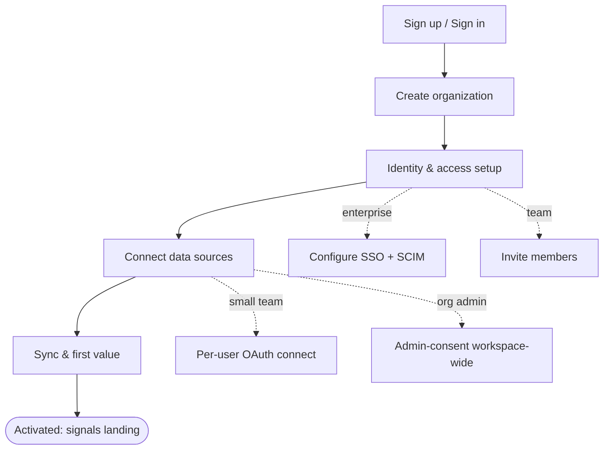

# Tenant Onboarding UI/UX — Design Spec

> **Status:** Draft · **Date:** 2026-06-22 · **Branch:** `feat/tenant-onboarding-ui`
> **Authors:** generated from (a) a deep-research pass over B2B onboarding best practices
> — 24 claims that survived 3-vote adversarial verification against primary sources —
> and (b) a codebase reconnaissance of Fyralis's current tenant/auth/ingestion/UI surface.
> Inferred or not-yet-built items are flagged. Citations `[R#]` map to the
> [References](#11-references) table.

---

## 1. Executive summary

First-time tenant onboarding for Fyralis is a **hybrid** flow: self-serve signup that
flows directly into a **guided, progressively-disclosed setup wizard**, with optional
human assist for enterprise deals. It must be **enterprise-grade from day one** (SSO via
SAML 2.0 / OIDC, SCIM 2.0 provisioning, JIT, org/workspace creation, admin-vs-member
RBAC) and **org-aware** — supporting both a small team's fast per-user source connect
*and* an org admin connecting workspace-wide sources via admin consent, then inviting
members.

The defining reality from the codebase: **the ingestion/connect/data-plane machinery is
largely built and reusable** (26 source connectors, an onboarding orchestrator, an
encrypted secret store, a webhook tenant-resolver, and already-emitted progress events),
while **the entire human-facing platform is greenfield** — there is *no end-user login of
any kind today*, no tenant-provisioning API, no source-catalog API, and no UI in core.
The single largest and most foundational build is therefore **authentication & identity**,
which gates everything org-aware.

The design principle that should govern the whole flow: **optimize for activation, not
signup.** B2B SaaS activation averages ~37.5% and roughly two-thirds of new users never
activate `[R21]`, so the onboarding's job is to drive each tenant to a single concrete
"first value" action — for Fyralis, **first real signals landing from a connected
source** — using a 3–5 item progress checklist `[R22]` and a goal-oriented flow that ends
with the user *having done the thing*, not having watched a demo `[R23]`.

---

## 2. Scope & locked decisions

| Decision | Choice | Consequence for this spec |
|---|---|---|
| Onboarding model | **Hybrid** — self-serve signup + guided wizard + optional assist | Wizard with skip/resume; activation checklist; assist hooks |
| Authentication | **Enterprise-grade from day one** — SAML 2.0 + OIDC SSO, SCIM 2.0, JIT, org/RBAC | Largest greenfield build; recommend buy-or-embed (see §5) |
| Tenant profile | **Org-aware both** — per-user self-connect *and* admin-consent workspace-wide | Connector flows carry per-user vs org grain; member provisioning |

**In scope:** the onboarding UX flow, the auth/identity layer, the source-connection
experience, the build architecture, the new backend endpoints and data model, and a phased
delivery plan.

**Out of scope (here):** the post-onboarding product surfaces (Today/Model/Forecasts/Ledger),
billing/plans, and the reasoning pipeline. Referenced only where onboarding touches them.

---

## 3. Current-state grounding (what exists vs. greenfield)

Verified against the codebase. This is what the onboarding UI builds *on* and what it must
build *new*.

### 3.1 Reusable assets (already built)

- **Multi-tenancy substrate.** A tenant is a UUID row in `tenants`
  (`db/migrations/0023_demo_infrastructure.sql`). Isolation is Postgres **RLS** keyed to
  `app.current_tenant` (`db/migrations/0036_rls_permissive_default.sql`), bound per
  transaction via `lib/shared/tenant_context.py` (`tenant_transaction()`, `bind_tenant()`).
  Per-tenant feature flags live in `tenant_flags` (`db/migrations/0061_tenant_flags.sql`),
  notably `ingestion.kafka_path_enabled`.
- **Source-connection machinery (the strongest asset).** **26 sources** enumerated in
  `services/ingest/ingestion/raw_tier/envelope.py:SourceLiteral`, across **four install
  archetypes** (see §6.2). Encrypted credentials via
  `lib/shared/secrets/store.py:FernetSecretStore` (MultiFernet rotation, per-install
  `secret_ref`, tenant-scoped). Webhook ingress `POST /webhooks/{provider}` →
  `services/app/webhooks/tenant_resolver.py:TenantResolver` (~19 provider-native ID
  extractors + LRU cache) → signature verify (`signatures.py:VERIFIERS`).
  Registries: `provider_installations` (`0050`), per-source `{source}_installations`,
  `installation_audit_log` (`0052`), `onboarding_triggers` outbox (`0058`).
- **Onboarding → ingestion data plane (fully wired).**
  `onboarding_run_created` → `TenantOnboardingOrchestrator`
  (`services/ingest/ingestion/workflows/tenant_onboarding.py`) → per-source
  `source_onboarding_runs` (`0066`) → `SourceOnboarding` → `onboarding_shards` (`0056`) →
  `ShardFetch` → S3 + `ingestion.raw` → normalizer → `ObservationWriter`
  (`services/ingest/ingestion/writers/observation_writer.py`) → `observations` →
  `Reconciler`. The orchestrator flips `kafka_path_enabled` on at onboarding start.
- **Progress signals already emitted (but unconsumed).** `progress/events.py` publishes
  `TenantOnboardingStarted`, `SourceOnboardingStarted`, `ShardFetched`,
  `SourceOnboardingComplete`, `TenantOnboardingComplete` (+ behind-schedule signals) to the
  `onboarding.progress` Kafka topic via `progress/publisher.py`. **No UI consumer exists.**
- **Backend session primitives + RBAC engine.** `services/app/gateway/auth.py`
  (`create_session(actor_id, tenant_id)`, `validate_token()`), `actor_sessions` (`0003`),
  `BearerAuthMiddleware`. A 7-role engine exists — `actor_roles`
  (`db/migrations/0014_access_control.sql`): `{owner, contributor, viewer, admin, finance,
  legal, leadership}` over tenant-wide and entity scopes, API in
  `services/platform/access_control/roles.py`.
- **A mount seam for new routes.** `services/app/gateway/extensions.py:mount_extension_routers`
  (entry-point group `company_os.gateway_extensions`) and `route_mounts.py`. A realtime WS
  `/stream` (Postgres `LISTEN`) already exists.

### 3.2 Greenfield (must be built) — ranked

1. **Human authentication & identity (highest priority, foundational).** There is **no
   end-user login at all** — only a backend `actor_id`-keyed token mint
   (`POST /auth/session`, bootstrap-secret-guarded). No `/login`, `/signup`,
   `/forgot-password`; **no password store; no SSO/OIDC/SAML for humans** (every OAuth in
   the repo is *source-connection* OAuth, not user login); **no SCIM/directory sync**; no
   invitation flow; no `email:tenant` uniqueness; no auth-event audit.
2. **Tenant/company provisioning + first-run.** `tenants` is demo-origin with ad-hoc
   script creation; no `POST /tenants`, no org profile, no owner-seeding API.
3. **Member invitation + RBAC management surface.** The role *engine* exists; there is no
   invite flow and no user-facing roles API.
4. **Source catalog + unified connect API.** No `GET /integrations/sources`; HTTP install
   routes exist for only **4 of 26** providers (slack/discord/github/notion in
   `services/ingest/integrations/router.py`, plus a bespoke
   `services/app/gateway/whatsapp_router.py`). The other ~22 onboard via script-only
   `onboarding.py:finalize_install()`.
5. **Onboarding progress + health read/stream API.** The events exist; the REST/WS/SSE
   surface and any meaningful ETA do not (`ETA_MINUTES_PER_SOURCE = 5` is a coarse
   constant).
6. **Connection lifecycle.** No centralized uninstall, re-sync trigger, token-rotation
   visibility, or flag console — all DB-mutation-only today.
7. **The onboarding UI app itself.** None in core; the only SPA is a demo overlay in the
   separate `../fyraliscore-demo` repo wired to one hardcoded (Pelago) tenant.

> **Implication:** ~70% of onboarding effort is the human-identity + UI layer, not the
> ingestion plumbing. Sequence accordingly (§9).

---

## 4. Target onboarding flow (UX)

A single, resumable wizard with a persistent progress rail. Each phase maps to an
activation milestone. The flow is **goal-oriented** — every phase exists to move the tenant
toward *first signals landing* `[R23]`.

### Phase 0 — Sign up / Sign in
- Email + password and/or social (Google/Microsoft) for the **first** user, followed by
  **email verification** (magic link / OTP) before the account is usable. Enterprise SSO is
  configured *after* the org exists (chicken-and-egg: you need an org to attach an SSO
  connection to).
- This first user is a **pending owner** (see §5.0) — owner powers (inviting the company,
  connecting org-wide sources) stay locked until the domain is verified in Phase 1.
- **JIT** path: once SSO is configured, subsequent users from the verified domain are
  provisioned automatically on first enterprise login `[R2]`.

### Phase 1 — Create organization (tenant bootstrap)
- Capture org name, primary domain, and seed the creator as a **pending `owner`**.
- **Domain verification** (DNS TXT or `admin@`/`postmaster@` email) **confirms ownership**
  and unlocks owner powers; it also gates JIT and domain-based auto-join (see §5.0). If the
  domain is **already claimed**, the signup instead joins as a **member pending admin
  approval** (org-squat defense).
- **Designate the CEO:** the verified owner/admin maps which user is "the CEO" (or it's taken
  from an IdP `title` claim once SSO is on), binding the seeded CEO actor to a real user — the
  installer need not be the CEO.
- Backed by a new `POST /tenants` provisioning endpoint (§7) that seeds the `tenants` row +
  owner actor (pending) + role grant in one transaction, flipping the owner to **verified** on
  domain proof.

### Phase 2 — Identity & access setup
- **Enterprise SSO setup UX**: pick IdP, exchange metadata (upload XML / paste URL /
  entity ID), run a **"Test connection"** before activating — the single most important
  affordance in SSO setup, since misconfig is the top failure mode.
- **SCIM setup**: generate a SCIM base URL + bearer token for the IdP to push
  users/groups; show last-sync status `[R4]`.
- **Member invitations**: org-scoped admin-led invites are the recommended B2B mechanism
  over ad-hoc account creation `[R1]`; map invited members to existing roles.
- This is optional-but-encouraged at onboarding time; a small team can **skip** SSO and
  invite-by-email, then upgrade later (the flow must support that upgrade path).

### Phase 3 — Connect data sources (the core activation driver)
- A **source catalog** (grid/search) of the 26 connectors, each showing archetype, the
  scopes it will request, and connection state.
- Two consent grains, surfaced explicitly (§6.3):
  - **Per-user self-connect** — fast, OAuth popup, connects the individual's account.
  - **Org admin / workspace-wide** — admin-consent install covering the whole workspace.
- Least-privilege messaging: state exactly what each scope grants and why, in plain
  language, at the moment of consent.
- Encourage connecting **≥1 source** to reach activation; don't require all.

### Phase 4 — Sync & first value (the aha-moment)
- After connect, backfill fires automatically (existing `onboarding_triggers` →
  orchestrator). The UI shows **live sync progress per source** and, crucially, a
  **"first signals landed"** moment — the activation event.
- Empty states must be *active*: "Connecting GitHub… first issues will appear here" rather
  than a blank panel.

### Cross-cutting UX rules
- **Progress rail / checklist** with 3–5 items tied to activation milestones, doc links,
  and a clear skip/exit — partial progress motivates completion more than a blank slate
  `[R22]`.
- **Resumable**: persist wizard state server-side; a user can leave and return to the exact
  step. Never lose connect progress.
- **Single activation goal** per phase; the terminal state is "signals are flowing," not a
  feature tour `[R23]`.
- **Responsive**: setup is desktop-first (admins configure SSO on laptops) but status/health
  should be legible on mobile.

---

## 5. Authentication & identity spec (enterprise from day one)

This is the foundational greenfield layer. The verified research strongly favors **not
hand-rolling SAML**.

### 5.0 Identity & authority assurance (who is the owner — and the CEO?)

**"CEO" is an authority/role claim, not an identity claim.** The system never tries to
*prove someone is the CEO*; it verifies **control** and trusts the org's **own authority**.
Keep two questions separate, assured by different layers:

- **Identity proofing** — does this person control this email / are they who the corporate
  directory says? → email verification, then enterprise SSO/IdP.
- **Authority** — may they act as org owner, and who is the exec? → **domain control** and
  IdP/admin assertion, never self-declaration.

**Assurance ladder** (each layer adds what the one below cannot):

| Layer | Proves | Limit |
|---|---|---|
| Email verification (magic link / OTP) | Controls that inbox | Says nothing about role |
| **Domain verification** (DNS TXT or `admin@`/`postmaster@`) | Controls the org domain → legitimate org authority | Org ownership, not "is the CEO" |
| Enterprise SSO / IdP (Ory Polis, Q1) | Customer's own directory vouches for the person | Needs SSO configured |
| IdP `title`/group claim + SCIM | Authoritative role/title from corporate HR/IT | Not all orgs populate it |
| Admin designation | A verified admin maps "this user = CEO actor" (auditable) | Trusts the (domain-verified) admin |
| Human / white-glove (sales-assist) | CS confirms the exec out-of-band | Manual; reserve for high-value |

**The anchor is domain verification, not email** — whoever controls `acme.com` DNS is, by
construction, an IT/admin authority (the model Google Workspace, Slack Enterprise, Vanta, and
WorkOS all use).

**Two model changes this forces:**

1. **Ownership is conditional.** The first `@domain` signup is a **pending owner** — it
   cannot invite the company or connect org-wide sources until the **domain is verified**
   (Phase 1). Owner powers unlock on domain proof, not on signup.
2. **Installer ≠ CEO.** An EA / IT admin / chief-of-staff often onboards *on behalf of* the
   CEO. Separate the two actors:
   - **Tenant owner/admin** = whoever proves domain control (email + domain + ideally SSO +
     MFA).
   - **"The CEO"** = a distinct **designated actor**, assigned by the verified admin and/or
     taken from an IdP `title` claim, whose own identity is SSO-assured on first login (JIT).
     This binds the seeded CEO actor (`actors.human_internal`) to a real authenticated user
     instead of a self-typed email — load-bearing because Fyralis's product surfaces are
     CEO-facing.

**Org-squatting defense** (the failure mode of "first signup owns the org"):

- Domain verification gates ownership (above).
- If a domain is already claimed, new same-domain signups join as **members pending admin
  approval**, not a competing org.
- Notify existing admins on same-domain signups; a domain-verified admin can reclaim/override.
- **MFA / step-up** on the owner account and on sensitive actions (org-wide connect, SSO
  change).

### 5.1 Build-vs-buy recommendation
- **Recommended: adopt an SSO/SCIM abstraction rather than implement SAML directly.**
  - **Ory Polis** (formerly BoxyHQ SAML Jackson) is **self-hostable**, implements SAML 2.0
    and OIDC by **abstracting SSO as a standard OAuth 2.0 flow** — so the app only needs
    OAuth/OIDC knowledge, not SAML expertise `[R3]` — and supports **SCIM 2.0** directory
    sync for automatic user/group provisioning + de-provisioning `[R4]`. This fits a
    self-hostable, secret-sovereign posture (consistent with Fyralis running its own secret
    store).
  - **WorkOS / Auth0** are the hosted alternatives. Auth0 explicitly recommends its
    **Organizations** feature as the foundational primitive for B2B multi-tenant login
    `[R0]`, with org-scoped invitations as the recommended provisioning mechanism `[R1]`.
    If hosted is acceptable, this is the fastest path.
- **Decision (2026-06-22): Ory Polis (self-host).** Chosen for fit with Fyralis's
  self-hosted, secret-sovereign posture and to keep customers' directory data in-house; the
  team accepts operating the identity service. (WorkOS / Auth0 Organizations remain the
  hosted fallback if operational burden proves too high.)

### 5.2 Identity model (new tables, see §8)
- **Org = tenant** (reuse `tenants`; add org profile columns or a sidecar table).
- **User** is a new first-class entity for *humans who log in* — distinct from the existing
  `actors` (which model signal participants, including non-login external people and AI
  agents). A `user ↔ actor` link lets a logged-in human map to their actor identity.
- **`email:tenant` uniqueness** constraint (absent today).
- **SSO connection** per org (IdP type, metadata, status).
- **SCIM endpoint** per org (token, last-sync).
- **Invitation** (email, role, token, status, expiry).

### 5.3 JIT provisioning
- With SSO configured, a user's profile is created automatically on **first enterprise
  login** — no pre-created account `[R2]`. Map IdP groups → Fyralis roles on the way in.

### 5.4 RBAC
- Reuse the existing 7-role engine (`actor_roles`,
  `services/platform/access_control/roles.py`). Define the onboarding-relevant matrix:
  - `owner`/`admin` → can create the org, configure SSO/SCIM, connect workspace-wide
    sources, invite/provision members, manage connections.
  - `contributor`/`viewer` → can self-connect their own sources; read product surfaces.
- Build the missing **user-facing roles API** (`GET /me/roles`, admin assignment).

### 5.5 Session & security
- Issue Fyralis sessions via the existing `create_session()` after a successful
  login/SSO/JIT, keeping `BearerAuthMiddleware` as the enforcement point.
- Add an **auth-event audit** trail (logins, SSO config changes, invites, role changes).

---

## 6. Source-connection spec

The richest reuse area. The UI must wrap existing machinery and add a catalog + the
~22 missing install routes.

### 6.1 Source catalog API
- New `GET /integrations/sources` returning, per source: `key`, display name, archetype,
  required scopes (+ human-readable consent text), supported grains (per-user / org-wide),
  and the tenant's current connection state/health. Source of truth: `SourceLiteral` +
  per-source metadata.

### 6.2 The four install archetypes (drive UI variants)
| Archetype | Sources | UI affordance |
|---|---|---|
| OAuth 2.0, short-lived token | slack, github, discord, gmail, notion, gcal, gdrive, jira, miro, figma, linkedin | OAuth popup/redirect → callback |
| OAuth + rotation/re-mint | quickbooks, ramp, gusto, carta | OAuth popup + background refresh (`oauth_refresh.py`) |
| API-token / service-account / webhook | mercury, brex, deel, fireflies, signal, aws, grafana, hibob, ashby | **API-key entry form** (new) + webhook setup helper |
| Gateway / MTProto / WSS | telegram, whatsapp | Guided credential capture / device login (new) |

> Only the OAuth-short-lived four have HTTP install routes today; the other three
> archetypes are **script-only** and need install endpoints + UI.

### 6.3 Per-user vs org-wide consent
- Model each authorized integration as a **per-user connection** that stores one user's
  credentials for one external API and is kept valid over time, tagged with
  `end_user_id` / `end_user_email` / `organization_id` to reconcile to the right
  user/org `[R9]` — this is exactly Fyralis's per-user-vs-org grain. Fyralis's
  `provider_installations` + per-source tables already carry tenant scope; add the user
  grain where per-user connect applies.
- For org-wide, use the provider's **admin-consent** install so one grant covers the
  workspace.

#### Consent-grain classification (Q5 audit, 2026-06-22)

A read-only sweep of `services/ingest/integrations/*` classified all 26 connectors. **The
default is org-wide**: one admin connects on the org's behalf. Only a handful require each
member to self-connect.

| Grain | Sources | What the connect step does |
|---|---|---|
| **Org / workspace-wide** (one admin install = full coverage) | github (App install), discord (bot/guild), gmail · google_calendar · google_drive (domain-wide delegation), notion (workspace bot), miro · figma · linkedin (org/team token), whatsapp (WABA phone-number token), and **all finance/HR/infra**: mercury, quickbooks, brex, ramp, gusto, deel, carta, hibob, ashby, grafana, aws, fireflies | Admin authorizes once; the credential (bot/app/service-account/company token) covers every user, repo, channel, or account under that org/realm/`installation_id`. |
| **Hybrid** | **slack** | Bot token (`xoxb`, team-wide) covers channels org-wide; a separate per-user token (`xoxp`, `slack_dm_installations.user_id`) is needed *per member* for human↔human DMs. |
| **Per-user** (each member self-connects their own account) | **telegram** (MTProto user session), **signal** (linked-device session) | One install = one person's account/threads (`telegram_installations.account_label`, signal `account_label`). An admin cannot connect on a member's behalf. |
| **Account credential** (one admin/service account's token; org-wide *reach*, no per-user fan-out) | **jira** (Atlassian API token) | Connect as a single (ideally admin/service) account; its project permissions determine reach. No per-member consent. |

**Representing the coverage gap to the admin:**
- **Org-wide / account-credential** sources: one successful install = complete coverage →
  show simply "Connected (org-wide)".
- **Per-user sources + Slack DMs**: coverage = *which members have self-connected*. The UI
  must show a **roster** ("`N` of `M` members connected") and surface the gap (unconnected
  members) with an invite/nudge action — the admin can request, not grant, these.

**Schema reality (audited):** `provider_installations` (`0050`) is **org-grain only** — no
`user_id`/`actor_id` — which is correct for the 22 org-wide + jira. The **only existing
per-user precedent** is `slack_dm_installations` (`0076`: `(tenant_id, team_id, user_id)` +
`user_token_secret_ref`). `telegram_installations` (`0094`) is per-account but keyed by a
display-only `account_label` with **no `actor_id` link**. So the per-user grain needs a
user/actor foreign key — exactly what the new `user_source_connections` table (§8) provides;
apply it to telegram, signal, and the Slack-DM path, following the `slack_dm_installations`
pattern.

### 6.4 Embeddable connector-auth widget (strongly recommended pattern)
The verified research converges on a **server-driven, embeddable widget** as the standard
way to onboard connectors. Two reference implementations, same shape:

- **Nango Connect UI** — a pre-built, embeddable, brandable UI that handles authorization,
  credential storage, refresh, and validation `[R7][R12]`, via a four-step flow: backend
  mints a **short-lived connect session token** (server-side, with the secret key, never in
  the browser) → frontend SDK (`@nangohq/frontend`, init with the session token) opens the
  Connect UI → user authorizes → backend receives a **webhook with the connection ID**
  `[R8][R10][R11][R13]`. Credentials are encrypted and never pass through the host app's
  codebase `[R14]`.
- **Merge Link** — a drop-in embeddable component (React/Vue/vanilla SDKs) `[R18]` using a
  **three-token exchange**: backend-created `link_token` initializes the session → frontend
  `onSuccess` returns a short-lived `public_token` → backend exchanges it for a permanent
  `account_token`, which is **stored server-side and never held client-side** `[R19][R20]`.

**Decision (2026-06-22): build the in-house equivalent.** Mirror this **server-driven
session-token pattern** for the in-house catalog — the long-lived credential stays in
`FernetSecretStore`, only a short-lived token reaches the browser. The 26 connectors already
exist, so the widget is thin and no vendor is needed. Caveat to keep in view: API auth is
notoriously deep — Nango spent **three years** on auth for 800+ APIs `[R5]` — so revisit
embedding Nango/Merge only if Fyralis later needs to add many new sources quickly.

### 6.5 Connection health & re-auth
- Surface per-connection status (healthy / needs-reauth / syncing / error) — there is no
  health endpoint today; build one over `provider_installations`,
  `source_onboarding_runs.failure_reason`, and `onboarding_shards.last_error`.
- **Token refresh is a top failure source**: APIs may revoke the current access token the
  moment a refresh starts (race conditions), and refresh-token rotation drifts (some APIs
  issue a new refresh token each time, some don't) `[R6]`. The UI needs an explicit
  **"Reconnect"** affordance and the backend must store the latest rotated refresh token.

### 6.6 Webhooks
- For webhook-bearing sources, provide a setup helper showing the
  `POST /webhooks/{provider}` URL + secret and a test/verify step (today only partial
  `/debug/*` tooling exists). `TenantResolver` already maps provider-native IDs → tenant.

---

## 7. How to build it (architecture)

### 7.1 Frontend
- **Stack:** reuse the existing **React + Vite** pattern from `../fyraliscore-demo/ui`.
  **Decision (2026-06-22):** a **dedicated onboarding/admin SPA** served by the gateway,
  mounted via the existing **`extensions.py:mount_extension_routers`** seam, sharing the
  bearer-session auth — not folded into the single-tenant demo harness.
- **Wizard as a state machine.** Model the flow with an explicit FSM (e.g. XState):
  states = `signup → org → identity → connect → sync → activated`, with `skip`/`resume`
  transitions. **Server-driven step state** (the backend owns "what step is this tenant
  on") so the wizard is resumable across devices and the funnel is observable.
- **Component patterns:** a persistent progress rail; a source-catalog grid with per-card
  connect state; modal connector-auth (popup/redirect); active empty states; a global
  partial-failure banner (one failed source must not block the rest).

### 7.2 Backend
- New routers mounted alongside `core_router`, `finance_router`, etc.:
  - **Auth/identity** router (login, SSO callback, SCIM, invites, `/me`).
  - **Tenants** router (`POST /tenants`, org profile, domain verification).
  - **Integrations** router (catalog, per-source install/callback for all 26, connect
    session-token mint, connection list/health, reconnect, uninstall, re-sync).
  - **Onboarding progress** router (REST snapshot + WS/SSE stream consuming
    `onboarding.progress`).
- **Reuse** `FernetSecretStore`, `TenantResolver`, `TenantOnboardingOrchestrator`,
  `roles.py`, `tenant_context.py`.

### 7.3 Onboarding progress surface
- Add a consumer of the `onboarding.progress` Kafka topic that fans events to the browser
  over the existing `/stream` WS (or a dedicated SSE endpoint), plus a REST snapshot over
  `source_onboarding_runs` / `onboarding_shards` / `observations COUNT/MIN/MAX(occurred_at)`.
- Add a **"first-data-landed"** event (currently only shard/source-completion events fire)
  to power the activation moment, and replace the coarse `ETA_MINUTES_PER_SOURCE = 5` with a
  throughput-derived estimate.

### 7.4 Security (non-negotiable, all primary-sourced)
- **Authorization Code flow + PKCE for all public/SPA clients** — public clients **MUST**
  use PKCE and the authorization server **MUST** support it `[R15]`.
- **Exact-string redirect-URI matching** against pre-registered URIs (no prefix/wildcard;
  the only exception is localhost ports for native apps) `[R16]`.
- **No implicit grant; never ROPC** — use the authorization code flow `[R17]`.
- **Long-lived credentials server-side only.** The permanent token (Fyralis's `secret_ref`
  in `FernetSecretStore`) is never held client-side; only short-lived session/public tokens
  reach the browser `[R11][R13][R20]`.
- Use the `state` parameter (Fyralis already embeds a tenant-bound, HMAC-signed OAuth state
  token) and validate it on callback.

### 7.5 Observability (funnel)
- Because step state is server-driven, instrument the onboarding **funnel** (signup → org →
  identity → first-connect → first-data) as first-class metrics. Activation — not signup —
  is the headline metric `[R21]`. Wire into the existing Prometheus/Grafana stack.

### 7.6 Error / partial-failure handling
- A failed source connect, a failed token refresh, or an SSO misconfig must degrade
  gracefully and locally (clear, recoverable error on that card/step), never block the
  wizard. Provide retry/reconnect everywhere a credential or external call can fail.

---

## 8. Data-model additions (new migrations)

> Numbering: next free is **`0155`+** (main currently tops at `0154`). All tenant-scoped
> tables get RLS policies consistent with `0036`.

| Table | Purpose |
|---|---|
| `users` (+ `user_actor_links`) | Humans who log in; link to `actors` (incl. the **designated CEO actor**); `email:tenant` unique |
| `org_profiles` (or columns on `tenants`) | Company name, domain(s), domain-verification state, **owner status (pending/verified)**, designated CEO |
| `domain_join_requests` | Same-domain signups awaiting admin approval (org-squat defense, §5.0) |
| `sso_connections` | Per-org IdP type, metadata, status, last-tested |
| `scim_endpoints` | Per-org SCIM base URL/token, last-sync |
| `invitations` | Email, role, token, status, expiry |
| `auth_events` | Audit: logins, SSO changes, invites, role changes |
| `user_source_connections` | Per-user connection grain + tags (`end_user_id`, `organization_id`) `[R9]` |
| `onboarding_wizard_state` | Server-side wizard step/resume state per tenant+user |

(Credentials themselves continue to live in `FernetSecretStore` via `secret_ref`, not in
these tables.)

---

## 9. Phased delivery plan

Sequenced by dependency (auth gates everything org-aware) and by fastest path to a
demonstrable activation loop.

- **M0 — Tenant provisioning + minimal auth.** `POST /tenants`, owner seeding, email+social
  login, sessions, `email:tenant` uniqueness. *(Unblocks everything.)*
- **M1 — Source catalog + OAuth connect (4 built sources) + progress surface.** Catalog API,
  reuse the 4 existing install routes, server-driven session-token connect, consume
  `onboarding.progress` over WS, "first-data-landed" event. **First end-to-end activation
  loop.**
- **M2 — Enterprise identity.** SSO (SAML/OIDC via Ory Polis or WorkOS), SCIM, JIT, domain
  verification, invitations, user-facing roles API.
- **M3 — Full connector coverage.** Install routes + UI for the remaining ~22 sources:
  API-key forms (9 token sources) and gateway credential capture (telegram/whatsapp);
  consider embedding Nango/Merge for the long tail.
- **M4 — Connection lifecycle + polish.** Health dashboard, reconnect, uninstall, re-sync,
  flag console, funnel analytics, accessibility pass.

---

## 10. Decisions & open questions

**Resolved 2026-06-22:**

- **Q1 — Identity → Ory Polis (self-host).** Self-hostable SAML 2.0 / OIDC + SCIM 2.0,
  abstracting SSO as an OAuth flow `[R3][R4]`. Chosen for fit with Fyralis's fully
  self-hosted, secret-sovereign posture (own Kafka / secret store) and to keep enterprise
  customers' directory data in-house. Accepted trade-off: Fyralis operates the identity
  service.
- **Q2 — Connector auth → build in-house.** The 26 connectors already exist; the connect
  widget is a thin **server-driven session-token** flow over the existing
  `FernetSecretStore` — no new vendor, credentials stay first-party. Revisit Nango/Merge
  *only* if rapidly expanding well beyond the current 26 sources `[R5]`.
- **Q3 — User model → separate `users` table linked to `actors`.** Decouples login identity
  from the signal-participant / AI-agent `actors` model; enables `email:tenant` uniqueness
  and clean joins (see §8).
- **Q4 — UI home → dedicated onboarding/admin SPA** (React + Vite) mounted via
  `services/app/gateway/extensions.py:mount_extension_routers`, sharing bearer-session auth.

- **Q5 — Org-wide consent depth → audited (see §6.3).** 22 of 26 connectors are
  **org/workspace-wide** (one admin install = full coverage); **slack** is hybrid (org-wide
  bot + per-user DM token); **telegram** and **signal** are **per-user** (each member
  self-connects); **jira** is an account credential. Coverage-gap UX: org-wide sources show
  "Connected (org-wide)"; per-user sources show a member roster (`N of M` connected) with an
  invite/nudge. Schema: `provider_installations` is org-grain (fine for the 22 + jira); the
  per-user grain (telegram/signal/Slack-DM) needs a user/actor FK via `user_source_connections`
  (§8), following the existing `slack_dm_installations` precedent.

**Still open:** none — Q1–Q5 resolved. Remaining work is implementation (§9).

---

## 11. References

Findings below each survived **3-vote adversarial verification** (2/3 refutes required to
kill) against the cited primary source, except where noted. Confidence: **high** = primary
source + unanimous vote; **medium** = secondary source or split vote. Full quotes +
verifier evidence: [deep-research-evidence](../research/tenant-onboarding/deep-research-evidence-2026-06-22.md).

| # | Finding | Source | Conf. |
|---|---|---|---|
| R0 | Auth0 recommends **Organizations** as the foundational B2B multi-tenant login primitive | auth0.com/docs · B2B provisioning | high (3-0) |
| R1 | Recommended B2B user-invitation mechanism is org-scoped invites, not ad-hoc account creation | auth0.com/docs · B2B provisioning | high (3-0) |
| R2 | With enterprise SSO, profiles are **JIT-provisioned** on first login (no pre-created account) | auth0.com/docs · B2B provisioning | high (3-0) |
| R3 | **Ory Polis** (ex-BoxyHQ) is self-hostable SSO implementing SAML/OIDC as an OAuth 2.0 flow (no SAML expertise needed) | github.com/ory/polis | high (3-0) |
| R4 | Ory Polis supports **SCIM 2.0** directory sync (auto user/group provisioning + de-provisioning) | github.com/ory/polis | high (3-0) |
| R5 | API auth is deceptively deep — Nango spent **3 years** on auth for 800+ APIs due to per-API quirks | nango.dev/blog/api-auth-is-deep | high (3-0) |
| R6 | **Token refresh** is a major failure source: revoke-on-refresh races + refresh-token rotation drift | nango.dev/blog/api-auth-is-deep | high (3-0) |
| R7 | Nango provides an **embeddable, pre-built Connect UI** handling authz, storage, refresh, validation, branded | docs.nango.dev/guides/auth | high (3-0) |
| R8 | Connector auth = **4-step server-driven** flow (backend session token → frontend Connect UI → authorize → webhook w/ connection ID) | docs.nango.dev/guides/auth | high (3-0) |
| R9 | Model each integration as a **per-user Connection** tagged `end_user_id`/`organization_id` (per-user vs org grain) | docs.nango.dev/guides/auth | high (3-0) |
| R10 | `@nangohq/frontend` initialized with a **connect session token** (not the secret key); `nango.auth()` opens a modal | docs.nango.dev · frontend SDK | high (3-0) |
| R11 | Connect session token is minted **server-side** with the secret key; secret key never reaches the browser | docs.nango.dev · custom UI | high (3-0) |
| R12 | Nango Connect UI shows an integration **picker** or sends straight into a single integration's auth | nango.dev/docs/guides/auth | high (3-0) |
| R13 | Embedded connector auth secured by a **short-lived session token** minted server-side before each attempt | nango.dev/docs/guides/auth | high (3-0) |
| R14 | Nango stores credentials **encrypted** w/ auto-refresh; raw creds never pass through host app code | nango.dev/docs/guides/auth | high (3-0) |
| R15 | Public clients **MUST use PKCE**; authorization servers **MUST support** it (auth code flow) | IETF **RFC 9700** | high (3-0) |
| R16 | Authz servers **MUST** use **exact-string redirect-URI matching** (only localhost-port exception) | IETF **RFC 9700** | high (3-0) |
| R17 | **Implicit grant SHOULD NOT** be used; **ROPC MUST NOT**; use the authorization code flow | IETF **RFC 9700** | high (3-0) |
| R18 | **Merge Link** is a drop-in embeddable widget (React/Vue/vanilla SDKs) for pick → sign-in → authorize | docs.merge.dev/get-started/link | high (3-0) |
| R19 | Connector auth via **three-token exchange**: `link_token` → `public_token` (frontend) → `account_token` (backend) | docs.merge.dev/get-started/link | high (3-0) |
| R20 | Permanent **`account_token` stored server-side**, never client-side (multi-tenant secret-store pattern) | docs.merge.dev/get-started/link | high (3-0) |
| R21 | B2B SaaS **activation averages ~37.5%**; ~two-thirds never activate — activation is the central metric | Userpilot 2024 benchmark (via digitalapplied) | medium (2-1) |
| R22 | Progress visibility drives completion: a partial **checklist/progress bar** beats a blank state; **3–5 items** w/ doc links + skip | appcues.com · SaaS onboarding | high (3-0) |
| R23 | Onboarding should be **goal-oriented around one activation action**, ending in the user *doing* the thing, not a demo | appcues.com · SaaS onboarding | high (3-0) |

**Refuted (not used):** "98% of new users churn within two weeks without a value milestone"
— failed verification (vote 1-2).

**Caveats:** Several connector findings derive from a single vendor's docs (Nango/Merge),
appropriate for describing that vendor's own mechanism but each represents one
implementation of a shared pattern. R21's "two-thirds never activate" is an arithmetic
restatement of the 37.5% primary datum; "activation" itself lacks a standard cross-company
definition. Vendor product features (Auth0 Organizations, Ory Polis, Nango, Merge) are
current as of 2026 but evolve — re-verify at implementation time.

---

*Provenance: external best-practices from a deep-research workflow (5-angle fan-out → fetch
→ 3-vote adversarial verification → 24 surviving claims); current-state from a 5-agent
codebase reconnaissance verified against `feat/signal-source-synthetic-precheck`. See
[References](#11-references).*
